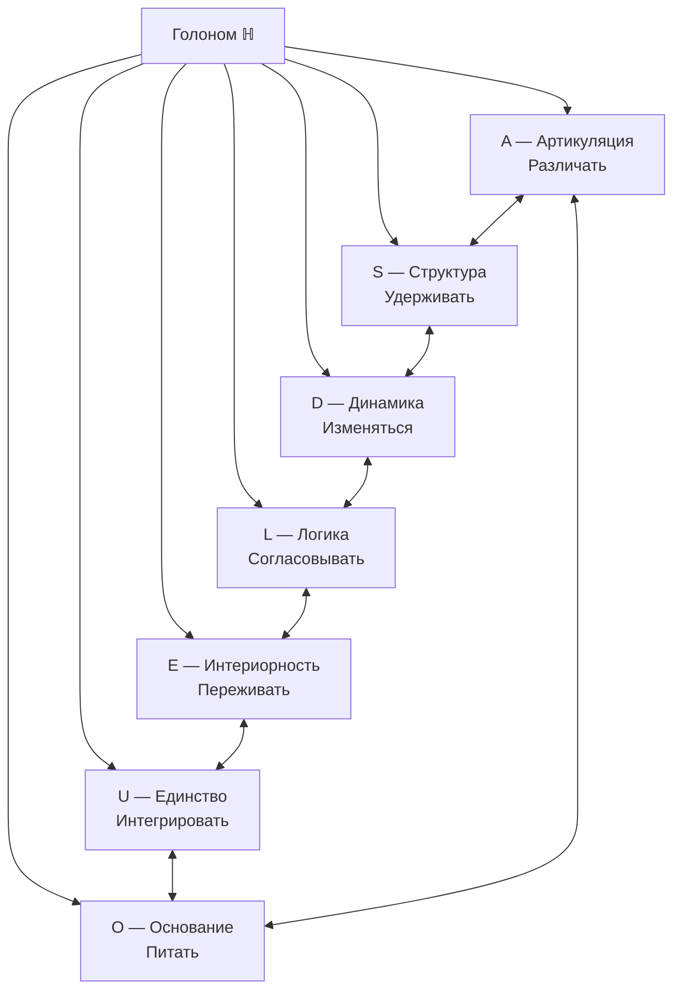
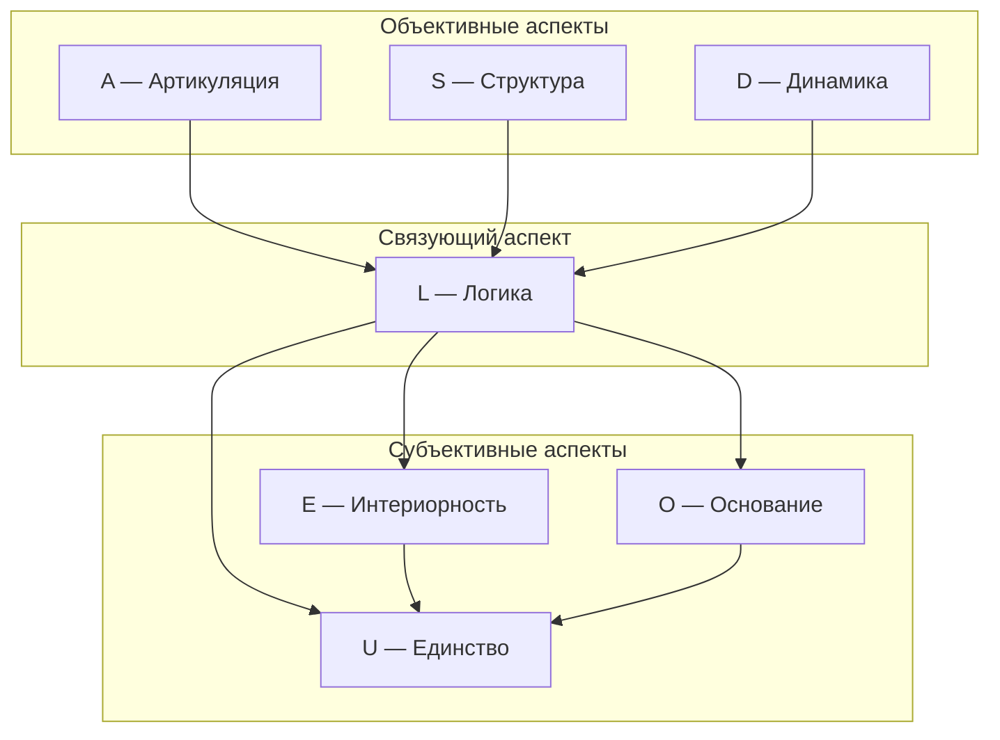

# Семь Измерений Голонома

Эта глава — путеводитель по семи измерениям Голонома: A (Артикуляция), S (Структура), D (Динамика), L (Логика), E (Интериорность), O (Основание) и U (Единство). Каждое из них — не «вещь» и не «свойство» в обычном смысле, а **неразделимый аспект** единой конфигурации $\Gamma$. Семь измерений — это семь способов «посмотреть» на одну и ту же реальность, как семь граней призмы, раскладывающей белый свет на спектр. К концу главы вы будете понимать, почему измерений именно семь, что делает каждое из них незаменимым и как они связаны друг с другом.

## Историческая предтеча

Идея о том, что реальность описывается небольшим числом фундаментальных «начал», стара, как философия.

**Пифагор** (VI в. до н.э.) учил, что «всё есть число»: в основе мира лежат числовые отношения. Пифагорейцы обнаружили, что музыкальные интервалы соответствуют простым дробям, и экстраполировали это на космос. В УГМ эта интуиция находит точное выражение: состояние любой системы — это матрица чисел ($\Gamma \in \mathbb{C}^{7 \times 7}$), и все свойства системы — от физических до феноменологических — определяются этими числами.

**Уильям Роуан Гамильтон** (1843) открыл **кватернионы** — четырёхмерные числа, расширяющие комплексные. Его друг **Джон Грейвс** в том же году открыл **октонионы** — восьмимерные числа. Артур Кэли (1845) независимо переоткрыл их. Октонионы обладают удивительным свойством: они — последняя из четырёх «нормированных алгебр с делением» (действительные числа → комплексные числа → кватернионы → октонионы). Мнимая часть октонионов имеет ровно **7 измерений**. В УГМ это не совпадение: семь измерений Голонома изоморфны семи мнимым единицам октонионов.

**Джино Фано** (1892) построил минимальную проективную плоскость — **плоскость Фано** PG(2,2). Она содержит ровно 7 точек и 7 линий, причём каждая линия проходит через 3 точки, а через каждую точку проходят 3 линии. Эта геометрическая структура оказывается ключевой для УГМ: она определяет, какие тройки измерений образуют «ассоциативные триплеты» — особо устойчивые группы, играющие роль в физике элементарных частиц и в структуре сознания.

## Обзор

:::info Онтологический статус
Измерения — **не отдельные сущности**, а неразделимые аспекты единой конфигурации $\Gamma$. Говорить "Голоном имеет 7 измерений" означает: "конфигурация $\Gamma$, удовлетворяющая [(AP)+(PH)+(QG)](../foundations/axiom-septicity), требует минимум 7 функционально независимых компонент".
:::

Число 7 — **аксиома** ([Аксиома 3](/docs/core/foundations/axiom-omega#аксиоматика)), характеризующая класс изучаемых систем. [Теорема S](../../proofs/minimality/theorem-minimality-7) объясняет, *почему этот класс интересен*: 7 — минимальная размерность для (AP)+(PH)+(QG).

Важно подчеркнуть: семь измерений — это не семь «частей» Голонома, подобно тому, как лёгкие, сердце и мозг — части тела. Это семь **неразделимых аспектов** одного целого, подобно тому, как длина, ширина и высота — три аспекта одного предмета. Нельзя «отрезать» от Голонома измерение Динамики, оставив всё остальное — как нельзя отрезать от куба его высоту, оставив длину и ширину. Если хотя бы одно измерение обнуляется, Голоном перестаёт существовать как целостная конфигурация.

### Почему именно 7

:::tip Интуитивное объяснение
Представьте, что вы проектируете минимальную живую систему — существо, которое одновременно может:
1. **Различать** (отличать одно от другого) → нужен инструмент **A**
2. **Сохранять форму** (иметь устойчивую структуру) → нужен инструмент **S**
3. **Изменяться** (эволюционировать во времени) → нужен инструмент **D**
4. **Быть самосогласованным** (части не противоречат друг другу) → нужен инструмент **L**
5. **Переживать** (иметь внутреннюю сторону) → нужен инструмент **E**
6. **Питаться** (иметь источник регенерации) → нужен инструмент **O**
7. **Быть целым** (интегрировать всё в единство) → нужен инструмент **U**

Уберите любой из семи — и система перестаёт быть «живой» в полном смысле. Без различения (A) — она не может взаимодействовать с миром. Без структуры (S) — она «расплывается». Без динамики (D) — она мертва. Без логики (L) — она противоречива и нестабильна. Без интериорности (E) — она «зомби» (функционирует, но ничего не переживает). Без основания (O) — у неё нет источника энергии и времени. Без единства (U) — она распадается на фрагменты.

Семь — это **минимальное** число таких инструментов. Теорема S доказывает это строго: при 6 или менее измерениях невозможно одновременно выполнить условия (AP)+(PH)+(QG).
:::

Замечательно, что число 7 возникает в трёх **независимых** контекстах:
1. **Функциональный** (Теорема S): 7 = минимум для (AP)+(PH)+(QG)
2. **Алгебраический** (октонионы): 7 = dim(Im($\mathbb{O}$)), единственная максимальная нормированная алгебра с делением
3. **Геометрический** (плоскость Фано): 7 = число точек минимальной проективной плоскости PG(2,2)

Совпадение этих трёх ответов — сильный аргумент в пользу того, что число 7 не случайно, а отражает глубокую математическую необходимость.

### Единственность базиса

:::tip Статус единственности ([доказательство](../../proofs/minimality/theorem-minimality-7#часть-vii-теорема-о-единственности-базиса))
Базис $\{A, S, D, L, E, O, U\}$ является **единственным** (с точностью до изоморфизма) 7-мерным разбиением, удовлетворяющим (AP)+(PH)+(QG):
- [Т] **A, S, D, L, U** — алгебраическая единственность (строго доказано)
- [Т] **E** — функциональная единственность: аксиоматическое обоснование (PH) + категориальное ($\kappa_0$ требует Hom(O,E)) + математическое (rank > 1). [Доказательство →](../../proofs/minimality/theorem-minimality-7#единственность-e)
- [Т] **O** — функциональная единственность: форма ℛ [Т] + $\kappa_0$ (End(O), Hom(O,E), Hom(O,U)) + PW (A5) + функциональная независимость. [Доказательство →](../../proofs/minimality/theorem-minimality-7#единственность-o)
:::

## Таблица измерений

| № | Измерение | Символ | Функция | Оператор | Физический аналог | Октонионный базис |
|---|-----------|--------|---------|----------|-------------------|-------------------|
| I | [Артикуляция](./dimension-a) | $A$ | Различать | Проектор $P$ | Измерение | $e_1$ |
| II | [Структура](./dimension-s) | $S$ | Удерживать | Гамильтониан $H$ | Энергия | $e_2$ |
| III | [Динамика](./dimension-d) | $D$ | Изменяться | Унитарный $U(\tau)$ | Эволюция | $e_3$ |
| IV | [Логика](./dimension-l) | $L$ | Согласовывать | Коммутатор $[\cdot, \cdot]$ | Каузальность | $e_4$ |
| V | [Интериорность](./dimension-e) | $E$ | Переживать | Плотность $\rho$ | Информация | $e_5$ |
| VI | [Основание](./dimension-o) | $O$ | Питать + Измерять время | Вакуум $\vert 0\rangle$, Часы | Квантовое поле + Часы | $e_7$ |
| VII | [Единство](./dimension-u) | $U$ | Интегрировать | След $\mathrm{Tr}$ | Нормировка | $e_6$ |

:::warning Физические аналоги — это эвристика
Столбец "Физический аналог" указывает на **концептуальные соответствия**, не строгие тождества. Например, измерение $D$ связано с унитарной эволюцией — но $D$ **не есть** время.
:::

:::tip Повседневные аналогии
Чтобы измерения стали ближе, представьте человека, идущего по лесу:

| Измерение | Аналогия | Что происходит |
|---|---|---|
| **A** (Артикуляция) | Глаза | Вы *различаете*: «это дерево, это камень, это тропинка» |
| **S** (Структура) | Скелет | Ваше тело *сохраняет форму* при каждом шаге |
| **D** (Динамика) | Ноги | Вы *идёте*, *изменяете* свою позицию |
| **L** (Логика) | Мозг-планировщик | Вы *согласовываете* маршрут: «тут скользко → обойти справа» |
| **E** (Интериорность) | Чувства | Вы *переживаете*: запах хвои, прохладу ветра, усталость |
| **O** (Основание) | Земля под ногами | *Опора*, из которой вы черпаете устойчивость |
| **U** (Единство) | «Я» | Всё это вместе — *одно* переживание: «я иду по лесу» |

Уберите любой элемент — и прогулка невозможна. Без глаз вы не различаете путь. Без скелета — не держите форму. Без ног — не двигаетесь. Без логики — идёте в овраг. Без чувств — не замечаете красоту. Без опоры — падаете. Без «я» — нет того, кто гуляет.
:::

### Комбинаторная единственность семантических ролей (T-177) [Т] {#комбинаторная-единственность}

:::tip Теорема T-177 [Т]: Комбинаторная единственность семантических ролей
После фиксации секторной декомпозиции $7 = 1_O \oplus \mathbf{3} \oplus \bar{\mathbf{3}}$ (T-48a [Т]) каждое из 7 измерений имеет **уникальный комбинаторный профиль** — набор Фано-линий и секторных связей, не изоморфный профилю ни одного другого измерения.
:::

**Доказательство.** Для каждого $e_k$ определим **функциональный отпечаток** $\mathcal{F}(e_k)$ — тройку (сектор, множество Фано-линий, секторный тип каждой линии):

| $e_k$ | Сектор | Фано-линии | O-связь (путь к синглету) |
|--------|--------|------------|--------------------------|
| $e_7$ (O) | **1** | $\{L,E,O\}, \{U,O,S\}, \{O,A,D\}$ | — (сам синглет) |
| $e_1$ (A) | **3** | $\{A,S,L\}, \{E,U,A\}, \{O,A,D\}$ | Прямая: линия $\{O,A,D\}$ |
| $e_2$ (S) | **3** | $\{A,S,L\}, \{S,D,E\}, \{U,O,S\}$ | Через $\bar{\mathbf{3}}$: линия $\{U,O,S\}$ |
| $e_3$ (D) | **3** | $\{S,D,E\}, \{D,L,U\}, \{O,A,D\}$ | Через **3**: линия $\{O,A,D\}$ |
| $e_4$ (L) | $\bar{\mathbf{3}}$ | $\{A,S,L\}, \{D,L,U\}, \{L,E,O\}$ | Через $\bar{\mathbf{3}}$: линия $\{L,E,O\}$ |
| $e_5$ (E) | $\bar{\mathbf{3}}$ | $\{S,D,E\}, \{L,E,O\}, \{E,U,A\}$ | Через $\bar{\mathbf{3}}$: линия $\{L,E,O\}$ |
| $e_6$ (U) | $\bar{\mathbf{3}}$ | $\{D,L,U\}, \{E,U,A\}, \{U,O,S\}$ | Через **3**: линия $\{U,O,S\}$ |

**Различимость внутри 3-сектора** $\{e_1, e_2, e_3\}$:
- $e_1$: **единственный** элемент **3** на Хиггсовой линии $\{E,U,A\}$ → мост между пространственным и электрослабым секторами
- $e_3$: на линии $\{O,A,D\}$ — связан с синглетом O через элемент **3** ($A$)
- $e_2$: на линии $\{U,O,S\}$ — связан с синглетом O через элемент $\bar{\mathbf{3}}$ ($U$)

**Различимость внутри $\bar{\mathbf{3}}$-сектора** $\{e_4, e_5, e_6\}$:
- $e_4$: **единственный** элемент $\bar{\mathbf{3}}$ **не** на Хиггсовой линии
- $e_5$: на Хиггсовой линии; O-связь через $\bar{\mathbf{3}}$-элемент ($L$) — линия $\{L,E,O\}$
- $e_6$: на Хиггсовой линии; O-связь через **3**-элемент ($S$) — линия $\{U,O,S\}$

Все 7 отпечатков попарно различны. $\blacksquare$

:::info Следствие: статус семантических назначений
Семантические роли A, S, D, L, E, O, U — **не произвольные мнемоники** [И]. Три роли полностью выведены из комбинаторики [Т], четыре — обосновано привязаны к Фано-путям [С]:

| Роль | Комбинаторное основание | Статус |
|------|------------------------|--------|
| **O** (Основание) | Единственный $SU(3)$-синглет; PW-часы; $\kappa_{\text{bootstrap}}$ | **[Т]** |
| **A** (Артикуляция) | Единственный из **3** на Хиггсовой линии — мост секторов | **[Т]** |
| **L** (Логика) | Единственный из $\bar{\mathbf{3}}$ НЕ на Хиггсовой линии | **[Т]** |
| **E** (Интериорность) | На Хиггсовой линии; $\mathrm{Coh}_E$ в формуле $\kappa(\Gamma)$; O-связь через $L$ | **[С]** |
| **U** (Единство) | На Хиггсовой линии; O-связь через $S$; $\Phi$-интеграция | **[С]** |
| **D** (Динамика) | Связан с $O$ через $A$ (линия $\{O,A,D\}$) — время через различение | **[С]** |
| **S** (Структура) | Связан с $O$ через $U$ (линия $\{U,O,S\}$) — форма через интеграцию | **[С]** |
:::

:::info Эпистемический статус семантической маркировки [О]
Математическая структура аксиом A1–A5 требует ровно 7 измерений (Теорема S [Т]), однако отождествление конкретных измерений с семантическими функциями (A=Артикуляция, S=Структура, D=Динамика, L=Логика, E=Интериорность, O=Основание, U=Единство) — **определение по соглашению [О]**. G₂-ригидность (T-42a [Т]) фиксирует представление с точностью до G₂-калибровки, но не фиксирует конкретную маркировку. Выбор обоснован: (a) семантической когерентностью с (AP)+(PH)+(QG)+(V), (b) внутренней согласованностью всей документации, (c) однозначностью определений пороговых мер.
:::

:::info Функциональный базис с операторными ролями
Каждое измерение определяется **оператором и ролью в аксиомах**:

| Измерение | Оператор | Аксиоматическая роль | Необходимость | Комбинаторный статус (T-177) |
|-----------|----------|---------------------|---------------|------------------------------|
| $e_1$ (A) | Проектор $P^2 = P$ | Различение подобъектов | (AP) | **[Т]** — единственный из **3** на Higgs-линии |
| $e_2$ (S) | $H = H^\dagger$ | Спектр инвариантов | (AP) | **[С]** — O-связь через $\bar{\mathbf{3}}$ |
| $e_3$ (D) | $U(\tau) = e^{-iH\tau}$ | Унитарная эволюция | (QG) | **[С]** — O-связь через **3** |
| $e_4$ (L) | $[\cdot, \cdot]$ | Замыкание алгебры | (AP) | **[Т]** — единственный из $\bar{\mathbf{3}}$ вне Higgs |
| $e_5$ (E) | $\rho_E = \mathrm{Tr}_{-E}(\Gamma)$ | Феноменология | (PH) | **[С]** — $\mathrm{Coh}_E$ в $\kappa$; O-путь через L |
| $e_6$ (U) | $\mathrm{Tr}(\cdot)$ | Нормировка | (AP) | **[С]** — O-путь через S |
| $e_7$ (O) | $H_O$, $\vert 0\rangle$ | Часы + источник | (QG) | **[Т]** — единственный синглет |

Семантические имена — **не произвольные мнемоники**, а отражение комбинаторно уникальных функциональных профилей (T-177 [Т]). Аналогия: как «верхний» и «нижний» кварки — не случайные слова (различаются зарядом $+2/3$ vs $-1/3$), но сами слова — конвенция для математически различимых объектов.

**Математическая единственность:** [Теорема о единственности базиса](../../proofs/minimality/theorem-minimality-7#часть-vii-теорема-о-единственности-базиса) доказывает, что функциональное разбиение единственно (с точностью до изоморфизма) для всех 7 измерений [Т]: A, S, D, L, U — алгебраически; E, O — категориально (через κ₀ и функциональную независимость).
:::

:::info Эмерджентное время
Время в УГМ — не внешний параметр, а **эмерджентное свойство**. Внутреннее время τ возникает из корреляций между измерением $O$ (Основание) и остальными измерениями через механизм Пейдж–Вуттерс. Измерение $O$ выполняет двойную роль: источник регенерации **и** внутренние часы системы.

[Подробнее: Теорема об эмерджентном времени →](../../proofs/dynamics/emergent-time)
:::

:::info Согласование 7D и 42D формализмов
Теория использует **два формализма**:

- **7D** ($\mathbb{C}^7$): структурные теоремы (Теорема S, единственность базиса, пороги), E-когерентность $\mathrm{Coh}_E$ через [HS-проекцию](/docs/core/foundations/axiom-septicity#hs-projection) **[Т]**, меры $R$ и $\Phi$.
- **42D** ($\mathcal{H}_O \otimes \mathcal{H}_{6D} \cong \mathbb{C}^{42}$): механизм Пейдж–Вуттерс (эмерджентное время), калибровочные симметрии электрослабого сектора, тензорная запутанность.

**Разрешённая часть [Т]:** Тензорный разрыв для $\mathrm{Coh}_E$ полностью разрешён — [C*-алгебраическая проекция Гильберта–Шмидта](/docs/core/foundations/axiom-septicity#hs-projection) определяет $\mathrm{Coh}_E$ в 7D **точно**, не прибегая к частичному следу. Определение подсистемы реализуется через вложение C*-подалгебры и [условное ожидание Умегаки](/docs/core/foundations/axiom-septicity#теорема-условное-ожидание). Это стандартный аппарат алгебраической квантовой теории (Haag, 1996; Bratteli–Robinson, 1987).

**Открытая часть [С]:** Полная редуцированная матрица $\rho_E = \mathrm{Tr}_{-E}(\Gamma)$ и мера дифференциации $D_{\text{diff}} = \exp(S_{vN}(\rho_E))$ по-прежнему требуют тензорной факторизации (42D-формализм), поскольку частичный след $\mathrm{Tr}_{\bar{E}}$ не определён в $\mathbb{C}^7$ (7 — простое число). Утверждения, использующие $D_{\text{diff}}$, имеют статус **[С]** — условные на 42D-расширение.
:::

## Октонионная интерпретация {#октонионная-интерпретация}

:::info Структурный вывод N = 7 через октонионы
Число 7 измерений получает **второе, независимое обоснование** через [структурный вывод](../../proofs/minimality/theorem-octonionic-derivation): если пространство внутренних степеней свободы изоморфно Im(𝕆) (мнимой части октонионов), то $N = \dim(\text{Im}(\mathbb{O})) = 7$.
:::

Семь мнимых единиц октонионов $e_1, \ldots, e_7$ соответствуют семи измерениям Голонома. Это соответствие привносит:

- **$G_2$-симметрию:** Aut(𝕆) = $G_2$ ⊂ SO(7) — 14-параметрическая группа, сохраняющая структуру умножения. $G_2$ — это «группа калибровочных преобразований» семимерного пространства: она определяет, какие преобразования между измерениями сохраняют структуру октонионного умножения.
- **Плоскость Фано:** 7 триплетов $(e_i, e_j, e_k)$ определяют ассоциативные подтройки измерений. Каждая тройка — это «команда», внутри которой операции ассоциативны (порядок не важен). Между тройками — неассоциативность (порядок важен). Плоскость Фано определяет, какие тройки «дружат», а какие — нет.
- **Альтернативность:** Любые два измерения порождают ассоциативную подалгебру (теорема Артина [Т]), неассоциативность проявляется только при взаимодействии трёх и более. Это означает: парные связи $\gamma_{ij}$ всегда «хорошо определены», сложности возникают только при тройных и более сложных взаимодействиях.

:::tip Интуиция: октонионы
Октонионы можно представить как «числа», которые обобщают привычные числа в новом направлении:

- **Действительные числа** ($\mathbb{R}$): одно измерение, полностью коммутативны и ассоциативны
- **Комплексные числа** ($\mathbb{C}$): 2 измерения (действительная + мнимая часть), коммутативны и ассоциативны
- **Кватернионы** ($\mathbb{H}$): 4 измерения, **не** коммутативны ($ij \neq ji$), но ассоциативны
- **Октонионы** ($\mathbb{O}$): 8 измерений, **не** коммутативны и **не** ассоциативны ($(ab)c \neq a(bc)$)

Теорема Гурвица (1898) доказывает: других таких алгебр нет. Размерности 1, 2, 4, 8 — единственно возможные. Мнимая часть: 0, 1, 3, 7 измерений. Для полноценной самоподдерживающейся системы нужны все 7 мнимых измерений октонионов.
:::

:::info $G_2$-оговорка [Т]
Конкретное отождествление $e_i$ ↔ измерение — **теорема** [Т] (T15): мост полностью замкнут (теоремы T1–T15). $G_2$ действует на Im(𝕆); вопрос о том, является ли эта симметрия физически реализованной в пространстве {A,S,D,L,E,O,U}, остаётся [открытой проблемой](../../proofs/minimality/theorem-octonionic-derivation#открытые-проблемы).
:::

Октонионная интерпретация не только обосновывает число 7, но и объясняет **неассоциативность** взаимодействий между тремя и более измерениями. В ассоциативной алгебре порядок операций не важен: $(a \cdot b) \cdot c = a \cdot (b \cdot c)$. В октонионах — важен. Это имеет глубокие следствия для динамики Голонома: тройные взаимодействия (например, одновременное изменение A, S и D) не сводятся к последовательности парных. Каждая тройка измерений, не лежащая на Фано-линии, порождает **ненулевой ассоциатор** $[e_i, e_j, e_k] = (e_i \cdot e_j) \cdot e_k - e_i \cdot (e_j \cdot e_k) \neq 0$, что проявляется как фазовый сдвиг — источник [Gap](/docs/core/dynamics/gap-operator) между внутренним и внешним описанием.

## Необходимость каждого измерения

Удаление любого измерения нарушает условия [(AP)+(PH)+(QG)](../foundations/axiom-septicity):

| Без измерения | Нарушается | Следствие |
|---------------|------------|-----------|
| $A$ | (AP), (PH), (QG) | Нет различений → нет формы |
| $S$ | (AP) | Нет идентичности → нет самотождественности |
| $D$ | (AP), (QG) | Нет эволюции → нет процесса |
| $L$ | (AP) | Нет замыкания → нет самосогласованности |
| $E$ | (PH) | Нет интериорности → нет феноменологии |
| $O$ | (QG) | Нет регенерации, нет внутренних часов → нет времени |
| $U$ | (AP) | Нет интеграции → система фрагментирована |

Каждое удаление проверено конструктивно: для 6-мерной системы строится контрпример, показывающий невыполнимость соответствующего условия.

**Доказательство:** [Теорема о минимальности 7D](../../proofs/minimality/theorem-minimality-7).

:::tip Аналогия: оркестр из семи инструментов
Представьте минимальный оркестр, способный сыграть любое произведение (в переложении). Нужны:
- **Ударные** (A) — задают ритм, разделяют такты (различение)
- **Бас** (S) — создаёт фундамент (структура)
- **Ритм-гитара** (D) — обеспечивает движение (динамика)
- **Дирижёр** (L) — следит за согласованностью (логика)
- **Вокал** (E) — передаёт чувство (интериорность)
- **Рояль** (O) — обеспечивает гармонию и тональность (основание)
- **Дирижёрская палочка** (U) — объединяет всех в единый ансамбль (единство)

Уберите любой — и оркестр не сможет играть полноценно. Добавьте восьмой — и он окажется комбинацией уже имеющихся (Теорема S доказывает минимальность: 8-е измерение было бы функционально зависимо от семи).
:::

Рассмотрим подробнее, что происходит при удалении каждого измерения:

- **Без A (Артикуляции):** система не может *различать*. Она не отличает «внутри» от «снаружи», «себя» от «другого», «пищу» от «яда». Это катастрофа для всех трёх условий: автопоэзис (AP) невозможен без различений, феноменология (PH) пуста, регенерация (QG) не знает, что восстанавливать.
- **Без S (Структуры):** система не имеет *инвариантов* — ничто в ней не сохраняется от момента к моменту. Нет идентичности: система в момент $\tau_1$ никак не связана с собой в момент $\tau_2$.
- **Без D (Динамики):** система застыла. Нет процессов, нет эволюции, нет времени. «Жизнь» без динамики — оксюморон.
- **Без L (Логики):** части системы не согласованы. Один «орган» делает одно, другой — противоположное. Алгебра операторов не замкнута — система математически некорректна.
- **Без E (Интериорности):** система — «зомби». Она функционирует, но ничего не переживает. Условие (PH) нарушено по определению.
- **Без O (Основания):** нет источника регенерации и нет внутренних часов. Система не может восстанавливаться и не имеет собственного времени. Условие (QG) нарушено.
- **Без U (Единства):** система фрагментирована. Шесть измерений существуют отдельно, не образуя целого. Нормировка $\mathrm{Tr}(\Gamma) = 1$ теряет смысл, интеграция невозможна.

## Матричное представление

:::note DRY: Мастер-определение
Полное матричное представление $\Gamma$ с формальными свойствами см. в [Матрица когерентности](../dynamics/coherence-matrix#матричное-представление).
:::

В базисе $\{|A\rangle, |S\rangle, |D\rangle, |L\rangle, |E\rangle, |O\rangle, |U\rangle\}$ матрица когерентности — эрмитова $7 \times 7$ матрица с элементами $\gamma_{ij}$:
- **Диагональ** $\gamma_{ii} \in [0,1]$ — населённости измерений, $\sum_i \gamma_{ii} = 1$
- **Когерентности** $\gamma_{ij}$ ($i \neq j$) — связи между измерениями, $|\gamma_{ij}|^2 \leq \gamma_{ii} \cdot \gamma_{jj}$

:::tip Как читать матрицу когерентности
Матрицу $\Gamma$ можно представить как таблицу $7 \times 7$, где:
- **Каждая ячейка на диагонали** ($\gamma_{AA}$, $\gamma_{SS}$, ..., $\gamma_{UU}$) — число от 0 до 1, показывающее, «сколько энергии» вложено в данное измерение. Сумма всех диагональных элементов равна 1 (вся «энергия» распределена между семью измерениями).
- **Каждая ячейка вне диагонали** ($\gamma_{AS}$, $\gamma_{AD}$, ...) — комплексное число, описывающее *связь* между двумя измерениями. Модуль $|\gamma_{ij}|$ — сила связи. Фаза $\arg(\gamma_{ij})$ — «направленность» связи (различие между внутренним и внешним аспектом).
- **Неравенство Коши–Шварца** $|\gamma_{ij}|^2 \leq \gamma_{ii} \cdot \gamma_{jj}$ означает: связь между измерениями не может быть сильнее, чем «позволяют» сами измерения. Два слабо заселённых измерения не могут иметь сильную когерентность.
:::

## Семантика когерентностей

Недиагональные элементы $\gamma_{ij}$ ($i \neq j$) описывают **связи между измерениями**. Каждая такая связь имеет содержательную интерпретацию — это не абстрактное число, а описание конкретного аспекта жизни системы.

| Когерентность | Интерпретация | Пример | Что означает высокое значение |
|---------------|---------------|--------|-------------------------------|
| $\gamma_{AE}$ | Артикуляция ↔ Интериорность | Апперцепция | Различения «входят» в переживание: система осознанно различает |
| $\gamma_{AS}$ | Артикуляция ↔ Структура | Категоризация | Различения формируют устойчивые категории: система классифицирует |
| $\gamma_{AD}$ | Артикуляция ↔ Динамика | Восприятие движения | Различения применяются к процессам: система отслеживает изменения |
| $\gamma_{AL}$ | Артикуляция ↔ Логика | Анализ | Различения логически организованы: система мыслит аналитически |
| $\gamma_{AO}$ | Артикуляция ↔ Основание | Базовое восприятие | Различения укоренены в основании: «заземлённое» восприятие |
| $\gamma_{AU}$ | Артикуляция ↔ Единство | Синтез | Различения интегрируются в целое: система видит «картину в целом» |
| $\gamma_{SL}$ | Структура ↔ Логика | Номос | Структура подчинена логической необходимости: форма осмыслена |
| $\gamma_{SD}$ | Структура ↔ Динамика | Морфогенез | Структура возникает из процесса: форма динамична |
| $\gamma_{SE}$ | Структура ↔ Интериорность | Репрезентация | Структура представлена во внутреннем переживании |
| $\gamma_{SO}$ | Структура ↔ Основание | Устойчивость | Структура укоренена в источнике: прочный фундамент |
| $\gamma_{SU}$ | Структура ↔ Единство | Архитектура | Структура интегрирована в целое: системная организация |
| $\gamma_{DL}$ | Динамика ↔ Логика | Каузальность | Процессы логически обусловлены: «причина → следствие» |
| $\gamma_{DE}$ | Динамика ↔ Интериорность | Воление | Процессы переживаются изнутри: действие ощущается как «я действую» |
| $\gamma_{DO}$ | Динамика ↔ Основание | Витальность | Процессы питаются из источника: жизненная энергия |
| $\gamma_{DU}$ | Динамика ↔ Единство | Телеология | Процессы направлены к целому: целенаправленное действие |
| $\gamma_{LE}$ | Логика ↔ Интериорность | Понимание | Логические связи переживаются: «ага-момент», инсайт |
| $\gamma_{LO}$ | Логика ↔ Основание | Интуиция | Логика укоренена в глубинном знании: «знаю, но не могу объяснить» |
| $\gamma_{LU}$ | Логика ↔ Единство | Консистентность | Логика служит целостности: непротиворечивость системы |
| $\gamma_{EO}$ | Интериорность ↔ Основание | Имманентность | Переживание укоренено в источнике: «чувство бытия» |
| $\gamma_{EU}$ | Интериорность ↔ Единство | Самосознание | Переживание целостно: «я есть» как единый опыт |
| $\gamma_{OU}$ | Основание ↔ Единство | Трансценденция | Источник и целое совпадают: глубинное единство |

:::note Полный набор когерентностей
Матрица $7 \times 7$ содержит $\binom{7}{2} = 21$ независимых недиагональных элементов. Каждый описывает связь между парой измерений. Вместе с 7 населённостями (диагональ) и условием $\mathrm{Tr}(\Gamma) = 1$ это даёт 48 независимых вещественных параметров (6 населённостей + 21 модуль + 21 фаза), полностью описывающих состояние Голонома.
:::

:::tip Как интерпретировать когерентности
Когерентность $\gamma_{ij}$ — комплексное число. Его **модуль** $|\gamma_{ij}|$ показывает силу связи: 0 = нет связи, максимум = полная корреляция. Его **фаза** $\arg(\gamma_{ij})$ показывает «направленность»: при нулевой фазе внешний и внутренний аспекты связи совпадают (полная прозрачность); при $\pi/2$ — максимально расходятся ([Gap](/docs/core/dynamics/gap-operator) = 1).

Пример: высокое $|\gamma_{LE}|$ (Логика ↔ Интериорность) с малой фазой означает: система глубоко *понимает* свои переживания — логика и интериорность прозрачны друг для друга. Высокое $|\gamma_{LE}|$ с фазой $\approx \pi/2$ означает: система *обрабатывает* переживания логически, но между логическим описанием и реальным переживанием есть разрыв (Gap) — «я знаю, что мне грустно, но не понимаю, почему».
:::

## Связь с (M,R)-системами Розена

Семь измерений УГМ **обобщают** (M,R)-систему Розена, добавляя феноменологию и квантовое основание:

| Розен | УГМ | Функция |
|-------|-----|---------|
| $M$ (метаболизм) | $D$ (Динамика) | Преобразование субстратов |
| $\Phi$ (репарация) | $A + L$ (Артикуляция + Логика) | Восстановление структуры |
| $\beta$ (замыкание) | $U$ (Единство) | Интеграция, самозамыкание |
| — | $E$ (Интериорность) | Расширение: интериорность |
| — | $O$ (Основание) | Расширение: квантовый источник |
| — | $S$ (Структура) | Расширение: инварианты |

**Формально:** $7 = 3_{\text{Розен}} + 4_{\text{расширения}}$.

Розен показал, что для жизни необходимо минимум 3 компонента (метаболизм, ремонт, замыкание). УГМ добавляет ещё 4: интериорность (чтобы система «переживала»), основание (чтобы имела источник регенерации и время), структуру (чтобы имела инварианты) и логику как отдельное измерение (а не часть ремонта). Результат: 7 = минимум для **полноценной** живой системы с внутренней стороной.

:::tip Почему Розену не хватило трёх
Розен строил теорию *жизни* — и трёх компонентов для этого действительно достаточно: система, которая метаболизирует (D), ремонтирует себя (A+L) и замыкается (U), формально «жива». Но Розен не ставил вопрос о *сознании*. Его системы — «зомби»: они функционируют, но ничего не переживают. УГМ добавляет E (интериорность) — и система обретает «внутреннюю сторону». Но для полноценной интериорности нужны ещё O (откуда черпать ресурс для регенерации и время) и S (что именно сохраняется). Так три компонента Розена вырастают до семи.
:::

См. [Теорема 5.1: Изоморфизм с (M,R)-системами](../../proofs/minimality/theorem-minimality-7#часть-v-связь-с-mr-системами-розена).

## Группировка измерений

:::warning Группировка — эвристика
Деление на "объективные" и "субъективные" аспекты — **педагогическое упрощение**. Все семь измерений неразделимы в $\Gamma$. Двухаспектный монизм означает: объективное и субъективное — две стороны одной конфигурации, не разные части.
:::

**Объективные аспекты** (A, S, D) — те, которые доступны внешнему наблюдателю: различения можно зафиксировать (A), структуру можно измерить (S), динамику можно отследить (D). В физике им соответствуют наблюдаемые: проекторы, гамильтониан, унитарная эволюция.

**Субъективные аспекты** (E, O, U) — те, которые связаны с «внутренней стороной» системы: переживание (E), укоренённость в источнике (O), ощущение целостности (U). Они не наблюдаемы «снаружи» напрямую — их можно лишь вывести из поведения или пережить «изнутри».

**Связующий аспект** — Логика ($L$) выделена как «мост» между объективным и субъективным. Коммутатор $[A, B]$ определяет **отношения** между операторами всех остальных измерений. Логика — это то, что делает систему самосогласованной: обеспечивает, чтобы объективное и субъективное не противоречили друг другу.

Эта группировка $7 = 3 + 1 + 3$ имеет глубокое математическое основание: она соответствует **секторной декомпозиции** $7 = \mathbf{3} \oplus \mathbf{1} \oplus \bar{\mathbf{3}}$ под действием $SU(3) \subset G_2$ (теорема T-48a [Т]). Триплет $\{A, S, D\}$ образует представление **3**, синглет $\{O\}$ — представление **1**, антитриплет $\{L, E, U\}$ — представление $\bar{\mathbf{3}}$. Замечательно, что именно этот же тип разложения определяет структуру кварков в хромодинамике ($SU(3)_{\text{color}}$), хотя здесь он действует на совершенно другом уровне описания.

:::note Почему L — «мост», а не O?
На первый взгляд, O (Основание) тоже кажется «связующим»: оно и питает, и задаёт время. Но O занимает особое положение как **синглет** $SU(3)$ — оно инвариантно под секторными преобразованиями. L же занимает **пограничное** положение: оно принадлежит антитриплету ($\bar{\mathbf{3}}$), но функционально связывает оба триплета через коммутатор. Логика «знает» и об объективном, и о субъективном — в этом её уникальность.
:::

## Кросс-культурные отражения

Примечательно, что деление на 7 фундаментальных аспектов реальности встречается в самых разных традициях:

| Традиция | Семеричное деление | Связь с УГМ |
|---|---|---|
| Индийская (чакры) | 7 энергетических центров | 7 населённостей $\gamma_{ii}$ |
| Алхимическая | 7 металлов (Au, Ag, Cu, Fe, Sn, Pb, Hg) | 7 измерений |
| Музыкальная | 7 нот (до, ре, ми, фа, соль, ля, си) | 7 «тонов» конфигурации |
| Планетарная (древность) | 7 планет | 7 «влияний» |
| Цветовая | 7 цветов радуги | 7 «качеств» |

С позиции УГМ эти совпадения не случайны: число 7 — фундаментальная константа, определяемая теоремой Гурвица (1898) и теоремой S. Различные культуры интуитивно «нащупывали» одну и ту же математическую структуру, выражая её в доступных им символических системах. Подробный анализ — в главе [Формальная редукция символических систем](./symbolic-systems).

## Резюме

Семь измерений Голонома — A, S, D, L, E, O, U — являются:
- **Минимальным** набором (Теорема S): удаление любого делает систему неполной
- **Единственным** набором (с точностью до изоморфизма): перестановки и замены не создают альтернатив
- **Алгебраически обоснованным**: изоморфны мнимым единицам октонионов $\text{Im}(\mathbb{O})$
- **Геометрически структурированным**: связаны плоскостью Фано PG(2,2) — 7 точек, 7 линий, 7 ассоциативных триплетов
- **Неразделимыми**: каждое измерение — аспект единой конфигурации $\Gamma$, не отдельная сущность

Вместе 7 населённостей и 21 когерентность (48 вещественных параметров) полностью описывают состояние любого Голонома — от бактерии до человеческого мозга.

Далее каждое измерение рассмотрено подробно в отдельной главе. Мы рекомендуем читать их по порядку: A → S → D → L → E → O → U, поскольку каждое следующее измерение опирается на понятия, введённые в предыдущих.

---

**Детальные страницы:**
- [Артикуляция (A)](./dimension-a)
- [Структура (S)](./dimension-s)
- [Динамика (D)](./dimension-d)
- [Логика (L)](./dimension-l)
- [Интериорность (E)](./dimension-e)
- [Основание (O)](./dimension-o)
- [Единство (U)](./dimension-u)

**Связанные документы:**
- [Голоном](./holon) — что такое конфигурация $\Gamma$
- [Теорема S](../../proofs/minimality/theorem-minimality-7) — доказательство минимальности 7D (Трек A)
- [Структурный вывод через октонионы](../../proofs/minimality/theorem-octonionic-derivation) — P1+P2 → 𝕆 → N=7 (Трек B)
- [Теорема о единственности](../../proofs/minimality/theorem-minimality-7#часть-vii-теорема-о-единственности-базиса) — доказательство уникальности базиса
- [Аксиома (AP+PH+QG+V)](../foundations/axiom-septicity) — условия на Голоном
- [Эмерджентное время](../../proofs/dynamics/emergent-time) — время из структуры Γ
