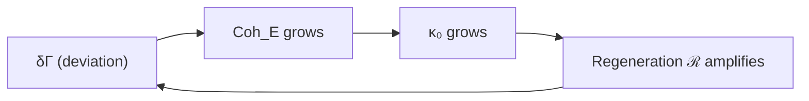
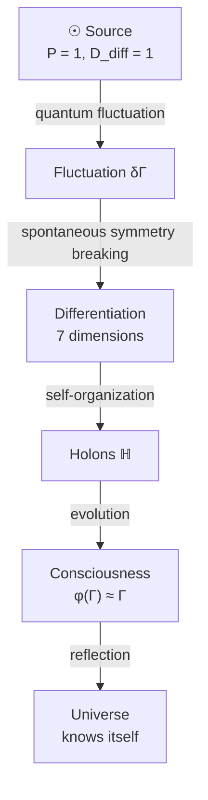

# Origin of the Universe

:::warning Section Status: Theorems + Philosophical Interpretation
This section contains a **proven theorem** (instability of the Source **[T]**), **postulates** (the Source itself), and **philosophical interpretations** (origin of "nothing"). Arguments about the origin of the Source are **metaphysical in nature**, but the instability of $\Gamma_{\odot}$ under the full UHM dynamics is a rigorous mathematical result.
:::

## The Problem of Beginning

Traditionally one asks: "What was before the Big Bang?"

In UHM the question transforms:

> What is the structure of $\Gamma$ in the limit of minimal differentiation?

## The Primordial State

### The Source {#источник}

:::note Status: Postulate
The Source is **postulated**, not derived. It is the initial condition of the theory, not a consequence of it. The question "why this particular Source?" remains open.
:::

**Pure undifferentiated state [P]** — superposition of all dimensions with equal amplitudes:

$$
\Gamma_{\odot} = |\psi_{\odot}\rangle\langle\psi_{\odot}|, \quad |\psi_{\odot}\rangle = \frac{1}{\sqrt{7}} \sum_i |i\rangle
$$

**Properties:**
- [Purity](/docs/core/dynamics/viability#определение-чистоты): $P = \mathrm{Tr}(\Gamma_{\odot}^2) = 1$ (pure state)
- Maximal [coherence](/docs/core/dynamics/coherence-matrix): all $|\gamma_{ij}| = 1/7$
- Minimal [differentiation](/docs/consciousness/foundations/self-observation#мера-сознательности-c): $D_{\text{diff}} = 1$

:::info Why not a mixed state?
The [maximally mixed state](/docs/core/dynamics/coherence-matrix#maximally-mixed-state) $\Gamma = I_7/7$ would have $P = 1/7$ — this is **not** a coherent state, but a classical ensemble without quantum correlations. UHM takes a **pure superposition** as the Source.
:::

**Why equal amplitudes $1/\sqrt{7}$? — resolved [Т] (T-272).** The amplitude is *not* a free parameter. The equal superposition $|\psi_\odot\rangle = \tfrac{1}{\sqrt7}\sum_i|i\rangle$ is characterised twice over, and both force it uniquely:
- **Unique symmetric state.** The $S_7$-invariant (permutation-symmetric) subspace of $\mathbb{C}^7$ is exactly **one-dimensional**, spanned by $(1,\dots,1)/\sqrt7$. So the *only* pure state in which no dimension is privileged is $\Gamma_\odot$; $1/\sqrt7$ is then fixed by normalisation.
- **Unique maximal-coherence state.** Among all pure states, the coherence $\mathrm{Coh} = 1 - \sum_i|a_i|^4$ is maximised **uniquely** at equal populations $|a_i|^2 = 1/7$, value $6/7$ (convexity) — every $|\gamma_{ij}| = 1/7$. The Source is *the most coherent pure state there is*.

Both give the same $\Gamma_\odot$, machine-verified (`a2_source.py`).

**Genuinely open [П]/[О]:**
- Why the **pure, maximally-symmetric class** as the initial condition (rather than the mixed $I_7/7$)? This remains a postulate — though $I_7/7$ is a classical ensemble with *zero* coherence, so "maximal coherence" is the natural selection principle that singles out $\Gamma_\odot$.
- Connection to the Boltzmann Brain problem.

## Spontaneous Symmetry Breaking

### Instability of the Source

The Source is unstable **[T]** under the full [dynamics](/docs/core/dynamics/evolution) of UHM. Any initial condition $\Gamma(0) = \Gamma_{\odot}$ with $\Delta F > 0$ inevitably evolves toward the structured attractor $\rho^*$.

#### Theorem (Source Instability) {#доказательство-нестабильности}

**Theorem.** The state $\Gamma_{\odot}$ is unstable under the full UHM dynamics: $\frac{d\Gamma}{d\tau}\big|_{\Gamma_\odot} \neq 0$, the system drifts from $\Gamma_{\odot}$ at a finite rate, and $\kappa_0$ creates positive feedback that breaks $S_7$-symmetry.

**Proof** (three steps).

**Step 1. $\Gamma_{\odot}$ is not a stationary state.**

Compute $\frac{d\Gamma}{d\tau}\big|_{\Gamma_\odot}$ from the three terms of the [evolution equation](/docs/core/dynamics/evolution):

**(a) Unitary term:** $-i[H_{\text{eff}}, \Gamma_{\odot}]$. Since $H_{\text{eff}} = \sum_i \omega_i |i\rangle\langle i| + \ldots$, with unequal $\omega_i$ (guaranteed by the $G_2$-structure: $\lambda_E > \lambda_U > \lambda_L \geq \lambda_D \geq \lambda_S \geq \lambda_A \geq 0$ from [A5](/docs/core/foundations/axiom-omega#pw-constraint)), the commutator is **non-zero** — $\Gamma_{\odot}$ does not commute with $H_{\text{eff}}$.

**(b) Dissipative term:** $\mathcal{D}_\Omega[\Gamma_{\odot}]$. By [theorem T6](/docs/core/operators/lindblad-operators#теорема-равномерная-контракция) (uniform contraction):

$$
\mathcal{D}[\Gamma_{\odot}]_{ij} = \begin{cases} -\alpha \cdot \gamma_{ij} = -\alpha/7, & i \neq j \\ 0, & i = j \end{cases}
$$

This is a **non-zero** operator: $\|\mathcal{D}[\Gamma_{\odot}]\|_F^2 = \alpha^2 \cdot 42/49 > 0$. Dissipation destroys coherences, reducing purity.

**(c) Regenerative term:** $\mathcal{R}[\Gamma_{\odot}, E] = \kappa(\Gamma_{\odot}) \cdot (\rho^* - \Gamma_{\odot}) \cdot g_V(P)$. For $P > P_{\mathrm{crit}}$ this term is **non-zero**, since $\rho^* \neq \Gamma_{\odot}$ ([primitivity](/docs/core/operators/lindblad-operators#примитивность-ℒω) [T]: the unique stationary point $\rho^*$ is not a pure $S_7$-symmetric state).

**Result:** $\frac{d\Gamma}{d\tau}\big|_{\Gamma_\odot} \neq 0$ — $\Gamma_{\odot}$ is **not a fixed point**.

**Step 2. Linearization around $\Gamma_{\odot}$.**

Write $\Gamma = \Gamma_{\odot} + \delta\Gamma$, $\text{Tr}(\delta\Gamma) = 0$, $\delta\Gamma^\dagger = \delta\Gamma$. Linearized dynamics:

$$
\frac{d\delta\Gamma}{d\tau} = \underbrace{-i[H_{\text{eff}}, \delta\Gamma]}_{\text{rotation}} + \underbrace{\mathcal{D}_{\text{lin}}[\delta\Gamma]}_{\text{contraction}} + \underbrace{F_0 + \mathcal{R}_{\text{lin}}[\delta\Gamma]}_{\text{shift + regeneration}}
$$

- **Unitary contribution:** purely imaginary eigenvalues $\pm i(\omega_i - \omega_j)$ — rotations, do not change the distance from $\Gamma_{\odot}$.
- **Dissipative contribution:** $\mathcal{D}_{\text{lin}}[\delta\Gamma]_{ij} = -\alpha \cdot \delta\gamma_{ij}$ ($i \neq j$), $= 0$ ($i = j$). Eigenvalues: $-\alpha < 0$ for 42 off-diagonal components, $0$ for 6 diagonal ones.
- **Constant shift:** $F_0 = \kappa(\Gamma_{\odot})(\rho^* - \Gamma_{\odot}) \cdot g_V(P) \neq 0$ — a **constant** vector, independent of $\delta\Gamma$. This is a drift from $\Gamma_{\odot}$ in the direction of $\rho^*$.

**Step 3. Mechanism of instability: drift + breaking of $S_7$-symmetry.**

Even if linearized eigenvalues have $\text{Re}(\lambda) \leq 0$ (true for $\mathcal{D}$), instability arises from two mechanisms:

**(I) Non-stationarity.** $F_0 \neq 0$ means the system drifts from $\Gamma_{\odot}$ at a finite rate:

$$
\|\Gamma(\delta\tau) - \Gamma_{\odot}\| \geq \|F_0\| \cdot \delta\tau - O(\delta\tau^2)
$$

for small $\delta\tau > 0$. The drift is linear in time.

**(II) Breaking of $S_7$-symmetry via $\kappa_0$.** As soon as $\Gamma$ deviates from $\Gamma_{\odot}$, the formula $\kappa_0 = \omega_0 |\gamma_{OE}||\gamma_{OU}|/\gamma_{OO}$ (see [categorical derivation](/docs/core/foundations/axiom-septicity#категориальный-вывод-kappa0)) **breaks $S_7$-symmetry**: E and O are functionally distinguished. This creates positive feedback: deviation in the E-direction increases $\text{Coh}_E \to$ increases $\kappa \to$ increases regeneration in the E-direction.

Formally: the component $\delta\gamma_{EE}$ obeys the equation (to linear order):

$$
\frac{d\delta\gamma_{EE}}{d\tau} = \kappa_0 \cdot (\rho^*_{EE} - 1/7) + \text{terms} \propto \delta\gamma_{EE}
$$

The first term is a constant shift ($\rho^*_{EE} > 1/7$ for living systems). The second is feedback via $\partial\kappa/\partial\gamma_{EE} > 0$. Both increase $\delta\gamma_{EE}$.

**(III) Result.** The distance from $\Gamma_{\odot}$ grows monotonically:

From steps I–II we obtain $\|\Gamma(\tau) - \Gamma_{\odot}\|_F > 0$ for all $\tau > 0$. Since $d_B(\Gamma_1, \Gamma_2) > 0 \Leftrightarrow \Gamma_1 \neq \Gamma_2$ (the Bures metric is non-degenerate), from $\|\Gamma(\tau) - \Gamma_{\odot}\|_F > 0$ it follows:

$$
d_B(\Gamma(\tau), \Gamma_{\odot}) > 0 \quad \forall \tau > 0
$$

for any initial condition $\Gamma(0) = \Gamma_{\odot}$ with $\Delta F > 0$. The system inevitably leaves $\Gamma_{\odot}$ and converges to $\rho^*$. $\blacksquare$

#### Corollary: cosmogenesis as inevitability {#космогенезис-неизбежность}

The transition from the undifferentiated Source to structured configurations is not a random event, but a **mathematical inevitability** of UHM dynamics. From $\Gamma_{\odot}$ the system **always** evolves to $\rho^*$ (given $\Delta F > 0$).

**Machine-verified (`b1_bootstrap.py`).** Integrating $\mathcal{L}_\Omega$ from $\Gamma_\odot$ reproduces the whole trajectory numerically: $[H_{\text{eff}},\Gamma_\odot]\neq 0$, so the Source departs immediately ($\|\Gamma-\Gamma_\odot\|: 0\to 0.85$); differentiation is **born** ($D_{\text{diff}}=e^{S}: 1\to 4.1$); $E$ and $O$ become **distinguished** via the $\kappa_0$ feedback ($|\rho_{EE}-\rho_{OO}|: 0\to 0.09$, the $S_7$-breaking); and the state settles at a **viable, in-window attractor** ($P\to 0.37\in(2/7,3/7]$, near the T-124 viability attractor $P\to 3/7$). Cosmogenesis *to a viable universe* is the generic outcome — not merely differentiation, but differentiation into the conscious window.

:::warning Open question
The mechanism by which $\Delta F > 0$ arises in the primordial context is an **open problem [P]**. The instability theorem assumes $\Delta F > 0$; the question of why this condition holds lies beyond the scope of this result.
:::

### Self-Amplification {#самоусиление}

:::tip Status: [T] (via $\kappa_0$)
Positive feedback is proved in step 3(II) of the [instability theorem](#доказательство-нестабильности): the formula $\kappa_0 = \omega_0 |\gamma_{OE}||\gamma_{OU}|/\gamma_{OO}$ breaks $S_7$-symmetry and creates amplification in the E-direction.
:::

Symmetry breaking **self-amplifies [T]** via positive feedback through $\kappa_0$:

Mechanism: $\kappa_0$ functionally distinguishes E and O among the seven dimensions (see [categorical derivation of $\kappa_0$](/docs/core/foundations/axiom-septicity#категориальный-вывод-kappa0)), directing evolution from the $S_7$-symmetric $\Gamma_{\odot}$ toward the structured $\rho^*$ with pronounced E-coherence.

## Birth of Dimensions

From the primordial superposition the [seven dimensions](/docs/core/structure/dimensions) emerge:

$$
|\psi_{\odot}\rangle = \frac{1}{\sqrt{7}}(|A\rangle + |S\rangle + |D\rangle + |L\rangle + |E\rangle + |O\rangle + |U\rangle)
$$

$$
\downarrow \text{decoherence via } \mathcal{D}[\Gamma]
$$

$$
\Gamma \to \sum_i p_i |i\rangle\langle i| + \sum_{i \neq j} \gamma_{ij} |i\rangle\langle j|
$$

where $p_i = \gamma_{ii}$ are the dimension populations, $\gamma_{ij}$ are the [coherences](/docs/core/dynamics/coherence-matrix#недиагональные-элементы-когерентности) between them.

## Evolution from the Source {#эволюция-от-источника}

### Direction of Evolution {#направление-эволюции}

:::danger Warning: Non-Falsifiability
The statement $dD_{\text{diff}}/d\tau > 0$ is **non-falsifiable**: any observed decrease in differentiation can be interpreted as a local phenomenon within a global growth. This is a **teleological assumption**, not an empirical law.

**Honest status:** This is a philosophical position (directionality of evolution), not a formal UHM theorem.
:::

The universe evolves in the direction of **increasing differentiation while preserving integration**:

$$
\frac{dD_{\text{diff}}}{d\tau} > 0
$$

$$
\frac{d\Phi}{d\tau} \geq 0
$$

where:
- $D_{\text{diff}} = \exp(S_{vN})$ — [measure of differentiation](/docs/consciousness/foundations/self-observation#мера-сознательности-c) (diversity of states)
- $\Phi$ — [measure of integration](/docs/core/structure/dimension-u#мера-интеграции-φ) (connectedness of dimensions)

**Status:** The *teleological directionality* $dD_{\text{diff}}/d\tau > 0$ remains **[H]** (a philosophical assumption). But the **underlying entropy dynamics are now formalized**: [T-271](#t-271) below makes the second-law connection precise — the regeneration term is a genuine negentropy sink, and consciousness (via $\mathrm{Coh}_E$) holds the state strictly below heat death.

:::note On notation
$D_{\text{diff}}$ is the measure of **differentiation**. Not to be confused with the **Dynamics** dimension $D$ (one of the seven Holon dimensions).
:::

### The entropy law: regeneration as negentropy (T-271) {#t-271}

The evolution equation $\mathcal{L}_\Omega = -i[H_{\text{eff}},\Gamma] + \mathcal{D}_\Omega[\Gamma] + \mathcal{R}[\Gamma,E]$ splits the production of von Neumann entropy $S(\Gamma) = -\mathrm{Tr}(\Gamma\ln\Gamma)$ cleanly across its three terms. This turns the previously *conceptual* second-law connection into a theorem.

:::tip Theorem T-271 (Entropy dynamics of $\mathcal{L}_\Omega$) [Т]+[С]
For $\Gamma \in \mathcal{D}(\mathbb{C}^7)$ evolving under $\mathcal{L}_\Omega$, the entropy rate $\dot S = -\mathrm{Tr}(\dot\Gamma \ln\Gamma)$ decomposes as $\dot S = \dot S_{\text{uni}} + \dot S_{\mathcal{D}} + \dot S_{\mathcal{R}}$ with:

**(i) [Т]** $\dot S_{\text{uni}} = 0$ **exactly** — the unitary term preserves the spectrum of $\Gamma$, hence its entropy ($[\Gamma,\ln\Gamma]=0 \Rightarrow \mathrm{Tr}(-i[H,\Gamma]\ln\Gamma)=0$).

**(ii) [Т]** $\dot S_{\mathcal{D}} \geq 0$ — the dissipator is a strict **entropy source**, driving $\Gamma$ toward the maximally mixed heat-death state $I/7$ (where $S = \ln 7$).

**(iii) [Т]** At any steady state $\Gamma_{ss}$ of $\mathcal{L}_\Omega$, $\dot S = 0$; since $\dot S_{\text{uni}}=0$ and $\dot S_{\mathcal{D}}\geq 0$, the regeneration is a net **entropy sink**, $\dot S_{\mathcal{R}} = -\dot S_{\mathcal{D}} \leq 0$. Regeneration exports exactly the dissipator's production — **negentropy is the cost of maintenance** ("staying alive").

**(iv) [С]** The maintained steady entropy satisfies $S_{ss} < \ln 7 = S(I/7)$ **strictly**, and $S_{ss}$ **decreases monotonically** with $\kappa/\gamma$. Since $\kappa \propto \mathrm{Coh}_E$ (the [regeneration kernel](/docs/core/foundations/axiom-septicity#категориальный-вывод-kappa0) $\kappa_0 = \omega_0|\gamma_{OE}||\gamma_{OU}|/\gamma_{OO}$), **higher coherence — a more conscious system — holds a strictly lower steady entropy, further from heat death.**
:::

**What this formalizes.** The old "conceptual" second-law link is now the precise statement: dissipation is the arrow toward heat death; regeneration is a genuine negentropy sink that a system pays for in free energy; and the depth to which a system can hold entropy below the heat-death ceiling is set by its $E$-coherence. This is the mechanism behind the [viability window](/docs/consciousness/foundations/self-observation#мера-рефлексии-r) sitting *away* from $I/7$, and behind $R = 1/(7P)$ literally measuring **distance from heat death**.

**Corollary — the metabolic floor of a viable machine (T-273) [Т]+[С].** Combine (iii) with Landauer's principle and the theorem becomes an engineering budget. At steady state the regeneration must export entropy at the dissipator's strictly-positive rate $\dot S_{\mathcal{D}}>0$; exporting it costs free energy, so a viable holon has a strictly positive **maintenance power floor** $P_{\text{meta}} \geq kT\ln 2\cdot\dot S_{\mathcal{D}}$ (with $\dot S_{\mathcal{D}}$ the *physical* entropy-production rate of the dissipator) — the *cost of staying alive*, distinct from and **additional to** the reversible (Landauer-free) cost of computation. It scales with the **order maintained**: a state farther from $I/7$ (more coherent, more complex) is pushed harder by the dissipator and so costs more power to hold — *the price of complexity*. At $300$ K a single holon's floor is on the order of femto- to pico-watts, fixed by the *physical* dissipation rate and therefore **frequency-independent** (running the same trajectory on a slower clock shrinks the per-tick entropy in exact proportion — sharpened as T-276); it is **measurable**, since $\dot S_{\mathcal{D}}$ is a live observable. This is the thermodynamic law behind a coherent machine's "metabolism": total power $=0$ (reversible compute) $+\ P_{\text{meta}}$ (maintenance). Machine-verified, `t273_metabolic.py`.

**Cosmological reading.** Locally this is entropy export (Schrödinger's "negative entropy") with UHM's specific rates. Cosmologically, it is the de Sitter self-maintenance of [T-266](/docs/reference/status-registry) / [T-254](/docs/physics/gravity/cosmological-constant): a universe-as-holon with persistent regeneration approaches $\rho^*$ and **never reaches $I/7$** — no Big Rip [Т], no heat death while $\mathcal{R}$ persists. Infinite development is exactly this: a self-model held indefinitely against dissipation.

**Honest boundary.** T-271 does **not** overturn the second law. The exported entropy enters the environment/bath; total entropy (system + bath) is non-decreasing. What is established is **local** negentropy maintenance and its $\mathrm{Coh}_E$-scaling — not a global reversal. The strong reading "a conscious universe globally reverses entropy" is **not** proven; it reduces to the conditional [С] cosmological maintenance above. Machine-verified: `t271_entropy_verify.py` (unitary $\dot S=0$; dissipator $\dot S>0$; steady-state balance; $S_{ss}<\ln 7$ monotone in $\kappa/\gamma$).

### Phenomenology of Evolution

- **Complexification of matter:** from quarks to galaxies
- **Evolution of life:** from prokaryotes to minds
- **Development of culture:** from tribes to civilizations

## Cosmogenesis Diagram

**Diagram notation:**
- $P = 1$ — [purity](/docs/core/dynamics/viability#определение-чистоты) (maximal coherence)
- $D_{\text{diff}} = 1$ — minimal differentiation (pure state)
- $\varphi(\Gamma) \approx \Gamma$ — [self-modeling](/docs/consciousness/foundations/self-observation#оператор-самомоделирования-φ) close to fixed point

## Quantitative Estimates for the Cosmogenesis Epoch {#количественные-оценки}

:::warning Status: [C] Conditional estimates
The following estimates depend on the value of $\omega_0$ (Axiom A4 [P]) and on the model relating $\Delta F$ to physical scales. The orders of magnitude are approximate.
:::

### Differentiation Time

The characteristic instability scale is set by the spectral gap of the linearized dynamics:

$$
\tau_{\text{diff}} \sim \frac{1}{\kappa_0} = \frac{7}{\omega_0} \cdot \frac{\gamma_{OO}}{|\gamma_{OE}||\gamma_{OU}|}
$$

For the Source ($|\gamma_{OE}| = |\gamma_{OU}| = \gamma_{OO} = 1/7$):

$$
\tau_{\text{diff}} \sim \frac{7}{\omega_0} \cdot \frac{1/7}{(1/7)^2} = \frac{7}{\omega_0}
$$

At $\omega_0 \sim M_{\text{Planck}} = 1.22 \times 10^{19}$ GeV: $\tau_{\text{diff}} \sim 7 t_{\text{Planck}} \approx 3.8 \times 10^{-43}$ s.

### Sequence of Events

| Epoch | $\tau$ | Event | Observable analogue |
|-------|--------|-------|---------------------|
| $0$ | $0$ | Source $\Gamma_\odot$ | Planck singularity |
| $\sim 7 t_P$ | $\sim 10^{-43}$ s | Breaking $S_7 \to G_2$ | Inflation (?) |
| $\sim 10^2 t_P$ | $\sim 10^{-42}$ s | Sector decomposition $7 = 1+3+3$ | Spacetime formation |
| $\sim 10^{10} t_P$ | $\sim 10^{-34}$ s | Electroweak scale | Higgs transition |

:::note Connection to inflation
The breaking of $S_7$-symmetry via $\kappa_0$ generates exponential growth of differentiation — this is the **structural analogue** of inflation. However in UHM, inflation is not a separate field (inflaton) but a consequence of autopoietic feedback. The detailed connection to observable parameters ($n_s$, $r$) is an [open problem [P]](/docs/reference/status-registry).
:::

---

## Absence of "Before"

In UHM there is no "before the Big Bang":
- Time [arises](/docs/core/operators/emergent-time) **together** with differentiation — via the Page–Wootters mechanism, which requires the O-dimension to be distinguished
- "Before" is a concept that requires time — in the Source all dimensions are equivalent, O is not distinguished
- The Source $\odot$ is **outside of time** (atemporal): $\tau$ is not defined for an $S_7$-symmetric state

## Why Is There Something Rather Than Nothing? {#почему-вообще-что-то-есть}

Traditional question: "Why is there something rather than nothing?"

:::info Status: Philosophical argument
This is **not a formal theorem**, but a philosophical position consistent with the UHM axiomatics. Formal proof is impossible — the question lies beyond any formal system.
:::

**UHM position:**
"Nothing" is unstable — it cannot be self-consistent, because self-consistency requires "something" that is consistent with itself.

$$
\text{Nothing} \Rightarrow \text{inconsistency} \Rightarrow \text{impossibility}
$$

$\Gamma$ exists because **self-consistency requires existence** **[I]**.

**Alternative positions:**
- The question is meaningless (logical positivists)
- The answer lies beyond the rational (mysticism)
- Random without cause (some interpretations of QM)

UHM chooses the position of self-consistency as the most economical and explanatorily powerful.

## What Is Formalized vs. Research Programme

| Statement | Status | Comment |
|-----------|--------|---------|
| **Source $\Gamma_{\odot}$ as initial condition** | ⚙️ Postulate | Not derived, accepted as an axiom |
| **Instability of the Source** | **[T]** Theorem | [Proved](#доказательство-нестабильности): non-stationarity + drift $F_0 \neq 0$ |
| **Self-amplification of $S_7$-symmetry breaking** | **[T]** Theorem | Positive feedback via $\kappa_0$ ([step 3](#доказательство-нестабильности)) |
| **Condition $\Delta F > 0$** | [P] Open question | Why is the free energy of the environment greater than the system's? |
| **$dD_{\text{diff}}/d\tau > 0$** | [I] Non-falsifiable | Teleological assumption |
| **"Nothing" is unstable** | [I] Philosophy | Metaphysical argument, not a theorem |

:::info Summary
This section contains **theorems** (instability of the Source [T], self-amplification via $\kappa_0$ [T]), **postulates** (the Source itself, the condition $\Delta F > 0$), and **philosophical positions** ("why is there something").
:::

---

**Related documents:**
- [Spacetime](/docs/core/foundations/spacetime) — emergence of spacetime
- [Coherence matrix](/docs/core/dynamics/coherence-matrix) — definition of $\Gamma$
- [Evolution](/docs/core/dynamics/evolution) — dynamics of $\Gamma$
- [Viability](/docs/core/dynamics/viability) — purity measure $P$
- [Self-observation](/docs/consciousness/foundations/self-observation) — operator $\varphi$ and measure $D_{\text{diff}}$
- [Unity dimension](/docs/core/structure/dimension-u) — integration measure $\Phi$
- [Foundation (O)](/docs/core/structure/dimension-o) — connection to the Source
- [Axiom Ω⁷](/docs/core/foundations/axiom-omega) — ∞-topos $\mathrm{Sh}_\infty(\mathcal{C})$ as primitive
