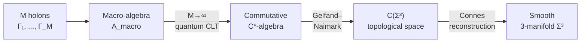

# Emergent Geometry

:::info Who this chapter is for
This chapter shows how from the coherence matrix $\Gamma$ — a purely algebraic object — the familiar spacetime with metric, distances, and curvature **emerges**. Space in UHM is not a container in which objects are placed, but a **structure of distinctions** between coherence configurations. The reader will learn: how the Frobenius metric on $\mathcal{D}(\mathbb{C}^7)$ generates a pre-metric; how Fisher–Rao information geometry connects quantum distinguishability with spatial distances; how the 3+1 dimensionality is **derived** from the sector decomposition of $G_2$; and how the Einstein equations follow from this.

**In one sentence.** Spacetime geometry is not a fundamental given, but an emergent property of the coherence matrix: distance between points = informational distinguishability of the corresponding configurations $\Gamma$.
:::

:::note Historical precursors
The idea of the emergence of geometry traces back to several traditions:

- **Bernhard Riemann** (1854) suggested that the metric of space could be determined by the physical content — the "binding force" determines the geometry.
- **John Wheeler** (1960s) formulated the program of "geometrodynamics": spacetime is not an arena but a participant in physics.
- **Alain Connes** (1994) showed that all geometry (metric, differential structure, integration) can be recovered from **algebraic data** — the spectral triple $(\mathcal{A}, \mathcal{H}, D)$.
- **Ted Jacobson** (1995) derived the Einstein equations from horizon thermodynamics — the first example of "gravity from entropy".

UHM synthesizes these approaches: the metric is determined by quantum information geometry (Fisher–Rao / Bures), the dimensionality is fixed by the algebra of octonions, and the Einstein equations follow from Connes' spectral action.
:::

## Overview

In UHM, spacetime is not a fundamental structure but **emerges** from the coherence matrix $\Gamma$. The metric reflects the "logical distance" between configurations $\Gamma$ — the geometry of space is determined by the **structure of distinctions** imposed by the classifier $\Omega$.

:::tip Status: fully derived [T]
The spatial manifold $\Sigma^3$ is derived from the categorical structure (T-119 [T]), the product $M^4 = \mathbb{R} \times \Sigma^3$ is proved (T-120 [T]), and the Einstein equations are obtained from the spectral action (T-65 [T]). Details: [Emergent manifold $M^4$](/docs/proofs/physics/emergent-manifold).
:::

---

## 1. Space as a Structure of Distinctions

:::note Intuitive explanation
Imagine a large hall filled with people. Each person is a holon with its own matrix $\Gamma_m$. The "distance" between two people is determined not by where they stand (there is no space yet!), but by how **different** their internal states are. Two twins with similar $\Gamma$ are "nearby". A person in ecstasy and a person in depression are "far apart", even if physically in the same room. Space **emerges** as a map of these distinctions.
:::

### 1.1 Pre-metric from Coherence

For a composite system of $M$ holons, a **pre-metric** is defined — a distance between holons from which the spatial metric emerges in the thermodynamic limit:

$$
d_{\mathcal{G}}(m, n) := \|\Gamma_m - \Gamma_n\|_F = \sqrt{\mathrm{Tr}\!\left((\Gamma_m - \Gamma_n)^2\right)}
$$

Key constraint: the distance is defined only through the coherences of the **spatial sector** $\{A,S,D\}$. This is not an arbitrary choice — it follows from the sector decomposition (§4.3).

### 1.2 From Pre-metric to Metric: Thermodynamic Limit

:::warning Theorem T-117 (Commutativity of the macro-algebra) [T]
In the thermodynamic limit $M \to \infty$, the algebra of macroscopic observables $\mathcal{A}_{\text{macro}}$ in the $\{A,S,D\}$-sector becomes **commutative**:

$$
[a, b] = O(1/\sqrt{M}) \to 0 \quad \text{for } a, b \in \mathcal{A}_{\{A,S,D\}}
$$

This follows from the quantum CLT (central limit theorem): the fluctuations of non-commutativity are suppressed as $1/\sqrt{M}$.

[Proof →](/docs/proofs/physics/emergent-manifold#теорема-коммутативность-макроалгебры) | Status: **[T]**
:::

:::warning Theorem T-119 (Emergent space) [T]
From the commutativity of $\mathcal{A}_{\text{macro}}$ by **Gelfand–Naimark duality** it follows that:

$$
\mathcal{A}_{\text{macro}} \cong C(\Sigma^3)
$$

for the unique (up to homeomorphism) compact Hausdorff space $\Sigma^3$. By **Connes' reconstruction theorem** (2008), the spectral triple $(\mathcal{A}_{\text{macro}}, \mathcal{H}, D)$ recovers $\Sigma^3$ as a **smooth** 3-manifold.

[Proof →](/docs/proofs/physics/emergent-manifold#теорема-эмерджентное-пространство) | Status: **[T]**
:::

**Derivation chain:**

The geometry of space is determined by how **different** the coherence configurations are at neighboring points. Connes distance on $\Sigma^3$:

$$
d_{\text{Connes}}(x, y) = \sup\{|f(x) - f(y)| : \|[D, f]\| \leq 1, \; f \in \mathcal{A}_{\text{macro}}\}
$$

---

## 2. Pre-metric on the Space of States

### 2.1 Frobenius Metric

:::tip Theorem 4.1 [T]
The space $\mathcal{D}(\mathcal{H})$ of density matrices with metric

$$
d_F(\rho_1, \rho_2) := \|\rho_1 - \rho_2\|_F = \sqrt{\mathrm{Tr}\!\left((\rho_1 - \rho_2)^2\right)}
$$

is a complete metric space.
:::

**Proof.** The Frobenius norm is the Hilbert–Schmidt norm, inducing a complete metric on $\mathcal{L}(\mathcal{H})$. Restriction to $\mathcal{D}(\mathcal{H})$ (a closed subset) preserves completeness. $\blacksquare$

The Frobenius metric defines a **pre-metric** — a distance between quantum states from which the spatial metric emerges upon localization of $\Gamma$.

---

## 3. Information Geometry

### 3.1 Fisher–Rao Metric

:::tip [T] Quantum Fisher metric (standard result)
The natural Riemannian metric on $\mathcal{D}(\mathcal{H})$ is the quantum Fisher metric:

$$
g_{ij}^{(F)}(\rho) = \frac{1}{2}\mathrm{Tr}\!\left(\rho\{L_i, L_j\}\right)
$$

where $L_i$ are logarithmic derivatives: $\partial_i \rho = \frac{1}{2}\{\rho, L_i\}$.
:::

This metric defines the "distance" between quantum states and is connected to quantum estimation via the Cramér–Rao inequality:

$$
\mathrm{Var}(\hat{\theta}_i) \geq [g^{(F)}(\rho)]^{-1}_{ii}
$$

### 3.2 Uniqueness of the Bures Metric {#единственность-метрики-бюреса}

In the **classical** case the Fisher–Rao metric is the unique (up to normalization) monotone Riemannian metric on the simplex of probability distributions (Chentsov theorem, 1982). In the **quantum** case uniqueness is broken: by the Petz theorem (1996), on $\mathcal{D}(\mathcal{H})$ there exists an entire **family** of monotone metrics, parametrized by operator-monotone functions $f$.

:::warning Theorem (Privileged status of the Bures metric) [T]
The Bures metric (Axiom A2 of UHM) is distinguished within the Petz class as the **minimal** monotone metric:

$$g_{\text{Bures}}(\rho) \leq g_f(\rho) \quad \text{for any monotone } g_f \text{ (Petz, 1996)}$$

Explicit formula:
$$d_B(\rho_1, \rho_2) = \sqrt{2\left(1 - \mathrm{Tr}\sqrt{\sqrt{\rho_1}\rho_2\sqrt{\rho_1}}\right)}$$
:::

**Physical meaning of minimality.** Bures is the most "conservative" metric: it gives the smallest distance between states. This means that the emergent geometry of spacetime is determined by the **minimal distinguishability** — distance between points of space = minimal informational difference between the corresponding configurations $\Gamma$.

### 3.3 From Information Geometry to the Spacetime Metric

The connection between quantum information geometry on $\mathcal{D}(\mathbb{C}^7)$ and the spacetime metric on $M^4$ is realized through the **spectral triple**:

$$
(\mathcal{A}_{\text{int}}, \mathcal{H}_{\text{int}}, D_{\text{int}}) = \left(\mathbb{C} \oplus M_3(\mathbb{C}) \oplus M_3(\mathbb{C}), \; \mathbb{C}^7, \; D_{\text{Gap}}\right)
$$

where $D_{\text{Gap}}$ is the Dirac operator whose elements are determined by the [Gap parameters](/docs/core/dynamics/gap-operator). The Connes distance formula translates the information metric into a spatial one:

| Level | Metric | Space | Determines |
|---------|---------|--------------|------------|
| Quantum | $d_B(\rho_1, \rho_2)$ | $\mathcal{D}(\mathbb{C}^7)$ | State distinguishability |
| Spectral | $d_{\text{Connes}}(x, y)$ | $\Sigma^3$ | Spatial distance |
| Full | $ds^2 = g_{\mu\nu}dx^\mu dx^\nu$ | $M^4$ | Spacetime metric |

---

## 4. Emergent Dimensionality

### 4.1 Derivation of 3+1 Dimensions [T]

:::tip [T] Dimensionality from Gelfand–Connes reconstruction (T-119)
The dimension of macroscopic space is **derived**: commutativity of the macro-algebra (T-117 [T]) + spectral dimension of the $\{A,S,D\}$-sector = 3 + Connes reconstruction (2008) $\Rightarrow$ $\Sigma^3$ is a smooth 3-manifold. Details: [Emergent manifold $M^4$](/docs/proofs/physics/emergent-manifold#теорема-эмерджентное-пространство).
:::

:::tip Status of the 3+1 dimension derivation: [T] (T-119, T-120)
The decomposition $\mathrm{Im}(\mathbb{O}) \cong \mathbb{R}^7 = \mathbb{R}^1 \oplus \mathbb{R}^3 \oplus \mathbb{R}^3$ follows from $\mathrm{SU}(3) \subset G_2$ — the stabilizer of the O-direction. The choice of embedding is **unique** — fixed by the PW mechanism (A5): O determines the temporal direction [T] (T-87). Compactification of the $\bar{\mathbf{3}}$-sector is ensured by the massiveness of $W,Z$ [T]. The product $M^4 = \mathbb{R} \times \Sigma^3$ is **derived** from the categorical structure ([T-120](/docs/proofs/physics/emergent-manifold#теорема-произведение-троек)).
:::

### 4.2 Resolved Questions

| Question | Answer | Theorem |
|--------|-------|---------|
| Why $\dim_{\mathrm{eff}} = 3$ for space? | From the $\{A,S,D\}$-sector: $\dim(\mathbf{3}) = 3$ | T-119 [T] |
| How does Lorentzian signature $(+,-,-,-)$ arise? | From KO-dim 6 of the spectral triple | T-53 [T] |
| How is 3+1 connected to the 7 dimensions of the holon? | Sector decomposition + Gelfand–Connes reconstruction | T-120 [T] |

### 4.3 Sector Decomposition

Decomposition $\mathrm{SU}(3) \subset G_2$:

$$
\mathrm{Im}(\mathbb{O}) \cong \mathbb{R}^7 = \mathbb{R}^1_{\mathrm{time}} \oplus \mathbb{R}^3_{\mathrm{space}} \oplus \mathbb{R}^3_{\mathrm{gap}}
$$

where $\mathbb{R}^1_{\mathrm{time}}$ is the $O$-dimension (emergent time), $\mathbb{R}^3_{\mathrm{space}}$ is the real part of $\mathbb{C}^3$ (spatial coordinates), $\mathbb{R}^3_{\mathrm{gap}}$ is the imaginary part of $\mathbb{C}^3$ (Gap momentum conjugates). This decomposition is used in more detail in the [derivation of the Einstein equations](/docs/physics/gravity/einstein-equations).

---

## 5. Connection with General Relativity

### 5.1 Spectral Action

The Einstein equations are **not postulated** — they follow from the **spectral action** of Chamseddine–Connes on the full spectral triple $M^4 \times F_{\text{int}}$:

$$
S_{\text{spec}}[\mathcal{A}, D] = \mathrm{Tr}\!\left(f(D^2/\Lambda^2)\right) + \frac{1}{2}\langle\psi, D\psi\rangle
$$

where $f$ is a smooth cutoff function, $\Lambda$ is the scale. Expansion in a series in $\Lambda$ gives:

$$
S_{\text{spec}} = \frac{1}{16\pi G}\int_{M^4}\!(R - 2\Lambda_{\text{CC}})\sqrt{g}\,d^4x + S_{\text{SM}} + O(\Lambda^{-2})
$$

The first term is the **Einstein–Hilbert action** with cosmological constant. The second is the Standard Model action. All constants ($G$, $\Lambda_{\text{CC}}$, boson masses) are determined by the spectrum of the Dirac operator $D_{\text{int}}$, which in turn is determined by the Gap parameters.

### 5.2 Summary of Results

| Result | Status | Theorem |
|-----------|--------|---------|
| Manifold $M^4 = \mathbb{R} \times \Sigma^3$ derived | **[T]** | [T-120](/docs/proofs/physics/emergent-manifold#теорема-произведение-троек) |
| Einstein equations from spectral action | **[T]** | [T-65](/docs/physics/gravity/einstein-equations) |
| Cosmological constant $\Lambda_{\text{CC}} > 0$ | **[T]** | [T-71](/docs/core/foundations/consequences#теорема-лямбда-положительна) |
| Lovelock gaps closed | **[T]** | [T-121](/docs/proofs/physics/emergent-manifold#теорема-лавлок-замыкание) |
| Vacuum topology $\Sigma^3 \cong S^3$ | **[T]** | [T-120b](/docs/proofs/physics/emergent-manifold#следствие-вакуумная-топология) |

### 5.3 Lovelock Gaps and Their Closure

The Lovelock theorem (1971) states: the unique second-order tensor constructed from the metric and its derivatives up to second order, that is divergence-free, is the Einstein tensor $G_{\mu\nu} + \Lambda g_{\mu\nu}$. But the theorem **does not explain**:

| Gap | Question | UHM answer | Theorem |
|--------|--------|-----------|---------|
| 1 | Why $d = 4$? | Sector decomposition $7 = 1 + 3 + 3$ | T-120 [T] |
| 2 | Why Lorentzian signature? | KO-dimension 6 of the spectral triple | T-53 [T] |
| 3 | Why $\Lambda > 0$? | Autopoiesis requires $\rho_{\text{vac}} > 0$ | T-71 [T] |

---

## 6. Connection with Other Sections

| Topic | Page | Connection |
|------|----------|-------|
| Emergent manifold $M^4$ | [Emergent manifold](/docs/proofs/physics/emergent-manifold) | Derivation of $M^4$ from categorical structure (T-117 — T-121) |
| Einstein equations | [Einstein equations from Gap](/docs/physics/gravity/einstein-equations) | Derivation of $G_{\mu\nu}$ from spectral action |
| Cosmological constant | [Cosmological constant](/docs/physics/gravity/cosmological-constant) | Computation of $\Lambda$ and suppression mechanisms |
| Berry phase | [Berry phase and topological protection](/docs/physics/cosmology-phys/berry-phase) | Topological protection of Gap and emergent geometry |
| $G_2$-structure | [$G_2$-structure and Fano plane](/docs/physics/gauge-symmetry/g2-structure) | Algebraic basis of the decomposition 7 = 1 + 3 + 3 |
| Coherence matrix | [Coherence matrix](/docs/core/dynamics/coherence-matrix) | Definition of $\Gamma$ and coherences $\gamma_{ij}$ |

---

**Related documents:**
- [Einstein equations from Gap](/docs/physics/gravity/einstein-equations)
- [Quantum gravity](/docs/physics/gravity/quantum-gravity)
- [Spacetime](/docs/core/foundations/spacetime)
- [Emergent manifold $M^4$](/docs/proofs/physics/emergent-manifold)
