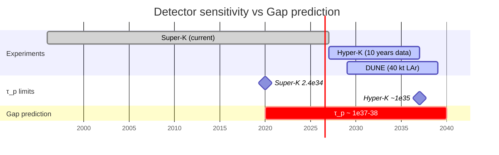

# Proton Decay

:::info Who this chapter is for
Proton lifetime and decay channels from the Gap hierarchy of leptoquark masses. The reader will learn about UHM predictions and their comparison with experimental limits.
:::

Masses of $X,Y$-leptoquarks from the [Gap hierarchy](/docs/physics/gauge-symmetry/standard-model), calculation of the proton lifetime, decay channels and comparison with experimental limits from Super-Kamiokande and Hyper-Kamiokande.

:::warning Standard SU(5)-GUT computation
The formulas for the proton lifetime, decay channels and their ratios are **standard results** of minimal $SU(5)$-GUT. The contribution of UHM reduces to fixing the scale $M_X$ through the Gap hierarchy. The prediction $\tau_p \sim 10^{37\text{--}38}$ years is **conditional** on the correctness of identifying the Gap hierarchy with the $SU(5)$-structure. The current Super-Kamiokande experimental limit ($\tau_p > 2.4 \times 10^{34}$ years for $p \to e^+\pi^0$) **does not exclude** the prediction, but does not confirm it either — the prediction lies 3 orders of magnitude above the current sensitivity. Experimental verification will require megaton-class detectors, the construction of which is not yet planned.
:::

:::info Status within the Fano–electroweak construction (FE)
The [Fano–electroweak construction (FE)](/docs/physics/gauge-symmetry/standard-model#теорема-единственности-фэ) derives $\mathrm{SU}(2)_L \times \mathrm{U}(1)_Y$ from the Higgs line $\{A,E,U\}$ **without recourse to $\mathrm{SU}(5)$-GUT** — uniqueness is proved from $\kappa_0$ [T]. Therefore, $X,Y$-leptoquarks **are not a necessary prediction** of the main (FE) construction. All material on this page remains correct within the **alternative hypothesis of $\mathrm{SU}(5)$-unification [H]** — if the $\mathrm{SU}(5)$-structure is realized, the proton decay predictions are preserved. The main electroweak UHM construction is **[T]**.
:::

---

## 1. Masses of $X,Y$-leptoquarks [C under SU(5)-GUT] {#массы-лептокварков}

### 1.1 Origin of leptoquarks {#происхождение}

$X,Y$-leptoquarks are off-diagonal bosons of the coset $SU(5)/\text{SM}$, connecting the quark and lepton sectors. In the adjoint representation $\mathbf{24}$ of $SU(5)$ the decomposition under the SM subgroup is:

$$
\dim(SU(5)) = 24 = \underbrace{8}_{SU(3)_C} + \underbrace{3}_{SU(2)_L} + \underbrace{1}_{U(1)_Y} + \underbrace{12}_{X,Y}
$$

The twelve leptoquarks ($X_i, Y_i$ and their antiparticles, $i = 1,2,3$ by color) carry both color and electroweak charges. Exchange of $X,Y$-bosons violates conservation of baryon number $B$ and lepton number $L$, preserving $B - L$.

### 1.2 Mass from Gap hierarchy {#масса-gap}

:::tip Theorem 1.1 (Leptoquark masses from Gap hierarchy) [C under SU(5)-GUT]
**(a)** The mass of $X,Y$-leptoquarks is determined by the Gap between the quark and lepton sectors at the GUT scale:

$$
M_X \sim v_{\text{GUT}} \sim M_{\text{Planck}} \cdot \text{Gap}^{(3\bar{3})}(\mu_{\text{GUT}})
$$

The Gap in the $3$-to-$\bar{3}$ sector at the GUT scale is suppressed by RG evolution from the Planck scale:

$$
\text{Gap}^{(3\bar{3})}(\mu_{\text{GUT}}) \sim 10^{-3}
$$

which gives:

$$
M_X \sim M_{\text{Planck}} \cdot 10^{-3} \sim 10^{16} \; \text{GeV}
$$

**(b)** Refinement via coupling unification. From the [RG evolution of Gap](/docs/physics/gauge-symmetry/rg-flow) the gauge couplings unify:

$$
\alpha_s(\mu_{\text{GUT}}) = \alpha_W(\mu_{\text{GUT}}) = \alpha_{\text{GUT}} \approx 1/24
$$

The unification scale is determined through the one-loop running coupling $\alpha_1$:

$$
\mu_{\text{GUT}} = M_Z \cdot \exp\left(\frac{2\pi}{\beta_1^{(1)}} \cdot \frac{1}{\alpha_1(M_Z) - \alpha_{\text{GUT}}}\right) \approx 2 \times 10^{16} \; \text{GeV}
$$

in standard $SU(5)$-GUT. With SUSY corrections (at $m_{\text{SUSY}} \sim 10^{13}$ GeV) the scale is preserved: $\mu_{\text{GUT}} \sim 2 \times 10^{16}$ GeV.

**(c)** Number of leptoquarks: 12 (from the decomposition $\dim(SU(5)) = 24$: 8 — $SU(3)_C$, 3 — $SU(2)_L$, 1 — $U(1)_Y$, 12 — $X,Y$).
:::

### 1.3 Mass range and uncertainties [H] {#диапазон-масс}

:::warning Estimate (Leptoquark mass range) [H]
Uncertainty in $\text{Gap}^{(3\bar{3})}(\mu_{\text{GUT}})$ leads to the range:

$$
M_X \in [10^{15},\; 10^{16}] \; \text{GeV}
$$

The lower bound ($10^{15}$ GeV) is determined by the Super-Kamiokande experimental limit on the proton lifetime. The upper bound ($10^{16}$ GeV) is the central value of $\mu_{\text{GUT}}$ from RG unification.

The dependence $\tau_p \propto M_X^4$ means that an uncertainty of one order in $M_X$ gives four orders in $\tau_p$.
:::

---

## 2. Proton lifetime [C] {#время-жизни}

### 2.1 Decay amplitude {#амплитуда}

Dominant channel in $SU(5)$: $p \to e^+ + \pi^0$. The process occurs via exchange of a virtual $X$-boson, generating a dimension-6 baryon-number-violating operator $\mathcal{O}_{qqql}$:

$$
\mathcal{A}(p \to e^+\pi^0) \sim \frac{\alpha_{\text{GUT}}}{M_X^2} \cdot \langle\pi^0 e^+|\mathcal{O}_{qqql}|p\rangle
$$

Here $\mathcal{O}_{qqql}$ is a four-fermion operator of the form $(qqql)/M_X^2$, connecting three quarks with a lepton. At the quark level the process proceeds as $u + d \to e^+ + \bar{u}$, after which $\bar{u}$ annihilates with the remaining $u$-quark of the proton, giving $\pi^0$.

### 2.2 Decay width and lifetime {#ширина-распада}

:::tip Theorem 2.1 (Proton lifetime) [C under SU(5)-GUT]
**(a)** Decay width:

$$
\Gamma(p \to e^+\pi^0) = \frac{\alpha_{\text{GUT}}^2 \, m_p^5}{M_X^4} \cdot A_L^2 \cdot |\alpha_H|^2
$$

where:
- $A_L \approx 2$ — RG operator enhancement factor during evolution from $M_X$ to $m_p$ (related to the anomalous dimension of the operator $\mathcal{O}_{qqql}$ under strong interactions);
- $|\alpha_H|^2 \approx 0.01$ GeV$^6$ — hadronic matrix element, determined by lattice QCD.

**(b)** Lifetime:

$$
\tau_p = \frac{1}{\Gamma} = \frac{M_X^4}{\alpha_{\text{GUT}}^2 \, m_p^5 \, A_L^2 \, |\alpha_H|^2}
$$

**(c)** Numerical estimate ($M_X = 2 \times 10^{16}$ GeV, $\alpha_{\text{GUT}} = 1/24$, $m_p = 0.938$ GeV, $A_L = 2$, $|\alpha_H|^2 = 0.01$ GeV$^6$):

$$
\tau_p = \frac{(2 \times 10^{16})^4}{(1/24)^2 \times (0.938)^5 \times 4 \times 0.01} \; \text{GeV}^{-1}
$$

$$
= \frac{16 \times 10^{64}}{(1/576) \times 0.722 \times 0.04} = \frac{16 \times 10^{64}}{5.01 \times 10^{-5}} = 3.2 \times 10^{69} \; \text{GeV}^{-1}
$$

Unit conversion: $1 \; \text{GeV}^{-1} \approx 6.58 \times 10^{-25}$ s, $1 \; \text{year} \approx 3.15 \times 10^{7}$ s:

$$
\tau_p \approx 3.2 \times 10^{69} \times 6.58 \times 10^{-25} \; \text{s} = 2.1 \times 10^{45} \; \text{s} \approx 6.7 \times 10^{37} \; \text{years}
$$

**(d)** Gap prediction: $\tau_p \sim 10^{37\text{–}38}$ years.
:::

This is a standard $SU(5)$-GUT calculation; the Gap theory determines $M_X$ through the Gap hierarchy, rather than introducing the scale as a free parameter.

### 2.3 Sensitivity to parameters [H] {#чувствительность}

:::warning Estimate (Sensitivity of $\tau_p$ to $M_X$) [H]
The dependence $\tau_p \propto M_X^4$ makes the prediction extremely sensitive to the value of $M_X$:

| $M_X$ (GeV) | $\tau_p$ (years) | Status |
|-------------|---------------|--------|
| $1 \times 10^{15}$ | $\sim 4 \times 10^{33}$ | Excluded by Super-K |
| $5 \times 10^{15}$ | $\sim 3 \times 10^{36}$ | Allowed |
| $2 \times 10^{16}$ | $\sim 7 \times 10^{37}$ | Central value |
| $5 \times 10^{16}$ | $\sim 3 \times 10^{39}$ | Upper bound |

The Super-K experimental limit ($\tau_p > 2.4 \times 10^{34}$ years) sets a lower bound $M_X \gtrsim 3 \times 10^{15}$ GeV, consistent with the Gap prediction.
:::

---

## 3. Decay channels [C] {#каналы}

### 3.1 D=6 operators {#d6-операторы}

:::tip Theorem 3.1 (Decay channels with D=6 operators) [C]
From the $SU(5)$-structure there follow four main proton decay channels via exchange of $X,Y$-bosons (dimension-6 operators):

| Channel | Relative rate | Gap prediction $\tau$ | Branching fraction |
|-------|----------------------|------------------------|----------------|
| $p \to e^+\pi^0$ | 1 (normalization) | $\sim 10^{37}$ years | $\sim 55\%$ |
| $p \to \bar{\nu}\pi^+$ | $\sim 0.3$ | $\sim 3 \times 10^{37}$ years | $\sim 17\%$ |
| $p \to e^+\eta$ | $\sim 0.15$ | $\sim 7 \times 10^{37}$ years | $\sim 8\%$ |
| $p \to \mu^+\pi^0$ | $\sim 0.05$ | $\sim 2 \times 10^{38}$ years | $\sim 3\%$ |
:::

The ratios between channels are determined by CKM mixing and isospin factors. The channel $p \to e^+\pi^0$ dominates thanks to direct $X$-exchange between $u$- and $d$-quarks of the first generation. The channel $p \to \bar{\nu}\pi^+$ is suppressed by the $|V_{ud}|^2$ factor and Clebsch–Gordan coefficients from the isospin decomposition. The channel $p \to e^+\eta$ involves $\eta$-$\pi^0$ mixing and is suppressed by relative phase space.

### 3.2 Branching fractions: details [C] {#доли-ветвления}

Relative branching ratios for $D=6$ operators in minimal $SU(5)$ are determined by matrix elements of chiral operators and the phase space of final states:

$$
\text{BR}(p \to e^+\pi^0) : \text{BR}(p \to \bar{\nu}\pi^+) : \text{BR}(p \to e^+\eta) \approx 1 : 0.3 : 0.15
$$

These ratios are a firm prediction of $SU(5)$-GUT. If future experiments detect proton decay, **measurement of the channel ratio** will allow to distinguish $SU(5)$ from $SO(10)$ and other GUT scenarios in which the operator structure differs.

### 3.3 D=5 operators (SUSY-GUT) [C] {#d5-операторы}

In supersymmetric GUT models, additional dimension-5 operators arise, mediated by colored Higgsinos and squarks. However, in the Gap formalism superpartners have mass $m_{\text{SUSY}} \sim 10^{13}$ GeV (see [supersymmetry](/docs/physics/particle-physics/susy)), leading to strong suppression:

$$
\tau_p^{(D=5)} \sim \frac{M_X^2 \, m_{\tilde{q}}^2}{\alpha_{\text{GUT}}^2 \, m_p^5} \sim 10^{60+} \; \text{years}
$$

$D=5$ operators **do not produce** observable decay. This contrasts with light SUSY ($m_{\text{SUSY}} \sim 1$ TeV), where $D=5$ channels dominate and predict $p \to \bar{\nu}K^+$ as the main channel. Heavy SUSY in the Gap formalism eliminates this problem, restoring the dominance of $D=6$ channels.

---

## 4. G$_2$-extra channels [C] {#g2-каналы}

### 4.1 G$_2$-extra mediated decay {#g2-распад}

:::tip Theorem 4.1 (G$_2$-extra mediated decay) [C]
In addition to the standard $SU(5)$-channels, 6 additional $G_2$-extra bosons from the [$G_2$-structure](/docs/physics/gauge-symmetry/g2-structure) mediate additional proton decay channels.

**(a)** $G_2$-extra bosons have mass $M_{G_2} \sim M_{\text{Planck}}$ and mediate the quark — Gap-configuration transition (violation of $B$ via change of Gap profile).

**(b)** Amplitude:

$$
\mathcal{A}^{(G_2)} \sim \frac{g_{G_2}^2}{M_{G_2}^2} \sim \frac{1}{M_{\text{Planck}}^2}
$$

**(c)** Lifetime via $G_2$-channel:

$$
\tau_p^{(G_2)} \sim \frac{M_{\text{Planck}}^4}{\alpha_{G_2}^2 \, m_p^5} \sim 10^{72} \; \text{years}
$$

**Negligible** compared to the $SU(5)$-channel.
:::

### 4.2 Physical interpretation {#g2-интерпретация}

$G_2$-extra channels represent "deep" baryon-number-violating processes occurring at the Planck scale. The suppression $\tau_p^{(G_2)} / \tau_p^{(SU5)} \sim 10^{34}$ is due to the fourth power of the scale ratio:

$$
\frac{\tau_p^{(G_2)}}{\tau_p^{(SU5)}} \sim \left(\frac{M_{\text{Planck}}}{M_X}\right)^4 \sim \left(\frac{10^{19}}{10^{16}}\right)^4 = 10^{12}
$$

Accounting for the difference in coupling constants ($\alpha_{G_2} \neq \alpha_{\text{GUT}}$) and hadronic matrix elements, the total suppression amounts to $\sim 10^{34}$ orders, making $G_2$-channels absolutely unobservable.

---

## 5. Channel hierarchy: summary [C] {#иерархия}

Full hierarchy of proton decay channels in the Gap formalism:

| Mechanism | Operator | Mediator scale | $\tau_p$ (years) | Status |
|----------|----------|-------------------|---------------|--------|
| $X,Y$-exchange ($SU(5)$) | $D=6$ | $M_X \sim 10^{16}$ GeV | $\sim 10^{37\text{–}38}$ | **Dominant** |
| SUSY-Higgsino | $D=5$ | $m_{\tilde{q}} \sim 10^{13}$ GeV | $\sim 10^{60+}$ | Suppressed |
| $G_2$-extra | $D=6$ | $M_{G_2} \sim 10^{19}$ GeV | $\sim 10^{72}$ | Negligible |

Thus, observable proton decay is entirely determined by the standard $D=6$ operators of $SU(5)$-GUT. Gap theory fixes the scale $M_X$ through the Gap hierarchy, turning $\tau_p$ from a parameter into a prediction.

---

## 6. Comparison with experiment {#эксперимент}

### 6.1 Current limits {#текущие-ограничения}

| Experiment | Channel | Lower limit $\tau_p$ | Status |
|-------------|-------|----------------------|--------|
| Super-Kamiokande | $p \to e^+\pi^0$ | $> 2.4 \times 10^{34}$ years | Prediction not excluded |
| Super-Kamiokande | $p \to \bar{\nu}K^+$ | $> 5.9 \times 10^{33}$ years | Not relevant ($D=5$ channel) |
| Super-Kamiokande | $p \to \bar{\nu}\pi^+$ | $> 3.9 \times 10^{32}$ years | Prediction not excluded |

Super-Kamiokande (50 kt water, operating since 1996) established the lower limit $\tau_p / \text{BR}(p \to e^+\pi^0) > 2.4 \times 10^{34}$ years (90% CL). This is the most stringent constraint on the main $SU(5)$-GUT channel. The Gap prediction $\tau_p \sim 10^{37\text{–}38}$ years **exceeds** this limit by 3 orders of magnitude and is therefore not excluded.

### 6.2 Hyper-Kamiokande [P] {#hyper-k}

:::info Projection (Hyper-Kamiokande) [P]
**Hyper-Kamiokande** (260 kt water, launch 2027+) will reach sensitivity:

$$
\tau_p^{\text{Hyper-K}} \sim 10^{35} \; \text{years} \quad (p \to e^+\pi^0, \; 10 \; \text{years of data taking})
$$

This will allow:
- **Testing** minimal $SU(5)$ without SUSY ($\tau_p \sim 10^{34\text{–}36}$ years);
- **Not reaching** the Gap prediction $\tau_p \sim 10^{37\text{–}38}$ years.

Hyper-K will improve the current limit by an order of magnitude, but will remain **2–3 orders below** the central Gap prediction.
:::

### 6.3 Next-generation detectors [P] {#следующее-поколение}

:::info Projection (Megaton-class detectors) [P]
Testing the Gap prediction requires **megaton-class** detectors with sensitivity:

$$
\tau_p^{\text{target}} \sim 10^{37} \; \text{years}
$$

| Parameter | Requirement |
|----------|-----------|
| Detector mass | $\gtrsim 1$ Mt (water Cherenkov) |
| Data-taking time | $\gtrsim 20$ years |
| Number of protons | $\gtrsim 6 \times 10^{35}$ |
| Expected events | $\sim 1$ event in 20 years at $\tau_p = 10^{37}$ |

Such detectors lie beyond the horizon of current planning. However, projects of the DUNE class (liquid argon, 40 kt) and JUNO (liquid scintillator, 20 kt) will provide additional search channels complementary to water Cherenkov detectors.
:::

### 6.4 Falsifiability [C] {#фальсифицируемость}

The Gap prediction for proton decay is falsifiable in both directions:

1. **Detection of decay at $\tau_p < 10^{36}$ years** — will exclude the central value $M_X = 2 \times 10^{16}$ GeV and require revision of the Gap hierarchy.
2. **Detection of dominance of the channel $p \to \bar{\nu}K^+$** — will indicate light SUSY ($D=5$ operators), incompatible with $m_{\text{SUSY}} \sim 10^{13}$ GeV.
3. **Absence of decay at $\tau_p > 10^{40}$ years** — will require an explanation of anomalously high $M_X$ or modification of $\alpha_{\text{GUT}}$.

The channel structure ($e^+\pi^0$ dominates over $\bar{\nu}K^+$) is an additional prediction, testable at any detection of decay.

---

## 7. Connection to other predictions {#связи}

Proton decay is connected to a number of other predictions of the Gap formalism:

- **Unification scale** $\mu_{\text{GUT}} \sim 2 \times 10^{16}$ GeV simultaneously determines $M_X$ and the structure of [confinement](/docs/physics/gauge-symmetry/confinement).
- **Superpartner mass** $m_{\text{SUSY}} \sim 10^{13}$ GeV suppresses $D=5$ channels and is consistent with the absence of SUSY at the LHC (see [supersymmetry](/docs/physics/particle-physics/susy)).
- **CKM matrix** from [Fano phases](/docs/physics/particle-physics/ckm-matrix) determines the ratios between decay channels.
- **Three generations** from the [selection principle](/docs/physics/particle-physics/fermion-generations) influence the structure of $D=6$ operators through mixing.

---

## 8. Decay channels and branching fractions: Gap analysis [H] {#каналы-ветвления-gap}

In addition to the standard $SU(5)$-ratios (§3), the Gap formalism allows to identify the contributions of specific Gap parameters to each channel. Below is an extended table of channels with indication of relevant Gap sectors, estimates of partial lifetimes and epistemic status.

### 8.1 Full channel table with Gap contributions {#полная-таблица-каналов}

:::tip Hypothesis 8.1 (Gap contributions to decay channels) [H]

| Channel | Gap parameters | Mechanism | $\tau_{\text{partial}}$ (years) | Branching fraction | Status |
|-------|--------------|----------|------------------------------|----------------|--------|
| $p \to e^+\pi^0$ | $\text{Gap}^{(3\bar{3})}$, $\text{Gap}^{(e)}$ | $X$-exchange, $D=6$, direct $ud \to e^+\bar{u}$ | $\sim 10^{37}$ | $\sim 55\%$ | **[H]** |
| $p \to \bar{\nu}_e\pi^+$ | $\text{Gap}^{(3\bar{3})}$, $\text{Gap}^{(\nu)}$ | $Y$-exchange, $D=6$, $|V_{ud}|^2$-suppression | $\sim 3 \times 10^{37}$ | $\sim 17\%$ | **[H]** |
| $p \to e^+\eta$ | $\text{Gap}^{(3\bar{3})}$, $\text{Gap}^{(e)}$, $\text{Gap}^{(\eta\pi)}$ | $X$-exchange + $\eta$-$\pi^0$ mixing | $\sim 7 \times 10^{37}$ | $\sim 8\%$ | **[H]** |
| $p \to \mu^+\pi^0$ | $\text{Gap}^{(3\bar{3})}$, $\text{Gap}^{(\mu e)}$ | $X$-exchange, inter-generational mixing | $\sim 2 \times 10^{38}$ | $\sim 3\%$ | **[H]** |
| $p \to e^+\omega$ | $\text{Gap}^{(3\bar{3})}$, $\text{Gap}^{(e)}$ | $X$-exchange, $\omega$-final state | $\sim 5 \times 10^{38}$ | $\sim 1\%$ | **[H]** |
| $p \to \bar{\nu}_\mu K^+$ | $\text{Gap}^{(3\bar{3})}$, $\text{Gap}^{(s)}$, $\text{Gap}^{(\nu)}$ | $Y$-exchange, $|V_{us}|^2$-suppression, strangeness | $\sim 10^{39}$ | $\sim 0.5\%$ | **[H]** |
| $p \to e^+K^0$ | $\text{Gap}^{(3\bar{3})}$, $\text{Gap}^{(s)}$, $\text{Gap}^{(e)}$ | $X$-exchange with strange quark | $\sim 2 \times 10^{39}$ | $\sim 0.3\%$ | **[H]** |
| $p \to \mu^+K^0$ | $\text{Gap}^{(3\bar{3})}$, $\text{Gap}^{(s)}$, $\text{Gap}^{(\mu e)}$ | $X$-exchange, double suppression: strangeness + generation | $\sim 10^{40}$ | $\lesssim 0.1\%$ | **[H]** |

:::

### 8.2 Notes on Gap parameters {#gap-параметры-пояснения}

- **$\text{Gap}^{(3\bar{3})}$** — main Gap between quark and lepton sectors. Determines the scale $M_X$ and is present in **all** channels. Fixed by RG evolution (§1.2).
- **$\text{Gap}^{(e)}$, $\text{Gap}^{(\nu)}$** — Gaps in the lepton sector, determining the coupling to a specific lepton in the final state. The distinction between $e$ and $\nu$ reflects the structure of the $SU(2)_L$-doublet.
- **$\text{Gap}^{(s)}$** — strange quark Gap, suppressing channels with kaons through $|V_{us}|^2 \approx 0.05$ and additional kinematics.
- **$\text{Gap}^{(\mu e)}$** — inter-generational Gap, determining the suppression of muon channels relative to electron channels. Connected to [CKM mixing](/docs/physics/particle-physics/ckm-matrix) and the lepton mass hierarchy.
- **$\text{Gap}^{(\eta\pi)}$** — Gap in the meson sector, responsible for $\eta$-$\pi^0$ mixing ($\theta_{\eta\pi}$), relevant for the $e^+\eta$ channel.

:::warning All numerical values of $\tau_{\text{partial}}$ are computed at the central value $M_X = 2 \times 10^{16}$ GeV. An uncertainty of one order in $M_X$ translates into 4 orders in $\tau$ (§2.3).
:::

### 8.3 Key prediction: branching hierarchy {#иерархия-ветвлений}

The Gap formalism reproduces the standard $SU(5)$-channel hierarchy, but **additionally** connects the branching ratios to specific Gap parameters. This means that experimental measurement of channel ratios upon detection of proton decay will allow to:

1. Verify $\text{Gap}^{(3\bar{3})}$ through the absolute lifetime;
2. Test $\text{Gap}^{(\mu e)}$ through the ratio $\text{BR}(\mu^+\pi^0)/\text{BR}(e^+\pi^0)$;
3. Test $\text{Gap}^{(s)}$ through the ratio $\text{BR}(\bar{\nu}K^+)/\text{BR}(\bar{\nu}\pi^+)$.

---

## 9. Comparison of UHM predictions with experimental limits {#сравнение-с-экспериментом}

### 9.1 Super-Kamiokande: current bounds {#super-k-границы}

Super-Kamiokande (50 kilotons of water, $\sim 7.5 \times 10^{33}$ free protons, operating since 1996) established the most stringent experimental constraints on the proton lifetime. Below is a summary for the main channels with comparison to Gap predictions:

| Channel | Super-K limit (90% CL) | Gap prediction | Gap (orders) | Verdict |
|-------|--------------------------|------------------|-------------------|---------|
| $p \to e^+\pi^0$ | $> 2.4 \times 10^{34}$ years | $\sim 10^{37}$ years | $\sim 3$ | **Not excluded** |
| $p \to \bar{\nu}\pi^+$ | $> 3.9 \times 10^{32}$ years | $\sim 3 \times 10^{37}$ years | $\sim 5$ | **Not excluded** |
| $p \to e^+\eta$ | $> 1.0 \times 10^{34}$ years | $\sim 7 \times 10^{37}$ years | $\sim 3.8$ | **Not excluded** |
| $p \to \mu^+\pi^0$ | $> 1.6 \times 10^{34}$ years | $\sim 2 \times 10^{38}$ years | $\sim 4$ | **Not excluded** |
| $p \to \bar{\nu}K^+$ | $> 5.9 \times 10^{33}$ years | $\sim 10^{39}$ years ($D=6$) | $\sim 5$ | **Not excluded** |

:::info Key observation
All Gap predictions lie **3–5 orders of magnitude above** the current experimental limits. This means that (a) the predictions are not excluded, but (b) the current experimental base is **not capable** of confirming or refuting them.
:::

### 9.2 Hyper-Kamiokande: projected sensitivity {#hyper-k-чувствительность}

Hyper-Kamiokande (260 kt water, launch planned for 2027) will improve sensitivity thanks to a $\sim 5$-fold increase in detector volume and improved photodetection:

| Channel | Hyper-K projection (10 years) | Gap prediction | Gap (orders) |
|-------|---------------------------|------------------|-------------------|
| $p \to e^+\pi^0$ | $\sim 10^{35}$ years | $\sim 10^{37}$ years | $\sim 2$ |
| $p \to \bar{\nu}\pi^+$ | $\sim 5 \times 10^{33}$ years | $\sim 3 \times 10^{37}$ years | $\sim 3.8$ |
| $p \to \bar{\nu}K^+$ | $\sim 3 \times 10^{34}$ years | $\sim 10^{39}$ years | $\sim 4.5$ |

:::warning Conclusion on Hyper-K
Hyper-Kamiokande **will not reach** the central Gap prediction ($\tau_p \sim 10^{37\text{–}38}$ years) in any channel. However, Hyper-K can:
- **Exclude** the lower edge of the $M_X$ range (at $M_X \lesssim 5 \times 10^{15}$ GeV);
- **Detect** proton decay if $M_X$ turns out to be closer to the lower bound ($M_X \sim 10^{15\text{–}15.5}$ GeV);
- **Close** minimal non-SUSY $SU(5)$-GUT if decay is not detected at the $10^{35}$-year level.
:::

### 9.3 Timeline of experimental verification {#хронология}

As can be seen, the Gap prediction remains beyond the sensitivity horizon of the nearest experiments. Testing will require **megaton-class** detectors ($\gtrsim 1$ Mt), the construction of which is not currently planned.

---

## 10. Falsifiability: UHM vs standard GUTs {#фальсифицируемость-ugm-gut}

### 10.1 What distinguishes UHM predictions from standard GUTs {#отличия-ugm-gut}

In standard GUTs (minimal $SU(5)$, $SO(10)$, $E_6$, etc.) the unification scale $M_X$ is a **free parameter**, fixed by RG extrapolation from experimental values of the coupling constants. In the UHM Gap formalism:

| Aspect | Standard GUT | UHM (Gap formalism) |
|--------|-------------|--------------------|
| $M_X$ | Free parameter of RG fit | Fixed by Gap hierarchy |
| $\tau_p$ | Range $10^{34\text{–}41}$ years | Narrowed to $10^{37\text{–}38}$ years |
| Dominant channel | Model-dependent (SUSY vs non-SUSY) | $e^+\pi^0$ ($D=6$ dominance, $D=5$ suppressed) |
| Branching ratios | Parametric freedom (SUSY phases) | Rigidly fixed by Gap parameters |
| $m_{\text{SUSY}}$ | $1 \;\text{TeV}$ — $10^{16} \;\text{GeV}$ | $\sim 10^{13}$ GeV (Gap-fixed) |

### 10.2 Falsification scenarios [H] {#сценарии-фальсификации}

:::tip Hypothesis 10.1 (Falsification criteria for the Gap prediction of proton decay) [H]

**Scenario A: Detection of decay at $\tau_p \ll 10^{36}$ years.**

- **Result**: $M_X$ significantly below the Gap prediction.
- **For UHM**: Gap hierarchy in the $3\bar{3}$ sector is refuted (critical discrepancy).
- **For standard GUT**: compatible (parameter $M_X$ can be adjusted).
- **Verdict**: **falsifies UHM**, but not GUT as a whole.

**Scenario B: Detection of dominance of the channel $p \to \bar{\nu}K^+$.**

- **Result**: $D=5$ operators dominate (light SUSY).
- **For UHM**: heavy SUSY ($m_{\text{SUSY}} \sim 10^{13}$ GeV) and Gap hierarchy of superpartners are refuted.
- **For standard GUT**: compatible with SUSY-GUT at $m_{\text{SUSY}} \sim 1\text{–}10$ TeV.
- **Verdict**: **falsifies the UHM prediction** of superpartner masses.

**Scenario C: Absence of decay at $\tau_p > 10^{40}$ years (megaton detector).**

- **Result**: $M_X$ is anomalously high or $SU(5)$-unification is not realized.
- **For UHM**: does not falsify the main (FE) construction, since $SU(5)$-GUT is an alternative hypothesis [H]. The main electroweak construction [T] is unaffected.
- **For standard GUT**: falsifies minimal $SU(5)$.
- **Verdict**: **falsifies the $SU(5)$-hypothesis** within UHM, but not UHM as a whole.

**Scenario D: Detection of decay at $\tau_p \sim 10^{37\text{–}38}$ years with channel hierarchy $e^+\pi^0 \gg \bar{\nu}K^+$.**

- **Result**: full confirmation of the Gap prediction.
- **For UHM**: confirmation of the Gap hierarchy and heavy SUSY.
- **For standard GUT**: compatible with non-SUSY $SU(5)$ at $M_X \sim 10^{16}$ GeV (but $M_X$ is adjusted, not predicted).
- **Verdict**: **confirms UHM** (prediction without free parameters).
:::

### 10.3 Discriminating observables {#разделяющие-наблюдаемые}

To distinguish UHM predictions from standard GUTs upon future detection of proton decay, measurement of **three independent observables** is required:

1. **Absolute lifetime** $\tau_p$ — distinguishes UHM ($10^{37\text{–}38}$) from minimal non-SUSY $SU(5)$ ($10^{34\text{–}36}$).
2. **Channel ratio** $\text{BR}(e^+\pi^0)/\text{BR}(\bar{\nu}K^+)$ — distinguishes $D=6$-dominance (UHM, non-SUSY) from $D=5$-dominance (light SUSY).
3. **Suppression of muon channels** $\text{BR}(\mu^+\pi^0)/\text{BR}(e^+\pi^0) \sim 0.05$ — fixed by Gap parameter $\text{Gap}^{(\mu e)}$, tests the inter-generational hierarchy.

:::info Summary on falsifiability
The Gap prediction for proton decay is **falsifiable in principle**, but **not testable at the current generation of experiments**. The nearest experimental test (Hyper-K) can confirm or exclude the **lower edge** of the $M_X$ range, but not the central value. Full testing requires megaton-class detectors with sensitivity $\tau_p \gtrsim 10^{37}$ years.

It is important to emphasize: **even with full refutation of the $SU(5)$-hypothesis [H]**, the main electroweak UHM construction (Fano–electroweak construction [T]) **remains unaffected**, since proton decay is tied to the alternative $SU(5)$-unification hypothesis, not to the core of the theory.
:::

---

## Related documents

- [Standard Model](/docs/physics/gauge-symmetry/standard-model) — $SU(5)$ from $G_2 + 42D$
- [Supersymmetry](/docs/physics/particle-physics/susy) — $N=1$ SUSY, superpartner masses
- [Fermion generations](/docs/physics/particle-physics/fermion-generations) — three generations
- [Gap renormalization group](/docs/physics/gauge-symmetry/rg-flow) — RG evolution
- [G$_2$-structure](/docs/physics/gauge-symmetry/g2-structure) — $G_2$-extra bosons
- [Confinement](/docs/physics/gauge-symmetry/confinement) — strong interactions
- [CKM matrix](/docs/physics/particle-physics/ckm-matrix) — quark mixing
- [Falsifiability criteria](/docs/reference/falsifiability) — experimental tests
- [Status registry](/docs/reference/status-registry) — classification of results
