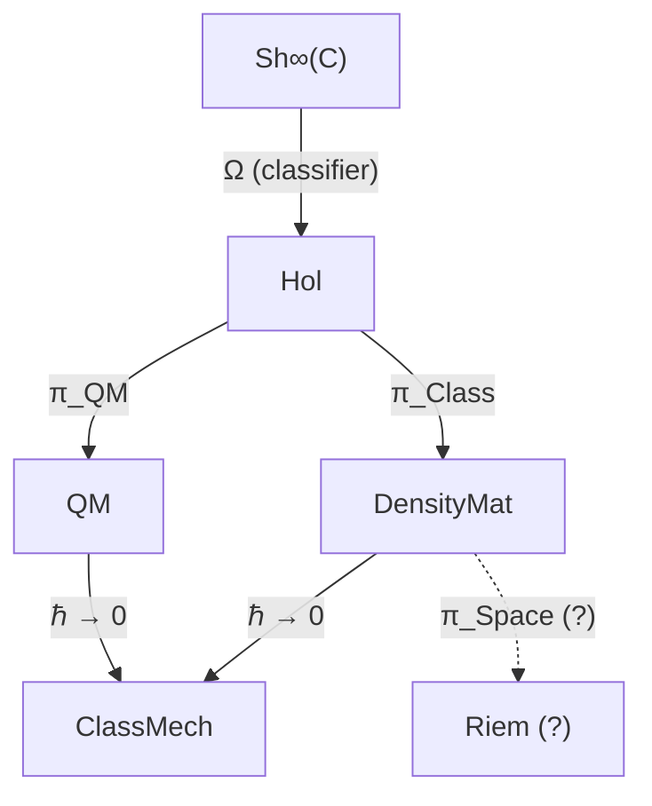

# Reduction of UHM to Quantum Mechanics

:::info Section Status
In §1–§6, Theorem 3.1 (the evolution equation reduces to the von Neumann equation when the dissipator and the regenerator are switched off, $\kappa_0 \to 0$, $\gamma_k \to 0$), Theorem 3.4 and Theorem 1.1 carry **[T]**. Theorem 3.2, the category equivalence $\mathbf{Hol}_{R=0} \simeq \mathbf{QM}$, is retracted [✗] (§4.2); what holds instead is Theorem 3.2′ [T], an equivalence of $\mathbf{Hol}^u$ with seven-dimensional quantum mechanics above purity $2/7$, sharp in scope (§4.2). The classification of Theorem 3.3 is a reading [I]. §8 proves Kochen–Specker contextuality in $\mathbb{C}^7$ with a set of rays built from the Fano plane (T-201′, [T]). An earlier version of this box gave every result of §1–§6 the status [T]; that is retracted. §7 compares them with the reconstructions of quantum theory; its comparisons are interpretations [I].
:::

## Contents

1. [Connection to L-Unification](#1-связь-с-l-унификацией)
2. [Limit Functor and the Schrödinger Equation](#2-предельный-функтор)
3. [Category of Quantum-Mechanical Systems](#3-категория-qm)
4. [Reduction Functor and Category Equivalence](#4-функтор-редукции)
5. [Taxonomy of Physical Systems](#5-таксономия)
6. [Time Discreteness and Page–Wootters](#6-дискретность-времени)
7. [Precedents: Reconstructions of Quantum Theory](#7-прецеденты-реконструкции)
8. [Kochen–Specker Contextuality in the Holon Space](#8-контекстуальность-кш)

---

## 1. Connection to L-Unification {#1-связь-с-l-унификацией}

:::info Key Principle
Reduction to standard QM occurs when **the logical structure Ω trivializes**: at $R_\varphi \to 0$ the system loses the capacity for self-modeling, and the dissipative dynamics $\mathcal{L}_\Omega$ reduces to purely unitary.
:::

In the full UHM theory, the evolution of the coherence matrix $\Gamma$ is described by the **logical Liouvillian** $\mathcal{L}_\Omega$, which is **derived** from the subobject classifier $\Omega$ of the ∞-topos $\text{Sh}_\infty(\mathcal{C})$:

$$
\frac{d\Gamma(\tau)}{d\tau} = \mathcal{L}_\Omega[\Gamma(\tau)]
$$

where:

$$
\mathcal{L}_\Omega[\Gamma] = -i[H_{eff}, \Gamma] + \mathcal{D}_\Omega[\Gamma] + \mathcal{R}[\Gamma, E]
$$

The three components have a clear origin:
- $-i[H_{eff}, \Gamma]$ — **unitary** evolution, preserving purity $P = \text{Tr}(\Gamma^2)$
- $\mathcal{D}_\Omega[\Gamma]$ — **logical dissipation** from Lindblad operators $L_k = \sqrt{\chi_{S_k}}$, derived from atoms of the classifier $\Omega$
- $\mathcal{R}[\Gamma, E]$ — **regeneration**, the adjoint functor to dissipation

Quantum mechanics arises when the last two terms vanish. This occurs upon trivialization of the logical structure $\Omega$: when all characteristic morphisms $\chi_{S_k}$ are fully determined, there is no logical uncertainty, and the system is incapable of self-modeling ($R_\varphi = 0$).

**Derivation chain:**

$$
\Omega \xrightarrow{\text{trivialization}} \chi_{S_k} \text{ defined} \xrightarrow{} \mathcal{D}_\Omega \to 0, \; \mathcal{R} \to 0 \xrightarrow{} \frac{d\Gamma}{d\tau} = -i[H_{eff}, \Gamma]
$$

---

## 2. Limit Functor and the Schrödinger Equation {#2-предельный-функтор}

### 2.1 The Central Theorem

:::tip [T] Theorem 3.1 (Reduction to the Schrödinger equation)
Let $\mathbb{H}$ be a Holon with $R_\varphi \to 0$. Then the [evolution equation](/docs/core/dynamics/evolution) with [emergent internal time](/docs/proofs/dynamics/emergent-time) $\tau$:

$$
\frac{d\Gamma(\tau)}{d\tau} = -i[H_{eff}, \Gamma(\tau)] + \mathcal{D}[\Gamma] + \mathcal{R}[\Gamma, E]
$$

reduces to the von Neumann equation:

$$
\frac{d\rho}{dt} = -i[H, \rho]
$$

for mixed states, or to the Schrödinger equation:

$$
i\hbar\frac{d|\psi\rangle}{dt} = H|\psi\rangle
$$

for pure states $\Gamma = |\psi\rangle\langle\psi|$.
:::

### 2.2 Full Proof

*Proof:*

**Step 1.** At $R_\varphi \to 0$ the system has no significant self-modeling. The reflection measure $R$ is defined through the quality of self-modeling:

$$
R = R(\varphi, \Gamma) \to 0
$$

which means: the self-modeling operator $\varphi$ degenerates.

**Step 2.** The regenerative term vanishes:

$$
\mathcal{R}[\Gamma, E] \propto \kappa(\Gamma) \to 0 \quad \text{at} \quad \kappa_0 \to 0
$$

where $\kappa_0 = \|\mathrm{Nat}(\mathcal{D}_\Omega, \mathcal{R})\|$ is the norm of the natural transformation from the [categorical derivation](/docs/core/foundations/axiom-septicity#структурный-анзац-kappa0). Intuitively: regeneration requires self-modeling; without it ($R \to 0$) the regenerative term disappears.

**Step 3.** The dissipative term vanishes for isolated systems:

$$
\mathcal{D}[\Gamma] = \mathcal{L}_\Omega[\Gamma] + i[H_{eff}, \Gamma] \to 0
$$

The logical structure $\Omega$ "freezes": all characteristic morphisms $\chi_{S_k}$ are trivial (projectors onto eigenspaces), and $\gamma_k \to 0$ for all $k$.

**Step 4.** Only the purely unitary term remains:

$$
\frac{d\Gamma(\tau)}{d\tau} = -i[H_{eff}, \Gamma]
$$

where $H_{eff}$ is the [effective Hamiltonian](/docs/core/dynamics/evolution#вывод-h_eff) arising from the Page–Wootters constraint.

**Step 5.** For a pure state $\Gamma = |\psi\rangle\langle\psi|$, differentiating:

$$
\frac{d|\psi\rangle\langle\psi|}{dt} = \frac{d|\psi\rangle}{dt}\langle\psi| + |\psi\rangle\frac{d\langle\psi|}{dt}
$$

**Step 6.** Substituting into $\frac{d\Gamma}{dt} = -i[H, \Gamma]$:

$$
\frac{d|\psi\rangle}{dt}\langle\psi| + |\psi\rangle\frac{d\langle\psi|}{dt} = -i\left(H|\psi\rangle\langle\psi| - |\psi\rangle\langle\psi|H\right)
$$

Projecting onto $|\psi\rangle$ from the left and right, we obtain:

$$
i\hbar\frac{d|\psi\rangle}{dt} = H|\psi\rangle
$$

$\blacksquare$

### 2.3 Interpretation via L-Unification

Unitary quantum mechanics is the limit where the logical structure $\Omega$ is fully determined and admits no uncertainty. All characteristic morphisms $\chi_{S_k}$ are trivial, which means:

| Aspect | Full UHM ($R > 0$) | QM limit ($R = 0$) |
|--------|--------------------|--------------------|
| Logical structure $\Omega$ | Nontrivial, reflexive | Trivial, "frozen" |
| Characteristic morphisms $\chi_{S_k}$ | Nontrivial projections | Trivial (eigenprojectors) |
| Dissipation $\mathcal{D}_\Omega$ | Nonzero (logical uncertainty) | Zero |
| Regeneration $\mathcal{R}$ | Possible (self-modeling) | Absent |
| Dynamics | Dissipative + regenerative | Purely unitary |

---

## 3. Category of Quantum-Mechanical Systems {#3-категория-qm}

### 3.1 Definition of the Category QM

**Definition 3.1 (Category QM).**

Objects are triples (Hilbert space, Hamiltonian, initial state):

$$
\mathrm{Ob}(\mathbf{QM}) = \{(\mathcal{H}, H, \rho_0) : \mathcal{H} \text{ — Hilbert space, } H = H^\dagger, \rho_0 \text{ — initial state}\}
$$

Morphisms are unitary transformations mapping one state to another:

$$
\mathrm{Mor}_{\mathbf{QM}}((H_1, \rho_1), (H_2, \rho_2)) = \{U : U^\dagger U = I, \; U\rho_1 U^\dagger = \rho_2\}
$$

### 3.2 Connection to the Category of Holons

The category $\mathbf{Hol}$ (of Holons) is defined via:
- **Objects:** Holons $\mathbb{H}$ with 7-dimensional coherence matrix $\Gamma^{(7)}$
- **Morphisms:** Structure-preserving CPTP channels

The forgetful functor $\mathcal{U}: \mathbf{Hol} \to \mathbf{DensityMat}$ is defined by:

$$
\mathcal{U}(\mathbb{H}) := \Gamma_{\mathbb{H}}^{(7)}, \quad \mathcal{U}(f: \mathbb{H}_1 \to \mathbb{H}_2) := \Phi_f
$$

where $\Phi_f$ is the CPTP channel induced by morphism $f$.

:::tip [T] Theorem 1.1 (Functoriality of the forgetful functor)
$\mathcal{U}$ is a functor preserving identities and composition.

*Proof:* Direct consequence of the definition of morphisms in $\mathbf{Hol}$ as structure-preserving CPTP channels. $\blacksquare$
:::

---

## 4. Reduction Functor and Category Equivalence {#4-функтор-редукции}

### 4.1 Definition of the Reduction Functor

**Definition 3.2 (Reduction functor).**

$$
\pi_{\text{QM}}: \mathbf{Hol}_{R \to 0} \to \mathbf{QM}
$$

$$
\pi_{\text{QM}}(\mathbb{H}) := (\mathcal{H}_{\mathbb{H}}, H_{\mathbb{H}}, \Gamma_{\mathbb{H}})
$$

The functor $\pi_{\text{QM}}$ assigns to each Holon with $R \to 0$ a quantum-mechanical system: its Hilbert space, effective Hamiltonian, and density matrix.

### 4.2 The Equivalence Theorem

:::warning Retracted: Theorem 3.2 (Category equivalence $\mathbf{Hol}_{R=0} \simeq \mathbf{QM}$) [✗]
An earlier version stated as [T] that the restriction $\pi_{\text{QM}}|_{\mathbf{Hol}_{R=0}}$ is an equivalence of categories $\mathbf{Hol}_{R=0} \simeq \mathbf{QM}$. That is false, and each step of its proof fails.

- **Essential surjectivity fails.** An equivalence must reach every object of $\mathbf{QM}$ up to isomorphism, and the isomorphisms of $\mathbf{QM}$ are unitaries, which preserve dimension and purity. $\mathbf{QM}$ contains systems of every dimension — a qubit, $\mathcal{H} = \mathbb{C}^2$ — and states of every purity — $I/7$, with $P = 1/7$. Objects of $\mathbf{Hol}$ are seven-dimensional coherence matrices with $P > 2/7$ ([Definition 12.1 (V)](/docs/proofs/categorical/categorical-formalism#категория-голономов-hol)), so neither the qubit nor $(\mathbb{C}^7, H, I/7)$ is isomorphic to any $\pi_{\text{QM}}(\mathbb{H})$. Under the master definition $R = 1/(7P) \geq 1/7$ of the [reflection measure](/docs/consciousness/foundations/self-observation#мера-рефлексии-r) no holon has $R = 0$ at all, so $\mathbf{Hol}_{R=0}$ is empty.
- **"At $R = 0$ CPTP channels degenerate to unitaries" is not justified.** Morphisms of $\mathbf{Hol}$ are CPTP channels that preserve viability and commute with self-modelling; nothing in that definition makes them unitary. The replacement channel $X \mapsto \mathrm{Tr}(X)\,\rho^*$ onto a fixed point $\rho^*$ of self-modelling meets both conditions and is not unitary; with no rule sending it to a unitary, $\pi_{\text{QM}}$ is not even defined on morphisms.
- **Full faithfulness is not proven.** The proof asserts a bijection of hom-sets without constructing the functor on morphisms.
:::

**What holds instead.** An earlier note here (2026-09-25) called the following an "identification by definition [D]" and stated it as an isomorphism with the full subcategory on seven-dimensional systems of purity above $2/7$. It is not an isomorphism — a holon also needs $\rho_E \neq 0$, which unitary conjugation does not preserve — but it is an equivalence, and that is a theorem.

Let $\mathbf{Hol}^{u}$ be the category whose objects are pairs $(\Gamma, H)$ with $\Gamma$ an object of $\mathbf{Hol}$ ([Definition 12.1](/docs/proofs/categorical/categorical-formalism#категория-голономов-hol)) and $H$ a Hamiltonian, and whose morphisms $(\Gamma_1, H_1) \to (\Gamma_2, H_2)$ are all unitaries $U$ with $U\Gamma_1U^\dagger = \Gamma_2$, as in Definition 3.1. For a single seven-dimensional state the conditions of Definition 12.1 read: (V) $P = \mathrm{Tr}\,\Gamma^2 > 2/7$; (PH) $\rho_E \neq 0$, which in the 7D formalism is $\gamma_{EE} > 0$; (AP) holds for every state (the replacement channel $X \mapsto \mathrm{Tr}(X)\,\Gamma$ fixes $\Gamma$); (QG) is a condition on the generator, carried by $H$. Let $\mathbf{QM}_7^{>2/7}$ be the full subcategory of $\mathbf{QM}$ on the objects $(\mathbb{C}^7, H, \rho)$ with $\mathrm{Tr}\,\rho^2 > 2/7$.

:::tip Theorem 3.2′ (Holons are seven-dimensional quantum mechanics above purity 2/7) [T]
1. The inclusion $\iota : \mathbf{Hol}^{u} \to \mathbf{QM}_7^{>2/7}$, $(\Gamma, H) \mapsto (\mathbb{C}^7, H, \Gamma)$, is an equivalence of categories. It is not an isomorphism: $(\mathbb{C}^7, H, |O\rangle\langle O|)$ has $P = 1$ and $\gamma_{EE} = 0$, so it is not a holon, yet it is isomorphic in $\mathbf{QM}$ to one.
2. Its isomorphism classes are the spectra $\lambda_1 \geq \dots \geq \lambda_7 \geq 0$ with $\sum\lambda_i = 1$ and $\sum\lambda_i^2 > 2/7$; the automorphism group of an object is the centraliser of $\Gamma$ in $U(7)$, $\prod_i U(m_i)$ over the eigenvalue multiplicities $m_i$.
3. No equivalence $\mathbf{Hol}^{u} \simeq \mathbf{QM}$ exists, and none after restricting $\mathbf{QM}$ to any class containing a qubit or the state $I/7$: dimension and purity are invariants of isomorphism in $\mathbf{QM}$.
4. Every quantum system of dimension $d \leq 3$ is holonic: an isometry $V : \mathbb{C}^d \to \mathbb{C}^7$ gives a faithful functor $\mathbf{QM}_d \to \mathbf{QM}_7^{>2/7} \simeq \mathbf{Hol}^u$, $(\mathbb{C}^d, H, \rho) \mapsto (\mathbb{C}^7, VHV^\dagger, V\rho V^\dagger)$, $U \mapsto VUV^\dagger + (1 - VV^\dagger)$, because every state on $\mathbb{C}^d$ has $\mathrm{Tr}\,\rho^2 \geq 1/d \geq 1/3 > 2/7$. The bound $d \leq 3$ is sharp: for $d \geq 4$ the state $I/d$ has purity $1/d \leq 1/4 < 2/7$, and an isometric embedding preserves purity, so $I/d$ is the image of no holon. The functor is not full (unitaries acting on the complement of $V\mathbb{C}^d$ are extra morphisms).
:::

**Proof.** (1) Both categories are full subcategories of $\mathbf{QM}$, so $\iota$ is fully faithful. Essential surjectivity: for $(\mathbb{C}^7, H, \rho)$ with $\mathrm{Tr}\,\rho^2 > 2/7$ pick an index $j$ with $\rho_{jj} > 0$ (one exists, since $\mathrm{Tr}\,\rho = 1$) and the permutation unitary $\Pi$ exchanging $|j\rangle$ and $|E\rangle$. Then $\Pi$ is an isomorphism $(\mathbb{C}^7, H, \rho) \to (\mathbb{C}^7, \Pi H\Pi^\dagger, \Pi\rho\Pi^\dagger)$ in $\mathbf{QM}$, the target has $\gamma_{EE} = \rho_{jj} > 0$ and the same purity, so it lies in the image of $\iota$. (2) Unitary orbits of density matrices are classified by spectra, and the purity is $\sum\lambda_i^2$; the stabiliser of a Hermitian matrix under conjugation is the product of the unitary groups of its eigenspaces. (3) A unitary preserves dimension and spectrum. (4) $\mathrm{Tr}\,\rho^2 \geq 1/d$ is Cauchy–Schwarz on the eigenvalues; $V\rho V^\dagger$ has the eigenvalues of $\rho$ padded with zeros, hence the same purity; $U \mapsto VUV^\dagger + (1 - VV^\dagger)$ preserves products and identities and is injective. Numerical witness: `test_hol_u_is_equivalent_to_seven_dimensional_qm_above_two_sevenths`. $\blacksquare$

The theorem is the correct form of the retracted Theorem 3.2 and is as strong as the definitions allow: seven-dimensional quantum mechanics above the viability threshold *is* the category of holons with unitary morphisms, up to equivalence, and all of qubit and qutrit quantum mechanics sits inside it; beyond three levels the maximally mixed states do not. The dynamical content of the reduction remains Theorem 3.1.

### 4.3 Physical Meaning of the Equivalence

:::info What the reduction does and does not mean
Theorem 3.1 shows that when the dissipator and the regenerator are switched off, the UHM equation is the von Neumann equation on $\mathcal{D}(\mathbb{C}^7)$. It does not show that standard quantum mechanics is contained in UHM: quantum systems of other dimensions, and seven-dimensional states with $P \leq 2/7$, are not holons. An earlier version of this box read the retracted Theorem 3.2 as "standard quantum mechanics is **exactly** contained in UHM as a special case at zero reflection; all results of QM automatically hold in UHM at $R = 0$"; that reading is retracted with it.

New UHM effects (regeneration, self-modeling, consciousness) are the terms that Theorem 3.1 switches off.
:::

### 4.4 Commutative Diagram

The full category hierarchy connecting UHM to physics:

Key role of $\Omega$:
- The $\infty$-topos $\text{Sh}_\infty(\mathcal{C})$ contains the classifier $\Omega$
- The Lindblad operators are derived from $\Omega$: $L_k = \sqrt{\chi_{S_k}}$
- All physical dynamics is determined by the logical structure of $\Omega$

---

## 5. Taxonomy of Physical Systems {#5-таксономия}

### 5.1 Classification by $R$ and the Structure of $\Omega$

:::tip [I] Theorem 3.3 (Classification by $R$ and the structure of $\Omega$)

| Parameter $R$ | $\Omega$ Structure | Dynamics | Physical system |
|---------------|--------------------|----------|-----------------|
| $R = 0$ | Trivial (all $\chi_S$ defined) | $\frac{d\Gamma}{dt} = -i[H, \Gamma]$ | Unitary QM (quarks, leptons, bosons) |
| $R \ll 1/3$ | Partially defined | $\frac{d\Gamma}{dt} = -i[H, \Gamma] + \mathcal{L}_\Omega[\Gamma]$ | Open QM (atoms in a medium) |
| $R \geq 1/3$ | Reflexive ($\Omega$ models itself) | Full equation with $\mathcal{R}[\Gamma, E]$ | Living systems (cells, organisms) |

Status [I]: under the master definition $R = 1/(7P) \in [1/7, 1]$ the row $R = 0$ describes no state of $\mathcal{D}(\mathbb{C}^7)$; the table reads $R$ as the quality of self-modelling and is a classification scheme, not a theorem. (An earlier header gave it [T]; retracted.)
:::

### 5.2 Detailed Interpretation

**At $R = 0$ (Unitary QM):**
The logical structure $\Omega$ is completely trivial. All characteristic morphisms are determined unambiguously; there is no logical uncertainty. The system is incapable of self-modeling. The dynamics is purely unitary — this is standard quantum mechanics of elementary particles.

**At $R \ll 1/3$ (Open QM):**
The logical structure is partially defined. Nontrivial characteristic morphisms exist, but the system is insufficiently complex for full self-modeling. The dynamics includes dissipation (Lindblad equation) but no regeneration. This is the standard theory of open quantum systems.

**At $R \geq 1/3$ (Living systems):**
The logical structure $\Omega$ is reflexive — the system is capable of modeling its own logical structure. All three terms of the equation are active: unitary, dissipative, and regenerative. This is the domain unique to UHM.

:::warning Physical consequence
The distinction between systems with $R = 0$ and $R > 0$ (colloquially — "dead" and "living" matter) lies in the structure of the logical classifier $\Omega$: systems with nonzero regeneration are capable of modeling their own logical structure. The threshold $R_{crit} = 1/3$ is not an arbitrary parameter but a consequence of the structure of $\Omega$.
:::

### 5.3 Transitions Between Regimes

The classification is continuous: as $R$ increases from 0, the system smoothly transitions from unitary QM through open QM to the full UHM dynamics:

$$
\underbrace{R = 0}_{\text{QM}} \xrightarrow{\text{growing complexity}} \underbrace{0 < R < 1/3}_{\text{Open QM}} \xrightarrow{R = 1/3} \underbrace{R \geq 1/3}_{\text{UHM (living systems)}}
$$

---

## 6. Time Discreteness and Page–Wootters {#6-дискретность-времени}

### 6.1 Connection to L-Unification

:::info Key Mechanism
In [Axiom Ω⁷](/docs/core/foundations/axiom-omega), time is **derived** from the [Page–Wootters mechanism](/docs/proofs/dynamics/emergent-time) via the **temporal modality ▷** on the classifier $\Omega$.

$$
\tau_n = \triangleright^n(\text{now}), \quad n \in \mathbb{Z}_7
$$

Time discreteness is a consequence of the finite structure of $\Omega$.
:::

### 6.2 The Discreteness Theorem

:::tip [T] Theorem 3.4 (Discreteness of internal time)
For a finite-dimensional system with $\dim(\mathcal{H}_O) = N$, internal time takes values from the cyclic group:

$$
\tau \in \mathbb{Z}_N = \{0, 1, 2, \ldots, N-1\}
$$

For UHM with $N = 7$: $\tau \in \mathbb{Z}_7$.
:::

*Proof:* Follows from the finite-dimensionality of the [clock algebra](/docs/core/structure/dimension-o#алгебра-часов) $\mathcal{A}_O \cong M_7(\mathbb{C})$.

The clock algebra $\mathcal{A}_O = C^*(H_O, V_O)$, where:
- $H_O = \omega_0 \sum_{k=0}^{6} k |k\rangle\langle k|_O$ — clock Hamiltonian
- $V_O = \sum_{k=0}^{5} |k+1\rangle\langle k| + |0\rangle\langle 6|$ — cyclic shift operator

The eigenvalues of $H_O$ form the finite spectrum $\{0, \omega_0, 2\omega_0, \ldots, 6\omega_0\}$, defining $N = 7$ discrete time steps. $\blacksquare$

### 6.3 Physical Consequences

| Consequence | Formula | Status |
|-------------|---------|--------|
| Time quantum (chronon) | $\delta\tau = 2\pi/(7\omega_0)$ | [T] Consequence |
| Continuum limit | $N \to \infty \Rightarrow \tau \in \mathbb{R}$ | [T] Proved |
| Discrete $\infty$-groupoid | $\mathbf{Exp}^{disc}_\infty$ for $N < \infty$ | [T] [Formalized](/docs/proofs/categorical/categorical-formalism#exp-disc-infty) |

### 6.4 Connection to the 42D Formalism

Full Page–Wootters state space:

$$
\mathcal{H}_{total} = \mathcal{H}_O \otimes \mathcal{H}_{6D}, \quad \dim = 7 \times 6 = 42
$$

where $\mathcal{H}_{6D} = \text{span}\{|A\rangle, |S\rangle, |D\rangle, |L\rangle, |E\rangle, |U\rangle\}$ — the 6 remaining Holon dimensions.

The minimal 7D formalism is obtained via diagonal embedding — see [Coherence Matrix](/docs/core/dynamics/coherence-matrix#two-levels-of-formalization).

### 6.5 The $N \to \infty$ Limit

:::info Algebraic, not topological limit
As $N \to \infty$, discrete time $\tau \in \mathbb{Z}_N$ passes to continuous time **algebraically**:

$$
\lim_{N \to \infty} \mathbb{C}[\mathbb{Z}_N] \cong C(S^1)
$$

as $C^*$-algebras. Topologically $\hat{\mathbb{Z}} = \varprojlim_N \mathbb{Z}_N$ is a totally disconnected space, whereas $U(1) \cong S^1$ is connected. The transition is **algebraic** (group algebras), not topological (groups).
:::

Scaled limit:

$$
t := \lim_{N \to \infty} \tau_n \cdot \delta\tau(N) = \lim_{N \to \infty} \tau_n \cdot \frac{2\pi}{N \cdot \omega_0}
$$

| $N$ | $\delta\tau$ | Interpretation |
|-----|--------------|----------------|
| 7 | $\approx 0.9/\omega_0$ | UHM chronon (minimal quantum of subjective time) |
| 100 | $\approx 0.063/\omega_0$ | Mesoscopic limit |
| $\infty$ | 0 | Classical limit (continuous time) |

---

## 7. Precedents: Reconstructions of Quantum Theory {#7-прецеденты-реконструкции}

This page obtains quantum mechanics from UHM by switching off two terms of an evolution equation that is already written in the Hilbert-space formalism: the objects of the base category are density matrices on $\mathbb{C}^{42}$ ([Property 1](/docs/core/foundations/axiom-omega#свойство-1)), processes are CPTP channels, probabilities are traces. Since 2001 a separate line of research has done what UHM does not: it **derives** that formalism — complex Hilbert spaces, density matrices, unitary dynamics, the trace rule for probabilities — from requirements on how systems can be prepared, transformed and measured. These derivations are the relevant precedent for any claim that UHM "derives" quantum mechanics, and they bear on UHM in two ways, both stated in §7.2.

They work inside **generalized probabilistic theories** (GPTs): a state is simply the list of outcome probabilities for a fixed set of measurements, and a theory is specified by which states, transformations and measurements it allows. Classical probability theory and quantum theory are two such theories; a **reconstruction** is a theorem that picks out quantum theory among all of them from a few physical requirements.

### 7.1 The reconstructions {#71-реконструкции}

- **Hardy (2001).** L. Hardy, "Quantum theory from five reasonable axioms", arXiv:quant-ph/0101012. A system is characterised by two integers: $K$, the number of probabilities needed to fix a state, and $N$, the largest number of states that can be told apart in a single shot. From five axioms — probabilities as limits of relative frequencies; *simplicity* ($K$ is the smallest function of $N$ consistent with the other axioms); *subspaces* (a system confined to $M$ of its $N$ distinguishable states behaves as a system with $N = M$); *composite systems* ($N_{AB} = N_A N_B$, $K_{AB} = K_A K_B$); *continuity* (a continuous reversible transformation connects any two pure states) — Hardy derives $K = N^r$ with $r$ a positive integer and then $r = 2$, which is complex quantum theory. Dropping the single word "continuous" leaves classical probability theory, with $K = N$.
- **Dakić and Brukner (2011).** B. Dakić, Č. Brukner, "Quantum theory and beyond: is entanglement special?", in *Deep Beauty: Understanding the Quantum World through Mathematical Innovation*, ed. H. Halvorson, Cambridge University Press 2011, pp. 365–392, doi:10.1017/CBO9780511976971.011, arXiv:0911.0695. Three axioms — all systems that carry at most one bit are equivalent; the state of a composite system is fixed by measurements on its parts; any two pure states are connected by a reversible transformation — reconstruct classical probability theory and quantum theory, and continuity of the transformation separates quantum theory. A by-product: no other probabilistic theory can have entanglement without breaking one of the axioms.
- **Masanes and Müller (2011).** Ll. Masanes, M. P. Müller, "A derivation of quantum theory from physical requirements", *New J. Phys.* **13**, 063001 (2011), arXiv:1004.1483. Five requirements — *finiteness* (a system with two distinguishable states has a finite-dimensional state space), *local tomography* (the state of a composite is fixed by the statistics of measurements on its parts), *equivalence of subspaces*, *symmetry* (every pure state can be reversibly mapped to every other), *all measurements allowed* — are met by exactly two theories, classical probability theory and quantum theory; requiring the reversible transformations to be continuous leaves quantum theory alone. The three-dimensionality of the qubit's Bloch ball gets a group-theoretic explanation.
- **Chiribella, D'Ariano and Perinotti (2011).** G. Chiribella, G. M. D'Ariano, P. Perinotti, "Informational derivation of quantum theory", *Phys. Rev. A* **84**, 012311 (2011), arXiv:1011.6451. Five informational principles — causality, perfect distinguishability, ideal compression, local distinguishability, pure conditioning — define a class of theories; one further postulate, **purification** (every mixed state is the marginal of a pure state of a larger system, unique up to a reversible transformation of the added system), singles out finite-dimensional quantum theory, derived without assuming the Hilbert-space framework.
- **The seven-dimensional case with $G_2$ (2013–2021).** In these reconstructions the elementary system — the analogue of a bit — has a Euclidean ball as its state space, and the requirement that any pure state be reachable from any other by a reversible transformation makes its symmetry group transitive on the boundary sphere. For odd ball dimension $d \neq 7$ that group must be $SO(d)$; for $d = 7$ it may also be the exceptional group $G_2$, transitive on $S^6$. This is the one place where the octonionic structure used by UHM appears in the reconstruction literature, and it has been examined and set aside. B. Dakić and Č. Brukner ("The classical limit of a physical theory and the dimensionality of space", in *Quantum Theory: Informational Foundations and Foils*, eds. G. Chiribella, R. W. Spekkens, Springer 2016, arXiv:1307.3984, §VI.C) showed that the unique $G_2$-invariant tensor — the octonionic structure constants $\psi_{ijk}$, nonzero exactly on the seven Fano triples — couples the system to a classical field through generators outside $\mathfrak{g}_2$, so the dynamics leaves $G_2$ and would have to be $SO(7)$, a case they had already excluded. Ll. Masanes, M. P. Müller, D. Pérez-García and R. Augusiak ("Entanglement and the three-dimensionality of the Bloch ball", *J. Math. Phys.* **55**, 122203 (2014), arXiv:1111.4060, §IV.I) proved that two such systems with local group $G_2$ admit no interacting dynamics, hence no entanglement. M. P. Müller's review calls the $d = 7$ ball with $G_2$ "a curious special case", ruled out for two systems, and leaves open whether a post-quantum $G_2$-related theory exists for three or more (lecture notes cited under *Standing* below, §4.2).
- **Höhn (2017).** P. A. Höhn, "Toolbox for reconstructing quantum theory from rules on information acquisition", *Quantum* **1**, 38 (2017), arXiv:1412.8323; the many-qubit case is completed in P. A. Höhn, C. S. M. Wever, "Quantum theory from questions", *Phys. Rev. A* **95**, 012102 (2017), arXiv:1511.01130. An observer interrogates a system with yes/no questions; four rules — a limit on the information available, the existence of complementary information, conservation of the total information between interrogations, and continuous evolution of the observer's knowledge — give the Bloch ball of a qubit (and the disc of a rebit, which an extra rule removes), with unitary time evolution.

**Standing.** These are accepted theorems within the GPT framework; what the field discusses is which requirements are physically compelling. Dakić and Brukner, for instance, note that most earlier attempts either fall short of deriving the theory uniquely or rest on abstract assumptions that themselves need physical motivation (2011, abstract), and Masanes and Müller replaced Hardy's simplicity axiom by their fifth requirement (2011, §I). M. P. Müller's lecture notes review the framework and a reconstruction from tomographic locality, continuous reversibility and the subspace axiom ("Probabilistic theories and reconstructions of quantum theory", *SciPost Phys. Lect. Notes* **28** (2021), arXiv:2011.01286).

### 7.2 What the reconstructions mean for UHM {#72-что-реконструкции-значат-для-угм}

The four points below are interpretive comparisons [I]; each names the corpus statement it rests on.

1. **UHM posits what the reconstructions derive.** The corpus says so itself. Its epistemic audit names the quantum posit (QG) — "that the states of reality form a quantum state space (density operators on a Hilbert space)" — as one of the two inputs UHM does not derive, and adds that reconstruction programmes could relocate (QG) to weaker operational axioms but cannot remove a first posit ([epistemic vertical, §8](/docs/reference/epistemic-vertical#края)); T-190 derives the axioms A1–A5 *from* (AP)+(PH)+(QG)+(V) together with MaxEnt, with (QG) among the premises. Nothing on this page derives complex numbers, the trace rule or the tensor product: Theorem 3.1 removes $\mathcal{D}$ and $\mathcal{R}$ from an equation that already contains $-i[H_{\mathrm{eff}}, \Gamma]$, and the retracted Theorem 3.2 compared two categories that are both built from Hilbert spaces. "Reduction" in the title therefore means that standard quantum mechanics is a regime of UHM, not that UHM produces it. The reconstructions are not rivals of this page; they are the step that would have to come before it, and that step is not in the corpus.
2. **The regime $R > 0$ lies outside every reconstructed theory.** Each reconstruction starts from the operational meaning of a mixture: if a preparation is a coin-flip mixture of two preparations, it cannot matter whether the outcome of the coin is forgotten before or after a transformation, so every transformation acts affinely on states, $T(q\rho_1 + (1-q)\rho_2) = qT(\rho_1) + (1-q)T(\rho_2)$ (Hardy 2001, Eqs. (41)–(46); Masanes and Müller 2011, §II C). The regenerative term of UHM is not affine in $\Gamma$ — it is weighted by $\kappa(\Gamma)$ and $g_V(P(\Gamma))$ ([evolution, §3](/docs/core/dynamics/evolution#3-регенеративный-член)) — so the full UHM dynamics violates the requirement from which the reconstructions start. A no-go theorem makes the stake explicit: C. Simon, V. Bužek and N. Gisin showed that if states are described in Hilbert space, outcome probabilities follow the trace rule and superluminal signalling is impossible, then the dynamics must be linear and completely positive on density matrices ("The no-signaling condition and quantum dynamics", *Phys. Rev. Lett.* **87**, 170405 (2001), arXiv:quant-ph/0102125). The corpus meets the nonlinearity question with the statement that its evolution depends on $\Gamma$ alone ([ensemble independence](/docs/proofs/physics/physics-correspondence#85-ансамблевая-независимость)); that statement does not answer this theorem, because a map can depend on $\Gamma$ alone and still fail to be affine. This collision is not yet answered in the corpus.
3. **Where UHM goes further.** Nowhere in the domain of the reconstructions: no corpus theorem improves on a reconstruction theorem. UHM's specific content — the dimension seven, the Fano form of the dissipator — lies downstream of (QG) and concerns which quantum system is meant, not why the theory is quantum.
4. **UHM's seven and $G_2$ are not the rejected $d = 7$ ball.** The case set aside in §7.1 is a seven-dimensional *state space* of an elementary system, a Bloch ball with boundary $S^6$. The state space of a holon is $\mathcal{D}(\mathbb{C}^7)$ — a quantum seven-level system with pure states $\mathbb{CP}^6$ and 48 real parameters — on which $G_2 \subset SO(7) \subset U(7)$ acts as a symmetry inside ordinary quantum theory. Those results therefore do not refute UHM. What they show is that when the combination "seven, $G_2$, Fano triples" was tried as the foundation of a probabilistic theory, it failed — one more reason why UHM's use of it has to stay downstream of the quantum posit (QG), as point 1 says.

---

## 8. Kochen–Specker Contextuality in the Holon Space {#8-контекстуальность-кш}

The Fano-line projectors $\Pi_\ell = \sum_{i \in \ell}|i\rangle\langle i|$ commute, and the distribution $p_i = \gamma_{ii}$ reproduces every one of their contexts, so they show no contextuality; the former T-201 claimed otherwise and is retracted ([registry](/docs/reference/status-registry), `test_fano_line_projectors_commute_hence_noncontextual`). Contextuality needs non-commuting projectors. The Fano plane supplies a canonical set of them.

**The rays.** In $\mathbb{R}^7 \subset \mathbb{C}^7$ take the seven basis vectors $|i\rangle$ and, for each of the seven complements $q = \{a, b, c, d\}$ of a Fano line (the words of weight four of the Hamming code $H(7,4)$ of Step T8), the eight rays $\tfrac12(|a\rangle \pm |b\rangle \pm |c\rangle \pm |d\rangle)$. These are 63 rays; with both signs they are 126 unit vectors, closed under the reflections $v \mapsto v - 2\langle u, v\rangle u$ — the root system $E_7$. As octonions they are the purely imaginary units of Coxeter's integral octonions. No orientation of the Fano lines enters: only the lines, through their complements, do.

:::tip Theorem T-201′ (Kochen–Specker contextuality of the Fano–Hamming rays) [T]
The 63 rays form 135 orthonormal bases of $\mathbb{C}^7$, each ray lying in 15 of them, and every set of mutually orthogonal rays extends to one of these bases. There is no assignment $v : \{\text{rays}\} \to \{0, 1\}$ with exactly one ray of value 1 in each basis. Hence for every state $\Gamma \in \mathcal{D}(\mathbb{C}^7)$ the rank-one projectors onto these rays admit no non-contextual value assignment: UHM's state space carries state-independent Kochen–Specker contextuality, with projectors from different bases that do not commute (1008 of the 1953 pairs of rays are neither orthogonal nor equal).
:::

**Proof.** The counts are a finite enumeration of the maximal orthogonal subsets (all have seven elements). Non-colourability is a finite 0/1 feasibility problem — 63 variables, 135 equality constraints $\sum_{r \in b} v_r = 1$ — and it is infeasible; this is checked by an exact integer-programming solver (`test_e7_rays_from_the_hamming_quadrangles_are_kochen_specker`) and was confirmed independently by a propagating backtracking search. A basis-critical subfamily of 36 of the 135 bases is already uncolourable. The configuration $63_{15}$–$135_7$ of the $E_7$ rays and its Kochen–Specker property are due to A. Ruuge, "Exceptional and non-crystallographic root systems and the Kochen–Specker theorem", *J. Phys. A: Math. Theor.* **40**, 2849–2859 (2007), arXiv:0906.2696; what is added here is its construction from the Fano plane and the Hamming code of the UHM chain. $\blacksquare$

**What this does and does not claim.** Kochen–Specker sets exist in every dimension $d \geq 3$, so contextuality of $\mathbb{C}^7$ is expected; the content of T-201′ is that the canonical structure the UHM chain produces (the Fano plane of Step T12 and its Hamming code of Step T8) yields a Kochen–Specker set without further choices. It does not claim that the Fano channel or the line projectors are contextual, and it does not revive the retracted corollary about SYNARC distinguishing classical from quantum outcomes.

---

## Summary Table of Results

| Theorem | Statement | Status |
|---------|-----------|--------|
| **T.3.1** | Reduction to the Schrödinger equation at $R \to 0$ | [T] Proved |
| **T.3.2** | ~~Category equivalence $\mathbf{Hol}_{R=0} \simeq \mathbf{QM}$~~ | [✗] Retracted (§4.2) |
| **T.3.2′** | $\mathbf{Hol}^u \simeq \mathbf{QM}_7^{>2/7}$; all of $\mathbf{QM}_d$, $d \leq 3$, embeds faithfully; sharp at $d = 4$ | [T] Proved (§4.2) |
| **T-201′** | Kochen–Specker contextuality of the 63 Fano–Hamming ($E_7$) rays in $\mathbb{C}^7$ | [T] Proved (§8) |
| **T.3.3** | Classification of systems by $R$ and $\Omega$ | [I] Classification scheme (the row $R = 0$ is empty under $R = 1/(7P)$) |
| **T.3.4** | Discreteness of internal time $\tau \in \mathbb{Z}_N$ | [T] Proved |
| **T.1.1** | Functoriality of the forgetful functor $\mathcal{U}: \mathbf{Hol} \to \mathbf{DensityMat}$ | [T] Proved |

---

**Related Documents:**
- [Physics Correspondence](/docs/proofs/physics/physics-correspondence) — full context of theorems 3.1-3.4
- [Quantum Measurement](/docs/physics/quantum-mechanics/measurement) — theory of measurement from $\Omega$
- [Evolution of Γ](/docs/core/dynamics/evolution) — equation of motion, derivation of $H_{eff}$
- [Emergent Time](/docs/proofs/dynamics/emergent-time) — Page–Wootters mechanism, modality ▷
- [Axiom Ω⁷](/docs/core/foundations/axiom-omega) — L-unification: $\Omega \to \chi_S \to L_k \to \mathcal{L}_\Omega \to \varphi$
- [Coherence Matrix](/docs/core/dynamics/coherence-matrix) — definition of $\Gamma$, connection between formalisms
- [Dimension O](/docs/core/structure/dimension-o) — clock algebra $H_O$, $V_O$, $\mathcal{A}_O$
- [Critical Purity](/docs/proofs/dynamics/theorem-purity-critical) — connection of $P_{crit} = 2/7$ to time
- [Categorical Formalism](/docs/proofs/categorical/categorical-formalism) — functor $F$, $\mathbf{Exp}^{disc}_\infty$
- [Physics — Overview](/docs/physics/overview) — complete results map
