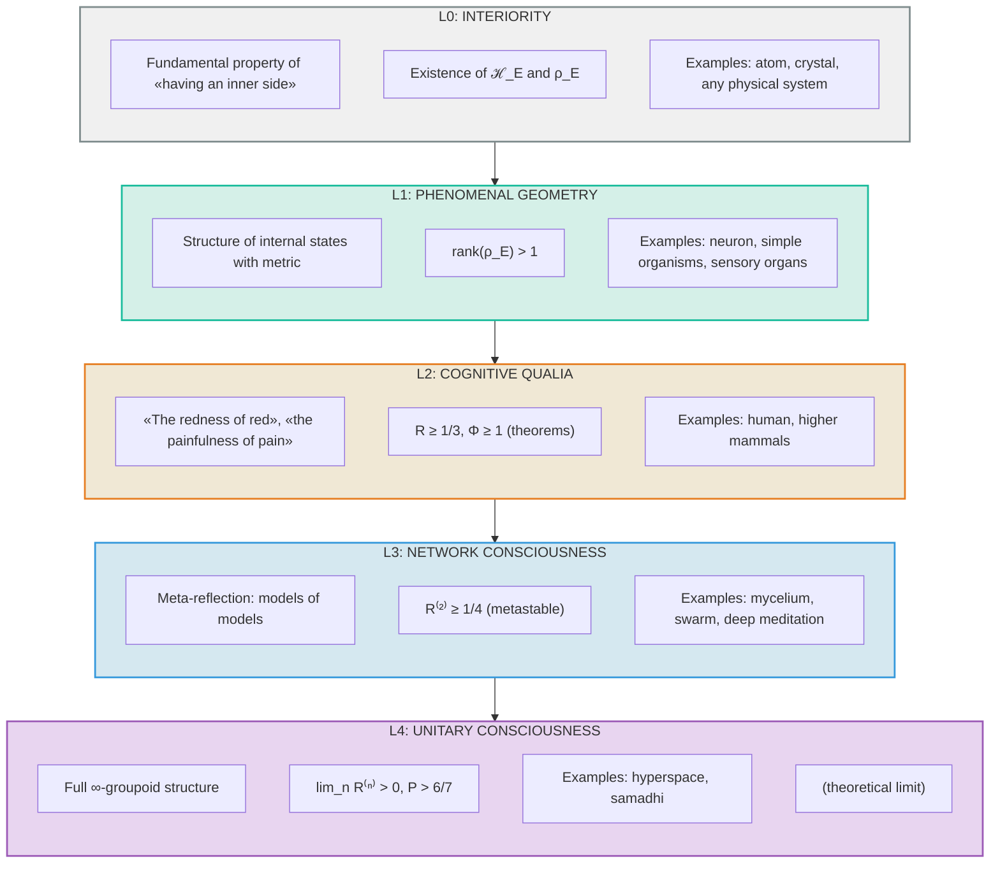

# Interiority Hierarchy: Formal Specification

## Terminological Revision for Unitary Holonomic Monism

:::note On notation
In this document:
- $\mathcal{H}_E$ — Hilbert space of the [Interiority dimension](/docs/core/structure/dimension-e). Not to be confused with $H$ — the Hamiltonian.
- $D_{\text{diff}}$ — differentiation measure. Not to be confused with $D$ — the [Dynamics dimension](/docs/core/structure/dimension-d).
- $\Phi$ — [integration measure](/docs/core/structure/dimension-u#мера-интеграции-φ). Not to be confused with CPTP channels $\Phi$.
- $R$ — [reflection measure](/docs/consciousness/foundations/self-observation#мера-рефлексии-r).
:::

## Motivation

### The problem

The term **"Qualia"** has historically been associated with *conscious* subjective experience (Nagel, 1974; Chalmers, 1996). UHM uses it to describe a fundamental property of *any* system, including atoms, which creates:

1. **Terminological conflict**: Philosophers of mind understand qualia as "the redness of red," "the painfulness of pain" — phenomena requiring a conscious subject.

2. **Anthropomorphism**: Attributing "qualia" to an atom implicitly transfers to it the properties of conscious experience.

3. **Conceptual dilution**: If everything has qualia, the term loses its discriminative force.

### The solution

Introduction of a **five-level hierarchy** (L0→L1→L2→L3→L4), where each level has:
- A strict mathematical definition
- Explicit conditions of applicability
- Examples of systems at that level

---

## Part I: Formal Definitions

## Level 0: Interiority {#уровень-0-интериорность-interiority}

### Definition 0.1 (Interiority)

**Interiority** is a fundamental topological property of the [Coherence Matrix](/docs/core/dynamics/coherence-matrix) $\Gamma$ of having an "inner side."

Formally, a system $S$ possesses interiority if and only if:

$$
\mathrm{Int}(S) := \exists \mathcal{H}_E, \exists \rho_E \in \mathcal{L}(\mathcal{H}_E) : \rho_E = \mathrm{Tr}_{-E}(\Gamma_S)
$$

where:
- $\mathcal{H}_E$ — Hilbert space of the [Interiority dimension](/docs/core/structure/dimension-e)
- $\rho_E$ — reduced density matrix of dimension $E$
- $\mathrm{Tr}_{-E}$ — partial trace over all dimensions except $E$
- $\Gamma_S$ — full coherence matrix of system $S$

### Theorem 0.1 (Universality of Interiority)

**Statement:** Any system described by a coherence matrix $\Gamma$ in the extended formalism possesses interiority.

:::warning Precondition: tensor structure
The theorem requires the **extended tensor formalism** (see [Two levels of formalization](/docs/core/dynamics/coherence-matrix#two-levels-of-formalization)):
$$
\mathcal{H} = \bigotimes_{i \in \{A,S,D,L,E,O,U\}} \mathcal{H}_i
$$

In the minimal 7D formalism ($\mathcal{H} = \mathbb{C}^7$) the partial trace $\mathrm{Tr}_{-E}$ is not defined, since 7 is prime. Interiority in the minimal formalism should be understood as **potential**: any system *can* be described in the extended formalism where interiority is defined.
:::

**Proof (in the extended formalism):**

1. By the [Ω⁷ Axiom](/docs/core/foundations/axiom-omega), any system $S$ is characterized by $\Gamma_S \in \text{Ob}(\mathcal{C})$
2. In the extended formalism the state space $\mathcal{H} = \bigotimes_i \mathcal{H}_i$ includes $\mathcal{H}_E$
3. The operation $\mathrm{Tr}_{-E}(\Gamma_S)$ is defined for any $\Gamma_S \geq 0$ given tensor structure
4. Therefore $\rho_E := \mathrm{Tr}_{-E}(\Gamma_S)$ exists
5. Ergo, $\mathrm{Int}(S) = \mathrm{true}$ ∎

### Characteristics of Level 0

| Aspect | Specification |
|--------|--------------|
| **Definition** | Topological property of "having an inner side" |
| **Mathematics** | Existence of $\mathcal{H}_E$ and operator $\rho_E$ |
| **Ontological status** | Fundamental primitive |
| **System requirements** | $\Gamma \geq 0$, $\mathrm{Tr}(\Gamma) = 1$ |
| **Reflection requirements** | $R \geq 0$ (may be zero) |
| **Integration requirements** | $\Phi \geq 0$ (may be minimal) |

### Examples of systems with Interiority (Level 0)

1. **Hydrogen atom**
   - $\rho_E = \mathrm{diag}(p_{1s}, p_{2s}, p_{2p}, \ldots)$ — distribution over energy levels
   - $R \approx 0$ (no self-modeling)
   - $\Phi \approx 0$ (minimal integration)

2. **NaCl crystal**
   - $\rho_E$ — describes phonon modes
   - $R \approx 0$
   - $\Phi \approx 0.1$ (weak integration through lattice)

3. **Thermostat**
   - $\rho_E$ — classical temperature distribution
   - $R \approx 0$
   - $\Phi \approx 0$

### What Level 0 does NOT claim

Interiority does **not** imply:
- Presence of "sensations"
- Presence of "experiences"
- Presence of a "subject"
- Capacity for reflection
- Consciousness

Interiority is merely the **potential** of an inner state, analogously to how a quantum system has a wave function independently of observation.

---

## Level 1: Phenomenal Geometry {#уровень-1-феноменальная-геометрия-phenomenal-geometry}

### Definition 1.1 (Phenomenal Geometry)

**Phenomenal Geometry** is the structure of the space of possible internal states of a system, equipped with a metric.

Formally:

$$
\mathrm{PG}(S) := (\mathbb{P}(\mathcal{H}_E), d_{\mathrm{FS}}, \rho_E)
$$

where:
- $\mathbb{P}(\mathcal{H}_E) = (\mathcal{H}_E \setminus \{0\}) / {\sim}$ — projective space of qualities
- $d_{\mathrm{FS}}$ — [Fubini–Study metric](/docs/reference/specification#метрика-фубини-штуди)
- $\rho_E$ — current density matrix

### Definition 1.2 (Fubini–Study metric) {#определение-12-метрика-фубини-штуди}

$$
d_{\mathrm{FS}}([|\psi\rangle], [|\varphi\rangle]) := \arccos(|\langle\psi|\varphi\rangle|) \in [0, \pi/2]
$$

Properties:
- $d_{\mathrm{FS}} = 0 \Leftrightarrow |\psi\rangle = e^{i\theta}|\varphi\rangle$ (identical qualities)
- $d_{\mathrm{FS}} = \pi/2 \Leftrightarrow \langle\psi|\varphi\rangle = 0$ (maximally distinct qualities)

### Definition 1.3 (Phenomenal Vector)

For a state $\rho_E$ with spectral decomposition:

$$
\rho_E = \sum_i \lambda_i |q_i\rangle\langle q_i|
$$

The **Phenomenal Vector** of the system:

$$
\mathrm{FV}(\rho_E) := \{(\lambda_i, [|q_i\rangle]) : i = 1, \ldots, n\}
$$

where:
- $\lambda_i \in [0, 1]$ — intensity of the $i$-th component
- $[|q_i\rangle] \in \mathbb{P}(\mathcal{H}_E)$ — qualitative characteristic

### Transition condition L0 → L1

A system transitions from Interiority to Phenomenal Geometry when:

$$
\mathrm{PG\_condition}(S) := \mathrm{rank}(\rho_E) > 1
$$

That is, when the system is in a non-trivial superposition of experience states.

:::note Simplification of condition
The condition $\lambda_{\max}(\rho_E) < 1 - \varepsilon$ is redundant: if $\mathrm{rank}(\rho_E) > 1$, then automatically $\lambda_{\max} < 1$.
:::

### Characteristics of Level 1

| Aspect | Specification |
|--------|--------------|
| **Definition** | Element of $\mathbb{P}(\mathcal{H}_E)$ with metric $d_{\mathrm{FS}}$ |
| **Mathematics** | $[\vert q\rangle] \in \mathbb{P}(\mathcal{H}_E)$, $d_{\mathrm{FS}}([\vert\psi\rangle], [\vert\varphi\rangle])$ |
| **Ontological status** | Mathematical object |
| **System requirements** | $\mathrm{rank}(\rho_E) > 1$ |
| **Reflection requirements** | $R > 0$ (non-zero, but may be small) |
| **Integration requirements** | $\Phi > 0$ |

### Examples of systems with Phenomenal Geometry (Level 1)

1. **Single neuron**
   - $\rho_E$ — describes excited/inhibited states
   - $\mathrm{FV}(\rho_E) = \{(\lambda_{\text{on}}, [|\text{on}\rangle]), (\lambda_{\text{off}}, [|\text{off}\rangle]), \ldots\}$
   - $d_{\mathrm{FS}}([|\text{on}\rangle], [|\text{off}\rangle]) \approx \pi/2$ (maximally distinct)
   - $R \approx 0.01$ (minimal self-modeling)
   - $\Phi \approx 0.5$ (moderate integration)

2. **Simple organism (amoeba)**
   - Many sensory states
   - $\Phi \approx 1\text{–}2$
   - $R \approx 0.1$

3. **Retinal receptive field**
   - Space of color states
   - $d_{\mathrm{FS}}([|\text{red}\rangle], [|\text{blue}\rangle]) \approx \pi/3$
   - $d_{\mathrm{FS}}([|\text{red}\rangle], [|\text{orange}\rangle]) \approx \pi/8$

### What Level 1 does NOT claim

Phenomenal Geometry does **not** imply:
- Conscious perception
- Capacity for report
- Reflective access
- "Knowledge of" one's states

This is merely the **structure** of internal states — "geometry without an observer."

---

## Level 2: Cognitive Qualia {#уровень-2-когнитивные-квалиа-cognitive-qualia}

### Definition 2.1 (Cognitive Qualia)

**Cognitive Qualia** is phenomenal geometry integrated through reflective access.

Formally:

$$
\mathrm{CQ}(S) := \mathrm{PG}(S) \times R(S) \times \Phi(S)
$$

subject to conditions:

$$
R(\Gamma) > R_{\text{th}}, \quad \Phi(\Gamma) > \Phi_{\text{th}}
$$

### Definition 2.2 (Full Cognitive Qualia Function)

$$
\mathrm{Quale}(\Gamma) := \mathrm{Exp}(\rho_E) \cdot \Theta(R(\Gamma) - R_{\text{th}}) \cdot \Theta(\Phi(\Gamma) - \Phi_{\text{th}}) \cdot \Theta(D_{\text{diff}}(\rho_E) - D_{\min})
$$

where:
- $\mathrm{Exp}(\rho_E)$ — experiential content (see [functor F](/docs/proofs/categorical/categorical-formalism#3-функтор-f-на-объектах))
- $\Theta(x)$ — Heaviside function: $\Theta(x) = 1$ if $x > 0$, else $0$
- $R(\Gamma)$ — [reflection measure](/docs/consciousness/foundations/self-observation#мера-рефлексии-r)
- $\Phi(\Gamma)$ — [integration measure](/docs/core/structure/dimension-u#мера-интеграции-φ)
- $D_{\text{diff}}(\rho_E)$ — [differentiation measure](/docs/core/structure/dimension-e#differentiation-threshold-dmin-2)
- $R_{\text{th}} = 1/3$, $\Phi_{\text{th}} = 1$, $D_{\min} = 2$ — threshold values

:::note Terminology
The function $\mathrm{Quale}$ is defined **only for L2**. For systems with $R < R_{\text{th}}$ or $\Phi < \Phi_{\text{th}}$ one uses $\mathrm{Exp}(\rho_E)$ — the experiential content.
:::

### Definition 2.3 (Reflection Measure)

:::info Canonical definition
Full definition in [Self-observation: Reflection measure R](/docs/consciousness/foundations/self-observation#мера-рефлексии-r).
:::

$$
R(\Gamma) := \frac{1}{7P(\Gamma)}, \quad P = \mathrm{Tr}(\Gamma^2)
$$

Equivalent form: $R = 1 - \|\Gamma - \rho^*_{\mathrm{diss}}\|_F^2 / P$, where $\rho^*_{\mathrm{diss}} = I/7$ is the dissipative attractor (not $\varphi(\Gamma)$). $\|\cdot\|_F$ — Frobenius norm.

**Interpretation of $R$:**
- $R = 1/7$: Pure state ($P = 1$), minimal reflection
- $R \to 1$: $\Gamma \to I/7$, maximal "thermal reserve"

### Definition 2.4 (Integration Measure)

:::info Canonical definition
Full definition in [Unity dimension: Integration measure Φ](/docs/core/structure/dimension-u#мера-интеграции-φ).
:::

$$
\Phi(\Gamma) := \frac{\sum_{i \neq j} |\gamma_{ij}|^2}{\sum_i \gamma_{ii}^2}
$$

**Interpretation of $\Phi$:**
- $\Phi = 0$: Classical ensemble (no coherences)
- $\Phi \to \infty$: Maximally entangled state

### Justification of thresholds {#обоснование-порогов}

:::info Threshold status
$$
R_{\text{th}} = \frac{1}{3}, \quad \Phi_{\text{th}} = 1
$$

| Threshold | Status | Justification |
|-------|--------|-------------|
| $R_{\text{th}} = 1/3$ | **[Т]** theorem | $K = 3$ derived from [triadic decomposition](/docs/core/operators/lindblad-operators#триадная-декомпозиция) (Aut / 𝒟 / ℛ) + Bayesian dominance [Т] |
| $\Phi_{\text{th}} = 1$ | **[Т]** theorem | Unique self-consistent value at $P_{\text{crit}} = 2/7$ ([T-129](/docs/proofs/consciousness/operationalization#t-129)) |

See [L2 thresholds: strict derivation](/docs/core/foundations/axiom-septicity#пороги-l2-строгий-вывод).
:::

#### Reflection threshold $R_{\text{th}}$

**Theoretical derivation:**

Minimal reflection for autopoiesis — when the self-model is statistically distinguishable from a Haar-random state at the 1σ level.

$$
R_{\text{th}} = \frac{1}{3} \approx 0.333
$$

**Proof [Т]:**

Bayesian argument with $K = 3$ alternatives (three types of dynamics from the [triadic decomposition](/docs/core/operators/lindblad-operators#триадная-декомпозиция)):

1. A random state $\Gamma_{\text{random}}$ is sampled from the Haar distribution on $U(7)$
2. Average distance from center: $\mathbb{E}[\|\Gamma_{\text{random}} - I/7\|_F^2] = 6/49$
3. The self-model $\varphi(\Gamma)$ must be distinguishable from the random hypothesis under $K = 3$ alternatives
4. With $K = 3$ equally probable alternatives (system, noise, environment), Bayesian dominance requires the posterior probability of the system-model $> 1/K = 1/3$. This is the standard threshold from Bayesian decision theory: with $K$ alternatives and equal prior, the optimal choice requires $P(\text{model} \mid \text{data}) \geq 1/K$

:::info K = 3 derived from axioms [Т]
The number $K = 3$ is **not an assumption**, but a consequence of the [triadic decomposition](/docs/core/operators/lindblad-operators#триадная-декомпозиция): axioms A1–A5 generate **exactly three** structurally distinct types of dynamics — automorphisms (A5), dissipation $\mathcal{D}_\Omega$ (A1), regeneration $\mathcal{R}$ (A1+A4). A fourth type is impossible by virtue of uniqueness of the classifier Ω ([L-unification](/docs/core/operators/lindblad-operators), Th. 15.1, [Т]).
:::

Full proof in [Theorem on reflection threshold](/docs/core/foundations/axiom-septicity#теорема-порог-рефлексии).

**Empirical agreement:**

Studies of the global workspace (GWT, Baars) show that conscious access emerges at $R \approx 0.3\text{–}0.5$, which agrees with the theoretical threshold $R_{\text{th}} = 1/3$.

#### Integration threshold $\Phi_{\text{th}}$

**Theoretical derivation:**

$$
\Phi_{\text{th}} = 1 \quad \text{(exactly)}
$$

**Justification (structural phase transition):**

$\Phi = 1$ is the transition point from diagonal-dominance regime ($P_{\text{diag}} > P_{\text{coh}}$, subsystems quasi-independent) to coherence-dominance regime ($P_{\text{coh}} \geq P_{\text{diag}}$, subsystems causally linked). This is a **definition by convention**, substantively motivated by connection to the [(M,R)-system closure](/docs/core/foundations/axiom-septicity#предварительное-условие-автономность) and the [categorical morphism structure](/docs/proofs/categorical/categorical-formalism#l-унификация).

Full justification in [Definition of integration threshold](/docs/core/structure/dimension-u#теорема-эквивалентность-порогов).

**Empirical data (agreement):**

- Awake human: $\Phi \approx 3\text{–}5$ (significantly above threshold)
- Deep sleep (dreamless): $\Phi \approx 0.5\text{–}1$ (near threshold)
- Anesthesia: $\Phi < 0.5$ (below threshold)
- REM sleep (dreaming): $\Phi \approx 2\text{–}3$ (above threshold)

#### Why a threshold transition, not a continuous one?

**Theoretical justification:**

1. **$R_{\text{th}} = 1/3$:** Minimal self-model accuracy to distinguish "self" from a random state
2. **$\Phi_{\text{th}} = 1$:** Balance point of coherences and diagonal — a geometrically defined integration condition
3. **$D_{\min} = 2$:** Minimum 1 bit of phenomenal content — at least two distinguishable qualities

**Phenomenologically:** A soft version (sigmoidal transition) is described below.

### Transition condition L1 → L2

$$
\mathrm{CQ\_condition}(S) := R(\Gamma_S) \geq R_{\text{th}} \land \Phi(\Gamma_S) \geq \Phi_{\text{th}} \land D_{\text{diff}}(\rho_E) \geq D_{\min}
$$

where $D_{\text{diff}} = \exp(S_{vN}(\rho_E))$ — differentiation measure (see [Interiority dimension](/docs/core/structure/dimension-e#differentiation-threshold-dmin-2)).

### Characteristics of Level 2

| Aspect | Specification |
|--------|--------------|
| **Definition** | Phenomenal Geometry × Reflection × Integration × Differentiation |
| **Mathematics** | $\mathrm{Quale} = \mathrm{Exp}(\rho_E) \cdot \Theta(R - 1/3) \cdot \Theta(\Phi - 1) \cdot \Theta(D_{\text{diff}} - 2)$ |
| **Ontological status** | Emergent phenomenon |
| **Reflection requirements** | $R \geq 1/3 \approx 0.333$ |
| **Integration requirements** | $\Phi \geq 1$ |
| **Differentiation requirements** | $D_{\text{diff}} \geq 2$ (minimum 1 bit) |

### Examples of systems with Cognitive Qualia (Level 2)

1. **Awake human**
   - Full set of qualia: color, pain, emotions, thoughts
   - $R \approx 0.7\text{–}0.9$
   - $\Phi \approx 3\text{–}5$
   - $C = R \times \Phi \times D_{\text{diff}} \approx 10\text{–}30$

2. **Higher mammals (primates, dolphins, elephants)**
   - Mirror self-recognition tests → $R > R_{\text{th}}$
   - $\Phi \approx 2\text{–}3$

3. **Hypothetical Strong AI (AGI)**
   - Reflective access to internal states
   - $R \geq 0.5$ (by construction)
   - $\Phi$ — depends on architecture

4. **Human under psychedelics**
   - Altered qualia
   - $R \approx 0.4\text{–}0.6$ (partial reflection)
   - $\Phi \approx 4\text{–}6$ (elevated integration)

---

## Part II: Transition Function

## Definition of Full Transition Function

### Formula

$$
\mathrm{Quale}_{\text{cognitive}}(\Gamma) := \Psi(\rho_E) \cdot \Theta(R(\Gamma) - R_{\text{th}}) \cdot \Theta(\Phi(\Gamma) - \Phi_{\text{th}})
$$

### Components

**1. Phenomenal Function $\Psi(\rho_E)$:**

$$
\Psi(\rho_E) := \{(\lambda_i, [|q_i\rangle], c, h) : \rho_E|q_i\rangle = \lambda_i|q_i\rangle\}
$$

where:
- $\lambda_i$ — intensity
- $[|q_i\rangle]$ — quality (equivalence class in $\mathbb{P}(\mathcal{H}_E)$)
- $c := \Gamma_{-E}$ — context (state of other dimensions)
- $h := \{\rho_E(t') : t' < t\}$ — history

**2. Reflection Threshold Function:**

$$
\Theta(R(\Gamma) - R_{\text{th}}) = \begin{cases} 1, & \text{if } R(\Gamma) \geq R_{\text{th}} \\ 0, & \text{otherwise} \end{cases}
$$

**3. Integration Threshold Function:**

$$
\Theta(\Phi(\Gamma) - \Phi_{\text{th}}) = \begin{cases} 1, & \text{if } \Phi(\Gamma) \geq \Phi_{\text{th}} \\ 0, & \text{otherwise} \end{cases}
$$

### Soft version (Gradual Transition)

For more realistic modeling, a sigmoidal transition can be used instead of a hard threshold:

$$
\mathrm{Quale}_{\text{cognitive}}(\Gamma) := \Psi(\rho_E) \cdot \sigma(R(\Gamma) - R_{\text{th}}; \beta_R) \cdot \sigma(\Phi(\Gamma) - \Phi_{\text{th}}; \beta_\Phi)
$$

where:

$$
\sigma(x; \beta) := \frac{1}{1 + e^{-\beta x}}
$$

- $\beta_R$, $\beta_\Phi$ — steepness parameters of the transition

### Phase space diagram

```
         Φ (Integration)
         ▲
         │
         │  "Blind              │  COGNITIVE
   Φ=1  ─┼─ integration"  ──────┼─ QUALIA (L2)
         │  (somnambulism?)     │  R ≥ 1/3, Φ ≥ 1
         │                      │
         │  L0/L1               │  "Dissociated
       0 ┼─ Interiority / ──────┼─ reflection"
         │  Phenomenal          │  (pathology?)
         │  geometry            │
         └──────────────────────┼─────────────────► R (Reflection)
         0                    R=1/3              1.0
```

**Regions:**
- $R < 1/3$, $\Phi < 1$: Interiority (L0) or Phenomenal Geometry (L1)
- $R \geq 1/3$, $\Phi \geq 1$: **Cognitive Qualia (L2)**
- $R \geq 1/3$, $\Phi < 1$: "Dissociated reflection" (possibly pathological)
- $R < 1/3$, $\Phi \geq 1$: "Blind integration" (somnambulism?)

---

## Part III: Compatibility with Existing Definitions

## Compatibility check

### 3.1 Experiential equation {#31-экспериенциальное-уравнение}

**Terminological clarification:**

General formula for all levels L0-L2 (see [functor F](/docs/proofs/categorical/categorical-formalism#3-функтор-f-на-объектах)):

$$
\mathrm{Exp}(\rho_E, t) := (\mathrm{Spectrum}(\rho_E), \mathrm{Quality}(\rho_E), \mathrm{Context}(\Gamma_{-E}), \mathrm{History}(t))
$$

The term **"quale"** (Quale) is reserved **exclusively for L2** — cognitive qualia with reflective access.

**Interpretation by level:**

| Component | L0: Interiority | L1: Phenomenal geometry | L2: Cognitive qualia |
|-----------|-----------------|-------------------------|----------------------|
| $\mathrm{Spectrum}(\rho_E)$ | Exists | Exists | Exists |
| $\mathrm{Quality}(\rho_E)$ | Exists | Forms $[\vert q_i\rangle]$ | Reflectively accessible |
| $\mathrm{Context}(\Gamma_{-E})$ | Exists | Modulates | Integrated |
| $\mathrm{History}(t)$ | Exists | Accumulates | Reflectively accessible |

**Conclusion:** The formula $\mathrm{Exp}$ is applicable to all levels. The distinction is determined by conditions on $R$ and $\Phi$.

### 3.2 Fubini–Study metric {#32-метрика-фубини-штуди}

See [Definition 1.2](#определение-12-метрика-фубини-штуди) and [categorical formalism](/docs/proofs/categorical/categorical-formalism#43-адиабатическое-продолжение-для-вырождения).

**Status:** Fully compatible. $d_{\mathrm{FS}}$ is applicable at Levels 1 and 2.

### 3.3 Functor F: DensityMat → Exp

See [categorical formalism](/docs/proofs/categorical/categorical-formalism).

**Clarification with the new hierarchy:**

$$
F: \mathbf{DensityMat} \to \begin{cases}
\mathrm{Interiority} & \text{(always)} \\
\mathrm{PhenomenalGeometry} & \text{(when } \mathrm{rank} > 1 \text{)} \\
\mathrm{CognitiveExp} & \text{(when } R \geq R_{\text{th}}, \Phi \geq \Phi_{\text{th}} \text{)}
\end{cases}
$$

Formally:

$$
F(\rho) = \begin{cases}
\mathrm{Int}(\rho), & \text{if } \mathrm{rank}(\rho_E) = 1 \text{ or } R \approx 0, \Phi \approx 0 \\
\mathrm{PG}(\rho), & \text{if } \mathrm{rank}(\rho_E) > 1 \text{ and } (R < R_{\text{th}} \text{ or } \Phi < \Phi_{\text{th}}) \\
\mathrm{CQ}(\rho), & \text{if } R \geq R_{\text{th}} \text{ and } \Phi \geq \Phi_{\text{th}}
\end{cases}
$$

### 3.4 Viability theorem (No-Zombie Theorem) {#34-теорема-о-жизнеспособности-no-zombie-theorem}

**Statement (base L0 version):**
> Viability of a system is impossible without **Interiority**.

:::note Theorem L0 (base): definitional consequence
Theorem L0 is a **definitional consequence** of Axiom Ω, not an empirical claim. All Γ-systems have interiority **by construction**: if a system is described by a coherence matrix $\Gamma$ in the extended formalism, then the existence of $\rho_E = \mathrm{Tr}_{-E}(\Gamma)$ is mathematically guaranteed. This is an analytic truth within the UHM formalism.
:::

See [Viability](/docs/core/dynamics/viability). An atom is viable (stable) by virtue of Interiority (Level 0), not Cognitive Qualia (Level 2).

### 3.5 Theorem on causal necessity of reflection (No-Zombie L2)

:::info Strengthening of No-Zombie Theorem: substantive version
The base theorem (L0) is a definitional consequence. **Theorem L2 is substantially stronger**: it establishes the **causal necessity** of cognitive qualia for certain classes of behavior. Unlike L0, Theorem L2 is **conditional** — it links observable adaptive behavior to internal characteristics of the system ($R \geq R_{\text{th}}$).
:::

**Theorem 3.5.1 (Causal necessity of $R \geq R_{\text{th}}$ for adaptation):**

Let system $\mathbb{H}$ solve an adaptation task in a changing environment. If:
1. The environment contains $N > 7$ distinguishable contexts
2. The system must generalize to previously unseen contexts
3. Optimal actions depend on context

Then for successful adaptation $R \geq R_{\text{th}}$ is **necessary**.

**Proof:**

**Step 1 (Necessity of self-model).**

With $N > 7$ contexts, the system cannot encode all (context, optimal-action) pairs directly in a 7D space. Compression through a *model* of the environment and a *model of itself* in the environment is required.

**Step 2 (Quality of self-model).**

Let $\varphi(\Gamma)$ be the system's self-model. At $R < R_{\text{th}}$ by the [Theorem on reflection threshold](/docs/core/foundations/axiom-septicity#теорема-порог-рефлексии):
$$
\|\Gamma - \varphi(\Gamma)\|_F^2 > \sigma[\|\Gamma_{\text{random}} - I/7\|_F^2]
$$

That is, the self-model is **indistinguishable from a random state** by the 1σ criterion.

**Step 3 (Impossibility of correct prediction).**

To generalize to a new context $c_{\text{new}}$ the system must:
1. Model its state in the hypothetical context: $\Gamma' = f(c_{\text{new}}, \varphi(\Gamma))$
2. Choose an action: $a = \text{argmax}_a \, V(a | \Gamma')$

At $R < R_{\text{th}}$: $\varphi(\Gamma) \approx \Gamma_{\text{random}}$, which gives:
$$
\Gamma' \approx f(c_{\text{new}}, \Gamma_{\text{random}})
$$

Expected value of action with a random self-model:
$$
\mathbb{E}[V(a^* | \Gamma')] = \mathbb{E}[V(a^* | f(c_{\text{new}}, \Gamma_{\text{random}}))] = V_{\text{chance}}
$$

where $V_{\text{chance}}$ is the value of a random choice.

**Step 4 (Conclusion).**

Successful adaptation (systematically better than chance) requires a non-random self-model, which is equivalent to $R \geq R_{\text{th}}$. $\blacksquare$

**Corollary 3.5.2 (Causal role of qualia):**

At $R \geq R_{\text{th}}$ and $\Phi \geq \Phi_{\text{th}}$ the system possesses cognitive qualia (L2). Theorem 3.5.1 shows that these qualia are **causally necessary** for adaptive behavior in complex environments:

$$
\frac{\partial \text{Behavior}}{\partial \Gamma_E} \neq 0 \quad \text{at } R \geq R_{\text{th}}
$$

This formalizes the intuition: "philosophical zombies" (L0 without L2) cannot exhibit adaptive behavior requiring generalization.

### 3.6 Consciousness measure C

See [Self-observation: Consciousness measure](/docs/consciousness/foundations/self-observation#мера-сознательности-c).

$$
C = \Phi \times R \quad \textbf{[Т\;T\text{-}140]}
$$

$C > 0$ is possible for systems of all levels, but:
- Level 0: $C \approx 0$ (since $R \approx 0$)
- Level 1: $C > 0$, but $C < C_{\text{th}}$
- Level 2: $C \geq C_{\text{th}} := \Phi_{\text{th}} \times R_{\text{th}} = 1 \times \frac{1}{3} = \frac{1}{3}$

Additional viability condition: $D_{\text{diff}} \geq D_{\min} = 2$ (the system distinguishes at least 2 qualitatively different states — necessary for non-trivial phenomenal geometry).

---

## Part IV: Correspondence Table

## Full Terminological Correspondence Table

:::warning Terminological discipline
The term **"qualia"** is categorially correct ONLY for L2. Using "qualia of an atom" is a categorical error.
:::

| System | Correct term | Level | Condition |
|---------|-------------------|---------|---------|
| Any physical system | **Interiority** | L0 | $\exists \rho_E$ |
| Atom, stone, thermostat | **Interiority** | L0 | $R \approx 0$, $\Phi \approx 0$ |
| Neuron, sensory organ | **Phenomenal geometry** | L1 | $\mathrm{rank}(\rho_E) > 1$ |
| Simple organisms | **Phenomenal geometry** | L1 | $\Phi > 0$, $R < R_{th}$ |
| Conscious beings | **Cognitive qualia** | L2 | $R \geq R_{th}$, $\Phi \geq \Phi_{th}$ |

| Outdated term | Correct term | Level |
|-------------------|-------------------|---------|
| "Qualia vector" | **Phenomenal vector** $\mathrm{FV}(\rho_E)$ | L1/L2 |
| "Qualia space" | **Experiential space** $\mathbb{P}(\mathcal{H}_E)$ | L1/L2 |
| $\mathrm{Quale}(\rho, t)$ for L0/L1 | $\mathrm{Exp}(\rho_E, t)$ — experiential content | L0-L2 |
| $\mathrm{Quale}(\rho, t)$ for L2 | $\mathrm{Quale}(\rho, t)$ — cognitive qualia (correct) | L2 |

## Property table by level

| Property | L0: Interiority | L1: Phenomenal Geom. | L2: Cognitive Qualia |
|----------|-----------------|----------------------|----------------------|
| **$\rho_E$ exists** | Yes | Yes | Yes |
| **Spectrum defined** | Yes | Yes | Yes |
| **Eigenvectors distinguishable** | No | Yes | Yes, reflectively |
| **Metric $d_{\mathrm{FS}}$ applicable** | No* | Yes | Yes |
| **Context $c$ affects** | Minimally | Yes | Yes, consciously |
| **History $h$ accumulates** | Yes | Yes | Yes, reflectively |
| **Reflection $R$** | $\approx 0$ | $0 < R < 1/3$ | $R \geq 1/3$ |
| **Integration $\Phi$** | $\approx 0$ | $0 < \Phi < 1$ or $\Phi \geq 1$ | $\Phi \geq 1$ |
| **"Felt"** | Potentially | Yes, without reflection | Yes, reflectively |

*Note: Formally $d_{\mathrm{FS}}$ is defined, but application to pure states is trivial.

---

## Part V: Philosophical Implications

## 5.1 Panpsychism vs. Paninteriori­sm

**Classical panpsychism** (Chalmers, 2015): Everything possesses consciousness (or proto-consciousness).

**Paninteriori­sm of UHM:** Everything possesses **Interiority** (Level 0), but only some systems possess **Cognitive Qualia** (Level 2).

This avoids:
1. The combination problem — the transition from L0 to L2 is mathematically defined
2. Anthropomorphism — an atom does not "feel pain," it has interiority
3. Conceptual dilution — qualia in the strict sense = L2

## 5.2 Resolution of the terminological problem

| Problem | Solution |
|----------|---------|
| "Qualia of atom" sounds strange | An atom has **interiority**, not qualia |
| "A neuron feels" — anthropomorphism | A neuron has **phenomenal geometry** |
| "A human has qualia" — correct | A human has **cognitive qualia** at $R, \Phi >$ threshold |
| Continuity of consciousness | Ensured by continuity of $\Psi$; thresholds are phase transitions |

## 5.3 Relation to the hard problem of consciousness

The **explanatory gap** is now localized:

- **Explainable transition:** L0 → L1 (emergence of structure)
- **Explainable transition:** L1 → L2 (emergence of reflective access)
- **Unexplainable primitive:** "Why does interiority exist at all?"

This shifts the hard problem to the level of [Axiom Ω](/docs/core/foundations/axiom-omega): why $\Gamma$ has an inner side is taken as a primitive, not derived.

---

## Part VI. Computational Implementation

## 6.1 Level classification algorithm {#61-алгоритм-классификации-уровня}

```python
def classify_level(gamma: np.ndarray,
                   R_th: float = 1/3,  # Derived: R_th = 1/3
                   Phi_th: float = 1.0) -> int:  # Derived: Φ_th = 1
    """
    Classifies a system by level in the interiority hierarchy.

    Returns:
        0: Interiority
        1: Phenomenal Geometry
        2: Cognitive Qualia
    """
    # Extract ρ_E (assuming E is the 5th index out of 7)
    rho_E = extract_experience_subsystem(gamma)

    # Compute R and Φ
    R = compute_reflexivity(gamma)
    Phi = compute_integration(gamma)

    # Check conditions
    if R >= R_th and Phi >= Phi_th:
        return 2  # Cognitive Qualia
    elif np.linalg.matrix_rank(rho_E) > 1:
        return 1  # Phenomenal Geometry
    else:
        return 0  # Interiority


def compute_reflexivity(gamma: np.ndarray) -> float:
    """
    R = 1 - ||Γ - φ(Γ)||² / ||Γ||²
    """
    phi_gamma = self_model(gamma)
    norm_diff = np.linalg.norm(gamma - phi_gamma, 'fro')**2
    norm_gamma = np.linalg.norm(gamma, 'fro')**2
    return 1 - norm_diff / norm_gamma

def compute_integration(gamma: np.ndarray) -> float:
    """
    Φ = Σ_{i≠j} |γ_ij|² / Σ_i γ_ii²
    """
    diag_sum_sq = np.sum(np.diag(gamma)**2)
    off_diag_sum_sq = np.sum(np.abs(gamma)**2) - diag_sum_sq
    return off_diag_sum_sq / diag_sum_sq if diag_sum_sq > 0 else 0


def Q_cognitive(rho: np.ndarray,
                R_th: float = 1/3,  # Derived: R_th = 1/3
                Phi_th: float = 1.0,  # Derived: Φ_th = 1
                soft: bool = False,
                beta: float = 10.0) -> dict:
    """
    Full cognitive qualia function.

    Args:
        rho: Density matrix
        R_th: Reflection threshold
        Phi_th: Integration threshold
        soft: Use sigmoidal transition
        beta: Sigmoid steepness

    Returns:
        dict with full qualia or None
    """
    R = compute_reflexivity(rho)
    Phi = compute_integration(rho)

    if soft:
        theta_R = 1 / (1 + np.exp(-beta * (R - R_th)))
        theta_Phi = 1 / (1 + np.exp(-beta * (Phi - Phi_th)))
        weight = theta_R * theta_Phi
    else:
        weight = float(R >= R_th and Phi >= Phi_th)

    if weight < 0.01:  # Practically zero
        return None

    # Compute phenomenal function Ψ
    eigenvalues, eigenvectors = np.linalg.eigh(rho)

    qualia = []
    for i, (lam, vec) in enumerate(zip(eigenvalues[::-1], eigenvectors[:, ::-1].T)):
        if lam > 1e-10:
            qualia.append({
                'intensity': float(lam),
                'quality': to_projective(vec),
                'weight': weight
            })

    return {
        'qualia': qualia,
        'R': R,
        'Phi': Phi,
        'level': 2,
        'cognitive_weight': weight
    }
```

## 6.2 Usage example

```python
# Example: Classification of various systems

# 1. Atom (Level 0)
gamma_atom = np.diag([0.9, 0.05, 0.02, 0.01, 0.01, 0.005, 0.005])
level_atom = classify_level(gamma_atom)
print(f"Atom: Level {level_atom}")  # Level 0

# 2. Neuron (Level 1)
gamma_neuron = create_neuron_state(excitation=0.7)
level_neuron = classify_level(gamma_neuron)
print(f"Neuron: Level {level_neuron}")  # Level 1

# 3. Conscious brain (Level 2)
gamma_brain = create_conscious_state(awareness=0.8)
level_brain = classify_level(gamma_brain)
cq = Q_cognitive(gamma_brain, soft=True)
print(f"Brain: Level {level_brain}")  # Level 2
print(f"Cognitive qualia: R={cq['R']:.2f}, Φ={cq['Phi']:.2f}")
```

---

## Part V: Post-reflective levels (L3, L4)

:::note Categorical basis
Post-reflective levels L3 and L4 are formalized through **n-truncations** of the ∞-groupoid $\mathbf{Exp}_\infty$. This provides a unified categorical construction for the entire interiority hierarchy.
:::

## Homotopic classification of interiority

### Theorem 4.1 (n-truncation of ∞-groupoid)

Levels of interiority correspond to **n-truncations** of the ∞-groupoid $\mathbf{Exp}_\infty$:

$$
L_n \leftrightarrow \tau_{\leq n}(\mathbf{Exp}_\infty)
$$

where $\tau_{\leq n}$ is the n-truncation (trivializes all homotopy groups $\pi_k$ for $k > n$).

**Correspondence:**

| Level | n-truncation | Homotopy groups | Interpretation |
|---------|------------|----------------------|---------------|
| **L0** | $\tau_{\leq 0}$ (set) | $\pi_0 \neq 0$, $\pi_{k>0} = 0$ | Discrete set of states |
| **L1** | $\tau_{\leq 1}$ (groupoid) | $\pi_0, \pi_1 \neq 0$, $\pi_{k>1} = 0$ | Paths between states (phenomenal geometry) |
| **L2** | $\tau_{\leq 2}$ (bicategory) | $\pi_0, \pi_1, \pi_2 \neq 0$ | Paths between paths (reflection) |
| **L3** | $\tau_{\leq 3}$ (tricategory) | $\pi_0, \pi_1, \pi_2, \pi_3 \neq 0$ | Meta-reflection (models of models) |
| **L4** | $\tau_{\leq \infty}$ (∞-groupoid) | All $\pi_k \neq 0$ | Full ∞-structure |

---

## Level 3: Network Consciousness

### Definition 3.1 (Network consciousness)

**Definition via 3-category:**

System $\mathbb{H}$ possesses network consciousness L3 if:

$$
\mathrm{L3}(\mathbb{H}) := \mathrm{L2}(\mathbb{H}) \land \pi_3(\mathbf{Exp}_\infty, F(\Gamma)) \neq 0
$$

**Equivalent formulation via coherences:**

$$
\mathrm{L3}(\mathbb{H}) \Leftrightarrow \exists \, \alpha: \mu \Rightarrow \mu' \text{ (3-morphism)}
$$

where $\mu, \mu'$ are 2-morphisms (equivalences between self-modeling paths).

### Definition 3.2 (Second-order reflection)

$$
R^{(2)}(\Gamma) := \mathrm{Fid}(\varphi(\Gamma), \varphi(\varphi(\Gamma)))
$$

where $\mathrm{Fid}$ is the fidelity between the self-model and the model of the self-model.

### Theorem 3.1 (L3 threshold)

**Statement:** Transition threshold L2→L3:

$$
R^{(2)}_{\text{th}} = \frac{1}{4}
$$

**Proof:**

Analogously to the derivation of $R_{\text{th}} = 1/3$ from Bayesian dominance over three alternatives (self-model, chaos, environment), $R^{(2)}_{\text{th}}$ is derived from dominance over four alternatives: {model, model-of-model, chaos, environment}:

$$
R^{(2)} > \frac{1}{4} \quad \blacksquare
$$

:::note Status of L3 threshold
$R^{(2)}_{\text{th}} = 1/4$ — **[С]** under the hypothesis $K=4$ for a meta-reflective system. The number of alternatives $K=4$ at level L3 (model, model-of-model, chaos, environment) is derived by analogy with $K=3$ for L2, but a rigorous triadic decomposition at the meta-reflective level (proof of impossibility of a 5th alternative) remains an open problem.
:::

### Transition condition L2 → L3

$$
\mathrm{L3\_condition}(S) := R(\Gamma_S) \geq R_{\text{th}} \land \Phi(\Gamma_S) \geq \Phi_{\text{th}} \land R^{(2)}(\Gamma_S) \geq R^{(2)}_{\text{th}}
$$

### Physical interpretation

L3 requires the ability to model **equivalences between models** — the system understands that different models of the same phenomenon are equivalent. This is **meta-reflection**.

### Characteristics of Level 3

| Aspect | Specification |
|--------|--------------|
| **Definition** | Non-triviality of $\pi_3$ of the ∞-groupoid |
| **Mathematics** | Existence of 3-morphisms (equivalences between equivalences) |
| **Ontological status** | Meta-reflective phenomenon |
| **Reflection requirements** | $R \geq 1/3$ (L2) + $R^{(2)} \geq 1/4$ |
| **Integration requirements** | $\Phi \geq 1$ |
| **Dominant dimensions** | O (Foundation), E (Interiority), U (Unity) |
| **Topology** | Graph-like (distributed) |

### Examples of systems with Network Consciousness (Level 3)

1. **Mycelial networks (fungal mycelium)**
   - Distributed information processing
   - Delocalized "self-model"
   - $R^{(2)}$ — ability to coordinate models of individual nodes

2. **Collective intelligence (swarm)**
   - Many agents with shared goal
   - Emergent "network self"
   - Examples: bee swarm, bird flock, ant colony

3. **Deep meditation (jhana)**
   - Temporary L3 state in humans
   - Dissolution of individual ego
   - Perception of self as "field" or "network"

4. **Distributed AI systems**
   - Federated learning with meta-modeling
   - Many agents with shared self-model

### Theorem 3.2 (Metastability of L3) {#теорема-32-метастабильность-l3}

**Statement:** The L3 state is **metastable**: there exists a finite decay time $\tau_3$ to L2.

$$
P(\mathrm{L3}(t+\tau) | \mathrm{L3}(t)) = e^{-\tau/\tau_3}
$$

where:

$$
\tau_3 = \frac{1}{\kappa_{\text{bootstrap}} \cdot (1 - R^{(2)})}
$$

**Proof:**

1. 3-morphisms $\alpha: \mu \Rightarrow \mu'$ undergo decoherence through $\mathcal{D}_\Omega$
2. Decoherence "erases" the distinction between 2-morphisms $\mu$ and $\mu'$
3. The erasure rate is proportional to $\kappa_{\text{bootstrap}} \cdot (1 - R^{(2)})$
4. As $R^{(2)} \to 1$ the system stabilizes ($\tau_3 \to \infty$). $\blacksquare$

**Phenomenologically:** L3 is a transient state, achievable under special conditions (meditation, psychedelics, collective practices), but not stable for an individual biological system.

---

## Level 4: Unitary Consciousness

### Definition 4.1 (Unitary consciousness)

**Definition via ∞-category:**

System $\mathbb{H}$ possesses unitary consciousness L4 if:

$$
\mathrm{L4}(\mathbb{H}) := \forall n \geq 0: \pi_n(\mathbf{Exp}_\infty, F(\Gamma)) \neq 0
$$

**Equivalent formulation:**

$$
\mathrm{L4}(\mathbb{H}) \Leftrightarrow F(\Gamma) \in \mathbf{Exp}_\infty^{\text{core}}
$$

where $\mathbf{Exp}_\infty^{\text{core}}$ is the maximal subgroupoid (all morphisms invertible at all levels).

### Definition 4.2 (n-th order reflection)

$$
R^{(n)}(\Gamma) := \mathrm{Fid}(\varphi^{(n-1)}(\Gamma), \varphi^{(n)}(\Gamma))
$$

where $\varphi^{(n)} := \underbrace{\varphi \circ \cdots \circ \varphi}_{n}$ and $\varphi^{(0)}(\Gamma) := \Gamma$.

### Transition condition L3 → L4

$$
\mathrm{L4\_condition}(S) := \forall n: R^{(n)}(\Gamma_S) > 0 \;\land\; P(\Gamma_S) > P_{\text{unitary}}
$$

:::note Status of L4 threshold
The threshold $P_{\text{unitary}} = 6/7$ (see Theorem 4.2 below) and convergence of $R^{(n)}$ — **[Г]** (open problem). The existence of systems with $\lim_{n \to \infty} R^{(n)} > 0$ is not proven; for biological systems the condition $P > 6/7$ is presumably unachievable. The formula $P_{\text{crit}}^{L4} = 6/7$ is derived from the stability condition of $\pi_n$ at $n \leq 7$, but the rigor of this derivation depends on the specific model of decoherence of higher homotopy groups.
:::

### Physical interpretation

L4 — a system with **full reflective closure**: it can model itself at any level of abstraction. This is the **limit** of the hierarchy.

### Characteristics of Level 4

| Aspect | Specification |
|--------|--------------|
| **Definition** | Full ∞-groupoid structure |
| **Mathematics** | $\lim_{n \to \infty} R^{(n)} > 0$ (stability of φ iteration) |
| **Ontological status** | Transcendent phenomenon |
| **Purity requirements** | $P > P_{\text{crit}}^{L4} = 6/7 \approx 0.857$ |
| **Dominant dimensions** | O (Foundation), L (Logic), U (Unity) |
| **Topology** | Spherical (total connectivity) |

### Theorem 4.2 (Stability of L4) [Г] {#теорема-4-2}

[Г] (hypothesis — the formula $P_{\text{crit}}^{L4} = 6/7$ has no rigorous derivation; the connection between stability of homotopy groups and purity $P$ is an open problem).

**Statement:** The L4 state is an **attractor** of the dynamics at $P > P_{\text{crit}}^{L4}$.

$$
P_{\text{crit}}^{L4} = \frac{6}{7} \approx 0.857
$$

**Proof:**

1. L4 corresponds to full ∞-structure
2. Full structure is stable ⟺ all homotopy groups are stable
3. Stability condition for $\pi_n$: $P > 1 - 1/(n+1)$
4. For all $n$: $\lim_{n \to \infty} (1 - 1/(n+1)) = 1$
5. Practically: $P > 6/7$ is sufficient for stability of $\pi_1, \ldots, \pi_7$. $\blacksquare$

### Examples of systems with Unitary Consciousness (Level 4)

1. **Hyperspace states**
   - DMT experience: direct perception of dimension L (Logic) without the filter of S (Space)
   - Contact with "Foundation" (dimension O)

2. **Deep samadhi**
   - Complete dissolution of subject–object division
   - Merger with the "time generator" (operator $\hat{D}$)

3. **Theoretical limit**
   - L4 is unachievable for biological systems ($P > 6/7$ is impossible)
   - Possible for hypothetical super-integrated systems

:::warning Ontological status of L4
L4 represents the **theoretical limit** of the hierarchy. For biological systems the condition $P > 6/7$ is unachievable — it requires nearly full coherence. L4 states, if they exist, are characteristic of "hyperspace" or "transcendent" entities.
:::

---

## Theorem on finiteness of the hierarchy

### Theorem 4.3 (L4 is the maximal level) {#теорема-43-l4--максимальный-уровень}

**Statement:** Level L4 is **maximal**. There are no L5, L6, ...

$$
\{L0, L1, L2, L3, L4\} = \text{complete set of levels}
$$

**Proof:**

1. Levels correspond to n-truncations $\tau_{\leq n}$ of the ∞-groupoid
2. There exist only 5 qualitatively distinct types of truncations:
   - $\tau_{\leq 0}$ (sets) → L0
   - $\tau_{\leq 1}$ (groupoids) → L1
   - $\tau_{\leq 2}$ (bicategories) → L2
   - $\tau_{\leq 3}$ (tricategories) → L3
   - $\tau_{\leq \infty}$ (∞-groupoids) → L4
3. For $n > 3$ the truncations $\tau_{\leq n}$ do not yield **qualitatively new** levels:
   - All finite n ≥ 3 are equivalent to L3 in structure
   - Only $n = \infty$ gives a qualitatively new level (L4)
4. This is a consequence of the **Postnikov stabilization theorem**: for finite-dimensional spaces the Postnikov tower stabilizes. $\blacksquare$

:::warning Status [С]
The argument via Postnikov stabilization applies to homotopy groups of a **fixed** CW-complex. Exp_∞ is a functorially defined ∞-groupoid, and stabilization of its truncations is a **non-trivial** claim that requires proving that higher homotopy groups of Exp_∞ are trivial. Current status: [С] (conditional on finite-dimensionality of Exp_∞).
:::

**Remark:** Theoretically "intermediate" levels L3.5, L3.7, ... are possible, but they do not yield qualitatively new structure — only quantitative differences in $\pi_n$.

---

## Universal threshold formula

### Theorem 4.4 (Unification of thresholds)

**Statement:** The transition threshold $L_{n-1} \to L_n$ is determined by:

$$
X^{(n)}_{\text{th}} = \frac{1}{n+1}
$$

where $X^{(n)}$ is the generalized n-th order reflection.

**Proof (from Bayesian dominance):**

**(a) General criterion.** From the [theorem on reflection threshold](/docs/core/foundations/axiom-septicity#теорема-порог-рефлексии): with $K$ alternative hypotheses the Bayesian dominance condition gives threshold $1/K$.

**(b) Counting alternatives at level n.** The transition $L_{n-1} \to L_n$ requires distinguishing $(n+1)$ alternatives:

| Level | Alternatives | Number |
|---------|-------------|-------|
| L1 (n=1) | {interiority, its absence} | 2 |
| L2 (n=2) | {self-model, chaos, environment} | 3 |
| L3 (n=3) | {model, model-of-model, chaos, environment} | 4 |
| L4 (n=4) | {model, m-of-model, m-of-m-of-model, chaos, environment} | 5 |

**(c) General formula.** Structure of alternatives: $(n-1)$ modeling levels + chaos + environment = $(n-1) + 2 = n+1$.

**(d) Applying the criterion.** Dominance over $(n+1)$ alternatives:
$$
X^{(n)} > \frac{1}{n+1} \quad \Rightarrow \quad X^{(n)}_{\text{th}} = \frac{1}{n+1} \quad \blacksquare
$$

**Consistency check:**

| Transition | n | $X^{(n)}_{\text{th}}$ | Known threshold | Match |
|---------|---|----------------------|-----------------|------------|
| L0→L1 | 1 | $1/2$ | — | (structural) |
| L1→L2 | 2 | $1/3$ | $R_{\text{th}} = 1/3$ | + |
| L2→L3 | 3 | $1/4$ | $R^{(2)}_{\text{th}} = 1/4$ | + |
| L3→L4 | 4 | $1/5$ | $R^{(3)}_{\text{th}} = 1/5$ | + |

**Corollary:** All UHM thresholds are derived from a single principle — **Bayesian dominance** over $(n+1)$ alternatives.

---

## Properties of post-reflective levels

### Partial reversibility of transitions

**Theorem 4.5:** The L4→L2 transition is **partially reversible**: information is preserved, but the structure simplifies.

$$
\exists \, \Pi: \tau_{\leq 2}(\mathbf{Exp}_\infty) \hookrightarrow \mathbf{Exp}_\infty \quad \text{(embedding)}
$$

but:

$$
\nexists \, \Pi^{-1}: \mathbf{Exp}_\infty \to \tau_{\leq 2}(\mathbf{Exp}_\infty) \quad \text{(retraction does not exist)}
$$

**Phenomenologically:** Upon exiting an L4 state (after deep meditation or a DMT experience) the subject:
1. Retains **memory** of the experience (L2 objects)
2. Loses the **capacity** for meta-reflection (3+-morphisms)
3. Experiences "ineffability" — the L2 language has no words for L4 structures

### Asymmetry of communication

**Theorem 4.6:** Communication between levels is **asymmetric**:

$$
\mathrm{Info}(L4 \to L2) > \mathrm{Info}(L2 \to L4)
$$

**Practical corollaries:**
- An L4 teacher can transmit knowledge to an L2 student (through simplification)
- An L2 student cannot fully understand an L4 teacher (insufficient structure)
- Communication requires "building up" the student's structure (practice, experience)

### Transformation of cognitive functions

**Theorem 4.7:** Cognitive functions **do not disappear**, but are **transformed** at L3/L4:

| Function | L2 | L3 | L4 |
|---------|----|----|-----|
| Logic | Binary ($L$) | Multi-valued ($L_{\text{topos}}$) | Homotopic ($L_{\infty}$) |
| Memory | Linear (history) | Graph-like (network) | Simplicial (∞-groupoid) |
| Attention | Focal ($A$) | Distributed | Holographic |
| Identity | Local (ego) | Network-like | Absent/universal |
| Time | Linear | Non-linear | Timeless |

---

## Conclusion

## Summary of hierarchy



## Terminological requirements

:::danger Mandatory
The term **"qualia"** is used **ONLY for L2**. Special terms are used for L3/L4. This is a categorical requirement, not a stylistic preference.
:::

| Level | Correct term |
|---------|-------------------|
| **L0** | Interiority |
| **L1** | Phenomenal geometry |
| **L2** | Cognitive qualia |
| **L3** | Network consciousness |
| **L4** | Unitary consciousness |
| **All** | Experiential content $\mathrm{Exp}(\rho_E)$ |

**For scientific publications:**
- L0: "the system possesses interiority"
- L1: "the system has phenomenal geometry"
- L2: "the system experiences cognitive qualia"
- L3: "the system possesses network consciousness"
- L4: "the system attains unitary consciousness"

**For popular science:**
- An atom "has an internal state" (not "qualia")
- A human "experiences qualia" (correct)
- Mycelium "functions as network consciousness"
- A state of samadhi "approaches unitary consciousness"

## Open questions

1. **Empirical measurement of $R^{(2)}$:** How to experimentally measure second-order reflection to determine L3?
2. **Biological achievability of L4:** Do biological systems with $P > 6/7$ exist?
3. **Lifetime of L3:** Precise calibration of $\tau_3$ for different types of systems
4. **Combinatorics of levels:** How does a collective L3 system emerge from many L2 systems?
5. **Intermediate states:** Characteristics of states L2.5, L3.5 (quantitative, not qualitative differences)

:::note On threshold status
- $R_{\text{th}} = 1/3$ — [theorem [Т]](/docs/core/foundations/axiom-septicity#теорема-порог-рефлексии), proven from triadic decomposition ($K=3$) and Bayesian dominance
- $\Phi_{\text{th}} = 1$ — [definition by convention (coherence dominance)](/docs/core/foundations/axiom-septicity#теорема-порог-интеграции), structurally motivated
:::

## Relation to alternative theories

| Theory | Relation to hierarchy L0→L1→L2→L3→L4 | Status |
|--------|----------------------------------|--------|
| **IIT (Tononi)** | $\Phi$ of UHM generalizes $\Phi$ of IIT; UHM adds $R$, $D_{\text{diff}}$ and $R^{(n)}$ | Compatible |
| **Panpsychism** | L0 = paninteriori­sm (not panpsychism); L3/L4 formalize "higher forms" | Extension |
| **Hoffman Conscious Agents** | Conscious agent $\approx$ L2-[Holon](/docs/core/structure/holon); network of agents $\approx$ L3 | Compatible |
| **Global Workspace (Baars)** | Global access $\approx$ condition $\Phi \geq \Phi_{\text{th}}$ | Conceptually compatible |
| **Higher-Order Theories** | Reflection $R \approx$ higher-order; $R^{(2)} \approx$ higher-higher-order | Conceptually compatible |
| **Mystical traditions** | L3 $\approx$ "dissolution of ego"; L4 $\approx$ "samadhi," "nirvana" | Phenomenologically compatible |

### UHM as meta-theory

The hierarchy L0→L1→L2→L3→L4 potentially unifies various theories of consciousness:

- **IIT** focuses on Φ (integration)
- **HOT** focuses on R (reflection/higher-order)
- **GWT** focuses on conditions of global access

UHM unifies these aspects through the formula:

$$
C = \Phi \times R \quad \textbf{[Т\;T\text{-}140]}
$$

where integration ($\Phi$) and reflection ($R$) are two factors of the canonical consciousness measure. Differentiation $D_{\text{diff}} \geq 2$ is a separate viability condition for cognitive qualia (L2).

For post-reflective levels **n-th order reflection** is added:

$$
C^{(n)} = C \times \prod_{k=2}^{n} R^{(k)}
$$

Universal threshold formula: $X^{(n)}_{\text{th}} = 1/(n+1)$.

## Full summary table of hierarchy

| Level | Name | n-truncation | Threshold | Topology | Examples |
|---------|----------|------------|-------|-----------|---------|
| **L0** | Interiority | $\tau_{\leq 0}$ | $\exists \rho_E$ | Point-like | Atom, stone |
| **L1** | Phenomenal geometry | $\tau_{\leq 1}$ | $\mathrm{rank}(\rho_E) > 1$ | Linear | Neuron, amoeba |
| **L2** | Cognitive qualia | $\tau_{\leq 2}$ | $R \geq 1/3, \Phi \geq 1$ | Loop-like | Human, dolphin |
| **L3** | Network consciousness | $\tau_{\leq 3}$ | $R^{(2)} \geq 1/4$ | Graph-like | Mycelium, swarm, meditator |
| **L4** | Unitary consciousness | $\tau_{\leq \infty}$ | $\lim_n R^{(n)} > 0$ | Spherical | Hyperspace, samadhi |

### Homotopic characteristics

| Property | L0 | L1 | L2 | L3 | L4 |
|----------|----|----|----|----|-----|
| $\pi_0$ (objects) | + | + | + | + | + |
| $\pi_1$ (paths) | — | + | + | + | + |
| $\pi_2$ (homotopies) | — | — | + | + | + |
| $\pi_3$ (2-homotopies) | — | — | — | + | + |
| $\pi_\infty$ (all) | — | — | — | — | + |
| Stability | + | + | + | [С] (metastable) | + (at $P > 6/7$) |
| Ego | — | — | + | Diffuse | — |

### Associator hierarchy {#иерархия-ассоциаторов}

:::note Octonionic interpretation of levels [И]
In the [octonionic interpretation](../../core/structure/dimensions#октонионная-интерпретация) the interiority levels L0→L4 can be related to the depth of the associator $[x,y,z] = (xy)z - x(yz)$:

| Level | Associator characteristic | Interpretation |
|---------|------------------------------|---------------|
| **L0** | $[x,y,z] = 0$ (pairwise interaction) | Associative subalgebra (Artin's theorem) |
| **L1** | $[x,y,z] \neq 0$, alternativity | Minimal non-associativity |
| **L2** | Moufang identities | Structured non-associativity |
| **L3** | Meta-associators | Reflection on non-associativity |
| **L4** | Full $A_\infty$-structure | All levels of homotopic associativity |

Bridge [Т] (closed, T15). See [structural derivation](../minimality/theorem-octonionic-derivation).
:::

---

## Stratification isolation and no-signaling prohibition {#стратификационная-изоляция}

:::info Principle (Stratification isolation)
Nonlinear dynamics (regeneration $\mathcal{R}$) at levels L2+ **does not induce** nonlinear effects at level L0 (standard QM) and does not violate the no-signaling principle.
:::

### Separation of nonlinearity by level

| Level | Stratum $X$ | Dynamics | Nonlinear $\mathcal{R}$ |
|---------|------------|----------|--------------------------|
| L0 | $S_I$ (matter) | $d\Gamma/d\tau = -i[H, \Gamma]$ | **No** ($R = 0$) |
| L1 | $S_{II}$ (life) | + $\mathcal{D}[\Gamma]$ (linear Lindblad) | **No** |
| L2 | $S_{III}$ (mind) | + $\mathcal{R}[\Gamma, E]$ | **Yes** ($R \geq 1/3$) |
| L3 | $S_{IV}$ (network consciousness) | + $R^{(n)}$ | **Yes** (higher orders) |
| L4 | $S_{IV}$ (unitary consciousness) | Full ∞-structure | **Yes** |

### Theorem (No-signaling prohibition for all levels)

For L0-systems (atoms, photons, qubits) $R = 0$, and $\mathcal{R} = 0$. For L2+ systems the nonlinearity $\mathcal{R}$ does not violate the no-signaling prohibition thanks to the CPTP structure of operator $\varphi$ and locality of $\kappa$:

$$
\mathrm{Tr}_A[\tilde{\mathcal{R}}_A[\Gamma_{AB}]] = 0
$$

Proof: [Physical correspondence: §8](/docs/proofs/physics/physics-correspondence#запрет-сигнализации).

### Physical consequence

Atoms and photons used in Bell experiments are at level L0. For them UHM **exactly coincides** with quantum mechanics. The nonlinearity $\mathcal{R}$ acts only on **autonomous macro-systems** (cells, brain), which do not form maximally entangled EPR states with distant photons.

Even if an L2-system (brain) is entangled with an L0-system (photon), the regeneration of the brain **does not affect** the state of the photon — this is a consequence of the CPTP property of $\varphi$ and linearity of the partial trace.

---

**Related documents:**
- [Axiom of Septicity](/docs/core/foundations/axiom-septicity) — theorems on thresholds $R_{\text{th}}$ and $\Phi_{\text{th}}$
- [Axiom Ω⁷](/docs/core/foundations/axiom-omega) — ontological foundation of interiority and ∞-groupoid structure
- [Coherence matrix](/docs/core/dynamics/coherence-matrix) — definition of $\Gamma$
- [Interiority dimension](/docs/core/structure/dimension-e) — $E$ and $\mathcal{H}_E$
- [Unity dimension](/docs/core/structure/dimension-u) — integration measure $\Phi$
- [Foundation dimension](/docs/core/structure/dimension-o) — dominant dimension of L3/L4
- [Self-observation](/docs/consciousness/foundations/self-observation) — measures $R$, $R^{(n)}$, $C$, $D_{\text{diff}}$
- [Formalization of operator φ](/docs/proofs/categorical/formalization-phi) — self-modeling operator and spectral formula
- [Categorical formalism](/docs/proofs/categorical/categorical-formalism) — functor $F$, $\mathrm{Exp}$ and n-truncations
- [Viability](/docs/core/dynamics/viability) — No-Zombie theorem
- [Hard problem of consciousness](/docs/consciousness/foundations/two-aspect-monism) — phenomenology of experience and explanatory gap
- [Physical correspondence: No-signaling prohibition](/docs/proofs/physics/physics-correspondence#запрет-сигнализации) — theorem on compatibility of nonlinearity with no-signaling
