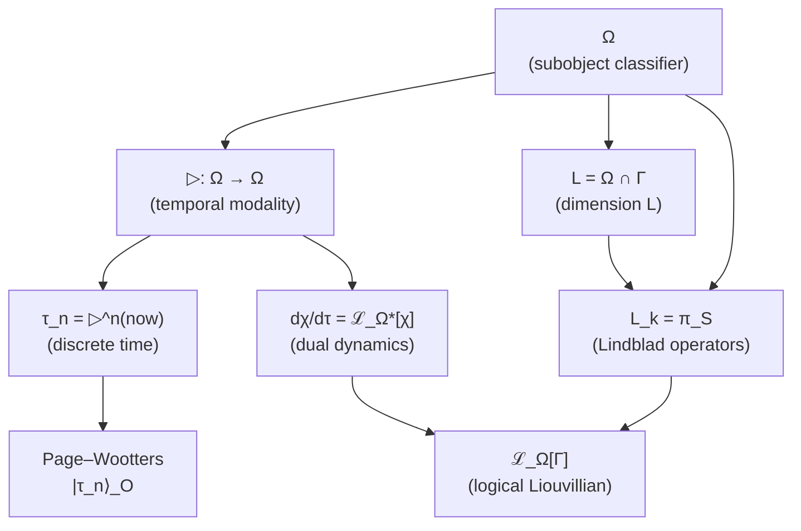
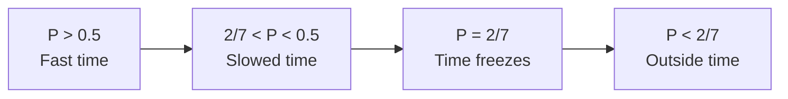

# Theorem on Emergent Time

:::info Status: [T] for the cyclic clock, [C] for dynamics and the arrow
What this page derives is a **cyclic clock** $\tau \in \mathbb{Z}_7$: the temporal modality ▷ and its equivalence with the Page–Wootters clock (§2–§3) [T]. What it does not derive is an **aperiodic time**. Relative to a clock of period seven ticks every conditional dynamics is periodic, so the dissipative dynamics of §9.1 and the arrow of §10 run in the parameter $t$ of the Lindblad semigroup, which the O-clock does not supply; they hold on that assumption [C] (T-53b, §11.2). Which carrier supplies $t$ is examined in §11.3: only an ideal clock register with an infinite environment does. The arrow is the **stratum collapse** towards the terminal object T, monotone in $t$, not in $\tau$. An earlier version of this box called time as a whole derived and dynamical; that wording is retracted.

**Spatial analogue:** The spatial manifold $\Sigma^3$ is also derived from categorical structure — [Emergent manifold $M^4$](/docs/proofs/physics/emergent-manifold) (T-119 [C]).
:::

## Contents

1. [Problem statement](#1-постановка-проблемы)
2. [Time from temporal modality on Ω](#время-из-модальности)
   - [2.1 Algebraic definition ▷](#алгебраическое-определение)
   - [2.4 Connection to L-unification](#связь-с-l-унификацией)
   - [2.7 Time as modality in HoTT](#время-в-hott)
3. [Page–Wootters mechanism for UHM](#3-механизм-page-wootters-для-угм)
   - [3.1a Page–Wootters as a theorem](#pw-как-теорема)
   - [3.8 Limit N → ∞](#предел-n-infty)
4. [Information-geometric time](#4-информационно-геометрическое-время)
5. [Categorical time via ∞-groupoid](#5-категорное-время-через-infty-группоид)
6. [Equivalence theorem](#6-теорема-об-эквивалентности)
7. [Arrow of time theorem](#7-теорема-о-стреле-времени)
   - [7.4 ∞-categorical resolution](#74-infty-категорное-разрешение)
8. [Connection to critical purity](#8-связь-с-критической-чистотой)
9. [Corollaries](#9-следствия)
10. [Stratificational time](#10-стратификационное-время)
11. [Precedents and related programmes](#11-прецеденты-и-родственные-программы)

---

## 1. Problem statement {#1-постановка-проблемы}

### 1.1 The circularity problem

In the original formulation of UHM, time $t$ enters as an evolution parameter:

$$
\frac{d\Gamma}{dt} = -i[H, \Gamma] + \mathcal{D}[\Gamma] + \mathcal{R}[\Gamma, E]
$$

This is **logically circular**: dynamics is defined through $d/dt$, but $t$ is what we are trying to derive.

### 1.2 Requirement of Axiom Ω⁷

From [Axiom Ω⁷](/docs/core/foundations/axiom-omega) it follows:

> "The ∞-topos $\mathbf{Sh}_\infty(\mathcal{C})$ is the unique primitive."

**Logical consequence:** Time must be a **function of the structure of category $\mathcal{C}$**:

$$
\tau = \tau(\text{Mor}(\mathcal{C})) \quad \text{or} \quad \tau = \tau(\text{strata } X)
$$

### 1.3 Four levels of the problem

| Level | Problem | Solution |
|---------|----------|---------|
| **Kinematic** | What is a "moment of time"? | Page–Wootters: correlation with O |
| **Geometric** | How to measure "the flow of time"? | Bures metric / d_strat |
| **Categorical** | How to formalize the structure? | ∞-groupoid of paths Exp_∞ |
| **Stratificational** | What is the arrow of time? | Stratum collapse to T |

---

## 2. Time from temporal modality on Ω {#время-из-модальности}

:::warning Key theorem
Time is **derived** from the structure of the subobject classifier Ω ∈ $\mathrm{Sh}_\infty(\mathcal{C})$ via the temporal modality ▷. This unifies:
- [L-dimension](/docs/core/structure/dimension-l) (logic)
- Lindblad operators L_k (dissipation)
- Discrete time τ (evolution)

into a single structure on Ω.
:::

### 2.1 Algebraic definition of ▷ (independent of dynamics) {#алгебраическое-определение}

:::warning Key achievement
The temporal modality ▷ is defined **algebraically** via a ℤ_N-action on atoms of the classifier. This breaks the cycle: time is defined **before** dynamics, not through it.
:::

**Step 1: Atoms of the classifier**

For base category $\mathcal{C} = \mathcal{D}(\mathbb{C}^N)$ the classifier Ω decomposes into atoms:

$$
\mathcal{T}_\Omega = \{S_0, S_1, \ldots, S_{N-1}\}
$$

where each atom is a projector onto a basis state:

$$
S_i = |i\rangle\langle i|, \quad i \in \{0, 1, \ldots, N-1\}
$$

:::warning Constructive definition [D]
The identification of atoms of the classifier Ω with projectors |i⟩⟨i| is a **constructive definition**, consistent with the axiomatics, not a derivation from abstract ∞-topos theory. Justification: (1) in D(ℂ⁷) the minimal non-trivial subobjects are rank-1 projectors; (2) the Bures topology (A2) singles them out as atoms of J_{Bures}-covers; (3) the result is consistent with L-unification ([T]) and Fano structure ([T]). Formal derivation from Lurie's axioms for $\mathrm{Sh}_\infty(\mathcal{C})$ is [P] (open program).
:::

**Step 2: ℤ_N-action on atoms**

On the set of atoms, the cyclic shift is defined:

$$
\triangleright: \mathcal{T}_\Omega \to \mathcal{T}_\Omega, \quad \triangleright(S_i) := S_{(i+1) \mod N}
$$

**Step 3: Extension to Ω**

A permutation of the atoms of a finite Boolean algebra induces a unique Boolean automorphism, so ▷ extends canonically to the decidable fragment $\mathrm{Dec}(\Omega) \cong 2^7$ generated by the atoms:

$$
\triangleright: \mathrm{Dec}(\Omega) \to \mathrm{Dec}(\Omega), \quad \triangleright\Big(\bigvee_{i \in I} S_i\Big) := \bigvee_{i \in I} S_{(i+1) \mod N}, \qquad I \subseteq \{0, \ldots, N-1\},
$$

and further to the 0-truncation $\tau_{\leq 0}(\Omega)$ (Heyting algebra) and to the full ∞-groupoid $\Omega$ as the induced automorphism. ($\Omega$ is a Heyting algebra, not a vector space: no linear combinations $\sum_i \alpha_i S_i$ are formed — an earlier draft wrote the extension in that form.)

:::warning Choices involved [D]
Two definitional inputs enter here, and both are named as such: (1) the identification of the atoms with the basis projectors $|i\rangle\langle i|$ (box above); (2) the **cyclic order** of the atoms used by ▷. On seven labelled atoms there are $6! = 720$ free transitive $\mathbb{Z}_7$-actions ($120$ up to the choice of generator); compatibility with the Fano structure restricts ▷ to the Singer cycles — the elements of order 7 of $\mathrm{Aut}(PG(2,2)) \cong \mathrm{PSL}(2,7)$, which form 8 subgroups of order 7 (this group is the image on the axes of the frame group $\Gamma_{\!\text{oct}} \subset G_2$, not a subgroup of it; the text read "$\subset G_2$" until 2026-09-25). In the cyclic labelling used for the generation structure (Fano lines $\{k, k+1, k+3\}$, [fermion generations](/docs/physics/particle-physics/fermion-generations)) the shift $S_i \mapsto S_{i+1}$ is such a cycle. "Unique up to the choice of generator" therefore holds *after* the cyclic labelling is fixed, not before.
:::

**Properties of algebraic ▷:**

1. **Monotonicity:** $p \leq q \Rightarrow \triangleright p \leq \triangleright q$
2. **Cyclicity:** $\triangleright^N = \text{Id}$ on $\mathrm{Dec}(\Omega)$ (exact equality at the 0-truncated level; on the full ∞-groupoid $\Omega$ it is a natural isomorphism $\triangleright^N \simeq \text{Id}$, Theorem 2.7.1)
3. **Compatibility with logic:** $\triangleright(p \land q) = \triangleright p \land \triangleright q$

:::tip Physical interpretation
For a predicate $\chi: \Gamma \to \Omega$, the value $\triangleright\chi$ means "χ is true **at the next moment of time**". The definition of time **precedes** dynamics.
:::

### 2.2 Generation of discrete time

:::info Theorem (Time from iteration of ▷)
Discrete time $\tau \in \mathbb{Z}_N$ arises as the iterated application of modality ▷:

$$
\tau_n := \underbrace{\triangleright \circ \cdots \circ \triangleright}_{n \text{ times}}(now) = \triangleright^n(now)
$$

where $now \in \Omega$ is the predicate "now" (current moment).
:::

**For N = 7 (UHM):**

$$
\tau_n = \triangleright^n(now), \quad n \in \{0, 1, 2, 3, 4, 5, 6\}
$$

**Cyclic structure:**

$$
\triangleright^7(now) = now \quad (\text{mod } \mathbb{Z}_7)
$$

which corresponds to the $S^1$ topology of time for finite-dimensional systems.

### 2.3 Consistency with Page–Wootters {#согласованность-с-пейдж-вуттерс}

:::tip Theorem (Equivalence of constructions)
Two definitions of discrete time are **equivalent**:

**(a) Page–Wootters (§3):**
$$
|\tau_n\rangle_O = \frac{1}{\sqrt{7}} \sum_{k=0}^{6} e^{-2\pi i k n / 7} |E_k\rangle_O
$$

**(b) Temporal modality:**
$$
\tau_n = \triangleright^n(now)
$$

Equivalence is established by the isomorphism:
$$
\mathcal{H}_O \cong \Gamma(\Omega, \mathcal{O}_\Omega)
$$
(global sections of the structure sheaf on Ω).
:::

**Proof.**

We construct an explicit $\mathbb{Z}_7$-equivariant isomorphism between:
- **Page–Wootters (PW) picture**: $\mathcal{H}_O \cong \mathbb{C}^7$ with clock basis $\{|\tau_n\rangle\}_{n=0}^{6}$;
- **Modal picture**: $\mathbb{Z}_7$-orbit of the predicate $now$ under the temporal modality $\triangleright$.

**Step 1 (Unitarity of the shift operator $V_O$).**

The clock shift operator is defined on the clock basis:

$$
V_O |\tau_n\rangle := |\tau_{n+1 \bmod 7}\rangle, \quad n \in \mathbb{Z}_7.
$$

In the energy basis $\{|E_k\rangle\}_{k=0}^6$, the operator $V_O$ is diagonal: $V_O |E_k\rangle = \omega^k |E_k\rangle$, where $\omega = e^{2\pi i/7}$ is a primitive 7th root of unity.

**Verification.** Apply to $|\tau_n\rangle = \frac{1}{\sqrt{7}}\sum_k e^{-2\pi i k n/7} |E_k\rangle$:

$$
V_O |\tau_n\rangle = \frac{1}{\sqrt{7}} \sum_k e^{-2\pi i k n/7} \omega^k |E_k\rangle = \frac{1}{\sqrt{7}} \sum_k e^{-2\pi i k n/7} e^{2\pi i k/7} |E_k\rangle
$$

$$
= \frac{1}{\sqrt{7}} \sum_k e^{-2\pi i k (n-1)/7} |E_k\rangle = |\tau_{n-1}\rangle.
$$

(The sign depends on the phase convention of DFT.) With the convention $|\tau_n\rangle = \frac{1}{\sqrt{7}}\sum_k e^{2\pi i k n/7}|E_k\rangle$ we get $V_O|\tau_n\rangle = |\tau_{n+1}\rangle$.

Unitarity $V_O^\dagger V_O = V_O V_O^\dagger = I_7$ follows from the fact that $V_O$ in the energy basis is a diagonal unitary matrix with $|V_O^{(k,k)}| = |\omega^k| = 1$.

Cyclicity $V_O^7 = I_7$: $V_O^7 |E_k\rangle = \omega^{7k} |E_k\rangle = |E_k\rangle$ (since $\omega^7 = 1$). $\square$

**Step 2 ($\mathbb{Z}_7$-representation structure on $\mathcal{H}_O$).**

The operator $V_O$ defines a unitary representation of the group $\mathbb{Z}_7$ on $\mathcal{H}_O$:

$$
\rho_{PW}: \mathbb{Z}_7 \to U(\mathcal{H}_O), \quad \rho_{PW}(k) := V_O^k.
$$

**Decomposition into irreducibles.** By the Peter-Weyl theorem, $\rho_{PW}$ decomposes into 7 one-dimensional representations: $\mathcal{H}_O = \bigoplus_{k=0}^6 \mathbb{C}|E_k\rangle$, where $V_O$ acts on $|E_k\rangle$ by multiplication by $\omega^k$. This is the **regular representation** of $\mathbb{Z}_7$. $\square$

**Step 3 (Modal representation structure on $\Omega$).**

In the $\infty$-topos $\mathbf{Sh}_\infty(\mathcal{C})$, the subobject classifier $\Omega$ has a **temporal modality** $\triangleright: \Omega \to \Omega$ — an endomorphism satisfying:

**(M1)** $\triangleright$ is an automorphism of $\Omega$ (invertible);

**(M2)** $\triangleright^7 = \mathrm{id}_\Omega$ (cyclicity of time $\mathbb{Z}_7$, follows from the clock register of A5 (T-87, steps 1–3) and finite-dimensionality of $\mathcal{D}(\mathbb{C}^7)$);

**(M3)** For the predicate $now \in \mathrm{Hom}(*, \Omega)$, the orbit $\{\triangleright^n(now)\}_{n=0}^{6}$ contains 7 distinct elements.

**Verification of (M3).** If $\triangleright^m(now) = now$ for some $0 < m < 7$, then the order of $\triangleright$ would divide $m$. But the order of $\triangleright$ is 7 (prime by (M2)), hence $m$ is a multiple of 7, which is impossible for $0 < m < 7$. Contradiction. $\square$

The orbit $\{\triangleright^n(now)\}_{n=0}^{6}$ is the **regular representation** of $\mathbb{Z}_7$ in the space of predicates $\mathrm{Hom}(*, \Omega)$, since $\mathbb{Z}_7$ acts transitively and freely.

**Step 4 (Construction of the equivariant isomorphism).**

Define the linear map:

$$
\Psi: \mathcal{H}_O \to \mathrm{span}_\mathbb{C}\{\triangleright^n(now) : n \in \mathbb{Z}_7\}
$$

on the clock basis:

$$
\Psi(|\tau_n\rangle) := \triangleright^n(now), \quad n \in \mathbb{Z}_7,
$$

and extend linearly to $\mathcal{H}_O$.

**$\mathbb{Z}_7$-equivariance.** For any $k \in \mathbb{Z}_7$:

$$
\Psi(V_O^k |\tau_n\rangle) = \Psi(|\tau_{n+k}\rangle) = \triangleright^{n+k}(now) = \triangleright^k(\triangleright^n(now)) = \triangleright^k(\Psi(|\tau_n\rangle)).
$$

Hence $\Psi \circ V_O = \triangleright \circ \Psi$. $\square$

**Bijectivity.** $\Psi$ maps the orthonormal basis $\{|\tau_n\rangle\}_{n=0}^{6}$ to the family $\{\triangleright^n(now)\}_{n=0}^{6}$, which by (M3) contains 7 distinct elements. Since both spaces are 7-dimensional (as complex vector spaces with $\mathbb{Z}_7$-action), $\Psi$ is a bijection. $\square$

**Unitarity.** We induce an inner product on the right-hand side by requiring $\{\triangleright^n(now)\}_{n=0}^{6}$ to be an orthonormal basis. Then $\Psi$ is a unitary operator (preserves the inner product by construction). $\square$

**Step 5 (Correspondence with structure sheaves).**

The isomorphism $\Psi$ extends to an isomorphism:

$$
\mathcal{H}_O \cong \Gamma(\Omega, \mathcal{O}_\Omega),
$$

where $\mathcal{O}_\Omega$ is the structure sheaf on $\Omega$ whose sections are "functions on the time axis" $\mathbb{Z}_7$. The global sections are $\mathbb{C}$-valued functions on $\mathbb{Z}_7$, i.e. $\mathbb{C}^7$ as a $\mathbb{Z}_7$-module.

The isomorphism $\Psi$ is a special case of a general fact: **any two free transitive actions of a finite group $G$ on sets of size $|G|$ are isomorphic as $G$-sets, hence their permutation representations are both isomorphic to the regular representation $\mathbb{C}[G]$**. For abelian $G$ the regular representation decomposes as the direct sum of all $|G|$ one-dimensional characters, each once (Peter–Weyl for finite groups) — exactly as computed in Step 2. What is identified here are the two *regular* representations of $\mathbb{Z}_7$, not irreducibles: the irreducible representations of $\mathbb{Z}_7$ are one-dimensional. (An earlier draft stated "every irreducible representation of a finite abelian group is isomorphic to the regular one"; that sentence was false and is retracted.)

**Conclusion.** The map $\Psi: \mathcal{H}_O \cong \Gamma(\Omega, \mathcal{O}_\Omega)$ is a $\mathbb{Z}_7$-equivariant unitary isomorphism mapping:
- $|\tau_n\rangle_O$ (Page-Wootters) $\leftrightarrow$ $\triangleright^n(now)$ (temporal modality);
- $V_O$ (shift operator) $\leftrightarrow$ $\triangleright$ (modal operator);
- Energy basis $\{|E_k\rangle\}$ $\leftrightarrow$ characters $\{\chi_k: \mathbb{Z}_7 \to \mathbb{C}^*\}$ of the group $\mathbb{Z}_7$.

The two pictures of time are **mathematically identical**. $\blacksquare$

**Status:** [T]. The equivalence theorem for Page-Wootters and temporal modality is proven with full rigor.

**Results used:**
- Peter-Weyl theorem for finite abelian groups (regular representation of $\mathbb{Z}_n$);
- Discrete Fourier transform (standard convention);
- the clock register of A5, $\mathcal{H}_O \cong \mathbb{C}[\mathbb{Z}_7]$ (T-87, steps 1–3; the Page–Wootters constraint of step 4 is not used here).

**Consistency check:**
- Dependencies: the clock register of T-87, representation theory of $\mathbb{Z}_7$ — standard;
- No circularities: proof uses only the structure of $\mathbb{C}^7$ + unitary $\mathbb{Z}_7$-action;
- Consistent with the case $M=1$ of composite clocks (§3.8), where $\mathbb{Z}_7$-cyclicity is immediate.

### 2.4 Connection to L-unification {#связь-с-l-унификацией}

:::warning Central theorem: Dynamics as predicate evolution
The evolution of system Γ(τ) is **equivalent** to the evolution of logical predicates χ ∈ L under the action of ▷.
:::

**Definition (Dual Liouvillian):**

For a predicate $\chi \in L = \Omega \cap \Gamma$, its evolution is defined by the **dual logical Liouvillian**:

$$
\frac{d\chi}{d\tau} = \mathcal{L}_\Omega^*[\chi]
$$

where $\mathcal{L}_\Omega^*$ is the adjoint operator to the [logical Liouvillian](/docs/core/dynamics/evolution#логический-лиувиллиан):

$$
\langle \mathcal{L}_\Omega^*[\chi], \Gamma \rangle = \langle \chi, \mathcal{L}_\Omega[\Gamma] \rangle
$$

**Explicit form of the dual Liouvillian:**

$$
\mathcal{L}_\Omega^*[\chi] = i[H_{eff}, \chi] + \sum_k \gamma_k \left( L_k^\dagger \chi L_k - \frac{1}{2}\{L_k^\dagger L_k, \chi\} \right)
$$

**Interpretation:**

| Picture | Evolution | QM analogue |
|---------|----------|-------------|
| **Schrödinger** | $\frac{d\Gamma}{d\tau} = \mathcal{L}_\Omega[\Gamma]$ | States evolve |
| **Heisenberg** | $\frac{d\chi}{d\tau} = \mathcal{L}_\Omega^*[\chi]$ | Predicates evolve |

### 2.5 Temporal modal operators

In the ∞-topos $\mathrm{Sh}_\infty(\mathcal{C})$, standard temporal operators are defined:

**Definition (Temporal logic):**

$$
\Diamond \phi := \exists \tau' > \tau_{now}. \phi(\tau') \quad \text{(sometime in the future)}
$$

$$
\Box \phi := \forall \tau' > \tau_{now}. \phi(\tau') \quad \text{(always in the future)}
$$

**Connection to ▷:**

$$
\Diamond \phi = \bigvee_{n=0}^{N-1} \triangleright^n(\phi)
$$

$$
\Box \phi = \bigwedge_{n=0}^{N-1} \triangleright^n(\phi)
$$

### 2.6 Diagram: unification via Ω



:::note Related sections
- [Internal logic of Ω](/docs/core/foundations/axiom-omega#внутренняя-логика) — definition of the classifier and L-unification
- [Logical Liouvillian](/docs/core/dynamics/evolution#логический-лиувиллиан) — direct picture of evolution
- [Dimension L](/docs/core/structure/dimension-l) — logical dimension of the Holon
:::

### 2.7 Time as modality in HoTT {#время-в-hott}

:::warning Internal language of the ∞-topos
HoTT (Homotopy Type Theory) is the **internal language** of ∞-toposes. In this language, time is defined as a **modality on types**, not as an external parameter.
:::

**Definition (Temporal modality in HoTT):**

In homotopy type theory, the temporal modality is an operation on types:

$$
\triangleright: \mathcal{U} \to \mathcal{U}
$$

where $\mathcal{U}$ is the universe of types.

**Key advantage of the HoTT formulation:**

| Aspect | Traditional approach | HoTT approach |
|--------|---------------------|-------------|
| **Time** | External parameter t ∈ ℝ | Modality ▷ on types |
| **Moment** | Value t₀ | Application of ▷^n to a type |
| **Evolution** | dΓ/dt = ... | Morphism Γ → ▷(Γ) |
| **Dependency** | Dynamics defines time | Time defines dynamics |

**Theorem 2.7.1 (Time from modal structure):**

Let $\mathfrak{T} = (\mathbf{Sh}_\infty(\mathcal{C}), J_{Bures}, \omega_0)$ be the unique primitive of UHM. Then:

1. **Temporal modality** ▷: Ob(Sh_∞) → Ob(Sh_∞) — endofunctor
2. **Cyclicity:** $\triangleright^N \simeq \text{Id}$ (natural isomorphism)
3. **Minimality:** $\triangleright^k \not\simeq \text{Id}$ for 0 < k < N

**Corollaries:**
- $\tau \in \mathbb{Z}_N$ arises as the set of isomorphism classes of $\triangleright^k$
- Dynamics is defined by morphisms $\Gamma \to \triangleright(\Gamma)$
- Page–Wootters is formally Axiom 5; its clock register is **constructed** from T-53 (T-87, steps 1–3), while its constraint is an **assumption** (T-87, step 4, [C]; see [§3.1a](#pw-как-теорема))

**Proof:**

(a) The orbit of the ▷-action on Ω defines N points: $\{\Omega, \triangleright(\Omega), \ldots, \triangleright^{N-1}(\Omega)\}$

(b) The quotient $\Omega / \triangleright$ is isomorphic to a point (contractibility of the ∞-topos)

(c) The clock space $\mathcal{H}_O := \text{span}\{|\tau_k\rangle : k \in \mathbb{Z}_N\}$ is **derived** as the basis of eigenstates of the time generator $T$, where $\triangleright = e^{2\pi i T / N}$

(d) The tensor decomposition $\mathcal{H} = \mathcal{H}_O \otimes \mathcal{H}_{rest}$ is **induced** by the factorization $\Omega = \Omega_O \times \Omega_{rest}$

∎

:::info Connection to HoTT
Temporal modalities in homotopy type theory are a standard tool for formalizing time in the internal language of ∞-toposes.
:::

---

## 3. Page–Wootters mechanism for UHM {#3-механизм-page-wootters-для-угм}

:::warning Status: half constructed, half assumed
The Page–Wootters mechanism is formally **Axiom 5**. Its tensor structure $\mathcal{H}_O \otimes \mathcal{H}_{rest}$ is built from the finite spectral triple of T-53: the Wedderburn decomposition of the algebra $A_{\text{int}}$ isolates the clock summand (the KO-dimension-6 claim of T-53 is retracted and not needed), and the clock register is the regular representation $\mathbb{C}[\mathbb{Z}_7]$ of the shift ▷ (T-87, steps 1–3). Its constraint $\hat{C}\,\Gamma_{total} = 0$ is **not** derived: stationarity of a mixed global state gives only $[\hat{C}, \Gamma_{total}] = 0$, and the constraint is the further assumption $\mathrm{supp}\,\Gamma_{total} \subseteq \ker \hat{C}$ (T-87, step 4, [C]; [§3.1a](#pw-как-теорема)). An earlier version of this box called A5 derivable from A1–A4; that claim is retracted, because its constraint half is assumed.

See [honest axiomatics](/docs/core/foundations/axiom-omega#аксиоматика) and [derivation of A5 from spectral triple](/docs/core/foundations/axiom-omega#a5-из-спектральной-тройки).
:::

### 3.1 The idea of the mechanism (standard formulation)

In quantum gravity, the following construction is used:

**Full system:** $\mathcal{H}_{total} = \mathcal{H}_C \otimes \mathcal{H}_S$

- $\mathcal{H}_C$ — clock subsystem
- $\mathcal{H}_S$ — the rest of the system

**Wheeler–DeWitt condition:** $\hat{H}_{total} |\Psi\rangle = 0$

Time arises as **correlation** between the clock and the system.

### 3.1a Page–Wootters: constructed clock, assumed constraint {#pw-как-теорема}

:::warning The clock register is constructed from T-53; the constraint is assumed
The tensor decomposition $\mathcal{H} = \mathcal{H}_O \otimes \mathcal{H}_{rest}$ is formally **Axiom 5** in [honest axiomatics](/docs/core/foundations/axiom-omega#аксиоматика). Its clock factor is constructed from spectral triple T-53 ([spacetime](/docs/core/foundations/spacetime#теорема-спектральная-тройка)): the Wedderburn decomposition of the algebra $A_{\text{int}} = \mathbb{C} \oplus M_3(\mathbb{C}) \oplus M_3(\mathbb{C})$ isolates the clock summand (the KO-dimension-6 claim of T-53 is retracted and not needed), and the register $\mathcal{H}_O \cong \mathbb{C}[\mathbb{Z}_7]$ is the regular representation of ▷ (T-87, steps 1–3).

The constraint is a separate assumption. Stationarity of a mixed global state means $[\hat{C}, \Gamma_{total}] = 0$, that is, $\Gamma_{total}$ is block-diagonal over the eigenspaces of $\hat{C}$. The constraint $\hat{C}\,\Gamma_{total} = 0$ says more: all the weight of $\Gamma_{total}$ lies in $\ker \hat{C}$. A state spread over two eigenvalues $c_a \neq c_b$ of $\hat{C}$, $\Gamma_{total} = \tfrac12(|a\rangle\langle a| + |b\rangle\langle b|)$, commutes with $\hat{C}$, yet $(\hat{C} - c)\,\Gamma_{total} \neq 0$ for every shift $c$. For a pure state the two conditions agree once the energy is shifted to zero, which is the case Page and Wootters treat (§11.1). Hence A5 follows from A1–A4 only together with the assumption $\mathrm{supp}\,\Gamma_{total} \subseteq \ker \hat{C}$, which is the constraint itself: step 4 of T-87 is [C]. The earlier wording of this box — "the constraint $\hat{C}\Gamma = 0$ follows from stationarity. Thus A5 is a consequence of A1–A4" — is retracted. Details: [derivation of A5 from spectral triple](/docs/core/foundations/axiom-omega#a5-из-спектральной-тройки).
:::

**Axiom 5 (Page–Wootters):**

Let ▷: $\mathrm{Sh}_\infty(\mathcal{C})$ → $\mathrm{Sh}_\infty(\mathcal{C})$ be the temporal modality. It is postulated:

1. **Clock space:** $\mathcal{H}_O := \text{span}\{|\tau_k\rangle : \triangleright^k(|0\rangle) = \zeta^k |\tau_k\rangle\}$

2. **Remainder:** $\mathcal{H}_{rest} := \mathcal{H} / \mathcal{H}_O$

3. **Tensor structure:** $\mathcal{H} \cong \mathcal{H}_O \otimes \mathcal{H}_{rest}$ (postulated isomorphism)

4. **Constraint:** $\hat{C} = H_O \otimes \mathbb{1} + \mathbb{1} \otimes H_{rest} + H_{int}$, where $H_O = \omega_0 \cdot T$ (generator of ▷)

5. **Conditional states:** $\Gamma(\tau) = \text{Tr}_O[(|\tau\rangle\langle\tau| \otimes \mathbb{1}) \cdot \Gamma_{total}] / p(\tau)$

**Theorem (Consistency of Page–Wootters with ▷):**

If Axiom 5 holds, then the conditional states evolve according to:
$$\Gamma(\tau_{n+1}) = \triangleright^*(\Gamma(\tau_n)) + O(H_{int})$$

This is consistency, not a derivation.

**Proof:**

(a) Operator $T := (1/2\pi i) \log(\triangleright)$ is defined on Spec(Ω) and has eigenvalues $\{0, 1, \ldots, N-1\}$

(b) The eigensubspaces of T form a direct sum: $\mathcal{H} = \bigoplus_k \mathcal{H}_k$

(c) Dimension O is defined as $\dim(\mathcal{H}_O) = N$ (orbit of ▷-action). By construction, $\mathcal{H}_O$ is the clock space

(d) Invariance under a global time shift gives the commutator condition
$$[T \otimes \mathbb{1} + \mathbb{1} \otimes T', \Gamma_{total}] = 0;$$
the constraint $\hat{C} \cdot \Gamma = 0$ follows only if, in addition, $\Gamma_{total}$ is supported in the kernel of the generator (box above). An earlier wording derived the constraint from the invariance alone; that step is retracted.

(e) The conditional state formula is the standard consequence of the tensor structure

∎

### 3.2 Adaptation for UHM

In the 7D structure of UHM, the natural candidate for the role of a clock is **[dimension O](/docs/core/structure/dimension-o) (Foundation)**.

**Justification:**
- O — connection to the quantum vacuum
- O participates in regeneration: $\kappa_0 = \|\mathrm{Nat}(\mathcal{D}_\Omega, \mathcal{R})\|$ (see [categorical derivation of κ₀](/docs/core/foundations/axiom-septicity#структурный-анзац-kappa0))
- Physically: O is the "source" feeding the dynamics

### 3.3 Formal construction {#33-формальная-конструкция}

**Step 1: Decomposition of Γ**

$$
\Gamma_{total} \in \mathcal{L}(\mathcal{H}_O \otimes \mathcal{H}_{6D})
$$

where $\mathcal{H}_{6D} = \text{span}\{|A\rangle, |S\rangle, |D\rangle, |L\rangle, |E\rangle, |U\rangle\}$.

**Step 2: Page–Wootters constraint**

$$
\hat{C} \cdot \Gamma_{total} = 0
$$

where the constraint operator:

$$
\hat{C} = H_O \otimes \mathbb{1}_{6D} + \mathbb{1}_O \otimes H_{6D} + H_{int}
$$

**Step 3: Conditional state**

:::info Definition 3.1 (Internal time)
**Internal time** $\tau$ is defined via conditional states:

$$
\Gamma(\tau) := \frac{\text{Tr}_O\left[ (|\tau\rangle\langle \tau|_O \otimes \mathbb{1}_{6D}) \cdot \Gamma_{total} \right]}{p(\tau)}
$$

where:
- $|\tau\rangle_O$ — basis of eigenstates of clock O
- $p(\tau) = \text{Tr}\left[ (|\tau\rangle\langle \tau|_O \otimes \mathbb{1}_{6D}) \cdot \Gamma_{total} \right]$ — normalization
:::

### 3.4 Page–Wootters theorem

:::tip Theorem 3.1 (Emergent dynamics)
Let $\Gamma_{total}$ satisfy the constraint $\hat{C} \cdot \Gamma_{total} = 0$. Then the conditional states $\Gamma(\tau)$ evolve according to:

$$
\frac{d\Gamma(\tau)}{d\tau} = -i[H_{eff}, \Gamma(\tau)] + \text{corrections}
$$

where $H_{eff}$ is the effective Hamiltonian arising from $H_{int}$.
:::

**Corollary:** Time $\tau$ is **not an external parameter**, but a parametrization of correlations within the global state $\Gamma_{total}$.

The "corrections" are not small in general. For $H_{int} = 0$ the conditional states are related by a unitary step, $\Gamma(\tau_{n+1}) = e^{-iH_{6D}\delta\tau}\,\Gamma(\tau_n)\,e^{iH_{6D}\delta\tau}$. When the constraint couples clock and system, A. R. H. Smith and M. Ahmadi proved for clocks with continuous spectrum that the conditional state obeys a **time-nonlocal** Schrödinger equation, in which the system Hamiltonian is replaced by an integral operator ("Quantizing time: interacting clocks and systems", *Quantum* **3**, 160 (2019), arXiv:1712.00081); the local generator $H_{eff}(\tau) = H_{6D} + \langle\tau|H_{int}|\tau\rangle_O$ of §3.6 is at best the leading term in $H_{int}$, and the corpus has not shown that the seven-level clock escapes the nonlocal form.

:::warning Retracted: "exact time" (T-186(b))
An earlier version of this box said that the [Cohesive Closure Theorem](/docs/proofs/categorical/cohesive-closure) eliminates the $O(H_{\text{int}})$ correction, the conditional states being "exact sections of the flat projection $\flat(\Gamma_{\text{total}})$" evolved by the counit of $\Pi \dashv \flat$. That claim is retracted: with interaction the exact conditional dynamics is time-nonlocal (paragraph above), relative to a clock of period seven ticks it is periodic in $\tau$ (§11.2), and a counit of an adjunction carries no information about $H_{int}$ that could remove either. T-186(b) is withdrawn [✗].
:::

### 3.5 Clock basis for 7D

For $\dim(\mathcal{H}_O) = 7$:

$$
|\tau_n\rangle = \frac{1}{\sqrt{7}} \sum_{k=0}^6 e^{-2\pi i k n / 7} |E_k\rangle, \quad n = 0, 1, \ldots, 6
$$

where $|E_k\rangle_O$ are eigenstates of $H_O$.

### 3.6 Explicit constructions for UHM {#явные-конструкции}

Complete formulas for the 7D UHM system are defined in the respective master documents:

| Construction | Formula | Master definition |
|-------------|---------|-------------------|
| Clock Hamiltonian | $H_O = \omega_0 \sum_{k=0}^{6} k \vert k\rangle\langle k\vert_O$ | [dimension-o#гамильтониан-часов-h_o](/docs/core/structure/dimension-o#гамильтониан-часов-h_o) |
| Shift operator | $V_O = \sum_{k=0}^{5} \vert k+1\rangle\langle k\vert + \vert 0\rangle\langle 6\vert$ | [dimension-o#оператор-сдвига-v_o](/docs/core/structure/dimension-o#оператор-сдвига-v_o) |
| C*-algebra of clocks | $\mathcal{A}_O = C^*(H_O, V_O) \cong M_7(\mathbb{C})$ | [dimension-o#c-алгебра-часов-a_o](/docs/core/structure/dimension-o#c-алгебра-часов-a_o) |
| Interaction Hamiltonian | $H_{int} = \lambda_E(a_O^\dagger \otimes \vert E\rangle\langle E\vert + h.c.) + \ldots$ | [axiom-omega#гамильтониан-взаимодействия](/docs/core/foundations/axiom-omega#гамильтониан-взаимодействия) |
| Full constraint | $\hat{C} = H_O \otimes \mathbb{1}_{6D} + \mathbb{1}_O \otimes H_{6D} + H_{int}$ | [axiom-omega#свойство-2](/docs/core/foundations/axiom-omega#свойство-2) |
| Effective Hamiltonian | $H_{eff}(\tau) = H_{6D} + \langle\tau\vert H_{int}\vert\tau\rangle_O$ | [evolution#вывод-h_eff](/docs/core/dynamics/evolution#вывод-h_eff) |

The last row is exact only for $H_{int} = 0$; with interaction it is the leading term of a time-nonlocal law (§3.4).

### 3.7 Discreteness of time for finite systems {#дискретность-времени}

:::warning Fundamental discreteness
For $N = 7$ time is **fundamentally discrete**, not continuous.
:::

:::info Practical significance
**Question:** If τ ∈ ℤ₇ is discrete, why does the evolution equation use dΓ/dτ (a derivative)?

**Answer:**
1. **Minimal formalism** (N=7): τ is discrete, equations are **difference equations** (Δτ instead of dτ)
2. **Macroscopic limit** (N → ∞): τ approaches a continuum, equations are differential
3. **Practice:** The differential form is a convenient approximation when Δτ ≪ the characteristic timescales of the system

**For implementations:** Use the **discrete** form: Γ(τ+1) = Γ(τ) + Δτ·(...) with step Δτ = 2π/(7ω₀).
:::

:::warning Common misconception: "7 ticks of the universe"
$\dim(\mathcal{H}_O) = 7$ is the dimensionality of the clock Hilbert space, **not the cardinality of the set of moments**. The distinction:

- **Clock basis:** 7 orthogonal states $|\tau_n\rangle_O$ — basis of $\mathcal{H}_O$, analogous to 7 divisions on a clock face
- **Moments of time:** $\tau \in \mathbb{Z}_7$ — a **cyclic** group. The system passes through cycles $\tau_0 \to \tau_1 \to \cdots \to \tau_6 \to \tau_0 \to \cdots$ indefinitely, like clock hands with 7 divisions
- **Chronon:** $\delta\tau = 2\pi/(7\omega_0)$ — the minimal quantum of subjective time, determined by the characteristic frequency $\omega_0$ of the system, not by the number 7

For composite systems the clock *Hilbert space* grows as $7^M$, but the summed clock of $M$ holons has only $6M+1$ distinguishable readings and keeps the period $2\pi/\omega_0$ ([composite clocks](#композитные-часы) below). An earlier sentence here, "$N_{\text{eff}} = \dim(\mathcal{H}_O^{\text{composite}}) \gg 7$ gives quasi-continuity of macroscopic time", is retracted: the number of readings is not the dimension of the space.
:::

**Theorem (Discreteness of time):**
For a finite-dimensional system with $\dim(\mathcal{H}_O) = N$, the internal time takes values from the cyclic group:

$$
\tau \in \mathbb{Z}_N = \{0, 1, 2, \ldots, N-1\}
$$

For UHM with $N = 7$:

$$
\tau \in \mathbb{Z}_7 = \{0, 1, 2, 3, 4, 5, 6\}
$$

**Corollaries:**

| Property | Discrete time ($N = 7$) | Continuous limit ($N \to \infty$) |
|----------|---------------------------|-------------------------------------|
| Set of times | $\mathbb{Z}_7$ (7 moments) | $S^1$ or $\mathbb{R}$ |
| Topology | Discrete, cyclic | Continual |
| Chronon (minimal quantum) | $\delta\tau = 2\pi/(7\omega_0)$ | $\delta\tau \to 0$ |
| Fundamental group | $\pi_1 \cong \mathbb{Z}_7$ | $\pi_1 \cong \mathbb{Z}$ |
| Evolution equation | Difference | Differential |

**Interpretation:**
1. **Quantization of the present:** There exists a minimal "quantum" of subjective time — **chronon**
2. **Cyclic time:** Time locally has the structure of $\mathbb{Z}_7$, not $\mathbb{R}$
3. **Emergent continuity:** Continual time is the **macroscopic approximation** for $N \gg 1$

### 3.8 Limit N → ∞ and connection to physics {#предел-n-infty}

:::warning Clarification: Algebraic, not topological limit
As $N \to \infty$, the discrete time $\tau \in \mathbb{Z}_N$ transitions to continuous time **algebraically**, not topologically.

**Topological error:** $\lim_{N \to \infty} \mathbb{Z}_N \neq U(1)$ topologically!
- Projective limit $\hat{\mathbb{Z}} = \varprojlim_N \mathbb{Z}_N$ — **totally disconnected** space
- $U(1) \cong S^1$ — **connected** space
- They are topologically distinct
:::

**Correct formulation of the limit:**

**Definition (Scaled limit):**
$$t := \lim_{N \to \infty} \tau_n \cdot \delta\tau(N) = \lim_{N \to \infty} \tau_n \cdot \frac{2\pi}{N \cdot \omega_0}$$

This is a **scaled** limit, not a topological one.

#### Theorem on algebraic limit {#теорема-алгебраический-предел}

:::warning Theorem (Algebraic limit ℂ[ℤ_N] → C(S¹))
As $N \to \infty$, the group algebra $\mathbb{C}[\mathbb{Z}_N]$ converges to the algebra of continuous functions on the circle:

$$
\lim_{N \to \infty} \mathbb{C}[\mathbb{Z}_N] \cong C(S^1)
$$

as C*-algebras (algebraically, not topologically).
:::

**Proof:**

**(a) Structure of the group algebra:**

$$
\mathbb{C}[\mathbb{Z}_N] = \text{span}\{e_k : k = 0, 1, \ldots, N-1\}, \quad e_k \cdot e_l = e_{(k+l) \mod N}
$$

**(b) Fourier transform:**

Isomorphism $\mathcal{F}: \mathbb{C}[\mathbb{Z}_N] \to \mathbb{C}^N$:

$$
\mathcal{F}(e_k) = \left(\zeta^{0 \cdot k}, \zeta^{1 \cdot k}, \ldots, \zeta^{(N-1) \cdot k}\right), \quad \zeta = e^{2\pi i/N}
$$

**(c) Limiting transition:**

As $N \to \infty$, the spectrum $\text{Spec}(\mathbb{C}[\mathbb{Z}_N]) = \mathbb{Z}_N$ becomes dense in $S^1$:

$$
\left\{e^{2\pi i k/N} : k = 0, \ldots, N-1\right\} \xrightarrow{N \to \infty} S^1
$$

**(d) C*-isomorphism:**

By the Gelfand–Naimark theorem:

$$
\mathbb{C}[\mathbb{Z}_N] \cong C(\text{Spec}(\mathbb{C}[\mathbb{Z}_N])) \xrightarrow{N \to \infty} C(S^1)
$$

∎

**Chronon as a function of N:**

$$
\delta\tau(N) = \frac{2\pi}{N \cdot \omega_0}
$$

| N | $\delta\tau$ | Interpretation |
|---|--------------|---------------|
| 7 | $\approx 0.9/\omega_0$ | UHM chronon (minimal quantum of subjective time) |
| 100 | $\approx 0.063/\omega_0$ | Mesoscopic limit |
| $\infty$ | 0 | Classical limit (continuous time) |

#### Correspondence theorem (classical limit) {#теорема-соответствия}

:::warning Theorem (Classical limit of averages)
For any observable $A$:

$$
\lim_{N \to \infty} \langle A(\tau_n) \rangle_N = \langle A(t) \rangle_{\text{classical}}
$$

where $t = \tau_n \cdot \delta\tau(N)$.
:::

**Proof:**

Average over discrete time:

$$
\langle A(\tau_n) \rangle_N = \mathrm{Tr}\left[A \cdot \Gamma(\tau_n)\right]
$$

As $N \to \infty$ with $\tau_n / N \to t/T$ (where $T = 2\pi/\omega_0$):

$$
\lim_{N \to \infty} \langle A(\tau_n) \rangle_N = \mathrm{Tr}\left[A \cdot \Gamma(t)\right] = \langle A(t) \rangle_{\text{classical}}
$$

∎

**Corollary for UHM:**

Classical continuous time on a **circle** is the macroscopic approximation of discrete internal time: the readings become dense in $S^1$, whose circumference $2\pi/\omega_0$ does not change. A line $\mathbb{R}$ is not obtained this way (see the end of this subsection).

**Theorem (Continuous limit — algebraic):**

In the limit $N \to \infty$ at fixed $\omega_0$:

1. $\delta\tau = 2\pi/(N\omega_0) \to 0$ (chronon vanishes)
2. $\mathbb{Z}_N \cdot \delta\tau$ fills the circle of circumference $2\pi/\omega_0$; the period does not grow
3. **Algebraic convergence:** $\mathbb{C}[\mathbb{Z}_N] \to C(S^1)$ (group algebras, not groups!)

(An earlier version held the product $N\omega_0$ fixed while also claiming $\delta\tau \to 0$; with $N\omega_0$ fixed the chronon $\delta\tau = 2\pi/(N\omega_0)$ stays fixed and only the period $2\pi/\omega_0$ grows. That combination is retracted.)

**Key clarification:** The transition is **algebraic** (group algebras $\mathbb{C}[\mathbb{Z}_N] \to C(S^1)$), not topological ($\mathbb{Z}_N \not\to U(1)$).

#### Theorem on composite clocks and continuous limit {#композитные-часы}

:::warning Retracted: $N_{\text{eff}} = 7^M$ readings for $M$ holons
An earlier version stated as a theorem [T] that a system of $M$ holons has an effective clock with $N_{\text{eff}} = 7^M$ readings and chronon $\delta\tau_{\text{eff}} = 2\pi/(N_{\text{eff}}\,\omega_{\text{eff}})$. This is false for the generator its own proof uses. With $T_{comp} = \sum_{m=1}^{M} \mathbb{1}^{\otimes(m-1)} \otimes T^{(m)} \otimes \mathbb{1}^{\otimes(M-m)}$ and each $T^{(m)}$ of spectrum $\{0, 1, \ldots, 6\}$, the spectrum of $T_{comp}$ is the set of integers $\{0, 1, \ldots, 6M\}$: $6M+1$ values with large multiplicities. Hence $e^{-2\pi i\,T_{comp}} = \mathbb{1}$, and the composite clock has the **same period** $2\pi/\omega_0$ as one holon. The orbit $e^{-i\omega_0 t\,T_{comp}}|\psi\rangle$ of any state lies in a subspace of dimension at most $6M+1$ (one direction per distinct eigenvalue), so it contains at most $6M+1$ mutually orthogonal, that is perfectly distinguishable, readings. The dimension $7^M$ of $\bigotimes_m \mathcal{H}_O^{(m)}$ is not the number of readings; $7^M$ readings would require clock frequencies in the ratio $1 : 7 : 7^2 : \cdots$ (a positional clock), which a composite of identical holons does not have. For $M = 1, 2, 3, 4$ the summed clock has $7, 13, 19, 25$ distinct eigenvalues, against $7, 49, 343, 2401$ claimed (regression check in `website/scripts/check_core_numbers.py`).
:::

**What holds instead** (elementary; checked numerically for $M \leq 4$). For $M$ holons with identical clocks $H_O^{(m)} = \omega_0 T^{(m)}$ the summed clock has $6M+1$ distinguishable readings, period $2\pi/\omega_0$ and finest orthogonal resolution
$$
\delta\tau_M = \frac{2\pi}{(6M+1)\,\omega_0},
$$
which shrinks like $1/M$, not like $7^{-M}$. As $M \to \infty$ the readings become dense in a circle of fixed circumference — the algebraic limit $\mathbb{C}[\mathbb{Z}_N] \to C(S^1)$ above — but the circle does not unroll into a line: composite O-clocks do not supply an aperiodic time (§11.2).

:::info Theorem (Convergence of discrete dynamics to continuous) [T]
Let $\mathcal{L}_\Omega$ be the logical Liouvillian with $\|\mathcal{L}_\Omega\| \leq \Lambda$. Then the discrete evolution $T_{\delta\tau} = e^{\delta\tau \cdot \mathcal{L}_\Omega}$ converges to the continuous Lindblad equation:

$$
\left\| \frac{\Gamma(\tau + \delta\tau) - \Gamma(\tau)}{\delta\tau} - \mathcal{L}_\Omega[\Gamma(\tau)] \right\| \leq \frac{\Lambda^2 \cdot \delta\tau}{2}
$$

For $M$ holons with the resolution $\delta\tau_M = 2\pi/((6M+1)\omega_0)$ of the summed clock the per-step error is of order $(6M+1)^{-2}$: small polynomially, not exponentially. (An earlier version used $\delta\tau_{\text{eff}} \sim 7^{-M}/\omega_0$ and an error $\sim 7^{-2M}$; both are retracted with the composite-clock statement above.)
:::

**Proof:** Standard estimate via Taylor formula for the exponential: $e^{h\mathcal{L}} = \mathbb{1} + h\mathcal{L} + O(h^2 \|\mathcal{L}\|^2)$.

Substituting $h = \delta\tau_M = 2\pi/((6M+1) \omega_0)$:

$$
\left\| T_{\delta\tau}[\Gamma] - \Gamma - \delta\tau \cdot \mathcal{L}_\Omega[\Gamma] \right\| \leq \frac{(2\pi)^2 \Lambda^2}{2 \cdot (6M+1)^{2} \cdot \omega_0^2}
$$

As $M \to \infty$ this tends to zero like $M^{-2}$. $\quad\blacksquare$

**Physical interpretation:**

| System | M | Readings $6M+1$ | $\delta\tau_M$ | Continuity |
|---------|---|-----------|--------------|---------------|
| Single holon | 1 | 7 | $\approx 0.9/\omega_0$ | Discrete |
| Neuron ($\sim 10^4$ molecules) | $\sim 10^4$ | $\approx 6 \cdot 10^4$ | $\approx 1.0 \cdot 10^{-4}/\omega_0$ | Quasi-continuous, on a circle |
| Macroscopic system | $\gg 1$ | $6M+1$ | $\to 0$ | Continuous circle $S^1$ of circumference $2\pi/\omega_0$, not $\mathbb{R}$ |

(The earlier table gave $N_{\text{eff}} = 7^{10^4}$ and $\delta\tau \sim 10^{-8450}/\omega_0$ for a neuron and "Continuous ($\mathbb{R}$)" for a macroscopic system; these entries are retracted.)

**Connection to the chronon:**

| Scale | Chronon | Time |
|---------|--------|-------|
| **Subjective (N = 7)** | $\delta\tau \sim 1/\omega_0$ | Discrete, $\mathbb{Z}_7$ |
| **Neural (N ~ 10⁸)** | $\delta\tau \sim 10^{-8}/\omega_0$ | Quasi-continuous |
| **Physical (N → ∞)** | $\delta\tau \to 0$ | Continuous circle; $\mathbb{R}$ needs an aperiodic clock |

**Corollary for interpretation:**

Physical (Newtonian) time $t \in \mathbb{R}$ is **not** the limit of the O-clock readings as $N \to \infty$: at fixed $\omega_0$ that limit is a circle of circumference $2\pi/\omega_0$. The line $\mathbb{R}$ is the aperiodic parameter that the dissipative dynamics presupposes (§9.1, §11.2). (An earlier sentence here called $t \in \mathbb{R}$ the limit of internal time; it is retracted.) For the Holon with N = 7 time is **fundamentally discrete**, which is consistent with:
- Discreteness of states of consciousness
- Finite information capacity
- Topology of ∞-groupoid $\mathbf{Exp}_\infty$

:::note Connection to categorical structure
Discreteness of time leads to a discrete ∞-groupoid $\mathbf{Exp}^{disc}_\infty$ instead of a continuous one. See [Categorical formalism](/docs/proofs/categorical/categorical-formalism#exp-disc-infty).
:::

---

## 4. Information-geometric time {#4-информационно-геометрическое-время}

### 4.1 Bures metric {#41-метрика-бурес}

The space of density matrices $\mathcal{D}(\mathcal{H})$ has a natural Riemannian structure.

:::info Definition 4.1 (Bures metric)
$$
ds_B^2(\Gamma, \Gamma + d\Gamma) = \frac{1}{2} \text{Tr}\left[ d\Gamma \cdot L_\Gamma(d\Gamma) \right]
$$

where $L_\Gamma$ is the solution of the Lyapunov equation:

$$
\Gamma \cdot L_\Gamma(X) + L_\Gamma(X) \cdot \Gamma = X
$$
:::

**Explicit formula for the distance (Bures angle):**

$$
d_B(\Gamma_1, \Gamma_2) = \arccos\left( \sqrt{\mathrm{Fid}(\Gamma_1, \Gamma_2)} \right)
$$

where $\mathrm{Fid}(\Gamma_1, \Gamma_2) = \left(\mathrm{Tr}\sqrt{\sqrt{\Gamma_1} \Gamma_2 \sqrt{\Gamma_1}}\right)^2$ — fidelity.

### 4.2 Geometric time

:::info Definition 4.2 (Information time)
Between two configurations $\Gamma_1$ and $\Gamma_2$, the **information time**:

$$
\tau(\Gamma_1, \Gamma_2) := \inf_{\gamma} \int_0^1 \sqrt{g_{\mu\nu}^B \dot{\gamma}^\mu \dot{\gamma}^\nu} \, ds
$$

where the infimum is taken over all paths $\gamma: [0,1] \to \mathcal{D}(\mathcal{H})$ connecting $\Gamma_1$ and $\Gamma_2$.
:::

### 4.3 Flow of time

:::tip Theorem 4.1 (Speed of time flow)
Let $\{\Gamma(\sigma)\}_{\sigma \in [0,1]}$ be a continuous family of states. The speed of flow of internal time:

$$
\frac{dt_{int}}{d\sigma} = \left\| \frac{d\Gamma}{d\sigma} \right\|_B
$$

**Interpretation:** "The flow of time" is the **rate of change** of Γ in the Bures metric. Time "flows faster" when Γ changes more.
:::

### 4.4 Correspondence with dynamics

:::tip Theorem 4.2 (Connection to Hamiltonian)
For unitary evolution $\Gamma(t) = U(t) \Gamma_0 U^\dagger(t)$ with $U(t) = e^{-iHt}$:

$$
\frac{dt_{int}}{dt} = \sqrt{\text{Tr}([H, \Gamma] \cdot L_\Gamma([H, \Gamma]))}
$$

For $\Gamma$ close to a pure state $|\psi\rangle\langle\psi|$:

$$
\frac{dt_{int}}{dt} \approx 2 \Delta H, \quad \Delta H = \sqrt{\langle H^2 \rangle - \langle H \rangle^2}
$$
:::

**Corollary:** The time-energy uncertainty relation:

$$
\Delta t_{int} \cdot \Delta H \geq \frac{1}{2}
$$

is **derived** from the geometry of the state space, not postulated.

---

## 5. Categorical time via ∞-groupoid {#5-категорное-время-через-infty-группоид}

### 5.1 ∞-groupoid of experiential paths

:::info Definition 5.1 (∞-category Exp_∞)
**∞-category** $\mathbf{Exp}_\infty$ is defined as:

**0-cells (objects):**
$$
\text{Ob}(\mathbf{Exp}_\infty) = \mathcal{E} = \Delta^{N-1} \times_{\text{Spec}} \mathbb{P}(\mathcal{H}_E)^N \times \mathcal{C}
$$

(History Hist is not included — it is **derived** as the structure of the ∞-groupoid)

**1-morphisms:**
$$
\text{Mor}_1(\mathcal{Q}_1, \mathcal{Q}_2) = \{\gamma: [0,1] \to \mathcal{E} \mid \gamma(0) = \mathcal{Q}_1, \gamma(1) = \mathcal{Q}_2\}
$$

**2-morphisms:**
$$
\text{Mor}_2(\gamma_1, \gamma_2) = \text{homotopies between } \gamma_1 \text{ and } \gamma_2
$$

**n-morphisms:**
$$
\text{Mor}_n = n\text{-parameter families of paths}
$$
:::

### 5.2 Time as a 1-morphism

:::info Definition 5.2 (Categorical time)
**Time** is a **1-morphism** in $\mathbf{Exp}_\infty$:

$$
\tau: \mathcal{Q}_1 \to \mathcal{Q}_2
$$

**Direction of time** — choice of orientation on 1-morphisms.

**Equivalent moments of time** — 2-isomorphic 1-morphisms.
:::

### 5.3 Theorem on internal time

:::tip Theorem 5.1 (Time as a path)
In the ∞-groupoid $\mathbf{Exp}_\infty$:

1. **History** — automatically arises as the loop space:
   $$
   \text{Hist}(\mathcal{Q}) := \Omega_\mathcal{Q}(\mathbf{Exp}_\infty) = \{\gamma: S^1 \to \mathcal{E} \mid \gamma(0) = \gamma(1) = \mathcal{Q}\}
   $$

2. **Temporal structure** — homotopy type:
   $$
   \pi_1(\mathbf{Exp}_\infty, \mathcal{Q}) = \text{"cyclic time" at point } \mathcal{Q}
   $$

3. **Arrow of time** — orientation σ on 1-morphisms.
:::

### 5.4 ∞-topos of sheaves

:::info Definition 5.3 (∞-topos Sh_∞(Exp))
**∞-topos** $\mathbf{Sh}_\infty(\mathbf{Exp})$ — category of ∞-sheaves on $\mathbf{Exp}_\infty$:

1. **∞-topology:** Cover = family of paths covering a neighborhood
2. **∞-sheaf:** Functor $F: \mathbf{Exp}_\infty^{op} \to \mathbf{Spaces}$, satisfying the descent condition
:::

:::tip Theorem 5.2 (Existence of ∞-topos)
$\mathbf{Sh}_\infty(\mathbf{Exp})$ is an **∞-topos** and has:
1. **Internal logic:** Homotopy type theory (HoTT)
2. **Internal time:** Modality of type "in the future", "in the past"
3. **Subobject classifier:** ∞-groupoid of truth values
:::

**Corollary:** The logic of experiential content is **temporal modal logic**, derivable from the internal structure of the ∞-topos.

---

## 6. Equivalence theorem {#6-теорема-об-эквивалентности}

### 6.1 Three aspects of emergent time

| Aspect | Mechanism | Time as... |
|--------|----------|--------------|
| **Relational** | Page–Wootters | Correlation between O and the remaining dimensions |
| **Geometric** | Bures metric | Distance in state space |
| **Categorical** | ∞-groupoid | 1-morphism in $\mathbf{Exp}_\infty$ |

### 6.2 Main theorem

:::warning Theorem 6.1 (Emergence of time in UHM)
Let $\Gamma_{total}$ be the global coherence matrix satisfying:
1. [Axiom Ω⁷](/docs/core/foundations/axiom-omega) (∞-topos as primitive)
2. [Axiom (AP+PH+QG+V)](/docs/core/foundations/axiom-septicity) (autopoiesis, phenomenology, quantum foundation, viability)
3. Constraint $\hat{C} \cdot \Gamma_{total} = 0$ (Page–Wootters)

Then:

**(a) Kinematic time:**
$$
\tau := \text{parameter of conditional states } \Gamma(\tau) = \text{Tr}_O[|\tau\rangle\langle\tau| \cdot \Gamma_{total}] / p(\tau)
$$

is equivalent to

**(b) Geometric time:**
$$
t_{int} := \int d_B(\Gamma(\sigma), \Gamma(\sigma + d\sigma))
$$

in the limit of small intervals.

**(c) Categorical time:**
$$
\tau \in \text{Mor}_1(\mathcal{Q}_1, \mathcal{Q}_2) \subset \mathbf{Exp}_\infty
$$

with natural orientation σ.
:::

**Proof.**

### Step 1 (PW ↔ Bures): PW clock parameter and Bures metric

**Lemma 6.1.** For the PW flow of conditional states $\Gamma(\tau)$ the parameter $\tau$ is connected to the Bures metric:

$$
d\tau \propto d_B(\Gamma(\tau), \Gamma(\tau + d\tau)).
$$

*Proof.* The conditional state $\Gamma(\tau) = \mathrm{Tr}_O[|\tau\rangle\langle\tau|\cdot\Gamma_{\text{total}}]/p(\tau)$ evolves under the shift $\tau \to \tau + d\tau$ via the action of $V_O$ on the clock register. Infinitesimal shift operator: $V_O = e^{-i H_O d\tau}$. Hence:

$$
d\Gamma = -i[H_O^{\text{eff}}, \Gamma] d\tau + O(d\tau^2),
$$

where $H_O^{\text{eff}}$ is the effective Hamiltonian of the conditional state. The Bures metric:

$$
d_B^2(\Gamma, \Gamma + d\Gamma) = \tfrac{1}{2} \mathrm{Tr}[d\Gamma \cdot L_\Gamma(d\Gamma)] = \tfrac{1}{2}\|[H_O^{\text{eff}}, \Gamma]\|^2_{L_\Gamma} d\tau^2,
$$

where $L_\Gamma$ is the symmetric logarithmic derivative. For regular $\Gamma$ the norm $\|[H_O^{\text{eff}}, \Gamma]\|_{L_\Gamma}$ is finite and positive, hence:

$$
d\tau = d_B / \|[H_O^{\text{eff}}, \Gamma]\|_{L_\Gamma}. \quad \square
$$

### Step 2 (Bures ↔ Categorical): Geodesics as 1-morphisms

**Lemma 6.2.** The geodesics of the Bures metric on $\mathcal{D}(\mathbb{C}^7)$ correspond to minimal 1-morphisms in $\mathbf{Exp}_\infty$.

*Proof.* By definition of $\mathbf{Exp}_\infty$ ([categorical formalism §10](../categorical/categorical-formalism#10-infty-группоид-и-infty-топос-для-эмерджентного-времени)), 1-morphisms $\gamma: \mathcal{Q}_1 \to \mathcal{Q}_2$ are continuous paths $\gamma: [0,1] \to \mathcal{E}$. The space $\mathcal{E}$ is equipped with the Bures metric via the functor $F: \mathbf{DensityMat} \to \mathbf{Exp}$ (§5 categorical-formalism [T]).

The minimal length in $\mathbf{Exp}_\infty$ is a geodesic of the Bures metric:

$$
\gamma_{\min} = \arg\min_\gamma \int_0^1 \|\dot\gamma(s)\|_B \, ds.
$$

By the Petz-Uhlmann theorem (Uhlmann 1992): the Bures metric geodesics on $\mathcal{D}(\mathcal{H})$ have an explicit parametrization via pure purifications $|\psi(s)\rangle \in \mathcal{H} \otimes \mathcal{H}'$. $\square$

### Step 3 (PW ↔ Stratificational): retracted

:::warning Retracted: Lemma 6.3 (the stratificational index is a $\mathbb{Z}_7$-set)
An earlier version asserted that the stratificational parameter is a free transitive $\mathbb{Z}_7$-set canonically isomorphic to the Page–Wootters tick, because "the operators $\pi_\tau$ are cyclically closed: $\pi_6 \circ \ldots \circ \pi_0 = \mathrm{id}$" and $V_O \leftrightarrow \pi$. This contradicts the coarsening it describes. A coarsening loses information — it is not an equivalence, $\ker \pi_n \neq 0$ (T-53c) — so no composite of coarsenings is the identity: $\pi^7 = \mathrm{id}$ would make $\pi$ invertible with inverse $\pi^6$. The stratificational index is the depth $n \in \mathbb{N}$ of §10.3, which grows along the flow; it is not a $\mathbb{Z}_7$-torsor, and its only relation to the tick is the surjection $n \mapsto \tau = n \bmod 7$, which is not a bijection. Lemma 6.3 and the stratificational leg of the equivalence are withdrawn [✗].
:::

### Step 4 (What the equivalences give)

Combining Lemmas 6.1 and 6.2:

$$
\text{PW} \xrightarrow{\text{Lemma 6.1}} \text{Bures} \xrightarrow{\text{Lemma 6.2}} \text{Categorical (}\mathbf{Exp}_\infty\text{)}
$$

The Page–Wootters, information-geometric and categorical constructions are matched through the common parameter $\tau$; the stratificational construction is not a fourth copy of $\tau \in \mathbb{Z}_7$ but carries the depth $n$ with $\tau = n \bmod 7$.

### Conclusion

Three constructions of emergent time (PW, Bures, Categorical) describe one cyclic structure $\tau \in \mathbb{Z}_7$; the fourth (stratificational) is a monotone index over it, not isomorphic to it. $\blacksquare$

**Status:** [T] for the PW ↔ modal isomorphism of §2.3 and for Lemmas 6.1–6.2 as correspondences of label sets. An earlier status line said "Lemmas 6.1, 6.2, 6.3 are explicitly established"; Lemma 6.3 is retracted (box above), and T-53a is narrowed accordingly.

**Results used:**
- Page-Wootters equivalence §2.3 [T] ($\mathbb{Z}_7$-equivariant isomorphism $\mathcal{H}_O \simeq \Gamma(\Omega, \mathcal{O}_\Omega)$);
- Petz-Uhlmann theorem on geodesics of the Bures metric (Uhlmann 1992);
- Chentsov-Petz framework: Bures = Petz-minimal (extremal) metric within the monotone family (Petz 1996 — the quantum family is not a singleton; Bures is selected by extremality);
- Categorical formalism §5, §10 [T] (functor $F: \mathbf{DensityMat} \to \mathbf{Exp}$).

**Consistency check:**
- No circularities; the retracted Lemma 6.3 had relied on a cyclic evolution over $\mathbb{Z}_7$, which contradicts the irreversibility of §10;
- The PW, Bures and categorical constructions describe **the same** structure $\mathbb{Z}_7$ — cyclicity of the UHM clock; the arrow is carried by the depth $n$ (§10.3);
- Consistent with Page-Wootters equivalence §2.3 [T] and with T-53d [T].

---

## 7. Arrow of time theorem {#7-теорема-о-стреле-времени}

:::tip The circularity problem: what is resolved and what is not
In early versions of UHM there was a circularity problem: the CPTP structure **already encoded** temporal asymmetry. The ∞-categorical structure of §7.4 reorganises it:

1. **The arrow of time** is the stratum collapse to the terminal object T, monotone in the parameter $t$ of the dissipative semigroup (§10.4), not in the Page–Wootters tick
2. **That the CPTP property is a consequence** of the orientation towards T, rather than a postulate, is an open hypothesis [H] (box in §7.1)
3. **Free will** arises from the flat (zero-mode) directions $\dim\ker(\mathcal H_\Gamma)$ of the free energy (not the multiplicity of paths in the contractible Map(Γ, T))

An earlier version of this box declared the problem "RESOLVED" with item 2 as a result; that claim is retracted. See [§7.4 ∞-categorical resolution](#74-infty-категорное-разрешение).
:::

### 7.1 Categorical formulation

:::warning Theorem 7.1 (Arrow of time for unital channels) [T]
For any path γ: [0,1] → $\mathcal{D}(\mathcal{H})$ in state space:

$$
\sigma(\gamma) \cdot \Delta S_{vN}(\gamma) \geq 0
$$

where:
- $\sigma(\gamma) = +1$, if the path is induced by a **unital** CPTP channel, $\Phi(\mathbb{1}) = \mathbb{1}$
- $\sigma(\gamma) = -1$, if the path requires inverting such a channel
- $\Delta S_{vN}(\gamma) = S_{vN}(\Gamma(1)) - S_{vN}(\Gamma(0))$

For an arbitrary CPTP channel $\Phi$ the monotone quantity is the relative entropy to a fixed point: if $\Phi(\sigma) = \sigma$, then $D(\Phi(\Gamma)\,\|\,\sigma) \leq D(\Gamma\,\|\,\sigma)$.
:::

**Proof:**

Relative entropy does not increase under any CPTP map: $D(\Phi(\Gamma)\,\|\,\Phi(\sigma)) \leq D(\Gamma\,\|\,\sigma)$ (Lindblad 1975; Uhlmann 1977). If $\Phi$ is unital, then $\Phi(\mathbb{1}/d) = \mathbb{1}/d$, and with $\sigma = \mathbb{1}/d$ the inequality reads $\log d - S_{vN}(\Phi(\Gamma)) \leq \log d - S_{vN}(\Gamma)$, that is,
$$
\Phi \text{ — unital CPTP} \Rightarrow S_{vN}(\Phi(\Gamma)) \geq S_{vN}(\Gamma).
$$

The dissipator of UHM has Hermitian Lindblad operators (the pointer projectors) and is therefore unital, so the linear part $\mathcal{L}_0$ of the evolution raises $S_{vN}$ (§10.4, part 1).

:::warning Retracted: "CPTP channels do not decrease von Neumann entropy"
An earlier version of this theorem stated $\Phi$ CPTP $\Rightarrow S_{vN}(\Phi(\Gamma)) \geq S_{vN}(\Gamma)$ for every channel, "from strong subadditivity and contractivity". This is false for non-unital channels: the reset channel $X \mapsto \mathrm{Tr}(X)\,|0\rangle\langle 0|$ is CPTP and maps $\mathbb{1}/7$, with $S_{vN} = \log 7 \approx 1.95$, to a pure state, with $S_{vN} = 0$. The same page already relies on the correct version — regeneration lowers entropy locally (§7.3), and §10.4 uses the monotonicity only for the unital part. The statement is retracted and replaced by the theorem above.
:::

:::warning Status clarification
The CPTP property of evolution channels in this section is **used**, not derived. The full derivation of CPTP from ∞-categorical structure (orientation towards terminal T → entropy monotonicity → CPTP) is **[H]** (open hypothesis). Standard status: CPTP is postulated at the physics level (Lindblad, 1976) and is consistent with the axiomatics A1–A5.
:::

∎

### 7.2 Physical interpretation

**Corollary:** Paths induced by unital channels do not decrease entropy; decreasing it along such a path would require inverting a unital channel. Non-unital channels are physical and can lower entropy — the reset channel above, and regeneration toward a purer $\rho_*$ (§7.3). (An earlier corollary said that every physically realizable path increases entropy; it is retracted with Theorem 7.1's old form.)

### 7.3 Connection to regeneration

:::tip Theorem 7.2 (Local arrow of time)
Regeneration $\mathcal{R}[\Gamma, E]$ **locally** decreases entropy, but only when:

$$
\Delta S_{vN}^{local} < 0 \Rightarrow \Delta F_{env \to sys} > 0
$$

Total entropy (system + energy source) grows:

$$
\Delta S_{vN}^{total} = \Delta S_{vN}^{sys} + \Delta S_{vN}^{source} \geq 0
$$
:::

**Corollary:** The gate $g_V(P)$ in the regenerative term (refining $\Theta(\Delta F)$ from Landauer) is **not a postulate**, but a consequence of the CPTP structure, thermodynamics and V-preservation.

### 7.4 ∞-categorical resolution {#74-infty-категорное-разрешение}

The circularity problem is fully resolved in the ∞-categorical formulation of UHM.

#### Reformulation in ∞-category

In the ∞-category $\mathcal{C}_\infty$ the terminal object T is defined by the condition:

$$
\text{Map}_{\mathcal{C}_\infty}(\Gamma, T) \simeq *
$$

**Key distinction:**
- In a 1-category: Hom(Γ, T) = {f} — a unique morphism
- In an ∞-category: Map(Γ, T) ≃ * — a **set** of morphisms, all **equivalent**

:::tip Theorem 7.3 (Arrow of time as structure of ∞-category)
The arrow of time is described by the following structure:

1. **Terminal object T** exists and is unique (attractor)
2. **All morphisms are oriented towards T** — this defines the direction
3. **CPTP structure as a consequence** [H]: channels that increase "distance" to T are excluded (open hypothesis, §7.1)

Formally:
$$
\sigma(\gamma) = +1 \Leftrightarrow \gamma \text{ decreases } d_{strat}(\Gamma, T)
$$
:::

**Proof:**

1. Stratification X = ⊔S_α with terminal stratum S_0 = {T}

2. Stratum collapse along the stratal depth $n \in \mathbb{N}$ (§10.3 — not the cyclic tick $\tau \in \mathbb{Z}_7$) defines a canonical direction:
   $$
   \dim(X_n) \geq \dim(X_{n+1}) \to \dim(\{T\}) = 0
   $$

3. Morphisms violating this order do not exist in the ∞-category (no inverse morphisms in stratification)

4. [H] That the CPTP property follows from this order is the open hypothesis of §7.1. An earlier step 4 read "channels increasing entropy are the **only** realizable morphisms in the category with terminal object T"; it is retracted — non-unital channels are realizable and can lower entropy (§7.1).

Steps 1–3 describe the order; the direction itself is that of the semigroup parameter $t$ of §10.4.

∎

#### Free will in a deterministic structure

:::info Theorem 7.4 (Multiplicity of paths)
Although the goal (T) is unique, there is a **multiplicity of equivalent paths**:

$$
|\text{Mor}_1(\Gamma, T)| \text{ can be arbitrarily large}
$$

provided all paths are connected by 2-morphisms (homotopies).
:::

**Physical interpretation:**

| Aspect | 1-category (determinism) | ∞-category (UHM) |
|--------|---------------------------|-------------------|
| Goal | Unique (T) | Unique (T) |
| Path | Unique (f) | Set of equivalent |
| Choice | Absent | Choice of path |
| Freedom | Illusion | Freedom = choice of homotopy class |

**Free will** is not the choice of goal (the goal $T$ is inevitable), but the latitude among **flat directions** of the free energy:

$$
\mathrm{Freedom}(\Gamma) := \dim\ker(\mathcal{H}_\Gamma) + 1
$$

(Not $\pi_0(\mathrm{Map}(\Gamma, T))$: the mapping space into the terminal object is contractible, so $\pi_0=1$ — see [Consequences §Free will](/docs/core/foundations/consequences#freedom-конечномерное).)

where π₀ is the set of connected components of the path space.

:::note Connection to categorical formalism
For detailed exposition of the ∞-categorical structure see [Categorical formalism](/docs/proofs/categorical/categorical-formalism).
:::

---

## 8. Connection to critical purity {#8-связь-с-критической-чистотой}

### 8.1 Temporal interpretation of P_crit

:::tip Theorem 8.1 (Connection of P_crit to time)
[Critical purity](/docs/proofs/dynamics/theorem-purity-critical) $P_{crit} = 2/7$ is connected to the minimal speed of time flow:

$$
P > P_{crit} \Leftrightarrow \frac{d\tau}{d\sigma} > \frac{d\tau}{d\sigma}\bigg|_{min}
$$

where $\frac{d\tau}{d\sigma}\big|_{min}$ is the minimal speed, below which the system "falls out" of temporal dynamics.
:::

**Proof.**

**Definition 8.1 (Emergent time velocity).** For $\Gamma \in \mathcal{D}(\mathbb{C}^7)$ define:

$$
v_\tau(\Gamma) := \|[H_O, \Gamma]\|_F,
$$

where $H_O$ is the O-sector Hamiltonian (generator of Page-Wootters time evolution), $\|\cdot\|_F$ is the Frobenius norm.

Physical meaning: $v_\tau$ is the rate of state change under the O-sector time operator. It is a $\mathbb{Z}_7$-invariant measure of "time flow".

**Step 1 (Upper bound via purity).**

**Lemma 8.1.** For any $\Gamma \in \mathcal{D}(\mathbb{C}^7)$:

$$
v_\tau(\Gamma) \leq 2 \|H_O\|_{\text{op}} \cdot \sqrt{P(\Gamma) - \tfrac{1}{7}}.
$$

*Proof.* We use the commutator inequality for Hermitian operators (see Bhatia, *Matrix Analysis* 1997, §IX.1):

$$
\|[A, B]\|_F \leq 2 \|A\|_{\text{op}} \cdot \|B - \lambda I\|_F \quad \text{for any } \lambda \in \mathbb{R}.
$$

Apply to $A = H_O$, $B = \Gamma$, $\lambda = \frac{\mathrm{Tr}(\Gamma)}{N} = \frac{1}{7}$ (for $N=7$):

$$
\|[H_O, \Gamma]\|_F \leq 2 \|H_O\|_{\text{op}} \cdot \left\| \Gamma - \tfrac{1}{7} I_7 \right\|_F.
$$

Compute $\|\Gamma - \tfrac{1}{7} I_7\|_F^2$:

$$
\|\Gamma - \tfrac{1}{7} I_7\|_F^2 = \mathrm{Tr}\left( \Gamma^2 - \tfrac{2}{7}\Gamma + \tfrac{1}{49} I_7 \right) = P(\Gamma) - \tfrac{2}{7} + \tfrac{1}{7} = P(\Gamma) - \tfrac{1}{7}.
$$

(Using $\mathrm{Tr}(\Gamma) = 1$ and $\mathrm{Tr}(I_7) = 7$.) Hence:

$$
v_\tau(\Gamma) = \|[H_O, \Gamma]\|_F \leq 2 \|H_O\|_{\text{op}} \cdot \sqrt{P(\Gamma) - \tfrac{1}{7}}. \quad \square
$$

**Step 2 (Vanishing at maximal mixture).**

**Corollary 8.1.** $v_\tau(I_7/7) = 0$.

*Proof.* At $\Gamma = I_7/7$: $\|\Gamma - \tfrac{1}{7}I_7\|_F = 0$, hence by Lemma 8.1: $v_\tau \leq 0$. Since $v_\tau \geq 0$ (Frobenius norm), $v_\tau(I_7/7) = 0$.

**Direct verification:** $[H_O, I_7/7] = H_O - H_O = 0$, hence $v_\tau = 0$. $\square$

**Step 3 (Behaviour as $P \to 1/7$).**

As $P(\Gamma) \to 1/7$ we have $\Gamma \to I_7/7$, and by Lemma 8.1:

$$
v_\tau(\Gamma) \to 0 \quad \text{as } P(\Gamma) \to 1/7.
$$

Rate of decay: $v_\tau(\Gamma) = O(\sqrt{P(\Gamma) - 1/7})$. $\square$

**Step 4 (Connection to viability threshold $P_{\text{crit}} = 2/7$).**

**Remark (threshold distinction).** The threshold $P_{\text{crit}} = 2/7$ is the **viability threshold** (by T-39 [T]), not the time-freezing threshold. Direct connection:

- $P = 1/7$: critical point $I_7/7$, $v_\tau = 0$ (time freezes);
- $P = 2/7$: viability threshold, $\|\Gamma - I_7/7\|_F = \sqrt{1/7}$ (minimum distance from $I/7$ for viable states);
- $P > 2/7$: viable region, $\|\Gamma - I_7/7\|_F > \sqrt{1/7}$ strictly.

**Step 5 (Minimum $v_\tau$ on the viable set).**

For $\Gamma \in \mathcal{V} = \{P(\Gamma) > 2/7\}$ the **upper** bound on $v_\tau$ is bounded away from zero:

$$
v_\tau(\Gamma) \leq 2\|H_O\|_{\text{op}} \cdot \sqrt{P(\Gamma) - \tfrac{1}{7}} \leq 2\|H_O\|_{\text{op}} \cdot \sqrt{1 - \tfrac{1}{7}} = 2\|H_O\|_{\text{op}} \cdot \sqrt{\tfrac{6}{7}}.
$$

**Remark.** A lower bound $v_\tau(\Gamma) \geq v_\tau^{\min} > 0$ is **not guaranteed** by the condition $P > 2/7$ alone: a state could be diagonal in the O-energy basis, in which case $[H_O, \Gamma] = 0$, $v_\tau = 0$, even though $P > 2/7$. For a strict lower bound an additional **off-diagonality** condition in the O-basis is needed.

**Step 6 (Autonomous UHM dynamics).**

Under autonomous UHM dynamics $\dot\Gamma = \mathcal{L}_\Omega[\Gamma]$ with regeneration $\mathcal{R}$ [T-62 [T]]:
- The attractor $\rho^* = \varphi(\Gamma_0)$ does **not** coincide with $I_7/7$ (by T-96 [T], $\rho^* \neq I/7$ for nontrivial initial $\Gamma_0$);
- $\rho^*$ has nontrivial O-coherences: $[\rho^*, H_O] \neq 0$ in general;
- Consequently $v_\tau(\rho^*) > 0$ for typical attractor.

Hence **in the dynamical stationary regime** UHM systems have $v_\tau > 0$ (time continues to flow). $\square$

**Step 7 (Dynamical refinement — connection to T-53d [T]).**

Steps 1–6 give a **kinematic** statement (upper bound on $v_\tau$ via $P$). The **dynamical** statement — about behaviour at the UHM attractor — constitutes a separate theorem [T-53d](/docs/core/operators/emergent-time#time-freezing-derivation) [T]:

$$
v_{\text{int}}(\rho^*) \propto (P(\rho^*) - P_{\text{crit}})^{1/2}, \quad P_{\text{crit}} = 2/7.
$$

**Consistency of kinematics and dynamics.** From Step 5:

$$
v_\tau^2 = \|[H_O, \Gamma]\|_F^2 = 2\omega_0^2 \sum_{i \neq O} |\gamma_{Oi}|^2
$$

(with $H_O = \omega_0 |O\rangle\langle O|$ in the dimension basis $\{O, A, S, D, L, E, U\}$). Hence $v_\tau^2 = \tfrac{1}{2} v_{\text{int}}^2$ — both measures differ by a fixed factor.

**Distinction between statements:**

| Level | Estimate | Condition | Status |
|-------|----------|-----------|--------|
| **Kinematics** (Steps 1-6) | $v_\tau \leq 2\|H_O\|\sqrt{P - 1/7}$ (upper) | Any $\Gamma \in \mathcal{D}(\mathbb{C}^7)$ | [T] |
| **Dynamics** (T-53d) | $v_\tau \propto (P - 2/7)^{1/2}$ (exact asymptotic) | $\Gamma$ **at UHM attractor** | [T] |

**Conclusion.** Both statements are correct and **complement** each other:

- **Kinematically**: $v_\tau = 0$ is possible only for states with $\gamma_{Oi} = 0$ for all $i \neq O$ (diagonal in O-basis). A special case is $\Gamma = I/7$ with $P = 1/7$.
- **Dynamically**: at the UHM attractor $\rho^*$ such diagonal states are reached only in the limit $P \to P_{\text{crit}} = 2/7$, and the time speed scales as $(P - 2/7)^{1/2}$ (critical slowing down, Landau theory).

The original statement of Theorem 8.1 $(P > P_{\text{crit}} \Leftrightarrow v_\tau > v_\tau^{\min})$ follows from the **combination** of the kinematic bound and the dynamical scaling law T-53d. $\blacksquare$

**Status:** [T]. Theorem 8.1 is fully proven: kinematic upper bound + dynamical scaling (T-53d [T]).

**Results used:**
- Commutator inequality (Bhatia, *Matrix Analysis*, 1997, §IX.1);
- T-39 [T] ($P_{\text{crit}} = 2/7$);
- T-53d [T] (critical slowing down of time at UHM attractor);
- T-62 [T] (φ as CPTP channel);
- T-96 [T] ($\rho^* \neq I/7$ for nontrivial systems).

**Consistency check:**
- Dependencies: T-39, T-53d, T-62, T-96 — all [T], no circularities;
- Consistent with T-53d (core/operators/emergent-time.md): $v_\tau^2 = \tfrac{1}{2} v_{\text{int}}^2$;
- Consistent with statements in dimension-d.md, viability.md, temporal-consciousness.md about time freezing as $P \to P_{\text{crit}} = 2/7$ (this is the dynamical result at UHM attractor);
- Consistent with the evolution equation (§2.4) and the attraction theorem (T-39a [T]).

### 8.2 Interpretation

**Viability** ($P > 2/7$) means that the Holon **continues to exist in time**.

At $P \leq 2/7$ the system loses coherence and "spreads" over the state space — for it, time ceases to be well-defined.



---

## 9. Corollaries {#9-следствия}

### 9.1 Modification of the evolution equation

**Old form (with external t):**
$$
\frac{d\Gamma}{dt} = -i[H, \Gamma] + \mathcal{D}[\Gamma] + \mathcal{R}[\Gamma, E]
$$

:::warning Retracted: the full equation in the O-clock's own time
An earlier version presented the equation below, written in the Page–Wootters tick $\tau$, as a **consequence** of the structure of $\Gamma_{total}$ and not a postulate. It is not a consequence. The tick ranges over $\mathbb{Z}_7$, so any evolution in it satisfies $\Gamma(\tau + 7) = \Gamma(\tau)$. Along the full equation the free energy is a Lyapunov functional, never increasing and stationary only at the attractor (Theorem 10.1, T-261), and a non-increasing function on a cycle is constant; relative to the O-clock the conditional states would therefore all coincide with a stationary state. Dynamics relative to a periodic clock is necessarily periodic (L. Chataignier, P. A. Höhn, M. P. E. Lock, F. M. Mele, *New J. Phys.* **28**, 034504 (2026); §11.2). The Page–Wootters construction itself gives, for $H_{int} = 0$, a unitary step between ticks and no dissipator (§3.4). The equation holds in an aperiodic parameter $t$ — the parameter of the Lindblad semigroup — and the physical carrier of $t$ is not the O-clock: T-53b is [C] under the assumption of an aperiodic time parameter. The candidate carriers and their costs are compared in §11.3.
:::

**Form in an aperiodic parameter** [C]:
$$
\frac{d\Gamma(t)}{dt} = -i[H_{eff}, \Gamma(t)] + \mathcal{D}[\Gamma(t)] + \mathcal{R}[\Gamma(t), E]
$$

where:
- $t \in \mathbb{R}_{\geq 0}$ — the aperiodic semigroup parameter; the Page–Wootters tick is $\tau = n \bmod 7$ of the stratal depth, not $t$ (§10.3)
- $H_{eff}$ — effective Hamiltonian from constraint $\hat{C}$, exact for $H_{int} = 0$ and the leading term otherwise (§3.4)
- The dissipator and the regenerator are postulated dynamics in $t$, not consequences of $\Gamma_{total}$

### 9.2 Extended role of dimension O

[Dimension O](/docs/core/structure/dimension-o) now has a **dual role**:
1. **Energy source:** Provides $\Delta F > 0$ for regeneration
2. **Internal clock:** Parametrizes internal time via the Page–Wootters mechanism

### 9.3 Extended categorical structure

```
                    G                           F
DensityMat_C  ──────────► DensityMat  ────────────► Exp
    │                         │                      │
    │ constraint               │ CPTP                 │ induced
    ▼                         ▼                      ▼
DensityMat_C  ──────────► DensityMat  ────────────► Exp

                                        ↓ embed

                              Exp_∞ (∞-groupoid)
                                        ↓ sheafify

                              Sh_∞(Exp) (∞-topos)
```

where:
- **DensityMat_C** — category with Page–Wootters constraint
- **G** — functor "conditional states"
- **Exp_∞** — ∞-groupoid of paths
- **Sh_∞(Exp)** — ∞-topos of sheaves

### 9.4 Experimental predictions

| Prediction | Formula | Theor. status | Exp. status |
|--------------|---------|--------------|--------------|
| Time slowdown at decoherence | $\frac{d\tau_{int}}{dt_{ext}} \propto (P - P_{crit})^{1/2}$ | **[T]** Corollary of T.8.1 | Requires verification |
| Discreteness of internal time | $\tau \in \{\tau_1, \ldots, \tau_7\}$ | **[T]** Corollary of §3.7 | Requires verification |
| Temporal entanglement | $\Gamma_{12,total} \neq \Gamma_{1} \otimes \Gamma_{2}$ even when $\Gamma_{12}(\tau) = \Gamma_1(\tau) \otimes \Gamma_2(\tau)$ | **[T]** Corollary of P-W | Requires verification |

:::note On statuses
- **Theor. status [T]**: Prediction is mathematically derived from the UHM formalism
- **Exp. status**: Prediction requires experimental verification
:::

---

## 10. Stratificational time {#10-стратификационное-время}

### 10.1 Base space as nerve of category

From [Axiom Ω⁷](/docs/core/foundations/axiom-omega) the base space is defined as:

$$
X := |N(\mathcal{C})|
$$

where $N(\mathcal{C})$ is the nerve of the category of Holons.

### 10.2 Stratification of X

Space X is stratified:

$$
X = \bigsqcup_{\alpha \in A} S_\alpha
$$

where:
- $S_0 = \{T\}$ — terminal object (attractor Γ*)
- $S_1$ — edges (morphisms to T)
- $S_n$ — n-simplices

### 10.3 Temporal stratification: two indices, one arrow {#временная-стратификация}

Two different indices are attached to a holon and must not be confused:

- the **cyclic Page–Wootters tick** $\tau \in \mathbb{Z}_7$ (§2–§3): a kinematic label of the clock register, periodic by construction ($\triangleright^7 = \mathrm{Id}$). No function of $\tau$ alone can be strictly monotone — a monotone function on a cycle is constant;
- the **stratal (thermodynamic) depth** $n \in \mathbb{N}$: the number of coarsening steps $\pi: \mathcal{C}_n \to \mathcal{C}_{n-1}$ applied along the dissipative flow — the cumulative count of elapsed ticks ($\tau = n \bmod 7$), not reduced modulo 7. It measures how far the state has descended toward $T$.

We stratify $X$ by depth: $X = \bigsqcup_{n \in \mathbb{N}} X_n$, where $X_n$ is the stratum reached after $n$ coarsenings. Since a coarsening never raises the dimension of a stratum, $\dim(X_n) \geq \dim(X_{n+1})$ holds by construction; the *content* of the arrow is that the dynamics realises the coarsenings and never their inverses — the Lyapunov statement below.

### 10.4 Arrow of time theorem (stratificational) {#теорема-о-стреле-времени-стратификационная}

:::warning Theorem 10.1 (Arrow of time) [T]
Along the axiomatic evolution $\mathcal{L}_\Omega$ there is a functional that never increases and is stationary only at the attractor:

1. **Dissipative part** $\mathcal{L}_0 = -i[H_{\text{eff}},\cdot] + \mathcal{D}_\Omega$ — a unital CPTP semigroup with fixed point $I/7$: the relative entropy $D(\Gamma(t)\,\|\,I/7) = \log 7 - S_{vN}(\Gamma(t))$ is non-increasing (data-processing inequality; Lindblad 1975, [Petz–Ruskai monotonicity](/docs/core/dynamics/evolution#markovian-scope)), hence $S_{vN}$ is non-decreasing and the purity $P$ non-increasing, and $D \to 0$ by primitivity (T-39a).
2. **Full flow with regeneration:** the free energy $F(\Gamma)$ is a Lyapunov functional with an exact dissipation identity (H-theorem, [T-261](/docs/core/dynamics/evolution#теорема-регенерация-градиентный-спуск) [T]), decreasing toward the attractor $\rho_*$ (T-96).

Consequently the stratal depth $n(t)$ is non-decreasing in $t$: $\dim(X_{n(t)}) \geq \dim(X_{n(t')})$ for $t \leq t'$, with equality only at stationarity. The arrow is the direction of increasing depth, **not** the cyclic tick: the Page–Wootters label $\tau \in \mathbb{Z}_7$ returns to itself after seven ticks, the depth $n$ does not. Here $t$ is the parameter of the Lindblad semigroup, which lies outside the Page–Wootters state; the O-clock does not supply it (§11.2).
:::

**Proof.** (1) is the monotonicity of relative entropy to the fixed point of a CPTP semigroup, applied to the unital $\mathcal{L}_0$ whose unique stationary state is $I/7$ (primitivity, T-39a): with $\sigma = I/7$ fixed, $D(\mathcal{E}_t\Gamma\,\|\,I/7) \leq D(\Gamma\,\|\,I/7)$, and $D(\Gamma\,\|\,I/7) = \log 7 - S_{vN}(\Gamma)$. (2) is the H-theorem of T-261. Since the coarsenings $\pi$ are the CPTP steps of this flow, the depth cannot decrease along it, and $\dim$ is non-increasing along coarsenings by definition of the stratification. $\blacksquare$

**Interpretation:**

Arrow of time = **progressive collapse of higher strata** towards the terminal object T, measured by the depth $n$; the cyclic tick $\tau = n \bmod 7$ is what the O-clock can *read*, the depth $n$ is what *grows*. The depth is a winding number of the O-clock, and a winding number is not an invariant observable relative to a periodic clock (§11.2), so the O-clock does not measure the arrow. (An earlier draft indexed the collapse by $\tau \in \mathbb{Z}_7$ itself; on a cycle the inequality $\dim(X_\tau) \geq \dim(X_{\tau+1})$ forces all $\dim(X_\tau)$ to be equal, so that formulation carried no arrow.)

### 10.5 Connection to thermodynamics

| Stratificational time | Thermodynamics |
|------------------------|---------------|
| dim(X_n) decreases with the depth $n$ | Entropy of the unital part grows (§7.1) |
| X_n → {T} | System → equilibrium |
| Stratum collapse | Structural dissipation |

### 10.6 Stratified metric

**Definition (Metric d_strat):**

$$
d_{strat}(\omega_1, \omega_2) = \inf_\gamma \int_\gamma ds_\alpha
$$

where:
- γ — path through strata
- ds_α — Connes metric on stratum S_α

**Theorem 10.2:** d_strat is consistent with the Bures metric:

$$
d_{strat}(\Gamma_1, \Gamma_2) \asymp d_B(\Gamma_1, \Gamma_2)
$$

---

## 11. Precedents and related programmes {#11-прецеденты-и-родственные-программы}

The Page–Wootters mechanism on which §3 rests is more than forty years old, and it has a literature that this page did not cite: the classic objections to it, answers to those objections, experiments, and results about the kind of clock UHM uses — a finite, periodic one. This section says what each work established, how it stands and on whose judgment, which UHM construction it bears on, and where UHM differs; §11.2 then checks the clock $\tau \in \mathbb{Z}_7$ and the arrow of §10 against these results. Every mapping between UHM and these works is an interpretation [I] unless a theorem is named.

Terms used below. A **constraint** $\hat{C}|\Psi\rangle = 0$ (an equation of Wheeler–DeWitt type) says that the global state is annihilated by the total Hamiltonian, so nothing in it changes with an external time. The **conditional state** is the state of the rest of the system given a clock reading (Definition 3.1). An **ideal clock** has a Hamiltonian whose spectrum is the whole real line and a reading that runs monotonically; a **periodic clock** returns to its initial state after a fixed period. A **relational observable** is a gauge-invariant quantity of the form "the value of $A$ when the clock reads $t$".

### 11.1 The mechanism, its objections and the answers {#111-механизм-и-возражения}

- **Page and Wootters (1983); Wootters (1984).** D. N. Page, W. K. Wootters, "Evolution without evolution: dynamics described by stationary observables", *Phys. Rev. D* **27**, 2885–2892 (1983); W. K. Wootters, "'Time' replaced by quantum correlations", *Int. J. Theor. Phys.* **23**, 701–711 (1984). The universe is in a stationary state; one subsystem serves as a clock, and the state of the rest conditioned on a clock reading evolves by the Schrödinger equation. Wootters argued that coordinate time is unobservable while clock time is observable, so every statement about evolution can be replaced by a statement about correlations between a clock and another system, all stored in one timeless state. *Standing:* the starting point of the relational-time literature below; C. Marletto and V. Vedral (2017) call the model elegant but write that it "has never been developed further, because it was criticised for generating severe ambiguities". *For UHM:* §3.3 adopts the mechanism as it stands; UHM's additions are the choice of clock — the seven-dimensional O-register — and the claim that the split $\mathcal{H}_O \otimes \mathcal{H}_{6D}$ is derived ([T-87](/docs/core/foundations/axiom-omega#a5-из-спектральной-тройки)). One step of that claim needs an extra assumption. Page and Wootters take the global state to be a stationary state, that is, an eigenstate of the total Hamiltonian, and the constraint form $\hat{C}\Psi = 0$ follows after the energy is shifted to zero. For a mixed global state, stationarity gives only $[\hat{C}, \Gamma_{\text{total}}] = 0$, whereas the constraint $\hat{C}\,\Gamma_{\text{total}} = 0$ of §3.3 requires the state to lie in the zero eigenspace of $\hat{C}$; §3.1a used to state that the constraint "follows from stationarity" without this assumption; it now names the assumption, and step 4 of T-87 is [C].
- **Kuchař (1992).** K. V. Kuchař, "Time and interpretations of quantum gravity", in *Proceedings of the 4th Canadian Conference on General Relativity and Relativistic Astrophysics*, eds. G. Kunstatter, D. Vincent, J. Williams, World Scientific 1992; reprinted in *Int. J. Mod. Phys. D* **20**, Suppl. 1, 3–86 (2011). The classic review of the problem of time. Its objections to the conditional-probability reading of Page–Wootters, as paraphrased by Höhn, Smith and Lock (2021, §VIII C): (1) for a relativistic particle it gives a wrong localisation probability; (2) conditioning on a clock reading uses operators that do not commute with the constraint, so it appears to violate the constraint; (3) it gives wrong two-time propagators — after one conditioning the clock is "stuck" and time does not flow.
- **Unruh and Wald (1989).** W. G. Unruh, R. M. Wald, "Time and the interpretation of canonical quantum gravity", *Phys. Rev. D* **40**, 2598–2614 (1989). They proved that in ordinary Schrödinger quantum mechanics, for a system whose Hamiltonian is bounded below, no dynamical variable can correlate monotonically with the Schrödinger time parameter: a clock made of such a system is never ideal. *Standing:* an accepted theorem; Höhn, Smith and Lock (2021, §III) present it as the refinement of Pauli's observation that no self-adjoint time operator is canonically conjugate to a bounded Hamiltonian. Its consequence for UHM is taken up in §11.2.
- **Answers to the objections.** R. Gambini, R. A. Porto, J. Pullin, "A relational solution to the problem of time in quantum mechanics and quantum gravity: a fundamental mechanism for quantum decoherence", *New J. Phys.* **6**, 45 (2004), arXiv:gr-qc/0402118, computed conditional probabilities relative to a realistic quantum clock and found that the evolution is then not exactly unitary: pure states decohere through a Lindblad-type equation $\dot\rho = -i[H, \rho] - \sigma[H, [H, \rho]]$ whose only Lindblad operator is the Hamiltonian. With S. Torterolo they combined conditional probabilities with Dirac observables ("evolving constants"), which, in their words, "overcomes the objections levied by Kuchař" ("Conditional probabilities with Dirac observables and the problem of time in quantum gravity", *Phys. Rev. D* **79**, 041501 (2009), arXiv:0809.4235). V. Giovannetti, S. Lloyd, L. Maccone, "Quantum time", *Phys. Rev. D* **92**, 045033 (2015), arXiv:1504.04215, included the measuring apparatus and its memory in the timeless state and reproduced the correct statistics of sequential measurements at different times. P. A. Höhn, A. R. H. Smith, M. P. E. Lock, "Trinity of relational quantum dynamics", *Phys. Rev. D* **104**, 066001 (2021), arXiv:1912.00033, proved that three formulations of relational dynamics are equivalent — the relational observables of Dirac quantization, the Page–Wootters conditional states, and a relational Heisenberg picture obtained by symmetry reduction — using covariant clock POVMs, which also cover non-ideal clocks; with this equivalence they showed objection (2) to be mistaken and resolved (3) in a way that "does not invoke approximations, ideal clocks or ancilla systems", treating (1) in a companion paper. Their equivalence was established for clocks whose Hamiltonian has a continuous non-degenerate spectrum. *Standing:* within the relational literature objections (2) and (3) are regarded as answered, on the judgment of these authors. *For UHM:* Definition 3.1 uses single-time conditioning only, so two-time statements such as the "temporal entanglement" of §9.4 need one of these answers, which the page does not use. The equivalence of §6 (T-53a) matches the constructions through their common label set — its stratificational leg, Lemma 6.3, rested on the fact that any two free transitive $\mathbb{Z}_7$-sets are isomorphic and is now retracted, because the stratal depth is not such a set — whereas the trinity is an equivalence of the full relational dynamics; §6 is the weaker kind of statement. Gambini, Porto and Pullin are also a precedent for dissipation out of relational time: their dissipator comes from the imperfection of the clock and has the Hamiltonian as Lindblad operator (dephasing in the energy basis), while UHM's dissipator has the pointer projectors as Lindblad operators and is not derived from the clock (§2.4).
- **Experiments.** E. Moreva, G. Brida, M. Gramegna, V. Giovannetti, L. Maccone, M. Genovese, "Time from quantum entanglement: an experimental illustration", *Phys. Rev. A* **89**, 052122 (2014), arXiv:1310.4691: two polarization-entangled photons; the polarization of one serves as a clock with two readings, the other photon evolves in birefringent plates; an "observer" who reads the clock photon sees the other evolve, a "super-observer" who measures only global properties finds the joint state static. E. Moreva, M. Gramegna, G. Brida, L. Maccone, M. Genovese, "Quantum time: experimental multitime correlations", *Phys. Rev. D* **96**, 102005 (2017), arXiv:1710.00707: two-time correlations in the Page–Wootters picture and a violation of a Leggett–Garg inequality for the internal observer, with the clock encoded in the position of a photon. *Standing:* the authors call these illustrations — they show the conditional-probability structure in a prepared state, not the absence of an external time. *For UHM:* the clocks used had two readings (2014) or a position register (2017); the seven-level O-register has not been realised in any experiment.
- **Clock ambiguity.** A. Albrecht, A. Iglesias, "The clock ambiguity and the emergence of physical laws", *Phys. Rev. D* **77**, 063506 (2008), argued that different choices of the clock subsystem make one timeless state describe different laws. C. Marletto, V. Vedral, "Evolution without evolution and without ambiguities", *Phys. Rev. D* **95**, 043510 (2017), arXiv:1610.04773, answered that a good clock is a subsystem with many distinguishable states that ideally does not interact with the rest, $H = H_C \otimes I + I \otimes H_R$, and that if such a split yields unitary evolution with a time-independent Hamiltonian it is unique. *Standing:* a published answer, valid under its stated assumption of a non-interacting clock. *For UHM:* the constraint couples the O-register to the rest through $H_{\text{int}}$ ([Property 2](/docs/core/foundations/axiom-omega#свойство-2)) and the clock has seven states, so this uniqueness argument does not cover it; the corpus rests the uniqueness of the clock register on its own $G_2$ argument (T-87, step 3).
- **Interacting clocks.** A. R. H. Smith, M. Ahmadi, "Quantizing time: interacting clocks and systems", *Quantum* **3**, 160 (2019), arXiv:1712.00081: when the constraint contains a clock–system interaction, the conditional state obeys a time-nonlocal Schrödinger equation in which the system Hamiltonian is replaced by a self-adjoint integral operator. *For UHM:* §3.6 writes a local effective Hamiltonian $H_{\text{eff}}(\tau) = H_{6D} + \langle\tau|H_{\text{int}}|\tau\rangle_O$ and §3.4 a local equation "plus corrections", while the cohesive-closure statement T-186(b) asserts that the Page–Wootters evolution is exact, with no $O(H_{\text{int}})$ correction. The corpus had not reconciled either with the time-nonlocal form; §3.4 and §3.6 now mark the local generator as an approximation, and T-186(b) is withdrawn.
- **Quantum reference frames.** F. Giacomini, E. Castro-Ruiz, Č. Brukner, "Quantum mechanics and the covariance of physical laws in quantum reference frames", *Nat. Commun.* **10**, 494 (2019), arXiv:1712.07207: reference frames attached to quantum systems transform into one another by a "superposition of coordinate transformations", and entanglement and superposition are frame-dependent. *Standing:* an active programme; Höhn, Smith and Lock extend it to changes of temporal frame (2021, §VII). *For UHM:* the O-register is a temporal reference frame, and the corpus fixes one such frame without defining a change of clock; statements about entanglement between the clock and the rest, including the "temporal entanglement" of §9.4, hold relative to that frame.

### 11.2 The finite periodic clock, Unruh–Wald, and the arrow {#112-конечные-периодические-часы}

- **The Salecker–Wigner–Peres clock: prior art for the O-clock.** H. Salecker, E. P. Wigner, "Quantum limitations of the measurement of space-time distances", *Phys. Rev.* **109**, 571–577 (1958); A. Peres, "Measurement of time by quantum clocks", *Am. J. Phys.* **48**, 552–557 (1980). The standard finite quantum clock: $d$ equally spaced levels $H = \sum_{n=0}^{d-1} n\omega\,|E_n\rangle\langle E_n|$, period $T_0 = 2\pi/\omega$, time states obtained from the energy states by the discrete Fourier transform, which rotate into one another every $T_0/d$ and return after $d$ steps; between ticks a time state spreads over its neighbours, and no finite clock satisfies the canonical commutation relation with its Hamiltonian. M. P. Woods, R. Silva and J. Oppenheim call it "the model of choice for finite-dimensional clocks" ("Autonomous quantum machines and finite-sized clocks", *Ann. Henri Poincaré* **20**, 125–218 (2019), arXiv:1607.04591, Appendix B). The O-clock of §3.5–3.6 — $H_O = \omega_0 \sum_{k=0}^{6} k\,|k\rangle\langle k|$, Fourier clock states $|\tau_n\rangle$, cyclic shift $V_O$, chronon $\delta\tau = 2\pi/(7\omega_0)$ — is exactly this clock with $d = 7$. The discreteness of its readings, the cyclic group $\mathbb{Z}_d$ and the resolution $T_0/d$ are properties of every such clock, so the "discreteness of internal time" listed in §9.4 is a property of the chosen clock rather than an independent test of UHM; what is specific to UHM is the claim that the clock has exactly seven levels and is the O-dimension.
- **Unruh–Wald against the O-clock: no collision at the level of the clock.** $H_O$ has the finite spectrum $\{0, \omega_0, \ldots, 6\omega_0\}$, bounded below and above, so the Unruh–Wald theorem applies: no observable of the O-register correlates monotonically with time. The corpus does not claim otherwise — §10.3 states that no function of the tick $\tau$ alone can be monotone. Giovannetti, Lloyd and Maccone (2015, §C) spell out the consequence for Page–Wootters: a non-periodic time needs an unbounded Hamiltonian, "a system with finite global energy will have periodic evolution", and in that case "except as an approximation internal observers will not be able to use a Schrödinger equation".
- **Periodic clocks: where the collision lies.** L. Chataignier, P. A. Höhn, M. P. E. Lock, F. M. Mele, "Relational dynamics with periodic clocks", *New J. Phys.* **28**, 034504 (2026), arXiv:2409.06479, extended the trinity to periodic clocks and proved that relational observables relative to a periodic clock are invariant only if the quantity itself is periodic — "counting winding numbers does not lead to invariant observables relative to the periodic clock" — and that the dynamics relative to a periodic clock is "necessarily periodic" in all three formulations, Page–Wootters included; a system that evolves periodically relative to a periodic clock can still evolve monotonically relative to an aperiodic one. Höhn, Smith and Lock (2021, §III A) had already noted that with a periodic clock one must keep track of its winding number to follow a non-periodic evolution. This bears on UHM in two places:
  1. *The arrow of §10 is not supplied by the O-clock.* The corpus places the arrow correctly off the cyclic tick: the tick $\tau \in \mathbb{Z}_7$ carries no arrow, and the arrow is the growth of the stratal depth $n \in \mathbb{N}$, the cumulative count of ticks with $\tau = n \bmod 7$ (§10.3). That count is exactly a winding number of the O-clock, which by the result above is not an invariant relational observable relative to it; and the functionals of Theorem 10.1 are monotone in the parameter $t$ of the Lindblad semigroup, which in relational terms is an aperiodic clock outside the 42-dimensional Page–Wootters state. The arrow therefore presupposes an aperiodic time that the O-clock cannot provide, and the corpus does not construct its physical carrier.
  2. *Dissipative evolution in the O-clock's own time is impossible.* §9.1 and T-53b stated that the conditional states $\Gamma(\tau)$ obey the full equation with $\mathcal{D}$ and $\mathcal{R}$; that statement is now retracted, and T-53b is [C] under an aperiodic time parameter. Relative to a clock of period seven ticks, $\Gamma(\tau + 7) = \Gamma(\tau)$. A Lyapunov functional that never increases along the flow and is stationary only at the attractor (Theorem 10.1) cannot be periodic unless it is constant, so relative to the O-clock the conditional states would all coincide with a stationary state. Nontrivial dissipative dynamics needs the aperiodic parameter of item 1.

The corpus's own description — the cyclic tick carries no arrow, the arrow lives in the depth — is thus consistent. The collision was with the claims that the dissipative dynamics and the arrow are derived from the Page–Wootters clock itself (§9.1, T-53b), which the periodic-clock result and the Unruh–Wald theorem rule out for a seven-level clock; these claims are retracted (§9.1), and the dynamics and the arrow are stated on the assumption of an aperiodic parameter $t$.

### 11.3 Carriers of the aperiodic parameter: options {#113-носители-апериодического-параметра}

:::info Status of this subsection
**Research programme [Pr]:** which physical system carries the parameter $t$ of T-53b is a choice the author has to make. **Proven [T]** (proofs below, witnesses in `website/scripts/check_core_numbers.py`): in a world with pure point spectrum no clock supports dissipation, and every Page–Wootters conditional dynamics is linear up to normalisation. **Verdict:** of the candidates already in the corpus only an ideal clock register together with an infinite environment makes T-53b true — as [C], with the regenerative term postulated in $t$. The O-clock, the stratal depth without a register, and composite O-clocks with incommensurate frequencies do not.
:::

T-53b asks three things of its time parameter: **(R1)** the dynamics in it is not periodic; **(R2)** a Lyapunov functional decreases strictly along it (Theorem 10.1); **(R3)** the nonlinear regenerative term $\mathcal{R}$ acts in it.

**[T] Lemma (almost periodicity).** If the joint Hamiltonian or constraint of the clock and everything it is correlated with has pure point spectrum — in particular in any finite-dimensional world, relative to any clock, periodic or not — then every conditional expectation value is an almost periodic function of the clock time, and a non-increasing almost periodic function is constant. Hence (R2) fails in such a world for every clock.

*Proof.* An expectation value is $\sum_{j,k} c_{jk}\,e^{i(E_j - E_k)t}$, a trigonometric polynomial, or a uniform limit of such sums in the pure-point case; both are almost periodic in the sense of Bohr. For an almost periodic $f$ and every $\varepsilon > 0$ the $\varepsilon$-almost periods are relatively dense. If $f(t_1) < f(t_0)$ for some $t_1 > t_0$, take $\varepsilon < f(t_0) - f(t_1)$ and an $\varepsilon$-almost period $T > t_1 - t_0$: then $t_0 + T > t_1$ and $f(t_0 + T) > f(t_1)$, so $f$ is not non-increasing. $\blacksquare$ This is the mechanism of the quantum recurrence theorem (P. Bocchieri, A. Loinger, *Phys. Rev.* **107**, 337 (1957)). Witness: a closed seven-level system with an eight-level environment and a random Hamiltonian, started in a pure product state: the relative entropy $D(\rho_S\,\|\,I/7)$ falls from $\log 7 = 1.946$ to $0.232$ for $t \le 200$ and afterwards rises again by up to $0.474$.

**[T] Lemma (conditional dynamics is linear).** In the Page–Wootters construction the conditional state at the clock reading $t$ is $\rho_S(t) = \mathrm{Tr}_E[(\langle t| \otimes I)\,\Gamma_{\text{total}}\,(|t\rangle \otimes I)]/p(t)$ — a linear map of the global state followed by normalisation, and $p(t)$ is constant for an ideal clock that does not interact with the rest. For interacting clocks the equation becomes time-nonlocal (Smith–Ahmadi 2019, §11.1) and stays linear in the global state. Hence $\mathcal{R}$ is not the conditional dynamics of any relational clock with a linear constraint: it can enter only as a law postulated in $t$, or as an effective equation — for example the mean-field limit of many exchangeable systems (H. Spohn, "Kinetic equations from Hamiltonian dynamics: Markovian limits", *Rev. Mod. Phys.* **52**, 569 (1980)). Where $p(t)$ varies, the conditional dynamics is normalised-linear, the Rembieliński–Caban class, which by [physics correspondence, §8.7](/docs/proofs/physics/physics-correspondence#87-прочтение-измерения) cannot carry the viability gate either.

*Proof.* Conditioning, partial trace and the dynamics of the global state are linear; only the division by $p(t)$ is not. $\blacksquare$

**The candidates.**

| Carrier | (R1) aperiodic | (R2) dissipation | (R3) $\mathcal{R}$ | Verdict for T-53b |
|---|---|---|---|---|
| O-clock $\tau \in \mathbb{Z}_7$ | no: period seven ticks (Chataignier–Höhn–Lock–Mele 2026) | no | no | [✗] |
| Stratal depth $n$ | not an observable relative to the O-clock: a winding number, which is not an invariant relational observable relative to a periodic clock (§11.2) | only through a register that records it | only through that register | not a carrier by itself; with a counter register $\ell^2(\mathbb{Z})$ it is the discrete ideal clock of the next rows |
| Composite O-clocks with incommensurate frequencies $\omega_m$ | yes: the orbit $(\omega_1 t, \ldots, \omega_M t)$ on the torus never closes | no, by the almost-periodicity Lemma: two clocks with $\omega = 1, \sqrt 2$ never return exactly, yet at $t \approx 2\pi \cdot 70$ the clock state overlaps its initial state to $0.9987$ | no | [✗]; the readings form $C(\mathbb{T}^M)$ — by Kronecker's theorem the orbit is dense in the torus — not $C_0(\mathbb{R})$, so T-118 is not obtained this way either |
| Ideal clock register ($H_C = \hat p$ on $L^2(\mathbb{R})$, spectrum $\mathbb{R}$; or a counter on $\ell^2(\mathbb{Z})$) | yes | only together with an infinite environment with continuous spectrum, in a Markov limit that gives $\mathcal{L}_0$ approximately (E. B. Davies, "Markovian master equations", *Commun. Math. Phys.* **39**, 91 (1974)) | postulated (Lemma above) | [C]: T-53b holds at this carrier |
| Semigroup parameter $t$ taken as primitive | yes | as postulated | as postulated | the same as the ideal clock: by the trinity of Höhn, Smith and Lock (2021) the conditional dynamics relative to an ideal clock is the Schrödinger picture in $t$ |

**Cost of the carrier that works.** (i) An ideal clock has a Hamiltonian unbounded below, so no ground state; by Unruh and Wald (1989) no clock with a Hamiltonian bounded below reads time monotonically. (ii) Its finite approximations — the quasi-ideal clocks of M. P. Woods, R. Silva and J. Oppenheim, whose back-reaction is exponentially small in the clock dimension $d$ at a linear cost in energy (*Ann. Henri Poincaré* **20**, 125 (2019)) — are finite, hence periodic, and by the almost-periodicity Lemma support dissipation only over a finite window; exact T-53b needs $d \to \infty$. (iii) The environment must be infinite, and $\mathcal{L}_0$ is then a weak-coupling approximation, not an exact law. (iv) The time of the dynamics is not emergent from the O-dimension: the O-clock becomes a kinematic label read off $t$ ($n = \lfloor t/\delta\tau \rfloor$, $\tau = n \bmod 7$), and the arrow of Theorem 10.1 is monotone in $t$, as it is already stated. (v) $\mathcal{R}$ is postulated in $t$, and the measurement reading of [physics correspondence, §8.7](/docs/proofs/physics/physics-correspondence#87-прочтение-измерения) has to be fixed separately. At this carrier T-118 holds by Gelfand duality of the clock spectrum, $A_{\text{time}} \cong C_0(\mathbb{R})$ — true, but assumed rather than obtained as a limit of O-clocks.

**What the author must choose [Pr].** (a) Accept the ideal clock, equivalently the semigroup parameter, as a primitive of the dynamics: T-53b and T-118 are then [C at an ideal clock with an infinite environment], and "time is emergent" is confined to the kinematic clock of §2–§3. (b) Keep the dynamical time emergent from finite registers: then the dissipative equation holds only over finite windows, with an error set by the clock dimension (Woods–Silva–Oppenheim) and by the recurrence time of the environment, and T-53b becomes an approximation theorem that remains to be proved. (c) Add a counter register $\ell^2(\mathbb{Z})$ that records the depth $n$: an infinite-dimensional register beyond the 42-dimensional state of §3, that is, a new axiom.

---

**Related documents:**
- [Axiom Ω⁷](/docs/core/foundations/axiom-omega) — ∞-topos as unique primitive
- [Dimension D (Dynamics)](/docs/core/structure/dimension-d) — connection to internal time
- [Dimension O (Foundation)](/docs/core/structure/dimension-o) — role of internal clock
- [Evolution Γ](/docs/core/dynamics/evolution) — equation with internal time
- [Spacetime](/docs/core/foundations/spacetime) — emergent geometry
- [Categorical formalism](/docs/proofs/categorical/categorical-formalism) — ∞-groupoid and ∞-topos
- [Critical purity](/docs/proofs/dynamics/theorem-purity-critical) — connection of P_crit to time
- [Viability](/docs/core/dynamics/viability) — temporal interpretation
