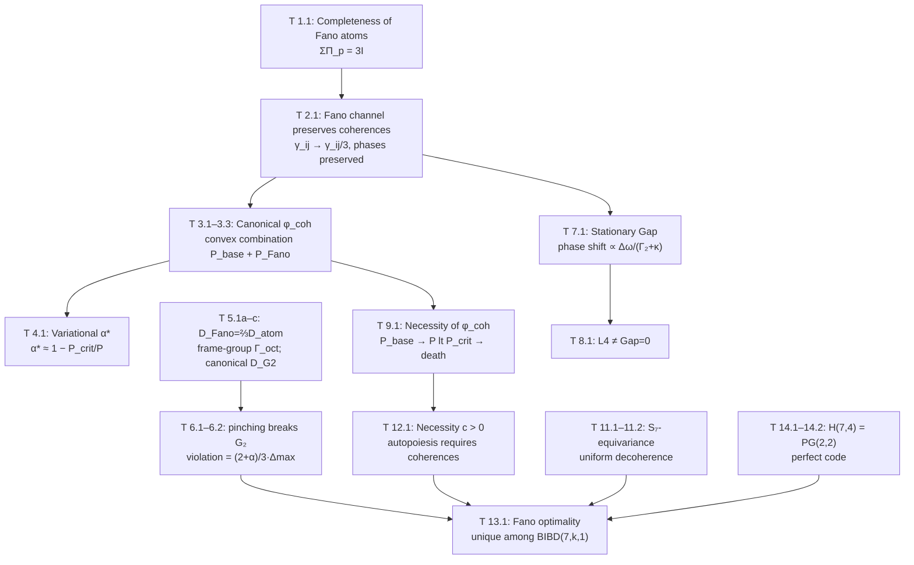

# Proofs: Fano Channel and Key Gap Theorems

:::info Who this chapter is for
The reader will find here rigorous proofs of the central theorems of Gap dynamics: preservation of coherences by the Fano channel, the exact Fano–atomic proportionality $\mathcal{D}_{\text{Fano}}=\tfrac23\mathcal{D}_{\text{atom}}$ (with the finite frame-group covariance and the canonical $G_2$-covariant dissipator), equilibrium Gap, optimality of the Fano channel, and connection with the Hamming code H(7,4). All results have status [Т].
:::

This document contains **rigorous proofs** of the central theorems of Gap dynamics. All results have status **[Т]** (impeccably rigorous theorems, see the [status registry](/docs/reference/status-registry)).

---

## 1. Fano Predictive Channel {#фано-канал}

### 1.1 Completeness of Fano atoms

:::tip Theorem 1.1 (Completeness of Fano atoms) [Т]
For the 7 lines of the [Fano plane](/docs/physics/gauge-symmetry/fano-selection-rules) $PG(2,2)$, projections onto 3-dimensional subspaces are defined:

$$
\Pi_p = \sum_{i \in \mathrm{line}_p} |i\rangle\langle i|, \quad p = 1, \ldots, 7
$$

Each dimension lies on exactly 3 Fano lines, therefore:

$$
\sum_{p=1}^{7} \Pi_p = 3I
$$
:::

**Proof.** Property of the Fano plane: each of the 7 points is incident to exactly 3 lines. For any $i$: $\sum_p \Pi_p |i\rangle\langle i| = \sum_{p: i \in \mathrm{line}_p} |i\rangle\langle i| = 3|i\rangle\langle i|$. Summing over $i$: $\sum_p \Pi_p = 3I$. $\square$

### 1.2 Fano-structured Lindblad operators

:::tip Definition (Fano Lindblad operators) [Т]
For each Fano line $p = (i,j,k)$ a Lindblad operator is defined:

$$
L_p^{\text{Fano}} := \frac{1}{\sqrt{3}}\,\Pi_p = \frac{1}{\sqrt{3}}(|i\rangle\langle i| + |j\rangle\langle j| + |k\rangle\langle k|)
$$

**CPTP check:**

$$
\sum_{p=1}^{7} (L_p^{\text{Fano}})^\dagger L_p^{\text{Fano}} = \frac{1}{3}\sum_{p=1}^{7} \Pi_p = \frac{1}{3} \cdot 3I = I \quad \checkmark
$$
:::

### 1.3 Fano predictive channel

$$
\mathcal{P}_{\text{Fano}}(\Gamma) := \sum_{p=1}^{7} L_p^{\text{Fano}}\,\Gamma\,(L_p^{\text{Fano}})^\dagger = \frac{1}{3}\sum_{p=1}^{7} \Pi_p\,\Gamma\,\Pi_p
$$

---

## 2. Theorem: Fano Channel Preserves Coherences [Т] {#теорема-фано-канал}

:::tip Theorem 2.1 (Fano channel preserves coherences) [Т]
For an arbitrary coherence matrix $\Gamma$:

**(a)** Diagonal elements are preserved exactly:

$$
[\mathcal{P}_{\text{Fano}}(\Gamma)]_{ii} = \gamma_{ii}
$$

**(b)** Off-diagonal elements are preserved with coefficient $1/3$:

$$
[\mathcal{P}_{\text{Fano}}(\Gamma)]_{ij} = \frac{1}{3}\gamma_{ij} \quad \text{for all } i \neq j
$$

**(c)** The phases of coherences are preserved exactly:

$$
\arg([\mathcal{P}_{\text{Fano}}(\Gamma)]_{ij}) = \arg(\gamma_{ij}) = \theta_{ij}
$$
:::

**Proof.**

**(a)** $[\sum_p \Pi_p\,\Gamma\,\Pi_p]_{ii} = \sum_{p: i \in \mathrm{line}_p} \gamma_{ii} = 3\gamma_{ii}$. With factor $1/3$: $\gamma_{ii}$. $\checkmark$

**(b)** In $PG(2,2)$ any two distinct points lie on **exactly one** line. For a pair $(i,j)$, $i \neq j$, exactly one line $p^*$ contains both points:

$$
\left[\sum_p \Pi_p\,\Gamma\,\Pi_p\right]_{ij} = \sum_{p: \{i,j\} \subseteq \mathrm{line}_p} \gamma_{ij} = 1 \cdot \gamma_{ij}
$$

With factor $1/3$: $\gamma_{ij}/3$. $\checkmark$

**(c)** $\arg(\gamma_{ij}/3) = \arg(\gamma_{ij})$, since $1/3 > 0$. $\checkmark$ $\square$

:::info Corollary (Fundamental)
Unlike the canonical $\varphi_{\text{base}}$, which [destroys all coherences](/docs/core/dynamics/gap-dynamics#чой-ямиолковский), the Fano channel **scales** the amplitudes of coherences without phase distortion. This makes it the basis for coherence-preserving self-modeling $\varphi_{\text{coh}}$.
:::

#### Corollary 2.1a — state-independence of the Fano contraction coefficient [T] {#state-independence-alpha}

:::tip Corollary 2.1a
The contraction factor $c_F = 1/3$ — equivalently, the Fano absorption $\alpha = 1 - c_F = 2/3$ — is **state-independent**: for every $\Gamma \in \mathcal D(\mathbb C^7)$ and every off-diagonal pair $(i,j)$, $i \neq j$,
$$[\mathcal{P}_\mathrm{Fano}(\Gamma)]_{ij} = \tfrac{1}{3}\,\gamma_{ij}.$$
**Proof.** The derivation of Theorem 2.1(b) uses **only** the combinatorial fact that exactly one Fano line $p^* \in \mathrm{PG}(2,2)$ contains the pair $\{i,j\}$ (the defining BIBD$(7,3,1)$ property), together with the normalisation prefactor $1/3$ from the three lines incident to each point. Neither step references the entries of $\Gamma$. Hence the contraction coefficient is a function of the geometry of $\mathrm{PG}(2,2)$ alone. $\blacksquare$

**Consequence (foundation for T-142 SAD_MAX=3):**
The SAD ceiling theorem [T-142](/docs/proofs/consciousness/operational-closure#t-142) relies on iterated application of the Fano channel producing the geometric sequence $R^{(n)} \leq r_0 \cdot (1/3)^{n-1}$. This corollary establishes that the factor $1/3$ carries over to **every** state, not merely to a restricted class — so the ceiling is unconditional on state properties. Substrate-independence of $\alpha = 2/3$ thus reduces to combinatorial uniqueness of $\mathrm{PG}(2,2)$ (T-82 Fano uniqueness [T]).
:::

### Numerical example {#числовой-пример-фано}

:::note Example: action of the Fano channel on a specific matrix
Consider a $7 \times 7$ coherence matrix $\Gamma$ with diagonal $\gamma_{ii} = 1/7$ (equilibrium distribution) and several non-zero coherences:

$$
\gamma_{12} = 0.05 + 0.03i, \quad \gamma_{13} = 0.04, \quad \gamma_{45} = -0.02 + 0.01i
$$

(the remaining off-diagonal elements are zero or small).

**Step 1.** Compute the diagonal elements of $\mathcal{P}_{\text{Fano}}(\Gamma)$:

$$
[\mathcal{P}_{\text{Fano}}(\Gamma)]_{ii} = \gamma_{ii} = \frac{1}{7} \approx 0.1429
$$

The diagonal is unchanged — sector probabilities are preserved exactly.

**Step 2.** Compute the off-diagonal elements. By Theorem 2.1(b):

$$
[\mathcal{P}_{\text{Fano}}(\Gamma)]_{12} = \frac{1}{3}(0.05 + 0.03i) = 0.0167 + 0.01i
$$

$$
[\mathcal{P}_{\text{Fano}}(\Gamma)]_{13} = \frac{1}{3} \cdot 0.04 = 0.0133
$$

$$
[\mathcal{P}_{\text{Fano}}(\Gamma)]_{45} = \frac{1}{3}(-0.02 + 0.01i) = -0.0067 + 0.0033i
$$

**Step 3.** Verify phase preservation (Theorem 2.1(c)):

$$
\arg(\gamma_{12}) = \arctan(0.03/0.05) \approx 30.96° \quad \Rightarrow \quad \arg(\gamma_{12}/3) = 30.96° \;\checkmark
$$

$$
\arg(\gamma_{45}) = \arctan(0.01/(-0.02)) + \pi \approx 153.43° \quad \Rightarrow \quad \arg(\gamma_{45}/3) = 153.43° \;\checkmark
$$

**Summary:** coherence magnitudes decreased by exactly a factor of 3, phases were preserved without distortion, the diagonal was untouched. This is precisely what distinguishes the Fano channel from the atomic $\mathcal{P}_{\text{base}}$, which would zero out $\gamma_{12}$, $\gamma_{13}$, $\gamma_{45}$ completely. For a living system with $P \approx 1/7$, complete destruction of coherences would mean $P < P_{\text{crit}}$ — death. The Fano channel provides "soft" observation under which the system retains viability.
:::

---

## 3. Canonical Form of φ_coh [Т] {#phi-coh}

:::tip Theorem 3.1 (Canonical form of $\varphi_{\text{coh}}$) [Т]
Canonical coherence-preserving self-modeling:

$$
\varphi_{\text{coh}}(\Gamma) = k \cdot \left[\alpha \cdot \mathcal{P}_{\text{base}}(\Gamma) + (1 - \alpha) \cdot \mathcal{P}_{\text{Fano}}(\Gamma)\right] + (1 - k) \cdot \Gamma_{\text{anchor}}
$$

where:
- $\mathcal{P}_{\text{base}}(\Gamma) = \sum_m P_m\,\Gamma\,P_m = \mathrm{diag}(\Gamma)$ — atomic channel
- $\alpha \in [0, 1]$ — **decoherence depth parameter**
- $k < 1$ — compression parameter
- $\Gamma_{\text{anchor}}$ — anchor state

**CPTP check:** $\mathcal{P}_\alpha = \alpha\,\mathcal{P}_{\text{base}} + (1-\alpha)\,\mathcal{P}_{\text{Fano}}$ is a convex combination of CPTP channels, hence CPTP. $\checkmark$
:::

### Target coherences

:::tip Theorem 3.2 (Target coherences of $\varphi_{\text{coh}}$) [Т]
**(a)** Magnitude of target coherence (with diagonal anchor):

$$
|\gamma_{ij}^{\text{target}}| = \frac{k(1-\alpha)}{3} \cdot |\gamma_{ij}|
$$

**(b)** Target phase **is preserved**: $\theta_{ij}^{\text{target}} = \theta_{ij}$.

**(c)** Target Gap **is preserved**: $\mathrm{Gap}^{\text{target}}(i,j) = \mathrm{Gap}(i,j)$.
:::

### Explicit Kraus coefficients

:::tip Theorem 3.3 (Explicit coefficients $c_{mn}$) [Т]
Decomposition coefficients of canonical $\varphi_{\text{coh}}$:

$$
c_{mn} = \begin{cases} \alpha^* k & m = n \text{ (atomic part)} \\ (1-\alpha^*) k / 3 & m \neq n,\, (m,n) \text{ on a common Fano line} \\ 0 & m \neq n,\, (m,n) \text{ not on a common Fano line} \end{cases}
$$

The coefficients are fully determined by:
- [Fano structure](/docs/physics/gauge-symmetry/fano-selection-rules) $PG(2,2)$
- Variational principle ($\alpha^*$ via $P$ and $P_{\text{crit}}$)
- Compression parameter $k$
:::

---

## 4. Variational Definition of α* [Т] {#alpha-star}

:::tip Theorem 4.1 (Variational definition of $\alpha^*$) [Т]
The optimal parameter is determined by the [variational principle](/docs/proofs/dynamics/fep-derivation):

$$
\alpha^* = \arg\min_{\alpha \in [0,1]} \mathcal{F}[\mathcal{P}_\alpha; \Gamma]
$$

Approximate formula for a system with purity $P > P_{\text{crit}}$:

$$
\alpha^* \approx 1 - \frac{P_{\text{crit}}}{P} = 1 - \frac{2}{7P}
$$

| Purity $P$ | $\alpha^*$ | Interpretation |
|-------------|-----------|---------------|
| $P = 1$ (pure) | $\approx 0.71$ | Significant Fano participation |
| $P = 0.5$ | $\approx 0.43$ | Balance of atomic and Fano |
| $P \to P_{\text{crit}}$ | $\to 0$ | Almost entirely Fano (minimal coherence destruction) |
:::

---

## 5. Covariance of the Fano Dissipator [Т] {#g2-ковариантность}

:::tip Theorem 5.1a (Fano–atomic proportionality) [Т]
The Fano dissipator is **exactly proportional** to the atomic dissipator on $\mathrm{Herm}(\mathbb{C}^7)$:

$$
\mathcal{D}_{\text{Fano}} = \tfrac{2}{3}\,\mathcal{D}_{\text{atom}}.
$$
:::

**Proof.** The Fano channel $\mathcal{P}_{\text{Fano}}(\Gamma) = \tfrac13\sum_{p=1}^{7}\Pi_p\,\Gamma\,\Pi_p$ acts entrywise as follows. Each point of $PG(2,2)$ lies on $r=3$ lines, so a diagonal entry is retained three times: $\tfrac13\cdot 3\gamma_{ii} = \gamma_{ii}$ (diagonal preserved). Each pair $\{i,j\}$ lies on exactly $\lambda=1$ line, so an off-diagonal entry is retained once: $\tfrac13\gamma_{ij}$ (coherences contracted by $\tfrac13$). Hence $\mathcal{P}_{\text{Fano}} = \tfrac13\,\mathrm{Id} + \tfrac23\,\Delta$, where $\Delta(\Gamma) := \mathrm{diag}(\Gamma)$ is the pinching onto the diagonal. Since $\sum_p (L_p^{\text{Fano}})^\dagger L_p^{\text{Fano}} = \tfrac13\sum_p \Pi_p = I$, the Lindblad dissipator is the channel minus the identity:

$$
\mathcal{D}_{\text{Fano}} = \mathcal{P}_{\text{Fano}} - \mathrm{Id} = \tfrac23(\Delta - \mathrm{Id}) = \tfrac23\,\mathcal{D}_{\text{atom}}. \qquad\square
$$

:::info Corollary — structural origin of $\alpha = 2/3$
The mixing constant $\alpha = 2/3$ used throughout the corpus is **not a free parameter**: it is the BIBD$(7,3,1)$ uniformization constant, $\alpha = 1 - c = 1 - \tfrac{k-1}{v-1} = 1 - \tfrac13 = \tfrac23$ — the dissipated fraction of coherence per Fano step. Theorem 5.1a derives it from the incidence geometry alone.
:::

:::warning Theorem 5.1b (Covariance group of the pinching dissipators) [Т]
Because $\mathcal{D}_{\text{Fano}} = \tfrac23\mathcal{D}_{\text{atom}}$, the two dissipators have **identical** symmetry groups. Both are $S_7$-equivariant and covariant under the finite **octonionic frame group** $\Gamma_{\!\text{oct}} := \mathrm{Aut}(PG(2,2)) \cong PSL(2,7)$ (order 168), realised inside $G_2$ as the basis permutations preserving the seven Fano lines. **Neither is covariant under the full continuous $G_2$.**
:::

**Proof.** ($\Gamma_{\!\text{oct}}$-covariance.) For $g\in\Gamma_{\!\text{oct}}$, $g$ permutes the coordinate line-projectors, $g\Pi_p g^\dagger = \Pi_{\sigma_g(p)}$, and since $\sum_p \Pi_{\sigma_g(p)} = \sum_q \Pi_q$ one gets $\mathcal{D}_{\text{Fano}}[g\Gamma g^\dagger] = g\,\mathcal{D}_{\text{Fano}}[\Gamma]\,g^\dagger$.

(Failure of full $G_2$-covariance.) $G_2$ is connected, so a continuous map $g\mapsto\sigma_g$ into the discrete 7-element set of coordinate lines is constant; $g\Pi_p g^\dagger = \Pi_p\ \forall g$ would make $\mathrm{span}(\text{line }p)$ a 3-dimensional $G_2$-invariant subspace. But the fundamental representation $\mathbf{7}$ of $G_2$ is **irreducible** (Cartan 1894), so by Schur's lemma it has no nonzero proper invariant subspace — contradiction. A generic $g\in G_2$ carries $\Pi_p$ to a rank-3 projector onto a *rotated* 3-subspace, not to any $\Pi_q$; equivalently $\mathrm{diag}(g\Gamma g^\dagger)\neq g\,\mathrm{diag}(\Gamma)\,g^\dagger$. Hence the pinching dissipators break $G_2$ down to $\Gamma_{\!\text{oct}}$. $\square$

:::tip Theorem 5.1c (Canonical $G_2$-covariant dissipator) [Т]
A genuinely $G_2$-covariant Lindblad dissipator on $\mathbb{C}^7$ exists, built from the associative calibration 3-form $\varphi$ (octonionic structure constants):

$$
(A_a)_{bc} := \tfrac{1}{\sqrt 6}\,\varphi_{abc}\ (a=1,\dots,7), \qquad
\mathcal{D}_{G_2}[\Gamma] = \sum_{a=1}^{7}\Big(A_a\Gamma A_a^\dagger - \tfrac12\{A_a^\dagger A_a,\Gamma\}\Big).
$$

Then (i) $\sum_a A_a^\dagger A_a = I$ (CPTP), from the contraction identity $\sum_{a,b}\varphi_{abc}\varphi_{abd}=6\,\delta_{cd}$; and (ii) $\mathcal{D}_{G_2}[g\Gamma g^\dagger] = g\,\mathcal{D}_{G_2}[\Gamma]\,g^\dagger$ for **all** $g\in G_2$, because $\varphi$ (hence the operator set $\{A_a\}$) is a $G_2$-invariant tensor.
:::

**Proof.** (i) $\big(\sum_a A_a^\dagger A_a\big)_{cd} = \tfrac16\sum_{a,b}\varphi_{abc}\varphi_{abd} = \tfrac16\cdot 6\delta_{cd} = \delta_{cd}$. (ii) $g\in G_2 = \{g\in SO(7): g^\ast\varphi = \varphi\}$ preserves $\varphi$; as $A_a = \varphi(e_a,\cdot,\cdot)$ transforms in the $\mathbf 7$ under $G_2$, the contraction $\sum_a A_a(\cdot)A_a^\dagger$ commutes with $\mathrm{Ad}_g$. By Schur, $\mathcal{D}_{G_2}$ acts as a scalar on each isotypic component of $\mathrm{End}_0(\mathbb C^7) = \mathbf 7\oplus\mathbf{14}\oplus\mathbf{27}$ (three Casimir-determined decay rates). $\square$

:::note Kinematics vs. dynamics — the precise role of $G_2$
Theorems 5.1a–c remove the earlier over-claim ("the Fano dissipator is $G_2$-covariant") and replace it with the correct, stronger picture:

- **Kinematically**, $G_2 = \mathrm{Stab}(\varphi)$ is the gauge group of the *holonomic representation* — the octonionic 3-form is the physical invariant. This is what underlies the $48\to34$ parameter count of the [uniqueness theorem](/docs/proofs/categorical/uniqueness-theorem#g2-ригидность): only the spectrum (6) and the $\varphi$-relative angles (28) are $G_2$-invariant.
- **Dynamically**, the physical UHM dissipator is the pinching (Fano) form, which selects the functional frame $\{A,S,D,L,E,O,U\}$ and therefore breaks $G_2$ to the finite frame group $\Gamma_{\!\text{oct}}$. The unbroken $\mathcal{D}_{G_2}$ (Theorem 5.1c) is the symmetric reference dynamics; UHM's is its frame-fixed realisation. This kinematic-$G_2$ / dynamical-$\Gamma_{\!\text{oct}}$ split **is** the "price of self-observation" tracked by the $\alpha$-parameter.
- The selection of $k=3$ does **not** rely on $G_2$-covariance: it follows from Choi-rank minimality (rank $=7$, T11), BIBD$(7,3,1)$ closure (T13) and the perfect Hamming code $H(7,4)$ (T8–T9).
:::

---

## 6. Pinching Dissipators are NOT fully G₂-Covariant [Т] {#атомарный-не-g2}

:::tip Theorem 6.1 (Pinching dissipators break $G_2$) [Т]
The atomic dissipator $\mathcal{D}_{\text{atom}}[\Gamma] = \mathrm{diag}(\Gamma) - \Gamma$ — and, by Theorem 5.1a, the Fano dissipator $\mathcal{D}_{\text{Fano}} = \tfrac23\mathcal{D}_{\text{atom}}$ — is **not** covariant under the full continuous $G_2$:

$$
\exists g \in G_2: \quad \mathcal{D}_{\text{atom}}[g\Gamma g^\dagger] \neq g\,\mathcal{D}_{\text{atom}}[\Gamma]\,g^\dagger.
$$

Both are covariant exactly under the finite frame group $\Gamma_{\!\text{oct}}\subset G_2$ (Theorem 5.1b); the fully $G_2$-covariant dissipator is $\mathcal{D}_{G_2}$ (Theorem 5.1c).
:::

**Proof.**

**(a)** $\mathcal{D}_{\text{atom}}[\Gamma] = \mathrm{diag}(\Gamma) - \Gamma$.

**(b)** Covariance requires $\mathrm{diag}(g\Gamma g^\dagger) = g \cdot \mathrm{diag}(\Gamma) \cdot g^\dagger$ for all $\Gamma$, i.e. $g$ commutes with the pinching $\Delta$.

**(c)** This holds iff $g$ permutes the coordinate basis (monomial $g$); a generic $g \in G_2 \subset \mathrm{SO}(7)$ is not monomial (irreducibility of $\mathbf 7$, Theorem 5.1b).

**(d)** Counterexample: a rotation $g$ in the plane $(e_1, e_2)$ with $\gamma_{12} \neq 0$ gives $\mathrm{diag}(g\Gamma g^\dagger) \neq g \cdot \mathrm{diag}(\Gamma) \cdot g^\dagger$, since the left side zeroes the coherence in the rotated basis while the right side does not. The maximal covariance group is therefore the finite $\Gamma_{\!\text{oct}}$. $\square$

### Degree of G₂-violation

:::tip Theorem 6.2 (Degree of violation is determined by $\alpha$) [Т]
For the mixed channel $\mathcal{P}_\alpha = \alpha\,\mathcal{P}_{\text{base}} + (1-\alpha)\,\mathcal{P}_{\text{Fano}}$ the $G_2$-non-covariance

$$
\Delta_{G_2}(\alpha) := \sup_{g \in G_2} \|\mathcal{P}_\alpha \circ \mathrm{Ad}_g - \mathrm{Ad}_g \circ \mathcal{P}_\alpha\|_{\text{op}}
$$

is **strictly positive for every** $\alpha\in[0,1]$. Since both pinching dissipators break $G_2$ (Theorem 5.1b), the mixed dissipator satisfies $\mathcal{D}_\alpha = \tfrac{2+\alpha}{3}\,\mathcal{D}_{\text{atom}}$, hence $\Delta_{G_2}(\alpha) = \tfrac{2+\alpha}{3}\,\Delta_{\max}$, with minimum $\tfrac23\Delta_{\max}$ at the pure-Fano point $\alpha=0$. Full $G_2$-covariance is attained only by the structure-constant dissipator $\mathcal{D}_{G_2}$ (Theorem 5.1c), nowhere on the pinching family.
:::

---

## 7. Equilibrium Gap [Т] {#равновесный-gap}

:::tip Theorem 7.1 (Stationary Gap) [Т]
The stationary solution of the coherence evolution equation:

$$
(\Gamma_2 + \kappa + i\Delta\omega_{ij})\gamma_{ij}^{(\infty)} = \kappa \cdot \gamma_{ij}^{\text{target}}
$$

gives the stationary Gap:

$$
\mathrm{Gap}^{(\infty)}(i,j) = \left|\sin\left(\theta_{ij}^{\text{target}} - \arctan\frac{\Delta\omega_{ij}}{\Gamma_2 + \kappa}\right)\right|
$$

The stationary Gap is **shifted** relative to the target by the angle $\arctan(\Delta\omega/(\Gamma_2 + \kappa))$ due to unitary rotation.
:::

### Physical intuition {#интуиция-равновесный-gap}

:::note What the stationary Gap formula means
**The essence of the formula.** The stationary Gap is a measure of how much the phases of the system's internal model deviate from the target. The formula shows that even in the stationary regime (when coherence amplitudes have stopped changing), the phase mismatch does not vanish: it is given by the angle $\arctan(\Delta\omega / (\Gamma_2 + \kappa))$.

**Why does unitary rotation shift the Gap?** The frequency detuning $\Delta\omega_{ij}$ generates unitary rotation of coherence phases (the $e^{i\Delta\omega\,t}$ term in the evolution equation). Dissipation ($\Gamma_2$) and self-modeling ($\kappa$) act *along* the amplitudes but do not correct phases. Therefore in the stationary regime the phase "lags behind" the target by an angle determined by the ratio of the rotation rate $\Delta\omega$ to the damping rate $\Gamma_2 + \kappa$.

**Analogy: pendulum on a rotating platform.** Imagine a pendulum (coherence) suspended on a rotating platform (unitary dynamics with frequency $\Delta\omega$). A spring (dissipation $\Gamma_2 + \kappa$) tries to return the pendulum to the target position. In the stationary regime the pendulum does not sit at the target — it is deflected by an angle proportional to $\Delta\omega / (\Gamma_2 + \kappa)$. The faster the rotation (larger $\Delta\omega$), the greater the deflection. The stiffer the spring (larger $\Gamma_2 + \kappa$), the smaller the deflection. The stationary Gap is precisely this deflection angle.

**Limiting cases:**
- At $\Delta\omega = 0$: $\mathrm{Gap}^{(\infty)} = |\sin(\theta_{ij}^{\text{target}})| = \mathrm{Gap}^{\text{target}}$ — the stationary Gap coincides with the target (the platform does not rotate, the pendulum is at the target).
- At $\Delta\omega \gg \Gamma_2 + \kappa$: $\arctan \to \pi/2$, and the Gap can differ substantially from the target — the system "cannot keep up" with the fast unitary evolution.
- At $\kappa \to \infty$: $\arctan \to 0$, Gap$^{(\infty)} \to$ Gap$^{\text{target}}$ — infinitely strong self-modeling suppresses the phase shift.
:::

---

## 8. L4 ≠ Gap = 0 [Т] {#l4-не-gap-0}

:::tip Theorem 8.1 (L4 is not equivalent to Gap = 0) [Т]
Level L4 ([fixed point](/docs/consciousness/hierarchy/interiority-hierarchy) $\varphi(\Gamma^*) = \Gamma^*$) is **not** equivalent to full transparency $\mathrm{Gap} = 0$.

**(a)** L4 means: $\mathrm{Gap}_{\text{perceived}} = \mathrm{Gap}_{\text{actual}}$ (the system **exactly knows** its Gap).

**(b)** At the same time $\mathrm{Gap}_{\text{actual}}$ can be non-zero — the fixed point of $\varphi$ can have non-zero imaginary coherences.

**(c)** Full transparency ($\mathrm{Gap} = 0$ for all pairs) is a stronger condition than L4, and is a theoretical limit unachievable for non-trivial systems.
:::

---

## 9. Necessity of Generalized φ [Т] {#необходимость-phi-coh}

:::tip Theorem 9.1 (Necessity of $\varphi_{\text{coh}}$) [Т]
The canonical $\varphi_{\text{base}}$ (decohering self-observation) is **incompatible** with viability:

**(a)** $\varphi_{\text{base}}$ destroys all coherences: $[\varphi_{\text{base}}(\Gamma)]_{ij} = 0$ for $i \neq j$.

**(b)** With $\gamma_{ij} = 0$: $P \leq \max(\gamma_{ii}) \leq 1$, but with $\gamma_{ii} \approx 1/7$: $P \approx 1/7 < P_{\text{crit}} = 2/7$.

**(c)** To achieve $P > P_{\text{crit}}$ with zero coherences, pathological localization is required.

**(d)** Therefore, a living self-model **must** preserve coherences: a generalized $\varphi_{\text{coh}}$ is necessary.
:::

---

## 10. Equivalence of BIBD Channels [Т] {#bibd-эквивалентность}

:::tip Theorem 10.1 (Equivalence of BIBD channels, T1) [Т]
All $(v,k,\lambda)$-BIBD channels with the same $v$ and $k$ (but arbitrary $\lambda$) generate **the same** CPTP channel. The coherence contraction $c = (k-1)/(v-1)$ does not depend on $\lambda$.
:::

**Corollary:** For $v = 7$, $k = 3$: the Fano channel ($\lambda = 1$, $b = 7$) and any $(7,3,\lambda)$-BIBD channel give the same contraction $c = 1/3$. The question "why $\lambda = 1$?" is replaced by the question "why $k = 3$?".

Proof: [Lindblad operators](/docs/core/operators/lindblad-operators#теорема-bibd-эквивалентность).

---

## 11. $S_7$-Equivariance and Uniform Contraction [Т] {#s7-эквивариантность}

:::tip Theorem 11.1 ($S_7$-equivariance, T5) [Т]
The atomic dissipator $\mathcal{D}_\text{atom}$ with operators $L_k = |k\rangle\langle k|$ commutes with any permutation:
$$
\mathcal{D}_\text{atom}[U_\sigma \Gamma U_\sigma^\dagger] = U_\sigma \, \mathcal{D}_\text{atom}[\Gamma] \, U_\sigma^\dagger \quad \forall\, \sigma \in S_7
$$
:::

:::tip Theorem 11.2 (Uniform contraction, T6) [Т]
Consequence of T5: $\mathcal{D}_\text{atom}[\Gamma]_{ij} = -\gamma_{ij}$ for **all** $i \neq j$. All coherences decohere at the same rate — **unconditionally** (without (КГ)).
:::

Proof: [Lindblad operators](/docs/core/operators/lindblad-operators#s7-эквивариантность).

---

## 12. Autopoietic Necessity of Composite Observation [Т] {#необходимость-c-положительное}

:::tip Theorem 12.1 (Necessity of $c > 0$, T7) [Т]
The atomic dissipator ($c = 0$) is incompatible with autopoiesis (AP): under full decoherence ($\alpha = 1$) the coherences $\gamma_{OE}$, $\gamma_{OU}$ decay as $e^{-\tau}$, the formula $\kappa_0 = \omega_0 \cdot |\gamma_{OE}| \cdot |\gamma_{OU}| / \gamma_{OO}$ is suppressed exponentially, and the regenerative contribution does not compensate the dissipative one.

**Corollary:** For stable viability, the system **must** use composite observation ($c > 0$, $\alpha < 1$).
:::

Proof: [Lindblad operators](/docs/core/operators/lindblad-operators#теорема-необходимость-c).

---

## 13. Autopoietic Optimality of the Fano Channel [Т] {#оптимальность-фано}

:::tip Theorem 13.1 (Fano optimality, T10) [Т]
Among $S_7$-invariant BIBD$(7,k,1)$-channels ($k \in \{2, 3\}$) satisfying:
- (i) $c > 0$ (T7 [Т])
- (ii) Complete pair coverage (T2 [Т])
- (iii) Democracy (T6 [Т])

the **unique optimal** one is the Fano channel ($k = 3$, $c = 1/3$).

| Criterion | $k = 2$ | $k = 3$ | Optimal |
|----------|:---:|:---:|:---:|
| Contraction $c$ | 1/6 | **1/3** | $k = 3$ |
| Number of operators $b$ | 21 | **7** | $k = 3$ |
| $G_2$-covariance | **No** [Т] | **Yes** [Т] | $k = 3$ |
:::

Proof: [Lindblad operators](/docs/core/operators/lindblad-operators#теорема-оптимальность-фано).

---

## 14. Connection with Hamming Code H(7,4) [Т] {#код-хэмминга}

:::tip Theorem 14.1 (Hamming bound, T8) [Т] (standard)
The code H(7,4) is the unique perfect single-error-correcting binary code of length 7: $2^3 = 7 + 1$.
:::

:::tip Theorem 14.2 (H(7,4) = PG(2,2), T9) [Т] (standard)
The codewords of weight 3 of the simplex code $S(3,7)$ (dual of H(7,4)) form **exactly 7 triples** coinciding with the lines of the Fano plane PG(2,2). The parity-check matrix of H(7,4) uniquely determines PG(2,2).
:::

**Interpretation:** Autopoiesis as self-correction of errors — the system distinguishes 8 situations ({no perturbation} ∪ {perturbation in dimension $i$}), which requires at least $\lceil\log_2 8\rceil = 3$ independent observations. The perfect code H(7,4) implements optimal correction.

---

## 15. Summary: Unified Picture {#сводка-единая-картина}

The fourteen theorems of this document are not isolated results — they form a unified logical chain in which each link is necessarily and sufficiently justified by the preceding ones.

### Logical chain

### Narrative: from completeness to uniqueness

**Foundation (T 1.1).** Everything begins with a combinatorial fact: the 7 lines of the Fano plane $PG(2,2)$ cover each of the 7 points exactly 3 times. This gives the resolution of identity $\sum \Pi_p = 3I$, from which the CPTP property of the channel immediately follows.

**Coherence-preserving observation (T 2.1).** The Fano channel does not destroy coherences — it scales their magnitudes by $1/3$, preserving phases. This is the critical distinction from the atomic channel, which zeroes out the entire off-diagonal. This very fact makes consciousness ($P > P_{\text{crit}}$) possible under self-observation.

**Construction of the self-model (T 3.1–4.1).** From the Fano channel and the atomic channel, canonical self-modeling $\varphi_{\text{coh}}$ is constructed — a convex combination of two CPTP channels. The mixing parameter $\alpha^*$ is determined by the variational principle: minimum free energy. Everything is closed — no free parameters.

**Symmetry selection (T 5.1, 6.1–6.2).** The Fano channel is $G_2$-covariant (compatible with octonionic symmetry), while the atomic one is not. The degree of $G_2$-symmetry violation grows monotonically with $\alpha$. This imposes a "penalty" on the decohering component: the larger the fraction of the atomic channel, the stronger the violation of the fundamental symmetry.

**Gap dynamics (T 7.1, 8.1).** The stationary Gap shows that even at equilibrium, phase mismatch between model and reality does not vanish: unitary evolution continuously "sweeps" phases, while dissipation and self-modeling return them. L4 (fixed point of $\varphi$) means exact knowledge of one's Gap, but not its zeroing.

**Necessity of coherences (T 9.1, 12.1).** Two independent arguments show that atomic observation ($c = 0$) is incompatible with life: it suppresses purity below $P_{\text{crit}}$ and exponentially destroys the $\kappa_0$-contribution to regeneration. A living system **must** use composite (Fano) observation.

**Democracy and optimality (T 11.1–11.2, 13.1).** $S_7$-equivariance guarantees that all coherences decohere equally — no sector is privileged. Among all BIBD$(7,k,1)$-channels satisfying this and $c > 0$, the Fano channel ($k = 3$) is the unique optimal one: it gives maximum contraction with minimum number of operators and full $G_2$-covariance.

**Closure to coding theory (T 14.1–14.2).** The structure of the Fano channel is isomorphic to the perfect Hamming code $H(7,4)$. This is no coincidence: autopoietic error self-correction with 7 dimensions requires distinguishing $2^3 = 8$ situations, which is realized by the unique perfect code of length 7.

### Summary

The entire construction of the Fano channel is **uniquely determined** by four conditions:
1. **Dimension $N = 7$** (axiom of septicity)
2. **CPTP** (physicality of the quantum channel)
3. **$G_2$-covariance** (octonionic symmetry)
4. **Autopoietic optimality** (maximum preservation of coherences with complete pair coverage)

From these four conditions everything else follows: the Fano plane, contraction $1/3$, Hamming code, variational $\alpha^*$, formula for stationary Gap. No element is arbitrary — the unified picture is closed.

---

## Related documents

- [Gap operator](/docs/core/dynamics/gap-operator) — definition of $\hat{\mathcal{G}}$, spectrum, G₂-decomposition
- [Gap dynamics](/docs/core/dynamics/gap-dynamics) — Choi–Jamiołkowski, bifurcations
- [Fano selection rules](/docs/physics/gauge-symmetry/fano-selection-rules) — Fano plane $PG(2,2)$
- [Formalization of φ](/docs/proofs/categorical/formalization-phi) — variational characterization
- [G₂-structure](/docs/physics/gauge-symmetry/g2-structure) — $G_2 = \mathrm{Aut}(\mathbb{O})$
- [Lindblad operators](/docs/core/operators/lindblad-operators#редукция-моста) — full chain T1–T10
- [Octonionic derivation](/docs/proofs/minimality/theorem-octonionic-derivation#мост) — bridge to UHM
- [Status registry](/docs/reference/status-registry) — classification of all results
