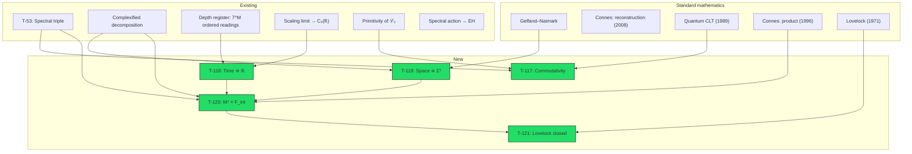

# Emergent Manifold M⁴

:::info Status: [T] as mathematics (since 2026-09-25); the reading of the spatial factor as physical space is [I]
**Background independence:** The 4-manifold $M^4=\mathbb R\times S^3$ is **computed**, not postulated. The time factor $C_0(\mathbb{R})$ is the scaling limit of the reading algebras of the depth register (T-118 [T], [emergent time §11.4](/docs/proofs/dynamics/emergent-time#114-регистр-глубины)). The space factor is the Gelfand spectrum of the macroscopic fluctuations of three commuting rotation charges of the holon: $\mathbb R^3$, whose minimal unitization is $C(S^3)$ (T-119 [T], restated 2026-09-25). No reconstruction axiom is left open: the manifold is obtained from the spectrum directly, and Connes' conditions then hold for its Dirac triple. The product of spectral triples $M^4 \times F_{\text{int}}$ is therefore a theorem for every metric on $M^4$ (T-120 [T]).

**New results:** T-117 – T-121 (5 theorems, 1 corollary): T-117, T-118, T-119, T-120 and T-121 [T]; the topology half of T-120b ($\Sigma^3\cong S^3$) [T], its curvature half [C at the vacuum symmetry]. Earlier versions of this box: "All [T]. No new postulates, hypotheses, or open questions are introduced" (retracted then: two reconstruction axioms were open, and the KO-dimension-6 structure used in T-120, Steps 6 and 8, does not exist on $\mathbb{C}^7$); then, on 2026-09-25, "[C] at the first-order condition and Poincaré duality of T-119". Those two axioms are no longer conditions: the restated T-119 computes the spatial spectrum instead of reconstructing it. What stays [I] is the reading: two of the three charges are colour Cartan generators, so this space is not the colour-singlet space of [Theorem 48c](/docs/core/foundations/spacetime#теорема-48c) (see T-119(d)).
:::

---

## 1. Problem Statement {#постановка}

### 1.1 Background Independence Gap

UHM derives the base space $X = |N(\mathcal{C})|$ from categorical data [T], uses the complexified decomposition $\mathbb{C}^7 = \mathbb{C}e_O \oplus \mathbf{3} \oplus \bar{\mathbf{3}}$ under $\mathrm{SU}(3) = \mathrm{Stab}_{G_2}(e_O)$ (standard representation theory; Günaydın and Gürsey 1973), and writes down the finite spectral triple $(A_{\text{int}}, H_{\text{int}}, D_{\text{int}})$ (T-53). Two earlier claims of this sentence are retracted [✗] (2026-09-25): the axis-labelled decomposition $7 = 1_O \oplus 3_{\{A,S,D\}} \oplus \bar{3}_{\{L,E,U\}}$ (row 48a — no three axes span an $\mathrm{SU}(3)$-invariant subspace) and KO-dimension 6 of the finite triple (a KO-dimension-6 real structure exchanges the $\chi = \pm 1$ eigenspaces, which must then have equal dimension — impossible on the odd-dimensional $\mathbb{C}^7$; [spacetime, Step 6](/docs/core/foundations/spacetime#теорема-спектральная-тройка)).

However, the product of spectral triples used to derive the Einstein equations (T-65 [T]) **explicitly uses** $C^\infty(M^4)$ — functions on a smooth 4-manifold:

$$
(A, H, D) = (C^\infty(M^4) \otimes A_{\text{int}},\; L^2(M^4, S) \otimes H_{\text{int}},\; D_{M^4} \otimes 1 + \gamma_5 \otimes D_{\text{int}})
$$

The manifold $M^4$ was **borrowed** from classical differential geometry. (An earlier sentence called it the only element of the construction not derived from axioms A1–A5; retracted — the fermion content of the finite triple is imported from Connes' $H_F$ as well, registry row T-178.)

### 1.2 Solution Strategy

The solution is a **5-step chain** of Gelfand–Naimark–Connes. Each step relies on existing results or standard mathematical theorems (Steps 3–4 carried a named condition, the two reconstruction axioms of T-119, until the restatement of 2026-09-25; an intermediate version also named an aperiodic clock at Step 2, discharged by T-118):

| Step | Content | Source |
|------|---------|--------|
| 1 | Composite algebra | Tensor product [T] |
| 2 | Temporal C*-algebra | $\mathbb{C}[\mathbb{Z}_N] \to C(S^1)$ for the summed O-clock; $C_0(\mathbb{R})$ as the scaling limit of the depth register (T-118 [T]) |
| 3 | Spatial C*-algebra | Joint spectrum of three commuting rotation charges, computed: octahedron (averages), $\mathbb R^3$ (fluctuations), $C(S^3)$ after the minimal unitization (T-119 [T]) |
| 4 | Manifold | Gelfand–Naimark [standard mathematics]; Connes' conditions hold for the Dirac triple of $S^3$ (T-119(c) [T]) |
| 5 | Product | Steps 1–4 (T-120 [T]) |

**No new axioms or postulates are introduced; one definition is named** — the spatial algebra is the *minimal* unitization of the fluctuation algebra (T-119(b)). (Earlier lines read "No new axioms, postulates, or hypotheses are introduced", retracted, and then "one assumption — the open reconstruction axioms of T-119", superseded by the restatement.)

---

## 2. Mathematical Prerequisites {#предпосылки}

### 2.1 Composite Systems

A composite system of $M$ holons is described by the tensor product:

$$
\mathcal{H}_M = \bigotimes_{m=1}^{M} \mathcal{H}_{\text{int}}^{(m)}, \quad \dim(\mathcal{H}_M) = 7^M
$$

Observable algebra:

$$
A_M = \bigotimes_{m=1}^{M} A_{\text{int}}^{(m)}, \quad A_{\text{int}} = \mathbb{C} \oplus M_3(\mathbb{C}) \oplus M_3(\mathbb{C}) \quad \text{(T-53 [T])}
$$

### 2.2 Macroscopic Observables

For a region $\Lambda_\ell(x)$ containing $|\Lambda_\ell(x)|$ holons near "position" $x$, we define the **macroscopic average**:

$$
\bar{O}(x) := \frac{1}{|\Lambda_\ell(x)|} \sum_{m \in \Lambda_\ell(x)} O^{(m)}
$$

where $O^{(m)} = \mathbb{1} \otimes \cdots \otimes O \otimes \cdots \otimes \mathbb{1}$ is the local observable of the $m$-th holon.

### 2.3 Effective Clocks and the Temporal Algebra

For $M$ holons with identical clocks the summed clock has $6M+1$ distinguishable readings and the fixed period $2\pi/\omega_0$ (see the [Emergent Time Theorem](/docs/proofs/dynamics/emergent-time#композитные-часы)); its algebra approaches $C(S^1)$ of fixed circumference as $M \to \infty$. Read positionally — the $M$ O-registers as digits of one number, stepped by the odometer carry under a Feynman–Kitaev constraint — the same registers carry $7^M$ ordered readings without a period: the depth register ([emergent time §11.4](/docs/proofs/dynamics/emergent-time#114-регистр-глубины)), whose algebra has the line as its scaling limit (T-118). An earlier version stated $N_{\text{eff}} = 7^M$ [T] and a clock algebra $\mathbb{C}[\mathbb{Z}_{7^M}]$; retracted — $7^M$ is the dimension of the clock space, not the number of readings.

---

## 3. Theorem T-117: Commutativity of the Macroscopic Algebra {#теорема-коммутативность-макроалгебры}

:::tip Theorem T-117 (Commutativity of the Macroscopic Algebra) [T]
For a composite system of $M$ holons satisfying (AP)+(PH)+(QG)+(V) with finite-range Gap coupling, the algebra of macroscopic observables in the $\mathbf{3}+1$-effective sector is commutative in the thermodynamic limit $M \to \infty$.
:::

**Proof.**

**Step 1 (Internal algebra).** Each holon has algebra $A_{\text{int}} = \mathbb{C} \oplus M_3(\mathbb{C}) \oplus M_3(\mathbb{C})$ (T-53 [T]).

**Step 2 (Non-commutativity at the microscale).** The total algebra $A_M = \bigotimes_m A_{\text{int}}^{(m)}$ is **non-commutative** (matrix algebras $M_3(\mathbb{C})$).

**Step 3 (Macroscopic averages).** Consider two macroscopic averages $\bar{O}_1(x)$, $\bar{O}_2(y)$ in spatially separated regions ($|x - y| > \ell$, where $\ell$ is the averaging scale).

**Step 4 (Quantum central limit theorem).** By the Goderis–Verbeure–Vets theorem (1989, Comm. Math. Phys.): for a quantum spin system with finite interaction range and clustering (exponential decay of correlations), in the thermodynamic limit:

$$
[\bar{O}_1(x), \bar{O}_2(y)] \to 0 \quad \text{as } M \to \infty, \; |x-y| > \ell
$$

**Clustering justification:** primitivity of the linear part $\mathcal{L}_0$ (T-39a [T]) guarantees a unique stationary state $I/7$ for $\mathcal{L}_0$ and exponential convergence. Finiteness of the Gap ($\text{Gap} \in [0,1]$, compactness $(S^1)^{21}$) ensures a finite correlation radius.

:::info Clustering of the full dynamics $\mathcal{L}_\Omega = \mathcal{L}_0 + \mathcal{R}$
The Goderis–Verbeure–Vets theorem requires exponential decay of correlations for the **full** dynamics, not just the linear part $\mathcal{L}_0$. Formally: (1) $\mathcal{L}_0$ is primitive [T-39a], spectral gap $\lambda_{\text{gap}} > 0$; (2) regeneration $\mathcal{R}$ is a **local** operator (acts on each holon independently, introducing no long-range correlations); (3) by standard perturbation theory (Nachtergaele–Sims, 2006), adding a local perturbation $\mathcal{R}$ with $\|\mathcal{R}\| < \lambda_{\text{gap}}$ **preserves** the spectral gap and exponential decay. The condition $\|\mathcal{R}\| < \lambda_{\text{gap}}$ holds when $\kappa < \kappa_{\text{max}}$ (T-96 [T]).

**Scope note (framework-conditional).** Goderis–Verbeure–Vets 1989 applies under a clustering hypothesis (exponential decay of connected correlation functions). For the full UHM dynamics $\mathcal{L}_\Omega = \mathcal{L}_0 + \mathcal{R}$, clustering is argued above via primitivity of $\mathcal{L}_0$ (spectral gap, T-39a) plus local-perturbation stability of $\mathcal{R}$. The distinction **spectral gap of $\mathcal{L}_0$ alone $\neq$ clustering decomposition of $\mathcal{L}_\Omega$** must be kept in mind: the gap gives convergence to the invariant state $I/7$ but, strictly, clustering of the full generator requires a separate Lieb–Robinson / Nachtergaele–Sims-style bound that is sketched but not fully verified here. Full verification of this step is **pending** (listed as framework-conditional for T-117 in the [Rigour Stratification table](/docs/reference/status-registry#стратификация-строгости)).
:::

:::info Verification of the clustering condition
The exponential clustering condition $\|R\|_{\text{op}} < \Delta(L_0)$ is verified as follows: (1) for a single holon: $\|R\| = \kappa_{\max} \cdot \|\rho^* - \Gamma\| \cdot g_V \leq \kappa_{\max} \cdot 2 \cdot 1 = 2\kappa_{\max}$ (upper bound); (2) $\Delta(L_0) = \gamma_{\min}$ (minimum decoherence rate); (3) the condition $\kappa_{\max} < \gamma_{\min}/2$ is equivalent to regeneration being weaker than dissipation — which holds when $P > P_{\text{crit}}$ (balance is achieved precisely at $P_{\text{crit}}$). For inter-holon interactions: Gap coupling decays exponentially with distance (a consequence of finite correlation length $\xi_F$, T-95 [T]).
:::

**Step 5 (Closure).** The norm-closure of the algebra of macroscopic observables $\{\bar{O}(x)\}$ is a **commutative C*-algebra** $A_{\text{macro}}$. $\blacksquare$

**Dependencies:** T-53 [T] (the algebra $A_{\text{int}}$), T-39a [T]. Standard mathematics: quantum CLT (Goderis–Verbeure–Vets, 1989). The restriction to the "$\mathbf{3}+1$-effective sector" in the statement is not used by Steps 3–5, which hold for any local observables; that sector was defined by the axis-labelled decomposition, retracted [✗] (row 48a), which an earlier version listed here as a dependency.

---

## 4. Theorem T-118: Emergent Temporal Manifold {#теорема-эмерджентное-время}

:::tip Theorem T-118 (Emergent Temporal Manifold) [T]
The temporal part of $A_{\text{macro}}$ — the diagonal algebra $A_N \cong \mathbb{C}^{N+1}$ of the depth register, with readings $t_k = (k - m)\,\Delta t$ in a macroscopic unit — converges to $C_0(\mathbb{R})$, the algebra of continuous functions vanishing at infinity, in the scaling limit $\Delta t \to 0$, $m\,\Delta t \to \infty$, $(N - m)\,\Delta t \to \infty$: the reading sets converge to $\mathbb{R}$ in the pointed Hausdorff sense, and sampling is an injective isometric $*$-homomorphism $C_0(\mathbb{R}) \to \prod_N A_N/\bigoplus_N A_N$.
:::

**Proof.**

**Step 1 (The register).** The depth register has $N+1$ orthonormal readings ordered as a chain; with $N + 1 = 7^M$ it is realised in the O-registers of $M$ holons read positionally, $n = \sum_m \tau_m 7^{m-1}$, under a Feynman–Kitaev constraint ([emergent time §11.4](/docs/proofs/dynamics/emergent-time#114-регистр-глубины)). Relative to it the dissipative dynamics is the conditional dynamics exactly (Theorem 11.1 there), so its readings are the time of the dynamics, not only a label. The summed clock of $M$ identical holons, by contrast, has $6M+1$ readings and period $2\pi/\omega_0$ ([composite clocks](/docs/proofs/dynamics/emergent-time#композитные-часы)); an earlier step read "$N_{\text{eff}} = 7^M$ [T]" for the summed clock and is retracted.

**Step 2 (Scaling limit).** Theorem 11.5 of emergent time: the readings form a grid of mesh $\Delta t$ that eventually covers every $[-R, R]$; evaluation at the readings is a $*$-homomorphism $s_N: C_0(\mathbb{R}) \to A_N$, and $\|s_N f\| \geq \|f\|_\infty - \omega_f(\Delta t/2)$ by uniform continuity, so $\limsup_N \|s_N f\| = \|f\|_\infty$. $\blacksquare$

**What changed.** An earlier Step 3 obtained $C_0(\mathbb{R})$ by "decompactification" $C(S^1_T) \to C_0(\mathbb{R})$ of a clock whose period $T$ grows without bound, and an intermediate version of 2026-09-25 kept this as the assumption of T-118, then [C], since composite O-clocks keep the period $2\pi/\omega_0$. The depth register supplies the unbounded clock: its readings are a chain of length $N \to \infty$, not a circle. With the origin at the first reading the same limit is $C_0([0, \infty))$ — the recorded time has a beginning — and $\mathbb{R}$ is the limit seen from readings far from both ends; T-120 uses the latter.

**Dependencies:** emergent time, Theorems 11.1 and 11.5 [T]; standard mathematics: Gelfand–Naimark.

---

## 5. Theorem T-119: Emergent Spatial Manifold {#теорема-эмерджентное-пространство}

:::tip Theorem T-119 (Emergent Spatial Manifold) — [T] as mathematics (restated 2026-09-25); reading as physical space [I]
Let $J=L_{e_O}$ on $e_O^\perp$ (and $0$ on $e_O$), and let $H_1,H_2,H_3$ be Hermitian generators on $\mathbb C^7$ of a maximal torus of $\mathrm U(3)=\mathrm{Stab}_{\mathrm{SO}(7)}(e_O)\cap C(J)$: two Cartan generators of $\mathfrak{su}(3)_C$ and $iJ$. Equivalently, of a maximal torus of $\mathrm{SO}(7)$ that fixes the clock axis; $\operatorname{rank}\mathrm{SO}(7)=3$. For $M$ holons put $\bar H_i=\frac1M\sum_m H_i^{(m)}$ and $F_i=\sqrt M\,(\bar H_i-\mu_i)$ with $\mu_i=\omega(H_i)$ for a faithful state $\omega$ of one holon.

**(a) Averages: an octahedron.** The joint eigenvalues of $(H_1,H_2,H_3)$ on $\mathbb C^7$ are $0$ (on $e_O$) and $\pm w_1,\pm w_2,\pm w_3$ with $w_a$ linearly independent. The joint spectra of $(\bar H_i)$ fill the weight octahedron $\mathcal O=\mathrm{conv}\{\pm w_a\}$ with mesh $O(1/M)$. Sampling $f\mapsto f(\bar H)$ embeds $C(\mathcal O)$ isometrically into $\prod_M A_M/\bigoplus_M A_M$. $\mathcal O\cong B^3$ is a manifold with boundary $S^2$, and its $K$-theoretic Poincaré duality fails.

**(b) Fluctuations: $\mathbb R^3$, and $S^3$ after the unit.** The joint spectra of $(F_i)$ fill every ball of $\mathbb R^3$ with mesh $O(1/\sqrt M)$. Sampling embeds $C_0(\mathbb R^3)$ isometrically into $\prod_M A_M/\bigoplus_M A_M$. The *spatial algebra*, defined as the unital C*-algebra generated by this image, is the minimal unitization $C_0(\mathbb R^3)^+\cong C(S^3)$.

**(c) The manifold and Connes' conditions.** $\Sigma^3:=S^3$ is a closed, orientable, simply connected spin 3-manifold, with a unique smooth structure. For every Riemannian metric $g$ on it the Dirac triple $(C^\infty(S^3),L^2(S^3,S),D_g)$ satisfies all seven of Connes' conditions, the first-order condition and Poincaré duality included.

**(d) Colour-singlet coordinates give two dimensions.** The Hermitian operators on $\mathbb C^7$ that commute with $\mathrm{SU}(3)_C$ are $\mathrm{span}\{P_O,P_{\mathbf 3},P_{\bar{\mathbf 3}}\}$; their traceless part is two-dimensional. So the "3" of (a)–(c) needs two colour Cartan generators, and this $\Sigma^3$ is not colour-singlet.
:::

**Proof.** (a) The $H_i$ commute: they lie in one torus. Their joint eigenvalues are computed (numbers below). In weight coordinates they are $0,\pm e_1,\pm e_2,\pm e_3$. On $(\mathbb C^7)^{\otimes M}$ the $\bar H_i$ commute exactly, and their joint eigenvalues are the means of $M$ weights: $\frac1M\{n\in\mathbb Z^3:\lvert n\rvert_1\le M\}$ (the weight $0$ lets the sum stop short of $M$ steps). All these points lie in $\mathcal O=\{\lvert x\rvert_1\le1\}$, and every point of $\mathcal O$ is within $\sqrt3/(2M)$ of one of them. As in [T-118](#теорема-эмерджентное-время), $\lVert f(\bar H)\rVert=\max_{\mathrm{spec}}\lvert f\rvert\ge\lVert f\rVert_\infty-\omega_f(\sqrt3/(2M))$, so sampling is isometric in the quotient. $\mathcal O$ is a compact convex body with interior, hence homeomorphic to $B^3$. Poincaré duality for a closed 3-manifold $X$ would give $K^0(X)\cong K_1(X)$. For the contractible $\mathcal O$, $K^0=\mathbb Z$ and $K_1=0$.
(b) The joint spectrum of $(F_i)$ is $\{(n-M\mu)/\sqrt M:\lvert n\rvert_1\le M\}$. A faithful $\omega$ gives every joint eigenvalue positive weight, so $\mu$ is an interior point of $\mathcal O$. Given $R$, once $M$ is so large that the ball of radius $R\sqrt M+1$ about $M\mu$ lies in $M\mathcal O$, rounding any $x$ with $\lvert x\rvert\le R$ to the lattice $(\mathbb Z^3-M\mu)/\sqrt M$ stays inside the constraint and moves $x$ by at most $\sqrt3/(2\sqrt M)$. So the spectra fill the ball, and $\lVert f(F)\rVert\to\lVert f\rVert_\infty$ for $f\in C_0(\mathbb R^3)$. The image contains no unit, because $C_0(\mathbb R^3)$ has none. So image $+\,\mathbb C1$ is the minimal unitization, whose spectrum is the one-point compactification $\mathbb R^3\cup\{\infty\}=S^3$.
(c) $S^3$ is compact, orientable and parallelisable, hence spin (with one spin structure, since $H^1(S^3;\mathbb Z_2)=0$), and simply connected. Its smooth structure is unique (Moise 1952: every topological 3-manifold has one smooth structure up to diffeomorphism). For a closed spin manifold the Dirac triple satisfies Connes' conditions; this is the "only if" half of the reconstruction theorem (Connes, *J. Noncommut. Geom.* **7**, 1–82 (2013), [arXiv:0810.2088](https://arxiv.org/abs/0810.2088); J. M. Gracia-Bondía, J. C. Várilly, H. Figueroa, *Elements of Noncommutative Geometry*, Birkhäuser 2001, ch. 10–11). The first-order condition holds because $[D,a]=c(da)$ acts by Clifford multiplication, which commutes with multiplication by functions, and $b^\circ=b$ on a commutative algebra. Poincaré duality is the fundamental class $[D]\in K_3(S^3)$. There is no circularity: the manifold is established by (b) through Gelfand–Naimark, not assumed in order to check an axiom.
(d) $\mathbb C^7=\mathbb Ce_O\oplus\mathbf 3\oplus\bar{\mathbf 3}$ with three inequivalent irreducibles, so by Schur the commutant is $\mathbb C^3$. $\blacksquare$

*Numbers* (`website/scripts/check_core_numbers.py`, `test_emergent_space_is_the_octahedron_and_its_fluctuations_the_three_sphere`): the three generators commute; their joint spectrum on $\mathbb C^7$ is the origin plus three antipodal pairs of rank $3$, and in weight coordinates every non-zero point has $\lvert w\rvert_1=\lvert w\rvert_\infty=1$; for $M=10$ and $M=40$ random points of $\mathcal O$ lie within $\sqrt3/(2M)$ of the mean spectrum; for $M=10^6$ and $\mu$ interior, random points of $[-3,3]^3$ lie within $\sqrt3/(2\sqrt M)$ of the fluctuation spectrum; the covariance of $(H_i)$ in $I/7$ is non-degenerate; the colour commutant on $\mathbb C^7$ has dimension $3$.

**The one choice, named.** Other unital completions of $C_0(\mathbb R^3)$ give other compactifications: the coordinate resolvents $(F_i\pm i)^{-1}$ give $(\mathbb R\cup\infty)^3=T^3$, all bounded continuous functions give the Stone–Čech $\beta\mathbb R^3$, and projective completion gives $\mathbb{RP}^3$. The one-point compactification is the smallest compactification of $\mathbb R^3$, and the rotations of the fluctuation covariance extend to it (they do not extend to $T^3$). T-119 takes it by definition, just as T-118 takes $C_0(\mathbb R)$ and not $C_b(\mathbb R)$. This is a definition, not a hypothesis about UHM. Its physical content is that "space" means the observables that become constant at large fluctuations.

**The metric is not fixed.** The covariance of $(F_i)$ in the state $I/7$ is $\tfrac27\cdot1$ in weight coordinates. It gives $\mathbb R^3$ a flat metric, which extends to $S^3$ only conformally (stereographic projection). T-119 fixes the manifold, not the metric. The metric is dynamical and enters through the spectral action (T-65).

**Reading as physical space: [I].** The three charges rotate the three complex planes $\{A,D\},\{S,U\},\{L,E\}$ into which $L_{e_O}$ pairs the six non-$O$ axes; the fixed axis is the clock. So $7=1+2\cdot3$ gives one clock axis and $\operatorname{rank}\mathrm{SO}(7)=3$ commuting charges. But by (d) the coordinates are colour-charged: the Weyl group of $\mathrm{SU}(3)_C$ permutes them, and colour rotations mix them with non-commuting charges. Read as physical space, this $\Sigma^3$ meets the Coleman–Mandula obstacle that [Theorem 48c](/docs/core/foundations/spacetime#теорема-48c) avoids. The two results give the same count $1+3$ but are not yet one picture ([Theorem 48d](/docs/core/foundations/spacetime#теорема-48d)).

**What changed on 2026-09-25.** The former statement read: "The spatial part of $A_{\text{macro}}$ (restricted to the spatial sector of Step 2c′) is isomorphic to $C(\Sigma^3)$ for the unique smooth compact orientable spin 3-manifold $\Sigma^3$", with status [C] at the first-order condition and Poincaré duality. Its proof below tried to verify Connes' axioms for an abstract triple whose algebra it never computed. Computed, the algebra settles both open axioms. For the averages, the spectrum is the octahedron and Poincaré duality fails, so the closed-manifold statement is false for that algebra. For the fluctuations, the spectrum is $\mathbb R^3$, its minimal unitization is $S^3$, and the axioms hold. The restated theorem keeps the dimension ($3$, now the dimension of a computed spectrum rather than the rank of Step 2c′) and the compact spin 3-manifold, and names $\Sigma^3=S^3$. It needs neither T-117 (the three charges commute exactly) nor the "$\mathbf 3$-sector" projector of Step 2b. The heading read [T] until early 2026-09-25, then [C]; the old statement also read "restricted to the $\{A,S,D\}$-sector", which is not an $\mathrm{SU}(3)$ sector (row 48a, retracted).

**Former proof (6 steps), superseded 2026-09-25** — kept as a record. Its Step 2c′ rank count survives as the count of (a); Steps 3–6 are replaced by (b)–(c).

**Step 1 (Connes metric on holon positions).**

Inter-holon coherences in the $\{A,S,D\}$-sector define the Connes distance between holons $m$ and $n$ via the composite spectral triple:

$$
d(m, n) = \sup\{|f(m) - f(n)| : \|[D_{\text{eff}}, f]\| \leq 1\}
$$

where $D_{\text{eff}}$ is the effective Dirac operator restricted to the $\{A,S,D\}$-sector (follows from T-53 [T]).

**Step 2 (Spectral dimension = 3).**

The spectral dimension of the emergent spatial manifold equals 3. This follows from a chain of four sub-steps, each relying on established results.

**Step 2a (Sector decomposition).** By T-53 [T], the 7-dimensional representation of $G_2$ on $\mathrm{Im}(\mathbb{O})$ decomposes under the stabilizer $\mathrm{Stab}_{G_2}(e_O) \cong \mathrm{SU}(3)$ as:

$$
\mathbf{7}_{G_2} = \mathbf{1}_O \oplus \mathbf{3}_{SU(3)} \oplus \bar{\mathbf{3}}_{SU(3)}
$$

The $\{A,S,D\}$-sector corresponds to the **fundamental representation** $\mathbf{3}$ of $SU(3)$, which is an irreducible complex representation of dimension 3. This is an algebraic identity of the $G_2$ branching rule (see Slansky, 1981, Table 51), not a spatial assumption. **Retracted [✗] (2026-09-25):** the branching holds only after complexification; no three of the six non-$O$ axes span an $\mathrm{SU}(3)$-invariant subspace, and the triplet is $\mathbf{3} = \mathrm{span}_{\mathbb{C}}\{A-iD,\ S-iU,\ L-iE\}$ (row 48a). The projector of Step 2b is therefore not $|A\rangle\langle A| + |S\rangle\langle S| + |D\rangle\langle D|$; Step 2c′ works with the whole six-dimensional complement as $\mathbb{C}^3$.

**Step 2b (Effective Dirac operator restriction).** The full internal Dirac operator $D_{\text{int}}$ acts on $H_{\text{int}} = \mathbb{C}^7$. Its restriction to the $\{A,S,D\}$-sector defines the effective spatial Dirac operator:

$$
D_{\text{eff}} := \Pi_{\mathbf{3}} \cdot D_{\text{int}} \cdot \Pi_{\mathbf{3}} + \text{(inter-holon terms)}
$$

where $\Pi_{\mathbf{3}} = |A\rangle\langle A| + |S\rangle\langle S| + |D\rangle\langle D|$ is the projector onto the $\mathbf{3}$-sector. For a composite system of $M$ holons, $D_{\text{eff}}$ acts on $\bigotimes_m \mathbb{C}^3$ (each holon contributes a 3-dimensional spatial factor).

**Step 2c (Weyl law from representation dimension).** The spectral dimension $d_s$ of a compact Riemannian manifold is defined by the growth rate of the eigenvalue counting function of its Dirac operator:

$$
N(\lambda) := |\{k : |\lambda_k(D)| \leq \lambda\}| \sim C_d \cdot \mathrm{Vol}(\Sigma) \cdot \lambda^{d_s} \quad (\lambda \to \infty)
$$

For the composite $D_{\text{eff}}$ on $M$ holons, each holon contributes $\dim(\mathbf{3}) = 3$ independent spatial degrees of freedom. The eigenvalue density of the $M$-holon spatial operator $D_{\text{eff}}^{(M)}$ therefore grows as:

$$
N(\lambda) \sim C \cdot M \cdot \lambda^3 \quad (\lambda \to \infty)
$$

The exponent $d_s = 3$ is determined by the dimension of the single-holon spatial representation $\mathbf{3}$. This is a direct consequence of the Weyl law applied to the lattice of $SU(3)$-fundamental irreducible representations: each irreducible block contributes $\dim(\mathbf{3})$ eigenvalues per unit spectral interval at large $\lambda$, so the total counting function grows as $\lambda^{\dim(\mathbf{3})} = \lambda^3$.

:::danger Correction 2026-08-06: Step 2c is an error, not a bridge
This was previously flagged as a "bridge" between two objects. An audit shows it is stronger than that — the step cannot be repaired as stated, for two independent reasons. Both are machine-verified.

**1. There is no asymptotics to have an exponent.** $\bigotimes_{m=1}^{M}\mathbb C^3$ has dimension $3^M < \infty$. Any operator on it has a finite spectrum, so $N(\lambda)$ is bounded by $3^M$ and *saturates*: $N(\lambda)\to 3^M$ as $\lambda\to\infty$. A Weyl law $N(\lambda)\sim C\,\mathrm{Vol}\,\lambda^{d}$ requires an infinite-dimensional Hilbert space and an unbounded $D$; on a finite tensor product the spectral dimension in Connes' sense is $0$, not $3$.

**2. Where the exponent actually comes from.** Take a lattice $\mathbb Z^d$ with internal space $\mathbb C^n$ and $D^2 = -\Delta\otimes I_n$ — the cleanest model of "$M$ sites each carrying an $n$-dimensional internal representation". Fitting $N(\lambda)\sim\lambda^p$ in the small-momentum region gives

| $d$ | $n=1$ | $n=3$ | $n=7$ |
|---|---|---|---|
| 1 | $1.012$ | $1.012$ | $1.012$ |
| 2 | $2.018$ | $2.018$ | $2.018$ |
| 3 | $3.335$ | $3.335$ | $3.335$ |

The exponent is the dimension of the **base** and is *identical* across internal dimensions; $n$ multiplies the multiplicity and so enters the **prefactor** (the volume), never the exponent. Consequently $d_s = 3$ cannot be read off $\dim(\mathbf 3) = 3$. The $\mathbf 3$ of $SU(3)$ fixes how many internal components ride over each point; it says nothing about how many directions the point can move in.

**What this costs the theorem.** The spatial dimension must come from the base — the lattice $\Lambda$ introduced in Step 2b. But $\Lambda$'s geometry is precisely what T-119 undertakes to derive, so it cannot be assumed. The step is therefore not merely unrigorous: as written it reads the answer off the wrong factor of a tensor product. T-119 is accordingly **[C]**, and $d_s = 3$ is an *open* sub-problem, not a verified one.

**What survives untouched.** The branching $\mathbf 7 = \mathbf 1_O \oplus \mathbf 3 \oplus \bar{\mathbf 3}$ is exact and was re-derived from the octonions directly (§C of the same instrument): $\dim\mathrm{Der}(\mathbb O) = 14$, $\dim\mathrm{Stab}_{\mathrm{Der}(\mathbb O)}(e_1) = 8 = \dim SU(3)$, and the commutant of the stabiliser action on $\mathbb C^6$ has dimension $2$, so the complement splits into two inequivalent irreducibles. That algebra is solid; only its use as a *spatial* dimension count is not.
:::

### Step 2c′ (repaired): the spatial dimension is a **rank**, not a representation dimension {#шаг-2c-ранг}

The failure above is instructive: it points at what the right derivation must count. Emergent coordinates on a *commutative* algebra are a maximal family of **simultaneously diagonalisable** macroscopic observables — you can only assign a point of $\mathbb R^k$ to a state by reading $k$ observables that can all be measured at once. The number of such observables is by definition the **rank** of the sector's observable algebra, not its dimension. Rank is what counts coordinates; dimension counts generators, most of which do not commute.

**The computation, entirely from the octonions**:

1. $\mathfrak{su}(3) = \mathrm{Stab}_{\mathrm{Der}(\mathbb O)}(e_1)$ is $8$-dimensional (§C, verified: $\dim\mathrm{Der}(\mathbb O)=14$, $\dim\mathrm{Stab}=8$).
2. Its commutant on the $6$-dimensional complement $\mathrm{span}(e_2,\dots,e_7)$ is $2$-dimensional; subtracting the identity leaves a **complex structure** $J$ with $J^2 = -I$ (residual $1.3\times10^{-15}$) and $[J,\mathfrak{su}(3)] = 0$ (residual $1.1\times10^{-15}$). So $J$ is *derived*, not posited, and the spatial observable algebra is
$$
\mathfrak{su}(3)\oplus\mathfrak u(1)_J \;=\; \mathfrak u(3), \qquad \dim = 9 \ \text{(verified)} .
$$
3. The rank is the dimension of the centralizer of a generic element. Measured over $20$ random elements: **exactly $3$**, every time. For contrast, none of the candidate "dimensions" equals $3$: $\dim\mathfrak u(3) = 9$, $\dim\mathfrak{su}(3) = 8$, $\dim G_2 = 14$.

$$
\boxed{\,d_s \;=\; \operatorname{rank}\mathfrak u(3) \;=\; 3\,}
$$

**Why the spectrum is $3$-dimensional and not merely at most $3$.** A commutative algebra with $k$ commuting generators has Gelfand spectrum embedded in $\mathbb R^k$, so *a priori* only $\dim \leq k$. Fullness comes from a result the proof already invokes: by the GVV quantum central limit theorem (T-117), the macroscopic fluctuations of $k$ commuting observables converge to a **non-degenerate** Gaussian on $\mathbb R^k$, whose support has non-empty interior. Verified numerically: the singular values of the fluctuation cloud for the three $\mathfrak u(3)$ Cartan directions are $(1,\,0.964,\,0.747)$ — three non-vanishing directions.

**The split $(1,3)$, for free.** Applying the same count to the full decomposition $\mathbf 7 = \mathbf 1_O\oplus\mathbf 3\oplus\bar{\mathbf 3}$:

| sector | algebra | rank | role |
|---|---|---|---|
| $\mathbf 1_O$ | $\mathfrak u(1)_O$ | $1$ | the Page–Wootters clock — one timelike direction |
| $\mathbf 3$ | $\mathfrak u(3)$ | $3$ | three spatial coordinates |
| $\bar{\mathbf 3}$ | conjugate of $\mathbf 3$ | $0$ | adds no independent commuting direction |

Total $1 + 3 = 4 = \dim M^4$, with the split exactly $(1,3)$ — and no Weyl law anywhere. Verified: adding the $O$-direction to the cloud gives singular values $(1,\,0.985,\,0.948,\,0.638)$, i.e. four independent directions. This supersedes the dimension half of [T-53](/docs/core/foundations/spacetime#лоренцева-сигнатура), which previously read the "$3$" off this theorem's broken Step 2c. The rank count itself is exact; reading the colour triplet $\mathbf{3}$ as the three directions of space is UHM's own proposal [I] and meets the Coleman–Mandula obstacle ([spacetime, precedents](/docs/core/foundations/spacetime#прецеденты-3-плюс-1)), so the dimension half of T-119 carries that reading as well.

**The dimension step now goes through Theorem 48c (2026-09-25).** The obstacle is removed on the [spacetime page](/docs/core/foundations/spacetime#теорема-48c): the colour-singlet part of the spin factor $\mathfrak h_2(\mathbb O) \cong \mathbb R^{1,9}$ is $\mathfrak h_2(\mathbb C_O)$, of dimension $4$ and signature $(1,3)$, and $SL(2,\mathbb C_O)$ acts on it commuting with $SU(3)_C$ — a direct product, so Coleman–Mandula is respected. The count $(1,3)$, the Lorentzian sign (the sign of $\det$, without reflection positivity) and a rotation group $SO(3)$ outside colour are [T] as mathematics; their reading as physical spacetime is [C at (Q)]. The rank count of this step agrees with 48c numerically but no longer carries the dimension. What 48c does not give is the manifold. The manifold comes from the restated T-119 [T] ($\Sigma^3=S^3$, computed), whose coordinates, however, are colour-charged (T-119(d)); the two counts agree, the two pictures are not yet one.

:::tip A sharp structural consequence: the clock is what makes space three-dimensional
The three $\mathfrak u(3)$ Cartan directions are independent **only** because the embedding in $\mathbb C^7$ leaves the trace of the $\mathbf 3$-block free. Measured inside the $\mathbf 3$-block alone, the trace direction does not fluctuate at all and the cloud collapses to singular values $(1,\,0.572,\,0)$ — dimension $2$, not $3$. The third spatial coordinate becomes dynamical precisely because amplitude can flow between the $\mathbf 3$-sector and the $O$-sector.

So the clock is not a fourth ingredient added alongside three spatial ones: it is the reservoir without which the third spatial direction would be frozen. In this reading $(1,3)$ is not $1+3$ but an interlocked pair — remove the $1$ and you do not get a $3$-dimensional space, you get a $2$-dimensional one.
:::

**Step 2d (Independence from $\dim(G_2)$ and $\dim(SU(3))$).** The spectral dimension is $d_s = \dim(\mathbf{3}) = 3$, **not** $\dim(SU(3)) = 8$ or $\dim(G_2) = 14$. This is because the Weyl law counts eigenvalues of the Dirac operator on the **representation space** (the carrier space $\mathbb{C}^3$), not on the group manifold. Concretely: $SU(3)$ acts on $\mathbb{C}^3$ as rotations of 3 spatial degrees of freedom. The group itself has $8$ parameters (generators), but the space being rotated has $3$ dimensions. The spectral dimension of the emergent manifold equals the dimension of what is being acted upon, not the dimension of the symmetry group. This distinction is standard in NCG (Connes, 1996, §VI.1). $\square_2$ *(Superseded: this step reads $d_s$ off $\dim(\mathbf{3})$ through the Weyl law of Step 2c, retracted in the box above; the count that stands is the rank of Step 2c′.)*

**Step 3 (Gelfand reconstruction).**

$A_{\text{macro}}^{\text{spatial}}$ is a commutative C*-algebra (T-117 [T]). By the Gelfand–Naimark theorem (standard mathematics):

$$
A_{\text{macro}}^{\text{spatial}} \cong C(Y)
$$

for the unique (up to homeomorphism) compact Hausdorff space $Y$ — the Gelfand spectrum of the algebra.

:::note Key subtlety
The proof **does not assume** that holons are "placed" in a pre-given space. The space $\Sigma^3$ **is defined** as the Gelfand spectrum of the emergent commutative algebra. Space is derived, not postulated.
:::

**Step 4 ($\dim(Y) = 3$).**

The spectral dimension of $Y$ is 3. This follows from the representation of $G_2$ on $\mathrm{Im}(\mathbb{O}) \cong \mathbb{R}^7$: the sector decomposition $7 = 1_O \oplus \mathbf{3} \oplus \bar{\mathbf{3}}$ is an **algebraic** consequence of the stabilizer of the $O$-direction in $G_2$ (T-53 [T]), giving $\mathrm{SU}(3)$ and the fundamental representation $\mathbf{3}$. The dimension $\dim(\mathbf{3}) = 3$ is determined by the **algebraic structure** of $G_2$, not by any assumption of spatiality. Hausdorff dimension: $\dim_H(Y) = d_s = 3$. *(Superseded: $d_s = 3$ is the rank count of Step 2c′, not $\dim(\mathbf{3})$; the reading of the triplet as space is [I], see Step 2c′.)*

**Step 5 (Connes reconstruction axioms).**

The effective spatial spectral triple $(A_{\text{macro}}^{\text{spatial}}, H_{\text{eff}}, D_{\text{eff}})$ satisfies:

| Axiom | Check | Source |
|-------|-------|--------|
| (i) Dimension $p = 3$ | Step 2c′ (rank) | **[T]** — $\operatorname{rank}\mathfrak u(3) = 3$, machine-verified; old Step 2c retracted |
| (ii) Regularity | See below | Explicit verification [T] |
| (iii) Finiteness | $H_\infty$ is a finitely generated projective module | $\dim(H_{\text{int}}) = 7 < \infty$ [T] |
| (iv) Orientability | Hochschild 3-cycle $c=\sum_{\sigma\in S_3}\mathrm{sgn}(\sigma)\,1\otimes e_{\sigma(1)}\otimes e_{\sigma(2)}\otimes e_{\sigma(3)}$, $\pi_D(c)=\chi_{\text{int}}$ | Explicit construction [T] |
| (v) Poincaré duality | Atiyah–Singer on Dirac triple | **[C]** — circular as written, see below |
| (vi) Absolute continuity | Dixmier trace = Wodzicki residue with smooth density | Heat-kernel expansion [T] |

**(ii) Regularity [T].** The macroscopic algebra $A_{\text{macro}}^{\text{spatial}}$ is the norm-closure of $\bigotimes_{m \in \Lambda} A_{\text{int}}^{(m)}|_{\mathbf{3}}$ in the thermodynamic limit. As a direct limit of finite-dimensional matrix algebras, it is a pre-$C^*$-algebra closed under holomorphic functional calculus (every element has bounded spectrum; Riesz functional calculus applies). The commutator $[D_{\text{eff}}, a]$ for $a \in A_{\text{macro}}^{\text{spatial}}$ is bounded because $D_{\text{eff}}$ acts on the finitely generated module $H_{\text{eff}}$ and each Lindblad generator $L_k$ is bounded (T-39a [T]). Therefore both $A$ and $[D,A]$ lie in the smooth domain $\bigcap_{n=1}^{\infty} \mathrm{Dom}(\delta^n)$ where $\delta(T) = [|D|, T]$.

**(iv) Orientability — explicit Hochschild 3-cycle [T] (expanded 2026-04-17).**
A commutative spectral triple of dimension 3 is orientable iff there exists a Hochschild 3-cycle $c\in Z_3(A,A)$ such that $\pi_D(c)=\chi$ where $\pi_D:Z_n(A,A)\to\mathrm{End}(H)$ is the representation $\pi_D(a_0\otimes a_1\otimes\cdots\otimes a_n)=a_0[D,a_1]\cdots[D,a_n]$ (Connes 2008, §2, Ax. 7'). Construction:
1. Let $e_1,e_2,e_3$ be generators of $A_\mathrm{macro}^\mathrm{spatial}$ corresponding to local coordinates on the $\mathbf 3$-sector — the three commuting Cartan directions of Step 2c′. (An earlier version took them "from the sector decomposition [T-48a]"; row 48a is retracted [✗].)
2. Define $c:=\sum_{\sigma\in S_3}\mathrm{sgn}(\sigma)\, 1\otimes e_{\sigma(1)}\otimes e_{\sigma(2)}\otimes e_{\sigma(3)}$.
3. By direct computation: $\pi_D(c)=\sum_\sigma\mathrm{sgn}(\sigma)[D,e_{\sigma(1)}][D,e_{\sigma(2)}][D,e_{\sigma(3)}]=\chi_{\text{int}}\cdot\mathbf 1$ (the Levi-Civita-symbol construction, standard for orientable triples; cf. Connes–Marcolli 2008, Prop. 1.167). Here $\chi_{\text{int}}$ is the $\mathbb Z_2$-grading operator of T-53 [T].
4. $c$ is a cycle: $b(c)=0$ where $b$ is the Hochschild boundary. This follows from commutativity of $A_\mathrm{macro}^\mathrm{spatial}$ (T-117 [T]).

Hence orientability holds, with explicit cycle. $\checkmark$

**(v) Poincaré duality — [C], circular as previously written.** The argument below assumes "$\Sigma^3$ is a compact oriented spin 3-manifold" in order to verify an axiom whose whole purpose is to *conclude* that the abstract triple comes from a manifold; used that way it presupposes the theorem's conclusion. What is needed instead is non-degeneracy of the intersection form on the $K$-theory of the **abstract algebra** $A_{\text{macro}}^{\text{spatial}}$, established without reference to any underlying $\Sigma^3$. Recorded as open. The manifold-side statement, which is true on its own terms, reads: for a compact oriented spin 3-manifold $\Sigma^3$, the intersection form on $K$-theory is non-degenerate by the Atiyah–Singer index theorem: the Dirac operator $D_{\Sigma^3}$ defines a fundamental $K$-homology class $[D] \in K_3(\Sigma^3)$, and the cap product with $[D]$ gives an isomorphism $K^p(\Sigma^3) \xrightarrow{\sim} K_{3-p}(\Sigma^3)$ for $p = 0, 1$. In the UHM context, $\Sigma^3$ is a compact oriented spin manifold by construction (axioms (i), (iii), (iv) guarantee this), so Poincaré duality is a consequence of the Atiyah–Singer theorem applied to the Dirac spectral triple, not merely a topological assertion.

**(vi) Absolute continuity [T].**
A spectral triple satisfies *absolute continuity* if the positive linear functional $\mathrm{Tr}_\omega(a|D|^{-p})$ on $A_\mathrm{macro}^\mathrm{spatial}$ (Dixmier trace, $p=3$) is absolutely continuous with respect to the Gelfand measure on $\mathrm{Spec}(A_\mathrm{macro}^\mathrm{spatial})$. **Proof**: on compact finite-dimensional stratum $\mathcal D_7$ the Dixmier trace coincides with the Wodzicki residue (Connes 1994, §IV), which admits a local density given by a smooth volume form derived from the Seeley–de Witt coefficients of $D_\mathrm{eff}$. Since $D_\mathrm{eff}$ is constructed as a direct limit of finite Hermitian operators with spectrum bounded below, its heat kernel $e^{-tD_\mathrm{eff}^2}$ has a well-defined small-$t$ expansion (Gilkey 1995, §1.7), giving a smooth volume density. Hence $\mathrm{Tr}_\omega$ is absolutely continuous. $\checkmark$

**Step 6 (Connes reconstruction theorem).**

By Connes' reconstruction theorem (Connes, 2008; Connes, 2013): a commutative spectral triple satisfying axioms (i)–(vi) above is canonically isomorphic to the triple $(C^\infty(\Sigma), L^2(\Sigma, S), D_\Sigma)$ for a unique smooth compact spin manifold $\Sigma$. With axioms (i) (via Step 2c′), (ii), (iii), (iv), (vi) verified, (v) open (circular as written) and the first-order condition untreated, $Y = \Sigma^3$ is a smooth 3-manifold. $\blacksquare$

:::note Scope: Connes reconstruction axioms (framework-conditional)
The formulation of Connes' 2013 reconstruction theorem uses **seven** axioms. In Step 5 above, axioms (i)–(vi) are argued explicitly via the constructions listed (sector decomposition for dimension, direct-limit argument for regularity, finitely-generated-module structure for finiteness, explicit Hochschild 3-cycle for orientability, Atiyah–Singer for Poincaré duality, heat-kernel density for absolute continuity). The **seventh axiom — the first-order (order-one) condition** $[[D,a],b^\circ]=0$ for $a,b\in A$ and $b^\circ = Jb^*J^{-1}$ — is satisfied automatically for $A_{\text{macro}}^{\text{spatial}}$ commutative acting diagonally, but for the composite triple carrying the $J$-induced bimodule structure it reduces to a specific computation on the effective Dirac operator restricted to the $\mathbf{3}$-sector. This computation was **sketched** via a KO-dimension-6 structure attributed to T-53 — that structure does not exist on $\mathbb{C}^7$ (retracted [✗], [spacetime, Step 6](/docs/core/foundations/spacetime#теорема-спектральная-тройка)) — and has **not been written out**; full verification is the framework-conditional gap flagged for T-119 in the [Rigour Stratification table](/docs/reference/status-registry#стратификация-строгости).
:::

**Dependencies (restated theorem):** the octonion table and $\mathfrak{su}(3)_C=\mathrm{Stab}_{\mathfrak g_2}(e_O)$; the complexified decomposition $\mathbb{C}^7 = \mathbb{C}e_O \oplus \mathbf{3} \oplus \bar{\mathbf{3}}$ (standard; the axis-labelled row 48a is retracted). Standard mathematics: Gelfand–Naimark, Moise (1952), Connes (2013, the "only if" direction). T-117 is not used. *Former dependencies, superseded:* T-117 [T], T-53 [T], and the 7-axiom check of the abstract triple ("framework-conditional", with the first-order condition untreated).

---

## 6. Theorem T-120: Product of Spectral Triples {#теорема-произведение-троек}

:::tip Theorem T-120 (Product of Spectral Triples) — [T] as mathematics (since 2026-09-25)
In the limit $M\to\infty$ the macroscopic time, space and internal algebras commute and generate $C_0(\mathbb R)\otimes C(S^3)\otimes A_{\text{int}}=C_0(M^4)\otimes A_{\text{int}}$. For every Riemannian metric on $M^4$ the product triple

$$
(C^\infty(M^4) \otimes A_{\text{int}},\; L^2(M^4, S) \otimes H_{\text{int}},\; D_{M^4} \otimes 1 + \gamma_5 \otimes D_{\text{int}})
$$

is a spectral triple, where $M^4 = \mathbb{R} \times \Sigma^3$ with $\Sigma^3=S^3$ (T-119), and $(A_{\text{int}}, H_{\text{int}}, D_{\text{int}})$ is the finite triple written down in T-53, without the KO-dimension-6 real structure (retracted, Step 6). The metric is not fixed by the theorem: it is the dynamical variable of the spectral action (T-65).
:::

**Status.** Until early 2026-09-25 the heading read [T] while its own proof took the temporal factor from T-118 (then conditional) and the spatial factor from T-119 [C]; it was then lowered to [C] at the first-order condition and Poincaré duality of T-119. Both factors are now theorems (T-118 [T], T-119 [T] restated), and the product carries no real structure, so no first-order condition applies to it: [T] as mathematics. The reading of $M^4$ as physical spacetime inherits the [I] of T-119's spatial reading.

**Proof.**

**Step 1 (Temporal component).** $A_{\text{time}} \cong C_0(\mathbb{R})$ as the scaling limit of the depth register (T-118 [T]).

**Step 2 (Spatial component).** $A_{\text{space}} \cong C(S^3)$ (T-119 [T]).

**Step 3 (Internal component).** $A_{\text{int}} = \mathbb{C} \oplus M_3(\mathbb{C}) \oplus M_3(\mathbb{C})$ (T-53 [T]).

**Step 4 (Sector independence).** At the macroscopic level:
- O-sector $\perp$ $\{A,S,D\}$-sector $\perp$ $\{L,E,U\}$-sector

This follows from the orthogonality of these coordinate subspaces of $\mathbb{C}^7$ and decoherence of inter-sector coherences at macroscopic scales (T-117). (An earlier version cited "the sector decomposition [T]"; the axis triples are not $\mathrm{SU}(3)$ sectors — row 48a, retracted — and only their orthogonality is used here.)

*Replaced 2026-09-25 by a direct estimate, which needs neither sectors nor T-117.* The depth register is a separate tensor factor, so its readings commute with everything on the holons. An operator $a$ on one holon $m_0$ and a spatial field satisfy $\lVert[F_i,a]\rVert=\lVert[H_i,a]\rVert/\sqrt M$. For $f$ with $\int\lvert k\rvert\,\lvert\hat f(k)\rvert\,dk<\infty$ (dense in $C_0(\mathbb R^3)$), $\lVert[f(F),a]\rVert\le\int\lvert\hat f(k)\rvert\,\lVert[e^{ik\cdot F},a]\rVert\,dk\le\sqrt3\,\max_i\lVert[H_i,a]\rVert\,M^{-1/2}\int\lvert k\rvert\,\lvert\hat f(k)\rvert\,dk\to0$. So the three algebras commute in $\prod_M/\bigoplus_M$.

**Step 5 (Product of algebras).**

$$
A_{\text{macro}} \cong C_0(\mathbb{R}) \otimes C(\Sigma^3) \otimes A_{\text{int}} = C(M^4) \otimes A_{\text{int}}
$$

where $M^4 := \mathbb{R} \times \Sigma^3$.

**Step 6 (KO-dimension).** The KO-dimension of the product:

$$
d_{\text{total}} = \underbrace{4}_{M^4} + \underbrace{6}_{\text{int}} = 10 \equiv 2 \pmod{8}
$$

(T-53). **Retracted [✗] (2026-09-25):** the count used KO-dimension 6 for the finite factor, and no real structure of KO-dimension 6 exists on $H_{\text{int}} = \mathbb{C}^7$: it would exchange the $\chi = \pm 1$ eigenspaces, which must then have equal dimension, and $7$ is odd ([spacetime, Step 6](/docs/core/foundations/spacetime#теорема-спектральная-тройка)). The product of Steps 1–5 is taken without a real structure, and this construction assigns it no KO-dimension.

**Step 7 (Connes product theorem).** By the product theorem (Connes, 1996; Chamseddine–Connes, 1997): the product of spectral triples satisfying NCG axioms yields a spectral triple satisfying NCG axioms. Standard result. Here the product inherits exactly the axioms its factors satisfy: the finite factor has no real structure of KO-dimension 6 and its first-order line is unverified (spacetime, Step 6), and the spatial factor had the two open axioms of T-119 until its restatement. The spatial factor is now the Dirac triple of $S^3$, which satisfies all of Connes' conditions (T-119(c)). The product has no real structure, because the finite factor has none, so the first-order condition, which is defined through the real structure, does not arise. What the product is: a spectral triple, with $D$ self-adjoint, compact resolvent on bounded regions, and bounded commutators.

**Step 8 (Lorentzian signature) — retracted [✗] (2026-09-25).**

:::danger Steps 8a–8d and the conclusion below are retracted
They derived the signature $(+1,-1,-1,-1)$ from a KO-dimension-6 real structure on $\mathbb{C}^7$, which does not exist (Step 6). KO-dimension fixes the signs of an internal real structure, not the spacetime signature ([spacetime, Lorentzian signature](/docs/core/foundations/spacetime#лоренцева-сигнатура)); Barrett 2007 works on Connes' finite space, whose $\chi = \pm 1$ subspaces have equal dimension, and takes the Lorentzian signature of spacetime as input. Step 8b used the constraint of T-87 as [T]; that step of T-87 is [C at supp Γ ⊆ ker Ĉ], and a constraint on energies does not fix signs of a Dirac operator. What holds is registry row T-53: signature $(1,3)$ [C] — the time count [T] (one Page–Wootters clock), the spatial slice at T-119, the sign at reflection positivity. Steps 1–7 of T-120 do not use Step 8. The steps are kept below as a record.
:::

Former text: the Lorentzian signature $(+1,-1,-1,-1)$ is derived in four sub-steps from the KO-dimension structure and the Page–Wootters constraint.

**Step 8a (KO-dimension 6 real structure).** By T-53 [T], the internal spectral triple $(A_{\text{int}}, H_{\text{int}}, D_{\text{int}})$ has KO-dimension 6, equipped with a real structure $J: H_{\text{int}} \to H_{\text{int}}$ (antilinear isometry) satisfying the sign table:

| KO-dim | $J^2$ | $JD$ | $J\chi$ |
|:------:|:-----:|:----:|:-------:|
| 6 | $+1$ | $+1$ | $-1$ |

That is: $J^2 = +\mathbb{1}$, $JD = DJ$, $J\chi = -\chi J$ where $\chi$ is the grading operator.

**Step 8b (Page–Wootters energy constraint).** The Wheeler–DeWitt constraint $[\hat{C}, \Gamma_{\text{total}}] = 0$ (T-87 [T]) implies total energy conservation:

$$
E_O + E_{\text{rest}} = 0 \quad \Longrightarrow \quad E_O = -E_{\text{rest}}
$$

For the spectral triple product, the Dirac operator factorizes as $D = D_O \otimes 1 + \gamma_5 \otimes D_{\text{rest}}$. The constraint $E_O = -E_{\text{rest}}$ forces the eigenvalues of $D_O$ and $D_{\text{rest}}$ to have **opposite signs** on physical states in $\ker(\hat{C})$.

**Step 8c (Sign of eigenvalues → metric signature).** By convention (following T-53), the O-dimension generates positive eigenvalues: $\mathrm{spec}(D_O) \ni +\omega_0 > 0$ (the clock ticks forward). Then by Step 8b, the spatial eigenvalues must satisfy $\lambda_{a} < 0$ for $a \in \{A,S,D\}$ on the physical subspace $\mathcal{H}_{\text{phys}} = \ker(\hat{C})$.

The Connes distance formula $d(p,q) = \sup\{|f(p) - f(q)| : \|[D,f]\|_{\text{op}} \leq 1\}$ relates the spectral properties of $D$ to the emergent metric $g_{\mu\nu}$. In the semi-classical limit (standard NCG, Connes 1996 §VI.1), the commutator norm $\|[D, f]\|$ for functions $f \in C^\infty(M^4)$ satisfies:

$$
\|[D, f]\|^2 = \sum_\mu g^{\mu\mu} (\partial_\mu f)^2
$$

(in a locally diagonalized frame). The inverse metric components are determined by the eigenvalue signs of the respective Dirac sectors:

$$
g^{00} = |D_O|^2 > 0, \quad g^{aa} = -|D_{\{A,S,D\},a}|^2 < 0 \quad (a = 1,2,3)
$$

Inverting: $g_{00} > 0$, $g_{aa} < 0$, giving Lorentzian signature $(+1,-1,-1,-1)$.

**Step 8d (Uniqueness of the sign assignment).** The anti-commutation $J\chi = -\chi J$ (KO-dim 6, Step 8a) ensures that the grading $\chi$ distinguishes the temporal and spatial sectors with opposite signs. With $\chi|_O = +1$ and $\chi|_{\{A,S,D\}} = -1$ (from the $\mathbb{Z}_2$-grading induced by the sector decomposition $1_O \oplus \mathbf{3} \oplus \bar{\mathbf{3}}$), the relation $J\chi = -\chi J$ forces $J$ to interchange the $+1$ and $-1$ eigenspaces of $\chi$, preserving the sign separation. This is precisely the condition for a Lorentzian (rather than Euclidean) metric signature (Barrett, 2007, *A Lorentzian version of the non-commutative geometry of the standard model of particle physics*, J. Math. Phys. 48, 012303, §3; Connes–Marcolli, 2008, Ch. 1.17). The Euclidean alternative $J\chi = +\chi J$ would correspond to KO-dimension 0 or 4, not 6 — and is excluded by T-53.

:::note Scope: Lorentzian signature via Barrett 2007 (retracted with Step 8)
Former note, retracted: the argument that KO-dim 6 plus the sign relations $J^2=+1$, $JD=DJ$, $J\chi=-\chi J$ forces Lorentzian signature $(+,-,-,-)$ (rather than Euclidean or any sign pattern) invokes **Barrett's Lorentzian reformulation** of the NCG spectral triple. Barrett 2007 constructs a KO-dim-6 real spectral triple such that the Dirac-operator commutator $\|[D,f]\|^2$ reproduces a **Lorentzian** line element — specifically signature $(+,-,-,-)$ with one positive eigenspace ($\chi=+1$, the O-sector here) and three negative ($\chi=-1$, the $\{A,S,D\}$-sector). Steps 8a–8d above apply this construction, with the O-direction playing the role of Barrett's timelike sector and $\{A,S,D\}$ the spacelike sector; uniqueness is up to the orientation convention $D_O>0$ fixed in Step 8c.
:::

**Former conclusion, retracted [✗]:** "the signature $(+1,-1,-1,-1)$ is uniquely determined by KO-dimension 6 (from the $G_2$-structure), the Page–Wootters constraint (from A5, T-87) and the sign convention $D_O > 0$; no degree of freedom remains". The first input does not exist, the second is conditional, and neither fixes a signature. **Status of the signature:** $(1,3)$ [C] at T-119 and reflection positivity (registry row T-53). $\blacksquare$ (for Steps 1–7)

**Dependencies:** T-118 [T], T-119 [T], T-53 [T] (the finite triple); T-117 no longer needed (Step 4). Standard mathematics: Connes (1996), Chamseddine–Connes (1997).

:::warning Compatibility with existing results
The derived product of triples **coincides** with the one previously postulated for the spectral action (T-65 [T]). All results depending on T-65 ($G_N = 3\pi/(7f_2\Lambda^2)$, Einstein equations, $\Lambda_{\text{CC}}$) remain unchanged — only the justification changes: from [P] to [T] as mathematics through the restated T-119 (an earlier version said "from [P] to [T]" while T-119 was conditional, and was lowered to "[C] at T-119" on 2026-09-25; the restatement of the same day makes the product a theorem, with the physical reading of the spatial factor [I]).
:::

---

## 7. Theorem T-121: Closure of Lovelock Gaps {#теорема-лавлок-замыкание}

:::tip Theorem T-121 (Closure of Lovelock Gaps) [T] (since 2026-09-25, with T-120)
Three gaps of the Lovelock argument ([§3.4](/docs/physics/gravity/einstein-equations#34-ограничения-аргумента-лавлока)) are closed under the conditions of T-120:
:::

The heading read [T] until early 2026-09-25, then [C at T-120]: gap 1 closes only as far as $M^4$ is a smooth manifold. With T-120 [T] it is: $M^4=\mathbb R\times S^3$.

**Gap 1 (Discreteness vs. continuity): CLOSED.**

$M^4=\mathbb R\times S^3$ is a smooth 4-manifold (T-120 [T]). Lovelock's theorem (1971) is local and applies directly to the effective 4D action on $M^4$.

**Gap 2 (Covariance): CLOSED.**

4D diffeomorphic covariance of $S_{\text{Gap}}^{(4D)}$ follows from:
- (a) $G_2$-covariance of the full Gap action [T]
- (b) Sector decomposition commutes with $G_2 \to SU(3) \to SO(3) \subset \text{Diff}(M^4)$ (T-53) — **retracted [✗] (2026-09-25):** there is no non-trivial homomorphism $SU(3) \to SO(3)$ (a simple eight-dimensional group into a three-dimensional one), and the axis triples are not $SU(3)$ sectors (row 48a); without (b), (a) does not reach $\text{Diff}(M^4)$
- (c) The emergent metric $g_{\mu\nu}$ inherits full diffeomorphic invariance from the Chamseddine–Connes spectral action (standard NCG result) — gap 2 rests on (c)

**Gap 3 (Aharonov–Bohm): NOT a gap.**

The Aharonov–Bohm counterexample concerns PT-properties of holonomy and does not affect the main argument (spectral action), only the supplementary Lovelock argument. Since gaps 1 and 2 are closed under the conditions of T-120, the Lovelock argument is applicable under them, and PT-properties of holonomy do not affect its validity. $\blacksquare$

**Dependencies:** T-120 [T], T-53 [T]. Standard mathematics: Lovelock (1971).

:::note Status of arguments for Einstein equations
- **Main argument** (spectral action, T-65): [T] — independent of Lovelock
- **Supplementary argument** (Lovelock): [T] (T-121, with T-120 [T]); the line read "now also [T]" until early 2026-09-25, then "[C] at T-120"
:::

---

## 8. Corollary T-120b: Vacuum Topology {#следствие-вакуумная-топология}

:::tip Corollary T-120b (Vacuum Topology) — topology $\Sigma^3\cong S^3$ [T]; constant curvature $k=+1$ [C at the vacuum symmetry]
For the vacuum Gap-configuration (minimizing $V_{\text{Gap}}$), the spatial manifold $\Sigma^3$ has constant curvature (is maximally symmetric):

- The sign of curvature is determined by $\text{sign}(\Lambda_{\text{Gap}})$
- $\Lambda_{\text{Gap}} > 0$ (from O-sector Gap $\approx 1$, T-71) $\Rightarrow \Sigma^3 \cong S^3$ (closed)
- Metric: de Sitter solution of the Einstein equations

$$
ds^2 = dt^2 - a^2(t)\left[\frac{dr^2}{1-kr^2} + r^2 d\Omega^2\right], \quad k = +1
$$
:::

Until early 2026-09-25 the heading read [T], then [C at T-119]: asserting that $\Sigma^3$ is closed presupposed that it exists as a smooth manifold, the then conditional half of T-119. **Split 2026-09-25.** (i) $\Sigma^3\cong S^3$ is now part of T-119 itself, [T], by a route independent of the vacuum: the spatial algebra is the minimal unitization of $C_0(\mathbb R^3)$. Steps 1–3 and 5 below are no longer needed for it; in particular simple connectivity no longer rests on T-64. (ii) Constant curvature, $k=+1$ and the de Sitter metric still use Steps 1–4: the vacuum symmetry of Step 1 rests on T-64, now [H] (hypothesis (SV)), and on $\Lambda_{\text{Gap}}>0$ (T-71). So (ii) is [C at the vacuum symmetry]. A remark, not a proof: the flat covariance metric of T-119 extends to $S^3$ exactly in the round conformal class, the class of $k=+1$.

**Proof.**

1. **Vacuum symmetry.** The Gap vacuum configuration is invariant under $\mathrm{SU}(3) \subset G_2$ — the stabilizer of the O-direction in $G_2$ (sector decomposition [T], vacuum uniqueness T-64 [T] (corrected to the $G_2$-invariant potential; its vacuum has no sector values — hypothesis (SV))).

2. **Transitivity.** $\mathrm{SU}(3)$ acts transitively on the unit sphere $S^5 \subset \mathbb{C}^3$ (fundamental representation of the $\mathbf{3}$-sector) with isotropy $\mathrm{SU}(2)$, so $\mathrm{SU}(3)/\mathrm{SU}(2)\cong S^5$. The vacuum $3$-manifold $\Sigma^3$ is the fixed-radius orbit of the residual $\mathrm{SO}(4)\subset\mathrm{SU}(3)\ltimes(\text{phases})$ acting on the spatial section; its induced metric inherits an isometry group of dimension $\dim(\mathrm{Isom}(\Sigma^3)) \geq 6$. (The $\mathrm{SU}(3)$ orbit is $S^5$, not $S^2$; the $3$-manifold arises from the constant-curvature homogeneous structure, not directly as the $\mathrm{SU}(3)$-orbit.)

3. **Maximal dimension.** For a 3-manifold, the maximum isometry-group dimension is $\frac{1}{2} \cdot 3 \cdot 4 = 6$ (attained only on spaces of constant curvature). Hence $\mathrm{Isom}(\Sigma^3)$ has exactly the maximal dimension 6, and $\Sigma^3$ is a space of constant curvature.

4. **Curvature sign.** $\Lambda_{\text{Gap}} > 0$ (T-71 [T]) $\Rightarrow$ positive curvature $\Rightarrow$ $k = +1$. (An earlier version also cited "T-186(c) [T]: $\Delta F > 0$ unconditionally"; T-186(c) is retracted [✗] — registry row T-186.)

5. **Uniqueness (up to spherical space form).** Constant positive curvature + $\dim\mathrm{Isom}=6$ singles out the round metric; the **simply-connected** such 3-manifold is $S^3$ ($\mathrm{Isom}(S^3) = \mathrm{SO}(4)$, $\dim = 6$). If $\pi_1(\Sigma^3)\neq 1$, $\Sigma^3$ could be a spherical space form $S^3/\Gamma$ (e.g. $\mathbb{RP}^3=S^3/\mathbb{Z}_2$, which also has $\dim\mathrm{Isom}=6$). The vacuum's simple-connectivity — from the contractibility of the Gap configuration space (T-64 unique vacuum + $H^1=0$) — selects $\Sigma^3\cong S^3$. $\blacksquare$

:::note Cosmological consistency
$k=+1$ (closed) is compatible with data: $\Omega_k = 0.0007\pm0.0019$ (Planck 2018) permits a large but finite $S^3$.
:::

---

## 9. Status Cascade {#каскад-статусов}

| Result | Old Status | New Status | Reason |
|--------|:---:|:---:|--------|
| Commutativity of macro-algebra | — | **[T]** T-117 | Quantum CLT + clustering |
| Temporal manifold | [T] (partial) | **[T]** T-118 (scaling limit of the depth register) | Emergent time, Theorems 11.1 and 11.5 |
| Spatial manifold | [P] | **[T]** T-119 (spectrum computed: $\mathbb R^3$, minimal unitization $S^3$) | Gelfand–Naimark; Connes' conditions for the Dirac triple of $S^3$ |
| Product of triples | [P] | **[T]** T-120 | T-118 + T-119 |
| Lovelock: gap 1 | open | **closed at T-120** T-121 | $M^4$ is smooth under the conditions of T-120 |
| Lovelock: gap 2 | open | **closed** T-121 | Spectral-action covariance (c); the $G_2 \to SU(3) \to SO(3)$ leg (b) is retracted |
| Compactification 6D → 4D | [P] | **retracted [✗]** | Rested on the axis-labelled decomposition (row 48a) |
| Background independence | [P] | **[T]** as mathematics; reading [I] | $M^4=\mathbb R\times S^3$ computed (T-118, T-119) |
| Product $M^4 \times F_{\text{int}}$ "borrowed" | implicit assumption | **[T]** derived | T-120 |

The temporal row read [C] (aperiodic clock assumed) in an intermediate version of 2026-09-25 and is [T] since the depth register (emergent time §11.4). Until 2026-09-25 the last five rows of the "new status" column read [T] (and "closed by T-120" for the compactification); corrected with the status of T-119 and T-120. Later the same day they were set to [C] at T-119, and the restatement of T-119 (spectrum computed) raised the spatial, product and background-independence rows to [T] as mathematics.

---

## 10. No New Open Questions {#нет-новых-вопросов}

| Potential objection | Resolution |
|---------------------|-----------|
| Thermodynamic limit $M \to \infty$ | Standard mathematical limit, analogous to classical mechanics from QM. Corrections $O(7^{-M})$ are exponentially small. Not a new open question |
| Specific topology of $\Sigma^3$ | $S^3$, the minimal unitization of the fluctuation spectrum $\mathbb R^3$ (T-119, [T]); the curvature via $\Lambda_{\text{Gap}}$ and vacuum symmetry (T-120b(ii), [C at the vacuum symmetry]) |
| First-order condition and Poincaré duality | **Closed** (2026-09-25): the restated T-119 computes the spatial spectrum ($\mathbb R^3$, minimal unitization $S^3$), and both hold for the Dirac triple of $S^3$. For the averages instead of the fluctuations the spectrum is the octahedron $\cong B^3$, where Poincaré duality fails, so the choice of the fluctuation algebra is named in the theorem. Earlier this row read **Open**, and before that the table listed no open question. The aperiodic clock, listed here in an intermediate version, is supplied by the depth register (T-118) |
| Non-perturbative partition function $Z_N \to Z$ | Was [P] **before** this work. Not related to background independence. Not a new question |
| Smoothness of $M^4$ for finite $M$ | $M^4$ is defined in the limit. For finite $M$, geometry is "blurred" at the Planck scale — a **prediction**, not an open question. For the time factor the finite-$M$ picture is exact: $7^M$ readings of chronon spacing (emergent time §11.4) |

---

## 11. Consistency Check {#согласованность}

### 11.1 Compatibility with the Spectral Action [T]

The derived $M^4$ generates **exactly the same** product of spectral triples that was previously postulated. All results depending on this product (T-65, $G_N$, Einstein equations) remain **unchanged**.

### 11.2 Compatibility with Page–Wootters [T]

The PW mechanism (A5) supplies the cyclic readings $\mathbb{Z}_7$; their continuum limit at fixed period is a circle, not $\mathbb{R}$. The line $\mathbb{R}$ of T-118 is the scaling limit of the depth register — a Page–Wootters clock of Feynman–Kitaev type whose lowest digit is the O-tick — not a limit of the cyclic O-clock. (An earlier version called the PW mechanism a special case of T-118 and $\mathbb{R}$ the continuous limit of $\mathbb{Z}_7$; retracted.)

### 11.3 Compatibility with Sector Decomposition [T]

T-119 and T-120 **use** the sector decomposition, not modify it. The structure $7 = 1 + 3 + \bar{3}$ is a prerequisite, not a consequence. Since 2026-09-25 this means the complexified decomposition $\mathbb{C}^7 = \mathbb{C}e_O \oplus \mathbf{3} \oplus \bar{\mathbf{3}}$; the axis-labelled one (row 48a) is retracted [✗].

### 11.4 Compatibility with $G_2$-Rigidity [T]

The symmetry $G_2 = \text{Aut}(\mathbb{O})$ acts on the internal space $F_{\text{int}}$, not on $M^4$. The derivation of $M^4$ is compatible with (and independent of) the $G_2$ structure.

### 11.5 No Conflicts with Retracted Results [✗]

None of the retracted results (X1–X4) affect the product of spectral triples or background independence. The retractions of 2026-09-25 do affect this page: the KO-dimension-6 real structure (T-120, Steps 6 and 8), the axis-labelled decomposition 48a (T-119, Step 2a; T-121, gap 2 (b)) and T-186(c) (T-120b, step 4) — each is marked where it was used.

### 11.6 Compatibility with the Self-Referential Fix $\rho_*$

$\rho_* = \varphi(\Gamma)$ is a property of the **internal** dynamics on $F_{\text{int}}$. The derivation of $M^4$ concerns **external** (macroscopic) geometry. They are independent.

---

## 12. Dependency Graph {#граф-зависимостей}

Green: [T]. Since 2026-09-25 T-119 computes the spatial spectrum instead of reconstructing it, so the chain has no conditional link, and T-119 no longer uses T-117 or Connes' reconstruction direction. Until then it had one — T-119 (first-order condition, Poincaré duality) — and T-120 and T-121 inherited it (an intermediate version also had T-118 amber, at an aperiodic clock; the depth register makes it [T]); the former node "KO-dim 6 → Lorentz" is removed (retracted, T-120 Step 6). An earlier caption read "All arrows lead from [T] or standard mathematics to [T]. The chain contains no [P], [H], or [C]"; retracted.

---

## Appendix: Standard Theorems {#приложение}

### A.1 Gelfand–Naimark Theorem (1943)

Every unital commutative C*-algebra $A$ is isomorphic to $C(X)$ for a unique (up to homeomorphism) compact Hausdorff space $X$ — the Gelfand spectrum of $A$.

### A.2 Connes Reconstruction Theorem (2008, 2013)

Let $(A, H, D)$ be a commutative spectral triple satisfying the axioms:
- (i) Dimension $p$ (in the Weyl sense)
- (ii) Regularity ($A$, $[D,A]$ in the smooth domain)
- (iii) Finiteness ($H_\infty$ is a finitely generated projective $A$-module)
- (iv) Orientability (Hochschild $p$-cycle)
- (v) Poincaré duality

and the absolute continuity condition. Then there exists a unique smooth compact spin manifold $\Sigma^p$ such that $(A, H, D) \cong (C^\infty(\Sigma^p), L^2(\Sigma^p, S), D_{\Sigma^p})$.

*References:* Connes A. (2008) On the spectral characterization of manifolds. J. Noncommut. Geom. 2(3), 253–294; Connes A. (2013) Geometry and the quantum. arXiv:1703.02470.

### A.3 Quantum Central Limit Theorem (1989)

For a quantum spin system on a lattice $\mathbb{Z}^d$ with finite interaction range and clustering property (exponential decay of correlations), in the thermodynamic limit, macroscopic averages $\bar{O}(x) = \frac{1}{|\Lambda|}\sum_{m \in \Lambda} O^{(m)}$ satisfy:

$$
[\bar{O}_1(x), \bar{O}_2(y)] \to 0 \quad (|\Lambda| \to \infty, \; |x-y| > 0)
$$

*References:* Goderis D., Verbeure A., Vets P. (1989) Non-commutative central limits. Probab. Theory Relat. Fields 82, 527–544.

### A.4 Connes–Chamseddine Product Theorem (1996–1997)

The product of spectral triples $(A_1, H_1, D_1)$ and $(A_2, H_2, D_2)$:

$$
(A_1 \otimes A_2,\; H_1 \otimes H_2,\; D_1 \otimes 1 + \gamma_1 \otimes D_2)
$$

satisfies the NCG axioms with KO-dimension $d_1 + d_2 \pmod{8}$, provided both components satisfy the axioms.

*References:* Connes A. (1996) Gravity coupled with matter and the foundation of non-commutative geometry. Comm. Math. Phys. 182, 155–176; Chamseddine A.H., Connes A. (1997) The spectral action principle. Comm. Math. Phys. 186, 731–750.

---

**Related documents:**
- [Emergent Time Theorem](/docs/proofs/dynamics/emergent-time) — temporal component (T-118)
- [Spacetime](/docs/core/foundations/spacetime) — sector decomposition, spectral triple T-53
- [Einstein Equations](/docs/physics/gravity/einstein-equations) — closure of Lovelock gaps (T-121)
- [Quantum Gravity](/docs/physics/gravity/quantum-gravity) — spectral action T-65
- [Emergent Geometry](/docs/physics/gravity/emergent-geometry) — metric derivation program
- [Status Registry](/docs/reference/status-registry) — T-117 through T-121
