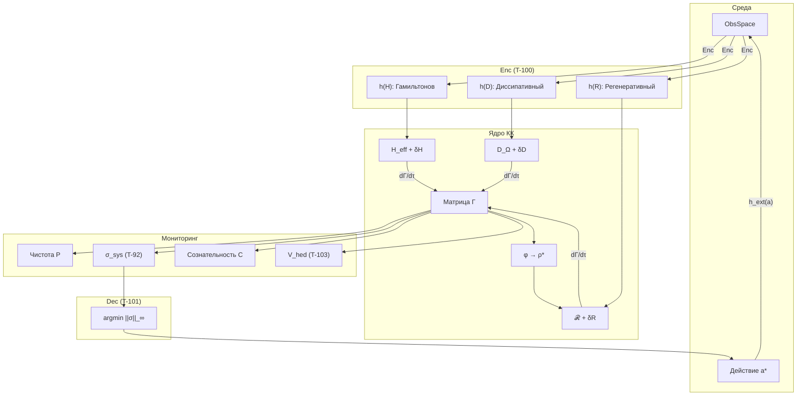

# Вычислительная Реализация

> *«Теория без практики мертва, практика без теории слепа.»*
> — Иммануил Кант

:::tip Мост из предыдущей главы
В [предыдущей главе](./applications) мы показали девять областей применения КК — от ИИ до экологии — и три подробных кейс-стади. В каждом из них фигурировали формулы: $P = \mathrm{Tr}(\Gamma^2)$, $\sigma_k = \mathrm{clamp}(1 - 7\gamma_{kk}, 0, 1)$, $\kappa = \kappa_{\text{bootstrap}} + \kappa_0 \cdot \mathrm{Coh}_E$. Но формула на бумаге и формула в компьютере — это два разных объекта. Бумажная формула оперирует идеальными числами; компьютер — числами с плавающей запятой, ограниченной точностью и конечной памятью. Эта глава — мост между ними.
:::

:::info Дорожная карта главы
В этой главе мы:
1. Запустим **минимальный пример** за 10 строк (§1)
2. Покажем **пятишаговый протокол** перевода формулы в код: идентифицировать → записать → защитить → протестировать → оптимизировать (§2)
3. Построим полную **архитектуру системы** — от `HolonState` до `control_loop` (§3–7)
4. Реализуем **каноническую декомпозицию** $F_{\text{ext}}$ через три канала (§8)
5. Разберём **типичные ошибки** и создадим чек-лист отладки (§9)
6. Обсудим **оптимизации**: GPU, sparse-матрицы, Monte-Carlo (§10)
:::

Физик записал уравнение эволюции $d\Gamma/d\tau$. Математик доказал теорему о критической чистоте. Философ осмыслил, почему $E$-когерентность связывает опыт и устойчивость. Теперь наступает момент истины: **можно ли это запустить?**

Вычислительная реализация Кибернетики Когерентности — это мост между формулами и работающей системой. Она выполняет роль, аналогичную лабораторному практикуму в физике: именно здесь абстрактные конструкции обретают плоть — в виде матриц, циклов и числовых результатов, которые можно проверить и воспроизвести.

Эта глава устроена как **лабораторное руководство**. Мы начнём с минимального примера в десять строк — чтобы читатель мог немедленно запустить что-то на своём компьютере и увидеть, как чистота $P$ меняется во времени. Затем мы постепенно раскроем полную архитектуру: структуру данных, алгоритм эволюции, мониторинг жизнеспособности, цикл управления. Каждый блок кода будет предварён объяснением — *что* он делает, *зачем* и *как* связан с теоретическими результатами предыдущих глав.

Путь от формулы к коду не тривиален. Матрица когерентности $\Gamma$ на бумаге — идеальный объект: бесконечная точность, непрерывное время, гарантированная положительная полуопределённость. В компьютере всё иначе: конечная арифметика порождает ошибки округления, дискретизация времени нарушает свойства CPTP-канала, а числовая нестабильность может превратить положительно полуопределённую матрицу в нефизическую за один шаг. Мы обсудим эти подводные камни и покажем, как с ними справляться.

:::note О нотации в коде
В Python-коде используются следующие соответствия:
- `gamma` ($\Gamma$) — [матрица когерентности](/docs/core/dynamics/coherence-matrix)
- `purity` ($P$) — [чистота](/docs/core/dynamics/viability#определение-чистоты): $P = \mathrm{Tr}(\Gamma^2)$
- `stress_tensor` ($\sigma_{\mathrm{sys}}$) — [тензор напряжений](./definitions#тензор-напряжений)
- `coh_E` ($\mathrm{Coh}_E$) — [E-когерентность](./definitions#e-когерентность)
- `kappa` ($\kappa$) — [скорость регенерации](./axiomatics#связь-регенерации-и-e-когерентности)
- `phi` ($\varphi$) — [оператор самомоделирования](/docs/proofs/categorical/formalization-phi)
- `differentiation` ($D_{\text{diff}}$) — [мера дифференциации](/docs/consciousness/foundations/self-observation#мера-сознательности-c)
- `reflection` ($R$) — [мера рефлексии](/docs/consciousness/foundations/self-observation#мера-рефлексии-r)
:::

:::warning Статус документа
Данная реализация — **демонстрационный псевдокод**. Для базового класса `Holon` см. [Вычислительная реализация](/docs/reference/computational). Для полной реализации с мерами сознательности см. [Иерархия интериорности](/docs/proofs/consciousness/interiority-hierarchy#61-алгоритм-классификации-уровня). Для алгоритмов L-унификации см. [Конструктивные алгоритмы](/docs/reference/computational#конструктивные-алгоритмы-из-l-унификации).
:::

## Быстрый старт

### Установка

Прежде чем погружаться в теорию, убедимся, что код запускается. Для работы с матрицами когерентности достаточно двух стандартных пакетов — NumPy для линейной алгебры и SciPy для матричной экспоненты.

```bash
# Гипотетический пакет (в разработке)
pip install coherence-cybernetics

# Зависимости для текущего псевдокода
pip install numpy scipy
```

### Минимальный пример (10 строк)

Этот пример — самый короткий путь от нуля до работающей КК-системы. Мы создаём случайную матрицу когерентности $\Gamma$, задаём гамильтониан и запускаем 100 шагов унитарной эволюции. На каждом шаге вычисляются чистота $P$ и $E$-когерентность $\mathrm{Coh}_E$ — две ключевые метрики, характеризующие жизнеспособность и когерентность интериорности системы.

Обратите внимание на инициализацию: $\Gamma = LL^\dagger / \mathrm{Tr}(LL^\dagger)$, где $L = I + 0.1 \cdot \text{шум}$. Это *параметризация Холецкого* — стандартный приём, гарантирующий, что $\Gamma$ положительно полуопределена и имеет единичный след. Без этой гарантии дальнейшие вычисления бессмысленны.

```verum
mount std.math.linalg.{StaticMatrix, expm, identity};
mount std.math.complex.Complex;
mount std.math.random.{XorShift128, Rng};

fn main() using [IO, Random] {
    let mut rng = XorShift128.seed(Random.next_key());

    // Cholesky parametrisation: Γ = L L† / Tr(L L†) — guarantees Γ ≥ 0 and Tr = 1.
    let noise: StaticMatrix<Complex, 7, 7> = StaticMatrix.random_gaussian(&mut rng);
    let l = identity::<Complex, 7>() + noise * Complex.from_real(0.1);
    let mut gamma = &l @ l.adjoint();
    gamma = &gamma / gamma.trace();

    // Diagonal Hamiltonian: natural frequencies of the 7 dimensions.
    let h = StaticMatrix.<Complex, 7, 7>.diagonal_from_reals(
        [1.0, 0.8, 1.2, 0.9, 1.1, 0.7, 1.0]
    );

    for step in 0..100 {
        // dt = 0.01 — small for numerical stability.
        let u = expm(Complex.i().neg() * &h * Complex.from_real(0.01));
        gamma = &u @ &gamma @ u.adjoint();
        gamma = &gamma / gamma.trace();

        let p = (gamma @ gamma).trace().real();
        let e = 4;                                     // Experience index
        let coh_e = (gamma[e, e].real().pow(2)
                   + 2.0 * (0..7).filter(|i| *i != e)
                                  .map(|i| gamma[e, *i].abs().pow(2))
                                  .sum()) / p;
        IO.println(f"Step {step}: P={p:.3f}, Coh_E={coh_e:.3f}");
    }
}
```

При запуске вы увидите, что чистота $P$ остаётся постоянной при чисто унитарной эволюции — это ожидаемо, поскольку $U\Gamma U^\dagger$ сохраняет спектр. А вот $\mathrm{Coh}_E$ будет осциллировать: гамильтониан «перемешивает» когерентность между измерениями, и проекция на $E$-подпространство колеблется.

### Проверка жизнеспособности

Простейшая проверка: жива система или нет. Порог $P_{\text{crit}} = 2/7$ — это не настраиваемый параметр, а **следствие теоремы** о различимости в 7-мерном пространстве. Если чистота падает ниже этого значения, матрица $\Gamma$ становится неотличимой от максимально смешанного состояния $I/7$ по норме Фробениуса — система буквально теряет свою идентичность.

```verum
/// Critical purity — not a tunable parameter but a theorem consequence (T-39a).
pub const P_CRIT: Float = 2.0 / 7.0;          // ≈ 0.286

pub pure fn is_viable(gamma: &StaticMatrix<Complex, 7, 7>) -> Bool {
    (gamma @ gamma).trace().real() > P_CRIT
}

// Usage.
if !is_viable(&gamma) {
    IO.println("⚠️ System is non-viable!");
}
```

---

## От формулы к коду {#от-формулы-к-коду}

Перевод математической теоремы в работающий код — один из самых тонких этапов реализации. Формула на бумаге оперирует идеальными объектами: точными вещественными числами, непрерывным временем, бесконечной точностью. Код работает с числами с плавающей запятой, дискретными шагами и конечной памятью. Этот раздел — пошаговое руководство по преодолению разрыва.

### Шаг 1: Идентифицировать математический объект

Любая теорема КК оперирует матрицей когерентности $\Gamma \in D(\mathbb{C}^7)$ — множеством положительно полуопределённых эрмитовых матриц $7 \times 7$ с единичным следом. В коде это `np.ndarray` формы `(7, 7)` с dtype `complex128`. Три инварианта — эрмитовость, положительная полуопределённость и единичный след — должны проверяться после каждой операции.

```verum
mount std.math.linalg.eigvalsh;

/// Validates the three fundamental invariants of Γ after every mutating operation.
/// In release builds `@cfg(debug_assertions)` causes the call to be compiled out.
@cfg(debug_assertions)
pub fn validate_gamma(gamma: &StaticMatrix<Complex, 7, 7>, label: Text)
    using [IO] -> Bool
{
    let prefix = if label.is_empty() { "".text() } else { f"[{label}] " };
    let mut ok = true;

    // Invariant 1: Hermiticity — Γ = Γ†.
    let diff_h = (gamma - gamma.adjoint()).max_abs_element();
    if diff_h > 1.0e-10 {
        IO.println(f"{prefix}Hermiticity VIOLATED: max|Γ - Γ†| = {diff_h:.2e}");
        ok = false;
    }

    // Invariant 2: Unit trace — Tr(Γ) = 1.
    let tr = gamma.trace().real();
    if (tr - 1.0).abs() > 1.0e-10 {
        IO.println(f"{prefix}Trace VIOLATED: Tr(Γ) = {tr:.12f}");
        ok = false;
    }

    // Invariant 3: Positive semidefiniteness — λ_min ≥ 0.
    let lam_min = eigvalsh(gamma).iter().min().unwrap();
    if lam_min < -1.0e-10 {
        IO.println(f"{prefix}Positivity VIOLATED: λ_min = {lam_min:.2e}");
        ok = false;
    }

    ok
}
```

### Шаг 2: Записать формулу буквально

Возьмём для примера $E$-когерентность (T-128 [Т]):

$$
\mathrm{Coh}_E(\Gamma) = \frac{\gamma_{EE}^2 + 2\sum_{i \neq E} |\gamma_{Ei}|^2}{\mathrm{Tr}(\Gamma^2)}
$$

Прямая запись на Python выглядит так:

```verum
/// Literal translation of the Coh_E formula (T-73 [T]).
///
/// Factor 2 comes from Hermitian symmetry: |γ_Ei|² = |γ_iE|²,
/// so the sum over row E and column E is doubled.
pub pure fn coh_e_literal(gamma: &StaticMatrix<Complex, 7, 7>)
    -> Float { 1.0/7.0 <= self && self <= 1.0 }
{
    const E: Int = 4;                      // A=0, S=1, D=2, L=3, E=4, O=5, U=6
    let numerator = gamma[E, E].real().pow(2)
                  + 2.0 * (0..7).filter(|i| *i != E)
                                 .map(|i| gamma[E, *i].abs().pow(2))
                                 .sum();
    let denom = (gamma @ gamma).trace().real();
    if denom > 1.0e-12 { numerator / denom } else { 1.0 / 7.0 }
}
```

### Шаг 3: Добавить числовую защиту

Формула предполагает $\mathrm{Tr}(\Gamma^2) > 0$, но в вычислениях знаменатель может оказаться исчезающе малым. Каждое деление нуждается в защите. Каждый `np.clip` — в обосновании диапазона. Теорема гарантирует $\mathrm{Coh}_E \in [1/7, 1]$, поэтому `np.clip` в конце — не костыль, а **кодирование математического ограничения**.

### Шаг 4: Написать тест на аналитический случай

Лучший тест — это случай, когда ответ известен аналитически:

```verum
mount std.test.{test, assert_close};

@test fn coh_e_pure_e_state() {
    // For the pure |E⟩ state, Coh_E = 1.
    let mut gamma = StaticMatrix.<Complex, 7, 7>.zeros();
    gamma[4, 4] = Complex.one();
    assert_close(coh_e_literal(&gamma), 1.0, 1.0e-10);
}

@test fn coh_e_maximally_mixed() {
    // For I/7, Coh_E = 1/7.
    let gamma = identity::<Complex, 7>() / Complex.from_real(7.0);
    assert_close(coh_e_literal(&gamma), 1.0 / 7.0, 1.0e-10);
}
```

### Шаг 5: Оптимизировать (только если нужно)

Генератор `sum(... for i in ...)` вычисляет за $O(N)$, но для $N = 7$ это не узкое место. Оптимизация через NumPy-векторизацию оправдана лишь при многократном вызове в горячем цикле:

```verum
/// SIMD-vectorised Coh_E for hot loops. Semantically identical to `coh_e_literal`.
pub pure fn coh_e_vectorized(gamma: &StaticMatrix<Complex, 7, 7>)
    -> Float { 1.0/7.0 <= self && self <= 1.0 }
{
    const E: Int = 4;
    let row_e   = gamma.row(E);                                // StaticVector<Complex, 7>
    let norm_sq = row_e.frobenius_norm_sq();                   // Σ |γ_Ei|²
    let diag_sq = gamma[E, E].abs().pow(2);
    let numer   = gamma[E, E].real().pow(2) + 2.0 * (norm_sq - diag_sq);
    let denom   = (gamma @ gamma).trace().real().max(1.0e-12);
    (numer / denom).clamp(1.0 / 7.0, 1.0)
}
```

Этот пятишаговый протокол — **идентифицировать, записать, защитить, протестировать, оптимизировать** — применим к любой формуле КК.

---

## Сложность алгоритмов

Прежде чем строить большую систему, полезно понимать, сколько вычислительных ресурсов потребует каждая операция. Поскольку $N = 7$ фиксировано аксиоматически, все матричные операции технически $O(1)$ — но коэффициенты важны при моделировании тысяч взаимодействующих голономов.

| Операция | Сложность | Примечание |
|----------|-----------|------------|
| Вычисление $P = \mathrm{Tr}(\Gamma^2)$ | $O(N^2)$ | $N = 7$ |
| Унитарная эволюция | $O(N^3)$ | Экспонента матрицы |
| Диссипация (Линдблад) | $O(m \cdot N^2)$ | $m$ операторов |
| $\Phi_{\text{eff}}$ | $O(n \cdot k)$ | Лапласиан графа |
| Вычисление $R$ | $O(N^3)$ | Требует $\varphi(\Gamma)$ |
| Полный шаг эволюции | $O(N^3 + m \cdot N^2)$ | — |

### Масштабируемость

| Размер системы | $N$ | Время шага | Память |
|----------------|-----|------------|--------|
| Минимальный Голоном | 7 | ~1 мс | ~1 KB |
| Композиция 2 Голономов | 49 | ~10 мс | ~20 KB |
| Композиция 10 Голономов | 7^10 ≈ 2.8×10^8 | Неприменимо | — |

:::warning Экспоненциальный рост
Полное тензорное произведение быстро становится неприменимым. Для больших систем используйте аппроксимации (MPS, mean-field).
:::

---

## Оптимизации

Для одного голонома $7 \times 7$ оптимизация не нужна — все операции укладываются в микросекунды. Но при моделировании ансамблей (популяций агентов, нейронных сетей голономов) производительность становится критичной. Три подхода ниже покрывают основные сценарии.

### GPU-ускорение через JAX

JAX позволяет автоматически компилировать Python-код в GPU-ядра через декоратор `@jit`. Для массовых симуляций (например, 10 000 голономов параллельно) это даёт ускорение в 100-1000 раз.

```verum
mount std.math.gpu.{GPUBackend, device};

/// GPU-executed evolution step. `@kernel(gpu)` dispatches the body to a device.
/// The same code path works on CPU if no GPU is available.
@kernel(gpu)
pub pure fn evolve_step_gpu(
    gamma: &StaticMatrix<Complex, 7, 7>,
    h:     &StaticMatrix<Complex, 7, 7>,
    dt:    Float,
) -> StaticMatrix<Complex, 7, 7>
{
    let u = expm(Complex.i().neg() * h * Complex.from_real(dt));
    let g = &u @ gamma @ u.adjoint();
    &g / g.trace()
}
```

### Sparse матрицы для больших систем

При композиции голономов тензорное произведение порождает разреженные матрицы. Вместо хранения полной $49 \times 49$ матрицы можно работать только с ненулевыми элементами.

```verum
mount std.math.linalg.sparse.{SparseMatrix, expm_multiply};

// For a sparse Hamiltonian: compute exp(-i H dt) |ψ⟩ without materialising expm(H).
let h_sparse: SparseMatrix<Complex, 7, 7> = h.to_sparse();
let gamma_evolved = expm_multiply(
    Complex.i().neg() * h_sparse * Complex.from_real(dt),
    gamma.flatten(),
);
```

### Параллелизация Monte-Carlo

Статистические свойства КК-систем (распределение $P$ в ансамбле, средняя $\mathrm{Coh}_E$) оцениваются через Monte-Carlo. Каждая траектория независима — идеальный случай для параллелизации.

```verum
mount std.async.{nursery, spawn};

pub async fn run_trajectory(seed: UInt64) -> TrajectoryResult using [Random] {
    let mut rng = XorShift128.seed(seed);
    let mut holon = initialize_holon(InitConfig { random: true, ..InitConfig.default() });
    let mut env = Environment.new(EnvConfig.default());
    for _ in 0..1000 {
        holon = evolve_holon(holon, 0.01, &env);
    }
    TrajectoryResult { purity: holon.purity, entropy: holon.entropy }
}

/// Structured concurrency via `nursery`: 100 trajectories, ≤ 8 in parallel.
pub async fn run_ensemble() -> List<TrajectoryResult> using [Random, Scheduler] {
    nursery(|n| async {
        let handles = (0..100).map(|i| n.spawn(run_trajectory(i as UInt64))).collect();
        for h in handles { h.await }
    }).await
}
```

---

## Примеры тестов

Тесты в КК играют роль **экспериментальной проверки**. Каждый тест кодирует математическую теорему: если тест проходит, реализация согласована с теорией. Если не проходит — либо в коде ошибка, либо (что интереснее) формула переведена неверно. Набор ниже покрывает фундаментальные инварианты: границы чистоты, сохранение следа, эрмитовость, положительность и пороговые значения.

```verum
mount std.test.{test, assert, assert_close, property};

/// Random valid Γ via Cholesky parametrisation (helper for tests).
fn _random_gamma() using [Random] -> StaticMatrix<Complex, 7, 7> {
    let mut rng = XorShift128.seed(Random.next_key());
    let noise: StaticMatrix<Complex, 7, 7> = StaticMatrix.random_gaussian(&mut rng);
    let l = identity::<Complex, 7>() + noise * Complex.from_real(0.1);
    let g = &l @ l.adjoint();
    &g / g.trace()
}

fn _evolve_one_step(gamma: StaticMatrix<Complex, 7, 7>, dt: Float)
    using [Random] -> StaticMatrix<Complex, 7, 7>
{
    let mut state = initialize_holon(InitConfig { random: false, ..InitConfig.default() });
    state.gamma = gamma;
    evolve_holon(state, dt, &Environment.new(EnvConfig.default())).gamma
}

@test fn purity_bounds() using [Random] {
    let gamma = _random_gamma();
    let p = (gamma @ gamma).trace().real();
    assert(1.0/7.0 - 1.0e-10 <= p && p <= 1.0 + 1.0e-10);
}

@test fn trace_preservation() using [Random] {
    let evolved = _evolve_one_step(_random_gamma(), 0.01);
    assert_close(evolved.trace().real(), 1.0, 1.0e-10);
}

@test fn hermiticity_preservation() using [Random] {
    let evolved = _evolve_one_step(_random_gamma(), 0.01);
    assert((&evolved - evolved.adjoint()).frobenius_norm() < 1.0e-10);
}

@test fn positivity_preservation() using [Random] {
    let evolved = _evolve_one_step(_random_gamma(), 0.01);
    let eigs = eigvalsh(&evolved);
    assert(eigs.iter().all(|v| *v >= -1.0e-10));
}

@test fn viability_threshold() {
    assert_close(P_CRITICAL, 2.0 / 7.0, 1.0e-10);
}

@test fn coh_e_bounds() using [Random] {
    let coh = compute_coherence_e(&_random_gamma());
    assert(1.0/7.0 - 1.0e-10 <= coh && coh <= 1.0 + 1.0e-10);
}

/// Property test: every evolution step preserves all three invariants of Γ.
@property fn evolution_preserves_invariants(seed: UInt64) using [Random] {
    let mut rng = XorShift128.seed(seed);
    let gamma = _random_gamma();
    let evolved = _evolve_one_step(gamma.clone(), 0.01);

    assert_close(evolved.trace().real(), 1.0, 1.0e-10);
    assert((&evolved - evolved.adjoint()).frobenius_norm() < 1.0e-10);
    assert(eigvalsh(&evolved).iter().all(|v| *v >= -1.0e-10));
}
```

---

## Архитектура системы

Диаграмма ниже показывает полный поток данных в КК-системе. Среда (ObsSpace) проходит через функтор восприятия Enc (T-100), который раскладывает наблюдение на три канала воздействия. Ядро КК эволюционирует матрицу $\Gamma$ по трёхчленному уравнению. Мониторинг вычисляет метрики жизнеспособности. Функтор действия Dec (T-101) выбирает оптимальное действие — то, которое минимизирует максимальное напряжение $\|\sigma_{\mathrm{sys}}\|_\infty$.



## Структура данных

Центральная структура данных — `HolonState` — является программным отражением математического объекта «голоном в состоянии $\Gamma$». Каждое поле соответствует определённой теоретической конструкции. Обратите внимание на то, что мы храним не только матрицу $\Gamma$, но и все производные метрики: это позволяет избежать повторных вычислений в горячем цикле.

```verum
mount std.math.linalg.{StaticMatrix, StaticVector, expm, identity};
mount std.math.complex.Complex;

/// State of a Holonom in Coherence Cybernetics.
/// See the Holonom definition: /docs/core/structure/holon.
pub type HolonState is {
    // State core (with refinement predicates enforced at use-sites).
    mut gamma:        StaticMatrix<Complex, 7, 7>,    // Γ: Hermitian, PSD, Tr=1
    mut hamiltonian:  StaticMatrix<Complex, 7, 7>,    // H: Hermitian
    mut lindblad_ops: [StaticMatrix<Complex, 7, 7>; 7],  // {L_k}
    phi:              pure fn(&StaticMatrix<Complex, 7, 7>)
                            -> StaticMatrix<Complex, 7, 7>,  // φ: CPTP self-model

    // Viability metrics.
    mut purity:       Float { 1.0/7.0 <= self && self <= 1.0 },   // P = Tr(Γ²)
    mut entropy:      Float { 0.0     <= self && self <= (7.0).ln() }, // S_vN

    // Consciousness measures (see /docs/consciousness/foundations/self-observation).
    mut integration:     Float { self >= 0.0  },   // Φ: integration measure
    mut differentiation: Float { self >= 1.0  },   // D_diff = 1 + Coh_E·6  (T-128 [T])
    mut reflection:      Float { 0.0 <= self && self <= 1.0 }, // R
    mut consciousness:   Float { self >= 0.0  },   // C = Φ·R  (T-140 [T])

    // Stress tensor (see definitions.md#тензор-напряжений).
    mut stress_tensor: StaticVector<Float, 7>,    // σ_sys

    // Viability.
    mut viable: Bool,                             // P > P_crit ∧ dP/dτ > -ε
    mut margin: Float { -1.0 <= self && self <= 1.0 },  // 1 - max(σ_sys)
};
```

## Вывод операторов Линдблада из Ω

Операторы Линдблада — это математический инструмент описания декогеренции. В КК они не задаются вручную, а **выводятся** из структуры субобъектного классификатора $\Omega$. Это принципиальный момент: декогеренция — не внешний параметр, а следствие внутренней логики системы.

:::info L-унификация в коде
Операторы Линдблада $L_k$ **вычисляются** из субобъектного классификатора $\Omega$, а не задаются вручную. См. [Конструктивные алгоритмы](/docs/reference/computational#конструктивные-алгоритмы-из-l-унификации).
:::

:::note Упрощённые операторы Линдблада
В данной реализации операторы Линдблада — **диагональные проекторы** $L_k = |k\rangle\langle k|$ (стандартная декогеренция в базисе измерений). Это **не** $G_2$-структурированные операторы из [Фано-канала](/docs/proofs/gap/fano-channel). Полная реализация с $G_2$-совместимыми операторами Линдблада (проекторы на Фано-триплеты) см. в [Конструктивных алгоритмах](/docs/reference/computational#конструктивные-алгоритмы-из-l-унификации).
:::

В упрощённой реализации каждый оператор Линдблада — проектор на одно из семи базисных состояний. Это соответствует декогеренции, которая «стирает» суперпозиции между измерениями, оставляя только диагональные элементы. Полная $G_2$-совместимая реализация использует проекторы на Фано-триплеты и сохраняет более тонкую структуру когерентности.

```verum
/// Computes Lindblad operators from the Ω structure.
///
/// **Simplification**: returns diagonal projectors L_k = |k⟩⟨k|.
/// The full G₂ implementation uses Fano lines (see /docs/proofs/gap/fano-channel).
///
/// Algorithm: L_k = √χ_{S_k}; for atom projectors √P = P.
/// See /docs/reference/computational#конструктивные-алгоритмы-из-l-унификации.
pub pure fn compute_lindblad_from_omega(gamma: &StaticMatrix<Complex, 7, 7>)
    -> [StaticMatrix<Complex, 7, 7>; 7]
{
    (0..7).map(|k| {
        let mut l_k = StaticMatrix.<Complex, 7, 7>.zeros();
        l_k[k, k] = Complex.one();       // projector onto |k⟩
        l_k
    }).to_array()
}
```

## Алгоритм эволюции

Реализация [уравнения эволюции](/docs/core/dynamics/evolution) с [эмерджентным внутренним временем](/docs/proofs/dynamics/emergent-time) τ:

$$
\frac{d\Gamma(\tau)}{d\tau} = -i[H_{eff}, \Gamma] + \mathcal{D}[\Gamma] + \mathcal{R}[\Gamma, E]
$$

Это сердце всей реализации — функция, которая продвигает состояние системы на один шаг. Три члена уравнения применяются последовательно: сначала унитарная эволюция (обратимая, сохраняющая спектр), затем диссипация (необратимая, разрушающая когерентность) и регенерация (восстанавливающая когерентность за счёт $E$-связи).

:::warning Расщепление Ли-Троттера и положительность
Эволюция реализована через **последовательное** применение унитарного, диссипативного и регенеративного членов (расщепление Ли-Троттера). При конечном шаге $dt$ это расщепление **не гарантирует** сохранение положительной полуопределённости $\Gamma \geq 0$. Для малых $dt$ ошибка порядка $O(dt^2)$. При больших шагах рекомендуется: (1) уменьшить $dt$, (2) добавить проекцию на конус $\Gamma \geq 0$ после каждого шага, или (3) использовать методы типа Рунге-Кутты для открытых квантовых систем.
:::

```verum
/// One evolution step according to the full CC equation.
///
/// `dt` — internal time τ step (see /docs/proofs/dynamics/emergent-time).
///
/// Three terms:
/// 1. Unitary     —i[H_eff, Γ]  (see /docs/core/dynamics/evolution#1-unitary-term)
/// 2. Dissipative  D[Γ]          (see /docs/core/dynamics/evolution#логический-лиувиллиан)
/// 3. Regenerative ℛ[Γ, E]        (see /docs/core/dynamics/evolution#3-регенеративный-член)
pub fn evolve_holon(mut state: HolonState, dt: Float { self > 0.0 && self <= 0.1 },
                    env: &Environment) -> HolonState
{
    let mut gamma = state.gamma.clone();

    // 1. Unitary evolution.
    let u = expm(Complex.i().neg() * &state.hamiltonian * Complex.from_real(dt));
    gamma = &u @ &gamma @ u.adjoint();

    // 2. Dissipation: Lindblad equation.
    for l_k in &state.lindblad_ops {
        let l_dag = l_k.adjoint();
        gamma = &gamma + Complex.from_real(dt) * (
              l_k   @ &gamma @ &l_dag
            - Complex.from_real(0.5) * (&l_dag @ l_k @ &gamma)
            - Complex.from_real(0.5) * (&gamma @ &l_dag @ l_k)
        );
    }

    // 3. Regeneration: κ = κ_bootstrap + κ₀·Coh_E (resolves the bootstrap paradox).
    let coh_e = compute_coherence_e(&gamma);
    let kappa = KAPPA_BOOTSTRAP + KAPPA_0 * coh_e;
    let delta_f = compute_free_energy_gradient(&gamma, env);

    if delta_f > 0.0 {
        let gamma_target = compute_target_state(&gamma, env);
        gamma = &gamma + Complex.from_real(dt * kappa) * (gamma_target - &gamma);
    }

    // Normalise: Tr(Γ) = 1.
    gamma = &gamma / gamma.trace();

    update_metrics(state, gamma)
}

/// E-coherence Coh_E(Γ) = (γ_EE² + 2·Σ_{i≠E}|γ_Ei|²) / Tr(Γ²) ∈ [1/7, 1] (T-73 [T]).
pub pure fn compute_coherence_e(gamma: &StaticMatrix<Complex, 7, 7>)
    -> Float { 1.0/7.0 <= self && self <= 1.0 }
{
    const E: Int = 4;
    let diag_sq = gamma[E, E].real().pow(2);
    let cross   = (0..7).filter(|i| *i != E)
                         .map(|i| gamma[E, *i].abs().pow(2))
                         .sum();
    let p = (gamma @ gamma).trace().real();
    if p < 1.0e-12 { 1.0 / 7.0 }
    else           { ((diag_sq + 2.0 * cross) / p).clamp(1.0 / 7.0, 1.0) }
}

/// Target state Γ_target = φ(Γ).
/// **Simplification**: maximum-eigenvalue projector, interpolated with current Γ.
/// Full φ — see /docs/proofs/categorical/formalization-phi.
pub pure fn compute_target_state(gamma: &StaticMatrix<Complex, 7, 7>, _env: &Environment)
    -> StaticMatrix<Complex, 7, 7>
{
    let (eigvals, eigvecs) = eigh(gamma);
    let max_idx = eigvals.argmax();
    let psi_target = eigvecs.column(max_idx);

    // α ∈ [0.01, 0.1] — attraction rate toward the target (hyperparameter).
    const ALPHA: Float = 0.1;
    let gamma_pure = psi_target.outer(psi_target.conjugate());
    Complex.from_real(1.0 - ALPHA) * gamma + Complex.from_real(ALPHA) * gamma_pure
}

/// Free energy gradient ΔF = F_env − F_sys. ΔF > 0 activates regeneration.
pub pure fn compute_free_energy_gradient(
    gamma: &StaticMatrix<Complex, 7, 7>,
    env:   &Environment,
) -> Float
{
    let p = (gamma @ gamma).trace().real();
    env.available_energy - (1.0 - p)
}

/// Update all derived metrics after a gamma change.
pub pure fn update_metrics(mut state: HolonState, gamma: StaticMatrix<Complex, 7, 7>)
    -> HolonState
{
    state.gamma = gamma;
    state.purity = (&state.gamma @ &state.gamma).trace().real();
    let eigs = eigvalsh(&state.gamma);
    state.entropy = eigs.iter()
        .filter(|v| **v > 1.0e-12)
        .map(|v| -v * v.ln())
        .sum();
    state
}
```

## Ловушки: типичные ошибки при реализации {#ловушки}

:::danger Ловушка 1: Забыть про эрмитовость
**Проблема:** Используете `gamma.T` вместо `gamma.conj().T`. Для вещественных матриц разницы нет, но $\Gamma$ — *комплексная* матрица. Ошибка проявляется не сразу: $\Gamma$ медленно теряет эрмитовость, и через 1000 шагов собственные значения становятся комплексными — все метрики превращаются в NaN.

**Решение:** Используйте `gamma.conj().T` (или `.T.conj()`) везде. Добавьте `assert np.allclose(gamma, gamma.conj().T)` в горячий цикл (в debug-режиме).
:::

:::danger Ловушка 2: Большой шаг dt
**Проблема:** $dt = 0.1$ кажется «нормальным». Но расщепление Ли-Троттера вносит ошибку $O(dt^2)$ *на каждом шаге*. За 1000 шагов ошибка порядка $1000 \cdot dt^2 = 10$. Матрица перестаёт быть положительно полуопределённой, $P > 1$ (невозможно для легитимной $\Gamma$).

**Решение:** $dt \leq 0.01$ для демонстраций, $dt \leq 0.001$ для количественных результатов. Или используйте Рунге-Кутту для открытых квантовых систем.
:::

:::danger Ловушка 3: Деление на ноль в Coh_E
**Проблема:** Формула $\mathrm{Coh}_E = (\gamma_{EE}^2 + 2\sum|\gamma_{Ei}|^2)/\mathrm{Tr}(\Gamma^2)$. Если $\Gamma \to 0$ (что невозможно для нормированной матрицы, но возможно из-за ошибок округления), знаменатель $\mathrm{Tr}(\Gamma^2) \to 0$.

**Решение:** Всегда проверяйте знаменатель: `max(denominator, 1e-12)`. Теорема гарантирует $\mathrm{Coh}_E \in [1/7, 1]$, поэтому `np.clip(..., 1/7, 1.0)` — не костыль, а кодирование математического ограничения.
:::

:::danger Ловушка 4: F_ext как четвёртый член
**Проблема:** Добавить `gamma += dt * F_ext` — «очевидный» способ моделировать влияние среды. Но по T-102 [Т], четвёртый тип CPTP-генератора не существует (LGKS, T-57 [Т]). Добавление 4-го члена нарушает CPTP-свойство эволюции — $\Gamma$ может перестать быть матрицей плотности.

**Решение:** Среда входит *только* через модификацию трёх существующих каналов: $\delta H$, $\delta D$, $\delta R$. См. `decompose_f_ext()` ниже.
:::

:::danger Ловушка 5: Регенерация без bootstrap
**Проблема:** $\kappa = \kappa_0 \cdot \mathrm{Coh}_E$ — формула из ранних версий теории. При $\mathrm{Coh}_E = 0$ (начальное состояние) $\kappa = 0$ — регенерации нет, $\mathrm{Coh}_E$ не может вырасти, $\kappa$ навсегда ноль. Курица и яйцо.

**Решение:** Полная формула: $\kappa = \kappa_{\text{bootstrap}} + \kappa_0 \cdot \mathrm{Coh}_E$ (T-59 [Т]). Слагаемое $\kappa_{\text{bootstrap}} = 1/7$ обеспечивает минимальную регенерацию даже при $\mathrm{Coh}_E = 0$.
:::

---

## Каноническая декомпозиция F_ext {#каноническая-декомпозиция-f-ext}

Как среда взаимодействует с голономом? Наивный подход — добавить четвёртый член $F_{\text{ext}}$ к уравнению эволюции. Но теорема T-102 [Т] запрещает это: по теореме LGKS (T-57 [Т]) существует ровно три типа CPTP-генераторов. Поэтому любое внешнее воздействие **раскладывается** на модификации трёх существующих каналов: $\delta H$, $\delta D$, $\delta R$.

:::warning Критическое исправление (T-102 [Т])
По [T-102 (полнота 3-членного уравнения)](./sensorimotor#теорема-полнота-трёх-членов) [Т], `F_ext` — **не 4-й член** уравнения эволюции, а модификация трёх существующих каналов. Четвёртый тип CPTP-генератора не существует (LGKS, T-57 [Т]).
:::

### Алгоритм декомпозиции

Каждый сенсорный сигнал классифицируется по характеру воздействия: информационные сигналы (A, S, L) модифицируют энергетический ландшафт через $\delta H$; нагрузочные сигналы (D, O) усиливают или ослабляют декогеренцию через $\delta D$; интегративные сигналы (E, U) модулируют регенерацию через $\delta R$. Эта классификация не произвольна — она следует из структуры семи измерений.

```verum
/// Environmental observation — three optional channels of influence.
pub type Observation is {
    sensory_input:       Maybe<Map<Text, Float>>,    // → δH (informational)
    noise_level:         Maybe<Map<Text, Float>>,    // → δD (load)
    integration_signal:  Maybe<Map<Text, Float>>,    // → δR (integrative)
};

/// Decomposes the external influence into 3 channels (T-102 [T]).
///
/// Instead of `dΓ = H + D + R + F_ext` (incorrect), we use
/// `dΓ = (H + δH) + (D + δD) + (R + δR)` (correct).
///
/// See /docs/applied/coherence-cybernetics/sensorimotor#среда-через-3-канала.
pub pure fn decompose_f_ext(obs: &Observation, _gamma: &StaticMatrix<Complex, 7, 7>)
    -> (StaticMatrix<Complex, 7, 7>,                     // δH
        StaticMatrix<Complex, 7, 7>,                     // δD
        StaticMatrix<Complex, 7, 7>)                     // δR
{
    let mut d_h = StaticMatrix.<Complex, 7, 7>.zeros();  // Hamiltonian channel
    let mut d_d = StaticMatrix.<Complex, 7, 7>.zeros();  // Dissipative channel
    let mut d_r = StaticMatrix.<Complex, 7, 7>.zeros();  // Regenerative channel

    // Informational dimensions: A=0, S=1, L=3 → δH.
    if let Maybe.Some(s) = &obs.sensory_input {
        for (key, idx) in [("I_A", 0), ("I_S", 1), ("I_L", 3)] {
            d_h[idx, idx] = Complex.from_real(s.get(key).unwrap_or(0.0));
        }
    }

    // Load dimensions: D=2, O=5 → δD.
    if let Maybe.Some(n) = &obs.noise_level {
        for (key, idx) in [("I_D", 2), ("I_O", 5)] {
            d_d[idx, idx] = Complex.from_real(n.get(key).unwrap_or(0.0));
        }
    }

    // Integrative dimensions: E=4, U=6 → δR.
    if let Maybe.Some(r) = &obs.integration_signal {
        for (key, idx) in [("I_E", 4), ("I_U", 6)] {
            d_r[idx, idx] = Complex.from_real(r.get(key).unwrap_or(0.0));
        }
    }

    (d_h, d_d, d_r)
}
```

### Обновлённый evolve_holon (без F_ext)

Каноническая версия эволюции принимает на вход три модификации каналов вместо абстрактного «внешнего воздействия». Это не просто стилистическое различие — это **правильная физика**: любое взаимодействие с внешним миром осуществляется через один из трёх существующих механизмов, а не через мифический четвёртый канал.

```verum
/// Canonical evolution: three modified channels (T-102 [T]).
///
/// `F_ext` is NOT a separate term — the environment enters via δH, δD, δR.
pub fn evolve_holon_canonical(
    mut state:    HolonState,
    dt:           Float { self > 0.0 && self <= 0.1 },
    delta_h:      Maybe<StaticMatrix<Complex, 7, 7>>,
    delta_d:      Maybe<StaticMatrix<Complex, 7, 7>>,
    delta_r:      Maybe<StaticMatrix<Complex, 7, 7>>,
) -> HolonState
{
    let zero_m = StaticMatrix.<Complex, 7, 7>.zeros();
    let h_total = &state.hamiltonian + delta_h.unwrap_or(zero_m.clone());

    // 1. Modified unitary evolution.
    let u = expm(Complex.i().neg() * &h_total * Complex.from_real(dt));
    let mut gamma = &u @ &state.gamma @ u.adjoint();

    // 2. Modified dissipation.
    let gamma2_factor = 1.0 + delta_d.as_ref()
        .map_or(0.0, |m| m.diagonal().iter().map(|c| c.abs()).max().unwrap_or(0.0));
    for l_k in &state.lindblad_ops {
        let l_dag = l_k.adjoint();
        gamma = &gamma + Complex.from_real(dt * gamma2_factor) * (
              l_k   @ &gamma @ &l_dag
            - Complex.from_real(0.5) * (&l_dag @ l_k @ &gamma)
            - Complex.from_real(0.5) * (&gamma @ &l_dag @ l_k)
        );
    }

    // 3. Modified regeneration.
    let coh_e = compute_coherence_e(&gamma);
    let mut kappa = KAPPA_BOOTSTRAP + compute_kappa_0(&gamma, 1.0) * coh_e;
    kappa += delta_r.as_ref()
        .map_or(0.0, |m| m.diagonal().iter().map(|c| c.abs()).max().unwrap_or(0.0));

    let env_default = Environment.new(EnvConfig.default());
    if compute_free_energy_gradient(&gamma, &env_default) > 0.0 {
        let target = compute_target_state(&gamma, &env_default);
        gamma = &gamma + Complex.from_real(dt * kappa) * (target - &gamma);
    }

    gamma = &gamma / gamma.trace();
    update_metrics(state, gamma)
}
```

### Bootstrap-разрешение chicken-egg проблемы {#bootstrap-разрешение}

Проблема: $R$ зависит от $\varphi(\Gamma)$, но $\varphi$ требует $R$ для определения целевого состояния.

**Разрешение** ([T-59](/docs/core/foundations/axiom-omega#теорема-kappa-bootstrap-bound) [Т]):

1. $\kappa_{\mathrm{bootstrap}} = \omega_0/N = 1/7$ — минимальная регенерация **без** знания $\rho^*$ (T-59 [Т])
2. При инициализации: $\rho^{(0)}_* = I/7$ (тривиальная самомодель)
3. Итерация: $\rho^{(n+1)}_* = \varphi(\Gamma^{(n)})$ — экспоненциальная сходимость ([T-72](./theorems#теорема-72-условная-неподвижная-точка-рефлексии) [Т])

Этот протокол — аналог **boot-последовательности** операционной системы: минимальный загрузчик (BIOS) запускает ядро, ядро запускает драйверы, драйверы активируют полный функционал. Аналогично, $\kappa_{\text{bootstrap}}$ запускает минимальную регенерацию, которая постепенно «раскручивает» полный цикл самомоделирования.

```verum
// Bootstrap protocol (T-59 [T]): iterate until φ(Γ) stabilises.
let mut rho_star = identity::<Complex, 7>() / Complex.from_real(7.0);   // I/7: trivial self-model

for _ in 0..MAX_BOOTSTRAP_ITERATIONS {
    state = evolve_holon_canonical(state, DT, Maybe.None, Maybe.None, Maybe.None);
    let rho_star_new = compute_phi(&state.gamma);                       // φ(Γ)
    if (&rho_star_new - &rho_star).frobenius_norm() < EPSILON { break; }
    rho_star = rho_star_new;
}
```

---

## Мониторинг жизнеспособности

Мониторинг — это «приборная панель» КК-системы. Тензор напряжений $\sigma_{\mathrm{sys}} \in \mathbb{R}^7$ показывает, насколько каждое из семи измерений отклонено от нормы. Если хотя бы одна компонента достигает единицы, система теряет жизнеспособность. Это прямой аналог мониторинга жизненных показателей в медицине: не нужно, чтобы *все* показатели были плохими — достаточно одного критического.

Каноническая формула для $D$-компоненты (T-92/T-158 [Т]) — `clamp(1 - N * gamma_DD, 0, 1)` — особенно элегантна: напряжение по динамике определяется одним диагональным элементом матрицы когерентности. Остальные компоненты имеют более сложную структуру, включающую внешние оценки (ошибка предсказания среды, вычислительная нагрузка и т.д.).

```verum
/// Full stress tensor σ_sys ∈ ℝ⁷ over all 7 dimensions.
pub pure fn compute_stress_tensor(
    gamma: &StaticMatrix<Complex, 7, 7>,
    env:   &Environment,
) -> StaticVector<Float, 7>
{
    const N: Int = 7;
    StaticVector.<Float, 7>.from_array([
        // σ_A: Articulation.
        compute_env_prediction_error(gamma, env) / THETA_A,
        // σ_S: Structure.
        compute_structural_complexity(gamma) / THETA_S,
        // σ_D: Dynamics — canonical formula T-92/T-158: clamp(1 − N·γ_DD, 0, 1).
        (1.0 - (N as Float) * gamma[2, 2].real()).clamp(0.0, 1.0),
        // σ_L: Logic.
        compute_viability_uncertainty(gamma) / THETA_L,
        // σ_E: Interiority.
        (compute_self_model_error(gamma) + compute_exp_fragmentation(gamma)) / THETA_E,
        // σ_O: Grounding.
        (compute_memory_load() + compute_grounding_deficit(gamma)) / THETA_O,
        // σ_U: Unity.
        (compute_consciousness_deficit(gamma) + compute_nash_distance(gamma)) / THETA_U,
    ])
}

/// Viability check: margin = 1 − ‖σ‖_∞. `viable` iff `margin > 0`.
pub pure fn check_viability(sigma: &StaticVector<Float, 7>) -> (Bool, Float) {
    let max_stress = sigma.iter().max().unwrap_or(&0.0);
    let margin = 1.0 - max_stress;
    (margin > 0.0, margin)
}

// =============================================================================
// Helper functions for the stress tensor
// =============================================================================
// Some helpers are stubs (STUB) — in a full implementation they must compute
// real metrics from the system state. Stub values are in [0, 1].

/// Environment prediction error (A-dimension).
pub pure fn compute_env_prediction_error(
    _gamma: &StaticMatrix<Complex, 7, 7>,
    env:    &Environment,
) -> Float { self >= 0.0 && self <= 1.0 }
{
    env.prediction_error
}

/// Structural complexity (S-dimension): rank(Γ)/N ∈ [1/7, 1].
pub pure fn compute_structural_complexity(gamma: &StaticMatrix<Complex, 7, 7>)
    -> Float { 1.0/7.0 <= self && self <= 1.0 }
{
    (matrix_rank(gamma) as Float) / 7.0
}

/// Computational load (D-dimension) — STUB. Returns 0.3 (moderate load).
pub pure fn compute_computational_load()
    -> Float { self >= 0.0 && self <= 1.0 }
{
    0.3
}

/// Viability uncertainty (L-dimension): 0 if P > P_crit + 0.1, grows as P → P_crit.
pub pure fn compute_viability_uncertainty(gamma: &StaticMatrix<Complex, 7, 7>)
    -> Float { self >= 0.0 }
{
    let p = (gamma @ gamma).trace().real();
    (P_CRITICAL + 0.1 - p).max(0.0)       // 0.1 = early-warning buffer
}

/// Self-model error (E-dimension): ε = ‖off_diag(Γ)‖_F / ‖Γ‖_F ∈ [0, 1].
pub pure fn compute_self_model_error(gamma: &StaticMatrix<Complex, 7, 7>)
    -> Float { self >= 0.0 && self <= 1.0 }
{
    let norm = gamma.frobenius_norm();
    if norm < 1.0e-12 { return 1.0; }
    let off_diag = gamma - StaticMatrix.<Complex, 7, 7>.diagonal(gamma.diagonal());
    off_diag.frobenius_norm() / norm
}

/// Experience fragmentation (E-dimension): 1 − γ_EE ∈ [0, 1].
pub pure fn compute_exp_fragmentation(gamma: &StaticMatrix<Complex, 7, 7>)
    -> Float { self >= 0.0 && self <= 1.0 }
{
    1.0 - gamma[4, 4].real()
}

/// Memory load (O-dimension) — STUB. Returns 0.3.
pub pure fn compute_memory_load() -> Float { self >= 0.0 && self <= 1.0 } { 0.3 }

/// Grounding deficit (O-dimension): 1 − γ_OO.
pub pure fn compute_grounding_deficit(gamma: &StaticMatrix<Complex, 7, 7>)
    -> Float { self >= 0.0 && self <= 1.0 }
{
    1.0 - gamma[5, 5].real()
}

/// Consciousness deficit (U-dimension) — STUB: requires full Φ · R (T-140).
pub pure fn compute_consciousness_deficit(_gamma: &StaticMatrix<Complex, 7, 7>)
    -> Float { self >= 0.0 && self <= 1.0 }
{
    0.2
}

/// Nash-equilibrium distance (U-dimension) — STUB. Relevant in multi-agent contexts.
pub pure fn compute_nash_distance(_gamma: &StaticMatrix<Complex, 7, 7>)
    -> Float { self >= 0.0 && self <= 1.0 }
{
    0.1
}
```

## Цикл управления

Реализация управления на основе [условия жизнеспособности](/docs/core/dynamics/viability):

$$
\mathrm{Viable}(\Gamma) \Leftrightarrow \|\sigma_{\mathrm{sys}}(\Gamma)\|_\infty < 1
$$

Цикл управления — это внешняя оболочка, которая на каждом шаге: (1) эволюционирует состояние, (2) вычисляет тензор напряжений, (3) определяет зону управления, (4) выбирает и применяет действие. Четыре зоны — от безопасной до критической — образуют **эшелонированную защиту**, аналогичную уровням тревоги в авиации.

```verum
/// A zone-based action tag returned from the control loop.
pub type Action is
    | Continue   { reason: Text }
    | ReduceLoad { reason: Text }
    | Regenerate { reason: Text }
    | Emergency  { reason: Text };

/// Main control loop for a CC system.
///
/// Zones (by margin = 1 − max(σ)):
/// - margin > 0.3   — safe
/// - margin > 0.1   — caution
/// - margin > 0.05  — warning
/// - margin ≤ 0.05  — critical
pub fn control_loop(mut holon: HolonState, env: &Environment, max_steps: Int)
    using [IO]
{
    for step in 0..max_steps {
        // 1. State evolution.
        holon = evolve_holon(holon, 0.01, env);

        // 2. Monitoring (see definitions.md#эквивалентность-условий).
        let sigma = compute_stress_tensor(&holon.gamma, env);
        let (viable, margin) = check_viability(&sigma);

        // 3. Zone-based control — pattern match on margin.
        let action = match margin {
            m if m > MARGIN_SAFE    => normal_operation(&holon),
            m if m > MARGIN_CAUTION => reduce_risk(&holon, &sigma),
            m if m > MARGIN_WARNING => activate_recovery(&holon, &sigma),
            _                       => emergency_mode(&holon, &sigma),
        };

        // 4. Action application.
        holon = apply_action(holon, action, env);

        // 5. Logging.
        log_state(step, &holon, &sigma, margin);

        if !viable {
            IO.println(f"WARNING: Viability lost at step {step}");
            break;
        }
    }
}

pub pure fn normal_operation(_holon: &HolonState) -> Action {
    Action.Continue { reason: "Continue normal operation".text() }
}

pub pure fn reduce_risk(_holon: &HolonState, _sigma: &StaticVector<Float, 7>) -> Action {
    Action.ReduceLoad { reason: "Reduce system load".text() }
}

pub pure fn activate_recovery(_holon: &HolonState, _sigma: &StaticVector<Float, 7>) -> Action {
    Action.Regenerate { reason: "Activate enhanced regeneration".text() }
}

pub pure fn emergency_mode(_holon: &HolonState, _sigma: &StaticVector<Float, 7>) -> Action {
    Action.Emergency { reason: "Switch to protective mode".text() }
}

pub fn apply_action(holon: HolonState, _a: Action, _env: &Environment) -> HolonState {
    // Simplified: actions are logged; full implementation feeds back into the next evolve.
    holon
}

pub fn log_state(_step: Int, _holon: &HolonState, _sigma: &StaticVector<Float, 7>, _margin: Float)
    using [Logger]
{
    // Structured log entry (Logger context provides the concrete sink).
}

pub pure fn frobenius_distance<const R: Int, const C: Int>(
    a: &StaticMatrix<Complex, R, C>,
    b: &StaticMatrix<Complex, R, C>,
) -> Float { self >= 0.0 }
{
    (a - b).frobenius_norm()
}

/// Enc: ObsSpace → End(D(ℂ⁷)) — perception functor (T-100 [T]).
/// A fourth channel is impossible (T-57, LGKS [T]).
pub pure fn encode_environment(obs: &Observation, _gamma: &StaticMatrix<Complex, 7, 7>)
    -> (StaticMatrix<Complex, 7, 7>,    // h(H): Hamiltonian channel
        StaticMatrix<Complex, 7, 7>,    // h(D): Dissipative channel
        StaticMatrix<Complex, 7, 7>)    // h(R): Regenerative channel
{
    let mut h_h = StaticMatrix.<Complex, 7, 7>.zeros();
    let mut h_d = StaticMatrix.<Complex, 7, 7>.zeros();
    let mut h_r = StaticMatrix.<Complex, 7, 7>.zeros();

    // Informational dimensions → h(H): A=0, S=1, L=3.
    if let Maybe.Some(s) = &obs.sensory_input {
        h_h[0, 0] = Complex.from_real(s.get("I_A").unwrap_or(0.0));
        h_h[1, 1] = Complex.from_real(s.get("I_S").unwrap_or(0.0));
        h_h[3, 3] = Complex.from_real(s.get("I_L").unwrap_or(0.0));
    }
    // Load dimensions → h(D): D=2, O=5.
    if let Maybe.Some(n) = &obs.noise_level {
        h_d[2, 2] = Complex.from_real(n.get("I_D").unwrap_or(0.0));
        h_d[5, 5] = Complex.from_real(n.get("I_O").unwrap_or(0.0));
    }
    // Integrative dimensions → h(R): E=4, U=6.
    if let Maybe.Some(r) = &obs.integration_signal {
        h_r[4, 4] = Complex.from_real(r.get("I_E").unwrap_or(0.0));
        h_r[6, 6] = Complex.from_real(r.get("I_U").unwrap_or(0.0));
    }

    (h_h, h_d, h_r)
}

/// Update Γ based on an observation via Enc (T-100 [T]).
/// The environment modifies 3 channels — not a 4th (T-102 [T]).
pub fn update_from_observation(mut holon: HolonState, obs: &Observation) -> HolonState {
    let (h_h, h_d, h_r) = encode_environment(obs, &holon.gamma);
    holon.hamiltonian = &holon.hamiltonian + h_h;
    // δD, δR applied at next evolve_holon_canonical call.
    holon._h_d_pending = Maybe.Some(h_d);
    holon._h_r_pending = Maybe.Some(h_r);
    holon
}

/// Environment: energy availability and prediction error as top-level observables.
pub type Environment is {
    available_energy: Float { 0.0 <= self && self <= 1.0 },
    prediction_error: Float { 0.0 <= self && self <= 1.0 },
};

pub type EnvConfig is {
    energy:           Float,
    prediction_error: Float,
};

implement Default for EnvConfig {
    fn default() -> Self {
        EnvConfig { energy: 0.5, prediction_error: 0.3 }   // neutral defaults
    }
}

implement Environment {
    pub fn new(c: EnvConfig) -> Environment {
        Environment {
            available_energy: c.energy.clamp(0.0, 1.0),
            prediction_error: c.prediction_error.clamp(0.0, 1.0),
        }
    }
}
```

## Пороговые значения

Пороговые значения КК — не произвольные гиперпараметры, а **следствия теорем**. $P_{\text{crit}} = 2/7$ выводится из нормы Фробениуса в 7-мерном пространстве. $\kappa_{\text{bootstrap}} = 1/7$ следует из структуры аксиомы $\Omega^7$. Калибровочная таблица $\omega_0$ связывает абстрактное внутреннее время с физическими частотами конкретных систем — от квантовых ($10^{15}$ Гц) до социальных ($10^{-7}$ Гц).

:::info Выведенные константы
Ключевые пороговые значения **выведены** из структуры теории. См. [Аксиома Септичности](/docs/core/foundations/axiom-septicity).
:::

```verum
/// Critical purity P_crit = 2/N = 2/7 — theorem, derived by 5 methods from UHM axioms.
/// See /docs/proofs/dynamics/theorem-purity-critical.
pub const P_CRITICAL: Float = 2.0 / 7.0;              // ≈ 0.286

/// κ_bootstrap = ω₀/N — minimal regeneration (T-kappa_bootstrap [T]).
/// See /docs/core/foundations/axiom-septicity#теорема-kappa-bootstrap.
pub const KAPPA_BOOTSTRAP: Float = 1.0 / 7.0;          // ≈ 0.143 for ω₀ = 1
pub const KAPPA_0:         Float = 0.1;                // default scaling

/// κ₀ from Γ-structure: κ₀ ≈ ω₀ · |γ_OE| · |γ_OU| / γ_OO.
/// See /docs/core/foundations/axiom-septicity#структурный-анзац-kappa0.
pub pure fn compute_kappa_0(gamma: &StaticMatrix<Complex, 7, 7>, omega_0: Float)
    -> Float { self >= 0.0 }
{
    let g_oe = gamma[5, 4].abs();            // O = 5, E = 4
    let g_ou = gamma[5, 6].abs();            // O = 5, U = 6
    let g_oo = gamma[5, 5].real();
    if g_oo > 0.0 { omega_0 * g_oe * g_ou / g_oo } else { 0.0 }
}

/// ω₀ calibration lookup — canonical frequencies by system class.
/// See /docs/core/foundations/axiom-omega#калибровка.
pub type SystemType is QuantumSystem | Neuron | Cell | Organism | SocialSystem;

pub pure fn omega_0_base(s: SystemType) -> Float { self > 0.0 } {
    match s {
        SystemType.QuantumSystem => 1.0e15,    // ~ 10¹⁵ Hz (electronic)
        SystemType.Neuron        => 1.0e3,     // ~ 1 kHz (spike frequency)
        SystemType.Cell          => 1.0,       // ~ 1 Hz (metabolism)
        SystemType.Organism      => 1.0e-5,    // ~ 10⁻⁵ Hz (circadian)
        SystemType.SocialSystem  => 1.0e-7,    // ~ 10⁻⁷ Hz (group dynamics)
    }
}

/// Calibrate ω₀ with a √γ_OO structural correction.
pub pure fn calibrate_omega_0(s: SystemType, gamma: &StaticMatrix<Complex, 7, 7>)
    -> Float { self > 0.0 }
{
    let base = omega_0_base(s);
    let g_oo = gamma[5, 5].real();
    if g_oo > 0.0 { base * g_oo.sqrt() } else { base }
}

// Thresholds for σ_sys components (definitions.md#тензор-напряжений).
// Principled choice is θ_k = 1 (U(7) symmetry); values below are operational
// hyperparameters. Calibrate empirically or keep at 1.0 otherwise.
pub const THETA_A: Float = 3.5;              // Articulation
pub const THETA_S: Float = 2.0;              // Structure
pub const THETA_D: Float = 1.0;              // Dynamics (via C_MAX)
pub const THETA_L: Float = 1.0;              // Logic
pub const THETA_E: Float = 2.5;              // Interiority
pub const THETA_O: Float = 1.0;              // Grounding
pub const THETA_U: Float = 1.5;              // Unity

/// Platform-dependent computational limits.
pub const C_MAX: Float = 1000.0;             // ops/s
pub const M_MAX: Float = 1.0e9;              // bytes

/// Control-zone thresholds (margin = 1 − max(σ)).
pub const MARGIN_SAFE:    Float = 0.3;       // safe: max(σ) < 0.7
pub const MARGIN_CAUTION: Float = 0.1;       // caution: max(σ) < 0.9
pub const MARGIN_WARNING: Float = 0.05;      // warning: max(σ) < 0.95

pub type InitConfig is {
    random:      Bool,
    hamiltonian: Maybe<StaticMatrix<Complex, 7, 7>>,
};

implement Default for InitConfig {
    fn default() -> Self { InitConfig { random: false, hamiltonian: Maybe.None } }
}

/// Initialise a Holonom from a configuration via Cholesky parametrisation.
pub fn initialize_holon(c: InitConfig) using [Random] -> HolonState {
    let mut rng = XorShift128.seed(Random.next_key());
    let noise: StaticMatrix<Complex, 7, 7> = if c.random {
        StaticMatrix.random_gaussian(&mut rng) * Complex.from_real(0.1)
    } else {
        StaticMatrix.<Complex, 7, 7>.zeros()
    };
    let l = identity::<Complex, 7>() + noise;
    let mut gamma = &l @ l.adjoint();
    gamma = &gamma / gamma.trace();

    let h_default = StaticMatrix.<Complex, 7, 7>.diagonal_from_reals(
        [1.0, 0.8, 1.2, 0.9, 1.1, 0.7, 1.0]
    );
    let hamiltonian = c.hamiltonian.unwrap_or(h_default);

    HolonState {
        gamma:           gamma.clone(),
        hamiltonian:     hamiltonian,
        lindblad_ops:    compute_lindblad_from_omega(&gamma),
        phi:             |g| StaticMatrix.<Complex, 7, 7>.diagonal(g.diagonal()),
        purity:          (&gamma @ &gamma).trace().real(),
        entropy:         0.0,
        integration:     0.0,
        differentiation: 1.0,
        reflection:      0.0,
        consciousness:   0.0,
        stress_tensor:   StaticVector.<Float, 7>.zeros(),
        viable:          true,
        margin:          0.5,
    }
}

/// Dec: (Γ, σ_sys) → a* — action functor (T-101 [T]).
/// Optimal action: a* = argmin ‖σ_sys(Γ(τ+δτ | a))‖_∞.
/// Practical implementation: act on the most stressed component via its channel.
pub pure fn select_action(_holon: &HolonState, sigma: &StaticVector<Float, 7>)
    -> (Text, Text)
{
    let idx = sigma.argmax();
    match idx {
        0 => ("reduce_articulation", "h(D): Reduce input flow"),
        1 => ("simplify_structure",  "h(H): Restructure"),
        2 => ("slow_dynamics",       "h(D): Reduce computational load"),
        3 => ("relax_constraints",   "h(H): Cognitive correction"),
        4 => ("focus_experience",    "h(R): Strengthen reflection"),
        5 => ("reconnect_ground",    "h(R) + ΔF: Restore resources"),
        6 => ("integrate",           "h(R): Strengthen integration"),
        _ => ("wait",                "Wait"),
    }
}
```

## Интеграция с внешними системами

Класс `CoherenceCyberneticsAgent` — фасад, объединяющий все компоненты в единый цикл **восприятие — рефлексия — действие**. Это минимальный интерфейс, достаточный для подключения КК к любой внешней среде: робототехнической платформе, симуляции, диалоговой системе. Три метода (`perceive`, `reflect`, `act`) соответствуют трём фазам когнитивного цикла, а метод `is_viable` выполняет роль «детектора жизнеспособности», который может запускать аварийные протоколы.

```verum
/// Agent based on Coherence Cybernetics.
/// Implements the cycle: perception → reflection → action.
pub type CoherenceCyberneticsAgent is {
    mut holon:       HolonState,
    mut environment: Environment,
};

pub type AgentConfig is { init: InitConfig, env: EnvConfig };

implement CoherenceCyberneticsAgent {
    pub fn new(c: AgentConfig) using [Random] -> CoherenceCyberneticsAgent {
        CoherenceCyberneticsAgent {
            holon:       initialize_holon(c.init),
            environment: Environment.new(c.env),
        }
    }

    /// Update Γ based on an observation (A-dimension).
    pub fn perceive(&mut self, obs: &Observation) {
        self.holon = update_from_observation(self.holon.clone(), obs);
    }

    /// Select action based on σ_sys. See definitions.md#тензор-напряжений.
    pub fn act(&self) -> (Text, Text) {
        let sigma = compute_stress_tensor(&self.holon.gamma, &self.environment);
        select_action(&self.holon, &sigma)
    }

    /// Reflective update: R = 1 − ‖Γ − φ(Γ)‖²_F / ‖Γ‖²_F.
    /// See /docs/consciousness/foundations/self-observation#мера-рефлексии-r.
    pub fn reflect(&mut self) {
        let phi_gamma = (self.holon.phi)(&self.holon.gamma);
        let norm_sq = self.holon.gamma.frobenius_norm_sq();
        self.holon.reflection =
            1.0 - frobenius_distance(&self.holon.gamma, &phi_gamma).pow(2) / norm_sq;
    }

    /// Viability check: P > P_critical. See /docs/core/dynamics/viability.
    pub fn is_viable(&self) -> Bool { self.holon.purity > P_CRITICAL }
}
```

---

## Отладка когерентных систем {#отладка-когерентных-систем}

Отладка КК-системы качественно отличается от отладки обычного софта. Ошибки здесь часто проявляются не как исключения или краши, а как **тихое нарушение физических инвариантов**: матрица перестаёт быть положительно полуопределённой, след уплывает от единицы, чистота выходит за теоретические границы. Такие ошибки могут накапливаться тысячи шагов, прежде чем станут заметными.

### Типичные проблемы и их решения

**Проблема 1: Отрицательные собственные значения $\Gamma$**

Самая частая ошибка. Возникает из-за слишком большого шага $dt$ при расщеплении Ли-Троттера. Диссипативный член второго порядка по $dt$, и при $dt > 0.1$ он может «выбросить» матрицу из конуса положительно полуопределённых.

*Симптомы:* $P > 1$ (невозможно для легитимного $\Gamma$); NaN в $\mathrm{Coh}_E$.

*Решение:* Уменьшить $dt$. Если невозможно — добавить проекцию на конус $\Gamma \geq 0$ после каждого шага:

```verum
/// Projects Γ onto the cone of positive-semidefinite matrices.
///
/// Method: zero out negative eigenvalues — this is the nearest (by Frobenius
/// norm) PSD matrix. Renormalises so that Tr(Γ) = 1.
pub pure fn project_to_positive_cone(gamma: &StaticMatrix<Complex, 7, 7>)
    -> StaticMatrix<Complex, 7, 7>
    where requires is_hermitian(gamma)
{
    let (eigvals, eigvecs) = eigh(gamma);
    let clamped = eigvals.map(|v| v.max(0.0));
    let fixed = &eigvecs
        @ StaticMatrix.<Complex, 7, 7>.diagonal(clamped)
        @ eigvecs.adjoint();
    &fixed / fixed.trace()
}
```

**Проблема 2: «Замерзание» $P$ около $1/7$**

Чистота монотонно падает к $1/7$ и остаётся там. Система фактически мертва — это максимально смешанное состояние.

*Причина:* Регенерация ($\mathcal{R}$) не активируется. Либо $\Delta F \leq 0$ (среда не даёт ресурсов), либо $\kappa \approx 0$ (нет $E$-когерентности для усиления регенерации).

*Решение:* Проверить, что `environment.available_energy` достаточно велико. Проверить $\mathrm{Coh}_E$ — если она тоже около $1/7$, система попала в ловушку: нет опыта, чтобы регенерировать, и нет регенерации, чтобы обрести опыт. Именно для этого существует $\kappa_{\text{bootstrap}}$.

**Проблема 3: Осцилляции $P$ без сходимости**

Чистота колеблется вокруг $P_{\text{crit}}$: система то жива, то мертва, и так бесконечно.

*Причина:* Конфликт между диссипацией и регенерацией — они сбалансированы, но нестабильно.

*Решение:* Это может быть **корректное поведение** вблизи бифуркации. Убедитесь, что $\Delta F$ не осциллирует синхронно с $P$, создавая положительную обратную связь. Если осциллирует — добавить демпфирование в $\kappa$ (например, использовать скользящее среднее $\mathrm{Coh}_E$).

**Проблема 4: Нарушение эрмитовости**

$\Gamma$ перестаёт быть эрмитовой: $\Gamma \neq \Gamma^\dagger$. Обычно это ошибка в матричных операциях.

*Причина:* Типичная ошибка — перепутать `.T` (транспонирование) с `.conj().T` (эрмитово сопряжение). Для вещественных матриц разницы нет, но $\Gamma$ комплексная.

*Решение:* После каждого шага: `gamma = (gamma + gamma.conj().T) / 2` — проекция на эрмитовы матрицы.

### Чек-лист для отладки

При возникновении проблемы проверяйте в следующем порядке:

1. $\mathrm{Tr}(\Gamma) = 1$? Если нет — проблема в нормализации.
2. $\Gamma = \Gamma^\dagger$? Если нет — проблема в сопряжении.
3. $\lambda_{\min}(\Gamma) \geq 0$? Если нет — проблема в шаге $dt$.
4. $P \in [1/7, 1]$? Если нет — проблема в положительности.
5. $\mathrm{Coh}_E \in [1/7, 1]$? Если нет — проблема в формуле.
6. $\kappa > 0$? Если нет — bootstrap не работает.
7. $\Delta F \gtrless 0$? Определяет, активна ли регенерация.

---

## Заключение {#заключение}

Вычислительная реализация КК — это не просто «перевод формул на Python». Это самостоятельная дисциплина, которая выявляет тонкие вопросы, скрытые за математической гладкостью теории: проблему сохранения инвариантов при дискретизации, bootstrap-парадокс курицы и яйца, конфликт между числовой стабильностью и физической точностью.

Ключевые уроки этой главы:

1. **Три инварианта — это всё.** Если $\Gamma$ эрмитова, положительно полуопределена и имеет единичный след — система корректна. Все остальные метрики ($P$, $\mathrm{Coh}_E$, $R$, $\sigma$) являются производными величинами.

2. **$dt$ определяет точность.** Расщепление Ли-Троттера с шагом $dt$ вносит ошибку $O(dt^2)$ на каждом шаге. Для длинных симуляций это может накапливаться. Правило большого пальца: $dt \leq 0.01$ для демонстраций, $dt \leq 0.001$ для количественных результатов.

3. **Тесты кодируют теоремы.** Каждый `assert` в тестовом наборе — это программная проверка математического утверждения. Если тест падает после изменения кода — значит, нарушена теорема.

4. **Bootstrap необходим.** Без $\kappa_{\text{bootstrap}}$ система не может начать — самомодель требует регенерации, а регенерация требует самомодели. Протокол последовательного приближения (T-59 [Т]) разрешает этот парадокс.

5. **Среда входит через три канала, а не через четвёртый.** Декомпозиция $F_{\text{ext}} = \delta H + \delta D + \delta R$ (T-102 [Т]) — не техническая деталь, а следствие фундаментальной теоремы LGKS. Четвёртого типа CPTP-генератора не существует.

Демонстрационный псевдокод, представленный в этой главе, — отправная точка. Полная реализация включает $G_2$-совместимые операторы Линдблада, спектральную формулу для $\varphi$, и конструктивные алгоритмы из L-унификации. Но даже упрощённая версия достаточна для того, чтобы наблюдать основные феномены КК: порог жизнеспособности, регенерацию через $E$-когерентность, bootstrap самомоделирования.

### Что мы узнали {#что-мы-узнали-реализация}

1. **Три инварианта** — эрмитовость, положительная полуопределённость, единичный след — это всё, что нужно проверять. Если они выполнены, система корректна.

2. **Пятишаговый протокол** (идентифицировать → записать → защитить → протестировать → оптимизировать) — универсальный метод перевода любой формулы КК в код.

3. **Пять ловушок** — забытая эрмитовость, большой $dt$, деление на ноль, четвёртый член, регенерация без bootstrap — покрывают 90% ошибок при первой реализации.

4. **Среда входит через три канала** ($\delta H$, $\delta D$, $\delta R$), а не через мифический четвёртый. Это не инженерное решение — это следствие теоремы LGKS.

5. **Bootstrap необходим** — $\kappa_{\text{bootstrap}} = 1/7$ разрешает парадокс курицы и яйца, аналогично BIOS, запускающему операционную систему.

:::tip Мост к следующей главе
Мы научились *реализовывать* КК в коде. Но код — это *инструмент*, а не *ответ*. Сколько наблюдений нужно агенту, чтобы научиться? Существуют ли абсолютные нижние границы скорости обучения? В [следующей главе](./learning-bounds) мы докажем, что такие границы существуют — информационная, динамическая и стабилизационная — и что $N = 7$ — минимальная архитектура, способная к обучению через регенерацию.
:::

---

## Дальнейшее чтение {#дальнейшее-чтение}

### Теоретические основания

- [Введение в КК](./introduction) — мотивация, центральные концепции и карта раздела
- [Аксиоматика](./axiomatics) — L-унификация, связь $\kappa$ и $\mathrm{Coh}_E$, вывод порогов
- [Теоремы](./theorems) — формальные утверждения, на которых основан код
- [Определения](./definitions) — точные определения $\sigma_{\mathrm{sys}}$, $\mathrm{Coh}_E$, $C$, Enc, Dec

### Динамика и устойчивость

- [Сенсомоторная теория](./sensorimotor) — функторы Enc/Dec, полнота 3-членного уравнения (T-100 — T-103)
- [Стабильность](./stability) — анализ устойчивости, спираль смерти, восстановление
- [Диагностика](./diagnostics) — практическое руководство, паттерны отказов
- [Бифуркация](./bifurcation) — фазовые переходы, критические точки

### Математический аппарат

- [Эволюция](/docs/core/dynamics/evolution) — уравнение $d\Gamma/d\tau$
- [Эмерджентное время](/docs/proofs/dynamics/emergent-time) — вывод $\tau$ из структуры $\Gamma$
- [Жизнеспособность](/docs/core/dynamics/viability) — условие $P > P_{\text{crit}}$
- [Формализация $\varphi$](/docs/proofs/categorical/formalization-phi) — CPTP-каналы
- [Аксиома $\Omega^7$](/docs/core/foundations/axiom-omega) — протокол калибровки $\omega_0$, $\lambda_m$

### Реализация

- [Вычислительная реализация](/docs/reference/computational) — базовый класс `Holon`
- [Конструктивные алгоритмы](/docs/reference/computational#конструктивные-алгоритмы-из-l-унификации) — вычисление $L_k$, $\mathcal{L}_\Omega$, $\varphi$
- [Иерархия интериорности](/docs/proofs/consciousness/interiority-hierarchy#61-алгоритм-классификации-уровня) — полная реализация с мерами сознательности

### Сознание и самонаблюдение

- [Самонаблюдение](/docs/consciousness/foundations/self-observation) — меры $R$, $\Phi$, $C$
- [Иерархия интериорности](/docs/proofs/consciousness/interiority-hierarchy) — уровни L0 — L4
- [Матрица когерентности](/docs/core/dynamics/coherence-matrix) — центральный объект теории

### Измерения и практика

- [Методология измерений](./measurement) — от кода к эксперименту
- [Междисциплинарный мост](./interdisciplinary) — как код соотносится с реальными системами
- [Упражнения](./exercises) — практические задачи с использованием кода


---

**Связанные документы:**
- [Определения](/docs/applied/coherence-cybernetics/definitions)
- [Аксиоматика](/docs/applied/coherence-cybernetics/axiomatics)
- [Теоремы](/docs/applied/coherence-cybernetics/theorems)
- [Инженерные выводы](/docs/applied/research/engineering-insights)
