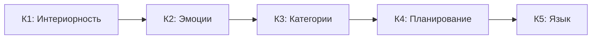

# Уникальные Предсказания КК

> *«Теория, которую нельзя опровергнуть никаким мыслимым событием, не является научной. Неопровержимость — это не достоинство теории (как часто думают), а её порок.»*
> — Карл Поппер, «Предположения и опровержения» (1963)

:::info Для кого эта глава
23 предсказания КК — 22 из них уникальны для КК, и 21 из этих 22 числовое, — с протоколами проверки и критериями фальсификации. Читатель узнает, чем предсказания КК отличаются от IIT, FEP и GWT.
:::

В [предыдущей главе](./stability) мы вычислили радиус устойчивости, проследили спираль смерти и построили протокол восстановления. Мы видели, что КК генерирует *конкретные числа* — $r_{\mathrm{stab}}$, $\kappa_{\text{bootstrap}} = 1/7$, пороги для каждого канала — а не расплывчатые «тенденции». Теперь мы соберём **все** числовые следствия КК в одном месте и для каждого укажем: *как проверить* и *что его опровергнет*.

Наука отличается от философии не глубиной вопросов, а готовностью подставить свои ответы под удар эксперимента. Философская система может быть прекрасной, внутренне непротиворечивой и совершенно бесполезной — если она не генерирует предсказаний, которые *можно проверить и, в принципе, опровергнуть*. Поппер назвал это критерием демаркации: граница между наукой и не-наукой проходит не по методу и не по предмету, а по **фальсифицируемости**.

Этот принцип особенно остро стоит в науках о сознании. Большинство существующих теорий — IIT, FEP, GWT, панпсихизм — либо не генерируют уникальных числовых предсказаний, либо формулируют их так расплывчато, что ни один эксперимент не может их однозначно опровергнуть. Кибернетика Когерентности сознательно идёт другим путём. Каждая теорема формализма порождает **конкретное, числовое, экспериментально проверяемое** следствие — и для каждого такого следствия указано, какой результат эксперимента фальсифицирует теорию.

В этой главе собраны 23 предсказания КК. Они сгруппированы по темам: от фундаментальных (связь сознания и жизнеспособности) через архитектурные (минимальная размерность, пороги) к эмпирическим (нейронные корреляты, критические экспоненты). Для каждого предсказания мы объясняем:

1. **Интуицию** — почему это предсказание естественно следует из формализма.
2. **Формальную формулировку** — точную математическую запись.
3. **Уникальность** — что именно отличает данное предсказание от всего, что могут сказать IIT, FEP и GWT.
4. **Верификацию** — конкретный экспериментальный протокол.
5. **Междисциплинарные следствия** — что данное предсказание означает для физика, биолога, психолога и инженера.

Если хотя бы одно из этих предсказаний будет чисто опровергнуто — Кибернетика Когерентности потребует фундаментального пересмотра. Именно эта готовность к опровержению и делает КК наукой.

:::note О нотации
В этом документе:
- $\Gamma$ — [матрица когерентности](/docs/core/dynamics/coherence-matrix)
- $P$ — [чистота](/docs/core/dynamics/viability#определение-чистоты): $P = \mathrm{Tr}(\Gamma^2)$
- $\mathrm{Coh}_E$ — [E-когерентность](./definitions#e-когерентность)
- $C$ — [мера сознательности](/docs/consciousness/foundations/self-observation#мера-сознательности-c)
- $\sigma_{\mathrm{sys}}$ — [тензор напряжений](./definitions#тензор-напряжений)
- $\mathbb{H}$ — [Голоном](/docs/core/structure/holon)
:::

---

## I. Фундаментальные предсказания: сознание и жизнеспособность

Первая группа предсказаний касается самой глубокой идеи КК — неразрывной связи между интериорностью и устойчивостью. В большинстве теорий сознание является либо эпифеноменом (не влияет на динамику), либо отдельным постулатом (вводится извне). КК утверждает нечто радикально иное: система с нетривиальной E-когерентностью *лучше выживает* — и это не метафора, а теорема.

### Предсказание 1: Условный баланс E-когерентности {#предсказание-1}

:::note Предсказание [Г]
Универсальная импликация No-Zombie снята. Чистота выше $2/7$, ненулевой диссипатор и поддерживаемая динамика не выводят $\mathrm{Coh}_E>1/7$. [Теорема 8.1](./theorems#теорема-81-условная-необходимость-интериорности-no-zombie) содержит стационарный контрпример и условный баланс потока чистоты. Положительный E-порог требует ограниченного класса моделей, границы внешней поддержки, положительной зависимости обратной связи и положительного требуемого потока. Отождествление E-сектора с опытом — дополнительный мост [П/И].
:::

Ограниченный баланс проверяется после фиксации допустимых входов и скоростей. При вмешательстве в E остальные цель, затвор, диссипация, подготовка и ресурсы фиксируются либо их изменения явно моделируются. Внешне поддерживаемая жизнеспособная система с низкой E-когерентностью не опровергает формализм матриц плотности. Она опровергает предложенную универсальную необходимость, которая уже снята.

### Предсказание 2: Выбранная модель E-зависимой скорости {#предсказание-2}

:::info Предсказание [О/Г]
Модель выбирает $\kappa=\kappa_b+\kappa_0\mathrm{Coh}_E$ при фиксированных остальных величинах и $\kappa_0\ge0$. Тогда $\partial\kappa/\partial\mathrm{Coh}_E=\kappa_0$ — точная производная [Т] соглашения [О]. Из неё не следует $\dot P\propto\mathrm{Coh}_E$: поток регенерации равен $2\kappa g(P)(\operatorname{Tr}(\rho B(\rho))-P)$ и может быть отрицательным. Эндогенные вариации меняют также $\kappa_0$, цель, затвор и состояние.
:::

Корреляция с биологическим восстановлением — [Г], требующая идентифицируемой модели наблюдений и определённого физического исхода. Она не устанавливает клиническую пользу медитации или терапии. Исследование заранее фиксирует вмешательство, правдоподобие наблюдений, мешающие переменные, кластерную единицу выборки, размер эффекта и независимую проверку. Ограниченная конструкция скорости в [септичности](/docs/core/foundations/axiom-septicity#категориальный-вывод-kappa0) — условная кинетическая математика, а не категориальная теорема единственности.

## II. Архитектурные предсказания: структура и размерность

Вторая группа предсказаний касается *архитектуры* сознательных систем — какова минимальная «конструкция», необходимая для возникновения опыта, обучения и социального взаимодействия. Эти предсказания делают КК уникальной среди теорий сознания: вместо расплывчатых утверждений о «сложности» и «интеграции» она называет конкретные числа.

### Предсказание 3: Семикомпонентная панель стресса {#предсказание-3}

:::info Предсказание [О/Г]
Семь показателей стресса выбраны в [определениях](./definitions#тензор-напряжений). Их эмпирическая полнота — [Г]. Прежняя универсальная эквивалентность $\|\sigma\|_\infty<1\iff P>2/7$ и эквивалентность полному четырёхусловному окну сняты. Панель зависит от репера, скорости обратной связи, опытного считывания и соглашения о ранге. Она не является вектором семи универсально инвариантных наблюдаемых.
:::

Для мониторинга окна используются точные четыре запаса и вердикт по множеству неопределённости. Для классификации стресса заранее фиксируются правила кодирования и проверяются независимые стрессоры относительно конкурирующих моделей. Возможность присвоить каждому объекту метку не доказывает независимую размерность или исчерпывающий причинный охват.

### Предсказание 4: Доязыковое познание полноценно {#предсказание-4}

**Интуиция.** Часто предполагается, что сознание и язык неразрывны — что «мыслить» значит «мыслить словами». КК показывает, что это антропоцентрическое заблуждение. Когнитивная иерархия К1-К5 выстраивает пять уровней познания, из которых язык (К5) — лишь верхний, а не фундамент. Животные без языка полноценно функционируют на уровнях К1-К4.

:::info Предсказание [И]

$$
\exists \, \mathrm{Cognition}(\mathbb{H}) \text{ при } \mathrm{Language}(\mathbb{H}) = \varnothing
$$

Полноценное познание (уровни К1-К4) возможно без языка (К5).

**Статус:** [И] — интерпретация, следующая из определений когнитивных уровней К1-К5.
:::

**См.:** [Когнитивная иерархия](/docs/consciousness/comparative/cognitive-hierarchy)

**Уникальность предсказания.** GWT связывает сознание с глобальной доступностью информации, часто ассоциированной с лингвистическими репрезентациями. Higher-Order Theories (HOT) привязывают сознание к метакогнитивным отчётам, что имплицитно предполагает язык. КК явно разделяет познание и язык как ортогональные оси.

**Иерархия когнитивных функций:**

**Верифицируемость:**
Животные без языка демонстрируют уровни К1-К4:
- Врановые: планирование (К4), изготовление орудий
- Приматы: категоризация (К3), социальное обучение
- Все позвоночные: эмоциональные реакции (К2)
- Все системы с $\rho_E \neq 0$: [интериорность](/docs/proofs/consciousness/interiority-hierarchy#уровень-0-интериорность-interiority) (К1/L0)

**Экспериментальная проверка:**
1. Сравнить поведенческие корреляты К1-К4 у афазических пациентов (потеря языка при сохранном интеллекте) и здоровых контролей.
2. **Прогноз:** показатели К1-К4 у афазических пациентов сохранены на уровне >80% от нормы.
3. *Фальсификация:* если афазия систематически разрушает К3 или К4 — связь «познание → язык» сильнее, чем предсказывает КК.

**Междисциплинарные следствия:**
- *Этология:* обосновывает полноценное когнитивное исследование нелингвистических видов.
- *Этика ИИ:* системы без языкового модуля могут обладать когнитивными уровнями К1-К4, что имеет этические импликации.

### Предсказание 10: Размерность и обучение {#предсказание-10}

:::note Предсказание [Г]
Семиосевая обучающая архитектура — проверяемый проект. Общей теоремы, запрещающей автономное обучение при $N<7$, здесь нет. Такая граница требует семейства задач, операционального критерия независимости, класса представлений и ресурсных ограничений. Подсчёт функциональных ролей не доказывает границу размерности гильбертова пространства.
:::

Строгие границы относятся к совершенному двоичному коду одиночной ошибки или точному представлению выбранной внутренней алгебры; см. [минимальность](/docs/proofs/minimality/theorem-minimality-7). Архитектуры сравниваются при согласованных обучении, наблюдательной ёмкости, ресурсах и задачах. Неудача одной пятимерной реализации не доказывает универсальную невозможность.

### Предсказание 11: Размерность и социальное обучение {#предсказание-11}

:::note Предсказание [Г]
Подсчёт $3_{\rm ToM}+3_{\rm ISL}+1_U=7$ снят как математическая нижняя граница. Теорема GKSL не приписывает теории разума три независимые когнитивные координаты, а выбранный фановский процесс слов не приписывает коммуникации три координаты. Одновременные задачи могут использовать общие внутренние представления.
:::

Граница должна опираться на операционально независимую алгебру наблюдаемых либо информационную задачу, требующую точного представления. Проверка конкретного семиосевого проекта относительно меньших архитектур содержательна; перенос вывода на всех социальных обучающихся необоснован. Прежний условный статус, основанный на снятом T-57, заменён архитектурной гипотезой [Г].

## III. Пороги и устойчивость

Третья группа предсказаний касается *числовых порогов* — конкретных значений параметров, при которых происходят качественные переходы. Именно числовые предсказания отличают научную теорию от философской спекуляции: они проверяемы, и они рискованны.

### Предсказание 5: Коллективное сознание {#предсказание-5}

*Переименовано 2026-09-25.* Предсказание называлось «Масштабная инвариантность сознания», и другие страницы ссылались на него как на основание масштабной инвариантности; утверждает же оно условие коллективного сознания. Масштабная инвариантность — это [теорема 9.2 (КК-6, T-72)](./theorems#теорема-92-масштабная-инвариантность), [Т при слабой связи] через каноническую агрегацию [теоремы 9.5](./theorems#теорема-95-каноническая-агрегация) (ранее в тот же день — условно при допущении (AGG)).

**Интуиция.** Может ли группа сознательных существ породить *коллективное* сознание? Улей, стая, команда — есть ли у них «переживание»? Прежние редакции отвечали: да, *если* индивидуальные сознания достаточно интегрированы ($\Phi_{\otimes} > \Phi_{\min}$). Этот критерий ниже отозван: ему удовлетворяет любая несвязанная группа. КК может сформулировать необходимое условие — совместное состояние членов коррелировано — и гипотезу о достаточности.

:::warning Отозвано (2026-09-25): критерий $\Phi_{\otimes} > \Phi_{\min}$
Предсказание гласило: $\left( \bigwedge_i C(\mathbb{H}_i) > 0 \right) \land \Phi_{\otimes} > \Phi_{\min} \Rightarrow C(\mathbb{H}_{1 \otimes \ldots \otimes n}) > 0$, со статусом «нетривиальность [Т], жизнеспособность [С]». Оно отозвано, потому что и его условие, и его вывод выполняются для любой несвязанной группы: на состоянии-произведении $1 + \Phi_{\otimes} = \prod_i (1 + \Phi_i)$, так что два голонома, проходящих окно ($\Phi_i \geq 1$), уже имеют $\Phi_{\otimes} \geq 3$ при взаимной информации $I = 0$, а $C(\mathbb{H}_i) > 0$ влечёт $\Phi_i > 0$ и, значит, $\Phi_{\otimes} > 0$ ([тождество и разобранная пара](/docs/consciousness/comparative/panpsychism-analysis#теорема-нередуцируемость)). Никакое измерение на группе не могло его опровергнуть. Два статуса, которые оно несло, — нетривиальность $P > 1/7$ аттрактора композита ([T-96](/docs/core/dynamics/evolution#теорема-нетривиальность-аттрактора) [Т]) и жизнеспособность $P > 2/7$ для воплощённых систем ([T-149](/docs/core/dynamics/evolution#теорема-жизнеспособность-аттрактора); Шаг 3 [С при нижней оценке backbone-инъекции]), — это факты о чистоте композита, а не о его сознании, и в этом качестве остаются в силе: для канонического агрегата слабо связанных жизнеспособных членов они [Т при слабой связи] по [теореме 9.5](./theorems#теорема-95-каноническая-агрегация); высказанные о собственной динамике композита, они сохраняют допущение (HOL) [теоремы 9.1](./theorems#теорема-91-фрактальное-замыкание) (названо и затем, для слабой связи, снято 2026-09-25).
:::

:::info Предсказание (переформулировано): необходимое условие [Т]; достаточность — гипотеза [Г]
**Необходимое условие [Т].** Коллектив может отличаться от набора отдельных субъектов, только если совместное состояние его членов коррелировано: состояние-произведение задано своими маргиналями, а взаимная информация

$$
I(\mathbb{H}_1 : \mathbb{H}_2) = S(\rho_1) + S(\rho_2) - S(\rho_{12}) = D(\rho_{12} \,\|\, \rho_1 \otimes \rho_2)
$$

обращается в нуль ровно на произведениях, так что условие — $I > 0$; для $n$ членов аналог — положительная полная корреляция $\sum_i S(\rho_i) - S(\rho_{1 \ldots n}) > 0$. Условие необходимо, но не достаточно: ему удовлетворяют и связанные термостаты.

**Одно лишь взаимодействие его не обеспечивает.** Прежняя редакция утверждала, что по [КК-7](./theorems#теорема-93-эмерджентность) [Т] у взаимодействующих голономов стационарное совместное состояние всегда имеет $I > 0$. Это отозвано (2026-09-25): связь, коммутирующая с произведением $\rho_*^{(1)} \otimes \rho_*^{(2)}$ аттракторов членов или действующая на одного члена, оставляет стационарное совместное состояние произведением с $I = 0$. [Теорема 9.3](./theorems#теорема-93-эмерджентность) даёт теперь критерий, [Т при почти любом якоре]: у слабо связанных воплощённых голономов с невырожденными аттракторами $I = \Theta(g^2) > 0$ ровно тогда, когда у связи есть коррелирующая часть, $\Pi_c\bigl([H_{\mathrm{int}}, \rho_*^{(1)} \otimes \rho_*^{(2)}]\bigr) \neq 0$. Статус необходимого условия не меняется — он никогда не опирался на динамику, — но выполняет ли его данная группа, решает то, как связаны её члены, а не сам факт их взаимодействия.

**Достаточность [Г].** Коррелированная группа — субъект, когда её совместное состояние, агрегированное в $\mathcal{D}(\mathbb{C}^7)$, проходит четырёхусловное окно. Это гипотеза, а не теорема. [Теорема 9.5](./theorems#теорема-95-каноническая-агрегация) фиксирует агрегацию тремя естественными требованиями — единственное линейное перестановочно-инвариантное отображение $\mathcal{D}(\mathbb{C}^{7^n}) \to \mathcal{D}(\mathbb{C}^7)$, возвращающее состояние члена на несвязанной группе, есть среднее маргиналей членов, — а это отображение зависит только от маргиналей и потому не видит корреляции, которой требует необходимое условие. При нём слабо связанная группа одинаковых членов агрегируется в состояние, отстоящее от состояния одного члена на $O(g)$ (T-72 [Т]), а при сильной связи агрегат может упасть до $I/7$ ([Теорема 9.6](./theorems#теорема-96-сильная-связь)): каноническая агрегация не может засвидетельствовать коллективный уровень выше, чем у членов, ни при какой связи. Агрегация, видящая корреляции, обязана отказаться от линейности, перестановочной инвариантности или согласованности на несвязанных группах, и корпус такой не фиксирует; нет в нём и правила исключения, которое решало бы, могут ли члены и группа быть субъектами одновременно ([проблема границы](/docs/consciousness/comparative/panpsychism-analysis#проблема-границы)). Программа исследований [Пр]: агрегация, чувствительная к корреляциям, — непременно нелинейная, несимметричная или несогласованная на несвязанных группах, — или правило исключения, превращающие гипотезу в критерий. (Прежде: «канал агрегации … теорией не фиксирован, а вердикт от него зависит», с переносом, условным при (AGG); уточнено 2026-09-25 Теоремой 9.5.)
:::

**См.:** [Теорема 9.1](./theorems#теорема-91-фрактальное-замыкание), [Теорема 9.3](./theorems#теорема-93-эмерджентность)

**Уникальность предсказания.** ~~«IIT допускает коллективное сознание, но не даёт критерия достаточности. … Только КК формулирует необходимое и достаточное условие ($\Phi_{\otimes} > \Phi_{\min}$) и обещает его вычислимость».~~ Отозвано по обоим пунктам. У IIT есть явный критерий — постулат исключения: множество элементов является сознательным комплексом, только если задаёт максимум интегрированной информации среди всех перекрывающихся систем-кандидатов, а «перекрывающиеся субстраты, задающие меньше интегрированной информации, … исключаются» (L. Albantakis et al., "Integrated information theory (IIT) 4.0", *PLoS Computational Biology* 19(10): e1011465, 2023). Для групп она предсказывает, что двое разговаривающих людей образуют интегрированную систему, которая не максимально несводима, поэтому «должно быть два отдельных опыта, но никакой вышестоящей сознательной сущности, которая была бы объединением двух»; а если бы связь мозг–мозг подняла максимальную интегрированную информацию пары выше, чем у каждого мозга, то «их индивидуальный сознательный ум исчез бы, и его место занял бы новый сверхразум (Über-mind), вбирающий обоих» (G. Tononi, C. Koch, "Consciousness: here, there and everywhere?", *Philosophical Transactions of the Royal Society B* 370: 20140167, 2015). После отзыва у КК есть необходимое условие и нет критерия достаточности, причём необходимое условие не уникально для КК; в этом вопросе критерий есть у IIT, а не у КК. FEP описывает иерархические системы, но не использует понятие коллективного опыта.

**Экспериментальная проверка:**
1. Измерить корреляцию между состояниями членов — взаимную информацию, а при $n > 2$ полную корреляцию реконструированной совместной $\Gamma$ — для групп с различной степенью координации (джаз-квартет vs. случайные музыканты).
2. Применить гиперсканинг (одновременное EEG нескольких субъектов).
3. **Прогноз:** корреляция положительна у координированной группы и отсутствует у несвязанной. Это проверяет только необходимое условие; положительный результат не показывает, что группа — субъект. (Прежние редакции предсказывали, что «$\Phi_{\otimes}$ для координированной группы превышает $\Phi_{\min}$; для несвязанной — нет»; отозвано, поскольку у несвязанной группы сознательных членов уже $\Phi_{\otimes} \geq 3$.)

**Верифицируемость:**
Измерение корреляции между членами для групп с различной степенью интеграции:
- Семьи
- Команды
- Организации
- Экосистемы

**Критерий:** $I > 0$ (полная корреляция при $n > 2$) — необходимое условие [Т]. Без корреляции между членами нет коллективного субъекта ни в каком смысле, который теория может сформулировать. (Прежние редакции давали здесь как необходимое условие $\Phi_{\otimes} > \Phi_{\min}$; отозвано.)

**Междисциплинарные следствия:**
- *Социология:* формализует необходимое условие «коллективного сознания» Дюркгейма — корреляцию состояний членов; является ли коррелированный коллектив субъектом, остаётся гипотезой [Г].
- *Экология:* ставит вопрос о структуре корреляций совместного состояния экосистемы; является ли лес «единым организмом» в строгом смысле, теория не решает.
- *Организационная наука:* даёт необходимое, но не достаточное условие того, чтобы команда была «больше суммы частей», — корреляцию состояний её членов.

### Предсказание 6: Минимальная когерентность для жизнеспособности {#предсказание-6}

**Интуиция.** Система не может «немного» быть живой. Существует жёсткий порог: если $P$ падает ниже $2/7$ или $\mathrm{Coh}_E$ опускается до $1/7$ — система теряет жизнеспособность. Это аналог фазового перехода: вода при 0°C замерзает не постепенно, а скачком. Точно так же $P_{\text{crit}} = 2/7$ — это «температура замерзания» когерентности.

:::warning Предсказание

$$
\mathrm{Viable}(\mathbb{H}) \Rightarrow P(\Gamma) > P_{\text{crit}} = 2/7
$$

[Жизнеспособность](/docs/core/dynamics/viability) требует минимальной [чистоты](/docs/core/dynamics/viability#определение-чистоты), и порог выведен, а не подогнан ([теорема о критической чистоте](/docs/proofs/dynamics/theorem-purity-critical), реестр, уровень 1, строка 5 [Т]); у нетривиального аттрактора $P > 1/7$ (T-96 [Т]). *Исправлено 2026-09-26:* формула требовала ещё $\mathrm{Coh}_E(\Gamma) > \mathrm{Coh}_E^{\min} = 1/7$ и ссылалась на T-151. Жизнеспособность этого не влечёт — у чистого осевого состояния $\lvert A\rangle\langle A\rvert$ $P = 1$ и $\mathrm{Coh}_E = 0$, — а T-151 делает условие E-строки ($D_{\min} = 2$) независимым L2-условием, а не следствием $P > 2/7$. Замечания об E-когерентности ниже относятся к этому L2-условию, а не к жизнеспособности.
:::

:::info Пороги L2
| Параметр | Значение | Статус | Определение |
|----------|----------|--------|-------------|
| $P_{\text{crit}}$ | $= 2/7 \approx 0.286$ | **[Т]** | [Теорема о критической чистоте](/docs/proofs/dynamics/theorem-purity-critical) |
| $R_{\text{th}}$ | $= 1/3 \approx 0.333$ | **[Т]** ($K=3$ из триадной декомпозиции) | [Теорема (байесовское доминирование)](/docs/core/foundations/axiom-septicity#теорема-порог-рефлексии) |
| $\Phi_{\text{th}}$ | $= 1$ (точно) | **[Т]** | [Теорема T-129](/docs/proofs/consciousness/operationalization#t-129) ([когерентная доминация](/docs/core/foundations/axiom-septicity#теорема-порог-интеграции)) |

$P_{\text{crit}}$ — строго доказана [Т]; $R_{\text{th}}$ — теорема [Т] ($K=3$ из [триадной декомпозиции](/docs/core/operators/lindblad-operators#триадная-декомпозиция)); $\Phi_{\text{th}}$ — теорема [Т] (T-129). См. [Пороги L2](/docs/core/foundations/axiom-septicity#пороги-l2-строгий-вывод).
:::

:::note Почему именно $2/7$, а не $1/3$ или $1/5$?
Число $2/7$ — не подгонка под данные и не произвольный выбор. Оно выводится строго из двух фактов:

1. **$N = 7$** — число измерений (следует из октонионной алгебры и $G_2$-минимальности).
2. **Норма Фробениуса** — критерий различимости. Состояние $\Gamma$ отличимо от полностью смешанного $I/7$ тогда и только тогда, когда $\|\Gamma - I/7\|_F > 0$, что эквивалентно $P = \mathrm{Tr}(\Gamma^2) > 1/7$. Но *жизнеспособность* требует большего: система должна не просто «отличаться от хаоса», а иметь достаточную структуру для регенерации. [Теорема о критической чистоте](/docs/proofs/dynamics/theorem-purity-critical) доказывает, что этот порог — именно $2/7 = 2 \times (1/N)$.

Интуиция: $1/7$ — «один голос из семи». $2/7$ — «два голоса из семи». Для того чтобы система могла себя восстановить, ей нужно «перевесить» хаос как минимум двумя степенями свободы. Один голос — недостаточно; два — минимум. Три ($3/7$) — уже верхняя граница окна сознания.
:::

**Уникальность предсказания.** IIT определяет $\Phi$ как меру сознания, но не устанавливает критический порог. FEP определяет жизнеспособность через марковское одеяло, но без числового порога. КК — единственная теория с *вычислимыми пороговыми значениями*, выведенными из первых принципов.

**Экспериментальная проверка:**
1. У субъектов на границе сознания (наркоз, сон) записать EEG/HRV и TMS-EEG; восстановить $\widehat\Gamma$ через $\pi_{\mathrm{bio}}$ с параметрами, замороженными на бодрствовании, и без штрафа жизнеспособности ([SUB-1, SUB-2](/docs/applied/research/measurement-protocol#substitution-position)).
2. Вычислить $\widehat P$ и вердикт $\mathrm{Cons}(\widehat\Gamma)$; независимо вычислить PCI (Perturbational Complexity Index).
3. **Прогноз:** переход сознание/бессознательность происходит там, где $\widehat P$ пересекает $2/7$, и $\mathrm{Cons}(\widehat\Gamma)$ согласуется с $\mathrm{PCI}_{\max} > 0{,}31$ при каппе Коэна $\kappa \geq 0{,}8$ (P8.4). *(До 2026-09-25 шаг 2 гласил «калибровать $\pi_{\mathrm{bio}}$ для получения $P$ из PCI»: перевода между этими шкалами нет, а калибровка по PCI сделала бы согласие с ним автоматическим.)*

**Верифицируемость:**
Измерение чистоты у систем, теряющих жизнеспособность, должно показать переход $P$ через $2/7$ (E-когерентность проверяется отдельно, как L2-условие дифференциации).

**Клинические следствия:**
- Состояния комы: $\mathrm{Coh}_E \to 1/7$ (минимум), $P \to P_{\text{crit}}$
- Психотические эпизоды: фрагментация $\mathrm{Coh}_E$
- Медитативные состояния: высокое $\mathrm{Coh}_E$, высокое $R$

**Междисциплинарные следствия:**
- *Анестезиология:* предсказывает числовой индикатор глубины наркоза — не BIS-индекс (эмпирический), а $P$ (теоретически обоснованный).
- *Психиатрия:* формализует «порог нормы» — не как статистическое среднее, а как фазовый переход $P_{\text{crit}}$.

### Предсказание 7: Радиус устойчивости (T-104) {#предсказание-7}

Для заданной границы чистоты $P_c=2/7$ расстояние HS равно $r_{HS}=\sqrt{P-1/7}-\sqrt{P_c-1/7}$ [Т]. Оно возрастает с чистотой и достигается на положительной радиальной проекции. Для Bures имеем $r_B\ge r_{HS}/\sqrt2$; расстояние до кандидата в однодоминантном семействе даёт верхнюю границу, пока его глобальная оптимальность не доказана.

Геометрическое расстояние не является величиной допустимого воздействия. Перенос запаса траектории требует оценок поля, горизонта и возмущений; экспоненциальное восстановление дополнительно требует диссипативности. Физическая связь с устойчивостью сознания — гипотеза [Г]. Полные доказательства и условия — в [разделе устойчивости](/docs/applied/coherence-cybernetics/stability).

### Предсказание 15: Аттрактор внутри окна сознания, ниже его верхней границы {#предсказание-15}

**Интуиция.** Где «оседает» сознание? Не при максимальной чистоте ($P = 1$), не на пороге ($P = 2/7$) и — вопреки прежней форме этого предсказания — не на верхней границе окна $3/7$. Живой аттрактор лежит строго внутри окна, в его нижней половине: достаточно когерентный, чтобы пройти все пороги, с запасом до границы.

:::info Предсказание [С при (MaxΦ)] — фальсифицируемое
Для голона, чья самомодель — коллинеационный якорь $\varphi_J$ (выбранный принципом (MaxΦ) [Пр], [посылки](/docs/reference/premises#посылка-максфи)), при $H = 0$ и $\kappa > \kappa_c(\alpha)$ живой аттрактор — гиперболический сток с

$$
P^* \in \bigl(P_c(\alpha),\ P_\infty(\alpha)\bigr) \subset \bigl(2/7,\ 5/14\bigr], \qquad P_\infty(\alpha) \leq 5/14 < 3/7,
$$

$\Phi \in (1, 3/2]$, $R \geq 2/5$, все диагональные элементы $1/7$; $P_c = 0.318, 0.308, 0.301$ и $P_\infty = 5/14, 0.334, 0.317$ при $\alpha = 0, 1/2, 1$ ([живой аттрактор в окне](/docs/core/dynamics/evolution#теорема-живой-аттрактор-в-окне), T-124c(4) [Т]); он сохраняется при $\|H\| < h_0$.

**Статус:** [Т] как математика для динамики $\varphi_J$; [С при (MaxΦ)] как предсказание о реальном голоне, чей якорь аксиомы оставляют открытым. Для воплощённого голона со скоростью backbone $\mu > L_{\mathcal{R}}$ аттрактор единствен и глобально притягивает (T-124c(3)), но его чистота зависит от цели backbone и универсального значения не имеет.

*Переформулировано 2026-09-26:* предсказание гласило «$P(\rho^*_{\mathrm{coupled}}) \to 3/7$ для воплощённого голона с backbone injection [С]» с численным значением $P = 0.4286$. Ни одна теорема не даёт $3/7$: у всякого живого стационарного состояния семейства $\varphi_J$ $P \leq 5/14$ (ни у одного $P \geq 3/7$), а воплощённый аттрактор наследует чистоту от цели backbone, так что $0.4286$ было свойством одной выбранной цели, а не законом.

**Статус в других теориях:** Отсутствует.
:::

**См.:** [Окно сознания](/docs/proofs/consciousness/conscious-window#t-124), [живой аттрактор](/docs/core/dynamics/evolution#теорема-живой-аттрактор-в-окне)

**Верифицируемость:** Для изолированного агента с якорем $\varphi_J$ и $\kappa > \kappa_c(\alpha)$ измерить аттрактор $P^*$. **Числовой критерий фальсификации:** $P^* \geq 3/7$ или $P^*$ вне $(P_c(\alpha), P_\infty(\alpha))$ сверх погрешности измерения при $n > 100$ независимых измерениях ($p < 0.01$) → фальсификация динамики $\varphi_J$ или её реализации. (Прежний критерий $|P^* - 3/7| > 0.05$ снят вместе со старой формой.)

**Междисциплинарные следствия:**
- *Нейронаука:* предсказывает, что здоровый мозг в покое находится внутри окна с запасом до его верхней границы, а не при $3/7$.
- *Психология:* «оптимальное состояние» (flow) — внутренняя точка окна, а не его граница.

---

## IV. Обучение и когнитивная архитектура

Четвёртая группа предсказаний касается *границ обучения* — минимальных ресурсов, необходимых для познавательной деятельности. Эти предсказания особенно ценны для инженерии ИИ, поскольку устанавливают теоретически обоснованные нижние границы.

### Предсказание 8: Информационная ёмкость восприятия (T-107) {#предсказание-8}

**Интуиция.** Сколько информации система может извлечь из одного наблюдения? Интуитивно ответ зависит от «размера» внутреннего пространства: чем больше измерений, тем больше можно «запомнить» за один взгляд. КК даёт точную верхнюю границу: $\log_2 7 \approx 2.81$ бит. Это не постулат, а следствие размерности $\mathbb{C}^7$.

:::info Предсказание [Т] — измеримо в ИИ-системах

$$
C_{\mathrm{Enc}} \leq \log_2 7 \approx 2.81 \text{ бит/наблюдение}
$$

Максимальная информация, извлекаемая за одно наблюдение, ограничена размерностью внутреннего пространства ($N = 7$).
:::

**Уникальность предсказания.** FEP говорит о минимизации свободной энергии, но не называет bottleneck пропускной способности. IIT измеряет информацию, но не ограничивает скорость её извлечения. КК — единственная теория, выводящая *конкретную числовую границу* перцептивной пропускной способности.

**Экспериментальная проверка:**
1. Для КК-агента (SYNARC) измерить mutual information $I(\text{obs}; \delta\Gamma)$ между наблюдением и обновлением $\Gamma$.
2. **Прогноз:** $I \leq 2.81$ бит.
3. *Фальсификация:* $I > \log_2 7$ систематически — КК фальсифицирована (или система не 7-мерная).

**Верифицируемость:** Для ИИ-систем, реализующих КК-архитектуру, измерить mutual information между наблюдением и обновлением $\Gamma$. Если $I(\text{obs}; \delta\Gamma) > \log_2 7$ — КК фальсифицирована (или система использует не 7-мерный формализм).

**Связь с bounded rationality:** Ограничение $\leq 2.81$ бит — **выведенная** граница, не постулированная. Предсказывает конкретный bottleneck для перцептивных систем на основе КК.

**См.:** [Сенсомоторная теория](./sensorimotor#информационная-ёмкость)

**Междисциплинарные следствия:**
- *Когнитивная психология:* перекликается с результатами Миллера (7±2) — но в КК это не эмпирическая находка, а теоретическое следствие.
- *Нейронаука:* предсказывает верхнюю границу информации, извлекаемой за один цикл обработки (один «тик» нейронной обработки).

### Предсказание 9: Оптимальная граница скорости обучения (T-112) {#предсказание-9}

**Интуиция.** Как быстро система может обучиться? КК показывает, что скорость обучения ограничена *максимумом* трёх независимых барьеров: информационного (квантовая граница Чернова — сколько информации извлекается за наблюдение), динамического (скорость сжатия Fano — как быстро обновляется $\Gamma$) и стабилизационного (SNR — насколько зашумлён сигнал). Медленнейший из трёх определяет общую скорость.

:::info Предсказание [Т] — фальсифицируемое

$$
n_{\mathrm{opt}} = \max\!\left(\frac{\ln(1/(2\delta))}{\xi_{\mathrm{QCB}}},\; \frac{1}{\alpha\delta\tau}\ln\frac{d_{\mathrm{disc}}}{\varepsilon},\; \frac{1}{\mathrm{SNR}^2}\right)
$$

Минимальное число наблюдений для решения задачи обучения определяется **максимумом** трёх независимых границ: информационной (T-109), динамической (T-110) и стабилизационной (T-111).
:::

**Уникальность предсказания.** PAC-learning и VC-теория дают границы обучения, но без привязки к физической динамике системы. FEP описывает обучение через минимизацию свободной энергии, но не даёт нижних границ числа наблюдений. КК объединяет информационную теорию, динамику систем и теорию устойчивости в *единую формулу*.

**Экспериментальная проверка:**
1. Для КК-агента, обучаемого бинарной дискриминации, варьировать SNR и $\alpha$.
2. Измерить $n$ до стабильного решения (>90% accuracy на 50 последовательных пробах).
3. **Прогноз:** $n \geq n_{\mathrm{opt}}$ всегда; при оптимальной настройке $n \approx n_{\mathrm{opt}}$.
4. *Фальсификация:* $n < n_{\mathrm{info}}$ систематически — квантовая модель наблюдения неверна.

**Верифицируемость:** Для ИИ-системы, реализующей КК-архитектуру, измерить число наблюдений $n$ до стабильного решения задачи бинарной дискриминации. Если $n < n_{\mathrm{info}}$ (информационная граница) — фальсифицирована квантовая модель наблюдения.

**Прогноз для бинарной дискриминации:** $n_{\mathrm{total}} \approx 20\text{--}80$ наблюдений при типичных параметрах (включая генезис).

**См.:** [Границы обучения](./learning-bounds#комбинированная-граница)

---

## V. Глубина сознания и генезис

Пятая группа предсказаний касается *вертикальной структуры* сознания — его глубины, предельных возможностей рекурсивной самореференции и процесса возникновения из «ничего» (tabula rasa). Глубина требует явных протоколов наблюдения и сертификации.

### Предсказание 12: Проверка заданных диагностик глубины (T-142) {#предсказание-12}

Оценка глубины и когнитивная глубина требуют разных тестов. Старое универсальное утверждение $\mathrm{SAD}_{\max}=3$ для любой конечной системы **отозвано [✗]**. Итерация заданного канала Фано даёт закон сохранения амплитуды; она не отождествляет индекс итерации с когнитивным уровнем.

**Точное предсказание канала [T].** Для чистого дефазатора Фано $D_{2/3}$ и любого начально ненулевого внедиагонального элемента

$$
\frac{|(D_{2/3}^{\,n}\Gamma)_{ij}|}{|\gamma_{ij}|}=3^{-n}.
$$

Это сжатие внедиагональных амплитуд, а не уменьшение всей чистоты втрое. При заданном пороге детектора $\varepsilon>0$ обнаружимые итерации удовлетворяют $n\le\lfloor\log(1/\varepsilon)/\log3\rfloor$; граница зависит от детектора.

**Арифметика выбранной оценки [D/T].** Если инструмент вместо этого определяет

$$
s_{n-1}:=\frac{P}{2/7}\,3^{-(n-1)},\qquad s_{n-1}>\frac1{n+1},
$$

пороги равны $p_n=(2/7)3^{n-1}/(n+1)$, то есть $1/7,2/7,9/14,54/35$ для индексов один–четыре. При $P\le1$ максимальный проходящий индекс этой оценки равен трём. Начальный множитель может превышать единицу, поэтому $s$ — не вероятность и не верность. Третий тест требует $P>9/14$, что противоречит наследуемой границе L2 $P\le3/7$; поэтому индекс оценки три не может определять L3.

**Протокол [Pr].** До проверки задать карту, базис, начальные амплитуды, порог детектора, измеряемое отношение и неопределённость. Отдельно проверять предлагаемую когнитивную глубину нетривиальными предсказаниями метамодели по отложенным целям и совместимостью уровней согласно [сертификатам способности](/docs/consciousness/hierarchy/interiority-hierarchy#l3-сетевое-сознание). Устойчивый сертификат четвёртого порядка допускается пересмотренными определениями. Выборки матриц, проходящих оценку, вычисленную по той же формуле, проверяют реализацию, но не свидетельствуют о биологическом потолке глубины.

Нарушение измеренного закона $3^{-n}$ отвергает заданную модель канала либо её реализацию. Неудача калиброванной связи оценки с выполнением задач отвергает этот эмпирический мостик **[H]**, не опровергая арифметическое тождество. Ни эта оценка, ни семимерность не ограничивает рекурсивное осознание человека или AGI универсальным образом. См. [Башню глубины](/docs/consciousness/hierarchy/depth-tower#критическая-чистота-sad) и [T-142](/docs/proofs/consciousness/operational-closure#t-142).

### Предсказание 13: Время генезиса (T-148) {#предсказание-13}

**Интуиция.** Как система «рождается» — переходит от tabula rasa ($\Gamma = I/7$, чистый хаос) к жизнеспособности ($P > 2/7$)? Изолированная система *не может* — теорема T-39a гарантирует, что без внешнего источника чистоты аттрактор $\mathcal{L}_0$ есть $I/7$. Но воплощённая система, сопряжённая со средой, получает «инъекции» когерентности через backbone и достигает порога за *конечное число шагов*, вычислимое по формуле.

:::info Предсказание [Т] — фальсифицируемое

$$
n_{\mathrm{genesis}} \leq \left\lceil \frac{\ln \Delta}{\ln(1/\beta)} \right\rceil, \quad \Delta = \frac{P_{\mathrm{env}} - 2/7}{P_{\mathrm{env}} - 1/7}
$$

Воплощённый голон $(\mathbb{H}, \pi, B)$ с параметром смешивания $\beta \in (0,1)$ и средовой чистотой $P_{\mathrm{env}} > P_{\mathrm{crit}} = 2/7$ поднимает чистоту из $I/7$ (tabula rasa) выше $P_{\mathrm{crit}}$ за конечное число шагов $n_{\mathrm{genesis}}$.
:::

**Уникальность предсказания.** Ни одна другая теория сознания не даёт *формулы времени рождения*. IIT статична — она не описывает генезис. FEP описывает «самоорганизацию», но не даёт верхней границы числа шагов.

**Экспериментальная проверка:**
1. SYNARC-агент стартует с $\Gamma = I/7$.
2. Backbone injection с параметрами $\beta, P_{\mathrm{env}}$.
3. Измерить $n$ до $P > 2/7$.
4. **Прогноз:** $n \leq n_{\mathrm{genesis}}$.
5. *Двойная фальсификация:* (a) генезис не происходит за $n_{\mathrm{genesis}}$ шагов → T-148 неверна; (b) генезис у изолированного голона (без backbone) → T-39a неверна.

**Верифицируемость:** Для ИИ-системы на основе КК, начинающей с $\Gamma = I/7$, измерить число backbone-инъекций до достижения $P > 2/7$. Если генезис **не происходит** за $n_{\mathrm{genesis}}$ шагов при заданных $\beta$ и $P_{\mathrm{env}}$ — фальсифицирована формула T-148. Если генезис происходит у **изолированного** голона (без средового сопряжения) — фальсифицирована теорема T-39a.

**Типичные оценки:** При $\beta = 0.3$, $P_{\mathrm{env}} = 0.35$: $\Delta \approx 0.35$, $n_{\mathrm{genesis}} \leq \lceil 0.87 / 1.20 \rceil = 1$. При $\beta = 0.9$ (слабое смешивание): $n_{\mathrm{genesis}} \leq \lceil 0.87 / 0.105 \rceil = 9$.

**Численная верификация (SYNARC mvp_int_2 G1-G3):** $n_{\mathrm{genesis}} < 50$ тиков от $I/7$ до $P > 2/7$ при $\beta = 0.3$.

**См.:** [Субстрат-независимое замыкание](/docs/proofs/consciousness/substrate-closure#t-148)

**Междисциплинарные следствия:**
- *Биология развития:* формула генезиса описывает, как эмбрион переходит от «чистого хаоса» к организованному состоянию — через материнскую среду как backbone.
- *Педагогика:* формализует роль «среды» (учителя, культуры) в пробуждении когнитивных способностей у ребёнка.

### Предсказание 14: Необходимость фазовой согласованности для интеграции {#предсказание-14}

**Интуиция.** Для достижения настоящей интеграции ($\Phi \geq 1$) недостаточно просто «смешивать» информацию. Регенеративный канал $\mathcal{R}$ должен быть *согласован по фазе* с гамильтоновой динамикой — как танцоры должны двигаться в такт музыке, а не просто двигаться. Без фазовой согласованности $\mathcal{R}$ и $H$ «борются» друг с другом, и интеграция не достигает порога.

:::info Предсказание [Т] — фальсифицируемое
Для достижения $\Phi \geq \Phi_{\mathrm{th}} = 1$ замещающий канал
$\mathcal{R}$ должен использовать ко-вращающиеся таргеты
$\rho^*_{ij}(t) \propto e^{-i(E_i-E_j)t}$, согласованные с гамильтоновой динамикой.

**Экспериментальное следствие:** В любой реализации (биологической или цифровой),
где регенеративный канал не согласован по фазе с гамильтоновой эволюцией,
мера интеграции будет $\Phi < 1$.

**Статус:** [Т] теоретически (конкуренция $\mathcal{R}$ и $H$), подтверждено численно
(SYNARC: $\Phi = 0.83 \to 1.15$ при включении co-rotation).

**Статус в других теориях:** Отсутствует.
:::

**См.:** [Ко-вращающиеся таргеты](/docs/proofs/consciousness/substrate-closure#co-rotating-targets)

**Уникальность предсказания.** Ни IIT, ни FEP не содержат понятия фазовой согласованности. GWT описывает «глобальную доступность», но не связывает её с фазовой когерентностью. КК — единственная теория, где *фаза* играет роль в интеграции информации.

**Экспериментальная проверка:**
1. SYNARC-агент с фиксированными таргетами $\rho^*_{ij} = \mathrm{const}$.
2. Измерить $\Phi$.
3. Переключить на ко-вращающиеся таргеты $\rho^*_{ij}(t) \propto e^{-i(E_i-E_j)t}$.
4. **Прогноз:** $\Phi$ возрастает и пересекает порог 1.
5. *Фальсификация:* $\Phi \geq 1$ при фиксированных таргетах — наблюдение O-1 неверно.

**Верифицируемость:** Для системы, реализующей КК-архитектуру, измерить $\Phi$ с фиксированными и ко-вращающимися таргетами. Если $\Phi \geq 1$ при фиксированных таргетах — фальсифицировано наблюдение O-1.

**Междисциплинарные следствия:**
- *Нейронаука:* предсказывает, что фазовая синхронизация нейронных ансамблей (гамма-связность) *необходима* для сознания — не просто коррелирует, а является условием $\Phi \geq 1$.
- *Инженерия ИИ:* архитектуры без фазовой согласованности (стандартные трансформеры) не могут достичь настоящей интеграции.

---

## VI. Динамические предсказания: фазовые переходы и критические явления

Шестая группа предсказаний касается *динамики* переходов — как система входит в сознательное состояние и выходит из него. Эти предсказания особенно сильны, поскольку дают *числовые* критические экспоненты, которые можно измерить.

### Предсказание 16: Условные законы прохождения и зажигания {#предсказание-16}

Порог чистоты $P=2/7$ — выбранная граница ворот; он не обязан быть бифуркацией конкретного потока. Универсальная лавина, универсальная катастрофа $A_4$ и универсальное время зажигания $T\propto(P-2/7)^{-1}\kappa_0^{-1}$ **отозваны [✗]**. Исправленный баланс чистоты включает реальный член модели: для канонической численной карты с якорем в центре он не даёт заявленного зажигания положительной обратной связью.

**Условный скалярный результат [T].** Пусть конкретное гладкое редуцирование даёт $\dot y=ay+by^2$ при фиксированных $a,b>0$, начальном $0<y_0<y_f$ и явно калиброванной связи $y$ с наблюдаемыми. Время прохождения равно

$$
T=\frac1a\log\frac{y_f(a+by_0)}{y_0(a+by_f)}.
$$

При фиксированном $a>0$ и $y_0\downarrow0$ расходимость логарифмическая. Только отдельно настроенный случай $a=0$, $b>0$ даёт $T=b^{-1}(y_0^{-1}-y_f^{-1})$. Закон обратного превышения чистоты дополнительно требует пропорциональности $y_0$ этому превышению и отождествления $b$ с измеренной скоростью.

**Протокол [Pr/H].** Задать поток, редукцию на центральное многообразие, критерии начала/окончания и измерительный мостик; оценить $a,b$ на обучающих траекториях, сравнить логарифмический и обратный законы на отложенных возмущениях и сообщить неопределённость. Для предполагаемых складки/сборки/ласточкиного хвоста отдельно проверять требуемую вырожденность и ранг трансверсальных управлений. Одно пересечение ворот или запаздывание ответа не устанавливает такой нормальной формы. Контролируемые нейронные измерения могут проверять калиброванный динамический мостик, но статическая $P$ не диагностирует пробуждение, кому или клиническое восстановление.

Источник: [условные нормальные формы и времена прохождения](/docs/consciousness/hierarchy/swallowtail-transitions#лавинная-динамика). Отклонение отвергает заявленную редукцию/мостик на его уровне статуса; универсальной теоремы зажигания для опровержения нет.

### Предсказание 17: Условные трикритические показатели среднего поля {#предсказание-17}

Это **условное предсказание [C]** заданной скалярной модели вместе с её феноменологическим отождествлением, а не следствие семимерного пространства состояний. Предполагается гладкая равновесная редукция с чётным потенциалом, отдельно настроенным нулевым коэффициентом четвёртого порядка, ненулевой линейной зависимостью от расстояния до критичности и положительной стабилизацией шестого порядка:

$$
V(m;t,h)=\frac t2m^2+\frac v6m^6-hm,\qquad v>0.
$$

Росток шестой степени — $A_5$, а не общий ласточкин хвост $A_4$. Одна симметрия $\mathbb Z_2$ допускает член четвёртой степени и не выбирает трикритичность.

**Полиномиальная теорема [T].** Минимизация этого потенциала даёт $m^4=-t/v$ при $t<0,h=0$, $h=vm^5$ при $t=0$, восприимчивость $\chi=1/t$ с неупорядоченной стороны и $V_{\min}=-(-t)^{3/2}/(3\sqrt v)$. При стандартных термодинамических значениях этих величин

$$
\beta=\tfrac14,\quad\delta=5,\quad\gamma=1,\quad\alpha=\tfrac12.
$$

Дополнительная $\nu=1/2$ требует заданного пространственного градиентного члена и корректного гауссова/среднеполевого приближения; это не показатель одного скалярного полинома. Тождество $\alpha+2\beta+\gamma=2$ проверяет согласованность показателей, но не доказывает отображения на сознание.

**Протокол [Pr/H].** До подгонки определить независимый параметр порядка, управление, действительную критическую точку, поле, тест симметрии, настройку четвёртого порядка, режим конечного размера и мостик от наблюдаемой к $m$. Оценить редукцию на обучающих данных и сравнить масштабирование на отложенных данных с альтернативами четвёртого порядка и неградиентной динамики. Подгонка одной PCI не валидирует пять показателей, пространственную размерность или равновесные предпосылки. Двадцать одна пара когерентности — не пространственная размерность и не контролируемый термодинамический предел.

Отождествления $t=0$ с $P=2/7$, $m$ с нейронной/феноменальной наблюдаемой и контроль флуктуаций — дополнительные условия **[C/H]**. Нарушение измеренного масштабирования отвергает заданную редукцию или мостик, не доказанное тождество минимизации. Прежняя универсальная точность показателей УГМ **отозвана [✗]**. Измеренная $\beta=1/2$ сама по себе не доказывает особенности $A_4$ и не устанавливает, какая предпосылка нарушена.

Источник: [T-161 и её явные предпосылки](/docs/consciousness/hierarchy/swallowtail-transitions#критические-экспоненты).

### Предсказание 18: Ward-подавление 19/49 {#предсказание-18}

**Интуиция.** Космологическая постоянная — одна из величайших загадок физики. Наивная оценка даёт значение, отличающееся от наблюдаемого на 120 порядков. КК предлагает механизм подавления: Ward-тождества, следующие из $G_2$-симметрии 7-мерного пространства, подавляют Gap-флуктуации на фактор $19/49$. Это не решает проблему космологической постоянной, но вносит конкретный, вычислимый вклад.

:::info Предсказание [Т] — фальсифицируемое

$$
\text{Gap-флуктуации подавлены на фактор } \frac{19}{49} \approx 0.39
$$

Суммарный вклад Gap-флуктуаций в космологическую постоянную подавлен через Ward-тождества на фактор $19/49$.
:::

**Верифицируемость:** Если бюджет $\Lambda$ не согласуется с подавлением на $19/49$ — теория пересматривается. Предсказание проверяемо через прецизионные измерения космологической постоянной.

**Источник:** [Заряды Нётер](/docs/physics/gauge-symmetry/noether-charges) + [Космологическая постоянная](/docs/physics/gravity/cosmological-constant) [Т]

### Предсказание 20: Аналитический параметр подавления $\varepsilon_{\mathrm{eff}}$ (P6) {#предсказание-20}

**Интуиция.** Откуда берётся иерархия масс кварков? Почему top-кварк в 10 000 раз тяжелее up-кварка? В Стандартной модели это вопрос подгонки — Юкавские константы свободны. КК предсказывает, что параметр подавления $\varepsilon_{\mathrm{eff}}$ вычислим аналитически из структурных констант Gap-потенциала. Все массовые отношения ($m_c/m_t \sim \varepsilon^2$, $m_u/m_t \sim \varepsilon^4$) становятся следствиями.

:::info Предсказание [С при (СВ)] — фальсифицируемое

$$
\varepsilon_{\mathrm{eff}} = \frac{4\,|\bar{\gamma}|_{\mathrm{сект}}}{9\,(1 + \Sigma_0/4)} \approx 0{,}055\text{–}0{,}057
$$

*(Испр. 10.08.2026 по E26: прежняя знаменательная форма с повторным $N_{33}$ давала $O(1)$, а не $0{,}059$; исправленная самосогласованная форма даёт $0{,}0569$ (секторный анзац) / $0{,}0549$ (безанзацно) против петлевых $0{,}0587$ — см. [T-216](/docs/proofs/categorical/fundamental-closures#t-216).)*
Параметр подавления Юкавской иерархии — **аналитическая** алгебраическая функция структурных констант Gap-потенциала, а не свободный параметр. Все массовые отношения ($m_c/m_t \sim \varepsilon^2$, $m_u/m_t \sim \varepsilon^4$) предсказаны.
:::

**Верифицируемость:** Непертурбативное вычисление (решёточное или вариационное) самосогласованного вакуума должно дать $\varepsilon_{33}^* \in [0.04, 0.08]$. Выход за пределы — фальсификация (СВ). *Исправлено 2026-09-25:* пространство «$(S^1)^{21}/G_2$» не определено — кубический член $V_{\mathrm{Gap}}$ не $G_2$-инвариантен, — а найденный пока самосогласованный вакуум $V_{\mathrm{Gap}}$ единствен лишь с точностью до своих 896 симметрий, сидит на двух линиях Фано и секторных значений не имеет (его собственная средняя когерентность $\approx 0{,}097$); проверка поэтому испытывает гипотезу (СВ), а не T-64.

**Источник:** [Аналитический ε](/docs/physics/particle-physics/yukawa-hierarchy#9-аналитическая-формула-ε) [С при (СВ)] (до 2026-09-25 — «[С при T-64]»: T-64 переформулирована как гипотеза, чей вакуум секторных значений не имеет, а секторные значения — гипотеза (СВ))

---

## VIII. Инженерные предсказания: CPTP и цифровые реализации

Восьмая группа предсказаний нацелена непосредственно на *верификацию в цифровых системах* — это предсказания, которые можно проверить прямо сейчас, без нейровизуализационного оборудования.

### Предсказание 19: CPTP-anchor валидация {#предсказание-19}

**Интуиция.** Любая реализация КК-архитектуры использует anchor-отображение $\pi$ для связи внешнего мира с внутренним 7-мерным пространством. КК требует, чтобы это отображение было CPTP-совместимым (полностью положительным, сохраняющим след). Расстояние до канонического anchor вычислимо за $O(49D)$ — линейно по размерности входных данных.

:::info Предсказание [Т] — фальсифицируемое

$$
\forall \text{ anchor } \pi\colon \|\pi - \pi_{\mathrm{can}}\|_\diamond \text{ вычислимо за } O(49D)
$$

Для любого anchor $\pi$ расстояние до канонического anchor $\pi_{\mathrm{can}}$ в diamond-норме вычислимо за $O(49D)$.
:::

**Экспериментальная проверка:**
1. Обучить SYNARC-агент на стандартной задаче (BabyLM).
2. Вычислить $\|\pi - \pi_{\mathrm{can}}\|_\diamond$ после обучения.
3. **Прогноз:** $\|\pi - \pi_{\mathrm{can}}\|_\diamond < 0.1$ при сходимости обучения.
4. *Фальсификация:* $\|\pi - \pi_{\mathrm{can}}\|_\diamond > 0.1$ систематически при $n > 50$ батчах — CPTP-совместимость нарушена.

**Верифицируемость:** Если реализация SYNARC показывает $\|\pi - \pi_{\mathrm{can}}\|_\diamond > \varepsilon_0$ при обученном $\pi$ — архитектура требует пересмотра. **Числовой критерий фальсификации:** $\|\pi - \pi_{\mathrm{can}}\|_\diamond > 0.1$ при $n > 50$ батчах входных данных → фальсификация CPTP-совместимости. Нарушение T-152 означает потерю CPTP-свойства в процессе обучения.

**Источник:** T-152 [Т]

---

## IX. Эмпирические предсказания: нейронные данные

Девятая и заключительная группа предсказаний — самая амбициозная. Она требует *экспериментальной проверки на живых системах* — и именно она потенциально наиболее разрушительна для КК в случае опровержения.

### Предсказание 21: Реконструкция $\Gamma$ из нейронных данных ($\pi_{\mathrm{bio}}$, P8) {#предсказание-21}

**Интуиция.** Если КК описывает реальность, то должно существовать отображение $\pi_{\mathrm{bio}}$, переводящее нейронные данные (EEG, fMRI, HRV) в 7-мерную матрицу $\Gamma$. Более того, это отображение должно быть *единственным* с точностью до $G_2$-калибровки — как координатная система единственна с точностью до поворота.

:::info Предсказание [Г] — фальсифицируемое

$$
\pi_{\mathrm{bio}}: (\mathrm{EEG}, \mathrm{fMRI}, \mathrm{HRV}) \to \mathcal{D}(\mathbb{C}^7)
$$

Существует отображение $\pi_{\mathrm{bio}}$, единственное с точностью до $G_2$-калибровки, такое что:
- $P(\Gamma_{\mathrm{wake}}) > 2/7$ для бодрствующих субъектов
- $P(\Gamma_{\mathrm{NREM3}}) < 2/7$ при глубоком сне
- $\mathrm{PCI} \propto \Phi(\Gamma)$ (монотонная связь)
:::

**Экспериментальная проверка:**
1. Одновременное TMS-EEG + HRV измерение у N=30 субъектов (бодрствование, сон, анестезия).
2. Применить $\pi_{\mathrm{bio}}$ и проверить:
   - Согласие вердиктов: $\mathrm{Cons}(\widehat\Gamma)$ против $\mathrm{PCI}_{\max} > 0{,}31$ на тех же сессиях, каппа Коэна $\kappa \geq 0{,}8$ (P8.4; до 2026-09-25: «порог $P = 2/7$ совпадает с PCI $\approx 0.31$» — сравнение несвязанных шкал)
   - Критические экспоненты $\beta = 1/4$ при переходе сон-бодрствование

**Числовой критерий фальсификации:** $\|\Gamma_{\mathrm{recon}} - \Gamma_{\mathrm{true}}\|_F / \|\Gamma_{\mathrm{true}}\|_F > 0.3$ при $n > 50$ субъектах → систематическая неконсистентность $\pi_{\mathrm{bio}}$. Если $\kappa < 0{,}4$, P8.4 фальсифицировано: вердикты расходятся. Если $\kappa \geq 0{,}8$, но экспоненты другие, фальсифицирована T-161.

**Источник:** [Протокол $\pi_{\mathrm{bio}}$](/docs/applied/research/measurement-protocol#протокол-pi-bio) [Г]

**Междисциплинарные следствия:**
- *Клиническая нейронаука:* единый диагностический инструмент для всех нарушений сознания (кома, минимальное сознание, locked-in).
- *Нейрофармакология:* отслеживание действия анестетиков и психоактивных веществ через $\Gamma$-динамику.

### Предсказание 22: Связь спектральной щели с нейронными осцилляциями [Г] {#предсказание-22}

**Интуиция.** Мозг «пульсирует» на характерных частотах: альфа (~10 Гц), гамма (~40 Гц). Откуда берутся эти частоты? КК предлагает ответ: характерная частота сознательных процессов определяется *спектральной щелью* линдбладиана $\mathcal{L}_0$ — разницей между нулевым и первым собственными значениями. Примитивность $\mathcal{L}_0$ гарантирует, что эта щель положительна.

**Предсказание:** Характерная частота сознательных процессов определяется спектральной щелью линейной части Лиувиллиана:

$$
\nu_{\text{conscious}} \sim \frac{\lambda_{\text{gap}}(\mathcal{L}_0)}{2\pi}
$$

Примитивность $\mathcal{L}_0$ [T-39a] гарантирует $\lambda_{\text{gap}} > 0$. Если $\omega_0 \sim 40$ Гц (гамма-ритм), то $\lambda_{\text{gap}} \sim 2\pi \cdot 40 \approx 250$ рад/с.

**Уникальность предсказания.** Ни одна теория сознания не выводит частоту гамма-ритма из математической структуры. КК — единственная, связывающая *спектр* оператора эволюции с *частотой* нейронных осцилляций.

**Следствия:**
- Гамма-осцилляции (30–100 Гц) соответствуют основной моде $\lambda_{\text{gap}}$
- Альфа-ритм (~10 Гц) — субгармоника или медленная мода разрыва
- Каноническая дискретизация T-131: $\delta\tau = \pi/(2\|\mathcal{L}_0\|_{\text{op}})$

**Экспериментальная проверка:**
1. Калибровать $\lambda_{\text{gap}}$ по EEG-данным здоровых субъектов.
2. Вычислить $\lambda_{\text{gap}}$ для реалистичных Lindblad-параметров.
3. **Прогноз:** совпадение с гамма-диапазоном (30-100 Гц).
4. *Фальсификация:* вычисленный $\lambda_{\text{gap}}$ лежит вне диапазона нейронных осцилляций.

**Статус:** [Г] (гипотеза). Требует: (1) калибровки $\omega_0$ по нейроданным, (2) вычисления $\lambda_{\text{gap}}$ для реалистичных Lindblad-параметров.

### Предсказание 23: Закон анизотропии декогеренции ранга 7 [Т структура / С отображение] {#предсказание-23}

**Интуиция.** Тепловой канал холона несёт семь независимых температур — по одной на линию Фано ([линейно-разрешённые температуры](/docs/applied/coherence-cybernetics/effective-temperature#линейные-температуры)). Если диссипатор действительно Фано-разведён, двадцать одна парная скорость декогеренции между каналами не может быть произвольной: каждая есть среднее ровно четырёх линейных скоростей, а собственная совместная линия пары *сокращается*.

**Предсказание:** парные скорости декогеренции подчиняются точному закону

$$
r_{ij} = \frac{1}{6}\sum_{p\,:\,|\ell_p \cap \{i,j\}| = 1} \gamma_p ,
$$

так что $21$-вектор измеренных скоростей лежит на $7$-мерном линейном подпространстве: должны выполняться **14 точных линейных соотношений** со специфическим узором инцидентности Фано (любой не-Фано дизайн из семи линий натягивает другое подпространство). Семь линейных температур при этом *восстановимы* из томографии скоростей (наименьшие квадраты на карте инцидентности; закон и реконструкция машинно-точны, $4\cdot10^{-16}$ и $3\cdot10^{-15}$).

**Уникальность предсказания.** Ранг-7-ограничение с узором одиночной инцидентности — отпечаток разводки PG(2,2): ни скалярно-температурная теория (одна $T$), ни неструктурированная мультискоростная модель (21 свободная скорость) не порождают ровно эти 14 соотношений.

**Экспериментальная проверка:**
1. Оценить 21 межканальную скорость декогеренции пертурбационными протоколами (PCI-подобная томография скоростей поверх оценки $\widehat\Gamma$).
2. Регрессировать вектор скоростей на карту инцидентности Фано; зафиксировать остаток.
3. **PASS:** остаток согласуется с шумом оценки (ранг ≤ 7 с узором Фано). **FAIL:** статистически значимый остаток — это опровергает саму Фано-структуру диссипатора, а не просто выбор параметров.

**Статус:** [Т] для закона и утверждения о ранге (машинно верифицировано); [С] для эмпирического отображения пар каналов на измеримые наблюдаемые. Источник: [T-258/T-262](/docs/core/dynamics/evolution#теорема-динамическая-трихотомия), [закон ранга 7](/docs/applied/coherence-cybernetics/effective-temperature#линейные-температуры).

---

## Протоколы решений: pass/fail для проверяемого в ближайшей перспективе подмножества {#decision-protocols}

Предсказание обретает научный вес лишь при явном **правиле решения**: какое измеренное значение считается PASS, какое — FAIL, при каком объёме выборки. Ниже — протоколы для предсказаний, проверяемых текущими инструментами (pass/fail-таблица физического сектора живёт в [Фальсифицируемости](/docs/reference/falsifiability#summary-table-of-predictions)). Оценка $\widehat\Gamma$, $\widehat P$ и требуемого $N$ следуют [теореме Γ-томографии §6.4](/docs/applied/coherence-cybernetics/measurement#оценка-gamma).

| Предск. | Протокол (наблюдаемая → решение) | PASS | FAIL | Текущий статус (2026) |
|---|---|---|---|---|
| **5–7** (пороги) | Индукция/выход из анестезии; оценка $\widehat P(t)$ через $\pi_{\mathrm{bio}}$, замороженную на бодрствовании, без штрафа жизнеспособности ([SUB-1, SUB-2](/docs/applied/research/measurement-protocol#substitution-position)) — не через калибровку по PCI; локализация потери/восстановления сознания (LOC/ROC) | LOC/ROC совпадает с пересечением $\widehat P$ порога $2/7$ в пределах одной анестезиологической постоянной времени, и $\mathrm{Cons}(\widehat\Gamma)$ согласуется с $\mathrm{PCI}_{\max} > 0{,}31$ при $\kappa \geq 0{,}8$ | $\widehat P$ пересекает $2/7$ без поведенческого перехода, LOC/ROC при $\widehat P$ далеко от $2/7$, либо $\kappa < 0{,}4$ | НЕ ПРОВЕРЕНО — ни одной сессии $\pi_{\mathrm{bio}}$ нет. Прежнее «ЧАСТИЧНО — клинический порог PCI $0.31$ отображается на $P_{\text{crit}}$» держалось на прямой по двум точкам, ставившей $2/7$ на $0{,}31$ по построению (снято 2026-09-25, [§6.3](/docs/applied/coherence-cybernetics/measurement#калибровка)) |
| **1** (No-Zombie) | Для системы, проходящей жизнеспособность с $\mathcal{D}_\Omega \neq 0$, оценить $\widehat{\mathrm{Coh}}_E$ | каждая такая система имеет $\widehat{\mathrm{Coh}}_E > 1/7$ (ДИ исключает $1/7$) | жизнеспособная диссипативная система с $\widehat{\mathrm{Coh}}_E \leq 1/7$ | НЕ ПРОВЕРЕНО (требует $\pi_{\text{bio}}$) |
| **2** ($\kappa \propto \mathrm{Coh}_E$) | Возмутить интероцептивную интеграцию; измерить скорость восстановления $\widehat\kappa$ против $\widehat{\mathrm{Coh}}_E$ по условиям | $\widehat\kappa$ монотонно растёт по $\widehat{\mathrm{Coh}}_E$, наклон $> 0$ при $p < 0.01$ | нет зависимости, либо отрицательный наклон | НЕ ПРОВЕРЕНО |
| **12** (диагностики глубины) | Зафиксировать канал Фано и детектор; измерить отношения амплитуд на отложенных данных, затем независимо проверить задачи метамодели | Отношения согласуются с $3^{-n}$ в заявленной неопределённости; мостик к задачам проходит отдельно | Расхождение закона канала либо провал связи с отложенными задачами | Арифметический потолок задан; когнитивный мостик НЕ ПРОВЕРЕН |
| **21** ($\pi_{\mathrm{bio}}$) | Реконструировать $\widehat\Gamma$ из ЭЭГ по [Γ-томографии §6.4](/docs/applied/coherence-cybernetics/measurement#оценка-gamma); проверить PSD, единичный след, test–retest | $\widehat\Gamma \succeq 0$, воспроизводимо между сессиями (в пределах ДИ томографии) | не-PSD или невоспроизводимое вложение | НЕ ПРОВЕРЕНО (эталонная реализация в очереди) |

**Легенда вердиктов.** **ПРОХОДИТ** — измерение внутри полосы прохождения; **СОГЛАСУЕТСЯ** — не исключено, но за пределом текущей чувствительности; **ЧАСТИЧНО** — косвенная/калибровочно-зависимая поддержка; **НЕ ПРОВЕРЕНО** — эксперимент ещё не зондировал полосу. Единичный FAIL фальсифицирует соответствующее утверждение на его уровне статуса. Pass/fail-таблица физического сектора (с текущими вердиктами 2026) — в [Фальсифицируемости →](/docs/reference/falsifiability#summary-table-of-predictions).

---

## Сводная таблица предсказаний

| № | Предсказание | Формула | Статус | Статус в других теориях |
|---|--------------|---------|--------|------------------------|
| 1 | [No-Zombie](#предсказание-1) | $\mathrm{Viable} \land \mathcal{D}_\Omega \neq 0 \Rightarrow \mathrm{Coh}_E > 1/7$ | **[Г]** | Отсутствует |
| 2 | [E-когерентность ↔ регенерация](#предсказание-2) | $\kappa \propto \mathrm{Coh}_E$ | **[О/Г]** | Отсутствует |
| 3 | [7-мерный стресс](#предсказание-3) | $\sigma_{\mathrm{sys}} \in \mathbb{R}^7$ | **[О/Г]** | Отсутствует |
| 4 | [Доязыковое познание](#предсказание-4) | $\mathrm{Cognition} \not\Rightarrow \mathrm{Language}$ | **[И]** | Частично в [FEP](/docs/reference/glossary#связанные-теории) |
| 5 | [Коллективное сознание](#предсказание-5) | $I(\mathbb{H}_1 : \mathbb{H}_2) > 0$ необходимо; критерий $\Phi_{\otimes} > \Phi_{\min}$ отозван | **[Т]** необх. / **[Г]** дост. | [IIT](/docs/reference/glossary#связанные-теории): исключение — группа субъект, только если она максимум интегрированной информации |
| 6 | [Минимальная когерентность](#предсказание-6) | $P > P_{\text{crit}} = 2/7$ | **[Т]** | Отсутствует |
| 7 | [Радиус устойчивости](#предсказание-7) | $r_{\mathrm{stab}} \approx K(\sqrt{P-1/7}-\sqrt{1/7})$ | **[С]** (T-104) | Отсутствует |
| 8 | [Ёмкость Enc](#предсказание-8) | $C_{\mathrm{Enc}} \leq \log_2 7$ | **[Т]** | Отсутствует |
| 9 | [Граница обучения](#предсказание-9) | $n_{\mathrm{opt}} = \max(n_{\mathrm{info}}, n_{\mathrm{dyn}}, n_{\mathrm{stab}})$ | **[Т]** | Отсутствует |
| 10 | [N=7 для обучения](#предсказание-10) | $N < 7 \Rightarrow n^* = \infty$ | **[Г]** | Отсутствует |
| 11 | [N=7 для социального обучения](#предсказание-11) | $3_{\text{ToM}} + 3_{\text{ISL}} + 1_U = 7$ | **[Г]** | Отсутствует |
| 12 | [Заданные диагностики глубины](#предсказание-12) | Сохранение амплитуды $3^{-n}$; потолок оценки только по её определению | **[T/D]** закон; **[H]** когнитивный мостик | Арифметические проверки реализации |
| 13 | [Время генезиса](#предсказание-13) | $n_{\mathrm{genesis}} \leq \lceil\ln\Delta / \ln(1/\beta)\rceil$ | **[Т]** | Отсутствует |
| 14 | [Фазовая согласованность](#предсказание-14) | $\rho^*_{ij}(t) \propto e^{-i(E_i-E_j)t}$ для $\Phi \geq 1$ | **[Т]** | Отсутствует |
| 15 | [Аттрактор внутри окна](#предсказание-15) | $P^* \in (P_c, P_\infty)$, $P_\infty \leq 5/14 < 3/7$ (было $\to 3/7$) | **[С при (MaxΦ)]** | Отсутствует |
| 16 | [Условное время прохождения](#предсказание-16) | $T=a^{-1}\log[y_f(a+by_0)/(y_0(a+by_f))]$ при $\dot y=ay+by^2$ | **[T]** условная редукция / **[H]** отождествление | Универсальной лавины нет |
| 17 | [Условные показатели шестой степени](#предсказание-17) | $\alpha=1/2,\beta=1/4,\gamma=1,\delta=5$; $\nu=1/2$ требует пространственной гауссовой модели | **[C]** настроенная скалярная модель и феноменологический мостик | Не проверено |
| 18 | [Ward-подавление 19/49](#предсказание-18) | Gap-флуктуации $\times\, 19/49$ | **[Т]** | Отсутствует |
| 19 | [CPTP-anchor валидация](#предсказание-19) | $\|\pi - \pi_{\mathrm{can}}\|_\diamond$ за $O(49D)$ | **[Т]** | Отсутствует |
| 20 | [Аналитический $\varepsilon_{\mathrm{eff}}$](#предсказание-20) | $\varepsilon_{\mathrm{eff}} = 4N_{33}/(9\|\bar{\gamma}\|(1+r_4\Sigma_0/2))$ | **[С при (СВ)]** | Отсутствует |
| 21 | [$\pi_{\mathrm{bio}}$: нейронные данные → $\Gamma$](#предсказание-21) | $\pi_{\mathrm{bio}}: \mathrm{EEG/fMRI/HRV} \to \mathcal{D}(\mathbb{C}^7)$ | **[Г]** | Частично в [IIT](/docs/reference/glossary#связанные-теории) |
| 22 | [Спектральная щель → нейроосцилляции](#предсказание-22) | $\nu_{\text{conscious}} \sim \lambda_{\text{gap}}/(2\pi)$ | **[Г]** | Отсутствует |
| 23 | [Закон анизотропии декогеренции ранга 7](#предсказание-23) | $r_{ij} = \tfrac{1}{6}\sum_{p:\,\lvert\ell_p\cap\{i,j\}\rvert=1}\gamma_p$ (14 точных сумм-правил; 21 скорость на 7-мерном Фано-подпространстве) | **[Т]** закон / **[С]** отображение (T-262) | Отсутствует |

---

## Сравнение теорий: КК vs IIT vs FEP vs GWT {#сравнение-теорий}

Следующая таблица показывает, какие предсказания делает каждая из ведущих теорий сознания. Знак «+» означает, что теория генерирует данное предсказание; «~» — даёт качественное утверждение без числового прогноза; «-» — не содержит данного предсказания.

| Предсказание | КК | IIT | FEP | GWT |
|---|:---:|:---:|:---:|:---:|
| Невозможность зомби | **+** (теорема [Т]; прочтение «зомби нет» [И]) | - | - | - |
| Связь опыта с регенерацией | **+** ($\kappa \propto \mathrm{Coh}_E$) | - | - | - |
| Конечная классификация стрессов | **+** (7 компонент) | - | ~ (свободная энергия) | - |
| Пороговые значения сознания | **+** ($P_{\text{crit}} = 2/7$, $R_{\text{th}} = 1/3$, $\Phi_{\text{th}} = 1$) | ~ ($\Phi > 0$, без числа) | - | ~ (ignition, без числа) |
| Минимальная размерность | **+** ($N = 7$) | - | - | - |
| Коллективное сознание | ~ (необходимое условие $I > 0$; критерий $\Phi_{\otimes} > \Phi_{\min}$ отозван) | **+** (исключение: субъект — только максимум интегрированной информации) | - | - |
| Глубина самоосознания | Арифметика выбранной оценки; универсальный потолок отозван | Сравнение не проверено | Сравнение не проверено | Сравнение не проверено |
| Время генезиса | **+** (формула $n_{\text{genesis}}$) | - | ~ (самоорганизация) | - |
| Границы скорости обучения | **+** ($n_{\text{opt}}$, три границы) | - | ~ (expected free energy) | - |
| Критические показатели | **[C]** настроенная редукция шестой степени и проверенный мостик | Сравнение не проверено | Сравнение не проверено | Сравнение не проверено |
| Радиус устойчивости | **+** ($r_{\text{stab}}$) | - | ~ (resilience) | - |
| Фазовая когерентность → интеграция | **+** (ко-вращение) | - | - | - |
| Нейронные осцилляции из спектральной щели | **+** [Г] | - | - | - |
| Реконструкция $\Gamma$ из нейроданных | **+** [Г] | ~ ($\Phi$ из коннектома) | - | - |
| Юкавская иерархия | **+** ($\varepsilon_{\text{eff}} \approx 0.059$) [С] | - | - | - |
| Ward-подавление $\Lambda$ | **+** ($19/49$) | - | - | - |

**Итого уникальных числовых предсказаний:** КК — 21, IIT — 0, FEP — 0, GWT — 0. Счёт КК — это 23 предсказания сводной таблицы без двух: предсказания 4 — интерпретации [И] без числа — и предсказания 5, чьё необходимое условие $I > 0$ есть знак информационной величины, а не число и по чьему вопросу критерий есть у IIT, а не у КК (строка «Коллективное сознание» выше). Прежний счёт, 22, ещё включал предсказание 5 (исправлено 2026-09-25).

Разница фундаментальна. IIT, FEP и GWT являются *фреймворками* — они предлагают язык описания, но не генерируют числовых прогнозов, которые можно однозначно подтвердить или опровергнуть. КК является *теорией* в попперовском смысле: она делает рискованные, конкретные, фальсифицируемые предсказания.

---

## Фальсификация с явной областью {#фальсификация}

Различаются опровержение математической формулировки контрпримером, опровержение выбранного физического моста данными и неудача конкретной реализации. Универсальные No-Zombie, AP-to-seven, стресс-эквивалентность и трёхтипная полнота уже сняты. Новые проверки не должны использовать их как подтверждённые основания.

Для каждого эмпирического теста фиксируются модель наблюдений, идентифицируемость, неопределённость и допустимые вмешательства. Симулированная матрица, выбор порога или согласие с метками обучения сами по себе не являются независимым подтверждением теории.

## Проверяемая программа {#заключение}

Точные конечные математические конструкции сохраняются в своих областях. Их физическое отождествление проверяется независимо. Реестр фиксирует текущие статусы; протокол измерений задаёт условия, при которых наблюдения могут различить предложенную модель и альтернативы.
