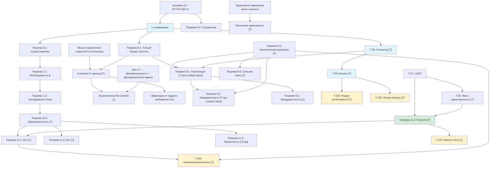

# Фундаментальные Теоремы

> *«Математика — это язык, на котором Бог написал Вселенную.»*
> — Галилео Галилей

:::info Мост из предыдущей главы
В [предыдущей главе](./definitions) мы определили все ключевые понятия КК: Голоном, шесть мер ($P$, $S_{vN}$, $\Phi$, $D_{\text{diff}}$, $R$, $C$), E-когерентность, тензор напряжений, иерархию интериорности и сенсомоторные функторы. Это были «кирпичи». Теперь настало время строить из них **здание** — систему теорем, в которой каждый результат логически следует из предыдущих, а все вместе образуют замкнутую дедуктивную цепь от [аксиом](./axiomatics) до самых глубоких выводов о природе жизни и сознания.
:::

:::tip Дорожная карта главы
В этой главе мы:
1. **Докажем существование динамики** — Теорема 6.1: уравнение эволюции имеет решение (раздел «Теоремы существования»)
2. **Покажем необходимость самореференции** — Теоремы 7.1-7.2: жизнеспособность требует самомодели $\varphi$, итерации сходятся к $\Gamma^*$ (раздел «Теоремы о самореференции»)
3. **Выведем условное E-требование** — Теорема 8.1: точный стационарный баланс чистоты и ограничения скоростей / источников (раздел «Теорема о невозможности зомби»)
4. **Исследуем композицию** — Теоремы 9.1-9.3: фрактальное замыкание, масштабная инвариантность и то, когда связь коррелирует части (раздел «Теоремы о композиции»)
5. **Выведем единый критерий жизнеспособности** — Теорема 10.1: $\|\sigma_{\mathrm{sys}}\|_\infty < 1$ (раздел «Унифицированное условие жизнеспособности»)
6. **Опишем сенсомоторный цикл** — Теоремы 11.1-11.4: кодирование, действие, полнота, гедоника (раздел «Сенсомоторное кодирование»)
7. **Рассмотрим аттракторы и структуру** — T-96, T-98, Фано-единственность (разделы «Теоремы аттракторов», «Фано-единственность»)
:::

Зачем нужна глава с теоремами? Ведь мы уже знаем [аксиомы](./axiomatics) и [определения](./definitions). Но аксиомы — это фундамент здания, а определения — кирпичи. Теоремы — это **само здание**: логические цепочки, которые связывают фундамент с крышей и показывают, что конструкция не рухнет.

Эта глава рассказывает историю. Она начинается с вопроса «а существует ли вообще динамика?» (Теорема 6.1), проходит через открытие того, что любая живая система **обязана** наблюдать себя (Теорема 7.1), выводит условную динамическую область предложения No-Zombie (Теорема 8.1), и завершается вопросом, когда взаимодействие частей порождает нечто **новое** — совместное состояние, которое части не определяют (Теорема 9.3: не при всякой связи, а когда у связи есть коррелирующая часть).

Каждая теорема — не изолированный факт, а звено в единой дедуктивной цепи. Читайте последовательно — и вы увидите, как из пяти аксиом вырастает целая наука о жизни, сознании и самоорганизации.

:::info Уровни формализации
Каждый результат помечен одним из статусов (полная система — см. [Реестр статусов](/docs/reference/status-registry)):
- **[Т]** Теорема — строго доказано из аксиом УГМ
- **[С]** Условная — условно на явном допущении
- **[Г]** Гипотеза — математически сформулировано, требует доказательства или непертурбативного вычисления
- **[И]** Интерпретация — семантический мост, формально открыт
- **[О]** Определение по соглашению — конвенция
- **[Пр]** Программа — направление исследований, открытая проблема
:::

:::note О нотации
В этом документе:
- $\Gamma$ — [матрица когерентности](/docs/core/dynamics/coherence-matrix)
- $\mathcal{V}$ — [область жизнеспособности](/docs/core/dynamics/viability): $\mathcal{V} = \{\Gamma : P(\Gamma) > 2/7\}$
- $P$ — [чистота](/docs/core/dynamics/viability#определение-чистоты): $P = \mathrm{Tr}(\Gamma^2)$
- $P_{\text{crit}} = 2/7$ — [теорема о критической чистоте](/docs/proofs/dynamics/theorem-purity-critical)
- $\varphi$ — [оператор самомоделирования](/docs/proofs/categorical/formalization-phi) (CPTP-канал)
- $R$ — [мера рефлексии](/docs/consciousness/foundations/self-observation#мера-рефлексии-r), порог $R_{\text{th}} = 1/3$
- $\Phi$ — [мера интеграции](/docs/core/structure/dimension-u#мера-интеграции-φ), порог $\Phi_{\text{th}} = 1$
- $C$ — [мера сознательности](/docs/consciousness/foundations/self-observation#мера-сознательности-c)
- $\kappa_0$ — выбранная регулярная кинетическая скорость с явными предпосылками.
- $\mathrm{Coh}_E$ — [E-когерентность](./definitions#e-когерентность)
- $\mathcal{R}[\Gamma, E]$ — [регенеративный член](/docs/core/dynamics/evolution#3-регенеративный-член)
:::

---

## Существование и сохранение состояний

### Теорема 6.1: корректность задачи Коши [Т при явных предпосылках] {#theorem-61-existence-of-dynamics}

Пусть $H$ эрмитов, $\mathcal L$ — конечномерный GKSL-генератор, $B(\rho)\in\mathcal D_7$ и $a(\rho)\ge0$. Предполагается локально липшицево продолжение поля

$$
F(\rho)=-i[H,\rho]+\mathcal L(\rho)+a(\rho)(B(\rho)-\rho)
$$

в окрестность пространства эрмитовых матриц следа один. Тогда задача Коши имеет единственное локальное решение. При сохранении $\mathcal D_7$ оно продолжается на все конечные положительные времена, поскольку пространство состояний компактно и поле ограничено на нём. Это теорема о непрерывной модели; она не гарантирует отсутствие NaN или точность произвольной дискретизации. Непрерывность коэффициентов без липшицевой регулярности сама по себе не даёт единственность.

### Теорема 6.2: сохранение матрицы плотности [Т] {#theorem-62-preservation-of-gamma-properties}

При предпосылках выше сохраняются эрмитовость и след. Для $v\in\ker\rho$ имеем $v^*(-i[H,\rho])v=0$, $v^*\mathcal L(\rho)v\ge0$ из CP-части GKSL и $v^*a(B-\rho)v=a v^*Bv\ge0$. Поэтому поле лежит в касательном конусе положительного конуса на границе. При указанной регулярности критерий инвариантности сохраняет $\mathcal D_7$; далее действует продолжение из 6.1. Сохранение положительности нелинейным законом не означает линейную полную положительность всего отображения.

## Самонаблюдение: пределы выводов

### Теорема 7.1: универсальная необходимость самомодели снята [✗] {#theorem-71-necessity-of-self-reference}

Из $P>2/7$ не следует наличие внутреннего информационного наблюдения. Поддерживаемое фиксированным входом стационарное состояние может оставаться в заданной области без зависящей от состояния обратной связи. Для чисто формального условия $\|\rho-\varphi(\rho)\|<\varepsilon$ тождественная карта подходит всегда; оно не доказывает, что система измеряет или знает себя. Содержательное утверждение требует закона наблюдений, доступного регистру сертификата и явно заданного класса управления. Прежние четыре шага не давали такого доказательства.

### Теорема 7.2: неподвижная точка выбранной модели [Т] {#теорема-72-условная-неподвижная-точка-рефлексии}

Для выбранного семейства $M_{\rm coh}(\rho)=(1-R(\rho))\mathcal P(\rho)+R(\rho)I/7$, где $R=1/(7P)$ и $\mathcal P$ сохраняет $I/7$ и не увеличивает HS-норму,

$$
\|M_{\rm coh}(\rho)-I/7\|_F\le\tfrac67\|\rho-I/7\|_F.
$$

Доказательство: вычесть $I/7$ и использовать $0\le1-R\le6/7$. Итерация даёт геометрическую сходимость и единственное неподвижное состояние $I/7$. Это оценка расстояния до указанного состояния, а не доказательство глобального сжатия расстояния между любыми двумя входами. Она не выводится из спектральной щели другого генератора и не распространяется на любую самомодель. Логический отражатель носителя остаётся отдельной конструкцией.

---

## Теорема No-Zombie: условное динамическое содержание

Вопрос состоит в том, нужна ли заданной диссипативной системе E-зависимая регенерация для поддержания объявленного класса жизнеспособности. Это требует предпосылок о скоростях и источниках и не следует из одной ненулевой диссипации. Отождествление E с интериорностью имеет статус **[P/I]**. Математическая зависимость от E сама по себе не опровергает философских зомби или эпифеноменализма.

### Теорема 8.1: баланс чистоты и условная E-граница [T при явных ограничениях] {#теорема-81-условная-необходимость-интериорности-no-zombie}

:::warning Отзыв прежнего универсального утверждения
Утверждение $\mathrm{Viable}\land\mathcal D_\Omega\ne0\Rightarrow\varphi=\varphi_{\mathrm{coh}}\land\mathrm{Coh}_E>1/7$ **отозвано [✗]**. Каноническая $\mathrm{Coh}_E$ лежит между нулём и единицей; $1/7$ — значение при $I/7$, а не универсальный минимум. Каноническая $\varphi_{\mathrm{coh}}$ с якорем $I/7$ не даёт положительной регенерации чистоты. Bootstrap-скорости и независимое внешнее питание могут поддерживать чистоту без универсальной E-границы. Точная замена — теорема баланса ниже.
:::

Рассмотрим заданную цель $\tau(\Gamma)$ со значениями в состояниях и динамику

$$
\dot\Gamma=-i[H,\Gamma]+\gamma(\mathcal P_{\mathrm{Fano}}\Gamma-\Gamma)
+\kappa(\Gamma)g_V(P)(\tau(\Gamma)-\Gamma)+\mathcal J_{\mathrm{ext}}(\Gamma).
$$

Обозначим $W=P_{\mathrm{coh}}=\sum_{i\ne j}|\gamma_{ij}|^2$, $h=\operatorname{Tr}(\Gamma\tau)-P$, $J_P=2\operatorname{Tr}(\Gamma\mathcal J_{\mathrm{ext}})$, $\kappa=\kappa_b+\kappa_0\mathrm{Coh}_E$. Точный баланс чистоты:

$$
\dot P=-\frac{4\gamma}{3}W+2(\kappa_b+\kappa_0\mathrm{Coh}_E)g_Vh+J_P.
$$

**Доказательство.** $\dot P=2\operatorname{Tr}(\Gamma\dot\Gamma)$; коммутатор не даёт следового вклада, канал Фано сохраняет диагональ и умножает внедиагональные элементы на $1/3$. Остальные слагаемые следуют подстановкой. Феноменальные отождествления не используются.

**Поточечная стационарная граница [T].** Если в стационарном состоянии $W>0$, $J_P=0$, $g_V>0$, $h>0$, $\kappa_0>0$, то

$$
\mathrm{Coh}_E=\frac1{\kappa_0}\left(\frac{2\gamma W}{3g_Vh}-\kappa_b\right).
$$

Необходимая неотрицательная нижняя граница использует положительную часть выражения. Величина зависит от состояния и может быть меньше $1/7$; без отдельного допущения нельзя вставлять $\max\{1/7,\ldots\}$. При $\kappa_0=0$ уравнение ограничивает bootstrap-скорость, но не даёт E-границы. Замена $P$ на $P_{\mathrm{crit}}$ или удаление ворот меняет уравнение и требует явного направления неравенства и предпосылки.

**Теорема равномерного исключения [T при явных ограничениях].** Пусть на объявленном стационарном классе жизнеспособности

$$
\gamma\ge\gamma_{\min}>0,\quad W\ge W_{\min}>0,\quad J_P\le J_{\max},\quad
0\le g_V\le g_{\max},\quad h\le h_{\max},\quad
0\le\kappa_b\le K_b,\quad0\le\kappa_0\le K_0,
$$

где $g_{\max},h_{\max},K_0>0$. Тогда каждое стационарное состояние класса удовлетворяет

$$
\mathrm{Coh}_E\ge c_{\min}:=\max\left\{0,\frac{4\gamma_{\min}W_{\min}/3-J_{\max}}{2K_0g_{\max}h_{\max}}-\frac{K_b}{K_0}\right\}.
$$

**Доказательство.** При стационарности диссипация не меньше $4\gamma_{\min}W_{\min}/3$, а положительные источники не больше $2(K_b+K_0\mathrm{Coh}_E)g_{\max}h_{\max}+J_{\max}$. Перегруппируем. При $c_{\min}>1/7$ в объявленном классе нет стационарных состояний с $\mathrm{Coh}_E\le1/7$. При $c_{\min}>1$ стационарных состояний вообще нет. Ограничения, включая положительный требуемый внедиагональный вес, содержательны; одно $\mathcal D_\Omega\ne0$ их не даёт.

### Каноническая самомодель: сохранения части когерентности недостаточно

При $\tau=\varphi_{\mathrm{coh}}\Gamma=(1-R)\mathcal D_\alpha\Gamma+RI/7$

$$
h=-R(P-1/7)-(1-R)\alpha W\le0.
$$

Такая модель не компенсирует положительную потерю чистоты Фано в уравнении без внешних источников. Неунитальный якорь, заостряющее отображение, гамильтоново взаимодействие со средой или внешнее питание меняют член усиления и должны быть указаны. Неудача диагонального замещающего канала не доказывает единственности или необходимости именно этой канонической модели.

Для **фиксированной цели и фиксированной эффективной скорости** $k=\kappa g_V$ диагональный гамильтониан даёт стационарный модуль пары

$$
|\gamma_{ij}^*|^2=\frac{k^2|\tau_{ij}|^2}{(d+k)^2+\Delta\omega_{ij}^2},\qquad d=2\gamma/3,
$$

и производную по $k$

$$
\frac{2k|\tau_{ij}|^2[d(d+k)+\Delta\omega_{ij}^2]}{[(d+k)^2+\Delta\omega_{ij}^2]^2}\ge0.
$$

Монотонность верна при замороженных указанных величинах. Это не универсальная производная эндогенного аттрактора по его собственной E-статистике. Для общей гладкой ветви равновесий чувствительность определяется полным якобианом, может менять знак и нарушаться в бифуркации.

### Контрпримеры к универсальной границе

Ненулевой генератор дефазировки может обнуляться на конкретном диагональном чистом состоянии с $\mathrm{Coh}_E=0$. Оно остаётся чистым без регенерации. Это опровергает вывод лишь из $P>2/7$ и $\mathcal D\ne0$; прохождение самостоятельных ворот интеграции не утверждается.

Более сильный воплощённый контрпример допускает ненулевые когерентности каждой пары. Выберем полноранговое состояние $\rho$ с $P>2/7$, $\mathrm{Coh}_E<1/7$ и обозначим через $F(\rho)$ его эрмитову бесследовую скорость заданной внутренней динамики. При

$$
\mu>\|F(\rho)\|_{\mathrm{op}}/\lambda_{\min}(\rho),\qquad\sigma:=\rho-F(\rho)/\mu,
$$

$\sigma$ — матрица плотности; добавление корректного внешнего питания $\mu(\sigma-\Gamma)$ делает $\rho$ точным равновесием. Это конструктивный контрпример к исключению таких состояний при **всех** внешних якорях. Устойчивость не гарантируется; для неё нужен полный якобиан.

Например, положим $p_E=0.01$, остальные населённости $(1-p_E)/6$, $v_i=\sqrt{p_i}$ и

$$
\rho=(1-r)\operatorname{diag}(p)+rvv^\dagger,\quad
r^2=\frac{0.35-\sum_ip_i^2}{1-\sum_ip_i^2}.
$$

Матрица полнорангова, каждая пара когерентно населена, $P=0.35$, $\Phi>1$, $\mathrm{Coh}_E<1/7$. Применима конструкция внешнего питания. Состояние не проходит **принятый прокси** $D^{7D}\ge2$: эти ворота сами по определению требуют $\mathrm{Coh}_E\ge1/6$. Исключение определением нельзя представлять как динамическую теорему No-Zombie или буквальный расчёт энтропии расширения.

### Минимальная модель объявленного балансового теста {#минимальная-модель-no-zombie}

Воспроизводимая модель **[D]** задаёт гамильтониан, диссипатор Фано, цель, bootstrap/E-зависимую скорость, ворота и независимые внешние источники. Частный случай без источников задаётся $\mathcal J_{\mathrm{ext}}=0$; канонический якорь $I/7$ и неунитальный источник — разные модели. Равномерная граница требует всех перечисленных неравенств на проверяемом классе.

### Контролируемый протокол симуляции {#протокол-симуляции-no-zombie}

1. Зафиксировать цель, среду, скорости, ворота, E-проекцию и определение поддерживаемой жизнеспособности до выборки состояний.
2. Проверить точный баланс чистоты и предпосылки равномерной границы; отличать стационарные состояния от конечного времени выживания.
3. Сравнить E-зависимую регенерацию с bootstrap-only и независимыми источниками. E-абляция должна сохранять положительность и учитывать диагональную E-населённость: удаление внедиагональных E-элементов обычно не обнуляет каноническую $\mathrm{Coh}_E$.
4. Сообщить зависимость от бассейна, собственные значения касательного якобиана и неопределённость параметрических границ. Не требовать одного аттрактора для всех случайных состояний бистабильной системы с воротами.
5. Контрпример, выполняющий **все** предпосылки, опровергает математическую границу. Симуляции проверяют выбранную реализацию; биологическая / феноменальная необходимость требует независимых измерений и объявленного моста.

Универсальная критическая степень $1/4$ и макроскопическая иерархия скоростей не предполагаются. При $P\le2/7$ модель без источников с Фано-диссипацией и нулевыми воротами имеет $\dot P\le0$; независимое питание меняет вывод.

### Следствие 8.1.1: явная причинная зависимость [T / I]

Для объявленного закона скорости с $\kappa_0>0$ при фиксированных остальных входах $\partial\kappa/\partial\mathrm{Coh}_E=\kappa_0$. Там, где разность цели и состояния и ворота ненулевые, изменение этого входа меняет генератор. Феноменальное отождествление причинного входа с опытом — **[P/I]**. Строгая монотонность каждой стационарной чистоты и опровержение любых форм эпифеноменализма автоматически не следуют.

### Следствие 8.1.2: область No-Zombie [C / I]

При равномерной границе $c_{\min}>1/7$ объявленный стационарный класс исключает $\mathrm{Coh}_E\le1/7$ **[T при этих ограничениях]**. Интерпретация исключённых состояний как философских зомби дополнительно требует моста E → феноменальность **[P/I]** и эквивалентности функционального поведения для заданной задачи. Общей теоремы исключения всех функционально способных систем без феноменального опыта нет.

### Следствие 8.1.3: количественное E-требование [T при ограничениях]

Явная $c_{\min}$ выше — зависящее от модели стационарное ресурсное требование. Это не универсальный минимум опыта или клинический диагностический порог. При более сильном bootstrap или независимых источниках граница может обнулиться; при большей требуемой диссипации когерентности — вырасти. Эмпирическая интерпретация калибруется отдельно.

## Теоремы о композиции

Вернёмся к аналогии с оркестром. До сих пор мы изучали *одного* музыканта (один голоном). Теперь представьте, что два оркестра решили играть вместе. Первый вопрос: будет ли совместное звучание осмысленным? Второй: появится ли в нём что-то, чего не было ни в одном из оркестров по отдельности?

Теоремы 9.1–9.6 — это ответ. 9.1 и 9.2 сначала были доказаны при допущениях — (HOL), что совместная система сама есть голоном, и (AGG), согласованное агрегирование и слабая связь; Теорема 9.5 фиксирует агрегирование (оно единственно) и доказывает для слабой связи то, что обе принимали, а Теорема 9.6 показывает, что связь обязана быть слабой. 9.3 говорит, когда совместная игра **порождает новое качество** — совместное состояние с информацией, которой нет ни у одного оркестра, — и показывает, что не при всякой связи. (Прежде: «да, совместная игра … порождает новое качество. … Целое — больше суммы частей. И это не метафора, а теорема»; исправлено 2026-09-25 вместе с отзывом в теореме 9.3.)

### Теорема 9.1: условное сохранение при слабой связи {#теорема-91-фрактальное-замыкание}

Пусть фиксированы линейные локальные GKSL-генераторы с единственными стационарными состояниями $\rho_i^0$ и обратимыми ограничениями $\mathcal L_i|_{\mathrm{Tr}=0}$. Для стационарного совместного состояния генератора $\mathcal L_1\otimes\mathrm{id}+\mathrm{id}\otimes\mathcal L_2+g\mathcal L_{\mathrm{int}}$ частичный след даёт

$$
\mathcal L_i(\rho_i^g-\rho_i^0)=-g\operatorname{Tr}_j\mathcal L_{\mathrm{int}}(\rho_{12}^g).
$$

Отсюда $\|\rho_i^g-\rho_i^0\|_F\le |g|\|\mathcal L_i^{-1}\|\|\operatorname{Tr}_j\mathcal L_{\mathrm{int}}\|_{F\to F}$, поскольку $\|\rho_{12}^g\|_F\le1$. Если удвоенная граница меньше $P(\rho_i^0)-2/7$, обе маргинали сохраняют структурное большинство [T при этих предпосылках]. Совместная размерность равна49; семимерную агрегацию нужно задать отдельно.

Прежнее доказательство через универсальную трихотомию T-57, необходимость c>0 и покрытие пар T-41b отозвано [✗]. Линейная примитивность не влечёт когерентный или живой нелинейный аттрактор. Перенос на нелинейную обратную связь и отождествление любого организма/общества с холоном требуют дополнительных предпосылок. Точный результат об агрегации маргиналей ниже сохранён.

### Теорема 9.2 / T-72 (Масштабная инвариантность, КК-6) [Т при слабой связи] {#теорема-92-масштабная-инвариантность}

:::tip Статус поднят 2026-09-25: с «условно при (AGG)» до [Т при слабой связи]
Теорема — импликация, (AGG) ⇒ оценки, и импликация доказана; условным было её применение к голономам. [Теорема 9.5](#теорема-95-каноническая-агрегация) доказывает (AGG) для слабо связанных воплощённых голономов. Часть (a) допущения (AGG) выполнена для канонического агрегирования $\mathcal{M}_k$, единственного перестановочно-инвариантного согласованного; часть (b) нужна лишь для маргиналей — форма (b′) ниже, поскольку агрегат ни от чего другого не зависит, — и выполнена с $\delta = O(g)$ в стационарном состоянии (Следствие 9.2a), вдоль всякой траектории из компактной части бассейна (Теорема 9.5 (f)) и из всякого начального состояния с явными константами при доминировании хребта (Теорема 9.5 (e)). При сильной связи перенос не проходит: канонический агрегат двух жизнеспособных голономов может быть $I/7$ ([Теорема 9.6](#теорема-96-сильная-связь)).
:::

:::warning Эррата 2026-09-25: статус исправлен с [Т] на [С при (AGG)]
Прежняя формулировка утверждала, что **любое** CPTP-агрегирование сохраняет $P$, $R$, $\Phi$, Gap-профиль и L-уровень с точностью до $O(\varepsilon_0)$, $\varepsilon_0 \approx 0{,}023$. Это утверждение отозвано: доказательство его не несло.
- **Контрактивность — не сохранение.** Полностью деполяризующий канал $\Lambda(\rho) = \mathrm{Tr}(\rho)\, I/7$ является CPTP и контрактивен по метрике Бюреса, но переводит любое состояние в $I/7$: $P = 1/7 < 2/7$ и $\Phi = 0$. Даже частичный след переводит максимально запутанную пару голономов в $I/7$. Контрактивность ограничивает расстояние между двумя *образами*; о расстоянии между образом и составляющей она ничего не говорит, пока их не связывает что-то ещё, — это допущение (AGG) ниже.
- **Шаг 3** («все структурные инварианты — $G_2$-инварианты», T-42a) отозван: $P$ и $R$ — унитарные инварианты, но $\Phi$ и Gap-профиль закреплены репером — явный $g \in G_2$ переводит $\Phi$ из $0$ в $1$ ([жёсткость репера](/docs/proofs/categorical/uniqueness-theorem#жёсткость-репера); регрессионный тест `test_phi_not_g2_invariant`). Шагу нужна была лишь непрерывность, а она есть.
- **Шаг 5** ($|P(\Gamma^{(k)}) - P(\Gamma^{(1)})| \leq \|\Phi_k\|_{\mathrm{cb}}\,\varepsilon_{\mathrm{coupling}} \leq \varepsilon_0$) отозван: неравенство было заявлено, а не выведено. Для CPTP-отображения $\|\Phi_k\|_{\mathrm{cb}} = 1$, так что неравенство лишь переименовывало неизвестное отклонение; а $0{,}023$ — взвешенное среднее секторных когерентностей Gap-вакуума внутри одного голонома ([секторная иерархия](/docs/core/dynamics/gap-thermodynamics#теорема-секторная-иерархия-ε)), а не связь между голономами.
- **Шаги 1 и 4**: шаг 1 ссылался на Морита-эквивалентность T-58, отозванную 2026-09-10 (к тому же она касалась 7D↔42D, а не $7^k \to 7$); шаг 4 выводил $R \geq 1/3$ «из примитивности», но $R \geq 1/3$ означает $P \leq 3/7$ — верхнюю границу, которой примитивность не даёт; у фразы «L-уровень сохранён или повышен» довода не было.
:::

:::note На пальцах
Вспомните матрёшку: маленькая матрёшка похожа на большую, а та — на ещё большую. Теорема 9.2 говорит, когда голоном, составленный из голономов, сохраняет структурные свойства своих частей (чистоту, рефлексию, интеграцию): когда части связаны лишь слабо, а агрегирование, применённое к несвязанным частям, возвращает состояние части. Тогда каждый ключевой инвариант целого отстоит от того же инварианта части не дальше явной границы, пропорциональной силе связи. При сильной связи ничего подобного нет: два максимально запутанных голонома, агрегированные частичным следом, дают мёртвое состояние $I/7$.

Для физика: это аналог ренормгрупповой инвариантности — свойства теории поля не зависят от масштаба наблюдения (с точностью до бегущих констант связи). Здесь роль бегущей константы играет связь $\delta$ между частями: поправки имеют порядок $\delta$ и малы лишь тогда, когда мала $\delta$.

Для биолога: одни и те же принципы гомеостаза могут работать на уровне клетки, органа и организма там, где части связаны слабо; теорема не утверждает, что они обязаны там работать.

**Связь:** [сечение–ретракция T-58′](/docs/core/structure/dimension-e#теорема-морита-эквивалентность), [жёсткость репера](/docs/proofs/categorical/uniqueness-theorem#жёсткость-репера), [робастность порогов T-124d](/docs/proofs/consciousness/conscious-window#t-124d)
:::

:::tip Формулировка [Т]
Пусть $k$ одинаковых голономов находятся в состоянии $\sigma \in \mathcal{D}(\mathbb{C}^7)$, $\rho_k \in \mathcal{D}(\mathbb{C}^{7^k})$ — состояние связанной совокупности, а агрегирование — CPTP-канал $\Phi_k: \mathcal{D}(\mathbb{C}^{7^k}) \to \mathcal{D}(\mathbb{C}^7)$. Допустим

**(AGG)** (a) *согласованность*: $\Phi_k(\sigma^{\otimes k}) = \sigma$ — агрегирование несвязанных копий возвращает составляющую (подходят и частичный след, и среднее маргиналов отдельных копий; среднее маргиналей $\mathcal{M}_k$ — единственный перестановочно-инвариантный выбор, [Теорема 9.5](#теорема-95-каноническая-агрегация) (a)); (b) *слабая связь*: $d_B(\rho_k, \sigma^{\otimes k}) \leq \delta$ — или, при $\Phi_k = \mathcal{M}_k$, лишь (b′) $\max_i \tfrac12\lVert (\rho_k)_i - \sigma \rVert_1 \leq \delta$ на маргиналях отдельных копий, что следует из (b).

Тогда агрегат $\Gamma^{(k)} := \Phi_k(\rho_k)$ удовлетворяет $d_B(\Gamma^{(k)}, \sigma) \leq \delta$ (при (b)) и $\|\Gamma^{(k)} - \sigma\|_F \leq 2\delta$ (при (b) или (b′)), и при $\Delta_P := |P(\Gamma^{(k)}) - P(\sigma)|$:

- $\Delta_P \leq 4\delta\sqrt{P(\sigma)} + 4\delta^2$ и $|R(\Gamma^{(k)}) - R(\sigma)| \leq 7\Delta_P$;
- $|\Phi(\Gamma^{(k)}) - \Phi(\sigma)| \leq 7\Delta_P + 196\,P(\sigma)\,\delta$ — грубая глобальная оценка; чувствительность первого порядка даёт [T-124d](/docs/proofs/consciousness/conscious-window#t-124d);
- $|\mathrm{Gap}_{\Gamma^{(k)}}(i,j) - \mathrm{Gap}_{\sigma}(i,j)| \leq \pi\delta/|\sigma_{ij}|$ всякий раз, когда $2\delta < |\sigma_{ij}|$;
- каждое условие L2 — $P > 2/7$, $R \geq 1/3$, $\Phi \geq 1$ — сохраняет истинностное значение, если $\sigma$ проходит порог с запасом больше соответствующего отклонения.

$\Phi$ и Gap сравниваются в фиксированном репере: они закреплены репером, а не $G_2$-инвариантны. Для L-уровня в целом, куда входят ещё $D_{\mathrm{diff}}$ и, на L3, $R^{(2)}$, оценка не заявляется.
:::

**Доказательство (5 шагов).**

**Шаг 1 (Контрактивность несёт вывод благодаря (AGG a)).** Фиделити не убывает под CPTP-отображениями, поэтому расстояние Бюреса не растёт (стандартный результат):

$$
d_{\mathrm{Bures}}(\Phi_k(\rho), \Phi_k(\rho')) \leq d_{\mathrm{Bures}}(\rho, \rho')
$$

При $\rho = \rho_k$, $\rho' = \sigma^{\otimes k}$ и (AGG a): $d_B(\Gamma^{(k)}, \sigma) \leq d_B(\rho_k, \sigma^{\otimes k}) \leq \delta$. Без (a) второй образ — не $\sigma$, и о $\sigma$ ничего не следует; именно здесь ломалось прежнее доказательство.

**Шаг 2 (От Бюреса к следовой норме и норме Фробениуса).** При $d_B^2 = 2(1 - \sqrt{F})$ имеем $1 - F = d_B^2 - d_B^4/4 \leq d_B^2$, и неравенство Фукса–ван де Граафа $\tfrac12\|\rho - \rho'\|_1 \leq \sqrt{1 - F}$ (arXiv:quant-ph/9712042) даёт $\tfrac12\|\Gamma^{(k)} - \sigma\|_1 \leq \delta$. При (b′) и $\Phi_k = \mathcal{M}_k$ та же оценка следует из выпуклости следовой нормы: $\tfrac12\lVert \mathcal{M}_k(\rho_k) - \sigma \rVert_1 \leq \max_i \tfrac12\lVert (\rho_k)_i - \sigma \rVert_1$; а (b) влечёт (b′), потому что частичный след не увеличивает следовое расстояние. Поскольку $\|X\|_F \leq \|X\|_1$, отклонение $X := \Gamma^{(k)} - \sigma$ удовлетворяет $\|X\|_F \leq 2\delta$. Шаги 3–5 ничем другим не пользуются.

**Шаг 3 (Чистота и рефлексия).** $P(\sigma + X) - P(\sigma) = 2\,\mathrm{Tr}(\sigma X) + \mathrm{Tr}(X^2)$, поэтому по Коши–Шварцу $\Delta_P \leq 2\|\sigma\|_F\|X\|_F + \|X\|_F^2 \leq 4\delta\sqrt{P(\sigma)} + 4\delta^2$ (оценка 1 из T-124d). Для $R = 1/(7P)$: $|\Delta R| = \Delta_P/(7PP') \leq 7\Delta_P$, поскольку $P, P' \geq 1/7$.

**Шаг 4 (Интеграция и Gap — в фиксированном репере).** Запишем $\Phi = P/D - 1$, где $D = \sum_i \gamma_{ii}^2 \geq 1/7$ (Коши–Шварц, так как $\sum_i \gamma_{ii} = 1$). Тогда $|\Delta\Phi| \leq \Delta_P/D' + P\,|\Delta D|/(DD') \leq 7\Delta_P + 49\,P(\sigma)\,|\Delta D|$ и $|\Delta D| \leq (\sqrt{D} + \sqrt{D'})\,\|X\|_F \leq 4\delta$. Для $\mathrm{Gap}(i,j) = |\sin(\arg\gamma_{ij})|$: если $|X_{ij}| < |\sigma_{ij}|$, фаза $\sigma_{ij} + X_{ij}$ отличается от фазы $\sigma_{ij}$ не более чем на $\arcsin(|X_{ij}|/|\sigma_{ij}|) \leq \tfrac{\pi}{2}|X_{ij}|/|\sigma_{ij}|$, а $|\sin|$ 1-липшицева; при $|X_{ij}| \leq \|X\|_F \leq 2\delta$ это и есть заявленная оценка. Сравнение осмысленно, потому что (AGG a) — матричное тождество в одном репере; $G_2$-поворот любого из двух состояний изменил бы $\Phi$ и Gap.

**Шаг 5 (Пороги).** Если $P(\sigma) - 2/7$ больше оценки для $\Delta_P$, то и $P(\Gamma^{(k)}) > 2/7$; так же для $R \geq 1/3$ и $\Phi \geq 1$. Состояние, лежащее от порога ближе отклонения, может пересечь его в любую сторону. $\blacksquare$

:::tip Следствие 9.2a ((AGG) в стационарном состоянии слабо связанных голономов) [Т]
Пусть $k$ одинаковых воплощённых голономов с якорем вне нулевого множества [Теоремы 9.4](#теорема-94-генеричность-nd) связаны членом $-ig\,H_{\mathrm{int}}$, а агрегация — частичный след на один голоном или среднее одночастичных маргиналов. При малых $|g|$ стационарное состояние $\rho_k = X(g)$ вблизи $\sigma^{\otimes k}$ удовлетворяет (AGG): (a) выполняется по выбору агрегации, (b) — по следовой норме с $\delta = \tfrac12\lVert X(g) - \sigma^{\otimes k}\rVert_1 = O(g)$. Поэтому выводы Теоремы 9.2 верны в стационарном состоянии с отклонениями $O(g)$.
:::

*Доказательство.* Ветвь $X(g)$ и её производная — те же, что в Следствии 9.1a, теперь для $k$ сомножителей. Обе агрегации — CPTP-отображения, возвращающие $\sigma$ на $\sigma^{\otimes k}$, поэтому $\tfrac12\lVert\Gamma^{(k)} - \sigma\rVert_1 \leq \delta$; шаги 2–5 Теоремы 9.2 используют только эту оценку, $\lVert\Gamma^{(k)} - \sigma\rVert_F \leq 2\delta$. $\blacksquare$ Свидетель (`test_non_degeneracy_is_generic_and_aggregation_follows_from_weak_coupling`): два одинаковых воплощённых голонома с общей связью $X \otimes Y$ единичной нормы; $\lVert X(g) - \sigma \otimes \sigma\rVert_1 / g = 0{,}13421$ при $g = 0{,}01$ и $0{,}13419$ при $g = 0{,}02$.

**Что не требует (AGG).** Если агрегат сам является голономом — допущение (HOL) [теоремы 9.1](#теорема-91-фрактальное-замыкание), — эта теорема даёт ему собственный нетривиальный аттрактор, $P(\rho_*^{(k)}) > 1/7$ ([T-96](/docs/core/dynamics/evolution#теорема-нетривиальность-аттрактора) [Т]). Это утверждение о собственной динамике агрегата, а не о том, как его инварианты соотносятся с инвариантами частей.

:::info Следствие (Фрактальная структура) [Т при слабой связи]
Масштабная инвариантность и фрактальное замыкание, обе доказанные для слабой связи через каноническую агрегацию ([Теорема 9.5](#теорема-95-каноническая-агрегация)), дают УГМ фрактальную структуру на каждом масштабе, где составляющие воплощены, жизнеспособны и связаны слабо, $|g|\,s(H_{\mathrm{int}}) < \varepsilon_V$: канонический агрегат жизнеспособен, а его инварианты лежат в пределах $O(g)$ от инвариантов части. Наследуется состояние частей, а не нечто новое: канонический агрегат зависит только от маргиналей. При сильной связи ничего подобного может не быть — агрегат двух жизнеспособных голономов может быть $I/7$ ([Теорема 9.6](#теорема-96-сильная-связь)); композит, принятый голономом в смысле (HOL), по-прежнему имеет собственный аттрактор. (Прежде: «нетривиальность [Т], жизнеспособность [Т для воплощённых]» без (HOL), исправлено 2026-09-25 на «[С при (AGG) и (HOL)]»; поднято в тот же день вместе с Теоремой 9.5.)
:::

---

Фрактальное замыкание и масштабная инвариантность говорят о том, что композит наследует. Следующий вопрос — что он приобретает: когда связь делает совместное состояние двух голономов носителем информации, которой нет в их отдельных состояниях, — взаимной информации $I > 0$? Прежний ответ «всегда, раз они взаимодействуют» ложен; верный ответ — критерий на связь.

#### Теорема 9.3 (КК-7: Эмерджентность) [Т при почти любом якоре] {#теорема-93-эмерджентность}

<!-- preserve old anchor for backward compatibility -->

:::warning Отозвано (2026-09-25): «у взаимодействующих голономов стационарное состояние всегда коррелировано» [✗]
Прежняя формулировка: для двух взаимодействующих жизнеспособных голономов с ненулевой межсистемной когерентностью $|\gamma_{12}| > 0$ стационарное состояние композита имеет $I(\mathbb{H}_1 : \mathbb{H}_2) > 0$; статус [Т]. Она ложна, и два шага её доказательства не проходят.
- **Шаг 2** утверждал $\mathcal{L}_{\mathrm{int}}(\rho_*^{(1)} \otimes \rho_*^{(2)}) \neq 0$ всякий раз, когда $\mathcal{L}_{\mathrm{int}} \neq 0$. Гамильтонова связь $-i[H_{\mathrm{int}}, \cdot]$ обращается в нуль на произведении, если $H_{\mathrm{int}}$ с ним коммутирует. Контрпример: $H_{\mathrm{int}} \propto (\rho_*^{(1)} - I/7) \otimes (\rho_*^{(2)} - I/7)$ нелокален (частичный след по любому фактору равен нулю), ненулевой и коммутирует с $\rho_*^{(1)} \otimes \rho_*^{(2)}$, так что произведение остаётся стационарным и $I = 0$ (числа — в части (i) ниже).
- **Шаг 3** выводил $I > 0$ из $\rho_*^{(12)} \neq \rho_*^{(1)} \otimes \rho_*^{(2)}$. Взаимная информация положительна ровно тогда, когда состояние не есть произведение *никаких* двух состояний; отличия от одного конкретного произведения мало. Локальная связь $H_A \otimes I$ уводит стационарное состояние с $\rho_*^{(1)} \otimes \rho_*^{(2)}$ на другое произведение $\sigma_1 \otimes \rho_*^{(2)}$ — снова с $I = 0$ (часть (ii)).
- Условие $|\gamma_{12}| > 0$ не было определено: у состояния на $\mathbb{C}^7 \otimes \mathbb{C}^7$ нет одной «межсистемной когерентности» $\gamma_{12}$, а в прочтении «у стационарного состояния есть когерентности между системами» оно предполагает то, что требуется доказать.

Следствие «КК-7 (Эмерджентность)» под теоремой 9.1 ссылалось на это доказательство и снято вместе с ним. Взамен ниже — два точных факта, верных для всякой связи, и критерий слабой связи при названном допущении. Регрессионный тест: `test_coupled_holons_can_have_a_product_stationary_state` в `website/scripts/check_core_numbers.py` (аудит A-82).
:::

:::note Простыми словами
Два маятника, подвешенные к одной балке, раскачиваются в такт, потому что балка передаёт движение от одного к другому; два маятника, связь между которыми действует лишь на то, что каждый и так делает, остаются независимыми, как бы сильна ни была связь. Теорема 9.3 говорит, какого рода связь между двумя голономами. Целое приобретает информацию, которой нет в частях, — взаимную информацию $I > 0$, — ровно тогда, когда у связи есть *коррелирующая часть* в стационарных состояниях частей; связь, коммутирующая с этими состояниями или действующая на один голоном, оставляет пару некоррелированной.

Для психолога: двое взаимодействующих людей от одного этого не становятся коррелированными; нужно, чтобы взаимодействие зависело от того, что делает каждый, совместно. Для физика: это знакомое утверждение, что слабое возмущение коррелирует две подсистемы в первом порядке только через ту часть $[H_{\mathrm{int}}, \rho_1 \otimes \rho_2]$, которая не сводится к сумме локальных членов.

**Связь:** [Квантовая взаимная информация](https://en.wikipedia.org/wiki/Quantum_mutual_information), [каноническое продолжение $\mathcal{R}$ на составные системы](/docs/core/dynamics/evolution#расширение-r-на-составные-системы)
:::

**Постановка.** У каждого голонома $i = 1, 2$ — генератор [эволюции](/docs/core/dynamics/evolution#полное-уравнение-движения) $\mathcal{L}_i[\Gamma] = -i[H_i, \Gamma] + \mathcal{D}_\Omega[\Gamma] + \kappa(\Gamma)\, g_V(P)\,(\varphi_{\mathrm{coh}}(\Gamma) - \Gamma) + \mu\,(\sigma_i - \Gamma)$, где последний член — подкачка к якорю $\sigma_i = \pi(\mathcal{B}(x))$ воплощённого голонома ([T-148](/docs/proofs/consciousness/substrate-closure#t-148)), $\mu > 0$. Если заморозить скаляры $\kappa$, $g_V$ и $k = 1 - R$ в состоянии $g$, получится линейный генератор $\mathcal{M}_i^{(g)}$ CPTP-полугруппы, и $\mathcal{L}_i[\Gamma] = \mathcal{M}_i^{(\Gamma)}(\Gamma)$. У композита — [каноническое продолжение](/docs/core/dynamics/evolution#расширение-r-на-составные-системы) плюс гамильтонова связь:

$$
\mathcal{L}^{(12)}[X] = (\mathcal{M}_1^{(X_1)} \otimes \mathrm{id})(X) + (\mathrm{id} \otimes \mathcal{M}_2^{(X_2)})(X) - i\,g\,[H_{\mathrm{int}}, X], \qquad X_1 = \mathrm{Tr}_2 X,\; X_2 = \mathrm{Tr}_1 X .
$$

Пусть $\mathcal{L}_i[\rho_*^{(i)}] = 0$, $\sigma := \rho_*^{(1)} \otimes \rho_*^{(2)}$, и пусть $\Pi_c^{(s_1 \otimes s_2)}(Y) := Y - \mathrm{Tr}_2 Y \otimes s_2 - s_1 \otimes \mathrm{Tr}_1 Y + \mathrm{Tr}(Y)\, s_1 \otimes s_2$ — проекция на корреляционную часть: она обращается в нуль ровно на операторах вида $a \otimes s_2 + s_1 \otimes b$.

**(ND)** *Невырожденность:* каждое $\rho_*^{(i)}$ — невырожденная неподвижная точка: якобиан $\mathcal{L}_i$ в $\rho_*^{(i)}$ обратим на бесследовых эрмитовых операторах, и $P(\rho_*^{(i)}) \notin \{2/7, 3/7\}$, так что шлюз $g_V$ там дифференцируем.

:::tip Теорема 9.3 (КК-7: Эмерджентность) [Т при почти любом якоре; прежде С при (ND)]
**(i) Точно, при любом $g$.** $\sigma$ — стационарное состояние связанного композита тогда и только тогда, когда $[H_{\mathrm{int}}, \sigma] = 0$. В этом случае у пары есть стационарное состояние с $I(\mathbb{H}_1 : \mathbb{H}_2) = 0$ при любой силе связи.

**(ii) Точно, при любом $g$.** Произведение $s_1 \otimes s_2$ стационарно тогда и только тогда, когда $\Pi_c^{(s_1 \otimes s_2)}\bigl([H_{\mathrm{int}}, s_1 \otimes s_2]\bigr) = 0$ и каждое $s_i$ стационарно для $\mathcal{L}_i - i g [H_i^{\mathrm{mf}}, \cdot\,]$ со средними полями $H_1^{\mathrm{mf}} = \mathrm{Tr}_2[(I \otimes s_2) H_{\mathrm{int}}]$, $H_2^{\mathrm{mf}} = \mathrm{Tr}_1[(s_1 \otimes I) H_{\mathrm{int}}]$. Стационарное состояние пары некоррелировано ровно тогда, когда оно — такое произведение; в частности, локальная связь $H_A \otimes I + I \otimes H_B$ пару никогда не коррелирует.

**(iii) Слабая связь, при (ND) — выполненном для любой пары якорей вне замкнутого множества меры нуль (Теорема 9.4).** При малых $|g|$ существует единственное стационарное состояние $X(g)$ вблизи $\sigma$, гладкое по $g$, и

$$
X(g) - X_1(g) \otimes X_2(g) = g\, C_1 + O(g^2), \qquad C_1 = \mathcal{J}_c^{-1}\, \Pi_c^{(\sigma)}\bigl(i[H_{\mathrm{int}}, \sigma]\bigr),
$$

где $\mathcal{J}_c = \mathcal{M}_1^{(\rho_*^{(1)})} \otimes \mathrm{id} + \mathrm{id} \otimes \mathcal{M}_2^{(\rho_*^{(2)})}$, суженный на корреляционное пространство; его спектр лежит в $\mathrm{Re}\,\lambda \leq -2\mu$. Поэтому если $\Pi_c^{(\sigma)}([H_{\mathrm{int}}, \sigma]) \neq 0$, то $I(X(g)) \geq \tfrac12 \lVert X(g) - X_1(g) \otimes X_2(g) \rVert_1^2 > 0$ при всех малых $g \neq 0$ и $I = \Theta(g^2)$; если $\Pi_c^{(\sigma)}([H_{\mathrm{int}}, \sigma]) = 0$, корреляция не более $O(g^2)$.
:::

**Доказательство.**

**Шаг 1 (Произведения).** Продолжение действует на произведение пофакторно: $(\mathcal{M} \otimes \mathrm{id})(a \otimes b) = \mathcal{M}(a) \otimes b$, а скаляры $\mathcal{M}_i^{(X_i)}$ читаются на маргиналях, которые у $s_1 \otimes s_2$ равны $s_1, s_2$. Поэтому

$$
\mathcal{L}^{(12)}[s_1 \otimes s_2] = \mathcal{L}_1[s_1] \otimes s_2 + s_1 \otimes \mathcal{L}_2[s_2] - i g\, [H_{\mathrm{int}}, s_1 \otimes s_2] .
$$

При $s_i = \rho_*^{(i)}$ первые два члена равны нулю — это (i). Для (ii): $\mathrm{Tr}_2 [H_{\mathrm{int}}, s_1 \otimes s_2] = [H_1^{\mathrm{mf}}, s_1]$ (цикличность частичного следа по второму фактору), и симметрично для $\mathrm{Tr}_1$, так что два частичных следа уравнения — это два уравнения среднего поля; $\Pi_c$ уничтожает локальные члены $\mathcal{L}_1[s_1] \otimes s_2$ и $s_1 \otimes \mathcal{L}_2[s_2]$, и остаётся $\Pi_c([H_{\mathrm{int}}, s_1 \otimes s_2]) = 0$. Три условия вместе равносильны уравнению, поскольку $Y = \Pi_c(Y) + \mathrm{Tr}_2 Y \otimes s_2 + s_1 \otimes \mathrm{Tr}_1 Y - \mathrm{Tr}(Y)\, s_1 \otimes s_2$. При $H_{\mathrm{int}} = H_A \otimes I + I \otimes H_B$ коммутатор с произведением локален, и его $\Pi_c$ равно нулю. Наконец, $I(X) = D(X \,\|\, X_1 \otimes X_2)$ обращается в нуль ровно на произведениях.

**Шаг 2 (Якобиан расщепляется).** Пусть $\mathcal{J}$ — якобиан $\mathcal{L}^{(12)}$ при $g = 0$ в точке $X = \sigma$ на бесследовых эрмитовых операторах. Вдоль локального направления $x \otimes \rho_*^{(2)}$ меняется только первая маргиналь, и $\mathcal{J}(x \otimes \rho_*^{(2)}) = (D\mathcal{L}_1\, x) \otimes \rho_*^{(2)} + x \otimes \mathcal{L}_2[\rho_*^{(2)}] = (D\mathcal{L}_1\, x) \otimes \rho_*^{(2)}$ — замороженный генератор второго фактора, применённый к его собственной неподвижной точке, даёт нуль. Вдоль корреляционного направления ($\mathrm{Tr}_1 Y = \mathrm{Tr}_2 Y = 0$) не меняется ни одна маргиналь, скаляры заморожены, и $\mathcal{J} Y = \mathcal{J}_c Y$ — снова с нулевыми частичными следами, поскольку $\mathcal{M}_i$ сохраняют след. Значит, $\mathcal{J}$ блочно-диагонален: на локальных блоках — якобианы двух голономов, на корреляционном — $\mathcal{J}_c$; и он коммутирует с $\Pi_c^{(\sigma)}$.

**Шаг 3 (Корреляционный блок обратим).** На бесследовых $Y$ член подкачки действует как $-\mu Y$ (замена $Y \mapsto \mathrm{Tr}(Y)\sigma_i$ его уничтожает), а остальная часть $\mathcal{M}_i$ порождает сохраняющую след CPTP-полугруппу, переводящую бесследовые операторы в бесследовые; поэтому $\lVert e^{t\mathcal{M}_i} Y \rVert_1 \leq e^{-\mu t} \lVert Y \rVert_1$, и спектр $\mathcal{M}_i$ на бесследовых операторах лежит в $\mathrm{Re}\,\lambda \leq -\mu$. Спектр $\mathcal{J}_c$ состоит из сумм $\lambda + \lambda'$ таких собственных значений: $\mathrm{Re} \leq -2\mu < 0$. Допущение здесь не нужно — его доставляет подкачка воплощённого голонома.

**Шаг 4 (Первый порядок).** При (ND) обратимы и локальные блоки, значит, и $\mathcal{J}$, и теорема о неявной функции даёт ветвь $X(g)$. Дифференцируя $\mathcal{L}^{(12)}[X(g)] = 0$ при $g = 0$: $\mathcal{J} X'(0) = i[H_{\mathrm{int}}, \sigma]$; применяя $\Pi_c^{(\sigma)}$, коммутирующую с $\mathcal{J}$, получаем $\Pi_c^{(\sigma)} X'(0) = C_1$. Поскольку $X - X_1 \otimes X_2 = \Pi_c^{(\sigma)}(X) - (X_1 - \rho_*^{(1)}) \otimes (X_2 - \rho_*^{(2)})$, корреляция равна $g C_1 + O(g^2)$, и $C_1 \neq 0$ ровно тогда, когда $\Pi_c^{(\sigma)}([H_{\mathrm{int}}, \sigma]) \neq 0$. Оценка на $I$ — квантовое неравенство Пинскера $D(\rho \,\|\, \tau) \geq \tfrac12 \lVert \rho - \tau \rVert_1^2$. $\blacksquare$

**Статус: [Т] при почти любом якоре (обновлено 2026-09-25; было [С при (ND)]).** Части (i) и (ii) не используют ничего, кроме вида генератора композита, и верны безусловно. Части (iii) нужно (ND), и [Теорема 9.4](#теорема-94-генеричность-nd) ниже доказывает его для любой пары якорей вне замкнутого множества лебеговой меры нуль. Нужно и само существование аттрактора. У воплощённого голонома стационарное состояние есть всегда: его поток переводит компактное выпуклое множество состояний в себя, так что у каждого отображения за время $t$ есть неподвижная точка (Брауэр), а предел таких точек при $t \to 0$ стационарен. У изолированного голонома с саморегистрирующей $\varphi_s$ при малом $H$ их семь, все невырожденные ([эволюция](/docs/core/dynamics/evolution#теорема-самоподдерживающийся-аттрактор)), и корреляционный блок там тоже обратим, с $\mathrm{Re} \leq -2\kappa g_V R$ вместо $-2\mu$ (член якоря действует на бесследовых операторах как $-\kappa g_V R$). Без якоря того или другого рода применять (iii) не к чему: у изолированного голонома с каноническим $\varphi_{\mathrm{coh}}$ (якорь $I/7$) других неподвижных точек, кроме $I/7$, нет, поскольку $\mathrm{Tr}(\Gamma \varphi_{\mathrm{coh}}(\Gamma)) \leq P - (P - 1/7)/(7P)$, и регенерация, и диссипация понижают $P$ (на 100 случайных состояниях левая часть минус правая не больше $-0{,}020$; двадцать чистых начальных состояний к $t = 60$ все приходят к $P = 0{,}14286$); аттрактор даёт якорь $\sigma_i$ воплощённого голонома ([T-148](/docs/proofs/consciousness/substrate-closure#t-148)).

**Численная проверка** (`test_coupled_holons_can_have_a_product_stationary_state`). Два воплощённых голонома с каноническими составляющими выше ($\alpha = 1/2$, $\mu = 1$, $\kappa = 1/7 + \mathrm{Coh}_E$, $g_V = \mathrm{clamp}(7P - 2, 0, 1)$, случайные $H_i$ масштаба $0{,}3$, якоря с весом чистой составляющей $0{,}85$ и $0{,}8$) имеют аттракторы с $P = 0{,}362$ и $0{,}303$ (невязка ниже $10^{-15}$). Все связи нормированы на операторную норму $0{,}3$.
- (i) $H_{\mathrm{int}} \propto (\rho_*^{(1)} - I/7) \otimes (\rho_*^{(2)} - I/7)$: $\lVert [H_{\mathrm{int}}, \sigma] \rVert_F = 1{,}7 \cdot 10^{-17}$. Из случайного состояния на $\mathbb{C}^{49}$ поток к $t = 24$ приходит в $\sigma$ с точностью $4{,}9 \cdot 10^{-16}$; $\lvert I \rvert < 10^{-15}$.
- (ii) $H_{\mathrm{int}} = H_A \otimes I$: $\lVert [H_{\mathrm{int}}, \sigma] \rVert_F = 0{,}052$; стационарное состояние отходит от $\sigma$ на $0{,}027$ и остаётся произведением с точностью $4 \cdot 10^{-16}$; $\lvert I \rvert < 10^{-15}$.
- Общая связь $X \otimes Y$: корреляция $\lVert X - X_1 \otimes X_2 \rVert_F = 0{,}013$, $I = 2{,}1 \cdot 10^{-3}$.
- (iii) В прогоне той же модели с $\kappa_0 = \omega_0 \lvert\gamma_{OE}\rvert \lvert\gamma_{OU}\rvert / \gamma_{OO}$: спектры якобианов одного голонома лежат в $\mathrm{Re}\,\lambda \leq -1{,}30$ и $-1{,}42$, так что (ND) для этой пары выполнено; при связи из (i) три случайных начальных состояния на $\mathbb{C}^{49}$ приходят в $\sigma$ с точностью $10^{-13}$; для общей $X \otimes Y$ единичной нормы при $g = 0{,}02$ и $0{,}04$ измеренная корреляция совпадает с $g C_1$ с относительной точностью $5{,}8 \cdot 10^{-3}$ и $1{,}16 \cdot 10^{-2}$ (погрешность линейна по $g$), а $I/g^2 = 0{,}02437$ в обоих случаях.

#### Теорема 9.4 (Невырожденность генерична) [Т] {#теорема-94-генеричность-nd}

:::tip Теорема 9.4 [Т]
Пусть голоном воплощён, с генератором $\mathcal{L}_\sigma[\Gamma] = -i[H,\Gamma] + \mathcal{D}_\Omega[\Gamma] + \kappa(\Gamma)\,g_V(P)\,(\varphi(\Gamma) - \Gamma) + \mu(\sigma - \Gamma)$, $\mu > 0$, гладкой $\kappa$, $\varphi = \varphi_{\mathrm{coh}}$ или $\varphi_s$ и невырожденным якорем $\sigma$. Существует замкнутое множество $N$ якорей лебеговой меры нуль такое, что при $\sigma \notin N$ каждое стационарное состояние $\mathcal{L}_\sigma$ невырождено и имеет $P \notin \{2/7, 3/7\}$. Его дополнение открыто и всюду плотно. Следовательно, (ND) выполнено для любой пары якорей вне $N \times N$.
:::

*Доказательство.* На открытом множестве $U$ эрмитовых матриц следа один с $P \notin \{2/7, 3/7\}$ отображение $F(\Gamma, \sigma) = \mathcal{L}_\sigma[\Gamma]$ гладко ($P \geq 1/7$ на эрмитовых матрицах следа один, так что $R$ и $\Gamma^2/P$ гладки) и принимает значения в бесследовых эрмитовых матрицах. Его производная по $\sigma$ равна $\mu$, умноженному на тождественное отображение бесследовых направлений, — это сюръекция; значит, $0$ — регулярное значение $F$ на $U \times \{\sigma \text{ невырождены}\}$. По параметрической теореме трансверсальности (V. Guillemin, A. Pollack, *Differential Topology*, Prentice-Hall 1974, гл. 2 §3) при почти любом $\sigma$ значение $0$ регулярно для $F(\cdot, \sigma)$ на $U$: каждый нуль там невырожден. На каждой поверхности излома $K_c = \{P = c\}$, $c \in \{2/7, 3/7\}$, возьмём одностороннее гладкое продолжение $g_V$ (на $K_c$ оно совпадает с $g_V$); его ограничение на $K_c$ — 47-мерное многообразие — снова субмерсия по $\sigma$, а трансверсальность нулю в 48-мерном пространстве означает отсутствие нулей, так что при почти любом $\sigma$ стационарных состояний на $K_c$ нет. Плохое множество $N$ замкнуто: предел якорей с вырожденным или лежащим на изломе стационарным состоянием имеет такое же, поскольку стационарные состояния лежат в компактном множестве состояний. У замкнутого множества меры нуль дополнение открыто и плотно. $\blacksquare$

Свидетель (`test_non_degeneracy_is_generic_and_aggregation_follows_from_weak_coupling`): 12 воплощённых голономов со случайными $H$ масштаба $0{,}3$ и случайными якорями с весом чистой составляющей $0{,}6$–$0{,}9$; у аттракторов $P$ от $0{,}226$ до $0{,}341$, не ближе $1{,}3 \cdot 10^{-3}$ к $2/7$ и $3/7$, и якобианы с $\min\lvert\mathrm{Re}\,\lambda\rvert$ от $1{,}19$ до $1{,}49$ — все невырождены.

**Что остаётся от «эмерджентности».** Коррелированное совместное состояние не определяется маргиналями, и $I = S(\rho_1) + S(\rho_2) - S(\rho_{12}) > 0$ — это информация, которую отбрасывают частичные следы: стандартное тождество, верное для любой коррелированной пары, связанные термостаты включительно. Теорема 9.3 говорит, когда динамика связанных голономов порождает такое состояние; она не говорит, что его порождает одно лишь взаимодействие.

:::info Связь с неполнотой Лоувера
Когда $I > 0$ — при критерии (iii), а не при всякой связи, — подсистема $\mathbb{H}_1$ не может восстановить совместное состояние по одному $\rho_1$ ([теорема о слоях наблюдения](/docs/applied/research/reconstruction-identifiability#fiber-theorem)). (Прежде: «поскольку $I > 0$» — для всякой взаимодействующей пары; исправлено 2026-09-25 вместе с отзывом выше.)
:::

#### Теорема 9.5 (Каноническая агрегация: жизнеспособность и инварианты переходят к агрегату при слабой связи) [Т при слабой связи] {#теорема-95-каноническая-агрегация}

Теоремам 9.1 и 9.2 недоставало двух вещей, которых в корпусе не было: отображения из состояний композита на $(\mathbb{C}^7)^{\otimes k}$ в $\mathcal{D}(\mathbb{C}^7)$ и причины, по которой образ *связанного* композита должен быть живым голономом. Теорема ниже даёт обе. Отображение не выбирается: оно единственное, что обращается с частями одинаково и возвращает состояние части, когда части не связаны. Что оно переводит связанные композиты в живые голономы, доказано для слабой связи, с явным порогом, а Теорема 9.6 показывает, что без порога нельзя.

:::note Простыми словами
Если каждый из $k$ музыкантов играет чисто и они лишь немного прислушиваются друг к другу, то ансамбль, услышанный как «один музыкант» — усреднением того, что играет каждый, — тоже чист; насколько он может уйти, задаёт сила связи, и прислушивание сдвигает каждого музыканта не больше чем на неё. Если же они сцепятся достаточно сильно, собственная партия каждого может раствориться в чистой гармонии с другими, и усреднённый «один музыкант» станет шумом, хотя ансамбль в целом упорядочен.
:::

**Постановка.** $k$ воплощённых голономов с генераторами $\mathcal{L}_i[\Gamma] = -i[H_i, \Gamma] + \mathcal{D}_\Omega[\Gamma] + \kappa_i(\Gamma)\,g_V(P)\,(\varphi_i(\Gamma) - \Gamma) + \mu_i(\sigma_i - \Gamma)$, $\mu_i > 0$, с любой целью регенерации $\varphi_i$ и любым $\kappa_i \geq 0$, и затвором $g_V(P) = \mathrm{clamp}\bigl((P - 2/7)/(3/7 - 2/7), 0, 1\bigr)$ из [эволюции](/docs/core/dynamics/evolution#полное-уравнение-движения), который обращается в нуль при $P \leq 2/7$. Композит на $(\mathbb{C}^7)^{\otimes k}$ несёт каноническое продолжение Теоремы 9.3 и связь: $\mathcal{L}^{(k)}[X] = \sum_i \mathcal{M}_i^{(X_i)}$, действующее на фактор $i$, минус $ig[H_{\mathrm{int}}, X]$, с маргиналями $X_i = \mathrm{Tr}_{\neq i} X$. Обозначим $s(H) = \lambda_{\max}(H) - \lambda_{\min}(H)$ размах эрмитова оператора и $\rho_{\mathrm{lin}}^{(i)}$ — стационарное состояние части без регенерации $\mathcal{L}_i^0 = -i[H_i, \cdot] + \mathcal{D}_\Omega + \mu_i(\sigma_i \mathrm{Tr} - \mathrm{id})$. Голоном $i$ назовём *жизнеспособным*, если у каждого стационарного состояния $\mathcal{L}_i$ $P > 2/7$.

:::tip Теорема 9.5 [Т при слабой связи]
**(a) Каноническая агрегация [Т].** Среди всех линейных отображений $A$ из операторов на $(\mathbb{C}^7)^{\otimes k}$ в операторы на $\mathbb{C}^7$, инвариантных относительно перестановок факторов и согласованных на несвязанных одинаковых копиях — $A(\sigma^{\otimes k}) = \sigma$ для всякого состояния $\sigma$, — есть ровно одно, среднее маргиналей

$$
\mathcal{M}_k(X) = \frac1k \sum_{i=1}^k \mathrm{Tr}_{\neq i}\, X .
$$

Оно CPTP, $U(7)$-ковариантно ($\mathcal{M}_k(U^{\otimes k} X U^{\dagger\otimes k}) = U \mathcal{M}_k(X) U^\dagger$, в частности $G_2$-ковариантно) и зависит от $X$ только через маргинали.

**(b) Точное уравнение маргинали [Т], при любом $g$.** Вдоль всякой траектории композита

$$
\frac{d X_i}{dt} = \mathcal{L}_i[X_i] - ig\,\mathrm{Tr}_{\neq i}[H_{\mathrm{int}}, X], \qquad \lVert \mathrm{Tr}_{\neq i}[H_{\mathrm{int}}, X] \rVert_1 \leq s(H_{\mathrm{int}}) .
$$

**(c) Жизнеспособность части — порог на её линейной части [Т].** Голоном $i$ жизнеспособен тогда и только тогда, когда $P(\rho_{\mathrm{lin}}^{(i)}) > 2/7$. В этом случае всякое состояние $\Gamma$ с $P(\Gamma) \leq 2/7$ имеет $\lVert \mathcal{L}_i[\Gamma] \rVert_1 \geq \varepsilon_V^{(i)} := \mu_i \bigl(P(\rho_{\mathrm{lin}}^{(i)}) - 2/7\bigr) / \bigl(2\sqrt{P(\rho_{\mathrm{lin}}^{(i)})}\bigr)$. Достаточное условие через якорь: $\mu_i\,(P(\sigma_i) - 2/7) > 2\sqrt{P(\sigma_i)}\,\lVert -i[H_i, \sigma_i] + \mathcal{D}_\Omega[\sigma_i] \rVert_1$.

**(d) У всякого стационарного композита части живы [Т].** Если каждая часть жизнеспособна и $|g|\,s(H_{\mathrm{int}}) < \min_i \varepsilon_V^{(i)}$, то у всякого стационарного состояния композита — хотя бы одно есть — $P(X_i) > 2/7$ при каждом $i$. Для одинаковых частей и перестановочно-симметричного стационарного состояния $\mathcal{M}_k(X) = X_1$ жизнеспособен. Ни (ND), ни (HOL) не используются.

**(e) Всякая траектория, с явными константами, при доминировании хребта [Т].** Если части одинаковы и $\mu > L_{\mathcal{R}}$ (режим [доминирования хребта](/docs/core/dynamics/evolution#теорема-единственность-нетривиального-аттрактора), дающий единственное стационарное состояние $\rho_*$), то для всякого начального состояния композита и всякого $t \geq 0$

$$
\lVert X_i(t) - \rho_* \rVert_1 \leq e^{-(\mu - L_{\mathcal{R}})t}\,\lVert X_i(0) - \rho_* \rVert_1 + \frac{|g|\,s(H_{\mathrm{int}})}{\mu - L_{\mathcal{R}}},
$$

так что $\tfrac12\lVert \mathcal{M}_k(X(t)) - \rho_* \rVert_1$ подчиняется той же оценке, делённой пополам.

**(f) Бассейн, в общем случае [Т].** Если части одинаковы и $\rho_*$ — невырожденное стационарное состояние $\mathcal{L}$ со спектром якобиана в $\mathrm{Re}\,\lambda < 0$ и бассейном притяжения $\mathfrak{B}$, то для всякого компакта $K \subset \mathfrak{B}$ найдутся $g_0, C, T > 0$ такие, что при $|g| < g_0$ всякая траектория композита с начальными маргиналями в $K$ удовлетворяет $\lVert X_i(t) - \rho_* \rVert_1 \leq C|g|$ при всех $t \geq T$.

**(g) (HOL) с точностью до вынуждающей силы величины $|g|\,s(H_{\mathrm{int}})$ [Т].** Для одинаковых частей, перестановочно-инвариантного $H_{\mathrm{int}}$ и перестановочно-инвариантного начального состояния агрегат $\Gamma(t) = \mathcal{M}_k(X(t))$ совпадает с $X_1(t)$ и подчиняется $\dot\Gamma = \mathcal{L}[\Gamma] + u(t)$, $\lVert u(t) \rVert_1 \leq |g|\,s(H_{\mathrm{int}})$: канонический агрегат — голоном того же рода, что и части, под ограниченной вынуждающей силой. При локальной связи $H_A \otimes I + I \otimes H_B$ произведение остаётся произведением, а вынуждающая сила — гамильтонов член среднего поля Теоремы 9.3 (ii): там (HOL) выполнено точно.
:::

**Доказательство.**

**(a)** На состояниях $A(\sigma^{\otimes k}) = \sigma = \sigma\,(\mathrm{Tr}\,\sigma)^{k-1}$. Обе части — однородные многочлены степени $k$ на вещественном пространстве эрмитовых матриц, совпадающие на открытом конусе положительно определённых, а значит всюду. Поляризация даёт для эрмитовых $a_1, \ldots, a_k$ и их симметризованного произведения $\mathrm{Sym}(a_1 \otimes \cdots \otimes a_k)$: $A(\mathrm{Sym}(a_1 \otimes \cdots \otimes a_k)) = \tfrac1k \sum_i a_i \prod_{j \neq i} \mathrm{Tr}\,a_j = \mathcal{M}_k(\mathrm{Sym}(a_1 \otimes \cdots \otimes a_k))$. Эти симметризованные произведения порождают перестановочно-инвариантные операторы, а и $A$, и $\mathcal{M}_k$ пропускаются через симметризацию $X \mapsto \tfrac1{k!}\sum_\pi U_\pi X U_\pi^\dagger$ ($A$ по условию, $\mathcal{M}_k$ потому, что перестановка факторов переставляет маргинали). Значит, $A = \mathcal{M}_k$. Частичные следы — CPTP, и $\mathrm{Tr}_{\neq i}(U^{\otimes k} X U^{\dagger\otimes k}) = U X_i U^\dagger$. Без перестановочной инвариантности единственности нет: каждый $\mathrm{Tr}_{\neq i}$ по отдельности согласован.

**(b)** $\mathcal{M}_j^{(X_j)}$ порождает сохраняющую след полугруппу, так что $\mathrm{Tr} \circ \mathcal{M}_j^{(X_j)} = 0$, и частичный след по фактору $j \neq i$ уничтожает $j$-й член; $i$-й член коммутирует со взятием следа по остальным факторам и даёт $\mathcal{M}_i^{(X_i)}(X_i) = \mathcal{L}_i[X_i]$. Для оценки: $[H, X] = [H - cI, X]$ при $c = (\lambda_{\max} + \lambda_{\min})/2$, так что $\lVert [H, X] \rVert_1 \leq 2\lVert H - cI \rVert_\infty \lVert X \rVert_1 = s(H)$, а частичный след следовую норму не увеличивает.

**(c)** При $P(\Gamma) \leq 2/7$ затвор закрыт и $\mathcal{L}_i[\Gamma] = \mathcal{L}_i^0[\Gamma]$. На бесследовых $Y$ член якоря сводится к $-\mu_i Y$, а $-i[H_i, \cdot] + \mathcal{D}_\Omega$ порождает сохраняющие след CP-отображения, которые следовую норму не увеличивают; поэтому $\lVert e^{t\mathcal{L}_i^0} Y \rVert_1 \leq e^{-\mu_i t}\lVert Y \rVert_1$, $\mathcal{L}_i^0$ обратим на бесследовых операторах с $\lVert (\mathcal{L}_i^0)^{-1} \rVert_{1 \to 1} \leq 1/\mu_i$, и у него ровно одно стационарное состояние $\rho_{\mathrm{lin}}$ — предел его потока. Если $P(\rho_{\mathrm{lin}}) \leq 2/7$, то $\mathcal{L}_i[\rho_{\mathrm{lin}}] = \mathcal{L}_i^0[\rho_{\mathrm{lin}}] = 0$: стационарное состояние, не являющееся жизнеспособным. Если $P(\rho_{\mathrm{lin}}) > 2/7$ и $P(\Gamma) \leq 2/7$, положим $Y = \Gamma - \rho_{\mathrm{lin}}$; тогда $\lVert \mathcal{L}_i[\Gamma] \rVert_1 = \lVert \mathcal{L}_i^0 Y \rVert_1 \geq \mu_i \lVert Y \rVert_1$ и $P(\rho_{\mathrm{lin}}) - 2/7 \leq P(\rho_{\mathrm{lin}}) - P(\Gamma) = -2\mathrm{Tr}(\rho_{\mathrm{lin}} Y) - \mathrm{Tr}\,Y^2 \leq 2\sqrt{P(\rho_{\mathrm{lin}})}\,\lVert Y \rVert_1$ — это и есть оценка; в частности, ни у одного стационарного состояния нет $P \leq 2/7$. Достаточное условие: $\mathcal{L}_i^0[\sigma_i] = -i[H_i, \sigma_i] + \mathcal{D}_\Omega[\sigma_i]$, так что $\lVert \rho_{\mathrm{lin}} - \sigma_i \rVert_1 \leq \lVert \mathcal{L}_i^0[\sigma_i] \rVert_1/\mu_i$, и то же неравенство для чистоты с $\sigma_i$ вместо $\rho_{\mathrm{lin}}$ даёт $P(\rho_{\mathrm{lin}}) > 2/7$.

**(d)** Стационарное состояние существует: поток композита переводит компактное выпуклое множество состояний в себя (замороженный, его генератор имеет вид ГКСЛ), так что у каждого отображения за время $t$ есть неподвижная точка (Брауэр), а предел таких точек при $t \to 0$ стационарен. В стационарном состоянии (b) даёт $\lVert \mathcal{L}_i[X_i] \rVert_1 \leq |g|\,s(H_{\mathrm{int}}) < \varepsilon_V^{(i)}$, и (c) исключает $P(X_i) \leq 2/7$.

**(e)** Положим $Y = X_i - \rho_*$ и разобьём $\mathcal{L} = \mathcal{A} + \mathcal{R}$, где $\mathcal{A} = -i[H, \cdot] + \mathcal{D}_\Omega + \mu(\sigma\,\mathrm{Tr} - \mathrm{id})$, а $\mathcal{R}$ — регенеративный член. По (b) $\dot Y = \mathcal{A}Y + (\mathcal{R}(X_i) - \mathcal{R}(\rho_*)) + u$ с $\lVert u \rVert_1 \leq |g|\,s(H_{\mathrm{int}})$, и $\lVert e^{t\mathcal{A}}Y \rVert_1 \leq e^{-\mu t}\lVert Y \rVert_1$, как в (c). Формула Дюамеля даёт $\lVert Y(t) \rVert_1 \leq e^{-\mu t}\lVert Y(0) \rVert_1 + \int_0^t e^{-\mu(t-s)}\bigl(L_{\mathcal{R}}\lVert Y(s) \rVert_1 + |g|\,s(H_{\mathrm{int}})\bigr)\,ds$, и неравенство Гронуолла для $e^{\mu t}\lVert Y(t) \rVert_1$ даёт оценку. Агрегат — среднее маргиналей, а следовая норма выпукла.

**(f)** Это устойчивость экспоненциально устойчивого равновесия к ограниченному неисчезающему возмущению (H. K. Khalil, *Nonlinear Systems*, 3rd ed., Prentice Hall 2002, §9.2), применённая к уравнению маргинали (b), чья вынуждающая сила ограничена $\varepsilon = |g|\,s(H_{\mathrm{int}})$, что бы ни делала остальная часть композита. Подробно: для якобиана $\mathcal{J}$ в $\rho_*$ на 48-мерном пространстве бесследовых эрмитовых матриц решим $\mathcal{J}^{\mathsf T} Q + Q\mathcal{J} = -I$ и положим $V(y) = \langle y, Q y \rangle$. Вблизи $\rho_*$ поле класса $C^1$ (невырожденность держит $P(\rho_*)$ вдали от изломов затвора), так что на шаре $\lVert y \rVert \leq r$ имеем $\dot V \leq -\tfrac12\lVert y \rVert^2 + 2\lVert Q \rVert\,\lVert y \rVert\,\varepsilon$: множество уровня $\Omega_c = \{V \leq c\}$ внутри шара положительно инвариантно при малом $\varepsilon$, и всякая траектория в нём оканчивается в $\lVert y \rVert \leq 4\lVert Q \rVert\,\varepsilon$ (нормы на конечномерном пространстве эквивалентны, отсюда $C$). Невозмущённый поток переносит компакт $K$ в $\Omega_{c/2}$ к общему времени $T$ (каждая точка попадает во внутренность в какое-то время, по непрерывности — и её окрестность; конечное число окрестностей покрывает $K$; $\Omega_{c/2}$ положительно инвариантно). Поле липшицево на компактном пространстве состояний с некоторой константой $\Lambda$, так что до времени $T$ возмущённая маргиналь остаётся в пределах $\varepsilon T e^{\Lambda T}$ от невозмущённой и при малом $\varepsilon$ в момент $T$ лежит в $\Omega_c$.

**(g)** Каноническое продолжение и перестановочно-инвариантный $H_{\mathrm{int}}$ коммутируют с перестановками факторов, так что перестановочно-инвариантное начальное состояние остаётся инвариантным, все маргинали совпадают и $\mathcal{M}_k(X) = X_1$; (b) и есть уравнение. При локальной связи коммутатор с произведением локален, поток сохраняет произведения, а частичный след члена связи равен $-ig[H_1^{\mathrm{mf}}, X_1]$. $\blacksquare$

**Численная проверка** (`test_viability_passes_to_the_aggregate_only_at_weak_coupling`, `test_canonical_aggregation_is_unique_and_the_octonion_product_is_dead`). (a): при $k = 2$ и размерности 3 линейные условия имеют полный ранг, 729 из 729 неизвестных, и решение совпадает со средним маргиналей до $10^{-13}$; без перестановочной инвариантности остаётся 324 свободных параметра. Воплощённый голоном Теоремы 9.3 ($\mu = 1$, якорь с чистым весом $0{,}8$) имеет $P(\rho_*) = 0{,}3115$ и $P(\rho_{\mathrm{lin}}) = 0{,}3223$, так что $\varepsilon_V = 0{,}03225$. Связанный с копией через $H_{\mathrm{int}}$, диагональный в базисе максимально запутанных векторов (размах $s = 1{,}8246$), он по (d) гарантированно сохраняет живые части при $g \leq 0{,}01768$; тождество маргинали (b) выполняется в стационарном состоянии до $10^{-15}$. Из максимально запутанного чистого старта и из старта-произведения маргинали композита с общей связью приходят на расстояние $0{,}0643\,g$ от $\rho_*$ при $g = 0{,}01$ и $0{,}02$ (f). При доминировании хребта ($\kappa = 0{,}1$, $\mu = 3{,}5$, $L_{\mathcal{R}} \leq 29\kappa$) оценка (e) выполняется во все отмеренные моменты из максимально запутанного старта; измеренное расстояние — не более $4{,}3\%$ от неё.

**Что это меняет.** Теорема 9.1 требовала «композит — голоном», Теорема 9.2 — «согласованное агрегирование и слабую связь». Часть (a) фиксирует агрегирование; части (d)–(f) доказывают, что агрегат слабо связанных жизнеспособных голономов жизнеспособен и лежит в пределах $O(g)$ от состояния части — в каждом стационарном состоянии, вдоль всякой траектории из компактной части бассейна и из всякого начального состояния с явными константами при доминировании хребта; часть (g) говорит, в каком смысле агрегат *есть* голоном. Две черты ограничивают то, что из этого можно вычитать. Канонический агрегат видит только маргинали и потому слеп к корреляциям, о которых говорит Теорема 9.3: он не может засвидетельствовать ничего, чего нет у частей ([коллективному сознанию](/docs/consciousness/subjects/collective-consciousness) нужно другое агрегирование, и теория его не фиксирует). И условие слабой связи снять нельзя:

#### Теорема 9.6 (Сильная связь убивает всякий маргинальный агрегат; октонионное произведение убивает всякую несвязанную пару) [Т] {#теорема-96-сильная-связь}

:::tip Теорема 9.6 [Т]
**(a)** Пусть $\{\Phi_n\}_{n=1}^{49}$ — ортонормированный базис $\mathbb{C}^7 \otimes \mathbb{C}^7$ из максимально запутанных векторов (например, $\Phi_{mn} = 7^{-1/2}\sum_j \omega^{jn}\,|j\rangle|j + m\rangle$, $\omega = e^{2\pi i/7}$), и $H_{\mathrm{int}} = \sum_n E_n |\Phi_n\rangle\langle\Phi_n|$ с попарно различными $E_n$. Для двух голономов вида Теоремы 9.5 у всякого стационарного состояния $X(g)$ маргинали $X_i(g) = I/7 + O(1/g)$. Поэтому $P(X_i(g)) \to 1/7$, и всякое агрегирование, пропускаемое через маргинали, — каноническое $\mathcal{M}_2$ в их числе — даёт при сильной связи мёртвый агрегат, хотя каждая часть сама по себе жизнеспособна.

**(b)** Пусть $V: \mathbb{C}^7 \otimes \mathbb{C}^7 \to \mathbb{C}^7$, $V(e_i \otimes e_j) = e_i \times e_j$, — октонионное (фановское) произведение. Тогда $VV^\dagger = 6I$; $W = V/\sqrt6$ — коизометрия, $\Pi = W^\dagger W$ — проектор ранга 7 внутри антисимметричного подпространства, и $\mathcal{E}_\times(X) = WXW^\dagger + \mathrm{Tr}((I - \Pi)X)\,I/7$ — $G_2$-ковариантное CPTP-отображение. Оно не согласовано и убивает несвязанные части: $P(\mathcal{E}_\times(X)) \leq 5/21 < 2/7$ для всякого сепарабельного $X$, и $P(\mathcal{E}_\times(\sigma \otimes \sigma)) \leq 1/7 + \tfrac67\bigl(\tfrac{1 - P(\sigma)}{2}\bigr)^2 < 0{,}2523$ для всякого жизнеспособного $\sigma$.
:::

*Доказательство.* (a) Запишем генератор композита как $\mathcal{L}_0 + g\mathcal{B}$, $\mathcal{B} = -i[H_{\mathrm{int}}, \cdot]$. $\mathcal{L}_0$ непрерывен на компактном множестве состояний и потому ограничен там некоторым $c$, и в стационарном состоянии $\lVert \mathcal{B}X \rVert = \lVert \mathcal{L}_0[X] \rVert/g \leq c/g$. $\mathcal{B}$ антиэрмитов относительно скалярного произведения Гильберта–Шмидта; его ядро натянуто на $|\Phi_n\rangle\langle\Phi_n|$, а на ортогональном дополнении (внедиагональные элементы в базисе $\Phi$) он умножает на $-i(E_n - E_m)$, так что там $\lVert \mathcal{B}Y \rVert_2 \geq \min_{n \neq m}|E_n - E_m|\,\lVert Y \rVert_2$. Значит, $X = \sum_n p_n |\Phi_n\rangle\langle\Phi_n| + O(1/g)$, а $\mathrm{Tr}_2|\Phi_n\rangle\langle\Phi_n| = \mathrm{Tr}_1|\Phi_n\rangle\langle\Phi_n| = I/7$ для максимально запутанного вектора. (b) $VV^\dagger = 6I$, потому что каждый индекс $k$ лежит на трёх прямых Фано и каждая даёт две упорядоченные пары; $V$ антисимметрично, $VS = -V$ для перестановки $S$, так что $\Pi \leq (I - S)/2$; и $V(ga \otimes gb) = gV(a \otimes b)$ при $g \in G_2$. Положим $w = \mathrm{Tr}(\Pi X)$: тогда $\mathcal{E}_\times(X) = A + (1 - w)I/7$ с $A \geq 0$, $\mathrm{Tr}A = w$, и $P = \mathrm{Tr}A^2 + 2w(1 - w)/7 + (1 - w)^2/7 \leq 1/7 + 6w^2/7$. Для $X = \sigma \otimes \sigma$: $w \leq \mathrm{Tr}\bigl(\tfrac{I - S}{2}\sigma \otimes \sigma\bigr) = (1 - P(\sigma))/2 < 5/14$ при $P(\sigma) > 2/7$. Для чистого произведения $w = \lVert a \times b \rVert^2/6$; при $a = x + iy$ ($x, y$ вещественны) отображение $b \mapsto a \times b$ имеет операторную норму не больше $|x| + |y| \leq \sqrt2\,\lVert a \rVert$, потому что норма $b \mapsto x \times b$ равна $|x|$; значит, $w \leq 1/3$, по выпуклости — для всякого сепарабельного $X$, и $P \leq 1/7 + 6/63 = 5/21$. $\blacksquare$

**Численная проверка.** Две копии голонома выше, связанные через $H_{\mathrm{int}}$ в базисе Белла (энергии равномерны в $[-1, 1]$): у стационарных маргиналей $P = 0{,}3115$ при $g = 0{,}0177$ (гарантированный порог), $0{,}3114$ при $0{,}1$, $0{,}3102$ при $0{,}3$, $0{,}2970$ при $1$ — жизнеспособны далеко за порогом, который консервативен, — затем $0{,}2227$ при $3$ и $0{,}1559$ при $10$ (канонический агрегат $0{,}1548$), тогда как чистота совместного состояния на $\mathbb{C}^{49}$ держится на $0{,}03$–$0{,}10$. Для (b): граница $\lVert a \times b \rVert^2 \leq 2$ достигается при $a = (e_1 + ie_2)/\sqrt2$, $b = (e_3 - ie_6)/\sqrt2$; на случайных чистых произведениях агрегат нигде не превышает $P = 0{,}207$, на одинаковых жизнеспособных парах — $0{,}147$.

**Пути, которые не проходят.** $G_2$-ковариантное октонионное произведение (b) — агрегирование, которое подсказывает структура Фано, и оно мертво на всякой несвязанной паре. Отображение восстановления Петца для частичного следа с опорой $\sigma \otimes \sigma$ идёт в обратную сторону, из $\mathcal{D}(\mathbb{C}^7)$ в $\mathcal{D}(\mathbb{C}^{49})$, и агрегирования не даёт. Самомодель композита действует на $\mathbb{C}^{49}$ и размерность не понижает. *Точное* (HOL) — автономный генератор на $\mathcal{D}(\mathbb{C}^7)$, удовлетворяющий A1–A5, за которым следует агрегат, — в общем случае недоступно: вынуждающая сила в (g) зависит от корреляций, которых агрегат не видит; оно точно при локальной связи и выполняется с точностью до $|g|\,s(H_{\mathrm{int}})$ в общем случае.

---

Мы прошли путь от существования динамики через самореференцию и No-Zombie к эмерджентности. Теперь перейдём к другому ключевому блоку: **как проверить, жива ли система?** Оказывается, все условия жизнеспособности можно свести к одному элегантному критерию.

## Унифицированное условие жизнеспособности

До сих пор мы говорили о жизнеспособности как о $P > 2/7$. Но на практике этого недостаточно: система может иметь высокую чистоту, но быть «перекошенной» — например, с нулевой интеграцией или разрушенной логикой. Теорема 10.1 вводит **единый диагностический инструмент** — тензор напряжений $\sigma_{\mathrm{sys}}$, который одним числом (sup-нормой) говорит, здорова ли система.

Для врача аналогия прямая: вместо того чтобы проверять десятки анализов по отдельности, вы получаете один интегральный показатель. Если $\|\sigma_{\mathrm{sys}}\|_\infty < 1$ — пациент жив. Если хотя бы одна компонента $\sigma_i \geq 1$ — нужна срочная помощь в конкретном направлении.

### Область диагностической панели {#теорема-101-эквивалентность-условий}

Универсальная эквивалентность T-92 отозвана. Семь сырых оценок определяют отдельную область V_sigma; их U-условие влечёт структурное большинство, но они не совпадают с четырёхчастными воротами Cap2 и не доказывают биологическую жизнеспособность. Состояния Cap2 с равномерной диагональю уже нарушают сырое L-условие. Используются четыре точных запаса исправленных определений.

[Определения и точные запасы](./definitions#sigma-sys-formal) | [Идентифицируемость](/docs/applied/research/reconstruction-identifiability)

## Сенсомоторное кодирование

Любой живой организм существует в цикле «восприятие — решение — действие — оценка». Бактерия чувствует градиент сахара, плывёт к нему, получает питание — или не получает и корректирует курс. Человек видит опасность, выбирает путь, оценивает результат. КК формализует этот цикл точно, без свободных параметров.

Теоремы 11.1-11.4 описывают **четыре грани** сенсомоторного цикла: кодирование среды (как мир входит в систему), оптимальное действие (как система отвечает), полноту описания (почему трёх каналов достаточно) и гедоническую валентность (как система оценивает, «хорошо» ей или «плохо»).

### Интерфейсы наблюдения и управления {#теорема-111-кодирование-среды}

T-100 — спецификация конструкции. Задаются категория наблюдений и интерфейс в каналы/управление; проверяются положительность и законы композиции. Универсальная единственность T-42a и вынужденная трихотомия T-57 отозваны. Разные ковариантные кодировщики различаются через слои закона наблюдений и калибровку, а не симметрию области значений.

[Определения и точные запасы](./definitions#sigma-sys-formal) | [Идентифицируемость](/docs/applied/research/reconstruction-identifiability)

### Теорема 11.2 / T-101 (Оптимальное действие) [Т] {#теорема-112-оптимальное-действие}

:::note На пальцах
Как система решает, что делать? Ответ элегантен: **минимизировать максимальный стресс**. Вспомните аналогию с приборной панелью из Теоремы 10.1. Оптимальное действие — это такое, которое приведёт к состоянию, где ни один датчик не будет «в красном» — или, если все в жёлтом, то наименее критично.

Это minimax-стратегия: вместо того чтобы оптимизировать одну метрику (как в RL — вознаграждение), система оптимизирует **наихудший из семи показателей**. Это обеспечивает робастность: система не жертвует логикой ради динамики и не жертвует интеграцией ради артикуляции.

Для инженера ИИ: это готовая функция полезности для агента — без необходимости инженерить reward.

**Связь:** [Тензор напряжений](./definitions#тензор-напряжений), [Моторный стресс](./sensorimotor#теорема-моторный-стресс)
:::

:::tip Формулировка [Т]
Оптимальное действие голонома определяется минимизацией sup-нормы тензора напряжений:

$$
a^* = \arg\min_{a \in \mathcal{A}} \|\sigma_{\mathrm{sys}}(\Gamma(\tau + \delta\tau \mid a))\|_\infty
$$

где $\Gamma(\tau + \delta\tau \mid a)$ — предсказанное состояние при действии $a$.
:::

**Критерий конструкции.** Задаются откалиброванные потери и множество действий. Непустое конечное множество имеет минимум; компактное имеет его для непрерывных потерь. Единственность и универсальная оптимальность не следуют из отозванной эквивалентности панели.

**См.:** [Сенсомоторная теория](./sensorimotor#теорема-оптимальное-действие)

### Моторные оценки относительно цели {#теорема-моторный-стресс}

Определение sigma_k=1-rho_kk/target_kk требует положительных целевых заселённостей. При замороженной цели производная равна -1/target_kk; зависимую от rho цель тоже нужно дифференцировать. Нулевой суммарный стационарный дрейф не означает нулевую регенерацию или равенство якорю. Общие G2-повороты не сохраняют диагональные отношения; универсальное обоснование через T-42a отозвано.

[Определения и точные запасы](./definitions#sigma-sys-formal) | [Идентифицируемость](/docs/applied/research/reconstruction-identifiability)

### Допустимые дополнительные генераторы {#теорема-113-полнота-трёх-членов}

T-102 и его предпосылка полноты T-57 отозваны. Неотрицательные суммы GKSL-генераторов допустимы, знаковая разность может не быть допустимой. Замещение само бывает GKSL-членом, поэтому гамильтониан/диссипация/регенерация — соглашение группировки. Термодинамический словарь требует выбранных резервуаров и зарядов и не является универсальной теоремой квантовых каналов.

[Определения и точные запасы](./definitions#sigma-sys-formal) | [Идентифицируемость](/docs/applied/research/reconstruction-identifiability)

### Теорема 11.4 / T-103 (Гедоническая валентность) [Т] + [И] {#теорема-114-гедоническая-валентность}

:::note На пальцах
Как система узнаёт, «хорошо» ей или «плохо»? По изменению чистоты. Если чистота растёт — система «здоровеет», и это переживается как положительная валентность (удовольствие, удовлетворение). Если падает — как отрицательная (боль, дискомфорт).

Формула $\mathcal{V}_{\text{hed}}$ — это не абстрактная мера: это *производная* чистоты по регенеративному каналу. То есть: «насколько быстро я восстанавливаюсь прямо сейчас?» Для бегуна: ощущение «я выбрал правильный темп» — это положительная $\mathcal{V}_{\text{hed}}$. Ощущение «я перегружен» — отрицательная.

Важно: формула — теорема [Т], но **интерпретация** её как субъективного переживания — [И]. Математика говорит, *чему равна* производная. Философия говорит, *как она переживается*.

**Связь:** [Динамика чистоты](/docs/core/dynamics/evolution#динамика-чистоты), [Замещающий канал](/docs/core/operators/lindblad-operators#полнота-триадной-декомпозиции), [Интериорность](/docs/consciousness/foundations/interiority-theory)
:::

:::tip Формулировка
Гедоническая валентность определяется производной чистоты по регенеративному каналу:

$$
\mathcal{V}_{\text{hed}} := \left.\frac{dP}{d\tau}\right|_{\mathcal{R}} = 2\kappa(\Gamma) \cdot g_V(P) \cdot \mathrm{Tr}(\Gamma \cdot (\rho_* - \Gamma))
$$

Эпистемическая стратификация:
- **Формула** — **[Т]**: тождество из уравнения эволюции
- **Наблюдаемость** при L2 ($R \geq 1/3$) — **[Т]**: из [T-77](/docs/core/operators/lindblad-operators#полнота-триадной-декомпозиции) (замещающий канал обеспечивает доступ к $dP/d\tau$)
- **Феноменальная интерпретация** (связь с переживанием) — **[И]**
:::

**Доказательство.** Из [уравнения эволюции](/docs/core/dynamics/evolution): $dP/d\tau = -2\mathrm{Tr}(\Gamma \cdot \mathcal{D}_\Omega[\Gamma]) + 2\mathrm{Tr}(\Gamma \cdot \mathcal{R}[\Gamma, E])$. Гамильтонов член не меняет $P$. Подстановка $\mathcal{R} = \kappa(\Gamma)(\rho_* - \Gamma) \cdot g_V(P)$ даёт формулу. $\blacksquare$

**См.:** [Сенсомоторная теория](./sensorimotor#теорема-гедоническая-валентность)

---

Сенсомоторный цикл описан. Теперь обратимся к **аттракторам** — равновесным состояниям, к которым стремится система. Эти теоремы, доказанные в [core/dynamics](/docs/core/dynamics/evolution), играют ключевую роль в КК, потому что аттрактор — это «целевое я» системы: состояние, которого она «хочет» достичь.

## Теоремы аттракторов и структуры {#теоремы-аттракторов}

:::info Канонические определения
Следующие теоремы доказаны в core-документации и играют центральную роль в КК. Здесь — краткая сводка с кибернетической интерпретацией.

| Теорема | Суть | Роль в КК | Каноническое определение |
|---------|------|-----------|--------------------------|
| **T-96** [Т] | Аттрактор нетривиален: $P(\rho^*_\Omega) > 1/7$ | Каждая когерентная система имеет целевое состояние | [Эволюция](/docs/core/dynamics/evolution#теорема-нетривиальность-аттрактора) |
| **T-98** [Т] | Формула баланса $P(\rho^*)$ через $\kappa/\lambda_{\mathrm{gap}}$ | Основа [иерархии аттракторов](./definitions#иерархия-аттракторов), [радиуса устойчивости](./stability#радиус-устойчивости) | [Эволюция](/docs/core/dynamics/evolution#теорема-баланс-чистоты-аттрактора) |
| **T-77** [Т] | Замещающий канал $\Phi_{\mathrm{repl}}$ — механизм рефлексии | При L2 делает гедонику T-103 наблюдаемой | [Линдблад-операторы](/docs/core/operators/lindblad-operators#полнота-триадной-декомпозиции) |
| **T-78** [Т] | $\varphi$ как CPTP-канал с Kraus-представлением | Мост категориальной самомодели к физике | [Самонаблюдение](/docs/consciousness/foundations/self-observation#теорема-физическая-реализация-phi) |
| **T-62** [Т] | Физическая реализация $\varphi$ через спектральную декомпозицию $\mathcal{L}_0$ | Конструктивная формула для φ | [Самонаблюдение](/docs/consciousness/foundations/self-observation#теорема-физическая-реализация-phi) |
| **T-93** [Т] | $\mathrm{PG}(2,2) \cong H(7,4)$ — изоморфизм | Структура Gap-пространства | [Gap-динамика](/docs/core/dynamics/gap-dynamics#теорема-h74-формальная) |
| **T-94** [Т] | Экспоненциальное ядро памяти из компактности | Обоснование [немарковского расширения](./non-markovian) | [Gap-динамика](/docs/core/dynamics/gap-dynamics#теорема-ядро-экспоненциальное) |
| **T-80** [Т] | Gap ограничен суммой секторных параметров | Оценка межсекторных зазоров | [Berry-фаза](/docs/physics/cosmology-phys/berry-phase#теорема-секторная-gap-граница) |
| **T-85** [✗] | Прежнее точное отношение Келдыша/Берри снято: мнимая часть указанного следа произведений эрмитовых матриц равна нулю | Для настоящей связи нужны независимо заданные микроскопическая динамика и зависящее от параметров собственное расслоение [H/Pr] | [Аудит Берри](/docs/physics/cosmology-phys/berry-phase#теорема-l-top-кельдыш) |
| **T-82** [Т] | Единственность Фано-оператора | КК не имеет альтернатив среди $\Gamma_{\!\text{oct}}$-ковариантных (Фано-структурированных) теорий | [Линдблад-операторы](/docs/core/operators/lindblad-operators#теорема-единственность-фано) |
:::

---

## Заключение: ландшафт теорем {#заключение}

Пройдём ещё раз по маршруту, который мы проделали — но теперь с высоты птичьего полёта.

**Фундамент (Теоремы 6.x):** Динамика существует и физически корректна. Это «нулевая проверка» — без неё дальнейшие результаты не имели бы смысла.

**Самореференция (Теоремы 7.x):** Жизнеспособность *требует* самомоделирования. Система, которая не наблюдает себя, обречена. Итеративная рефлексия сходится к единственной неподвижной точке — устойчивому «образу себя».

**No-Zombie (Теорема 8.1 и следствия):** точный баланс чистоты даёт стационарную E-границу лишь при явных ограничениях скоростей, источников и требуемой когерентности. Философская интерпретация требует моста E → феноменальность; универсальная граница не доказана.

**Композиция и эмерджентность (Теоремы 9.x):** КК масштабируется всюду, где части связаны слабо: канонический агрегат — среднее маргиналей, единственное перестановочно-инвариантное агрегирование, возвращающее часть на несвязанных копиях, — жизнеспособных воплощённых голономов жизнеспособен, а его инварианты лежат в пределах $O(g)$ от инвариантов части (фрактальное замыкание и масштабная инвариантность, [Т при слабой связи], Теорема 9.5; прежде условны при допущениях (HOL) и (AGG), подняты 2026-09-25). При сильной связи это не проходит: агрегат двух жизнеспособных голономов может быть $I/7$ (Теорема 9.6). Целое несёт информацию, которой нет в частях ($I > 0$), когда у связи есть коррелирующая часть в стационарных состояниях частей, — не при всякой связи (Теорема 9.3, [Т] при почти любом якоре, Теорема 9.4; прежняя безусловная «нередуцируемая эмерджентность» [Т] отозвана 2026-09-25).

**Диагностика (Теорема 10.1):** Все условия жизнеспособности эквивалентны одному: $\|\sigma_{\mathrm{sys}}\|_\infty < 1$. Тензор напряжений — универсальный инструмент мониторинга.

**Сенсомоторный цикл (Теоремы 11.x):** Система воспринимает мир (Enc), действует оптимально (minimax стресса), ощущает результат (гедоническая валентность). Три канала — всё, что нужно; четвёртого не существует.

**Аттракторы и структура (T-96, T-98, T-77, T-82 и др.):** Каждая система эволюционирует к нетривиальному равновесию. Баланс между диссипацией и регенерацией определяет «здоровье». Фано-структура уникальна — КК не имеет альтернатив. Полные формулировки и доказательства — в [сводной таблице](#теоремы-аттракторов).

Математические результаты используют пять аксиом вместе с каждым указанным допущением и режимом; исправленная No-Zombie требует ограничений скоростей и источников, а её феноменальная интерпретация — явного моста (фрактальное замыкание и масштабная инвариантность, Теоремы 9.1–9.2, выполняются при слабой связи по Теореме 9.5 — прежние допущения (HOL) и (AGG) нужны лишь за её пределами, где Теорема 9.6 показывает, что перенос может не пройти; эмерджентность, Теорема 9.3, требует (ND) для критерия слабой связи, а Теорема 9.4 доказывает (ND) при почти любом якоре).

---

## Карта связей {#карта-связей}

**Как читать диаграмму:** стрелка $A \to B$ означает «теорема $A$ используется в доказательстве теоремы $B$». Цвета: голубой — фундаментальные результаты (L-унификация, аттрактор), зелёный — ключевые структурные теоремы (полнота), жёлтый — прикладные следствия (диагностика, ёмкость).

**См.:** [Иерархия зависимостей](/docs/core/foundations/axiom-omega#иерархия-зависимостей) для полной структуры Ω → χ_S → L_k → ℒ_Ω → φ

---

## Что мы узнали

Подведём итоги. В этой главе мы прошли полный путь от базовых теорем существования до глубочайших результатов о природе сознания:

1. **Динамика существует и корректна** (Теоремы 6.1-6.2 [Т]): уравнение эволюции имеет единственное решение, сохраняющее физический смысл матрицы $\Gamma$ (эрмитовость, положительность, нормировка).

2. **Жизнеспособность требует самореференции** (Теорема 7.1 [Т]): система, поддерживающая $P > 2/7$, *обязана* иметь внутреннюю самомодель $\varphi$. Итерации канонического $\varphi_{\mathrm{coh}}$ сходятся к его единственной неподвижной точке, $I/7$ (Теорема 7.2 [Т], переформулирована 2026-09-25), — так что самомодель, держащая голоном живым, не может быть одним $\varphi_{\mathrm{coh}}$.

3. **Условное E-требование** (Теорема 8.1): баланс чистоты и явные ограничения скоростей и источников определяют, нужна ли положительная E-граница. Отождествление с феноменальной необходимостью требует отдельного моста.

4. **Композиция работает при слабой связи** (Теоремы 9.1–9.6): канонический агрегат слабо связанных жизнеспособных воплощённых голономов — среднее маргиналей, которое единственно, — жизнеспособен, а его чистота, рефлексия, интеграция и профиль Gap лежат в пределах $O(g)$ от таковых у части (фрактальное замыкание и масштабная инвариантность, [Т при слабой связи], Теорема 9.5); порог на связь явный, и снять его нельзя — при сильной связи агрегат двух жизнеспособных голономов может быть $I/7$ (Теорема 9.6). (Прежде, 2026-09-25: «[С при (HOL)]» и «[С при (AGG)]»; ещё раньше — «объединение жизнеспособных голономов даёт голоном (фрактальное замыкание [Т] для воплощённых)», отозвано.) Целое нередуцируемо к частям, когда связь их коррелирует, — а это делает не всякая связь (эмерджентность, Теорема 9.3 [Т] при почти любом якоре; прежний безусловный [Т] отозван 2026-09-25).

5. **Единый критерий здоровья** (Теорема 10.1 [Т]): $\Gamma \in \mathcal{V}_{\mathrm{full}} \Leftrightarrow \|\sigma_{\mathrm{sys}}(\Gamma)\|_\infty < 1$ — система жива тогда и только тогда, когда ни одно из семи напряжений не достигло единицы.

6. **Сенсомоторный цикл замкнут** (Теоремы 11.1-11.4 [Т]): кодирование среды единственно (до $G_2$-калибровки), действие оптимально (minimax стресса), три канала исчерпывают все возможности, гедоника = $dP/d\tau|_{\mathcal{R}}$.

7. **Структура уникальна** (T-82 [Т]): Фано-оператор единственен — КК не имеет альтернатив среди $\Gamma_{\!\text{oct}}$-ковариантных (Фано-структурированных) теорий в 7 измерениях.

:::info Мост к следующей главе
Мы доказали теоремы — но *о чём* они? Какова *предметная область* КК? Существуют ли другие интерпретации аксиом, кроме матриц плотности $7 \times 7$? В [следующей главе](./model-theory) мы займёмся **теорией моделей** КК: определим формальную сигнатуру (язык теории), построим стандартную модель (каноническую интерпретацию), исследуем вопросы корректности и полноты, а затем построим **функторные мосты** к другим теориям сознания (IIT, FEP, GNW). Это переход от «что доказано?» к «о чём это всё?» — и «как это связано с остальной наукой?»
:::

---

**Связанные документы:**
- [Аксиома Ω⁷](/docs/core/foundations/axiom-omega) — L-унификация (Ω → χ_S → L_k → ℒ_Ω → φ)
- [Аксиома Септичности](/docs/core/foundations/axiom-septicity) — выведенные константы ($P_{\text{crit}}$, $\kappa_0$, $R_{\text{th}}$, $\Phi_{\text{th}}$)
- [Аксиоматика](./axiomatics) — L-унификация в КК, E-акцентуация
- [Определения](./definitions) — базовые определения КК
- [Сенсомоторная теория](./sensorimotor) — функторы Enc/Dec, полнота 3-членного уравнения
- [История кибернетики](./cybernetics-history) — связь с существующими теориями
- [Теории сознания](/docs/consciousness/comparative/consciousness-theories) — IIT, FEP, автопоэзис
- [Голоном](/docs/core/structure/holon) — иерархическое определение $\mathbb{H}$
- [Жизнеспособность](/docs/core/dynamics/viability) — мера $P$ и $P_{\text{crit}} = 2/7$
- [Самонаблюдение](/docs/consciousness/foundations/self-observation) — меры $R$, $\Phi$, $C$
- [Иерархия интериорности](/docs/proofs/consciousness/interiority-hierarchy) — уровни L0→L1→L2→L3→L4
- [Формализация оператора φ](/docs/proofs/categorical/formalization-phi) — CPTP-каналы, теорема E-акцентуации
- [Эволюция](/docs/core/dynamics/evolution) — уравнение $d\Gamma/d\tau$ с выведенным $\kappa_0$
- [Категорный формализм](/docs/proofs/categorical/categorical-formalism) — функтор $F$
- [Теорема единственности](/docs/proofs/categorical/uniqueness-theorem) — $G_2$-ригидность [Т]: все теоремы КК-1–КК-8 справедливы для любого выбора $G_2$-калибровки (наблюдатель-независимы)
- [Конструктивные алгоритмы](/docs/reference/computational#конструктивные-алгоритмы-из-l-унификации) — вычисление L_k из Ω
- [Философские основания](./philosophy) — онтологический статус теорем
- [Сравнение с альтернативами](./comparison) — какие теоремы КК уникальны
- [Упражнения](./exercises) — задачи на теоремы (блоки 1-4)

