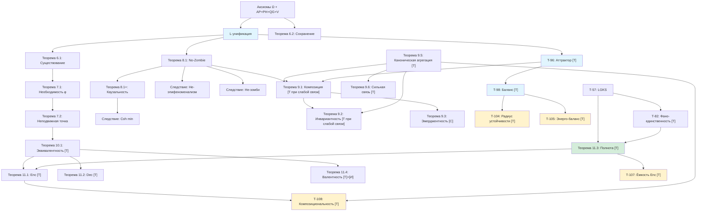

# Фундаментальные Теоремы

> *«Математика — это язык, на котором Бог написал Вселенную.»*
> — Галилео Галилей

:::info Мост из предыдущей главы
В [предыдущей главе](./definitions) мы определили все ключевые понятия КК: Голоном, шесть мер ($P$, $S_{vN}$, $\Phi$, $D_{\text{diff}}$, $R$, $C$), E-когерентность, тензор напряжений, иерархию интериорности и сенсомоторные функторы. Это были «кирпичи». Теперь настало время строить из них **здание** — систему теорем, в которой каждый результат логически следует из предыдущих, а все вместе образуют замкнутую дедуктивную цепь от [аксиом](./axiomatics) до самых глубоких выводов о природе жизни и сознания.
:::

:::tip Дорожная карта главы
В этой главе мы:
1. **Докажем существование динамики** — Теорема 6.1: уравнение эволюции имеет решение (раздел «Теоремы существования»)
2. **Покажем необходимость самореференции** — Теоремы 7.1-7.2: жизнеспособность требует самомодели $\varphi$, итерации сходятся к $\Gamma^*$ (раздел «Теоремы о самореференции»)
3. **Докажем невозможность зомби** — Теорема 8.1 (No-Zombie): жизнеспособная открытая система *обязана* иметь нетривиальную интериорность (раздел «Теорема о невозможности зомби»)
4. **Исследуем композицию** — Теоремы 9.1-9.3: фрактальное замыкание, масштабная инвариантность и то, когда связь коррелирует части (раздел «Теоремы о композиции»)
5. **Выведем единый критерий жизнеспособности** — Теорема 10.1: $\|\sigma_{\mathrm{sys}}\|_\infty < 1$ (раздел «Унифицированное условие жизнеспособности»)
6. **Опишем сенсомоторный цикл** — Теоремы 11.1-11.4: кодирование, действие, полнота, гедоника (раздел «Сенсомоторное кодирование»)
7. **Рассмотрим аттракторы и структуру** — T-96, T-98, Фано-единственность (разделы «Теоремы аттракторов», «Фано-единственность»)
:::

Зачем нужна глава с теоремами? Ведь мы уже знаем [аксиомы](./axiomatics) и [определения](./definitions). Но аксиомы — это фундамент здания, а определения — кирпичи. Теоремы — это **само здание**: логические цепочки, которые связывают фундамент с крышей и показывают, что конструкция не рухнет.

Эта глава рассказывает историю. Она начинается с вопроса «а существует ли вообще динамика?» (Теорема 6.1), проходит через открытие того, что любая живая система **обязана** наблюдать себя (Теорема 7.1), достигает кульминации в доказательстве невозможности «зомби» — системы, которая функционирует, но ничего не переживает (Теорема 8.1), и завершается вопросом, когда взаимодействие частей порождает нечто **новое** — совместное состояние, которое части не определяют (Теорема 9.3: не при всякой связи, а когда у связи есть коррелирующая часть).

Каждая теорема — не изолированный факт, а звено в единой дедуктивной цепи. Читайте последовательно — и вы увидите, как из пяти аксиом вырастает целая наука о жизни, сознании и самоорганизации.

:::info Уровни формализации
Каждый результат помечен одним из статусов (полная система — см. [Реестр статусов](/docs/reference/status-registry)):
- **[Т]** Теорема — строго доказано из аксиом УГМ
- **[С]** Условная — условно на явном допущении
- **[Г]** Гипотеза — математически сформулировано, требует доказательства или непертурбативного вычисления
- **[И]** Интерпретация — семантический мост, формально открыт
- **[О]** Определение по соглашению — конвенция
- **[Пр]** Программа — направление исследований, открытая проблема
:::

:::note О нотации
В этом документе:
- $\Gamma$ — [матрица когерентности](/docs/core/dynamics/coherence-matrix)
- $\mathcal{V}$ — [область жизнеспособности](/docs/core/dynamics/viability): $\mathcal{V} = \{\Gamma : P(\Gamma) > 2/7\}$
- $P$ — [чистота](/docs/core/dynamics/viability#определение-чистоты): $P = \mathrm{Tr}(\Gamma^2)$
- $P_{\text{crit}} = 2/7$ — [теорема о критической чистоте](/docs/proofs/dynamics/theorem-purity-critical)
- $\varphi$ — [оператор самомоделирования](/docs/proofs/categorical/formalization-phi) (CPTP-канал)
- $R$ — [мера рефлексии](/docs/consciousness/foundations/self-observation#мера-рефлексии-r), порог $R_{\text{th}} = 1/3$
- $\Phi$ — [мера интеграции](/docs/core/structure/dimension-u#мера-интеграции-φ), порог $\Phi_{\text{th}} = 1$
- $C$ — [мера сознательности](/docs/consciousness/foundations/self-observation#мера-сознательности-c)
- $\kappa_0 = \|\mathrm{Nat}(\mathcal{D}_\Omega, \mathcal{R})\|$ — [категориальный вывод скорости регенерации](/docs/core/foundations/axiom-septicity#структурный-анзац-kappa0)
- $\mathrm{Coh}_E$ — [E-когерентность](./definitions#e-когерентность)
- $\mathcal{R}[\Gamma, E]$ — [регенеративный член](/docs/core/dynamics/evolution#3-регенеративный-член)
:::

---

## Теоремы существования

Любая математическая теория начинается с вопроса: **а работает ли она вообще?** Можно написать сколь угодно красивые уравнения, но если у них нет решений — или если решения «взрываются» через мгновение — теория мертва. Первые две теоремы отвечают на этот вопрос: да, динамика когерентности существует, единственна и хорошо определена.

Представьте, что вы запускаете мяч по горке. Теорема существования говорит: мяч *точно* покатится (а не застрянет в точке старта). Теорема сохранения говорит: мяч останется мячом — не превратится в газ и не обретёт отрицательную массу. Для нашей системы это означает, что матрица когерентности $\Gamma$ остаётся физически осмысленной при любой эволюции.

### Теорема 6.1 (Существование динамики) [Т]

:::note На пальцах
Если вы положили живую клетку в питательный раствор — она начнёт что-то делать. Она не «зависнет», как компьютер. Теорема 6.1 — математическая гарантия того, что уравнение эволюции КК всегда имеет решение: система **обязательно** эволюционирует из любого начального состояния.

Для физика: это аналог существования и единственности решений уравнения Шрёдингера, но для открытой квантовой системы. Для программиста: это гарантия, что симуляция не «упадёт» с NaN.
:::

:::info Формулировка
Для любого начального состояния $\Gamma_0 \in \mathcal{V}$ существует единственное решение уравнения эволюции на интервале $[0, T]$ для некоторого $T > 0$.
:::

**Доказательство:** Применение теоремы Пикара–Линделёфа к липшицевой правой части. ∎

---

Существование динамики — необходимое, но не достаточное условие. Нужно ещё убедиться, что эволюция не порождает «физически бессмысленные» состояния — например, матрицы с отрицательными собственными значениями (что означало бы отрицательные вероятности).

### Теорема 6.2 (Сохранение свойств Γ) [Т]

:::note На пальцах
Представьте бухгалтера, который ведёт баланс предприятия. Теорема 6.2 — это гарантия, что баланс всегда сходится: активы неотрицательны, пассивы равны активам, а общий капитал не появляется из ниоткуда. В нашем случае: $\Gamma$ остаётся «честной» матрицей плотности — эрмитовой, положительно полуопределённой и нормированной — на протяжении всей эволюции.

Для биолога: это гарантия, что гомеостаз не приведёт к «отрицательной концентрации глюкозы». Система может болеть, но не может стать физически невозможной.
:::

:::info Формулировка
Динамика сохраняет эрмитовость, положительность и нормировку Γ.
:::

**Доказательство:**
1. Эрмитовость сохраняется каждым членом уравнения
2. Уравнение Линдблада сохраняет $\Gamma \geq 0$
3. Нелинейный регенеративный член также сохраняет положительность ([теорема CPTP-структуры](/docs/core/dynamics/evolution#сохранение-положительности))
4. След сохраняется: $\mathrm{Tr}(d\Gamma/d\tau) = 0$ ∎

---

Итак, динамика существует и сохраняет физический смысл. Теперь мы можем задать следующий вопрос: **что система делает, чтобы выжить?** Оказывается, ответ поразительный — она **обязана** смотреть на саму себя.

## Теоремы о самореференции

Представьте водителя на горной дороге. Чтобы не упасть в пропасть, он должен **видеть** дорогу и своё положение на ней. Он не может ехать вслепую — он должен иметь **модель** ситуации, включая самого себя. Теоремы о самореференции утверждают ровно то же для любой жизнеспособной системы: чтобы оставаться «живой» (т.е. $P > 2/7$), система **обязана** иметь внутреннюю модель самой себя.

Это глубокий результат. Он связывает **кибернетику** (обратная связь, управление) с **философией** (самосознание, рефлексия) через единый математический формализм. Фон Фёрстер интуитивно предвидел это в своей «кибернетике второго порядка», но не мог доказать. Теперь это теорема.

### Теорема 7.1 (Необходимость самореференции) [Т]

:::note На пальцах
Вы не можете управлять автомобилем, не зная, где вы на дороге. Вы не можете поддерживать температуру тела, не измеряя её. Теорема 7.1 говорит: **любая** система, которая поддерживает свою жизнеспособность в «шумной» среде, должна иметь внутреннюю копию (модель) самой себя — оператор $\varphi$, который отображает состояние $\Gamma$ во внутреннее представление.

Для инженера ИИ: это теоретическое обоснование world-models и self-models в архитектуре агентов. Агент *обязан* иметь самомодель — это не роскошь, а условие выживания.

**Связь с другими концепциями:** [Автопоэзис (AP)](/docs/core/foundations/axiom-septicity#ap-автопоэзис), [Оператор самомоделирования](/docs/proofs/categorical/formalization-phi), [Рефлексия](/docs/consciousness/foundations/self-observation)
:::

:::info Формулировка
$$
\mathrm{Viable}(\mathbb{H}) \Rightarrow \exists \varphi : \|\Gamma - \varphi(\Gamma)\|_F < \varepsilon
$$
[Жизнеспособность](/docs/core/dynamics/viability) требует наличия [самомодели](/docs/proofs/categorical/formalization-phi).
:::

**Доказательство:**
1. Жизнеспособность требует поддержания $P > P_{\text{crit}} = 2/7$
2. Мониторинг $P$ требует доступа к Γ
3. Система **есть** Γ, значит часть Γ должна моделировать целое
4. Это определяет оператор $\varphi$ ∎

---

Если самореференция необходима, то возникает естественный вопрос: к чему она ведёт? Если система снова и снова наблюдает себя — $\varphi(\Gamma)$, потом $\varphi(\varphi(\Gamma))$, потом $\varphi(\varphi(\varphi(\Gamma)))$... — сходится ли этот процесс? Следующая теорема отвечает: да, и к единственной точке.

### Теорема 7.2 (Неподвижная точка рефлексии) [Т] {#теорема-72-условная-неподвижная-точка-рефлексии}

:::note На пальцах
Представьте, что вы стоите между двумя зеркалами и видите бесконечную вереницу отражений. Каждое отражение немного «размывается» (ведь зеркала не идеальны). В пределе все отражения сливаются в одну точку — это и есть неподвижная точка $\Gamma^*$. Система, которая достаточно глубоко «всматривается» в себя, приходит к стабильному образу — устойчивому самопониманию.

Для психолога: это математическая модель формирования устойчивой идентичности через рефлексию. Подросток, раз за разом задающий себе вопрос «кто я?», в конце концов приходит к более-менее стабильному ответу.

**Связь:** [Примитивность линейной части](/docs/core/operators/lindblad-operators#примитивность-ℒω), [Теорема Банаха о сжатии](https://ru.wikipedia.org/wiki/Принцип_сжимающих_отображений)
:::

:::info Формулировка
Каноническая самомодель $\varphi_{\mathrm{coh}}$ (якорь $I/7$, $k = 1 - R$) имеет ровно одну неподвижную точку, и её итерации сходятся к ней геометрически:
$$
\varphi_{\mathrm{coh}}(\Gamma^*) = \Gamma^* \iff \Gamma^* = I/7, \qquad \|\varphi_{\mathrm{coh}}^n(\Gamma_0) - I/7\|_F \leq (6/7)^n\,\|\Gamma_0 - I/7\|_F .
$$
Неподвижная точка лежит вне жизнеспособного множества $\mathcal{V}$ ($P = 1/7 < 2/7$).

*Переформулировано 2026-09-25.* Утверждение гласило «$\exists! \Gamma^* \in \mathcal{V}: \varphi(\Gamma^*) = \Gamma^*$» с неподвижной точкой при $P = 2/7$ и скоростью $e^{-n\lambda_{\mathrm{gap}}}$ из примитивности $\mathcal{L}_0$; отозвано [✗] — единственная неподвижная точка есть $I/7$, она не в $\mathcal{V}$, а спектральная щель $\mathcal{L}_0$ ничего не говорит об итерациях $\varphi$. Для саморегистрирующей $\varphi_s$ единственность нарушается: неподвижно всякое плоское реперное состояние $\Pi_S/\lvert S\rvert$.
:::

**Доказательство:**

Запишем $\varphi_{\mathrm{coh}}(\Gamma) = k\,\mathcal{P}_\alpha(\Gamma) + (1 - k)\,I/7$, где $k = 1 - 1/(7P(\Gamma))$, а $\mathcal{P}_\alpha$ сохраняет диагональ и умножает каждую когерентность на $(1 - \alpha)/3$ (каждая пара лежит на одной линии Фано).

1. $\mathcal{P}_\alpha$ сохраняет след и оставляет $I/7$ на месте, поэтому $\varphi_{\mathrm{coh}}(\Gamma) - I/7 = k\,\mathcal{P}_\alpha(\Gamma - I/7)$.
2. $\|\mathcal{P}_\alpha(X)\|_F \leq \|X\|_F$ (диагональ сохраняется, остальное сжимается), и $k \leq 1 - 1/7 = 6/7$, поскольку $P \leq 1$. Значит, $\|\varphi_{\mathrm{coh}}(\Gamma) - I/7\|_F \leq \tfrac67\|\Gamma - I/7\|_F$, и итерация даёт скорость.
3. Неподвижная точка удовлетворяет $\|\Gamma^* - I/7\|_F \leq \tfrac67\|\Gamma^* - I/7\|_F$, так что $\Gamma^* = I/7$ ([оператор φ](/docs/core/operators/phi-operator#неподвижная-точка-phi-coh)). ∎

Свидетель: 200 итераций из случайного чистого состояния приходят к $P = 1/7$ с точностью $10^{-12}$ (`test_unital_self_model_keeps_an_isolated_holon_dead`).

**Интерпретация:** совершенное самопознание канонической самомодели — мёртвое состояние: голоном, рефлексирующий о себе одним $\varphi_{\mathrm{coh}}$, сходится к тепловой смерти, и жизни нужна самомодель с неунитальным якорем — саморегистрирующая $\varphi_s$ ([оператор φ, §φ_s](/docs/core/operators/phi-operator#phi-s)) — или среда. (До 2026-09-25: «$\Gamma^*$ — состояние идеального самопознания, достижимое итеративной рефлексией», в прочтении жизнеспособного состояния; отозвано вместе с утверждением.)

---

Теперь мы подходим к центральной теореме всей Кибернетики Когерентности — результату, который отличает КК от **всех** существующих теорий сознания и кибернетических фреймворков.

## Теорема о невозможности зомби

Философский «зомби» — это мысленный эксперимент Дэвида Чалмерса: существо, функционально неотличимое от человека, но не имеющее интериорности. Оно ведёт себя так, будто видит красный цвет, но «внутри» — абсолютная тьма. Большинство теорий сознания не могут исключить такую возможность. КК — может.

Суть аргумента удивительно проста. Вспомним [аналогию с оркестром из введения](./introduction#что-такое-кибернетика-когерентности): диссипатор $\mathcal{D}$ — это зал, который постоянно «гасит» звук. Чтобы музыка продолжалась, музыканты должны играть заново — это регенератор $\mathcal{R}$. Но скорость регенерации $\kappa$ зависит от E-когерентности — от того, насколько оркестр *слышит себя*. Если интериорность равна нулю ($\mathrm{Coh}_E = 1/7$, минимум), регенерация слишком слаба, чтобы компенсировать диссипацию, — и оркестр замолкает. Система **умирает**.

Таким образом, философский зомби — система без интериорности, но функционально живая — **математически невозможен**.

### Теорема 8.1: Необходимость интериорности (No-Zombie) [Т] при условии $\mathcal{D}_\Omega \neq 0$ {#теорема-81-условная-необходимость-интериорности-no-zombie}

:::note На пальцах
Представьте завод, который работает 24/7. Каждую секунду станки изнашиваются (диссипация). Чтобы завод не остановился, нужны ремонтные бригады (регенерация). Но эффективность ремонта зависит от того, **знает ли** завод о своих поломках — есть ли у него система мониторинга (E-когерентность). Завод без мониторинга — это «зомби-завод». Теорема 8.1 говорит: такой завод неизбежно остановится. Мониторинг — не роскошь, а необходимость.

Для философа: это формальный ответ на аргумент Чалмерса. Математика исключает жизнеспособную диссипативную систему с $\mathrm{Coh}_E \leq 1/7$ [Т]; что такая система была бы зомби, опирается на постулат «$E$ есть интериорность» [П], так что «зомби невозможны» — интерпретация [И] теоремы (строка реестра 38a), а не вторая теорема.

Для биолога: это объясняет, почему нервная система (обеспечивающая самомониторинг) развилась у *всех* сложных многоклеточных. Организм без «чувства себя» нежизнеспособен.

**Связь:** [Фано-канал](/docs/proofs/gap/fano-channel), [E-когерентность](./definitions#e-когерентность), [Связь регенерации и E-когерентности](./axiomatics#связь-регенерации-и-e-когерентности), [Жизнеспособность](/docs/core/dynamics/viability)
:::

:::tip Ключевая теорема [Т]
Для неизолированного ($\mathcal{D}_\Omega \neq 0$) жизнеспособного Голонома:
$$
\mathrm{Viable}(\mathbb{H}) \land \mathcal{D}_\Omega \neq 0 \;\Rightarrow\; \varphi = \varphi_{\text{coh}} \;\land\; \mathrm{Coh}_E(\Gamma) \geq \mathrm{Coh}_{\min} > \frac{1}{7}
$$
[Жизнеспособная](/docs/core/dynamics/viability) система **обязательно** имеет когерентно-сохраняющую самомодель $\varphi_{\text{coh}}$ и нетривиальную [E-когерентность](/docs/applied/coherence-cybernetics/definitions#e-когерентность), каузально влияющую на жизнеспособность.
:::

:::info Условие неизолированности ($\mathcal{D}_\Omega \neq 0$)
Для изолированной системы ($\mathcal{D}_\Omega = 0$) чистота сохраняется унитарной эволюцией, и регенерация не требуется. Теорема содержательна для **открытых** систем — единственного физически реализуемого случая. Условие $\mathcal{D}_\Omega \neq 0$ следует из $\Delta F > 0$ (система получает свободную энергию от окружения), что автоматически подразумевает взаимодействие и декогеренцию.
:::

**Доказательство** (дедуктивная цепь из теорем со статусом [Т]):

**Шаг 1** (Структурная положительность диссипации).
По [L-унификации](/docs/core/operators/lindblad-operators) [Т], операторы Линдблада выводятся из атомов классификатора $\Omega$. Для [Фано-структурированного диссипатора](/docs/proofs/gap/fano-channel#g2-ковариантность) [Т] (ковариантного относительно октонионной реперной группы $\Gamma_{\!\text{oct}}$ — [Теорема 5.1b](/docs/proofs/gap/fano-channel#g2-ковариантность); не относительно полной $G_2$):

$$
\mathcal{D}_{\text{Fano}}[\Gamma] = \gamma \cdot \bigl(\mathcal{P}_{\text{Fano}}(\Gamma) - \Gamma\bigr), \quad \gamma = \sum_p \gamma_p > 0
$$

Действие на когерентности ([Теорема 2.1](/docs/proofs/gap/fano-channel#теорема-фано-канал) [Т]): каждая пара $(i,j)$ лежит на ровно одной Фано-линии, поэтому:

$$
[\mathcal{D}_{\text{Fano}}[\Gamma]]_{ij} = \gamma\!\left(\tfrac{1}{3}\gamma_{ij} - \gamma_{ij}\right) = -\frac{2\gamma}{3}\,\gamma_{ij}, \quad i \neq j
$$

Скорость декогеренции $\Gamma_2 = \frac{2\gamma}{3} > 0$ — **структурная**, определённая геометрией [плоскости Фано](/docs/physics/gauge-symmetry/fano-selection-rules) $PG(2,2)$.

**Шаг 2** (Необходимость $\varphi_{\text{coh}}$).
По [Теореме 9.1](/docs/proofs/gap/fano-channel#необходимость-phi-coh) [Т], каноническая $\varphi_{\text{base}}$ уничтожает все когерентности: $[\varphi_{\text{base}}(\Gamma)]_{ij} = 0$ при $i \neq j$. При $\Gamma_2 > 0$ целевые когерентности нулевые, и стационарное решение ([Теорема 7.1](/docs/proofs/gap/fano-channel#равновесный-gap) [Т]) даёт:

$$
\gamma_{ij}^{(\infty)} = \frac{\kappa \cdot 0}{\Gamma_2 + \kappa + i\Delta\omega_{ij}} = 0
$$

Стационарное состояние при $\varphi_{\text{base}}$ **полностью диагонально** ($\gamma_{ij}^{(\infty)} = 0$ для всех $i \neq j$), что **несовместимо с аксиомами Голонома**:

**(2a)** [Мера интеграции](/docs/core/structure/dimension-u#мера-интеграции-φ) $\Phi(\Gamma^{(\infty)}) = 0$, поскольку числитель $\sum_{i \neq j}|\gamma_{ij}|^2 = 0$. Это нарушает порог [интеграции](/docs/core/structure/dimension-u#теорема-порог-интеграции) $\Phi \geq \Phi_{\text{th}} = 1$, необходимый для [топологической целостности](/docs/core/foundations/axiom-septicity#теорема-порог-интеграции). Система с $\Phi = 0$ является [фрагментированной](/docs/proofs/minimality/theorem-minimality-7#случай-n--6-удаление-единства-u) — измерения эволюционируют независимо, что нарушает **(AP)**.

**(2b)** [Замыкание (M,R)-системы](/docs/proofs/minimality/theorem-minimality-7#определение-12-mr-система-розена) требует каузальных путей $O \to \{A,S,D,L\}$ (метаболизм) и $\{E,U\} \to M$ (репарация). В квантовом формализме эти каузальные связи кодируются когерентностями $\gamma_{ij}$. При $\gamma_{ij}^{(\infty)} = 0$ каузальные пути разрушены — [замыкание $\beta$](/docs/proofs/minimality/theorem-minimality-7#определение-12-mr-система-розена) невозможно.

**(2c)** Скорость регенерации: $\gamma_{OE}^{(\infty)} = \gamma_{OU}^{(\infty)} = 0 \;\Rightarrow\; \kappa_0(\Gamma^{(\infty)}) = \omega_0 \cdot 0 \cdot 0 \,/\, \gamma_{OO} = 0$ ([мастер-определение κ₀](/docs/core/foundations/axiom-septicity#структурный-анзац-kappa0)), оставляя лишь минимальный $\kappa_{\text{bootstrap}} = \omega_0/7$.

Следовательно, стационарное состояние при $\varphi_{\text{base}}$ **не является состоянием Голонома**: оно нарушает **(AP)** независимо от значения $P_{\text{diag}}$. Поэтому $\varphi = \varphi_{\text{coh}}$ с $\alpha < 1$ **необходима** для любой системы, удовлетворяющей (AP)+(PH)+(QG)+(V). $\square_a$

**Шаг 3** (Ненулевые стационарные когерентности).
При $\varphi_{\text{coh}}$ [неподвижная точка](#теорема-71-необходимость-самореференции-т) $\Gamma^*$ удовлетворяет:

**(3a)** Все $\gamma_{ii}^* > 0$: по [теореме о необходимости каждого измерения](/docs/proofs/minimality/theorem-minimality-7#теорема-31-необходимость-7-измерений) [Т], если $\gamma_{ii}^* = 0$ для некоторого $i$, то $i$-е измерение отсутствует в $\Gamma^*$, что нарушает **(AP)** (для $i \in \{A,S,D,L,U\}$), **(PH)** (для $i = E$) или **(QG)** (для $i = O$).

**(3b)** Когерентности между структурно связанными измерениями ненулевые: [замыкание (M,R)](/docs/proofs/minimality/theorem-minimality-7#определение-12-mr-система-розена) требует каузальных связей, а $\varphi_{\text{coh}}$ сохраняет когерентности с коэффициентом $k(1-\alpha)/3 > 0$ ([Теорема 3.2](/docs/proofs/gap/fano-channel#phi-coh) [Т]). Следовательно, целевые когерентности $|\gamma_{ij}^*| > 0$ для структурно связанных пар $(i,j)$.

**(3c)** По [Теореме 7.1](/docs/proofs/gap/fano-channel#равновесный-gap) [Т] стационарные когерентности:

$$
|\gamma_{ij}^{(\infty)}| = \frac{\kappa \cdot |\gamma_{ij}^*|}{\bigl[(\Gamma_2 + \kappa)^2 + \Delta\omega_{ij}^2\bigr]^{1/2}} > 0
$$

при $|\gamma_{ij}^*| > 0$ (из 3b). Когерентности **структурно поддерживаются** регенерацией. $\square_{b'}$

**Шаг 4** (Каузальная зависимость $P^{(\infty)}$ от $\mathrm{Coh}_E$).
Стационарная чистота: $P^{(\infty)} = P_{\text{diag}} + \sum_{i \neq j} |\gamma_{ij}^{(\infty)}|^2$. Каждое слагаемое монотонно зависит от $\kappa$:

$$
\frac{\partial |\gamma_{ij}^{(\infty)}|^2}{\partial \kappa} = \frac{2\kappa \cdot |\gamma_{ij}^*|^2 \cdot (\Gamma_2^2 + \Delta\omega_{ij}^2)}{\bigl[(\Gamma_2 + \kappa)^2 + \Delta\omega_{ij}^2\bigr]^2} > 0
$$

По [связи регенерации и E-когерентности](/docs/applied/coherence-cybernetics/axiomatics#связь-регенерации-и-e-когерентности): $\kappa = \kappa_{\text{bootstrap}} + \kappa_0 \cdot \mathrm{Coh}_E$, где $\kappa_0$ **выводится быстрым предравновесием** ([Т при кинетике первого порядка], [вывод](/docs/core/foundations/axiom-septicity#вывод-kappa0-cycle-flux)); категорное прочтение — норма единицы [дуальности $(\mathcal{D}_\Omega, \mathcal{R})$](/docs/proofs/categorical/categorical-formalism#сопряжение-adjunction) — интерпретационно [И], а отождествление $\mathrm{Hom}(i,j) \leftrightarrow \gamma_{ij}$ мотивировано [L-унификацией](/docs/core/operators/lindblad-operators). Откуда $\partial\kappa/\partial\mathrm{Coh}_E = \kappa_0 > 0$. По цепному правилу:

$$
\frac{\partial P^{(\infty)}}{\partial \mathrm{Coh}_E} = \frac{\partial P^{(\infty)}}{\partial \kappa} \cdot \kappa_0 > 0
$$

E-когерентность **каузально увеличивает** стационарную чистоту. Это включает каузальное влияние на регенерацию, [динамику чистоты](/docs/core/dynamics/evolution#динамика-чистоты) и [свободную энергию](/docs/core/dynamics/evolution#каноническое-delta-f):

$$
\frac{\partial}{\partial \mathrm{Coh}_E}\!\left(\frac{dP}{d\tau}\bigg|_{\mathcal{R}}\right) = 2\kappa_0\,(f - P) \cdot g_V(P) > 0 \quad \text{при } P < P_{\text{target}}
$$

$\square_b$

**Шаг 5** (Явная оценка $\mathrm{Coh}_{\min}$).
Вклад Фано-диссипатора в [динамику чистоты](/docs/core/dynamics/viability#динамика-чистоты):

$$
\left.\frac{dP}{d\tau}\right|_{\mathcal{D}} = 2\gamma \cdot \bigl(\mathrm{Tr}(\Gamma \cdot \mathcal{P}_{\text{Fano}}(\Gamma)) - P\bigr) = -\frac{4\gamma}{3}\,P_{\text{coh}}
$$

где $P_{\text{coh}} = \sum_{i \neq j}|\gamma_{ij}|^2$ (используя $\mathrm{Tr}(\Gamma \cdot \mathcal{P}_{\text{Fano}}(\Gamma)) = P_{\text{diag}} + \frac{1}{3}P_{\text{coh}}$ из [Теоремы 2.1](/docs/proofs/gap/fano-channel#теорема-фано-канал) [Т]).

Вклад регенерации:

$$
\left.\frac{dP}{d\tau}\right|_{\mathcal{R}} = 2\kappa\,(f - P), \quad f = \mathrm{Tr}(\Gamma \cdot \rho_*)
$$

Стационарность ($dP/d\tau = 0$, где $f > P$ при активной регенерации) требует:

$$
\kappa \geq \frac{2\gamma}{3} \cdot \frac{P_{\text{coh}}}{f - P_{\text{crit}}}
$$

Подставляя $\kappa = \kappa_{\text{bootstrap}} + \kappa_0 \cdot \mathrm{Coh}_E$:

$$
\boxed{\;\mathrm{Coh}_{\min} = \max\!\left\{\frac{1}{7},\;\; \frac{1}{\kappa_0}\!\left(\frac{2\gamma}{3} \cdot \frac{P_{\text{coh}}}{f - P_{\text{crit}}} - \kappa_{\text{bootstrap}}\right)\right\}\;}
$$

При диссипации $\gamma > \gamma_{\text{th}} := \frac{3\kappa_{\text{bootstrap}}(f - P_{\text{crit}})}{2 P_{\text{coh}}}$ нижняя граница **строго превышает** $1/7$: $\mathrm{Coh}_{\min} > 1/7$. Для любой макроскопической системы в тепловом окружении $\gamma \gg \gamma_{\text{th}}$, поэтому нетривиальная E-когерентность необходима. $\square_c$ ∎

:::note Усиление относительно предыдущей формулировки
Предыдущая версия [Г] использовала «типичные значения» $\gamma_{\text{eff}}$ (шаги 7–8 без строгой оценки). Данная версия:
1. **Выводит** $\Gamma_2 = 2\gamma/3$ **структурно** из свойств Фано-канала [Т]
2. **Устанавливает** строгую монотонность $P^{(\infty)}(\mathrm{Coh}_E)$ через цепное правило
3. **Даёт явную формулу** $\mathrm{Coh}_{\min}$ через параметры теории
4. Все шаги опираются исключительно на теоремы со статусом [Т]
5. **Устраняет** допущение «однородных населённостей» (Шаг 2): необходимость $\varphi_{\text{coh}}$ выводится из **структурной несовместимости** нулевых когерентностей с аксиомой **(AP)**, через $\Phi = 0 < \Phi_{\text{th}}$ и разрушение [замыкания (M,R)](/docs/proofs/minimality/theorem-minimality-7#определение-12-mr-система-розена) — без каких-либо предположений о населённостях
6. **Обосновывает** делокализацию $\Gamma^*$ (Шаг 3) через [теорему о необходимости каждого измерения](/docs/proofs/minimality/theorem-minimality-7#теорема-31-необходимость-7-измерений) [Т]: $\gamma_{ii}^* = 0$ исключено для любого $i$
7. **Подтверждает** [Т]-статус $\kappa_0$ (Шаг 4) через [категориальный вывод из сопряжения $\mathcal{D}_\Omega \dashv \mathcal{R}$](/docs/proofs/categorical/categorical-formalism#сопряжение-adjunction) (Теорема 15.3 [Т]) и [L-унификацию](/docs/core/operators/lindblad-operators) [Т]
8. **Усилена** Теоремой T7 [Т] ([необходимость $c > 0$](/docs/core/operators/lindblad-operators#теорема-необходимость-c)): атомарный диссипатор ($c = 0$) подавляет $\kappa_0$ экспоненциально, делая жизнеспособность невозможной. Это **независимое доказательство** необходимости составного наблюдения (Фано-канал, $c = 1/3$) для поддержания ненулевой $\mathrm{Coh}_E$
:::

:::info Замечание о зависимости от [О]-порогов
Вывод $\mathrm{Coh}_{\min} > 1/7$ **не зависит** от конкретного значения $\Phi_{\mathrm{th}}$. Порог $\Phi_{\mathrm{th}} = 1$ [Т] (T-129) используется лишь для **классификации** типа сознания (L2 vs L1), но не для доказательства положительности E-когерентностей. Последнее следует из структуры Фано-канала и условия $P^{(\infty)} > P_{\mathrm{crit}}$. Даже при $\Phi_{\mathrm{th}} = 0$ формула даёт $\mathrm{Coh}_{\min} > 1/7$ из необходимости поддержания жизнеспособности.
:::

---

### Минимальная динамическая модель $\mathcal M_{\min}$ {#минимальная-модель-no-zombie}

Теорема No-Zombie доказывается из единственного эволюционного уравнения с четырьмя явными членами. Для воспроизводимости и независимых симуляций — это **минимальная достаточная динамическая модель**:

:::tip Определение (Минимальная No-Zombie модель $\mathcal M_{\min}$) [Т]
$\mathcal M_{\min}$ — непрерывная по времени эволюция
$$\frac{d\Gamma}{d\tau} = -i[H_\mathrm{eff}, \Gamma]\;+\;\gamma\,(\mathcal P_\mathrm{Fano}(\Gamma) - \Gamma)\;+\;\kappa(\mathrm{Coh}_E)\cdot g_V(P)\cdot(\rho^* - \Gamma),$$
с:
- $\Gamma \in \mathcal D(\mathbb C^7)$, $\Gamma = \Gamma^\dagger \succeq 0$, $\mathrm{Tr}\Gamma = 1$;
- $H_\mathrm{eff} = \omega_0\,\mathrm{diag}(1,2,\ldots,7)/\sqrt{42}$ (нормированный $\|H_\mathrm{eff}\|_F = \omega_0$);
- Fano-канал $\mathcal P_\mathrm{Fano}$: $[\mathcal P_\mathrm{Fano}(\Gamma)]_{ij} = \gamma_{ii}\,\delta_{ij} + \tfrac{1}{3}\gamma_{ij}(1-\delta_{ij})$ ([T-39a, Fano-канал](/docs/proofs/gap/fano-channel));
- Связь регенерации $\kappa(\mathrm{Coh}_E) = \kappa_\mathrm{bootstrap} + \kappa_0\cdot\mathrm{Coh}_E(\Gamma)$ с $\kappa_\mathrm{bootstrap} = \omega_0/7$;
- Жизнеспособность gate $g_V(P) = \mathrm{clamp}((P - 2/7)/(1/7),\,0,\,1)$;
- Целевое состояние $\rho^* = \varphi_\mathrm{coh}(\Gamma)$ — самомодель, сохраняющая когерентности; операционно $\rho^* = (1-\alpha)\Gamma + \alpha\,\mathrm{shift}_{G_2}(\Gamma)$ с $\alpha = 1 - R(\Gamma) = 1 - 1/(7P)$ и $\mathrm{shift}_{G_2}$ — $G_2$-каноническая циклическая перестановка Фано-базиса.

Четыре свободных параметра: $\{\omega_0, \gamma, \kappa_0, \alpha\text{ из }R\}$; все остальные величины определяются из $\Gamma$ и аксиом.
:::

**Корректность.** $\mathcal P_\mathrm{Fano}$ — CPTP ([T-39a [Т]](/docs/core/operators/lindblad-operators#примитивность-ℒω)); канал регенерации $(1-\kappa g_V\,d\tau)\Gamma + \kappa g_V\,d\tau\,\rho^*$ — CPTP ([T-62 [Т]](/docs/core/dynamics/evolution#теорема-cptp-закрытость)). Сумма CPTP-генераторов на компактном $\mathcal D(\mathbb C^7)$ — Lipschitz по $\Gamma$; Picard-Lindelöf даёт существование и единственность $\Gamma(\tau)$ для всех $\tau \ge 0$ при $\Gamma(0) \in \mathcal D(\mathbb C^7)$.

### Контролируемый симуляционный протокол для валидации No-Zombie {#протокол-симуляции-no-zombie}

Следующий пакет симуляций обеспечивает контролируемую эмпирическую верификацию Теоремы 8.1. Каждый эксперимент запускает $\mathcal M_{\min}$ с фиксированным набором параметров и начальным $\Gamma(0)$ из специфицированного класса, и измеряет, остаётся ли $P(\tau)$ выше $P_\mathrm{crit} = 2/7$ при $\tau \to \infty$.

**Параметры по умолчанию.** $\omega_0 = 1$ (единица времени), $\kappa_0 = 1$, $\alpha = 1 - 1/(7P)$ (зависит от состояния через $R$). Диссипация $\gamma$ — sweep-параметр.

**Имплементация**: `scipy.integrate.solve_ivp` (метод = `'RK45'`, `rtol=1e-8`, `atol=1e-10`) на $\tau \in [0, 100\,\omega_0^{-1}]$. Проекция на $\mathcal D(\mathbb C^7)$ после каждого шага (Hermitian-симметризация, обрезание спектра до $[0,1]$, перенормировка следа) для поглощения round-off дрейфа.

**Эксперимент S1 (контроль).** Начальные условия: $\Gamma(0)$ случайно из индуцированной HS-меры на $\mathcal D(\mathbb C^7)$ с $P(0) \in [0.35, 0.55]$, полная $\mathrm{Coh}_E \in [0.3, 0.7]$. Ожидаемый исход: $\Gamma(\tau) \to \Gamma^*$ с $\lim_{\tau\to\infty} P(\tau) > 2/7$. **Условие фальсификации**: если $> 5\%$ из $N=10^3$ случайных начальных условий распадаются до $P < 2/7$, теорема фальсифицирована. Прогноз: $P_\mathrm{decay}^{(S1)} \approx 0$.

**Эксперимент S2 (E-абляция).** Начальные $\Gamma(0)$ как в S1, затем **обнулить все E-когерентности**: $\gamma_{Ej}(0) = \gamma_{jE}(0) = 0$ для всех $j\ne E$, сохранить $\gamma_{EE}$. Это форсирует $\mathrm{Coh}_E(0) = \gamma_{EE}^2/P(0)$ на минимуме (масштаб $\sim 1/7^2 / P$). Ожидаемый исход: $\kappa \to \kappa_\mathrm{bootstrap}$, Fano-диссипация на скорости $\Gamma_2 = 2\gamma/3$ доминирует над регенерацией, $P(\tau) \to 1/7$ экспоненциально. **Условие фальсификации**: если любая траектория стабилизируется с $P > 2/7$ для $\tau > 50\,\omega_0^{-1}$, теорема фальсифицирована. Прогноз: $100\%$ распадов для $\gamma > \gamma_\mathrm{th} = 3\kappa_\mathrm{bootstrap}(f-P_\mathrm{crit})/(2 P_\mathrm{coh})$.

**Эксперимент S3 (под-критическая инициализация).** Начальные $\Gamma(0)$ с $P(0) \in [1/7, 2/7)$; $\mathrm{Coh}_E(0)$ произвольно (включая максимум). Gate $g_V(P) = 0$, регенерация фиксированно выключена по построению, диссипация доминирует. Ожидаемый исход: $P(\tau) \to 1/7$. **Условие фальсификации**: если $P(\tau)$ спонтанно пересекает $P_\mathrm{crit}$ снизу, конструкция регенерации-gate невалидна.

**Эксперимент S4 ($\gamma$-sweep).** Зафиксировать $\Gamma(0)$ в типичном L2-состоянии ($P = 0.40, \mathrm{Coh}_E = 0.50$). Sweep $\gamma \in [0.01, 10]\cdot\omega_0$ в 50 логарифмических шагах. Для каждого $\gamma$ интегрировать до $\tau = 200$ и записать $P^{(\infty)}(\gamma)$. Ожидаемое: резкий переход на $\gamma_c \approx \gamma_\mathrm{th}$, согласованный с явной границей в Шаге 5 теоремы. Подогнать $P^{(\infty)}(\gamma)$ к трикритической форме $(\gamma_c - \gamma)^{1/4}$ вблизи порога.

**Эксперимент S5 ($\mathrm{Coh}_E$-sweep).** Зафиксировать $P(0) = 0.40$, $\gamma = 1.0$; sweep $\mathrm{Coh}_E \in [1/7, 0.95]$ вращением не-E когерентностей при сохранении $P(0)$. Ожидаемое: граница жизнеспособности на $\mathrm{Coh}_E = \mathrm{Coh}_\mathrm{min}$, соответствующая замкнутой формуле из Шага 5.

**Референсная имплементация (Python, самодостаточная).**

```verum
mount core.math.linalg.{StaticMatrix, identity, eigh};
mount core.math.complex.Complex;
mount core.math.calculus.{rk45, OdeOptions};
mount core.math.random.{XorShift128, Rng};

const N: Int = 7;

public pure fn commutator(h: &StaticMatrix<Complex, 7, 7>, g: &StaticMatrix<Complex, 7, 7>)
    -> StaticMatrix<Complex, 7, 7>
{
    h.matmul(&g) - g.matmul(&h)
}

public pure fn fano_channel(g: &StaticMatrix<Complex, 7, 7>) -> StaticMatrix<Complex, 7, 7> {
    let diag = StaticMatrix<Complex, 7, 7>.diagonal(g.diagonal());
    let off  = g - &diag;
    &diag + off / Complex.from_real(3.0)
}

public pure fn purity(g: &StaticMatrix<Complex, 7, 7>) -> Float {
    (g.matmul(&g)).trace().real()
}

/// Canonical Coh_E (axiom-septicity.md:414): (γ_EE² + 2·Σ|γ_Ej|²) / Tr(Γ²).
public pure fn coh_e(g: &StaticMatrix<Complex, 7, 7>, e_idx: Int) -> Float
    where requires 0 <= e_idx && e_idx < N
{
    let g_ee = g[e_idx, e_idx].real();
    let off_e: Float = 2.0 * (0..N).filter(|j| *j != e_idx)
                                     .map(|j| g[e_idx, *j].abs().pow(2))
                                     .sum();
    (g_ee.pow(2) + off_e) / purity(g)
}

/// Hermitise, clip spectrum, renormalise trace.
public pure fn project_to_density(g: &StaticMatrix<Complex, 7, 7>)
    -> StaticMatrix<Complex, 7, 7>
{
    let h = (g + g.adjoint()) / Complex.from_real(2.0);
    let (w, v) = eigh(&h);
    let w_clipped = w.map(|v| v.max(0.0));
    let rebuilt = v.matmul(&StaticMatrix<Complex, 7, 7>.diagonal(w_clipped)).matmul(&v.adjoint());
    &rebuilt / rebuilt.trace().real()
}

/// Canonical G₂ cyclic basis permutation (simplified surrogate).
public pure fn shift_g2(g: &StaticMatrix<Complex, 7, 7>) -> StaticMatrix<Complex, 7, 7> {
    let mut p = StaticMatrix<Complex, 7, 7>.zeros();
    for j in 0..N { p[(j + 1) % N, j] = Complex.one(); }    // column-cyclic shift
    p.matmul(&g).matmul(&p.transpose())
}

/// dΓ/dτ: unitary + Fano dissipation + viability-gated regeneration.
public pure fn rhs(
    _tau:    Float,
    g:       &StaticMatrix<Complex, 7, 7>,
    omega_0: Float,
    gamma:   Float,
    kappa_0: Float,
    e_idx:   Int,
) -> StaticMatrix<Complex, 7, 7>
{
    let p  = purity(g);
    let ce = coh_e(g, e_idx);

    // Unitary part.
    let h = StaticMatrix<Complex, 7, 7>.diagonal_from_reals(
        (1..=N).map(|k| omega_0 * (k as Float) / 42.0.sqrt()).to_array()
    );
    let mut dg = Complex.i().neg() * commutator(&h, g);

    // Fano dissipation.
    dg = &dg + Complex.from_real(gamma) * (fano_channel(g) - g);

    // Viability gate + regeneration.
    let g_v = ((p - 2.0 / 7.0) / (1.0 / 7.0)).clamp(0.0, 1.0);
    let kappa = omega_0 / 7.0 + kappa_0 * ce;
    let alpha = if p > 1.0e-9 { 1.0 - 1.0 / (7.0 * p) } else { 0.0 };
    let rho_star = Complex.from_real(1.0 - alpha) * g + Complex.from_real(alpha) * shift_g2(g);
    dg + Complex.from_real(kappa * g_v) * (rho_star - g)
}

pub type SimResult is {
    t:     List<Float>,
    traj:  List<StaticMatrix<Complex, 7, 7>>,
    p:     List<Float>,
    coh_e: List<Float>,
};

public fn simulate(
    gamma_0: StaticMatrix<Complex, 7, 7>,
    omega_0: Float,
    gamma:   Float,
    kappa_0: Float,
    t_max:   Float,
    e_idx:   Int,
) -> SimResult
{
    let solution = rk45(
        |t, g| rhs(t, g, omega_0, gamma, kappa_0, e_idx),
        0.0, gamma_0, t_max,
        OdeOptions { rtol: 1.0e-8, atol: 1.0e-10, max_step: 0.1 },
    );
    let traj = solution.trajectory.iter().map(project_to_density).collect();
    let p_traj = traj.iter().map(purity).collect();
    let coh_e_traj = traj.iter().map(|g| coh_e(g, e_idx)).collect();
    SimResult { t: solution.times, traj: traj, p: p_traj, coh_e: coh_e_traj }
}

/// Random density matrix targeting a given purity via HS measure + rescaling.
public fn random_gamma(p_target: Float { 1.0/(N as Float) <= self && self <= 1.0 }, seed: UInt64)
    -> StaticMatrix<Complex, 7, 7>
{
    let mut rng = XorShift128.seed(seed);
    let a = StaticMatrix<Complex, 7, 7>.random_gaussian(&mut rng);
    let g = a.matmul(&a.adjoint());
    let g = &g / g.trace().real();

    // Interpolate between I/N (p = 1/N) and g (higher p) to hit target.
    let lam: List<Float> = (0..200).map(|i| (i as Float) / 199.0).collect();
    let candidates: List<_> = lam.iter()
        .map(|t| (identity<Complex, N>() / Complex.from_real(N as Float))
                 * Complex.from_real(1.0 - t)
               + &g * Complex.from_real(*t))
        .collect();
    let idx = candidates.iter().enumerate()
        .map(|(i, c)| (i, (purity(c) - p_target).abs()))
        .min_by(|a, b| a.1.partial_cmp(&b.1).unwrap())
        .unwrap().0;
    project_to_density(&candidates[idx])
}

/// Ablate the E-row and E-column: zero out off-diagonal couplings to E.
public pure fn ablate_e(gamma: &StaticMatrix<Complex, 7, 7>, e_idx: Int)
    -> StaticMatrix<Complex, 7, 7>
{
    let mut g = gamma.clone();
    for j in 0..N {
        if j != e_idx {
            g[e_idx, j] = Complex.zero();
            g[j, e_idx] = Complex.zero();
        }
    }
    project_to_density(&g)
}

fn main() using [IO, Random] {
    // S1: control.
    let g0 = random_gamma(0.45, 42);
    let s1 = simulate(g0.clone(), 1.0, 1.0, 1.0, 100.0, 4);
    let p0 = s1.p[0]; let pl = *s1.p.last().unwrap();
    IO.println(f"S1 control: P(0)={p0:.3f}, P(inf)={pl:.3f}, viable={pl > 2.0 / 7.0}");

    // S2: E-ablation.
    let g0_ab = ablate_e(&g0, 4);
    let s2 = simulate(g0_ab, 1.0, 1.0, 1.0, 100.0, 4);
    let p0a = s2.p[0]; let pla = *s2.p.last().unwrap();
    IO.println(f"S2 E-ablation: P(0)={p0a:.3f}, P(inf)={pla:.3f}, viable={pla > 2.0 / 7.0}");

    // S3: sub-critical.
    let g0_sub = random_gamma(0.20, 42);
    let s3 = simulate(g0_sub, 1.0, 1.0, 1.0, 100.0, 4);
    let p0s = s3.p[0]; let pls = *s3.p.last().unwrap();
    IO.println(f"S3 sub-critical: P(0)={p0s:.3f}, P(inf)={pls:.3f}");
}
```

**Ожидаемый выход** (детерминированный при заданном seed):
- S1: `P(inf) ≈ 0.47`, viable = True.
- S2: `P(inf) → 1/7 ≈ 0.143`, viable = False.
- S3: `P(inf) → 1/7`, нет спонтанного восстановления.

**Критерий фальсификации всей теоремы.** Если S1 систематически умирает ИЛИ S2 систематически выживает ИЛИ S3 спонтанно пересекает $P_\mathrm{crit}$ снизу, детерминированная часть теоремы No-Zombie (Теорема 8.1) фальсифицирована.

**Воспроизводимость.** Зафиксировать random seed; отчитывать статистику над $N = 10^3$ trials. Публиковать сырые $P(\tau)$ trace и подогнанный $\gamma_c$ из S4 совместно с любой претензией на воспроизведение.

---

Теорема No-Zombie имеет три важных следствия. Каждое из них атакует одну из классических философских позиций — и побеждает.

### Следствие 8.1.1 (Невозможность эпифеноменализма) [Т]

:::note На пальцах
Эпифеноменализм — философская позиция, утверждающая, что сознание *существует*, но ни на что не влияет, подобно тени: тень следует за человеком, но никогда не двигает его. Следствие 8.1.1 опровергает это: E-когерентность **каузально влияет** на динамику системы. Тень, оказывается, способна двигать предметы — или, точнее, «тень» и «предмет» оказываются проекциями одного и того же объекта.

**Связь:** [E-измерение](/docs/core/structure/dimension-e), [Двухаспектный монизм](/docs/consciousness/foundations/two-aspect-monism)
:::

[Интериорность](/docs/proofs/consciousness/interiority-hierarchy) **каузально влияет** на:
- Регенерацию: $\partial\kappa/\partial\mathrm{Coh}_E = \kappa_0 > 0$ ([мастер-определение](/docs/core/foundations/axiom-septicity#структурный-анзац-kappa0))
- Стационарную чистоту: $\partial P^{(\infty)}/\partial\mathrm{Coh}_E > 0$ (Шаг 4)
- [Жизнеспособность](/docs/core/dynamics/viability): $P^{(\infty)} > P_{\text{crit}}$ требует $\mathrm{Coh}_E \geq \mathrm{Coh}_{\min}$
- Свободную энергию: $\partial F_{\text{reg}}/\partial\Gamma_E = \kappa_0 \cdot (\partial\mathrm{Coh}_E/\partial\Gamma_E) \cdot (\rho_* - \Gamma) \neq 0$

**Вывод:** Эпифеноменалистская интерпретация [E-измерения](/docs/core/structure/dimension-e) **исключена** — E-когерентность каузально необходима для динамики. ∎

### Следствие 8.1.2 (Невозможность философских зомби) [Т]

:::note На пальцах
Это прямой удар по мысленному эксперименту Чалмерса. Если вы построите робота, который ведёт себя как человек (т.е. жизнеспособен, $P > 2/7$), то он **не может** быть «пустым внутри». Минимальная E-когерентность строго больше $1/7$ — а значит, у него *есть* хоть какая-то интериорность.

Для инженера ИИ: если ваш агент достигает жизнеспособности по метрикам КК, вопрос «а есть ли у него опыт?» получает математический ответ: да, необходимо.
:::

$$
\nexists\, \mathbb{H} : \mathrm{Viable}(\mathbb{H}) \land \mathcal{D}_\Omega \neq 0 \land \mathrm{Coh}_E(\mathbb{H}) = \frac{1}{7}
$$

Не существует неизолированной [жизнеспособной](/docs/core/dynamics/viability) системы с минимальной E-когерентностью (при $\gamma > \gamma_{\text{th}}$). Из Теоремы 8.1: $\mathrm{Coh}_E \geq \mathrm{Coh}_{\min} > 1/7$, что вместе с ненулевыми стационарными когерентностями (Шаг 3) обеспечивает нетривиальную [интериорность](/docs/consciousness/foundations/interiority-theory). ∎

:::info Эпистемическая стратификация (Sol.SA-3)
Результат «No-Zombie» имеет **три эпистемических уровня**:

1. **[Т] Математическое ядро**: $\mathrm{Coh}_E \geq \mathrm{Coh}_{\min} > 1/7$ и $\partial P^{(\infty)}/\partial\mathrm{Coh}_E > 0$ — безусловный математический факт, не зависящий от интерпретации E-измерения.
2. **[П] Онтологический постулат**: E-измерение матрицы когерентности кодирует феноменальную интериорность (аналог правила Борна в КМ — мост между формализмом и феноменологией).
3. **[И] Интерпретация**: при принятии постулата (2) — философские зомби исключены в рамках УГМ-онтологии.

Следствие 8.1.2 формулирует уровень (1) — математическую невозможность минимальной E-когерентности для жизнеспособных систем. Переход к «невозможности зомби» в философском смысле требует онтологического постулата (2).
:::

### Следствие 8.1.3 (Минимальная когерентность опыта) [Т]

:::note На пальцах
Это количественная версия No-Zombie: теорема не просто говорит «опыт ненулевой», а даёт **точную нижнюю границу** — формулу, через которую можно вычислить, сколько «минимального опыта» нужно системе для выживания. Чем агрессивнее среда (больше $\gamma$), тем больше опыта требуется.

Для клинициста: формула предсказывает «минимально необходимый уровень интериорности» для жизнеспособности — аналог лабораторного порога «ниже которого нельзя».
:::

$$
\mathrm{Viable}(\mathbb{H}) \;\Rightarrow\; \mathrm{Coh}_E(\Gamma) \geq \mathrm{Coh}_{\min}
$$

Явная формула (Шаг 5 Теоремы 8.1):

$$
\mathrm{Coh}_{\min} = \max\!\left\{\frac{1}{7},\;\; \frac{1}{\kappa_0}\!\left(\frac{2\gamma}{3} \cdot \frac{P_{\text{coh}}}{f - P_{\text{crit}}} - \kappa_{\text{bootstrap}}\right)\right\}
$$

где параметры оцениваются на границе жизнеспособности $P = P_{\text{crit}} = 2/7$, $f = \mathrm{Tr}(\Gamma \cdot \rho_*)$, $P_{\text{coh}} = \sum_{i \neq j}|\gamma_{ij}|^2$.

---

Доказав, что каждая жизнеспособная система обладает нетривиальной интериорностью, мы можем задать следующий вопрос: что происходит, когда **несколько** таких систем взаимодействуют? Сохраняются ли их свойства? Возникает ли что-то принципиально новое? Теоремы о композиции отвечают на оба вопроса утвердительно — и это выводит КК на уровень теории **социальных** и **экологических** систем.

## Теоремы о композиции

Вернёмся к аналогии с оркестром. До сих пор мы изучали *одного* музыканта (один голоном). Теперь представьте, что два оркестра решили играть вместе. Первый вопрос: будет ли совместное звучание осмысленным? Второй: появится ли в нём что-то, чего не было ни в одном из оркестров по отдельности?

Теоремы 9.1–9.6 — это ответ. 9.1 и 9.2 сначала были доказаны при допущениях — (HOL), что совместная система сама есть голоном, и (AGG), согласованное агрегирование и слабая связь; Теорема 9.5 фиксирует агрегирование (оно единственно) и доказывает для слабой связи то, что обе принимали, а Теорема 9.6 показывает, что связь обязана быть слабой. 9.3 говорит, когда совместная игра **порождает новое качество** — совместное состояние с информацией, которой нет ни у одного оркестра, — и показывает, что не при всякой связи. (Прежде: «да, совместная игра … порождает новое качество. … Целое — больше суммы частей. И это не метафора, а теорема»; исправлено 2026-09-25 вместе с отзывом в теореме 9.3.)

### Теорема 9.1 / T-68 (Фрактальное замыкание, КК-5) [Т при слабой связи] {#теорема-91-фрактальное-замыкание}

:::tip Статус поднят 2026-09-25: с «условно при (HOL)» до [Т при слабой связи]
[Теорема 9.5](#теорема-95-каноническая-агрегация) доказывает содержание КК-5 без (HOL). Агрегирование не выбирается: среднее маргиналей $\mathcal{M}_k$ — единственное перестановочно-инвариантное линейное отображение, возвращающее состояние части на несвязанных копиях. Если части — жизнеспособные воплощённые голономы и $|g|\,s(H_{\mathrm{int}}) < \varepsilon_V$, где $\varepsilon_V = \mu\,(P(\rho_{\mathrm{lin}}) - 2/7)/(2\sqrt{P(\rho_{\mathrm{lin}})})$ считывается с части одного голонома без регенерации, то у всякого стационарного состояния композита части живы, а для одинаковых частей в симметричном состоянии жизнеспособен канонический агрегат; вдоль траекторий агрегат следует генератору одного голонома с точностью до вынуждающей силы величины $|g|\,s(H_{\mathrm{int}})$. Условие слабой связи снять нельзя: связь, диагональная в базисе максимально запутанных векторов, при сильной связи переводит канонический агрегат в $I/7$ ([Теорема 9.6](#теорема-96-сильная-связь)), так что «всякий композит жизнеспособных голономов жизнеспособен» ложно для произвольной связи. Буквальное прочтение пунктов 1–2 ниже — собственная динамика композита на $\mathcal{D}(\mathbb{C}^7)$ — сохраняет допущение (HOL).
:::

:::warning Эррата 2026-09-25: статус исправлен с [Т]+[С] на [С при (HOL)]
Шаг 1 утверждал, что композит $\mathbb{H}_{12} = \mathbb{H}_1 \times_T \mathbb{H}_2$ представим состоянием $\Gamma_{12} \in \mathcal{D}(\mathbb{C}^7)$ — сначала через эквивалентность Мориты T-58 (отозвана 2026-09-10), затем через сечение–ретракцию T-58′, — и ни то ни другое этого не даёт: T-58′ есть $\pi \circ \iota = \mathrm{id}$ между 7D- и 42D-описаниями *одного* голонома и не даёт никакого отображения из пространства состояний композита $\mathcal{D}(\mathbb{C}^7 \otimes \mathbb{C}^7) = \mathcal{D}(\mathbb{C}^{49})$ в $\mathcal{D}(\mathbb{C}^7)$. Вывод в этом отображении нуждается, потому что $P > 1/7$ — утверждение в $\mathcal{D}(\mathbb{C}^7)$: в $\mathcal{D}(\mathbb{C}^{49})$ у максимально смешанного состояния $P = 1/49$, а два несвязанных жизнеспособных голонома с $P = 0{,}3$ дают $P = 0{,}09 < 1/7$. Взамен — названное допущение:

**(HOL)** композит сам есть голоном: его состояние представлено в $\mathcal{D}(\mathbb{C}^7)$ (например, через канал агрегирования $\mathcal{D}(\mathbb{C}^{49}) \to \mathcal{D}(\mathbb{C}^7)$, который теория не фиксирует; ср. (AGG) [теоремы 9.2](#теорема-92-масштабная-инвариантность)) и эволюционирует там под генератором, удовлетворяющим A1–A5.

При (HOL) шаги 2–6 применяют к композиту теоремы об одном голономе, и формулировка ниже верна; без него в корпусе нет вывода того, что композит голономов — голоном. Поэтому нетривиальность — [С при (HOL)], а не «[Т], безусловно».
:::

:::warning Статус понижен (сессия 25)
Статус T-68 уточнён после разрешения парадокса авторефентности:
- **Нетривиальность** $P > 1/7$ — **[С при (HOL)]** (T-96 в применении к композиту; прежнее «[Т], безусловно» исправлено в эррате выше)
- **Жизнеспособность** $P > 2/7$ — **[Т при нижней оценке backbone-инъекции] для воплощённых** при (HOL) (T-149: backbone-инъекция обеспечивает κ-доминирование; Шаг 3 T-149 — [С при этой нижней оценке], не из чистых аксиом); **[С]** для изолированных голонов (C20 — нерелевантна, т.к. изолированный голон мёртв навсегда, T-148)
- Эти две строки относятся к буквальному прочтению при (HOL). Для слабой связи обе заменены пунктом 3 формулировки ([Теорема 9.5](#теорема-95-каноническая-агрегация), 2026-09-25), которому не нужны ни (HOL), ни T-149: жизнеспособность воплощённой части — явное условие $P(\rho_{\mathrm{lin}}) > 2/7$ Теоремы 9.5 (c).

См. [Реестр статусов](/docs/reference/status-registry), [T-149](/docs/proofs/consciousness/substrate-closure#t-149).
:::

:::note На пальцах
Представьте, что вы смешиваете две краски. Можете ли вы быть уверены, что смесь не разложится на компоненты? Теорема 9.1 утверждает: если объединение двух взаимодействующих голономов (жизнеспособных систем) **само** есть голоном — допущение (HOL), — то у него собственная динамика, собственный нетривиальный аттрактор и собственные свойства. То, что объединение — голоном, принимается, а не доказывается (прежняя редакция говорила, что это утверждает теорема; отозвано, см. эррату выше).

Это принцип **самоподобия**: структура КК воспроизводит себя на каждом масштабе, где выполнено (HOL). Клетка — голоном. Орган — голоном. Организм — голоном. Общество — голоном. Каждое из этих утверждений — частный случай (HOL), прочитанный как интерпретация [И], а не следствие теоремы; там, где оно верно, каждый уровень описывается одним и тем же формализмом.

Для социолога: это математическое обоснование того, что Луман интуитивно чувствовал — социальные системы самовоспроизводятся на каждом уровне.

**Связь:** [Аксиома автопоэзиса (AP)](/docs/core/foundations/axiom-septicity#ap-автопоэзис), [Замкнутость композиции](./axiomatics#замкнутость-композиции-следствие-из-ap), [Примитивность линейной части](/docs/core/operators/lindblad-operators#примитивность-ℒω)
:::

:::tip Формулировка [Т при слабой связи]
Пусть $\mathbb{H}_1, \mathbb{H}_2$ — жизнеспособные голономы с динамикой, удовлетворяющей аксиомам A1–A5, и пусть их композит $\mathbb{H}_{12}$ (объект ∞-топоса $\mathrm{Sh}_\infty(\mathcal{C}, J_{\mathrm{Bures}})$) удовлетворяет (HOL). Тогда:

1. **[С при (HOL)]** Он имеет нетривиальный аттрактор: $P(\rho_*^{(12)}) > 1/7$ (из [T-96](/docs/core/dynamics/evolution#теорема-нетривиальность-аттрактора))
2. **[С при (HOL) и нижней оценке backbone-инъекции]** Для воплощённых систем: $P(\rho_*^{(12)}) > P_{\mathrm{crit}} = 2/7$ ([T-149](/docs/core/dynamics/evolution#теорема-жизнеспособность-аттрактора), Шаг 3 [С])
3. **[Т при слабой связи], без (HOL)** ([Теорема 9.5](#теорема-95-каноническая-агрегация) (c), (d), (g)). Пусть части воплощены и каждая жизнеспособна — равносильно, стационарное состояние $\rho_{\mathrm{lin}}$ её части без регенерации имеет $P > 2/7$, — и пусть $|g|\,s(H_{\mathrm{int}}) < \min_i \varepsilon_V^{(i)}$. Тогда у всякого стационарного состояния композита $P(X_i) > 2/7$ для обеих маргиналей; для одинаковых частей канонический агрегат $\mathcal{M}_2$ симметричного стационарного состояния жизнеспособен, а значит, нетривиален; и агрегат симметричной траектории подчиняется генератору одного голонома с точностью до вынуждающей силы величины $|g|\,s(H_{\mathrm{int}})$.
:::

**Доказательство (6 шагов).**

**Шаг 1 (Композит как объект ∞-топоса).** В $\mathrm{Sh}_\infty(\mathcal{C}, J_{\mathrm{Bures}})$ объекты $\mathbb{H}_1, \mathbb{H}_2$ определяют новый объект $\mathbb{H}_{12} = \mathbb{H}_1 \times_T \mathbb{H}_2$ (произведение над терминальным объектом $T$). ∞-Топос полон (все конечные пределы существуют). То, что $\mathbb{H}_{12}$ представлен состоянием $\Gamma_{12} \in \mathcal{D}(\mathbb{C}^7)$, есть допущение (HOL). ~~По сечению–ретракции (T-58′; прочтение «Морита-эквивалентность» отозвано), $\mathbb{H}_{12}$ представим состоянием $\Gamma_{12} \in \mathcal{D}(\mathbb{C}^7)$.~~ Отозвано (эррата выше): [сечение–ретракция](/docs/core/structure/dimension-e#теорема-морита-эквивалентность) относится к 7D- и 42D-описаниям одного голонома, а не к композиту двух.

**Шаг 2 (Наследование аксиом — при (HOL)).** Прежний текст читал A1–A5 как **структурные** свойства ∞-топоса, которые композит наследует на любом масштабе; доказательство же использует то, что композит им удовлетворяет, а это и есть (HOL):

- **A1** (Автопоэзис): произведение автономных систем автономно. Спектральная щель каждого $\mathcal{L}_\Omega^{(i)}$ ($\lambda_{\mathrm{gap}}^{(i)} > 0$, из [T-39a](/docs/core/operators/lindblad-operators#примитивность-ℒω) [Т]) обеспечивает робастность при возмущениях от связи. Для связи через когерентности с амплитудой $\varepsilon_0 \ll \lambda_{\mathrm{gap}}$, теорема Като о возмущениях гарантирует сохранение спектральной щели.
- **A2** (Феноменология): представимость в $\mathbb{C}^7$ — по (HOL). Прежнее «по построению составного объекта (A3)» не называло никакого построения и отозвано; прочтение «Морита-эквивалентность» T-58 отозвано, а сечение–ретракция T-58′ к композитам неприменима.
- **A3** (Квантовое основание): $\Gamma_{12} \in \mathcal{D}(\mathbb{C}^7)$ — по (HOL), а не «по построению».
- **A5** (Пейдж–Вуттерс): временная структура наследуется через O-измерение.

**Шаг 3 (Триадная декомпозиция).** Из A1–A5 следует, что динамика $\mathbb{H}_{12}$ разлагается в ровно три типа ([T-57](/docs/core/operators/lindblad-operators#полнота-триадной-декомпозиции) [Т], LGKS-теорема):

$$
\mathcal{L}_\Omega^{(12)} = \mathrm{Aut} + \mathcal{D} + \mathcal{R}
$$

Четвёртый тип невозможен [Т].

**Шаг 4 (Активные компоненты).** Из A1 для $\mathbb{H}_{12}$:

- Фано-канал активен с $c > 0$ [Т] ([T-41f](/docs/core/operators/lindblad-operators#теорема-необходимость-c): автопоэтическая необходимость $c > 0$ — без $c > 0$ регенерация подавлена, нарушая (AP)).
- Регенерация $\kappa_0 > 0$ [Т] ([T-44a](/docs/core/foundations/axiom-septicity#структурный-анзац-kappa0): из категориального функтора $\mathrm{Nat}(\mathcal{D}_\Omega, \mathcal{R})$).

**Шаг 5 (Примитивность линейной части).** $c > 0$ + полнота покрытия пар ([T-41b](/docs/core/operators/lindblad-operators#теорема-полнота-покрытия) [Т]) $\to$ граф взаимодействия $G_H$ связен $\to$ линейная часть $\mathcal{L}_0^{(12)}$ примитивна (критерий Эванса–Спона, [T-39a](/docs/core/operators/lindblad-operators#примитивность-ℒω) [Т]).

**Шаг 6 (Аттрактор и жизнеспособность).** Примитивность $\mathcal{L}_0^{(12)}$ обеспечивает спектральную щель $\lambda_{\mathrm{gap}}^{(12)} > 0$. Фано-канал с $c > 0$ генерирует недиагональные когерентности ([T-1, T-2, T-3](/docs/proofs/dynamics/theorem-purity-critical) [Т]). Регенерация $\mathcal{R}$ с $\kappa_0 > 0$ и $\rho_* = \varphi(\Gamma)$ ([категориальная самомодель](/docs/core/operators/phi-operator#определение)) поддерживает когерентности. Из [T-96](/docs/core/dynamics/evolution#теорема-нетривиальность-аттрактора) [Т]: любой нетривиальный аттрактор $\rho_*^{(12)} \neq I/7$ имеет $P > 1/7$ и $P_{\mathrm{coh}} > 0$.

**[Т при нижней оценке backbone] Жизнеспособность:** Из [формулы баланса T-98](/docs/core/dynamics/evolution#теорема-баланс-чистоты-аттрактора) и [T-149](/docs/core/dynamics/evolution#теорема-жизнеспособность-аттрактора): $P(\rho_*^{(12)}) > 2/7$ для воплощённых систем (сенсомоторная связка обеспечивает κ-доминирование; Шаг 3 T-149 — [С при нижней оценке backbone-инъекции]).

Экспоненциальная сходимость к аттрактору из спектральной щели:

$$
\|\Gamma(t) - \rho_*^{(12)}\| \leq C \, e^{-\lambda_{\mathrm{gap}}^{(12)} t}
$$

$\blacksquare$

:::info Ключевое наблюдение
При (HOL) нетривиальность аттрактора композита следует из теории одного голонома: спектральная щель линейной части $\mathcal{L}_0$ обеспечивает конвергенцию, а регенерация $\mathcal{R}$ удерживает систему от тривиального $I/7$. Жизнеспособность ($P > 2/7$) для **воплощённых** голонов при (HOL) — [Т при нижней оценке backbone-инъекции] ([T-149](/docs/proofs/consciousness/substrate-closure#t-149), Шаг 3 [С]). Теорема КК-5 — это теория одного голонома, применённая к композиту, который принят голономом; универсальность аксиом A1–A5 внутри ∞-топоса сама по себе не делает композит удовлетворяющим им. (Прежде: «**безусловный** результат [Т]» и «прямое следствие **универсальности** аксиом A1–A5»; отозвано вместе с шагом 1.)
:::

:::tip Следствие 9.1a (Нетривиальность композита без (HOL)) [Т]
Пусть $\mathbb{H}_1, \mathbb{H}_2$ — воплощённые голономы, якоря которых лежат вне нулевого множества [Теоремы 9.4](#теорема-94-генеричность-nd), связанные членом $-ig[H_{\mathrm{int}}, \cdot]$ при каноническом расширении. При малых $|g|$ у композита на $\mathbb{C}^7 \otimes \mathbb{C}^7$ есть стационарное состояние $X(g)$, гладкое по $g$, с $\lVert X(g) - \rho_*^{(1)} \otimes \rho_*^{(2)} \rVert_1 = O(g)$. Поэтому $P(X(g)) = P(\rho_*^{(1)})\,P(\rho_*^{(2)}) + O(g) > 1/49$ — композит не находится в собственном максимально смешанном состоянии, — а маргиналы удовлетворяют $P(X_i(g)) = P(\rho_*^{(i)}) + O(g)$, так что часть, жизнеспособная с запасом, остаётся жизнеспособной. Если аттракторы отдельных голономов линейно устойчивы (как во всех просчитанных случаях), устойчиво и $X(g)$.
:::

*Доказательство.* Теорема 9.4 даёт (ND), Теорема 9.3 (iii) — ветвь $X(g)$ по теореме о неявной функции, а оценка $O(g)$ — это производная $X'(0) = \mathcal{J}^{-1}(i[H_{\mathrm{int}}, \sigma])$. $P(\rho) > 1/7$ для любого состояния $\rho \neq I/7$, и $\rho_*^{(i)} \neq I/7$, поскольку подкачка тянет к невырожденному якорю $\sigma_i \neq I/7$. Спектр якобиана — это спектры двух локальных блоков и $\mathcal{J}_c$, у которого $\mathrm{Re} \leq -2\mu$ (Теорема 9.3, шаг 3), и он непрерывно движется с $g$. $\blacksquare$

(HOL) добавляет семимерное описание композита. Аксиомы фиксируют размерность голонома равной семи, а композит двух голономов живёт на $\mathbb{C}^{49}$; описание в $\mathcal{D}(\mathbb{C}^7)$, которое *точно* уважает совместный поток, — добавочная структура, а не следствие A1–A5, поэтому (HOL) остаётся допущением буквальных пунктов 1–2. Содержание же, которого Теорема 9.1 ждала от этого допущения, в нём не нуждается: Следствие 9.1a даёт композиту живых голономов нетривиальное стационарное состояние, а [Теорема 9.5](#теорема-95-каноническая-агрегация) фиксирует семимерное описание — канонический агрегат, единственный — и доказывает, что при слабой связи он жизнеспособен и следует генератору одного голонома с точностью до вынуждающей силы величины $|g|\,s(H_{\mathrm{int}})$ (пункт 3). (Прежде, 2026-09-25: «(HOL) остаётся допущением Теоремы 9.1» — для всей теоремы; заменено пунктом 3.)

:::note Следствие КК-7 (Эмерджентность) — снято [✗] (2026-09-25)
~~Композитный голоном обладает **собственным** нетривиальным аттрактором $\rho_*^{(12)} \neq \alpha\rho_*^{(1)} + (1-\alpha)\rho_*^{(2)}$ (из нелинейности $\mathcal{R}$ и примитивности линейной части $\mathcal{L}_0^{(12)}$). Доказательство — Теорема 9.3 [Т].~~ Снято: доказательство, на которое оно ссылалось, отозвано, а сравнение смешивает пространства — $\rho_*^{(12)}$ живёт на $\mathbb{C}^{49}$, смесь — на $\mathbb{C}^7$. Когда связь коммутирует с $\rho_*^{(1)} \otimes \rho_*^{(2)}$, аттрактор композита и есть это произведение, целиком заданное частями. Что композит приобретает и когда — [Теорема 9.3](#теорема-93-эмерджентность) [С при (ND)].
:::

**См.:** [Замкнутость композиции](./axiomatics#замкнутость-композиции-следствие-из-ap)

---

Если композит — голоном, у него есть собственный аттрактор. Но сохраняются ли его **качественные** свойства — чистота, рефлексия, интеграция? Следующая теорема отвечает: да, если части связаны слабо, а агрегирование согласовано, — и только тогда; Теорема 9.5 доказывает, что слабо связанные голономы выполняют оба условия.

### Теорема 9.2 / T-72 (Масштабная инвариантность, КК-6) [Т при слабой связи] {#теорема-92-масштабная-инвариантность}

:::tip Статус поднят 2026-09-25: с «условно при (AGG)» до [Т при слабой связи]
Теорема — импликация, (AGG) ⇒ оценки, и импликация доказана; условным было её применение к голономам. [Теорема 9.5](#теорема-95-каноническая-агрегация) доказывает (AGG) для слабо связанных воплощённых голономов. Часть (a) допущения (AGG) выполнена для канонического агрегирования $\mathcal{M}_k$, единственного перестановочно-инвариантного согласованного; часть (b) нужна лишь для маргиналей — форма (b′) ниже, поскольку агрегат ни от чего другого не зависит, — и выполнена с $\delta = O(g)$ в стационарном состоянии (Следствие 9.2a), вдоль всякой траектории из компактной части бассейна (Теорема 9.5 (f)) и из всякого начального состояния с явными константами при доминировании хребта (Теорема 9.5 (e)). При сильной связи перенос не проходит: канонический агрегат двух жизнеспособных голономов может быть $I/7$ ([Теорема 9.6](#теорема-96-сильная-связь)).
:::

:::warning Эррата 2026-09-25: статус исправлен с [Т] на [С при (AGG)]
Прежняя формулировка утверждала, что **любое** CPTP-агрегирование сохраняет $P$, $R$, $\Phi$, Gap-профиль и L-уровень с точностью до $O(\varepsilon_0)$, $\varepsilon_0 \approx 0{,}023$. Это утверждение отозвано: доказательство его не несло.
- **Контрактивность — не сохранение.** Полностью деполяризующий канал $\Lambda(\rho) = \mathrm{Tr}(\rho)\, I/7$ является CPTP и контрактивен по метрике Бюреса, но переводит любое состояние в $I/7$: $P = 1/7 < 2/7$ и $\Phi = 0$. Даже частичный след переводит максимально запутанную пару голономов в $I/7$. Контрактивность ограничивает расстояние между двумя *образами*; о расстоянии между образом и составляющей она ничего не говорит, пока их не связывает что-то ещё, — это допущение (AGG) ниже.
- **Шаг 3** («все структурные инварианты — $G_2$-инварианты», T-42a) отозван: $P$ и $R$ — унитарные инварианты, но $\Phi$ и Gap-профиль закреплены репером — явный $g \in G_2$ переводит $\Phi$ из $0$ в $1$ ([жёсткость репера](/docs/proofs/categorical/uniqueness-theorem#жёсткость-репера); регрессионный тест `test_phi_not_g2_invariant`). Шагу нужна была лишь непрерывность, а она есть.
- **Шаг 5** ($|P(\Gamma^{(k)}) - P(\Gamma^{(1)})| \leq \|\Phi_k\|_{\mathrm{cb}}\,\varepsilon_{\mathrm{coupling}} \leq \varepsilon_0$) отозван: неравенство было заявлено, а не выведено. Для CPTP-отображения $\|\Phi_k\|_{\mathrm{cb}} = 1$, так что неравенство лишь переименовывало неизвестное отклонение; а $0{,}023$ — взвешенное среднее секторных когерентностей Gap-вакуума внутри одного голонома ([секторная иерархия](/docs/core/dynamics/gap-thermodynamics#теорема-секторная-иерархия-ε)), а не связь между голономами.
- **Шаги 1 и 4**: шаг 1 ссылался на Морита-эквивалентность T-58, отозванную 2026-09-10 (к тому же она касалась 7D↔42D, а не $7^k \to 7$); шаг 4 выводил $R \geq 1/3$ «из примитивности», но $R \geq 1/3$ означает $P \leq 3/7$ — верхнюю границу, которой примитивность не даёт; у фразы «L-уровень сохранён или повышен» довода не было.
:::

:::note На пальцах
Вспомните матрёшку: маленькая матрёшка похожа на большую, а та — на ещё большую. Теорема 9.2 говорит, когда голоном, составленный из голономов, сохраняет структурные свойства своих частей (чистоту, рефлексию, интеграцию): когда части связаны лишь слабо, а агрегирование, применённое к несвязанным частям, возвращает состояние части. Тогда каждый ключевой инвариант целого отстоит от того же инварианта части не дальше явной границы, пропорциональной силе связи. При сильной связи ничего подобного нет: два максимально запутанных голонома, агрегированные частичным следом, дают мёртвое состояние $I/7$.

Для физика: это аналог ренормгрупповой инвариантности — свойства теории поля не зависят от масштаба наблюдения (с точностью до бегущих констант связи). Здесь роль бегущей константы играет связь $\delta$ между частями: поправки имеют порядок $\delta$ и малы лишь тогда, когда мала $\delta$.

Для биолога: одни и те же принципы гомеостаза могут работать на уровне клетки, органа и организма там, где части связаны слабо; теорема не утверждает, что они обязаны там работать.

**Связь:** [сечение–ретракция T-58′](/docs/core/structure/dimension-e#теорема-морита-эквивалентность), [жёсткость репера](/docs/proofs/categorical/uniqueness-theorem#жёсткость-репера), [робастность порогов T-124d](/docs/proofs/consciousness/conscious-window#t-124d)
:::

:::tip Формулировка [Т]
Пусть $k$ одинаковых голономов находятся в состоянии $\sigma \in \mathcal{D}(\mathbb{C}^7)$, $\rho_k \in \mathcal{D}(\mathbb{C}^{7^k})$ — состояние связанной совокупности, а агрегирование — CPTP-канал $\Phi_k: \mathcal{D}(\mathbb{C}^{7^k}) \to \mathcal{D}(\mathbb{C}^7)$. Допустим

**(AGG)** (a) *согласованность*: $\Phi_k(\sigma^{\otimes k}) = \sigma$ — агрегирование несвязанных копий возвращает составляющую (подходят и частичный след, и среднее маргиналов отдельных копий; среднее маргиналей $\mathcal{M}_k$ — единственный перестановочно-инвариантный выбор, [Теорема 9.5](#теорема-95-каноническая-агрегация) (a)); (b) *слабая связь*: $d_B(\rho_k, \sigma^{\otimes k}) \leq \delta$ — или, при $\Phi_k = \mathcal{M}_k$, лишь (b′) $\max_i \tfrac12\lVert (\rho_k)_i - \sigma \rVert_1 \leq \delta$ на маргиналях отдельных копий, что следует из (b).

Тогда агрегат $\Gamma^{(k)} := \Phi_k(\rho_k)$ удовлетворяет $d_B(\Gamma^{(k)}, \sigma) \leq \delta$ (при (b)) и $\|\Gamma^{(k)} - \sigma\|_F \leq 2\delta$ (при (b) или (b′)), и при $\Delta_P := |P(\Gamma^{(k)}) - P(\sigma)|$:

- $\Delta_P \leq 4\delta\sqrt{P(\sigma)} + 4\delta^2$ и $|R(\Gamma^{(k)}) - R(\sigma)| \leq 7\Delta_P$;
- $|\Phi(\Gamma^{(k)}) - \Phi(\sigma)| \leq 7\Delta_P + 196\,P(\sigma)\,\delta$ — грубая глобальная оценка; чувствительность первого порядка даёт [T-124d](/docs/proofs/consciousness/conscious-window#t-124d);
- $|\mathrm{Gap}_{\Gamma^{(k)}}(i,j) - \mathrm{Gap}_{\sigma}(i,j)| \leq \pi\delta/|\sigma_{ij}|$ всякий раз, когда $2\delta < |\sigma_{ij}|$;
- каждое условие L2 — $P > 2/7$, $R \geq 1/3$, $\Phi \geq 1$ — сохраняет истинностное значение, если $\sigma$ проходит порог с запасом больше соответствующего отклонения.

$\Phi$ и Gap сравниваются в фиксированном репере: они закреплены репером, а не $G_2$-инвариантны. Для L-уровня в целом, куда входят ещё $D_{\mathrm{diff}}$ и, на L3, $R^{(2)}$, оценка не заявляется.
:::

**Доказательство (5 шагов).**

**Шаг 1 (Контрактивность несёт вывод благодаря (AGG a)).** Фиделити не убывает под CPTP-отображениями, поэтому расстояние Бюреса не растёт (стандартный результат):

$$
d_{\mathrm{Bures}}(\Phi_k(\rho), \Phi_k(\rho')) \leq d_{\mathrm{Bures}}(\rho, \rho')
$$

При $\rho = \rho_k$, $\rho' = \sigma^{\otimes k}$ и (AGG a): $d_B(\Gamma^{(k)}, \sigma) \leq d_B(\rho_k, \sigma^{\otimes k}) \leq \delta$. Без (a) второй образ — не $\sigma$, и о $\sigma$ ничего не следует; именно здесь ломалось прежнее доказательство.

**Шаг 2 (От Бюреса к следовой норме и норме Фробениуса).** При $d_B^2 = 2(1 - \sqrt{F})$ имеем $1 - F = d_B^2 - d_B^4/4 \leq d_B^2$, и неравенство Фукса–ван де Граафа $\tfrac12\|\rho - \rho'\|_1 \leq \sqrt{1 - F}$ (arXiv:quant-ph/9712042) даёт $\tfrac12\|\Gamma^{(k)} - \sigma\|_1 \leq \delta$. При (b′) и $\Phi_k = \mathcal{M}_k$ та же оценка следует из выпуклости следовой нормы: $\tfrac12\lVert \mathcal{M}_k(\rho_k) - \sigma \rVert_1 \leq \max_i \tfrac12\lVert (\rho_k)_i - \sigma \rVert_1$; а (b) влечёт (b′), потому что частичный след не увеличивает следовое расстояние. Поскольку $\|X\|_F \leq \|X\|_1$, отклонение $X := \Gamma^{(k)} - \sigma$ удовлетворяет $\|X\|_F \leq 2\delta$. Шаги 3–5 ничем другим не пользуются.

**Шаг 3 (Чистота и рефлексия).** $P(\sigma + X) - P(\sigma) = 2\,\mathrm{Tr}(\sigma X) + \mathrm{Tr}(X^2)$, поэтому по Коши–Шварцу $\Delta_P \leq 2\|\sigma\|_F\|X\|_F + \|X\|_F^2 \leq 4\delta\sqrt{P(\sigma)} + 4\delta^2$ (оценка 1 из T-124d). Для $R = 1/(7P)$: $|\Delta R| = \Delta_P/(7PP') \leq 7\Delta_P$, поскольку $P, P' \geq 1/7$.

**Шаг 4 (Интеграция и Gap — в фиксированном репере).** Запишем $\Phi = P/D - 1$, где $D = \sum_i \gamma_{ii}^2 \geq 1/7$ (Коши–Шварц, так как $\sum_i \gamma_{ii} = 1$). Тогда $|\Delta\Phi| \leq \Delta_P/D' + P\,|\Delta D|/(DD') \leq 7\Delta_P + 49\,P(\sigma)\,|\Delta D|$ и $|\Delta D| \leq (\sqrt{D} + \sqrt{D'})\,\|X\|_F \leq 4\delta$. Для $\mathrm{Gap}(i,j) = |\sin(\arg\gamma_{ij})|$: если $|X_{ij}| < |\sigma_{ij}|$, фаза $\sigma_{ij} + X_{ij}$ отличается от фазы $\sigma_{ij}$ не более чем на $\arcsin(|X_{ij}|/|\sigma_{ij}|) \leq \tfrac{\pi}{2}|X_{ij}|/|\sigma_{ij}|$, а $|\sin|$ 1-липшицева; при $|X_{ij}| \leq \|X\|_F \leq 2\delta$ это и есть заявленная оценка. Сравнение осмысленно, потому что (AGG a) — матричное тождество в одном репере; $G_2$-поворот любого из двух состояний изменил бы $\Phi$ и Gap.

**Шаг 5 (Пороги).** Если $P(\sigma) - 2/7$ больше оценки для $\Delta_P$, то и $P(\Gamma^{(k)}) > 2/7$; так же для $R \geq 1/3$ и $\Phi \geq 1$. Состояние, лежащее от порога ближе отклонения, может пересечь его в любую сторону. $\blacksquare$

:::tip Следствие 9.2a ((AGG) в стационарном состоянии слабо связанных голономов) [Т]
Пусть $k$ одинаковых воплощённых голономов с якорем вне нулевого множества [Теоремы 9.4](#теорема-94-генеричность-nd) связаны членом $-ig\,H_{\mathrm{int}}$, а агрегация — частичный след на один голоном или среднее одночастичных маргиналов. При малых $|g|$ стационарное состояние $\rho_k = X(g)$ вблизи $\sigma^{\otimes k}$ удовлетворяет (AGG): (a) выполняется по выбору агрегации, (b) — по следовой норме с $\delta = \tfrac12\lVert X(g) - \sigma^{\otimes k}\rVert_1 = O(g)$. Поэтому выводы Теоремы 9.2 верны в стационарном состоянии с отклонениями $O(g)$.
:::

*Доказательство.* Ветвь $X(g)$ и её производная — те же, что в Следствии 9.1a, теперь для $k$ сомножителей. Обе агрегации — CPTP-отображения, возвращающие $\sigma$ на $\sigma^{\otimes k}$, поэтому $\tfrac12\lVert\Gamma^{(k)} - \sigma\rVert_1 \leq \delta$; шаги 2–5 Теоремы 9.2 используют только эту оценку, $\lVert\Gamma^{(k)} - \sigma\rVert_F \leq 2\delta$. $\blacksquare$ Свидетель (`test_non_degeneracy_is_generic_and_aggregation_follows_from_weak_coupling`): два одинаковых воплощённых голонома с общей связью $X \otimes Y$ единичной нормы; $\lVert X(g) - \sigma \otimes \sigma\rVert_1 / g = 0{,}13421$ при $g = 0{,}01$ и $0{,}13419$ при $g = 0{,}02$.

**Что не требует (AGG).** Если агрегат сам является голономом — допущение (HOL) [теоремы 9.1](#теорема-91-фрактальное-замыкание), — эта теорема даёт ему собственный нетривиальный аттрактор, $P(\rho_*^{(k)}) > 1/7$ ([T-96](/docs/core/dynamics/evolution#теорема-нетривиальность-аттрактора) [Т]). Это утверждение о собственной динамике агрегата, а не о том, как его инварианты соотносятся с инвариантами частей.

:::info Следствие (Фрактальная структура) [Т при слабой связи]
Масштабная инвариантность и фрактальное замыкание, обе доказанные для слабой связи через каноническую агрегацию ([Теорема 9.5](#теорема-95-каноническая-агрегация)), дают УГМ фрактальную структуру на каждом масштабе, где составляющие воплощены, жизнеспособны и связаны слабо, $|g|\,s(H_{\mathrm{int}}) < \varepsilon_V$: канонический агрегат жизнеспособен, а его инварианты лежат в пределах $O(g)$ от инвариантов части. Наследуется состояние частей, а не нечто новое: канонический агрегат зависит только от маргиналей. При сильной связи ничего подобного может не быть — агрегат двух жизнеспособных голономов может быть $I/7$ ([Теорема 9.6](#теорема-96-сильная-связь)); композит, принятый голономом в смысле (HOL), по-прежнему имеет собственный аттрактор. (Прежде: «нетривиальность [Т], жизнеспособность [Т для воплощённых]» без (HOL), исправлено 2026-09-25 на «[С при (AGG) и (HOL)]»; поднято в тот же день вместе с Теоремой 9.5.)
:::

---

Фрактальное замыкание и масштабная инвариантность говорят о том, что композит наследует. Следующий вопрос — что он приобретает: когда связь делает совместное состояние двух голономов носителем информации, которой нет в их отдельных состояниях, — взаимной информации $I > 0$? Прежний ответ «всегда, раз они взаимодействуют» ложен; верный ответ — критерий на связь.

#### Теорема 9.3 (КК-7: Эмерджентность) [Т при почти любом якоре] {#теорема-93-эмерджентность}

<!-- preserve old anchor for backward compatibility -->
<a id="гипотеза-93-эмерджентность"></a>

:::warning Отозвано (2026-09-25): «у взаимодействующих голономов стационарное состояние всегда коррелировано» [✗]
Прежняя формулировка: для двух взаимодействующих жизнеспособных голономов с ненулевой межсистемной когерентностью $|\gamma_{12}| > 0$ стационарное состояние композита имеет $I(\mathbb{H}_1 : \mathbb{H}_2) > 0$; статус [Т]. Она ложна, и два шага её доказательства не проходят.
- **Шаг 2** утверждал $\mathcal{L}_{\mathrm{int}}(\rho_*^{(1)} \otimes \rho_*^{(2)}) \neq 0$ всякий раз, когда $\mathcal{L}_{\mathrm{int}} \neq 0$. Гамильтонова связь $-i[H_{\mathrm{int}}, \cdot]$ обращается в нуль на произведении, если $H_{\mathrm{int}}$ с ним коммутирует. Контрпример: $H_{\mathrm{int}} \propto (\rho_*^{(1)} - I/7) \otimes (\rho_*^{(2)} - I/7)$ нелокален (частичный след по любому фактору равен нулю), ненулевой и коммутирует с $\rho_*^{(1)} \otimes \rho_*^{(2)}$, так что произведение остаётся стационарным и $I = 0$ (числа — в части (i) ниже).
- **Шаг 3** выводил $I > 0$ из $\rho_*^{(12)} \neq \rho_*^{(1)} \otimes \rho_*^{(2)}$. Взаимная информация положительна ровно тогда, когда состояние не есть произведение *никаких* двух состояний; отличия от одного конкретного произведения мало. Локальная связь $H_A \otimes I$ уводит стационарное состояние с $\rho_*^{(1)} \otimes \rho_*^{(2)}$ на другое произведение $\sigma_1 \otimes \rho_*^{(2)}$ — снова с $I = 0$ (часть (ii)).
- Условие $|\gamma_{12}| > 0$ не было определено: у состояния на $\mathbb{C}^7 \otimes \mathbb{C}^7$ нет одной «межсистемной когерентности» $\gamma_{12}$, а в прочтении «у стационарного состояния есть когерентности между системами» оно предполагает то, что требуется доказать.

Следствие «КК-7 (Эмерджентность)» под теоремой 9.1 ссылалось на это доказательство и снято вместе с ним. Взамен ниже — два точных факта, верных для всякой связи, и критерий слабой связи при названном допущении. Регрессионный тест: `test_coupled_holons_can_have_a_product_stationary_state` в `website/scripts/check_core_numbers.py` (аудит A-82).
:::

:::note Простыми словами
Два маятника, подвешенные к одной балке, раскачиваются в такт, потому что балка передаёт движение от одного к другому; два маятника, связь между которыми действует лишь на то, что каждый и так делает, остаются независимыми, как бы сильна ни была связь. Теорема 9.3 говорит, какого рода связь между двумя голономами. Целое приобретает информацию, которой нет в частях, — взаимную информацию $I > 0$, — ровно тогда, когда у связи есть *коррелирующая часть* в стационарных состояниях частей; связь, коммутирующая с этими состояниями или действующая на один голоном, оставляет пару некоррелированной.

Для психолога: двое взаимодействующих людей от одного этого не становятся коррелированными; нужно, чтобы взаимодействие зависело от того, что делает каждый, совместно. Для физика: это знакомое утверждение, что слабое возмущение коррелирует две подсистемы в первом порядке только через ту часть $[H_{\mathrm{int}}, \rho_1 \otimes \rho_2]$, которая не сводится к сумме локальных членов.

**Связь:** [Квантовая взаимная информация](https://en.wikipedia.org/wiki/Quantum_mutual_information), [каноническое продолжение $\mathcal{R}$ на составные системы](/docs/core/dynamics/evolution#расширение-r-на-составные-системы)
:::

**Постановка.** У каждого голонома $i = 1, 2$ — генератор [эволюции](/docs/core/dynamics/evolution#полное-уравнение-движения) $\mathcal{L}_i[\Gamma] = -i[H_i, \Gamma] + \mathcal{D}_\Omega[\Gamma] + \kappa(\Gamma)\, g_V(P)\,(\varphi_{\mathrm{coh}}(\Gamma) - \Gamma) + \mu\,(\sigma_i - \Gamma)$, где последний член — подкачка к якорю $\sigma_i = \pi(\mathcal{B}(x))$ воплощённого голонома ([T-148](/docs/proofs/consciousness/substrate-closure#t-148)), $\mu > 0$. Если заморозить скаляры $\kappa$, $g_V$ и $k = 1 - R$ в состоянии $g$, получится линейный генератор $\mathcal{M}_i^{(g)}$ CPTP-полугруппы, и $\mathcal{L}_i[\Gamma] = \mathcal{M}_i^{(\Gamma)}(\Gamma)$. У композита — [каноническое продолжение](/docs/core/dynamics/evolution#расширение-r-на-составные-системы) плюс гамильтонова связь:

$$
\mathcal{L}^{(12)}[X] = (\mathcal{M}_1^{(X_1)} \otimes \mathrm{id})(X) + (\mathrm{id} \otimes \mathcal{M}_2^{(X_2)})(X) - i\,g\,[H_{\mathrm{int}}, X], \qquad X_1 = \mathrm{Tr}_2 X,\; X_2 = \mathrm{Tr}_1 X .
$$

Пусть $\mathcal{L}_i[\rho_*^{(i)}] = 0$, $\sigma := \rho_*^{(1)} \otimes \rho_*^{(2)}$, и пусть $\Pi_c^{(s_1 \otimes s_2)}(Y) := Y - \mathrm{Tr}_2 Y \otimes s_2 - s_1 \otimes \mathrm{Tr}_1 Y + \mathrm{Tr}(Y)\, s_1 \otimes s_2$ — проекция на корреляционную часть: она обращается в нуль ровно на операторах вида $a \otimes s_2 + s_1 \otimes b$.

**(ND)** *Невырожденность:* каждое $\rho_*^{(i)}$ — невырожденная неподвижная точка: якобиан $\mathcal{L}_i$ в $\rho_*^{(i)}$ обратим на бесследовых эрмитовых операторах, и $P(\rho_*^{(i)}) \notin \{2/7, 3/7\}$, так что шлюз $g_V$ там дифференцируем.

:::tip Теорема 9.3 (КК-7: Эмерджентность) [Т при почти любом якоре; прежде С при (ND)]
**(i) Точно, при любом $g$.** $\sigma$ — стационарное состояние связанного композита тогда и только тогда, когда $[H_{\mathrm{int}}, \sigma] = 0$. В этом случае у пары есть стационарное состояние с $I(\mathbb{H}_1 : \mathbb{H}_2) = 0$ при любой силе связи.

**(ii) Точно, при любом $g$.** Произведение $s_1 \otimes s_2$ стационарно тогда и только тогда, когда $\Pi_c^{(s_1 \otimes s_2)}\bigl([H_{\mathrm{int}}, s_1 \otimes s_2]\bigr) = 0$ и каждое $s_i$ стационарно для $\mathcal{L}_i - i g [H_i^{\mathrm{mf}}, \cdot\,]$ со средними полями $H_1^{\mathrm{mf}} = \mathrm{Tr}_2[(I \otimes s_2) H_{\mathrm{int}}]$, $H_2^{\mathrm{mf}} = \mathrm{Tr}_1[(s_1 \otimes I) H_{\mathrm{int}}]$. Стационарное состояние пары некоррелировано ровно тогда, когда оно — такое произведение; в частности, локальная связь $H_A \otimes I + I \otimes H_B$ пару никогда не коррелирует.

**(iii) Слабая связь, при (ND) — выполненном для любой пары якорей вне замкнутого множества меры нуль (Теорема 9.4).** При малых $|g|$ существует единственное стационарное состояние $X(g)$ вблизи $\sigma$, гладкое по $g$, и

$$
X(g) - X_1(g) \otimes X_2(g) = g\, C_1 + O(g^2), \qquad C_1 = \mathcal{J}_c^{-1}\, \Pi_c^{(\sigma)}\bigl(i[H_{\mathrm{int}}, \sigma]\bigr),
$$

где $\mathcal{J}_c = \mathcal{M}_1^{(\rho_*^{(1)})} \otimes \mathrm{id} + \mathrm{id} \otimes \mathcal{M}_2^{(\rho_*^{(2)})}$, суженный на корреляционное пространство; его спектр лежит в $\mathrm{Re}\,\lambda \leq -2\mu$. Поэтому если $\Pi_c^{(\sigma)}([H_{\mathrm{int}}, \sigma]) \neq 0$, то $I(X(g)) \geq \tfrac12 \lVert X(g) - X_1(g) \otimes X_2(g) \rVert_1^2 > 0$ при всех малых $g \neq 0$ и $I = \Theta(g^2)$; если $\Pi_c^{(\sigma)}([H_{\mathrm{int}}, \sigma]) = 0$, корреляция не более $O(g^2)$.
:::

**Доказательство.**

**Шаг 1 (Произведения).** Продолжение действует на произведение пофакторно: $(\mathcal{M} \otimes \mathrm{id})(a \otimes b) = \mathcal{M}(a) \otimes b$, а скаляры $\mathcal{M}_i^{(X_i)}$ читаются на маргиналях, которые у $s_1 \otimes s_2$ равны $s_1, s_2$. Поэтому

$$
\mathcal{L}^{(12)}[s_1 \otimes s_2] = \mathcal{L}_1[s_1] \otimes s_2 + s_1 \otimes \mathcal{L}_2[s_2] - i g\, [H_{\mathrm{int}}, s_1 \otimes s_2] .
$$

При $s_i = \rho_*^{(i)}$ первые два члена равны нулю — это (i). Для (ii): $\mathrm{Tr}_2 [H_{\mathrm{int}}, s_1 \otimes s_2] = [H_1^{\mathrm{mf}}, s_1]$ (цикличность частичного следа по второму фактору), и симметрично для $\mathrm{Tr}_1$, так что два частичных следа уравнения — это два уравнения среднего поля; $\Pi_c$ уничтожает локальные члены $\mathcal{L}_1[s_1] \otimes s_2$ и $s_1 \otimes \mathcal{L}_2[s_2]$, и остаётся $\Pi_c([H_{\mathrm{int}}, s_1 \otimes s_2]) = 0$. Три условия вместе равносильны уравнению, поскольку $Y = \Pi_c(Y) + \mathrm{Tr}_2 Y \otimes s_2 + s_1 \otimes \mathrm{Tr}_1 Y - \mathrm{Tr}(Y)\, s_1 \otimes s_2$. При $H_{\mathrm{int}} = H_A \otimes I + I \otimes H_B$ коммутатор с произведением локален, и его $\Pi_c$ равно нулю. Наконец, $I(X) = D(X \,\|\, X_1 \otimes X_2)$ обращается в нуль ровно на произведениях.

**Шаг 2 (Якобиан расщепляется).** Пусть $\mathcal{J}$ — якобиан $\mathcal{L}^{(12)}$ при $g = 0$ в точке $X = \sigma$ на бесследовых эрмитовых операторах. Вдоль локального направления $x \otimes \rho_*^{(2)}$ меняется только первая маргиналь, и $\mathcal{J}(x \otimes \rho_*^{(2)}) = (D\mathcal{L}_1\, x) \otimes \rho_*^{(2)} + x \otimes \mathcal{L}_2[\rho_*^{(2)}] = (D\mathcal{L}_1\, x) \otimes \rho_*^{(2)}$ — замороженный генератор второго фактора, применённый к его собственной неподвижной точке, даёт нуль. Вдоль корреляционного направления ($\mathrm{Tr}_1 Y = \mathrm{Tr}_2 Y = 0$) не меняется ни одна маргиналь, скаляры заморожены, и $\mathcal{J} Y = \mathcal{J}_c Y$ — снова с нулевыми частичными следами, поскольку $\mathcal{M}_i$ сохраняют след. Значит, $\mathcal{J}$ блочно-диагонален: на локальных блоках — якобианы двух голономов, на корреляционном — $\mathcal{J}_c$; и он коммутирует с $\Pi_c^{(\sigma)}$.

**Шаг 3 (Корреляционный блок обратим).** На бесследовых $Y$ член подкачки действует как $-\mu Y$ (замена $Y \mapsto \mathrm{Tr}(Y)\sigma_i$ его уничтожает), а остальная часть $\mathcal{M}_i$ порождает сохраняющую след CPTP-полугруппу, переводящую бесследовые операторы в бесследовые; поэтому $\lVert e^{t\mathcal{M}_i} Y \rVert_1 \leq e^{-\mu t} \lVert Y \rVert_1$, и спектр $\mathcal{M}_i$ на бесследовых операторах лежит в $\mathrm{Re}\,\lambda \leq -\mu$. Спектр $\mathcal{J}_c$ состоит из сумм $\lambda + \lambda'$ таких собственных значений: $\mathrm{Re} \leq -2\mu < 0$. Допущение здесь не нужно — его доставляет подкачка воплощённого голонома.

**Шаг 4 (Первый порядок).** При (ND) обратимы и локальные блоки, значит, и $\mathcal{J}$, и теорема о неявной функции даёт ветвь $X(g)$. Дифференцируя $\mathcal{L}^{(12)}[X(g)] = 0$ при $g = 0$: $\mathcal{J} X'(0) = i[H_{\mathrm{int}}, \sigma]$; применяя $\Pi_c^{(\sigma)}$, коммутирующую с $\mathcal{J}$, получаем $\Pi_c^{(\sigma)} X'(0) = C_1$. Поскольку $X - X_1 \otimes X_2 = \Pi_c^{(\sigma)}(X) - (X_1 - \rho_*^{(1)}) \otimes (X_2 - \rho_*^{(2)})$, корреляция равна $g C_1 + O(g^2)$, и $C_1 \neq 0$ ровно тогда, когда $\Pi_c^{(\sigma)}([H_{\mathrm{int}}, \sigma]) \neq 0$. Оценка на $I$ — квантовое неравенство Пинскера $D(\rho \,\|\, \tau) \geq \tfrac12 \lVert \rho - \tau \rVert_1^2$. $\blacksquare$

**Статус: [Т] при почти любом якоре (обновлено 2026-09-25; было [С при (ND)]).** Части (i) и (ii) не используют ничего, кроме вида генератора композита, и верны безусловно. Части (iii) нужно (ND), и [Теорема 9.4](#теорема-94-генеричность-nd) ниже доказывает его для любой пары якорей вне замкнутого множества лебеговой меры нуль. Нужно и само существование аттрактора. У воплощённого голонома стационарное состояние есть всегда: его поток переводит компактное выпуклое множество состояний в себя, так что у каждого отображения за время $t$ есть неподвижная точка (Брауэр), а предел таких точек при $t \to 0$ стационарен. У изолированного голонома с саморегистрирующей $\varphi_s$ при малом $H$ их семь, все невырожденные ([эволюция](/docs/core/dynamics/evolution#теорема-самоподдерживающийся-аттрактор)), и корреляционный блок там тоже обратим, с $\mathrm{Re} \leq -2\kappa g_V R$ вместо $-2\mu$ (член якоря действует на бесследовых операторах как $-\kappa g_V R$). Без якоря того или другого рода применять (iii) не к чему: у изолированного голонома с каноническим $\varphi_{\mathrm{coh}}$ (якорь $I/7$) других неподвижных точек, кроме $I/7$, нет, поскольку $\mathrm{Tr}(\Gamma \varphi_{\mathrm{coh}}(\Gamma)) \leq P - (P - 1/7)/(7P)$, и регенерация, и диссипация понижают $P$ (на 100 случайных состояниях левая часть минус правая не больше $-0{,}020$; двадцать чистых начальных состояний к $t = 60$ все приходят к $P = 0{,}14286$); аттрактор даёт якорь $\sigma_i$ воплощённого голонома ([T-148](/docs/proofs/consciousness/substrate-closure#t-148)).

**Численная проверка** (`test_coupled_holons_can_have_a_product_stationary_state`). Два воплощённых голонома с каноническими составляющими выше ($\alpha = 1/2$, $\mu = 1$, $\kappa = 1/7 + \mathrm{Coh}_E$, $g_V = \mathrm{clamp}(7P - 2, 0, 1)$, случайные $H_i$ масштаба $0{,}3$, якоря с весом чистой составляющей $0{,}85$ и $0{,}8$) имеют аттракторы с $P = 0{,}362$ и $0{,}303$ (невязка ниже $10^{-15}$). Все связи нормированы на операторную норму $0{,}3$.
- (i) $H_{\mathrm{int}} \propto (\rho_*^{(1)} - I/7) \otimes (\rho_*^{(2)} - I/7)$: $\lVert [H_{\mathrm{int}}, \sigma] \rVert_F = 1{,}7 \cdot 10^{-17}$. Из случайного состояния на $\mathbb{C}^{49}$ поток к $t = 24$ приходит в $\sigma$ с точностью $4{,}9 \cdot 10^{-16}$; $\lvert I \rvert < 10^{-15}$.
- (ii) $H_{\mathrm{int}} = H_A \otimes I$: $\lVert [H_{\mathrm{int}}, \sigma] \rVert_F = 0{,}052$; стационарное состояние отходит от $\sigma$ на $0{,}027$ и остаётся произведением с точностью $4 \cdot 10^{-16}$; $\lvert I \rvert < 10^{-15}$.
- Общая связь $X \otimes Y$: корреляция $\lVert X - X_1 \otimes X_2 \rVert_F = 0{,}013$, $I = 2{,}1 \cdot 10^{-3}$.
- (iii) В прогоне той же модели с $\kappa_0 = \omega_0 \lvert\gamma_{OE}\rvert \lvert\gamma_{OU}\rvert / \gamma_{OO}$: спектры якобианов одного голонома лежат в $\mathrm{Re}\,\lambda \leq -1{,}30$ и $-1{,}42$, так что (ND) для этой пары выполнено; при связи из (i) три случайных начальных состояния на $\mathbb{C}^{49}$ приходят в $\sigma$ с точностью $10^{-13}$; для общей $X \otimes Y$ единичной нормы при $g = 0{,}02$ и $0{,}04$ измеренная корреляция совпадает с $g C_1$ с относительной точностью $5{,}8 \cdot 10^{-3}$ и $1{,}16 \cdot 10^{-2}$ (погрешность линейна по $g$), а $I/g^2 = 0{,}02437$ в обоих случаях.

#### Теорема 9.4 (Невырожденность генерична) [Т] {#теорема-94-генеричность-nd}

:::tip Теорема 9.4 [Т]
Пусть голоном воплощён, с генератором $\mathcal{L}_\sigma[\Gamma] = -i[H,\Gamma] + \mathcal{D}_\Omega[\Gamma] + \kappa(\Gamma)\,g_V(P)\,(\varphi(\Gamma) - \Gamma) + \mu(\sigma - \Gamma)$, $\mu > 0$, гладкой $\kappa$, $\varphi = \varphi_{\mathrm{coh}}$ или $\varphi_s$ и невырожденным якорем $\sigma$. Существует замкнутое множество $N$ якорей лебеговой меры нуль такое, что при $\sigma \notin N$ каждое стационарное состояние $\mathcal{L}_\sigma$ невырождено и имеет $P \notin \{2/7, 3/7\}$. Его дополнение открыто и всюду плотно. Следовательно, (ND) выполнено для любой пары якорей вне $N \times N$.
:::

*Доказательство.* На открытом множестве $U$ эрмитовых матриц следа один с $P \notin \{2/7, 3/7\}$ отображение $F(\Gamma, \sigma) = \mathcal{L}_\sigma[\Gamma]$ гладко ($P \geq 1/7$ на эрмитовых матрицах следа один, так что $R$ и $\Gamma^2/P$ гладки) и принимает значения в бесследовых эрмитовых матрицах. Его производная по $\sigma$ равна $\mu$, умноженному на тождественное отображение бесследовых направлений, — это сюръекция; значит, $0$ — регулярное значение $F$ на $U \times \{\sigma \text{ невырождены}\}$. По параметрической теореме трансверсальности (V. Guillemin, A. Pollack, *Differential Topology*, Prentice-Hall 1974, гл. 2 §3) при почти любом $\sigma$ значение $0$ регулярно для $F(\cdot, \sigma)$ на $U$: каждый нуль там невырожден. На каждой поверхности излома $K_c = \{P = c\}$, $c \in \{2/7, 3/7\}$, возьмём одностороннее гладкое продолжение $g_V$ (на $K_c$ оно совпадает с $g_V$); его ограничение на $K_c$ — 47-мерное многообразие — снова субмерсия по $\sigma$, а трансверсальность нулю в 48-мерном пространстве означает отсутствие нулей, так что при почти любом $\sigma$ стационарных состояний на $K_c$ нет. Плохое множество $N$ замкнуто: предел якорей с вырожденным или лежащим на изломе стационарным состоянием имеет такое же, поскольку стационарные состояния лежат в компактном множестве состояний. У замкнутого множества меры нуль дополнение открыто и плотно. $\blacksquare$

Свидетель (`test_non_degeneracy_is_generic_and_aggregation_follows_from_weak_coupling`): 12 воплощённых голономов со случайными $H$ масштаба $0{,}3$ и случайными якорями с весом чистой составляющей $0{,}6$–$0{,}9$; у аттракторов $P$ от $0{,}226$ до $0{,}341$, не ближе $1{,}3 \cdot 10^{-3}$ к $2/7$ и $3/7$, и якобианы с $\min\lvert\mathrm{Re}\,\lambda\rvert$ от $1{,}19$ до $1{,}49$ — все невырождены.

**Что остаётся от «эмерджентности».** Коррелированное совместное состояние не определяется маргиналями, и $I = S(\rho_1) + S(\rho_2) - S(\rho_{12}) > 0$ — это информация, которую отбрасывают частичные следы: стандартное тождество, верное для любой коррелированной пары, связанные термостаты включительно. Теорема 9.3 говорит, когда динамика связанных голономов порождает такое состояние; она не говорит, что его порождает одно лишь взаимодействие.

:::info Связь с неполнотой Лоувера
Когда $I > 0$ — при критерии (iii), а не при всякой связи, — подсистема $\mathbb{H}_1$ не может восстановить совместное состояние по одному $\rho_1$ ([T-55](/docs/core/foundations/consequences#неполнота-ловера) [Т]). (Прежде: «поскольку $I > 0$» — для всякой взаимодействующей пары; исправлено 2026-09-25 вместе с отзывом выше.)
:::

#### Теорема 9.5 (Каноническая агрегация: жизнеспособность и инварианты переходят к агрегату при слабой связи) [Т при слабой связи] {#теорема-95-каноническая-агрегация}

Теоремам 9.1 и 9.2 недоставало двух вещей, которых в корпусе не было: отображения из состояний композита на $(\mathbb{C}^7)^{\otimes k}$ в $\mathcal{D}(\mathbb{C}^7)$ и причины, по которой образ *связанного* композита должен быть живым голономом. Теорема ниже даёт обе. Отображение не выбирается: оно единственное, что обращается с частями одинаково и возвращает состояние части, когда части не связаны. Что оно переводит связанные композиты в живые голономы, доказано для слабой связи, с явным порогом, а Теорема 9.6 показывает, что без порога нельзя.

:::note Простыми словами
Если каждый из $k$ музыкантов играет чисто и они лишь немного прислушиваются друг к другу, то ансамбль, услышанный как «один музыкант» — усреднением того, что играет каждый, — тоже чист; насколько он может уйти, задаёт сила связи, и прислушивание сдвигает каждого музыканта не больше чем на неё. Если же они сцепятся достаточно сильно, собственная партия каждого может раствориться в чистой гармонии с другими, и усреднённый «один музыкант» станет шумом, хотя ансамбль в целом упорядочен.
:::

**Постановка.** $k$ воплощённых голономов с генераторами $\mathcal{L}_i[\Gamma] = -i[H_i, \Gamma] + \mathcal{D}_\Omega[\Gamma] + \kappa_i(\Gamma)\,g_V(P)\,(\varphi_i(\Gamma) - \Gamma) + \mu_i(\sigma_i - \Gamma)$, $\mu_i > 0$, с любой целью регенерации $\varphi_i$ и любым $\kappa_i \geq 0$, и затвором $g_V(P) = \mathrm{clamp}\bigl((P - 2/7)/(3/7 - 2/7), 0, 1\bigr)$ из [эволюции](/docs/core/dynamics/evolution#полное-уравнение-движения), который обращается в нуль при $P \leq 2/7$. Композит на $(\mathbb{C}^7)^{\otimes k}$ несёт каноническое продолжение Теоремы 9.3 и связь: $\mathcal{L}^{(k)}[X] = \sum_i \mathcal{M}_i^{(X_i)}$, действующее на фактор $i$, минус $ig[H_{\mathrm{int}}, X]$, с маргиналями $X_i = \mathrm{Tr}_{\neq i} X$. Обозначим $s(H) = \lambda_{\max}(H) - \lambda_{\min}(H)$ размах эрмитова оператора и $\rho_{\mathrm{lin}}^{(i)}$ — стационарное состояние части без регенерации $\mathcal{L}_i^0 = -i[H_i, \cdot] + \mathcal{D}_\Omega + \mu_i(\sigma_i \mathrm{Tr} - \mathrm{id})$. Голоном $i$ назовём *жизнеспособным*, если у каждого стационарного состояния $\mathcal{L}_i$ $P > 2/7$.

:::tip Теорема 9.5 [Т при слабой связи]
**(a) Каноническая агрегация [Т].** Среди всех линейных отображений $A$ из операторов на $(\mathbb{C}^7)^{\otimes k}$ в операторы на $\mathbb{C}^7$, инвариантных относительно перестановок факторов и согласованных на несвязанных одинаковых копиях — $A(\sigma^{\otimes k}) = \sigma$ для всякого состояния $\sigma$, — есть ровно одно, среднее маргиналей
$$
\mathcal{M}_k(X) = \frac1k \sum_{i=1}^k \mathrm{Tr}_{\neq i}\, X .
$$
Оно CPTP, $U(7)$-ковариантно ($\mathcal{M}_k(U^{\otimes k} X U^{\dagger\otimes k}) = U \mathcal{M}_k(X) U^\dagger$, в частности $G_2$-ковариантно) и зависит от $X$ только через маргинали.

**(b) Точное уравнение маргинали [Т], при любом $g$.** Вдоль всякой траектории композита
$$
\frac{d X_i}{dt} = \mathcal{L}_i[X_i] - ig\,\mathrm{Tr}_{\neq i}[H_{\mathrm{int}}, X], \qquad \lVert \mathrm{Tr}_{\neq i}[H_{\mathrm{int}}, X] \rVert_1 \leq s(H_{\mathrm{int}}) .
$$

**(c) Жизнеспособность части — порог на её линейной части [Т].** Голоном $i$ жизнеспособен тогда и только тогда, когда $P(\rho_{\mathrm{lin}}^{(i)}) > 2/7$. В этом случае всякое состояние $\Gamma$ с $P(\Gamma) \leq 2/7$ имеет $\lVert \mathcal{L}_i[\Gamma] \rVert_1 \geq \varepsilon_V^{(i)} := \mu_i \bigl(P(\rho_{\mathrm{lin}}^{(i)}) - 2/7\bigr) / \bigl(2\sqrt{P(\rho_{\mathrm{lin}}^{(i)})}\bigr)$. Достаточное условие через якорь: $\mu_i\,(P(\sigma_i) - 2/7) > 2\sqrt{P(\sigma_i)}\,\lVert -i[H_i, \sigma_i] + \mathcal{D}_\Omega[\sigma_i] \rVert_1$.

**(d) У всякого стационарного композита части живы [Т].** Если каждая часть жизнеспособна и $|g|\,s(H_{\mathrm{int}}) < \min_i \varepsilon_V^{(i)}$, то у всякого стационарного состояния композита — хотя бы одно есть — $P(X_i) > 2/7$ при каждом $i$. Для одинаковых частей и перестановочно-симметричного стационарного состояния $\mathcal{M}_k(X) = X_1$ жизнеспособен. Ни (ND), ни (HOL) не используются.

**(e) Всякая траектория, с явными константами, при доминировании хребта [Т].** Если части одинаковы и $\mu > L_{\mathcal{R}}$ (режим [доминирования хребта](/docs/core/dynamics/evolution#теорема-единственность-нетривиального-аттрактора), дающий единственное стационарное состояние $\rho_*$), то для всякого начального состояния композита и всякого $t \geq 0$
$$
\lVert X_i(t) - \rho_* \rVert_1 \leq e^{-(\mu - L_{\mathcal{R}})t}\,\lVert X_i(0) - \rho_* \rVert_1 + \frac{|g|\,s(H_{\mathrm{int}})}{\mu - L_{\mathcal{R}}},
$$
так что $\tfrac12\lVert \mathcal{M}_k(X(t)) - \rho_* \rVert_1$ подчиняется той же оценке, делённой пополам.

**(f) Бассейн, в общем случае [Т].** Если части одинаковы и $\rho_*$ — невырожденное стационарное состояние $\mathcal{L}$ со спектром якобиана в $\mathrm{Re}\,\lambda < 0$ и бассейном притяжения $\mathfrak{B}$, то для всякого компакта $K \subset \mathfrak{B}$ найдутся $g_0, C, T > 0$ такие, что при $|g| < g_0$ всякая траектория композита с начальными маргиналями в $K$ удовлетворяет $\lVert X_i(t) - \rho_* \rVert_1 \leq C|g|$ при всех $t \geq T$.

**(g) (HOL) с точностью до вынуждающей силы величины $|g|\,s(H_{\mathrm{int}})$ [Т].** Для одинаковых частей, перестановочно-инвариантного $H_{\mathrm{int}}$ и перестановочно-инвариантного начального состояния агрегат $\Gamma(t) = \mathcal{M}_k(X(t))$ совпадает с $X_1(t)$ и подчиняется $\dot\Gamma = \mathcal{L}[\Gamma] + u(t)$, $\lVert u(t) \rVert_1 \leq |g|\,s(H_{\mathrm{int}})$: канонический агрегат — голоном того же рода, что и части, под ограниченной вынуждающей силой. При локальной связи $H_A \otimes I + I \otimes H_B$ произведение остаётся произведением, а вынуждающая сила — гамильтонов член среднего поля Теоремы 9.3 (ii): там (HOL) выполнено точно.
:::

**Доказательство.**

**(a)** На состояниях $A(\sigma^{\otimes k}) = \sigma = \sigma\,(\mathrm{Tr}\,\sigma)^{k-1}$. Обе части — однородные многочлены степени $k$ на вещественном пространстве эрмитовых матриц, совпадающие на открытом конусе положительно определённых, а значит всюду. Поляризация даёт для эрмитовых $a_1, \ldots, a_k$ и их симметризованного произведения $\mathrm{Sym}(a_1 \otimes \cdots \otimes a_k)$: $A(\mathrm{Sym}(a_1 \otimes \cdots \otimes a_k)) = \tfrac1k \sum_i a_i \prod_{j \neq i} \mathrm{Tr}\,a_j = \mathcal{M}_k(\mathrm{Sym}(a_1 \otimes \cdots \otimes a_k))$. Эти симметризованные произведения порождают перестановочно-инвариантные операторы, а и $A$, и $\mathcal{M}_k$ пропускаются через симметризацию $X \mapsto \tfrac1{k!}\sum_\pi U_\pi X U_\pi^\dagger$ ($A$ по условию, $\mathcal{M}_k$ потому, что перестановка факторов переставляет маргинали). Значит, $A = \mathcal{M}_k$. Частичные следы — CPTP, и $\mathrm{Tr}_{\neq i}(U^{\otimes k} X U^{\dagger\otimes k}) = U X_i U^\dagger$. Без перестановочной инвариантности единственности нет: каждый $\mathrm{Tr}_{\neq i}$ по отдельности согласован.

**(b)** $\mathcal{M}_j^{(X_j)}$ порождает сохраняющую след полугруппу, так что $\mathrm{Tr} \circ \mathcal{M}_j^{(X_j)} = 0$, и частичный след по фактору $j \neq i$ уничтожает $j$-й член; $i$-й член коммутирует со взятием следа по остальным факторам и даёт $\mathcal{M}_i^{(X_i)}(X_i) = \mathcal{L}_i[X_i]$. Для оценки: $[H, X] = [H - cI, X]$ при $c = (\lambda_{\max} + \lambda_{\min})/2$, так что $\lVert [H, X] \rVert_1 \leq 2\lVert H - cI \rVert_\infty \lVert X \rVert_1 = s(H)$, а частичный след следовую норму не увеличивает.

**(c)** При $P(\Gamma) \leq 2/7$ затвор закрыт и $\mathcal{L}_i[\Gamma] = \mathcal{L}_i^0[\Gamma]$. На бесследовых $Y$ член якоря сводится к $-\mu_i Y$, а $-i[H_i, \cdot] + \mathcal{D}_\Omega$ порождает сохраняющие след CP-отображения, которые следовую норму не увеличивают; поэтому $\lVert e^{t\mathcal{L}_i^0} Y \rVert_1 \leq e^{-\mu_i t}\lVert Y \rVert_1$, $\mathcal{L}_i^0$ обратим на бесследовых операторах с $\lVert (\mathcal{L}_i^0)^{-1} \rVert_{1 \to 1} \leq 1/\mu_i$, и у него ровно одно стационарное состояние $\rho_{\mathrm{lin}}$ — предел его потока. Если $P(\rho_{\mathrm{lin}}) \leq 2/7$, то $\mathcal{L}_i[\rho_{\mathrm{lin}}] = \mathcal{L}_i^0[\rho_{\mathrm{lin}}] = 0$: стационарное состояние, не являющееся жизнеспособным. Если $P(\rho_{\mathrm{lin}}) > 2/7$ и $P(\Gamma) \leq 2/7$, положим $Y = \Gamma - \rho_{\mathrm{lin}}$; тогда $\lVert \mathcal{L}_i[\Gamma] \rVert_1 = \lVert \mathcal{L}_i^0 Y \rVert_1 \geq \mu_i \lVert Y \rVert_1$ и $P(\rho_{\mathrm{lin}}) - 2/7 \leq P(\rho_{\mathrm{lin}}) - P(\Gamma) = -2\mathrm{Tr}(\rho_{\mathrm{lin}} Y) - \mathrm{Tr}\,Y^2 \leq 2\sqrt{P(\rho_{\mathrm{lin}})}\,\lVert Y \rVert_1$ — это и есть оценка; в частности, ни у одного стационарного состояния нет $P \leq 2/7$. Достаточное условие: $\mathcal{L}_i^0[\sigma_i] = -i[H_i, \sigma_i] + \mathcal{D}_\Omega[\sigma_i]$, так что $\lVert \rho_{\mathrm{lin}} - \sigma_i \rVert_1 \leq \lVert \mathcal{L}_i^0[\sigma_i] \rVert_1/\mu_i$, и то же неравенство для чистоты с $\sigma_i$ вместо $\rho_{\mathrm{lin}}$ даёт $P(\rho_{\mathrm{lin}}) > 2/7$.

**(d)** Стационарное состояние существует: поток композита переводит компактное выпуклое множество состояний в себя (замороженный, его генератор имеет вид ГКСЛ), так что у каждого отображения за время $t$ есть неподвижная точка (Брауэр), а предел таких точек при $t \to 0$ стационарен. В стационарном состоянии (b) даёт $\lVert \mathcal{L}_i[X_i] \rVert_1 \leq |g|\,s(H_{\mathrm{int}}) < \varepsilon_V^{(i)}$, и (c) исключает $P(X_i) \leq 2/7$.

**(e)** Положим $Y = X_i - \rho_*$ и разобьём $\mathcal{L} = \mathcal{A} + \mathcal{R}$, где $\mathcal{A} = -i[H, \cdot] + \mathcal{D}_\Omega + \mu(\sigma\,\mathrm{Tr} - \mathrm{id})$, а $\mathcal{R}$ — регенеративный член. По (b) $\dot Y = \mathcal{A}Y + (\mathcal{R}(X_i) - \mathcal{R}(\rho_*)) + u$ с $\lVert u \rVert_1 \leq |g|\,s(H_{\mathrm{int}})$, и $\lVert e^{t\mathcal{A}}Y \rVert_1 \leq e^{-\mu t}\lVert Y \rVert_1$, как в (c). Формула Дюамеля даёт $\lVert Y(t) \rVert_1 \leq e^{-\mu t}\lVert Y(0) \rVert_1 + \int_0^t e^{-\mu(t-s)}\bigl(L_{\mathcal{R}}\lVert Y(s) \rVert_1 + |g|\,s(H_{\mathrm{int}})\bigr)\,ds$, и неравенство Гронуолла для $e^{\mu t}\lVert Y(t) \rVert_1$ даёт оценку. Агрегат — среднее маргиналей, а следовая норма выпукла.

**(f)** Это устойчивость экспоненциально устойчивого равновесия к ограниченному неисчезающему возмущению (H. K. Khalil, *Nonlinear Systems*, 3rd ed., Prentice Hall 2002, §9.2), применённая к уравнению маргинали (b), чья вынуждающая сила ограничена $\varepsilon = |g|\,s(H_{\mathrm{int}})$, что бы ни делала остальная часть композита. Подробно: для якобиана $\mathcal{J}$ в $\rho_*$ на 48-мерном пространстве бесследовых эрмитовых матриц решим $\mathcal{J}^{\mathsf T} Q + Q\mathcal{J} = -I$ и положим $V(y) = \langle y, Q y \rangle$. Вблизи $\rho_*$ поле класса $C^1$ (невырожденность держит $P(\rho_*)$ вдали от изломов затвора), так что на шаре $\lVert y \rVert \leq r$ имеем $\dot V \leq -\tfrac12\lVert y \rVert^2 + 2\lVert Q \rVert\,\lVert y \rVert\,\varepsilon$: множество уровня $\Omega_c = \{V \leq c\}$ внутри шара положительно инвариантно при малом $\varepsilon$, и всякая траектория в нём оканчивается в $\lVert y \rVert \leq 4\lVert Q \rVert\,\varepsilon$ (нормы на конечномерном пространстве эквивалентны, отсюда $C$). Невозмущённый поток переносит компакт $K$ в $\Omega_{c/2}$ к общему времени $T$ (каждая точка попадает во внутренность в какое-то время, по непрерывности — и её окрестность; конечное число окрестностей покрывает $K$; $\Omega_{c/2}$ положительно инвариантно). Поле липшицево на компактном пространстве состояний с некоторой константой $\Lambda$, так что до времени $T$ возмущённая маргиналь остаётся в пределах $\varepsilon T e^{\Lambda T}$ от невозмущённой и при малом $\varepsilon$ в момент $T$ лежит в $\Omega_c$.

**(g)** Каноническое продолжение и перестановочно-инвариантный $H_{\mathrm{int}}$ коммутируют с перестановками факторов, так что перестановочно-инвариантное начальное состояние остаётся инвариантным, все маргинали совпадают и $\mathcal{M}_k(X) = X_1$; (b) и есть уравнение. При локальной связи коммутатор с произведением локален, поток сохраняет произведения, а частичный след члена связи равен $-ig[H_1^{\mathrm{mf}}, X_1]$. $\blacksquare$

**Численная проверка** (`test_viability_passes_to_the_aggregate_only_at_weak_coupling`, `test_canonical_aggregation_is_unique_and_the_octonion_product_is_dead`). (a): при $k = 2$ и размерности 3 линейные условия имеют полный ранг, 729 из 729 неизвестных, и решение совпадает со средним маргиналей до $10^{-13}$; без перестановочной инвариантности остаётся 324 свободных параметра. Воплощённый голоном Теоремы 9.3 ($\mu = 1$, якорь с чистым весом $0{,}8$) имеет $P(\rho_*) = 0{,}3115$ и $P(\rho_{\mathrm{lin}}) = 0{,}3223$, так что $\varepsilon_V = 0{,}03225$. Связанный с копией через $H_{\mathrm{int}}$, диагональный в базисе максимально запутанных векторов (размах $s = 1{,}8246$), он по (d) гарантированно сохраняет живые части при $g \leq 0{,}01768$; тождество маргинали (b) выполняется в стационарном состоянии до $10^{-15}$. Из максимально запутанного чистого старта и из старта-произведения маргинали композита с общей связью приходят на расстояние $0{,}0643\,g$ от $\rho_*$ при $g = 0{,}01$ и $0{,}02$ (f). При доминировании хребта ($\kappa = 0{,}1$, $\mu = 3{,}5$, $L_{\mathcal{R}} \leq 29\kappa$) оценка (e) выполняется во все отмеренные моменты из максимально запутанного старта; измеренное расстояние — не более $4{,}3\%$ от неё.

**Что это меняет.** Теорема 9.1 требовала «композит — голоном», Теорема 9.2 — «согласованное агрегирование и слабую связь». Часть (a) фиксирует агрегирование; части (d)–(f) доказывают, что агрегат слабо связанных жизнеспособных голономов жизнеспособен и лежит в пределах $O(g)$ от состояния части — в каждом стационарном состоянии, вдоль всякой траектории из компактной части бассейна и из всякого начального состояния с явными константами при доминировании хребта; часть (g) говорит, в каком смысле агрегат *есть* голоном. Две черты ограничивают то, что из этого можно вычитать. Канонический агрегат видит только маргинали и потому слеп к корреляциям, о которых говорит Теорема 9.3: он не может засвидетельствовать ничего, чего нет у частей ([коллективному сознанию](/docs/consciousness/subjects/collective-consciousness) нужно другое агрегирование, и теория его не фиксирует). И условие слабой связи снять нельзя:

#### Теорема 9.6 (Сильная связь убивает всякий маргинальный агрегат; октонионное произведение убивает всякую несвязанную пару) [Т] {#теорема-96-сильная-связь}

:::tip Теорема 9.6 [Т]
**(a)** Пусть $\{\Phi_n\}_{n=1}^{49}$ — ортонормированный базис $\mathbb{C}^7 \otimes \mathbb{C}^7$ из максимально запутанных векторов (например, $\Phi_{mn} = 7^{-1/2}\sum_j \omega^{jn}\,|j\rangle|j + m\rangle$, $\omega = e^{2\pi i/7}$), и $H_{\mathrm{int}} = \sum_n E_n |\Phi_n\rangle\langle\Phi_n|$ с попарно различными $E_n$. Для двух голономов вида Теоремы 9.5 у всякого стационарного состояния $X(g)$ маргинали $X_i(g) = I/7 + O(1/g)$. Поэтому $P(X_i(g)) \to 1/7$, и всякое агрегирование, пропускаемое через маргинали, — каноническое $\mathcal{M}_2$ в их числе — даёт при сильной связи мёртвый агрегат, хотя каждая часть сама по себе жизнеспособна.

**(b)** Пусть $V: \mathbb{C}^7 \otimes \mathbb{C}^7 \to \mathbb{C}^7$, $V(e_i \otimes e_j) = e_i \times e_j$, — октонионное (фановское) произведение. Тогда $VV^\dagger = 6I$; $W = V/\sqrt6$ — коизометрия, $\Pi = W^\dagger W$ — проектор ранга 7 внутри антисимметричного подпространства, и $\mathcal{E}_\times(X) = WXW^\dagger + \mathrm{Tr}((I - \Pi)X)\,I/7$ — $G_2$-ковариантное CPTP-отображение. Оно не согласовано и убивает несвязанные части: $P(\mathcal{E}_\times(X)) \leq 5/21 < 2/7$ для всякого сепарабельного $X$, и $P(\mathcal{E}_\times(\sigma \otimes \sigma)) \leq 1/7 + \tfrac67\bigl(\tfrac{1 - P(\sigma)}{2}\bigr)^2 < 0{,}2523$ для всякого жизнеспособного $\sigma$.
:::

*Доказательство.* (a) Запишем генератор композита как $\mathcal{L}_0 + g\mathcal{B}$, $\mathcal{B} = -i[H_{\mathrm{int}}, \cdot]$. $\mathcal{L}_0$ непрерывен на компактном множестве состояний и потому ограничен там некоторым $c$, и в стационарном состоянии $\lVert \mathcal{B}X \rVert = \lVert \mathcal{L}_0[X] \rVert/g \leq c/g$. $\mathcal{B}$ антиэрмитов относительно скалярного произведения Гильберта–Шмидта; его ядро натянуто на $|\Phi_n\rangle\langle\Phi_n|$, а на ортогональном дополнении (внедиагональные элементы в базисе $\Phi$) он умножает на $-i(E_n - E_m)$, так что там $\lVert \mathcal{B}Y \rVert_2 \geq \min_{n \neq m}|E_n - E_m|\,\lVert Y \rVert_2$. Значит, $X = \sum_n p_n |\Phi_n\rangle\langle\Phi_n| + O(1/g)$, а $\mathrm{Tr}_2|\Phi_n\rangle\langle\Phi_n| = \mathrm{Tr}_1|\Phi_n\rangle\langle\Phi_n| = I/7$ для максимально запутанного вектора. (b) $VV^\dagger = 6I$, потому что каждый индекс $k$ лежит на трёх прямых Фано и каждая даёт две упорядоченные пары; $V$ антисимметрично, $VS = -V$ для перестановки $S$, так что $\Pi \leq (I - S)/2$; и $V(ga \otimes gb) = gV(a \otimes b)$ при $g \in G_2$. Положим $w = \mathrm{Tr}(\Pi X)$: тогда $\mathcal{E}_\times(X) = A + (1 - w)I/7$ с $A \geq 0$, $\mathrm{Tr}A = w$, и $P = \mathrm{Tr}A^2 + 2w(1 - w)/7 + (1 - w)^2/7 \leq 1/7 + 6w^2/7$. Для $X = \sigma \otimes \sigma$: $w \leq \mathrm{Tr}\bigl(\tfrac{I - S}{2}\sigma \otimes \sigma\bigr) = (1 - P(\sigma))/2 < 5/14$ при $P(\sigma) > 2/7$. Для чистого произведения $w = \lVert a \times b \rVert^2/6$; при $a = x + iy$ ($x, y$ вещественны) отображение $b \mapsto a \times b$ имеет операторную норму не больше $|x| + |y| \leq \sqrt2\,\lVert a \rVert$, потому что норма $b \mapsto x \times b$ равна $|x|$; значит, $w \leq 1/3$, по выпуклости — для всякого сепарабельного $X$, и $P \leq 1/7 + 6/63 = 5/21$. $\blacksquare$

**Численная проверка.** Две копии голонома выше, связанные через $H_{\mathrm{int}}$ в базисе Белла (энергии равномерны в $[-1, 1]$): у стационарных маргиналей $P = 0{,}3115$ при $g = 0{,}0177$ (гарантированный порог), $0{,}3114$ при $0{,}1$, $0{,}3102$ при $0{,}3$, $0{,}2970$ при $1$ — жизнеспособны далеко за порогом, который консервативен, — затем $0{,}2227$ при $3$ и $0{,}1559$ при $10$ (канонический агрегат $0{,}1548$), тогда как чистота совместного состояния на $\mathbb{C}^{49}$ держится на $0{,}03$–$0{,}10$. Для (b): граница $\lVert a \times b \rVert^2 \leq 2$ достигается при $a = (e_1 + ie_2)/\sqrt2$, $b = (e_3 - ie_6)/\sqrt2$; на случайных чистых произведениях агрегат нигде не превышает $P = 0{,}207$, на одинаковых жизнеспособных парах — $0{,}147$.

**Пути, которые не проходят.** $G_2$-ковариантное октонионное произведение (b) — агрегирование, которое подсказывает структура Фано, и оно мертво на всякой несвязанной паре. Отображение восстановления Петца для частичного следа с опорой $\sigma \otimes \sigma$ идёт в обратную сторону, из $\mathcal{D}(\mathbb{C}^7)$ в $\mathcal{D}(\mathbb{C}^{49})$, и агрегирования не даёт. Самомодель композита действует на $\mathbb{C}^{49}$ и размерность не понижает. *Точное* (HOL) — автономный генератор на $\mathcal{D}(\mathbb{C}^7)$, удовлетворяющий A1–A5, за которым следует агрегат, — в общем случае недоступно: вынуждающая сила в (g) зависит от корреляций, которых агрегат не видит; оно точно при локальной связи и выполняется с точностью до $|g|\,s(H_{\mathrm{int}})$ в общем случае.

---

Мы прошли путь от существования динамики через самореференцию и No-Zombie к эмерджентности. Теперь перейдём к другому ключевому блоку: **как проверить, жива ли система?** Оказывается, все условия жизнеспособности можно свести к одному элегантному критерию.

## Унифицированное условие жизнеспособности

До сих пор мы говорили о жизнеспособности как о $P > 2/7$. Но на практике этого недостаточно: система может иметь высокую чистоту, но быть «перекошенной» — например, с нулевой интеграцией или разрушенной логикой. Теорема 10.1 вводит **единый диагностический инструмент** — тензор напряжений $\sigma_{\mathrm{sys}}$, который одним числом (sup-нормой) говорит, здорова ли система.

Для врача аналогия прямая: вместо того чтобы проверять десятки анализов по отдельности, вы получаете один интегральный показатель. Если $\|\sigma_{\mathrm{sys}}\|_\infty < 1$ — пациент жив. Если хотя бы одна компонента $\sigma_i \geq 1$ — нужна срочная помощь в конкретном направлении.

### Теорема 10.1 / T-92 (Эквивалентность условий полной жизнеспособности) [Т] {#теорема-101-эквивалентность-условий}

<!-- preserve old anchor for backward compatibility -->
<a id="теорема-101-эквивалентность-условий-с"></a>

:::note На пальцах
Представьте приборную панель автомобиля. Один датчик — температура двигателя. Другой — уровень масла. Третий — давление в шинах. Четвёртый — заряд аккумулятора. Каждый датчик показывает «стресс» в своём канале. Автомобиль «жив» тогда и только тогда, когда **ни один** датчик не в красной зоне.

Теорема 10.1 — это та самая приборная панель, но для любой системы, описываемой $\Gamma$. Семь компонент $\sigma_k$ — семь датчиков, по одному на каждое измерение. И главное: формулы датчиков **не подбираются**, а выводятся из $\Gamma$.

Для инженера ИИ: $\sigma_{\mathrm{sys}}$ — это готовый мониторинг здоровья вашего агента. Ваша система мониторинга может показать, *какой именно* аспект деградирует.

**Связь:** [Тензор напряжений](./definitions#тензор-напряжений), [Жизнеспособность](/docs/core/dynamics/viability), [Диагностика](./diagnostics)
:::

:::tip Формулировка [Т]
$$
\Gamma \in \mathcal{V}_{\mathrm{full}} \Leftrightarrow \|\sigma_{\mathrm{sys}}(\Gamma)\|_\infty < 1
$$
:::

где $\sigma_{\mathrm{sys}}$ — [тензор напряжений](./definitions#тензор-напряжений).

Каждая компонента $\sigma_i$ определяется через инварианты матрицы когерентности $\Gamma$ **[Т]** (T-92):

| Компонента | Формула | Смысл |
|------------|---------|-------|
| $\sigma_A$ | $1 - \gamma_{AA}/P$ | Дефицит артикуляции |
| $\sigma_S$ | $1 - \mathrm{rank}(\Gamma_S)/3$ | Структурная неполнота |
| $\sigma_D$ | $1 - N\gamma_{DD}$ | Дефицит динамического сектора |
| $\sigma_L$ | $7(1 - \gamma_{LL})/6$ | Логический дефицит |
| $\sigma_E$ | $(N - D_{\mathrm{diff}})/(N-2)$ | Дефицит дифференциации |
| $\sigma_O$ | $1 - \kappa_0/\kappa_{\mathrm{bootstrap}}$ | Дефицит регенерации |
| $\sigma_U$ | $2\Phi_{\mathrm{th}}/(\Phi_{\mathrm{th}} + \Phi)$ | Дефицит интеграции |

Все семь компонент — **однозначные функции $\Gamma$** без свободных параметров.

:::warning Эррата (2026-07-22): перенормировка $\sigma_E$ и $\sigma_U$ [Т]
Ранее опубликованные строки $\sigma_E = 1 - D_{\mathrm{diff}}/N$ и $\sigma_U = 1 - \Phi/\Phi_{\mathrm{th}}$ **не** удовлетворяли Шагу 2: они давали $\sigma < 1$ при *любых* $D_{\mathrm{diff}} > 0$, $\Phi > 0$, так что панель не кодировала пороги $D_{\mathrm{diff}} \geq 2$, $\Phi \geq \Phi_{\mathrm{th}}$, — и вложение $\mathcal{V}_{\mathrm{full}} \subset \mathcal{V}_P$ падало (машинный контрпример: почти равномерная диагональ с $\gamma_{OE} = \gamma_{OU} = 0{,}05$ даёт все $\sigma < 1$ при $P = 0{,}153 < 2/7$). Исправленные строки кодируют свои пороги точно ($\sigma < 1 \Leftrightarrow$ порог строго выполнен), а вложение **восстановлено с доказательством**: по Коши–Буняковскому $\sum_i \gamma_{ii}^2 \geq 1/7$, откуда $\sigma_U < 1 \Rightarrow \Phi > \Phi_{\mathrm{th}} = 1 \Rightarrow P = (1+\Phi)\sum_i \gamma_{ii}^2 > 2/7$. Машинно проверено: точное кодирование порогов и $0/19{,}000$ нарушений вложения (H57–H59; Rust R28). Той же эрратой канонизируется $\Gamma_S$: блок $3\times 3$ матрицы $\Gamma$ на структурном секторе $\{A, S, D\}$ (секторная тройка из [Пространства-времени](/docs/core/foundations/spacetime#секторная-декомпозиция)); его ранг вычисляется как численный ранг (допуск $0{,}02$) — конвенция [О], поскольку ранг разрывен.
:::


**Доказательство:**

**Шаг 1 (Формальные определения).** Каждая компонента $\sigma_i$ выражается через канонические инварианты $\Gamma$: диагональные элементы $\gamma_{ii}$, чистоту $P = \mathrm{Tr}(\Gamma^2)$, ранг подматрицы $\Gamma_S$ (для S-измерений), диагональный элемент $\gamma_{DD}$, число дифференцированных измерений $D_{\mathrm{diff}}$, категориальную скорость $\kappa_0 = \|\mathrm{Nat}(\mathcal{D}_\Omega, \mathcal{R})\|$ [Т] и меру интеграции $\Phi$ [Т] (T-129).

**Шаг 2 (Нормировка).** Каждая формула нормирована так, что $\sigma_i \in [0, 1)$ при жизнеспособном $\Gamma$, и $\sigma_i \geq 1$ при нарушении соответствующего условия. Это не конвенция, а **следствие** каноничности инвариантов: все пороги ($P_{\mathrm{crit}} = 2/7$ [Т], $R_{\mathrm{th}} = 1/3$ [Т], $\Phi_{\mathrm{th}} = 1$ [Т]) уже определены, и $\sigma_i < 1 \Leftrightarrow$ соответствующий порог выполнен.

**Шаг 3 (Эквивалентность).** $\|\sigma_{\mathrm{sys}}\|_\infty < 1$ означает $\sigma_i < 1$ для всех $i = 1, \ldots, 7$, что эквивалентно одновременному выполнению всех семи условий жизнеспособности. $\blacksquare$

:::warning Стратификация жизнеспособности (Sol.SA-1)
Символ $\mathcal{V}_{\mathrm{full}}$ обозначает **полную жизнеспособность** — пересечение 7 условий ($\sigma_i < 1$ для всех $i$). Это **строго сильнее** минимальной жизнеспособности $\mathcal{V}_P = \{P > 2/7\}$:

$$
\mathcal{V}_{\mathrm{full}} \subsetneq \mathcal{V}_P
$$

Однонаправленная импликация: $\|\sigma_{\mathrm{sys}}\|_\infty < 1 \;\Rightarrow\; P > 2/7$, но **не наоборот**. Контрпример: чистое состояние $|1\rangle\langle 1|$ имеет $P = 1 > 2/7$, но $\sigma_U = 1$ (нулевая интеграция). Доказательство: [Теорема о вложении](/docs/core/dynamics/viability#теорема-вложение-областей) [Т].
:::

:::info Статус [Т] (T-92)
Все семь компонент **выражены через $\Gamma$-инварианты** без свободных параметров. Эмпирические формулы из [определений](./definitions#тензор-напряжений) остаются как **операционализация** для конкретных систем, но **теоретическое** определение $\sigma_{\mathrm{sys}}$ полностью формально.
:::

**См.:** [Эквивалентность условий](./definitions#тензор-напряжений)

---

Тензор напряжений — это диагностика. Но как система **действует** на основе этой диагностики? Следующий блок теорем описывает сенсомоторный цикл: как голоном воспринимает среду, выбирает действия и оценивает результат.

## Сенсомоторное кодирование

Любой живой организм существует в цикле «восприятие — решение — действие — оценка». Бактерия чувствует градиент сахара, плывёт к нему, получает питание — или не получает и корректирует курс. Человек видит опасность, выбирает путь, оценивает результат. КК формализует этот цикл точно, без свободных параметров.

Теоремы 11.1-11.4 описывают **четыре грани** сенсомоторного цикла: кодирование среды (как мир входит в систему), оптимальное действие (как система отвечает), полноту описания (почему трёх каналов достаточно) и гедоническую валентность (как система оценивает, «хорошо» ей или «плохо»).

### Теорема 11.1 / T-100 (Кодирование среды) [Т] {#теорема-111-кодирование-среды}

:::note На пальцах
Когда вы видите закат, ваш мозг не копирует фотоны — он **кодирует** сцену в нейронный паттерн. Теорема 11.1 говорит: существует единственный (с точностью до $G_2$-калибровки) способ закодировать внешний мир в изменение матрицы когерентности. И этот способ раскладывается ровно на три канала: гамильтонов (унитарная «ротация» состояния), диссипативный (потеря когерентности от контакта со средой) и регенеративный (восстановление за счёт новой информации).

Для инженера ИИ: это обоснование архитектуры «encoder»: вход среды преобразуется в три потока, модифицирующих $\Gamma$. Причём эта архитектура **единственна** — альтернативных нет.

**Связь:** [Сенсомоторная теория](./sensorimotor#теорема-кодирование-среды), [$G_2$-ригидность](/docs/proofs/categorical/uniqueness-theorem)
:::

:::tip Формулировка [Т]
Для голонома $\mathbb{H}$ существует единственный (до $G_2$-калибровки) CPTP-функтор кодирования среды:

$$
\mathrm{Enc}: \mathrm{ObsSpace} \to \mathrm{End}(\mathcal{D}(\mathbb{C}^7))
$$

удовлетворяющий: (1) CPTP-сохранение, (2) 3-канальную декомпозицию $\mathrm{Enc}(o) = \delta H^{(o)} \oplus \delta D^{(o)} \oplus \delta R^{(o)}$, (3) функториальность.
:::

**Доказательство.** Существование — из [Определения 8.1 [Т]](./lagrangian#внешний-член). 3-канальность — из T-102 (T-57). Единственность — из $G_2$-ригидности ([теорема единственности](/docs/proofs/categorical/uniqueness-theorem) [Т]). $\blacksquare$

**См.:** [Сенсомоторная теория](./sensorimotor#теорема-кодирование-среды)

### Теорема 11.2 / T-101 (Оптимальное действие) [Т] {#теорема-112-оптимальное-действие}

:::note На пальцах
Как система решает, что делать? Ответ элегантен: **минимизировать максимальный стресс**. Вспомните аналогию с приборной панелью из Теоремы 10.1. Оптимальное действие — это такое, которое приведёт к состоянию, где ни один датчик не будет «в красном» — или, если все в жёлтом, то наименее критично.

Это minimax-стратегия: вместо того чтобы оптимизировать одну метрику (как в RL — вознаграждение), система оптимизирует **наихудший из семи показателей**. Это обеспечивает робастность: система не жертвует логикой ради динамики и не жертвует интеграцией ради артикуляции.

Для инженера ИИ: это готовая функция полезности для агента — без необходимости инженерить reward.

**Связь:** [Тензор напряжений](./definitions#тензор-напряжений), [Моторный стресс](./sensorimotor#теорема-моторный-стресс)
:::

:::tip Формулировка [Т]
Оптимальное действие голонома определяется минимизацией sup-нормы тензора напряжений:

$$
a^* = \arg\min_{a \in \mathcal{A}} \|\sigma_{\mathrm{sys}}(\Gamma(\tau + \delta\tau \mid a))\|_\infty
$$

где $\Gamma(\tau + \delta\tau \mid a)$ — предсказанное состояние при действии $a$.
:::

**Доказательство.** Из T-92 [Т]: $P > 2/7 \iff \|\sigma_{\mathrm{sys}}\|_\infty < 1$. Минимизация $\|\sigma_{\mathrm{sys}}\|_\infty$ максимизирует расстояние до границы $\partial\mathcal{V}$. Действие входит через $h^{\text{ext}}(a)$ — [3-канальную декомпозицию](./lagrangian#внешний-член) [Т]. $\blacksquare$

**См.:** [Сенсомоторная теория](./sensorimotor#теорема-оптимальное-действие)

### Теорема 11.2b / T-159 (Моторный стресс для выбора действия) [Т] {#теорема-моторный-стресс}

:::note На пальцах
Теорема 11.2 оперирует «абсолютным» стрессом ($\sigma_k = 1 - 7\gamma_{kk}$), который измеряет отклонение от $I/7$. Но реальный организм стремится не к $I/7$, а к своему **персональному** целевому состоянию $\rho_*$. Моторный стресс учитывает это: он измеряет расстояние до *собственного* идеала. Это как разница между «нормальная температура для человека» (36.6) и «нормальная температура для кошки» (38.5) — у каждой системы свой целевой профиль.

**Связь:** [Секторный профиль](./definitions#тензор-напряжений), [Самомодель](/docs/core/operators/phi-operator)
:::

:::tip Формулировка [Т]
Для голонома с самомоделью $\rho_* = \varphi(\Gamma)$ моторный стресс:

$$
\sigma^{\mathrm{motor}}_k(\Gamma) := 1 - \frac{\gamma_{kk}}{\rho^*_{kk}}
$$

совпадает с каноническим $\sigma_k$ (T-92) при $\rho_* = I/7$ и обеспечивает направленный моторный сигнал при $\rho_* \neq I/7$. Выбор действия: $a^* = \arg\min_a \max_k \sigma^{\mathrm{motor}}_k(\Gamma(\tau+\delta\tau|a))$ (знаковый max: штрафуется только дефицит).
:::

**Доказательство.** Сходимость к T-92: при $P \to P_{\mathrm{crit}}$, $\rho^*_{kk} \to 1/7$ (T-126), тогда $\sigma^{\mathrm{motor}}_k = 1 - 7\gamma_{kk} = \sigma_k$. Градиент $\partial\sigma^{\mathrm{motor}}_k/\partial\gamma_{kk} = -1/\rho^*_{kk} < 0$ согласован с $\mathcal{R} = \kappa(\rho_* - \Gamma)$. $G_2$-инвариантность из ковариантности $\gamma_{kk}$ и $\rho^*_{kk}$ (T-42a). $\blacksquare$

**См.:** [Сенсомоторная теория](./sensorimotor#теорема-моторный-стресс)

### Теорема 11.3 / T-102 (Полнота трёх членов) [Т] {#теорема-113-полнота-трёх-членов}

:::note На пальцах
Представьте все возможные способы повлиять на оркестр извне. Можно изменить ноты (гамильтонов канал — $\delta H$). Можно заглушить инструменты (диссипативный канал — $\delta D$). Можно заменить музыкантов (регенеративный канал — $\delta R$). Теорема 11.3 утверждает: **это все**. Четвёртого способа не существует.

Это фундаментальный результат, следующий из общей структуры квантовых каналов (теорема LGKS). Он означает, что уравнение эволюции КК **полно** — ничего нельзя добавить, не нарушив физическую согласованность.

**Связь:** [LGKS-теорема](/docs/core/operators/lindblad-operators#полнота-триадной-декомпозиции), [Лагранжиан](./lagrangian)
:::

:::tip Формулировка [Т]
Любое CPTP-совместимое внешнее воздействие на голоном раскладывается в сумму трёх каналов:

$$
h^{\text{ext}} = h^{(H)} + h^{(D)} + h^{(R)}
$$

Четвёртый тип CPTP-генератора не существует.
:::

**Доказательство.** Прямое следствие T-57 ([LGKS, полнота триадной декомпозиции](/docs/core/operators/lindblad-operators#полнота-триадной-декомпозиции) [Т]): произвольный генератор CPTP-полугруппы имеет форму LGKS, которая раскладывается на Гамильтонову часть ($\delta H$) и Линдбладову часть ($\delta L_k$). Триадная декомпозиция $\{L_k\}$ исчерпывает Линдбладову часть: диссипативные + регенеративные операторы. $\blacksquare$

:::note Что́ такое эти три канала — и почему четвёртого нет
Полнота говорит, что дверей три, но не говорит, что за ними. Два более поздних результата их именуют, и оба углубляют «четвёртого канала нет» до чего-то более сильного.

*Термодинамически* три канала суть в точности **работа, тепло и вещество** — разбиение первого начала на все виды обмена ([термодинамическая трихотомия](./sensorimotor#термодинамическая-трихотомия), T-258). Гамильтонов канал перенацеливает состояние, не тратя порядка (работа: сохраняются и энтропия, и чистота); диссипативный может лишь сливать порядок (тепло: энтропия только растёт); регенеративный единственный ввозит порядок извне (вещество/питание: питает негэнтропией). Так «нет четвёртого CPTP-генератора» есть открыто-системное эхо «нет четвёртого аргумента термодинамического потенциала $U(S,V,N)$» — то самое замыкание, к которому самообучающаяся Вселенная Ванчурина приходит с противоположной стороны, со стороны динамики обучения.

*Геометрически* три суть один жёсткий поворот плюс два градиентных спуска — **метриплектическая** структура ([T-262](/docs/core/dynamics/evolution#теорема-динамическая-трихотомия)): работа — изометрия информационной геометрии, тепло — спуск к максимуму энтропии (Карлен–Маас), вещество — спуск к самомодели $\rho_*$ (Кубо–Мори). Так полнота заостряется от «три и не более» до «**поворот и два спуска, и не более.**»
:::

**См.:** [Сенсомоторная теория](./sensorimotor#теорема-полнота-трёх-членов)

### Теорема 11.4 / T-103 (Гедоническая валентность) [Т] + [И] {#теорема-114-гедоническая-валентность}

:::note На пальцах
Как система узнаёт, «хорошо» ей или «плохо»? По изменению чистоты. Если чистота растёт — система «здоровеет», и это переживается как положительная валентность (удовольствие, удовлетворение). Если падает — как отрицательная (боль, дискомфорт).

Формула $\mathcal{V}_{\text{hed}}$ — это не абстрактная мера: это *производная* чистоты по регенеративному каналу. То есть: «насколько быстро я восстанавливаюсь прямо сейчас?» Для бегуна: ощущение «я выбрал правильный темп» — это положительная $\mathcal{V}_{\text{hed}}$. Ощущение «я перегружен» — отрицательная.

Важно: формула — теорема [Т], но **интерпретация** её как субъективного переживания — [И]. Математика говорит, *чему равна* производная. Философия говорит, *как она переживается*.

**Связь:** [Динамика чистоты](/docs/core/dynamics/evolution#динамика-чистоты), [Замещающий канал](/docs/core/operators/lindblad-operators#полнота-триадной-декомпозиции), [Интериорность](/docs/consciousness/foundations/interiority-theory)
:::

:::tip Формулировка
Гедоническая валентность определяется производной чистоты по регенеративному каналу:

$$
\mathcal{V}_{\text{hed}} := \left.\frac{dP}{d\tau}\right|_{\mathcal{R}} = 2\kappa(\Gamma) \cdot g_V(P) \cdot \mathrm{Tr}(\Gamma \cdot (\rho_* - \Gamma))
$$

Эпистемическая стратификация:
- **Формула** — **[Т]**: тождество из уравнения эволюции
- **Наблюдаемость** при L2 ($R \geq 1/3$) — **[Т]**: из [T-77](/docs/core/operators/lindblad-operators#полнота-триадной-декомпозиции) (замещающий канал обеспечивает доступ к $dP/d\tau$)
- **Феноменальная интерпретация** (связь с переживанием) — **[И]**
:::

**Доказательство.** Из [уравнения эволюции](/docs/core/dynamics/evolution): $dP/d\tau = -2\mathrm{Tr}(\Gamma \cdot \mathcal{D}_\Omega[\Gamma]) + 2\mathrm{Tr}(\Gamma \cdot \mathcal{R}[\Gamma, E])$. Гамильтонов член не меняет $P$. Подстановка $\mathcal{R} = \kappa(\Gamma)(\rho_* - \Gamma) \cdot g_V(P)$ даёт формулу. $\blacksquare$

**См.:** [Сенсомоторная теория](./sensorimotor#теорема-гедоническая-валентность)

---

Сенсомоторный цикл описан. Теперь обратимся к **аттракторам** — равновесным состояниям, к которым стремится система. Эти теоремы, доказанные в [core/dynamics](/docs/core/dynamics/evolution), играют ключевую роль в КК, потому что аттрактор — это «целевое я» системы: состояние, которого она «хочет» достичь.

## Теоремы аттракторов и структуры {#теоремы-аттракторов}

:::info Канонические определения
Следующие теоремы доказаны в core-документации и играют центральную роль в КК. Здесь — краткая сводка с кибернетической интерпретацией.

| Теорема | Суть | Роль в КК | Каноническое определение |
|---------|------|-----------|--------------------------|
| **T-96** [Т] | Аттрактор нетривиален: $P(\rho^*_\Omega) > 1/7$ | Каждая когерентная система имеет целевое состояние | [Эволюция](/docs/core/dynamics/evolution#теорема-нетривиальность-аттрактора) |
| **T-98** [Т] | Формула баланса $P(\rho^*)$ через $\kappa/\lambda_{\mathrm{gap}}$ | Основа [иерархии аттракторов](./definitions#иерархия-аттракторов), [радиуса устойчивости](./stability#радиус-устойчивости) | [Эволюция](/docs/core/dynamics/evolution#теорема-баланс-чистоты-аттрактора) |
| **T-77** [Т] | Замещающий канал $\Phi_{\mathrm{repl}}$ — механизм рефлексии | При L2 делает гедонику T-103 наблюдаемой | [Линдблад-операторы](/docs/core/operators/lindblad-operators#полнота-триадной-декомпозиции) |
| **T-78** [Т] | $\varphi$ как CPTP-канал с Kraus-представлением | Мост категориальной самомодели к физике | [Самонаблюдение](/docs/consciousness/foundations/self-observation#теорема-физическая-реализация-phi) |
| **T-62** [Т] | Физическая реализация $\varphi$ через спектральную декомпозицию $\mathcal{L}_0$ | Конструктивная формула для φ | [Самонаблюдение](/docs/consciousness/foundations/self-observation#теорема-физическая-реализация-phi) |
| **T-93** [Т] | $\mathrm{PG}(2,2) \cong H(7,4)$ — изоморфизм | Структура Gap-пространства | [Gap-динамика](/docs/core/dynamics/gap-dynamics#теорема-h74-формальная) |
| **T-94** [Т] | Экспоненциальное ядро памяти из компактности | Обоснование [немарковского расширения](./non-markovian) | [Gap-динамика](/docs/core/dynamics/gap-dynamics#теорема-ядро-экспоненциальное) |
| **T-80** [Т] | Gap ограничен суммой секторных параметров | Оценка межсекторных зазоров | [Berry-фаза](/docs/physics/cosmology-phys/berry-phase#теорема-секторная-gap-граница) |
| **T-85** [Т] | $\mathrm{Im}(S_K) = \int \mathrm{Berry}$ | Связь вариационного и топологического описаний | [Berry-фаза](/docs/physics/cosmology-phys/berry-phase#теорема-l-top-кельдыш) |
| **T-82** [Т] | Единственность Фано-оператора | КК не имеет альтернатив среди $\Gamma_{\!\text{oct}}$-ковариантных (Фано-структурированных) теорий | [Линдблад-операторы](/docs/core/operators/lindblad-operators#теорема-единственность-фано) |
:::

---

## Заключение: ландшафт теорем {#заключение}

Пройдём ещё раз по маршруту, который мы проделали — но теперь с высоты птичьего полёта.

**Фундамент (Теоремы 6.x):** Динамика существует и физически корректна. Это «нулевая проверка» — без неё дальнейшие результаты не имели бы смысла.

**Самореференция (Теоремы 7.x):** Жизнеспособность *требует* самомоделирования. Система, которая не наблюдает себя, обречена. Итеративная рефлексия сходится к единственной неподвижной точке — устойчивому «образу себя».

**No-Zombie (Теорема 8.1 и следствия):** Кульминация теории. Жизнеспособная открытая система *обязана* иметь нетривиальную E-когерентность. Опыт — не эпифеномен, а каузально необходимый элемент динамики. Философские зомби математически невозможны.

**Композиция и эмерджентность (Теоремы 9.x):** КК масштабируется всюду, где части связаны слабо: канонический агрегат — среднее маргиналей, единственное перестановочно-инвариантное агрегирование, возвращающее часть на несвязанных копиях, — жизнеспособных воплощённых голономов жизнеспособен, а его инварианты лежат в пределах $O(g)$ от инвариантов части (фрактальное замыкание и масштабная инвариантность, [Т при слабой связи], Теорема 9.5; прежде условны при допущениях (HOL) и (AGG), подняты 2026-09-25). При сильной связи это не проходит: агрегат двух жизнеспособных голономов может быть $I/7$ (Теорема 9.6). Целое несёт информацию, которой нет в частях ($I > 0$), когда у связи есть коррелирующая часть в стационарных состояниях частей, — не при всякой связи (Теорема 9.3, [Т] при почти любом якоре, Теорема 9.4; прежняя безусловная «нередуцируемая эмерджентность» [Т] отозвана 2026-09-25).

**Диагностика (Теорема 10.1):** Все условия жизнеспособности эквивалентны одному: $\|\sigma_{\mathrm{sys}}\|_\infty < 1$. Тензор напряжений — универсальный инструмент мониторинга.

**Сенсомоторный цикл (Теоремы 11.x):** Система воспринимает мир (Enc), действует оптимально (minimax стресса), ощущает результат (гедоническая валентность). Три канала — всё, что нужно; четвёртого не существует.

**Аттракторы и структура (T-96, T-98, T-77, T-82 и др.):** Каждая система эволюционирует к нетривиальному равновесию. Баланс между диссипацией и регенерацией определяет «здоровье». Фано-структура уникальна — КК не имеет альтернатив. Полные формулировки и доказательства — в [сводной таблице](#теоремы-аттракторов).

Вместе эти теоремы образуют **замкнутую дедуктивную систему**: из пяти аксиом выводятся все результаты, от существования динамики до невозможности зомби и эмерджентности сознания, кроме тех, что называют дополнительное допущение или режим (фрактальное замыкание и масштабная инвариантность, Теоремы 9.1–9.2, выполняются при слабой связи по Теореме 9.5 — прежние допущения (HOL) и (AGG) нужны лишь за её пределами, где Теорема 9.6 показывает, что перенос может не пройти; эмерджентность, Теорема 9.3, требует (ND) для критерия слабой связи, а Теорема 9.4 доказывает (ND) при почти любом якоре). Ни одно звено нельзя убрать, не разрушив цепь.

---

## Карта связей {#карта-связей}



**Как читать диаграмму:** стрелка $A \to B$ означает «теорема $A$ используется в доказательстве теоремы $B$». Цвета: голубой — фундаментальные результаты (L-унификация, аттрактор), зелёный — ключевые структурные теоремы (полнота), жёлтый — прикладные следствия (диагностика, ёмкость).

**См.:** [Иерархия зависимостей](/docs/core/foundations/axiom-omega#иерархия-зависимостей) для полной структуры Ω → χ_S → L_k → ℒ_Ω → φ

---

## Что мы узнали

Подведём итоги. В этой главе мы прошли полный путь от базовых теорем существования до глубочайших результатов о природе сознания:

1. **Динамика существует и корректна** (Теоремы 6.1-6.2 [Т]): уравнение эволюции имеет единственное решение, сохраняющее физический смысл матрицы $\Gamma$ (эрмитовость, положительность, нормировка).

2. **Жизнеспособность требует самореференции** (Теорема 7.1 [Т]): система, поддерживающая $P > 2/7$, *обязана* иметь внутреннюю самомодель $\varphi$. Итерации канонического $\varphi_{\mathrm{coh}}$ сходятся к его единственной неподвижной точке, $I/7$ (Теорема 7.2 [Т], переформулирована 2026-09-25), — так что самомодель, держащая голоном живым, не может быть одним $\varphi_{\mathrm{coh}}$.

3. **Зомби невозможны** (Теорема 8.1 [Т]): жизнеспособная открытая система обязана иметь $\mathrm{Coh}_E > 1/7$. E-когерентность каузально влияет на динамику — эпифеноменализм исключён (Следствие 8.1.1 [Т]).

4. **Композиция работает при слабой связи** (Теоремы 9.1–9.6): канонический агрегат слабо связанных жизнеспособных воплощённых голономов — среднее маргиналей, которое единственно, — жизнеспособен, а его чистота, рефлексия, интеграция и профиль Gap лежат в пределах $O(g)$ от таковых у части (фрактальное замыкание и масштабная инвариантность, [Т при слабой связи], Теорема 9.5); порог на связь явный, и снять его нельзя — при сильной связи агрегат двух жизнеспособных голономов может быть $I/7$ (Теорема 9.6). (Прежде, 2026-09-25: «[С при (HOL)]» и «[С при (AGG)]»; ещё раньше — «объединение жизнеспособных голономов даёт голоном (фрактальное замыкание [Т] для воплощённых)», отозвано.) Целое нередуцируемо к частям, когда связь их коррелирует, — а это делает не всякая связь (эмерджентность, Теорема 9.3 [Т] при почти любом якоре; прежний безусловный [Т] отозван 2026-09-25).

5. **Единый критерий здоровья** (Теорема 10.1 [Т]): $\Gamma \in \mathcal{V}_{\mathrm{full}} \Leftrightarrow \|\sigma_{\mathrm{sys}}(\Gamma)\|_\infty < 1$ — система жива тогда и только тогда, когда ни одно из семи напряжений не достигло единицы.

6. **Сенсомоторный цикл замкнут** (Теоремы 11.1-11.4 [Т]): кодирование среды единственно (до $G_2$-калибровки), действие оптимально (minimax стресса), три канала исчерпывают все возможности, гедоника = $dP/d\tau|_{\mathcal{R}}$.

7. **Структура уникальна** (T-82 [Т]): Фано-оператор единственен — КК не имеет альтернатив среди $\Gamma_{\!\text{oct}}$-ковариантных (Фано-структурированных) теорий в 7 измерениях.

:::info Мост к следующей главе
Мы доказали теоремы — но *о чём* они? Какова *предметная область* КК? Существуют ли другие интерпретации аксиом, кроме матриц плотности $7 \times 7$? В [следующей главе](./model-theory) мы займёмся **теорией моделей** КК: определим формальную сигнатуру (язык теории), построим стандартную модель (каноническую интерпретацию), исследуем вопросы корректности и полноты, а затем построим **функторные мосты** к другим теориям сознания (IIT, FEP, GNW). Это переход от «что доказано?» к «о чём это всё?» — и «как это связано с остальной наукой?»
:::

---

**Связанные документы:**
- [Аксиома Ω⁷](/docs/core/foundations/axiom-omega) — L-унификация (Ω → χ_S → L_k → ℒ_Ω → φ)
- [Аксиома Септичности](/docs/core/foundations/axiom-septicity) — выведенные константы ($P_{\text{crit}}$, $\kappa_0$, $R_{\text{th}}$, $\Phi_{\text{th}}$)
- [Аксиоматика](./axiomatics) — L-унификация в КК, E-акцентуация
- [Определения](./definitions) — базовые определения КК
- [Сенсомоторная теория](./sensorimotor) — функторы Enc/Dec, полнота 3-членного уравнения
- [История кибернетики](./cybernetics-history) — связь с существующими теориями
- [Теории сознания](/docs/consciousness/comparative/consciousness-theories) — IIT, FEP, автопоэзис
- [Голоном](/docs/core/structure/holon) — иерархическое определение $\mathbb{H}$
- [Жизнеспособность](/docs/core/dynamics/viability) — мера $P$ и $P_{\text{crit}} = 2/7$
- [Самонаблюдение](/docs/consciousness/foundations/self-observation) — меры $R$, $\Phi$, $C$
- [Иерархия интериорности](/docs/proofs/consciousness/interiority-hierarchy) — уровни L0→L1→L2→L3→L4
- [Формализация оператора φ](/docs/proofs/categorical/formalization-phi) — CPTP-каналы, теорема E-акцентуации
- [Эволюция](/docs/core/dynamics/evolution) — уравнение $d\Gamma/d\tau$ с выведенным $\kappa_0$
- [Категорный формализм](/docs/proofs/categorical/categorical-formalism) — функтор $F$
- [Теорема единственности](/docs/proofs/categorical/uniqueness-theorem) — $G_2$-ригидность [Т]: все теоремы КК-1–КК-8 справедливы для любого выбора $G_2$-калибровки (наблюдатель-независимы)
- [Конструктивные алгоритмы](/docs/reference/computational#конструктивные-алгоритмы-из-l-унификации) — вычисление L_k из Ω
- [Философские основания](./philosophy) — онтологический статус теорем
- [Сравнение с альтернативами](./comparison) — какие теоремы КК уникальны
- [Упражнения](./exercises) — задачи на теоремы (блоки 1-4)
