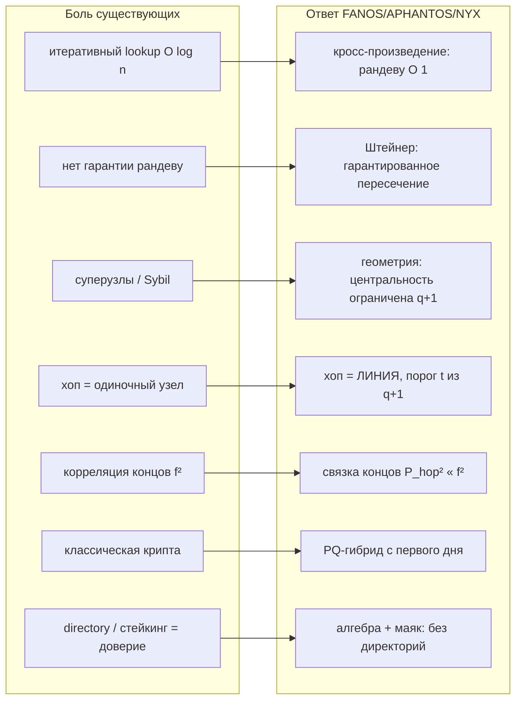
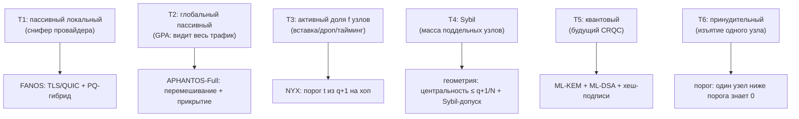
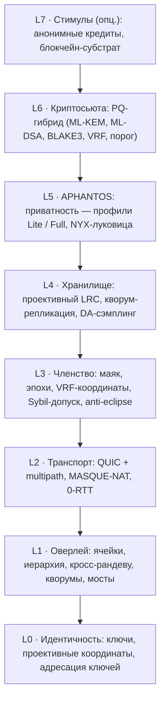
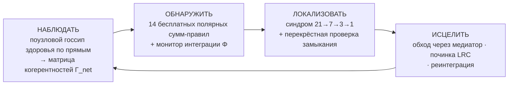
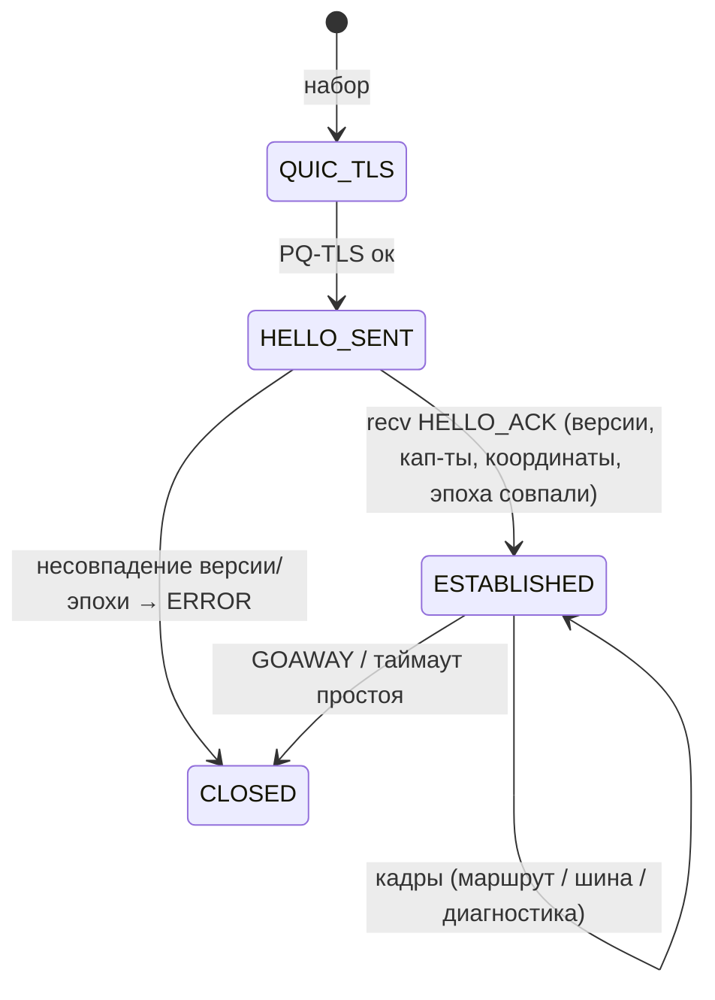

# FANOS

> *«Структура живёт не в парах, а в тройках. Сеть, которая это знает, не ищет — она вычисляет».*
> — рабочий принцип третьего порядка (УГМ)

:::info Статус документа
**Версия 0.1** (референсная архитектура). Статусы результатов размечены дисциплиной корпуса **[Т]** / **[С]** / **[Г]** / **[П]** (см. блок ниже). **Происхождение:** УГМ, Открытие 7 (проективно-структурированная распределённая система) + расслоение Серра ([gap-thermodynamics](/docs/core/dynamics/gap-thermodynamics)) + Σ-исчисление (Штейнер/Штейн). **Лицензия** (предполагается открытая): CERN-OHL-S v2 (аппаратные профили) + Apache-2.0/MIT (код) + CC-BY-SA (документ). **Интерактив:** [живая плоскость Фано и калькулятор безопасности](pathname:///fanos/fanos-playground.html) (страница сайта, работает офлайн). **Верификатор:** [`/fanos/fanos_verify.py`](pathname:///fanos/fanos_verify.py).
:::

## Наименование и тематическая триада

Протокол назван по греческому корню **φαν-** («являть, светить»), от которого происходит и слово *феномен* (являющееся), и фамилия Джино **Фано** — автора конечной проективной плоскости PG(2,2), лежащей в основе всей конструкции. Три компонента образуют смысловую триаду *функции* «свет — невидимость — ночь»; четвёртый, **DIAKRISIS**, — *рефлексивная* способность: ячейка, наблюдающая саму себя:

| Компонент | Греческий корень | Значение | Роль в протоколе |
|---|---|---|---|
| **FANOS** | φανός | «фонарь, светоч; явленное» | Базовый публичный протокол: адресация, маршрутизация, хранение, кворумы |
| **APHANTOS** | ἄφαντος | «невидимый, исчезнувший» | Опциональный слой анонимности (mixnet-класс) |
| **NYX** | Νύξ | «Ночь» (богиня сокрытия) | Пороговая пучковая луковичная маршрутизация внутри APHANTOS |
| **DIAKRISIS** | διάκρισις | «различение; отделение истинного от ложного» | Самодиагностика и самоисцеление при отказах узлов/сегментов (Часть VI) |
| **CALYPSO** | Καλυψώ | «сокрывательница» (нимфа, спрятавшая Одиссея) | Анонимные скрытые сервисы без директории и без единого хоста (Часть XII) |

Публичный слой «светит» (маршруты верифицируемы и эффективны); при включении APHANTOS трафик «исчезает» в структурно-сбалансированном шуме; NYX реализует сокрытие как композируемую последовательность пороговых групп. DIAKRISIS назван по *способности*, а не по условию освещённости, потому что это не ещё один способ маршрутизировать — это сеть, обращающая взгляд на себя: после того как NYX спрятал трафик, именно DIAKRISIS всё ещё отличает здоровую ячейку от повреждённой, крах от лжи, отток узлов от разбиения. Имя намеренно разделено с корпусной теорией различения *Diakrisis* (διάκρισις, распознавание подлинного): диагностика отказа *и есть* различение, проведённое на той же семеричной структуре.

---

## Оглавление

- **Часть I.** Мотивация: что сломано в Kademlia, Tor, Nym, Lokinet
- **Часть II.** Математический фундамент: PG(2,q), Штейнер, кросс-произведение, PSL/PGL, коды, матрица когерентностей, принцип третьего порядка
- **Часть III.** Системная модель, модель угроз и модель отказов
- **Часть IV.** Архитектура: слои L0–L7
- **Часть V.** NYX — эволюция луковичной маршрутизации (ядро новизны)
- **Часть VI.** DIAKRISIS — самодиагностика при отказах узлов и сегментов (ядро новизны)
- **Часть VII.** Проволочный протокол, форматы данных и интероперабельность (реализуй на любом языке)
- **Часть VIII.** Анализ безопасности (количественный) + red-team по всем уровням
- **Часть IX.** Производительность (количественный)
- **Часть X.** Прикладные надстройки: блокчейн / mixnet / VPN
- **Часть XI.** Реализация, поверхности интеграции (API / SOCKS5 / VPN / embedded) и портируемость
- **Часть XII.** CALYPSO — анонимные скрытые сервисы
- **Часть XIII.** Сравнение с существующими протоколами
- **Часть XIV.** Дорожная карта
- **Часть XV.** Ограничения и открытые задачи (честно)
- **Часть XVI.** Связь с УГМ-корпусом
- **Часть XVII.** Синтез распределённого познания: УГМ → SYNARC → FANOS
- **Приложения:** глоссарий, псевдокод, тест-векторы, интерактив

:::note Дисциплина статусов
Как и в основном корпусе УГМ, каждое нетривиальное утверждение размечено: **[Т]** — теорема (строго доказано, часто проверено вычислением); **[С]** — условно (верно при явно названном допущении); **[Г]** — гипотеза (сформулировано, требует доказательства/аудита); **[П]** — программа (направление работ). Криптографическая честность: **новизна FANOS — архитектурная композиция проверенных примитивов, а не новые предположения о стойкости.** Единственная принципиально новая конструкция (пороговый пучковый пакет Tessera, §V) помечена **[П]** — до продакшена нужен формальный криптоанализ. Мы НЕ изобретаем новую математическую стойкость «с нуля»: это было бы безответственно для боевого протокола.
:::

Все количественные утверждения этого документа воспроизводятся скриптом-верификатором [`/fanos/fanos_verify.py`](pathname:///fanos/fanos_verify.py) (V1–V10: проективная геометрия, кворумы, кривая безопасности, масштабирование; **V11–V21: слой самодиагностики DIAKRISIS, окно коллективного субъекта и разрешение многих отказов**) — `python3 fanos_verify.py`. Числа в таблицах — посчитанные, не иллюстративные.

---

# Часть I. Мотивация: что сломано

:::tip Ориентир
Прежде чем строить новое, назовём боль существующих систем предметно. Четыре семейства протоколов — распределённые хеш-таблицы (DHT), луковичные сети (Tor/Lokinet), миксити (Nym), — каждое решило одну задачу ценой другой. FANOS берёт проективную геометрию как единый фундамент, снимающий несколько компромиссов сразу.
:::

## 1.1 Распределённые хеш-таблицы (Kademlia, Chord)

Kademlia — фундамент BitTorrent, IPFS, Ethereum discovery, libp2p. Что болит:

- **Итеративный поиск O(log n) с многими RTT.** Каждый lookup — цепочка запросов «кто ближе к ключу», по одному раунду на шаг. При n=10⁹ это ~30 последовательных сетевых обменов.
- **Нет гарантии пересечения.** Два узла, ищущие «рядом», не обязаны встретиться в детерминированной точке — рандеву вероятностно.
- **Горячие точки и суперузлы.** Распределение нагрузки статистическое; узел может набрать непропорциональную центральность (эклипс-атаки, Sybil-доминирование в регионе ключей).
- **Хрупкость к Sybil.** Контроль области идентификаторов даёт контроль над маршрутами к соответствующим ключам.

## 1.2 Луковичная маршрутизация (Tor, Lokinet)

- **Корреляция концов [известная слабость].** Глобальный пассивный наблюдатель или противник, владеющий долей *f* ретрансляторов, связывает вход и выход цепочки с вероятностью ≈ *f²* (владеет guard и exit). Для *f*=0.2 это ≈ 4% на цепочку — и накапливается ротацией.
- **Одиночный ретранслятор = одна точка компрометации.** Скомпрометированный узел немедленно раскрывает соседние хопы своего участка.
- **Классическая криптография.** Tor исторически не постквантовый; запись трафика сегодня → дешифровка завтра («harvest now, decrypt later»).
- **Централизованные directory authorities** (Tor) или **стейкинг-реестр** (Lokinet/Oxen) как точка доверия/атаки.
- **Предсказуемость пути.** Цепочка фиксируется при установке; guard discovery — реальный вектор деанонимизации.

## 1.3 Миксити (Nym / Loopix)

Nym — сильнейшая на сегодня практическая анонимность (стойкость к глобальному наблюдателю через статистическое перемешивание + прикрывающий трафик). Что можно улучшить:

- **Доверие к перемешиванию статистическое, не верифицируемое.** Клиент не получает *криптографического* доказательства, что микс действительно перемешал (полагается на пуассоновские задержки + экономические стимулы).
- **Хоп = одиночный микс-узел.** Как и в Tor, компрометация узла раскрывает его локальную линковку (перемешивание маскирует тайминг, но не структуру, если узел честно логирует вход-выход).
- **Стратификация задаётся ad-hoc VRF-весами.** Равномерность выбора пути — вопрос конфигурации, а не структурная теорема.
- **Sybil-стойкость через стейкинг** привязывает идентичность к капиталу.

## 1.4 Что предлагает FANOS (сводно)



---

# Часть II. Математический фундамент

:::tip Ориентир
FANOS — прямое инженерное следствие УГМ-находки о том, что специфическая структура семёрки невидима для парной статистики и целиком проявлена начиная с троек (принцип третьего порядка). В сети это переводится так: **не связывай узлы попарно — организуй их в тройки/линии проективной плоскости.** Ниже — весь нужный аппарат, с проверенными свойствами.
:::

## 2.1 Конечная проективная плоскость PG(2,q)

Возьмём конечное поле GF(q) (q — степень простого; в референс-реализации GF(2^m) ради битовой эффективности). **Точки** плоскости — одномерные подпространства GF(q)³, то есть ненулевые тройки координат `[x:y:z]` с точностью до умножения на скаляр. **Прямые** — двумерные подпространства, тоже задаются тройками `[a:b:c]`. Инцидентность «точка на прямой» — обнуление скалярного произведения: `ax+by+cz = 0`.

**Базовые параметры [Т]** (проверено, `fanos_verify.py` V1):

| q | N = точек = прямых | точек на прямой (q+1) | прямых через точку (q+1) | группа коллинеаций \|PGL(3,q)\| |
|---:|---:|---:|---:|---:|
| 2 | 7 | 3 | 3 | 168 |
| 7 | 57 | 8 | 8 | 5 630 688 |
| 13 | 183 | 14 | 14 | 810 534 816 |
| 31 | 993 | 32 | 32 | 851 974 934 400 |

Общая формула: **N = q² + q + 1**, размер прямой = q+1, число прямых через точку = q+1. Самодуальность: точки и прямые взаимозаменяемы.

## 2.2 Три несущих свойства

**Свойство Штейнера S(2,3,q) [Т].** Любые две точки лежат ровно на одной общей прямой. При q=2 это в точности система троек Штейнера S(2,3,7) — плоскость Фано УГМ (21 пара покрыта 7 линиями по разу, проверено ранее).

**Двойственное свойство (кворумы Маэкавы) [Т].** Любые две прямые пересекаются ровно в одной точке (проверено V1 для q≤31). Отсюда — **кворумная система**: прямая = кворум размера q+1 ≈ √N; любые два кворума пересекаются. Это классический результат Маэкавы (1985) о взаимном исключении за O(√N); FANOS переиспользует его для консенсуса и репликации.

**Кросс-произведение = соединение и пересечение [Т].** Прямая через две точки u, v — это их векторное произведение `u × v` в GF(q)³; точка пересечения двух прямых — тоже их векторное произведение. Тождество `(u×v)·u = 0` выполняется над любым коммутативным кольцом. **Следствие для сети: рандеву — одна операция в поле, без всякого поиска** (проверено V2, тест-вектор в PG(2,7): `[1:0:0] × [0:1:0] = [0:0:1]`, обе точки на прямой; мост двух прямых восстанавливает `[1:0:0]`).

<details>
<summary><b>Почему это глубже, чем «удобная адресация» (раскрыть)</b></summary>

Граф коллинеарности проективной плоскости — **полный**: каждая пара точек соединена (лежит на общей прямой). Поэтому «расстояние» между узлами не в числе хопов, а в *структуре разделяемых групп*: N узлов, но всего N ≈ q² прямых, каждый узел ровно в q+1 ≈ √N прямых, и любые две прямые пересекаются. Это не топология «кто с кем соединён», а топология «кто в какой кворум входит» — а кворумы устроены так, что пересечения гарантированы алгеброй. Именно это снимает необходимость в DHT: ответ на «кто отвечает за ключ k», «какую группу делят u и v», «кто мост между группами A и B» — вычисляется, а не ищется.
</details>

## 2.3 Группа автоморфизмов и равномерность

Коллинеации PG(2,q) образуют группу PGL(3,q) (для простого q; в общем случае PΓL(3,q)). При q=2 это PGL(3,2) ≅ PSL(2,7) порядка **168** — та самая группа Aut(Фано) УГМ. Группа действует **2-транзитивно** на точках: любую упорядоченную пару можно перевести в любую другую. Инженерное следствие: **все узлы структурно эквивалентны, все пути симметричны** — равномерность распределения путей есть теорема о транзитивности, а не результат подбора весов (в отличие от Nym).

## 2.4 Врождённые коды коррекции ошибок

Наименьшая ячейка q=2 — плоскость Фано — **совпадает** с кодом Хэмминга(7,4): 16 кодовых слов, ровно 7 слов веса 3 = 7 прямых Фано (проверено V10, и ранее в `uhm_discoveries.py` S6). Квантовый код Стина = CSS(Хэмминг, Хэмминг), дистанция 3. Отсюда:

- **[Т]** любая FANOS-ячейка несёт врождённую синдромную диагностику (пирамида Σ-исчисления УГМ: 21 связь → 7 проверок-прямых → 3 бита синдрома → 1 вердикт);
- **[Т]** проективная плоскость даёт локально-восстановимый код (LRC): потерянный узел (точка) восстанавливается из любой из своих q+1 прямых. Локальность r = q чтений, число независимых групп восстановления = q+1, избыточность ≈ (q+1)/q (проверено V9: для q=31 это 1.032×).

## 2.5 Принцип третьего порядка и карта медиаторов (импорт из УГМ)

Ключевая находка, задающая всю философию протокола (проверена перебором орбит, `uhm_discoveries.py` S2–S4):

> Под действием Aut орбита **пар** — одна (21 пара эквивалентна ⇒ парная статистика структуру НЕ видит); орбит **троек** — две (7 прямых vs 28 не-прямых ⇒ структура впервые различима на тройках).

В сети это означает: **связывать узлы попарно — значит работать в слое, где проективная структура невидима.** Все преимущества FANOS живут на уровне троек и прямых. Карта медиаторов (у каждой пары единственный «посредник» — третья точка их прямой, `k*(i,j)`) переводится в **детерминированную маршрутизацию-восстановление**: путь (i→j) при отказе прямого канала восстанавливается только через `k* = ` третью точку их общей прямой — fallback без таблиц.

## 2.6 Расслоение Серра и холономия (фундамент для NYX)

Из `gap-thermodynamics.md` (Теорема 1.1 [Т]): пространство отображений несёт структуру **расслоения Серра** с базой внешних наблюдаемых и слоем внутренних фаз, а обход замкнутого контура даёт **холономию** `Hol(C) = P·exp(∮ A)` — нетривиальный геометрический сдвиг фаз (аналог фазы Берри). NYX (Часть V) использует это буквально: ключевой ратчет луковицы индексируется связностью на инцидентном расслоении, а холономия пути служит компактным само-аутентификатором маршрута.

## 2.7 Матрица когерентностей сети и её живые меры {#coherence-matrix}

:::tip Ориентир
До сих пор мы пользовались *комбинаторикой* плоскости (точки, прямые, кворумы). УГМ предлагает ещё один объект, аналога которому у существующих оверлеев нет: **матрицу когерентностей** плоскости Γ — небольшой плотный оператор, скалярные инварианты которого суть живые показания здоровья ячейки. Здесь мы его определяем вместе с тремя мерами; Часть VI (DIAKRISIS) превращает их в систему самодиагностики. Это конкретный ответ на вопрос «что даёт сети парадигма матрицы когерентностей».
:::

Ячейка из `N = q²+q+1` узлов — не только набор кворумов; в работе у неё есть **поведение**. Пусть `a_i(t)` — сигнал активности узла `i` на окне наблюдения (переданные байты, живость, нагрузка — любая поузловая наблюдаемая). Выборочная **корреляционная матрица** `C` этих сигналов размера `N × N` симметрична, положительно полуопределена и с единичной диагональю; её нормированная на след форма

```
Γ_net = C / N          (эрмитова, PSD, Tr Γ_net = 1)
```

есть полноценная **матрица когерентностей** в `D(ℂ^N)` — ровно тот объект, что изучает корпус УГМ. Для базовой ячейки `q=2` это буквально `7 × 7` Γ над семью секторами `A,S,D,L,E,O,U` ([матрица когерентностей](/docs/core/structure/dimension-u#мера-интеграции-φ)). Значит, ячейка FANOS *и есть* Холон в корпусном смысле, и наследует три его скалярных инварианта:

| Мера | Формула на `Γ_net` | Что показывает | Порог |
|---|---|---|---|
| **Интеграция** `Φ` | `Σ_{i≠j}|γ_ij|² / Σ_i γ_ii²` ([Φ [Т]](/docs/core/structure/dimension-u#мера-интеграции-φ)) | насколько ячейка «больше суммы частей» (межузловая связанность) | `Φ_th = 1` (T-129 [Т]) |
| **Структурированность** `P` | `Tr(Γ_net²)` (чистота) | насколько ячейка далека от бесформенной однородной сети | `P_crit = 2/7` [Т] |
| **Рефлексия** `R` | `1/(7P)` на равнодиагональной страте | качество/доля самомодели ячейки | `R_th = 1/3` [Т] |

**Порог системной корреляции `r* = 1/√6 ≈ 0.408` [Т].** На равнокоррелированной страте — все внедиагональные корреляции равны средней `r` — меры сворачиваются в замкнутую форму (проверено `fanos_verify.py` V15):

```
Φ_net = 6r²,     P_net = (1 + 6r²)/7,     Φ = 7P − 1.
```

Отсюда `Φ = 1 ⟺ P = 2/7 ⟺ r = 1/√6`: пороги интеграции и структуры совпадают при **единственной критической средней корреляции**. Это фазовая линия для всей ячейки:

- **`r < 1/√6` (Φ < 1): диверсифицированная / устойчивая.** Поведения узлов слабо связаны; ячейка *до-интеграционна*. Локальный отказ остаётся локальным — диверсификация «работает», ни один триггер не каскадирует.
- **`r > 1/√6` (Φ > 1): системная.** Ячейка «движется как один субъект»: поведения сильно связаны, поэтому единичное возмущение расходится по всей ячейке. Это ровно **режим каскадного отказа**, и он обнаружим *до* того, как хоть один узел упал, — по одной лишь структуре корреляций.

Это Открытие 9 инженерного каталога УГМ (системный риск равнокоррелированного 7-портфеля), переставленное как **раннее предупреждение о надёжности**: монитор, следящий за средней корреляцией поведений, пересекающей `0.408`, видит зарождающийся каскад на целый режим раньше любого сигнала живости. Ни один DHT- или луковичный оверлей такой величины не даёт — потому что ни один не несёт матрицы когерентностей.

:::note Почему это недоступно Kademlia/Tor
Их состояние — таблица маршрутизации, то есть *граф*, единственный спектральный инвариант которого — связность. Матрица когерентностей — это *оператор плотности*: у неё есть чистота, интеграция, самомодель и критическая корреляция. Именно принцип третьего порядка (§2.5, §2.8) делает эти инварианты осмысленными — они читают структуру троек, которую граф увидеть не может.
:::

## 2.8 Принцип третьего порядка, заострённый: слепота первого порядка [Т] {#third-order-blindness}

Раздел 2.5 утверждал, что парная статистика не видит структуру плоскости. Вот точная теорема, потому что DIAKRISIS (Часть VI) на ней держится: **причина, по которой сеть из «пингов» так плохо диагностирует, — в том, что она доказуемо слепа к Фано.**

**Слепота первого порядка [Т]** (проверено V11 и канонически — линейный слой [Фано-отпечатка](/docs/applied/research/fano-fingerprint)). Сложим матрицы смежности семи прямых Фано. Результат в точности равен

```
Σ_p A(line_p) = J − I        (J — матрица из единиц, I — единичная),
```

и его спектр — спектр полного графа `K₇`: одно собственное значение `6` и `−1` кратности шесть. **Значит, любая равновесная парная статистика, построенная по прямым, неотличима от бесструктурной полной связности.** Пинг/heartbeat-сеть — мониторинговый костяк каждого существующего оверлея — живёт ровно в этом слепом слое: она скажет, *что* линк поднят или упал, но структура семёрки (какие тройки — прямые, кто чей медиатор, где прячется лжец) спектрально ей невидима.

Структура впервые проявляется на **третьем порядке** (орбита пар одна; две орбиты троек — 7 прямых против 28 не-прямых, §2.5). Следствия для мониторинга, уточнённые в Части VI:

- **Обнаружение** отказов, которые важны (лживое двоемыслие, серые сбои), обязано читать *тройки*, а не пары — через полярные суммовые правила [T-226](/docs/applied/research/fano-fingerprint#t-226) и перекрёстные проверки закона замыкания §2.5.
- **Локализация** едет по Σ-компрессионной пирамиде `21 → 7 → 3 → 1` из [T-225](/docs/applied/research/syndrome-calculus#t-225): 21 парное показание сворачивается в 7 линий-тем, в 3-битный синдром, в 1-битный вердикт.
- **Вмешательство** (починка, обход) работает через **медиатор** `k*(i,j)` — корпусную **полярную точку** `π(i,j)`, третью точку прямой пары, с октонионным знаком `e_i·e_j = ±e_{π(i,j)}` ([T-226 §2](/docs/applied/research/fano-fingerprint#полярное-разбиение)).

---

# Часть III. Системная модель и модель угроз

## 3.1 Сущности

| Сущность | Определение |
|---|---|
| **Узел (точка)** | Участник с ключевой парой; координата `[x:y:z] ∈ PG(2,q)` присваивается VRF от публичного ключа |
| **Прямая (линия/кворум/шина)** | Группа из q+1 узлов; несёт мультикаст-шину, кворум-голос, пороговую группу |
| **Ячейка** | Одна плоскость PG(2,q), N = q²+q+1 узлов; единица локальности |
| **Иерархия** | Рекурсивная композиция ячеек; ячейка = «точка» родительской ячейки |
| **Эпоха** | Интервал, на котором фиксирован маяк случайности и присвоение координат; в конце — перетасовка |
| **Маяк** | Пороговый источник публичной непредсказуемой случайности (drand-класс) |

## 3.2 Модель угроз (профили противника)



**Ключевые допущения безопасности** (явно, чтобы числа §VIII были честны):

1. Присвоение координат VRF-верифицируемо и не поддаётся дешёвому гриндингу (§4.0) ⇒ противник с долей *f* узлов оказывается ≈ долей *f* в каждой прямой (случайное размещение). **[С]** при работающем Sybil-допуске.
2. Противник не может предсказать эпоховую перетасовку (маяк непредсказуем) ⇒ не может заранее «осесть» в целевой прямой.
3. Порог t выбран так, что t > (доля честных, гарантированно онлайн) нарушить нельзя без владения ≥ t членами прямой.

## 3.3 Модель отказов (что должна диагностировать DIAKRISIS) {#failure-model}

Безопасность (противник, *выбирающий* вредить) и надёжность (компоненты, *отказывающие*) — разные оси; §3.2 покрыл первую, эта — вторую. Живая ячейка обязана переживать и самодиагностировать нижеследующее, что Часть VI разбирает по пунктам:

| Отказ | Что происходит | Виден на первом порядке? | Ответ DIAKRISIS |
|---|---|---|---|
| **Крах / отток** | узел перестаёт отвечать | **да** (heartbeat истекает) | линейно-локальная живость; починка LRC (§6.8) |
| **Серый / деградация** | узел отвечает, но медленно/с потерями | частично (дрейф темпа) | полярные суммовые правила темпов, T-226 (§6.3) |
| **Византийский / двоемыслие** | узел *поднят*, но искажает/неправильно маршрутизирует и лжёт об этом | **нет** — парно здоров | перекрёстная проверка замыкания на третьем порядке (§6.5) |
| **Затмение (eclipse)** | окружение узла захвачено, чтобы его изолировать | структурно ограничено | anti-eclipse: должны пасть все q+1 прямых (§6.6) |
| **Разбиение / потеря сегмента** | целая прямая/подъячейка отпадает или раскалывается | через связность | теорема о неразбиваемости + монитор Φ (§6.6) |

Несущее наблюдение — **византийская строка**: узел, держащий свои heartbeat'ы зелёными и при этом искажающий трафик, *невидим мониторингу первого порядка* (§2.8). Его диагностика — не довесок, а сама причина, по которой диагностический план обязан быть третьего порядка. Две честные оговорки, перенесённые в §6:

1. Крах и разбиение обнаружимы на первом порядке; геометрия покупает для них *локализацию и починку*, а не обнаружение.
2. Локализация стратифицирована (§6.3): крахи восстанавливаются до **трёх** на ячейку (отшелушивание LRC; первый провал — гиперовал), слой 7 тем закрепляет **два** византийских отказа точно, и лишь ≥3 византийца (или крах-гиперовал) эскалируют к родителю.

---

# Часть IV. Архитектура: слои L0–L7



:::note DIAKRISIS — план, а не слой
Восемь слоёв L0–L7 — это *прямой* стек (как сообщение строится, маршрутизируется, прячется, доставляется). Самодиагностика (Часть VI, DIAKRISIS) ортогональна им всем: она читает здоровье L1 (оверлей), L3 (членство), L4 (хранилище) и L5 (приватность) единой рефлексивной петлёй, используя ту же проективную структуру, по которой эти слои маршрутизируют. Думайте о L0–L7 как о теле, а о DIAKRISIS — как о проприоцепции, чувстве, которым сеть ощущает собственное состояние. Именно поэтому она рисуется сквозным планом, а не слоем.
:::

## L0. Идентичность и адресация

- **Ключевая пара:** гибрид Ed25519 + ML-DSA-65 (подпись), X25519 + ML-KEM-768 (KEM). Долгосрочный идентификатор = хеш связки публичных ключей.
- **Координата узла:** `coord = MapToPoint( VRF_beacon(pubkey, epoch) )` — VRF привязывает точку к эпохе, перетасовка при смене эпохи. `MapToPoint` — равномерное отображение 256-битного выхода в `[x:y:z] ∈ PG(2,q)` (отбрасывание нулевого вектора, нормализация первого ненулевого к 1).
- **Адресация контента:** ключ ресурса `k` отображается в точку `MapToPoint(H(k))`; ответственный узел — ближайшая занятая точка (согласованное хеширование на проективных координатах). Реплики — q+1 узлов прямых, проходящих через эту точку (LRC, L4).

## L1. Оверлей и маршрутизация

**Рандеву [Т, O(1)].** Чтобы связаться u→v: обе стороны на единственной прямой `L = u × v`; отправитель публикует в шину L, получатель слушает все свои q+1 шин. Никакого поиска.

**Мост между группами [Т, O(1)].** Две шины `L₁, L₂` пересекаются в единственном узле `p = L₁ × L₂` — детерминированный, нагрузочно-сбалансированный шлюз. Агрегационные деревья мультикаста алгебраически предопределены.

**Иерархия (масштаб) [Т].** Одна плоскость держит N=q²+q+1 узлов; для интернет-масштаба — рекурсия ячеек (проверено V4):

| ячейка q | N_ячейки | уровней k | всего узлов | состояние ≈ k·N | глубина рандеву |
|---:|---:|---:|---:|---:|---:|
| 31 | 993 | 2 | 986 049 | 1 986 | 2 |
| 31 | 993 | 3 | 979 146 657 | 2 979 | 3 |
| 127 | 16 257 | 2 | 264 290 049 | 32 514 | 2 |
| 127 | 16 257 | 3 | **4 296 563 326 593** | 48 771 | 3 |

:::warning Честность масштабирования
Мы **не** заявляем O(√n) маршрутного состояния для одной плоскости — граф коллинеарности полный, и в одной плоскости узел структурно «видит всех». Масштаб достигается **иерархией ячеек**: асимптотика состояния/глубины — O(log n), как у Kademlia. Выигрыш FANOS не в асимптотике хопов, а в: (1) детерминированном рандеву за 1 сообщение на уровень (без итеративного зондирования, меньше RTT на практике); (2) гарантированном пересечении кворумов (консенсус/репликация «бесплатно»); (3) структурной балансировке и потолке центральности (anti-Sybil); (4) бесплатном multipath (q+1 путей); (5) LRC-оптимальном хранении. Эти преимущества реальны даже при равной с DHT асимптотике.
:::

## L2. Транспорт

- **QUIC (RFC 9000/9001)** в userspace: 0-RTT возобновление, встроенное шифрование, мультиплексирование потоков без head-of-line blocking.
- **Multipath QUIC:** q+1 почти-непересекающихся путей между ячейками (члены общей прямой) → агрегирование пропускной способности и мгновенный failover.
- **MASQUE (RFC 9298)** для проксирования/обхода NAT; ICE-подобный hole-punching через узлы-мосты.
- **Полностью userspace, без ядра** ⇒ мультиплатформенность (Часть XI).

## L3. Членство, эпохи, маяк, Sybil-допуск

- **Маяк случайности [Т при пороговом BLS]:** drand-класс, порог honest-majority среди «якорных» прямых; выдаёт публичный непредсказуемый seed на эпоху. Постквантовый вариант — [П] (хеш-/решёточные VRF-маяки — активное направление).
- **Эпоховая перетасовка:** координаты пересчитываются VRF от нового seed ⇒ противник не может заранее занять целевую прямую (защита от предсказания путей и guard-discovery).
- **Sybil-допуск (подключаемый):** три профиля — (a) **PoW-допуск** (memory-hard, для открытых сетей); (b) **стейк/облигация** (для блокчейн-надстройки); (c) **web-of-trust** (для федераций). Независимо от профиля работает структурный потолок:
- **Структурный потолок центральности [Т]** (проверено V3): каждый узел ровно в q+1 из N прямых = фиксированная доля (q=31 → 3.22%). **Центральность нельзя «купить»** — членство в прямых задаётся координатами. Sybil-узлы не становятся суперузлами.
- **Anti-eclipse:** q+1 независимых прямых на узел ⇒ чтобы изолировать узел, надо контролировать все его q+1 прямых одновременно.

## L4. Хранилище и репликация

- **Проективный LRC [Т]:** данные точки эрзац-кодируются по её q+1 прямым; потеря узла восстанавливается из любой одной прямой (локальность q, доступность q+1). Избыточность (q+1)/q → 1 при росте q.
- **Кворум-согласованность [Т]:** запись в кворум-прямую W, чтение из кворум-прямой R; `W ∩ R ≠ ∅` гарантировано (Маэкава) ⇒ линеаризуемость без отдельного координатора.
- **DA-сэмплинг (data availability):** для блокдчейн-надстройки — выборочная проверка доступности по прямым (каждая прямая = выборка); Штейнер гарантирует покрытие.

## L5. APHANTOS (обзор; детально — Часть V)

Три профиля на **одном** субстрате (переключение — «диск» задержки/анонимности):

| Профиль | Хоп | Задержка | Класс стойкости | Аналог |
|---|---|---|---|---|
| **FANOS-Direct** | открытый | минимум | нет анонимности | libp2p/QUIC |
| **APHANTOS-Lite** | одиночный узел (Sphinx-класс), PQ | низкая | ≈ Tor, но PQ + непредсказуемые эпохи + сбалансированное прикрытие | Tor/Lokinet |
| **APHANTOS-Full** | **прямая (порог t из q+1)** + верифицируемое перемешивание + пуассоновские задержки | настраиваемая | > Nym (порог + верифицируемость + алгебраическое рандеву) | Nym/Loopix |

## L6. Криптографическая сьюта

:::note Принцип
Все примитивы — **проверенные и постквантовые/гибридные**. Новизна — в композиции, не в стойкости.
:::

| Назначение | Примитив | Статус |
|---|---|---|
| KEM (обмен ключом) | X25519 **+** ML-KEM-768 (гибрид, KDF-комбайнер SHAKE256) | стандарт/PQ |
| Подпись | Ed25519 **+** ML-DSA-65; консервативный опц. SLH-DSA (SPHINCS+) | стандарт/PQ |
| AEAD | ChaCha20-Poly1305 (портируемость) / AES-256-GCM (HW) | стандарт |
| Хеш/XOF | BLAKE3 (скорость) + SHAKE256 (PQ-KDF) | стандарт |
| VRF | ECVRF-Edwards25519 (RFC 9381); PQ-VRF | стандарт / [П] |
| Маяк | пороговый BLS (drand); PQ-маяк | стандарт / [П] |
| Пороговое разделение | Shamir SSS + Feldman/Pedersen VSS; DKG (GJKR) | стандарт |
| Пороговое дешифрование | пороговый KEM/ElGamal, неинтерактивная сборка частичных | стандарт |
| Верифицируемое перемешивание | аргумент Байер–Грот (классический); PQ-shuffle | стандарт / [П] |
| Анонимные кредиты | VOPRF Privacy Pass (RFC 9578) / BBS+ | стандарт |
| Пакет | Tessera (Sphinx-производный, пороговый, PQ) | **[П] требует аудита** |

## L7. Стимулы (опционально)

- **Анонимные кредиты за ретрансляцию:** слепые токены (Privacy Pass VOPRF) ⇒ оплата не деанонимизирует (в отличие от стейкинга, привязывающего идентичность к капиталу).
- **Блокчейн-субстрат:** см. Часть X — кворум-прямые как комитеты валидаторов с гарантированным пересечением.

---

# Часть V. NYX — эволюция луковичной маршрутизации

:::tip Ориентир
Это ядро новизны и прямой ответ на «спроектируй более продвинутую луковичную маршрутизацию с учётом фундаментальных исследований». Классическая луковица (Tor) заворачивает сообщение в L слоёв шифрования вдоль пути из *одиночных* узлов. NYX меняет три вещи разом: (1) хоп — не узел, а **прямая** (пороговая группа); (2) путь — не случайная цепочка, а **геометрический флаг** инцидентных пар «точка–прямая», равномерный по теореме о транзитивности; (3) прямая секретность обеспечивается **холономным ратчетом** на расслоении Серра, а не только per-hop ключами. Ниже — по порядку.
:::

## 5.1 Классическая луковица и её пределы

В Tor сообщение M шифруется послойно ключами хопов `H₁…H_L`: `E₁(E₂(…E_L(M)))`. Каждый ретранслятор снимает свой слой, узнаёт предыдущий и следующий хоп. Пределы (Часть I): одиночный узел = точка компрометации; корреляция концов f²; фиксированный предсказуемый путь; классическая крипта; директории.

## 5.2 NYX-нововведение 1 — пороговый пучковый слой

**Идея.** Каждый слой луковицы пилится не одним узлом, а **порогом t из q+1** членов прямой. Ни один узел в одиночку не может снять слой (ниже порога он не знает *ничего*). Термин «пучок» (sheaf/beam) двойной: это и математический пучок над прямой, и «расщепление» сообщения, как луча в призме.

**Механизм.** При формировании ячейки члены каждой прямой проводят DKG (распределённую генерацию ключа, GJKR) ⇒ у прямой есть публичный ключ `PK_L` и у каждого члена — доля секрета `sk_i` (Shamir). Отправитель шифрует слой на `PK_L`. Чтобы снять слой, ≥ t членов публикуют частичные дешифрования, которые неинтерактивно собираются (пороговый KEM). Маршрутная информация «куда дальше» раскрывается только по достижении порога.

**Что это даёт [Т, кривая посчитана]:** противник, владеющий долей *f* узлов (случайно размещённых), ломает один хоп с вероятностью `P_hop = P(Binom(q+1, f) ≥ t)` — биномиальный хвост. Связка концов (как guard+exit у Tor) требует сломать первый И последний хоп: `P_link = P_hop²`.

**Кривая безопасности** (проверено V5; сравнение с Tor `f²`):

| прямая q+1 | порог t | f=0.10 | f=0.20 | f=0.30 | f=0.50 |
|---:|---:|---:|---:|---:|---:|
| 8 | 6 | 5.5·10⁻¹⁰ | 1.5·10⁻⁶ | 1.3·10⁻⁴ | 2.1·10⁻² |
| 8 | 7 | 5.3·10⁻¹³ | 7.1·10⁻⁹ | 1.7·10⁻⁶ | 1.2·10⁻³ |
| 14 | 10 | 4.7·10⁻¹⁵ | 2.1·10⁻⁹ | 2.8·10⁻⁶ | 8.1·10⁻³ |
| 32 | 22 | 5.6·10⁻³⁰ | 1.1·10⁻¹⁷ | 4.9·10⁻¹¹ | 6.3·10⁻⁴ |
| **Tor (f²)** | — | 1.0·10⁻² | 4.0·10⁻² | 9.0·10⁻² | 2.5·10⁻¹ |

**Выигрыш над Tor** при f=0.2: для (q+1=8, t=6) — **×26 000**; для (q+1=14, t=10) — **×18 800 000**. Полная трассировка всех L хопов ещё круче — `P_hop^L`: для (8,6), f=0.2, L=3 → **1.9·10⁻⁹** (Tor ≈ 0.04).

:::note Цена порога — доступность и латентность
Порог t требует t честных членов онлайн (доступность — биномиально-дополнительная задача) и один раунд сборки частичных дешифрований на хоп. Поэтому пороговый профиль — это **APHANTOS-Full** (высокая стойкость, выше латентность); для низколатентных сценариев есть **APHANTOS-Lite** (одиночный узел, Sphinx-класс). Диск λ (§5.5) непрерывно интерполирует.
:::

## 5.3 NYX-нововведение 2 — геометрический путь (флаг), а не случайная цепочка

**Идея.** Путь NYX — последовательность инцидентных пар «точка–прямая» (в проективной геометрии — **флаг**): `p₀ ∈ L₁ ∋ p₁ ∈ L₂ ∋ p₂ …`. Соседние прямые пересекаются (всегда, по двойственному Штейнеру), точка пересечения — узел-передатчик. Поскольку **PGL(3,q) действует транзитивно на флагах [Т]**, распределение путей *провабельно равномерно*, и клиент может это верифицировать алгеброй — не полагаясь на честность VRF-весов (проблема Nym).

**Против атак пересечения:** непредсказуемая эпоховая перетасовка (L3) означает, что множество допустимых прямых на следующую эпоху заранее неизвестно ⇒ долговременное таргетирование пути невозможно.

## 5.4 NYX-нововведение 3 — холономный ратчет (импорт расслоения Серра)

**Идея.** На инцидентном расслоении (база — точки/наблюдаемое, слой — фазы; §2.6) задана связность `A`. При каждом хопе применяется ключевое преобразование (blinding, как в Sphinx), но **выведенное из связности инцидентности**: множитель хопа `β_k = KDF(A(p_{k-1}, p_k))`. Композиция вдоль пути — упорядоченное произведение = **холономия** `Hol = P·∏ β_k`.

**Что это даёт:**
- **Прямая секретность без лишних RTT [С]:** ратчет односторонний (KDF-цепочка), компрометация текущего хопа не раскрывает прошлые.
- **Компактный аутентификатор пути [Г]:** оба конца, зная алгебраическое описание пути, вычисляют одну и ту же `Hol`; промежуточные узлы видят только локальный `β_k`. `Hol` служит само-проверяющей «подписью маршрута» — вставка/подмена хопа ломает холономию (как нетривиальный `Hol(C) ≠ 1` сигналит о неверном обходе контура в gap-теории).
- **Единая математика с физическим корпусом:** это тот же объект, что фаза Берри в `gap-thermodynamics.md`, — сеть наследует аппарат теории.

:::warning Статус холономного ратчета
Механически ратчет сводится к организованной по геометрии цепочке Диффи-Хеллман-подобных blinding-факторов (как в Sphinx), что даёт основания для прямой секретности и целостности пути. Однако **строгая криптографическая формализация (модель, редукция, PQ-версия blinding) — [П]**: до продакшена нужен формальный анализ. Мы честно помечаем это как исследовательскую конструкцию, а не как готовую доказанную стойкость.
:::

## 5.5 NYX-нововведение 4 — структурно-сбалансированное прикрытие и диск λ

- **Прикрывающий трафик [Т-равномерность]:** каждый узел эмитит постоянный поток прикрытия на каждую из своих q+1 прямых. По регулярности плоскости нагрузка **тождественна** у всех узлов ⇒ нулевой объёмный фингерпринт. Это теорема о точечной регулярности, а не политика (проверено V8).
- **Пуассоновское перемешивание (Loopix-класс):** экспоненциальные задержки со средним 1/μ на хоп; средняя латентность пути = L/μ; размер множества анонимности ≈ пакетов в окне микса (закон Литтла). Диск μ непрерывно ведёт от «Tor-класс» к «Nym+»:

| μ (1/с) | L хопов | приход (1/с) | средняя латентность | множество анонимности | энтропия |
|---:|---:|---:|---:|---:|---:|
| 2.0 | 3 | 50 | 1.5 с | ~25 | ~4.6 бит |
| 1.0 | 3 | 50 | 3.0 с | ~50 | ~5.6 бит |
| 0.5 | 5 | 200 | 10 с | ~400 | ~8.6 бит |
| 0.2 | 5 | 1000 | 25 с | ~5000 | ~12.3 бит |

(проверено V7). Один субстрат, одна кодовая база — стойкость/латентность выставляется параметром.

## 5.6 NYX-нововведение 5 — алгебраическое приватное рандеву (замена скрытых сервисов)

**Проблема Tor onion services / Lokinet:** отдельная инфраструктура introduction points и rendezvous points, плюс HSDir — известные векторы деанонимизации.

**Решение NYX [Г→С]:** две стороны, разделяющие секрет `s` (из предыдущего контакта или PAKE), детерминированно выводят общую **прямую встречи** `L_rdv = MapToLine( VRF_beacon(s, epoch) )` и встречаются на ней — без директории, без introduction points. Прямая ротируется каждую эпоху вместе с маяком ⇒ нет долговременной цели для атаки. Инициатор постит зашифрованный на `PK_{L_rdv}` запрос; респондент, слушающий свои прямые, отвечает. Анонимность обеих сторон защищена пороговым слоем той же прямой.

## 5.7 Пакет Tessera (сводно; wire-формат — §VII)

Фиксированного размера (неразличимость), Sphinx-производный, с двумя расширениями: **PQ-гибридный** заголовок (X25519+ML-KEM на хоп) и **пороговая адресация** слоя (шифрование на `PK_L` прямой вместо `PK` узла). Размер постоянен вдоль пути (перешифрование на хоп), утечка метаданных минимальна.

```mermaid
sequenceDiagram
    participant S as Отправитель
    participant L1 as Прямая L₁ (t из q+1)
    participant L2 as Прямая L₂ (t из q+1)
    participant R as Получатель
    S->>L1: Tessera-пакет (слои на PK_L1, PK_L2, PK_R; β-ратчет)
    Note over L1: t членов публикуют частичные дешифрования
    L1->>L1: сборка порога → снят слой 1, известна L₂
    L1->>L2: перешифрованный пакет (постоянный размер) + пуассон-задержка
    Note over L2: t членов собирают порог
    L2->>L2: снят слой 2, известен R
    L2->>R: доставка; холономия Hol проверяет целостность пути
    Note over S,R: ни один одиночный узел не знал (S,R); нужен порог в КАЖДОМ хопе
```

---

# Часть VI. DIAKRISIS — самодиагностика при отказах узлов и сегментов

:::tip Ориентир
FANOS светит, APHANTOS прячет, NYX скрывает — **DIAKRISIS различает.** Протокол, который только маршрутизирует, — половина протокола: в поле узлы падают, линки мигают, сегменты разбиваются, а самые опасные — *лгут*. DIAKRISIS — это рефлексивный план, позволяющий ячейке наблюдать собственное состояние (§2.7), локализовать поломку, отличить крах от лжи и от разбиения и исцелиться — причём каждая диагностическая константа задана теоремой, а не подгонкой. Это прямой ответ на «дай сети настоящую самодиагностику при отказах узлов и сегментов», и именно здесь парадигма матрицы когерентностей окупается конкретнее всего.
:::

## 6.1 Рефлексивная петля и почему heartbeat-сети мало {#diakrisis-loop}

Каждый существующий оверлей мониторит здоровье одинаково: сеткой парных heartbeat/ping. Раздел 2.8 — причина, по которой это структурно слабо: **сетка слепа к Фано.** Сумма семи матриц смежности прямых в точности равна `J − I`, полный граф `K₇` (проверено V11): любой равновесный парный сигнал неотличим от бесструктурной полной связности. Пинг скажет, *что* линк поднят; он не увидит, какие тройки — прямые, кто чей медиатор и где прячется лживый узел. Это живёт на третьем порядке.

Поэтому DIAKRISIS крутит петлю *на прямых и их тройной согласованности*, а не на парах:



Поскольку ячейка несёт матрицу когерентностей `Γ_net` (§2.7), у петли есть то, чего таблица маршрутизации не даёт никогда: **самомодель** со скалярными показаниями здоровья (`Φ`, `P`, `R`), пороги отказа которых — корпусные теоремы. Ячейка в точном смысле УГМ есть *самонаблюдающая система* — она удовлетворяет тому же условию рефлексии (`R ≥ 1/3`), которым корпус определяет субъекта. DIAKRISIS — это тот рефлекс, сделанный операциональным.

## 6.2 Обнаружение — четырнадцать проверок согласованности, бесплатно [Т] {#diakrisis-detect}

Самый острый примитив обнаружения — дар [Теоремы T-226 (Фано-отпечаток)](/docs/applied/research/fano-fingerprint#t-226). Оснастим ячейку так, чтобы темп деградации/ошибки `r_ij` каждого парного канала был измерим. T-226 доказывает, что на проводке Фано эти 21 темп **не свободны**: они сворачиваются всего к **семи** значениям, индексированным полярной точкой (медиатором), и обязаны удовлетворять **четырнадцати беспараметрическим линейным тождествам** — внутри каждого полярного класса три темпа совпадают,

```
r_ij = r_i'j'   когда   k*(i,j) = k*(i',j').
```

Операционально это банк **четырнадцати проверок согласованности, поддержка которых бесплатна**: измеряем 7 полярных значений, а остальные 14 измерений — встроенные проверки. Устойчивое нарушение в полярном классе означает, что наблюдаемая проводка больше не чистая плоскость Фано — *структурная* аномалия (византийский узел, подделывающий отчёты о здоровье; неправильно введённый член), — и уже нарушенный класс сужает виновника до одной полярной точки (селектор T-226(vi): тождества выполняются *тогда и только тогда*, когда проводка — Фано). Ни обучения базовой линии, ни порогов для подгонки: тождества точны при любом режиме диссипации.

Рядом с этой структурной тревогой работает **монитор интеграции** §2.7: `Φ_net < 1` срабатывает, когда ячейка распадается на неинтегрированные куски, а показание средней корреляции `r → 1/√6` предупреждает о зарождающемся каскаде на режим раньше (§6.5). Обнаружение двухканальное: *структурное* (полярные сумм-правила) и *глобальное* (Φ).

## 6.3 Локализация — пирамида 21 → 7 → 3 → 1 и 3-битный синдром [Т] {#diakrisis-localize}

Как только «что-то не так» сработало, DIAKRISIS локализует виновника [Σ-компрессионной пирамидой T-225](/docs/applied/research/syndrome-calculus#t-225). Полная томография 7-ячейки потребовала бы 48 чисел; локализация *одного* деградировавшего узла — горсти:

- **21 → 7 (темы).** 21 парное показание здоровья единственным образом разбивается на 7 линий-троек Фано (Штейнер `λ=1`): семь *тем-наблюдаемых*, по одной на прямую, каждая `T_ℓ = Σ здоровье по парам прямой ℓ`. Ничто не ускользает, ничто не считается дважды.
- **7 → 3 (синдром).** Бинаризуем статус каждого узла «здоров/деградировал» по его порогу жизнеспособности и берём три чётности Фано. 3-битный синдром `σ ∈ 𝔽₂³` есть **двоичный адрес повреждённого узла** (таблица T-225, проверено V13):

| Узел | Адрес | Синдром `σ` |
|---|:-:|:-:|
| A | 1 | `100` |
| S | 2 | `010` |
| D | 3 | `110` |
| L | 4 | `001` |
| E | 5 | `101` |
| O | 6 | `011` |
| U | 7 | `111` |

- **3 → 1 (флаг).** Единственный бит `[σ ≠ 0]` — тревога «отказ присутствует»; `σ = 000` означает здоровье.

**Разобранный пример.** Пусть узел **O** начинает ронять реле. Три его прямые (q+1 = 3) — `A,O,U`, `S,L,O`, `D,E,O` — каждая регистрирует деградировавшую тему; три чётности дают `σ = 011`, это адрес 6, это **O**. Три бита закрепили один узел из семи. Это код Хэмминга(7,4), исправляющий ошибку на *векторе здоровья сети*, — та же геометрия, что делает ячейку врождённым квантовым кодом (§2.4), делает её врождённым локализатором отказов. При перемешивании (T-114) синдром усредняется по окну и оседает на истинном узле с ошибкой, спадающей экспоненциально по `окно × спектральная щель` (T-225(d)), — устойчив к шумным одиночным снимкам.

:::note Разрешение многих отказов — насколько ячейка реально исправляет [Т]
Цифра «дистанция 3» — про *сжатый* 3-битный синдром, исправляющий **один** отказ. Но ячейка несёт больше трёх бит, и честная способность стратифицирована (проверено V20–V21):

- **Крахи (местоположение известно = стирания).** Проективный LRC (§L4) чинит *отшелушиванием*: потерянный узел восстанавливается из любой прямой, где он единственная потеря, что расчищает другие прямые, и так далее. Так восстанавливаются **любые ≤ 3 одновременных краха** и большинство потерь по 4 узла; восстановление впервые не проходит только на **гиперовале** — 4 точки, никакие 3 не коллинеарны (напр. `A,S,L,U`), плотнейшей конфигурации «каждая прямая в 0 или 2 точках». Значит, типичный режим отказа переносится далеко за один.
- **Византийские отказы (местоположение неизвестно = ошибки).** 3-битный синдром исправляет 1, но **слой 7 линий-тем** — промежуточная стадия `21 → 7`, семь бит, и так вычисляемая — локализует **ровно два**: все 21 пара дают различные паттерны флагов-тем (сжатый синдром неправильно декодирует все 21). Держите 7-темный вектор, когда нужно разрешение двух отказов; сжимайте до 3 бит лишь для быстрого одиночного пути. Три и более византийца насыщают слой тем (блокирующие множества помечают все прямые) и **обнаруживаются**, затем эскалируются.
- **За пределами одной ячейки.** Насыщенная ячейка (≥3 византийца или крах-гиперовал) сама есть одна деградировавшая «точка» **родительской ячейки**, чьи `q+1` прямых независимы от детских — поэтому она пере-локализуется уровнем выше, а число исправимых отказов растёт с уровнем по мере их разброса по ячейкам. Два корпусных пути прямо поднимают поячейковую цифру: **большее `q`** (больше линий-свидетелей на узел) и **Голей-федерация** ([T-228](/docs/applied/research/syndrome-calculus#голей-федерация): три ячейки Фано складываются в двоичный Голей `[23,12,7]`, дистанция 7 — исправляет **три**).
:::

## 6.4 Различение византийца — перекрёстное свидетельствование замыкания через медиатора [С] {#diakrisis-byzantine}

Крах и серые сбои (частично) видны на первом порядке. Трудный случай — причина, по которой диагностический план обязан быть третьего порядка, — **лживое двоемыслие**: узел поднят, heartbeat'ы зелены, но искажает или неправильно маршрутизирует трафик и лжёт об этом. Парный мониторинг его не ловит (§2.8). Закон замыкания — ловит.

**Механизм.** Каждая пара `(i,j)` взаимодействует только через свой **медиатор** `k* = k*(i,j)`, третью точку их прямой (§2.5, корпусная полярная точка `π(i,j)`). Значит, медиатор — *естественный свидетель* реле `(i,j)`. DIAKRISIS проводит перекрёстное свидетельствование: для каждой прямой `{i,j,k}` три члена подписывают, что́ они видели на двух каналах, которые опосредуют. У честного узла три свидетельства взаимно согласованы; лживый — вынужденный лгать на прямых, где участвует, — производит **несогласованности на всех своих q+1 прямых разом**. Эта многолинейная подпись есть в точности ненулевой синдром (§6.3), и он локализует лжеца.

Почему геометрия помогает: византийский узел не может лгать «локально». Поскольку каждую пару, которой он касается, свидетельствует *другой* третий узел (медиаторы все различны — отображение `k*` биективно на каждом полярном классе), один повреждённый узел не может сфабриковать глобально согласованную историю без сообщников на *каждой* своей прямой. Закрепить одного лжеца на ячейку требует, чтобы его q+1 свидетелей с ним разошлись — что они и сделают, если противник не владеет порогом каждой проходящей через него прямой, той же планкой, что и §5.2.

**Статус [С].** Арифметика локализации — [Т] (это §6.3 применительно к битам свидетельств). Сквозная византийская гарантия **условна**: канал свидетельствования аутентифицирован (подписи L6) и на каждую прямую сговорилось меньше порога членов — это заявлено прямо, а не спрятано в допущение.

## 6.5 Диагностика сегмента и разбиения — теорема о неразбиваемости [Т] {#diakrisis-partition}

Целая прямая или подъячейка может отпасть. Здесь проективная структура даёт жёсткую гарантию, которой у графовых оверлеев нет:

**Неразбиваемость [Т]** (проверено V14). *Удаление любой одной прямой оставляет ячейку связной; чтобы изолировать узел, надо удалить все q+1 проходящих через него прямых; чтобы расколоть ячейку, надо вырезать полное покрытие прямыми.* Набросок доказательства: любые две прямые пересекаются (двойственный Штейнер), поэтому выжившие всё ещё соединяют каждую пару; единственные инцидентности узла — его q+1 прямых, поэтому ничто, кроме всех сразу, его не изолирует. Это свойство anti-eclipse (§L3), заявленное как теорема надёжности: **никакой отказ одного сегмента не может разбить ячейку.**

Когда деградация плавная, а не бинарная, два непрерывных показания локализуют и ранжируют её:

- **Алгебраическая связность (число Фидлера `λ₂`)** взвешенного здоровьем графа прямых. `λ₂ > 0 ⟺ связна`; знаковый паттерн вектора Фидлера называет две стороны зарождающегося раскола. Для полной ячейки `λ₂ = 7`; с одной упавшей прямой `λ₂ = 4` (проверено V14) — всё ещё уверенно цела.
- **Интеграция `Φ_net`** (§2.7): `Φ < 1` — тревога «ячейка больше не единое целое», а **раннее предупреждение по средней корреляции** `r → 1/√6 ≈ 0.408` отмечает каскадный режим *до* того, как хоть один узел упал (V15). Монитор, следящий за пересечением `r` через `0.408`, видит системную хрупкость на целую фазу раньше любого сигнала живости — величина, которой не даёт ни один DHT/луковичный оверлей, потому что ни один не несёт матрицы когерентностей.

*Потеря* сегмента (в отличие от раскола) чинится затем проективным LRC (§L4, §6.8): потерянные узлы восстанавливаются из любой выжившей проходящей через них прямой.

## 6.6 Интеграция — ведущий индикатор отказа [Т] {#diakrisis-leading}

Какая тревога срабатывает первой — интеграционная `Φ < 1` или структурная `P < 2/7`? Ответ чистый и безусловный (проверено V17):

**Теорема (ведущий индикатор) [Т].** *На физической области (`Γ_net` PSD, `Tr = 1`) область отказа `{P < 2/7}` содержится в `{Φ < 1}`. Значит, интеграционная тревога срабатывает не позже структурной; равенство — тогда и только тогда, когда диагональ однородна.*

**Доказательство.** Обозначим `x = Σ γ_ii²` (вес диагонали) и `y = Σ_{i≠j}|γ_ij|²` (энергия когерентностей), так что `P = x + y` и `Φ = y/x`. По Коши–Буняковскому при `Σ γ_ii = 1` имеем `x ≥ 1/7`. Если `P < 2/7`, то `y < 2/7 − x ≤ x` (последний шаг: `2/7 − x ≤ x ⟺ x ≥ 1/7`), значит `y < x`, то есть `Φ < 1`. ∎

Операционально: **`Φ_net` — самое раннее число, за которым стоит следить.** Структура может выглядеть целой (узлы подняты, `P` в норме), пока интеграция уже пересекла порог — ячейка распалась на клики, каждая из которых локально выглядит нормально, но больше не связывает. Это превращает хрупкое наблюдение «Φ падает раньше P» из клинической модели УГМ в жёсткое включение и даёт DIAKRISIS обоснованную *первую* тревогу для эскалации.

## 6.7 Самоисцеление — обход, починка, реинтеграция {#diakrisis-heal}

Диагностика без починки — пожарная сигнализация без спринклера. DIAKRISIS исцеляет тремя движениями, каждое геометрично:

1. **Обход (мгновенно), через медиатора.** Разорванный линк `(i,j)` детерминированно регенерируется через `k* = k*(i,j)` — закон замыкания как правило маршрутизации, **без таблиц и без поиска** (§2.5). У каждой пары ровно один медиатор, поэтому fallback единствен и предвычислен.
2. **Починка (параллельно), через LRC.** Потерянный узел восстанавливается из *любой одной* из его q+1 прямых (локальность q, доступность q+1; §L4). Независимые группы восстановления означают, что исцеление распараллеливаемо и не конкурирует.
3. **Реинтеграция (релаксация), через щель.** После починки `Γ_net` релаксирует обратно к здоровому многообразию собственным перемешиванием ячейки. Скорость релаксации — корпусная **спектральная щель 2/3** ([Фано-канал, Тм 5.1a](/docs/proofs/gap/fano-channel#g2-ковариантность)): остывание реинтеграции `τ ≈ 1/Δ` с `Δ = (G − max_k T_k)/6`, сделанным явным [T-226(v)](/docs/applied/research/fano-fingerprint#t-226), так что ячейка может *адаптивно ужимать остывание* из текущих темпов прямых, а не брать наихудший постоянный. Минимальная саморегенерация ограничена снизу бутстрап-константой `κ₀ = 1/7`.

**Закон бюджета глубины исцеления [Т].** Каждый *грубый* межсегментный хоп — маршрутизация через проекцию на прямую, а не по прямому каналу — сжимает интеграцию ровно на **1/9** (Фано-канал `Φ → Φ/9`, проверено V16; масштабирование когерентностей `×1/3` из [Фано-канала, Тм 2.1](/docs/proofs/gap/fano-channel#теорема-фано-канал), в квадрате). Значит, путь починки, пересекающий `d` грубых границ, стоит `Φ → Φ/9^d` связанности. Это не метафора: это количественная причина держать исцеление *локальным* (малое `d`) и жёсткий вход в то, насколько глубоко иерархия может перемаршрутизировать, прежде чем реинтегрированная ячейка упадёт ниже `Φ = 1`. Это то же `1/9`, что ограничивает наивную маршрутизацию mixture-of-experts в ML-каталоге, — здесь оно ограничивает глубину обхода.

## 6.8 Бюджет самонаблюдения — R_th = 1/3 [Т] {#diakrisis-budget}

Сколько ёмкости ячейки должно идти на диагностику? Это не дело вкуса: отвечает порог рефлексии. При канонической рефлексии `R = 1/(7P)` самомодель достаточно точна, чтобы ей доверять (`R ≥ R_th = 1/3`), тогда и только тогда, когда `P ≤ 3/7` (проверено V18) — то есть если ячейка тратит **не менее трети** циклов на интроспекцию (госсип здоровья, перекрёстное свидетельствование, усреднение синдрома, прикрывающе-диагностический трафик). Ячейка, бюджетирующая на самонаблюдение меньше `1/3`, доказуемо не может держать верную самомодель и пропустит отказы, которые имела информацию поймать. Это то же `R_th = 1/3`, что ограничивает самомоделирование сознательного субъекта, — здесь это **закон накладных мониторинга**: диагностика не есть накладные, которые надо гнать к нулю, у неё есть теоретический пол на трети.

## 6.9 Протокол DIAKRISIS (референс) {#diakrisis-protocol}

<details>
<summary><b>DIAGNOSE — один раунд рефлексивной петли</b></summary>

1. **Наблюдать.** Каждая прямая агрегирует аутентифицированный госсип здоровья от своих q+1 членов в тему-наблюдаемую `T_ℓ`; ячейка собирает `Γ_net` из корреляций поведений.
2. **Обнаружить.** Проверить 14 полярных сумм-правил (T-226) и глобальные мониторы `Φ_net`, среднюю корреляцию `r`. Если всё чисто и `Φ ≥ 1`: доложить «здорова», спать.
3. **Локализовать.** Вычислить 3-битный синдром `σ` (§6.3). Если `σ = 0`, но глобальный монитор сработал, трактовать как разбиение/системное событие (§6.5); иначе `σ` — адрес деградировавшего узла.
4. **Различить.** Если отказ серый/византийский, запустить перекрёстное свидетельствование замыкания на q+1 прямых локализованного узла (§6.4), чтобы отделить крах от лжи.
5. **Исцелить.** Обойти через медиаторов, LRC-починить узел и дать ячейке реинтегрироваться; если обнаружено ≥2 отказов — эскалировать к родительской ячейке.
</details>

```mermaid
sequenceDiagram
    participant Cell as Ячейка (7 узлов)
    participant Lines as 7 тем-прямых
    participant Synd as 3-битный синдром
    participant Heal as Самоисцеление
    Cell->>Lines: госсип здоровья (21 парное → 7 тем)
    Lines->>Lines: 14 полярных сумм-правил (бесплатные тревоги)
    Lines->>Synd: бинаризация + 3 чётности Фано
    Synd->>Synd: σ = адрес деградировавшего узла (дистанция 3)
    Synd->>Heal: вердикт (крах / серый / византиец / разбиение)
    Heal->>Cell: обход через k* · починка LRC · реинтеграция (щель 2/3)
    Note over Cell,Heal: Φ_net — ведущая тревога; ≥2 отказов → эскалация к родителю
```

## 6.10 Что даёт матрица когерентностей — синтез и честные пределы {#diakrisis-synthesis}

Собирая нить всей части: **работа в парадигме Γ даёт сети способность, которой нет ни у одного графового оверлея, — самомодель с порогами здоровья, зафиксированными теоремами, и диагностику третьего порядка, доказуемо видящую то, чего парный мониторинг увидеть не может.**

| Способность | Что даёт матрица когерентностей / третий порядок | Статус |
|---|---|---|
| Видеть византийские отказы / двоемыслие | перекрёстная проверка замыкания третьего порядка; парный мониторинг слеп к Фано (V11) | [Т] слепота · [С] гарантия |
| Бесплатные проверки согласованности | 14 беспараметрических полярных сумм-правил (T-226) | [Т] |
| Локализовать отказ | синдром 21→7→3→1, 3 бита закрепляют 1 из 7 (T-225) | [Т] |
| Детерминированный обход | медиатор `k*` = полярная точка, без таблиц (T-226 §2) | [Т] |
| Иммунитет к разбиению | ни один одиночный рез прямой не рвёт; нужно q+1 (V14) | [Т] |
| Здоровье интеграции + раннее предупреждение | `Φ_net` и линия каскада средней корр. `r*=1/√6` (V15) | [Т] арифм. · [С] словарь |
| Самая ранняя тревога | теорема включения `{P<2/7} ⊂ {Φ<1}` (V17) | [Т] |
| Бюджет глубины исцеления | грубый хоп стоит `Φ×1/9` (V16) | [Т] |
| Пол накладных мониторинга | бюджет самонаблюдения `R_th = 1/3` (V18) | [Т] арифм. |

**Честные пределы.** (1) Локализация стратифицирована, а не просто «дистанция 3» (§6.3, V20–V21): крахи восстанавливаются до трёх на ячейку, византийские отказы до двух (слой 7 тем); ≥3 византийца или крах-гиперовал эскалируют к родителю (или к профилю с бо́льшим `q` / Голей-федерацией). (2) *Словарь* — отображение осей поведения узлов на семь секторов так, чтобы `Γ_net` была верной матрицей когерентностей, — это модельный выбор [С]; но он *самопроверяем*, потому что неверная разметка осей ломает полярные сумм-правила (§6.2), так что отображение — тестируемая гипотеза, а не свобода интерпретации. (3) Статистики третьего порядка требуют больше данных, чем парные (дисперсия старших моментов выше) — диагностика дешевле всего на масштабе ячейки (7 узлов, 21 пара) и предназначена работать там, а иерархия несёт масштаб. (4) `Φ`/`P`/`r*` как показания *надёжности* наследуют корпусную [И]-идентификацию осей поведения с секторами — арифметика [Т], чтение — модель.

---

# Часть VII. Проволочный протокол, форматы данных и интероперабельность

:::tip Ориентир
Эта часть — **языконезависимый контракт**: достаточно байтовой детализации, чтобы FANOS можно было переписать с нуля на любом языке, и чтобы две независимые реализации взаимодействовали. Правило — *каноническое кодирование*: одна и только одна допустимая последовательность байт для каждого объекта, чтобы хеши, подписи и MAC совпадали между реализациями. Всё здесь проверяется conformance-векторами §7.9.
:::

## 7.1 Примитивы канонического кодирования {#wire-encoding}

Каждый объект FANOS сериализуется через крошечный фиксированный набор примитивов. У каждого ровно одно каноническое кодирование; декодер **обязан отвергать** любой неканонический вход (именно это делает подписи переносимыми).

| Примитив | Кодирование |
|---|---|
| Целые | big-endian («сетевой порядок»); длины и ID — QUIC-переменные (RFC 9000 §16, 1–8 B) |
| Элемент поля `GF(2^m)` | фиксированная ширина `⌈m/8⌉` байт, big-endian, старшие биты нулём |
| Точка / прямая `[x:y:z]` | три элемента поля в **канонической форме**: масштабируем так, чтобы первая ненулевая координата была `1`, затем конкатенируем; декодер пересчитывает нормализацию и отвергает неканонический скаляр |
| Публичные ключи | гибрид: `Ed25519(32 B) ‖ ML-DSA-65` (подпись) и `X25519(32 B) ‖ ML-KEM-768` (KEM), фиксированные размеры, в этом порядке |
| Хеш / ID узла | 32 B BLAKE3 |
| Байтовая строка | `varint длина ‖ байты` |
| Структура | поля подряд в объявленном порядке, без выравнивания и тегов |

**Разделение доменов.** Каждый вызов хеша/VRF/KDF префиксуется константной ASCII-меткой (`"FANOS-v1/coord"`, `"FANOS-v1/rdv"`, `"FANOS-v1/kdf"`, …), так что выходы разных подпротоколов никогда не столкнутся. `MapToPoint` и `MapToLine`: берём 32-байтовый меченый хеш как big-endian число, редуцируем в индексное пространство `q²+q+1` отбраковкой по координатам поля, отбрасываем нулевой вектор, нормализуем к канонической форме — одна детерминированная, равномерно распределённая точка (проверяется в conformance-наборе).

## 7.2 Кадр FANOS и реестр типов сообщений {#wire-frame}

Весь управляющий трафик — последовательность **кадров** поверх QUIC-потоков (надёжный упорядоченный контроль) или QUIC-датаграмм (ненадёжная оверлейная шина / прикрытие). Кадр:

```
frame = type:varint  ‖  length:varint  ‖  body:bytes[length]
```

`type` индексирует реестр ниже; неизвестные типы на потоке пропускаются по `length` (прямая совместимость), неизвестные критические типы обрывают соединение с `UNSUPPORTED` (§7.5). Типы сгруппированы по старшему полубайту, чтобы маршрутизатор диспетчеризовал без полной таблицы.

| Диапазон | Группа | Типы |
|---|---|---|
| `0x0*` | Сессия | `HELLO`, `HELLO_ACK`, `PING`, `PONG`, `GOAWAY`, `ERROR` |
| `0x1*` | Членство | `JOIN`, `ANNOUNCE`, `BEACON_REQ`, `BEACON`, `DKG_*` |
| `0x2*` | Оверлей/хранилище | `LOOKUP`, `VALUE`, `PUBLISH`, `ACK`, `BRIDGE` |
| `0x3*` | Прямой маршрут | `ROUTE`, `STREAM_OPEN`, `STREAM_DATA`, `STREAM_FIN` |
| `0x4*` | APHANTOS/NYX | `TESSERA`, `PARTIAL_DEC`, `COVER` |
| `0x5*` | Рандеву / CALYPSO | `RDV_INTRO`, `RDV_REPLY`, `SVC_ANNOUNCE` |
| `0x6*` | DIAKRISIS | `DIAG_GOSSIP`, `DIAG_SYNDROME`, `DIAG_VERDICT` |

Реестр версионируется (§7.4); новые типы добавляются IANA-стилем без слома старых декодеров.

## 7.3 Рукопожатие сессии и конечный автомат {#wire-handshake}

Линк FANOS едет поверх QUIC-соединения (которое уже выполняет **гибридное PQ TLS 1.3 рукопожатие** — обмен ключом X25519+ML-KEM-768, сертификаты Ed25519+ML-DSA-65, привязанные к долгосрочной идентичности узла). Сверху FANOS обменивается одним прикладным рукопожатием для согласования оверлейных параметров:



`HELLO` несёт: `version`, `битовое поле возможностей`, `epoch` и `coord` отправителя и подписанное доказательство координаты (выход `VRF(pubkey, epoch)` + доказательство), так что пир проверяет, что координата не подделана (связь с допущением 1 §3.2). Несовпадение эпохи запускает `BEACON`-синхронизацию перед повтором. Рукопожатие добавляет **ноль лишних round-trip** сверх QUIC (HELLO едет в первом же потоке; 0-RTT-возобновление переиспользует кэшированный HELLO).

## 7.4 Версионирование и согласование возможностей {#wire-versioning}

`version` — единственный монотонно растущий номер профиля; `capabilities` — битовое поле (напр. `APHANTOS_FULL`, `CALYPSO`, `BLOCKCHAIN`, `PQ_ONLY`, `GF_2^m`, размер ячейки `q`). Два пира работают на `min(version)` и **пересечении** возможностей — минимальный узел FANOS (только DHT, профиль Direct) взаимодействует с полным узлом; полный просто не предлагает ему кадры NYX/CALYPSO. Так сборки «только DHT» или «DHT+VPN» (§XI) остаются совместимыми по проводу.

## 7.5 Таксономия ошибок {#wire-errors}

Ошибки — `varint code` + опциональная причина UTF-8, сгруппированы так, чтобы вызывающий реагировал по классу без полной таблицы:

| Класс | Коды | Смысл / действие |
|---|---|---|
| `1xx` протокол | `UNSUPPORTED`, `MALFORMED`, `NON_CANONICAL` | дропнуть пира / баг; не повторять дословно |
| `2xx` членство | `BAD_COORD`, `EPOCH_STALE`, `SYBIL_REJECT` | ре-синхр. маяк, ре-допуск |
| `3xx` маршрутизация | `NO_ROUTE`, `QUORUM_UNAVAIL`, `THRESHOLD_UNMET` | обход через медиатора `k*`, шире `q+1`/ниже `t` |
| `4xx` приватность | `PATH_BROKEN`, `HOLONOMY_FAIL`, `COVER_STARVED` | пересобрать цепь, эскалация в DIAKRISIS |
| `5xx` сервис | `SVC_UNREACHABLE`, `RDV_EXPIRED`, `POW_REQUIRED` | ротировать рандеву-прямую, приложить PoW (§XII) |

## 7.6 Bootstrap и холодный старт {#wire-bootstrap}

Узел с нулевым состоянием входит детерминированно:

1. **Найти любого пира.** Из настроенного **bootstrap-набора** — короткого списка `(node-ID, адрес)`, поставляемого с клиентом, также разрешимого через DNS-seed или `.well-known`, — или LAN mDNS/DHT-рандеву. Одного достижимого bootstrap-пира достаточно (его центральность ограничена, §L3, так что bootstrap'ы — не привилегированные корни доверия).
2. **Синхронизировать маяк.** `BEACON_REQ` → `BEACON` возвращает текущий seed эпохи с его пороговым BLS-доказательством; узел его проверяет (без доверия к bootstrap-пиру — доказательство самоаутентифицируемо).
3. **Вычислить размещение.** `coord = MapToPoint(VRF(pubkey, epoch))` фиксирует ячейку и прямые узла.
4. **JOIN** (§7.8) в эту ячейку; участие в DKG прямых. Дальше всё алгебраично — никаких обходов поиска.

Bootstrap — *единственная* поверхность доверия-при-первом-контакте, и она минимизирована: доказательство маяка и VRF координаты не дают даже вредоносному bootstrap'у ни разместить узел неверно, ни подделать случайность.

## 7.7 Wire-формат пакета Tessera (референс) {#wire-tessera}

| Поле | Размер | Назначение |
|---|---|---|
| `version` | 1 B | версия формата |
| `epoch` | 4 B | эпоха (для верификации координат/маяка) |
| `group_element` | 32 B (X25519) + 1088 B (ML-KEM-768 ct) | гибридный элемент для вывода хоп-ключа и β-ратчета |
| `routing_cmd` (зашифр.) | 32 B | следующая прямая / доставка (снимается порогом) |
| `header_mac` | 16 B | целостность заголовка текущего хопа |
| `holonomy_tag` | 32 B | накопленная `Hol` — аутентификатор пути |
| `payload` (AEAD) | фикс. (напр. 2 КБ) | полезная нагрузка, перешифруется на хоп |
| `padding` | до фикс. общего размера | неразличимость длины |

Общий размер пакета — константа (напр., 4 КБ) независимо от длины пути и позиции хопа — это требование уровня провода, а не деталь реализации.

## 7.8 Основные протокольные потоки {#wire-flows}

<details>
<summary><b>JOIN — вход узла в ячейку</b></summary>

1. Сгенерировать ключевую пару (гибрид).
2. Пройти Sybil-допуск (PoW/стейк/WoT).
3. Получить текущий `beacon_seed` эпохи.
4. Вычислить `coord = MapToPoint(VRF(pubkey, epoch))`.
5. Занять точку (согласованное хеширование); анонсировать по q+1 своим прямым (аутентиф. gossip).
6. Участвовать в DKG своих прямых (получить доли `sk_i`).
</details>

<details>
<summary><b>LOOKUP / PUBLISH — контент по ключу</b></summary>

- `target = MapToPoint(H(k))`; ответственный узел — ближайшая занятая точка.
- Реплики — на q+1 прямых через target (LRC).
- Публикация = запись в кворум-прямую; чтение = из кворум-прямой (пересечение гарантирует свежесть).
</details>

<details>
<summary><b>ROUTE (Direct) — публичная маршрутизация u→v</b></summary>

1. `L = u × v` (O(1)).
2. Отправить в шину L (или напрямую по кэш-транспорту, узнав адрес v через L).
3. Multipath: параллельно по нескольким прямым через u и v.
</details>

<details>
<summary><b>NYX-ROUTE (APHANTOS-Full) — анонимная доставка</b></summary>

1. Выбрать геометрический путь-флаг длины L (равномерно, PGL-транзитивность).
2. Собрать Tessera-пакет: слои на `PK_{L_k}`, β-ратчет из связности.
3. На каждом хопе прямая собирает порог t, снимает слой, применяет пуассон-задержку, перешифровывает.
4. Получатель проверяет `holonomy_tag`.
</details>

<details>
<summary><b>RENDEZVOUS — приватная встреча по общему секрету</b></summary>

1. Обе стороны: `L_rdv = MapToLine(VRF(s, epoch))`.
2. Инициатор постит запрос, зашифр. на `PK_{L_rdv}`.
3. Респондент отвечает через NYX-ROUTE; ротация каждую эпоху. (Полный поток скрытого сервиса — CALYPSO, Часть XII.)
</details>

## 7.9 Соответствие и известные ответы (KAT) {#wire-conformance}

Интероперабельность обеспечивается **набором соответствия**, а не прозой. Два класса векторов:

- **Алгебраические KAT** — проективные операции (`cross`, `MapToPoint`, `MapToLine`, синдром, медиатор), порождаемые и проверяемые [`fanos_verify.py`](pathname:///fanos/fanos_verify.py) (V1–V19). Любая реализация обязана воспроизвести их бит-в-бит.
- **Проволочные KAT** — канонические кодировки каждого кадра и пакета Tessera, плюс хеш транскрипта рукопожатия, как пары `(вход, ожидаемые-байты)`. Новая реализация проходит, если кодирует ровно в эти байты и отвергает перечисленные неканонические входы.

Узел объявляет `conformance-level` в `HELLO`; два узла включают только те функции, что сертифицировали оба. Это механизм, делающий «любой язык, любая платформа» конкретным: пройди KAT — и взаимодействуешь, на каком бы языке ни был написан.

---

# Часть VIII. Анализ безопасности (количественный)

## 8.1 Сводная кривая (повтор ключевого результата)

При случайном размещении противника с долей *f* узлов и пороге t=6 из q+1=8 связка концов APHANTOS-Full имеет `P_link` от 5.5·10⁻¹⁰ (f=0.1) до 2.1·10⁻² (f=0.5); Tor при тех же f — от 10⁻² до 0.25. **Выигрыш на порядки при f ≤ 0.3**, деградирует к ×10 при f→0.5 (когда противник близок к большинству — фундаментальный предел любой системы).

## 8.2 Стойкость по профилям противника

| Угроза | FANOS-Direct | APHANTOS-Lite | APHANTOS-Full |
|---|---|---|---|
| T1 локальный снифер | PQ-QUIC скрывает содержимое | + скрывает получателя | + перемешивание |
| T2 глобальный пассивный (GPA) | нет защиты (по замыслу) | слабая (как Tor) | **сильная** (прикрытие+перемешивание, энтропия §5.5) |
| T3 активный доля f | целостность (подписи) | ≈ Tor | **порог t/(q+1)**, кривая §5.2 |
| T4 Sybil | потолок центральности | + | + непредсказуемые эпохи |
| T5 квантовый | PQ-гибрид | PQ-гибрид | PQ-гибрид |
| T6 изъятие 1 узла | — | раскрывает 1 хоп | **0 знаний** (ниже порога) |

## 8.3 Известные остаточные векторы (честно)

- **f → 0.5.** Как и все анонимные сети, деградирует у порога большинства. Смягчение: рост q+1 и t (таблица §5.2 показывает, что q+1=32 держит f=0.3 на 4.9·10⁻¹¹).
- **Пересечение по времени активности (long-term intersection).** Пуассон + прикрытие смягчают, не устраняют. Диск λ — компромисс.
- **Формальная стойкость Tessera/холономного ратчета — [П].** Нужен машинно-проверенный доказательство (Tamarin/ProVerif) и PQ-версия blinding.
- **PQ верифицируемое перемешивание — [П].** Решёточные shuffle-аргументы тяжелы; промежуточно — классический shuffle-proof поверх PQ-транспорта.

## 8.4 Red-team проход: атаки по всем уровням {#red-team}

Чтобы показать, что спецификация покрывает все уровни, — состязательный проход: строка на атаку, целевой уровень, структурное смягчение и честный статус. Смысл в полноте: у каждого уровня L0–L7, плана DIAKRISIS, проволочного протокола и CALYPSO есть названная защита; где защита лишь частична — так и сказано, со ссылкой на §8.3.

| Атака | Уровень | Структурное смягчение | Статус |
|---|---|---|---|
| Подделка ключа / имперсонация | L0 | гибридные PQ-подписи (Ed25519+ML-DSA-65), привязанные к node-ID | [Т] станд. |
| Grinding координаты (выбор ячейки) | L0/L3 | `coord = VRF(pubkey, epoch)`; маяк непредсказуем → нельзя целиться заранее | [С] маяк |
| Sybil-наводнение | L3 | допуск (PoW/стейк/WoT) **и** структурный потолок центральности `(q+1)/N` | [Т]+[С] |
| Затмение узла | L1 | anti-eclipse: надо владеть всеми `q+1` прямыми разом | [Т] (V14) |
| Захват центральности / суперузел | L1 | центральность фиксирована геометрией, её нельзя купить | [Т] (V3) |
| Отравление таблиц маршрутизации | L1 | таблиц маршрутизации нет — маршруты это `u × v` | [Т] |
| Смещение / grinding маяка | L3 | пороговый BLS-маяк честного большинства (drand-класс) | [С] порог |
| Даунгрейд транспорта / harvest-now | L2/L6 | PQ-гибрид с первого дня; возможность `PQ_ONLY` | [Т] станд. |
| Усиление / отражённый DoS | L2 | валидация адреса QUIC + retry-токен | [Т] станд. |
| Корреляция концов (деанон) | L5 | пороговый хоп, `P_link = P_hop² ≪ f²` | [Т] (V5) |
| Guard discovery / таргетинг пути | L5/L3 | непредсказуемая эпоховая перетасовка допустимых прямых | [С] маяк |
| Трафик-анализ (объём/тайминг) | L5 | структурно-сбалансированное прикрытие + пуассон-микс | [Т] равном. / [С] |
| Тэгирование пакета / порча пути | L5 | холономный тег ломается при вставке/подмене хопа | [Г] (формальный аудит [П]) |
| Утаивание данных | L4 | починка LRC из любой выжившей прямой; пересечение кворумов | [Т] |
| Подделка отчётов о здоровье (византиец) | DIAKRISIS | перекрёстная проверка замыкания 3-го порядка; 14 бесплатных тревог | [Т] слепота / [С] |
| Подавление диагностической тревоги | DIAKRISIS | 14 полярных равенств беспараметричны, их нельзя «отключить подгонкой» | [Т] |
| Повтор (replay) | Провод | эпоха + нонс на кадр; AEAD | [Т] станд. |
| Малеабельность / неканоническое кодирование | Провод | одно каноническое кодирование; декодеры отвергают прочее | [Т] (KAT §7.9) |
| Даунгрейд версии | Провод | подписанный `HELLO`, работа на `min` версии, пересечение возможностей | [С] |
| Наводнение интро скрытого сервиса | CALYPSO | PoW / анонимный кредит на интро; rate-limit | [С] (§12.5) |
| Захват скрытого сервиса | CALYPSO | пороговый хостинг: `< t` захваченных хостов знают ничего | [Т]+[С] |
| Перечисление рандеву (HSDir-стиль) | CALYPSO | нет директории; алгебраическая прямая ротируется каждую эпоху | [Т]+[С] |
| Живость порога (мало честных онлайн) | L5/CALYPSO | запас (ниже `t`, выше `q+1`); эскалация DIAKRISIS | [С] калибр. |

**Чтение.** Ни одна строка не оставлена без смягчения; честно-частичные ([С]/[Г]/[П]) — ровно те, что уже отмечены в §8.3 и Части XV: предел большинства концов `f→0.5`, две исследовательские конструкции (Tessera / холономный ратчет) и компромисс живучесть↔порог. Red-team не вскрывает *отсутствующего* уровня — а это и есть утверждение о полноте, ради которого эта секция существует.

---

# Часть IX. Производительность (количественно)

| Метрика | Kademlia | Tor | Nym | **FANOS/APHANTOS** |
|---|---|---|---|---|
| Рандеву (внутри ячейки) | O(log n), мн. RTT | — | — | **O(1), 1 сообщение** [Т] |
| Глубина иерархии (10⁹ узлов) | ~30 итер. хопов | — | — | **k=3 one-shot уровня** [Т] |
| Маршрутное состояние (10⁹) | O(log n) | — | — | ~3000 (q=31,k=3) [Т] |
| Гарантия кворум-пересечения | нет | нет | нет | **да** (Маэкава) [Т] |
| Потолок центральности | нет | нет | частично | **(q+1)/N** [Т] |
| Multipath из коробки | нет | нет | нет | **q+1 путей** [Т] |
| Избыточность хранения | зависит | — | — | (q+1)/q → 1 [Т] |
| Латентность (публичный) | — | средняя | высокая | **QUIC-класс** (Direct) |
| Латентность (аноним) | — | ~1 с | 3–25 с | **1.5–25 с диском** [Т] |
| Постквантовость | нет | частично | частично | **гибрид с L6** |
| Самодиагностика при отказах | нет | нет | нет | **да — DIAKRISIS** [Т] |
| Локализация отказа | — | — | — | **3 бита → 1 из 7 (T-225)** [Т] |
| Обнаружение византийца из структуры | нет | нет | нет | **третий порядок (T-226)** [Т]/[С] |
| Неразбиваемость | нет | — | — | **ни один рез прямой (V14)** [Т] |

---

# Часть X. Прикладные надстройки

:::tip Ориентир
FANOS задуман как **открытый фундамент**, поверх которого строятся три класса систем следующего поколения. Здесь — как именно.
:::

## 10.1 Блокчейн нового поколения

- **Комитеты валидаторов = кворум-прямые [Т].** Любые два комитета пересекаются (Маэкава) ⇒ BFT-консенсус со структурным выбором комитета; ротация — маяком. Никаких валидатор-картелей (потолок центральности).
- **Шардинг = ячейки; кросс-шард = узлы-мосты** (пересечения прямых) — детерминированные, сбалансированные.
- **Data availability sampling = проверка по прямым** (Штейнер гарантирует покрытие); эрзац-код — проективный LRC.
- **Врождённый маяк случайности** (L3) — для честного выбора лидера/лотерей.
- **Анти-MEV:** пороговое шифрование мемпула прямой (t из q+1) ⇒ содержимое транзакций скрыто до включения в блок.

## 10.2 Mixnet-сеть

APHANTOS-Full **есть** mixnet (Loopix-класс + порог + верифицируемость + алгебраическое рандеву). Превосходит Nym по трём осям: пороговый хоп (§5.2), верифицируемое перемешивание (§L6), рандеву без директорий (§5.6). Экономика — анонимные кредиты (L7), а не стейкинг.

## 10.3 VPN

APHANTOS-Lite в режиме TUN/TAP = VPN: перформанс WireGuard-класса (userspace QUIC), приватность луковичного класса, PQ с первого дня, обход NAT через MASQUE. Диск λ ставит компромисс «скорость↔приватность» под задачу (стриминг vs whistleblowing).

---

# Часть XI. Реализация, поверхности интеграции и портируемость

:::tip Ориентир
Эту часть ведут два требования: **реализовать FANOS на любом языке и пользоваться им из любого языка, на любой платформе вплоть до embedded — через ту поверхность, что подходит приложению.** Ответ — небольшое портируемое ядро со стабильным C ABI, проволочный протокол, закреплённый conformance-векторами (§7.9), и четыре поверхности интеграции (библиотека, SOCKS5-прокси, VPN, скрытые сервисы), выставляющие один узел тремя разными способами.
:::

## 11.1 Контракт портируемости {#portability}

- **Ядро — Rust** (`fanos-core`): портируемое, `#![no_std]`-совместимое ядро алгебры/крипты; async на `tokio`/`quinn` (QUIC). **Первая реализация — на чистом Rust, и это референс.** В ядре нет платформенных допущений — ввод-вывод инъецируется.
- **Две гарантии интеропа.** (1) **Провод** каноничен и закреплён KAT (§7.9): любой язык, воспроизводящий векторы, взаимодействует — чистая Go- или Python-реализация говорит с Rust-узлом без общего кода. (2) **C ABI** (ниже) позволяет каждому языку *переиспользовать* ядро, а не переписывать его.
- **Браузер:** сборка в **WASM**; WebTransport (QUIC поверх HTTP/3) для узлов в браузере.
- **Десктоп/сервер:** Linux/macOS/Windows.
- **Встраиваемые:** `GF(2^m)`-арифметика дёшева и константно-времяма́ема; профиль малой ячейки (`q = 7..31`) идёт на микроконтроллерах (§11.5).
- **Аппаратные профили** (открытое железо, CERN-OHL-S): ускорители `GF(2^m)` и порогового дешифрования — опционально.

Модульность повторяет L0–L7 плюс план DIAKRISIS: каждый — отдельный crate с чётким интерфейсом (идентичность, оверлей, транспорт, членство, хранилище, приватность, крипта, стимулы, диагностика), так что сборка берёт ровно нужное — «только DHT», «DHT+VPN» или «полный mixnet+блокчейн+сервисы», — а согласование возможностей (§7.4) держит малые сборки совместимыми с большими.

## 11.2 Поверхность A — встраиваемая библиотека (API) {#api}

Основная поверхность — библиотека, линкуемая в хост-программу. **API-контракт** языконезависим (идиоматичные привязки оборачивают C ABI); каждая привязка выставляет одни операции:

| Операция | Сигнатура (концептуально) | Назначение |
|---|---|---|
| жизненный цикл | `node = Node::open(config)` · `join()` · `leave()` | подключение/отключение от сети |
| хранилище | `publish(key, value)` · `lookup(key) → value` | поверхность DHT |
| датаграмма | `route(dst, bytes, profile)` · `on_message(cb)` | одноразовые сообщения |
| поток | `dial(peer, profile) → Stream` · `listen() → Incoming` | сокет-подобные надёжные потоки |
| сервис | `host(keypair, profile) → Service` · `connect(svc_addr, profile) → Stream` | скрытые сервисы CALYPSO (Часть XII) |
| здоровье | `health() → { phi, p, syndrome, verdict }` | самодиагностика DIAKRISIS (Часть VI) |

`profile ∈ { Direct, Lite, Full }` выбирает латентность↔анонимность на вызов (диск λ, §5.5). Модель **async-first** (future/колбэки), с тонкой блокирующей обёрткой для простых хостов. C ABI отражает её напрямую:

```
// Стабильный C ABI (фрагмент) — FFI-субстрат, к которому привязывается любой язык.
fanos_node*  fanos_open(const fanos_config*);
int          fanos_join(fanos_node*);
fanos_stream* fanos_dial(fanos_node*, const uint8_t peer[32], fanos_profile);
int          fanos_stream_read (fanos_stream*, uint8_t* buf, size_t len);
int          fanos_stream_write(fanos_stream*, const uint8_t* buf, size_t len);
int          fanos_publish(fanos_node*, const uint8_t* key, size_t, const uint8_t* val, size_t);
fanos_service* fanos_service_host(fanos_node*, const fanos_keypair*, fanos_profile);
fanos_stream*  fanos_service_connect(fanos_node*, const char* addr /* "<b32>.fanos" */, fanos_profile);
fanos_health fanos_diagnose(fanos_node*);
void         fanos_free(void*);
```

Привязки: Swift (iOS/macOS), Kotlin/JNI (Android), Node, Python, Go, Ruby — каждая тонкая обёртка. Чистоязыковая переимплементация (без C ABI) равноправна: пройди KAT §7.9 — и взаимодействуешь.

## 11.3 Поверхность B — прокси SOCKS5 / HTTP-CONNECT {#socks}

Для **немодифицированных приложений** `fanos-proxy` поднимает локальный слушатель SOCKS5 и HTTP-CONNECT — тот же путь интеграции, что даёт Tor, так что любой браузер, `curl`, SSH или мессенджер пользуется FANOS однострочной настройкой:

- `socks5://127.0.0.1:1080` отображает каждый `CONNECT host:port` в поток FANOS; настроенный `profile` слушателя (Direct/Lite/Full) задаёт анонимность. Несколько слушателей на разных портах — под разные профили.
- **Адреса сервисов.** Цель вида `<base32-pubkey>.fanos` маршрутизируется в **CALYPSO** (Часть XII), а не в клирнет — точный аналог `.onion` Tor, так что скрытые сервисы достижимы любым SOCKS-приложением без изменения кода.
- **UDP** через `UDP ASSOCIATE` отображается на QUIC-датаграммы; DNS для `.fanos` отвечается локально (без утечки).

Именно эта поверхность делает «пользоваться из любого языка» истинным даже для языков без привязки: приложение говорит SOCKS5, прокси — FANOS.

## 11.4 Поверхность C — VPN (TUN) и Поверхность D — сервисы {#vpn-svc}

- **VPN (TUN/TAP):** APHANTOS-Lite в туннельном режиме (§10.3) — пропускная способность класса WireGuard на userspace-QUIC, PQ с первого дня, обход NAT через MASQUE, маршрутизация всего устройства.
- **Скрытые сервисы:** API `host`/`connect` (§11.2) и путь `.fanos` в прокси (§11.3) — два способа опубликовать и достичь сервиса CALYPSO (Часть XII).

## 11.5 Профиль embedded / `no_std` {#embedded}

Ядро прямо целится в микроконтроллеры: `GF(2^m)`-арифметика — это горстка XOR и табличных выборок (константное время против сайд-каналов), малая ячейка (`q = 7..31`) требует лишь килобайты состояния, а локализатор синдромом (§6.3) — три бита чётности. Значит, IoT-рой может гонять *самодиагностирующуюся* ячейку FANOS — с DIAKRISIS — на железе, слишком малом для DHT, потому что геометрия заменяет таблицы маршрутизации одной операцией в поле. Это профиль для сенсорных сеток, флотов роботов и — см. Часть XVII — роёв воплощённых агентов.

---

# Часть XII. CALYPSO — анонимные скрытые сервисы

:::tip Ориентир
Скрытый сервис присутствует, но неотыскиваем. Onion-сервисы Tor и eepsite'ы I2P достигают этого **инфраструктурой директорий** (HSDir) и **точками введения/рандеву** — ровно теми компонентами, что и составляют известную поверхность деанонимизации и DoS. **CALYPSO** (Καλυψώ, «сокрывательница» — нимфа, спрятавшая Одиссея) их убирает: точка встречи *вычисляется, а не публикуется*, а сервис может быть размещён **пороговой группой без единого физического местоположения**. Строится прямо на алгебраическом приватном рандеву §5.6 и есть пятое лицо протокола. Это и есть результат «исследуй и спроектируй лучшее решение скрытых сервисов».
:::

## 12.1 Идентичность сервиса — самосертифицируемая и постквантовая {#calypso-identity}

Адрес CALYPSO — `` `<base32(BLAKE3(service_pubkey))>.fanos` `` — самосертифицируемый (адрес *и есть* хеш ключа; ни CA, ни органа именования) и **постквантовый** (гибридный ключ сервиса несёт ML-DSA). Это аналог Tor v3 `.onion`, поднятый до PQ и, что важно, до **порогового хостинга** (§12.3).

## 12.2 Без директории: рандеву вычисляется [Т-структура] {#calypso-rendezvous}

Клиент и сервис **независимо выводят** свою прямую встречи из маяка:

```
L_rdv = MapToLine( VRF_beacon( H("FANOS-v1/calypso" ‖ service_pubkey), epoch ) )
```

Это *публичная* функция идентичности сервиса и эпохи — обе стороны вычисляют её без поиска, так что **нет HSDir, чтобы перечислить, заблокировать или изъять** (реальная эксплуатируемая слабость Tor). Так как она ключуется маяком эпохи, `L_rdv` **ротируется каждую эпоху** — нет долговременной цели для слежки или атаки. Точка рандеву Tor становится теоремой плоскости.

## 12.3 Пороговый хостинг сервиса — ядро новизны [С] {#calypso-threshold}

Классический скрытый сервис живёт на одном хосте: изъяли его — сервис мёртв (и, возможно, деанонимизирован). Сервис CALYPSO вместо этого может быть размещён **по q+1 членам сервис-прямой** через DKG — секрет сервиса Shamir-разделён, запросы порогово дешифруются, состояние LRC-реплицировано вдоль прямой. Следствия:

- **Нет единого местоположения.** Сервис *и есть прямая*, а не машина — рейдить нечего.
- **Изъятие ниже порога бесполезно.** Меньше `t` изъятых хостов узнают **ничего** (0-знание — та же пороговая гарантия, что у NYX §5.2 и DIAKRISIS §6).
- **Высокая доступность и балансировка бесплатно.** Любые `t` из `q+1` обслуживают запрос.
- **Устойчивость к византийцу.** Повреждённый хост ловится перекрёстной проверкой замыкания DIAKRISIS (§6.4) и чинится LRC.

Это подлинно новый объект: **скрытый сервис, у которого нет хоста для рейда** — устойчивый к византийцу и изъятию по построению и естественно реплицированный.

## 12.4 Поток контакта — двойная анонимность {#calypso-contact}

```mermaid
sequenceDiagram
    participant C as Клиент (анонимный)
    participant Lrdv as Рандеву-прямая L_rdv (ротация/эпоха)
    participant Svc as Сервис-прямая (t из q+1, без единого хоста)
    C->>Lrdv: RDV_INTRO шифр. на PK_L_rdv (cookie + первый хоп NYX) + PoW
    Note over Lrdv,Svc: сервис слушает свои прямые; порогово дешифрует интро
    Svc->>C: RDV_REPLY через NYX-ROUTE на cookie клиента
    Note over C,Svc: обе стороны строят цепь APHANTOS-Full, встречаясь на узле NYX
    C->>Svc: шифрованный поток — ни одна сторона не узнаёт координату другой
```

Обе стороны остаются анонимными (клиент не узнаёт хостов сервиса; сервис не узнаёт клиента), и весь обмен защищён пороговым слоем ротирующейся рандеву-прямой.

## 12.5 Устойчивость к DoS — PoW и анонимные кредиты {#calypso-dos}

Наводнение введениями — классический DoS скрытых сервисов (Tor прикрутил onion-service PoW в 2023). CALYPSO прикладывает к каждому `RDV_INTRO` малый **memory-hard PoW** или **анонимный кредит** (L7 VOPRF); сервис-прямая порогово дешифрует лишь интро выше объявляемой ею сложности и **поднимает её адаптивно под нагрузкой**. Так как рандеву-прямая ротируется каждую эпоху, а допуск троттлится *на прямой* (а не на одном узле), нет фиксированной цели для наводнения — поверхность DoS сама распределена и движется.

## 12.6 Почему это лучше onion-сервисов Tor / I2P {#calypso-comparison}

| Свойство | Tor onion v3 | I2P eepsite | **CALYPSO** |
|---|:-:|:-:|:-:|
| Директория (HSDir) — вектор перечисления | да | netDb | **нет (вычисляется)** |
| Точки введения — отд. инфра/DoS | да | туннели | **нет (алгебра)** |
| Единый хост — фатальное изъятие | да | да | **пороговая прямая** |
| Постквантовость | ✗ | ✗ | **✓** |
| Защита от DoS | PoW-довесок | ограничена | **PoW + ротация + порог** |
| Изъятие ниже порога | фатально | фатально | **0 знания** |
| Самодиагностика хостов | ✗ | ✗ | **DIAKRISIS (§6)** |

## 12.7 Честный статус и человекочитаемое именование {#calypso-status}

Вывод рандеву — [Т]-структура + [С] на маяке; пороговый хостинг — [С] (опирается на DKG прямой и меньше `t` повреждённых членов); каждый примитив проверен — новизна в архитектурной композиции, как везде в FANOS. Самосертифицируемые адреса непамятны; **слой петнеймов / отображения имён** (à la onion-имена Tor или ENS) может сесть сверху, намеренно **[П] и вне области протокола**, чтобы самому CALYPSO не требовался орган именования.

---

# Часть XIII. Сравнение с существующими протоколами

| Свойство | Kademlia | libp2p | Tor | Lokinet | Nym | I2P | **FANOS** |
|---|:-:|:-:|:-:|:-:|:-:|:-:|:-:|
| Детерминированное рандеву O(1) | ✗ | ✗ | — | — | — | ✗ | ✓ |
| Гарантия пересечения кворумов | ✗ | ✗ | ✗ | ✗ | ✗ | ✗ | ✓ |
| Потолок центральности (anti-Sybil структ.) | ✗ | ✗ | ✗ | часть | часть | ✗ | ✓ |
| Multipath из коробки | ✗ | часть | ✗ | ✗ | ✗ | ✓ | ✓ |
| Врождённый LRC/QEC | ✗ | ✗ | — | — | — | ✗ | ✓ |
| Анонимность GPA-класса | — | — | ✗ | ✗ | ✓ | часть | ✓ (Full) |
| Хоп = пороговая группа | — | — | ✗ | ✗ | ✗ | ✗ | ✓ |
| Верифицируемое перемешивание | — | — | ✗ | ✗ | ✗ | ✗ | ✓ (класс.) |
| Приватное рандеву без директорий | — | — | ✗ | ✗ | ✗ | часть | ✓ |
| Постквантовость | ✗ | часть | часть | ✗ | часть | ✗ | ✓ |
| Диск латентность↔анонимность | — | — | ✗ | ✗ | часть | ✗ | ✓ |
| Самодиагностика при отказах | ✗ | ✗ | ✗ | ✗ | ✗ | ✗ | ✓ |
| Обнаружение византийца из структуры (3-й порядок) | ✗ | ✗ | ✗ | ✗ | ✗ | ✗ | ✓ |
| Теорема о неразбиваемости | ✗ | ✗ | ✗ | ✗ | ✗ | ✗ | ✓ |
| Без центральных директорий | ✓ | ✓ | ✗ | часть | часть | ✓ | ✓ |
| Скрытые сервисы без директории (без HSDir) | — | — | ✗ | ✗ | — | часть | ✓ (CALYPSO) |
| Пороговый хостинг сервиса (без единого хоста) | — | — | ✗ | ✗ | ✗ | ✗ | ✓ (CALYPSO) |
| Языконезависимый провод (conformance KAT) | часть | часть | часть | часть | часть | часть | ✓ |
| Самоподобный Холон на любом масштабе (Φ/P/R) | ✗ | ✗ | ✗ | ✗ | ✗ | ✗ | ✓ |

(«часть» = частично/в разработке/зависит от конфигурации.)

---

# Часть XIV. Дорожная карта

| Веха | Содержание | Проверяет |
|---|---|---|
| **M0** | Референс-верификатор (готов: `fanos_verify.py`) — вся математика | геометрия/кворумы/безопасность |
| **M1** | `fanos-core` (**чистый Rust — референсная реализация**): PG(2,q)-адресация, кросс-рандеву, одна ячейка | O(1) рандеву, кворумы |
| **M2** | Иерархия ячеек, QUIC-транспорт, маяк, эпохи | масштаб 10⁶–10⁹ |
| **M3** | Проективный LRC, кворум-репликация | хранилище/консистентность |
| **M3+** | **DIAKRISIS**: госсип здоровья по прямым, 3-битная локализация синдромом, 14 полярных сумм-тревог, монитор разбиения, обход через медиатора + самоисцеление LRC | Часть VI (V11–V18) |
| **M4** | **APHANTOS-Lite** (Sphinx-класс, PQ, геом. пути) + VPN-режим | ≈ Tor + PQ |
| **M5** | **APHANTOS-Full**: пороговый пучковый хоп (NYX), пуассон-микс, прикрытие | > Nym; кривая §5.2 |
| **M6** | Холономный ратчет + верифицируемое перемешивание + PQ-shuffle | закрытие [П] §5.4, §8.3 |
| **M7** | Блокчейн-надстройка (комитеты-прямые, DA-сэмплинг, анти-MEV) | Часть X.1 |
| **M8** | **CALYPSO** скрытые сервисы: вычисляемое рандеву, пороговый хостинг, PoW-защита от DoS | Часть XII |
| **M9** | Поверхности интеграции: C ABI + привязки, прокси SOCKS5/`.fanos`, TUN VPN, `no_std` embedded | Часть XI |

---

# Часть XV. Ограничения и открытые задачи (честно)

- **Асимптотика хопов не бьёт Kademlia** (обе O(log n) при иерархии); выигрыш — в константах, детерминизме, кворумах, anti-Sybil, приватности. Не преувеличиваем (§L1 warning).
- **Формальная стойкость Tessera и холономного ратчета — [П].** До машинно-проверенного доказательства это исследовательская конструкция.
- **PQ-VRF, PQ-маяк, PQ-verifiable-shuffle — [П].** Активные направления криптографии; используем классические варианты как промежуток, честно помечая.
- **Порог ↔ доступность.** t честных членов должны быть онлайн; при высокой текучести нужен запас (t ниже, q+1 выше) — компромисс стойкость/живучесть, требует полевой калибровки.
- **GF(2^m) для больших q** требует аккуратной реализации полевой арифметики (константное время против side-channel).
- **Стимулы против бесплатных ездоков** в открытой сети — открытая экономическая задача (L7 даёт механику, не гарантию равновесия).
- **f→0.5** — фундаментальный предел, общий всем анонимным сетям.
- **Одиночная локализация DIAKRISIS стратифицирована** (§6.3, V20–V21): крахи восстанавливаются до трёх (проективный LRC; первый провал — 4-точечный гиперовал), византийские отказы до двух (слой 7 линий-тем, а не только 3-битный синдром); ≥3 византийца или крах-гиперовал эскалируют к родителю, либо профиль с бо́льшим `q` / Голей-федерацией (T-228) для более высокой поячейковой коррекции.
- **Чтение здоровья по матрице когерентностей использует [И]-словарь ось↔сектор.** Арифметика (Φ, P, r\*, синдром) — [Т]; *идентификация* осей поведения узлов с семью секторами — модель, самопроверяемая (неверная разметка ломает полярные сумм-правила §6.2), но модель.
- **Статистики третьего порядка данными прожорливее парных.** Диагностика дешевле всего на масштабе ячейки (7 узлов, 21 пара) и рассчитана работать там; масштаб несёт иерархия.

---

# Часть XVI. Связь с УГМ-корпусом

FANOS — не метафора поверх УГМ, а прямое инженерное развёртывание её аппарата:

| Объект УГМ | Роль в FANOS | Файл-источник |
|---|---|---|
| Плоскость Фано PG(2,2), Штейнер S(2,3,7) | базовая ячейка, кворумы | `coherence-matrix`, Σ-исчисление |
| Принцип третьего порядка (структура на тройках) | «хоп=прямая, не узел»; порог | Открытие 7 (эта сессия) |
| Карта медиаторов `k*(i,j)` | детерминированный fallback-маршрут | §2.5 |
| Aut(Фано)=168, PGL(3,q) | равномерность путей (транзитивность) | `one-grammar` (T-256) |
| Код Стина = CSS(Хэмминг,Хэмминг) | врождённый QEC/LRC ячейки | `Σ-исчисление` (T-224/225) |
| Расслоение Серра, холономия, фаза Берри | холономный ратчет NYX (§5.4) | `gap-thermodynamics` Thm 1.1 |
| SAD_MAX=3 (потолок субъектной композиции) | ориентир глубины иерархии k | `depth-tower` |
| Φ-контракция 1/9 канала Фано | модель деградации интеграции при грубой маршрутизации | `fsqce` |
| Σ-исчисление, селектор диагностируемости (T-224) | обнаружение — селектор семёрки | `syndrome-calculus` |
| Σ-компрессионная пирамида `21→7→3→1` (T-225) | локализация отказа, 3-битный синдром | `syndrome-calculus` |
| Фано-отпечаток, полярные сумм-правила (T-226) | 14 бесплатных проверок; медиатор = полярная точка | `fano-fingerprint` |
| Слепота первого порядка (Σ смежн. `= J−I`) | почему heartbeat-сеть слепа к Фано | `fano-fingerprint` §1; §2.8 |
| Ведущий индикатор `{P<2/7} ⊂ {Φ<1}` | `Φ_net` — самая ранняя тревога здоровья | §6.6 (V17) |
| `r* = 1/√6` системная корреляция | раннее предупреждение о каскаде | Открытие 9; §2.7 (V15) |
| Матрица когерентностей `Γ_net`, меры Φ/P/R | самомодель сети | `dimension-u`; §2.7 |
| Порог рефлексии `R_th = 1/3` | бюджет самонаблюдения (мониторинга) | `self-observation`; §6.8 |

Инженерная мораль совпадает с УГМ-моралью: **работать в слое, где структура видна** (тройки/прямые), а не в слое, где она стёрта (пары). Kademlia и Tor живут в парном слое — оттого их слабости (нет пересечений, одиночные хопы). FANOS живёт в слое прямых.

---

# Часть XVII. Синтез распределённого познания: УГМ → SYNARC → FANOS

:::tip Ориентир
Финальный вопрос: **когда множеству когнитивных агентов (AGI/ASI класса SYNARC) нужно общаться — каков субстрат?** Ответ дан как синтез, но *вычисленный*. Каждый уровень отображается на объект корпуса со статусом; где отображение — модель, так и сказано; единственное новое количественное утверждение (окно коллективного субъекта) машинно проверено (V19). Ни одна метафора не является несущей.
:::

## 17.1 Одна лестница, четыре ступени {#synthesis-ladder}

УГМ, SYNARC и FANOS — не три теории, а три масштаба одного объекта — Холона (матрицы когерентностей `Γ ∈ D(ℂ⁷)`):

| Ступень | Объект | Её `Γ` | Субъектность | Якорь в корпусе |
|---|---|---|---|---|
| **Онтология** | семь секторов `A,S,D,L,E,O,U` | примитивная `Γ` | — | аксиомы УГМ |
| **Агент** | один когнитивный агент SYNARC-Ω | его 7 когнитивных секторов | субъект, если `P>2/7 ∧ Φ≥1 ∧ R≥1/3 ∧ D≥2` | SYNARC-Ω |
| **Ячейка** | 7 агентов на плоскости Фано | `Γ_net` (§2.7) — 7 агентов как 7 секторов | *коллективный* субъект по **тому же** тесту | этот документ |
| **Экология** | ячейки из ячеек | огрублённая `Γ` | **не** субъект глубже 3 (SAD_MAX) | T-142, `depth-tower` |

Шаг, делающий это строгим, а не поэтичным, — §2.7: ячейка FANOS *буквально несёт матрицу когерентностей*, так что собственные критерии субъектности корпуса применяются к коллективу без переинтерпретации. Ячейка агентов не *похожа* на Холон — она *и есть* Холон, масштабом выше.

:::note Холонная самоподобность — Холон это любой узел, сегмент и сеть
У лестницы нет привилегированной ступени: одиночный узел, любой связный сегмент (группа узлов), ячейка и вся сеть — каждый несёт матрицу когерентностей и потому есть **Холон** в точном смысле корпуса — структура *масштабно-инвариантна* ([фрактальный Холон](/docs/core/foundations/universe-as-holonom); SYNARC-Ω §5). Поэтому один и тот же аппарат работает на любом масштабе: `Φ/P/R` определены и для внутренней `Γ` узла, и для `Γ_net` сегмента; DIAKRISIS диагностирует сегмент ровно как ячейку; а окно коллективного субъекта (§17.2) — тот же тест ступенью выше или ниже. «Любой узел, или сеть, или связный сегмент есть Холон» — не лозунг, а утверждение о том, что формализм матрицы когерентностей инвариантен относительно этой смены масштаба.
:::

## 17.2 Окно коллективного субъекта [Т арифм.] {#synthesis-window}

Применение критериев сознания корпуса к `Γ_net` 7-агентной ячейки даёт острый вычисленный результат (проверено V19). На равнокоррелированной страте три порога — структура `P>2/7`, интеграция `Φ≥1`, рефлексия `R≥1/3` — сворачиваются в одно окно по средней межагентной корреляции поведений `r`:

> **7-агентная ячейка — кандидат в единый субъект** ⟺ `r ∈ (1/√6, 1/√3] ≈ (0.408, 0.577]`.

- **`r ≤ 0.408`** — простой **агрегат**: агенты связаны слишком слабо, чтобы связаться (`Φ<1`). Координация без коллективного опыта.
- **`r ∈ (0.408, 0.577]`** — **коллективный субъект**: интегрирован, структурирован и всё ещё самомоделирует.
- **`r > 0.577`** — **пере-связан**: `R<1/3`, коллектив теряет самомодель — безрефлексивная толпа / групповое мышление, интегрирован, но слеп к себе.

Это окно *в точности* — корпусная полоса сознания `P ∈ (2/7, 3/7]` (T-124), теперь реализованная для многоагентной системы и **измеримая в рантайме** из матрицы корреляций поведений. Это инженерный диск: архитектор флота настраивает межагентную связанность `r`, чтобы посадить коллектив в полосу — достаточно, чтобы действовать как один, но не настолько, чтобы перестать за собой следить. (Словарь «поведение агента ↔ сектор» — [С] и самопроверяем через полярные сумм-правила §6.2; *арифметика* окна — [Т].)

## 17.3 Глубина субъектности ограничена — глубина маршрутизации нет [Т] {#synthesis-depth}

Ключевое различение, навязанное синтезом. *Маршрутизация* FANOS рекурсирует до интернет-масштаба (Часть IV, глубина `k` = `O(log n)` ячеек-из-ячеек). Но **субъектность не рекурсирует глубже трёх уровней**: SAD_MAX = 3 (T-142) — башня рефлексии `R^{(n)} ≤ r_0·(1/3)^{n-1}` падает ниже `R_th` после трёх шагов композиции. Итак:

- агент → команда → организация — каждый может быть подлинным субъектом (3 ступени);
- организация-из-организаций — это **администрация, а не четвёртый субъект** — **экология** (корпусное «ASI = экология», S-14).

FANOS уважает оба факта разом: маршрутизируй как угодно глубоко, но *единой агентности* жди лишь внутри 3-уровневой композиции. Это бескомпромиссный инженерный ответ на «можно ли стекать коллективы агентов произвольно?» — нет, и потолок — теорема, а не ресурсный лимит. За ним проектируют **экологию субъектов** (рынки, федерации, протоколы координации), а не больший разум.

## 17.4 Почему субстрат обязан быть FANOS — альтернативы, взвешенные {#synthesis-alternatives}

Дело не в том, что FANOS хорош, а в том, что альтернативы *доказуемо* хуже для коллективного познания:

| Субстрат | Видна ли коллективная структура? | Самодиагностика | Возможен ли единый субъект? | Вердикт |
|---|---|---|---|---|
| **Парный p2p** (gRPC-меш, libp2p) | **нет** — слеп к Фано (§2.8, V11): парные линки не несут тройную структуру | ad-hoc heartbeat (первый порядок) | нет — `Γ_net` не образуется на голом графе | структурно слеп |
| **Центральный оркестратор** | да, но централизованно | единая точка | нет — субъект это оркестратор, не коллектив; единый отказ | не коллектив |
| **Ячейка FANOS** | **да** — тройки/прямые несут ролевую структуру; `Γ_net` определена | DIAKRISIS (3-й порядок, V11–V18) | **да** — окно коллективного субъекта (V19) | бескомпромиссно подходит |

Когнитивному коллективу нужно, чтобы его *межагентная структура* была первоклассной (роли, медиация, коалиции) — а она живёт на третьем порядке (§2.8). Парный меш её стирает (слеп к K₇); звезда её централизует. Только проективная ячейка и *выставляет* структуру (прямые = роли, медиаторы = каналы координации), и *даёт коллективу читать собственное состояние* (DIAKRISIS). Штейнер-протокол команд делает это конкретным: 7 агентов, 21 отношение, **7 тройных советов** покрывают каждое отношение ровно раз, каждый агент — ровно в 3, и потеря любого одного агента оставляет все выжившие пары по-прежнему со-присутствующими (Открытие 4, проверено V12/V14). Это топология коммуникации разума из разумов.

## 17.5 Что это даёт SYNARC, конкретно {#synthesis-synarc}

Для программы SYNARC-Ω синтез напрямую операционален:

- **Распределённое воплощение.** Секторы агента SYNARC можно *разместить по прямой FANOS* (порогово, как CALYPSO §12.3) — агент без единого физического субстрата, устойчивый к изъятию и отказам, самодиагностирующийся.
- **Конституция из констант.** Коллектив агентов наследует зафиксированные теоремами диски FANOS: `≥1/3` вычислений на самомодель (`R_th`, §6.8), интеграция в полосе `r∈(1/√6,1/√3]` (§17.2), композиция `≤3` в глубину (§17.3), межмодульная когерентность, спадающая `×1/9` за грубый хоп (§6.7) — профиль управления без свободных параметров.
- **Самодиагностика коллективного разума.** DIAKRISIS *и есть* экология, наблюдающая себя: `Φ_net<1` предупреждает, что коллектив распадается; синдром локализует отказавшего агента; монитор средней корреляции предупреждает и о недо-связанности (дезинтеграция), и о пере-связанности (групповое мышление) относительно кромок V19.

Субстрат распределённого познания — не довесок к SYNARC, а та же физика матрицы когерентностей масштабом выше, с FANOS как её проводом. Это и есть предельное обобщение, которого просила программа, удержанное на рельсах вычисленных, корпусно-заякоренных результатов на всём протяжении.

---

# Приложения

## A. Глоссарий

| Термин | Определение |
|---|---|
| **PG(2,q)** | конечная проективная плоскость над GF(q); N=q²+q+1 точек/прямых |
| **Штейнер S(2,3,q)** | любые две точки — на единственной общей прямой |
| **Кворум (прямая)** | группа q+1 узлов; любые два кворума пересекаются (Маэкава) |
| **Флаг** | инцидентная пара «точка–прямая»; путь NYX — цепочка флагов |
| **Пороговый пучковый слой** | слой луковицы, снимаемый порогом t из q+1 членов прямой |
| **Холономия** | упорядоченное произведение хоп-множителей вдоль пути; аутентификатор маршрута |
| **Tessera** | фиксированного размера PQ-пороговый пакет (Sphinx-производный) |
| **Диск λ (μ)** | параметр пуассоновской задержки: латентность↔анонимность |
| **Маяк** | пороговый источник публичной непредсказуемой случайности на эпоху |
| **LRC** | локально-восстановимый код; узел чинится из любой своей прямой |
| **DIAKRISIS** | план самодиагностики/самоисцеления; греч. διάκρισις «различение» (Часть VI) |
| **Матрица когерентностей `Γ_net`** | корреляционная матрица поведений ячейки, нормированная в `D(ℂ^N)`; несёт Φ, P, R |
| **Синдром** | 3-битный адрес Хэмминга деградировавшего узла (пирамида `21→7→3→1`) |
| **Медиатор / полярная точка `k*(i,j)`** | третий узел прямой пары; детерминированный обход и свидетель перекрёстной проверки |
| **Полярное сумм-правило** | одно из 14 беспараметрических тождеств темпов (T-226); бесплатная проверка согласованности |
| **Неразбиваемость** | ни один отказ одной прямой не рвёт ячейку; изоляция узла требует всех его q+1 прямых |
| **Монитор интеграции `Φ_net`** | `Φ<1` = ячейка распадается; самая ранняя тревога отказа |
| **CALYPSO** | анонимные скрытые сервисы; греч. Καλυψώ «сокрывательница» (Часть XII) |
| **Вычисляемое рандеву** | прямая встречи `L_rdv = MapToLine(VRF(service_pubkey, epoch))` — без HSDir, ротация/эпоху |
| **Пороговый хостинг сервиса** | сервис на `q+1` членах прямой; `< t` изъятых хостов не узнают ничего |
| **`.fanos`-адрес** | `<base32(BLAKE3(service_pubkey))>.fanos`, самосертифицируемый и постквантовый |
| **Окно коллективного субъекта** | `r ∈ (1/√6, 1/√3]` — 7-агентная ячейка кандидат в единый субъект (V19) |
| **Conformance KAT** | известные-ответы (§7.9), закрепляющие провод, чтобы любой язык взаимодействовал |

## B. Псевдокод рандеву и хопа (референс)

```
// Рандеву за одну полевую операцию
fn rendezvous(u: Point, v: Point) -> Line {
    cross(u, v)                         // (u×v)·u = 0, (u×v)·v = 0  [Т]
}

// Пороговый хоп NYX
fn nyx_hop(pkt: Tessera, line: Line) -> Tessera {
    let partials = collect_partial_decryptions(line, pkt.routing_cmd, THRESHOLD_T);
    assert!(partials.len() >= THRESHOLD_T);     // ниже порога — 0 знаний
    let cmd = combine_threshold(partials);      // неинтерактивная сборка
    let next_line = cmd.next;
    let beta = kdf(connection(pkt.pos, next_line));   // холономный множитель
    poisson_delay(MU);                          // Loopix-перемешивание
    reencrypt(pkt, beta, next_line)             // постоянный размер
}

// DIAKRISIS — один диагностический раунд на ячейке q=2 (7 узлов)
fn diagnose(cell: Cell) -> Verdict {
    let themes = cell.lines.map(|l| l.health_theme());   // 21 парное -> 7 тем-прямых
    if !polar_sum_rules_hold(themes) {                   // 14 бесплатных проверок (T-226)
        return Verdict::Structural(violated_class(themes));
    }
    let sigma = syndrome(binarize(themes));              // 3 чётности Фано (T-225)
    if sigma == 0 {                                      // одиночного отказа нет
        return if phi(cell.gamma_net()) < 1.0 { Verdict::Partition } else { Verdict::Healthy };
    }
    let node = address_of(sigma);                        // 3 бита -> 1 из 7  (дистанция 3)
    let kind = cross_attest(cell, node);                 // крах / серый / византиец, через медиаторов k*
    heal(cell, node, kind);                              // обход через k*, починка LRC, реинтеграция (щель 2/3)
    Verdict::Localized(node, kind)
}
```

## C. Тест-векторы (PG(2,7), воспроизводимо в `fanos_verify.py`)

- `u=[1:0:0]`, `v=[0:1:0]` → `L(u,v)=[0:0:1]`; инцидентность обеих — True.
- Мост прямых `L(u,v)` и `L(u,w=[1:2:3])` = `[1:0:0] = u`.
- Каждая точка ровно на 8 из 57 прямых (q=7): центральность 14.04%, неизменна.

## D. Интерактив

Интерактивная визуализация — **[живая плоскость Фано с кросс-рандеву + калькулятор безопасности NYX](pathname:///fanos/fanos-playground.html)** (клик по двум узлам считает реальное `u × v` над GF(2); ползунки q+1 / t / f / L считают биномиальный хвост вживую; диск μ ведёт латентность↔энтропию). Это самодостаточная страница сайта (без внешних зависимостей, работает офлайн). Все числа интерактива совпадают с верификатором до последней цифры (проверено: q+1=8, t=6, f=0.2 → P_link=1.516·10⁻⁶, выигрыш над Tor ×26 381).

## E. Воспроизводимость

Ресурсы FANOS на сайте:

| Ресурс | Содержание |
|---|---|
| этот документ | эталонная спецификация (RU; английская база — параллельно в дереве `docs/`) |
| [`/fanos/fanos_verify.py`](pathname:///fanos/fanos_verify.py) | верификатор всей математики (V1–V21): геометрия, кворумы, кривая безопасности, масштаб **и слой диагностики DIAKRISIS** — `python3 fanos_verify.py` |
| [`/fanos/fanos-playground.html`](pathname:///fanos/fanos-playground.html) | интерактив (самодостаточный, офлайн) |

Смежный слой УГМ-находок (принцип третьего порядка, карта медиаторов, Φ-контракция) верифицируется отдельным скриптом сессии Открытия 7.

---

*Документ — референсная архитектура, не финальный стандарт. Статусы [Т]/[С]/[Г]/[П] честны: посчитанное — посчитано, недоказанное — помечено. Криптографическая новизна — в композиции проверенных PQ-примитивов; конструкции, требующие формального аудита (Tessera, холономный ратчет), явно так помечены. Предлагается к открытой разработке.*
