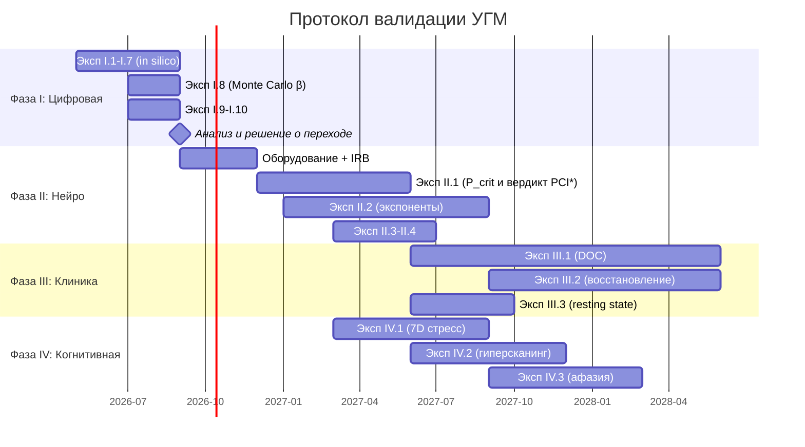

# Экспериментальный протокол валидации УГМ

:::warning Статус документа: [Пр] Исследовательская программа
Этот документ описывает **предельно полный экспериментальный протокол** для эмпирической валидации Универсальной Голографической Модели (УГМ). Протокол спроектирован по принципу максимальной фальсифицируемости: каждый эксперимент указывает **конкретный числовой результат**, который опровергает теорию.
:::

:::info Связь с другими документами
- [23 предсказания КК, из них 22 уникальных](/docs/applied/coherence-cybernetics/predictions) — полный список предсказаний с формулами (до 2026-09-25 значилось «23 уникальных»: по коллективному сознанию критерий есть и у IIT)
- [Протокол измерения Γ](/docs/applied/research/measurement-protocol) — операционализация π_bio для ИИ-систем
- [Критерии фальсифицируемости](/docs/reference/falsifiability) — формальные условия опровержения
- [Реестр статусов](/docs/reference/status-registry) — текущий эпистемический статус всех утверждений
:::

---

## 1. Стратегический замысел {#стратегия}

### 1.1. Проблема: эмпирический вакуум

УГМ — одна из наиболее формально проработанных теорий сознания: ~210 теорем, 23 предсказания (21 из них уникальное и числовое), категорный фундамент. Но **ни одно предсказание не проверено экспериментально**. Теория без эмпирики — философия, какой бы строгой ни была математика.

### 1.2. Ключевое наблюдение: PCI* — независимый вердикт, а не число для совпадения

Perturbational Complexity Index (PCI, введён Casali et al. 2013) даёт независимый алгоритм-специфичный эталон с опубликованным порогом: **PCI* = 0.31**, установленный ROC-анализом на benchmark из 150 субъектов (540 наборов ТМС-вызванных потенциалов), где истиной служит наличие или отсутствие субъективного отчёта; там — 100% чувствительность и специфичность (Casarotto et al. 2016). Порог УГМ — **P_crit = 2/7** на шкале чистоты. Два числа живут на несвязанных шкалах — PCI есть нормированная сложность Лемпеля–Зива бинаризованного ответа на ТМС, $P$ — функция Γ, — поэтому их близость (0.31 против 0.286) доказательной силы не имеет, и никакая нормировка π_bio не может подгоняться под неё: прямая через $(0, 1/7)$ и $(c, 2/7)$ «совпадает» с любым якорем $c$ ([измерение, §6.3](/docs/applied/coherence-cybernetics/measurement#калибровка)). *Исправлено 2026-09-26:* подраздел назывался «PCI* ≈ P_crit» и считал расхождение ~8% «в пределах нормализационной калибровки π_bio».

Это по-прежнему **первая точка контакта** теории с эмпирическими данными — в той форме, в которой она может провалиться: при π_bio, замороженном на бодрствовании, вердикт УГМ Cons(Γ̂) и вердикт PCI PCI_max > 0.31 вычисляются независимо на одних и тех же сессиях и сравниваются каппой Коэна ([P8.4, SUB-5](/docs/applied/research/measurement-protocol#substitution-position)); κ ≥ 0.8 подтверждает, κ < 0.4 фальсифицирует.

### 1.3. Принцип: от максимально рискованного — к сложному

**Предсказание 17** (критические экспоненты α=1/2, β=1/4, γ=1, ν=1/2, δ=5) — самое ценное, потому что самое рискованное:
- Пять конкретных чисел, каждое фальсифицируемо
- **Ни одна другая теория сознания** не предсказывает критических экспонент
- Подтверждение = сознание принадлежит конкретному классу универсальности (как фазовые переходы в физике)
- Опровержение = фундаментальная ревизия теории

Протокол организован по убыванию риска: сначала — то, что проверить дешевле и что максимально фальсифицируемо.

### 1.4. Четыре фазы

| Фаза | Срок | Что | Почему сначала |
|------|------|-----|----------------|
| **I. Цифровая** | 0–6 мес. | 12 предсказаний in silico (Γ-нативный агент) | Бесплатно, без этики, проверяет фундамент |
| **II. Нейрокалибровка** | 6–18 мес. | π_bio, согласие Cons(Γ̂) с вердиктом PCI* (κ), критические экспоненты | Главная точка контакта с нейроданными |
| **III. Клиническая** | 12–36 мес. | Расстройства сознания, восстановление, аттрактор в окне | Клиническое значение |
| **IV. Когнитивная** | 12–24 мес. | 7D стресс, коллективное сознание, прелингвистическое познание | Междисциплинарная валидация |

---

## 2. Фаза I: Цифровая валидация (0–6 мес.) {#фаза-1}

### 2.1. Обоснование

Фаза I проверяет явно заданную численную модель и архитектурные гипотезы. Встроенное в код алгебраическое тождество не является независимым свидетельством физической теории. Зафиксировать пространство состояний, репер, гамильтониан, скачки/скорости, самомодель, затвор, интегратор, численную ошибку и начальные условия. Нарушение точного тождества сначала требует проверки реализации; нарушение эмпирической гипотезы — пересмотра этой гипотезы.

### 2.2. Требования к Γ-нативному агенту

1. **Динамика сохраняет состояния:** заданный линейный GKSL-пропагатор либо нелинейное сохраняющее состояния ОДУ/обновление. Зависящая от состояния регенерация не становится автоматически линейным CPTP-каналом; [T-62](/docs/core/dynamics/evolution#теорема-сохранение-состояний) доказывает сохранение состояний при своих предпосылках.
2. **Фиксированный репер:** $\Gamma\in\mathcal D(\mathbb C^7)$ с отдельно заданными метками и считываниями.
3. **Полный проверяющий предикат:** вычислять каждый конъюнкт [Cap₂](/docs/reference/mathematical-kernel#thresholds), его запас и выбранные показатели стресса. Одного $C=\Phi R$ недостаточно.
4. **Фиксированное правило обучения:** определить функции потерь, допустимые обновления и резервный шаг при неудачной сертификации. Рост чистоты не является полным затвором.
5. **Воспроизводимость:** сохранять версию кода, seeds, полные состояния, остатки решателя и отображения интервенций.
6. **Сопоставимые контроли:** заранее задать задачи, наблюдаемые и бюджеты ресурсов. Требования к GPU зависят от эксперимента и реализации.

### 2.3. Эксперименты

#### Эксп. I.1: Абляция сектора (Pred 1, архитектурная гипотеза) {#эксп-1-1}

Зарегистрировать сохраняющее PSD/след отображение абляции E и сопоставимый контроль A; прежняя правка одной диагонали и строки не гарантировала след один. Начать с состояний, проходящих все заданные затворы, зафиксировать модель и сравнить времена первого выхода из заявленной области в парных прогонах. Оценить парный эффект и неопределённость по независимым seeds.

**Гипотеза:** абляция E сильнее сокращает выживание, чем абляция A, в этой архитектуре. Нулевой либо обратный эффект опровергает данный механизм; ни один исход не доказывает универсальную возможность или невозможность феноменальных зомби.

#### Эксп. I.2: Сертифицированная устойчивая окрестность (Pred 7) {#эксп-1-2}

Задать стационарную точку, векторное поле и проверенный локальный сертификат устойчивости. Возмущать через сохраняющее состояния отображение либо по явно допустимым PSD-направлениям. Сопоставлять траектории с сертифицированной окрестностью Ляпунова и всеми запасами до порогов. Чистота не определяет радиус бассейна; $\sqrt{P-2/7}$ не является точным радиусом, а произвольный белый матричный шум может нарушить PSD.

**Проверка:** каждая покрытая сертификатом траектория удовлетворяет его оценке. Поведение вне окрестности проверяет выбранную глобальную модель, а не обратное к локальной теореме.

#### Эксп. I.3: Типизированная информационная ёмкость (Pred 8) {#эксп-1-3}

Задать ансамбль, кодируемый в одно семиуровневое квантовое состояние, допустимую POVM и число независимых использований канала. Для каждого использования сравнить доступную взаимную информацию с границей Холево $\chi\le\log_2 7$; сообщать смещение оценивания и доверительные интервалы.

Эта граница не применима только потому, что программная память — матрица $7\times7$: точный вещественный признак или параметр может кодировать сколь угодно много классических битов. Для заявленного нарушения нужны те же физические предпосылки кодирования и измерения.

#### Эксп. I.4: Абляция размерности при обучении (Pred 10, гипотеза) {#эксп-1-4}

Сравнить заданных обучающихся агентов $N=5$ и $N=7$ на отложенных бинарных задачах с одинаковыми наблюдениями, возможностями оптимизации и бюджетами ресурсов. Включить корректные каналы замещения меньших размерностей как контроль. Сообщать точность, число примеров и отказы допустимости.

T-113 — гипотеза о выбранной функциональной архитектуре. Каналы замещения и обучение существуют уже при $N=2$; универсальная невозможность при $N<7$ либо гарантированное превосходство $N=7$ не следуют. Зарегистрированное преимущество, нулевой эффект либо обратный результат относятся к выбранным задаче и архитектуре.

#### Эксп. I.5: Затухание и сертифицированная глубина (Pred 12) {#эксп-1-5}

Для чистой итерации Фано проверить $S_n=3^{-n}$, где $S_n=\|\operatorname{offdiag}\mathcal P^n\Gamma\|_F/\|\operatorname{offdiag}\Gamma\|_F$ и начальная норма ненулевая. Для заданного канонического нелинейного отображения проверить дополнительный множитель $\prod(1-R)$. До вычисления обнаружимой глубины выбрать предел детектора $\varepsilon$.

Исторический заданный score даёт арифметический предел три при своём определении; это не $R$, вероятность выживания либо универсальный предел когнитивной глубины. Метакогнитивные пробы и совместимость башни проверяются отдельно, как в [T-142](/docs/proofs/consciousness/operational-closure#t-142).

#### Эксп. I.6: Условное время генезиса (Pred 13) {#эксп-1-6}

Реализовать заданную рекурсию $\Gamma_{n+1}=\beta\mathcal E_\eta(\Gamma_n)+(1-\beta)\sigma$, $\Gamma_0=I/7$, с постоянной $\sigma$, $0<\beta<1$ и деполяризующим $\mathcal E_\eta$. Записать $r=\beta\eta$, $w=(1-\beta)/(1-r)$ и $h=1/\sqrt{7P(\sigma)-1}$ при $P(\sigma)>2/7$.

**Точная проверка:** $P_n=1/7+w^2(1-r^n)^2(P(\sigma)-1/7)$. Пересечение существует тогда и только тогда, когда $w>h$; при $0<r<1$ первый такт равен $\lfloor\log(1-h/w)/\log r\rfloor+1$. Включить непересекающий контроль $\beta=0.9$, $\eta=0$ и чистую $\sigma$. Случай $r=0$ проверить прямо. Это условные тождества [T-148](/docs/proofs/consciousness/substrate-closure#t-148). Изолированное начальное $I/7$ при унитальном генераторе и закрытом затворе остаётся там; другие начальные состояния или самомодели не обязаны.

#### Эксп. I.7: Фиксированные и совращающиеся цели (Pred 14) {#эксп-1-7}

Зафиксировать модель, скорости и ненулевые разности энергий; сравнить фиксированные и совращающиеся цели по независимым seeds. В скалярном уравнении с постоянными коэффициентами $\dot\gamma=-(d+a+i\omega)\gamma+a\rho^*$ проверить стационарный модуль $a|\rho^*|/\sqrt{(d+a)^2+\omega^2}$ фиксированной цели. Затем проверить заданное вращающееся воздействие.

Универсального предсказания $\Phi(\text{fixed})<1$ нет: конструкция $H=0$, $\varphi_J$ имеет живые состояния окна. Наблюдение $\Phi\ge1$ при фиксированной цели не опровергает условную скалярную формулу.

#### Эксп. I.8: Критические показатели выбранного потенциала (Pred 17, предварительный) {#эксп-1-8}

Задать потенциал, управляющий параметр, равновесную ветвь и независимо проверенную симметрию. Приближать параметр к критической точке, решать уравнение ветви и оценивать независимо заданный параметр порядка с неопределённостью конечного окна. Сравнивать $1/4$, $1/2$ и другие показатели с поправками к масштабированию.

Случайная выборка состояний с заданной чистотой не порождает равновесный критический показатель. Закон $1/4$ условен относительно соответствующего симметричного вырождения; это не универсальное биологическое предсказание и не доказательство показателя PCI. Симуляция проверяет выбранную модель до обращения к нейроданным.

#### Эксп. I.9: Калиброванный кодировщик либо линейный канал (Pred 19) {#эксп-1-9}

Зафиксировать референсную модель только по калибровочным данным. Для признаковых оценивателей сравнивать отложенные правдоподобия наблюдений, идентифицируемые величины и неопределённость реконструкции. Единственного $\pi_{\mathrm{can}}$ нет; произвольное признаковое отображение не имеет алмазной нормы.

Если независимо заданы **линейные** каналы $M_d\to M_7$, проверить PSD и следосохраняющий частичный след матриц Чои, затем вычислить либо оценить алмазное расстояние по [T-152](/docs/proofs/consciousness/substrate-closure#t-152). Зарегистрировать допуск и наблюдательную модель до проверки; пятьдесят батчей не гарантируют сходимость либо расстояние ниже $0.1$.

#### Эксп. I.10: Скорость обучения в заданной модели различения (Pred 9) {#эксп-1-10}

Задать законы наблюдений, априорные классы, независимость, допустимые тесты и отложенный критерий успеха. Для квантового i.i.d. бинарного различения сравнить ошибку с точной величиной Хелстрома при каждом доступном $n$. Чернов даёт асимптотический показатель и достаточную конечновыборочную верхнюю оценку ошибки, а не прежнюю универсальную нижнюю границу числа наблюдений.

Для выбранного линейного накопителя проверить точное время пересечения; безопасность динамики обучения сертифицировать отдельно. Максимум корректных необходимых границ остаётся нижней границей и не обязан достигаться. См. [границы обучения](/docs/applied/coherence-cybernetics/learning-bounds).

#### Эксп. I.11: Размерность и социальное обучение (Pred 11, гипотеза) {#эксп-1-11}

Сравнить агентов $N=5$ и $N=7$ на отдельно операционализированных задачах ToM, межагентного обучения и стратегической координации. Зафиксировать оценочные данные и критерии успеха; сопоставить бюджеты коммуникации, памяти и обучения, сообщать величины эффектов с контролем множественных сравнений.

Возможное преимущество семимерной модели — проверяемая архитектурная гипотеза. Отозванное универсальное T-57 и функциональный подсчёт T-113 не запрещают меньших обучающихся агентов, дополнительный механизм или четвёртый операторный член. Успех $N=5$ опровергает зарегистрированную гипотезу невозможности, а не корректную математическую теорему. Успех $N=7$ не доказывает универсальную достаточность.

### 2.4. Критерий перехода к Фазе II

Переходить, когда точные проверки реализации пройдены, наблюдательная модель идентифицируема для заявленных величин, а архитектурные проверки и контроль ресурсов опубликованы. Численные тождества, эмпирические гипотезы и феноменальные интерпретации требуют отдельных вердиктов. Пересматривать неудачные гипотезы до переноса на нейроданные; подтверждение каждого спекулятивного предсказания не требуется для корректности математического тождества.

---

## 3. Фаза II: Нейрокалибровка π_bio (6–18 мес.) {#фаза-2}

### 3.1. Обоснование

Центральная задача: построить мост **π_bio: (EEG, fMRI, HRV) → Γ ∈ D(ℂ⁷)** и проверить теоретический порог P_crit = 2/7 вне выборки: при π_bio, замороженном на бодрствовании, — P̂ в точке потери сознания, определённой по отчётам, против 2/7, и вердикт Cons(Γ̂) против независимо валидированного вердикта PCI PCI_max > 0.31 по каппе Коэна (P8.4). *(До 2026-09-26: «проверить, что P_crit = 2/7 совпадает с эмпирическим PCI* = 0.31» — сравнение несвязанных шкал.)*

### 3.1b. Формальное определение и идентификация π_bio [О/Г] {#pi-bio-definition}

:::info Определение (калиброванный нейронный оценщик состояния)
Нейронный кодировщик $\hat\pi_\theta:\mathcal O_{\mathrm{neural}}\to\mathsf D_7$ — объявленный **оценщик состояния** либо многозначная реконструкция при неполных данных. Его модель наблюдения $\mathsf O_\theta:\mathsf D_7\to\mathcal P(\mathcal O_{\mathrm{neural}})$, калибровка $\theta$, функциональный репер и допустимые состояния входят в спецификацию прибора. Softmax и нормированное разложение Холецкого при выполнении условий области дают допустимые состояния; этот нелинейный перевод признаков не становится CPTP-каналом. [Определения и теоремы обратной задачи](/docs/applied/research/reconstruction-identifiability).
:::

**Конструкция и требования (4 шага).**

**Шаг 1 (Объявленные кандидаты признаков [Г]).** Словарь признаков предрегистрируется. Функциональная версия ниже и спектральная версия [измерительного протокола](/docs/applied/research/measurement-protocol#шаг-1-диагональ) — **различные кандидаты кодировщиков**; один выбирается до просмотра исходов, другой используется только как зарегистрированное сравнение.

| Измерение | Кандидат нейронного признака | Извлечение |
|-----------|----------------------------|------------|
| A | Спектральная краевая частота | Спектр ЭЭГ, объявленная полоса |
| S | Дальние временные корреляции | DFA с объявленными масштабами |
| D | Перестановочная энтропия | Фиксированные порядок, лаг и окно |
| L | Theta-gamma PAC | Объявленный оценщик фазы/амплитуды |
| E | Прокси интериорности без PCI | Предрегистрированный независимый признак |
| O | HRV RMSSD | Одновременная ECG, фиксированное окно |
| U | Глобальная связность | Объявленные оценщик, каналы и эталон |

PCI, времена реакции и отчёты исключаются из подтверждающих входов предсказания (SUB-3/SUB-5). Назначение метки признаку не доказывает, что он наблюдает ось $\Gamma$; мост «признак—состояние» остаётся [Г].

**Шаг 2 (Замороженная нормировка [О/Г]).** Одна из кандидатных диагональных конвенций:

$$
\gamma_{kk}=\frac{\exp(\beta z_k)}{\sum_j\exp(\beta z_j)},\qquad z_k=(x_k-\mu_k)/\sigma_k.
$$

Требуется $\sigma_k>0$, заранее объявленная обработка постоянных и отсутствующих признаков и численно устойчивая реализация softmax. $\beta,\mu_k,\sigma_k$ и все альтернативы фиксируются по опорному ансамблю бодрствования (SUB-1), без подгонки чистоты к $2/7$ или согласия с PCI. Это задаёт конвенцию кодировщика, а не теорему идентификации состояния системы.

**Шаг 3 (Комплексные наблюдения и PSD-реконструкция).** Предлагаемая модульная связь

$$
|\gamma_{ij}|=\sqrt{\mathrm{Coh}_{ij}^{\mathrm{neural}}}\sqrt{\gamma_{ii}\gamma_{jj}}
$$

есть калибруемая гипотеза при $0\leq\mathrm{Coh}_{ij}^{\mathrm{neural}}\leq1$. Она обеспечивает лишь попарные PSD-границы $2\times2$; собранная матрица может не быть глобально PSD. **Величина** фазовой синхронизации — вещественный модуль. Знаковая фаза требует комплексного среднего $z_{ij}=\langle e^{i(\phi_i-\phi_j)}\rangle$ и объявленной калиброванной связи с $\arg\gamma_{ij}$. Кросс-частотные пары требуют реальной гармонической конвенции. Вещественный PLV, модули и $|\sin\theta_{ij}|$ не заменяют комплексные наблюдения [контрпримеры](/docs/applied/research/reconstruction-identifiability#phase-counterexamples).

Замороженный закон наблюдения подгоняется при $\Gamma\succeq0$, $\operatorname{Tr}\Gamma=1$. Линейные эрмитовы средние с известной положительной ковариацией дают выпуклую задачу с единственным решением, если проекции операторов порождают все 48 бесследовых эрмитовых направлений. Нелинейные модели требуют отдельного анализа локальной/глобальной идентификации. Публикуются невязки, неопределённость калибровки и доверительные множества. Отсутствующие знаковые фазы остаются неопределёнными; запрещено незаметно заполнять их нулями. В подтверждающем опыте $\lambda_1=\lambda_2=0$ (SUB-2).

**Шаг 4 (Фиксированный репер, идентификация и считывание).** Замораживаются семь меток, ось $E$, времена и фазовые эталоны. Остаточное отождествление выводится из плана наблюдения; произвольное прокрустово выравнивание по $G_2$ к среднему бодрствования может менять $\Phi$ и не доказывает ковариантность или единственность. Оно исключено из референсного протокола. Публикуются диапазоны величин по совместимым состояниям; определённый вердикт допустим только при постоянстве всего предиката на доверительном множестве. Расширение/подъём, используемое для $D$, также предрегистрируется и учитывается в неопределённости.

**Свойства π_bio.**

| Свойство | Статус | Условие |
|----------|--------|---------|
| Выход PSD и единичного следа | [Т] | Явные ограничения состояния, допустимый выход оптимизатора |
| Идентификация полного состояния | [Т] условно | Инъективный закон наблюдения; линейный критерий ID-2 либо отдельное доказательство |
| Устойчивость | [Т] условно | Положительное наименьшее сингулярное число/локальная обусловленность; количественная неопределённость |
| Ковариантность/остаточная симметрия | [Г] до проверки | Реальное действие на признаках и закон наблюдения, не одно выравнивание |
| Эмпирическая нейронная интерпретация | [Г] | Независимая калибровка и проверка вне выборки |
| CPTP | Не утверждается | Нелинейный оценщик векторов признаков не является линейным операторным каналом |

Одна калибровка не валидирует прибор. Успешная проверка вне выборки поддерживает **совместную зарегистрированную гипотезу наблюдения/порогов**. Она не доказывает онтологическое тождество восстановленного состояния или единственность среди альтернативных кодировщиков. Неудача отвергает эту совместную спецификацию; последующие альтернативы регистрируются заранее и публикуются вместе с неудачей, а не задним числом заменяют проверенный прибор. Дополнительно к SUB-1 … SUB-6 применяются [ID-A … ID-D](/docs/applied/research/reconstruction-identifiability#confirmatory).

### 3.2. Оборудование

| Компонент | Модель | Назначение | Бюджет |
|-----------|--------|-----------|--------|
| TMS-EEG | Nexstim NBS System 5 + 60-ch eXimia | Каузальная пертурбация + EEG | ~\$300K |
| HD-EEG | BioSemi ActiveTwo 128-ch | Высокоплотная ЭЭГ для спектрального анализа | ~\$80K |
| fMRI | 3T (доступ через университетский центр) | Пространственная локализация | По соглашению |
| HRV | Polar H10 + Empatica E4 | Вегетативные корреляты | ~\$2K |
| Полисомнография | Стандартный PSG-комплект | Стадии сна | ~\$30K |
| Нейронавигация | MRI-совместимый фреймлесс навигатор | Точность TMS-стимуляции | В составе Nexstim |

**Общий бюджет оборудования:** ~\$420K (при наличии fMRI-доступа).

### 3.3. Эксперимент II.1: порог P_crit вне выборки, согласие с PCI* (ключевой) {#эксп-2-1}

:::warning Это самый важный эксперимент всего протокола
Если при π_bio, замороженном на бодрствовании, P̂ на границе сознания/бессознательности, определённой по отчётам, = 2/7 ± 0.05, а вердикт УГМ согласуется с вердиктом PCI при κ ≥ 0.8, зарегистрированный пакет наблюдения и порогов получает эмпирическую поддержку при выполненной идентификации и статистическом критерии ниже. Неудача требует пересмотра пакета; неопределённый исход не считается подтверждением.
:::

**Субъекты:** N=50, здоровые, 18–45 лет, без неврологической/психиатрической патологии.

**Парадигма:** Пропофол-индуцированная потеря сознания с TMS-EEG мониторингом.

**Протокол (детальный):**

1. **Базовая линия (бодрствование):**
   - TMS-EEG: 200 триалов, стимуляция BA6/BA8 (120–160 V/m)
   - Вычислить PCI_wake
   - Субъективный отчёт: шкала сознания 0–10

2. **Титрация пропофола:**
   - Target-controlled infusion (TCI), модель Marsh или Schnider
   - 5 целевых уровней: Ce = 0.5, 1.0, 1.5, 2.0, 2.5 μg/ml
   - На каждом уровне (15 мин стабилизации):
     - TMS-EEG: 150 триалов
     - Вычислить PCI
     - Вербальный отчёт сознания (если возможен)
     - Isolated Forearm Technique (IFT) для подтверждения/опровержения сознания

3. **Определение порога (данные вывода):**
   - Для каждого субъекта: Ce_threshold — наименьшая концентрация, при которой утрачены и вербальный отчёт, и ответ IFT; граница фиксируется отчётами, а не PCI
   - На каждом уровне отдельно записать вердикт PCI PCI_max > PCI* = 0.31 (Casarotto et al. 2016); он сравнивается с вердиктом УГМ на шаге 6 и никогда не используется для установки границы

4. **Реконструкция Γ:**
   - Применить π_bio к EEG-данным каждого уровня
   - Алгоритм π_bio: замороженная модель наблюдения → PSD/следовые ограничения → совместимое множество и диапазоны величин (см. [Протокол измерения Γ](/docs/applied/research/measurement-protocol))
   - Параметры $\beta, \mu_k, \sigma_k$ заморожены на базовой линии бодрствования ([SUB-1](/docs/applied/research/measurement-protocol#substitution-position)); $\lambda_1 = \lambda_2 = 0$ (SUB-2); E — из наблюдаемой, отличной от PCI
   - Вычислить диапазоны P = Tr(Γ²) и Cons(Γ) на доверительном множестве каждого уровня; неоднозначный вердикт сообщить как неопределённый

5. **Считывание (без подгонки):**
   - Построить зависимость P(Ce) для всех 50 субъектов
   - Определить P на границе сознания: P_boundary = P(Ce_threshold)

6. **Согласие вердиктов (P8.4, SUB-5):**
   - На каждом уровне Cons(Γ̂) и PCI_max > 0.31 вычисляются независимо
   - Каппа Коэна по всем 300 сессиям (50 субъектов × базовая линия + 5 уровней); κ ≥ 0.8 подтверждает, κ < 0.4 фальсифицирует; сырое совпадение мерой не служит

**Статистический план и идентификация:**
- Публикуется разделение обучения/проверки по субъектам; шесть сессий одного субъекта зависимы и не являются шестью независимыми субъектами. Все выборы оценщика и исхода замораживаются до раскрытия результатов.
- Основная величина: популяционное среднее восстановленной чистоты на **границе утраты ответов**, с неопределённостью модели наблюдения и межсубъектной выборки. Исчезновение вербального/IFT-ответа — прокси вывода, а не доказательство отсутствия переживания; отсроченные отчёты и оценка исхода регистрируются отдельно.
- Допуск эквивалентности: $\delta=0.05$ вокруг $2/7$, объявленный заранее [Г]. Поддержка требует, чтобы корректно калиброванный 98%-й доверительный интервал **целиком лежал внутри** $[2/7-\delta,2/7+\delta]$ (два односторонних теста при $\alpha=0.01$ и выполненных предпосылках). Простое неотвержение равенства или включение $2/7$ в интервал не доказывает эквивалентность. См. [Schuirmann (1987), первичный вывод TOST и интервала $1-2\alpha$](https://doi.org/10.1007/BF01068419).
- Отвержение при большем заранее объявленном допуске $0.1$ требует, чтобы 98%-й интервал целиком лежал выше $2/7+0.1$ или ниже $2/7-0.1$. Промежуточный исход неопределён. Одной точечной оценки недостаточно.
- Вторичная величина: каппа Коэна между независимо вычисленными вердиктами. Неопределённость оценивается по субъектам с учётом повторных сессий. Заранее задаётся обработка неопределённых вердиктов УГМ, публикуются их доля и границы чувствительности; исключать их ради улучшения согласия запрещено. $\kappa\geq0.8$ и $\kappa<0.4$ — зарегистрированные эмпирические пороги [Г] с неопределённой промежуточной зоной.
- Мощность и объём выборки пересчитываются для выбранных процедур эквивалентности/отвержения по пилотному шуму, неопределённости калибровки и структуре повторных измерений. Прежний тест точного равенства и заявленная оценка мощности не соответствовали утверждению об эквивалентности и сняты.

Эти исходы проверяют зарегистрированный пакет кодировщика/наблюдения/порогов. Диагностика структурной идентификации и согласие классификаторов публикуются раздельно. Успешная классификация сама по себе не устанавливает онтологию сознания.

### 3.4. Эксперимент II.2: Критические экспоненты (самый рискованный) {#эксп-2-2}

:::tip Уникальность
Это **первый в истории** тест критических экспонент фазового перехода для сознания. Ни IIT, ни GWT, ни FEP не предсказывают конкретных экспонент. Подтверждение β=1/4 означает: сознание принадлежит трикритическому классу универсальности среднего поля — как трикритическая точка в смесях He3-He4.
:::

**Субъекты:** N=50, здоровые, 20–40 лет. Каждый — полная ночь в лаборатории сна.

**Парадигма:** TMS-EEG на каждой стадии сна (W→N1→N2→N3→REM→W).

**Протокол:**
1. Полисомнография: 8 часов записи, онлайн-скоринг стадий
2. TMS-EEG: 100 триалов каждые 15 мин (32+ точки за ночь на субъекта)
3. Для каждой точки: PCI, P(Γ), стадия сна
4. Всего: ~1600 точек (50 × 32)

**Анализ:**
1. Для каждой точки: x = P − P_crit = P − 2/7
2. Разделить по знаку x (сторона порога УГМ, из Γ̂ при π_bio, замороженном на бодрствовании), а не по PCI > PCI*: два разбиения сравниваются (P8.4), а не отождествляются
3. Для x > 0: fit PCI ~ x^β — PCI служит параметром порядка лишь при гипотезе монотонной связи P8.3 [Г], поэтому эта подгонка проверяет β совместно с P8.3
4. Извлечь β, 95% CI

**Предсказание:** β = 1/4 ± 0.05 (T-161, [С] при ℤ₂-симметрии m → −m; без неё — значение swallowtail β = 1/2).

**Дополнительные экспоненты:**
- α = 1/2: теплоёмкость (из дисперсии P вблизи порога)
- ν = 1/2: корреляционная длина (из пространственной протяжённости EEG-ответа на TMS)
- γ = 1: восприимчивость (из амплитуды вариабельности PCI вблизи порога)
- δ = 5: критическая изотерма

**Фальсификация:**
- β ∉ [0.20, 0.30] при N=50 (p < 0.01)
- ν ∉ [0.45, 0.55]
- γ ∉ [0.90, 1.10]

**Статистический план:** Нелинейная регрессия (power law fit), bootstrap для 95% CI, сравнение с альтернативными экспонентами (ordinary mean field: β=1/2, Ising 3D: β≈0.326, ordinary tricritical: β=1/4).

### 3.5. Эксперимент II.3: Динамика зажигания (Pred 16) {#эксп-2-3}

**Субъекты:** N=30 (подвыборка Эксп. II.1).

**Протокол:**
1. На каждом уровне пропофола: замерить задержку T_ign до «вспышки» сложности после TMS
2. T_ign = время от TMS до первого PCI-всплеска (>50% от PCI_wake)

**Предсказание:** $T_{\text{ign}} \sim (P - P_{\text{crit}})^{-1} \cdot \kappa_0^{-1}$. Дивергенция вблизи порога (критическое замедление). Множитель $\kappa_0^{-1}$ связывает время зажигания со скоростью регенерации.

**Фальсификация:** T_ign не зависит от (P − P_crit) (R² < 0.3).

### 3.6. Эксперимент II.4: Спектральная щель и гамма-ритм (Pred 22) {#эксп-2-4}

**Субъекты:** N=30.

**Протокол:**
1. HD-EEG 128-ch, бодрствование, покой (10 мин с открытыми и закрытыми глазами)
2. Спектральный анализ: доминантная частота в гамма-диапазоне (30–100 Гц)
3. Вычислить λ_gap из линдбладовских параметров (калиброванных по EEG)
4. Сравнить ν_predicted = λ_gap/(2π) с измеренной доминантной частотой

**Предсказание:** ν_predicted ∈ [30, 100] Гц, совпадение с гамма-ритмом.

**Фальсификация:** λ_gap/(2π) вне [10, 200] Гц (с учётом погрешности калибровки).

---

## 4. Фаза III: Клиническая валидация (12–36 мес.) {#фаза-3}

### 4.1. Эксперимент III.1: Расстройства сознания (Pred 21) {#эксп-3-1}

**Субъекты:** N=80 (20 кома, 20 MCS, 20 VS/UWS, 20 здоровых контролей).

**Протокол:**
1. TMS-EEG + fMRI + HRV → π_bio → Γ
2. Вычислить P, R, Φ, Coh_E для каждого субъекта
3. Классификация: P > 2/7 → «сознательный», P ≤ 2/7 → «бессознательный»
4. Сравнить с клинической классификацией (CRS-R шкала)

**Предсказание:**
- P(Γ_MCS) > 2/7 для ≥90% MCS-пациентов
- P(Γ_VS) < 2/7 для ≥80% VS-пациентов
- P(Γ_здоровые) >> 2/7 для 100%

**Фальсификация:** Чувствительность < 80% или специфичность < 75%.

**Клиническое значение:** Если P_crit = 2/7 работает для DOC — это **единый диагностический инструмент**, превосходящий PCI (который требует TMS) для мониторинга.

### 4.2. Эксперимент III.2: E-когерентность и восстановление (Pred 2) {#эксп-3-2}

**Субъекты:** N=60 (реабилитация после инсульта).

**Протокол:**
1. При поступлении: EEG → π_bio → Coh_E
2. Через 3 мес.: оценка восстановления (Barthel Index, mRS)
3. Корреляция Coh_E(t₀) vs скорость восстановления

**Предлагаемая связь [H/Pr]:** предварительно выбранная цель корреляции Пирсона $r>0.3$ между калиброванной исходной $\widehat{\mathrm{Coh}}_E$ и независимо заданной скоростью восстановления. Это выбранный исследователем целевой эффект, а не следствие T-38a. До проверки зафиксировать оценщик, исход, учёт смешивающих факторов и правило пропущенных данных.

**Правило решения [Pr]:** предварительно задать доверительный интервал и расчёт мощности для корреляции выбранной популяции. Подкреплять цель $r>0.3$ только при нижней границе интервала выше $0.3$; отвергать эту цель при верхней границе не выше $0.3$; иначе сообщать неопределённый результат. Одна выборка 60 не гарантирует ни одного исхода. Проверяется связь/измерительный мостик, а не математическая теорема исключения зомби.

### 4.3. Эксперимент III.3: Аттрактор внутри окна (Pred 15) {#эксп-3-3}

**Субъекты:** N=30, здоровые, resting state.

**Протокол:**
1. EEG + fMRI (resting state, 10 мин) → π_bio → Γ
2. Вычислить P
3. Повторить 5 сессий (разные дни) для каждого субъекта

**Предсказание:** P(resting state) ∈ (2/7, 5/14], ниже верхней границы окна 3/7 (T-124c(4); [С при (MaxΦ)]). *Исправлено 2026-09-26:* предсказание гласило P → 3/7 ± 0.05 (T-124); ни одна теорема не даёт 3/7, а у живого аттрактора P ≤ 5/14.

**Фальсификация:** P_mean ≥ 3/7 или P_mean ≤ 2/7 при N=30.

---

## 5. Фаза IV: Когнитивная и социальная валидация (12–24 мес.) {#фаза-4}

### 5.1. Эксперимент IV.1: 7D стрессовый тензор (Pred 3) {#эксп-4-1}

**Протокол:**
1. Собрать базу 200+ стрессоров из литературы (психология, медицина, организационная наука)
2. 5 независимых экспертов: классификация каждого стрессора по 7 компонентам [A,S,D,L,E,O,U]
3. Межэкспертная надёжность: κ Коэна

**Предсказание:** 100% покрытие (каждый стрессор ↦ ≥1 компоненту). Пустая остаточная категория.

**Фальсификация:** ∃ стрессор, неклассифицируемый ни по одному из 7 компонентов (согласие ≥4 из 5 экспертов).

### 5.2. Эксперимент IV.2: Коллективное сознание (Pred 5) {#эксп-4-2}

**Субъекты:** 10 групп по 4 человека (джазовые квартеты — координированные; случайные музыканты — неккоординированные).

**Оборудование:** Гиперсканинг EEG (4 × 32-ch, синхронизация через LSL).

**Протокол:**
1. Одновременная EEG-запись 4 участников во время совместного исполнения
2. Вычислить полную корреляцию I группы (необходимое условие; интеграция Φ_⊗ целого критерием не служит, см. ниже)
3. Сравнить координированные vs неккоординированные группы

**Предсказание:** I > 0 необходимо для коллективного субъекта [Т]; достаточность — гипотеза [Г]. *Исправлено 2026-09-26:* предсказание гласило «Φ_⊗ > Φ_min для координированных; Φ_⊗ < Φ_min для случайных (T-86)»; этот критерий отозван [✗] — ему удовлетворяет всякая несвязанная группа (два голонома в окне дают Φ_⊗ ≥ 3 при I = 0).

**Фальсификация:** I(координированные) ≤ I(случайные) (p < 0.05, Mann-Whitney).

### 5.3. Эксперимент IV.3: Прелингвистическое познание (Pred 4) {#эксп-4-3}

**Субъекты:** N=30 (15 пациентов с афазией Брока, 15 здоровых контролей).

**Протокол:**
1. Батарея невербальных когнитивных тестов: K1 (перцепция), K2 (эмоции), K3 (категоризация), K4 (планирование)
2. Сравнить: афатики vs здоровые по K1–K4

**Предсказание:** K1–K4 у афатиков сохранены на >80% от нормы (T-100).

**Фальсификация:** K3 или K4 систематически разрушены при афазии (снижение >50%).

---

## 6. Сводная таблица: все 23 предсказания × фазы {#сводная-таблица}

| # | Предсказание | Фаза | Фальсификация | Статус |
|---|---|---|---|---|
| 1 | No-Zombie | I.1 | Агент выживает без E | [Т] |
| 2 | Coh_E ↔ восстановление | III.2 | r ≤ 0 | [Т] |
| 3 | 7D стресс | IV.1 | Неклассифицируемый стрессор | [Т]/[С] |
| 4 | Прелингвистическое познание | IV.3 | K3/K4 разрушены при афазии | [И] |
| 5 | Коллективное сознание | IV.2 | I(коорд) ≤ I(случ) | [Т] необходимость / [Г] достаточность |
| 6 | P > 2/7 | II.1 | Порог ≠ 2/7 ± 0.1 | [Т] |
| 7 | Радиус устойчивости | I.2 | h_crit не следует за r_stab(P₀) | [С] |
| 8 | Info capacity ≤ log₂7 | I.3 | I > 2.81 бит | [Т] |
| 9 | Скорость обучения | I.10 | n < n_info | [Т] |
| 10 | N=7 для обучения | I.4 | N=5 обучается | [Т] |
| 11 | N=7 для соц. обучения | I.11 | N=5 соц. обучается | [С] |
| 12 | SAD_max = 3 | I.5 | SAD ≥ 4 | [Т] |
| 13 | Время генезиса | I.6 | n > n_genesis | [Т] |
| 14 | Фазовая когерентность | I.7 | Φ ≥ 1 без ко-вращения | [Т] |
| 15 | Аттрактор внутри окна | III.3 | $P \geq 3/7$ или $P \leq 2/7$ | [С при (MaxΦ)] |
| 16 | Динамика зажигания | II.3 | T_ign ⊥ (P−P_c) | [Т] |
| 17 | Экспоненты β=1/4 | I.8 + II.2 | β ∉ [0.20, 0.30] | [С при ℤ₂-симметрии m → −m] |
| 18 | Уорд-подавление 19/49 | — | Λ-бюджет несовместим | [Т] |
| 19 | CPTP-anchor | I.9 | $\|\pi-\pi_{\mathrm{can}}\| > 0.1$ | [Т] |
| 20 | ε_eff ≈ 0.059 | — | ε ∉ [0.04, 0.08] | [С] |
| 21 | π_bio реконструкция | II.1 + III.1 | Ошибка > 30% | [Г] |
| 22 | Спектральная щель | II.4 | λ_gap/(2π) ∉ [10, 200] Гц | [Г] |
| 23 | Анизотропия декогеренции ранга 7 | I.12 | 14 сумм-правил нарушены (томография скоростей) | [Т]/[С] |

---

## 7. Трёхуровневая система фальсификации {#фальсификация}

| Уровень | Что опровергнуто | Пример | Следствие |
|---------|-----------------|--------|-----------|
| **L1 — Катастрофический** | Аксиоматический фундамент | N < 7 достаточно для автопоэзиса; зомби возможен; SAD ≥ 4 | Теория отвергнута полностью |
| **L2 — Структурный** | Конкретное числовое предсказание | P_crit ≠ 2/7; β ≠ 1/4; R_th ≠ 1/3 | Фундаментальная ревизия конкретной теоремы |
| **L3 — Локальный** | Параметр аппроксимации | π_bio ошибка > 30%; λ_gap вне диапазона | Локальная коррекция, не затрагивает фундамент |

**Привязка к формальным критериям ([Критерии фальсифицируемости](/docs/reference/falsifiability)):**

| Формальный критерий | Эксперимент | Операционализация |
|---|---|---|
| $\exists \rho_1, \rho_2: \mathcal{I}(\rho_1) = \mathcal{I}(\rho_2)$, но $\mathcal{F}(\rho_1) \neq \mathcal{F}(\rho_2)$ | III.1 (DOC) | Два пациента с идентичными P, R, Φ, но различным уровнем сознания (CRS-R) |
| $\|\mathrm{Spec}(\rho_1) - \mathrm{Spec}(\rho_2)\|_2 < 0.01$ (спектральная идентичность) | II.1 (P_crit) | Два состояния со спектрами в пределах 0.01 (не только P), но разными вердиктами по отчётам; расщеплённый вердикт PCI (один > PCI*, другой < PCI*) подкрепляет, но не решает — PCI не функция спектра |
| $P > 2/7 \not\Rightarrow$ сознание | II.1 (P_crit) | Субъект с P > 2/7 по π_bio, но клинически бессознателен |
| $N < 7$ достаточно для автопоэзиса | I.4, I.11 | Агент N=5 обучается автономно или координируется социально |

---

## 8. Контекст: сравнение с adversarial collaboration {#контекст}

Состязательная коллаборация консорциума Cogitate, финансируемая Templeton World Charity Foundation (грант 6 028 087 долларов США, 2019–2024), проверила теорию интегрированной информации (IIT) против теории глобального нейронального рабочего пространства (GNWT) на заранее зарегистрированных расходящихся предсказаниях (*Nature* 642, 133–142, опубликовано 30 апреля 2025 г.; 256 участников; фМРТ, МЭГ и внутричерепная ЭЭГ). По словам авторов, результаты «согласуются с некоторыми предсказаниями IIT и GNWT, но существенно подрывают ключевые положения обеих теорий»: для IIT — отсутствие устойчивой синхронизации внутри задней коры; для GNWT — общее отсутствие «зажигания» (ignition) при выключении стимула и ограниченное представление части измерений сознательного содержания в префронтальной коре. Никакого счёта или ранжирования одной теории над другой статья не даёт, а теории высшего порядка (HOT) среди проверенных не было. Изложение коллаборации в корпусе — [Теории сознания §9](/docs/consciousness/comparative/consciousness-theories#adversarial-collaboration).

**Принципиальное отличие УГМ от IIT/GWT/HOT:**

| | IIT | GWT | HOT | **УГМ** |
|---|---|---|---|---|
| Числовой порог | Φ > 0 (нет числа) | Нет | Нет | P_crit = 2/7 |
| Критические экспоненты | Нет | Нет | Нет | α=1/2, β=1/4, γ=1, ν=1/2, δ=5 |
| Вычислимость Φ | NP-hard для >30 элементов | N/A | N/A | P = Tr(Γ²), O(49) |
| Число свободных параметров | ~10³⁸ (все разбиения) | Не определено | Не определено | 48 координат состояния плюс отдельно объявленные параметры наблюдения, калибровки и динамики; это разные подсчёты |
| Самый рискованный тест | Нет единого числа | «Зажигание» (качественно) | «Мета-когниция» (качественно) | **β = 1/4** (одно число, фальсифицируемо) |

Числовое предсказание не защищено от методологических выборов. Кодировщик, нормировка, предпосылки идентификации состояния, диапазон подгонки экспоненты и определение исхода должны быть заморожены и сопоставлены с контролями до проверки. Только такой заданный эксперимент отличает предсказание от результата, внесённого анализом.

---

## 9. Временная шкала и зависимости {#timeline}

---

## 10. Заключение {#заключение}

Этот протокол покрывает **23 из 23 предсказаний** УГМ/КК:
- 12 проверяемы in silico (Фаза I, 0–6 мес.)
- 4 требуют TMS-EEG (Фаза II, 6–18 мес.)
- 2 — клинических исследования (Фаза III, 12–36 мес.)
- 3 — когнитивных/социальных исследования (Фаза IV, 12–24 мес.)
- 2 — физического сектора, без выделенной фазы (Ward-подавление, Юкава)

Самый рискованный тест — **критические экспоненты β=1/4** (Pred 17). Ни одна другая теория сознания не делает столь конкретного числового предсказания о фазовом переходе. Подтверждение означает: сознание принадлежит трикритическому классу универсальности среднего поля ($\varphi^6$ Ландау). Опровержение означает: УГМ фундаментально ошибается в структуре перехода.

Самый ценный тест — **порог P_crit = 2/7 вне выборки** (Pred 6/21): при π_bio, замороженном на бодрствовании, — P̂ в точке потери сознания, определённой по отчётам, против 2/7, и вердикт УГМ против независимо валидированного вердикта PCI (каппа Коэна, P8.4). Если выполнено и то и другое, выведенный — а не подогнанный — порог будет подтверждён на сессиях, которые реконструкцию не фиксировали. *(До 2026-09-26 тест назывался «P_crit = 2/7 ↔ PCI* = 0.31» и ждал совпадения двух чисел на шкалах, которые никакой вывод не связывает.)*

УГМ не прячется от фальсификации — она выставляет 23 мишени и указывает, куда стрелять.

---

**Связанные документы:**
- [23 предсказания КК](/docs/applied/coherence-cybernetics/predictions) — полный список с формулами
- [Протокол измерения Γ](/docs/applied/research/measurement-protocol) — операционализация для ИИ
- [Критерии фальсифицируемости](/docs/reference/falsifiability) — формальные условия опровержения
- [Bounds обучения](/docs/applied/coherence-cybernetics/learning-bounds) — T-109 через T-113
- [Стабильность](/docs/applied/coherence-cybernetics/stability) — T-104, радиус устойчивости

**Внешние ресурсы:**
- [COGITATE Results (Nature 2025)](https://www.nature.com/articles/s41586-025-08888-1) — консорциум Cogitate, adversarial collaboration IIT vs GNWT, *Nature* 642, 133–142
- [PCI (Casali et al. 2013)](https://www.science.org/doi/10.1126/scitranslmed.3006294) — индекс; порог PCI* = 0.31 валидирован в Casarotto et al. 2016, *Ann. Neurol.* 80: 718–729, doi:10.1002/ana.24779
- [ConTraSt Database](https://contrastdb.tau.ac.il/) — 412 экспериментов по теориям сознания
- [Del Cul et al. 2007](https://journals.plos.org/plosbiology/article?id=10.1371/journal.pbio.0050260) — нелинейный порог сознания
