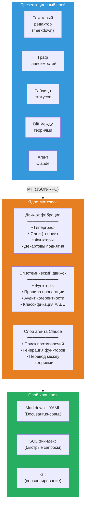
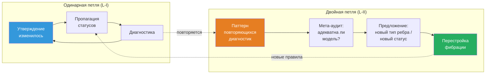

# Матезис: ∞-топос формальных теорий

:::info Для кого этот документ
Для исследователей, работающих со сложными теоретическими конструкциями — физиков, нейробиологов, философов сознания, специалистов по AGI. Документ описывает проект **Матезис** — вычислительную реализацию ∞-топоса формальных теорий, которая делает работу с теориями (навигацию, сравнение, верификацию когерентности и межтеоретический перевод) машинно-поддерживаемой. Математический фундамент — ∞-топос пучков на сайте теорий $\mathfrak{M} = \mathrm{Sh}_\infty(\mathbf{Th}, J_{\text{ep}})$; содержательная основа — формализм КК; программная архитектура — Ядро Матезиса с LLM-агентом.
:::

---

## 0. От «среды» к математическому объекту {#введение}

Этот документ описывает проект, ранее известный как *Theory IDE*. Переименование — не косметическое. Оно отражает **фундаментальный концептуальный сдвиг**: от программного инструмента, использующего теорию категорий, к **математическому объекту**, имеющему вычислительную реализацию.

### Mathesis Universalis

В 1666 году Готфрид Лейбниц в *Dissertatio de arte combinatoria* выдвинул проект **Mathesis Universalis** — универсальной науки о формальном рассуждении. Проект состоял из двух частей:

- **Characteristica universalis** — универсальный формальный язык, способный выразить любое знание
- **Calculus ratiocinator** — механический вычислитель, оперирующий внутри этого языка

Три с половиной века спустя оба компонента получают точную математическую реализацию:

| Лейбниц (1666) | Матезис (2026) |
|---|---|
| Characteristica universalis | $\mathfrak{M} = \mathrm{Sh}_\infty(\mathbf{Th},\; J_{\text{ep}})$ — ∞-топос пучков на сайте теорий |
| Calculus ratiocinator | LLM-агент, оперирующий внутри внутренней логики $\mathfrak{M}$ |

Лейбниц не мог реализовать свой проект: ему не хватало (1) теории категорий (Eilenberg–Mac Lane, 1945), (2) ∞-категорий (Joyal, Lurie, 2009), (3) вычислительных моделей языка (LLM, 2020-е). УГМ не «подтверждает» Лейбница — она **предоставляет формализм**, которого ему не хватало.

### Ключевой тезис

**Матезис — не программа, использующая математику. Матезис ЯВЛЯЕТСЯ математическим объектом — ∞-топосом — у которого есть вычислительная аппроксимация.**

Программный код (Verum) — конечная аппроксимация бесконечного объекта $\mathfrak{M}$, подобно тому как численное решение дифференциального уравнения аппроксимирует непрерывную динамику. Аппроксимация может улучшаться; $\mathfrak{M}$ остаётся неизменным.

### Структура документа

Документ следует единой логической цепочке:

1. **Проблема** (§1): когнитивный предел — ни один человек не удерживает 325+ теорий одновременно
2. **Обоснование** (§1½): почему ∞-категории — единственный адекватный аппарат (T-182, когезивные модальности)
3. **Фундамент** (§2): конструкция ∞-топоса $\mathfrak{M}$ — сайт теорий, вложение Йонеды, расширения Кана, условие спуска, классификатор подобъектов
4. **Генерализации** (§3): три направления выхода за 1-категорную аппроксимацию — HoTT, квантовая логика, автопоэзис
5. **Реализация** (§4–§6): архитектура, движки, агент — как $\mathfrak{M}$ аппроксимируется вычислительно
6. **Глубинные принципы** (§7–§10): самореференция, процессная онтология, рефлексивные циклы — что делает Матезис живым, а не статичным
7. **Следствия** (§11–§12): когнитивное расширение и примеры использования
8. **Путь к реализации** (§13–§15): план, сравнение, Verum как язык предельной мощи

Каждый уровень строится на предыдущем и несводим к нему — в точном соответствии с теоремой T-182 ($\mathcal{T}_0 \subsetneq \mathcal{T}_1 \subsetneq \mathcal{T}_2$).

---

## 1. Проблема: когнитивный предел {#проблема}

### 1.1. Масштаб современной теории

Зрелая научная теория — объект, превышающий когнитивную ёмкость одного агента. Для примера: документация КК (Кибернетика Когерентности, прикладной слой УГМ) — это ~400 страниц, ~210 теорем с 7 эпистемическими статусами, 23+ фальсифицируемых предсказаний, 30+ сравнений с конкурирующими теориями, ~270 перекрёстных ссылок. Теория интегрированной информации (IIT 4.0) — сопоставимый объём с собственным формализмом ($\Phi$, Q-shape, постулаты). Когнитом Анохина — качественная теория с 80-летним экспериментальным бэкграундом. И таких теорий сознания — [более 325](https://www.consciousnessatlas.com/) (по каталогу Consciousness Atlas).

Ни один человек не способен удерживать в рабочей памяти одновременно:
- внутреннюю структуру даже одной теории (какие утверждения от каких зависят)
- эпистемический статус каждого утверждения (доказано / условно / гипотеза / опровергнуто)
- соответствия между теориями (что означает $\Phi$ Тонони в терминах УГМ? как FEP Фристона стыкуется с автопоэзисом? где когнитом Анохина противоречит GWT Баарса?)
- последствия изменений (если опровергнута аксиома X, какие теоремы падают?)

### 1.2. Конкретные инциденты

**Парадокс ρ* (сессия 25 работы с УГМ).** Обнаружено: самореференция в операторе регенерации ℛ — целевое состояние ρ* определялось как динамическая неподвижная точка, что приводило к обнулению ℛ. Исправление: переопределение ρ* = φ(Γ) (категориальная самомодель). Последствия: потребовалось обновить ~25 файлов, сменить статус теоремы T-68 с [Т] на [С], заменить «примитивность ℒ_Ω» на «примитивность ℒ₀» во всех вхождениях. Время: целая рабочая сессия на **механическую пропагацию** — работу, которую машина может выполнить за секунды.

**Сломанные якоря (сессия перевода).** При переводе документации на английский язык заголовки были переведены, но ~50 внутренних ссылок продолжали указывать на русские якоря. Обнаружение: только при сборке сайта. Исправление: ручной поиск в ~20 файлах. Это задача для автоматической проверки когерентности.

**Рассогласование статусов (аудит 2026-03-23).** Глубокий аудит обнаружил 9 критических и 14 серьёзных проблем: теоремы со статусом [Т], зависящие от гипотез [Г]; утверждения, противоречащие друг другу; устаревшие ссылки. Исправление: 85 точечных правок в 42 файлах за 8 сессий. Каждая из этих проблем обнаружима автоматически.

### 1.3. Текущие инструменты и их пределы

| Инструмент | Что делает | Чего не делает |
|------------|-----------|----------------|
| **Docusaurus** | Рендерит markdown в сайт, проверяет ссылки | Не знает о логических зависимостях между утверждениями |
| **grep / ripgrep** | Находит текст | Не знает о типах связей (зависимость ≠ упоминание) |
| **Git** | Версионирует файлы | Не знает о статусах теорем |
| **Obsidian** | Граф заметок с ссылками | Нетипированные связи, нет когерентности, нет межтеоретических мостов |
| **RAG + LLM** | Находит релевантный текст, генерирует ответ | Оперирует текстом, не структурой; не проверяет логику |
| **Claude Code** | Разработка кода, навигация по кодовой базе | Не знает о теоретической структуре содержимого файлов |

Ни один из этих инструментов не понимает, что файл содержит **теорему**, что теорема **зависит** от аксиомы, что аксиома имеет **статус**, и что изменение статуса аксиомы **должно пропагироваться** на все зависимые теоремы.

:::warning Категориальный диагноз: почему плоские инструменты принципиально недостаточны
Перечисленные инструменты — **0-категорные**: они оперируют множествами (файлов, строк, коммитов) без типизированных морфизмов. Но научное знание имеет **∞-категорную** структуру:
- **Объекты** (утверждения) связаны **морфизмами** (зависимостями) — уровень 1
- Морфизмы связаны **2-морфизмами** (сравнения переводов: «перевод IIT→УГМ совместим с переводом IIT→GWT→УГМ?») — уровень 2
- 2-морфизмы связаны **3-морфизмами** (мета-аудит: «адекватны ли наши правила сравнения?») — уровень 3
- ...и так далее для каждого рефлексивного цикла (§10)

Инструмент, работающий на уровне $n$, **не может обнаружить** проблемы уровня $n+1$ (аналог T-182: $\mathcal{T}_0 \subsetneq \mathcal{T}_1 \subsetneq \mathcal{T}_2$). Нужен инструмент, содержащий **все уровни** — ∞-категорный по конструкции.
:::

---

## 1½. Метаэпистемологическое обоснование {#метаэпистемология}

:::info Зачем нужен этот раздел
§1 описал **проблему** (когнитивный предел). §2 предложит **решение** (∞-топос теорий). Этот промежуточный раздел отвечает на вопрос мета-уровня: **почему именно это решение** — и почему альтернативы принципиально недостаточны.
:::

### 1½.1. Три уровня Ω как три уровня Матезиса

Теорема T-182 [Т] устанавливает, что три уровня классификатора подобъектов строго необходимы: $\mathcal{T}_0 \subsetneq \mathcal{T}_1 \subsetneq \mathcal{T}_2$. Эта структура **проецируется** на архитектуру Матезиса:

| Уровень $\Omega$ | Уровень Матезиса | Что формализует |
|-------------------|-------|-----------------|
| $\mathrm{Dec}(\Omega) \cong 2^7$ (булева) | **Движок фибрации**: типизированный гиперграф, типы утверждений и зависимостей | Статическая структура: «какие утверждения существуют и как связаны» |
| $\tau_{\leq 0}(\Omega)$ (Гейтинг) | **Эпистемический движок**: пороговые предикаты, пропагация статусов, аудит когерентности | Пороги и логика: «какие утверждения достоверны и где границы» |
| Полный $\Omega$ (∞-группоид) | **Рефлексивные циклы**: $T_{\text{meta}}$, двойная петля, мета-аудит | Динамика: «как система наблюдает и перестраивает себя» |

### 1½.2. Когезивные модальности как операции Матезиса

Теорема T-185 сопоставляет дифференциально когезивному ∞-топосу 7 канонических модальностей — стратифицированно: модальности любого дифференциально когезивного ∞-топоса — [Т] (Шрайбер, DCCT v1), когезия топоса УГМ допущена [С], а число семь — прочтение [И] (прежняя формулировка «T-185 [Т] устанавливает» отозвана). Шесть из них отображаются в фундаментальные операции:

| Модальность | Определение | Операция Матезиса |
|-------------|-------------|------------------|
| $\Pi$ (Shape) | Выделяет различимые компоненты | `theory/audit` — обнаружение различий и несогласованностей |
| $\flat$ (Flat) | Извлекает дискретные инварианты | `claim/dependencies` — скелет зависимостей (без динамики) |
| $\Im$ (Infinitesimal shape) | Улавливает бесконечно малое изменение | `claim/set_status` + пропагация — реакция на локальное изменение |
| $\sharp$ (Sharp) | Вычисляет логическое замыкание | `fibration/coherence` — транзитивная проверка всей фибрации |
| $\&$ (Infinitesimal flat) | Интернализует инфинитезимальную структуру | `meta/audit` — наблюдение собственной структуры |
| $\mathrm{Rh}$ (de Rham) | Интегрирует локальное в глобальное | `claim/translate` — декартово поднятие, межтеоретический синтез |

Это **не постфактум-подгонка**, а следствие структуры когезивного ∞-топоса: если Матезис оперирует пучками на сайте теорий, то его фундаментальные операции **необходимо** распадаются на когезивные и инфинитезимальные модальности (Schreiber 2013).

### 1½.3. Фундаментальное обоснование: почему ∞-категории — единственный адекватный аппарат

Работа со знанием о знании — это операция на **категории категорий** $\mathbf{Cat}$. Работа со знанием о знании о знании — на **∞-категории ∞-категорий** $\mathbf{Cat}_\infty$. Это не метафора, а точное утверждение:

| Операция | Математический объект | Уровень |
|----------|----------------------|---------|
| Формулировать утверждения внутри теории | Объекты и морфизмы в категории $\mathcal{C}$ | Объектный |
| Сравнивать теории | Функторы $F: \mathcal{C} \to \mathcal{D}$ | Мета |
| Проверять когерентность сравнений | Естественные преобразования $\alpha: F \Rightarrow G$ | Мета² |
| Переконфигурировать саму систему проверки | Модификации $\Theta: \alpha \Rrightarrow \beta$ (3-морфизмы) | Мета³ |
| ... | ... (∞-морфизмы) | Мета^n |

**Категорное моделирование [D/Pr].** Подходящие теории и переводы можно моделировать в $\mathbf{Cat}_\infty$ после фиксации универсума. Это не вынуждает каждую систему знаний быть топосом и не доказывает существования высших когерентностей у произвольных данных сравнения. Графовое/реляционное хранение может кодировать выбранную категорную структуру; гарантии даёт настоящая модель и её проверка, а не название хранилища.

Альтернативы:
- **Графовые базы данных** (Neo4j) — 1-категория, нет 2-морфизмов
- **Реляционные базы** — даже не категория (нет композиции)
- **Obsidian / Roam** — нетипизированный граф
- **RAG + LLM** — оперирует текстом, не структурой

---

## 2. Математический фундамент: ∞-топос теорий {#фундамент}

### 2.1. От фибрации к ∞-топосу: преодоление структурного разрыва {#структурный-разрыв}

Предшествующая архитектура строила фундамент на **фибрации Гротендика** $p: \mathbf{E} \to \mathbf{B}$. Это корректно, но недостаточно. Фибрация — 1-категорная конструкция. Она формализует объекты (утверждения) и морфизмы (зависимости, переводы). Но не формализует:

- **2-морфизмы**: сравнения двух переводов между одной парой теорий
- **3-морфизмы**: мета-аудит сравнений
- **$n$-морфизмы** для произвольного $n$: рефлексивные циклы (§10)

Гиперграф (SQLite) и типизированные рёбра — **1-категориальная эмуляция** ∞-категориальной структуры. Они работают на уровнях 0 и 1, но теряют нативную когерентность начиная с уровня 2. Это не технический долг — это **структурный разрыв** между заявляемой ∞-категориальной онтологией и 1-категориальной реализацией.

**Решение:** начать с правильного объекта. Фибрация Гротендика — **следствие** конструкции ∞-топоса (straightening/unstraightening, HTT 3.2), а не основание.

### 2.2. Сайт теорий $(\mathbf{Th},\; J_{\text{ep}})$ {#сайт-теорий}

**Данные [D].** Зафиксируем универсум и по существу малую категорию заданных теорий, переводов и статусных метаданных. Тип высшей структуры задаётся явно: в $(\infty,1)$-категории высшие морфизмы обратимы; произвольные необратимые естественные преобразования требуют $(\infty,2)$-модели. Утверждения и выводы внутри теории отличаются от путей в пространстве отображений.

Функтор $\varepsilon_T:\mathcal C_T\to\mathbf{Status}$ в выбранный посет ограничивает собственные стрелки. Перевод $f:\mathcal C_{T_1}\to\mathcal C_{T_2}$ сохраняет статусы лишь при отдельно заданном контракте. Выбранное неравенство $\varepsilon_{T_1}\le\varepsilon_{T_2}\circ f$ есть естественное преобразование в посет; оно запрещает **понижение** статуса. Это политика, а не следствие существования произвольного функтора (M-5). Дискретная категория статусов, напротив, требовала бы равенства статусов вдоль каждой стрелки.

**Топология.** Топология Гротендика — семейство покрывающих решёт, удовлетворяющее максимальности, устойчивости обратного образа и транзитивности. Можно явно задать порождающие решёта и взять наименьшую содержащую их топологию либо доказать, что предложенные покрытия образуют её базис. Порожденная топология может добавлять покрытия и оказаться чрезмерно грубой для приложения; это проверяется отдельно. «Совместная верность» относится к различению морфизмов и не совпадает с приведённым ранее правилом различения объектов. Не доказано, что неформальное правило задаёт топологию; прежний аргумент M-1 отозван **[✗]**.

Тривиальная топология — согласованный исходный выбор: её пучки совпадают с предпучками, и она субканонична. Более богатая топология требует собственного эпистемического смысла и проверки спуска. Утверждения об реализованном верификаторе Verum/SMT здесь описывают проектный контракт до предъявления кода и сертификатов доказательств. Конечные проверки доказывают лишь закодированный конечный объём.

### 2.3. ∞-Топос Матезиса {#инфти-топос}

Для заданного малого сайта положим $\mathfrak M=\operatorname{Sh}_\infty(\mathbf{Th},J_{\rm ep})$. Это $\infty$-топос **[T при этих предпосылках]**. Пучок — контравариантный функтор со значениями в пространствах, удовлетворяющий спуску для каждого покрывающего решета. Для семейства покрытий с нужными расслоенными произведениями спуск выражается пределом диаграммы Чеха; попарное согласие не исчерпывает высшей когерентности.

Свободное кополное расширение — категория **предпучков** $\mathcal P(\mathbf{Th})$. Пучки образуют её доступную левоточную локализацию: ассоциирование пучка $a:\mathcal P(\mathbf{Th})\to\mathfrak M$ сопряжено слева включению. Для локального объекта $F$ имеем $\operatorname{Map}_{\mathfrak M}(aX,F)\simeq\operatorname{Map}_{\mathcal P}(X,F)$. Универсальное свойство относится к выбранной топологии; оно не превращает любую когерентную базу данных в пучок и не доказывает единственность архитектуры Матезиса. См. [Lurie, HTT §§5.1.5, 6.2.2](https://www.math.ias.edu/~lurie/papers/HTT.pdf).

### 2.4. Вложение Йонеды: загрузка теории {#вложение-йонеды}

Всегда доступно вложение $y:\mathbf{Th}\hookrightarrow\mathcal P(\mathbf{Th})$, $y(T)(S)=\operatorname{Map}_{\mathbf{Th}}(S,T)$. По Йонеде

$$
\operatorname{Map}_{\mathcal P}(yT_1,yT_2)\simeq\operatorname{Map}_{\mathbf{Th}}(T_1,T_2).
$$

Оно факторизуется через $\mathfrak M$, если все представимые предпучки удовлетворяют $J_{\rm ep}$-спуску: это **субканоничность**. При этой дополнительной предпосылке та же эквивалентность пространств отображений верна в пучках. Иначе $a\circ y$ принимает значения в пучках, но может терять верность. Йонеда не гарантирует представимость выхода квантового канала (пересмотренный T-213).

Конечное ограничение — выбранное приближение. Оно может терять объекты, стрелки и высшие когерентности; сохранение информации полным вложением Йонеды не означает её сохранения конечной реализацией. См. пересмотренные M-3/M-4.

### 2.5. Расширения Кана: межтеоретический перевод {#расширения-кана}

Для заданного функтора $f:\mathcal A\to\mathcal B$ и диаграммы $X:\mathcal A\to\mathcal E$ ограничение имеет тип $f^*:\operatorname{Fun}(\mathcal B,\mathcal E)\to\operatorname{Fun}(\mathcal A,\mathcal E)$. При существовании нужных (ко)пределов

$$
\operatorname{Lan}_f\dashv f^*\dashv\operatorname{Ran}_f,
$$

$$
(\operatorname{Lan}_fX)(b)\simeq\operatorname{colim}_{(f\downarrow b)}X(a),\qquad (\operatorname{Ran}_fX)(b)\simeq\lim_{(b\downarrow f)}X(a).
$$

Для $\infty$-категорной цели используются соответствующие гомотопические (ко)пределы. Морфизм **объектов**-теорий $T_1\to T_2$ сам по себе не задаёт эти категории диаграмм. В топосе карта $u:yT_1\to yT_2$ задаёт другие, срезовые сопряжения $\Sigma_u\dashv u^*\dashv\Pi_u$; отождествлять их с указанными расширениями Кана без построения нельзя.

Универсальное свойство делает расширение начальным/конечным среди расширений с заданной граничной картой. Оно не даёт оптимального семантического перевода без модели семантики. Для левого сопряжения коединица имеет тип $\operatorname{Lan}_f f^*Y\to Y$; для правого единица — $Y\to\operatorname{Ran}_f f^*Y$. Их неэквивалентность — типизированная проверка, а не универсальная численная норма $\|\eta-\mathrm{id}\|$.

Колимит конечной диаграммы множеств вычисляется факторизацией дизъюнктного объединения по порождённым отождествлениям. Конечная диаграмма пространств может иметь нетривиальные высшие гомотопии; из формулы не следует универсальный алгоритм $O(n^2)$ или оценка времени в секундах. Для оценки сложности нужны кодировка и алгоритм. Пример порогов IIT/УГМ — предполагаемое семантическое сопоставление **[I/H]**, а не вычисленное расширение Кана.

### 2.6. Условие спуска: когерентность как свойство пучка {#условие-спуска}

Спуск — свойство, которое надо **проверить**, прежде чем назвать заданный предпучок пучком. На малом сайте это эквивалентность соответствующему пределу покрывающего решета/диаграммы Чеха. Для пучков множеств согласованные локальные сечения склеиваются единственно; для пучков пространств пространство склеек эквивалентно полному пространству когерентных данных спуска. Попарная согласованность не строит всех высших когерентностей и не даёт алгоритма нахождения точного препятствия. Ассоциирование пучка может отождествлять/изменять данные, поэтому последующий аудит остаётся необходимым. Конечная реализация предъявляет свои реальные сертификаты спуска.

### 2.7. Классификатор подобъектов: эпистемическая логика {#классификатор}

В $\infty$-топосе есть классификатор подобъектов $\Omega$. Подобъекты заданного объекта $X$ образуют алгебру Гейтинга; исключённое третье в произвольном топосе не гарантировано. Возможен и булев частный случай.

Статусы реестра и значения истинности имеют разные типы. Цепочка $[T]>[C]>[H]>[P]>[D]>[I]>[\text{✗}]$, если она используется, — административный порядок **[D]**; она не становится автоматически вложением в $\Omega$ или его глобальные сечения. Постулат, определение и эмпирическая гипотеза отличаются происхождением и предпосылками, а не только силой математической истинности. Эти метаданные сохраняются отдельно. Для кодирования контекстуальных пропозиций подобъектами надо задать объект, контексты, предикат и карты ограничения/спуска. Теория пучков затем ограничивает эту кодировку; она не назначает феноменальную или научную истинность сама по себе.

### 2.8. Связь с ∞-топосом УГМ {#связь-с-угм}

Теория физических состояний и теория о теориях могут использовать пучковые конструкции после задания собственных сайтов, универсумов и смыслов. Эта параллель имеет статус **[I/Pr]**, не является теоремой единственного общего топоса физики и эпистемологии. Чтобы рассматривать теорию состояний как объект $\mathbf{Th}$, задаются настоящие утверждения, переводы и статусные данные; представимая загрузка использует $y$ в предпучки, а в пучки — лишь при субканоничности M-3. Straightening/unstraightening связывает функторы и фибрации соответствующих типов; оно не отождествляет всякую фибрацию с пучковым топосом. Иерархия программных/метапредставлений — проект, а не доказательство физической несводимости или когнитивной глубины.

### 2.9. Формальный каталог теорем {#theorem-catalogue}

Раздел каталогизирует предложенные конструкции M-1–M-10. Их статусы зависят от явно проверенных предпосылок; пересмотренные M-9/M-10 ниже отделяют сохраняющиеся тождества от отозванных когнитивных/семантических выводов.

:::note M-1 пересмотрено: топология, порождённая заданными решётами [D/T]
На выбранной малой категории зададим порождающие покрывающие решёта и возьмём наименьшую содержащую их топологию Гротендика $J_{\rm ep}$. Она существует как пересечение всех содержащих их топологий (среди них есть максимальная). Максимальность, устойчивость и транзитивность выполняются по построению. Это не доказывает, что исходное неформальное правило «совместной верности» описывает ровно её покрытия, или что топология субканонична.
:::

:::tip M-2 пересмотрено: существование пучкового $\infty$-топоса [T при явных предпосылках]
Для малого сайта $(\mathbf{Th},J_{\rm ep})$ категория $\operatorname{Sh}_\infty(\mathbf{Th},J_{\rm ep})$ — доступная левоточная локализация категории предпучков пространств, следовательно, $\infty$-топос. Это стандартная теорема о сайте, а не доказательство предполагаемой физической/эпистемической семантики.
:::

:::tip M-3 пересмотрено: Йонеда и субканоничность [T при явных предпосылках]
Для заданной малой категории $y:\mathbf{Th}\hookrightarrow\mathcal P(\mathbf{Th})$ вполне верно по лемме Йонеды. Вложение факторизуется через пучки ровно при субканоничности топологии; тогда эквивалентность пространств отображений сохраняется благодаря вполне верному включению пучков. Без этой дополнительной предпосылки $a\circ y$ может терять верность. Включение решета в максимальное не доказывает условие спуска.
:::

См. [Lurie, HTT §§5.1.3, 6.2.2](https://www.math.ias.edu/~lurie/papers/HTT.pdf). «Без потери информации» относится к полному вложению при этих условиях, а не к произвольному ассоциированию пучка или ограничению конечной базой данных.

:::tip M-4 пересмотрена: поточечные левые расширения Кана [T при явных предпосылках]
Пусть $f:\mathcal A\to\mathcal B$ — функтор заданных малых категорий и $X:\mathcal A\to\mathcal E$, где цель допускает нужные копределы. Тогда

$$
(\operatorname{Lan}_fX)(b)\simeq\operatorname{colim}_{(a,f(a)\to b)\in(f\downarrow b)}X(a).
$$

В заявленной $\infty$-категорной версии та же формула использует гомотопические копределы. Для цели пучков вычислять в этой цели либо применять необходимую пучкификацию; эти типы отделены от матриц плотности Бюреса.
:::

Конечному приближению нужны действительные поддиаграммы и карты сравнения. Если поддиаграммы исчерпывают индексирующую диаграмму в подходящем финальном/копредельном смысле, их **копредел** восстанавливает полный копредел. Это не численный обратный предел и не монотонная сходимость в универсальном «порядке Бюреса».

Прежние универсальная скорость ошибки $O(\delta(N))$ и её константа T-213 $\omega_0^{-1}\log7$ отозваны **[✗]**. Хордальное расстояние Бюреса имеет безразмерный максимум $\sqrt2$ на матрицах плотности, но не даёт метрики категории теорий или её расширений Кана. Одна доля непокрытых утверждений не ограничивает ошибки приближения и покрытия отсутствующих стрелок/высших когерентностей. Количественной теореме нужны заданные численная реализация, норма, взвешенная модель ошибки и предпосылки сходимости. Добавление теорий не обязано строго улучшать покрытие.

:::tip M-5 пересмотрено: порядок внутри теории [T], контракт перевода [D]
Функтор $\varepsilon_T:\mathcal C_T\to\mathbf{Status}$ сохраняет заданный порядок вдоль собственных стрелок. Для перевода $f:\mathcal C_{T_1}\to\mathcal C_{T_2}$ неравенство $\varepsilon_{T_1}(a)\le\varepsilon_{T_2}(f(a))$ требует отдельно заданного естественного преобразования $\varepsilon_{T_1}\Rightarrow\varepsilon_{T_2}\circ f$ либо эквивалентного поточечного контракта. Если допускаются лишь такие пары $(f,\alpha)$, монотонность верна **по определению**, а не для каждого функтора.
:::

**Контрпример прежнему универсальному выводу.** Между двумя однообъектными категориями есть единственный функтор интерпретации. Постоянный статус [T] в первой и постоянный [H] во второй задают корректные статусные функторы, но межтеоретическое неравенство нарушается. Аксиома сохранения композиции этого не исправляет. Вместе с переводом передаются свидетельства, предпосылки и правила вывода.

:::note M-6 пересмотрено: выбранная гильбертова модель [D], условные результаты о решётке и вероятностях [T]
Семь меток статусов можно кодировать в выбранном $\mathcal H_{\rm ep}=\mathbb C^7$. Это не вынуждено контекстуальностью и не является универсальной теоремой минимального представления. Для выбранного гильбертова пространства решётка замкнутых подпространств ортомодулярна и недистрибутивна. Например, при $a=\operatorname{span}(e_1)$, $b=\operatorname{span}(e_2)$, $c=\operatorname{span}(e_1+e_2)$ имеем $c\wedge(a\vee b)=c$, но $(c\wedge a)\vee(c\wedge b)=0$.
:::

Полная решётка $L(\mathbb C^7)$ содержит несчётно много подпространств. Только координатные подпространства в одном ортонормированном базисе образуют **булеву** решётку из $2^7=128$ элементов (127 ненулевых). Недистрибутивность не влечёт ортомодулярности; произвольная ортомодулярная решётка не имеет автоматически заявленного гильбертова представления.

Если вероятностная мера на **всех** проекторах комплексного гильбертова пространства размерности не менее трёх нормирована и аддитивна на ортогональных семействах, теорема Глисона даёт $\mu(P)=\operatorname{Tr}(\rho P)$ для матрицы плотности. Это предпосылки модели измерений, не факты, следующие из семи меток. См. [оригинальную статью Глисона](https://pages.jh.edu/rrynasi1/Bananaworld/eprints/Gleason1957MeasuresOnTheClosedSubspacesOfAHilbertSpace.pdf).

Глисон задаёт вероятности, а не единственный инструмент обновления. Обновление Людерса — выбранный инструмент. Для вырожденного проектора $P$ оператор $K=UP$, где $U$ унитарен на его образе, имеет $K^\dagger K=P$ и ту же вероятность исхода, но может изменить условное состояние. Прежние выводы вынужденной квантовой логики и единственности Людерса отозваны **[✗]**. Квантоподобная эпистемическая модель проверяется **[H/Pr]** в сравнении с классическими моделями контекста и памяти; зависимость проверок от порядка сама её не выбирает.

:::tip M-7 пересмотрено: заданная измеримая модель кандидатов [T при явных предпосылках]
Для непустого конечного множества кандидатов с конечными оценками нормированный softmax — вероятностное распределение. Для счётного или иного бесконечного множества сначала задаются измеримое пространство и конечная ненулевая нормировка/интегрируемость; произвольное пространство с цилиндрической сигма-алгеброй не обязано быть стандартным борелевским. Вероятностный функтор Гири на измеримых пространствах имеет обычные единицу Дирака и умножение интегрированием. Законы монады следуют при соответствующих предпосылках теории меры.
:::

Выбранная LLM-политика выборки имеет статус [D/H] и не становится оптимальной или семантически корректной лишь потому, что задаёт вероятностную меру. Проверка кандидатов проводится отдельно.

:::tip M-8 пересмотрено: изменение топологии при проверенных аксиомах сайта [T при явных предпосылках]
Если $J'_{\rm ep}$ — настоящая топология Гротендика на заданной малой категории, то $\mathfrak M'=\operatorname{Sh}_\infty(\mathbf{Th},J'_{\rm ep})$ — $\infty$-топос. Нужные (ко)пределы диаграмм существуют. Йонеда вполне верно в предпучки; вполне верная факторизация через новую категорию пучков требует субканоничности $J'_{\rm ep}$. Одни аксиомы сайта её не влекут.
:::

Изменение топологии может менять условия спуска и отождествления при ассоциировании пучка. Поэтому нужен аудит последствий; сохранение абстрактного класса топоса не доказывает семантическую эквивалентность, корректность переводов или физическую безопасность. Конечный SMT-фильтр удостоверяет лишь закодированные условия.

:::tip M-9 пересмотрена: тождество тензорной оценки, не теорема когнитивного усиления [D/T]
Для заданных численных состояний $\rho\in D_m$, $\sigma\in D_n$ и произведённого базиса

$$
P(\rho\otimes\sigma)=P(\rho)P(\sigma),\quad Q(\rho\otimes\sigma)=Q(\rho)Q(\sigma),
$$

поэтому

$$
1+\Phi(\rho\otimes\sigma)=(1+\Phi(\rho))(1+\Phi(\sigma)).
$$

Это следует из факторизации следа и диагонали **[T]**. При положительных оценках обоих компонентов совместная оценка произведения выше каждой; это происходит даже для полностью некоррелированного произведённого состояния. Поэтому оно не доказывает ни когнитивного усиления, ни запутанности, ни единой агентности. Маргинал $\rho$ и его собственная $\Phi$ неизменны.
:::

Для взаимодействующего совместного состояния тождество тензорной факторизации может не выполняться. Задать совместное состояние, базис, нормированное считывание и сравниваемую наблюдаемую до проверки усиления **[H/Pr]**. При использовании свёртки Дэя сначала разместить оба предпучка на общей моноидальной базе и установить требуемую совместимость пучкификации. Её категорный тензор не имеет автоматически назначенной матрицы плотности или $\Phi$; он не является блочной суммой $14\times14$ двух состояний $7\times7$. Арифметика выбранных пар T-210 не даёт универсального строгого роста при изменении размерности, состояния и знаменателя.

Прежний вывод M-9 о росте пользовательской $\Phi$ и L3 из использования инструмента отозван **[✗]**. Отложенный эксперимент может проверять калиброванный когнитивный мостик/связь с задачами. Нулевой результат отвергает эту гипотезу, а не T-129 или тождество тензорной оценки.

:::note M-10 пересмотрена: явная политика аудита [D]
Mathesis может оставлять широкие утверждения вроде «представлено всё согласованное знание» на заданном статусе гипотезы/политики. Это инженерное правило, а не универсальная математическая верхняя граница статуса любого внутреннего утверждения полноты или непротиворечивости.
:::

Ловеру нужен слабо поточечно-сюръективный оценщик $A\to B^A$, а не произвольный внутренний предикат $X\to\Omega$. Прежняя аналогия с T-214 и запрет M-10 отозваны **[✗]**. Действительные диагональные результаты о непротиворечивости требуют заданной достаточно выразительной эффективно аксиоматизированной формальной теории и собственных предпосылок; конечная база данных всё равно может доказывать точное конечное покрытие или валидировать конечную схему. Отдельно задать систему доказательств, универсум утверждений и правило аудита. Endpoint `meta/boundaries` реализует это правило; он не исправляет отвергнутого доказательства.

### 2.10. Исправленные связи с конструкциями УГМ {#uhm-connections}

**T-213.** Выходы каналов не являются автоматически представимыми пучками, а ранг Чои/Крауса не даёт 138-битного описания произвольных непрерывных данных. Не следуют ни универсальный радиус инъективности Бюреса, ни граница описания теории. Теореме приближения нужны заданные метрика, предпосылки покрытия/ошибки и вычислимое представление данных.

**T-214 и M-10.** Универсальный запрет внутреннего феноменального/семантического мостика отозван. Внутренняя карта не становится оценщиком Ловера автоматически. Ограничение гипотез Mathesis — явная политика аудита [D], а не эта теорема запрета.

**T-215 и M-9.** $\iota_{\max}$ и $\iota_{\min}$ — заданные операциональные соглашения об идентичности. Совместная корреляция, тензор Дэя или более высокая оценка $\Phi$ произведения не доказывает единого переживающего агента. Совместной численной реализации нужны заданные тензорное пространство, карта наблюдения и сертификат задачи; сравнивать последствия соглашений, не выводя агентность из самого выбора.

**T-217.** Конструкция $\tau_{\le3}X$ — математически определённый 3-тип после задания объекта опыта [T]. Выбор объектов, стрелок, сравнений и модификаций — соглашение моделирования; он не вынуждает $K=4$, порога L3 $1/4$, ненулевой высшей гомотопии или потолка когнитивной рекурсии. Мета-аудит Mathesis должен проверять нетривиальные предсказания и когерентность действительных реализованных карт. Выбранное 3-усечение может отбросить высшую информацию, но не доказать ненужности дальнейшего слоя аудита.

## 3. Три предельные генерализации {#генерализации}

Текущая вычислительная реализация (гиперграф, SQLite, Verum) аппроксимирует $\mathfrak{M}$ на 1-категориальном уровне. Три направления расширения устраняют фундаментальные ограничения.

### 3.1. Топологическая: от графа к гомотопическому типу {#топологическая}

В 1-категориальной реализации перевод — **функтор** $f: T_1 \to T_2$, единственный объект. Вопрос «эквивалентны ли два перевода?» имеет булев ответ.

В $\mathfrak{M}$ пространство переводов — **∞-группоид** (Кан-комплекс):

$$
\mathrm{Map}_{\mathfrak{M}}(y(T_1), y(T_2)) \simeq \mathrm{Map}_{\mathbf{Th}}(T_1, T_2)
$$

Гомотопическая структура:

| Группа | Содержание | Пример |
|--------|-----------|--------|
| $\pi_0$ | Классы эквивалентности переводов | «Перевод IIT→УГМ через $\Phi$ и перевод через Q-shape — *различные* классы» |
| $\pi_1$ | Петли = калибровочные симметрии | «Перестановка [E,O,U] при трансляции IIT→УГМ сохраняет структуру» |
| $\pi_n$ | Высшие когерентности | Рефлексивные циклы порядка $n$ |

**Следствие.** Вопрос «эквивалентны ли два перевода $f, g$?» имеет не булев, а **топологический** ответ: пространство путей $\mathrm{Path}(f, g)$. Если оно непусто — переводы эквивалентны; если контрактибельно — единственным образом; если имеет нетривиальную $\pi_1$ — существуют калибровочные степени свободы.

**Вычислительная реализация.** Гомотопическая теория типов (HoTT, Univalent Foundations Program 2013) — вычислительная модель для ∞-группоидов. В ядре Матезиса равенство $F_{12} \circ F_{23} \simeq F_{13}$ вычисляется кубическим алгоритмом типизации (Cohen–Coquand–Huber–Mörtberg 2015) как **путь** в ∞-группоиде, а не булев результат аудита.

### 3.2. Эпистемическая: от посета к квантовой логике {#эпистемическая}

**Проект [D/H].** Базовый реестр сохраняет доказанные статусные метаданные. Дополнительный вероятностный слой может кодировать неопределённость выбранным $\rho_a\in D(\mathcal H_{\rm ep})$, при желании с семью координатными базисными векторами. Диагональная смесь $\alpha|T\rangle\langle T|+\beta|H\rangle\langle H|$ — классическая смесь, а не когерентная суперпозиция. Внедиагональным элементам нужны независимый смысл и данные.

Гильбертова решётка проекций и гейтинговская логика топоса — разные модели. Недистрибутивную решётку нельзя вложить с сохранением встреч и объединений в дистрибутивную алгебру Гейтинга. Карта между моделями требует указания более слабой сохраняемой структуры и доказательства. Полная решётка проекций несчётна; её координатный фрагмент в фиксированном базисе имеет 128 элементов и булев (M-6).

Для выбранного инструмента условное обновление Людерса $\rho\mapsto P\rho P/\operatorname{Tr}(P\rho)$ определено лишь при положительной вероятности исхода. Нулевая модельная вероятность означает неопределённость данной условной формулы; она не доказывает невозможность статуса научного утверждения. Все семь координатных статусных проекторов коммутируют, поэтому некоммутирующая проверка требует дополнительных некоординатных проекторов или другого инструмента. Коммутатор — модельная диагностика; его ненулевое значение не гарантирует различия последовательных исходов для каждого входного состояния.

Обновление другого утверждения требует явной совместной модели либо причинного правила зависимости/обновления. Проекторы на разных гильбертовых пространствах нельзя помещать в один коммутатор без вложения. Маргинальное $\rho_b$ не меняется автоматически при проверке $a$.

Классические стохастические проверки с памятью могут зависеть от контекста и порядка. Одни эти наблюдения не вынуждают квантовую логику или феноменальную интерпретацию. Заданные классическая и гильбертова модели сравниваются на отложенных данных **[H/Pr]**. Совпадение формализма матриц плотности с УГМ не отождествляет эпистемическую неопределённость с сознательным состоянием и не задаёт мост к опыту.

### 3.3. Автопоэтическая: самомодифицирующийся формальный аппарат {#автопоэтическая}

Уровни обучения (Бейтсон 1972):
- **L-I:** исправление ошибок внутри фиксированных правил (пропагация статусов)
- **L-II:** изменение правил (новый тип зависимости, новый статус) — двойная петля
- **L-III:** изменение **самого формального аппарата** — топологии $J_{\text{ep}}$ на сайте $\mathbf{Th}$

Топология $J_{\text{ep}}$ определяет, какие семейства переводов считаются «достаточными» (покрытиями). Изменение $J_{\text{ep}}$ — изменение **критерия достаточности знания**.

**Пример.** Начальная топология: «теория покрыта, если для каждого утверждения есть перевод хотя бы в одну другую теорию». После загрузки 30 теорий система обнаруживает: динамические утверждения систематически не покрываются. L-III: добавить требование раздельного покрытия статических и динамических утверждений. $J_{\text{ep}} \to J'_{\text{ep}}$, и $\mathfrak{M} \to \mathfrak{M}'$ — **другой ∞-топос**.

**Автопоэзис.** В терминах Матураны–Варелы (1980), система **производит компоненты**, из которых сама состоит. Слой $T_{\text{meta}}$ (§8) модифицирует Матезис, Матезис обновляет $T_{\text{meta}}$.

**Алгоритм L-III** (процедура модификации топологии):
1. **Обнаружение триггера.** Режим 5 агента обнаруживает систематический паттерн через `meta/patterns`: например, «динамические утверждения систематически не покрыты в 4 из 5 теорий — ни одно семейство покрытий в $J_{\text{ep}}$ не различает темпоральные и статические аспекты».
2. **Формулировка предложения.** Агент вызывает `meta/suggest_extension` → генерирует кандидата $J'_{\text{ep}}$, усиливая условие покрытия (например, требуя раздельного покрытия статических и динамических утверждений).
3. **Верификация аксиом Гротендика.** SMT-бэкенд проверяет, что $J'_{\text{ep}}$ удовлетворяет максимальности, устойчивости и транзитивности. Если какая-либо аксиома нарушена, предложение отклоняется с контрпримером.
4. **Анализ последствий.** Вычислить, какие пучки в $\mathfrak{M}$ изменяются при $J'_{\text{ep}}$: любой предпучок, который был пучком для $J_{\text{ep}}$, но нарушает спуск для $J'_{\text{ep}}$, помечается. Агент сообщает: «модификация топологии инвалидирует $k$ переводов и требует перепроверки $m$ условий когерентности».
5. **Подтверждение человеком.** Исследователь проверяет предложение, последствия и границу Лоувера (любое утверждение о «новая топология полна» автоматически ограничивается статусом [Г]).
6. **Применение.** $J_{\text{ep}} \leftarrow J'_{\text{ep}}$; $\mathfrak{M} \leftarrow \mathfrak{M}' = \mathrm{Sh}_\infty(\mathbf{Th}, J'_{\text{ep}})$; условия спуска перепроверяются для затронутых пучков; $T_{\text{meta}}$ обновляется записью о модификации.

Процедура сохраняет структуру ∞-топоса на каждом шаге (SMT-проверка на шаге 3 — ворота), а участие человека на шаге 5 гарантирует, что автопоэзис не запускается без контроля.

**Граница [D].** Применяется явная политика аудита M-10; диагональные ограничения относятся лишь к заданному оценщику/формальной системе, удовлетворяющим их предпосылкам.

### 3.4. Продвинутые векторы обобщения {#advanced-vectors}

Помимо трёх «предельных» обобщений §§3.1-3.3, восемь конкретных исследовательских векторов поднимают Mathesis от полезного категориального инструмента до качественно более мощной системы. Каждый вектор имеет специфическое теоретическое содержание и оценку трудозатрат.

#### 3.4.1. Мост к proof-assistant (Lean 4 / Coq / Agda) {#proof-assistant-bridge}

**Содержание.** Полная интеграция с proof assistant:
- Экспорт каждого объекта теории $T \in \mathbf{Th}$ в Lean 4 модуль, где утверждения становятся объявлениями `theorem`/`axiom`/`def`.
- Импорт обратно **формально проверенных** доказательств (утверждения, доказанные в Lean, повышаются до [Т] в Mathesis).
- Гибридный workflow: Mathesis для **навигации и открытия**, Lean для **формального доказательства** выбранных утверждений.

**Математическое содержание.** Функтор экспорта $\pi: \mathbf{Th} \to \mathcal P$ и верификационный pullback $\pi^*$. Композит $\pi^* \circ \pi$ — **идемпотентное замыкание** на $\mathbf{Th}$: утверждения, допускающие формализацию в proof assistant, «замкнуты» под этой монадой.

**Оценка трудозатрат.** MVP (Mathesis → Lean 4 экспорт): 6 месяцев. Двунаправленный мост: 12 месяцев. Полная интеграция с mathlib: 18-24 месяца.

**Impact.** Преобразует Mathesis из «категориального управления знанием» в «первую категориально-верифицируемую систему научных рассуждений». Утверждения [Т] в Mathesis становятся **формально доказуемыми** в Lean.

#### 3.4.2. DisCoCat-интеграция с естественным языком {#discocat}

**Содержание.** DisCoCat (Distributional-Compositional Categorical grammar; Coecke–Sadrzadeh 2010) даёт функториальную семантику естественного языка. Каждое предложение — категориальный морфизм в произведении категории pregroup grammar × vector space.
- Текст научной статьи → DisCoCat-морфизм → объект утверждения в $\mathbf{Th}$.
- **Автоматическое извлечение теорем**: анализ «Теорема 5.3 утверждает, что $\Phi \geq 1$ влечёт сознание» → создаёт объект утверждения с зависимостью от аксиомы Φ-порога.
- **Межтеоретическое семантическое сравнение** на уровне предложений: разные теории, утверждающие структурно эквивалентные вещи разными словами, детектируются через эквивалентность DisCoCat-морфизмов.

**Математическое содержание.** Функтор $\mathcal S: \mathbf{Text} \to \mathbf{FVect} \times \mathbf{Preg}$ + Mathesis-структура даёт:

$$
\mathbf{Text} \xrightarrow{\mathcal S} \mathbf{FVect} \times \mathbf{Preg} \xrightarrow{\text{извлечение}} \mathbf{Th} \xrightarrow{y} \mathfrak{M}
$$

автоматическое извлечение утверждений с категориальной происхождением. Фальсифицируемость возникает естественно: две статьи, говорящие логически несовместимые вещи разными словами, порождают конфликтующие DisCoCat-морфизмы, которые Mathesis детектирует как `contradicts` ребро.

**Оценка трудозатрат.** 18 месяцев. Технологическое узкое место: согласование pregroup grammar DisCoCat с LLM embedding-пространствами.

**Impact.** Mathesis становится **семантической базой научной литературы** с категориальной навигацией.

#### 3.4.3. Динамическая эпистемическая логика (DEL) {#del-dynamic}

**Содержание.** Текущая Mathesis — синхронный снимок знания. DEL (Baltag–Moss 2004, van Ditmarsch 2008) добавляет:
- **Операторы объявления** $[\varphi!]$, модифицирующие эпистемическое состояние после публичного утверждения $\varphi$.
- **Распределённое знание** между авторами теорий (разные исследователи могут иметь разные эпистемические состояния для одного утверждения).
- **Временная эволюция теории** — революции Куна формализованы как $\mathbf{Th}$-траектории с разрывами Кан-расширений.

**Математическое содержание.** Замена статичного ∞-топоса $\mathfrak{M}$ на **семейство, параметризованное временем**: $\{\mathfrak{M}_t\}_{t \in \mathbb R}$ с функторами переходов $\Phi_{s,t}: \mathfrak{M}_s \to \mathfrak{M}_t$. Полученный объект — **стратифицированный сайт с временным направлением**.

**Оценка трудозатрат.** 18 месяцев. Требует расширения Verum-примитивов сайта/топологии для работы с временно-параметризованными объектами.

**Impact.** Mathesis становится **историко-осознающей**: может отслеживать эволюцию теорий, детектировать парадигмальные сдвиги, вычислять «эпистемические градиентные векторы».

#### 3.4.4. Квантовая контекстуальность (типа Глисона) {#gleason}

**Исследовательский проект [D/H/Pr].** M-6 сохраняет условную теорему для **выбранной** гильбертовой модели измерений. Глисон применим к нормированному ортогонально-аддитивному назначению вероятностей на всех проекторах при размерности не менее трёх; произвольные оценки уверенности реестра могут не удовлетворять этим предпосылкам. Теорема не делает научные утверждения физически квантовыми.

В исследовании контекстуальности задаются измерения, множества исходов, совместно измеримые контексты, согласованные маргинальные распределения и операциональный смысл повторной проверки. Для такой эмпирической модели существование совместного глобального распределения — точный вопрос неконтекстуальности. Зависимость формулировки или предпосылок теоремы от контекста сама не устанавливает нарушение Кохена–Спекера. Классические модели памяти, отбора и возмущения отделяются от проверяемой неконтекстуальной модели.

Когомологическая контекстуальность использует класс **заданного коцикла/локального сечения** в соответствующем предпучке коэффициентов, а не просто ненулевую группу $H^1$. Ненулевое препятствие может удостоверить невозможность продолжения этого сечения; его обращение в ноль не является универсально достаточным. См. первичные [пучковую теорию контекстуальности](https://arxiv.org/abs/1102.0264) и [конструкцию когомологического препятствия](https://arxiv.org/abs/1111.3620).

Результат на отложенных данных проверяет этот эпистемический мост, а не математическую теорему Глисона. Вычислительные затраты и программа на 24–36 месяцев — плановые оценки, не доказанная граница масштабирования.

#### 3.4.5. Эмпирическая проверка когнитивного расширения {#cog-ext-empirical}

**Исследовательская гипотеза [H/Pr].** Заданный процесс Mathesis может улучшать отложенные исследовательские задачи при контролируемых затратах ресурса. Пересмотренная M-9 не доказывает роста маргинальной $\Phi$ пользователя.

Определить популяцию участников, сопоставимые контрольные инструменты, задачи/рубрику оценивания, проверку новизны, распределение, обучение/отложенную проверку, пропуски и неопределённость. Нагрузка рабочей памяти, воспроизведение и открытия — разные исходы; предварительно задать их, а не отождествлять каждый с $\Phi$. Целевой эффект вроде удвоения частоты открытий или $\Delta\Phi\ge0.3$ выбран исследователем **[H/D]**, а не выведен как порог или свидетельство L3.

Сравнение матриц дополнительно требует независимо калиброванного идентифицируемого оценщика и фиксированных базиса/считывания. Одни PSD или подогнанная линия PCI–чистота его не валидируют. Применять расчёт мощности для заданного эффекта, не универсальную выборку двадцать. Нулевой результат отвергает проверенные процесс/мостик в этой области; успех не устанавливает феноменальности, единой агентности или универсальной теоремы усиления. Срок проекта и бюджет аппаратуры — плановые оценки, которым нужны текущие предложения поставщиков.

#### 3.4.6. Расширения за пределы науки {#beyond-science}

**Содержание.** Решётка статусов Mathesis $\{[T], [C], [H], [P], [D], [I], [\checkmark]\}$ оптимизирована под научные утверждения. Структурно возможны другие решётки:
- **Деонтическая логика**: $\{$Разрешено, Запрещено, Обязательно, Условно, Отменено$\}$ для правовых систем.
- **Этические рамки**: $\{$Хорошо, Плохо, Нейтрально, Контекстно-зависимо, Оспариваемо$\}$.
- **Культурное знание**: $\{$Принято, Отвергнуто, Священно, Табу, Синкретично$\}$ для мифологии/религии/традиции.

**Математическое содержание.** ∞-топос-структура Mathesis **независима** от специфической решётки статусов — меняется только эпистемический функтор $\varepsilon_T: \mathcal C_T \to \mathbf{Status}$.

**Оценка трудозатрат.** 6-9 месяцев для первого не-научного расширения. В основном конфигурационная работа.

**Impact.** Mathesis становится **универсальной мета-знаниевой системой**, применимой к праву, этике, сравнительной религии, анализу политики.

#### 3.4.7. Цикл обратной связи с УГМ: типизированный исследовательский дизайн {#uhm-feedback}

**Область [I/H/Pr].** Использование Mathesis не доказывает, что исследователь или программа — холон L2/L3. Задать независимо валидированные кодирования пользователя и инструмента, пространства наблюдения, численные модели и метки задач. Сенсомоторная обратная связь, приписанная T-100, — предложенный протокол наблюдения/связи, а не теорема канонического линдбладовского представления каждого пользовательского действия.

Если оба компонента действительно представлены на $\mathbb C^7$, совместное численное состояние имеет тип

$$
\rho_{UT}\in D_{49},\qquad\rho_U=\operatorname{Tr}_T\rho_{UT},\quad\rho_T=\operatorname{Tr}_U\rho_{UT}.
$$

Взаимодействие требует заданного совместного канала/генератора; зависящая от состояния политика не становится линейной CPTP-картой автоматически. Тензор Дэя действует на предпучках над общей моноидальной базой. Свёртка пучков разных сайтов требует явных вложений в общую базу и совместимости с пучкификацией; её нельзя непосредственно применять к матрице плотности и пучку программы, как в прежней формуле.

Совместная корреляция, запутанность и когнитивная интеграция — разные тесты. Ненулевые поперечные корреляции не доказывают автоматического роста $\Phi$ пользователя, совместного L3 или единой агентности. Аргумент строгого роста M-9/T-210 не используется: изменение тензорной размерности, состояния и диагонального знаменателя — не простое добавление неотрицательных слагаемых к фиксированной оценке множества пар. Маргиналы могут оставаться неизменными. Задать совместное считывание и статистику сравнения до проверки усиления.

Для предложения L3 сначала сертифицировать соответствующие нижние ворота, затем требовать независимо проверяемых на отложенных данных **нетривиальных** предсказаний метамодели и совместимости согласно [исправленной иерархии](/docs/consciousness/hierarchy/interiority-hierarchy#l3-сетевое-сознание). Назначение $\iota_{\max}$ — операциональное соглашение об агентности [D], а не свидетельство, что пользователь и инструмент — один переживающий субъект. Сравнить выполнение задач и зависимость от вмешательств при каждом заданном соглашении.

[T-218](/docs/proofs/categorical/fundamental-closures#t-218) строит канов сингулярный комплекс классифицирующего пространства; это не даёт ни когнитивного потолка три, ни $\operatorname{cosk}_3X\simeq\tau_{\le3}X$. Для канова $X$ конструкция $\operatorname{cosk}_3X$ 2-усечена; стандартная модель 3-усечения — $\operatorname{cosk}_4X$. Ни одна не сертифицирует рефлексивной глубины без отдельного операционального мостика.

**Валидация [Pr/H].** Предварительно задать оценщики, базовые задачи, совместную модель наблюдения, разделение обучения/проверки, вмешательства и неопределённость. Проверять улучшение отложенных предсказаний, памяти или координации против сопоставимых инструментов и ресурсов. Нулевой результат отвергает заданный мостик усиления, а не арифметическое тождество или определение $\infty$-топоса. Срок разработки — оценка проекта, не когнитивная или категорная теорема.

#### 3.4.8. Инфраструктура глобальной ноосферы {#noosphere}

**Содержание.** Конечная цель — **распределённая Mathesis**: каждое исследовательское учреждение запускает локальный узел Mathesis, все узлы федерируются в единый глобальный ∞-топос. Каждое открытие в физике автоматически распространяет гипотезы в химии, биологии, когнитивной науке.

**Математическое содержание.** Распределённая Mathesis = **пучок ∞-топосов над сетью учреждений**:

$$
\mathfrak{N} \;:=\; \mathrm{Sh}_\infty(\mathrm{Institutions}, \mathrm{Collab})
$$

Локальные инстанции Mathesis — стебли; федерация — глобальные сечения.

**Оценка трудозатрат.** Программа десятилетнего масштаба.

**Impact.** **Вычислительная инфраструктура самой науки**: каждый новый результат в любой дисциплине автоматически вычисляет свои последствия во всех остальных. Это операциональная форма Лейбница's *calculus ratiocinator*.

---

### 3.5. Матрица приоритетов обобщений {#generalization-priorities}

Приоритизация по impact × feasibility:

| Обобщение | Impact (★) | Feasibility (★) | Срок | Зависит от |
|---|---|---|---|---|
| **3.4.1 Proof-assistant мост** (Lean 4) | ★★★★★ | ★★★★ | 12 мес | Lean 4 mathlib |
| **3.4.2 DisCoCat NLP** | ★★★★★ | ★★★ | 18 мес | LLM semantic parsing |
| **3.4.5 Эмпирика когнитивного расширения** | ★★★★★ | ★★★★ | 24 мес | π<sub>bio</sub> + IRB |
| **3.4.3 Динамическая эпист. логика** | ★★★★ | ★★★ | 18 мес | Verum time-stratified |
| **3.4.7 Обратная связь с УГМ** | ★★★★★ | ★★ | 36 мес | 3.4.5 + полная L3 теория |
| **3.4.4 Квантовая контекстуальность** | ★★★★ | ★★ | 24-36 мес | исследование |
| **3.4.6 Расширения за пределы науки** | ★★★ | ★★★★ | 6-9 мес | низкий риск конфиг. |
| **3.4.8 Глобальная ноосфера** | ★★★★★ | ★ | десятилетие | институциональное принятие |

**Рекомендуемый путь v1→v2**: начать с **3.4.1 (Lean-мост)** + **3.4.2 (DisCoCat)** + **3.4.5 (эмпирическая валидация)** — эти три сходятся на превращении Mathesis в формально строгую и эмпирически валидированную систему в течение 24-30 месяцев.

---

## 3½. От математики к реализации {#мост}

Разделы §2–§3 описывают **идеальный** математический объект $\mathfrak{M}$. Разделы §4–§6 описывают его **вычислительную аппроксимацию**. Связь между ними:

| Математический объект | Вычислительная аппроксимация | Уровень точности |
|---|---|---|
| ∞-Топос $\mathfrak{M}$ | Типизированный гиперграф (SQLite) | 1-категориальная проекция |
| Вложение Йонеды $y(T)$ | Импорт YAML + построение представимого пучка | Конечный подсайт $\mathbf{Th}_0$ |
| Расширение Кана $\mathrm{Lan}_f$ | LLM-агент + SMT-верификация | Эвристика + формальная проверка |
| Условие спуска | BFS-аудит когерентности | 5 типов нарушений |
| Внутренняя логика Гейтинга; статусы; необязательная гильбертова модель | Разные типизированные структуры; мост задаётся явно | Автоматической проекции на семь значений нет |
| Автопоэзис ($J_{\text{ep}} \to J'_{\text{ep}}$) | Режим 5 агента (мета-аудит) + ручное подтверждение | Человек-в-контуре |

Аппроксимация улучшается с каждой фазой реализации (§13). Фаза 5 (HoTT-ядро) переводит аппроксимацию на принципиально новый уровень — от эмуляции ∞-структур на гиперграфе к нативным вычислениям в кубической теории типов.

**Сходимость аппроксимации.** Конечный подсайт $\mathbf{Th}_0 \subset \mathbf{Th}$ с $N$ загруженными теориями аппроксимирует $\mathfrak{M}$ с ошибкой, ограниченной дефектом покрытия:

$$
\delta(N) := 1 - \frac{|\{a \in T : \exists\text{ covering in } \mathbf{Th}_0\}|}{|T|}
$$

При $N \to |\mathbf{Th}|$, $\delta(N) \to 0$ монотонно (добавление теорий может только увеличить покрытие). На конечном подсайте 1-категориальный гиперграф является точным представлением $\tau_{\leq 1}(\mathfrak{M})$ — 1-усечения. HoTT-ядро (Фаза 6) поднимает это до представления $\tau_{\leq n}(\mathfrak{M})$ для произвольного $n$.

**Анализ масштабируемости.** Для $N$ теорий с $M$ утверждениями в каждой, степенью зависимости $D$ и $K$ межтеоретическими функторами:

| Операция | Сложность | При $N=30, M=100, D=5, K=100$ |
|---|---|---|
| Пропагация статусов (BFS) | $O(N \cdot M \cdot D)$ | ~15 000 оп., <1мс |
| Полный аудит когерентности | $O(K \cdot M^2)$ | ~1М оп., <100мс |
| Одно расширение Кана | $O(M^3 \cdot D)$ | ~50М оп., <5с |
| Все попарные расширения Кана | $O(K \cdot M^3 \cdot D)$ | ~5G оп., ~8мин |
| Проверка спуска (одно покрытие) | $O(K^2 \cdot M)$ | ~1М оп., <100мс |

Все операции полиномиальны и параллелизуемы. Узкое место (все попарные расширения Кана) тривиально параллелизуется по $K$ функторам. Ленивое вычисление: расширения Кана вычисляются по запросу, а не предвычисляются для всех пар.

**Обязательства доказательства, верифицируемые при компиляции** (`@verify(proof)` в Verum):

| Свойство | SMT-кодирование | Тактика |
|---|---|---|
| Ассоциативность композиции функторов | $F \circ (G \circ H) = (F \circ G) \circ H$ в Z3 EUF | `category_simp` |
| Натуральность преобразований | $\eta_B \circ F(f) = G(f) \circ \eta_A$ для всех $f$ | `auto` |
| Условие спуска (конечное) | Нерв Чеха → косимплициальный предел = эквивалентность | `descent_check` |
| Корректность пропагации | $\varepsilon(A) \leq \min(\varepsilon(\text{deps}(A)))$ сохраняется при BFS | `omega` |
| `meta/boundaries` | Явная политика аудита [D]; диагональные предпосылки проверяются отдельно (M-10) |
| Функториальность переводов | $F(\mathrm{id}) = \mathrm{id} \wedge F(g \circ f) = F(g) \circ F(f)$ | `category_simp` |
| Эпистемическая монотонность | $\varepsilon_{T_2}(f(a)) \geq \varepsilon_{T_1}(a)$ для всех утверждений $a$ | `omega` |

---

## 4. Архитектура {#архитектура}

Архитектура реализует математический фундамент §2 и генерализации §3:

| Принцип | Раздел | Архитектурная реализация |
|---------|--------|-------------------------|
| ∞-Топос $\mathfrak{M}$ | §2.3 | Движок фибрации (гиперграф как 1-категориальная аппроксимация) |
| Расширения Кана | §2.5 | Движок фибрации (декартовы поднятия) + LLM-агент (семантический поиск соответствий) |
| Автопоэзис | §3.3 | $T_{\text{meta}}$ как слой фибрации + команды `meta/*` |
| Процессная онтология | §9 | Морфизмы первичны в модели данных; стигмергия через диагностики |
| Рефлексивные циклы | §10 | Режим 5 агента (мета-аудит) + двойная петля |
| Когнитивное расширение | §11 | Тензорное произведение $\mathbb{H}_{\text{bio}} \otimes \mathbb{H}_{\mathfrak{M}}$ |

### 4.1. Три слоя



- **Презентационный слой** — множественные синхронизированные панели (проекции одной фибрации). Связан с ядром через **МП** (Матезис–Протокол — аналог LSP для теорий).
- **Ядро Матезиса** — три движка: Движок фибрации хранит и обходит гиперграф; Эпистемический движок проверяет и пропагирует статусы; Слой агента Claude выполняет семантические операции. Язык: **Verum** (всё ядро + МП-обёртка).
- **Слой хранения** — markdown-файлы с YAML frontmatter (обратная совместимость с Docusaurus), SQLite-индекс, Git.

### 4.2. Матезис–Протокол (МП) {#матезис-протокол}

МП — протокол взаимодействия клиента (UI, CLI, LLM-агент) с Ядром Матезиса. Аналог **LSP** (Language Server Protocol), но для теорий. Формат: JSON-RPC через stdio или TCP. Полный список команд — 26 эндпоинтов в 5 группах:

**Навигация** (8): `theory/list`, `theory/claims`, `theory/functors`, `claim/get`, `claim/dependencies`, `claim/dependents`, `claim/translations`, `query_graph`

**Мутации** (7): `claim/create`, `claim/set_status`, `claim/add_dependency`, `claim/remove`, `theory/create`, `theory/import`, `theory/add_functor`

**Верификация** (4): `theory/audit`, `fibration/coherence`, `propagation/preview`, `propagation/apply`

**Перевод** (4): `claim/translate`, `functor/compute_kan`, `functor/obstruction`, `functor/propose`

**Самореференция** (4): `meta/audit`, `meta/boundaries`, `meta/suggest_extension`, `meta/patterns`

Все эти эндпоинты доступны как MCP-tools для LLM-агента (§6.2) и как JSON-RPC команды для UI (§7).

### 4.3. Формат хранения

Каждое утверждение — markdown-файл с YAML frontmatter, обратно совместимый с Docusaurus:

```yaml
---
id: T-39
theory: uhm
type: theorem       # axiom | theorem | definition | conjecture | prediction | concept
status: Т           # Т | С | Г | П | О | И | ✗
epistemic_class: A  # A | B | C
title: "Критическая чистота P_crit = 2/7"
dependencies:
  - { id: A-Omega7, type: requires }
  - { id: A-Bures, type: requires }
dependents:
  - { id: T-62, type: entails }
  - { id: T-96, type: entails }
translations:
  - { theory: cognitome, target: percolation-threshold, functor: F_Cog, status: И }
tags: [purity, threshold, viability]
---

# T-39: Критическая чистота P_crit = 2/7

**Формулировка.** Для системы с Γ ∈ D(C⁷) ...
```

**Межтеоретические функторы** хранятся как отдельные YAML-файлы в директории `functors/`:

```yaml
---
id: F_IIT_UHM
source: iit
target: uhm
type: interpretation  # interpretation | embedding | retraction | equivalence
status: Г             # эпистемический статус самого функтора
confidence: 0.72      # p(F|context) от оракула Жири (§6.4)
mappings:
  - { source_claim: iit:Phi, target_claim: uhm:integration-measure, type: translates_to, confidence: 0.85 }
  - { source_claim: iit:Q-shape, target_claim: uhm:sector-profile, type: translates_to, confidence: 0.65 }
  - { source_claim: iit:exclusion, target_claim: null, type: untranslatable, obstruction: 0.91 }
natural_transformations:
  - { id: alpha_Phi_P, from: F_IIT_UHM, to: F_IIT_UHM_v2, component_at: iit:Phi, witness: "Φ ↔ P via T-129" }
obstruction:
  total: 0.34          # среднее ||η_a - id|| по всем утверждениям
  worst: { claim: iit:exclusion, deviation: 0.91 }
  best: { claim: iit:consciousness, deviation: 0.02 }
verified: true         # прошёл SMT-проверку функториальности
certificate: "lean4://mathesis/F_IIT_UHM.lean"  # расположение сертификата доказательства
---
```

**Естественные преобразования** между функторами (2-морфизмы) хранятся инлайн внутри файла функтора или как отдельные файлы в `functors/transformations/`. Поле `natural_transformations` хранит покомпонентные данные; условие натуральности $\eta_B \circ F(f) = G(f) \circ \eta_A$ верифицируется SMT при импорте.

**Данные обструкции** ($\mathrm{Obs}(f)$) вычисляются `functor/obstruction` и хранятся в поле `obstruction`: `total` — среднее отклонение, `worst`/`best` идентифицируют экстремальные утверждения. Утверждение с `deviation: 0.0` переведено идеально; `deviation: 1.0` — полностью непереводимо.

---

## 5. Движок фибрации: ядро системы {#движок-фибрации}

### 5.1. Типизированный гиперграф

Центральная структура данных — **типизированный гиперграф** (1-категориальная аппроксимация $\mathfrak{M}$). В соответствии с процессной онтологией (§9) рёбра (морфизмы) первичны.

**Узлы** — утверждения (claims): `claim_id`, `theory_id`, `claim_type`, `status`, `content`.

**Рёбра** — зависимости:

| Тип | Значение | Пример |
|-----|----------|--------|
| `requires` | Необходимое условие | T-62 **требует** T-39 |
| `entails` | Логическое следствие | T-39 **влечёт** T-62 |
| `generalizes` | Обобщает | T-120 **обобщает** T-119 |
| `instantiates` | Частный случай | T-119 **конкретизирует** T-120 |
| `contradicts` | Противоречит | X3 [✗] **противоречит** T-39 |
| `defines` | Определяет через | Определение R **определяется через** φ(Γ) |
| `translates_to` | Перевод в другую теорию (аппроксимация $\mathrm{Lan}_f$) | УГМ:γ_{kk} **переводится в** Cog:когит |

### 5.2. Пропагация статусов

Когда статус утверждения меняется, Движок фибрации выполняет BFS-обход:

1. Утверждение $b$ понижается: $\varepsilon(b) \leftarrow \text{новый статус}$
2. Для каждого $a$, зависящего от $b$ через `requires`: $\max_\text{допустимый}(a) = \min(\varepsilon(\text{зависимости}(a)))$. Если $\varepsilon(a)$ превышает допустимый — понизить, добавить в очередь
3. Повторять, пока очередь не пуста

Результат: список затронутых утверждений с причинами. «T-68 понижена с [Т] до [С], потому что зависит от C20, который [С]».

### 5.3. Проверка когерентности

Пять типов нарушений (аппроксимация обструкции к спуску §2.6):

1. **Статусная рассогласованность**: [Т]-утверждение зависит от [Г] или ниже
2. **Противоречие**: два [Т]-утверждения связаны ребром `contradicts`
3. **Циклическая зависимость**: цепочка `requires` образует цикл
4. **Функторная рассогласованность**: $F_{12} \circ F_{23} \not\simeq F_{13}$ (нарушение условия спуска)
5. **Висячие ссылки**: зависимость указывает на несуществующее утверждение

### 5.4. Декартово поднятие (межтеоретический перевод)

Алгоритм (аппроксимация расширения Кана §2.5):
1. Найти утверждение X в слое $p^{-1}(A)$
2. Найти функтор $F: A \to B$
3. Найти маппинг X в таблице соответствий
4. Вернуть перевод с уверенностью и потерями ($\mathrm{Obs}(f)$)

---

## 6. Агент внутри ∞-топоса {#агент}

### 6.1. Ключевое отличие от «LLM + RAG»

В связке «Obsidian + RAG + LLM» модель оперирует **текстом**. В Матезисе Claude Opus получает доступ к **типизированному гиперграфу** через специализированные инструменты и выполняет **структурные операции**: навигация по зависимостям, проверка когерентности, вычисление расширений Кана. Каждое действие **верифицируемо**.

### 6.2. Инструменты

Claude Opus подключается к Ядру Матезиса через MCP (Model Context Protocol):

**Навигация и запросы:**

| Инструмент | Назначение |
|------------|-----------|
| `theory/list` | Список всех теорий в рабочем пространстве |
| `theory/claims` | Все утверждения теории с фильтрами по статусу/типу |
| `theory/functors` | Граф функторов: все межтеоретические мосты с метаданными (для панели «Федерация», §7) |
| `claim/get` | Полное содержание утверждения по ID |
| `claim/dependencies` | Граф зависимостей (вглубь на N уровней, направление: вверх/вниз) |
| `claim/dependents` | Что зависит от данного утверждения |
| `claim/translations` | Все переводы утверждения в другие теории |
| `query_graph` | Произвольный запрос к гиперграфу (Cypher-подобный язык) |

**Мутации:**

| Инструмент | Назначение |
|------------|-----------|
| `claim/create` | Создать утверждение (с типом, статусом, зависимостями) |
| `claim/set_status` | Изменить статус (с автоматической пропагацией и предварительным просмотром затронутых) |
| `claim/add_dependency` | Добавить зависимость между утверждениями |
| `claim/remove` | Удалить утверждение (с проверкой зависимых) |
| `theory/create` | Создать новую теорию |
| `theory/import` | Импортировать теорию из markdown + YAML |
| `theory/add_functor` | Добавить межтеоретический мост (функтор) |

**Верификация и аудит:**

| Инструмент | Назначение |
|------------|-----------|
| `theory/audit` | Полный аудит когерентности одной теории (5 типов нарушений) |
| `fibration/coherence` | Проверка всей фибрации (все теории + все функторы) |
| `propagation/preview` | Предварительный просмотр: какие утверждения будут затронуты при изменении статуса |
| `propagation/apply` | Применить пропагацию (после подтверждения пользователем) |

**Межтеоретический перевод (расширения Кана, §2.5):**

| Инструмент | Назначение |
|------------|-----------|
| `claim/translate` | Перевод утверждения в другую теорию (аппроксимация $\mathrm{Lan}_f$) |
| `functor/compute_kan` | Вычислить левое/правое расширение Кана для функтора |
| `functor/obstruction` | Вычислить обструкцию $\mathrm{Obs}(f)$ — меру непереводимости |
| `functor/propose` | Предложить функторное соответствие (LLM + верификация) |

**Самореференция ($T_{\text{meta}}$, §8):**

| Инструмент | Назначение |
|------------|-----------|
| `meta/audit` | Аудит слоя $T_{\text{meta}}$: проверка адекватности самой модели данных |
| `meta/boundaries` | Явная политика аудита [D]; диагональные предпосылки проверяются отдельно (M-10) |
| `meta/suggest_extension` | Агент предлагает расширение модели (новый тип ребра, новый статус) |
| `meta/patterns` | Обнаружение паттернов повторяющихся диагностик (L-II, §10) |

### 6.3. Пять режимов

**Режим 1: Навигатор.** Пользователь спрашивает — агент навигирует по фибрации и отвечает со ссылками на claim_id.

**Режим 2: Аудитор.** Агент сканирует фибрацию в поисках нарушений когерентности (обструкций к спуску).

**Режим 3: Переводчик.** Пользователь загружает новую теорию. Агент читает структуру, сравнивает с загруженными, предлагает функторные соответствия (аппроксимация $\mathrm{Lan}_f$). Главная функция, невозможная без LLM.

**Режим 4: Пропагатор.** При изменении статуса агент вычисляет затронутые утверждения, анализирует необходимость понижения (возможно, существует альтернативная цепочка), предлагает минимальный набор изменений.

**Режим 5: Мета-аудитор (двойная петля, §10).** Агент анализирует **саму структуру Матезиса**:
1. Обнаруживает паттерны повторяющихся диагностик (ограничение модели, а не ошибка в теории)
2. Предлагает расширения: новые типы зависимостей, новые статусы
3. Отслеживает систематические потери при переводе
4. Результаты фиксируются в $T_{\text{meta}}$ (§8) со статусом [Г]

### 6.4. Формализация агента: монада Жири

LLM-агент формализован не просто функционально (выполняет MCP-операции), а **категориально** — как **стохастический оракул** через монаду Жири (Giry 1982).

Вместо детерминированного функтора $F: T_1 \to T_2$ агент генерирует **распределение** на пространстве функторов: $\mathcal{G}(\mathrm{Map}_{\mathbf{Th}}(T_1, T_2))$, где $\mathcal{G}$ — монада Жири (вероятностные меры на измеримых пространствах). Акт подтверждения маппинга пользователем — коллапс этого распределения (аналог эпистемического измерения §3.2).

**Алгоритм вычисления $p(F \mid \text{context})$** (`functor_density` в):
1. **Вложение.** Представить каждое утверждение $a \in T_1$ и каждое утверждение $b \in T_2$ как LLM-векторы вложений $\mathbf{e}_a, \mathbf{e}_b \in \mathbb{R}^d$ (используя внутренние представления модели).
2. **Генерация кандидатов.** Для каждого утверждения $a \in T_1$ вычислить косинусные сходства $\mathrm{sim}(a, b) = \mathbf{e}_a \cdot \mathbf{e}_b / \|\mathbf{e}_a\| \|\mathbf{e}_b\|$ ко всем утверждениям $b \in T_2$.
3. **Softmax-распределение.** Для каждого $a$ определить распределение кандидатов $p(b \mid a) = \mathrm{softmax}(\mathrm{sim}(a, b_1), \ldots, \mathrm{sim}(a, b_m) / \tau)$, где $\tau$ — параметр температуры.
4. **Плотность функтора.** Плотность полного функтора $F$ (отображающего все утверждения): $p(F \mid \text{context}) = \prod_{a \in T_1} p(F(a) \mid a) \cdot \mathbb{1}[\text{F preserves dependencies}]$. Индикаторная функция $\mathbb{1}$ обеспечивает структурную совместимость.
5. **SMT-ворота.** Любой кандидат с $p(F \mid \text{context}) > \theta$ передаётся на SMT-верификацию: проверка функториальности ($F(\mathrm{id}) = \mathrm{id}$, $F(g \circ h) = F(g) \circ F(h)$) и эпистемической монотонности ($\varepsilon(F(a)) \geq \varepsilon(a)$). Провал верификации обнуляет кандидата вне зависимости от плотности.

**Мера на пространстве функторов.** Структура измеримого пространства на $\mathrm{Map}_{\mathbf{Th}}(T_1, T_2)$ дискретна для конечных теорий (каждый функтор — точка); монада Жири $\mathcal{G}$ сводится к конечно-вероятностному симплексу $\Delta^{|F|}$. Для бесконечных теорий $\sigma$-алгебра порождается цилиндрическими множествами вида $\{F : F(a) = b\}$.

**Формализация коллапса.** Подтверждение маппинга $F_0$ пользователем — это эпистемическое измерение $\mathcal{G} \mapsto \delta_{F_0}$ (дельта Дирака в $F_0$). Это аналог правила Людерса из §3.2: суперпозиция на пространстве функторов коллапсирует в определённый выбор, а побочные эффекты пропагируются через коммутаторную структуру.

Следствия:
- **«Галлюцинации» LLM** — не баг, а флуктуации в пространстве путей ∞-группоида. Агент не ищет один «правильный» ответ — он зондирует топологически связные пути между теориями.
- **Верификация обязательна**: предложение агента проходит SMT-проверку (`@verify(proof)`) перед принятием. Оракул не trusted.
- **Уверенность как мера**: `functor/propose` возвращает не только кандидата, но и оценку плотности $p(F | \text{context})$ — вероятность данного соответствия при данном контексте.

### 6.5. MCP-интеграция

Ядро Матезиса реализуется как **MCP-сервер** (Model Context Protocol):

```json
{
  "mcpServers": {
    "mathesis": {
      "command": "mathesis-core",
      "args": ["--project", "./"],
      "description": "Mathesis: fibration engine + epistemic engine"
    }
  }
}
```

Все инструменты Ядра Матезиса доступны из Claude Code как MCP-tools.

---

## 7. Множественные проекции (пучки) {#проекции}

Один и тот же объект ($\mathfrak{M}$) допускает множество **сечений** — способов «вырезать» из глобального объекта локальную проекцию. Пять панелей — пять $U_i$, покрывающих одну фибрацию. Склейка обеспечивается Ядром Матезиса.

**Панель «Текст»** — markdown-редактор. **Панель «Граф»** — визуализация гиперграфа (узлы окрашены по статусу). **Панель «Статусы»** — таблица утверждений с фильтрами (аналог «Problems» в VS Code). **Панель «Федерация»** — визуализация базы $\mathbf{Th}$: теории — блоки, функторы — стрелки. **Панель «Агент»** — чат с Claude Opus, оперирующим внутри $\mathfrak{M}$.

---

## 8. Самореференция: Матезис как объект внутри себя {#самореференция}

### 8.1. Проблема объективации

Любой инструмент для работы с теориями рискует **объективировать** их — превращать живые процессы мышления в статические объекты. Если Матезис оперирует теориями «извне», он воспроизводит ту же ошибку.

Решение: Матезис **включает себя** в собственное пространство объектов.

### 8.2. $T_{\text{meta}}$: теория Матезиса о самом себе

В $\mathfrak{M}$ выделяется **особый слой** $T_{\text{meta}} \in \mathbf{Th}$. Его утверждения:

- «Каждая теория имеет эпистемический статусный функтор» — утверждение *о* Матезисе, *внутри* Матезиса
- «Пропагация статусов корректна (sound)» — утверждение *о* алгоритме
- «Типы зависимостей достаточны» — утверждение *о* модели данных
- «Функторная композируемость $F_{12} \circ F_{23} \simeq F_{13}$ проверяема» — утверждение *о* когерентности

$T_{\text{meta}}$ подчиняется **тем же правилам**: его утверждения имеют статусы, зависимости, и проверяются на когерентность. Это **контролируемая странная петля** (Hofstadter 1979).

### 8.3. Лоувер и границы самореференции

Теорема Ловера о неподвижной точке требует слабо поточечно сюръективного оценщика $A\to B^A$. Самомодель, произвольный внутренний предикат или конечный каталог не становятся таким оценщиком автоматически. Прежнее безусловное ограничение статусов отозвано (M-10, T-214). Диагональные результаты о непротиворечивости требуют собственной эффективно аксиоматизированной достаточно выразительной формальной системы и предпосылок кодирования.

Консервативная политика аудита может маркировать широкие нерешённые утверждения о полноте как [H]. Конечное покрытие или согласованность схемы, напротив, могут быть доказаны в заданном объёме. Политика явная **[D]**, а не универсальная теорема запрета самореференции.

Параллель с УГМ интерпретативна **[I]**. CPTP-карта с замороженными параметрами не увеличивает соответствующее расстояние состояний, но не обязана строго сжимать его или сходиться к единственной неподвижной точке. Для сходимости нужны дополнительные условия смешивания/сжатия или динамики; эпистемическое обновление требует собственного доказательства устойчивости.

### 8.4. Workflow обновления $T_{\text{meta}}$

Утверждения $T_{\text{meta}}$ создаются и обновляются через тот же набор эндпоинтов (§6.2), что и утверждения любой другой теории:

1. **Агент (Режим 5)** обнаруживает паттерн через `meta/patterns` — например, «тип ребра `translates_to` систематически теряет динамический аспект»
2. Агент вызывает `meta/suggest_extension` → формулирует утверждение: «Необходим тип ребра `translates_dynamics_to`» со статусом [Г]
3. Утверждение добавляется в $T_{\text{meta}}$ через `claim/create { theory: "meta", ... }`
4. `meta/boundaries` применяет заданную политику аудита к широким нерешённым притязаниям на полноту; конечные доказанные объёмы сохраняют проверенный статус (§8.3).
5. Исследователь подтверждает → `claim/set_status { ..., status: "П" }` (повышение до постулата)
6. Ядро Матезиса применяет изменение: новый тип ребра/статус/структура добавляется в Движок фибрации

Цикл замкнут: $T_{\text{meta}}$ наблюдает систему, система обновляется, обновлённая система проверяет $T_{\text{meta}}$.

### 8.5. Второпорядковое наблюдение

Луман (1995): второпорядковое наблюдение — наблюдение того, как другие наблюдают. Каждый слой $p^{-1}(T)$ — «схема наблюдения» теории $T$. Функторы — акты второпорядкового наблюдения. $T_{\text{meta}}$ добавляет **третий порядок**: наблюдение того, как Матезис наблюдает то, как теории наблюдают мир.

---

## 9. Процессная онтология данных {#процессная-онтология}

### 9.1. Морфизмы первичны, объекты вторичны

Категорная теория допускает **бесобъектную формулировку** (Mac Lane 1998, §I.1): объекты отождествляются с тождественными морфизмами. Первичны — **связи и преобразования**.

Это резонирует с процессной философией Уайтхеда (1929): реальность — не коллекция субстанций, а процесс становления.

### 9.2. Следствия для модели данных

- **Утверждение существует постольку, поскольку оно связано.** Изолированное утверждение — мёртвый узел.
- **Теория — не список утверждений, а паттерн связей.** Два набора с изоморфной структурой — «одна и та же теория в разных терминах».
- **Каждый коммит — «действительное событие».** Git-история — конкресценция: каждый коммит наследует от предыдущих и порождает новую конфигурацию.

### 9.3. Стигмергия

**Стигмергия** (Grassé 1959) — координация через модификацию среды. Матезис — **стигмергическая среда**: каждое действие исследователя оставляет «след» в фибрации. Пропагация статусов — автоматическая стигмергия.

---

## 10. Рефлексивные циклы {#рефлексивные-циклы}

### 10.1. Четыре уровня обучения

| Уровень | Описание | В Матезисе |
|---------|----------|-----------|
| **L-0** | Нет изменений. Фиксированное поведение | Хранение и рендеринг (уровень Docusaurus) |
| **L-I** | Обнаружение и исправление ошибок | Пропагация статусов, обнаружение противоречий |
| **L-II** | «Обучение обучению» (deutero-learning) | Мета-аудит: «достаточны ли типы зависимостей?» |
| **L-III** | Фундаментальная реорганизация | Модификация $J_{\text{ep}}$: система меняет критерии достаточности знания (§3.3) |

Текущий дизайн реализует **L-0 и L-I** полностью. L-II — через $T_{\text{meta}}$ и Режим 5 агента. L-III — через автопоэтический механизм §3.3.

### 10.2. Двойная петля Аргириса



### 10.3. Энактивизм: понимание как совместное действие

Энактивный подход (Varela, Thompson, Rosch 1991): познание — не репрезентация предзаданного мира, а **совместное действование**. Матезис не хранит понимание — он его **порождает** совместно с исследователем:

1. Исследователь задаёт вопрос → агент навигирует по $\mathfrak{M}$
2. Обнаруживается нечто неожиданное (противоречие, обструкция к спуску, скрытый изоморфизм)
3. Агент предлагает структурное изменение
4. **Пространство вопросов трансформируется**
5. Новый вопрос порождается на другом уровне

Это не «вопрос → ответ». Это **совместная трансформация пространства вопросов** — структурное сопряжение (Maturana & Varela 1980).

---

## 11. Когнитивное расширение: эмпирический мостик {#когнитивное-расширение}

Связь человека/инструмента можно моделировать после задания двух кодирований, общей модели наблюдения и действительного взаимодействия. Численное совместное состояние и свёртка Дэя предпучков — разные конструкции; обычное использование программы не даёт ни одной автоматически.

Тождество оценки произведения пересмотренной M-9 выполняется даже без корреляций и сохраняет маргинал пользователя. Поэтому оно измеряет выбранную статистику композита, а не доказанный рост интеграции или осознания пользователя. Совместной агентности и L3 нужны отдельные операциональные соглашения и независимо проверенные сертификаты высших порядков.

Исследовательская гипотеза [H]: заданный инструмент улучшает отложенные выводы, память или предсказания метамодели при контролируемых затратах ресурса. Проверять против сопоставимых базовых линий и предварительно задавать карту наблюдения. Ни «первое теоретически обоснованное когнитивное расширение», ни автоматическое усиление $\Phi$ не сохраняется как теорема. См. [типизированный дизайн обратной связи](#uhm-feedback).

## 12. Примеры использования {#примеры}

### 12.1. Обнаружение парадокса

**Без Матезиса:** Исследователь замечает парадокс ρ*. Вручную ищет зависимости (grep), обновляет статусы в ~25 файлах. Время: 2–4 часа.

**С Матезисом:** `claim/set_status T-96 С "парадокс ρ*"` → Движок фибрации пропагирует за <1 сек → агент анализирует каждое затронутое утверждение → панель «Статусы» показывает diff. Время: 5 минут.

### 12.2. Загрузка новой теории

**Без Матезиса:** Исследователь читает IIT 4.0 (100+ страниц), мысленно сопоставляет с УГМ, пишет сравнение. Время: 2–3 дня.

**С Матезисом:** Импорт IIT → агент вычисляет аппроксимацию расширений Кана → предлагает маппинги с уверенностью и потерями ($\mathrm{Obs}$) → обнаруживает расхождения: «IIT приписывает сознание фотодиодам ($\Phi > 0$); УГМ требует $P > 2/7 \wedge R \geq 1/3$» → помечает как `contradicts`. Время: 30 минут.

### 12.3. Двойная петля (L-II)

Агент в Режиме 5 обнаруживает: «В 4 из 5 теорий утверждения о *динамике* сознания не имеют аналогов. Все функторы систематически теряют темпоральный аспект.» → Предлагает новый тип ребра `translates_dynamics_to` → фиксируется в $T_{\text{meta}}$ как [Г] → исследователь подтверждает → **структура Матезиса изменилась**.

### 12.4. Топологический ответ на «эквивалентны ли переводы?» (§3.1)

Исследователь строит два перевода IIT→УГМ: $f$ (через $\Phi \leftrightarrow$ мера интеграции) и $g$ (через Q-shape $\leftrightarrow$ секторальный профиль). Запрос: `functor/compute_kan { source: "iit", target: "uhm" }` → система вычисляет пространство путей $\mathrm{Path}(f, g)$. Результат: $\pi_0 = \{f, g\}$ (два различных класса — переводы *не* эквивалентны), $\pi_1(f) \cong \mathbb{Z}_3$ (калибровочная симметрия: перестановка [E,O,U] сохраняет структуру перевода $f$). Это не булев ответ «да/нет», а **топологическая карта** пространства переводов.

### 12.5. Эпистемическая суперпозиция (§3.2)

Утверждение «сознание требует глобального рабочего пространства» (GWT) загружено в Матезис. Оно находится в суперпозиции: [Т] в GWT, [Г] в УГМ (где интеграция — необходимое, но не достаточное условие). Исследователь решает проверить экспериментально (ConTraSt Database). Запрос: `claim/set_status { ..., status: "Т", reason: "adversarial collaboration result" }` → эпистемическое измерение: суперпозиция $\alpha|\text{Т}\rangle + \beta|\text{Г}\rangle$ коллапсирует в [Т]. Побочный эффект: конкурирующее утверждение «сознание не требует глобальной доступности» (IIT partial) ослабляется — проекторы не коммутируют.

### 12.6. Ответ на критику

`claim/dependencies uhm:T-120 --full` → полное дерево зависимостей: T-117 [Т], T-118 [Т] (регистр глубины), T-119 [Т] (спектр вычислен, переформулирована 2026-09-25) → «T-120 — [Т] как математика; прочтение её пространственного сомножителя как физического пространства — [И]». Время: 30 секунд. (Прежняя редакция примера возвращала «все [Т] … полностью обоснована»; реестр числил T-120 как [С] при открытых аксиомах реконструкции T-119 до их переформулировки 2026-09-25, а с тех пор — как [Т]; до регистра глубины 2026-09-25 дерево числило и T-118 условной при апериодических часах.)

---

## 13. План реализации {#план}

Фазы соответствуют трём уровням Ω (T-182):

| Фаза | Уровень T-182 | Что строится |
|------|--------------|-------------|
| **Фаза 0–1** | $\mathrm{Dec}(\Omega) \cong 2^7$ | Структура: гиперграф, типы, зависимости |
| **Фаза 2** | $\tau_{\leq 0}(\Omega)$ (Гейтинг) | Пороги: статусы, когерентность, функторы |
| **Фаза 2b–4** | Полный $\Omega$ (∞-группоид) | Рефлексия: $T_{\text{meta}}$, мета-аудит, федерация 325+ теорий |
| **Фаза 5** | Verum-фундамент | Cubical primitives, HKT, 7 модулей core/math/, тактический DSL |
| **Фаза 6** | $\mathfrak{M}$ | Переход от 1-категориальной аппроксимации к HoTT-ядру |

### Фаза 0: Прототип в Claude Code (2 недели)

- Verum-скрипт `build-theory-index.vr`: парсит markdown + YAML → JSON-индекс
- Verum-скрипт `check-coherence.vr`: проверяет когерентность по индексу
- Verum-скрипт `propagate-status.vr`: пропагация при изменении статуса
- Hook в Claude Code: после каждого редактирования → автопроверка
- **Самоприменение**: используется для работы с УГМ

### Фаза 1: Ядро Матезиса как MCP-сервер (4 недели)

- Verum cog `mathesis-core`: гиперграф, фибрация, когерентность, пропагация
- Verum cog `mathesis-index`: сканирование markdown → гиперграф
- MCP-обёртка: Ядро Матезиса доступно из Claude Code как набор MCP-tools
- Полный набор из 25 MCP-эндпоинтов (§6.2): навигация, мутации, верификация, перевод, самореференция

### Фаза 2: Загрузка конкурирующих теорий (2–4 недели)

- **IIT 4.0**: постулаты, $\Phi$, Q-shape. Функтор $F_{\text{IIT}}$
- **GWT/GNWT**: глобальное зажигание, доступ. Функтор $F_{\text{GWT}}$
- **FEP**: свободная энергия, марковское одеяло. Функтор $F_{\text{FEP}}$
- **Когнитом**: COG, LOC, перколяция. Функтор $F_{\text{Cog}}$
- Агент предлагает аппроксимации расширений Кана для каждого функтора

### Фаза 2b: $T_{\text{meta}}$ и рефлексивные циклы (параллельно с Фазой 2)

- Слой $T_{\text{meta}}$ загружен как особая теория
- Режим 5 агента (мета-аудитор): обнаружение паттернов + предложение расширений
- Политика метааудита: широкие нерешённые утверждения о полноте имеют [H] по явному правилу; конечные сертификаты рассматриваются отдельно

### Фаза 3: Веб-интерфейс (6 недель)

- SolidJS-приложение с 5 панелями
- Подключение к Ядру Матезиса через МП
- Визуализация гиперграфа, чат с агентом
- Публичный доступ для команды

### Фаза 4: Полная федерация (без ограничения срока)

- Масштабирование до 30+ теорий: автопоэзис, HOT, RPT, AST, предиктивное кодирование, orch-OR и др.
- Агент строит функторы между каждой парой
- «Карта теорий» — интерактивная визуализация $\mathbf{Th}$ (325+ теорий из [Consciousness Atlas](https://www.consciousnessatlas.com/))
- Интеграция с [ConTraSt Database](https://www.nature.com/articles/s41562-021-01284-5) (412 экспериментов)

### Фаза 5: Активация Verum-фундамента (параллельно с Фазами 2–4)

Расширения Verum, необходимые для нативной реализации $\mathfrak{M}$:

- **5a**: Cubical primitives — Path-тип, `transport`, `hcomp` (вычислительная модель путей)
- **5b**: HKT — `F: Type → Type` в generic parameters (абстракция Functor, Monad)
- **5c**: 7 новых модулей core/math/ — hott.vr, simplicial.vr, infinity_category.vr, fibration.vr, infinity_topos.vr, kan_ext.vr, quantum_logic.vr
- **5d**: Расширенный тактический DSL — комбинаторы, метатактики, LLM-oracle (монада Жири)

### Фаза 6: HoTT-ядро (исследовательская)

- Миграция модели данных от гиперграфа к кубической теории типов
- Равенства = пути в ∞-группоиде (§3.1)
- Эпистемические статусы — метаданные реестра; гильбертова вероятностная модель необязательна [D/H] (§3.2)
- Автопоэтическая модификация $J_{\text{ep}}$ (§3.3)

---

## 14. Сравнение с существующими инструментами {#сравнение}

| | Obsidian | Lean 4 | Semantic Wiki | **Матезис** |
|---|---|---|---|---|
| Типизированные связи | ✗ | ✓ | Частично | ✓ |
| Когерентность | ✗ | ✓ (полная) | ✗ | ✓ (эпистемическая + условие спуска) |
| Множество теорий | ✗ | ✗ | ✗ | ✓ |
| Межтеоретические мосты | ✗ | ✗ | ✗ | ✓ (расширения Кана) |
| LLM-агент | Плагин | ✗ | ✗ | ✓ (внутри $\mathfrak{M}$) |
| Эпистемические статусы | ✗ | (true/false) | ✗ | ✓ (7 уровней → алгебра Гейтинга $\Omega_{\mathfrak{M}}$) |
| Самореференция ($T_{\text{meta}}$) | ✗ | ✗ | ✗ | ✓ |
| Рефлексивные циклы (L-II+) | ✗ | ✗ | ✗ | ✓ (L-II + L-III через §3.3) |
| Процессная онтология | ✗ | ✗ | ✗ | ✓ |
| Неформализованные теории | ✓ | ✗ | ✓ | ✓ |
| Математический фундамент | ✗ | Type theory | ✗ | ∞-Топос $\mathfrak{M}$ |
| ∞-категорная глубина | 0 | 1 (типы) | 0 | **∞** (все уровни рефлексии) |
| Гомотопическая семантика | ✗ | ✓ (ядро) | ✗ | ✓ (Фаза 5: HoTT) |

Матезис предлагает структурированные записи теорий с явными доказательными/статусными метаданными, заданными переводами и LLM-поиском кандидатов [D/Pr]. Пучковая архитектура — возможный проект; её относительное универсальное свойство не доказывает эквивалентности ей всех согласованных систем знаний. Реальная реализация и сравнительные возможности требуют кода, сертификатов и проверок.

---

## 15. Язык реализации: Verum {#verum}

Матезис реализуется целиком на **Verum** — языке программирования, с самого начала спроектированном как язык будущего: предельной математической полноты и предельной производительности одновременно. Verum — единственный язык, совмещающий зависимые типы, SMT-верификацию, системное программирование, GPU compute и ∞-категорную математику в одном стеке. Это не случайное совпадение — Verum создавался именно для задач такого масштаба, и Матезис является первой практической задачей, требующей всей его мощи.

### 15.1. Почему Verum, а не Rust/Lean/Agda

| Требование Матезиса | Rust | Lean 4 | Agda | **Verum** |
|---|---|---|---|---|
| Зависимые типы (Π, Σ, Eq) | ✗ | ✓ | ✓ | ✓ |
| SMT-верификация (Z3 + CVC5) | Через FFI | Через FFI | ✗ | ✓ (нативно, 92K LoC, 30+ тактик) |
| Системная производительность (LLVM, 0.85–0.95× C) | ✓ | ✗ | ✗ | ✓ |
| GPU compute | Через CUDA FFI | ✗ | ✗ | ✓ (core/math/gpu.vr) |
| LLM inference | Через биндинги | ✗ | ✗ | ✓ (core/math/agent.vr) |
| Proof certificates (Coq, Lean, Dedukti, Metamath) | ✗ | ✓ (только Lean) | ✗ | ✓ (5 форматов) |
| Higher Inductive Types | ✗ | ✗ | ✓ (Cubical) | ✓ (HITs в AST) |
| Universe polymorphism | ✗ | ✓ | ✓ | ✓ |
| Compile-time metaprogramming | proc_macro | meta | reflection | ✓ (meta fn, quote, reflection) |

Lean 4 ближе всего, но не имеет системной производительности и GPU. Agda имеет cubical, но не компилируется в нативный код. Rust производителен, но не имеет зависимых типов. **Verum — единственный, покрывающий все строки одновременно.**

### 15.2. Что уже есть в Verum для Матезиса

**Зависимые типы** (verum_types cog, помечены v2.0+):
- Π-типы (зависимые функции), Σ-типы (зависимые пары), Eq-типы (пропозициональное равенство)
- Иерархия вселенных `Type₀ : Type₁ : Type₂ : ...` с кумулятивностью
- Индуктивные семейства с зависимыми индексами
- Higher Inductive Types (точечные + путевые конструкторы)
- Dependent pattern matching с exhaustiveness checking

**Стандартная библиотека** (core/math/ — 3 781 строка ∞-категориальной инфраструктуры):
- `category.vr` (858 строк): Category, Functor, NatTrans, Adjunction, Monad, Limit/Colimit, **Yoneda embedding**, Presheaf/Sheaf, **Kan extensions** (1-cat), Topos, Monoidal/Abelian/Enriched
- `simplicial.vr` (392 строки): **SimplicialSet, KanComplex, Horn, InfinityGroupoid, Nerve**
- `infinity_category.vr` (386 строк): **QuasiCategory, InfinityCategory, InfinityFunctor, MappingSpace**
- `infinity_topos.vr` (287 строк): **Sieve, GrothendieckTopology (3 аксиомы), Site, InfSheaf (спуск), InfinityTopos (аксиомы Жиро), GeometricMorphism**
- `kan_extension.vr` (229 строк): **InfLeftKanExtension (поточечный копредел), InfRightKanExtension, KanExtensionTriple**
- `fibration.vr` (278 строк): **GrothendieckFibration, Opfibration, StraighteningEquivalence**
- `model_category.vr` (295 строк): **QuillenModelStructure, QuillenAdjunction, QuillenEquivalence**
- `operad.vr` (284 строки): **Multicategory, InfOperad, EnOperad**
- `hott.vr` (446 строк): Equiv, IsContr/IsProp/IsSet, Fiber, univalence (аксиома), funext
- `algebra.vr`: полная алгебраическая иерархия от Magma до Field
- `topology.vr`: TopologicalSpace, Manifold, FundamentalGroup, Homology
- `logic.vr`: Curry-Howard (Prop, Proof\<P\>, Forall, Exists, Decidable)

**Система доказательств** (grammar §2.19):
- `theorem`, `lemma`, `axiom`, `corollary` с `proof { ... }`
- 16 тактик включая `auto`, `simp`, `ring`, `field`, `omega`, `blast`, `smt`
- Калькуляционные цепочки: `calc { ... == { by ... } ... }`

### 15.3. Расширения для Матезиса

:::info Результат аудита
Глубокий аудит выявил, что **6 из 7 изначально запланированных модулей уже существуют** в стандартной библиотеке Verum (в сумме 3 781 строка). Разрыв значительно меньше первоначальной оценки.
:::

Для реализации $\mathfrak{M} = \mathrm{Sh}_\infty(\mathbf{Th}, J_{\text{ep}})$ на Verum необходимы следующие расширения:

**Языковые:**
- **Активация cubical-поверхности** (P0): подключить существующий нормализатор к поверхностному синтаксису (Path-тип, `transport`, `hcomp`)
- **Instance search** (P1): автоматический поиск реализаций протоколов для структур Category, Functor, Site
- **Расширенный тактический DSL** (P1): комбинаторы (`try/else`, `repeat`, `first`), категорно-специфичные тактики (`category_simp`, `descent_check`)

**Новые библиотечные модули (5):**
- `quantum_logic.vr` — OrthomodularLattice, EpistemicState, EpistemicProjector, эпистемическое измерение (единственный модуль из изначальных 7, который ещё не существует)
- `giry.vr` — монада Жири, ProbabilityMeasure, LlmOracle, `sample_above()`, `functor_density()`
- `epistemic.vr` — тип Theory, EpistemicStatus, EpistemicTopology (с верифицированными аксиомами Гротендика), `theory_site`, `propagate_status()`, `compute_kan_extension()`
- `cohesive.vr` — CohesiveStructure, DifferentiallyCohesive, 6 модальностей (Π, ♭, ♯, Im, &, Rh)
- `day_convolution.vr` — свёртка Дэя на категориях предпучков, `cognitive_extension()`

**Улучшения существующих модулей (3):**
- `infinity_topos.vr` — добавить алгоритм проверки спуска (`check_descent()`, 5 типов нарушений)
- `kan_extension.vr` — добавить вычислительный алгоритм для конечных подсайтов (`compute_pointwise_lan()`)
- `hott.vr` — миграция от Bool-заглушек к cubical Path-типам (при активации поверхностного синтаксиса)

### 15.4. Матезис на Verum: архитектура

```
mathesis/
├── core/                     # Ядро Матезиса
│   ├── theory.vr            # Тип Theory, EpistemicStatus
│   ├── site.vr              # Сайт теорий (Th, J_ep)
│   ├── topos.vr             # M = Sh_∞(Th, J_ep) — конкретная инстанция
│   ├── loading.vr           # Вложение Йонеды: load_theory()
│   ├── translation.vr       # Расширения Кана: translate()
│   └── coherence.vr         # Условие спуска: check_coherence()
├── engine/
│   ├── fibration.vr         # Движок фибрации (гиперграф)
│   ├── epistemic.vr         # Эпистемический движок (пропагация)
│   └── agent.vr             # Слой агента Claude (MCP)
├── protocol/
│   └── mp.vr               # Матезис–Протокол (JSON-RPC)
└── ui/
    └── panels.vr            # 5 панелей (SolidJS bindings)
```

Каждый компонент верифицирован через `@verify(proof)` с SMT-бэкендом. Категорные законы (ассоциативность композиции функторов, натуральность, условие спуска) проверяются **compile-time**. Proof certificates экспортируются в Lean/Coq для независимой верификации.

---

## 16. Заключение {#заключение}

Mathesis — предложенная вычислительная исследовательская инфраструктура [D/Pr]. Настоящий малый сайт даёт связанный $\infty$-топос пучков, но это не делает сайт единственно возможной организацией знания и не доказывает каждый предложенный перевод, логику и когнитивный мостик. Конструкцию, допустимые предпосылки и действительную программную семантику следует проверять отдельно.

### 16.1. Проверенный объём {#заключение-доказано}

Каталог M-1–M-10 не является сертификатом закрытия всех структурных вопросов. Общие результаты о сайте/топосе, Йонеде, расширении Кана, вероятностях и решётках применимы только после проверки собственных предпосылок; конечные/бесконечные пространства утверждений, измеримая структура, спуск и метрики приближения — отдельные обязательства.

Проверенный сохраняющийся результат M-9 — точное тождество оценки произведения $1+\Phi(\rho\otimes\sigma)=(1+\Phi(\rho))(1+\Phi(\sigma))$, а не теорема когнитивного усиления. M-10 — явная политика аудита [D]; универсальная граница статуса по Ловеру отозвана. Исправленные связи §2.10 не сохраняют ни представимость/138 бит T-213, ни семантический запрет T-214, ни T-215 как доказательство агентности, ни T-217 как вынужденный потолок когнитивной глубины.

### 16.2. Куда ещё можно продвинуться {#заключение-векторы}

§3.4 указывает восемь конкретных векторов генерализации с честным приоритетом (§3.5):

1. Мост с пруф-ассистентами (Lean/Coq/Agda) — P0, механизация M-1..M-10.
2. DisCoCat для NL-погружения — P1.
3. DEL для мультиагентной динамики — P1.
4. Сравнение моделей контекстуальности — исследовательский проект P0, проверяющий эпистемический мост, а не теорему Глисона.
5. Эмпирика когнитивного расширения — P1.
6. Внеплатформенные домены (искусство, этика, нарратив) — P2.
7. Обратная связь с УГМ — P0, двусторонняя связь с физическим ∞-топосом.
8. Глобальная ноосфера — P3, долгосрочный горизонт.

### 16.3. Горизонт {#заключение-горизонт}

УГМ и Матезис — два применения одной конструкции: ∞-топос для физики ($\mathfrak{T}$) и ∞-топос для эпистемологии ($\mathfrak{M}$). Единство не случайно: обе области оперируют контекстуально-зависимым знанием с когерентными переходами между контекстами, и один и тот же категорный аппарат (сайты, пучки, расширения Кана, усечения высших когерентностей) управляет обеими.

Verum — язык, спроектированный для реализации объектов такого уровня: зависимые типы, HoTT, SMT-верификация, системная производительность, GPU — в одном стеке. Матезис — первая задача, требующая всей его мощи.

Долгосрочная цель — федеративная исследовательская инфраструктура с явным отслеживанием зависимостей, когерентными заданными переводами и независимо проверяемыми свидетельствами. Ноосферная или когезивно-топосная интерпретация — предложение [I/Pr]; ей нужна действительная конструкция, и она не гарантирует автоматического переноса каждого открытия во все дисциплины.

---

**Связанные документы:**
- [Теории сознания](/docs/consciousness/comparative/consciousness-theories) — сравнительный анализ IIT, GWT, FEP и 30+ теорий
- [Когнитом Анохина](/docs/consciousness/comparative/cognitome-anokhin) — анализ когнитома и функтор $F_{\text{Cog}}$
- [Панпсихизм](/docs/consciousness/comparative/panpsychism-analysis) — анализ панпсихизма и сознательный реализм Хоффмана
- [Общая теория систем](/docs/consciousness/comparative/general-systems-theory) — от Берталанфи к КК
- [Категорный формализм](/docs/proofs/categorical/categorical-formalism) — ∞-топос и категорная структура УГМ
- [Предсказания](/docs/applied/coherence-cybernetics/predictions) — 23+ фальсифицируемых предсказаний КК
- [Реестр статусов](/docs/reference/status-registry) — полный список утверждений со статусами

**Внешние ресурсы:**
- [Consciousness Atlas](https://www.consciousnessatlas.com/) — интерактивная визуализация 325+ теорий сознания
- [ConTraSt Database](https://www.nature.com/articles/s41562-021-01284-5) — 412 экспериментов, классифицированных по теориям
- [PhilPapers: Theories of Consciousness](https://philpapers.org/browse/theories-of-consciousness) — философская библиография
- [Homotopy Type Theory](https://homotopytypetheory.org/book/) — Univalent Foundations Program, 2013
