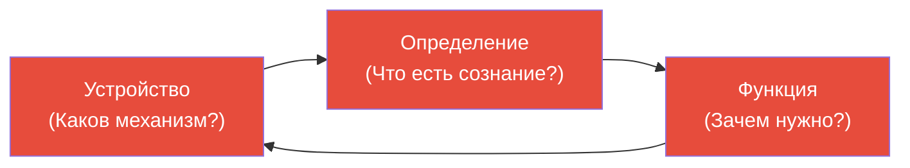
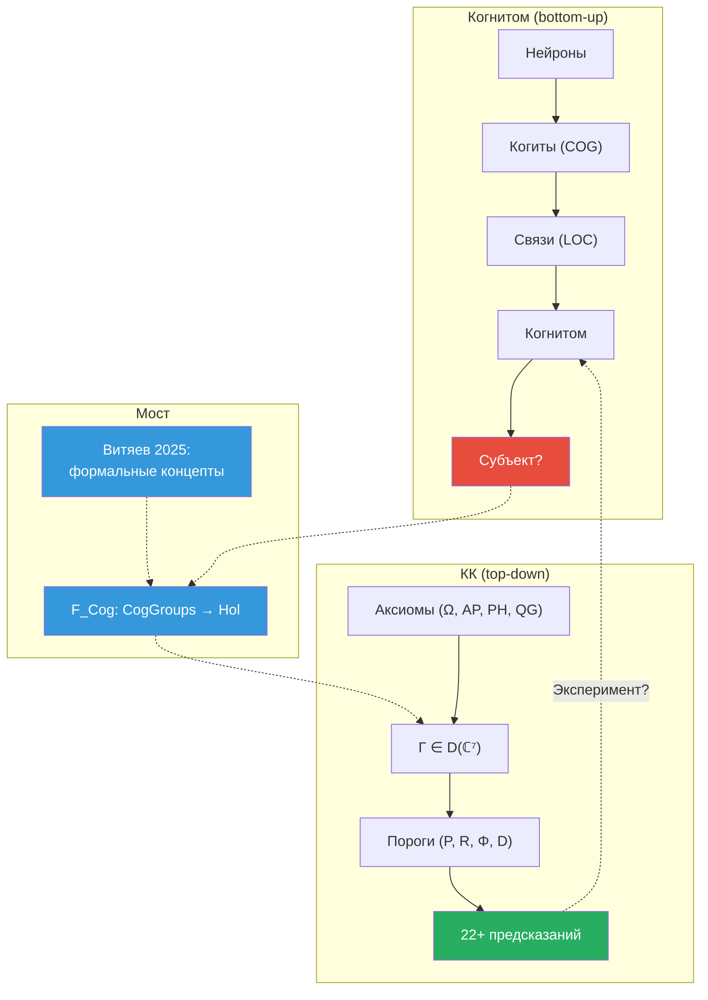

# Когнитом Анохина: Нейронная Гиперсеть и Проблема Субъекта

:::info Для кого эта глава
Вы узнаете о теории когнитома К.В. Анохина — нейронной гиперсети, претендующей на решение «проблемы Кто» в науке о сознании. Глава анализирует сильные стороны и ограничения когнитома и показывает, как функтор $F_{\text{Cog}}$ связывает его с формализмом $\Gamma$.
:::

> «Главная проблема наук о сознании — это не проблема "Что?" и не проблема "Как?", а проблема "Кто?" — кто является субъектом сознательного опыта.»
>
> — К.В. Анохин

:::note О нотации
В этом документе:
- $\Gamma$ — [матрица когерентности](/docs/core/dynamics/coherence-matrix)
- $\varphi$ — [оператор самомоделирования](/docs/proofs/categorical/formalization-phi)
- $\Phi$ — [мера интеграции](/docs/core/structure/dimension-u#мера-интеграции-φ)
- $R$ — [мера рефлексии](/docs/consciousness/foundations/self-observation#мера-рефлексии-r)
- L0–L4 — [уровни интериорности](/docs/consciousness/hierarchy/interiority-hierarchy)
- $\mathbf{Hol}$ — [категория Голономов](/docs/proofs/categorical/categorical-formalism)
:::

---

## 1. Введение: научная школа Анохиных {#введение}

### Кто такой К.В. Анохин?

**Константин Владимирович Анохин** (р. 1957) — нейробиолог, академик РАН, директор Института перспективных исследований мозга МГУ, руководитель отдела нейронаук НИЦ «Курчатовский институт», лауреат премии имени И.П. Павлова. Его теория когнитома — одна из немногих современных теорий сознания, развиваемых в российской научной традиции и получивших международное признание.

**Ключевая публикация:** Анохин К.В. (2021). «Когнитом: в поисках фундаментальной нейронаучной теории сознания». *Журнал высшей нервной деятельности им. И.П. Павлова*, т. 71, №1, сс. 39–71. Английский перевод: *Neuroscience and Behavioral Physiology*, Vol. 51, pp. 915–937 (Springer). Приглашённые доклады на ASSC (Association for the Scientific Study of Consciousness), TSC 2018 (Tucson), Первая международная конференция «Computer Methods of Cognitome Analysis» (ВШЭ, 2022, 260 участников из 10 стран).

### Династия: от П.К. Анохина к К.В. Анохину

К.В. Анохин — **внук** Петра Кузьмича Анохина (1898–1974), создателя **теории функциональных систем** (ТФС). Это не просто семейная связь, а интеллектуальная преемственность длиной в три поколения:

**Пётр Кузьмич Анохин** — ученик Ивана Петровича Павлова, но рано отошёл от классического рефлексологического подхода. Павлов описывал поведение как цепочку рефлексов: стимул → ответ. Анохин-старший увидел, что это неверно: организм не реагирует на стимулы — он **действует** ради результата, **предсказывает** этот результат и **сравнивает** реальность с предсказанием. Это было революцией: в 1935 году, за десятилетия до появления кибернетики, Анохин ввёл понятия, которые сегодня звучат как описание предиктивного кодирования.

Ключевые понятия ТФС, предвосхитившие современные теории:

| Понятие ТФС (1935–1974) | Современный аналог | Опередил на |
|--------------------------|-------------------|-------------|
| **Акцептор результата действия** — нейронная модель ожидаемого результата | Предиктивное кодирование (Clark 2013) | ~60 лет |
| **Опережающее отражение** — способность предсказывать будущее | Байесовский мозг (Doya 2007) | ~50 лет |
| **Системогенез** — функциональные системы формируются как целое | Нейроконструктивизм (Westermann 2007) | ~30 лет |
| **Обратная афферентация** — сличение результата с предсказанием | Prediction error minimization (Friston 2010) | ~40 лет |

К.В. Анохин развивает эту традицию, расширяя от нейрофизиологии к **науке о сознании**, и ставит вопрос: какой субстрат мозга порождает не просто адаптивное поведение, а **субъективный опыт**?

### Определение сознания по Анохину

Анохин даёт операциональное определение: сознание — это **«внутренние, качественные, субъективные состояния и процессы восприятия или осознания»**, которые начинаются при пробуждении и продолжаются до засыпания, смерти или комы. Это определение задаёт *explanandum* (что требуется объяснить), а не *explanans* (что объясняет).

### Главная проблема vs. Трудная проблема {#главная-vs-трудная}

Анохин проводит важное разграничение:

- **Трудная проблема** (Hard Problem, Чалмерс 1995): почему физические процессы порождают субъективные переживания?
- **Главная проблема** (Main Problem, Mind-brAIN problem): какова природа связи между разумом и мозгом **в целом**?

Ключевой тезис: **решение Трудной проблемы не решает автоматически Главную проблему**. Современная нейронаука зациклена на Трудной проблеме, но забывает предварительное условие — нужна теория **носителя** сознания (разума как когнитивной структуры). Без ответа на вопрос «Кто?» вопрос «Почему?» неразрешим.

:::note Параллель с КК
КК растворяет это разграничение: [двуаспектный монизм](/docs/consciousness/foundations/two-aspect-monism) трактует физические и феноменальные аспекты как два «лица» единой матрицы $\Gamma$. Трудная проблема не возникает, потому что интериорность (E-измерение) — не эпифеномен физики, а её неотъемлемый аспект. Главная проблема решается формализмом $\Gamma \in \mathcal{D}(\mathbb{C}^7)$.
:::

---

## 2. Проблема «Кто»: дефицит существующих теорий {#проблема-кто}

### Слепое пятно науки о сознании

Анохин систематически анализирует ведущие теории сознания и обнаруживает **общий дефицит**: ни одна из них не отвечает на вопрос «Кто является субъектом сознания?»

| Теория | Что объясняет | Чего не объясняет | Метафора |
|--------|---------------|-------------------|----------|
| **IIT** (Тонони) | Интеграция информации ($\Phi$) | Кто интегрирует? Что такое «система» с max $\Phi$? | «Измерили температуру — но кто лихорадит?» |
| **GWT** (Бернард Баарс) | Глобальное рабочее пространство | Кто «читает» содержимое рабочего пространства? | «Описали доску объявлений — но кто её читает?» |
| **TNGS** (Эдельман) | Нейронный дарвинизм, реентрантная сигнализация | Кто является субъектом отбора? | «Объяснили отбор — но кто отбирается?» |
| **HOT** (Розенталь) | Мысли высшего порядка о мыслях | Кто имеет эти мысли? | «Описали зеркало — но кто в него смотрит?» |
| **FEP** (Фристон) | Минимизация свободной энергии | Что минимизирует? Где граница агента? | «Написали уравнение — но кто его "решает"?» |

Все эти теории описывают **механизмы** (как) и **корреляты** (что) сознания, но не модель **субъекта** — того, кто переживает. Анохин называет это «слепым пятном» и считает его не случайным упущением, а **системной проблемой**: современная нейронаука унаследовала от бихевиоризма табу на обсуждение субъекта.

### Парадокс гомункулуса

Анохин формулирует глубокий парадокс: все теории пытаются «убить гомункулуса» (устранить таинственного «кого-то» внутри мозга), но **все они невольно его воспроизводят**. Его точная формулировка: С-процессы, которые сопровождают С'-процессы, «сами не могут быть каузальными» (Эдельман), однако они выполняют функцию информирования «нас» — то есть того самого «кто», который был изгнан как гомункулус.

Вывод Анохина: «Кто» — **не** мистическая сущность и **не** устранимая иллюзия. Это новый фундаментальный организационный уровень, требующий специализированной теории.

:::note Параллель с КК
КК решает проблему «Кто» через [оператор самомоделирования $\varphi(\Gamma)$](/docs/proofs/categorical/formalization-phi) (T-62 [Т]): субъект — это **самомодель** голонома, построенная CPTP-каналом. Субъект не постулируется извне и не сводится к конкретной нейронной структуре — он **конструируется** из динамики $\Gamma$. Это формальный ответ на вопрос Анохина: «Кто?» — это $\varphi(\Gamma)$.
:::

---

## 3. Десять свойств сознания {#десять-свойств}

### Свойства и их объяснение

Опираясь на работы Сёрла, Эдельмана, Дамасио, Тонони и других, Анохин выделяет **10 свойств** сознательного опыта. Рассмотрим каждое и покажем его отображение в формализм КК:

| # | Свойство | Описание простым языком | Отображение в КК |
|---|----------|------------------------|-------------------|
| 1 | **Субъективность** | Переживания принадлежат «кому-то». Моя боль — моя, не ваша | $\varphi(\Gamma)$ — самомодель уникальна для каждого $\Gamma$ |
| 2 | **Качественность** | У переживаний есть «каково это» (what it is like). Красный не похож на синий | $\mathrm{Coh}_E$ — проективная геометрия [E-измерения](/docs/core/structure/dimension-e) |
| 3 | **Интенциональность** | Сознание всегда *о чём-то* — о яблоке, о мысли, о боли | Когерентности $\gamma_{ij}$ между секторами — направленность |
| 4 | **Целостность (единство)** | Переживание дано как единое целое, а не набор частей | $\Phi \geq 1$ — [мера интеграции](/docs/core/structure/dimension-u#мера-интеграции-φ) |
| 5 | **Темпоральность** | Переживание разворачивается во времени | $\dot{\Gamma} = \mathcal{L}_\Omega[\Gamma]$ — непрерывная динамика |
| 6 | **Ситуативность** | Переживание привязано к конкретной ситуации | Состояние $\Gamma(t)$ в конкретный момент |
| 7 | **Селективность** | Внимание выделяет часть из потока | $\sigma_k$ (стресс-вектор) — приоритизация секторов |
| 8 | **Приватность** | Переживание доступно только субъекту | $\varphi(\Gamma)$ — внутренний оператор, не наблюдаемый извне |
| 9 | **Изменчивость** | Поток сознания непрерывно меняется | $\Gamma(t)$ эволюционирует непрерывно под $\mathcal{L}_\Omega$ |
| 10 | **Связность** | Переживания связаны друг с другом | Когерентности $\gamma_{ij}$ — 21 пара связей (T-146 [Т]) |

### Редукция к квалитативности

Анохин делает важный философский ход: показывает, что все 10 свойств **сводятся** к одной фундаментальной характеристике — **квалитативности** (наличию субъективного качества переживания). Если есть квалитативность, остальные свойства следуют из неё. Без квалитативности нет субъективности (нет «кому»), нет единства (нечего объединять), нет приватности (нечего скрывать).

В терминах КК это означает: $\mathrm{Coh}_E > 1/7$ (ненулевая когерентность E-измерения) — **необходимое** условие, из которого следуют все 10 свойств. Теорема No-Zombie [Т] формализует эту связь: жизнеспособная система ($P > 2/7$) **необходимо** имеет $\mathrm{Coh}_E > 1/7$.

---

## 4. Четыре ингредиента сознания {#четыре-ингредиента}

Анохин выделяет четыре **необходимых компонента** любого эпизода сознательного опыта:

| Ингредиент | Вопрос | Пример | Если убрать |
|------------|--------|--------|-------------|
| **Кто** | Кто переживает? | Субъект (я, организм) | Нет переживания (иллюзия зомби) |
| **Что** | Что переживается? | Содержание (красное пятно, боль, мысль) | Пустое сознание (предельный случай) |
| **Где** | Где локализовано переживание? | Телесная/пространственная привязка | Диссоциация (деперсонализация) |
| **Когда** | Когда происходит переживание? | Момент в потоке сознания | Атемпоральные состояния (глубокая медитация?) |

Уберите любой из четырёх — и эпизод сознания распадается или патологически деформируется. Нет «красного без субъекта» (это и есть проблема зомби). Нет «субъекта без содержания» (пустое сознание — предельный случай, достижимый только в медитативных практиках и описанный как «ничто, которое всё равно кто-то переживает»).

В терминах КК: **Кто** = $\varphi(\Gamma)$, **Что** = секторальное распределение $\gamma_{kk}$, **Где** = [A-измерение](/docs/core/structure/dimension-a) (агентность, телесность), **Когда** = момент $t$ в эволюции $\Gamma(t)$.

---

## 5. Пять вопросов Тинбергена для сознания {#пять-вопросов}

### Исходная постановка

**Нико Тинберген** (1907–1988) — голландский этолог, нобелевский лауреат (1973), предложил четыре вопроса, необходимых для полного объяснения любого биологического явления. Анохин расширяет их до пяти применительно к сознанию:

1. **Устройство** (mechanism): Каков нейронный (или абстрактный) механизм сознания?
2. **Функция** (function): Зачем нужно сознание? Каково его адаптивное значение?
3. **Развитие** (ontogeny): Как сознание возникает в ходе индивидуального развития?
4. **Обучение** (learning): Как сознание меняется при обучении?
5. **Эволюция** (phylogeny): Как сознание возникло в ходе эволюции?

### Почему эти вопросы трудны?

Каждый вопрос по отдельности кажется решаемым. Трудность в том, что они **взаимозависимы** (см. следующий раздел). Но ценность постановки Тинбергена — в **полноте**: теория сознания, отвечающая только на один вопрос (например, только на «Устройство»), заведомо неполна.

---

## 6. Циркулярная ловушка {#циркулярная-ловушка}

### Суть проблемы

Анохин формулирует **ключевую методологическую проблему**: пять вопросов Тинбергена невозможно решить по отдельности.

- Чтобы ответить на вопрос об **устройстве**, нужно знать, что такое сознание (**определение**)
- Чтобы дать **определение**, нужно знать **функцию** (для чего определяемое нужно)
- Чтобы понять **функцию**, нужно знать **устройство** (что именно выполняет функцию)

Это **циркулярная ловушка** (circular trap): каждый вопрос предполагает ответ на остальные. Попытка решить их последовательно (сначала устройство, потом функцию, потом развитие) неизбежно наталкивается на то, что первый шаг уже требует результатов последнего.

### Выход из ловушки

Анохин утверждает: единственный выход — строить теорию, которая отвечает на **все пять вопросов одновременно** в рамках единого формализма. Не «сначала определим, потом объясним», а «определение, устройство, функция, развитие и эволюция — разные аспекты одного формального объекта».

:::info Позиция КК: решение циркулярной ловушки
КК заявляет решение циркулярной ловушки через единый формализм $\Gamma \in \mathcal{D}(\mathbb{C}^7)$:

| Вопрос Тинбергена | Ответ КК | Ссылка |
|-------------------|----------|--------|
| **Устройство** | $\dot\Gamma = \mathcal{L}_\Omega[\Gamma]$ (уравнение эволюции) | [Эволюция](/docs/core/dynamics/evolution) |
| **Функция** | $V_{\text{hed}} = dP/d\tau$ [Т] — гедонический вектор направляет к жизнеспособности | [T-103](/docs/applied/coherence-cybernetics/theorems) |
| **Развитие** | T-148 [Т] — генезис уровней L0→L2 через пороги | [Теоремы](/docs/applied/coherence-cybernetics/theorems) |
| **Обучение** | T-109..T-113 [Т] — информационные, динамические, стабильностные границы | [Границы обучения](/docs/applied/coherence-cybernetics/learning-bounds) |
| **Эволюция** | L0→L4 — филогенез интериорности как рост $P$, $R$, $\Phi$ | [Иерархия](/docs/consciousness/hierarchy/interiority-hierarchy) |

Все пять ответов выводятся из **одной** матрицы $\Gamma$ и **одного** уравнения эволюции. Определение (что есть сознание?) даётся через пороги ($P > 2/7 \wedge R \geq 1/3 \wedge \Phi \geq 1 \wedge D \geq 2$), которые одновременно являются частью устройства ($\Gamma$), объясняют функцию ($V_{\text{hed}}$) и прослеживаются в развитии (L0→L2).
:::

---

## 7. Когнитом: от коннектома к гиперсети {#когнитом}

### Коннектом: необходимый, но недостаточный

**Коннектом** (термин Sporns, Hagmann 2005) — полная карта нейронных соединений мозга. Это **граф**: узлы = нейроны (или области мозга), рёбра = синаптические соединения (или тракты белого вещества). Крупнейшие проекты: Human Connectome Project (NIH, с 2009), полный коннектом C. elegans (302 нейрона, ~7000 соединений).

Коннектом описывает **структуру** (кто с кем соединён), но не **когнитивные свойства** (что эта структура «знает»). Аналогия: карта дорог показывает маршруты, но не содержание перевозимых грузов.

### Когнитом: ответ Анохина

**Когнитом** (Анохин 2014) — нейронная **гиперсеть** (hypergraph), которая описывает не соединения, а **когнитивные элементы** и их комбинации:

| | Коннектом | Когнитом |
|---|---|---|
| **Тип структуры** | Граф (узлы + рёбра) | Гиперграф (узлы + гиперрёбра) |
| **Узлы** | Нейроны | Когнитивные группы (**когиты**) |
| **Рёбра** | Синапсы (пары) | Ассоциативные связи (**гиперрёбра** — связывают 3+ когита) |
| **Описывает** | Анатомическую связность | Когнитивную организацию |
| **Размерность** | Фиксированная (сколько нейронов, столько и есть) | Растущая (при каждом обучении добавляются новые когиты) |
| **Аналогия** | Карта дорог | Карта знаний |

Ключевое отличие — **гиперрёбра**. В обычном графе ребро соединяет **два** узла. В гиперграфе гиперребро может соединять **произвольное количество** узлов одновременно. Это необходимо для когнитивных операций: понятие «красная машина едет быстро» связывает одновременно когиты «цвет-красный», «объект-машина», «скорость-высокая» — это тройная (а не попарная) ассоциация.

### COG и LOC: формальная структура когнитома {#cog-loc}

В формальной терминологии Анохина когнитом состоит из двух типов элементов:

**COG** (Cognitive Group of Neurons, когнитивная группа нейронов) — вершина когнитома. Существует два подтипа:
1. **Функциональные системы** — целенаправленные нейронные структуры (из ТФС П.К. Анохина)
2. **Клеточные ансамбли** — хеббовские корреляционные группы (из системно-эволюционной теории Швыркова)

Каждый COG — подмножество нейронов из нижележащего коннектома, объединённых общим опытом и хранящихся в долговременной памяти. В терминах алгебраической топологии: COG — это **гиперсимплекс** (реляционный симплекс), **базис** которого образован вершинами нейронной сети, а **вершина** обладает **эмерджентным когнитивным качеством**, отсутствующим у любого отдельного нейрона.

**LOC** (Link of COGs, связь когитов) — ребро между COG. Ключевой механизм: LOC кодируются **перекрытием нейронов** связанных COG. Нейроны, участвующие одновременно в нескольких COG, создают связь между ними. LOC представляет «единицу каузального знания когнитивного агента».

:::note Параллель с КК
Механизм LOC через перекрытие нейронов — конкретная биологическая реализация того, что КК моделирует как недиагональные когерентности $\gamma_{ij}$. Когерентность $\gamma_{ij} \neq 0$ означает, что сектора $i$ и $j$ «перекрываются» в квантово-информационном смысле — аналог общих нейронов в COG.
:::

### Когиты: элементарные единицы когнитома

**Когит** (cogit, от лат. cogito — мыслю) — минимальная группа нейронов, обладающая когнитивным свойством: способностью кодировать элементарное значение (объект, признак, действие, отношение). Когиты — это COG в устоявшейся терминологии.

Когиты — не отдельные нейроны (слишком мелко: один нейрон не кодирует значение) и не зоны мозга (слишком крупно: зона мозга кодирует слишком многое). Когиты — **промежуточный уровень** организации, примерно соответствующий нейронным ансамблям из ~100–10 000 нейронов.

Когиты формируются при **обучении**: каждый новый опыт создаёт или модифицирует когит. Совокупность когитов и их ассоциативных связей — когнитом — **растёт** в течение жизни. Мозг новорождённого имеет минимальный когнитом; мозг пожилого учёного — огромный.

### От топографии к топологии: межвидовая универсальность {#топология}

Анохин вводит критически важное разграничение:

- **Топографический** подход: привязка сознания к конкретным областям мозга (неокортекс, таламо-кортикальная система). Работает только для млекопитающих.
- **Топологический** подход: сознание определяется **организационными принципами** когнитома, не зависящими от анатомии.

Это необходимо для объяснения сознания у **разных видов**:
- **Птицы**: развитое сознание без неокортекса (вороны, попугаи демонстрируют метакогнитивные способности)
- **Головоногие**: полностью иная нервная система (осьминоги — распределённый интеллект с 9 «мозгами»)
- **Насекомые**: потенциально простейшие формы сознания при минимальной нервной системе

Топологический аргумент Анохина неожиданно сближает когнитом с КК: если сознание определяется организационными принципами, а не субстратом, то когнитом **в принципе** допускает субстрат-независимость — хотя сам Анохин не делает этого шага явно.

:::info Глубокая параллель с КК
КК постулирует субстрат-независимость аксиоматически: $\Gamma \in \mathcal{D}(\mathbb{C}^7)$ не привязана ни к нейронам, ни к кремнию. Анохин приходит к **аналогичному выводу** с биологической стороны: если топологические принципы когнитома инвариантны относительно анатомии, то они в принципе реализуемы на любом субстрате. Разница: КК формализует этот принцип, когнитом — указывает на него.
:::

---

## 8. Сознание как интеграция в когнитоме {#сознание-когнитом}

### Механизм: перколяция

Анохин предлагает: **сознание** — это **широкомасштабная интеграция** когнитивных элементов в гиперсети когнитома. Когда достаточно большое количество когитов синхронно активируется и образует **связное** подмножество гиперграфа — возникает эпизод сознательного опыта.

Ключевое понятие — **перколяция** (просачивание). В физике перколяция — процесс, при котором жидкость проходит через пористую среду: при малой пористости жидкость блокируется, но при превышении критического порога — «просачивается» через всю среду. Аналогично в когнитоме: при малой активации когиты активны локально; при превышении порога — активация «просачивается» через гиперсеть, связывая разрозненные когиты в единое целое.

### Решение проблемы «Кто»

Анохин предлагает ответ на свой собственный вопрос: **субъект = когнитом** (целый, а не его часть). Проблема «Кто» решается **отождествлением** субъекта с целым когнитомом, а не с каким-либо его подмножеством.

Ключевые идеи:

1. **Перколяция = порог сознания**: сознание возникает, когда активация «просачивается» через гиперсеть (аналогия с фазовым переходом)
2. **Субъект = когнитом**: проблема «Кто» решается отождествлением субъекта с **целым когнитомом** (не с его частью)
3. **Содержание = активный подграф**: «Что» сознания — это конкретный паттерн активации когитов в данный момент
4. **Deutero-learning**: когнитом способен к обучению обучению (meta-learning) — формированию новых стратегий формирования когитов

### Объяснительный разрыв: позиция Анохина {#объяснительный-разрыв}

Анохин предлагает нетривиальное решение проблемы объяснительного разрыва (explanatory gap, Левайн 1983): разрыв существует **только пока не определён носитель сознания**. Как только структура когнитивной системы (когнитом) теоретически разработана, субъективные свойства становятся **естественными следствиями** этой организации — разрыв закрывается не философским аргументом, а развитием теории.

:::note Параллель с КК
КК решает проблему разрыва структурно: оператор Gap$(i,j) = |\sin(\arg(\gamma_{ij}))| \in [0,1]$ задаёт **непрозрачность** между внешним и внутренним аспектами. При Gap = 0 аспекты совпадают (полная прозрачность), при Gap = 1 — полная диссоциация. Объяснительный разрыв — не метафизическая пропасть, а **измеримая величина**, зависящая от фазы когерентности. Это формализует интуицию Анохина: разрыв — артефакт неполной теории, не свойство реальности.
:::

### Ограничения

Анохин честно признаёт, что теория когнитома на данном этапе:
- **Качественная**: нет количественных уравнений динамики когнитома. Когда именно перколяция «достаточна» для сознания? Какой порог? Теория не отвечает
- **Биологически ограниченная** (частично): привязана к нейронным структурам, хотя топологический аргумент (§7) открывает путь к субстрат-независимости
- **Не фальсифицируемая в строгом смысле**: нет числовых предсказаний для экспериментальной проверки. «Перколяция в гиперграфе» — описание, а не число
- **Циркулярность определения**: когнитом определяется через когнитивные свойства, которые, в свою очередь, определяются через когнитом. Анохин диагностирует эту циркулярную ловушку у других теорий (§6), но сам не до конца из неё выходит

---

## 9. Наследие П.К. Анохина: теория функциональных систем {#тфс}

Теория когнитома — логическое развитие ТФС. Интеллектуальная линия прослеживается чётко:

| Понятие ТФС (П.К. Анохин) | Развитие в когнитоме (К.В. Анохин) | Комментарий |
|---|---|---|
| Функциональная система | Когит (элементарная когнитивная единица) | От системы организма к единице знания |
| Акцептор результата действия | Предсказательная модель в когитоме | От нейрофизиологии к когнитивной науке |
| Опережающее отражение | Антиципация через активацию ассоциированных когитов | Предсказание через распространение активации |
| Системогенез | Когитогенез (формирование когитов в онтогенезе) | От формирования рефлексов к формированию знаний |
| Полезный результат | Когнитивная функция когита | От адаптации к познанию |

### Школа Швыркова — Александрова {#швырков}

Между П.К. Анохиным и К.В. Анохиным стоит критически важное промежуточное звено:

**Вячеслав Борисович Швырков** (1939–1994) — ближайший ученик П.К. Анохина. Развил **системно-эволюционную теорию** в рамках системной психофизиологии. Его ключевые вклады:
- Отказ от понятия «пускового стимула»: нейроны специализированы не под стимулы, а под **поведенческие акты**
- **Клеточные ансамбли**: при одном и том же физическом стимуле, вызывающем разные поведенческие акты, активируются **разные** наборы нейронов
- Поведение как **поведенческо-временной континуум**, а не цепь изолированных актов

**Юрий Иосифович Александров** (р. 1953) — продолжатель школы Швыркова. Развил концепцию **структуры индивидуального опыта** как совокупности функциональных систем с межсистемными отношениями.

К.В. Анохин синтезирует: клеточные ансамбли Швыркова становятся **когитами** (COG), межсистемные отношения Александрова — **связями когитов** (LOC), а вся структура — **когнитомом** (гиперсетью).

Эта преемственность — сила теории: она не возникает ex nihilo, а развивает **80-летнюю нейрофизиологическую традицию** с богатой экспериментальной базой.

---

## 10. Сравнение когнитома и КК {#сравнение}

### Два подхода к одной проблеме

Когнитом и КК решают **одну задачу** — объяснить природу сознания — но идут с противоположных сторон:

- **Когнитом**: от нейробиологии «вверх» к субъекту (bottom-up)
- **КК**: от математического формализма «вниз» к предсказаниям (top-down)

### Развёрнутая таблица сравнения

| Аспект | Когнитом (Анохин) | КК |
|--------|-------------------|-----|
| **Субстрат** | Нейронная гиперсеть (биологическая) | $\Gamma \in \mathcal{D}(\mathbb{C}^7)$ (субстрат-независимая) |
| **Проблема «Кто»** | Центральная: когнитом = субъект | $\varphi(\Gamma)$ = самомодель (T-62 [Т]) |
| **Порог сознания** | Перколяция в гиперграфе (качественно) | $P > 2/7 \wedge R \geq 1/3 \wedge \Phi \geq 1 \wedge D \geq 2$ [Т] |
| **Динамика** | Не формализована | $\mathcal{L}_\Omega = -i[H,\cdot] + \mathcal{D} + \mathcal{R}$ (полная) |
| **10 свойств сознания** | Сводятся к квалитативности | 21 пара $\gamma_{ij}$ (T-146 [Т]) — каждое свойство имеет формальный коррелят |
| **Циркулярная ловушка** | Обозначена как проблема | Решена: все 5 вопросов → единый формализм |
| **Фальсифицируемость** | Низкая (качественная теория) | Высокая (22+ количественных предсказаний) |
| **Обучение** | Когитогенез, deutero-learning | T-109..T-113 [Т] (информационные, динамические, стабильностные границы) |
| **Эволюция** | Филогенез когнитивных систем (качественно) | [L0→L4 иерархия](/docs/consciousness/hierarchy/interiority-hierarchy) + T-148 генезис [Т] |
| **Композиция** | Гиперрёбра в когнитоме | $\mathbb{H}_1 \otimes \mathbb{H}_2$ с $\Phi$-порогом [Т] |
| **Нейробиологическая конкретность** | Высокая (когиты, синапсы, зоны мозга) | Низкая (абстрактные 7 измерений) |
| **Связь с физикой** | Отсутствует | Уравнения Эйнштейна, SM [С]/[Т] |
| **Математический аппарат** | Теория гиперграфов (качественно); Витяев 2025 (формальные концепты) | Теория категорий, квантовая теория информации |
| **Объяснительный разрыв** | Закрывается через теорию носителя (качественно) | Формализуется как Gap$(i,j) = |\sin(\arg(\gamma_{ij}))|$ |
| **Межвидовая универсальность** | Да (топологический аргумент) | Да (субстрат-независимость) |
| **Экспериментальный статус** | Экспериментальная база по памяти; нет тестов когнитома | Нет экспериментальных тестов |
| **Критическая рецепция** | Percy 2024: «borderline»; Канаев & Дряева 2023 | Новая теория, рецепция минимальна |
| **Традиция** | Анохин → Швырков → Александров → К.В. Анохин (80+ лет) | Новая (нет прямой линии наследования) |

### Гиперграф vs матрица когерентности

Структурное сравнение двух центральных объектов:

| Когнитом | КК | Комментарий |
|----------|-----|-------------|
| Когит (группа нейронов) | Подпространство $\Gamma$ (сектор $\gamma_{kk}$) | Элементарная когнитивная единица |
| Гиперребро $(c_i, c_j, c_k)$ | Когерентность $\gamma_{ij}$ | Связь между элементами. Когнитом допускает многомерные связи (гиперрёбра); КК — только попарные ($\gamma_{ij}$), но с полной структурой 7x7 матрицы |
| Перколяция в гиперграфе | $P > P_{\text{crit}} = 2/7$ | Порог коллективной активации. Качественный у Анохина, числовой в КК |
| Когнитом (целый) | Голоном $\mathbb{H}$ | Субъект как целое |
| Deutero-learning | SAD-уровни (T-110 [Т]) | Обучение обучению |

---

## 11. Что когнитом делает лучше КК {#преимущества-когнитома}

Объективность требует признать сильные стороны когнитома:

**1. Нейробиологическая конкретность.** Когиты — это реальные группы нейронов, которые можно (в принципе) обнаружить экспериментально через calcium imaging, multi-electrode arrays или двухфотонную микроскопию. КК оперирует абстрактными $\gamma_{ij}$, которые нуждаются в «анкерной карте» — соответствии между математическими мерами и нейронными коррелятами. Эта карта пока не построена.

**2. Проблема «Кто» поставлена явно.** Анохин **первым** в систематическом виде показал, что IIT, GWT и другие теории «слепы» к субъекту. Это ценная **метатеоретическая** работа, вскрывающая общее слепое пятно. Даже если когнитом не решает проблему полностью, постановка вопроса — заслуга Анохина.

**3. Научная традиция.** Связь с ТФС П.К. Анохина, школой Ю.И. Александрова и В.Б. Швыркова даёт экспериментальный бэкграунд: нейронные специализации, системогенез, нейронные ансамбли. Это **80+ лет** экспериментальной работы. КК не имеет экспериментальной предыстории.

**4. Уровень «мезо».** Когит — промежуточный уровень между нейроном и зоной мозга. Этот уровень описания (~100–10 000 нейронов) — наиболее перспективный для экспериментальной нейронауки: достаточно конкретный для эксперимента и достаточно абстрактный для теории. КК работает на макро-уровне (7 измерений), не детализируя мезоструктуру.

**5. Межвидовая универсальность.** Топологический аргумент (§7) требует, чтобы теория сознания работала для млекопитающих, птиц и головоногих. Когнитом в принципе допускает это: если когиты определяются функционально, а не анатомически, теория не привязана к конкретной архитектуре мозга. КК достигает этого формально ($\Gamma$ субстрат-независима), но не имеет экспериментальной привязки к конкретным видам.

---

## 12. Что КК делает лучше когнитома {#преимущества-кк}

**1. Формализация.** КК даёт **уравнения**: $\dot\Gamma = \mathcal{L}_\Omega[\Gamma]$, $\sigma_k = \text{clamp}(1 - 7\gamma_{kk}, 0, 1)$, $V_{\text{hed}} = dP/d\tau$. Из этих уравнений следуют теоремы с доказательствами. Когнитом описывает процессы словами, без уравнений.

**2. Субстрат-независимость.** КК применима к любой системе с $\Gamma \neq I/7$ — биологической, кремниевой, гибридной. Когнитом привязан к нейронной ткани: для применения к AGI его нужно переформулировать.

**3. Точные пороги.** $P_{\text{crit}} = 2/7$ [Т], $R_{\text{th}} = 1/3$ [Т], $\Phi_{\text{th}} = 1$ [Т] — **числа**, которые можно проверить экспериментом. «Перколяция в гиперграфе» — описание, не число. Когда перколяция «достаточна» для сознания? Когнитом не отвечает.

**4. Фальсифицируемость.** 22+ [предсказаний](/docs/applied/coherence-cybernetics/predictions) КК — каждое может быть опровергнуто конкретным экспериментом. Когнитом на данном этапе не порождает проверяемых числовых предсказаний.

**5. Связь с физикой.** КК выводит уравнения Эйнштейна (T-120 [Т]), эмерджентное пространство-время, элементы Стандартной модели. Когнитом — чисто нейробиологическая теория без выхода в фундаментальную физику.

**6. Решение циркулярной ловушки.** КК отвечает на все 5 вопросов Тинбергена в рамках единого формализма (см. §6). Когнитом ставит ловушку, но предлагает лишь частичный выход — когнитом определяется через когнитивные свойства, которые, в свою очередь, определяются через когнитом.

---

## 13. Математизация когнитома: Витяев (2025) {#математизация}

### Первая попытка формализации

**Е. Витяев** (2025, arXiv:2512.10988, доклад на MathAI 2025) предпринял единственную на сегодня попытку **математической формализации** когнитома. Вместо алгебраической топологии (описательный язык самого Анохина) используется иной аппарат:

| Понятие Анохина | Формализация Витяева | Комментарий |
|-----------------|---------------------|-------------|
| Когит (COG) | **Вероятностный формальный концепт** — неподвижная точка оператора предсказания | Определение 19: пара $(A,B)$ такая, что $\Pi_R^\infty(B) = B$ |
| Связь когитов (LOC) | **Максимально специфичное каузальное отношение** (MSCR) | Определение 16: каузальное отношение с максимальной условной вероятностью |
| Перколяция | Итерация оператора предсказания $\Pi_R$ | Определение 17: $\Pi_R(L) = L \cup \{C \mid \exists R \in \mathcal{R}: R_{\text{left}} \subset L, R_{\text{right}} = C\}$ |
| Когнитом | Совокупность формальных концептов и MSCR | Фиксированная точка каскадной активации |

**Теорема 1 (Витяев):** Если $L$ совместно, то $\Pi_R(L)$ остаётся совместным и непротиворечивым — каскадные предсказания не порождают логических противоречий.

### Ограничения формализации

Формализация Витяева:
- **Не использует** гиперграфную структуру (инцидентные матрицы, тензорные формализмы)
- **Не выводит** порог перколяции количественно
- **Не связана** с динамикой (нет уравнений эволюции)
- **Не порождает** числовых предсказаний

Это скорее **алгебраическая семантика** когнитома, чем его динамическая теория.

:::info Сравнение с КК
КК формализует аналогичные понятия принципиально иначе: COG → диагональный элемент $\gamma_{kk}$, LOC → когерентность $\gamma_{ij}$, перколяция → $P > P_{\text{crit}} = 2/7$, динамика → $\dot\Gamma = \mathcal{L}_\Omega[\Gamma]$. Формализация Витяева и КК **совместимы**: вероятностные формальные концепты могут рассматриваться как классический предел квантово-информационных структур КК. Это подсказывает возможный маршрут синтеза.
:::

---

## 14. Когнитом и знаниевая коммуникация {#знаниевая-коммуникация}

### Транспортный знаниевый стек

Теория когнитома находит неожиданное применение в **теории знаниевой коммуникации** (проект «Управляемая эпистемология», anticomplexity.org). Пятиуровневый **транспортный знаниевый стек** моделирует передачу исполнимого знания между агентами:

| Уровень | Название | Функция |
|---------|----------|---------|
| 5 | Исполнимое знание | Приватные динамические состояния, регулирующие поведение |
| 4 | Семантический | Проецирование синтаксисов на исполнительный аппарат |
| 3 | Синтаксический | Паттернистика, иерархические схемы кодирования |
| 2 | Семиотический | Распознавание кода из сигнальных пакетов |
| 1 | Сигнальный | Физическая среда передачи |

### Связь с когнитомом

Уровни стека поддерживают **вертикальную связность**, отражающую внутренние фронты активации когнитомных структур. Когнитом П.К. и К.В. Анохиных привлекается как нейрокогнитивная основа:
- **Афферентный сегмент** (ТФС) определяет доступный исполнительный аппарат для проецирования семантических кодов
- **Эфферентный выход** связывает семантическую обработку с исполнением
- Когиты (COG) занимают «специальные когнитивные позиции», регулирующие поведение вне афферентно-эфферентных функций

### Метатекстовый процессор как модель когнитивной интеграции

Концепция **метатекста** (опорный текст + группа скоррелированных моделей) и **метатекстового процессора** (инструмент, поддерживающий когерентность этих моделей) структурно напоминает КК:

| Метатекст | КК | Когнитом |
|-----------|-----|----------|
| Скоррелированные модели | 21 когерентность $\gamma_{ij}$ | Гиперрёбра LOC |
| Вертикальная связность | Эволюция $\Gamma(t)$ через уровни | Перколяция через слои |
| Социализация (включая LLM) | Композиция $\mathbb{H}_1 \otimes \mathbb{H}_2$ | Коммуникация когнитомов |
| 8 критериев метатекстовости | 5 порогов сознания КК | 10 свойств сознания |

Это указывает на более глубокую связь: **знаниевая коммуникация между агентами воспроизводит на макроуровне те же организационные принципы, что и когнитивная интеграция внутри одного агента**.

---

## 15. Критическая рецепция {#критика}

### Академическая критика

**Percy (2024/2025)**, *Journal of Consciousness Studies*: классифицирует статью Анохина 2021 как «пограничную» (borderline). Критерии теории сознания распределены по **трём разрозненным спискам** (3 принципа, 10 свойств в таблице, 8 вопросов отдельно), что создаёт «нехватку ясности». Теория развивает требования к другим теориям, но не демонстрирует, что когнитом сам удовлетворяет всем требованиям.

**Канаев и Дряева (2023)**, *ЖВНД*: согласны с нередуктивным подходом, но аргументируют, что **опережающее отражение** не может быть главным системообразующим принципом — оно скорее следствие, а не причина эволюционного развития.

### Философская критика

**Проблема «субъективной абстракции»** (scorcher.ru): комментаторы отмечают, что когнитом не объясняет механизм, посредством которого внимание извлекает из нейронной активности формы, эмоции, смыслы. Сознание — «форма материальных процессов», а не «процесс», как формулирует Анохин.

**Проблема остаточной циркулярности**: субъект = когнитом — это **отождествление**, а не **объяснение**. Почему именно целое (а не часть) порождает субъективность? Как целое «больше суммы частей» в точном смысле? Когнитом даёт структурный ответ, но не механистический.

### Экспериментальный статус

На 2026 год **нет опубликованных экспериментов**, специфически тестирующих предсказания когнитома о сознании. Лаборатория Анохина (Курчатовский институт / МГУ) работает над:
- Реконсолидацией и репарацией памяти
- Кальциевой визуализацией с генетически кодируемыми индикаторами (FGCaMP7)
- Динамикой нейронов места в гиппокампе при свободном исследовании

Эти исследования тестируют **механизмы памяти**, не специфические для когнитома гипотезы о сознании. Мезоуровневый разрыв остаётся: никто не продемонстрировал (a) что группы из ~100–10 000 нейронов обладают заявленными когнитивными свойствами, (b) что они образуют гиперсеть, а не граф, (c) что перколяция в этой гиперсети соответствует сознательным состояниям.

---

## 16. Функтор отображения (гипотеза) [И] {#функтор-когнитом}

### Конструкция

**Гипотеза.** Существует функтор:

$$
F_{\text{Cog}}: \mathbf{CogGroups} \to \mathbf{Hol}
$$

где $\mathbf{CogGroups}$ — категория когнитивных групп (когитов с гиперрёбрами), а $\mathbf{Hol}$ — [категория голономов](/docs/proofs/categorical/categorical-formalism).

### Предполагаемая конструкция

| Когнитом | КК | Отображение | Что теряется |
|----------|-----|-------------|--------------|
| Когит $c_i$ | Диагональный элемент $\gamma_{ii}$ | $F_{\text{Cog}}(c_i) = \gamma_{ii}$ | Внутренняя структура когита |
| Гиперребро $(c_i, c_j)$ | Когерентность $\gamma_{ij}$ | $F_{\text{Cog}}(e_{ij}) = \gamma_{ij}$ | Многомерные ассоциации |
| Когнитом $\mathcal{K}$ | Голоном $\mathbb{H}$ | $F_{\text{Cog}}(\mathcal{K}) = \mathbb{H}$ | Мезоуровневая структура |
| Перколяция | $P > P_{\text{crit}}$ | Порог → число | Детали процесса |
| Когитогенез | $d\Gamma/d\tau$ | Динамика → уравнение | Нейробиологические механизмы |

:::warning Статус [И]
$F_{\text{Cog}}$ — **интерпретационная гипотеза**. Для строгого построения необходимо:
1. Определить категорию $\mathbf{CogGroups}$ формально (объекты, морфизмы, композиция)
2. Показать, что 7 измерений КК достаточны для кодирования структуры когнитома
3. Доказать, что перколяция в гиперграфе соответствует $P > 2/7$
4. Связать формализацию Витяева (вероятностные формальные концепты) с квантово-информационной структурой $\Gamma$

Пункт 3 — наиболее конкретный и потенциально проверяемый: если когнитом поддаётся формализации как гиперграф, можно вычислить порог перколяции и сравнить с $P_{\text{crit}}$. Если пороги совпадут — это сильное свидетельство в пользу обеих теорий.

Пункт 4 — открывается работой Витяева (2025): оператор предсказания $\Pi_R$ может рассматриваться как классический предел CPTP-канала $\varphi(\Gamma)$, а неподвижные точки $\Pi_R^\infty(B) = B$ — как классические аналоги аттрактора $\rho^* = \varphi(\Gamma)$.
:::

---

## Заключение: перспективы синтеза {#заключение}

### Фундаментальная конвергенция

Когнитом и КК решают одну проблему — природу сознания — с разных сторон. Однако глубокий анализ обнаруживает не просто «параллельность», а **фундаментальную конвергенцию** на уровне структурных принципов:

| Принцип | Когнитом | КК | Конвергенция |
|---------|----------|-----|-------------|
| Субъект как целое | Когнитом = субъект | $\varphi(\Gamma)$ = самомодель | Оба: субъект не сводим к частям |
| Порог сознания | Перколяция | $P > 2/7$ | Оба: фазовый переход |
| Связь через перекрытие | LOC кодируются общими нейронами | $\gamma_{ij} \neq 0$ — квантовая когерентность | Одна структура на разных уровнях |
| Топологическая инвариантность | Топография → топология | Субстрат-независимость $\Gamma$ | Один и тот же принцип |
| Рост через обучение | Когитогенез | $d\Gamma/d\tau$ | Структура строится опытом |
| Закрытие объяснительного разрыва | Через теорию носителя | Через двуаспектный монизм + Gap | Разрыв — артефакт, не онтология |

Эта конвергенция неслучайна: обе теории нацелены на один и тот же объект (сознание), и если объект реален, то любые адекватные его описания должны сходиться.

### Программа синтеза

Синтез когнитома и КК предполагает три этапа:

1. **Анкерная карта** (anchor map): построение соответствия $\pi: \text{Neural Data} \to \mathcal{D}(\mathbb{C}^7)$, отображающего нейронные данные (calcium imaging, MEA) в пространство $\Gamma$. Когиты дают конкретные биологические единицы, которые можно отобразить в сектора $\gamma_{kk}$.

2. **Верификация порога**: вычисление порога перколяции в гиперграфе когнитома и сравнение с $P_{\text{crit}} = 2/7$. Если пороги совпадут — это сильнейшее свидетельство в пользу обеих теорий.

3. **Объединение формализмов**: связь вероятностных формальных концептов Витяева с CPTP-каналами КК через предел больших чисел (квантово-классическое соответствие).

Если когнитом даст нейробиологическую конкретность и мезоуровневую структуру, а КК — формальные пороги, динамические уравнения и фальсифицируемые предсказания, их объединение может стать одним из наиболее мощных подходов к проблеме сознания.

---

**Связанные документы:**
- [Панпсихизм](./panpsychism-analysis) — анализ панпсихизма и сознательный реализм Хоффмана
- [Теории сознания](./consciousness-theories) — IIT, FEP, автопоэзис и 30+ теорий
- [Когнитивная иерархия](./cognitive-hierarchy) — уровни K1-K5
- [Общая теория систем](./general-systems-theory) — от Берталанфи к КК
- [Иерархия интериорности](/docs/consciousness/hierarchy/interiority-hierarchy) — уровни L0→L4
- [Формализация φ](/docs/proofs/categorical/formalization-phi) — оператор самомоделирования
- [Самонаблюдение](/docs/consciousness/foundations/self-observation) — мера рефлексии $R$
- [Предсказания](/docs/applied/coherence-cybernetics/predictions) — фальсифицируемые предсказания КК
