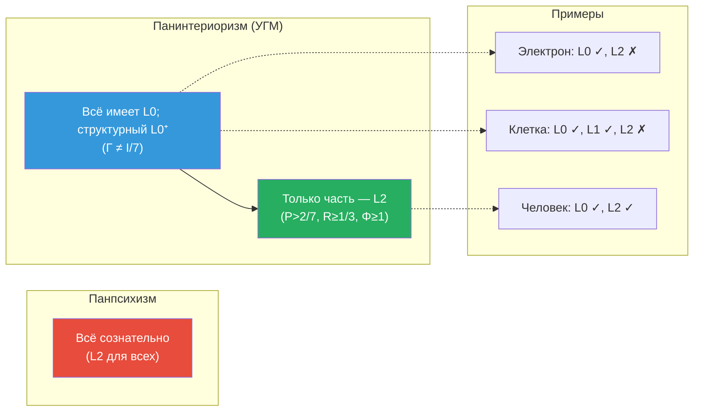
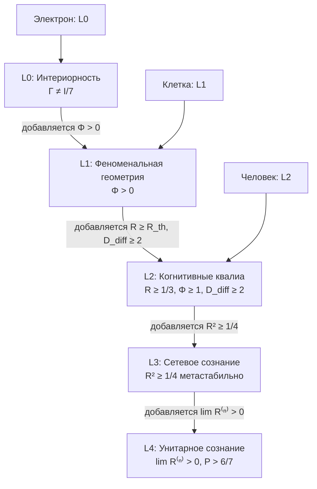

# Панпсихизм: Категорный Анализ

:::info Для кого эта глава
Вы узнаете, чем позиция УГМ (панинтериоризм) отличается от классического панпсихизма и сознательного реализма Хоффмана. Анализ проводится через категорный аппарат: пять онтологических позиций сравниваются как функторы из категории $\mathbf{Hol}$ в категорию феноменальных свойств.
:::

:::note О нотации
В этом документе:
- $\Gamma$ — [матрица когерентности](/docs/core/dynamics/coherence-matrix)
- $\varphi$ — [оператор самомоделирования](/docs/proofs/categorical/formalization-phi)
- $C$ — [мера сознательности](/docs/consciousness/foundations/self-observation#мера-сознательности-c)
- $\Phi$ — [мера интеграции](/docs/core/structure/dimension-u#мера-интеграции-φ)
- $R$ — [мера рефлексии](/docs/consciousness/foundations/self-observation#мера-рефлексии-r)
- $\rho_E$ — редуцированная матрица плотности [измерения Интериорности](/docs/core/structure/dimension-e)
- L0, L1, L2, L3, L4 — [уровни интериорности](/docs/consciousness/hierarchy/interiority-hierarchy)
- $\mathbf{Hol}$ — [категория Голономов](/docs/proofs/categorical/categorical-formalism)
:::

## Страсбургская проблема: откуда берётся сознание? {#страсбургская-проблема}

В 1994 году в Страсбурге, на конференции *Toward a Science of Consciousness*, Дэвид Чалмерс задал вопрос, расколовший науку о сознании на два лагеря: **почему физические процессы сопровождаются субъективным опытом?** Почему не может существовать «зомби» — существо, физически идентичное человеку, но лишённое внутренних переживаний?

Этот вопрос — «трудная проблема сознания» (the hard problem) — породил три стратегии ответа:

1. **Элиминативизм** (Деннет): проблемы нет, субъективный опыт — иллюзия
2. **Эмерджентизм** (IIT, GWT): сознание возникает из сложности
3. **Панпсихизм**: сознание фундаментально — оно **всегда было**

Панпсихизм — самая радикальная и самая древняя из этих стратегий. Его идея предельно проста: если сознание не может возникнуть из несознательной материи (ибо непонятен механизм), значит, сознание — **фундаментальное свойство**, присущее всей материи с самого начала. Электрон обладает массой, зарядом, спином — и, возможно, каким-то элементарным «внутренним опытом».

Привлекательность этой позиции — в обходе трудной проблемы. Если сознание фундаментально, не нужно объяснять, как оно «возникает» из физики. Проблема, однако, смещается: если электрон обладает опытом, как опыт электрона **комбинируется** с опытом других электронов в единый человеческий опыт? Это **проблема комбинации** — главное затруднение панпсихизма.

---

## Определение панпсихизма

**Панпсихизм** (от греч. πᾶν — всё, ψυχή — душа) — метафизическая позиция:

$$
\forall X \in \mathrm{Ob}(\mathbf{Phys}) : \mathrm{Consciousness}(X) \neq \varnothing
$$

где $\mathbf{Phys}$ — категория физических объектов.

На обычном языке: **каждый** физический объект обладает хотя бы минимальной формой сознания или протосознания. Камень, атом, термостат — все «что-то переживают».

Но этот простой тезис распадается на множество несовместимых позиций: что именно означает «сознание»? Полноценный опыт (как у человека) или нечто минимальное? И как минимальное становится полноценным? Далее мы рассмотрим основные варианты.

---

## Варианты панпсихизма {#варианты-панпсихизма}

### 1. Элиминативный панпсихизм (Strawson) {#элиминативный}

**Гэлен Строусон** (р. 1952, сын философа П.Ф. Строусона) в статье *Realistic Monism: Why Physicalism Entails Panpsychism* (2006) предложил радикальный аргумент: если физикализм истинен и сознание реально, то сознание должно быть свойством материи на фундаментальном уровне. Строусон отвергает эмерджентизм как «магию» — по его мнению, подлинно новое качество не может возникнуть из того, что этим качеством не обладает.

**Утверждение:** Всё обладает сознанием **в полном смысле** (L2 в терминологии КК).

**Категория $\mathbf{Pan}_{\mathrm{elim}}$:**

$$
\mathrm{Ob}(\mathbf{Pan}_{\mathrm{elim}}) := \{X \mid C(X) > 0\}
$$

где $C$ — [мера сознательности](/docs/consciousness/foundations/self-observation#мера-сознательности-c).

**Критика из УГМ — формальное опровержение:**

$$
\exists X : \Gamma_X = I/7 \Rightarrow C(X) = 0
$$

Максимально смешанное состояние ($\Gamma = I/7$ — равновесная смесь всех 7 измерений) имеет **нулевую** сознательность. Это не философский аргумент, а **математический факт**: для $\Gamma = I/7$ чистота $P = 1/7 < P_{\text{crit}} = 2/7$ и интеграция $\Phi = 0$, так что $C = \Phi \times R = 0$. (Формально мера рефлексии здесь равна $R = 1/(7P) = 1$; [иерархия интериорности](/docs/consciousness/hierarchy/interiority-hierarchy#уровень-0-интериорность-interiority) называет это значение артефактом тривиальной самомодели при $P = 1/7$. Пороги чистоты и интеграции нарушены; порог рефлексии выполнен лишь тривиально.) Система с $\Gamma = I/7$ — это **максимальный хаос**, в котором невозможна ни когерентность, ни интеграция, ни самомоделирование.

**Вывод:** Элиминативный панпсихизм **противоречит** формализму УГМ. Существуют системы с нулевой сознательностью. Не всё обладает опытом. **[Т]**

:::warning Поправка: опровергнутый выше тезис — не тезис Строусона
Гэлен Строусон (Strawson G., "Realistic monism: why physicalism entails panpsychism", *Journal of Consciousness Studies* 13(10–11): 3–31, 2006) доказывает, что физикалист, признающий реальность опыта, обязан принять *микропсихизм* — «по крайней мере некоторые предельные составляющие (ultimates) внутренне включают опыт», — а поскольку он «поставил бы многое против такой радикальной неоднородности в самом основании вещей», то и все они. Тезис, который этот раздел ему приписывает, он прямо отвергает: «Панпсихизм вовсе не требует считать, что такие вещи, как камни и столы, — субъекты опыта; я ни на минуту в это не верю». Он не приписывает предельным составляющим ни рассуждения, ни рефлексии (L2) и называет возражение Уильяма Джеймса против сложения многих субъектов в одного большего той проблемой, с которой ему предстоит иметь дело. Два следствия [И]: (1) приведённое выше опровержение опровергает тезис «всё есть L2», которого не защищает ни один современный панпсихист; против действительного тезиса Строусона — у каждой предельной составляющей есть переживаемый аспект, составные тела субъектами быть не обязаны — универсальный L0 УГМ с порогом для L2 оказывается близким родственником, а не опровержением; (2) «элиминативный» — ярлык этой страницы, а не Строусона: сам он называет свою позицию реалистическим монизмом, или реальным физикализмом.
:::

### 2. Конститутивный панпсихизм (в разборе Чалмерса и Гоффа) {#конститутивный}

**Филип Гофф** (р. 1977, Даремский университет) и **Дэвид Чалмерс** (р. 1966, NYU) разработали более утончённую позицию — микро-субъекты (элементарные носители протоопыта) **комбинируются** в макро-сознание, — но ни один из них не придерживается её сам: Чалмерс анализирует конститутивный панпсихизм, не присоединяясь к нему, а Гофф, предложивший для него решение через феноменальное связывание (2016), защищает космопсихизм в книге *Consciousness and Fundamental Reality* (2017); см. [точную постановку проблемы комбинации](#проблема-комбинации-точно). Популярная книга Гоффа *Galileo's Error: Foundations for a New Science of Consciousness* (2019) отстаивает панпсихизм в целом. (Прежние редакции представляли обоих авторов сторонниками этой позиции; эта атрибуция отозвана.)

**Утверждение:** Существуют микро-субъекты, и их комбинация порождает макро-сознание.

**Категория $\mathbf{Pan}_{\mathrm{const}}$:**

$$
\mathrm{Ob}(\mathbf{Pan}_{\mathrm{const}}) := \{(\{X_i\}, \oplus) \mid X_i \text{ — микро-субъект}, \oplus \text{ — операция комбинации}\}
$$

**Проблема комбинации (combination problem):**

Центральная трудность конститутивного панпсихизма: нет определения операции $\oplus$ такого, что:

$$
C(X_1 \oplus X_2) = f(C(X_1), C(X_2))
$$

для какой-либо функции $f$. Почему? Потому что опыт целого **не сводится** к функции опытов частей. Вы видите красное яблоко — но ваш опыт «красного яблока» не есть сумма опыта нейрона-1 и опыта нейрона-2. Между индивидуальными протоопытами и единым макроопытом — **провал**, который никто не заполнил.

**Подход УГМ к проблеме комбинации:**

УГМ составляет голономы **тензорным произведением**:

$$
\mathbb{H}_{1 \otimes 2} := (\Gamma_1 \otimes \Gamma_2, \varphi_{12})
$$

:::warning Отозвано (2026-09-25): «достаточная интеграция» — не условие комбинации
Прежние редакции делали [интеграцию](/docs/core/structure/dimension-u#мера-интеграции-φ) композита условием эмерджентности: «$\Phi_{12} > \Phi_{\min} \Rightarrow C(\mathbb{H}_{12}) \neq f(C(\mathbb{H}_1), C(\mathbb{H}_2))$», с пометкой эмерджентности [Т]. Это отозвано, потому что условию удовлетворяет любое состояние-произведение: $1 + \Phi(\Gamma_1 \otimes \Gamma_2) = (1 + \Phi_1)(1 + \Phi_2)$, так что два несвязанных голонома, проходящих окно ($\Phi_i \geq 1$), уже имеют $\Phi_{12} \geq 3$ при взаимной информации $I(1{:}2) = 0$, а интеграция такого композита целиком задана интеграцией его частей ([отзыв ниже](#теорема-нередуцируемость) приводит тождество и разобранную пару). Интеграция совместной матрицы не отмечает корреляцию частей; её отмечает взаимная информация. В силе остаётся [эмерджентность, CC-7](/docs/applied/coherence-cybernetics/theorems#теорема-93-эмерджентность) [Т]: у взаимодействующих голономов стационарное совместное состояние имеет $I(\mathbb{H}_1 : \mathbb{H}_2) > 0$ и не есть произведение состояний частей — условие, которому удовлетворяет любая коррелированная пара, включая связанные термостаты.
:::

:::warning Статус: критерий того, когда, а не объяснение того, как
Даже с корреляцией вместо $\Phi_{12}$ УГМ даёт самое большее **критерий** — проходит ли коррелированный композит, представленный на $\mathcal{D}(\mathbb{C}^7)$, четырёхусловное окно, — и не объясняет **конституцию**: *как именно* микро-переживания объединяются в единое переживание. Это переформулировка проблемы, а не её решение в философском смысле; на что аппарат отвечает и на что нет, разобрано [ниже](#что-отвечает-аппарат-угм).
:::

#### Теорема (Категорная нередуцируемость интегрированного опыта) — **[✗] ОТОЗВАНА** {#теорема-нередуцируемость}

:::danger Отозвано (2026-09-25): в данной формулировке теорема неверна
Отозванная теорема утверждала, что феноменальный функтор колакс-моноидален, но не моноидален, а когерентностная карта $\mu$ необратима всякий раз, когда $\Phi_{12} > 1$. Это неверно: композит $\Gamma_1 \otimes \Gamma_2$ в формулировке — состояние-произведение, его спектр факторизуется, а частичные следы возвращают ровно $\Gamma_1$ и $\Gamma_2$; на произведениях же $1 + \Phi_{12} = (1 + \Phi_1)(1 + \Phi_2)$ — у двух некоррелированных голономов, проходящих окно, $\Phi_{12} \geq 3$ при взаимной информации $I(1{:}2) = 0$. Что вместо неё: у коррелированного совместного состояния части не определяют целого (CC-7 [Т]); категорная переформулировка на коррелированных состояниях — гипотеза [Г].
:::

**Отозванная формулировка** сохранена для истории: ~~«Функтор $F: (\mathbf{Hol}, \otimes) \to (\mathbf{Exp}, \boxtimes)$ является колакс-моноидальным, но не моноидальным при $\Phi_{12} > 1$. Конкретно: когерентностная карта $\mu: F(\Gamma_1 \otimes \Gamma_2) \to F(\Gamma_1) \boxtimes F(\Gamma_2)$ необратима при $\Phi_{12} > 1$».~~ Простым языком она означала, что у достаточно интегрированных голономов ($\Phi_{12} > 1$) опыт целого невозможно восстановить из опытов частей. Доказательство определяло опыт композита через спектр, качества и контекст совместной матрицы $\Gamma_1 \otimes \Gamma_2$ (шаг a) и сравнивало его с покомпонентным произведением опытов частей (шаг b); затем утверждало, что этот спектр «не факторизуется» при $\Phi_{12} > 1$ (шаг c), читало $\Phi_{12} > 1$ как строго положительную потерю информации о корреляциях при частичном следе со ссылкой на T-129 (шаг d) и выводило колакс-моноидальность (шаг e).

**Почему она неверна.** У произведения спектр как раз факторизуется: собственные значения $A \otimes B$ — это произведения $\lambda_i \mu_j$, частичные следы возвращают ровно $\Gamma_1$ и $\Gamma_2$, взаимная информация равна нулю — шаг (c) ложен, а в шаге (d) терять нечего. На произведении данные шагов (a) и (b) совпадают (спектр есть произведение спектров, а при невырожденных спектрах собственные векторы — произведения собственных векторов), так что $\mu$ там ничего не теряет. Не служит признаком корреляции и условие $\Phi_{12} > 1$. Если понимать $\Phi_{12}$ как меру интеграции совместной матрицы $49 \times 49$ (другой страница не определяет), то чистота и диагональная чистота на произведениях мультипликативны, и тождество $P = P_{\text{diag}}(1 + \Phi)$ даёт

$$
1 + \Phi(\Gamma_1 \otimes \Gamma_2) = (1 + \Phi_1)(1 + \Phi_2).
$$

Разобранная пара: состояние $\Gamma_w = \tfrac12 \lvert u\rangle\langle u\rvert + \tfrac12 \cdot I/7$ с $u = (1, \ldots, 1)/\sqrt7$ проходит пороги чистоты, рефлексии и интеграции ($P = 5/14$, $R = 2/5$, $\Phi = 3/2$), а две его несвязанные копии имеют $\Phi(\Gamma_w \otimes \Gamma_w) = 21/4$ при $I(1{:}2) = 0$; два голонома с $\Phi_1 = \Phi_2 = 1$ дают ровно $\Phi_{12} = 3$. (Проверено численно на 200 случайных парах состояний $7 \times 7$: тождество выполняется с относительной погрешностью меньше $10^{-15}$, $\lvert I(1{:}2)\rvert \leq 2 \cdot 10^{-15}$; регрессионный тест `test_phi_of_a_product_factorises` в `website/scripts/check_core_numbers.py`.)

**Что вместо неё.**

- **В силе [Т]:** у коррелированного совместного состояния $\rho_{12} \neq \rho_1 \otimes \rho_2$ маргиналы не определяют совместного состояния; информация, которую отбрасывают частичные следы, равна $I(1{:}2) = S(\rho_1) + S(\rho_2) - S(\rho_{12}) = D(\rho_{12} \,\|\, \rho_1 \otimes \rho_2) > 0$ (стандартное тождество квантовой теории информации), а [CC-7](/docs/applied/coherence-cybernetics/theorems#теорема-93-эмерджентность) [Т] гарантирует $I > 0$ для стационарного состояния взаимодействующих голономов. Это верно для любой коррелированной пары, включая классически коррелированные, поэтому интегрированный опыт этим не выделяется.
- **Гипотеза [Г]:** феноменальный функтор, продолженный на составные состояния, колакс-моноидален, но не моноидален ровно на коррелированных совместных состояниях. Это не доказано: $F$ определён на $\mathcal{D}(\mathbb{C}^7)$, и чтобы применить его к состоянию на $\mathbb{C}^{7^N}$, сначала нужен канал агрегации, который теория не фиксирует (допущение 1 [ниже](#что-отвечает-аппарат-угм)). Программа исследований [Пр]: зафиксировать этот канал, затем доказать или опровергнуть колакс-свойство.

**Категорная формулировка проблемы комбинации:** ~~«Проблема комбинации = вопрос „является ли $F$ строго моноидальным?“. УГМ даёт точный ответ: нет при $\Phi > 1$ [Т]. Интегрированный опыт несводим к произведению опытов частей».~~ Отозвано вместе с теоремой выше: на произведении двух состояний данные шагов (a)–(b) совпадают, так что $\mu$ там ничего не теряет, а условию $\Phi > 1$ удовлетворяют некоррелированные пары. Остаётся гипотеза [Г] выше: что $F$, продолженный на композиты, не строго моноидален на коррелированных состояниях.

:::info Что решено и что остаётся
- **Отозвано [✗]:** «Решено [Т]: эмерджентность как необратимость когерентностной карты $\mu$» и «Решено [Т]: порог эмерджентности $\Phi_{12} = 1$ (T-129a)». Обе строки опирались на теорему, отозванную выше: у произведения двух голономов уровня L2 уже $\Phi_{12} \geq 3$ при $I(1{:}2) = 0$, а T-129a относится к отдельным состояниям на $\mathcal{D}(\mathbb{C}^7)$, не к композитам.
- **В силе [Т]:** CC-7 — у коррелированного композита есть совместное состояние, которое его части не определяют; отброшенная информация равна $I(1{:}2) > 0$.
- **Открыто [Г]:** колакс-моноидальная переформулировка на коррелированных состояниях — до фиксации канала агрегации.
- **Открыто [Пр]:** конститутивный механизм — *как именно* коррелированный композит **переживается** как единый опыт. Это аналог трудной проблемы: УГМ может самое большее сформулировать *условие*, но не *содержание* объединённого переживания.
:::

### 3. Панпротопсихизм (Chalmers)

**Чалмерс** (2010, *The Character of Consciousness*) предложил смягчённую версию: всё обладает не «опытом», а «прото-ментальными» свойствами — чем-то, что само по себе не является сознанием, но при правильной комбинации порождает его.

**Аналогия:** H₂O. Ни водород, ни кислород по отдельности не мокрые. Но их комбинация — мокрая. «Протомокрость» водорода + «протомокрость» кислорода → мокрость воды. Аналогично: «протоопыт» электрона + «протоопыт» другого электрона + правильная комбинация → человеческий опыт.

**Категория $\mathbf{Pan}_{\mathrm{proto}}$:**

$$
\mathrm{Ob}(\mathbf{Pan}_{\mathrm{proto}}) := \{X \mid \mathrm{Int}(X) \neq \varnothing, C(X) = 0\}
$$

**Соответствие в УГМ — уровень L0:**

По [каноническому определению](/docs/consciousness/hierarchy/interiority-hierarchy#уровень-0-интериорность-interiority) **[О]** L0 универсален — всякая система с $\Gamma \in \mathcal{D}(\mathcal{H})$ обладает внутренним аспектом. Панпротопсихизм выслеживает его **структурный** (невырожденный) случай:

$$
\mathrm{L0}^{+}(\Gamma) := \Gamma \neq I/7 \quad \text{(структурная интериорность)}
$$

$$
\mathbf{Pan}_{\mathrm{proto}} \cong \mathrm{L0}^{+} \setminus \mathrm{L2}
$$

L0⁺ — **точный** формальный аналог панпротопсихизма. Система на уровне L0⁺ обладает «чем-то внутренним» со структурой ($\Gamma \neq I/7$), но не сознанием ($C = 0$, поскольку пороги L2 не выполнены); вырожденное $I/7$ сохраняет голую интериорность по каноническому определению, неся ноль структуры и ноль сознания ($C(I/7) = 0$ **[Т]**).

### 4. Расселианский монизм (Russell, Strawson) {#расселианский}

**Бертран Рассел** в *The Analysis of Matter* (1927) указал на фундаментальный пробел в физике: она описывает только **структурные** свойства материи (массу, заряд, спин), определённые через отношения с другими объектами. Но что наполняет эту структуру **изнутри**? Физика молчит. Рассел предположил: внутренняя природа материи может быть ментальной.

**Категория Рассела ($\mathbf{Russell}$):**

$$
\mathrm{Ob}(\mathbf{Russell}) := \{(S_{\mathrm{ext}}, I_{\mathrm{int}}) \mid S \text{ — структура}, I \text{ — интринсик}\}
$$

**Соответствие в УГМ:**

| Рассел | УГМ | Комментарий |
|--------|-----|-------------|
| $S_{\mathrm{ext}}$ (структурные свойства) | Гамильтониан $H$, операторы Линдблада $\{L_k\}$ | Физические законы = структура |
| $I_{\mathrm{int}}$ (внутренняя природа) | [E-проекция](/docs/core/structure/dimension-e) $\rho_E$ | Интериорность = intrinsic |

**Функтор:**

$$
F_{\mathrm{Russell}}: \mathbf{Russell} \to \mathbf{Hol}, \quad (S, I) \mapsto (\Gamma, \varphi)
$$

где $\Gamma$ конструируется из $S$ и $I$. Расселианский монизм — **наиболее близкая** к [двуаспектному монизму](/docs/consciousness/foundations/two-aspect-monism) УГМ метафизическая позиция.

---

## Позиция УГМ: Панинтериоризм {#панинтериоризм}

### Определение

УГМ не принимает ни одну из форм панпсихизма. Вместо этого она предлагает **панинтериоризм** — позицию, согласно которой **всякая** система обладает интериорностью (L0 универсален по [каноническому определению](/docs/consciousness/hierarchy/interiority-hierarchy#уровень-0-интериорность-interiority)), всякая система с $\Gamma \neq I/7$ обладает структурной интериорностью (L0⁺), но **не все** обладают сознанием (L2).

:::warning Ключевое различие
УГМ утверждает **панинтериоризм**, а не панпсихизм:

$$
\forall \Gamma \neq I/7 : \mathrm{L0}^{+}(\Gamma) = \mathrm{true}
$$

Но **не**:

$$
\forall \Gamma : \mathrm{L2}(\Gamma) = \mathrm{true}
$$
:::

### Теорема (Панинтериоризм $\neq$ Панпсихизм)

$$
\mathrm{L0}(\Gamma) \not\Rightarrow \mathrm{L2}(\Gamma)
$$

**Доказательство:**

L2 требует $R \geq R_{\text{th}} = 1/3$ [Т], $\Phi \geq \Phi_{\text{th}} = 1$ [Т] (T-129) и $D_{\text{diff}} \geq 2$ [Т] (T-151) ([пороги L2](/docs/core/foundations/axiom-septicity#пороги-l2-строгий-вывод)).

Для [фундаментальной моды Γ](/docs/reference/glossary#таксономия-конфигураций-γ) (например, электрона):

$$
\Phi(\Gamma_e) \ll 1 \quad (\text{а } R(\Gamma_e) = 1/(7P) \approx 1 \text{ — формальный артефакт при } P \approx 1/7)
$$

Следовательно, $\mathrm{L0}(\Gamma_e) = \mathrm{true}$, но $\mathrm{L2}(\Gamma_e) = \mathrm{false}$: не выполнен порог интеграции. (Прежняя редакция давала $R(\Gamma_e) \approx 0$; это значение отозвано, поскольку $R = 1/(7P) \geq 1/7$ для любого состояния и близко к $1$ вблизи $I/7$, как отмечает для электрона [иерархия интериорности](/docs/consciousness/hierarchy/interiority-hierarchy#уровень-0-интериорность-interiority).) $\blacksquare$

### Иерархия уровней интериорности

---

## Сознательный реализм Хоффмана {#хоффман}

### Биография и интеллектуальная траектория

**Дональд Д. Хоффман** (р. 1955) — профессор когнитивных наук, философии и логики Калифорнийского университета в Ирвайне (UC Irvine). Начал карьеру с классической психофизики зрительного восприятия: его ранние работы (1980–2000-е) посвящены вычислительному моделированию восприятия формы, цвета и объектов.

Поворотный момент — осознание парадокса: если эволюция формирует восприятие, почему восприятие должно быть **истинным**? Совместно с Четаном Пракашем и Манишем Сингхом Хоффман формализовал этот вопрос в **теореме «Fitness Beats Truth»** (2009–2015), показав через эволюционные игровые модели, что организмы, воспринимающие «интерфейс» (сжатое адаптивное представление), систематически побеждают организмов с «истинным» восприятием.

Из этого результата Хоффман пришёл к радикальной онтологической позиции: пространство-время — не объективная реальность, а **пользовательский интерфейс** сознательных агентов.

:::warning Важная классификация
Хоффман **сам** отвергает ярлык «панпсихист». Его позиция — **объективный идеализм** (Conscious Realism): сознательные агенты — единственная фундаментальная реальность, а физический мир — производная их взаимодействий. Это ближе к Лейбницу (монадология) или Беркли, чем к Строусону или Гоффу.
:::

### Теорема «Fitness Beats Truth» (FBT) {#fbt}

**Утверждение** (Hoffman, Singh, Prakash 2015): В эволюционных играх (формализм Мейнарда–Смита) на типичных ландшафтах приспособленности организмы со стратегией «интерфейс» (сжатие: много состояний мира → одна категория восприятия) побеждают организмов с «истинным восприятием» (изоморфизм $W \to X$).

**Простым языком.** Вообразите два организма в лесу. Первый видит мир «как есть» — различает 1000 оттенков зелёного у листвы. Второй сжимает: все съедобные — зелёные, все ядовитые — красные. Второй быстрее принимает решения и тратит меньше ресурсов на вычисление. Эволюция отбирает по **выживанию**, а не по **истинности**. Отсюда: наше восприятие пространства-времени — адаптивный интерфейс, не карта реальности.

:::note Связь с КК
КК допускает аналогичную интерпретацию [И]: восприятие агентом $\mathbb{H}$ своей среды $E$ опосредовано [функтором $F$](/docs/proofs/categorical/categorical-formalism#3-функтор-f-на-объектах), который не обязан быть точным — достаточно функциональной адекватности. Но КК не постулирует иллюзорность пространства-времени: оно [эмерджентно](/docs/core/foundations/spacetime), а не интерфейсно.
:::

### Полный формализм: сознательный агент

**Определение (Hoffman, Prakash 2014).** Сознательный агент (CA) — это шестёрка:

$$
C = (X, G, A, W, D, N)
$$

| Компонент | Описание | Пример |
|-----------|----------|--------|
| $X$ (опыт) | Все возможные переживания агента | Цвета, звуки, эмоции |
| $G$ (действия) | Все доступные действия | Движения, решения |
| $A: G \times W \to W$ | Действие $g$ в мире $w$ → новое состояние мира | Нажатие кнопки меняет экран |
| $W$ (мир) | Состояния мира (может быть другим агентом!) | Окружающая среда |
| $D: X \times G \to G$ | Переживание → решение (выбор действия) | Видишь опасность → бежишь |
| $N: W \times X \to X$ | Состояние мира → переживание | Фотоны → «красное» |

Ключевая идея: $W$ не обязан быть «физическим миром». Для двух агентов $C_1$ и $C_2$ миром каждого является **другой агент**. Физическое пространство-время — **эмерджентный интерфейс** сети взаимодействующих агентов.

### Композиция сознательных агентов {#композиция-ca}

**Теорема замыкания** (Hoffman, Prakash 2014): Для любых двух CA $C_1$ и $C_2$ их взаимодействие образует нового CA: $C_1 \otimes C_2 = C_{12}$.

Это означает, что **ConsAgents** — моноидальная категория. Хоффман интерпретирует это как принцип «сознательные агенты — всё, что есть».

:::note Параллель с КК
В КК [теорема 9.1](/docs/applied/coherence-cybernetics/theorems#теорема-91-фрактальное-замыкание) (фрактальное замыкание) даёт аналогичный результат: $\mathbb{H}_1 \otimes \mathbb{H}_2$ — снова голоном. Хоффман и Пракаш (Hoffman D. D., Prakash C., "Objects of consciousness", *Frontiers in Psychology* 5: 577, 2014) доказывают свои две теоремы о соединении — ненаправленное и направленное соединение двух сознательных агентов снова даёт сознательного агента — построением, в разделе под заголовком "The combination problem". Замыкание КК несёт динамику и порог, но с 2026-09-25 уже не выводит, что $\mathbb{H}_1 \otimes \mathbb{H}_2$ — голоном: это его допущение (HOL), и при нём у композита есть нетривиальный аттрактор, а для воплощённых систем — жизнеспособность (запись реестра CC-5, [С при (HOL)]). Прежняя фраза «разница не в том, что одно доказано, а другое постулировано … у композита есть нетривиальный аттрактор (T-96 [Т])» отозвана: в этом пункте теоремы о соединении доказаны, а замыкание КК допущено. Условие интеграции $\Phi_{12} > 1$, прежде приводившееся здесь, не является признаком интеграции между частями — см. [отзыв](#теорема-нередуцируемость) в §2.
:::

### Позиция КК: панинтериоризм vs объективный идеализм {#панинтериоризм-vs-идеализм}

Хоффман и КК расходятся в ключевом онтологическом вопросе:

| | Хоффман (Conscious Realism) | КК (Панинтериоризм) |
|---|---|---|
| **Что фундаментально?** | Только сознательные агенты | Голономы $\mathbb{H}$ на всех уровнях L0–L4 |
| **Есть ли несознательная реальность?** | Нет — всё сводится к CA | Да — L0 (интериорность) без сознания (L2) |
| **Отношение L0 и L2** | L0 = L2 (всё сознательно) | L0 $\supsetneq$ L2 строго [Т] |
| **Физический мир** | Иллюзия (интерфейс) | Эмерджентен (реален, но производен) |
| **Порог сознания** | Нет порога (всё — CA) | $P > 2/7 \wedge R \geq 1/3 \wedge \Phi \geq 1 \wedge D \geq 2$ [Т] |
| **Динамика** | Цикл $N \to D \to A$ (дискретный) | $\dot\Gamma = \mathcal{L}_\Omega[\Gamma]$ (непрерывное) |
| **Фальсифицируемость** | Низкая (нет количественных предсказаний) | Высокая (22+ предсказаний) |

### Функтор $F_{\text{Hoffman}}$ (гипотеза) [И] {#функтор-хоффман}

**Конструкция функтора** $F_{\text{Hoffman}}: \mathbf{Hol}_{\text{L2}} \to \mathbf{ConsAgents}$:

| Компонент CA | Соответствие в КК |
|--------------|-------------------|
| $X$ (опыт) | [Экспериенциальное пространство](/docs/proofs/categorical/categorical-formalism#2-категория-exp) |
| $G$ (действия) | Пространство CPTP-каналов $\{\Psi\}$ |
| $N$ (восприятие) | [Функтор $F$](/docs/proofs/categorical/categorical-formalism#3-функтор-f-на-объектах) |
| $D$ (решение) | [Оператор $\varphi$](/docs/proofs/categorical/formalization-phi) |
| $A$ (действие) | [Регенеративный член](/docs/core/dynamics/evolution#3-регенеративный-член) $\mathcal{R}[\Gamma, E]$ |
| $W$ (мир) | Окружение $E$ в $\mathbb{H}$ |

:::info Статус [И]
Функтор $F_{\text{Hoffman}}$ — **интерпретационная гипотеза**. Для полного доказательства эквивалентности необходимо показать полноту, верность и совместимость с композицией. Это **программа исследований**.
:::

### Что Хоффман делает лучше КК {#преимущества-хоффмана}

1. **Эволюционная эпистемология.** FBT — строго доказанная теорема, дающая глубокое основание для скептицизма относительно наивного реализма. КК не имеет аналога этого результата.

2. **Доступность изложения.** «The Case Against Reality» (2019) — бестселлер; TED-talk с 3M+ просмотров. КК пока доступна только специалистам.

3. **Радикальность вопроса.** Хоффман ставит вопрос «что, если пространство-время — не реальность?» с максимальной остротой.

4. **Математическая элегантность.** Шестикомпонентная CA — минимальна и удобна для комбинаторики.

---

## Прецеденты и родственные программы: комбинация, границы, космопсихизм, идеализм {#прецеденты-и-родственные-программы}

Этот раздел сопоставляет панинтериоризм УГМ с литературой, которую страница до сих пор не цитировала: с проблемой комбинации в её нынешней постановке, с проблемой границы, с космопсихизмом и с аналитическим идеализмом. Для каждой темы названы источники, ведущие предложения и их статус, а затем — с пометкой интерпретации [И] — то, на что действительно отвечают результаты УГМ о составных системах, и допущения, на которых держится этот ответ.

### Место панинтериоризма в словаре поля {#место-панинтериоризма}

Поле сейчас работает с определениями Дэвида Чалмерса (Chalmers D. J., "The combination problem for panpsychism", в кн.: Brüntrup G., Jaskolla L. (eds.), *Panpsychism: Contemporary Perspectives*, Oxford University Press, 2016, pp. 179–214). *Панпсихизм*: некоторые фундаментальные физические сущности обладают сознательным опытом. *Панпротопсихизм*: фундаментальные физические сущности обладают протофеноменальными свойствами — «особыми свойствами, которые сами не феноменальны (обладание ими ничем не „ощущается“), но в совокупности могут конституировать феноменальные свойства». *Конститутивные* взгляды обосновывают макроопыт микроуровнем; *эмерджентные* допускают, что он возникает как нечто новое по контингентным законам.

По собственному определению иерархии интериорности, [L0](/docs/consciousness/hierarchy/interiority-hierarchy#уровень-0-интериорность-interiority) — «не „сознание“ и не „опыт“ в обычном смысле», а «математическое свойство объекта», а структура на [L1](/docs/consciousness/hierarchy/interiority-hierarchy#уровень-1-феноменальная-геометрия-phenomenal-geometry) «ещё не осознаётся»; «осознание появляется только на L2» — через рефлексию и интеграцию. В словаре Чалмерса это конститутивный панпротопсихизм со структурно-функциональным объяснением осознания [И] — форма панквалитизма Сэма Коулмана (качества без субъектов в основании, осознание, конституированное функционально), который Чалмерс разбирает среди комбинаторных вариантов. Отсюда три следствия.

1. Противопоставление, проведённое выше, — «панпсихизм = L2 для всех», — не есть противопоставление с полем: ни один современный панпсихист не приписывает электронам рефлексию (см. [поправку в §1](#элиминативный)). В силе остаётся другое отличие — резкий порог УГМ.
2. Проблема комбинации, которая касается УГМ, — это проблема панпротопсихизма: как нефеноменальная структура конституирует опыт. Чалмерс показывает, что у неё есть собственный разрыв — между нефеноменальным и феноменальным, — сверх уже известных.
3. Прежние редакции другой страницы корпуса называли ту же позицию «эмерджентизмом с точным порогом» и утверждали, что «проблема комбинации не возникает» ([Философские основания КК](/docs/applied/coherence-cybernetics/philosophy#онтология)). У двух прочтений разные трудности: панпротопсихизм упирается в только что названный разрыв; эмерджентизм избегает проблемы комбинации, но, по анализу Чалмерса, вынужден считать свой порог контингентным психофизическим законом и сталкивается с проблемой ментальной причинности. Корпус утверждал оба прочтения; с 2026-09-25 он держится одного — панпротопсихического прочтения этого раздела, при котором пороги говорят, *когда* система является субъектом уровня L2, а не *как* её структура становится опытом [И], — а эмерджентистская формулировка отозвана на той странице и в упражнениях, как и заявление о решении в [Теориях сознания, §24](/docs/consciousness/comparative/consciousness-theories#russellian), в обзоре раздела и в [доказательствах иерархии интериорности](/docs/proofs/consciousness/interiority-hierarchy) (§5.1).

### Проблема комбинации в точной постановке {#проблема-комбинации-точно}

Проблему поставил Уильям Джеймс (*The Principles of Psychology*, 1890, т. 1, гл. 6): «Возьмите фразу из дюжины слов, возьмите двенадцать человек и скажите каждому по одному слову. Затем поставьте их в ряд или соберите в кучу, и пусть каждый думает о своём слове сколь угодно сосредоточенно; нигде не возникнет сознания всей фразы». Название дал ей Уильям Сигер (Seager W., "Consciousness, information and panpsychism", *Journal of Consciousness Studies* 2(3): 272–288, 1995). Статья «Панпсихизм» Стэнфордской философской энциклопедии (Филип Гофф, Уильям Сигер и Шон Аллен-Херманссон, редакция 2022 года) фиксирует согласие: «И сторонники, и противники в целом согласны, что самая трудная проблема панпсихизма — та, что получила название „проблемы комбинации“».

Чалмерс (2016) делит проблему на три подпроблемы и ряд дополнительных аспектов и настаивает, что решение обязано покрыть их все:

| Подпроблема | Вопрос | Самая острая форма |
|---|---|---|
| Комбинация субъектов | Как микросубъекты складываются в макросубъекта? | *Суммирование субъектов*: для любой группы субъектов и любого ещё одного субъекта группа, по-видимому, может существовать без него |
| Комбинация качеств | Как из микрокачеств получаются макрокачества? | *Палитра*: горстка фундаментальных качеств против огромного разнообразия переживаемых |
| Комбинация структуры | Как из микроструктуры получается структура опыта? | *Структурное несоответствие*: структура опыта не похожа на физическую структуру мозга |
| Дополнительные аспекты | Единство, граница (Розенберг 1998), осознание, зернистость | Почему одно ограниченное, однородное, осознаваемое поле, а не рваный набор микропереживаний |

Двое авторов превратили проблему субъектов в выбор. Сэм Коулман (Coleman S., "The real combination problem: panpsychism, micro-subjects, and emergence", *Erkenntnis* 79(1): 19–44, 2014) доказывает, что «субъекты не могут комбинироваться»: точка зрения каждого субъекта исключает точки зрения остальных, поэтому слияние микросубъектов могло бы дать лишь нового, эмерджентного макросубъекта — что лишает панпсихизм его мотива; он советует отказаться от микросубъектов и оставить в основании качества без субъектов. Филип Гофф (Goff P., *Consciousness and Fundamental Reality*, Oxford University Press, 2017) выводит из той же проблемы несостоятельность микропсихизма и защищает космопсихизм с «обоснованием через включение» (grounding by subsumption; см. ниже); рецензия Дэниела Столджара (*Notre Dame Philosophical Reviews*, 2018.02.09) отвечает, что в интересующих нас случаях «обоснование и есть обоснование через анализ», так что включение выхода не даёт. Прежние редакции подраздела 2 выше представляли Гоффа и Чалмерса защитниками конститутивного панпсихизма микроуровня; ни тот, ни другой им не является (теперь подраздел говорит об этом): взвешенная позиция Гоффа в *Consciousness and Fundamental Reality* — космопсихизм, а Чалмерс анализирует конститутивный панпсихизм, не присоединяясь к нему.

### Ведущие предложения и их статус {#предложения-и-их-статус}

| Предложение | Кто | Что оно делает | Статус и чьё это суждение |
|---|---|---|---|
| Эмерджентный панпсихизм: макросубъекты возникают по новым законам | Грегг Розенберг (*A Place for Consciousness*, OUP 2004); теория интегрированной информации, прочитанная как такой закон | Избегает комбинации, делая макросубъектов фундаментальными | Платит ментальной причинностью и контингентными законами (Чалмерс 2016, который так же читает и IIT); энциклопедия называет взгляд Розенберга «формой многоуровневого эмерджентизма» |
| Феноменальное связывание | Гофф, "The phenomenal bonding solution to the combination problem" (в кн.: Brüntrup, Jaskolla 2016, pp. 283–302) | Феноменальное отношение между микросубъектами, например со-сознание, конституирует нового субъекта | «Один из наиболее многообещающих подходов», но с трудом избегает и единого вселенского субъекта, и раздробленных субъектов (Чалмерс 2016) |
| Квантовый холизм, комбинаторное «вливание» | Сигер, "Panpsychism, aggregation and combinatorial infusion", *Mind and Matter* 8(2): 167–184 (2010); Родольфо Гамбини и Хорхе Пуллин, *Mind and Matter* 22(1): 51–94 (2024) и *J. Consciousness Studies* 32(7): 7–32 (2025) | Запутанное целое — новая фундаментальная сущность; допущения о супервентности, на которых стоит проблема комбинации, на квантовом уровне не выполняются: пространство совместных состояний растёт экспоненциально | Заслуживает пристального рассмотрения, но «не похоже, чтобы существовала устойчивая запутанность на уровне мозга, которая для этого нужна», и остаётся опасение структурного несоответствия (Чалмерс 2016) |
| Панквалитизм с функциональным осознанием | Коулман (2012, 2014) | Качества без субъектов в основании; осознание конституируется функционально | Уязвим для разрыва между качеством и осознанием: качества без осознания остаются мыслимыми (Чалмерс 2016) |
| Формальное замыкание композиции | Hoffman D. D., Prakash C., "Objects of consciousness", *Frontiers in Psychology* 5: 577 (2014) | Теоремы: соединение двух сознательных агентов — сознательный агент | Доказано построением внутри сознательного реализма (Хоффман и Пракаш 2014); замкнутость формализма, а не сама по себе новый субъект [И] |
| Космопсихизм | Итай Шани (2015); Юдзин Нагасава и Кхай Уэйджер (2016); Гофф (2017) | Космос — единственный фундаментальный субъект; индивидуальные субъекты производны от него | Меняет комбинацию на обратную задачу, которая, по оценке Чалмерса (2016), кажется «столь же трудной, как исходная проблема комбинации» — [ниже](#космопсихизм) |

Общий статус, по оценке Чалмерса (2016): «Справедливо сказать, что ни одно из предложенных решений пока не получило широкой поддержки». Его вывод называет направления, которые больше всего стоит исследовать, — феноменальное связывание или квантовый холизм для субъектов, малые палитры для качеств, «принципы информационной композиции» для структуры и несколько дефляционное понимание осознания, — и добавляет, что совсем не ясно, могут ли они работать вместе.

### На что отвечает аппарат УГМ и что он оставляет открытым {#что-отвечает-аппарат-угм}

Инструменты, которые приносит УГМ, — её результаты о составных системах: фрактальное замыкание [CC-5](/docs/applied/coherence-cybernetics/theorems#теорема-91-фрактальное-замыкание) (в реестре [С при (HOL)]: если композит сам есть голоном, его аттрактор нетривиален, а для воплощённых систем он жизнеспособен), масштабная инвариантность [CC-6](/docs/applied/coherence-cybernetics/theorems#теорема-92-масштабная-инвариантность) (T-72 [С] при допущении (AGG): канал агрегирования возвращает составляющую на несвязанных копиях, а связь слаба), эмерджентность [CC-7](/docs/applied/coherence-cybernetics/theorems#теорема-93-эмерджентность) [Т], а также терминальный объект и его следствие, [когомологический монизм](/docs/core/foundations/consequences#когомологический-монизм): $H^n(X, A) = 0$ при $n > 0$ и локально постоянных $A$ [Т]; его прочтение «реальность едина» опирается на определение, а философская глосса — [И]. По подпроблемам [И]:

- **Того же ли рода композит?** CC-5 этого не решает: что два жизнеспособных голонома складываются в объект того же типа — её допущение (HOL); при нём композит имеет собственный нетривиальный аттрактор, а для воплощённых систем жизнеспособен, — [С при (HOL)]. (Строка гласила «с собственным нетривиальным аттрактором [Т]; что он снова жизнеспособен — условно [С]»; [Т] отозвано — шаг 1 КК-5 брал представление из отозванной эквивалентности Мориты T-58.) Это свойство замкнутости формализма — тот же ответ, что дали в 2014 году теоремы Хоффмана и Пракаша о соединении. Что композит является субъектом, отсюда не следует.
- **Больше ли целое, чем части?** По CC-7 [Т] при межсистемной когерентности стационарное совместное состояние имеет $I(\mathbb{H}_1 : \mathbb{H}_2) > 0$ и не есть произведение состояний частей. Это верно для любой коррелированной пары — для двух связанных термостатов в той же мере, что и для двух мозгов, — поэтому не это делает композит субъектом. Колакс-моноидальная теорема §2 [отозвана](#теорема-нередуцируемость); то, что от неё остаётся, говорит не больше этого. Аргумент нефакторизуемости для панпсихизма выдвинул Сигер (2010) раньше УГМ, а Гамбини и Пуллин (2024–2025) развили его подробно.
- **Комбинация субъектов.** Ответ УГМ — критерий, а не конституция: система — субъект уровня L2, когда её $\Gamma$ проходит четырёхусловное окно, и реестр относит это «тогда и только тогда» к определениям, [T-153 [О]](/docs/proofs/consciousness/substrate-closure#t-153). Поэтому возражение от мыслимости против суммирования субъектов не опровергнуто, а вынесено за пределы языка теории — что, согласно [T-214 [Т]](/docs/proofs/categorical/fundamental-closures#t-214), неизбежно для любого моста к опыту.
- **Комбинация качеств (палитра).** Корпус определяет феноменальный функтор на состояниях $7 \times 7$. Для композита он либо сначала агрегирует — CPTP-канал $\mathcal{D}(\mathbb{C}^{7^k}) \to \mathcal{D}(\mathbb{C}^7)$ (агрегирование CC-6, ограниченное лишь её допущением (AGG)), сжимающий в метрике Бюреса и потому способный только терять различимость, — либо применяет $F$ к совместной матрице (как делала отозванная теорема §2). Что из двух составляет содержание субъекта-композита, корпус не говорит. Проблема палитры перенесена в этот выбор, а не решена.
- **Комбинация структуры.** В УГМ структура внутренней стороны — это структура самой $\Gamma$ (спектральная форма $\rho_E$, голономии Фано) — посылка (1) аргумента Чалмерса о структурном несоответствии. Сведение корпуса к семи коллективным наблюдаемым модам ([T-153a [Т]](/docs/proofs/consciousness/substrate-closure#t-153a)) — путь информационный, а не пространственный, и именно его Чалмерс называет лучшим вариантом для панпсихиста; воспроизводит ли он структуру, например, зрительного поля, не проверено.
- **Единство.** Когомологический монизм гарантирует, что локальные самомодели склеиваются в глобальную: класс препятствия исчезает на стягиваемой базе. База — нерв всей категории $\mathcal{C}$, так что это объединяет мир, а не субъекта; сказать, какое склеенное целое является субъектом, он не может.

История о комбинации держится на трёх допущениях; они названы здесь потому, что корпус их не называет:

1. **Субъект композита — состояние $7 \times 7$.** Совместное состояние живёт на $\mathbb{C}^{7^N}$, а пороги определены на $\mathcal{D}(\mathbb{C}^7)$, поэтому композит сначала нужно представить там — допущением, как теперь делает CC-5 ((HOL); её прежний шаг 1 брал сечение-ретракцию, которая связывает 7D- и 42D-описания одного голонома и не даёт отображения $\mathcal{D}(\mathbb{C}^{49}) \to \mathcal{D}(\mathbb{C}^7)$), или каналом агрегации (CC-6, которая допускает лишь (AGG): канал возвращает составляющую на несвязанных копиях). Какой именно канал — теория не фиксирует, а вердикт от этого зависит.
2. **Вложенные субъекты сосуществуют.** Правила исключения в корпусе нет: CC-6 прежде разрешала L-уровню агрегата «сохраняться или повышаться» (отозвано 2026-09-25: у этого шага не было довода, и теперь CC-6 не утверждает никакой оценки для полного L-уровня), [утверждение C.2](/docs/consciousness/subjects/collective-consciousness#эмерджентные-уровни) [Г] даёт семье или научному сообществу L-уровень выше, чем у их членов, а [предсказание 5](/docs/applied/coherence-cybernetics/predictions#предсказание-5) выдвигает гипотезу коллективного сознания ([Г]; его прежний критерий $\Phi_{\otimes} > \Phi_{\min}$, которому удовлетворяет любая несвязанная группа, отозван). Члены и группа — субъекты одновременно; это противоположно ответу теории интегрированной информации (следующий подраздел).
3. **Прохождение окна делает систему субъектом, а не просто хорошо организованной системой.** Это T-153 [О], определение.

### Проблема границы {#проблема-границы}

Проблема границы спрашивает, что задаёт края переживающего субъекта: почему мой опыт кончается на мне — не на каждом моём нейроне и не на мне вместе с моей комнатой. Её поставил Грегг Розенберг (Rosenberg G., "The boundary problem for phenomenal individuals", в кн.: Hameroff S. R., Kaszniak A. W., Scott A. C. (eds.), *Toward a Science of Consciousness II*, MIT Press, 1998) и развил в книге *A Place for Consciousness: Probing the Deep Structure of the Natural World* (Oxford University Press, 2004). Андрес Гомес-Эмильссон и Крис Перси сформулировали её одной строкой: «Если вы предложили механизм связывания, который создаёт более крупные, единые макро-1PP, то какой механизм останавливает этот процесс?» (1PP — перспектива первого лица).

- **Ответ самого Розенберга.** «Естественные индивиды» высших уровней возникают из низших, а опыт привязан к его «несущей» (carrier) теории причинности — это «форма многоуровневого эмерджентизма, согласно которой человеческие умы сосуществуют с микросубъектами сознания, порождающими их» (энциклопедия, статья «Панпсихизм», 2022). Чалмерс (2016) относит её к эмерджентному панпсихизму, в котором индивиды высших уровней оказывают небольшое нисходящее причинное действие.
- **Фекете, ван Леувен и Эдельман.** Томер Фекете, Кес ван Леувен и Шимон Эдельман (Fekete T., van Leeuwen C., Edelman S., "System, subsystem, hive: boundary problems in computational theories of consciousness", *Frontiers in Psychology* 7: 1041, 2016) показывают: любая градуированная мера сознания, признающая систему сознательной, признаёт сознательными и большинство её подсистем, и её «несущественно расширенные» версии, и группы индивидов — то есть либо измеряет нечто эпифеноменальное, либо влечёт «причудливое размножение умов», — если только она не опирается на внутренние, «системные» свойства, отделяющие системы, чьё существование есть факт, от систем, чьё существование есть интерпретация.
- **Теория интегрированной информации: исключение.** Опыт «определён»; сознательный комплекс — это множество элементов с максимальной интегрированной информацией, а «перекрывающиеся субстраты, задающие меньше интегрированной информации, исключаются» (Albantakis L. et al., "Integrated information theory (IIT) 4.0", *PLoS Computational Biology* 19(10): e1011465, 2023). Джулио Тонони и Кристоф Кох выводят следствие для групп: двое разговаривающих людей образуют интегрированную систему, но её интегрированная информация ниже, чем у каждого мозга, поэтому «должно быть два отдельных опыта, но никакой вышестоящей сознательной сущности» (препринт arXiv:1405.7089; опубликован как "Consciousness: here, there and everywhere?", *Philosophical Transactions of the Royal Society B* 370: 20140167, 2015). Чалмерс (2016, в примечании) возражает, что такое правило делает сознание внешним свойством: внутренне тождественные системы могут быть сознательными или нет в зависимости от окружения.
- **Топология электромагнитного поля.** Гомес-Эмильссон и Перси (Gómez-Emilsson A., Percy C., "Don't forget the boundary problem! How EM field topology can address the overlooked cousin to the binding problem for consciousness", *Frontiers in Human Neuroscience* 17: 1233119, 2023) предлагают считать, что топологически замкнутые «карманы» электромагнитного поля мозга дают не зависящие от наблюдателя жёсткие границы, и намечают трёхэтапную эмпирическую проверку. Заброшенность проблемы они документируют: поиск в Scopus нашёл 5 статей со словами «boundary problem» против 92 со словами «binding problem».

УГМ и проблема границы [И]:

1. **УГМ выбирает рог дилеммы, ведущий к размножению умов.** Без правила исключения и с допущением вложенных субъектов (допущение 2 выше) УГМ принимает то, что Фекете и соавторы называют размножением умов, — вывод того же рода, какой, по доводу Эрика Швицгебеля, уже следует из стандартных материалистических критериев ("If materialism is true, the United States is probably conscious", *Philosophical Studies* 172(7): 1697–1721, 2015). Чтобы это было приемлемо, УГМ пришлось бы показать, что её мера «системна» в смысле Фекете и соавторов; корпус этого не показывает.
2. **Субъект индивидуируется выбором.** T-153 [О] требует лишь существования *какого-нибудь* верного CPTP-отображения $G$ на $\mathcal{D}(\mathbb{C}^7)$, а [T-253](/docs/proofs/consciousness/substrate-closure#t-253) строит такое отображение из *любой* изометрии $V: \mathbb{C}^7 \to \mathcal{H}_S$. Разные семимодовые секторы одного субстрата дают разные $\Gamma$ и разные значения $\Phi$; мера интеграции привязана к реперу и не инвариантна даже относительно $G_2$ ([решение о репере D-0910](/docs/proofs/categorical/uniqueness-theorem#g2-ригидность)). Значит, четырёхусловный предикат — свойство субстрата вместе с выбранным сектором, и ничто в корпусе не фиксирует сектор изнутри. Это проблема границы в собственных терминах УГМ, и она острее, чем в теории интегрированной информации, где есть хотя бы правило максимума.
3. **Когомологический монизм не может дать границ.** Глобальная стягиваемость снимает глобальные препятствия; всё стягивается к терминальному объекту $T$, образ которого среди состояний — максимально смешанное $I/7$ ([Аксиома Ω⁷, свойство 3](/docs/core/foundations/axiom-omega)), где $C = 0$. Границы должны были бы приходить из локальной структуры — в [локально-глобальной дихотомии](/docs/core/foundations/consequences#локально-глобальная-дихотомия) корпуса $H^*_{\text{loc}} \neq 0$ вблизи $T$, — но ни один результат не связывает локальные когомологии с краями субъекта.
4. **Что УГМ всё же даёт.** Вычислимый критерий: для выбранного сектора и группировки окно либо выполняется, либо нет. Это делает проблему границы корректно поставленной внутри УГМ, но не решённой.

### Космопсихизм {#космопсихизм}

Космопсихизм обращает направление объяснения: космос как целое — единственный фундаментальный сознательный субъект, а индивидуальные умы производны от него. Для УГМ это важно потому, что и у неё на вершине формализма есть «единое» — терминальный объект, — и потому, что космопсихизм — главная альтернатива для всех, кто считает комбинацию снизу безнадёжной.

- **Источники.** Shani I., "Cosmopsychism: a holistic approach to the metaphysics of experience", *Philosophical Papers* 44(3): 389–437 (2015): всепроникающее космическое сознание — единственная онтологическая первооснова и почва, из которой возникают индивидуальные сознательные существа. Nagasawa Y., Wager K., "Panpsychism and priority cosmopsychism", в кн.: Brüntrup, Jaskolla (2016), pp. 113–129: космос — единственная базовая сознательная сущность, первичная по отношению к своим частям, по образцу приоритетного монизма Джонатана Шаффера (Schaffer J., "Monism: the priority of the whole", *Philosophical Review* 119(1): 31–76, 2010), который из квантовой запутанности выводит, что космос — единственный фундаментальный объект. Гофф (2017): космопсихизм с обоснованием через включение.
- **Статус.** Энциклопедия (2022) называет этих авторов среди тех, кого «привлекает космопсихизм, поскольку он лучше, чем микропсихизм, приспособлен к проблеме комбинации». Цена — обратная задача. Чалмерс (2016) назвал её проблемой декомпозиции — «как единый субъект порождает многих зависимых субъектов?» — и счёл, что такие проблемы «кажутся столь же трудными, как исходная проблема комбинации»; позднее, переименовав её в «проблему конституции», он оценил её как «очень серьёзную», находя при этом некоторые космические пути «более многообещающими, чем их аналоги в случае микропсихизма» (Chalmers D. J., "Idealism and the mind-body problem", в кн.: Seager W. (ed.), *The Routledge Handbook of Panpsychism*, Routledge, 2020, pp. 353–373).
- **УГМ [И].** «Единое» УГМ когомологическое, а не психологическое: нерв $\mathcal{C}$ стягивается к терминальному объекту $T$, образ которого среди состояний — $I/7$, состояние с $C = 0$; целое, первичное в формализме УГМ, субъектом не является. Вселенная рассматривается как голоном, чья стадия жизнеспособности находится при $P = 3/7$ ([T-266 [С]](/docs/physics/gravity/cosmological-constant#теорема-стадия-вселенной)); выполняет ли она прочие условия и является ли субъектом — открытый пункт (H1.1 в [регистре дыр](/docs/reference/epistemic-vertical#регистр-дыр)), а корпус подчёркивает, что вложенность не ограничена, тогда как глубина самореференции ограничена тремя, — «никогда не один бездонный ум» ([Вселенная как голоном, §3](/docs/core/foundations/universe-as-holonom#многоуровневая-организация)). Поэтому УГМ — не космопсихизм: она избегает проблемы декомпозиции лишь потому, что не постулирует космического субъекта, и сохраняет проблему снизу. Общий с Шаффером у неё один вывод — состояние коррелированного целого не определяется состояниями его частей (CC-7), — и Шаффер опубликовал его в 2010 году.

### Аналитический идеализм {#аналитический-идеализм}

Аналитический идеализм — взгляд Бернардо Каструпа — утверждает, что существует только космическое сознание, а индивидуальные умы — его отщепившиеся части. Для УГМ это важно потому, что здесь единственный в этом разделе механизм границ субъекта, у которого есть клиническая модель, и потому, что у УГМ есть формальный аналог этого механизма.

- **Источник.** Kastrup B., "The universe in consciousness", *Journal of Consciousness Studies* 25(5–6): 125–155 (2018).
- **Содержание.** «Существует только космическое сознание. Мы, как и все другие живые организмы, — лишь диссоциированные альтеры космического сознания, окружённые его мыслями. Неживой мир вокруг нас — внешнее проявление этих мыслей. Живые организмы, с которыми мы делим мир, — внешние проявления других диссоциированных альтеров». Модель — диссоциативное расстройство идентичности: альтер — область психических содержаний, отрезанная от остальных диссоциацией, и этот разрез и есть граница субъекта. Каструп утверждает, что взгляд избегает трудной проблемы, проблемы комбинации и проблемы декомбинации.
- **Статус.** Позиция меньшинства. Чалмерс (2020, см. выше) находит космопсихизм тождества с такой раздробленностью «последовательным взглядом, который стоит принимать всерьёз», но массивно ревизионистским: «Он делает нас патологическими субъектами, которые совершенно не осведомлены о подавляющем большинстве переживаемого ими опыта», что «влечёт массовый провал интроспекции». Его вердикт об идеализме в целом: неправдоподобен, но «не значительно менее правдоподобен, чем его главные конкуренты».
- **УГМ [И].** Формальный аналог диссоциации — ограничение: самомодель индивида действует на его редуцированное состояние и не может достать до когерентностей, присутствующих только в совместном состоянии ([коллективное бессознательное, свойство 1](/docs/consciousness/subjects/collective-consciousness#определение-коллективного-бессознательного)). Различия — по существу. УГМ не постулирует космического субъекта; «внешнее проявление» в ней — внешняя сторона каждой $\Gamma$, а не проявление мыслей космического ума; а ограничение — нормальное отношение части к целому, а не патология. Каструп даёт границам механизм; частичный след УГМ описывает приватность, но не говорит, какие подсистемы являются субъектами.

### Сводка {#сводка-прецедентов}

| Проблема | Статус в литературе (чьё суждение) | Элемент УГМ | На что отвечает [И] | Что остаётся открытым |
|---|---|---|---|---|
| Комбинация субъектов | Самая трудная проблема панпсихизма (энциклопедия 2022); ни одно решение не получило широкой поддержки (Чалмерс 2016) | CC-5 [С]; T-153 [О] | Замкнутость формализма; критерий того, *когда* | Как нефеноменальная структура конституирует субъекта; T-214 [Т] выносит мост за пределы теории |
| Комбинация качеств | Открыта (Чалмерс 2016) | Феноменальный функтор на $\mathcal{D}(\mathbb{C}^7)$; агрегация CC-6 | Пока ни на что | Какое состояние несёт содержание композита; агрегация только теряет различимость |
| Комбинация структуры | Открыта; аргумент о несоответствии — «серьёзный вызов» (Чалмерс 2016) | Семь коллективных мод, T-153a [Т] | Информационный путь | Даёт ли он структуру опыта |
| Несводимость целого | Стандартна для коррелированных состояний; для панпсихизма её отстаивали Сигер (2010), Гамбини и Пуллин (2024–2025) | CC-7 [Т] | Совместное состояние не определяется частями | Верно для любой коррелированной пары; признаком субъекта не служит |
| Граница | Заброшена (5 статей против 92, Гомес-Эмильссон и Перси 2023); IIT отвечает правилом исключения | Нет; вложенные субъекты допущены | Вычислимая проверка после выбора сектора | Выбор сектора и агрегации; размножение умов |
| Декомпозиция (космопсихизм, идеализм) | «Очень серьёзна» (Чалмерс 2020) | Терминальный объект $T$ (образ $I/7$); когомологический монизм | Не ставится: у УГМ нет космического субъекта | Является ли Вселенная-голоном субъектом (H1.1) |

---

## Сравнительная таблица вариантов панпсихизма

| Вариант | Автор | Год | Утверждение | Соответствие в УГМ | Главная проблема |
|---------|-------|-----|-------------|-------------------|-----------------|
| Элиминативный (ярлык этой страницы; у Строусона — реалистический монизм) | Строусон | 2006 | У каждой предельной составляющей есть переживаемый аспект; камни и столы — не субъекты ([поправка](#элиминативный)) | Универсальный L0 — близкий родственник [И] | Проблема комбинации, которую Строусон признаёт |
| Конститутивный микропсихизм | Разбирает Чалмерс; феноменальное связывание предложил Гофф — ни тот, ни другой не защищает его как свой взгляд ([§2](#конститутивный)) | 2016 | Микро-субъекты комбинируются | $\mathbb{H}_1 \otimes \mathbb{H}_2$; коррелированный композит (CC-7) — критерий, а не конституция [И] | Проблема комбинации (переформулирована, не решена) |
| Панпротопсихизм | Чалмерс | 2010 | Прото-ментальные свойства | L0 — интериорность | Нет механизма перехода L0→L2 |
| Расселианский | Рассел, Чалмерс, Гофф | 1927/2010 | Интринсик + структура | $\rho_E$ + $(H, \{L_k\})$ | Нет динамики |
| Obj. идеализм | Хоффман | 2014 | Только CA, физика — интерфейс | Функтор [И] | Нет порогов, низкая фальсифицируемость |
| Космопсихизм | Шани; Нагасава и Уэйджер; Гофф | 2015–2017 | Космос — единственный фундаментальный субъект | Терминальный объект $T$ — не субъект [И] | Проблема декомпозиции («конституции») |
| Аналитический идеализм | Каструп | 2018 | Только космическое сознание; мы — его диссоциированные альтеры | Частичный след как ограничение [И] | Массивно ревизионистский взгляд на интроспекцию (Чалмерс 2020) |
| **Панинтериоризм (УГМ)** | — | — | Всё имеет L0, не всё — L2 | $\mathrm{L0} \supsetneq \mathrm{L2}$ | Интериорность — примитив; не объясняет, *почему* она существует |

---

**Связанные документы:**
- [Когнитом Анохина](./cognitome-anokhin) — нейронная гиперсеть и проблема «Кто»
- [Теории сознания](./consciousness-theories) — IIT, FEP, автопоэзис и 30+ теорий
- [Когнитивная иерархия](./cognitive-hierarchy) — уровни K1-K5
- [Общая теория систем](./general-systems-theory) — от Берталанфи к КК
- [Иерархия интериорности](/docs/consciousness/hierarchy/interiority-hierarchy) — уровни L0→L4
- [Двуаспектный монизм](/docs/consciousness/foundations/two-aspect-monism) — онтология УГМ
- [Теоремы](/docs/applied/coherence-cybernetics/theorems) — эмерджентность, композиция
- [Категорный формализм](/docs/proofs/categorical/categorical-formalism) — категория $\mathbf{Hol}$, функтор $F$
- [Формализация φ](/docs/proofs/categorical/formalization-phi) — CPTP-каналы
- [Глоссарий](/docs/reference/glossary#связанные-теории) — сознательный реализм
- [Душа: декомпозиция](/docs/consciousness/comparative/soul-decomposition) — древнейшее имя интериорности, разложенное в Γ-формализме
- [Двухаспектный монизм: прецеденты](/docs/consciousness/foundations/two-aspect-monism#прецеденты-и-родственные-программы) — Паули и Юнг, Бом, Велманс, двухаспектная информация Чалмерса, расселианский монизм как поле
