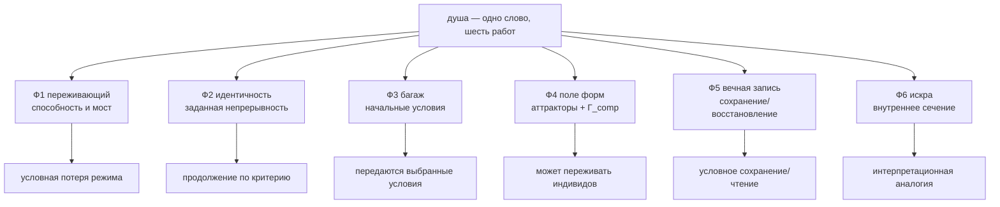

# Душа: декомпозиция

:::info Объём сопоставления
Это сравнительная интерпретация [I] с гипотезами физического/феноменального отображения. «Подтверждено/опровергнуто» ниже относится к явно заданному модельному объёму; пересмотренное ядро не устанавливает универсальных вердиктов о душе, выживании или клинике. Численные критерии, сечения наблюдателя и теоремы переноса состояний имеют разные типы.
:::

> *«Если бы глаз был живым существом, его душой было бы зрение».*
> — Аристотель, «О душе», II.1, 412b18

:::info Мост из предыдущей главы
[Панпсихизм](/docs/consciousness/comparative/panpsychism-analysis) завершился собственной позицией УГМ — **панинтериорностью**: у всякой конфигурации есть внутренняя сторона, но сознание — пороговый режим, а не универсальное свойство. Эта глава обращается к давнему имени нескольких сторон жизни и личности, — к **душе** — и ставит вопрос со всей строгостью. Какие предлагаемые функции допускают точную модель? Что связывало бы её с историческим утверждением? Какие вопросы требуют разных свидетельств? Панинтериорность и феноменальное прочтение численных критериев остаются интерпретациями [I/H].
:::

## Дорожная карта главы

1. **Вопрос, который надо разобрать** — пять работ одного слова; правила метода
2. **Приборная панель** — выбранные определения и условные результаты
3. **Декомпозиция** — шесть компонент «души», каждая со своим формальным объектом и своей судьбой
4. **Реестр оценок** — различия, обоснованные результаты и открытые мосты
5. **Традиции под панелью** — Египет, Греция, Аристотель, Стоя, буддизм, веданта, каббала, христианство, суфизм, даосизм, гнозис, Юнг, Шелдрейк, хроники Акаши, спиритизм
6. **Структурные совпадения** — архитектура слоёв; тело–душа–дух с точной типизацией
7. **Прямые вопросы** — когда начинается душа; предсуществование; майя; нужна ли новая математика
8. **Где теория молчит** — честная граница юрисдикции

:::note О нотации
В этом документе:
- $\Gamma$ — [матрица когерентности](/docs/core/dynamics/coherence-matrix), состояние голонома; $\gamma_{ij}$ — её элементы
- $P=\operatorname{Tr}(\Gamma^2)$ — чистота; $P_{\mathrm{crit}}=2/7$ — используемый здесь заданный порог, физическое прочтение которого требует калибровки [D/I/H].
- $R=1/(7P)$ — каноническая диагностика чистоты; выбранный критерий $R\ge1/3$ эквивалентен $P\le3/7$ [T при D], а не универсальному порогу метакогниции.
- $\Phi=P/Q-1$, $Q=\sum_i\gamma_{ii}^2$ — интеграция в заданном репере; $\Phi\ge1$ — выбранный критерий [D].
- $D_{\text{diff}} = \exp(S_{vN}(\rho_E))$ — мера дифференциации; порог $D_{\min} = 2$ **[О]** (T-151, независимый порог L2)
- $C = \Phi \times R$ — [мера сознательности](/docs/consciousness/foundations/self-observation#мера-сознательности-c) (T-140)
- $\varphi$ — [оператор самомоделирования](/docs/consciousness/foundations/self-observation#теорема-о-неподвижной-точке); $\Gamma^* = \varphi(\Gamma^*)$ — его неподвижная точка
- $\mathcal{L}_\Omega = \mathcal{L}_0 + \mathcal{R}$ — [уравнение эволюции](/docs/core/dynamics/evolution); $\mathcal{R}$ — регенеративный член
- $K(\tau)$ — [ядро памяти](/docs/consciousness/states/attention-memory#память); $\mathrm{Gap}(i,j)$ — [непрозрачность канала](/docs/core/dynamics/gap-operator)
- $\Gamma_{\text{comp}}$ — [композитная матрица](/docs/core/dynamics/composite-systems#составная-матрица); $\mathcal{U}_{\text{coll}}$ — [коллективное бессознательное](/docs/consciousness/subjects/collective-consciousness#определение-коллективного-бессознательного)
- L0–L4 — [иерархия интериорности](/docs/consciousness/hierarchy/interiority-hierarchy); SAD — [глубина самоосознания](/docs/consciousness/hierarchy/depth-tower)
- Статусы: **[Т]** теорема · **[С]** условное · **[О]** определение · **[И]** интерпретация · **[П]** постулат/открытое — см. [Реестр статусов](/docs/reference/status-registry)
:::

:::warning Статус документа
Глава предлагает сопоставления [I], а не доказательства религиозных доктрин. Определения модельных величин, условные математические результаты и эмпирические гипотезы [H] различаются. Исторический обзор называет выбранные тексты или школы; он не устанавливает единого учения всех периодов. Непроверенные исторические обобщения не служат посылками математики.
:::

---

## 1. Вопрос, который надо разобрать {#вопрос-который-надо-разобрать}

### 1.1 Пять работ одного слова {#пять-работ-одного-слова}

Спросите ведантиста, раввина, египетского жреца, платоника и современного спиритуалиста, что *такое* душа, — и получите пять разных должностных инструкций:

1. **Ф1 — переживающий.** Душа — *то, что чувствует*: убери её, и тело станет машиной в темноте.
2. **Ф2 — носитель идентичности.** Душа — *то, благодаря чему я тот же самый* сквозь сон, десятилетия и перемены.
3. **Ф3 — тонкий багаж.** Душа — *то, что несёт прошлое в новую жизнь*: карма, санскары, унаследованный темперамент — ответ на вопрос «почему я родился таким, а не другим?»
4. **Ф4 — поле форм.** Душа — *то, что лепит живое тело*: энтелехия, растительная душа, морфогенетическое поле.
5. **Ф5 — вечная запись.** Душа — *то, что не стирается*: то, что остаётся, когда тело — прах.

А за всеми пятью — шестая интуиция, которая не функция, а отношение:

6. **Ф6 — искра.** Душа — *точка, где индивидуальное касается абсолютного*: атман, scintilla animae, образ Божий.

В обыденном языке и в бо́льшей части философии все шесть работ выполняет одно слово. В программистских терминах: «душа» — это **God object**, «объект-бог» — единственный класс, накопивший все обязанности, которые системе некуда было положить: отрисовку, персистентность, сеть, аутентификацию. Вопрос «существует ли объект-бог?» не имеет полезного ответа. Полезное действие — **рефакторинг**: разнести обязанности по интерфейсам, найти, какой компонент в действительности реализует каждую, и обнаружить — это решающий пункт, — что у компонент **разные жизненные циклы**. Одни умирают вместе с процессом. Другие сериализуются. Третьи вообще никогда не были полями экземпляра — только статическими свойствами класса.

Этот рефакторинг и выполняет данная глава. Результат, заявленный заранее:

| Функция | Формальный аналог | Область продолжения |
|---|---|---|
| Ф1 переживающий | Режим способности и феноменальный мост | Зависит от действительной динамики и моста |
| Ф2 идентичность | Заданный критерий на историях состояния/модели | Передача состояния и личная непрерывность различны |
| Ф3 багаж | Начальные условия и входящие влияния | Выбранные условия могут передаваться по заданным каналам |
| Ф4 поле форм | Аттракторы, обученная динамика и составные паттерны | Могут сохраняться при сохранении носителей и механизмов воспроизведения |
| Ф5 вечная запись | Сохранение и восстановление в заданном канале | Полный архив не следует из сохранения следа |
| Ф6 искра | Аналогия сечения наблюдателя или типа | Философская интерпретация, а не теорема бессмертия |

### 1.2 Почему нужно уточнять смысл {#почему-да-и-нет-оба-неверны}

Шесть отдельных вопросов делают явными предлагаемые смыслы и свидетельства. Пересмотренный формализм даёт условные результаты о состояниях/способностях; он сам не опровергает личного переселения и не доказывает сохранения полной личной записи. Нужны физический канал и мостик идентичности/феноменальности (§3.3–§3.5).

Это не уклонение. Это тот же ход, который математика проделала с вопросом «существуют ли бесконечно малые?» — неразрешимым в исходной постановке и разрешённым декомпозицией на пределы, дифференциалы и нестандартные расширения, каждое со своим точным утверждением о существовании.

### 1.3 Правила метода {#правила-метода}

- **М1. Типизировать утверждение.** Различать историческое описание, предлагаемый математический аналог, эмпирический мост и вывод. Теорема об аналоге не удостоверяет мост.
- **М2. Указывать проверяемый объём.** Опровержение требует явных предпосылок и действительного противоречия. Отсутствие механизма в одном эффективном уравнении не доказывает физической невозможности; отсутствие подтверждающих свидетельств также не доказывает невозможности.
- **М3. Сопоставлять структуру, сохраняя различия.** Структурная аналогия предлагает исследовательский вопрос. Совпадение числа слоёв не задаёт математического отождествления; сходный порядок не устанавливает общего учения или границ смертности.
- **М4. Сохранять условные посылки.** Неподвижные точки, затухание, клонирование и восстановление сохраняют собственные предпосылки. Совместное цитирование не повышает статус философского вывода.
- **М5. Указывать источники и неопределённость.** Атрибутировать утверждения текстам или школам. Спорное историческое толкование или описание без проверки конкретного места обозначается как предварительный обзор, а не окончательная позиция традиции.

## 2. Приборная панель {#приборная-панель}

Прежде чем взвешивать какую-либо традицию, выложим все инструменты, которые даёт формализм. Читатель, знающий корпус, может пробежать раздел бегло; раздел существует для того, чтобы §3–§7 не нуждались во внешних ссылках.

### 2.1 Голоном и семь измерений {#голоном-и-семь-измерений}

**Голоном** здесь представлен матрицей плотности $\Gamma \in \mathcal{D}(\mathbb{C}^7)$ — эрмитовой, положительно полуопределённой, с единичным следом, семь на семь (48 вещественных параметров), — вместе с отдельно заданными процессами самоподдержания. Семь базисных направлений — функциональные метки выбранной модели. Минимальность зависит от заданных условий допустимости и представления; она не доказывает, что всякий возможный организм или философия имеют ровно такую онтологию:

| Измерение | Глагол | Одной строкой |
|-----------|--------|---------------|
| $A$ — Артикуляция | различать | производство различий |
| $S$ — Структура | удерживать | сохранение формы |
| $D$ — Динамика | изменяться | развёртывание процесса |
| $L$ — Логика | согласовывать | непротиворечивость целого |
| $E$ — Интериорность | переживать | сама внутренняя сторона |
| $O$ — Основание | поддерживать | роль основания/ресурсов; часы требуют отдельного построения |
| $U$ — Единство | интегрировать | связывание в одно |

Диагональные элементы — населённости, двадцать одна внедиагональная пара — когерентности в этом репере. Их название каналами опыта является интерпретацией, требующей считывания. УГМ предлагает монистическое описание; этот философский выбор не является теоремой, исключающей всякую онтологию, отсутствующую в выбранном представлении.

### 2.2 Четыре меры и окно сознания {#четыре-меры-и-окно}

Заданное численное ядро использует $P=\operatorname{Tr}\Gamma^2$, $Q=\sum_i\gamma_{ii}^2$, $R=1/(7P)$ и $\Phi=P/Q-1$. Так как $P=1/7+\|\Gamma-I/7\|_F^2$, каноническое $R$ — диагностика чистоты, а не доказательство рефлексивной компетенции. Выбранный порог $R\ge1/3$ эквивалентен $P\le3/7$ **[T при D]**; триадная теория категорий его не вынуждает.

Заданная переменная дифференциации $D_{\rm diff}$ отделена от семимерной матрицы. Минимальный одномерный E-сектор имеет нулевую энтропию и эффективный ранг один; расширенное $\rho_E$ требует настоящего нормированного построения. Операциональный сертификат $\mathrm{Cap}_2$ проверяет $P>2/7$, $R\ge1/3$, $\Phi\ge1$ и $D_{\rm diff}\ge2$ **[D]**. Его прочтение как переживания имеет статус **[I/H]**. Чистота ниже $2/7$ сама не является универсальной физической теоремой смерти.

Для заданной модельной карты $M$ показатель $R_M=1-\|\Gamma-M\Gamma\|_F^2/P$ отличается от канонического $R$ и может быть отрицателен. Верность последовательных итераций может равняться единице в тривиальной неподвижной точке; она одна не удостоверяет метакогниции. См. [типизированное самонаблюдение](/docs/consciousness/foundations/self-observation#формы-r).

| Уровень | Заданные математические/операциональные данные | Феноменальное прочтение |
|---|---|---|
| L0 | Внутренний аспект назначается допустимому состоянию [D] | Панинтериорность [I] |
| L1 | Заданный нетривиальный сектор/модель опыта [D/H] | Геометрия содержания [I/H] |
| L2 | Полный сертификат $\mathrm{Cap}_2$ в фиксированном считывании | Мостик переживания [I/H] |
| L3 | L2 и независимая проверка предсказания метамодели на отложенных данных [D/Pr] | Метакогниция [H] |
| L4 | Явный более сильный сертификат высшего порядка; универсального биологического потолка нет | Интерпретация единого сознания [I/H] |

Один фазовый профиль Gap может сопровождать разные пороги чистоты/интеграции; нулевой фазовый Gap не означает полного самопознания. Выбранный SAD-показатель Фано имеет максимальный индекс три **по определению**, а не по теореме об ограничении когнитивной рекурсии. Диагнозы и даты развития младенцев из статических скаляров не следуют.

### 2.3 Эффективная динамика и член регенерации {#динамика-и-эр}

В показанном эффективном уравнении выделены два неунитарных члена; это выбранная модель, а не теорема полноты всех физических взаимодействий:

$$
\frac{d\Gamma}{d\tau} = -i[H_{\text{eff}}, \Gamma] + \underbrace{\mathcal{D}_\Omega[\Gamma]}_{\text{декогеренция}} + \underbrace{\kappa(\Gamma)\,(\varphi(\Gamma) - \Gamma)\,g_V(P)}_{\mathcal{R}\text{: регенерация}}
$$

Выбранный диссипативный член $\mathcal D_\Omega$ и отображение самомодели $\varphi$ требуют явных определений. При $\kappa g_V\ge0$ направление регенерации обращено к $\varphi(\Gamma)$; корректность и сохранение области состояний устанавливаются для полного уравнения. Конвенция скорости $\kappa_0=\omega_0|\gamma_{OE}||\gamma_{OU}|/\gamma_{OO}$ требует $\gamma_{OO}>0$ или отдельно обоснованного продолжения. Выбранное отключение $g_V=0$ ниже $P_{\mathrm{crit}}$ не доказывает отсутствия других входов и механизмов.

Показанный член регенерации по определению является внутримодельным обновлением, а не каналом межголономного переноса состояния. Его гейтинг не доказывает универсальной необратимости, отсутствия других физических связей или метафизического запрета переноса; нужна настоящая полная динамика.

Пересмотренный [No-Zombie](/docs/applied/coherence-cybernetics/theorems#теорема-81-условная-необходимость-интериорности-no-zombie) сохраняет лишь модельные условные результаты баланса. Универсальный E-floor и вывод переживающего из жизнеспособности отозваны; независимая подпитка или bootstrap нарушают предпосылку замкнутых потерь. Феноменальный мостик остаётся [I/H].

### 2.4 Смерть, необратимость и состояние I/7 {#смерть-и-необратимость}

Конъюнкция $P\le2/7$ и $dP/d\tau\le0$ — выбранная модельная метка **[D]**, не клинически проверенный универсальный критерий. При заданной примитивной унитальной смешивающей полугруппе состояние может сходиться к $I/7$; неунитальный генератор может сходиться к более чистому состоянию. Отключение одного члена регенерации не доказывает невозможности восстановления чистоты любой оставшейся динамикой. Неотрицательный bootstrap или независимая подпитка включаются в баланс.

Для частного деполяризующего уравнения $\dot\Gamma=\lambda(I/7-\Gamma)$, $\lambda>0$, точное решение даёт

$$
P(t)=\frac17+\left(P(0)-\frac17\right)e^{-2\lambda t}.
$$

Экспоненциально распадается **избыточная чистота**, не сама чистота. В равновесии $\Phi=0$ и выбранное $C=0$, но фазовый Gap при нулевой когерентности не определён; это не двадцать один фазово непрозрачный канал.

Клиническая последовательность потери/восстановления метакогниции, интеграции или памяти имеет статус **[H/Pr]** и требует независимых временных данных. Статические пороги чистоты не вынуждают порядка и не означают исчезновения математической неподвижной точки. Феноменальное угасание и личная идентичность — отдельные мостиковые/конвенциональные утверждения.

### 2.5 Идентичность, неподвижные точки и перенос {#тождество-и-запреты}

Неподвижная точка заданной карты самомодели существует/зависит непрерывно лишь при собственных предпосылках. Строгое сжатие на полном метрическом пространстве состояний имеет единственную неподвижную точку; оценки зависимости от параметра требуют равномерной константы сжатия и регулярности параметров. Один порог чистоты не уничтожает неподвижных точек и не вынуждает смены идентичности после перерыва. Определять идентичность непрерывностью поддерживаемой траектории — конвенция **[D/I]**, а не квантовая no-go теорема.

**Точное No-Cloning [T в заданном объёме].** Один канал не может клонировать произвольное неизвестное семейство неортогональных чистых состояний. В изометрической дилатации входное перекрытие $z$ равнялось бы $z^2$, умноженному на перекрытие среды с модулем не больше единицы; потребовалось бы $|z|\le|z|^2$, невозможное при $0<|z|<1$. Точное вещание заданного семейства матриц плотности возможно лишь для коммутирующего семейства. Результаты относятся к *одному не зависящему от входа процессу для семейства*, а не к наличию внедиагональных элементов у одного известного состояния. См. первичную [теорему запрета вещания](https://arxiv.org/abs/quant-ph/9511010).

Известное состояние можно независимо готовить многократно, насколько допускает физическая процедура подготовки. SWAP даёт $\rho\otimes\sigma\mapsto\sigma\otimes\rho$ и целиком переносит произвольный вход в другой регистр; он не стирает этот вход. Стандартная телепортация расходует ресурсы запутанности/измерения исходного регистра, передавая состояние, а не доказывая уничтожение переживающего субъекта. Сохранение лица при переносе, реконструкции или двух одинаковых подготовках требует отдельного мостика идентичности **[I/H]**. См. [исправленный объём смерти/непрерывности](/docs/consciousness/ethics-meaning/death-continuity#no-cloning).

### 2.6 Память, потеря и извлечение {#память-и-ядра}

Ядро памяти $K(\tau)$ — одно из представлений зависимости от истории, а не единственная форма памяти. Экспоненциальное ядро может моделировать затухающее влияние; степенной хвост требует области определения и условий нормировки/интегрируемости; дельта-ядро является мгновенным пределом, а не конечным интервалом сенсорного удержания. Численные масштабы времени требуют эмпирической калибровки. Информация также может храниться в обученных параметрах и внешних записях.

Для продолжения существенно различать **потерю доступной информации** и **отказ конкретной процедуры извлечения**. Затухание одного ядра не доказывает стирания во всех физических носителях. Значение фазового Gap не удостоверяет восстановимость записи. Восстановление требует действительных кодировки, доступного канала и декодера; см. [смерть и непрерывность](/docs/consciousness/ethics-meaning/death-continuity#после-смерти) и [считывание временной памяти](/docs/consciousness/phenomenology/temporal-consciousness#окно-памяти). Прекращение работающего процесса может завершить его текущую функцию памяти при сохранении записей в других местах. Поддерживают ли эти записи реконструкцию или личную непрерывность — отдельный вопрос.

### 2.7 Коллективный слой {#коллективный-слой}

При явном представлении подсистем совместное состояние можно записать как $\Gamma_{\mathrm{comp}}\in\mathcal D((\mathbb C^7)^{\otimes N})$, получая локальные маргиналы частичным следом. Нефакторизуемость означает корреляцию, не обязательно квантовую когерентность или запутанность: коррелированной бывает и диагональная смесь. Маргинализация описывает подсистему, а не является причинной силой.

Один маргинал обычно не определяет совместного состояния. Такая ограниченная наблюдаемость не доказывает невозможности индивиду узнать коллективный паттерн через повторные наблюдения или общение. Культурная передача требует реальных взаимодействий, записей, обучения и ресурсов. Некоторые паттерны могут сохраняться между поколениями; другие теряются или преобразуются. Предлагаемое отождествление выбранных коллективных паттернов с архетипами Юнга имеет статус [I/H], не является следствием нефакторизуемости или доказательством их универсальности.

### 2.8 Целое {#целое}

Космологическая реализация — модельное предложение **[P/H]**; ни один из следующих выборов сам не доказывает неизбежности Вселенной или субъекта.

1. **Начальное состояние.** Чистый равномерный якорь $|\psi_\odot\rangle\langle\psi_\odot|$ и смешанная матрица $I/7$ — разные состояния. Симметрия их не отождествляет и не доказывает отсутствия индивидуирующей физической информации без заданной кодировки.
2. **Устойчивость.** Замороженный унитальный генератор фиксирует $I/7$; это состояние не обязано быть неустойчивым. Чистый якорь при заданной неунитальной/входной динамике имеет другую устойчивость. Космогенез требует настоящего генератора, мод якобиана, ограничений и управляющих параметров. Прежний универсальный вывод неустойчивости/неизбежной индивидуации отозван; см. [пересмотренное Происхождение](/docs/physics/cosmology-phys/origin#доказательство-нестабильности).
3. **Реляционные часы.** Построение Page–Wootters требует выбранного разложения часы/система, констрейнта и правила условного состояния. Одна семимерная матрица не вынуждает нулевого космологического ограничения и не кодирует всех полных траекторий.
4. **Наблюдатели.** Моделирование наблюдателя внутренним сечением — заданная категорная конструкция/считывание **[D/I]**. Она не доказывает физического или феноменального тождества сечения с субъектом.
5. **Сектор и репер.** Точное восстановление относится к заданному изометрическому коду; произвольное сжатие субстрата не верно. Канонические $P,R$ унитарно инвариантны, но $\Phi$ зависит от родного репера, а переменная опыта — от выбранного сектора. Согласованная перестановка сохраняет соответствующие данные; произвольная $G_2$-факторизация не сохраняет полного критерия.
6. **Высшая глубина.** Необязательный индекс SAD Фано имеет максимум три по определению, тогда как операциональная рекурсия требует независимых предсказательных сертификатов. Универсальный потолок и предполагаемый когнитивный вывод $P_{\rm crit}^{(4)}=54/35$ отозваны; [башня глубины](/docs/consciousness/hierarchy/depth-tower#критическая-чистота-sad) не задаёт универсальной глубины космоса.
7. **Прозрачность и мостик.** Граница Хэмминга требует реальной кодовой модели и не вынуждает трёх непрозрачных фазовых каналов. Фазовый Gap не идентифицирует полного сертификата способности. Ловер применим к оценщику при собственных предпосылках и не даёт универсального запрета T-214 на внутренний феноменальный мостик. Этот мостик остаётся **[I/H]**, задаётся и поддерживается независимо.

## 3. Декомпозиция {#декомпозиция}

```mermaid
graph TD
    SOUL["душа — одно слово, шесть работ"]
    F1["Ф1 переживающий<br/>способность и мост"]
    F2["Ф2 идентичность<br/>заданная непрерывность"]
    F3["Ф3 багаж<br/>начальные условия"]
    F4["Ф4 поле форм<br/>аттракторы + Γ_comp"]
    F5["Ф5 вечная запись<br/>сохранение/восстановление"]
    F6["Ф6 искра<br/>внутреннее сечение"]
    SOUL --> F1
    SOUL --> F2
    SOUL --> F3
    SOUL --> F4
    SOUL --> F5
    SOUL --> F6
    F1 --> D1["условная потеря режима"]
    F2 --> D2["продолжение по критерию"]
    F3 --> D3["передаются выбранные условия"]
    F4 --> D4["может переживать индивидов"]
    F5 --> D5["условное сохранение/чтение"]
    F6 --> D6["интерпретационная аналогия"]
```

### 3.1 Ф1 — переживающий: режим, а не жилец {#ф1-субъектность}

Кандидат в операциональный режим — калиброванный сертификат $\mathrm{Cap}_2$ (§2.2). Его отождествление с переживающим имеет статус **[I/H]**, не является математической теоремой тождества. Прежнее универсальное доказательство No-Zombie отозвано: динамика может иметь независимую подпитку чистоты или bootstrap, а численная E-когерентность не обозначает автоматически опыта.

Заданная реализация требует носителя, физического считывания и модели дифференциации. Условная потеря режима при заданной смешивающей динамике без восстановления не означает универсального феноменального угасания. Эти условия явно задают сопоставление с «душой как режимом живого» **[I]**; они не доказывают и не опровергают каждую доктрину отделимой души.

### 3.2 Ф2 — носитель идентичности: нить, а не токен {#ф2-тождество}

Предлагаемый формальный аналог — непрерывность заданной поддерживаемой траектории состояния/модели **[D/I]**. Её существование и устойчивость требуют условий §2.5; скалярный порог не доказывает разрыва личной идентичности.

SWAP, телепортация, подготовка известного состояния и приближённая классическая реконструкция — разные операции. No-Cloning запрещает точный единый копировщик соответствующего неизвестного семейства, не всякую реконструкцию или передачу. Является ли преемник, перенесённый регистр или дубликат «тем же лицом» — заданный критерий идентичности **[I/H]**, а не следствие невозможности клонирования. Прежний универсальный вердикт об уничтожении субъекта всеми этими процедурами отозван.

### 3.3 Ф3 — наследуемые условия {#ф3-багаж}

**Вопрос.** Почему новые организмы различаются способностями, склонностями и обстоятельствами? Традиции также спрашивают об ответственности, страдании и новом рождении; эти дополнительные вопросы нельзя свести к объяснению различий новорождённых.

**Формальный аналог [I/H].** Выбранное начальное условие $\Gamma(0)$ и последующие входы могут моделировать отдельные эффекты биологического наследования, пренатальной и последующей среды, культурной передачи. Это примеры путей, а не теорема о ровно двух полных каналах. Язык и обучение обычно влияют на историю развития, а не фиксируют каждую компоненту при рождении. В такую модель входят только сохранённые и причинно переданные последствия прежних жизней; не всякий чей-либо вклад обязан сохраниться.

Шум требует собственного стохастического закона. Детерминированное мастер-уравнение может описывать одинаковую ансамблевую эволюцию из одинаковых данных; случайные реализации могут совпасть, а коррелированный шум не обязан их различать. Поэтому декогеренция не гарантирует различных исходов.

:::note Передача состояния и идентичность [D/I/H]
Передача выбранных условий отличается от продолжения лица. Нужно задать действительный процесс переноса, ресурсы и критерий идентичности. Ни выбранный порог чистоты, ни неклонирование не устанавливают полноты каналов, универсальной необратимости или невозможности реконструкции (§2.4–§2.5).
:::

**Связь с кармой [I].** Наследуемые последствия дают содержательное сравнение с межпоколенческим обусловливанием. Они не устанавливают религиозного закона кармического воздаяния, его связи с намерением или нового рождения. В [AN 6.63](https://www.dhammatalks.org/suttas/AN/AN6_63.html) карма связана с намеренным действием и его результатами; она не является просто синонимом всех генетических или культурных влияний.

### 3.4 Ф4 — организация и формообразующие механизмы {#ф4-поле-форм}

**Вопрос.** Как организованные формы развиваются, поддерживают себя и воспроизводятся? Несколько математических механизмов могут описывать отдельные стороны этой задачи:

1. **Притягивающая динамика.** Сходимость требует заданных потока, области и результата об устойчивости. Само наличие члена регенерации не устанавливает аттрактора и не объясняет весь морфогенез.
2. **Обученная динамика.** Изменение эффективных параметров способно сохранять последствия прежних взаимодействий. Связь с конкретной привычкой требует механизма обучения и извлечения.
3. **Составные паттерны.** Взаимодействия и записи могут передавать организацию за пределы одного носителя. Представление $\Gamma_{\mathrm{comp}}$ само не задаёт этих взаимодействий или нового поля.

**Условное продолжение.** Паттерн способен пережить индивида, когда другие носители и механизмы воспроизведения его сохраняют. Носителями могут быть неживые записи и инженерные системы. Ни вечное сохранение, ни воспроизведение каждой детали отсюда не следуют. Это даёт конкретную программу исследования преемственности и организации, не объявляя решёнными все исторические теории формообразующих полей (§5.13).

### 3.5 Ф5 — вечная запись: Акаша слабая и сильная {#ф5-вечность}

**Что имели в виду традиции.** «Ничто не теряется»: хроника Акаши, Книга Жизни, спинозовская вечность ума.

:::note Сохранение информации и восстановление: разные объёмы [T/C/I]
Сохранение следа означает нормировку, не сохранение каждой когерентности или читаемого архива среды. Заданная глобальная унитарная дилатация сохраняет совместную различимость, но отдельные редуцированные состояния системы/среды могут её терять. Восстановление по реальному каналу требует инъективного/обратимого ограничения, исправимого кода или дополнительных доступных данных; общий стирающий канал полного обращения не имеет. Ни это, ни No-Cloning не запрещают всех записей, известных подготовок или восстановления на коде. Построение статичного состояния Page–Wootters условно и не доказывает вечного архива каждой жизни. «Слабая/сильная Акаша» — интерпретация [I/H], не прежняя всеобщая теорема сохранения/невозможности.
:::
**Спиноза: философское сравнение.** «Этика», V.23, различает вечность и телесную длительность. Сопоставление со статичным математическим представлением может прояснять различие между вневременным высказыванием и продолжающимся процессом. Оно не переводит аргумент Спинозы в Пейдж–Вуттерс, не устанавливает вечной записи и не решает спорного смысла вечности ума. Предлагаемое соответствие имеет статус [I], а не математического подтверждения учения.

### 3.6 Ф6 — искра как интерпретационный вопрос {#ф6-искра}

**Вопрос.** Традиции говорят об атмане, божественном образе или искре за пределами обычной индивидуальности. Эти понятия расходятся в вопросах личности, Бога и освобождения.

**Две возможные аналогии [I].** Наблюдателя можно представить заданным внутренним сечением/считыванием модели. Несколько экземпляров могут также иметь общий математический тип. Ни одна конструкция не отождествляет переживающего субъекта с абсолютом. Внутреннее сечение не обязано существовать без своих категориальных предпосылок; философское прочтение добавляет посылки сверх них. Семимерный шаблон/структура Фано аналогично является выбранной общей структурой, а не теоремой об одном $G_2$-типе всякой разумной системы.

**Что сохраняет сравнение.** Перспектива может зависеть от более широкой организации, а описание — различать общую структуру и частную историю индивида. Это содержательные вопросы о положении в мире и участии в нём. Вневременный тип не делает экземпляры бессмертными; наличие сечения не доказывает нерождённого переживающего. «Искра» остаётся интерпретационным сравнением, а не вердиктом о выживании.

## 4. Реестр вердиктов {#реестр-вердиктов}

Таблица различает результаты внутри заданной модели и исторические или феноменальные утверждения, мотивировавшие её. Неустановленный мост остаётся неустановленным, даже если в модели имеется теорема.

| № | Утверждение | Текущая оценка | Необходимое различие или свидетельство |
|---|---|---|---|
| 1 | Жизнеспособность влечёт переживание | Открыто [I/H] | Операциональный баланс и феноменальный мост |
| 2 | $C>0$ для каждого допустимого состояния | Ложно для канонического $C$ [C] | $C(I/7)=0$; это не опровергает всякого панпсихистского смысла сознания |
| 3 | Переживание продолжается после отделения от тела | Здесь не решено [I/H] | Носитель, процесс и феноменальный критерий |
| 4 | Возвращается то же лицо | Не решается неклонированием | Физическая передача и критерий идентичности |
| 5 | Воскресение восстанавливает того же субъекта | Здесь не решено [I/H] | Подготовка/восстановление и личная идентичность |
| 6 | Медиумы общаются с выжившими лицами | Здесь не установлено [H] | Контролируемый доступ к информации и свидетельства приписываемого ей источника |
| 7 | Новые жизни наследуют прежние условия | Отдельные пути допускают моделирование [I/H] | Реальное кодирование и влияние на развитие; теоремы ровно двух полных каналов нет |
| 8 | Коллективная организация формирует индивидов | Возможность моделирования [I/H] | Динамика взаимодействий; одной нефакторизуемости недостаточно |
| 9 | Формы и привычки сохраняют прошлое | Условно [C/I/H] | Механизмы обучения, удержания и воспроизведения |
| 10 | Прежние паттерны влияют на удалённые последующие системы | Требуется заданная конкурирующая модель [H] | Явное причинное исключение может дать нулевой эффект; отсутствие в уравнении не универсальный запрет |
| 11 | Информация никогда не теряется | Только условный результат о различимости [C] | Доступная совместная унитарная дилатация и редуцированное стирание |
| 12 | Полная запись жизней читаема | Здесь не установлено [H] | Сохранение, доступный канал и декодер |
| 13 | Я тождественно абсолюту | Философская интерпретация [I] | Аналогии сечения/типа не доказывают тождества |
| 14 | Абсолют имеет бесконечную глубину | Не опровергнуто SAD | Конечный показатель по определению не универсальная граница рекурсии |
| 15 | Полная самопрозрачность | Требует заданной задачи наблюдения/представления | Один фазовый Gap её не устанавливает и не запрещает |
| 16 | Лица предсуществовали своему нынешнему воплощению | Не решается выбранной моделью Источника [I/H] | Индивидуирующая кодировка и критерии непрерывности |
| 17 | Процесс, наследие и личное продолжение совпадают | Это разные утверждения [D/I/H] | Процесс может закончиться при сохранении записей; записи не решают тождества субъекта |

Выводы зависят от компоненты. Индивидуальные и коллективные паттерны могут теряться; те и другие иногда сохраняются в другом носителе. Сохранение математического типа и сохранение переживающего лица — разные вопросы.

---

## 5. Традиции под панелью {#традиции}

Следующие обзоры выбирают тексты, школы и мотивы. Это не полные истории и не утверждения о единственном установившемся учении традиции. Сопоставления имеют статус [I]; отождествления модели с миром требуют свидетельств [H]. Спорные прочтения сохраняются как спорные, а не используются для доказательства формального вывода.

### 5.1 Египет: первая декомпозиция {#египет}

**Доктрина.** Выбранные египетские заупокойные описания различают несколько сторон человека; единого списка для всех периодов нет. Человек слагался из **ка** (жизненный двойник, рождающийся с тобой и требующий пропитания — отсюда заупокойные подношения хлеба и пива, сперва настоящие, затем изображённые: изображения хватало); **ба** (индивидуальная личность, птицетелая, подвижная после смерти); **ах** (преображённый действенный дух — *достигаемый*, а не данный, через правильные обряды); **рен** (имя: «произнести имя умершего — значит вернуть его к жизни», говорят надписи гробниц, и стирание имени с памятников было истинной второй смертью); **шуит** (тень); и **иб** (сердце), взвешиваемое против пера Маат («Книга мёртвых», гл. 125), — орган нравственного итога жизни.

**Сопоставление [I].** Имя, ритуальное поддержание, жизненность и посмертный статус выделяют несколько вопросов о человеке. Память об имени можно сопоставить с поддержанием культурной записи, подношения — с зависимостью от поддерживающих практик. Ни одно сравнение не переводит ка в свободную энергию или ах в вычислительный продукт сообщества.

**Оценка.** Многокомпонентное описание помогает не считать каждое употребление «души» одним объектом. УГМ не подтверждает египетскую онтологию посмертия и не доказывает невозможности переживаемого продолжения ба/ах. Роли компонент различаются по текстам и периодам; приведённый краткий обзор — предварительный исторический синтез, а не универсальная египетская модель слоёв.

### 5.2 Греция до Аристотеля: орфики, Пифагор, Платон {#греция-платон}

**Доктрина.** Орфическое течение: *сома сема* — «тело — гробница» (передано у Платона, «Кратил» 400c) — душа как падшая божественная искра, кочующая по телам до очищения. Пифагор учил переселению сквозь виды; Ксенофан насмехался — «перестань бить пса: я узнал в его визге душу друга» (DK 21 B7), — попутно сохранив ярчайшее свидетельство доктрины. Платон систематизировал: душа бессмертна («Федон»: четыре аргумента), предсуществует («Менон» 81–86: мальчик-раб «припоминает» геометрию, которой не учили, — анамнезис), переселяется («Государство» X 614b: миф об Эре — души выбирают следующие жизни, затем пьют из Леты и забывают) и трёхчастна («Государство» IV: *логистикон* — разум, *тюмоэйдес* — яростный дух, *эпитюметикон* — вожделение).

**Отображение [I] и разбор.** Циклический аргумент, припоминание, сродство и принцип жизни «Федона» можно сопоставить с конструкциями траектории, обучения, типа/токена и режима. Это не доказывает универсальной необратимой асимметрии смерти, не реализует припоминания вынужденной семиосевой грамматикой и не решает перерождения. Проверка непрерывности или переноса памяти требует настоящей динамики, наблюдаемого канала и мостика идентичности; метафизические аналогии не имеют статуса матричной теоремы.

**Оценка [I].** Припоминание, трёхчастность и миф об Эре ставят разные философские вопросы. Общий математический тип не доказывает анамнезиса; рассказ о забывании сам не опровергает платоновского описания идентичности. Из данного сопоставления не следует ни переселения, ни его невозможности.

### 5.3 Аристотель: организация и различение способностей {#аристотель}

**Доктрина.** «О душе», II.1, 412a27: «душа есть первая энтелехия естественного тела, обладающего жизнью в возможности». Не жилец, а *бытие-в-работе* самого тела; отсюда 412b18 — будь глаз живым существом, его душой было бы зрение; и отсюда неотделимость — с единственным сравнением, которое Аристотель поднимает и оставляет висеть (II.1, 413a8): не относится ли душа к телу, как кормчий к кораблю; область отделимости остаётся интерпретационным вопросом, особенно для интеллекта. Три вложенные способности: **растительная** (питание и рост — всё живое), **чувствующая** (животные), **разумная** (люди). Одно спорное исключение: **нус поэтикос** из III.5, деятельный разум, «отделимый, бесстрастный, несмешанный», — о котором два тысячелетия спорили комментаторы: Александр Афродисийский и Аверроэс разработали разные описания; их точное отношение к личному бессмертию спорно и здесь не решается.

**Сопоставление [I].** Различение способностей у Аристотеля предлагает изучать организацию через то, что она делает возможным: поддержание, восприятие и рассуждение. Это отдельные эмпирические задачи. Порог чистоты не устанавливает растительной жизни, ранг матрицы — ощущения, а сертификат $\mathrm{Cap}_2$ сам по себе — разумности.

Деятельный разум остаётся спорной исторической проблемой. Описания Александра и Аверроэса нельзя объединять в одну доктрину лишь потому, что оба отличают интеллект от обычных воплощённых способностей. Универсальное утверждение T-223 отозвано [✗]. Инвариантность относительно заданной группы сохраняется как математический результат; она не устанавливает ни бессмертного общего ума, ни универсального $G_2$-типа души.

**Оценка.** Воплощённая организация даёт содержательное сопоставление; отождествление энтелехии с режимом жизнеспособности — интерпретация, а не теорема перевода. Универсального вывода о смертности или выживании отсюда нет.

### 5.4 Стоя и Эпикур {#стоя-и-эпикур}

**Доктрина.** Для стоиков душа — **пневма**, огненное дыхание, *тензионное состояние* (тонос) единого космического континуума, градуированное напряжением: *гексис* (сцепленность — камни), *фюсис* (рост — растения), *псюхе* (впечатление и импульс — животные), *логос* (разумная организация, отличная от этического достижения мудрости). Смерть: индивидуальный узел пневмы расслабляется обратно в целое; Хрисипп допускал, что души мудрых держатся связными узлами до мирового пожара (*экпирозис*), после которого цикл повторяется тождественно (*палингенесия*). Марк Аврелий, IX.35: «потеря есть не что иное, как перемена» — уже канонизировано в корпусе. Эпикур: душа — тонкие атомы, рассеиваемые смертью; «смерть для нас ничто» — философский довод, чья связь с лишением, предвосхищением и скорбью требует отдельного рассмотрения.

**Отображение [И].** Представление о тоносе позволяет сопоставить общий физический порядок и поддерживаемые в нём индивидуальные организации. Оно направляет вопросы о зависимости и изменении, но ни $\Phi$, ни $P$ не являются историческими или эмпирически проверенными мерами пневмы. Сохранение следа означает нормировку; оно не доказывает сохранного перераспределения структуры умершего человека. Продолжение организации требует действительного носителя, динамики и ресурсов. Аттракторы одной указанной модели не исключают циклов во всех возможных моделях.

**Оценка [И/Г].** Поддержание и превращение дают содержательные точки сопоставления. Посмертное продолжение и возвращение требуют отдельно заданных физических гипотез; одна условная теорема затухания не подтверждает и не опровергает их универсально.

### 5.5 Буддизм: анатта, пламя и бардо {#буддизм}

**Тексты и различия.** [SN 22.59](https://www.dhammatalks.org/suttas/SN/SN22_59.html) рассматривает форму, чувство, восприятие, формации и сознание как непостоянные и неподходящие для отождествления с собой или своей собственностью. Здесь имеется в виду именно этот анализ не-я; дальнейшее утверждение обо всём «за опытом» требует отдельного аргумента. «Милиндапаньха» использует колесницу и пламя как образы обозначения и непрерывности; здесь они выступают аналогией, а не выводом нового рождения.

Карма касается намеренного действия и его результатов, а не всей причинности без различения (AN 6.63, §3.3). Поэтому описания нового рождения нельзя просто заменить генетическим или культурным наследованием. Тибетская литература бардо представляет определённые созерцательные и ритуальные описания умирания и перехода; её последовательность растворения не является ни общебуддийской доктриной, ни установленной физиологической последовательностью L-уровней.

Ниббана также требует различения. [Итивуттака 44](https://www.dhammatalks.org/suttas/KN/Iti/iti44.html) описывает освобождение при сохраняющихся жизненных способностях, когда ещё переживаются удовольствие и боль, и отличает его от случая без остатка. Поэтому «прекращение всего обусловленного потока» не является достаточным определением освобождения при жизни. Более широкие утверждения о необусловленном и посмертном статусе требуют собственной текстуальной и интерпретационной области.

**Сопоставление [I].** Совокупности предлагают исследовать несколько сторон воплощённого опыта, не отождествляя их с осями матрицы:

| Совокупность | Возможный исследовательский вопрос |
|---|---|
| рупа — форма | Какая телесная организация поддерживает исследуемую способность? |
| ведана — чувственный тон | Как различаются приятный, неприятный и нейтральный тон? |
| санья — восприятие/распознавание | Что отличает узнавание от простого различения? |
| санкхара — формации | Как намерения и диспозиции влияют на последующие процессы? |
| виньяна — сознавание | Какой мост состояния, отчёта и переживания предлагается? |

[Различение организации и преемственности](/docs/consciousness/ethics-meaning/death-continuity#определение-идентичности) сходным образом разделяет структуру и причинное продолжение. Оно не подтверждает и не опровергает буддийского нового рождения. Модель обусловленных переменных может описывать изменения внимания, привязанности и реакции, не решая, представляет ли она называемое в традиции необусловленным. Конечные показатели Gap или SAD не устанавливают универсальной границы освобождения.

**Оценка [I/H].** Эти различия поддерживают конкретные исследования отождествления, обусловливания и страдания. Матричный формализм не подтверждает буддизм целиком, не решает бардо или нового рождения и не отождествляет освобождение со стиранием субъекта. См. [духовный синтез](/docs/consciousness/ethics-meaning/spiritual-synthesis).

### 5.6 Веданта: тождество и его интерпретации {#веданта}

**Доктрина.** Упанишадское ядро: **атман** — самость по ту сторону всех объектов — есть **Брахман**, основа всего; «Чхандогья» VI учит этому через соль, растворённую в воде (всюду, невидима, на вкус в каждой капле: «*тат твам аси*, Шветакету — ты есть То», 6.8–6.16). «Мандукья» картирует четыре состояния: *джаграт* (бодрствование), *свапна* (сновидение), *сушупти* (глубокий сон без сновидений) и **турия**, «четвёртое», — не состояние среди состояний, а свидетель всех трёх. «Тайттирия» (II.1–5) даёт **панчакошу**: пять оболочек вокруг самости — *аннамайя* (пища/тело), *пранамайя* (жизненное дыхание), *маномайя* (ум), *виджнянамайя* (различение), *анандамайя* (блаженство). Адвайта Шанкары: индивидуальная душа (*джива*) есть атман *плюс* ограничивающие придатки (*упадхи*) — тело, ум, история; узы — наложение (*адхьяса*), верёвка, принятая за змею; освобождение — знание, а не путешествие. Тонкому телу (*сукшма-шарира*) приписывается перенос санскар через смерти до освобождения. Против всего этого двайта Мадхвы держала души вечно отличными от Бога и друг от друга.

**Сопоставление [I].** Различие частной биографии и предполагаемого более глубокого основания позволяет сравнивать отношения экземпляра/типа и наблюдателя/целого. Это не делает *тат твам аси* тождественным T-221: сечение модели не является адвайтическим тождеством атмана и Брахмана. Неподвижная точка или низкий показатель интеграции также не устанавливают турию или сон без сновидений.

Начальный обзор следует адвайтически ориентированному прочтению названных Упанишад; двайта и другие школы веданты спорят с этой интерпретацией. Коши, упадхи и турия поэтому сохраняют собственные значения и не объявляются матричными слоями. Общий тип не решает вопроса о предельной реальности индивидуальности.

**Оценка [I/H].** Самоисследование и различение отождествления и осознавания дают философские сопоставления. Новое рождение, тонкое тело и предельное тождество остаются отдельными утверждениями. Ни неклонирование, ни конвенция SAD Фано их не опровергают; ни сечение, ни тип их не подтверждают.

### 5.7 Каббала: пять имён и гилгул {#каббала}

**Доктрина.** Раввинистически-каббалистическая антропология стратифицирует душу: **нефеш** (витальная душа, общая всему живому, остающаяся при теле), **руах** (нравственно-эмоциональный дух), **нешама** (интеллектуальная душа, божественная по происхождению) — триада Зоара, — расширенная в лурианском учении (Хаим Виталь, «Шаар ха-гилгулим») уровнями **хайя** и **йехида**: живая сущность и точка единства с Бесконечным (*Эйн Соф*). Та же школа систематизировала **гилгул** — переселение душ ради **тиккуна**, исправления: душа возвращается, пока не завершена её работа; **иббур** («беременность») позволяет праведной душе временно поселиться в живущем для помощи.

**Сопоставление [I].** Различения жизненности, нравственной жизни, понимания и отношения к божественному можно сравнивать с разными объяснительными задачами. Их порядок не устанавливает общего градиента смертности с кошами или критериями УГМ. Йехида здесь не определяется как исчезновение личной идентичности.

Тиккун может мотивировать размышление об ответственности за унаследованные условия и коллективном исправлении. Это светский аналог, а не замена богословского значения. Гилгул и иббур требуют отдельных описаний сохраняющегося, его взаимодействия и узнавания идентичности; одна модель неподвижной точки их не доказывает и не исключает.

**Оценка.** Содержательная аналогия [I] при зависимости исторического прочтения от текста и школы. Ни одна теорема здесь не подтверждает лестницу и не решает личного возвращения.

### 5.8 Христианство: форма, воскресение, энергии, искра {#христианство}

**Доктрина.** Четыре нити надо разделить, потому что их судьбы совершенно различны.

1. **Душа как форма тела.** Фома Аквинский, принимая Аристотеля: *anima forma corporis* («Сумма теологии» I q.76 a.1) — душа не кормчий в судне, а субстанциальная форма тела. Затем Фома доказывает, что разумная душа *субсистентна* — способна пережить как «неполная субстанция», неестественным образом, в ожидании воссоединения.
2. **Воскресение тела.** Символьное утверждение (1 Кор 15): мёртвые восстают — те же лица, воплощённые заново.
3. **Откуда берутся души.** Старинный спор: **креационизм** (каждая душа творится Богом заново — Иероним, позднее доминирующая линия) против **традуционизма** (душа передаётся от душ родителей — Тертуллиан); Августин, знаменито, так и не решил.
4. **Мистические нити.** Григорий Палама («Триады»): **сущность** Бога (*усия*) абсолютно непричастна; Его **энергии** (*энергейи*) подлинно причастны — обожение (*теозис*) есть реальный контакт с энергиями, никогда — обладание сущностью. Майстер Экхарт (немецкие проповеди): **Fünklein**, искорка, «основа души», единая с «основой Бога»: «око, которым я вижу Бога, есть око, которым Бог видит меня».

**Отображение [I] и разбор.** Прочтение через режим/тип можно сопоставить с forma corporis и различением сущности/энергий интерпретативно. Точное No-Cloning неизвестного неортогонального семейства не доказывает невозможности воскресения; подготовка известного состояния и SWAP имеют иной объём. Идентичность при реконструкции — мостик/конвенция; прежнее безусловное утверждение Ловера о невозможности внутренним сечением описывать целое отозвано без предъявленного оценщика/диагональной системы. Это сохраняет сопоставление, не выдавая исторического или богословского вердикта за матричную теорему.

**Оценка [I/H].** Воплощённая форма, личное воскресение, творение и причастность — разные утверждения. Ни одно не подтверждается и не опровергается названием состояния режимом или наблюдателя сечением. Биологическое наследование не решает спор креационизма и традуционизма, а богословские энергии Паламы не отождествляются с физической свободной энергией. Сравнения с Фомой, Паламой и Экхартом остаются интерпретативными.

### 5.9 Суфизм: фана и бака {#суфизм}

**Доктрина.** Суфийская карта человека: **нафс** (самость, градуированная — *ан-нафс аль-аммара*, повелевающая, Коран 12:53; *аль-лаввама*, укоряющая, 75:2; *аль-мутмаинна*, умиротворённая, 89:27–28), **кальб** (сердце), **рух** (дух, вдунутый в человека Богом, 15:29), **сирр** (тайна). Вершина пути: **фана** — уничтожение самости в Боге (трезвая школа аль-Джунайда; экстатическое «*ана аль-хакк*», «Я есмь Истина», связываемое с аль-Халладжем в последующей рецепции; причины его казни нельзя свести к этой фразе), — за которой в зрелой доктрине следует **бака**: пребывание, возвращение к тварям с преображённой самостью. Максима: *муту кабла ан тамуту* — «умрите прежде, чем умрёте».

**Сопоставление [I/H].** Фана и бака могут мотивировать исследование изменённого самоотождествления и устойчивых изменений действия после практики. Меняющаяся самомодель и обученные диспозиции — возможные модели, но их связь с религиозными понятиями требует свидетельств и интерпретации. Ни фазовый Gap, ни $R_M$ не устанавливают растворения эго, духовного достижения или безопасности практики.

«Умрите прежде смерти» здесь является духовной формулировкой, а не обратимой симуляцией физиологической смерти. Поддержание $P>2/7$ не даёт клинического сертификата безопасности. Сечение модели также не решает истинности высказывания аль-Халладжа, чья интерпретация и исторический контекст спорны.

**Оценка.** Различение преходящего переживания и устойчивого преобразования плодотворно. Отождествление с божественной истиной и описания рух остаются богословскими утверждениями; терминология типа/токена их не разрешает.

### 5.10 Даосизм: хунь и по {#даосизм}

**Доктрина.** Выбранные китайские ритуальные и даосские описания различают **хунь** (魂) — эфирные, янские души, связанные с дыханием-ци, — и **по** (魄) — телесные, иньские, связанные с плотью. «Ли цзи» называет судьбы: в смерти «дыхание-хунь возвращается к Небу; телесное по возвращается в Землю». Поздняя даосская систематика (Гэ Хун, «Баопу-цзы») насчитала три хунь и семь по. Чжуан-цзы (гл. 18), стучащий в таз и поющий после смерти жены, даёт философский регистр: её смерть — ещё одно превращение в переменах ци; этот эпизод предлагает ответ на скорбь через размышление о превращении, а не теорему об отсутствии утраты.

**Сопоставление [I].** Хунь и по различают стороны воплощения и посмертного превращения в выбранных китайских описаниях. Это не просто «культурный паттерн» и «материальный носитель»; ни одна теорема не переводит их судьбы в два канала УГМ. Рассказ Чжуан-цзы может приглашать к размышлению об изменении и скорби, не делая сохранение следа этическим аргументом и не доказывая отсутствия личной утраты.

**Оценка.** Превращение и зависимость — интерпретационные точки встречи. Утверждения личного бессмертия требуют собственных свидетельств и критериев. Числа хунь и по не поддерживают семимерную минимальность; исторические связи терминов различаются по источникам.

### 5.11 Гнозис: перевёрнутая искра {#гнозис}

**Доктрина.** Гностические системы (валентинианская и родственные): мир — неудачная работа низшего демиурга; человек несёт **пневматическую искру**, павшую от истинного, чуждого Бога; спасение — *гнозис*, знание, пробуждающее искру и извлекающее её из материи. Человечество делится на *гиликов* (привязанных к материи), *психиков* (душевных, спасаемых делами), *пневматиков* (духоносных, спасаемых знанием).

**Сопоставление [I].** Некоторые гностические повествования связывают освобождение со знанием отношения человека к более широкому порядку. Это можно сопоставлять с изменениями самопонимания. Предлагаемый дуализм расходится с выбранной монистической интерпретацией УГМ, но конфликт исходных онтологий не является математическим опровержением одной другой. Фоновая независимость не даёт теоремы о всяком возможном богословском «внешнем».

**Оценка.** Аналогия искры остаётся интерпретативной. Древние гностические тексты различаются космологией и антропологией; статичную трёхчастную классификацию нельзя единообразно приписывать всем или отождествлять с L-иерархией. Ни спасение, ни фиксированное достоинство человека не следуют из матричного критерия.

### 5.12 Юнг: архетипы и модели коллективных паттернов {#юнг}

**Доктрина.** Юнг постулировал под личным бессознательным **коллективное бессознательное**, общее виду и структурированное **архетипами** — Герой, Тень, Великая Мать, Мудрый Старец, — повторяющимися в мифах и снах несвязанных культур. Природа этих форм, предполагаемое наследование и свидетельства межкультурной универсальности — отдельные исторические и эмпирические вопросы.

**Сопоставление [I/H].** Корпусное название «коллективное бессознательное» для выбранных составных структур — модельное предложение. Оно не доказывает теорию Юнга по определению. Повторяющиеся символические паттерны мотивируют конкурирующие гипотезы об обучении, передаче, общих ограничениях развития и повторяющихся условиях среды. Их относительная объяснительная роль требует свидетельств; одну культурную передачу нельзя объявить решённым механизмом каждого архетипа.

**Оценка.** Коллективные паттерны и индивидуальный доступ становятся проверяемыми вопросами после задания наблюдений и взаимодействий (§2.7). Ни универсальность конкретных архетипов, ни исключение биологического вклада не следуют из частичного следа или групповой устойчивости.

### 5.13 Шелдрейк: конкурирующие объяснения формообразования {#шелдрейк}

**Доктрина.** Руперт Шелдрейк («Новая наука о жизни», 1981; «Присутствие прошлого», 1988) предложил: (1) **морфогенетические поля** направляют развитие — форма недоопределена генетикой; (2) **память природы** — регулярности природы суть привычки, укрепляемые повторением, а не вневременные законы; (3) **морфический резонанс** — сходные паттерны влияют на последующие сходные паттерны *сквозь пространство и время посредством предполагаемого морфического влияния*, кумулятивно: крысы по всему миру должны обучаться лабиринту быстрее после того, как многие крысы его выучили (его прочтение многопоколенного гарвардского эксперимента МакДугалла), новые соединения должны кристаллизоваться легче всюду после первой кристаллизации где-либо.

**Сопоставление и проверка [I/H].** Развитие, повторяемость и память — действительные объяснительные задачи. Их существование не устанавливает предложенный Шелдрейком механизм; представление составных состояний также не объясняет их все. Влияние, отсутствующее в одном эффективном уравнении, не запрещено теорией категорий или фоновой независимостью.

Точная нулевая модель всё же может давать строгое предсказание. Пусть вмешательство меняет прежний паттерн $X$, тогда как последующий исход подчиняется $Y=F(Z,\xi)$, а совместный закон $(Z,\xi)$ инвариантен относительно вмешательства. Тогда

$$
\mathcal L(Y\mid\operatorname{do}(X=x))
=\mathcal L(Y\mid\operatorname{do}(X=x'))
$$

для допустимых вмешательств [C]. Это явная предпосылка причинной независимости, а не универсальная теорема УГМ о нулевом эффекте. Конкурирующая модель резонанса должна указать, как и насколько меняется этот закон. Воспроизводимое расхождение ставило бы под вопрос заданную причинную модель; само по себе оно не указывало бы причину и не доказывало исключения каждого обычного физического пути.

**Оценка.** Гипотеза резонанса не установлена формальными аналогиями этой главы. Полного экспериментального вердикта здесь нет. Следующий содержательный шаг — контролируемое сравнение количественных моделей с включением общих материалов, информации и средовых влияний в причинное описание.

### 5.14 Акаша и теософские хроники {#акаша}

**Доктрина.** В индийской космологии **акаша** — пятый элемент, само пространство как тонкая среда, носитель звука (*шабда*). Теософия (Блаватская, «Тайная доктрина», 1888) превратила её в **хроники Акаши**: постоянный, универсальный, *читаемый* регистр всех событий, мыслей и жизней, консультируемый ясновидением (Ледбитер; «Из летописи мира» Штайнера; «чтения» Эдгара Кейси).

**Отображение [I/H].** Аналогия архива требует настоящего канала сохранения и восстановления. Сохранение следа не даёт неизменного реестра; статичная constrained-модель не доказывает содержания всех жизней в каждом доступном состоянии среды. Общее стирание запрещает полное обращение, но обратимые ограничения и исправимые коды могут допускать восстановление. No-Cloning неизвестного семейства не запрещает чтения классической записи или подготовки известного состояния. Вердикт слабого/сильного архива зависит от модели (§3.5).

**Оценка [I/H].** И универсальный архив, и привилегированный доступ к нему требуют свидетельств сверх указанного формализма. Обычные записи и культурная передача способны объяснять часть полученной информации, но их нельзя объявить источником каждого заявленного чтения без разбора случая. Сохранение, точность восстановления и отнесение к конкретной жизни — разные проверки.

### 5.15 Спиритизм {#спиритизм}

**Доктрина.** Аллан Кардек («Книга духов», 1857) кодифицировал век сеансов: выжившие личности, сохраняющие память и характер, общаются через медиумов.

**Сопоставление [I/H].** Утверждение об общении с умершим содержит как минимум три компоненты: информация получена; обычный доступ не объясняет её в данном протоколе; её источник — именно это выжившее лицо. Это разные доказательные шаги. Память участников, записи и утечки информации — возможные проверяемые объяснения, а не универсальное объяснение, установленное без исследования.

**Оценка.** Формализм не устанавливает заявленного общения и не доказывает невозможности любого посмертного носителя. Математическое существование неподвижной точки и эффективное затухание ядра не определяют источник сообщения. Контролируемое извлечение независимо заданной информации проверяло бы одну компоненту; феноменальное продолжение и личная атрибуция требуют дальнейших критериев.

---

## 6. Структурные совпадения {#структурные-совпадения}

Несколько традиций различают телесную жизнь, восприятие, понимание и отношение человека к более широкому порядку. Сопоставление полезно при сохранении различий. Следующие группировки эвристические [I], а не доказательство открытия традициями одной и той же иерархии.

### 6.1 Архитектура слоёв души {#архитектура-слоёв}

Таблица группирует выбранные мотивы по вопросу, который они ставят. Каждая ячейка — предлагаемое сравнение, не перевод и не утверждение об одном месте в универсальной стопке:

| Вопрос | Мотивы веданты | Каббалистические мотивы | Египетские мотивы | Греческие мотивы |
|---|---|---|---|---|
| Воплощение | аннамайя | телесная жизнь | сохранение тела | сома |
| Поддержание жизни | пранамайя | нефеш | ка и подношения | растительная способность |
| Аффективная и воспринимающая жизнь | маномайя | отдельные употребления руах | свойства, приписываемые ба | чувствующая способность |
| Различение | виджнянамайя | нешама | эквивалент не утверждается | рассуждение, нус |
| Преобразование и осуществление | анандамайя в описании оболочек | хайя в поздних описаниях | ах | эквивалент не утверждается |
| Отношение к предполагаемому предельному | турия в адвайтических прочтениях | йехида | эквивалент не утверждается | спорные прочтения деятельного разума |
| Помнимые или наследуемые последствия | диспозиции и учение | коллективные стороны тиккуна | рен и поминовение | клеос |

Элементы различаются онтологией и назначением: оболочка, способность, погребальная компонента и отношение к Богу не являются объектами одного типа. В частности, для кош и нефеш/руах/нешама не установлен общий порядок смертности; связь с могилой или необходимость подношений не означает, что традиция объявляет компоненту несуществующей после смерти.

Содержательный общий вопрос: **что должно поддерживаться для сохранения заявленной способности или непрерывности?** УГМ может задавать носителей, входы, наблюдения и условия восстановления. Она не выводит универсальной черты, ниже которой слои всех традиций умирают, а выше остаются лишь безличные типы.

### 6.2 Тело, душа, дух — с типизацией {#тело-душа-дух}

Тело, душу и дух можно использовать для трёх разных вопросов: что несёт процесс, как он организован и как традиция понимает его отношение к поддерживающему или предельному порядку. Триада в 1 Фес 5:23 — текстуальная точка сравнения, а не доказательство одной антропологии всех традиций.

Заданная интерпретация УГМ [I] могла бы сопоставить **тело** с физической реализацией, **душу** — с её организованными способностями и вопросами идентичности, **дух** — с вопросами зависимости и причастности. Эти назначения не доказывают незаменимости носителя, некопируемости всякой души или тождества богословского духа координате O. Точное восстановление состояния и личная непрерывность сохраняют отдельные условия (§2.5).

Связанные с дыханием значения пневмы, spiritus и руах делают дыхание содержательным историческим мотивом оживлённости и зависимости. Точные истории слов и последующие богословские значения различаются; это не универсальная этимология каждого слова «душа» и не свидетельство независимого открытия одного формализма. Полное сравнительно-лингвистическое утверждение требовало бы собственного исследования источников.

Дыхание может подсказать измеримый ритмический и поддерживающий процесс. Оно не строит тензорные часы из оси O и не устанавливает универсальной частоты $\omega_0$. Реализация и калибровка часов требуют [собственных данных](/docs/core/operators/emergent-time); [переживание времени](/docs/consciousness/phenomenology/temporal-consciousness) добавляет следующий эмпирический мост.

---

## 7. Прямые вопросы {#прямые-ответы}

### 7.1 Когда начинается душа? {#когда-формируется}

Ответ зависит от того, что датируется. Панинтериорность назначает внутренний аспект в философской интерпретации [I]; это не эмпирические часы развития. Неподвижная точка самомодели появляется лишь при действительных условиях существования; пересечение $P=2/7$ не делает отображение сжимающим.

Возникновение конкретной операциональной способности требует измеренной траектории развития и проверенного считывания. Феноменальная интерпретация остаётся следующей гипотезой. Ни младенческий возраст, ни универсальный момент одушевления не следуют из четырёх статических критериев $\mathrm{Cap}_2$. Биологическое развитие можно исследовать как приобретение, поддержание и интеграцию различных способностей, не выдавая результат за решение креационизма или традуционизма.

### 7.2 Была ли она до голонома? {#предсуществование}

Предложенный космологический якорь не решает личного предсуществования. Чистое состояние имеет нулевую энтропию фон Неймана, но это не означает «ноль возможных индивидуирующих бит»: два чистых состояния $|A\rangle\langle A|$ и $|O\rangle\langle O|$ имеют нулевую энтропию каждое и могут кодировать различимые альтернативы. Информационное утверждение требует ансамбля, кодировки и доступных наблюдений.

Выбранное вневременное представление аналогично не доказывает бессмысленности всякого физического или богословского употребления «до». Утверждение о предсуществовании этого лица требует отношения идентичности, предполагаемой истории и соответствующих ей свидетельств. Доступность математического типа до построения экземпляра не доказывает предсуществования лица и не исключает его. T-221 и общий шаблон не разрешают платоновского анамнезиса.

### 7.3 Жизнь — это майя? {#майя}

Зависимость, явленность и несуществование — разные понятия. Зависимый процесс способен иметь реальные последствия внутри модели; вывод представления не устанавливает его эмпирической адекватности и не делает его содержание незначимым. Употребление майи в адвайте также нельзя без аргумента сводить к тезису, что ничто не имеет значения или никто не страдает.

Сравнение может спрашивать, чем отождествление с меняющимся описанием отличается от поддерживающих его условий. Физические реализации УГМ и адвайтическое описание уровней реальности сохраняют разные посылки. Никакая теорема реконструкции пространства-времени не доказывает и не опровергает майю; практическая ответственность требует явных этических посылок вместо лозунга о нереальности. См. [сравнительный синтез](/docs/consciousness/ethics-meaning/spiritual-synthesis).

### 7.4 Нужна ли душе математика побольше? {#новая-математика}

Имеющаяся математика даёт несколько моделей-кандидатов, не теорему полного инвентаря. Неподвижные точки, ядра памяти, составные состояния и ограниченные часы требуют собственных предпосылок. Новый канал переноса/восстановления не нарушает монизма лишь отсутствием в одном эффективном уравнении. Нужда в более богатой модели устанавливается явным эмпирическим или логическим недостатком, а не отозванными универсальными запретами.

---

## 8. Где теория молчит {#границы-юрисдикции}

Три границы, названные без украшений, чтобы эта глава не закрывала ни одной дыры риторикой (дисциплина [эпистемической вертикали](/docs/reference/epistemic-vertical)):

1. **Процесс, наследие и личное продолжение.** [Пересмотренная глава о непрерывности](/docs/consciousness/ethics-meaning/death-continuity#после-смерти) разделяет эти три утверждения. Процесс может закончиться при сохранении части записей и последствий. Выживание или невыживание того же переживающего субъекта дополнительно требует идентификационного и феноменального моста; из сохранения следа или неклонирования универсального вывода нет.
2. **Феноменальный мост.** Отношение состояния, отчёта и переживания требует собственной заданной карты и свидетельств [I/H]. Универсальный запрет внутренних карт T-214 отозван: предпосылки оценщика Ловера не относятся к каждому предикату. Нерешённость тождества не делает каждый операциональный критерий теоремой или исторический вердикт защищённым от новых данных.
3. **Собственная стадия Вселенной.** Находится ли само целое внутри окна жизнеспособности (дыра H1.2, [регистр этажа](/docs/core/foundations/universe-as-holonom#регистр-дыр-этажа)) — не выведено и не измерено. Вопросы о космической душе наследуют эту открытость.

Декомпозиция делает явными шесть разных вопросов. Часть получает условные математические ответы; другие остаются историческими, эмпирическими, нормативными или метафизическими. Различение поддерживает конкретные проверки, не выдавая остальные вопросы за уже решённые.

---

## Сводка {#сводка}

| Компонента | Формальный аналог | Статус и граница |
|---|---|---|
| Ф1 переживающий | Операциональная способность и феноменальный мост | [D/I/H]; универсальной теоремы смертности нет |
| Ф2 идентичность | Критерий на историях состояния/модели | [D/I/H]; передача и личное продолжение различны |
| Ф3 багаж | Начальные условия и входы развития | [I/H]; выбранные каналы без утверждения полноты |
| Ф4 поле форм | Аттракторы, обученная динамика и коллективные паттерны | [C/I/H]; устойчивость и передача требуют механизмов |
| Ф5 вечная запись | Кодирование, сохранение и восстановление | [C/I/H]; нет ни универсального архива, ни универсального запрета чтения |
| Ф6 искра | Аналогия сечения/типа | [I]; тождество с абсолютом не установлено |

### Что мы узнали {#что-мы-узнали}

1. Слово «душа» может объединять разные вопросы; уточнение смысла делает содержательный ответ возможным.
2. Организация, передача состояния, идентичность и переживание требуют разных условий и свидетельств.
3. Условное затухание не доказывает универсального угасания; неклонирование не запрещает всякого переноса или реконструкции.
4. Культурные и биологические последствия могут сохраняться, но записи и коллективные паттерны также могут теряться.
5. Математические сечения, общие типы и сохранённый след не доказывают божественного тождества или полного вечного архива.
6. Исторические традиции расходятся в существенных вопросах. Различия направляют исследование, а не стираются общим матричным словарём.
7. Получается конструктивная программа: задать способность, реализацию, канал, бюджет ресурсов и наблюдаемый результат, затем проверить предлагаемый мост.

:::tip Замыкая сравнительный раздел
Эта глава связывает [теории сознания](/docs/consciousness/comparative/consciousness-theories), [панпсихизм](/docs/consciousness/comparative/panpsychism-analysis) и исторические представления о душе. Пересмотренная глава о [смерти и непрерывности](/docs/consciousness/ethics-meaning/death-continuity) даёт условные математические результаты и явные различия идентичности. [Духовный синтез](/docs/consciousness/ethics-meaning/spiritual-synthesis) развивает сравнение, не выдавая выбранные структурные аналогии за полное объяснение или опровержение традиций.

:::

---

**Связанные документы:**

- [Смерть и непрерывность](/docs/consciousness/ethics-meaning/death-continuity) — необратимость, идентичность, No-Cloning, три интерпретации
- [Коллективное сознание](/docs/consciousness/subjects/collective-consciousness) — $\Gamma_{\text{comp}}$, коллективное бессознательное, архетипы
- [Панпсихизм](/docs/consciousness/comparative/panpsychism-analysis) — панинтериорность против семейства панпсихизмов
- [Внимание и память](/docs/consciousness/states/attention-memory) — ядра, забвение, процедурная память
- [Изменённые состояния](/docs/consciousness/states/altered-states) — медитация, самадхи, профили растворения эго
- [Бессознательное](/docs/consciousness/states/unconscious) — Gap-структура, неполная прозрачность
- [Доязыковое сознание](/docs/consciousness/subjects/pre-linguistic) — субъект до языка
- [Иерархия интериорности](/docs/consciousness/hierarchy/interiority-hierarchy) — определения L0–L4
- [Башня глубины](/docs/consciousness/hierarchy/depth-tower) — выбранный SAD-показатель и операциональные сертификаты высшего порядка
- [Вселенная как Голоном](/docs/core/foundations/universe-as-holonom) — статичное целое, сечения, одна грамматика
- [Происхождение Вселенной](/docs/physics/cosmology-phys/origin) — предлагаемый Источник и условия устойчивости
- [Самонаблюдение](/docs/consciousness/foundations/self-observation) — $\varphi$, $R$, неподвижная точка
- [Реестр статусов](/docs/reference/status-registry) — статусы всех цитируемых теорем
