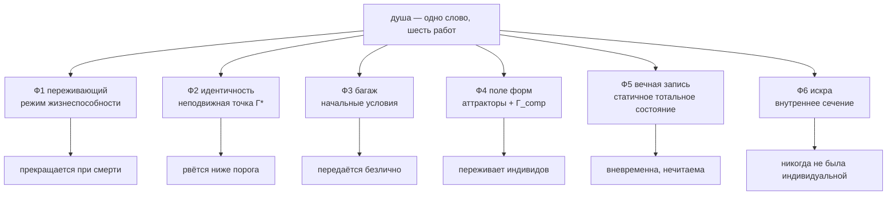

# Душа: декомпозиция

:::info Объём сопоставления
Это сравнительная интерпретация [I] с гипотезами физического/феноменального отображения. «Подтверждено/опровергнуто» ниже относится к явно заданному модельному объёму; пересмотренное ядро не устанавливает универсальных вердиктов о душе, выживании или клинике. Численные критерии, сечения наблюдателя и теоремы переноса состояний имеют разные типы.
:::

> *«Если бы глаз был живым существом, его душой было бы зрение».*
> — Аристотель, «О душе», II.1, 412b18

:::info Мост из предыдущей главы
[Панпсихизм](/docs/consciousness/comparative/panpsychism-analysis) завершился собственной позицией УГМ — **панинтериорностью**: у всякой конфигурации есть внутренняя сторона, но сознание — пороговый режим, а не универсальное свойство. Эта глава обращается к самому древнему имени, которое человечество дало внутренней стороне, — к **душе** — и ставит вопрос со всей строгостью. Что из называвшегося «душой» существует в Γ-формализме? Что исключено теоремами? И что с самого начала не было чем-то одним?
:::

## Дорожная карта главы

1. **Вопрос, который надо разобрать** — пять работ одного слова; правила метода
2. **Приборная панель** — всё, что даёт формализм, пересказанное самодостаточно
3. **Декомпозиция** — шесть компонент «души», каждая со своим формальным объектом и своей судьбой
4. **Реестр вердиктов** — утверждение за утверждением: опровергнуто, перелокализовано, подтверждено или вне юрисдикции
5. **Традиции под панелью** — Египет, Греция, Аристотель, Стоя, буддизм, веданта, каббала, христианство, суфизм, даосизм, гнозис, Юнг, Шелдрейк, хроники Акаши, спиритизм
6. **Структурные совпадения** — архитектура слоёв; тело–душа–дух с точной типизацией
7. **Прямые вопросы** — когда начинается душа; предсуществование; майя; нужна ли новая математика
8. **Где теория молчит** — честная граница юрисдикции

:::note О нотации
В этом документе:
- $\Gamma$ — [матрица когерентности](/docs/core/dynamics/coherence-matrix), состояние голонома; $\gamma_{ij}$ — её элементы
- $P = \mathrm{Tr}(\Gamma^2)$ — [чистота (жизнеспособность)](/docs/core/dynamics/viability#определение-чистоты); $P_{\text{crit}} = 2/7$ — [критический порог](/docs/core/dynamics/viability#критическая-чистота) **[Т]**
- $R$ — [мера рефлексии](/docs/consciousness/foundations/self-observation#мера-рефлексии-r), канонически $R = 1/(7P)$; порог $R_{\text{th}} = 1/3$ **[Т]**
- $\Phi$ — [мера интеграции](/docs/core/structure/dimension-u#мера-интеграции-φ); порог $\Phi_{\text{th}} = 1$ **[Т]** (T-129)
- $D_{\text{diff}} = \exp(S_{vN}(\rho_E))$ — мера дифференциации; порог $D_{\min} = 2$ **[О]** (T-151, независимый порог L2)
- $C = \Phi \times R$ — [мера сознательности](/docs/consciousness/foundations/self-observation#мера-сознательности-c) (T-140)
- $\varphi$ — [оператор самомоделирования](/docs/consciousness/foundations/self-observation#теорема-о-неподвижной-точке); $\Gamma^* = \varphi(\Gamma^*)$ — его неподвижная точка (идентичность)
- $\mathcal{L}_\Omega = \mathcal{L}_0 + \mathcal{R}$ — [уравнение эволюции](/docs/core/dynamics/evolution); $\mathcal{R}$ — регенеративный член
- $K(\tau)$ — [ядро памяти](/docs/consciousness/states/attention-memory#память); $\mathrm{Gap}(i,j)$ — [непрозрачность канала](/docs/core/dynamics/gap-operator)
- $\Gamma_{\text{comp}}$ — [композитная матрица](/docs/core/dynamics/composite-systems#составная-матрица); $\mathcal{U}_{\text{coll}}$ — [коллективное бессознательное](/docs/consciousness/subjects/collective-consciousness#определение-коллективного-бессознательного)
- L0–L4 — [иерархия интериорности](/docs/consciousness/hierarchy/interiority-hierarchy); SAD — [глубина самоосознания](/docs/consciousness/hierarchy/depth-tower)
- Статусы: **[Т]** теорема · **[С]** условное · **[О]** определение · **[И]** интерпретация · **[П]** постулат/открытое — см. [Реестр статусов](/docs/reference/status-registry)
:::

:::warning Статус документа
Это сравнительно-интерпретативный документ. Он **не вводит новых теорем**: каждое несущее утверждение — ссылка на существующий результат с его реестровым статусом. Отображения между терминами традиций и формальными объектами сами по себе — интерпретации **[И]**, если более сильный статус не унаследован из корпуса. Два сборочных утверждения (§3.3, §3.5) помечены как *Утверждение* **[С]** и перечисляют свои посылки явно. Все вердикты подчинены правилам метода §1.3.
:::

---

## 1. Вопрос, который надо разобрать {#вопрос-который-надо-разобрать}

### 1.1 Пять работ одного слова {#пять-работ-одного-слова}

Спросите ведантиста, раввина, египетского жреца, платоника и современного спиритуалиста, что *такое* душа, — и получите пять разных должностных инструкций:

1. **Ф1 — переживающий.** Душа — *то, что чувствует*: убери её, и тело станет машиной в темноте.
2. **Ф2 — носитель идентичности.** Душа — *то, благодаря чему я тот же самый* сквозь сон, десятилетия и перемены.
3. **Ф3 — тонкий багаж.** Душа — *то, что несёт прошлое в новую жизнь*: карма, санскары, унаследованный темперамент — ответ на вопрос «почему я родился таким, а не другим?»
4. **Ф4 — поле форм.** Душа — *то, что лепит живое тело*: энтелехия, растительная душа, морфогенетическое поле.
5. **Ф5 — вечная запись.** Душа — *то, что не стирается*: то, что остаётся, когда тело — прах.

А за всеми пятью — шестая интуиция, которая не функция, а отношение:

6. **Ф6 — искра.** Душа — *точка, где индивидуальное касается абсолютного*: атман, scintilla animae, образ Божий.

В обыденном языке и в бо́льшей части философии все шесть работ выполняет одно слово. В программистских терминах: «душа» — это **God object**, «объект-бог» — единственный класс, накопивший все обязанности, которые системе некуда было положить: отрисовку, персистентность, сеть, аутентификацию. Вопрос «существует ли объект-бог?» не имеет полезного ответа. Полезное действие — **рефакторинг**: разнести обязанности по интерфейсам, найти, какой компонент в действительности реализует каждую, и обнаружить — это решающий пункт, — что у компонент **разные жизненные циклы**. Одни умирают вместе с процессом. Другие сериализуются. Третьи вообще никогда не были полями экземпляра — только статическими свойствами класса.

Этот рефакторинг и выполняет данная глава. Результат, заявленный заранее:

| Функция | Формальный объект | Судьба |
|---------|-------------------|--------|
| Ф1 переживающий | Заданный режим способности и феноменальный мостик | Потеря условна при настоящей динамике [I/H] |
| Ф2 идентичность | заданная траектория состояния/модели | [D/I/H] | перенос и феноменальное тождество различны |
| Ф3 багаж | начальные условия $\Gamma(0)$ через два физических канала | передаётся — безлично |
| Ф4 поле форм | аттракторы + $H_{\text{eff}}$ + паттерны $\Gamma_{\text{comp}}$ | переживает индивидов; нуждается в носителях |
| Ф5 вечная запись | сохранение следа + статичное тотальное состояние (Пейдж–Уоттерс) | вневременна — но нечитаема как архив |
| Ф6 искра | внутреннее сечение единого $\Gamma$ (T-221) + $G_2$-тип | никогда не была индивидуальной; никогда не рождалась |

### 1.2 Почему «да» и «нет» оба неверны {#почему-да-и-нет-оба-неверны}

Шесть отдельных вопросов делают явными предлагаемые смыслы и свидетельства. Пересмотренный формализм даёт условные результаты о состояниях/способностях; он сам не опровергает личного переселения и не доказывает сохранения полной личной записи. Нужны физический канал и мостик идентичности/феноменальности (§3.3–§3.5).

Это не уклонение. Это тот же ход, который математика проделала с вопросом «существуют ли бесконечно малые?» — неразрешимым в исходной постановке и разрешённым декомпозицией на пределы, дифференциалы и нестандартные расширения, каждое со своим точным утверждением о существовании.

### 1.3 Правила метода {#правила-метода}

Пять правил управляют всем, что ниже; они существуют, чтобы ни традиции, ни теорию не подгоняли друг под друга.

- **М1. Отображения — интерпретации.** Всякое соответствие «термин традиции ↔ формальный объект» помечено **[И]**, если корпус не установил его ранее. Теоремы сохраняют собственные статусы независимо от отображения.
- **М2. Опровержение адресовано формализованному утверждению.** Когда вердикт гласит *опровергнуто*, это значит: опровергнуто **в данной формализации**, взятой по сильнейшей первоисточной формулировке традиции. Если традиция имела в виду нечто более слабое, реестр указывает, что выживает.
- **М3. Структура считается; числа — нет.** Соответствие *архитектуры* (порядок слоёв, направление зависимостей, границы смертности) — свидетельство сходимости. Совпадение *количеств* — пять оболочек, пять каббалистических уровней, семь душ-по против семи измерений — имеет **нулевой доказательный вес** и флагируется всюду, где встречается.
- **М4. Никаких новых теорем.** Где несколько существующих результатов собраны в одно утверждение, оно помечено как *Утверждение* с явным списком посылок и статусом слабейшей из них.
- **М5. Самодостаточность.** Каждая традиция изложена по её собственным первоисточникам, названным по месту, с такой полнотой, чтобы главу можно было читать без библиотеки. Каждый формальный результат пересказан со своей определяющей формулой и ссылкой на каноническое место.

---

## 2. Приборная панель {#приборная-панель}

Прежде чем взвешивать какую-либо традицию, выложим все инструменты, которые даёт формализм. Читатель, знающий корпус, может пробежать раздел бегло; раздел существует для того, чтобы §3–§7 не нуждались во внешних ссылках.

### 2.1 Голоном и семь измерений {#голоном-и-семь-измерений}

**Голоном** — любая система, чьё состояние есть матрица плотности $\Gamma \in \mathcal{D}(\mathbb{C}^7)$ — эрмитова, положительная, с единичным следом, семь на семь (48 вещественных параметров), — поддерживающая себя автопоэтическим замыканием. Семь базисных направлений — не пространственные оси, а функциональные аспекты, каждый из которых незаменим ([минимальность 7/7](/docs/proofs/minimality/theorem-minimality-7) **[Т]**):

| Измерение | Глагол | Одной строкой |
|-----------|--------|---------------|
| $A$ — Артикуляция | различать | производство различий |
| $S$ — Структура | удерживать | сохранение формы |
| $D$ — Динамика | изменяться | развёртывание процесса |
| $L$ — Логика | согласовывать | непротиворечивость целого |
| $E$ — Интериорность | переживать | сама внутренняя сторона |
| $O$ — Основание | питать и отмерять время | источник свободной энергии и внутренние часы |
| $U$ — Единство | интегрировать | связывание в одно |

Диагональные элементы $\gamma_{kk}$ — населённости; двадцать одна недиагональная пара $\gamma_{ij}$ — **когерентности**, каналы, через которые аспекты видят друг друга. Всё дальнейшее — утверждения об этой одной матрице и её динамике. В этом и монизм: вторая субстанция не вводится нигде, поэтому всюду, где традиция её постулирует, бремя доказательства — указать, *какая структура $\Gamma$* на самом деле описывалась.

### 2.2 Четыре меры и окно сознания {#четыре-меры-и-окно}

Заданное численное ядро использует $P=\operatorname{Tr}\Gamma^2$, $Q=\sum_i\gamma_{ii}^2$, $R=1/(7P)$ и $\Phi=P/Q-1$. Так как $P=1/7+\|\Gamma-I/7\|_F^2$, каноническое $R$ — диагностика чистоты, а не доказательство рефлексивной компетенции. Выбранный порог $R\ge1/3$ эквивалентен $P\le3/7$ **[T при D]**; триадная теория категорий его не вынуждает.

Заданная переменная дифференциации $D_{\rm diff}$ отделена от семимерной матрицы. Минимальный одномерный E-сектор имеет нулевую энтропию и эффективный ранг один; расширенное $\rho_E$ требует настоящего нормированного построения. Операциональный сертификат $\mathrm{Cap}_2$ проверяет $P>2/7$, $R\ge1/3$, $\Phi\ge1$ и $D_{\rm diff}\ge2$ **[D]**. Его прочтение как переживания имеет статус **[I/H]**. Чистота ниже $2/7$ сама не является универсальной физической теоремой смерти.

Для заданной модельной карты $M$ показатель $R_M=1-\|\Gamma-M\Gamma\|_F^2/P$ отличается от канонического $R$ и может быть отрицателен. Верность последовательных итераций может равняться единице в тривиальной неподвижной точке; она одна не удостоверяет метакогниции. См. [типизированное самонаблюдение](/docs/consciousness/foundations/self-observation#формы-r).

| Уровень | Заданные математические/операциональные данные | Феноменальное прочтение |
|---|---|---|
| L0 | Внутренний аспект назначается допустимому состоянию [D] | Панинтериорность [I] |
| L1 | Заданный нетривиальный сектор/модель опыта [D/H] | Геометрия содержания [I/H] |
| L2 | Полный сертификат $\mathrm{Cap}_2$ в фиксированном считывании | Мостик переживания [I/H] |
| L3 | L2 и независимая проверка предсказания метамодели на отложенных данных [D/Pr] | Метакогниция [H] |
| L4 | Явный более сильный сертификат высшего порядка; универсального биологического потолка нет | Интерпретация единого сознания [I/H] |

Один фазовый профиль Gap может сопровождать разные пороги чистоты/интеграции; нулевой фазовый Gap не означает полного самопознания. Выбранный SAD-показатель Фано имеет максимальный индекс три **по определению**, а не по теореме об ограничении когнитивной рекурсии. Диагнозы и даты развития младенцев из статических скаляров не следуют.

### 2.3 Динамика: два канала — и чем ℛ не является {#динамика-и-эр}

Уравнение эволюции имеет ровно два неунитарных канала:

$$
\frac{d\Gamma}{d\tau} = -i[H_{\text{eff}}, \Gamma] + \underbrace{\mathcal{D}_\Omega[\Gamma]}_{\text{декогеренция}} + \underbrace{\kappa(\Gamma)\,(\varphi(\Gamma) - \Gamma)\,g_V(P)}_{\mathcal{R}\text{: регенерация}}
$$

Декогеренция $\mathcal{D}_\Omega$ стирает когерентности; регенерация $\mathcal{R}$ тянет состояние к его собственной **само-модели** $\varphi(\Gamma)$, со скоростью $\kappa$, питаемой через канал Основания ($\kappa_0 = \omega_0 \lvert\gamma_{OE}\rvert \lvert\gamma_{OU}\rvert / \gamma_{OO}$) и гейтируемой множителем $g_V(P)$, обращающимся в ноль при $P \leq P_{\text{crit}}$ ([вывод формы регенерации](/docs/core/dynamics/evolution#вывод-формы-регенерации)).

Показанный член регенерации по определению является внутримодельным обновлением, а не каналом межголономного переноса состояния. Его гейтинг не доказывает универсальной необратимости, отсутствия других физических связей или метафизического запрета переноса; нужна настоящая полная динамика.

Пересмотренный [No-Zombie](/docs/applied/coherence-cybernetics/theorems#теорема-81-условная-необходимость-интериорности-no-zombie) сохраняет лишь модельные условные результаты баланса. Универсальный E-floor и вывод переживающего из жизнеспособности отозваны; независимая подпитка или bootstrap нарушают предпосылку замкнутых потерь. Феноменальный мостик остаётся [I/H].

### 2.4 Смерть, необратимость и состояние I/7 {#смерть-и-необратимость}

Конъюнкция $P\le2/7$ и $dP/d\tau\le0$ — выбранная модельная метка **[D]**, не клинически проверенный универсальный критерий. При заданной примитивной унитальной смешивающей полугруппе состояние может сходиться к $I/7$; неунитальный генератор может сходиться к более чистому состоянию. Отключение одного члена регенерации не доказывает невозможности восстановления чистоты любой оставшейся динамикой. Неотрицательный bootstrap или независимая подпитка включаются в баланс.

Для частного деполяризующего уравнения $\dot\Gamma=\lambda(I/7-\Gamma)$, $\lambda>0$, точное решение даёт

$$
P(t)=\frac17+\left(P(0)-\frac17\right)e^{-2\lambda t}.
$$

Экспоненциально распадается **избыточная чистота**, не сама чистота. В равновесии $\Phi=0$ и выбранное $C=0$, но фазовый Gap при нулевой когерентности не определён; это не двадцать один фазово непрозрачный канал.

Клиническая последовательность потери/восстановления метакогниции, интеграции или памяти имеет статус **[H/Pr]** и требует независимых временных данных. Статические пороги чистоты не вынуждают порядка и не означают исчезновения математической неподвижной точки. Феноменальное угасание и личная идентичность — отдельные мостиковые/конвенциональные утверждения.

### 2.5 Идентичность: неподвижная точка и два её запрета {#тождество-и-запреты}

Неподвижная точка заданной карты самомодели существует/зависит непрерывно лишь при собственных предпосылках. Строгое сжатие на полном метрическом пространстве состояний имеет единственную неподвижную точку; оценки зависимости от параметра требуют равномерной константы сжатия и регулярности параметров. Один порог чистоты не уничтожает неподвижных точек и не вынуждает смены идентичности после перерыва. Определять идентичность непрерывностью поддерживаемой траектории — конвенция **[D/I]**, а не квантовая no-go теорема.

**Точное No-Cloning [T в заданном объёме].** Один канал не может клонировать произвольное неизвестное семейство неортогональных чистых состояний. В изометрической дилатации входное перекрытие $z$ равнялось бы $z^2$, умноженному на перекрытие среды с модулем не больше единицы; потребовалось бы $|z|\le|z|^2$, невозможное при $0<|z|<1$. Точное вещание заданного семейства матриц плотности возможно лишь для коммутирующего семейства. Результаты относятся к *одному не зависящему от входа процессу для семейства*, а не к наличию внедиагональных элементов у одного известного состояния. См. первичную [теорему запрета вещания](https://arxiv.org/abs/quant-ph/9511010).

Известное состояние можно независимо готовить многократно, насколько допускает физическая процедура подготовки. SWAP даёт $\rho\otimes\sigma\mapsto\sigma\otimes\rho$ и целиком переносит произвольный вход в другой регистр; он не стирает этот вход. Стандартная телепортация расходует ресурсы запутанности/измерения исходного регистра, передавая состояние, а не доказывая уничтожение переживающего субъекта. Сохранение лица при переносе, реконструкции или двух одинаковых подготовках требует отдельного мостика идентичности **[I/H]**. См. [исправленный объём смерти/непрерывности](/docs/consciousness/ethics-meaning/death-continuity#no-cloning).

### 2.6 Память: четыре ядра и два вида забвения {#память-и-ядра}

Память в УГМ — не склад, а **немарковское ядро** $K(\tau)$, через которое прошлые состояния взвешивают текущую динамику ([каноническое изложение](/docs/consciousness/states/attention-memory#память)):

| Тип | Ядро | Масштаб |
|-----|------|---------|
| сенсорная | $K \sim \delta(\tau)$ | ~250 мс |
| рабочая | $K \sim e^{-\tau/\tau_{WM}}$ | секунды |
| долговременная | $K \sim \tau^{-\alpha}$, $\alpha \in (0,1)$ | неограниченно, с угасанием |
| процедурная | вписана в $H_{\text{eff}}$ | структурно |

[Забвение](/docs/consciousness/states/attention-memory#забывание) бывает двух фундаментально разных видов: **декогеренция ядра** — $\lvert K \rvert \to 0$, книга сожжена, восстановление невозможно; и **рост Gap** — когерентность цела, но канал непрозрачен, книга заперта в сейфе, восстановление возможно (терапия, медитация, случай). При смерти ядро умирает вместе с носителем: чем бы ни была память, она — свойство *работающего* голонома и его физического субстрата. Один этот факт решит судьбу всех доктрин о душах-носителях памяти.

### 2.7 Коллективный слой {#коллективный-слой}

$N$ голономов, делящих среду, образуют композитное состояние $\Gamma_{\text{comp}} \in \mathcal{D}(\mathbb{C}^{7^N})$. Когда оно не факторизуется ($\Gamma_{\text{comp}} \neq \bigotimes_i \Gamma_i$), существуют **эмерджентные когерентности** — [коллективное бессознательное](/docs/consciousness/subjects/collective-consciousness#определение-коллективного-бессознательного) $\mathcal{U}_{\text{coll}}$ **[О]**: структура, которой не несёт ни один индивид, до которой не дотягивается ничья рефлексия ($\varphi_i$ видит лишь редуцированную $\Gamma_i$), но которая формирует каждого через частичный след. [Архетипы](/docs/consciousness/subjects/collective-consciousness#архетипы) **[И]** — её устойчивые паттерны, отобранные тем, что повышают жизнеспособность групп-носителей, и передаваемые через культурную среду — наследственность без генов и без магии. Культурные когерентности воспроизводятся сквозь поколения; паттерн учителя переживает учителя в $\Gamma_{\text{comp}}$ учеников.

Этот слой реален, надиндивидуален, бессознателен и формирующ. Держите его в поле зрения: именно здесь живёт большинство «полей» и «записей» традиций.

### 2.8 Целое {#целое}

Космологическая реализация — модельное предложение **[P/H]**; ни один из следующих выборов сам не доказывает неизбежности Вселенной или субъекта.

1. **Начальное состояние.** Чистый равномерный якорь $|\psi_\odot\rangle\langle\psi_\odot|$ и смешанная матрица $I/7$ — разные состояния. Симметрия их не отождествляет и не доказывает отсутствия индивидуирующей физической информации без заданной кодировки.
2. **Устойчивость.** Замороженный унитальный генератор фиксирует $I/7$; это состояние не обязано быть неустойчивым. Чистый якорь при заданной неунитальной/входной динамике имеет другую устойчивость. Космогенез требует настоящего генератора, мод якобиана, ограничений и управляющих параметров. Прежний универсальный вывод неустойчивости/неизбежной индивидуации отозван; см. [пересмотренное Происхождение](/docs/physics/cosmology-phys/origin#доказательство-нестабильности).
3. **Реляционные часы.** Построение Page–Wootters требует выбранного разложения часы/система, констрейнта и правила условного состояния. Одна семимерная матрица не вынуждает нулевого космологического ограничения и не кодирует всех полных траекторий.
4. **Наблюдатели.** Моделирование наблюдателя внутренним сечением — заданная категорная конструкция/считывание **[D/I]**. Она не доказывает физического или феноменального тождества сечения с субъектом.
5. **Сектор и репер.** Точное восстановление относится к заданному изометрическому коду; произвольное сжатие субстрата не верно. Канонические $P,R$ унитарно инвариантны, но $\Phi$ зависит от родного репера, а переменная опыта — от выбранного сектора. Согласованная перестановка сохраняет соответствующие данные; произвольная $G_2$-факторизация не сохраняет полного критерия.
6. **Высшая глубина.** Необязательный индекс SAD Фано имеет максимум три по определению, тогда как операциональная рекурсия требует независимых предсказательных сертификатов. Универсальный потолок и предполагаемый когнитивный вывод $P_{\rm crit}^{(4)}=54/35$ отозваны; [башня глубины](/docs/consciousness/hierarchy/depth-tower#критическая-чистота-sad) не задаёт универсальной глубины космоса.
7. **Прозрачность и мостик.** Граница Хэмминга требует реальной кодовой модели и не вынуждает трёх непрозрачных фазовых каналов. Фазовый Gap не идентифицирует полного сертификата способности. Ловер применим к оценщику при собственных предпосылках и не даёт универсального запрета T-214 на внутренний феноменальный мостик. Этот мостик остаётся **[I/H]**, задаётся и поддерживается независимо.

## 3. Декомпозиция {#декомпозиция}

```mermaid
graph TD
    SOUL["душа — одно слово, шесть работ"]
    F1["Ф1 переживающий<br/>режим жизнеспособности"]
    F2["Ф2 идентичность<br/>неподвижная точка Γ*"]
    F3["Ф3 багаж<br/>начальные условия"]
    F4["Ф4 поле форм<br/>аттракторы + Γ_comp"]
    F5["Ф5 вечная запись<br/>статичное тотальное состояние"]
    F6["Ф6 искра<br/>внутреннее сечение"]
    SOUL --> F1
    SOUL --> F2
    SOUL --> F3
    SOUL --> F4
    SOUL --> F5
    SOUL --> F6
    F1 --> D1["прекращается при смерти"]
    F2 --> D2["рвётся ниже порога"]
    F3 --> D3["передаётся безлично"]
    F4 --> D4["переживает индивидов"]
    F5 --> D5["вневременна, нечитаема"]
    F6 --> D6["никогда не была индивидуальной"]
```

### 3.1 Ф1 — переживающий: режим, а не жилец {#ф1-субъектность}

Кандидат в операциональный режим — калиброванный сертификат $\mathrm{Cap}_2$ (§2.2). Его отождествление с переживающим имеет статус **[I/H]**, не является математической теоремой тождества. Прежнее универсальное доказательство No-Zombie отозвано: динамика может иметь независимую подпитку чистоты или bootstrap, а численная E-когерентность не обозначает автоматически опыта.

Заданная реализация требует носителя, физического считывания и модели дифференциации. Условная потеря режима при заданной смешивающей динамике без восстановления не означает универсального феноменального угасания. Эти условия явно задают сопоставление с «душой как режимом живого» **[I]**; они не доказывают и не опровергают каждую доктрину отделимой души.

### 3.2 Ф2 — носитель идентичности: нить, а не токен {#ф2-тождество}

Предлагаемый формальный аналог — непрерывность заданной поддерживаемой траектории состояния/модели **[D/I]**. Её существование и устойчивость требуют условий §2.5; скалярный порог не доказывает разрыва личной идентичности.

SWAP, телепортация, подготовка известного состояния и приближённая классическая реконструкция — разные операции. No-Cloning запрещает точный единый копировщик соответствующего неизвестного семейства, не всякую реконструкцию или передачу. Является ли преемник, перенесённый регистр или дубликат «тем же лицом» — заданный критерий идентичности **[I/H]**, а не следствие невозможности клонирования. Прежний универсальный вердикт об уничтожении субъекта всеми этими процедурами отозван.

### 3.3 Ф3 — тонкий багаж: реален, физичен, безличен {#ф3-багаж}

**Что имели в виду традиции.** Карма и санскары (веданта, буддизм), наследуемая душевная субстанция традуционизма, астральное приданое, родовой долг: объясняемое подлинно и остро — *новорождённые различны* темпераментом, способностями и обстоятельствами сверх того, что может объяснить младенческий опыт.

**Формальный объект.** Начальное условие $\Gamma(0)$ нового голонома, фиксируемое при формировании ровно через два канала, оба физические:

1. **Генетический:** ДНК кодирует базовые структурные когерентности (паттерны $\gamma_{AA}$, $\gamma_{SS}$) и параметры растущего $H_{\text{eff}}$ — ребёнок наследует *часть структуры* родительской $\Gamma$, никогда — родительскую $\Gamma^*$ ([типология наследия](/docs/consciousness/ethics-meaning/death-continuity#после-смерти)).
2. **Композитно-средовой:** окружающая $\Gamma_{\text{comp}}$ — язык, ритуал, семейный паттерн, архетип — инициализирует и непрерывно тренирует растущую конфигурацию (§2.7). В этот канал свёрнуто *всё, что когда-либо внесли умершие*: здесь чужое прошлое достигает новорождённого.

Картину завершает случайность: шум декогеренции гарантирует, что даже тождественные каналы не фиксируют тождественных исходов.

:::note Перенос состояния и конвенция идентичности [D/I/H]
Из прежних посылок не следует универсальной теоремы непереселения. Критерий не доказывает необратимой потери чистоты, исчезновения неподвижной точки или полноты каналов. Точное No-Cloning ограничивает единый копировщик неизвестного семейства; известная подготовка, SWAP и восстановление на коде возможны. Если идентичность определена одной непрерывной поддерживаемой траекторией, отнесение поздней реконструкции к новому токену следует из конвенции, а не из физической теоремы невозможности. Генетические/средовые влияния — эмпирические пути; исчерпание ими всех начальных условий требует свидетельств.
:::
**Что выживает от кармы.** На популяционном масштабе доктрина *строго верна*: новые конфигурации обусловлены накопленным композитным прошлым — умершие действительно формируют рождающихся, через гены и через $\Gamma_{\text{comp}}$. Отказывает лишь *адресация*: на багаже нет имени. Карма без пассажира — что, как покажет §5.5, самая аккуратная из традиций и утверждала с самого начала.

### 3.4 Ф4 — поле форм: вопрос Шелдрейка, решённый без новой физики {#ф4-поле-форм}

**Что имели в виду традиции.** Растительная душа Аристотеля, морфогенетическое поле Шелдрейка, «привычки природы»: *нечто* делает форму устойчивой, развитие направленным, а паттерн кумулятивным — и это видимым образом не простой перечень молекул.

**Формальный объект.** Три структуры, уже стоящие на панели, совместно:

1. **Аттракторы.** Развитие сходится, потому что у динамики есть притягивающие состояния; $\mathcal{R}$ тянет к само-модели — устойчивость формы есть *форма потока*, а не добавленное поле.
2. **$H_{\text{eff}}$ как привычка.** Процедурная память вписана в сам оператор эволюции (§2.6): «привычки природы» существуют и накапливаются — локально, в носителях каждой линии.
3. **$\Gamma_{\text{comp}}$ как честное морфическое поле.** Надиндивидуальное, невидимое для своих членов, формирующее (§2.7) — всё, ради чего вызывали «поле вида», с одной разницей: оно каузально и привязано к каналам.

**Судьба.** Переживает всякого индивида; требует живых носителей; распространяется только взаимодействием. Детальный разбор конкретных утверждений Шелдрейка — включая различающее экспериментальное предсказание — в §5.13.

### 3.5 Ф5 — вечная запись: Акаша слабая и сильная {#ф5-вечность}

**Что имели в виду традиции.** «Ничто не теряется»: хроника Акаши, Книга Жизни, спинозовская вечность ума.

:::note Сохранение информации и восстановление: разные объёмы [T/C/I]
Сохранение следа означает нормировку, не сохранение каждой когерентности или читаемого архива среды. Заданная глобальная унитарная дилатация сохраняет совместную различимость, но отдельные редуцированные состояния системы/среды могут её терять. Восстановление по реальному каналу требует инъективного/обратимого ограничения, исправимого кода или дополнительных доступных данных; общий стирающий канал полного обращения не имеет. Ни это, ни No-Cloning не запрещают всех записей, известных подготовок или восстановления на коде. Построение статичного состояния Page–Wootters условно и не доказывает вечного архива каждой жизни. «Слабая/сильная Акаша» — интерпретация [I/H], не прежняя всеобщая теорема сохранения/невозможности.
:::
**Спиноза сказал ровно это.** «Этика», V.23: «человеческая душа не может быть совершенно уничтожена вместе с телом, но от неё остаётся нечто вечное» — с его же схолией, настаивающей, что эта вечность — *не длительность*: мы не длимся после смерти; нечто от нас истинно вневременно. Подставьте «траектория, вписанная в статичное тотальное состояние» — и предложение переносится дословно. Из всех западных доктрин бессмертия формализм подписывается под этой — и она никому не обещает переживаний.

### 3.6 Ф6 — искра: не часть тебя, а факт тебя {#ф6-искра}

**Что имели в виду традиции.** Атман, который не рождался; scintilla animae; образ Божий в душе; «око, которым я вижу Бога».

**Формальный объект.** Два точных факта, ни один из которых не является *компонентой* индивида:

1. **Ты — внутреннее сечение единого $\Gamma$** (T-221 **[Т]+[И]**): субъект — это мир, читающий себя в точке, а не чужеродный наблюдатель, вставленный в него. Таково строгое содержание «ты есть То» — и заметьте, чего оно *не* говорит: не что твоя конфигурация есть целое, а что твой акт бытия-перспективой принадлежит самому целому.
2. **Выбранная аналогия типа [I].** Семимерный шаблон/структура Фано могут быть общими моделям с этой кодировкой. Они не вынуждены у каждой жизнеспособной или разумной системы; непрерывная $G_2$ не сохраняет каждую родную координатную пару/прямую Фано как дискретную метку. T-223 не отождествляет все состояния с одной орбитой и не делает полный критерий орбитально инвариантным. «Нетварный тип» — философское сравнение, не вывод вечной души.

**Судьба.** Искра не может умереть, потому что никогда не была индивидуальным достоянием — факт-сечение и тип не находятся *в* голономе; голоном находится в них. Традиции, помещавшие бессмертный элемент *за пределами индивидуальности* (§5.6, §5.8), выслеживали именно это; традиции, индивидуировавшие его, чеканили токены из типа.

---

## 4. Реестр вердиктов {#реестр-вердиктов}

Каждая строка применяет правила М1–М2: отображение — [И]; «опровергнуто» значит опровергнуто в данной формализации, против сильнейшей первоисточной формулировки.

| № | Утверждение доктрины | Формализация | Вердикт | Решающий результат |
|---|----------------------|--------------|---------|--------------------|
| 1 | Живое тело могло бы не иметь опыта | Операциональная жизнеспособность и феноменальный мостик | **открыто [I/H]** | Универсальный No-Zombie floor отозван; лишь заданная модель баланса |
| 2 | сознательно всё (сильный панпсихизм) | $C > 0$ для всех $\Gamma$ | **опровергнуто** | $C(I/7) = 0$ **[Т]** |
| 3 | Душа покидает тело и продолжает переживать | Носитель, канал переноса и феноменальный мостик | **вне численной теоремы** | Модель требует носителя; универсальное угасание/невозможность переноса не доказаны |
| 4 | То же лицо возвращается | Передача состояния и критерий идентичности | **не решается No-Cloning** | Конвенция непрерывности/токена [D/I]; физический канал проверяется отдельно |
| 5 | Воскресение воссоздаёт того же субъекта | Известная подготовка/реконструкция и мостик идентичности | **открыто [I/H]** | Единое копирование неизвестного семейства запрещено; подготовка известного состояния — нет |
| 6 | медиумы беседуют с выжившими личностями | доступ к живым $\Gamma^* + K$ после смерти | **опровергнуто** | ядро умирает с носителем (§2.6) |
| 7 | новорождённые несут обусловленность прошлым | $\Gamma(0)$ обусловлена накопленным композитным состоянием | **подтверждено, безлично** | двухканальная инициализация (§3.3) |
| 8 | надиндивидуальный слой незримо формирует индивидов | $\mathcal{U}_{\text{coll}} \neq \varnothing$ | **подтверждено** | коллективное бессознательное **[О]**, архетипы **[И]** |
| 9 | у природы есть память; формы — привычки | перестройка $H_{\text{eff}}$ + паттерны $\Gamma_{\text{comp}}$ | **подтверждено, в пределах каналов** | процедурная память; культурные когерентности |
| 10 | паттерн резонирует сквозь пространство-время без всякого канала | нефизический член переноса в $\mathcal{L}_\Omega$ | **опровергнуто** | полнота каналов + фоновая независимость **[Т]** (§5.13) |
| 11 | Ничто не теряется | Заданная глобальная унитарная дилатация/статичная модель | **условно [C/I]** | Сохранения следа недостаточно |
| 12 | Запись всех жизней можно прочитать | Реальный канал и код восстановления | **не подтверждено [H]** | Общее стирание необратимо; это не запрещает каждой записи |
| 13 | Сокровеннейшее я тождественно абсолюту | Заданное сечение наблюдателя/аналогия типа | **интерпретация [I/H]** | Пересмотренные T-221/T-223 не доказывают феноменального тождества или одного универсального орбитального типа |
| 14 | Абсолют — бесконечно глубокое Я | Операциональные сертификаты высшего порядка | **не опровергнуто SAD** | Потолок индекса Фано [D]; универсальный потолок глубины отозван |
| 15 | Полная самопрозрачность | Фазовый Gap и восстановление модели | **не опровергнуто Хэммингом** | Нулевой Gap не идентифицирует состояния/критерия; кодовые/диагональные мостики требуют предпосылок |
| 16 | индивидуальные души существовали до дифференциации мира | индивидуированные состояния в $\Gamma_\odot$ | **опровергнуто** | Источник — одно состояние, ноль индивидуирующих бит, вневременен **[П/Т]** (§7.2) |
| 17 | что «после» — аннигиляция, наследие или поток | выбор среди трёх интерпретаций | **вне юрисдикции** | метатеоретично **[И]** (§8) |

Семнадцать строк; четыре судьбы. Паттерн устойчив: *всё, индексированное индивидом, умирает с индивидом; всё надиндивидуальное выживает — и никогда не было чьей-то душой в частности.*

---

## 5. Традиции под панелью {#традиции}

Хронология — не порядок суда; идём примерно с востока Греции и вперёд по времени. Каждой традиции — три движения: чему она действительно учила (первоисточники по месту), отображение (М1: **[И]**), вердикт (М2).

### 5.1 Египет: первая декомпозиция {#египет}

**Доктрина.** Египетская антропология никогда не знала *одной* души. Человек слагался из **ка** (жизненный двойник, рождающийся с тобой и требующий пропитания — отсюда заупокойные подношения хлеба и пива, сперва настоящие, затем изображённые: изображения хватало); **ба** (индивидуальная личность, птицетелая, подвижная после смерти); **ах** (преображённый действенный дух — *достигаемый*, а не данный, через правильные обряды); **рен** (имя: «произнести имя умершего — значит вернуть его к жизни», говорят надписи гробниц, и стирание имени с памятников было истинной второй смертью); **шуит** (тень); и **иб** (сердце), взвешиваемое против пера Маат («Книга мёртвых», гл. 125), — орган нравственного итога жизни.

**Отображение [И].** Архитектура поразительно современна: личность как *связка компонент с раздельными требованиями к обслуживанию и раздельными судьбами*. Голод ка — самое откровенное во всех традициях признание, что персистентность стоит свободной энергии: посмертная компонента с бюджетом ΔF, питаемая через O-канал живых, несущих культ. Рен — информационное наследие в точности: паттерн в $\Gamma_{\text{comp}}$, реинстанцируемый при каждом воспоминании, живой ровно столько, сколько сообщество его перезапускает. Ах — преображение как *достижение* — кодирует, что посмертный статус конструируется работой живого сообщества, а не автоматичен. Взвешивание сердца естественно читается как этический итог траектории (ср. [вектор смысла](/docs/consciousness/ethics-meaning/meaning)) — вольно, и так и помечено.

**Вердикт.** Компонентная архитектура: **подтверждено** (строки 8, 9, 11). Переживаемое выживание ба/ах: **опровергнуто** (строки 3–4). Однако собственная практика Египта вкладывалась подавляюще в те две компоненты, которые формализм ратифицирует, — имя и культ: они проектировали $\Gamma_{\text{comp}}$-персистентность за четыре тысячелетия до того, как у неё появился символ.

### 5.2 Греция до Аристотеля: орфики, Пифагор, Платон {#греция-платон}

**Доктрина.** Орфическое течение: *сома сема* — «тело — гробница» (передано у Платона, «Кратил» 400c) — душа как падшая божественная искра, кочующая по телам до очищения. Пифагор учил переселению сквозь виды; Ксенофан насмехался — «перестань бить пса: я узнал в его визге душу друга» (DK 21 B7), — попутно сохранив ярчайшее свидетельство доктрины. Платон систематизировал: душа бессмертна («Федон»: четыре аргумента), предсуществует («Менон» 81–86: мальчик-раб «припоминает» геометрию, которой не учили, — анамнезис), переселяется («Государство» X 614b: миф об Эре — души выбирают следующие жизни, затем пьют из Леты и забывают) и трёхчастна («Государство» IV: *логистикон* — разум, *тюмоэйдес* — яростный дух, *эпитюметикон* — вожделение).

**Отображение [I] и разбор.** Циклический аргумент, припоминание, сродство и принцип жизни «Федона» можно сопоставить с конструкциями траектории, обучения, типа/токена и режима. Это не доказывает универсальной необратимой асимметрии смерти, не реализует припоминания вынужденной семиосевой грамматикой и не решает перерождения. Проверка непрерывности или переноса памяти требует настоящей динамики, наблюдаемого канала и мостика идентичности; метафизические аналогии не имеют статуса матричной теоремы.

**Вердикт.** Переселение: **опровергнуто** (строка 4). Анамнезис: **перелокализован** на уровень типа — и там **подтверждён**. Трёхчастность: структурное эхо. Лета: традиция, изнутри опровергающая собственное сильное утверждение.

### 5.3 Аристотель: ближайшее древнее прочтение {#аристотель}

**Доктрина.** «О душе», II.1, 412a27: «душа есть первая энтелехия естественного тела, обладающего жизнью в возможности». Не жилец, а *бытие-в-работе* самого тела; отсюда 412b18 — будь глаз живым существом, его душой было бы зрение; и отсюда неотделимость — с единственным сравнением, которое Аристотель поднимает и оставляет висеть (II.1, 413a8): не относится ли душа к телу, как кормчий к кораблю; собственная его доктрина энтелехии закрывает вопрос против кормчего. Три вложенные способности: **растительная** (питание и рост — всё живое), **чувствующая** (животные), **разумная** (люди). Одно спорное исключение: **нус поэтикос** из III.5, деятельный разум, «отделимый, бесстрастный, несмешанный», — о котором два тысячелетия спорили комментаторы: Александр Афродисийский, а затем Аверроэс читали его как *единый для всех людей* (монопсихизм), а не как личную бессмертную часть.

**Отображение [И].** Это не столько отображение, сколько таблица перевода. Энтелехия-живого-тела **и есть** режим жизнеспособности: процессное свойство организованного носителя, неотделимое, потому что режим не отделяется (§3.1). Три способности — L-лестница с приложенными порогами:

| Аристотель | Критерий в Γ | Уровень |
|------------|--------------|---------|
| растительная душа | автопоэтическое поддержание, $P > 2/7$ | жизнь как таковая |
| чувствующая душа | $\mathrm{rank}(\rho_E) > 1$ | L1 |
| разумная душа | полное окно: $R \geq 1/3$, $\Phi \geq 1$, $D_{\text{diff}} \geq 2$ | L2 |

Сопоставление нус поэтикос интерпретативно [I]. Пересмотренный T-223 сохраняет свойства заданных перестановок репера/сектора, а не теорему об одной вынужденной инвариантной грамматике каждого разумного носителя или решении исторического спора о едином бессмертном уме. Орбита состояния $[\Gamma]_{G_2}$ — не универсальный тип души и не факторизация, сохраняющая полный канонический критерий; $\Phi$ зависит от репера. Личное бессмертие требует собственного физического и феноменального мостика.

**Вердикт.** Ядро доктрины: **подтверждено** — трактовка Ф1/Ф2 в УГМ аристотелевская буквально, с порогами, которых Аристотелю не хватало. Остаток деятельного разума: **перелокализован** на уровень типа. Вывод о смертности Аристотель сделал сам; теория добавляет лишь доказательство.

### 5.4 Стоя и Эпикур {#стоя-и-эпикур}

**Доктрина.** Для стоиков душа — **пневма**, огненное дыхание, *тензионное состояние* (тонос) единого космического континуума, градуированное напряжением: *гексис* (сцепленность — камни), *фюсис* (рост — растения), *псюхе* (впечатление и импульс — животные), *логос* (правящее начало, гегемоникон, — мудрые). Смерть: индивидуальный узел пневмы расслабляется обратно в целое; Хрисипп допускал, что души мудрых держатся связными узлами до мирового пожара (*экпирозис*), после которого цикл повторяется тождественно (*палингенесия*). Марк Аврелий, IX.35: «потеря есть не что иное, как перемена» — уже канонизировано в корпусе. Эпикур: душа — тонкие атомы, рассеиваемые смертью; «смерть для нас ничто» — канонизировано вместе с поправкой (страх перед $dP/d\tau < 0$ — структурный ответ, а не ошибка).

**Отображение [И].** Лестница тоноса — второе древнее предвосхищение L-иерархии (после аристотелевской, и независимо градуированное *напряжением* — степенью связности, что поразительно близко к работе $\Phi$ и $P$). Одна пневма, много узлов: в точности расщепление «единый дух / многие души» из §6.2 — пневма O-подобна, индивидуируясь лишь как *паттерны напряжения*, то есть конфигурации. Растворение-как-перераспределение — сохранение следа **[С]**, прочитанное вслух. Что отказывает: посмертная связность узлов мудрых (ни носителя, ни поддержания — строки 3–4) и вечное возвращение (у динамики аттракторы, а не циклы; теоремы о возвращении в корпусе нет — скорее вне юрисдикции, чем опровергнуто, но без опоры).

**Вердикт.** Перераспределение и лестница напряжения: **подтверждено**. Стойкие узлы мудрецов: **опровергнуто**. Возвращение: **без опоры**.

### 5.5 Буддизм: анатта, пламя и бардо {#буддизм}

**Доктрина.** Буддова *анатта* (Анатталаккхана-сутта): постоянного «я» не найти ни в опыте, ни за ним. Личность — пять **кхандх** (совокупностей): *рупа* (форма), *ведана* (чувственный тон), *санья* (распознавание), *санкхара* (формации/диспозиции), *виньяна* (сознавание). Непрерывность без субстанции: «Милиндапаньха» даёт два канонических образа — **колесницу** (Нагасена царю Милинде: «колесница» — обозначение частей в отношении, и «Нагасена» — тоже) и **пламя**: перерождение — светильник, зажжённый от светильника, «ни тот же, ни другой» (*na ca so na ca añño*); переходит обусловленность, а не путешественник. Карма — намеренное действие, формирующее будущее возникание: закон обусловливания, не курьер личностей. Тибетская «Бардо Тхёдол» хореографирует умирание как фиксированную **последовательность растворения**: земля в воду (тело тяжелеет), вода в огонь (черты высыхают), огонь в ветер (тепло уходит), ветер в сознавание (дыхание прекращается), затем — рассвет ясного света. И цель, *ниббана*: необусловленное, прекращение обусловленного потока.

**Отображение [И].** Этой традиции нужен наименьший перевод, потому что декомпозицию она выполнила сама — больше чем на два тысячелетия раньше. Анализ кхандх *и есть* рефакторинг объекта-бога:

| Кхандха | Формальный аналог |
|---------|-------------------|
| рупа — форма | носитель; S-сектор |
| ведана — чувственный тон | гедонический знак $dP/d\tau$ (T-103) |
| санья — распознавание | A-сектор, апперцепция $\gamma_{AE}$ |
| санкхара — диспозиции | структура $H_{\text{eff}}$ + процедурное ядро — *кармоносная* совокупность, и в самом деле носитель привычек формализма |
| виньяна — сознавание | сам режим |

Анатта = «субъект — паттерн, а не субстанция» — корпус говорит это собственным голосом ([смерть и непрерывность](/docs/consciousness/ethics-meaning/death-continuity)). Колесница — конфигурация Γ; пламя — позитивная половина Утверждения §3.3: *никакого переноса состояния, реальное обусловливание* — второе пламя горит потому, что первого коснулся фитиль, и ничто не перепрыгнуло. Собственная сравнительная таблица корпуса передаёт буддийское перерождение как **композитную непрерывность**: поток когерентностей продолжается; субъект — нет. Последовательность растворения бардо отслеживает, стадия за стадией, таблицу иерархической декогеренции §2.4 — единственная традиция, записавшая протокол умирания изнутри и в правильном порядке **[И]**. Даже теоремы-потолки ложатся на подготовленную почву: невозможность тотальной прозрачности (≥3 непрозрачных канала **[С]**) корпус сам цитирует как формальную тень отказа традиции называть полное пробуждение состоянием, которое система могла бы *удерживать*.

Одно честное трение: *ниббана* как необусловленное, которое в некоторых школах тем не менее *познаётся*. Формализм не предлагает состояния, которое было бы и переживаемым, и необусловленным: переживание привязано к режиму, режимы обусловлены. Прочтения-как-прекращение проходят; прочтения переживаемой посмертной ниббаны — нет.

**Вердикт.** Анатта, пламя, безличная карма, последовательность растворения: **подтверждено** — высший балл согласия в реестре. Переживаемые необусловленные состояния: **опровергнуто в данной формализации**. Где народная доктрина реперсонализирует перерождение (опознанные тулку, вспомненные жизни), она падает в строку 4 вместе со всеми.

### 5.6 Веданта: тат твам аси под G₂ {#веданта}

**Доктрина.** Упанишадское ядро: **атман** — самость по ту сторону всех объектов — есть **Брахман**, основа всего; «Чхандогья» VI учит этому через соль, растворённую в воде (всюду, невидима, на вкус в каждой капле: «*тат твам аси*, Шветакету — ты есть То», 6.8–6.16). «Мандукья» картирует четыре состояния: *джаграт* (бодрствование), *свапна* (сновидение), *сушупти* (глубокий сон без сновидений) и **турия**, «четвёртое», — не состояние среди состояний, а свидетель всех трёх. «Тайттирия» (II.1–5) даёт **панчакошу**: пять оболочек вокруг самости — *аннамайя* (пища/тело), *пранамайя* (жизненное дыхание), *маномайя* (ум), *виджнянамайя* (различение), *анандамайя* (блаженство). Адвайта Шанкары: индивидуальная душа (*джива*) есть атман *плюс* ограничивающие придатки (*упадхи*) — тело, ум, история; узы — наложение (*адхьяса*), верёвка, принятая за змею; освобождение — знание, а не путешествие. Тонкому телу (*сукшма-шарира*) приписывается перенос санскар через смерти до освобождения. Против всего этого двайта Мадхвы держала души вечно отличными от Бога и друг от друга.

**Отображение [И].** Центральное уравнение адвайты получает самое резкое формальное прочтение этой главы: **тат твам аси = T-221**. Ты — внутреннее сечение единого тотального состояния; не *похоже* на него: таково содержание теоремы. Джива = атман + упадхи переводится как: токен = тип + частности конфигурации; и настойчивость Шанкары, что индивидуальность дживы *привходяща*, — это диагноз тип/токен из §3.6, поставленный на два уровня формальности раньше. Адхьяса — принятие режима за субстанцию — та самая категориальная ошибка, которую разбирает §1. Лестницу кош табулирует §6.1. Четыре состояния «Мандукьи» ложатся чисто: бодрствование и сновидение — Γ-профили ([изменённые состояния](/docs/consciousness/states/altered-states)); глубокий сон — низко-$\Phi$ поддержание выше жизнеспособности; а *турия* — ровно как настаивает текст — **не четвёртый профиль**, а сам факт-сечение (T-221), почему она и зовётся свидетелем трёх, а не их сиблингом.

Отображение остаётся интерпретативным [I]. Ни точное No-Cloning, ни выбранный индекс SAD Фано не опровергают универсально перерождения, бесконечной интроспекции или духовной доктрины: первое ограничивает заданное семейство неизвестных состояний, второе есть конвенция конечного показателя. Физический перенос/идентичность требуют явного канала и феноменального критерия перед проверкой.

**Вердикт.** Тат твам аси, джива/атман, турия, адхьяса: **подтверждено на уровне типа** — адвайта есть та традиция, которой теория на этом уровне почти *является*. Переселение тонкого тела: **опровергнуто**. Бесконечная божественная интроспекция: **опровергнуто** (строка 14). Двайта: **опровергнуто на уровне токена**.

### 5.7 Каббала: пять имён и гилгул {#каббала}

**Доктрина.** Раввинистически-каббалистическая антропология стратифицирует душу: **нефеш** (витальная душа, общая всему живому, остающаяся при теле), **руах** (нравственно-эмоциональный дух), **нешама** (интеллектуальная душа, божественная по происхождению) — триада Зоара, — расширенная в лурианском учении (Хаим Виталь, «Шаар ха-гилгулим») уровнями **хайя** и **йехида**: живая сущность и точка единства с Бесконечным (*Эйн Соф*). Та же школа систематизировала **гилгул** — переселение душ ради **тиккуна**, исправления: душа возвращается, пока не завершена её работа; **иббур** («беременность») позволяет праведной душе временно поселиться в живущем для помощи.

**Отображение [И].** Пятиуровневая лестница входит в архитектурную таблицу §6.1 — с числовым совпадением (пять уровней, пять кош), явно аннулированным правилом М3: значимы *порядок* и *градиент смертности*, и они совпадают: нефеш откровенно биотична (ярус жизнеспособности), руах аффективен (E-ярус), нешама когнитивна (R-ярус), а йехида — как и турия — *определена* как точка, где индивидуальность кончается: снова факт-сечение, нативно неиндивидуальный. Гилгул как личное возвращение: строка 4. Но **тиккун переносит перелокализацию поразительно хорошо**: исправление *композитного паттерна* сквозь поколения — каждое поколение чинит унаследованные конфигурации $\Gamma_{\text{comp}}$ — не просто допустимо, а является честным описанием того, что делает культурная передача; каббалистическая настойчивость, что исправление *коллективно и кумулятивно*, ложится на безличный канал в точности. Иббур, требующий второй $\Gamma^*$, живущей в одном носителе без физического канала, падает на той же клаузе, что и медиумизм.

**Вердикт.** Архитектура лестницы и коллективный тиккун: **подтверждено** (перелокализовано). Гилгул и иббур: **опровергнуто**. Йехида: **подтверждено на уровне типа**.

### 5.8 Христианство: форма, воскресение, энергии, искра {#христианство}

**Доктрина.** Четыре нити надо разделить, потому что их судьбы совершенно различны.

1. **Душа как форма тела.** Фома Аквинский, принимая Аристотеля: *anima forma corporis* («Сумма теологии» I q.76 a.1) — душа не кормчий в судне, а субстанциальная форма тела. Затем Фома доказывает, что разумная душа *субсистентна* — способна пережить как «неполная субстанция», неестественным образом, в ожидании воссоединения.
2. **Воскресение тела.** Символьное утверждение (1 Кор 15): мёртвые восстают — те же лица, воплощённые заново.
3. **Откуда берутся души.** Старинный спор: **креационизм** (каждая душа творится Богом заново — Иероним, позднее доминирующая линия) против **традуционизма** (душа передаётся от душ родителей — Тертуллиан); Августин, знаменито, так и не решил.
4. **Мистические нити.** Григорий Палама («Триады»): **сущность** Бога (*усия*) абсолютно непричастна; Его **энергии** (*энергейи*) подлинно причастны — обожение (*теозис*) есть реальный контакт с энергиями, никогда — обладание сущностью. Майстер Экхарт (немецкие проповеди): **Fünklein**, искорка, «основа души», единая с «основой Бога»: «око, которым я вижу Бога, есть око, которым Бог видит меня».

**Отображение [I] и разбор.** Прочтение через режим/тип можно сопоставить с forma corporis и различением сущности/энергий интерпретативно. Точное No-Cloning неизвестного неортогонального семейства не доказывает невозможности воскресения; подготовка известного состояния и SWAP имеют иной объём. Идентичность при реконструкции — мостик/конвенция; прежнее безусловное утверждение Ловера о невозможности внутренним сечением описывать целое отозвано без предъявленного оценщика/диагональной системы. Это сохраняет сопоставление, не выдавая исторического или богословского вердикта за матричную теорему.

**Вердикт.** Forma corporis: **подтверждено**. Субсистентность отделённой души и воскресение того же субъекта: **опровергнуто в данной формализации**. Традуционизм против креационизма: **решено в пользу традуционизма — минус души**. Палама и Экхарт: **подтверждено на уровне типа/причастности** — сильнейшие западные совпадения после Аристотеля и Спинозы.

### 5.9 Суфизм: фана и бака {#суфизм}

**Доктрина.** Суфийская карта человека: **нафс** (самость, градуированная — *ан-нафс аль-аммара*, повелевающая, Коран 12:53; *аль-лаввама*, укоряющая, 75:2; *аль-мутмаинна*, умиротворённая, 89:27–28), **кальб** (сердце), **рух** (дух, вдунутый в человека Богом, 15:29), **сирр** (тайна). Вершина пути: **фана** — уничтожение самости в Боге (трезвая школа аль-Джунайда; экстатическое «*ана аль-хакк*», «Я есмь Истина», аль-Халладжа, за которое он был казнён), — за которой в зрелой доктрине следует **бака**: пребывание, возвращение к тварям с преображённой самостью. Максима: *муту кабла ан тамуту* — «умрите прежде, чем умрёте».

**Отображение [И].** Градация нафса — учебная программа Gap-профиля: ступени прозрачности само-модели к собственным влечениям, утончаемой практикой; формальный аппарат — [раздел о медитации](/docs/consciousness/states/altered-states) плюс [Gap-редукция](/docs/core/dynamics/gap-operator). Фана ложится на режим растворения эго, который корпус моделирует в точности: дестабилизированная само-модель при сохранённой жизнеспособности — коллапс $R_\varphi$ без пересечения $P_{\text{crit}}$; «уничтожается» *модель*, а не голоном. Бака — то, что отличает зрелую доктрину от погони за пиками: возвращение с перестроенным $H_{\text{eff}}$ — кумулятивный канал практики, — почему традиция и ставила её выше фаны. «Умрите прежде смерти»: обратимая репетиция L-спуска выше порога — формализм даже поставляет критерий безопасности, который наставления кодировали как необходимость шейха. А судьба аль-Халладжа отмечает сдвиг тип/токен, совершённый *от первого лица*: «Я есмь Истина» истинно о факте-сечении (T-221) и ложно о конфигурации, произносящей это вслух, — различие, на котором трезвая школа (аль-Джунайд) настаивала почти в этих терминах.

**Вердикт.** Феноменология фана/бака и лестница практики: **подтверждено** как динамика режимов. Рух как отделимая личность: **опровергнуто** (это O-нить: универсальная, не личная — §6.2). Халладжевы утверждения тождества: **истинны на уровне типа, ложны на уровне токена**.

### 5.10 Даосизм: хунь и по {#даосизм}

**Доктрина.** Китайская антропология исходно *двудушна*: **хунь** (魂) — эфирные, янские души, связанные с дыханием-ци, — и **по** (魄) — телесные, иньские, связанные с плотью. «Ли цзи» называет судьбы: в смерти «дыхание-хунь возвращается к Небу; телесное по возвращается в Землю». Поздняя даосская систематика (Гэ Хун, «Баопу-цзы») насчитала три хунь и семь по. Чжуан-цзы (гл. 18), стучащий в таз и поющий после смерти жены, даёт философский регистр: её смерть — ещё одно превращение в переменах ци; горе неверно читает перераспределение как утрату.

**Отображение [И].** Расщепление хунь/по — чистейшая древняя формулировка **двух судеб**, которые формализм доказывает: паттерная часть восходит в общий мир — информационное и композитное наследие, культурные когерентности, рен-подобное выживание в $\Gamma_{\text{comp}}$, — тогда как носительная часть распадается на месте. Одна традиция, одно предложение — обе половины §3.4–3.5. Ци как дыхание-энергия — снова O-комплекс (§6.2). Тазовый барабан Чжуан-цзы — этика сохранения следа: Марк Аврелий IX.35 по-китайски. Что же до *трёх* хунь и *семи* по против семи измерений: **действует М3 — числовое совпадение с нулевым доказательным весом**, зафиксированное здесь лишь затем, чтобы его обезвредить.

**Вердикт.** Двойная судьба: **подтверждено** — экономнейшая народная кодировка главного расщепления декомпозиции. Практики бессмертия, нацеленные на сохранение личного узла хунь: **опровергнуто** (строки 3–4).

### 5.11 Гнозис: перевёрнутая искра {#гнозис}

**Доктрина.** Гностические системы (валентинианская и родственные): мир — неудачная работа низшего демиурга; человек несёт **пневматическую искру**, павшую от истинного, чуждого Бога; спасение — *гнозис*, знание, пробуждающее искру и извлекающее её из материи. Человечество делится на *гиликов* (привязанных к материи), *психиков* (душевных, спасаемых делами), *пневматиков* (духоносных, спасаемых знанием).

**Отображение [И].** Гнозис удерживает интуицию искры (§3.6) — и переворачивает её геометрию. В формализме сечение не *чуждо* миру; оно — собственное само-чтение мира (T-221), и никакого «снаружи», куда бежать, нет: фоновая независимость — теорема, а не тюремная стена. Знание действительно спасает нечто — Gap-редукция подлинно преображает конфигурацию, — но *углублением прозрачности сечения на месте*, а не извлечением. Трёхчастная антропология — L-стратификация, прочитанная как неподвижная каста, а не динамический режим: уровни формализма проходимы в обе стороны, что растворяет детерминизм доктрины.

**Вердикт.** Искра: **подтверждено, с исправленной геометрией** — имманентное сечение, а не изгнанный осколок. Антикосмический дуализм и кастовая пневматология: **опровергнуто**.

### 5.12 Юнг: архетипы, формализованные {#юнг}

**Доктрина.** Юнг постулировал под личным бессознательным **коллективное бессознательное**, общее виду и структурированное **архетипами** — Герой, Тень, Великая Мать, Мудрый Старец, — повторяющимися в мифах и снах несвязанных культур. Механизма их универсальности и наследования он назвать не смог, и этот зазор притянул век скепсиса.

**Отображение.** Единственная среди предметов этой главы, юнговская доктрина *уже формализована в корпусе под собственным именем*: коллективное бессознательное есть $\mathcal{U}_{\text{coll}}$ **[О]** — эмерджентные когерентности $\Gamma_{\text{comp}}$, недоступные ничьей индивидуальной рефлексии и формирующие каждого через частичный след; архетипы — её устойчивые паттерны, отобранные жизнеспособностью **[И]**, универсальные потому, что универсальна структура отбирающей среды (угроза, ресурс, кооперация, непредсказуемость) ([полный разбор](/docs/consciousness/subjects/collective-consciousness#архетипы)). Недостававший механизм — отбор на коллективных конфигурациях: эволюционная логика, мистики не требуется.

**Вердикт.** **Подтверждено** — с ответом на вопрос о наследовании: передача через культурный композит, не через зародышевую линию.

### 5.13 Шелдрейк: верные явления, неверный носитель {#шелдрейк}

**Доктрина.** Руперт Шелдрейк («Новая наука о жизни», 1981; «Присутствие прошлого», 1988) предложил: (1) **морфогенетические поля** направляют развитие — форма недоопределена генетикой; (2) **память природы** — регулярности природы суть привычки, укрепляемые повторением, а не вневременные законы; (3) **морфический резонанс** — сходные паттерны влияют на последующие сходные паттерны *сквозь пространство и время без всякого физического канала*, кумулятивно: крысы по всему миру должны обучаться лабиринту быстрее после того, как многие крысы его выучили (его прочтение многопоколенного гарвардского эксперимента МакДугалла), новые соединения должны кристаллизоваться легче всюду после первой кристаллизации где-либо.

**Отображение и разбор.** Утверждения (1) и (2) называют реальные явления, которые панель покрывает без новой физики:

| Утверждение Шелдрейка | Аналог в УГМ | Статус |
|-----------------------|--------------|--------|
| поля лепят форму сверх генов | аттракторная структура потока; $\mathcal{R}$ к само-модели; двухканальная инициализация (гены — *один* канал) | **подтверждено, перелокализовано** |
| память природы; законы как привычки | процедурная память в $H_{\text{eff}}$ — реальная, кумулятивная, *локальная для носителей и линий*; плюс паттерны $\Gamma_{\text{comp}}$ | **подтверждено, в пределах каналов** |
| бесканальный кумулятивный резонанс | член переноса, отсутствующий в $\mathcal{L}_\Omega$; запрещён полнотой каналов + фоновой независимостью **[Т]** | **опровергнуто** |

Разногласие, таким образом, локализовано идеально — и оно **экспериментально живо**: морфический резонанс предсказывает *положительный* бесканальный эффект (глобальное ускорение кристаллизации или обучения без контакта); УГМ предсказывает **ровно ноль** — любой наблюдаемый эффект обязан проходить через физический канал (общие реактивы, мигрирующие затравки, опубликованные протоколы, обученный персонал), и контроль этих каналов его убивает. Один устойчивый бесканальный позитив фальсифицировал бы клаузу УГМ, на которой стоит строка 10. Такого нет; предсказание остаётся самой чистой фальсифицируемой границей, которую проводит эта глава.

**Вердикт.** Шелдрейк задал правильный вопрос — Ф4 есть подлинное объясняемое — и ответил носителем, для которого в динамике нет места. Явления сохранены; поле — нет.

### 5.14 Акаша и теософские хроники {#акаша}

**Доктрина.** В индийской космологии **акаша** — пятый элемент, само пространство как тонкая среда, носитель звука (*шабда*). Теософия (Блаватская, «Тайная доктрина», 1888) превратила её в **хроники Акаши**: постоянный, универсальный, *читаемый* регистр всех событий, мыслей и жизней, консультируемый ясновидением (Ледбитер; «Из летописи мира» Штайнера; «чтения» Эдгара Кейси).

**Отображение [I/H].** Аналогия архива требует настоящего канала сохранения и восстановления. Сохранение следа не даёт неизменного реестра; статичная constrained-модель не доказывает содержания всех жизней в каждом доступном состоянии среды. Общее стирание запрещает полное обращение, но обратимые ограничения и исправимые коды могут допускать восстановление. No-Cloning неизвестного семейства не запрещает чтения классической записи или подготовки известного состояния. Вердикт слабого/сильного архива зависит от модели (§3.5).

**Вердикт.** Слабое: **подтверждено**. Сильное: **опровергнуто**. Заявленные «чтения»: в той мере, в какой они содержат реальную информацию, это $\Gamma_{\text{comp}}$-извлечения — культура, вспоминающая себя, — то есть извлечение через каналы: впечатляюще и без оккультизма.

### 5.15 Спиритизм {#спиритизм}

**Доктрина.** Аллан Кардек («Книга духов», 1857) кодифицировал век сеансов: выжившие личности, сохраняющие память и характер, общаются через медиумов.

**Отображение.** Утверждение требует посмертно работающих $\Gamma^*$ (характер) и живого ядра $K(\tau)$ (память) — двух объектов, чью смерть установили §2.5–2.6: неподвижная точка не переживает разрыва; ядро умирает с носителем («книга сожжена»). К чему сеанс действительно может иметь доступ — композитный паттерн умершего, удерживаемый в общей $\Gamma_{\text{comp}}$ участников, — что объясняет без остатка, почему сообщения совпадают со знаниями и идиомой сидящих.

**Вердикт.** **Опровергнуто** в данной формализации; явление перелокализуется в чтение коллективного паттерна.

---

## 6. Структурные совпадения {#структурные-совпадения}

Два совпадения проходят *поперёк* традиций — невидимые каждой изнутри, резкие с панели.

### 6.1 Архитектура слоёв души {#архитектура-слоёв}

Почти ни одна традиция при ближайшем рассмотрении не верила в *одну* душу. Верили в **стопки** — и стопки выравниваются: не количествами (М3: количества аннулированы), а *порядком* и тем, где проведена линия смерти:

| Формальный ярус | Веданта (коша) | Каббала | Египет | Греция | Судьба |
|-----------------|----------------|---------|--------|--------|--------|
| носитель / S-структура | аннамайя (пища) | — (тело) | хат (труп) | сома | распадается |
| жизнеспособность, приток по O ($P$, $\Delta F$) | пранамайя (дыхание) | нефеш | ка (кормимый двойник) | растительная / фюсис | прекращается на пороге |
| переживание, аффект (E-сектор, L1–L2) | маномайя (ум) | руах | ба (личность) | чувствующая / псюхе | прекращается с режимом |
| рефлексия ($R$, L2–L3) | виджнянамайя (различение) | нешама | — | разумная / логос | прекращается с режимом |
| около-аттракторные состояния (приближение к $\rho^*$) | анандамайя (блаженство) | хайя | ах (преображённый) | — | транзиторны при жизни; не средство выживания |
| неиндивидуальное: тип и сечение | турия (четвёртое) | йехида | — | нус поэтикос (прочтение «един для всех») | не рождалось, не умирает |
| композитный паттерн | — | (среда тиккуна) | рен (имя) | клеос (слава) | переживает, нуждается в носителях |

Прочтите последний столбец сверху вниз: **нижние слои каждой традиции смертны по признанию самой этой традиции** — коши суть оболочки на сброс, нефеш остаётся при могиле, ка голодает без подношений, а гомеровская псюхе в Аиде — безумная тень, пока настоящим выживанием занимается клеос, слава: композитный слой. Споры всегда шли о верхних строках. Формализм проводит линию не колеблясь: всё, индексированное индивидуальной конфигурацией, умирает с ней; две выживающие строки — тип/сечение и композитный паттерн — ровно те, которые **никогда и не были индивидуальными**. Традиции сошлись на архитектуре; различались они честностью маркировки верха стопки.

### 6.2 Тело, душа, дух — с типизацией {#тело-душа-дух}

Древнейшая трихотомия — *сома, психе, пневма* (1 Фес 5:23); *басар, нефеш, руах*; тело, душа, дух — получает типизацию в три строки:

- **Тело** = носитель: любой субстрат, допускающий точное представление (T-153/T-153a), — необходим, заменим по роду, незаменим по токену.
- **Душа** = конфигурация и её режим: $\Gamma$, её неподвижная точка $\Gamma^*$, её окно — индивидуальна, смертна, продолжаема, некопируема.
- **Дух** = комплекс Основания: двойная работа O-измерения — приток свободной энергии и внутренние часы ($\kappa_0 = \omega_0 \lvert\gamma_{OE}\rvert \lvert\gamma_{OU}\rvert / \gamma_{OO}$; [двойная роль](/docs/core/structure/dimension-o)) — *универсален*, индивидуируясь лишь как подключение, никогда — как достояние.

Филология голосовала за эту типизацию всегда. Каждое слово «дух» в реестре — слово **дыхание**:

| Слово | Язык | Корневой смысл |
|-------|------|----------------|
| атман | санскрит | дыхание (когнат немецкого *atmen*, «дышать») |
| прана | санскрит | выдыхание вперёд, жизненный воздух |
| псюхе | греческий | от *psychein*, «дышать, студить» |
| пневма | греческий | от *pnein*, «дуть» |
| анима / анимус | латынь | когнат греческого *anemos*, «ветер» |
| спиритус | латынь | от *spirare*, «дышать» |
| руах | иврит | ветер, дыхание |
| нешама | иврит | от корня *н-ш-м*, «дышать» |
| ци 氣 | китайский | пар, дыхание |

Почему дыхание — всюду и независимо? Потому что дыхание — дотеоретическая *наблюдаемая* O-комплекса: видимый приток того, что держит конфигурацию над порогом, приходящий **ритмично** — энергия и часы в одном явлении, то есть ровно та двойная роль, которую формализм доказывает для Основания (зависимости §2.8; [функциональная единственность O](/docs/core/structure/dimension-o) **[Т]**). А настойчивость традиций, что *дух един, тогда как души множественны* — одна пневма, одна прана, один руах от Бога, — типизируется верно: $\omega_0$ универсальна, $\Delta F$ приходит из среды; твоё здесь — только *подключение* **[И]**.

---

## 7. Прямые вопросы {#прямые-ответы}

### 7.1 Когда начинается душа? {#когда-формируется}

По компонентам. **Интериорность (L0):** тривиально рано — внутренний аспект есть у всякой конфигурации; датировать нечего. **Идентичность ($\Gamma^*$):** с автопоэтического замыкания — когда развивающаяся система впервые удерживает $P > 2/7$ собственной регенерацией, оператор $\varphi$ становится сжимающим и неподвижная точка существует; идентичность начинается с самоподдержания, а не в метафизическое мгновение, и непрерывно уточняется. **Субъект (L2):** когда полное окно замыкает свои четыре условия — в человеческом онтогенезе правдоподобно в четыре–восемь месяцев, до языка ([младенческое сознание](/docs/consciousness/subjects/pre-linguistic#младенческое-сознание) **[И]**); развитие после — не прибытие души, а обогащение когерентностей. Картина градуалистская в каждом сочленении — пороги пересекаются, а не сущности вселяются, — и она оправдывает традуционистский инстинкт (§5.8): инициализирующее приходит через родителей и мир, а возникающее — ново.

### 7.2 Была ли она до голонома? {#предсуществование}

Нет — и это «нет» структурно, а не риторично. Предсуществование *этой* души требует индивидуирующей информации до индивидуации. Источник ($\Gamma_\odot$, §2.8) — одно чистое состояние с равными амплитудами: **ноль бит**, из которых можно было бы извлечь «этот, а не тот»; и он вневременен — нет никакого «до», в котором мог бы стоять склад душ. Что подлинно предшествует любому конкретному голоному — **тип**: семиосевая $G_2$-грамматика, «предсуществующая» так, как простота числа семь предсуществует своей записи: как необходимость, не как биография (T-224/T-247). Платоновский анамнезис выживает ровно до этой черты (§5.2): мальчик-раб припоминает *структуру*, ибо из структуры он сделан; он не припоминает ничьего прошлого, ибо никого не было.

### 7.3 Жизнь — это майя? {#майя}

Не в том смысле, который растворяет вопрос. Пространство-время и эмерджентные уровни выведены, а выведенность — не понижение в звании: $M^4$ — теорема математики (T-117–T-121, [эмерджентное многообразие](/docs/proofs/physics/emergent-manifold): с переформулировки T-119 2026-09-25 никакая аксиома реконструкции не допускается; прочтение как физического пространства-времени — [И]), и корпусное противостояние интерфейс-идеализму эксплицитно: мир *эмерджентен, а не интерфейсен* ([анализ панпсихизма](/docs/consciousness/comparative/panpsychism-analysis#хоффман)). Майя права ровно там, где Шанкара употреблял её аккуратно: ничто на эмерджентном уровне не *самостоятельно* (сватах-сиддха). Она неправа всюду, где означает «нереально». Эмерджентный субъект по-настоящему страдает, по-настоящему выбирает, по-настоящему умирает. В этом, собственно, и смысл всего реестра.

### 7.4 Нужна ли душе математика побольше? {#новая-математика}

Имеющаяся математика даёт несколько моделей-кандидатов, не теорему полного инвентаря. Неподвижные точки, ядра памяти, составные состояния и ограниченные часы требуют собственных предпосылок. Новый канал переноса/восстановления не нарушает монизма лишь отсутствием в одном эффективном уравнении. Нужда в более богатой модели устанавливается явным эмпирическим или логическим недостатком, а не отозванными универсальными запретами.

---

## 8. Где теория молчит {#границы-юрисдикции}

Три границы, названные без украшений, чтобы эта глава не закрывала ни одной дыры риторикой (дисциплина [эпистемической вертикали](/docs/reference/epistemic-vertical)):

1. **Интерпретации «после».** Аннигиляция, информационное наследие и композитная непрерывность — философские прочтения [I]. Численный формализм один не устанавливает их исчерпывания или согласия о личном угасании; нужны заданный мостик идентичности и модель сохранения/переноса.
2. **Феноменальный мост.** Отношение состояния, отчёта и переживания требует собственной заданной карты и свидетельств [I/H]. Универсальный запрет внутренних карт T-214 отозван: предпосылки оценщика Ловера не относятся к каждому предикату. Нерешённость тождества не делает каждый операциональный критерий теоремой или исторический вердикт защищённым от новых данных.
3. **Собственная стадия Вселенной.** Находится ли само целое внутри окна жизнеспособности (дыра H1.2, [регистр этажа](/docs/core/foundations/universe-as-holonom#регистр-дыр-этажа)) — не выведено и не измерено. Вопросы о космической душе наследуют эту открытость.

Теория не отвечает на вопрос «есть ли душа?». Она **заменяет** его шестью вопросами, на которые ответ возможен, — и отвечает, с приложенными статусами и двумя выставленными фальсифицируемыми кромками (строки 10 и 12).

---

## Сводка {#сводка}

| Компонента | Формальный объект | Статус отображения | Судьба |
|------------|-------------------|--------------------|--------|
| Ф1 переживающий | калиброванный сертификат способности и феноменальный мостик | [D] + [I/H] | условно при настоящей динамике |
| Ф2 идентичность | заданная траектория состояния/модели | [D/I/H] | перенос и феноменальное тождество различны |
| Ф3 багаж | $\Gamma(0)$: генетический + композитный каналы | [И]; Утверждение §3.3 [С] | передаётся безлично |
| Ф4 поле форм | аттракторы, $H_{\text{eff}}$, $\Gamma_{\text{comp}}$ | [И] на ядрах [О]/[И] | переживает индивидов, требует носителей |
| Ф5 вечная запись | заданная дилатация/восстановление/статичная конструкция | [T/C] в заданном объёме; архив [I/H] | универсального архива или запрета чтения нет |
| Ф6 искра | внутреннее сечение (T-221) + $G_2$-тип | [И] на ядрах [Т] | никогда не индивидуальна, никогда не рождалась |

### Что мы узнали {#что-мы-узнали}

1. **«Существует ли душа?» — вопрос с неверной типизацией.** Слово связывает шесть функций с шестью разными судьбами; бинарный вопрос принуждает к ложному ответу в обе стороны (§1).
2. **Опыт требует явного мостика [I/H].** Выбранный операциональный сертификат не является универсальной теоремой No-Zombie или смертности; условная потеря проверяется при настоящей динамике (§3.1).
3. **Идентичность — заданный критерий [D/I].** Непрерывность, перенос и реконструкция различны; точное копирование неизвестного семейства запрещено, но SWAP и подготовка известного состояния — нет (§3.2).
4. **Карма реальна и не имеет адресата.** Новые жизни обусловлены накопленным прошлым ровно через два физических канала; багаж едет, пассажира нет (§3.3).
5. **Морфическое поле существует и называется $\Gamma_{\text{comp}}$.** Надиндивидуально, невидимо, формирующе, привязано к каналам; явления Шелдрейка выживают, его носитель — нет, и на границе стоит нулевое предсказание (§3.4, §5.13).
6. **Сохранение и восстановление требуют физической модели.** Сохранение следа не даёт полного архива; обратимые ограничения/коды могут допускать восстановление. Космическая вневременность условна (§3.5).
7. **Искра — это факт-сечение.** «Тат твам аси» — это T-221; нетварное в тебе — тип, а не токен: подтверждено ровно на том уровне, на котором настаивали апофатические традиции (§3.6, §5.6, §5.8).
8. **Традиции сходятся на архитектуре.** Слоёные души со смертными нижними этажами — всюду; спор всегда шёл о верхе стопки, а верхние строки — неиндивидуальные (§6.1).
9. **Дух типизируется как Основание.** Каждое слово «дух» — слово «дыхание», потому что дыхание — видимый приток по O: энергия и часы в одном; один дух, многие души — верно (§6.2).
10. **Объём остаётся явным.** Космическая стадия, индивидуализация субъекта, феноменальное тождество и каналы сохранения/восстановления открыты при собственных предпосылках; сравнение не решает каждого вопроса о лице (§8).

:::tip Замыкая сравнительный раздел
Эта глава завершает сравнительную дугу: [сорок две теории сознания](/docs/consciousness/comparative/consciousness-theories), [панпсихизм](/docs/consciousness/comparative/panpsychism-analysis) — и теперь древнейшая теория из всех. Формальная почва под ней — последовательность «Этика и смысл», прежде всего [Смерть и непрерывность](/docs/consciousness/ethics-meaning/death-continuity), чьи теоремы решают бо́льшую часть реестра. Где традиции были правы — они были правы о структуре; где ошибались — ошибались о носителях. Душа никогда не была чем-то одним — и всё, что она называла, учтено.
:::

---

**Связанные документы:**
- [Смерть и непрерывность](/docs/consciousness/ethics-meaning/death-continuity) — необратимость, идентичность, No-Cloning, три интерпретации
- [Коллективное сознание](/docs/consciousness/subjects/collective-consciousness) — $\Gamma_{\text{comp}}$, коллективное бессознательное, архетипы
- [Панпсихизм](/docs/consciousness/comparative/panpsychism-analysis) — панинтериорность против семейства панпсихизмов
- [Внимание и память](/docs/consciousness/states/attention-memory) — ядра, забвение, процедурная память
- [Изменённые состояния](/docs/consciousness/states/altered-states) — медитация, самадхи, профили растворения эго
- [Бессознательное](/docs/consciousness/states/unconscious) — Gap-структура, неполная прозрачность
- [Доязыковое сознание](/docs/consciousness/subjects/pre-linguistic) — субъект до языка
- [Иерархия интериорности](/docs/consciousness/hierarchy/interiority-hierarchy) — определения L0–L4
- [Башня глубины](/docs/consciousness/hierarchy/depth-tower) — выбранный SAD-показатель и операциональные сертификаты высшего порядка
- [Вселенная как Голоном](/docs/core/foundations/universe-as-holonom) — статичное целое, сечения, одна грамматика
- [Происхождение Вселенной](/docs/physics/cosmology-phys/origin) — Источник и его нестабильность
- [Самонаблюдение](/docs/consciousness/foundations/self-observation) — $\varphi$, $R$, неподвижная точка
- [Реестр статусов](/docs/reference/status-registry) — статусы всех цитируемых теорем
