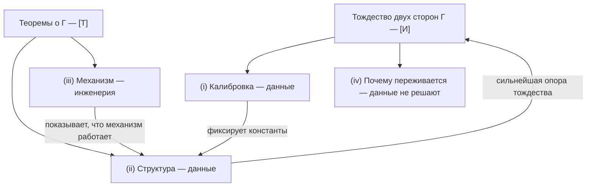

# Эмпирическая программа: четыре задачи

:::info Что это за раздел
Главы о сознании излагают, что УГМ доказывает о матрице когерентности $\Gamma$ и что она лишь интерпретирует. Этот раздел собирает в одном месте работу, которую доказательства сделать не могут: установить, какая когерентность отвечает какому качеству, проверить, что геометрия опыта — та самая, к которой обязалась теория, и построить системы, в которых механизм действительно работает. Новой доктрины здесь нет. Страницы сводят протоколы и критерии, разбросанные по корпусу, дают каждому утверждению статус его строки в реестре и помечают всякое новое предложение как программу исследований **[Пр]** или гипотезу **[Г]**.
:::

## Исходная позиция {#starting-point}

Позиция УГМ относительно опыта состоит из трёх частей, и статусы у них разные.

1. **Тождество.** $\Gamma$ — один объект с внешней стороной (физика) и внутренней стороной (опыт). Это онтологическая позиция, [двухаспектный монизм](/docs/consciousness/foundations/two-aspect-monism), со статусом **[И]**: он «**переформулирует** hard problem, а не решает его» ([эпистемический статус](/docs/consciousness/foundations/two-aspect-monism#следствие-трудная-проблема)).
2. **Математика.** То, что доказано о внутренней стороне, доказано как математика: у жизнеспособного диссипативного холона $\mathrm{Coh}_E > 1/7$ ([T-38a [Т]](/docs/applied/coherence-cybernetics/theorems#теорема-81-условная-необходимость-интериорности-no-zombie); отождествление «E = интериорность» — постулат [П], прочтение «зомби нет» — [И], строка реестра 38a); феноменальный функтор единствен при аксиомах ([единственность [Т]](/docs/consciousness/foundations/two-aspect-monism#теорема-единственность-фв)); качество фиксируется своими несходствами со всеми прочими точно, а конечным числом проб — с точностью до удвоенного радиуса покрытия ([обогащённая Йонеда для квалиа [Т]](/docs/proofs/categorical/categorical-formalism#enriched-yoneda) — конструкция Цучии, Филлипса и Сайго 2022 года, применённая к пространству качеств УГМ).
3. **Остаток.** Два вопроса оставлены открытыми намеренно. *Почему* эта структура переживается, не объяснено ([что УГМ не объясняет](/docs/consciousness/foundations/two-aspect-monism#что-угм-не-объясняет), пункт 1), и [T-214 [Т]](/docs/proofs/categorical/fundamental-closures#t-214) показывает, что мост от состояний к опыту не может быть внутренним морфизмом теории. *Какой* луч $[\lvert q\rangle]$ есть красный — «эмпирический вопрос, аналогичный определению массы электрона» (пункт 2; прежнее отождествление этого остатка с $G_2$-репером [отозвано](/docs/consciousness/foundations/two-aspect-monism#калибровка-как-g2-репер)).

Второй остаток — место, где кончаются доказательства и начинается измерение. Потому этот раздел и существует.

## Четыре задачи и что их решает {#four-tasks}

| Задача | Вопрос | Что её решает | Род свидетельства | Страница |
|---|---|---|---|---|
| **(i) Калибровка** | Какой узор когерентностей отвечает какому качеству и как субстрат отображается в $\Gamma$ | Данные: отчёты, различения, суждения о сходстве, психофизика, нейросигналы | Измерение от третьего лица против объявленной истины | [Калибровка](./calibration) |
| **(ii) Структура** | Та ли геометрия у пространства качеств, к которой обязывает $\Gamma$: семь осей, отношения Фано, окно $2/7 < P \leq 3/7$, суммы F-Band | Данные: структуры сходства, восстановленная $\Gamma$, их инварианты | Измерение от третьего лица отношений, а не отдельных качеств | [Структура](./structure) |
| **(iii) Механизм** | Можно ли построить систему, в которой действительно работают динамика $\Gamma$, регенерация и самомодель в окне, и появляются ли и исчезают вместе с ними предсказанные функциональные признаки | Инженерия когнитивной архитектуры с тестами абляции | Построение плюс проверки построенного от третьего лица | [Инженерия](./engineering) |
| **(iv) Трудная проблема** | Почему всё это вообще переживается | Ни данные, ни инженерия | Никакое невозможно: всякое данное — от третьего лица | Эта страница, [ниже](#hard-problem) |

### (i) Калибровка эмпирична {#task-calibration}

Математика фиксирует *форму* соответствия — функтор $F$ в лучи $\mathbb{P}(\mathcal{H}_E)$ с метрикой Фубини–Штуди, — но не его константы. Нужны две калибровки, и ни одна не выводится:

- **измерительная калибровка**: свободные параметры $\theta$ реконструкции $\pi_{\mathrm{bio}}$ (или отображения $G$ для искусственной системы), переводящей сигналы в $\hat\Gamma$ ([протокол измерения](/docs/applied/research/measurement-protocol#протокол-pi-bio));
- **феноменальная калибровка**: какой луч есть какое качество и монотонное отображение $f$ от воспринятого несходства к $d_{\mathrm{FS}}$, без которого [теорему обогащённой Йонеды](/docs/proofs/categorical/categorical-formalism#enriched-yoneda) нельзя проверить («для опровержения нужна калибровка $f$ воспринимаемого несходства в $d$, а она не зафиксирована»).

Обе решаются подгонкой на данных, где ответ известен независимо, и проверкой на данных, не входивших в подгонку. На этот счёт у корпуса одно жёсткое правило: [нет порога без эталона](/docs/applied/research/measurement-protocol#граница-валидации).

### (ii) Структура эмпирична, и это сильнейший канал {#task-structure}

Одно откалиброванное качество ничего не подтверждает: под одну точку можно подогнать любую теорию. **Отношение** между многими качествами — другое дело. УГМ заранее обязуется геометрией — комплексное проективное пространство с метрикой Фубини–Штуди для качества, семь осей и семь прямых Фано для $\Gamma$, окно и две полосы для живого состояния, — и эта обязанность запрещает определённые узоры (например, матрицы несходств, которые не реализует никакая конфигурация лучей). Теория, зафиксировавшая геометрию до данных, может данным проиграть. Поэтому структурный уровень — самая сильная эмпирическая опора, какую может получить тождество: доказать тождество [И] он не может, но структура, выдержавшая много случаев провалиться, и делает тождество достойным того, чтобы его держать. [Страница структуры](./structure) перечисляет каждый инвариант с его статусом и с тем, что его подтвердило бы или опровергло.

### (iii) Механизм — инженерная задача {#task-engineering}

Теория задаёт механизм: CPTP-динамика $\Gamma$, регенерация $\mathcal{R} = \kappa(\Gamma)(\varphi(\Gamma) - \Gamma)\,g_V$, читающая состояние через самомодель, жизнеспособность в окне. Можно ли этот механизм реализовать и что реализация делает, решается постройкой и проверкой — включая абляции, удаляющие самомодель, $E$-когерентности или прямую Фано, с проверкой, что предсказанные признаки уходят вместе с ними. Это программа [инженерной страницы](./engineering), связывающей главу корпуса об ИИ, [десять проверок in silico](/docs/consciousness/subjects/ai-consciousness#agi-инженерные-тесты) и [фазу I](/docs/applied/research/experimental-protocol#фаза-1) экспериментального протокола.

### (iv) Трудную проблему не решает ни то ни другое {#hard-problem}

Вопрос Чалмерса — почему физическая обработка вообще сопровождается опытом — не задача калибровки и не задача инженерии.

- **Не данными.** Всякое измерение — отчёт, различение, суждение о сходстве, запись ЭЭГ, восстановленная $\hat\Gamma$ — есть запись от третьего лица. Совершенная корреляция записей с $\Gamma$ оставляет открытым, почему коррелированная структура переживается. Внутри УГМ это заострено, а не оплакано: шумовой канал среды несёт ровно ноль информации о качестве, переносимом фазой ([T-302 [Т]](/docs/consciousness/phenomenology/qualia-structure#теорема-разрыв)), и никакой мост от состояний к опыту не является внутренним морфизмом ([T-214 [Т]](/docs/proofs/categorical/fundamental-closures#t-214)).
- **Не инженерией.** Система, прошедшая все функциональные проверки, показывает, что механизм работает. Переживается ли он — снова тождество, а не ещё один результат проверки.
- **Что с этим делает УГМ.** Она закрывает вопрос тождеством — внутренняя сторона $\Gamma$ *есть* опыт [И] — и прямо говорит, что это позиция, «граница между картой и территорией» ([двухаспектный монизм](/docs/consciousness/foundations/two-aspect-monism#граница-карты-и-территории)), а не вывод. Этот остаток не особенность УГМ [И]: всякая теория сознания кончается одним необъяснённым примитивом — психофизическим законом, тождеством, фундаментальным свойством, — и [сравнение аксиоматических выборов](/docs/consciousness/foundations/two-aspect-monism#сравнение-аксиоматических-выборов) показывает, что у УГМ он один, а не два или три.

Практическое следствие — разделение труда. Трудная проблема признаётся один раз, здесь, и не переспоривается на трёх других страницах; они имеют дело лишь с тем, что могут решить данные и инженерия.

## Чего раздел не утверждает {#non-claims}

- Он не сообщает **никаких данных**. Всякое собранное здесь предсказание не проверено, если страница-источник не говорит иного (см. [таблицу вердиктов страницы фальсифицируемости](/docs/reference/falsifiability#summary-table-of-predictions)).
- Он **не повышает** ни одного статуса. Впервые сделанные здесь предложения — [Пр] или [Г]; пройденный протокол подкрепил бы утверждение в его нынешнем статусе, проваленный — опроверг бы его в этом статусе.
- Он **не считывает** сознание с измерения в системах, где нет истины, — языковых моделях, грибных сетях, симулированных агентах, — по причине, названной в [теореме о подстановке](/docs/applied/research/measurement-protocol#substitution-position).
- Он **не возрождает** снятый числовой мост между индексом пертурбационной сложности и чистотой: «близость $\mathrm{PCI}^* = 0.31$ к $2/7 \approx 0.286$ — совпадение двух несвязанных шкал и доказательной силы не имеет» ([шаг 5](/docs/applied/research/measurement-protocol#pci-связь)); проверяемая форма — согласие вердиктов (P8.4, SUB-5).

## Источники, сведённые в разделе {#sources}

| Источник | Что из него взято |
|---|---|
| [Двухаспектный монизм](/docs/consciousness/foundations/two-aspect-monism) | Тождество [И], остатки, реляционная определённость, прецедент Цучии–Сайго |
| [Категориальный формализм §6.2.1](/docs/proofs/categorical/categorical-formalism#enriched-yoneda) | Обогащённая Йонеда для квалиа [Т]: изометрия, конечные пробы, число проб, реализуемость |
| [Структура квалиа](/docs/consciousness/phenomenology/qualia-structure) | 21 канал, 7 голономий, декодер T-301, выцветание, условия доступа |
| [Таксономия эмоций](/docs/consciousness/phenomenology/emotional-taxonomy) | Валентность и возбуждение из $dP/d\tau$ |
| [Фальсифицируемость](/docs/reference/falsifiability) | Предсказания 1–4, критерий опровержения, F-Gap, F-ISF, F-Neural, F-Band |
| [Протокол измерения](/docs/applied/research/measurement-protocol) | $\pi_{\mathrm{bio}}$, P8.1–P8.6, теорема о подстановке, SUB-1…SUB-6 |
| [Экспериментальный протокол](/docs/applied/research/experimental-protocol) | Четыре фазы, Γ-нативный агент, трёхуровневая фальсификация |
| [Предсказания КК](/docs/applied/coherence-cybernetics/predictions) | 23 предсказания, протоколы решения, уровни фальсификации |
| [Карта феноменологии](/docs/applied/research/phenomenology-map) | Опыт → наблюдаемая → проверка |
| [ИИ-сознание](/docs/consciousness/subjects/ai-consciousness) | Архитектурные требования, проверки E1–E10 |
| [Дорожная карта Консоли](/docs/applied/console/roadmap-validation) | Этапы валидации V0–V2 для инструмента самоотчёта и носимого датчика |

**Далее:** [Калибровка →](./calibration)
