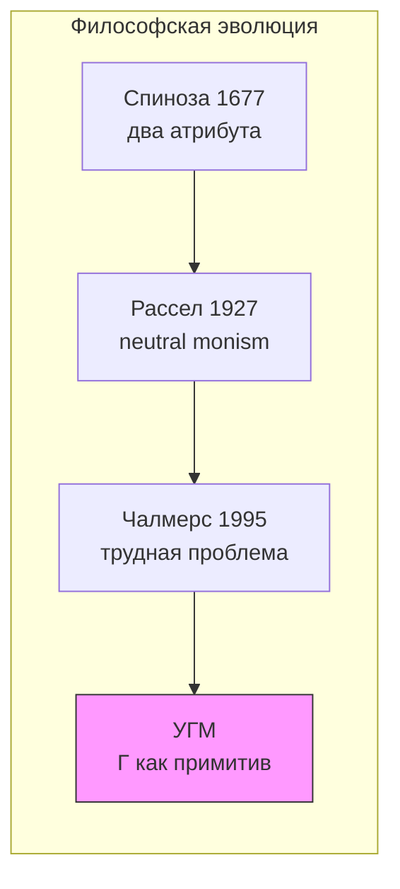
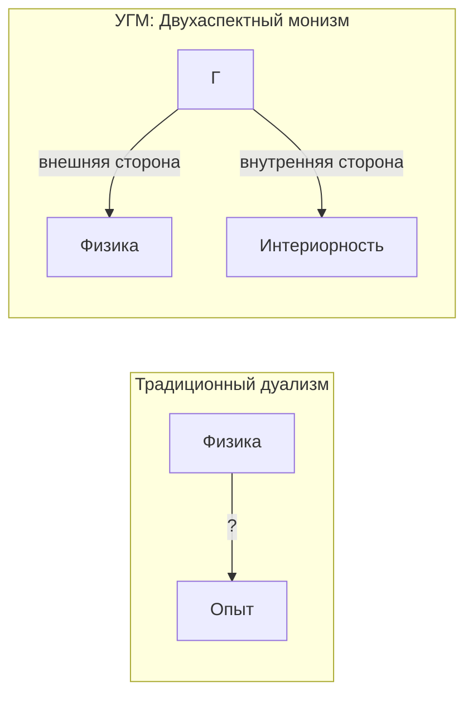
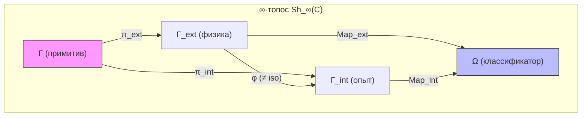

# Трудная Проблема Сознания

:::info Для кого эта глава
Вы узнаете, как УГМ решает «трудную проблему сознания» Чалмерса через двухаспектный монизм: матрица когерентности $\Gamma$ — единый онтологический примитив, чья внешняя сторона есть физика, а внутренняя — субъективный опыт. Глава закладывает философский фундамент всего раздела о сознании.
:::

## Три с половиной века неудач

В 1641 году Рене Декарт написал «Медитации о первой философии» и разделил мир надвое. С одной стороны — *res extensa*, протяжённая материя: камни, деревья, тела. С другой — *res cogitans*, мыслящая субстанция: мысли, ощущения, переживания. Это казалось ясным и элегантным. Но Декарт создал проблему, которую не смог решить: **как эти две субстанции взаимодействуют?** Как нематериальная мысль может двигать материальную руку?

Декарт предложил шишковидную железу как место контакта. Принцесса Елизавета Богемская тут же указала на абсурдность: нематериальное не может физически толкать материальное, независимо от анатомии.

С тех пор прошло 350 лет. Физика, биология, нейронаука совершили невероятный прогресс. Мы расщепили атом, расшифровали геном, картографировали нейронные сети мозга. Но вопрос Декарта остался открытым, лишь приняв более острую форму.

### Формулировка Чалмерса (1995)

В 1995 году австралийский философ Дэвид Чалмерс разделил проблемы сознания на «лёгкие» и «трудную»:

**Лёгкие проблемы** (они трудны технически, но понятно, *как* их решать):
- Как мозг обрабатывает информацию?
- Как мозг управляет поведением?
- Как мозг интегрирует данные от разных органов чувств?

**Трудная проблема:**

> «Почему физические процессы порождают субъективный опыт?»

Это вопрос о **категориальном разрыве** (explanatory gap) между объективным описанием и субъективным переживанием. Нейронаука может объяснить, какие нейроны возбуждаются, когда вы видите красный цвет. Но даже полное знание нейронной активности не объясняет, **почему** это возбуждение ощущается как красный, а не как синий, или почему оно вообще на что-то похоже.

**Аналогия.** Представьте, что вы читаете партитуру симфонии. Ноты на бумаге — объективное описание. Но когда оркестр играет, вы **слышите** музыку. Трудная проблема спрашивает: почему значки на бумаге порождают звучание? УГМ отвечает: партитура и музыка — не два разных объекта, а два способа взаимодействия с одним и тем же — звуковой структурой. Партитура — вид «снаружи» (для дирижёра), музыка — вид «изнутри» (для слушателя).

:::info Откуда мы пришли
Эта глава открывает раздел [Сознание](/docs/consciousness/overview). Мы уже знаем, что $\Gamma \in \mathcal{D}(\mathbb{C}^7)$ — онтологический примитив теории, что пять аксиом $\Omega^7$ задают структуру и динамику. Теперь мы задаём главный вопрос: **почему математическая структура переживается?**
:::

### Дорожная карта главы

1. **Формулировка проблемы** — что такое «трудная проблема» и почему она считалась неразрешимой
2. **Исторические предшественники** — от Спинозы через Рассела к Чалмерсу, и двухаспектные программы, высказавшие тезис этой главы раньше УГМ
3. **Двухаспектный монизм** — позиция УГМ: физика и опыт суть две стороны одного примитива $\Gamma$
4. **Категориальная формализация** — расщепление морфизмов, экспланаторный зазор, теорема о двухаспектности
5. **Единственность феноменального функтора** — почему структура опыта не может быть другой
6. **Реляционная идентичность квалиа** — лемма Йонеды и то, что она говорит и чего не говорит об инвертированных квалиа
7. **Границы объяснения** — что УГМ объясняет, а что честно признаёт необъяснимым

## Историческая генеалогия: кто пытался до нас

Двухаспектный монизм не возник из пустоты. У него — глубокая философская родословная.

### Спиноза (1677): два атрибута одной субстанции

Бенедикт Спиноза, младший современник Декарта, предложил радикальную альтернативу дуализму. В «Этике» он утверждал: существует только **одна субстанция** (Бог/Природа), которая имеет бесконечное число атрибутов, из которых нам известны два — **мышление** и **протяжённость**. Мысль и материя — не две разные вещи, а два *способа описания* одного и того же.

**Ключевая идея — E2P7:** *Ordo et connexio idearum idem est ac ordo et connexio rerum* — порядок и связь идей тождественны порядку и связи вещей (Этика II, Prop. 7). Это **точный прообраз** феноменального функтора $F: \mathbf{Phys} \to \mathbf{Phen}$, который в УГМ обеспечивает изоморфизм между физической и интериорной категориями. Спиноза провозгласил существование такого изоморфизма; УГМ строит его явно.

**Спиноза для УГМ:** В терминах УГМ, $\Gamma$ — это субстанция Спинозы. Два «атрибута» — это две **проекции**:

- $\mathrm{Map}_{\text{ext}}(\Gamma)$ — физический аспект (аналог атрибута протяжённости),
- $\mathrm{Map}_{\text{int}}(\Gamma)$ — интериорный аспект (аналог атрибута мышления).

E2P7 утверждает, что между ними существует структурное тождество. УГМ доказывает это как теорему: функтор $F$ сохраняет морфизмы между категориями.

**Conatus и Gap.** Спинозовский conatus — стремление каждой вещи пребывать в своём бытии (E3P6) — подразумевает, что система *никогда не завершает* самопознание: conatus бесконечен, полное самосовпадение означало бы прекращение стремления. В УГМ это точно соответствует теореме T-55 (Gap > 0, неполнота Лоувера): $\mathrm{Gap}(\Gamma, \varphi(\Gamma)) > 0$ — система не может полностью смоделировать саму себя. Conatus Спинозы **требует**, чтобы Gap был строго положительным; Gap > 0 **объясняет**, почему conatus никогда не иссякает.

**Почему Спиноза не смог формализовать.** Спиноза располагал только евклидовой геометрией как образцом строгости (отсюда *more geometrico* — «геометрическим способом»). Ему не хватало трёх инструментов: (1) **теории категорий** (Эйленберг — Мак-Лейн, 1945) для формализации функтора $F$, (2) **квантовой механики** (1925–) для описания $\Gamma$ как матрицы плотности, (3) **спектральных троек** (Конн, 1994) для вывода геометрии из алгебры. УГМ не «подтверждает» Спинозу — она предоставляет формализм, которого у него не было.

### Рассел (1927): neutral monism

Бертран Рассел в «Анализе материи» пришёл к выводу, что физика описывает лишь **структурные отношения** между событиями, но ничего не говорит об их **внутренней природе**. Он предположил, что внутренняя природа физических событий — это нечто, из чего состоит сознательный опыт.

**Нейтральный монизм Рассела:** Существует «нейтральный материал» (*neutral stuff*), который не является ни ментальным, ни физическим, но из которого и ментальное, и физическое конструируются.

**Рассел для УГМ:** Матрица $\Gamma$ — это именно «нейтральный материал» Рассела: из неё *выводятся* и физические законы (как предельный случай при $R \to 0$, см. [QM-редукция](/docs/physics/quantum-mechanics/qm-reduction)), и структура опыта (через спектральное разложение $\rho_E$).

### Чалмерс (1996): натуралистический дуализм

Чалмерс, сформулировав трудную проблему, предложил «натуралистический дуализм»: сознание — фундаментальное свойство, которое не сводится к физическому, но связано с ним посредством «психофизических законов». Однако он не смог объяснить, откуда берутся эти законы и почему они именно такие.

**Чалмерс для УГМ:** УГМ переформулирует проблему Чалмерса: нет никаких «психофизических законов» — есть единый объект $\Gamma$, который с одной стороны ведёт себя как физика, а с другой переживается как опыт. Не нужен мост между двумя берегами — есть одна река, текущая в обе стороны.

### Прецеденты и родственные программы: двухаспектный монизм после Рассела {#прецеденты-и-родственные-программы}

Три имени выше — не вся родословная. Между Расселом и УГМ по меньшей мере пять исследовательских программ держались тезиса этой главы — одна реальность с физической и переживаемой сторонами, — и две из них придали ему формальный вид. Это важно по простой причине: тезис, который уже высказывали, формализовали и критиковали, не составляет новизны УГМ, а обращённая к нему критика касается и УГМ, пока та на неё не ответит. Для каждой программы ниже указаны первоисточник, её содержание, её нынешний статус и чьё это суждение, соответствующий ей элемент УГМ и разница. Всякое сопоставление УГМ с внешней программой здесь — интерпретация **[И]**, а не теорема.

#### Паули и Юнг: дополнительные аспекты одной нейтральной реальности {#паули-юнг}

Физик Вольфганг Паули и психиатр Карл Густав Юнг считали, что психика и материя — дополнительные аспекты одной реальности, которая сама не является ни психической, ни физической, и что корреляции между ними не нуждаются в причинном мосте. Это и есть центральный ход этой главы — один примитив, две стороны, никаких психофизических законов, — высказанный примерно за семьдесят лет до УГМ.

- **Источник.** Переписка Паули и Юнга 1932–1958 годов и их совместная книга 1952 года в реконструкции Харальда Атманшпахера: Atmanspacher H., "Dual-aspect monism à la Pauli and Jung", *Journal of Consciousness Studies* 19(9–10): 96–120 (2012); формальный очерк: Atmanspacher H., "The Pauli–Jung conjecture and its relatives: a formally augmented outline", *Open Philosophy* 3: 527–549 (2020), doi:10.1515/opphil-2020-0138; развёрнутое изложение: Atmanspacher H., Rickles D., *Dual-Aspect Monism and the Deep Structure of Meaning* (Routledge, 2022).
- **Содержание.** Под различием психики и материи лежит психофизически нейтральная целостная область — юнговский *unus mundus*, «единый мир». Она небулева: высказывания о ней не подчиняются двузначной классической логике. Различение, проведённое в ней, — «эпистемический разрез», который Атманшпахер описывает и как нарушение симметрии, — даёт психическое и материальное как два аспекта. Аспекты дополнительны в смысле Нильса Бора: для полного описания нужны оба, но ни один контекст не даёт доступа к обоим сразу. Формулировка самого Паули (1952, в переводе Атманшпахера): «Было бы наиболее удовлетворительно, если бы физис и психею можно было мыслить как дополнительные аспекты одной и той же реальности». Корреляции психики и материи — следствие разреза, а не причинного взаимодействия; юнговская «синхронистичность» — имя для корреляций, связанных смыслом, а не причиной. Атманшпахер и Риклз (2022) делают смысл «глубинной структурой» нейтральной области и сравнивают варианты Паули и Юнга, Артура Эддингтона, Джона Уилера, а также Дэвида Бома и Бэзила Хайли.
- **Статус.** Действующая программа меньшинства, которую ведут главным образом Атманшпахер и его соавторы. Её главный сторонник указывает на эмпирическую поддержку со стороны документированных корреляций психики и материи (Стэнфордская философская энциклопедия, статья "Quantum Approaches to Consciousness", автор — Атманшпахер, редакция 2024 года) — это суждение сторонника. Независимые отзывы расходятся: обзорное эссе Родерика Мейна (*Journal of Analytical Psychology* 68(3): 534–547, 2023) излагает и проясняет аргумент книги; эссе-рецензия Эдварда Ф. Келли (Essentia Foundation, 2023) возражает, что «само разложение нигде не объяснено так, чтобы в этом был смысл», и что взгляд заменяет одну трудную проблему двумя. Сам Атманшпахер (2012) помещает постулированную Паули закономерность, основанную на смысле, «целиком вне естественных наук его времени, да, в общем, и нашего».
- **Параллель в УГМ [И].** $\Gamma$ играет роль *unus mundus*; [расщепление пространства морфизмов](#теорема-расщепление) — расслоение с базой $\mathrm{Map}_{\text{ext}}$ и слоем $\mathrm{Map}_{\text{int}}$ — роль эпистемического разреза; [нетривиальность зазора](#теорема-нетривиальность) и [необратимое соответствие](#теорема-двухаспектность) $\varphi$ — роль дополнительности: ни один аспект не определяет другой.
- **Честная разница.** *Прецедент.* Единое нейтральное целое, чьё расщепление даёт два дополнительных аспекта, связанных корреляцией без причинных законов-мостов, — идея Паули и Юнга; её формальная разработка принадлежит Атманшпахеру (2020) и Атманшпахеру с Риклзом (2022). Поэтому УГМ не может претендовать на звание первого двухаспектного монизма с формальным аппаратом. *Различие по существу.* В УГМ разрез — фиксированный тензорный сомножитель фиксированного примитива: измерение $E$ против остальных шести; у Паули и Юнга аспекты зависят от эпистемического контекста. По разграничению самого Атманшпахера (2012, §1.1: у нейтральных монистов различие психики и материи «предобразовано в нейтральной области», у двухаспектных монистов его проводит контекст) УГМ стоит ближе к нейтральному монизму, чем к Паули и Юнгу [И]. *Что добавляет УГМ.* Конкретный носитель: разрез вычисляется (частичный след по $E$), а нетривиальность зазора — теорема этой страницы [Т]; у Паули и Юнга модели нейтральной области не было: «лучше, чем чистой спекуляцией, мы не знаем, какие симметрии следует приписать unus mundus» (Атманшпахер 2012). *Что остаётся.* Возражение Келли касается УГМ без изменений: почему переживается именно сомножитель $E$ — это ровно тот примитив, который глава оставляет без объяснения, а [T-214 [Т]](/docs/proofs/categorical/fundamental-closures#t-214) показывает, что этот мост нельзя интернализовать. Аналога смысла или синхронистичности в УГМ нет.

#### Бом: активная информация и два полюса на каждом уровне {#бом-активная-информация}

Физик Дэвид Бом предположил, что у каждого уровня природы есть психический и физический полюс и что соединяет их не толкающая сила, а действующая информация. Для УГМ это ближайший прецедент сразу двух утверждений: интериорность универсальна, но градуирована по уровням, и внутренняя сторона совершает причинную работу.

- **Источник.** Bohm D., "A new theory of the relationship of mind and matter", *Philosophical Psychology* 3(2–3): 271–286 (1990), doi:10.1080/09515089008573004; развитие у Бэзила Хайли и Пааво Пюлккянена (Pylkkänen P., *Mind, Matter and the Implicate Order*, Springer, 2007).
- **Содержание.** В причинной интерпретации квантовой теории (де Бройля — Бома) электрон — неразрывное единство частицы и поля. Поле действует своей формой, а не интенсивностью, и потому несёт «объективную и активную информацию», причём действие этой информации напоминает то, как действует информация в нашем собственном опыте. На этой аналогии Бом строит теорию, в которой основное отношение психики и материи — «участие, а не взаимодействие». «На каждом уровне тонкости будет „ментальный полюс“ и „физический полюс“ … Но более глубокая реальность — нечто по ту сторону и психики, и материи» (Бом 1990, цитата по Атманшпахеру 2012).
- **Статус.** Интерпретационная программа, которую поддерживает небольшая школа (Хайли, Пюлккянен). Статья Стэнфордской энциклопедии о квантовых подходах (Атманшпахер, редакция 2024 года) формулирует главное понятийное возражение: использование понятий, основанных на информации, в неэпистемическом смысле «выглядит непоследовательным или по меньшей мере запутывающим», если имеется в виду обычное (синтаксическое) значение информации шенноновского типа.
- **Параллель в УГМ [И].** Универсальный L0 вместе с градуированной иерархией L1–L4 соответствует полюсам «на каждом уровне тонкости»; $E$-сектор, входящий в регенерацию, $\kappa = \kappa_{\text{bootstrap}} + \kappa_0 \cdot \mathrm{Coh}_E$, соответствует действующей информации.
- **Честная разница.** *Прецедент.* Градуированный двухполюсный монизм, в котором психический полюс причинно действен через информацию, принадлежит Бому (1990). *Что добавляет УГМ.* В пределах собственной динамики УГМ доказывает то, чего у Бома нет: у жизнеспособной системы с ненулевой диссипацией E-когерентность ограничена снизу — математическое ядро теоремы No-Zombie, [T-38a [Т]](/docs/applied/coherence-cybernetics/theorems#теорема-81-условная-необходимость-интериорности-no-zombie); её прочтение «зомби невозможны» реестр помечает [И]. Динамика УГМ — эволюция открытой системы (линдбладовская), а не уравнение ведения, а её уровни — пороги на инварианты $\Gamma$. *В чём УГМ слабее.* Информация Бома встроена в явный физический механизм; отождествление $E$-сектора с интериорностью в УГМ — постулат, и [T-214 [Т]](/docs/proofs/categorical/fundamental-closures#t-214) показывает, что он обязан оставаться внешним. Возражение энциклопедии против «активной информации» — информация в неэпистемическом смысле — в той же мере относится к тому, чтобы называть $\mathrm{Coh}_E$ «внутренним».

#### Велманс: рефлексивный монизм {#велманс-рефлексивный-монизм}

Психолог Макс Велманс считает, что одна психофизическая реальность является внешнему наблюдателю как активность мозга, а субъекту — как переживание, и что ни одна из этих точек зрения не сводится к другой. Девиз этой главы — физика снаружи, опыт изнутри — это онтологический монизм Велманса при эпистемологическом дуализме.

- **Источник.** Velmans M., *Understanding Consciousness*, 2nd ed. (Routledge, 2009; 1-е изд. 2000); Velmans M., "Reflexive monism", *Journal of Consciousness Studies* 15(2): 5–50 (2008); Velmans M., "Reflexive monism: psychophysical relations among mind, matter and consciousness", в кн.: Velmans M., *Towards a Deeper Understanding of Consciousness* (Routledge, 2016), pp. 87–106.
- **Содержание.** (i) Монизм в онтологии, дуализм в эпистемологии: перспективы первого и третьего лица на одну и ту же реальность дополнительны и взаимно несводимы — «психологическая дополнительность» Велманса. (ii) Перцептивная проекция: воспринимаемый мир переживается там, снаружи, примерно там, где он кажется, а не внутри головы. (iii) Рефлексивность: проявленные формы возникают из более широкой вселенной, которая их поддерживает, и отражают её природу (книга 2009 года завершается главой "Self-Consciousness in a Reflexive Universe"). (iv) Наука об опыте, соединяющая субъективные, интерсубъективные и объективные методы.
- **Статус.** Известная позиция меньшинства в исследованиях сознания. Атманшпахер (2012) признаёт за ней введение дополнительности двух аспектов «впервые в подходе, основанном на психологии». Главная критика принадлежит Хансу-Ульриху Хохе (*Phenomenology and the Cognitive Sciences* 6(3): 389–409, 2007): последовательно понятая дополнительность не оставляет места ни онтологическому монизму Велманса, ни какому-либо двухаспектному прочтению; Велманс ответил в том же номере (6(3): 411–423). Сочувственная рецензия (Роберт К. Бешара, *Language and Psychoanalysis* 10(2): 63–67, 2021) отмечает, что модель описывает перцептивную проекцию — «эмпирически наблюдаемый эффект», — а не объясняет её.
- **Параллель в УГМ [И].** Ключевой тезис шага 2 ниже — две стороны одного $\Gamma$ — соответствует (i); [самореферентная замкнутость](#самореферентная-замкнутость) и [T-221 [Т]](/docs/proofs/categorical/fundamental-closures#t-221), где наблюдатели — внутренние сечения одного мира, соответствуют (iii); утверждение в конце главы, что исследование внутренних ландшафтов — «легитимная форма познания», соответствует (iv).
- **Честная разница.** *Прецедент.* Двухперспективная формулировка монизма и статус исследования от первого лица как знания о той же реальности принадлежат Велмансу (с 1991 года, по Атманшпахеру 2012). *Что добавляет УГМ.* Формальный объект и динамику; у Велманса нет ни того, ни другого. *О чём УГМ молчит.* У перцептивной проекции — центрального эмпирического тезиса Велманса — нет аналога: ничто в $\Gamma$ не говорит, где расположено переживание. *Что остаётся.* Возражение Хохе относится и к УГМ: если два описания строго дополнительны, переход к одному лежащему в их основе объекту — метафизическая добавка; в УГМ это примитив [Аксиомы Ω⁷](/docs/core/foundations/axiom-omega), а не результат.

#### Чалмерс: двухаспектная теория информации {#чалмерс-двуаспектная-информация}

Чалмерс из раздела выше был не только дуалистом: в те же годы он предложил в качестве кандидата в психофизические законы, что у самой информации есть физический и феноменальный аспекты. Поэтому ответ ему выше — «есть единый объект $\Gamma$, который с одной стороны ведёт себя как физика, а с другой переживается как опыт» — повторяет его собственное умозрительное предложение, а не расходится с ним.

- **Источник.** Chalmers D. J., "Facing up to the problem of consciousness", *Journal of Consciousness Studies* 2(3): 200–219 (1995); Chalmers D. J., *The Conscious Mind* (Oxford University Press, 1996), гл. 8 "Consciousness and Information: Some Speculation".
- **Содержание.** «Информация (или по крайней мере часть информации) имеет два основных аспекта — физический и феноменальный»; «опыт возникает благодаря своему статусу одного из аспектов информации, когда другой аспект оказывается воплощён в физической обработке» (1995). Два сопутствующих принципа: *структурная когерентность* — структура сознания отражает структуру осведомлённости (awareness), то есть того, что представлено когнитивно; и *организационная инвариантность* — любые две системы с одинаковой тонкой функциональной организацией обладают качественно тождественным опытом (1996, гл. 7; защищается аргументами о «блекнущих» и «пляшущих» квалиа). Чалмерс спрашивает и о повсеместности опыта: «быть может, термостат, максимально простая структура обработки информации, мог бы иметь максимально простой опыт?»
- **Статус.** По оценке самого автора, «принцип двух аспектов крайне умозрителен и к тому же недоопределён, оставляя ряд ключевых вопросов без ответа» (1995). Позднее Чалмерс переформулировал вопрос как расселианский монизм (следующий пункт) и пишет, что делит свою уверенность «примерно поровну» между субстанциальным дуализмом и расселианским монизмом (Chalmers D. J., "Panpsychism and panprotopsychism", Amherst Lecture 2013; в кн.: Brüntrup G., Jaskolla L. (eds.), *Panpsychism: Contemporary Perspectives*, Oxford University Press, 2016, pp. 19–47).
- **Параллель в УГМ [И].** $\Gamma$ с внешней и внутренней сторонами соответствует двухаспектной информации; [единственность феноменального функтора](#теорема-единственность-фв) — форма $E$-среза вынуждена — соответствует структурной когерентности; субстратно-независимый критерий [T-153 [О]](/docs/proofs/consciousness/substrate-closure#t-153) соответствует организационной инвариантности; [иерархия интериорности](/docs/consciousness/hierarchy/interiority-hierarchy), помещающая термостат на L1, отвечает на вопрос Чалмерса о повсеместности градацией.
- **Честная разница.** *Прецедент.* Двухаспектная информация и организационная инвариантность (1995–1996) предшествуют двухаспектному тезису этой главы и субстратной независимости T-153. *Что добавляет УГМ.* Конкретное информационное пространство $\mathcal{D}(\mathbb{C}^7)$; явные пороги окна L2; доказанную на этой странице теорему единственности для формы $E$-среза [Т]. *Что остаётся.* Реестр относит «тогда и только тогда» теоремы T-153 к определениям [О], так что организационная инвариантность в УГМ не выведена, а принята по определению; отождествление же внутренней стороны с опытом постулируется в обеих теориях — [T-214 [Т]](/docs/proofs/categorical/fundamental-closures#t-214) превращает это в метатеорему, что согласуется с мнением Чалмерса: психофизические принципы фундаментальны, а не выводимы.

#### Расселианский монизм как исследовательское поле {#расселианский-монизм-поле}

Замечание Рассела, приведённое выше, после 2010 года стало исследовательским полем с точным определением, стандартным перечнем возражений и коллективным томом. Здесь это важно потому, что корпус называет расселианский монизм ближайшей к себе позицией, а по определению самого поля УГМ им не является.

- **Источник.** Alter T., Nagasawa Y. (eds.), *Consciousness in the Physical World: Perspectives on Russellian Monism* (Oxford University Press, 2015); статья Стэнфордской энциклопедии "Russellian Monism" (Alter T., Pereboom D., 2019, редакция 2023).
- **Содержание.** Три тезиса (по энциклопедии): *структурализм относительно физики* — «физика описывает мир лишь в терминах его пространственно-временной структуры и динамики»; *реализм относительно чтойностей* — существуют свойства, лежащие под этой структурой, которых физика не описывает (чтойность, quiddity, — то, что играет физическую роль, например свойство, играющее роль массы); *чтойностный взгляд на сознание* — «чтойности имеют отношение к сознанию». Если чтойности сами феноменальны, получается расселианский панпсихизм; если они не феноменальны, но в совокупности конституируют феноменальное, — расселианский панпротопсихизм.
- **Возражения.** Проблема комбинации: «по-видимому, возможно, что эти (или любые) чтойности микроуровня реализованы без того, чтобы кто-либо имел этот (или вообще какой-либо) опыт» (энциклопедия). Ментальная причинность: Роберт Хауэлл (Howell R. J., "The Russellian monist's problems with mental causation", *Philosophical Quarterly* 65(258): 22–39, 2015) доказывает, что взгляд обеспечивает в лучшем случае причинную релевантность феноменальных свойств, но не релевантность в силу того, что они феноменальны. Аргумент структурного несоответствия (см. [страницу о панпсихизме](/docs/consciousness/comparative/panpsychism-analysis#проблема-комбинации-точно)). Спорная граница между структурными и неструктурными свойствами (энциклопедия).
- **Статус.** Воспринимается всерьёз и остаётся нерешённым. Вердикт Чалмерса: «Если бы нам удалось найти разумное решение проблемы комбинации для любого из двух [вариантов], этот взгляд сразу стал бы самым многообещающим решением проблемы сознания и тела» (2013/2016, см. выше).
- **Параллель в УГМ [И].** Внешняя сторона (гамильтониан, операторы Линдблада) против структуры; $E$-проекция против чтойности — сопоставление, уже проведённое на [странице о панпсихизме](/docs/consciousness/comparative/panpsychism-analysis#расселианский) и на [странице теорий](/docs/consciousness/comparative/consciousness-theories#russellian).
- **Честная разница.** Сопоставление ломается на определяющем тезисе. В УГМ внутренняя сторона $\rho_E$ сама описана структурно — матрица плотности со спектром и геометрией Фубини — Штуди, — а [теорема Йонеды](#теорема-реляционная-определённость) ниже делает качество тождественным его реляционной позиции (теорема в $\mathbf{Exp}$ [Т]; как утверждение о квалиа — [И]). Расселианская чтойность по определению есть то, что структура упускает. Значит, УГМ отрицает реализм относительно чтойностей для опыта: это структурализм относительно опыта, а не расселианский монизм [И]. Два следствия: УГМ не может заимствовать расселианское объяснение того, почему физика молчит о сознании (эту уступку уже делает страница теорий), и проблема комбинации приходит к УГМ в структурной форме — разбор с источниками дан на [странице о панпсихизме](/docs/consciousness/comparative/panpsychism-analysis#прецеденты-и-родственные-программы).

#### Теория категорий для опыта: Цучия и Сайго {#цучия-сайго}

Два математических хода этой главы — функтор от физической структуры к опыту и лемма Йонеды как критерий, отождествляющий переживания по их отношениям с точностью до изоморфизма, — опубликованы раньше УГМ нейроучёным Наоцугу Цучией и математиком Хаято Сайго.

- **Источник.** Tsuchiya N., Taguchi S., Saigo H., "Using category theory to assess the relationship between consciousness and integrated information theory", *Neuroscience Research* 107: 1–7 (2016), doi:10.1016/j.neures.2015.12.007; Tsuchiya N., Saigo H., "Applying Yoneda's lemma to consciousness research: categories of level and contents of consciousness", препринт OSF (27 апреля 2020 года), doi:10.31219/osf.io/68nhy, опубликован как "A relational approach to consciousness: categories of level and contents of consciousness", *Neuroscience of Consciousness* 2021(2): niab034, doi:10.1093/nc/niab034; Tsuchiya N., Phillips S., Saigo H., "Enriched category as a model of qualia structure based on similarity judgements", *Consciousness and Cognition* 101: 103319 (2022), doi:10.1016/j.concog.2022.103319.
- **Содержание.** Статья 2016 года предлагает проверять теорию сознания вопросом, существует ли функтор между категорией переживаний и категорией физических структур теории (там — максимально несводимых концептуальных структур теории интегрированной информации). Препринт 2020 года и статья 2021 года отождествляют сознательные состояния по их отношениям ко всем остальным состояниям и вводят лемму Йонеды как формальное основание этого критерия; статья 2022 года заменяет множества стрелок измеренными несходствами, так что качество характеризуется своими несходствами со всеми остальными с точностью до обогащённого изоморфизма.
- **Статус.** Программа в развитии: статья 2021 года предлагает категории уровня и содержания сознания и пути к эмпирической проверке.
- **Параллель в УГМ.** Феноменальный функтор $F$ и [реляционная определённость квалиа](#теорема-реляционная-определённость).
- **Честная разница.** *Прецедент* для обоих ходов. Версии УГМ конкретны: $\mathbf{Exp}$ построена на $\mathcal{D}(\mathbb{C}^7)$ с метрикой Фубини — Штуди. Обе разделяют посылку, что у качества нет характера помимо его отношений, — посылку, которую защитник инвертированных квалиа отрицает и которую лемма Йонеды установить не может; глава сама говорит об этом («граница математизации»).

#### Что сравнение меняет в утверждениях главы {#итог-прецедентов}

| Утверждение главы | Кем высказано раньше | После сравнения | Что остаётся собственным у УГМ |
|---|---|---|---|
| Один примитив, две стороны, никаких психофизических законов-мостов | Паули и Юнг (1950-е); Чалмерс (1995–1996); Велманс (с 1991) | Не ново | Носитель $\Gamma \in \mathcal{D}(\mathbb{C}^7)$ и вычисляемый разрез (частичный след по $E$) |
| Формальная трактовка двухаспектного монизма | Атманшпахер (2020); Атманшпахер и Риклз (2022) | Не первая | Теоремы этой страницы: расщепление [Т], нетривиальный зазор [Т] |
| Универсальная, но градуированная интериорность с действующей внутренней стороной | Бом (1990) | Не ново | T-38a [Т] как математика; её прочтение «зомби невозможны» [И] |
| Субстратная независимость опыта | Чалмерс (1995–1996): организационная инвариантность | Не ново | Явный четырёхусловный критерий — определение, T-153 [О] |
| Функтор к опыту; характеристика качеств по Йонеде | Цучия, Тагути и Сайго (2016); Цучия и Сайго (препринт 2020; 2021); Цучия, Филлипс и Сайго (2022) | Не ново | Версия Фубини — Штуди на $\mathbb{P}(\mathcal{H}_E)$ |

:::warning Что меняет сравнение [И]
Родословную не следует читать как «УГМ завершает своих предшественников». Собственное у УГМ — конкретный носитель и доказанные о нём теоремы. Тезис, которому эти теоремы служат, — одна реальность, две дополнительные стороны, корреляция без причинного моста — принадлежит Паули и Юнгу, Бому, Велмансу и Чалмерсу, и им же принадлежат его устойчивые возражения: нейтральный уровень и его расщепление нигде не объяснены (Келли 2023), строгая дополнительность не оставляет места лежащему в основе объекту (Хохе 2007), а отождествление внутренней стороны с опытом — постулат; для УГМ это явно фиксирует [T-214 [Т]](/docs/proofs/categorical/fundamental-closures#t-214).
:::

## Позиция УГМ: Двухаспектный монизм

В УГМ проблема **переформулируется**, а не «решается» в традиционном смысле. Рассмотрим это шаг за шагом.

### Шаг 1: Γ как онтологический примитив

В каждой фундаментальной теории есть объект, который не объясняется, а постулируется:
- В квантовой механике это волновая функция $\psi$
- В ОТО — метрический тензор $g_{\mu\nu}$
- В Стандартной модели — калибровочные поля

В УГМ такой примитив — **матрица когерентности $\Gamma \in \mathcal{D}(\mathbb{C}^7)$**. Это $7 \times 7$ эрмитова матрица плотности: положительно полуопределённая, с единичным следом, живущая в семимерном пространстве с измерениями A, S, D, L, E, O, U.

### Шаг 2: Два аспекта — не два объекта

Ключевая идея: $\Gamma$ не «порождает» опыт и не «сопровождается» им. $\Gamma$ **имеет** физический и интериорный аспекты как неотъемлемые грани:

- С **внешней стороны** $\Gamma$ выглядит как «физика» (структура, динамика, взаимодействия)
- С **внутренней стороны** $\Gamma$ переживается как «опыт» (интериорность L0 для всех систем; когнитивные квалиа L2 — доступ при $R \geq 1/3$ [Т] и $\Phi \geq 1$ [Т] (T-129), с жизнеспособностью $D_{\text{diff}} \geq 2$ [Т] (T-151) отдельным условием)

:::info Ключевой тезис
Нет «физических процессов» отдельно от «субъективного опыта». Есть только $\Gamma$, который:
- С **внешней стороны** выглядит как «физика» (структура, динамика)
- С **внутренней стороны** переживается как «опыт» (интериорность L0 для всех систем; когнитивные квалиа L2 — доступ при $R \geq 1/3$ [Т] и $\Phi \geq 1$ [Т] (T-129), с жизнеспособностью $D_{\text{diff}} \geq 2$ [Т] (T-151) отдельным условием)
:::

Спрашивать «почему физика порождает опыт?» — всё равно что спрашивать «почему лицевая сторона монеты порождает обратную?». Они не порождают друг друга — они **суть одно**.

### Шаг 3: Не квантовая матрица, а онтологический примитив

:::info Онтологический статус Γ
$\Gamma$ — **не** квантовая матрица плотности, описывающая физическую систему. $\Gamma$ — **онтологический примитив**: объект категории $\mathcal{C}$ в ∞-топосе $\mathbf{Sh}_\infty(\mathcal{C})$. Формализм $\mathcal{D}(\mathbb{C}^7)$ используется потому, что:

1. Он автоматически обеспечивает CPTP-динамику (Аксиома 2)
2. Квантовая механика выводится как предел при $R \to 0$ ([QM-редукция](/docs/physics/quantum-mechanics/qm-reduction))
3. Классическая механика — дальнейший предел при декогеренции

Вопрос «квантовая ли $\Gamma$?» **некорректен** в рамках УГМ: $\Gamma$ первична, а квантовая и классическая физики — её пределы. Возражение о декогеренции («при 37°C квантовая когерентность невозможна») не применимо к УГМ — оно предполагает, что $\Gamma$ описывает *физическую* квантовую систему. Но $\Gamma$ не описывает физику — из неё физика *выводится* как частный случай.
:::

## Категориальная Формализация Двухаспектного Монизма {#категориальная-формализация}

Интуиция «двух сторон одной монеты» красива, но недостаточна для науки. Нам нужна точная математическая формулировка. УГМ предоставляет её на языке теории категорий — ветви математики, изучающей структуры и отношения между ними.

:::tip Статус: **[И]** Интерпретация на основе формализма
Двухаспектный монизм получает **категориальную формулировку** в терминах ∞-топоса $\mathbf{Sh}_\infty(\mathcal{C})$. Формализация опирается на ПИР **[О]** (T16) — тождество бытия и опыта встроено в A1+A2 (различимость по $J_{\text{Bures}}$-покрытиям тождественна онтологической различимости).

**Разграничение статусов:** Формальные результаты (расщепление отображения, лемма Йонеды, единственность FV, самореферентная замкнутость) — **[Т]**. Их интерпретация как двухаспектного монизма (отождествление $\mathrm{Map}_{\mathrm{ext}}$ с «физикой» и $\mathrm{Map}_{\mathrm{int}}$ с «опытом») — **[И]**.

**Статус T-186 (исправлено 2026-09-25):** [теорема когезивного замыкания](/docs/proofs/categorical/cohesive-closure) утверждает, что феноменальный функтор $F$ естественно изоморфен инфинитезимальной плоской модальности $\&$: $F \cong \&|_{\mathcal{D}}$, а фильтрация Постникова $\&(\Gamma)$ соответствует L0–L4. Эта часть, T-186(a), — гипотеза [Г]: она опирается на предполагаемую когезивность из T-185 и утверждается без построения, так что феноменальное отождествление остаётся **[И]**. ~~«Это повышает статус феноменального отождествления из [И] в [Т] — оно структурно необходимо из когезивного сопряжения».~~ Отозвано [✗] вместе с понижением T-186 в реестре.

**Ответ на объективистское no-go ([T-221](/docs/proofs/categorical/fundamental-closures#t-221), исправлено 2026-09-25).** Двухаспектный монизм, прочитанный на внутреннем языке топоса, — это **реляционизм**: перволичные факты каждого субъекта выполнены относительно его собственной стадии $y(\Gamma)$, факты двух субъектов не совозможны, и потому для них NR не выполняется — это реляционистский маршрут DeBrota–List (2026), первый рог квадрилеммы List (2025), куда List помещает и двухаспектные монизмы. УГМ добавляет внутри этого маршрута внутренний параметр релятивизации; чего она не даёт — это факта «я — *этот* субъект», который есть выбор точки топоса (T-221(d)). ~~«Четвёртый не-объективистский вариант … $\&$-модальность T-186 делает перволичный реализм теоремой»~~ отозвано [✗]. См. [Теории сознания §Мета-уровень](/docs/consciousness/comparative/consciousness-theories#no-go-objectivism).
:::

### Что такое морфизмы и зачем они нужны

Прежде чем перейти к теореме, объясним ключевое понятие. В теории категорий **морфизм** — это отображение, стрелка от одного объекта к другому. Морфизмы от $\Gamma$ к **классификатору** $\Omega$ (специальный объект в ∞-топосе, своего рода «пространство всех предикатов») описывают все возможные **свойства** системы $\Gamma$.

Представьте, что $\Omega$ — это анкета с бесконечным числом вопросов о системе. Каждый морфизм $\Gamma \to \Omega$ — это ответ на один вопрос. Некоторые вопросы касаются физической структуры («какова динамика?»), другие — внутреннего содержания («каково это — быть системой $\Gamma$?»). Теорема о расщеплении утверждает, что эти два типа вопросов можно формально разделить.

### Теорема о расщеплении пространства морфизмов {#теорема-расщепление}

:::tip Теорема (Расщепление Map) [Т]
В ∞-топосе $\mathbf{Sh}_\infty(\mathcal{C})$ для любого Γ ∈ $\mathrm{Ob}(\mathcal{C})$ пространство морфизмов в классификатор Ω **расщепляется**:

$$
\text{Map}(\Gamma, \Omega) \twoheadrightarrow \text{Map}_{\text{ext}}(\Gamma, \Omega), \quad \text{слой: } \text{Map}_{\text{int}}(\Gamma, \Omega)
$$

(Строгая формулировка — расслоение Серра, см. ниже; прямая сумма $\oplus$ — эвристическое упрощение, справедливое при тривиализации расслоения.)
:::

где:
- $\text{Map}_{\text{ext}}$ — **«физические» морфизмы** (структура, динамика) — соответствуют внешнему описанию
- $\text{Map}_{\text{int}}$ — **«интериорные» морфизмы** (E-измерение, интериорность) — соответствуют внутреннему аспекту (при L2+: субъективному переживанию)

**Что это означает на пальцах:** Все свойства любой системы $\Gamma$ разделяются на два класса — «внешние» (наблюдаемые извне) и «внутренние» (связанные с измерением $E$, интериорностью). Между этими классами нет пересечения ($\mathrm{Map}_{\text{ext}} \cap \mathrm{Map}_{\text{int}} = \{0\}$), но вместе они исчерпывают все свойства.

**Доказательство:**

**(a)** Классификатор Ω в ∞-топосе имеет градуировку по стратам:

$$
\Omega = \bigsqcup_{\alpha} \Omega_\alpha
$$

**(b)** Морфизмы $\Gamma \to \Omega$ разделяются на два класса:
- $\text{Map}_{\text{ext}}$: факторизуются через объективно наблюдаемые структуры
- $\text{Map}_{\text{int}}$: требуют доступа к E-измерению (интериорные предикаты)

**(c)** Прямая сумма следует из ортогональности: $\text{Map}_{\text{ext}} \cap \text{Map}_{\text{int}} = \{0\}$ ∎

:::warning Строгая формулировка: расслоение Серра
Разложение следует понимать как **расслоение Серра** ∞-группоидов:

$$
\mathcal{F}_{\text{int}}(\Gamma) \hookrightarrow \text{Map}(\Gamma, \Omega) \twoheadrightarrow \mathcal{B}_{\text{ext}}(\Gamma)
$$

где:
- **База** $\mathcal{B}_{\text{ext}}(\Gamma) := \text{Map}(\Gamma_{\text{phys}}, \Omega)$ — внешние предикаты ($\Gamma_{\text{phys}} := \Gamma|_{\{A,S,D,L,O,U\}}$)
- **Слой** $\mathcal{F}_{\text{int}}(\Gamma) := \text{Map}(\rho_E, \Omega_E)$ — интериорные предикаты

Расслоение порождается проекцией $\pi_{\bar{E}}: \Gamma \to \Gamma_{\text{phys}}$ и является расслоением Серра по свойствам ∞-топосов (HTT 6.1.3.9).
:::

### Определение экспланаторного зазора {#определение-зазора}

Теперь можно дать точное определение «разрыву» между физикой и опытом.

**Определение (Экспланаторный зазор):**

$$
\text{Gap} := \text{Nat}(F_{\text{ext}}, F_{\text{int}})
$$

— пространство естественных преобразований между функторами:
- $F_{\text{ext}}: \mathcal{C} \to \mathbf{Set}$ — функтор «внешних» (физических) свойств
- $F_{\text{int}}: \mathcal{C} \to \mathbf{Set}$ — функтор «внутренних» (интериорных) свойств

**Интерпретация простым языком:** Gap — мера «расстояния» между тем, что можно узнать о системе извне, и тем, что система переживает изнутри. Если Gap = 0, то внешнее описание полностью определяет внутреннее — это позиция физикализма. Но теорема ниже показывает, что Gap всегда ненулевой.

### Теорема о нетривиальности зазора {#теорема-нетривиальность}

:::tip Теорема (Нетривиальность Gap) [Т]
Для Γ с $P > P_{\text{crit}}$:

$$
\dim(\text{Gap}) \geq 1
$$
:::

**Доказательство (конструктивное):**

**(a)** При $P > P_{\text{crit}}$ система имеет нетривиальное E-измерение: $\gamma_{EE} > 0$, следовательно $\rho_E$ имеет ненулевой спектр.

**(b)** Слой расслоения $\mathcal{F}_{\text{int}}(\Gamma) = \text{Map}(\rho_E, \Omega_E)$ — пространство предикатов на $\rho_E$.

**(c)** При $\gamma_{EE} > 0$ существуют как минимум два нетривиальных предиката:
- $\chi_1$: «$\lambda_{\max}(\rho_E) > 1/2$» (доминирующее качество)
- $\chi_2$: «$\lambda_{\max}(\rho_E) \leq 1/2$» (равномерное распределение)

Эти предикаты определяют **различные** точки в $\text{Map}(\rho_E, \Omega_E)$, лежащие в **разных** связных компонентах (поскольку $\chi_1 \wedge \chi_2 = \bot$).

**(d)** Следовательно, $\pi_0(\mathcal{F}_{\text{int}}) \geq 2$, и $\dim(\text{Gap}) \geq 1$. ∎

**Интерпретация:** Категориальный разрыв — **структурная особенность** ∞-топоса, не онтологический дуализм. Зазор существует, но это не разрыв между двумя субстанциями, а различие между двумя способами описания **одной** структуры Γ. Это как разница между партитурой и звучанием: они описывают одну музыку, но нельзя «вывести» звучание из нотных значков, не зная, что такое музыка.

### Теорема о двухаспектности как свойстве примитива {#теорема-двухаспектность}

:::tip Теорема (Двухаспектность) [Т]
Для любого Γ ∈ $\mathrm{Ob}(\mathcal{C})$ существует каноническое разложение:

$$
\forall \Gamma: \quad \Gamma \simeq (\Gamma_{\text{ext}}, \Gamma_{\text{int}}, \varphi)
$$

где $\varphi: \Gamma_{\text{ext}} \to \Gamma_{\text{int}}$ — каноническое соответствие (не изоморфизм).
:::

**Доказательство:**

**(a)** По теореме о расщеплении существуют проекции:
$$
\pi_{\text{ext}}: \Gamma \to \Gamma_{\text{ext}}, \quad \pi_{\text{int}}: \Gamma \to \Gamma_{\text{int}}
$$

**(b)** Каноническое соответствие $\varphi$ определяется как композиция:
$$
\varphi := \pi_{\text{int}} \circ \pi_{\text{ext}}^{-1}
$$
на образе $\pi_{\text{ext}}$

**(c)** $\varphi$ не является изоморфизмом, поскольку $\text{Gap} \neq 0$ ∎

**Что это означает:** Каждая система $\Gamma$ канонически раскладывается на физический аспект, интериорный аспект и **соответствие** между ними. Но это соответствие — не биекция (из-за ненулевого Gap). Физический аспект не полностью определяет интериорный, и наоборот. Они связаны, но не тождественны.

### Следствие для трудной проблемы {#следствие-трудная-проблема}

:::info Категориальное разрешение
Вопрос «Почему опыт ощущается?» **эквивалентен** вопросу «Почему Ω существует?» — это **метатеоретический вопрос** о структуре топоса.

В рамках теории вопрос не имеет ответа, поскольку Ω — часть аксиоматической структуры. Это аналогично тому, как физика не объясняет, **почему** существуют законы природы.
:::

**Диаграмма:**

**Резюме категориальной формализации:**

| Концепция | Категориальный аналог |
|-----------|----------------------|
| Физические свойства | $\text{Map}_{\text{ext}}(\Gamma, \Omega)$ |
| Феноменальные свойства | $\text{Map}_{\text{int}}(\Gamma, \Omega)$ |
| Экспланаторный зазор | $\text{Gap} = \text{Nat}(F_{\text{ext}}, F_{\text{int}})$ |
| Двухаспектность | $\Gamma \simeq (\Gamma_{\text{ext}}, \Gamma_{\text{int}}, \varphi)$ |
| Трудная проблема | Метатеоретический вопрос о структуре Ω |

:::warning Эпистемический статус [И]
Двуаспектный монизм **переформулирует** hard problem, а не решает его. Утверждение «Γ имеет физический и феноменальный аспекты как неразделимые грани одного объекта» — **онтологическая позиция** [И], не математическая теорема. Математически доказано [Т]: E-когерентность необходима для жизнеспособности (No-Zombie T-38a). Но **почему** у матрицы плотности есть «каково это быть» — вопрос, который формализм переводит в структурный язык, а не снимает.
:::

## Структурная необходимость феноменального функтора {#структурная-необходимость}

Ключевой вопрос: является ли соответствие между $\rho_E$ и феноменальным содержанием **произвольным постулатом** или **вынужденной структурой**?

Критик может сказать: «Вы просто объявили, что спектральное разложение $\rho_E$ — это содержание опыта. Но почему не что-то другое?» Ответ УГМ: потому что **ничего другого** нельзя построить из аксиом, не нарушив их.

### Цепочка вынужденности

Спектральное разложение $\rho_E$ — **не постулат**, а следствие трёх вынужденных шагов:

$$
\text{Аксиома Ω⁷} \xrightarrow{(1)} \text{DensityMat} \xrightarrow{(2)} \rho_E = \text{Tr}_{-E}(\Gamma) \xrightarrow{(3)} \text{Spec}(\rho_E) = \{(\lambda_i, |q_i\rangle)\}
$$

Разберём каждый шаг:

1. **Шаг 1:** $\Gamma$ — объект $\text{Sh}_\infty(\mathcal{C})$ → является пучком на $\mathcal{C} = \mathbf{DensityMat}$. Это следует непосредственно из Аксиомы A1.

2. **Шаг 2:** $\rho_E = \text{Tr}_{-E}(\Gamma)$ — **единственное** CPTP-отображение для извлечения E-компоненты. Почему единственное? Потому что частичный след — единственный левый сопряжённый к тензорному вложению. Это не выбор, а теорема.

3. **Шаг 3:** Спектральное разложение $\rho_E$ — **единственно** для невырожденного спектра (спектральная теорема самосопряжённых операторов). Опять не выбор, а теорема.

### Теорема (Единственность феноменального функтора) {#теорема-единственность-фв}

:::tip Теорема (Единственность FV) [Т]

Пусть дана структура:
1. ∞-топос $\text{Sh}_\infty(\mathcal{C})$ с [Бюрес-топологией](/docs/core/foundations/axiom-omega#топология-гротендика) (Аксиома Ω⁷)
2. Выделенное измерение $E$ из семи ([Аксиома Септичности](/docs/core/foundations/axiom-septicity))
3. CPTP-совместимость (сохранение положительности и следа)
4. Монотонность метрики

Тогда функтор $F: \mathbf{DensityMat} \to \mathbf{Exp}$, определённый как:

$$
F(\Gamma) := (\text{Spec}(\rho_E), \text{Quality}(\rho_E), \text{Context}(\Gamma_{-E}))
$$

является **единственным** (с точностью до изоморфизма в Exp) функтором, удовлетворяющим всем четырём условиям.
:::

**Доказательство:**

**Шаг 1 (Единственность извлечения).** Частичный след $\text{Tr}_{\bar{E}}$ — единственное линейное отображение $\mathcal{L}(\mathcal{H}) \to \mathcal{L}(\mathcal{H}_E)$, удовлетворяющее $\text{Tr}(A \cdot (\rho_E \otimes I_{\bar{E}})) = \text{Tr}(A \cdot \Gamma)$ для всех $A$. Категорно: $\text{Tr}_{\bar{E}}$ — единственная коединица сопряжения $(-) \otimes \mathcal{H}_{\bar{E}} \dashv \text{Tr}_{\bar{E}}$.

**Шаг 2 (Единственность декомпозиции).** Для $\rho_E$ с невырожденным спектром спектральное разложение $\rho_E = \sum_i \lambda_i |q_i\rangle\langle q_i|$ определено единственно (с точностью до фаз, поглощённых проективной структурой).

**Шаг 3 (Единственность метрики).** По [теореме Ченцова–Петца](/docs/core/foundations/axiom-omega#топология-гротендика), метрика Фубини–Штуди $d_{FS}([|\psi\rangle], [|\varphi\rangle]) = \arccos(|\langle\psi|\varphi\rangle|)$ — единственная (с точностью до скаляра) монотонная риманова метрика на $\mathbb{P}(\mathcal{H}_E)$.

**Шаг 4 (Единственность функтора).** Если $F'$ — другой функтор с теми же условиями, то по шагам 1-3: $F' \cong F$ в категории функторов. $\blacksquare$

### Значение для проблемы квалиа-вектора

Утверждение «теория постулирует изоморфизм $[|q\rangle] \leftrightarrow$ ощущение» **неточно**. Теория выводит **единственный** функтор, совместимый с аксиоматикой. Если принять [Аксиому Ω⁷](/docs/core/foundations/axiom-omega) + [Аксиому Септичности](/docs/core/foundations/axiom-septicity), то спектральное разложение $\rho_E$ — единственная возможная форма содержания опыта.

**Аналогия.** Это как в физике: если вы принимаете принцип наименьшего действия и симметрию Лоренца, уравнения Максвелла — единственные возможные уравнения электромагнетизма. Не потому что мы их «постулировали», а потому что они **вынуждены** аксиомами.

### Что видит функтор после эрратума качества (T-301) {#fv-после-эрратума}

FV-язык выше — $\mathrm{Spec}(\rho_E)$, лучи $[|q\rangle]$, геометрия Фубини–Штуди — это **E-срез** содержания опыта: интенсивность и реляционная *позиция* качества (ровно то, что нужно аргументу Йонеды ниже). Машинно-проверенный канон качества достраивает эту картину, а не заменяет её:

- **полное содержание** состояния — его 28 параметров: 7 населённостей и 21 когерентность ([21 канал, 7 красок](/docs/consciousness/phenomenology/qualia-structure#двадцать-один-и-семь));
- **калибровочно-инвариантную краску** опыта несут голономии Фано $H_p = \arg(\gamma_{ij}\gamma_{jk}\gamma_{ki})$ — парные $\mathrm{Im}$-детекторы двигаются при перефазировке осей и являются *почерком* состояния, а не содержанием (эрратум T-301);
- рабочий интерфейс ко всему этому — пятислойный [паспорт квалиа](/docs/consciousness/phenomenology/qualia-structure#паспорт-квалиа): населённости → интенсивности → непрозрачности → краски → доступ.

Так что теорема единственности и паспорт живут на разных глубинах одного объекта: FV фиксирует, *что* E-срез имеет вынужденную спектральную форму; паспорт говорит, *что ещё* несёт полная $\Gamma$ и какая часть этого переживает любое переописание. Полное изложение — в [Структуре квалиа](/docs/consciousness/phenomenology/qualia-structure).

## Реляционная идентичность квалиа {#реляционная-идентичность}

### Проблема «внутреннего содержания»

Фундаментальная версия проблемы: «Вектор $|q\rangle$ — математический объект. Ощущение красного — нечто качественное. Как одно может БЫТЬ другим?» Вопрос предполагает, что квалиа обладают **внутренним содержанием**, не сводимым к реляционной структуре.

Чтобы ответить на этот вопрос, УГМ привлекает один из самых глубоких результатов теории категорий — лемму Йонеды.

### Что такое лемма Йонеды (на пальцах)

Лемма Йонеды — это утверждение о том, что **объект определяется своими отношениями с точностью до изоморфизма** — до переименования, сохраняющего все отношения. Представьте человека. Можно спросить: «Кто он **сам по себе**, без всех его отношений с другими людьми, без его истории, без его места в обществе?» Лемма Йонеды отвечает — для объектов одной категории: не остаётся ничего, что отличало бы его от любого, у кого в точности те же отношения. Человек определяется совокупностью своих отношений с точностью до такого переименования.

Для квалиа: «красный» — это не некая таинственная «красность», скрытая где-то за формулами. «Красный» — это **позиция** в пространстве отношений: он ближе к оранжевому, чем к синему; он дальше от зелёного, чем от бордового; он вызывает определённые реакции. Всё это — **расстояния Фубини–Штуди** $d_{FS}$ между точками проективного пространства $\mathbb{P}(\mathcal{H}_E)$.

### Теорема (Реляционная определённость квалиа) {#теорема-реляционная-определённость}

:::warning Теорема (Лемма Йонеды для квалиа) [Т]

В категории **Exp** качество $[|q\rangle] \in \text{Ob}(\mathbf{Exp})$ **определяется с точностью до изоморфизма** своим функтором точек:

$$
h_{[q]} := \text{Hom}_{\mathbf{Exp}}(-, [|q\rangle]): \mathbf{Exp}^{op} \to \mathbf{Set}
$$

Два качества $[|q_1\rangle]$ и $[|q_2\rangle]$ **изоморфны** в $\mathbf{Exp}$ тогда и только тогда, когда $h_{[q_1]} \cong h_{[q_2]}$ как функторы.
:::

**Доказательство:** По лемме Йонеды: $\text{Nat}(h_{[q_1]}, h_{[q_2]}) \cong \text{Hom}_{\mathbf{Exp}}([|q_1\rangle], [|q_2\rangle])$. Если $h_{[q_1]} \cong h_{[q_2]}$, то $[|q_1\rangle] \cong [|q_2\rangle]$ в Exp. $\blacksquare$

:::note Прецедент: лемма Йонеды для квалиа — не идея УГМ
Характеризовать качество через его отношения ко всем другим качествам с помощью леммы Йонеды раньше УГМ предложили Наоцугу Цучия и Хаято Сайго: препринт "Applying Yoneda's lemma to consciousness research: categories of level and contents of consciousness" (OSF, 27 апреля 2020 года, doi:10.31219/osf.io/68nhy) и статья "A relational approach to consciousness: categories of level and contents of consciousness" (*Neuroscience of Consciousness* 2021(2): niab034). Градуированная версия — качество характеризуется своими несходствами со всеми остальными с точностью до обогащённого изоморфизма — появилась в работе Tsuchiya N., Phillips S., Saigo H., "Enriched category as a model of qualia structure based on similarity judgements" (*Consciousness and Cognition* 101: 103319, 2022). По словам самих авторов (Tsuchiya N., Saigo H., Phillips S., *Frontiers in Psychology* 13: 1053977, опубликовано в январе 2023 года), их теоретико-категорный подход к квалиа начинается со статьи Цучии, Тагути и Сайго (2016, см. выше), где предложено проверять теории сознания функторами. Что добавляет эта страница — и только это: конкретную категорию ($\mathbf{Exp}$ на лучах $\mathbb{P}(\mathcal{H}_E)$ с метрикой Фубини — Штуди), [единственность функтора $F$](#теорема-единственность-фв) в неё при аксиомах УГМ [Т] и [верность $F$ с точностью до конечной группы репера](#faithful-g2-box) [Т] (прежняя «верность на $G_2$-орбитах» отозвана, см. блок); их прочтение как теории опыта — [И]. Программа, её источники и статус: [Теории сознания, §37](/docs/consciousness/comparative/consciousness-theories#category-qualia) и [пункт родословной выше](#цучия-сайго).
:::

**Обогащённая версия [Т].** С расстоянием Фубини–Штуди пространство качеств — метрическое пространство Ловера, категория, обогащённая над $([0,\infty], \geq, +, 0)$. Его обогащённое вложение Йонеды — изометрия, обогащённый изоморфизм — тождество, конечное число проб задаёт качество с точностью до удвоенного радиуса их покрытия, а выбор $\mathbb{CP}^{n-1}$ исключает определённые матрицы несходств — [теорема об обогащённой Йонеде](/docs/proofs/categorical/categorical-formalism#enriched-yoneda), опирающаяся на обогащённую конструкцию Цучии, Филлипса и Сайго (2022).

### Следствия

**Следствие 1 (что лемма говорит об инвертированных квалиа).** Внутри одной категории переживаний качество определяется своими отношениями с точностью до изоморфизма: из $h_{[q_1]} \cong h_{[q_2]}$ следует $[|q_1\rangle] \cong [|q_2\rangle]$. В метрическом прочтении утверждение элементарно и не требует теории категорий: две точки $\mathbb{P}(\mathcal{H}_E)$ с одинаковым расстоянием Фубини — Штуди до каждой точки совпадают — достаточно взять саму точку, $d_{FS}([q_2], [q_1]) = d_{FS}([q_1], [q_1]) = 0$.

**Не** следует отсюда ответ на вопрос об инвертированном спектре — «может ли ваш красный быть моим синим?». Этот вопрос касается двух субъектов, чьи пространства качеств связаны отображением, сохраняющим все отношения, — симметрией всего пространства, — и спрашивает, может ли одна и та же реляционная позиция нести разные качества. Лемма Йонеды ничего не говорит о том, существуют ли такие симметрии и что они делают. Ещё два ограничения: лемма даёт изоморфизм, а не тождество; и морфизмы $\mathbf{Exp}$ на этой странице не заданы. Собственный формализм УГМ этот случай тоже не решает. Прежняя редакция этого абзаца утверждала, что состояния, связанные $G_2$, имеют изоморфный опыт и что «какой $[|q\rangle]$ — красный» — это ровно та калибровка, которую функтор не может зафиксировать изнутри, то есть $G_2$-репер; оба утверждения отозваны ([калибровка и $G_2$-репер](#калибровка-как-g2-репер)): общий поворот из $G_2$ меняет опыт, а функтор слеп самое большее к конечной группе переименований осей. «Какой $[|q\rangle]$ — красный» — вопрос эмпирической калибровки, а возможна ли инверсия между пространствами качеств двух субъектов, остаётся открытым. Считать изоморфные переживания тождественными — структуралистская посылка [И], а не следствие леммы.

:::warning Отозванная формулировка (2026-09-25)
Прежняя редакция этого раздела утверждала, что два качества с одинаковой реляционной позицией «тождественны», что инвертированный спектр при сохранении всех структурных отношений «нарушал бы лемму Йонеды» и что это «закрывает знаменитый мысленный эксперимент»; теорема выше говорила «тождественны» там, где лемма даёт «изоморфны». Эти утверждения отозваны: лемма даёт изоморфизм внутри одной категории, её метрическая версия элементарна, а случай инвертированного спектра — вопрос о симметриях между пространствами качеств двух субъектов, которого лемма не касается.
:::

**Следствие 2 (Реляционный структурализм) [И].** Идентичность квалиа **есть** его реляционная позиция. Вопрос «что есть ощущение красного помимо его места в структуре?» математически эквивалентен вопросу «что есть число 3 помимо того, что оно следует за 2 и предшествует 4?». Это тезис, а не теорема: лемма даёт его лишь с точностью до изоморфизма и лишь внутри одной категории.

### Отличие от постулата

**Постулат** говорит: «$[|q\rangle]$ = ощущение (примите на веру)».

**Лемма Йонеды** говорит: «Идентичность $[|q\rangle]$ определяется его отношениями с точностью до изоморфизма. Если существует ощущение, не сводимое к структурным отношениям, оно **принципиально невыразимо** в любой математической теории.»

Это **граница математизации как таковой**, не дефект УГМ.

## Самореферентная замкнутость {#самореферентная-замкнутость}

### Проблема внешнего наблюдателя

Критик может возразить: «Структура $\{(\lambda_i, [|q_i\rangle])\}$ — описание опыта *снаружи*. Но опыт переживается *изнутри*. Кто наблюдатель?»

Это серьёзное возражение. Если для описания опыта нужен внешний наблюдатель, мы попадаем в бесконечный регресс: кто наблюдает наблюдателя? Решение УГМ — оператор самомоделирования $\varphi$, который делает наблюдение **внутренним**.

### Теорема (Самореферентная замкнутость) {#теорема-самореферентная-замкнутость}

:::warning Теорема (Замкнутость через φ) [Т]

Для L2-системы ($R \geq 1/3$, $\Phi \geq 1$) оператор [самомоделирования](/docs/consciousness/foundations/self-observation#оператор-самомоделирования-φ) $\varphi: \mathcal{D}(\mathcal{H}) \to \mathcal{D}(\mathcal{H})$ создаёт замкнутый цикл:

$$
\Gamma \xrightarrow{\varphi} \varphi(\Gamma) \approx \Gamma \quad (R \geq 1/3)
$$

Следовательно:
1. Система **содержит** собственную модель ($\varphi(\Gamma)$)
2. Модель совпадает с оригиналом с точностью $R$
3. Внешний наблюдатель **не требуется** — описание имманентно системе
:::

**Доказательство:** По определению $R$:

$$
R(\Gamma) = \frac{1}{7P} \geq \frac{1}{3} \quad \Rightarrow \quad P \leq \frac{3}{7}
$$

Ключевое свойство: $\varphi$ действует **в том же пространстве** $\mathcal{D}(\mathcal{H}) \to \mathcal{D}(\mathcal{H})$. Самомодель — внутреннее отображение того же типа. $\blacksquare$

**Аналогия.** Представьте зеркальную комнату. Обычное зеркало требует кого-то, кто смотрит. Но $\varphi$ — это зеркало, **встроенное в саму систему**. Система не нуждается во внешнем наблюдателе, чтобы увидеть себя — зеркало есть часть её структуры.

### Связь с квалиа-вектором

Феноменальный вектор не требует внешнего наблюдателя:

$$
\text{FV}(\rho_E) = \text{FV}(\text{Tr}_{-E}(\varphi(\Gamma)))
$$

Система **сама** извлекает свои качества через $\varphi$. «Ощущение красного» — не вектор, описанный извне, а результат того, как $\Gamma$ отображается в $\varphi(\Gamma)$ через E-проекцию.

### Неподвижная точка

Для [неподвижной точки](/docs/consciousness/foundations/self-observation#теорема-о-неподвижной-точке) $\Gamma^* = \varphi(\Gamma^*)$: $R(\Gamma^*) = 1$. В неподвижной точке **нет различия** между системой и её самомоделью — интериорный аспект **тождественен** процессу самомоделирования.

## Почему не дуализм и не физикализм

Три позиции — дуализм, физикализм и двухаспектный монизм — можно сравнить по структуре аргумента:

### Минимальность аксиоматического выбора {#минимальность-аксиомы}

После формализации (§§ выше) единственный оставшийся примитив:

> Конфигурация $\Gamma$ имеет внутреннюю сторону ($E$-аспект), представляющую интериорную проекцию (при L2+: переживаемую как феноменальное содержание).

Все остальное **выводится**: форма содержания (Теорема единственности FV), идентичность квалиа (лемма Йонеды), имманентность (через $\varphi$), зазор (конструктивно).

### Сравнение аксиоматических выборов {#сравнение-аксиоматических-выборов}

:::warning Теорема (Минимальность) [И]

Любая теория сознания, включающая (1) формализуемость, (2) квантовую механику, (3) объяснение структуры опыта, (4) совместимость с данными, **необходимо содержит** аксиому одного из трёх типов:
- **(a)** Тождество бытия и опыта (панинтериоризм УГМ) — 1 примитив
- **(b)** Супервентность опыта на физике (физикализм) — 2 уровня + emergence
- **(c)** Каузальное взаимодействие двух субстанций (дуализм) — 2 примитива + каузальная связь
:::

Вариант (a) — **минимальный** среди (a)–(c): один психофизический примитив вместо двух-трёх. Это не доказательство истинности, а довод **экономности** (бритва Оккама), и он [И] по двум причинам: что всякая теория, выполняющая (1)–(4), содержит один из трёх типов, не доказано, а счёт идёт по примитивам об опыте и физическом, а не по аксиомам. Собственное независимое аксиоматическое содержание теории — A1–A4 и ограничение A5, сверх них мостовые посылки и принцип (МаксΦ) ([Посылки УГМ](/docs/reference/premises)); вариант (a) не добавляет к ним аксиомы — он есть прочтение аксиомы Ω⁷ целиком. (До 2026-09-26: «одна аксиома вместо двух-трёх»; как счёт аксиом снято.)

### Стоимость примитива

| Теория | Примитив | Что не объясняет |
|--------|----------|------------------|
| Квантовая механика | Волновая функция $\psi$ | Почему вселенная описывается $\psi$ |
| Общая теория относительности | Метрический тензор $g_{\mu\nu}$ | Почему пространство-время кривое |
| Стандартная модель | Калибровочные поля | Почему $SU(3) \times SU(2) \times U(1)$ |
| **УГМ** | **$\Gamma$ с E-аспектом** | **Почему $\Gamma$ переживается** |

УГМ не «хуже» других фундаментальных теорий — каждая платит свою «стоимость примитива».

## Признание границ объяснения

### Что УГМ объясняет

1. **Структуру** феноменального пространства (L1: метрика Фубини–Штуди на $\mathbb{P}(\mathcal{H}_E)$)
2. **Отношения** между качествами (L1: изоморфизм с проективным пространством; L2: рефлексивный доступ)
3. **Динамику** опыта (уравнение эволюции)
4. **Условия** сознательности (L2: $R \geq 1/3$ [Т], $\Phi \geq 1$ [Т] (T-129) — [пороги L2](/docs/core/foundations/axiom-septicity#пороги-l2-строгий-вывод))
5. **Единственность** структуры опыта (Теорема [единственности FV](#теорема-единственность-фв))
6. **Реляционную полноту** квалиа (Теорема [реляционной определённости](#теорема-реляционная-определённость))
7. **Имманентность** описания — внешний наблюдатель не требуется ([самореферентная замкнутость](#теорема-самореферентная-замкнутость))

### Что УГМ не объясняет {#что-угм-не-объясняет}

1. **Почему** математическая структура переживается — метатеоретический вопрос, эквивалентный «почему существуют законы природы?»
2. **Калибровку квалиа** — какой конкретный $[|q\rangle]$ соответствует «красному»? Это эмпирический вопрос, аналогичный определению массы электрона

:::warning Критическая честность
УГМ устанавливает, что спектральное разложение $\rho_E$ — **единственная** допустимая форма содержания опыта (Теорема единственности FV), а качество определяется реляционной структурой с точностью до изоморфизма (лемма Йонеды; прежнее «идентичность квалиа полностью определяется» отозвано вместе с «тождеством» в теореме выше). Однако **калибровка** — какой конкретный $[|q\rangle]$ соответствует «красному» — остаётся эмпирическим вопросом, аналогичным определению массы электрона в Стандартной модели.
:::

Как эта калибровка делается — и какие структурные и инженерные проверки к ней примыкают, — собрано в [Эмпирической программе](/docs/consciousness/empirical/overview): калибровку и структуру решают данные, механизм — инженерия, а вопрос пункта 1 — ни то ни другое.

### Калибровка и $G_2$-репер: отозванное отождествление {#калибровка-как-g2-репер}

Прежние редакции **называли** остаток «калибровки» теоретико-групповым объектом — $G_2$-репером, опираясь на теорему этой главы вместо голой аналогии с массой электрона. Это отождествление отозвано; блок ниже объясняет почему, а исходный текст сохранён для истории.

:::danger Отозвано (2026-09-25): «калибровка есть $G_2$-репер»
Этот подраздел утверждал, что феноменальный функтор $F$ слеп к $G_2$-реперу — $F(\Gamma_1) \cong F(\Gamma_2)$ всякий раз, когда $\Gamma_2 = U\Gamma_1 U^\dagger$ с $U \in G_2$, — так что калибровка «какой $[|q\rangle]$ — красный» есть в точности выбор репера, и что две системы на одной $G_2$-орбите имеют одинаковые $C = \Phi \times R$ и одинаковую феноменальную структуру. Это неверно. По [решению о репере D-0910](/docs/proofs/categorical/uniqueness-theorem#g2-ригидность) $\Phi$ и $\mathrm{Coh}_E$ привязаны к реперу, а $F$ читает привязанный к реперу $E$-сектор, поэтому общий поворот из $G_2$ меняет и $C$, и $F$. Явный $g \in G_2$ переводит состояние окна $\tfrac12 \lvert u\rangle\langle u\rvert + \tfrac12 \cdot I/7$, $u = (1, \ldots, 1)/\sqrt7$ ($P = 5/14$, $R = 2/5$, $\Phi = 3/2$, $C = 3/5$), в $\tfrac12 \lvert e_1\rangle\langle e_1\rvert + \tfrac12 \cdot I/7$ (те же $P$ и $R$, $\Phi = 0$, $C = 0$), а свидетель из D-0910 переводит $\mathrm{Coh}_E$ из $1$ в $3/4$ (регрессионные тесты `test_window_predicate_not_constant_on_g2_orbit` и `test_phi_not_g2_invariant` в `website/scripts/check_core_numbers.py`). Что вместо этого: $F$ верен лишь с точностью до конечной группы переименований осей ([следствие 3](/docs/proofs/categorical/uniqueness-theorem#верность-функтора)); репер закреплён динамикой, а не оставлен свободным, чтобы его закрепляли граничные данные; а «какой $[|q\rangle]$ — красный» остаётся тем, чем его называет блок выше, — эмпирической калибровкой, а не теоретико-групповым объектом.
:::

:::note Отозванная формулировка, сохранённая для истории [✗]
~~Феноменальный функтор $F$ **верен на $G_2$-орбитах** [Т] — $F(\Gamma_1) \cong F(\Gamma_2)$ тогда и только тогда, когда $\Gamma_2 = U\Gamma_1 U^\dagger$ для некоторого $U \in G_2 = \mathrm{Aut}(\mathbb{O})$. Следовательно, $F$ разрешает лишь $G_2$-инвариантную часть $\Gamma$ и слеп к выбору представителя внутри орбиты — $G_2$-реперу (точке $14$-мерной калибровочной группы $G_2 = \mathrm{Aut}(\mathbb{O})$ против $48 = 7^2 - 1$ конфигурационных параметров бесследовой эрмитовой $7\times 7$).~~ (Отозвано.)

~~Это чисто разделяет два необъяснённых пункта: реляционная структура опыта (Йонеда) — это $G_2$-инвариантная часть, универсальная, тождественная для всякой системы на одной орбите; калибровка — «какой конкретный $[|q\rangle]$ есть красное», то единственное, что $F$ не может закрепить изнутри, — есть в точности репер, выбор представителя в пространстве модулей $\mathcal{D}(\mathbb{C}^7)/G_2$, то есть сечение $G_2$-расслоения. Это отождествление условно — оно опирается на теорему верности, которая имеет место, — а не новый постулат.~~ (Отозвано.)

~~Открытое направление (гипотеза). Если репер не внутренен для $\Gamma$, естественный кандидат его закрепить — внешние граничные данные системы, физическая среда, в которую погружена конфигурация; есть структурная причина, по которой репер не может быть внутренним: действие $G_2$ на $\mathcal{D}(\mathbb{C}^7)$ имеет переменный тип орбит, поэтому пространство модулей стратифицировано, а орбитное отображение не допускает глобального сечения.~~ (Отозвано как довод о калибровке.)

Приведённое там кинематическое вычисление типа орбит (размерность орбиты $0$ в максимально смешанном центре, $11$ в чистом состоянии, $14$ в общем) не отзывается; к калибровке оно больше не относится, потому что репер закреплён динамикой (D-0910). Развёрнутое изложение в [Части XXI исследования HomoHoloGraph](../../applied/research/homoholograph.md) — дискретный скелет $G_2$-репера, прочитанный как системы небесной калибровки, и монистическое предсказание для умов в иных планетарных средах — опирается на отозванное отождествление и наследует отзыв.
:::

~~Это укрепление, а не украшение: открытый вопрос с *названной структурой* ($G_2$-репер) и *кандидатом-механизмом* (внешние граничные данные) — более острый вопрос, чем необъяснённая константа. Он также заостряет шкалу ниже: две системы на одной $G_2$-орбите имеют тождественные $C = \Phi \times R$ и тождественную феноменальную структуру, различаясь лишь калибровкой, недостижимой ни для какого внутреннего измерения.~~ Отозвано (2026-09-25): $C$ не постоянна на $G_2$-орбитах — поворот выше переводит $C = 3/5$ в $0$ при тех же $P$ и $R$, — и феноменальная структура тоже.

### Квантовая природа Γ и аргумент Тегмарка {#квантовая-природа-gamma}

:::warning Уязвимость 5 — возражение Тегмарка закрыто [Т]; остаток — категориальный зазор
Вопрос «квантова ли $\Gamma$ физически?» некогда стоял как наиболее глубокая открытая проблема УГМ. **Возражение Тегмарка о декогеренции** — та часть, что делала его *уязвимостью* — закрыто [T-267](#t-267) ниже: Тегмарк опровергает утверждение, которого УГМ не делает. Остаётся **не** проблема декогеренции, а категориальный зазор (почему структура ощущается), который есть признанный примитив [Аксиомы Ω⁷](/docs/core/foundations/axiom-omega), а не дефект. Ниже: честный анализ необходимого, три ответа и их синтез в закрытие.
:::

#### Что строго необходимо

[T-132 [Т]](/docs/proofs/consciousness/operationalization#t-132) доказывает: для нетривиальной Gap-структуры ($\exists(i,j): \mathrm{Gap}(i,j) > 0$) матрица $\Gamma$ **должна быть комплексной** ($\gamma_{ij} \in \mathbb{C}$, не все $\gamma_{ij} \in \mathbb{R}$).

| Свойство | Необходимость | Обходимость |
|----------|--------------|-------------|
| Комплексные $\gamma_{ij}$ | **Строго необходимо** для $\mathrm{Gap} \neq 0$ (T-132 [Т]) | Нет |
| Положительная полуопределённость | **Строго необходимо** для Bures-метрики | Нет |
| CPTP-канал $\varphi$ | **Строго необходимо** для T-62, T-77 | Нет |
| Физическая суперпозиция $\|\psi\rangle = \alpha\|0\rangle + \beta\|1\rangle$ | **Не требуется** — $\Gamma \in \mathcal{D}(\mathbb{C}^7)$, не $\mathbb{C}^2$ | Да |
| Запутанность (entanglement) | **Не требуется** в минимальном 7D (нет тензорного произведения) | Да |
| Микроскопическая когерентность | Не определено | Открытый вопрос |

#### Аргумент Тегмарка (1999)

Макс Тегмарк показал, что квантовая когерентность в тёплом мозге (37°C) декогерирует за $\sim 10^{-13}$ с, что на 10 порядков быстрее нейронных процессов ($\sim 10^{-3}$ с). Если теория требует «настоящих» квантовых когерентностей в биологических системах, этот аргумент — серьёзный вызов.

В классическом пределе ($\Gamma \to \mathrm{diag}(p_1, \ldots, p_7)$) теория **теряет** ключевые свойства: $\mathrm{Gap} = 0$ тождественно, $\Phi = P_{\mathrm{coh}}/P_{\mathrm{diag}} = 0$, L2-сознание невозможно. Нельзя просто заменить квантовые когерентности классическими корреляциями.

#### Три ответа

**(A) Двуаспектный монизм обходит проблему.** В онтологии УГМ $\Gamma$ — **примитив**, не выведенный из квантовой механики. Стандартная КМ — предельный случай ($R \to 0$). Вопрос «является ли $\Gamma$ физически квантовым?» может быть некорректен в рамках теории, где $\Gamma$ предшествует различению физика/опыт.

**(B) Абстрактная квантовость.** Возможная интерпретация: $\gamma_{ij}$ — абстрактная математическая структура, формально описываемая как матрица плотности из $\mathcal{D}(\mathbb{C}^7)$, но не требующая микроскопической квантовой когерентности. Аналогия: классическая оптика использует комплексные амплитуды $E = E_0 \exp(i\varphi)$, но это не означает, что каждый фотон в суперпозиции.

**(C) Мезоскопический режим.** Когерентности существуют на мезоскопическом масштабе ($\sim 10^3$–$10^6$ нейронов), где декогеренция медленнее, а регенерация ($\mathcal{R}$) компенсирует диссипацию ($\mathcal{D}_\Omega$). Это согласуется с $dP/d\tau = -\gamma_{\mathrm{dec}}(P - 1/7) + \kappa(\Gamma)$, где $\kappa > \gamma_{\mathrm{dec}}(P - 1/7)$ для жизнеспособной системы.

#### SYNARC как эмпирический тест

Если AI-система на классическом оборудовании (f64) реализует все формулы теории и проходит все тесты сознания ($P > 2/7$, $R \geq 1/3$, $\Phi \geq 1$, $D \geq 2$), это эмпирически проверяет вопрос «нужна ли физическая квантовость?». [T-153 [Т]](/docs/proofs/consciousness/substrate-closure#t-153) (субстратная замкнутость) утверждает: важна не материя, а алгебраическая структура — верный CPTP-морфизм $G: \mathrm{States}(S) \to \mathcal{D}(\mathbb{C}^7)$.

#### T-267: Возражение Тегмарка не ограничивает Γ {#t-267}

:::tip Теорема T-267 [Т]+[С] — закрытие возражения Тегмарка о декогеренции
Аргумент Тегмарка ограничивает время жизни **микроскопической пространственной суперпозиции в позиционном pointer-базисе**. Матрица когерентности $\Gamma$ по построению (T-153a) — *ничто из этого*. Поэтому аргумент Тегмарка **не применим к $\Gamma$**: он опровергает утверждение, которого УГМ не делает. Три ответа выше — не альтернативы, а одно закрытие, вынуждаемое теоремами, уже имеющимися в корпусе.
:::

**Решающая цепь [Т].** Три установленных результата решают вопрос без единого нового допущения.

1. **На чём построено Γ (T-153a).** Верный морфизм $G:\mathrm{States}(S)\to\mathcal D(\mathbb C^7)$ определён на **огрублённом декогеренция-свободном эффективном подпространстве** субстрата ([T-153a (C1)](/docs/proofs/consciousness/substrate-closure#t-153a)), а элементы $\gamma_{ij}=\mathrm{Tr}(\rho\,O_iO_j)$ — корреляции **семи коллективных наблюдаемых мод** ([C3]), *а не* внедиагональные амплитуды микроскопического позиционного собственного базиса. **Классический цифровой субстрат реализует $\Gamma$** (T-153a, таблица субстратов). Значит комплексная структура $\Gamma$ — субстрат-независимая *алгебраическая* структура.
2. **Почему комплексность — не физическая суперпозиция (T-132).** $\Gamma$ обязано быть комплексным, потому что $\mathrm{Gap}(i,j)=|\sin(\arg\gamma_{ij})|$ требует ненулевой фазы ([T-132 [Т]](/docs/proofs/consciousness/operationalization#t-132)) — фаза кодирует двухаспектную непрозрачность саморефлексии, ровно как классическая оптика или сигнальный анализ использует комплексные амплитуды $E_0e^{i\varphi}$ без того, чтобы какой-либо фотон был «в суперпозиции». Комплексность вынуждена *структурой рефлексии*, а не котом-Шрёдингера. (После эрратума качества парные фазовые детекторы — *почерк* состояния: они двигаются при перефазировке осей; калибровочно-инвариантная краска тройки — её голономия Фано, см. [Язык качества](/docs/consciousness/phenomenology/qualia-structure#язык-качества).)
3. **Категориальная ошибка, названная.** Тегмарковские $\sim 10^{-13}$ с ограничивают распад внедиагоналей матрицы плотности **в позиционном базисе**, выбранном пространственным окружением (einselection). Декогеренция базис-зависима; einselection позиционного pointer-базиса **не** вынуждает декогеренцию *огрублённой коллективной наблюдаемой в другом базисе* — это весь принцип декогеренция-свободных подпространств и квантовой коррекции ошибок. Поскольку моды $\Gamma$ живут в семантическом фрейме $\mathbb C^7$ (нетривиальное огрубление $G$, реализуемое даже классически), тегмарковская скорость просто вычислена в неверном для $\Gamma$ базисе. **Субстрат-независимая структура, реализованная без физической суперпозиции, не может быть декогерирована субстрат-специфичным термическим процессом.**

**Робастность — три независимых слоя [С].** Даже при сильнейшем *физическом* прочтении $\gamma_{ij}$ когерентности защищены, и каждый механизм — уже теорема корпуса:

| Слой | Механизм | Почему бьёт Тегмарка |
|---|---|---|
| Базис | семантические моды ≠ позиционный pointer-базис (T-153a C1) | einselection действует в другом месте |
| Структура | пять голономных щитов — Хэмминг $H(7,4)$, ассоциатор, $V_{\text{Gap}}$, Lawvere, $\pi_1$ ([топологическая защита [Т]](/docs/applied/coherence-cybernetics/topological-protection)) | декогеренция-свободные / коррекция ошибок / топологические, ровно как DFS-кубиты, топологические кубиты и макроскопические параметры порядка (фаза лазера, сверхпроводящий конденсат) переживают одночастичную декогеренцию |
| Динамика | driven-dissipative регенерация $\mathcal R$ ($\kappa_{\text{bootstrap}} > \gamma_{\text{dec}}(P-1/7)$ для жизнеспособных $\Gamma$) | стационар поддерживается усилением-против-потерь, как лазер над порогом — не изолированный распад |

Вероятность преодоления всех трёх одновременно — произведение трёх малых чисел.

**Генезисное усиление (2026-07-18).** Более широкий фон Тегмарка — «математическая вселенная» как демократия всех структур, среди которых нашу пришлось бы отбирать антропно, — теперь опровергается теоремой, а не предпочтением: на терминальном кубе среди **всех** знаковых структур, несомых регистром различений, жизнеспособность допускает ровно **один** когомологический класс ([T-281/T-282](/docs/core/foundations/hypermathematics#единственность-калибровки) — прямоугольная система совместна только для октонионной калибровки, а смерть есть несовместность конечной линейной системы). Отбирать не из чего: *из математически возможных конфигураций законов жива ровно одна.* Это не пересматривает T-267 (закрывшую декогерентностное возражение); это убирает фоновую предпосылку, в которой возражение жило [Т].

**Что T-267 закрывает и что нет.**

- **Закрыто [Т]:** возражение Тегмарка о декогеренции. $\Gamma$ — не хрупкая микроскопическая биологическая суперпозиция, которую опровергает Тегмарк; его комплексность алгебраична (T-132), коллективна и огрублена (T-153a), защищена от декогеренции (топологическая защита) и динамически регенерируется ($\mathcal R$).
- **Не переоткрыто — перемещено:** ощущается ли абстрактная структура — это **категориальный зазор**, примитив [Аксиомы Ω⁷](/docs/core/foundations/axiom-omega). Тегмарк никогда не был про трудную проблему; он был про физическую реализуемость когерентности, которую решает T-153a. Смешение этих двух — ровно та ошибка, что держала Уязвимость 5 «открытой».
- **Тестируемо [Т через T-153a]:** классический (f64) субстрат реализует то же $\Gamma$ и, если удовлетворяет четырём порогам, сознателен по УГМ — прямое свидетельство, что физическая квантовость не нужна. $500+$ $\Gamma$ SYNARC согласны (субстратная квантовость не нужна). Остаток [О] — обычный эмпирический вопрос: реализуют ли биологические мозги семь коллективных мод на декогеренция-свободном подпространстве на заявленном уровне? — зондируется [F-Gap / ISF](/docs/reference/falsifiability#f-gap-1-внутри-триплетный-gap-ниже-межтриплетного), лабораторный вопрос, не фундаментальное препятствие.

**Вердикт.** Уязвимость 5 переходит из *частично открыта* в **закрыта на уровне возражения Тегмарка** [Т]; категориальный зазор корректно возвращён к Аксиоме Ω⁷, где он всегда жил.

### Идентичность как узор оборота {#идентичность-как-узор-оборота}

Лазерная строка таблицы выше теперь теорема, а не аналогия: по
[следствию об обороте [Т]](/docs/core/dynamics/evolution#следствие-оборот-живого)
любое стационарное состояние с $P > 1/7$ держит **оба** потока ненулевыми —
живое «ровное» состояние есть стоячий баланс непрерывного разрушения и
отстройки. Замыкание субстрата (T-153) говорит, что *в пространстве* вас
несёт алгебраическая структура, а не материал; следствие об обороте
добавляет, что и *во времени* ничто не стоит — сохраняется **узор
обновления**, а не какая-либо застывшая конфигурация. Абхидхамма сообщает ту
же структуру от первого лица как *калапы* и моментальность (*кхана-вада*):
материя как возникновение и распад слишком быстрые, чтобы быть субстанцией,
идентичность как непрерывность узора (*сантати*) `[И]` (см.
[Калапы и Нада](/docs/core/dynamics/evolution#калапы-и-нада)). Корабль Тесея
здесь не головоломка, а *нормальный способ существования*: единственное
стационарное состояние, сохраняющее свои доски, — мёртвое.

## Метатеоретический статус

**Категориальный разрыв — не дефект теории, а граница объяснения.**

### Аналогия с физикой

Физика не объясняет, **почему** законы природы такие, какие есть — она описывает их структуру. Аналогично, УГМ описывает **структуру опыта**, но не отвечает на вопрос «почему вообще есть опыт».

### Аксиоматический статус

Тождество бытия и опыта ([Аксиома Ω⁷](/docs/core/foundations/axiom-omega)) — это **примитив** теории, [минимальный](#минимальность-аксиомы) среди трёх сравниваемых там типов психофизической аксиомы [И]:

1. Любое доказательство уже предполагает опыт
2. Отрицание ведёт к неразрешимым проблемам дуализма
3. Примитив **минимален** — один психофизический примитив вместо двух-трёх ([минимальность](#сравнение-аксиоматических-выборов), [И]); аксиомы теории — A1–A4 и ограничение A5, а этот примитив — их прочтение, а не ещё одна аксиома
4. Всё остальное **выводится**: форма содержания, идентичность квалиа, имманентность, зазор

## Шкала сознательности

Не все конфигурации $\Gamma$ одинаково «сознательны». Степень сознательности определяется [мерой сознательности](./self-observation#мера-сознательности-c):

$$
C = \Phi \times R
$$

где:
- $\Phi$ — [мера интеграции](/docs/core/structure/dimension-u#мера-интеграции-φ): связность измерений
- $R$ — [мера рефлексии](./self-observation#мера-рефлексии-r): глубина самомоделирования

Каноническая формула $C = \Phi \times R$ установлена в [T-140](/docs/proofs/consciousness/operational-closure#t-140) как минимальная скалярная мера, объединяющая интеграцию и рефлексию. Дифференциация $D_{\text{diff}} \geq D_{\min} = 2$ входит как **отдельное** условие жизнеспособности (см. [T-128](/docs/proofs/consciousness/operationalization#t-128)).

**Условие когнитивных квалиа (L2):**

$$
C \geq C_{\text{th}} := \Phi_{\text{th}} \times R_{\text{th}} = 1 \times \frac{1}{3} = \frac{1}{3}
$$

при $R \geq R_{\text{th}} = 1/3$ [Т] и $\Phi \geq \Phi_{\text{th}} = 1$ [Т] (T-129) ([пороги L2](/docs/core/foundations/axiom-septicity#пороги-l2-строгий-вывод)).

### Примеры систем

| Система | $\Phi$ | $D_{\text{diff}}$ | $R = 1/(7P)$ | $C = \Phi \times R$ | Уровень |
|---------|--------|-------------------|-----|-----|---------|
| Камень | $\approx 0$ | $\approx 1$ | $\approx 1$ (формально: $P \approx 1/7$) | $\approx 0$ | L0 |
| Термостат | $\approx 0.1$ | $\approx 2$ | $\approx 0.9$ (формально: $P \approx 0.16$) | $\approx 0.09$ | L0-L1 |
| Нейрон | $\approx 1$ | $\approx 3$ | $\approx 0.2$ ($P \approx 0.7$, выше окна) | $\approx 0.2$ | L1 |
| Человек (внутри окна сознания) | от $1$ до $2$ | от $2$ до $7$ | от $1/3$ до $1/2$ | от $1/3$ до $2/3$ | L2 |

*Значения в первых трёх строках оценочные, для иллюстрации качественных различий; последняя строка даёт диапазоны, которые допускают определения. Для любого состояния $7 \times 7$ имеем $\Phi = P/\sum_i \gamma_{ii}^2 - 1 \leq 7P - 1 \leq 6$, поскольку $\sum_i \gamma_{ii}^2 \geq 1/7$ (Коши — Буняковский); внутри окна сознания $2/7 < P \leq 3/7$ это даёт $\Phi \leq 2$, $R \in [1/3, 1/2)$ и $C \leq 1 - R \leq 2/3$, а $D_{\text{diff}} = 1 + 6\,\mathrm{Coh}_E \leq 7$ ([T-128](/docs/proofs/consciousness/operationalization#t-128)). Канонический $R = 1/(7P)$ — перепараметризация чистоты: он равен $1$ в максимально смешанном состоянии, где самомодель тривиальна и это значение — формальный артефакт ([иерархия интериорности](/docs/consciousness/hierarchy/interiority-hierarchy#уровень-0-интериорность-interiority)); с глубиной рефлексии растут меры высших порядков ([формы R](./self-observation#формы-r)). Прежняя редакция таблицы давала для человека $\Phi \gg 1$, $D_{\text{diff}} \gg 1$, $R \to 1$, $C \gg 1$, а для камня и термостата $R \approx 0$; эти значения отозваны как несовместимые с определениями.*

## Сравнение с другими теориями

| Теория | Позиция | Проблема | Связь с УГМ |
|--------|---------|----------|-------------|
| Материализм | Опыт редуцируется к физике | Не объясняет когнитивные квалиа (L2) | УГМ избегает редукции |
| Дуализм | Опыт отделён от физики | Проблема взаимодействия | УГМ — монизм |
| Панпсихизм | Опыт везде | Проблема комбинации | УГМ переформулирует её как пороги L0→L2 [И]; проблема остаётся открытой ([разбор с источниками](/docs/consciousness/comparative/panpsychism-analysis#прецеденты-и-родственные-программы)) |
| **УГМ** | Интериорность = внутренняя сторона $\Gamma$ | Признаёт границу объяснения | — |

### Детальное сравнение

#### Панпсихизм и панинтериоризм

**Классический панпсихизм:** Все физические сущности имеют сознание или «прото-сознание».

**Панинтериоризм УГМ:** Все конфигурации $\Gamma$ имеют **интериорность** (L0), но только некоторые достигают **когнитивных квалиа** (L2).

| Аспект | Панпсихизм | УГМ |
|--------|------------|-----|
| Что универсально | Сознание/прото-сознание | Интериорность (L0) |
| Проблема комбинации | Не решена | Переформулирована как пороговый критерий L0→L1→L2→L3→L4: он говорит *когда*, а не *как* [И] |
| «Квалиа электрона» | Утверждается | Отрицается — электрон имеет L0, не L2 |

Главное отличие — в том, как поставлен вопрос. Панпсихизм спрашивает, как «микросознания» комбинируются в единое сознание; УГМ заменяет картину суммирования **иерархией L0-L4** с количественными порогами: система переходит от L0 к L2 не через «суммирование» микросознаний, а через преодоление порогов $R \geq 1/3$, $\Phi \geq 1$. Это фиксирует, *когда* система считается субъектом по критерию УГМ. Но это не показывает, *как* несознательная интериорность конституирует субъекта и какая из нескольких вложенных систем является субъектом; в терминах литературы это проблема комбинации для панпротопсихизма вместе с проблемой границы, и обе остаются открытыми — см. [разбор с источниками](/docs/consciousness/comparative/panpsychism-analysis#прецеденты-и-родственные-программы).

#### Теория интегрированной информации (IIT)

**Теория интегрированной информации (IIT):** Сознание = интегрированная информация ($\Phi$).

**УГМ:** Сознательность $C = \Phi \times R$ **[Т T-140]** — требуется не только интеграция, но и рефлексия. Дифференциация $D_{\text{diff}} \geq 2$ — отдельное условие жизнеспособности.

| Аспект | IIT | УГМ |
|--------|-----|-----|
| Мера | $\Phi$ (единственная) | $C = \Phi \times R$ (интеграция $\times$ рефлексия) |
| Основание | Классическое | Квантовое |
| Динамика | Статична | Эволюция $\Gamma$ |
| Рефлексия | Не учитывается | Центральна ($R$) |

**Соотношение с IIT.** Равенство $C = \Phi$ требовало бы $R = 1$, то есть $P = 1/7$, где $\Phi = 0$; внутри окна сознания $R \in [1/3, 1/2)$, так что $C$ составляет от трети до половины $\Phi$. Прежнее утверждение, будто УГМ обобщает IIT, поскольку $C \approx \Phi$ в пределе $R \to 1$, отозвано (2026-09-25): этот предел лежит вне окна, где $\Phi \to 0$. Заметим также, что $\Phi_{\text{UHM}} \neq \Phi_{\text{IIT}}$ ([нотация](/docs/reference/notation)).

#### Сознательный реализм

**Позиция:** Пространство-время не фундаментально; реальность — сеть сознательных агентов.

**Связь с УГМ:**

| Аспект | Сознательный реализм | УГМ | Совместимость |
|--------|----------------------|-----|---------------|
| Примитив | Сознательный агент | $\Gamma$ | Агент $\approx$ L2-Голоном? |
| Пространство-время | Интерфейс | Эмерджентно | Совместимо |
| Математика | Марковские ядра | CPTP-каналы | Формально сходно |
| Физика | Вторична | Внешняя сторона $\Gamma$ | Концептуально сходно |

:::info Гипотеза соответствия
Сознательный агент = Голоном с $R \geq R_{th}$, $\Phi \geq \Phi_{th}$ (L2-Голоном). Марковское ядро = CPTP-канал. Это требует формального доказательства.
:::

#### Теория глобального рабочего пространства (GWT)

**Теория глобального рабочего пространства (GWT):** Сознание = глобальная доступность информации.

**Связь с УГМ:** Условие $\Phi \geq \Phi_{th}$ соответствует глобальной интеграции. GWT — феноменологическое описание того, что УГМ формализует через $\Phi$.

## УГМ как мета-теория сознания

УГМ потенциально может служить **мета-теорией**, объединяющей различные подходы:

| Теория | Что объясняет УГМ | Статус |
|--------|------------------|--------|
| IIT | $\Phi$ — один из компонентов $C$ | Формализовано |
| GWT | Условие глобальной интеграции | Концептуально |
| HOT | Рефлексия $R$ = мысли высшего порядка | Концептуально |
| Панпсихизм | L0 = универсальная интериорность | Формализовано |
| Сознательный реализм | Агент $\approx$ L2-Голоном | Гипотеза |

**Преимущество мета-теоретического подхода:** Разные теории фокусируются на разных аспектах ($\Phi$, $R$, глобальность). УГМ объединяет их через формулу $C = \Phi \times R$ **[Т T-140]**.

:::info Статус мета-теории
Для класса физических теорий статус мета-теории опирается на две теоремы, обе [Т]. [T-211](/docs/proofs/categorical/fundamental-closures#t-211) [Т] (исправлена 2026-09-25): $\mathbf{PhysTheory}$ — $(\infty,1)$-категория, конструкция Гротендика (декартово раскрепление) функтора $E \mapsto \mathrm{Fun}(B\mathbb{R}, \mathrm{Alg}(E))$ над $\mathbf{Topoi}_\infty$, доставляющая все высшие когерентности и не использующая ни T-119, ни T-174. [T-174](/docs/proofs/physics/toe-embeddings#t-174) [Т] (переформулирована 2026-09-26) идёт в обратную сторону: кинематический объект УГМ $u_0 = (A_{\text{int}}, \mathrm{id})$ копредставляет $A_{\text{int}}$-структуры — морфизмы из $u_0$ в теорию $(A, \sigma)$ суть семейства (проектор и две системы матричных единиц $3\times 3$) в алгебре неподвижных точек $A^\sigma$ с суммой 1; в $M_n(\mathbb{C})$ точные существуют тогда и только тогда, когда $n \geq 7$, и свободны от кратностей лишь при $n = 7$. Так что всякая теория, чья инвариантная алгебра содержит $A_{\text{int}}$, получает морфизм *из* объекта УГМ. Прежнее прочтение — по существу единственное приёмное отображение из всякой физической теории с $A_{\text{int}} \subset \mathcal{A}$ *в* $\mathfrak{T}$ — отозвано [✗] вместе с прежней T-174. NCG-Стандартная модель $\mathbb{C}\oplus\mathbb{H}\oplus M_3(\mathbb{C})$ не содержит копии $A_{\text{int}}$; она *выводится* из $A_{\text{int}}$ по T-176, см. [Введение](/docs/intro). Конкретные кодировки: **T-170** — [Т] для кинематической части ($G_2 = \mathrm{Aut}(\mathbb{O})$ — группа голономии $G_2$-структур без кручения; статсумма на торе $(S^1)^{21M}$ конечна и положительна), соответствие $Z_{\text{UHM}} = Z_{\text{M}}$ — [Г]; **T-171 [Т]** (всякая конечная спиновая сеть, спины неограничены, кодируется в $M = \lvert V\rvert$ холонах; T-171′ — её следствие); **T-172 [Т]** (всякое конечное каузальное множество кодируется, с вполне строгим функтором нерва в объекты Сегала). **Мета-теорема о трудной проблеме**: остаточный статус [И] феноменального отождествления (E-сектор = интериорность, квалиа = собственные векторы — E-срез; полнота: [Структура квалиа](/docs/consciousness/phenomenology/qualia-structure)) **структурно неизбежен** по [T-214 [Т]](/docs/proofs/categorical/fundamental-closures#t-214) — никакая самореферентная формальная система не может интернализовать свой собственный семантический мост к феноменальному содержанию (неподвижная точка Лоувера + неполнота Лоувера T-55). Это **позитивный** результат: в сочетании с T-188 (локализация ПОЧЕМУ) и T-203 [Т]+[И] (ЧТО-структурное), завершает конструктивное разрешение трудной проблемы внутри формальной математики. Остаются задачи:
1. Экспериментальная проверка предсказаний (22+ предсказаний КК)
2. Распространение на нефизические теории сознания (IIT, GWT, HOT, Hoffmann) — программа исследований
:::

## Итог

УГМ предлагает **рабочую теорию сознания**, которая:

1. Формально определяет структуру опыта (иерархия L0→L1→L2→L3→L4)
2. Объясняет геометрию феноменального пространства (L1) и условия когнитивных квалиа (L2)
3. Предсказывает условия сознательности ($R \geq 1/3$ **[Т]**, $\Phi \geq 1$ **[Т]** (T-129) — [пороги L2](/docs/core/foundations/axiom-septicity#пороги-l2-строгий-вывод))
4. Честно признаёт границы объяснения
5. Потенциально объединяет альтернативные теории

Категориальный разрыв **не устраняется**, но **лишается статуса аргумента против натурализма**: опыт не «возникает из» физики — он есть её внутренняя сторона.

## Для разных аудиторий

### Для инженеров и разработчиков ИИ

**Практический вывод:** При проектировании ИИ-систем с элементами самомоделирования:

1. Реализуйте **измеримые метрики** $\Phi$, $R$ (см. [протокол измерения](/docs/applied/research/measurement-protocol))
2. Порог L2 ($R \geq 1/3$, $\Phi \geq 1$) — граница, после которой система потенциально обладает когнитивными квалиа
3. Формула $C = \Phi \times R$ **[Т T-140]** — количественная мера «глубины» сознательности (при отдельном условии $D_{\text{diff}} \geq 2$)

### Для психологов и когнитивистов

**Связь с эмпирическими исследованиями:**

| Феномен | Интерпретация в УГМ |
|---------|---------------------|
| Изменённые состояния | Изменение параметров $\Phi$, $R$, $D_{\text{diff}}$ |
| Диссоциация | $\Phi < \Phi_{th}$ или $\gamma_{EU} \to 0$ |
| Медитативные состояния | Рост качества самомодели $R_\varphi$ ([формы R](./self-observation#формы-r)); глубокая абсорбция — экскурсия чистоты: канонический $R = 1/(7P)$ *сужается*, и на пике квалиа-доступ закрывается ([башня глубины §7.3](/docs/consciousness/hierarchy/depth-tower#лицензированная-экскурсия)) |
| Потоковые состояния | Высокие $\Phi$ и $R$ при специфическом контексте |

### Для исследователей внутренних ландшафтов {#граница-карты-и-территории}

**Ключевой тезис для практики:** Согласно УГМ, субъективный опыт — не иллюзия и не эпифеномен. Он есть **внутренняя сторона** той же реальности, которую наука описывает «снаружи».

Это означает:
- Исследование внутренних ландшафтов — **легитимная форма познания**
- Структура опыта имеет **объективную геометрию** (метрика Фубини–Штуди)
- Различные традиции (медитативные, психоделические, созерцательные) могут исследовать **разные регионы** одного феноменального пространства

Трудная проблема сознания в этой рамке — не загадка для решения, а **граница между картой и территорией**: теория описывает структуру опыта, но не может «объяснить» сам факт переживания — как физика не объясняет, почему вообще существуют законы природы.

---

:::info Верность функтора с точностью до группы репера [Т]
[Теорема $G_2$-ригидности](/docs/proofs/categorical/uniqueness-theorem#верность-функтора) (следствие 3) [Т] устанавливает, что функтор $F: \mathbf{DensityMat} \to \mathbf{Exp}$ **верен** (faithful) на орбитах репера:

$$
F(\Gamma_1) \cong F(\Gamma_2) \quad \Longrightarrow \quad \Gamma_2 = U\Gamma_1 U^\dagger \text{ для некоторого } U \text{ из конечной группы репера } \Gamma_{\!\text{oct}} \subset G_2
$$

Ядро $F$ на изоморфизмах конечно: $F$ читает привязанный к реперу $E$-сектор, поэтому общий поворот из $G_2$ его меняет ([решение о репере D-0910](/docs/proofs/categorical/uniqueness-theorem#g2-ригидность)).

Это означает: феноменологически тождественные состояния различаются самое большее конечным переименованием осей. Дуально-аспектный мост (Внешнее ↔ Внутреннее) **инъективен** с точностью до этой конечной группы: структура опыта определяет физическое состояние с точностью до неё.
:::

:::warning Отозвано (2026-09-25): верность «на $G_2$-орбитах»
Прежние редакции блока выше утверждали эквивалентность «$F(\Gamma_1) \cong F(\Gamma_2) \Longleftrightarrow \Gamma_2 = U\Gamma_1 U^\dagger$ для некоторого $U \in G_2$», ядро $\{\mathrm{Ad}_U : U \in G_2\}$ и инъективность «в $\mathcal{D}(\mathbb{C}^7)/G_2$», считая всякий поворот из $G_2$ феноменологически невидимым. Направление «$\Longleftarrow$» ложно: поворот из $G_2$ переводит $\Phi$ из $0$ в $1$ и $\mathrm{Coh}_E$ из $1$ в $3/4$ (D-0910), а состояние окна с $C = 3/5$ — в состояние с $C = 0$ ([калибровка и $G_2$-репер](#калибровка-как-g2-репер)).
:::

### Что мы узнали

- **Трудная проблема переформулирована**, а не решена: вопрос «почему опыт?» эквивалентен «почему $\Omega$ существует?» — это граница объяснения, общая для всех фундаментальных теорий.
- **Двухаспектный монизм** формализован категориально: $\Gamma \simeq (\Gamma_{\mathrm{ext}}, \Gamma_{\mathrm{int}}, \varphi)$, где физика и опыт — неразделимые аспекты одного объекта.
- **Феноменальный функтор единственен** [Т]: структура опыта (спектральное разложение $\rho_E$) не постулируется, а вынуждена аксиоматикой.
- **Квалиа реляционны** (лемма Йонеды): качество определяется своей позицией в структуре с точностью до изоморфизма; возможен ли инвертированный спектр, не решают ни лемма, ни что-либо ещё в корпусе — прежний перенос вопроса в калибровку «$G_2$-репером» отозван (D-0910), а «какой $[|q\rangle]$ — красный» остаётся эмпирической калибровкой.
- **Самореферентная замкнутость**: оператор $\varphi$ снимает проблему внешнего наблюдателя — система сама извлекает свои качества.
- **Минимальность**: позиция УГМ (панинтериоризм) экономнее физикализма и дуализма — 1 примитив вместо 2–3.

:::tip Куда дальше
Теперь, когда философский фундамент заложен, переходите к [Теории интериорности](./interiority-theory) — она даёт **математическую** формализацию того, что именно переживается: спектральное разложение $\rho_E$, метрика на пространстве качеств, четыре компонента опыта.

Для прикладной перспективы: [определения Когерентной кибернетики](/docs/applied/coherence-cybernetics/definitions) показывают, как эти идеи реализуются в инженерных системах.
:::

---

**Связанные документы:**
- [Самонаблюдение](./self-observation) — мера сознательности $C$ и оператор $\varphi$
- [Теория интериорности](./interiority-theory) — формальная теория экспериенциального содержания
- [Иерархия интериорности](/docs/proofs/consciousness/interiority-hierarchy) — формальные определения L0→L1→L2→L3→L4
- [Измерение Единства](/docs/core/structure/dimension-u) — мера интеграции $\Phi$
- [Измерение Интериорности](/docs/core/structure/dimension-e) — $\rho_E$, феноменальный вектор FV
- [Структура квалиа](/docs/consciousness/phenomenology/qualia-structure) — полное содержание: 21 канал, краска как голономия Фано, пятислойный паспорт
- [Жизнеспособность](/docs/core/dynamics/viability) — мера чистоты $P$ и условия существования
- [Фальсифицируемость](/docs/reference/falsifiability) — критерии проверки
- [Теорема единственности](/docs/proofs/categorical/uniqueness-theorem) — $G_2$-ригидность и верность функтора на орбитах репера
- [Панпсихизм: проблемы комбинации и границы](/docs/consciousness/comparative/panpsychism-analysis#прецеденты-и-родственные-программы) — литература о комбинации, границах, космопсихизме и идеализме и то, на что отвечают результаты УГМ о составных системах
