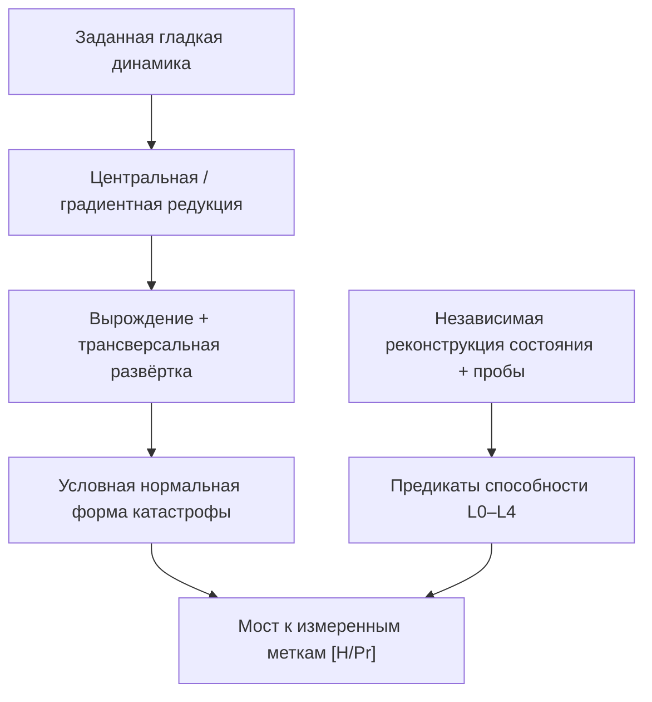

# Условные модели переходов между уровнями

Операционная метка может меняться вдоль гладкой траектории без динамической бифуркации. Бифуркация меняет локальную динамику; статистический фазовый переход требует заданных ансамбля и предела. [Типизированное ядро](/docs/reference/mathematical-kernel) различает эти понятия. Фазы Gap не определяют $\mathsf{Cap}_2$ и предсказательные сертификаты высших порядков.

:::warning Исправление 2026-10-03
Универсальные складка L0→L1, касп L1→L2, ласточкин хвост L2→L3, обязательный гистерезис и каскад сигнатур Gap **отозваны [✗]**. Три регулятора не вынуждают сингулярность $A_4$. Условные модели ниже сохраняют точные нормальные формы, дискриминанты и масштабные расчёты с их предпосылками.
:::

## 1. Заданная эффективная модель {#потенциал}

Для теории катастроф потенциала сначала задать гладкую редукцию конкретного генератора к

$$
\dot x=-\partial_x V(x;\lambda),
$$

со знаковой локальной координатой $x$, параметрами $\lambda$, окрестностью и границей применимости / ошибки. Общий линдбладовский или нелинейный поток состояний не обязан быть одномерным градиентным. Попарная $|\sin\arg\gamma_{ij}|$ не глобально гладкая: нужно учитывать нулевую когерентность и модуль. Требуется гладкая локальная координата или непрерывная взвешенная статистика.

**Условный критерий $A_k$ [T при гладкой редукции].** В $(x_0,\lambda_0)$ требуется

$$
V_x=V_{xx}=\cdots=V_{x^k}=0,\qquad V_{x^{k+1}}\ne0,
$$

и трансверсальная $(k-1)$-параметрическая развёртка. В частности, матрица производных $(V_x,\ldots,V_{x^{k-1}})$ по регуляторам имеет ранг $k-1$. Гладкое выделение некритических направлений и нужная эквивалентность развёрток входят в теорему нормальной формы. В соглашении потенциалов $A_k:x^{k+1}$, а не $x^k$. Источник: [Грист, Applied Dynamical Systems, нормальные формы](https://www2.math.upenn.edu/~ghrist/preprints/ADS-DRAFT.pdf).

## 2. Нормальные формы и независимые тесты способности {#каскад}

### Складка: нет автоматического вывода L0→L1 {#l0-l1}

$$
V=x^3/3-\mu x,\qquad\dot x=\mu-x^2.
$$

При $\mu>0$ равновесия $\pm\sqrt\mu$ дают один локальный минимум и один максимум; при $\mu<0$ их нет. Это локальная складка **[T]**. Изменение ранга независимо заданной $\rho_E$ не вынуждает эту форму и изменение фазы. Например, $\rho_E(t)=\operatorname{diag}(1-t,t)$ меняет ранг при $t=0$, оставаясь непрерывной.

### Касп: нет автоматического вывода L1→L2 {#l1-l2}

$$
V=x^4/4+a x^2/2+b x,\qquad V_x=x^3+a x+b.
$$

Кратные стационарные корни удовлетворяют

$$
4a^3+27b^2=0.
$$

При $a<0$, $|b|<2(-a)^{3/2}/(3\sqrt3)$ есть два минимума с разделяющим максимумом **[T]**. Они не получают метки L1/L2 без независимой проверки полного сертификата. $R\ge1/3$ — лишь одни ворота; при $R=1/(7P)$ рефлексия убывает с ростом чистоты.

### Ласточкин хвост: нет автоматического вывода L2→L3 {#l2-l3}

$$
V=x^5/5+a x^3/3+b x^2/2+c x,\qquad V_x=x^4+a x^2+b x+c.
$$

Это стандартная локальная развёртка $A_4$ при выполнении вырождения и трансверсальности. Производная четвёртой степени имеет максимум четыре простых корня, значит **максимум два невырожденных внутренних минимума**, поскольку минимумы и максимумы чередуются. Прежний вывод трёх устойчивых минимумов и числа фермионных поколений — **[✗]**. Полином нечётной степени не задаёт глобально удерживающего потенциала; глобальному ландшафту нужны дополнительные члены или заданная область.

L3 требует L2 и $\mathsf{MetaCert}_2$; верность $1/4$, мелкая яма, медитация и фазовое согласование не заменяют тест. Время удержания в яме требует действительной линеаризации, а стохастический выход — модели шума и барьера.

### L3→L4 и категориальные типы {#l3-l4}

L4 — канонический совместимый операционный идеал всех порядков **[D]**, а не лист ласточкиного хвоста, неподвижная точка или копредел целого топоса. Для заданного объекта опыта $X$ башня Постникова обратная:

$$
\cdots\to\tau_{\le3}X\to\tau_{\le2}X\to\tau_{\le1}X.
$$

Реконструкция через обратный предел требует сходимости; усечение не вынуждает ненулевую гомотопию каждой степени. Теорема Ловера о неподвижной точке и конечная матричная размерность сами не доказывают универсальную недостижимость. См. [исправленную категориальную область](./interiority-hierarchy#теорема-l4-категориальная).

## 3. Корректная таблица классификации {#сводная-таблица}

| Росток локального потенциала | Катастрофа | Регуляторов общей развёртки | Дополнительная связь с L |
|---|---|---:|---|
| $x^3$ | Складка $A_2$ | 1 | Независимая реализация L1 |
| $x^4$ | Касп $A_3$ | 2 | Полная $\mathsf{Cap}_2$ |
| $x^5$ | Ласточкин хвост $A_4$ | 3 | Независимый сертификат метамодели |
| $x^6$ | Бабочка $A_5$ | 4 в общем случае | Нет канонической L-метки |

Чётная трикритическая модель Ландау $x^6$ — ограниченное симметрией семейство ростка $A_5$, а не общий ласточкин хвост $A_4$. Точная симметрия ограничивает допустимые возмущения; её нужно установить в модели.

## 4. Условный гистерезис {#гистерезис}

Для каспа при фиксированном $a<0$ квазистатическое следование выбранному метастабильному минимуму в градиентной системе без шума достигает складок

$$
b_\pm=\pm\frac{2(-a)^{3/2}}{3\sqrt3},\qquad\Delta b=\frac{4(-a)^{3/2}}{3\sqrt3}.
$$

Это петля гистерезиса **[T при данном протоколе следования]**. Выбор глобального минимума, шумовой выход, конечная скорость изменения параметров и путь вне бистабильной области меняют закон переключения. Нет теоремы гистерезиса каждого L-перехода, роста ширины с L или её клинической интерпретации как устойчивости инсайта.

## 5. Диаграмма зависимостей {#диаграмма}

## 6. Динамика около проверенной бифуркации {#динамика}

### Условное замедление {#замедление}

В складке $\dot x=\mu-x^2$ устойчивое равновесие $x_*=\sqrt\mu$ имеет собственное значение $-2\sqrt\mu$, поэтому **линеаризованное** время релаксации

$$
\tau=1/(2\sqrt\mu).
$$

Степень следует для этой невырожденной складки и этого пути параметра **[T]**, а не всех пороговых пересечений. При локальном шуме $d\eta=-\lambda\eta\,dt+\sqrt{2D}\,dW_t$ стационарная дисперсия $D/\lambda$, автоковариация $(D/\lambda)e^{-\lambda|t|}$. Фиксированная $D$ у складки даёт степень $\mu^{-1/2}$, а не прежнюю универсальную $\mu^{-1}$. Вблизи самой складки линейная аппроксимация может нарушаться. Дисперсия ограниченного Gap не может неограниченно расходиться: любая величина из $[0,1]$ имеет дисперсию не больше $1/4$.

## 7. Нет вынужденного соответствия листов и Gap {#swallowtail-каскад}

Разные ворота чистоты / рефлексии возникают при одинаковом нулевом фазовом профиле; явный контрпример $\Gamma(t)$ дан в [идентифицируемости Gap](./gap-characterization#gap-инъекция). Теорема нормальной формы не закрепляет средние $0.6,0.3,0.1$, ранги непрозрачности и воспринимаемый доступ по L-уровням. Это проверяемые сигнатуры **[H]** после независимой разметки и калибровки. Избыточность Хэмминга не требует трёх ненулевых фазовых каналов.

## 8. Область теории катастроф {#связь-gap}

Локальные нормальные формы классифицируют заданный росток, а не все глобальные аттракторы. Седло-узел, зависящая от симметрии вилка и Хопф — разные возможности; Хопф требует пары комплексно-сопряжённых собственных значений и не является скалярной градиентной катастрофой $A_k$. Для предсказания Хопфа нужны собственные условия невырожденности и устойчивости.

## 9. Что требуется для универсальности {#универсальность-переходов}

### T-160: порог не доказывает фазовый переход {#фазовый-переход}

Тождество $P=1/7+\|\Gamma-I/7\|_F^2$ даёт выбранный порог большинства $P>2/7$ **[T при данном критерии]**. Оно не делает $2/7$ точкой бифуркации любого потока, не задаёт ансамбль и не нарушает $U(7)$ до $G_2$. Простой замещающий поток $\dot\rho=\sigma-\rho$ имеет одно притягивающее равновесие и гладкое решение $\rho(t)=\sigma+e^{-t}(\rho(0)-\sigma)$; порог чистоты может пересекаться без бифуркации. Прежнее универсальное отождествление T-160 с фазовым переходом — **[✗]**; идентификация наблюдаемого перехода — **[H]** до задания динамики, предела и моста.

### T-161: точный расчёт среднего поля при заданной модели {#критические-экспоненты}

Задать чётный потенциал

$$
V(m;t,h)=\frac{t}{2}m^2+\frac{v}{6}m^6-hm,\qquad v>0,
$$

при настроенном в ноль коэффициенте $m^4$ и ненулевом линейном температурном поле $t$. При $h=0,t<0$ минимизация даёт $m^4=-t/v$, $V_{\min}=-(-t)^{3/2}/(3\sqrt v)$. При $t=0$ имеем $h=vm^5$. На неупорядоченной стороне $\chi=\partial m/\partial h=1/t$. Отсюда классические показатели стационарного среднего поля

$$
\beta=1/4,\quad\delta=5,\quad\gamma=1,\quad\alpha=1/2
$$

**[T для данного полинома и термодинамической интерпретации]**. Показатель корреляционной длины $\nu=1/2$ дополнительно требует пространственного поля с положительным градиентным членом и гауссовой длинноволновой аппроксимации. Внутренний семимерный регистр не получает пространственную корреляционную длину лишь из 21 комплексной пары.

### Точность и применимость {#механизм-точности}

Одной симметрии недостаточно, чтобы настроить коэффициент $m^4$, доказать скалярную центральную редукцию, детальный баланс или подавление флуктуаций. Эквивалентность катастроф не доказывает инвариантности каждого термодинамического показателя при любых заменах параметра / наблюдаемой. Детерминированное уравнение само не устраняет стохастические эффекты и конечный размер в физической интерпретации. Подсчёт 21 комплексной пары не даёт пространственную размерность или контролируемый large-$N$ предел. Универсальная точность этих показателей для УГМ — **[✗]**. Мост к биологическим измерениям и применимость заданной аппроксимации остаются **[H/Pr]**.

## 10. Обратная связь чистоты: знаки и условная скалярная модель {#лавинная-динамика}

Точный баланс

$$
\dot P=-4\gamma W/3+2(\kappa_b+\kappa_0\mathrm{Coh}_E)g_Vh+J_P,
$$

где $h=\operatorname{Tr}(\rho\tau)-P$. Знак зависит от цели и источников. Для канонической $\tau=\varphi_{\mathrm{coh}}\rho$ имеем $h\le0$; рост скорости регенерации не зажигает чистоту. $\mathrm{Coh}_E$ не обязана обнуляться или линейно расти при $P=2/7$. Рост $P$ уменьшает каноническую $R$. Прежнее автоматическое доказательство положительной обратной связи — **[✗]**.

Если независимо выведена скалярная редукция $\dot y=ay+by^2$ при $a,b>0$, время перехода $0<y_0<y_f$ равно

$$
T=\frac1a\log\frac{y_f(a+by_0)}{y_0(a+by_f)}.
$$

При $y_0\to0$ и фиксированном $a>0$ оно растёт логарифмически. Только отдельно настроенный случай $a=0$ даёт $T=(1/b)(1/y_0-1/y_f)$. Это исправляет прежний вывод обратной степени отклонения при ненулевом линейном bootstrap-члене.

## 11. Экспериментальная программа {#предсказания}

Подбирать заданную динамику и модель наблюдения на обучающих данных; предрегистрировать пути параметров, независимые метки способности и тесты на новых данных. Сравнивать складку, касп, Хопфа и гладкое пересечение порога. Измерять неопределённость, эффекты конечного размера / скорости прохода и ложноположительные выводы. Назначение коме, психозу, терапевтическому инсайту и медитации листа потенциала — **[H]**, а не диагноз из статичного скаляра и не математическая валидация феноменального моста.

## Связанные документы

- [Типизированное ядро](/docs/reference/mathematical-kernel)
- [Каноническая иерархия](./interiority-hierarchy)
- [Башня глубины](./depth-tower)
- [Ограничения фазовой модели](/docs/core/dynamics/gap-phase-diagram)
- [Точный баланс чистоты](/docs/applied/coherence-cybernetics/theorems#теорема-81-условная-необходимость-интериорности-no-zombie)
