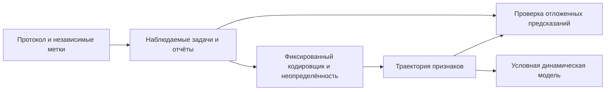

# Изменённые Состояния Сознания

Сон, медитация, психоделические состояния, анестезия, гипноз и осознанные сновидения мотивируют разные исследовательские протоколы. Их отождествление с матричными траекториями — гипотеза-мост **[H/I]**, а не следствие названий осей $\Gamma$. Глава разделяет модель состояния, наблюдения, возможности в задачах и клинические исходы.

:::note Типизированные величины
В объявленном нативном фрейме $\Gamma\in\mathcal D(\mathbb C^7)$, $P=\mathrm{Tr}\Gamma^2$, $Q=\sum_i\gamma_{ii}^2$, $\Phi=P/Q-1$ и $R=1/(7P)$. Для заданной численной самомодели $M:D_7\to D_7$ величина $R_M=1-\|\Gamma-M\Gamma\|_F^2/P$ — другая оценка; она может быть отрицательной (ортогональные чистые вход и выход дают $R_M=-1$). Это не логический рефлектор носителя. При $\gamma_{ij}\ne0$ фазовый $\mathrm{Gap}(i,j)=|\sin\arg\gamma_{ij}|$ не учитывает амплитуду и ориентированную фазу; при нулевой когерентности фаза не определена. Среднее по 21 паре определено лишь при наличии всех этих фаз; иначе нужно сообщать носитель и конвенцию отсутствующих значений.
:::

:::warning Возможности и физическая интерпретация
Выбранные ворота $\mathrm{Cap}_2$ требуют $P>2/7$, $R\ge1/3$, $\Phi\ge1$ и $D_{\mathrm{diff}}\ge2$. Интервал чистоты $(2/7,3/7]$ проверяет только первые два условия. L3 требует независимого нетривиального сертификата предсказаний метамодели; L4 — идеальная совместимая башня таких сертификатов. Высокий $R_M$, низкий Gap, неподвижная точка или название практики не задают отсутствующие проверки. Отождествление ворот с физическим сознанием или клиническим состоянием остаётся **[H]**. См. [математическое ядро](/docs/reference/mathematical-kernel) и [иерархию](/docs/consciousness/hierarchy/interiority-hierarchy).
:::

:::note Дифференциация и расширение
$D^{\mathrm{ext}}=\exp S_{vN}(\rho_E)$ требует нормированного состояния на объявленном пространстве опыта. Тензорный фактор допускает частичный след. E-сектор прямой суммы вместо этого использует свой сжатый блок положительного веса, делённый на его след. Базисная ось E в 7D одномерна и не может дать многомерную энтропию частичным следом по остальным осям. Величина иерархии $D^{7D}=1+6\mathrm{Coh}_E$ — отдельный установленный прокси, а не теорема приближения спектра расширения. 7D-маргинал не определяет расширение однозначно: $\Gamma\otimes\rho_E$ имеет один и тот же маргинал $\Gamma$ при любом $\rho_E$, с разной энтропией опыта. См. [типизацию 7D/42D](/docs/core/structure/dimension-e#rho-e-7d-42d).
:::

### Дорожная карта главы

Исторический контекст; объявленные траектории и модели наблюдения; гипотезы исследования сна и медитации; исходы вмешательств; анестезия, гипноз и сновидения; условная динамика переходов.

## 1. Историческая перспектива {#история}

### 1.1 Чарльз Тарт и картография состояний

В 1969 году американский психолог Чарльз Тарт опубликовал работу *«Altered States of Consciousness»*, предложив первую систематическую классификацию изменённых состояний сознания (ИСС). Тарт рассматривал сознание как **систему**, обладающую стабильными конфигурациями — «дискретными состояниями сознания» (ДСС). Каждое ДСС характеризуется набором «подсистем»: ввод данных (восприятие), обработка (мышление), вывод (поведение), энергия (внимание), и т.д. Переход между ДСС — дестабилизация одной конфигурации и переход к другой.

**Ключевая идея Тарта:** Нормальное бодрствование — лишь *одна* из возможных конфигураций, не привилегированная с точки зрения «истинности». Сон, медитация, психоделическое состояние — равноправные конфигурации с собственными закономерностями.

### 1.2 От Тарта к УГМ

Системная перспектива Тарта мотивирует модель пространства состояний **[I/H]**. Измеренную конфигурацию можно представить через $\Gamma$ только после задания валидированной модели наблюдения. Устойчивая категория является аттрактором лишь в отдельно заданной динамике; смена категорий не обязана быть бифуркацией. Семь именованных осей, их численные оценки и связь с подсистемами Тарта — выбор модели, а не автоматическая теорема перевода.

### 1.3 Предшественники и контекст

До Тарта изменёнными состояниями занимались разрозненно: Уильям Джеймс (1902, *«Многообразие религиозного опыта»*) описывал мистические состояния; Людвиг (1966) ввёл сам термин «изменённые состояния сознания»; Мастерс и Хьюстон (1966) систематизировали психоделический опыт. Но только Тарт предложил *единую рамку* для всех видов ИСС.

В 2000-е годы нейронаука ИСС получила мощный импульс: фМРТ-исследования медитации (Лутц и др., 2004), нейровизуализация психоделических состояний (Кархарт–Харрис и др., 2012), формализация «энтропийного мозга» (Кархарт–Харрис, 2014). Гипотеза энтропийного мозга — прямой предшественник параметра $D_{\text{diff}}$ в УГМ.

---

## 2. Изменённые состояния как траектории в Γ-пространстве {#траектории}

**Определение модели [D].** Траектория $\Gamma(\tau)$ и заданная численная модель $M_\tau$ дают траекторию признаков $s(\tau)=(P,\Phi,R_M,D,G)$ там, где определена каждая компонента. Относительно калиброванного базового уровня объявленный критерий $|s_k(\tau)-s_k^{\mathrm{base}}|>\delta_k$ отмечает *отклонение модельного признака*. Пороги, неопределённость и масштаб времени входят в протокол. Отклонение само по себе не устанавливает изменённое сознательное состояние, клиническое состояние или единственное переживание **[H]**.

Пространство матриц плотности $7\times7$ имеет вещественную размерность $48$ во внутренности: шесть свободных диагональных населённостей и 21 комплексный внедиагональный элемент. Пять агрегатов теряют информацию и автоматически не различают все классы. Класс оценивают по независимо наблюдаемым меткам и валидированным распределениям, а не определяют из тех же признаков, которые проверяются.

### 2.1 Пространство состояний: визуализация

График $(P,R_M)$ — проекция, а не полная классификация. При фиксированном $M$ величина $R_M$ не обязана быть функцией $P$; каноническая $R$ всегда является такой функцией. Полоса $2/7<P\le3/7$ — скалярное условие ворот, а не граница жизни, клиническая норма или доказательство опыта. Оценённые кластеры могут перекрываться и не обязаны быть аттракторами. Следует показывать неопределённость и независимые метки, исключая вымышленные численные координаты сна, медитации или эффектов веществ.

## 3. Сон {#сон}

Метки сна и отчёты получают независимо от матричной оценки **[Pr]**. Ниже приведены связи признаков-кандидатов; они не назначают универсальный уровень возможностей и не выводят отсутствие опыта из отсутствия отчёта.

### 3.1 NREM-сон (глубокий сон без сновидений) {#nrem}

**Кандидат [H].** Независимо выделенные периоды NREM сравнивают с точностью предсказаний самомодели, дифференциацией объявленной модели опыта и доступностью задачи/отчёта. Прежние назначения $R_M<1/3\Rightarrow\mathrm{L1}$ и «интеграция обязательно сохраняется выше $\Phi=1$» не выведены. Измеренное $D<2$ нарушало бы выбранное условие $\mathrm{Cap}_2$, не доказывая наличия или отсутствия физического опыта.

Исчезновение $\gamma_{AE}$ не влечёт $G_{AE}=1$: при нуле фаза не определена. Неспособность вспомнить или сообщить содержание без дополнительных проверок не различает его отсутствие, неудачу кодирования и неудачу доступа. Универсальное значение чистоты для NREM не утверждается.

### 3.2 REM-сон (сновидения) {#rem}

**Кандидат [H].** Независимо выделенные периоды REM и отчёты о сновидениях связывают с признаками фиксированного кодирования. Ни сумма выбранных модулей когерентностей, ни низкий фазовый Gap не являются достаточным условием сновидения. Ориентированные фазы и амплитуды можно изучать как предикторы, но одна фаза не определяет содержание сна. Связь нейронных наблюдений с элементами $(S,E)$ или $(D,E)$ требует явной модели наблюдения; названия матрицы её не выводят.

Отчёт об осознанном или неосознанном сновидении и формальная L-метка — разные исходы. Высшие возможности сообщают только после полных задачных сертификатов, а отсутствующие сертификаты оставляют неизвестными **[Pr]**.

## 4. Медитация {#медитация}

Названия практик мотивируют разные дизайны задач **[H/I]**. Добровольная инструкция — внешняя переменная протокола, а не установленное прямое управление элементами матрицы.

### 4.1 Шаматха (фокусировка внимания) {#шаматха}

**Кандидат [H].** Практику сосредоточения можно сравнивать с независимо измеряемой задачей устойчивого внимания и предсказаниями заданной численной самомодели. Рост $|\gamma_{AE}|$ не заставляет другие модули падать: семейство с единичным следом $(1-t)I_7/7+tuu^\dagger$ одновременно повышает все внедиагональные модули. Граница $\sum_{X\ne A}|\gamma_{AX}|^2\le\gamma_{AA}(1-\gamma_{AA})$ не является сохраняемым бюджетом. Размен требует дополнительного закона контроллера, как доказано в [Внимании и памяти](/docs/consciousness/states/attention-memory#внимание).

Изменение $R_M$ или подогнанных параметров генератора — отдельное измерение. Ни монотонное улучшение практики, ни численная траектория за год или десять лет не следуют из нормировки или двухмасштабной модели. Эффекты оценивают по действительному протоколу **[Pr]**.

### 4.2 Випассана (прозрение) {#випассана}

**Кандидат [H].** Отчёты о замечании ранее не сообщённого содержания сравнивают с изменениями калиброванной задачи доступа и отдельно оценёнными фазами. Замеченное расхождение математически не вынуждает снижение Gap или бифуркацию. Фиксированный порог оценки не задаёт универсального порядка телесных, эмоциональных и логических «инсайтов».

Полная фазовая прозрачность возможна: положительное семейство §4.1 имеет нулевые Gap всех 21 пар при любом $t>0$. Теорема Хэмминга о коде не требует сохранения непрозрачности трёх из этих пар. Улучшает ли расширение доступа заданный исход, проверяют независимо; фазовая статистика не является самим доступом.

### 4.3 Самадхи (глубокое поглощение) {#самадхи}

Отчёт о глубоком поглощении не сертифицирует L3 или L4 **[H/I]**. Совпадение самомодели и доступ к нетривиальным предсказаниям высших порядков — разные вещи.

**Контрпример прежнему доказательству через неподвижную точку [T].** При $M=\mathrm{Id}$ любое состояние неподвижно и $R_M=1$. При $\Gamma=I_7/7$ имеем $P=1/7$ и $\Phi=0$, поэтому $\mathrm{Cap}_2$ не выполнены. Идеальное самосовпадение не устанавливает даже выбранную базовую возможность, тем более совместимую башню метамоделей или полное самопознание. Тождество — допустимый замороженный CPTP-канал, так что требование CPTP не исправляет импликацию.

**Проверка реализуемости [T].** Поскольку $Q\ge1/7$, имеем $\Phi\le7P-1$. Внутри $\mathrm{Cap}_2$ условие $P\le3/7$ даёт $\Phi\le2$. Прежний пример $P=0.40$, $\Phi=3.5$ не может быть матричным сертификатом: его граница равна $1.8$. Максимизация $\Phi$ по всем состояниям даёт $6$ на равномерном чистом состоянии, у которого $R=1/7$ нарушает условие доступа. Следовательно, «максимальная интеграция» не заменяет ворота или проверки высших порядков.

Исследование поглощения может проверять независимые отчёты, задачи и предсказания метамодели, включая возмущения и отложенные цели **[Pr]**. Устойчивое состояние требует устойчивости заданного потока; неподвижная точка $M$ сама по себе не задаёт притяжение или длительность сохранения.

### 4.4 Сравнение трёх практик

| Название практики | Предложенная независимая цель [H/Pr] | Что не выводится |
|---|---|---|
| Шаматха | Выполнение задачи устойчивого внимания | Сохраняемый бюджет когерентности |
| Випассана | Различение доступа/отчёта | Обязательное снижение фазового Gap |
| Самадхи | Отчёты о поглощении и задачи высших порядков | L4 из $R_M=1$ или неподвижной точки |

Таблица сравнивает дизайны исследований; она не задаёт универсальный матричный профиль или порядок уровня владения практикой.

## 5. Психоделики {#психоделики}

Матричное описание вмешательства — модель-кандидат **[H]**. Реконструированные признаки и независимо оценённые исходы необходимо разделять. Доза, эффективность или рекомендация по безопасности здесь не выводятся.

### 5.1 Общий профиль

Изменения $D$, $R_M$, $P$ или фазовых признаков можно исследовать при фиксированном кодировщике, но их направления не заданы матричными аксиомами. Отчёт о «растворении эго» не эквивалентен падению $R_M$, а снижение Gap не доказывает доступность подавленных записей. Быстрое движение состояния само по себе не устанавливает ошибку предсказания самомодели: нужны задача, цель и оценка ошибки. Приближение к выбранному порогу $P=2/7$ само по себе не устанавливает физиологическую границу опасности.

### 5.2 Терапевтическое окно

Прежняя теорема максимальной терапевтической эффективности при $1/6<R_M<1/3$ **отозвана [✗]**. Ни одна граница не следует из определения $R_M$, а чистота сама по себе не сертифицирует полные ворота или клиническую безопасность.

**Контрпример импликации из оценки.** Для чистой $\Gamma=|0\rangle\langle0|$ зададим допустимый выход канала замены $M\Gamma=(1-a)|0\rangle\langle0|+a|1\rangle\langle1|$. Тогда $R_M=1-2a^2$; $a=\sqrt{0.4}$ даёт $R_M=0.2$ внутри предложенного окна, но $P=1$ даёт каноническую $R=1/7$ вне $\mathrm{Cap}_2$. Окно, таким образом, не сертифицирует ни базовую возможность, ни клинический исход. Независимая переменная исхода может различаться при тех же $(\Gamma,M)$ и оценке; определение оценки не задаёт функцию исхода.

**Программа исследования [H/Pr].** Если гипотеза вмешательства использует модельный признак, заранее регистрируют модель наблюдения и независимо оцениваемый исход пользы, сравнивают альтернативы на отложенных данных и отдельно оценивают клиническую безопасность. Окно лечения, сохранение инсайта, дозу или длительность не выводят из $R_M$, Gap или интервала чистоты. Прежний численный профиль действия вещества по времени не имел идентифицированной измерительной основы и отозван.

### 5.3 Связь с энтропийной моделью мозга

Предложение «энтропийного мозга» — мотивирующая гипотеза, а не теорема отождествления **[H/I]**. Энтропия наблюдаемого нейронного временного ряда, $S_{vN}(\rho_E)$ и $\exp S_{vN}(\rho_E)$ — разные величины. Их связь требует кодировщика, размерностей и валидированной статистической модели. «Критическая точка» нейронной модели не является автоматически границей фаз выбранного Gap-потенциала, и ни одна мера энтропии сама по себе не устанавливает феноменальный или терапевтический эффект.

## 6. Анестезия {#анестезия}

Предложенная модель анестезии должна быть связана с независимыми наблюдениями и критериями исхода **[H/Pr]**. Потеря выбранных матричных когерентностей — математический процесс; отождествление с клиническим состоянием требует дополнительного валидированного моста.

### 6.1 Последовательность потери когерентностей

Объявленный канал дефазировки может вести внедиагональные элементы к нулю при сохранении следа и населённостей **[T]**. Скорости и порядок подавления каналов зависят от действительного генератора; универсальная последовательность $(E,U)\to(L,E)\to(A,E)\to(S,E)$ не следует из положительности или названий семи осей. Прежняя численная таблица индукции была невалидированным назначением, а не реконструированными данными.

При стремлении ненулевого элемента к нулю вдоль разных фаз Gap может сохранять $0$, $1$ или другое значение до утраты определённости фазы. Поэтому исчезновение когерентности не определяет последовательность фазовой непрозрачности или момент окончания физического опыта.

### 6.2 Отличие от сна

Подогнанная модель может сравнивать независимо выделенные состояния сна и анестезии. Она не может определить их различие как «L1 против L0» только по $R_M$ или $\Phi$. Любая допустимая матрица плотности удовлетворяет базовому предикату $A_0$ иерархии; невыполнение $\mathrm{Cap}_2$ не определяет, какие нижние предикаты выполнены, и не устанавливает физическую бессознательность.

**Контрпример восстановимости из чистоты.** Канал замены переводит любую входную запись в фиксированное чистое состояние с $P=1>2/7$, но уничтожает различимость записей на выходе. Унитарный канал сохраняет различимость при любой входной чистоте. Поэтому чистота выше выбранного порога не доказывает восстановимость, выживание или восстановление человека. Требования клинической поддержки не выводятся из этого матричного неравенства.

### 6.3 Осознание во время анестезии (intraoperative awareness)

Связь-кандидат между независимо оцениваемым осознанием и выбранными признаками требует протокола исходов **[H/Pr]**. Порог $|\gamma_{AE}|>\varepsilon$ при $G_{AE}<1$ не доказывает переживание, возможность отчёта или конкретное клиническое осложнение. Нужно задать кодировщик, шум наблюдения и независимые меры доступа/отчёта. Частота или диагноз здесь не выводятся из матричных статистик.

## 7. Гипноз и осознанные сновидения {#гипноз-осознанные-сновидения}

Эти названия могут мотивировать разные протоколы; они не задают единственный Γ-профиль или сертификат возможностей.

### 7.1 Гипноз {#гипноз}

**Кандидат [H].** Независимо измеряемые ответ на внушение, внимание в задаче и отчёт сравнивают с фиксированной матричной моделью. Гипноз не определяется ростом $G_{LE}$ или падением $R_M$, и ни одна оценка не устанавливает «отключение логического контроля». Обход одного именованного канала другим требует действительной причинной модели и данных вмешательства; он не выводится из названий индексов или статической корреляции.

### 7.2 Осознанные сновидения (lucid dreaming) {#люцидность}

**Кандидат [H/Pr].** Независимо проверенные отчёты об осознанном сновидении можно сравнивать с зависимыми от задачи мерами доступа и предсказаний самомодели. Положительная $\gamma_{AE}$ вместе с $R_M\ge1/3$ не является достаточным критерием сновидения или L2. Он опускает $\Phi$, каноническую $R$, дифференциацию и мост наблюдения. Формальный сертификат возможностей и отчёт о знании, что человек видит сон, записывают отдельно; универсальная траектория обучения или значения матрицы не утверждаются.

## 8. Сводная таблица: все классы ИСС {#сводная-таблица}

| Независимо установленное состояние | Цель исследования-кандидат [H/Pr] | Результат по возможностям |
|---|---|---|
| Бодрствование | Калиброванные базовые задачи и отчёты | Нужен полный сертификат |
| NREM / REM | Независимо выделенные периоды сна и задачи доступа/отчёта | Не фиксируется названием сна |
| Медитация / поглощение | Отчёты о практике, задачи внимания и метамодели | L3/L4 не выводятся из неподвижной точки |
| Психоделическое состояние | Раздельные оценки признаков и исходов вмешательства | Нет терапевтического окна из оценки |
| Анестезия | Независимые наблюдения и критерии исхода | Чистота не доказывает восстановление |
| Гипноз | Независимо измеренные ответы/исходы задач | Не определяется фазовым Gap |
| Осознанное сновидение | Проверенный отчёт и доступ в заданной задаче | Не определяется условием $R_M\ge1/3$ |

Прежние универсальные численные профили и назначения L-уровней отозваны. Неизмеренные условия ворот или сертификаты оставляют неизвестными, а не заполняют по названию состояния.

## 9. Геометрия переходов {#геометрия}

Траектория может пересекать порог признака без изменения устойчивости лежащего в её основе потока. Клинический переход, пересечение порога оценки и математическая бифуркация — три разных утверждения.

### 9.1 Типы переходов

**Условный результат о седло-узле [C].** Для объявленного гладкого одномерного потока $\dot x=f(x,\mu)$ седло-узел в $(x_0,\mu_0)$ требует $f=0$, $f_x=0$, $f_{xx}\ne0$ и $f_\mu\ne0$ при обычных локальных условиях. В большей размерности нужны простое нулевое собственное значение и соответствующие условия невырожденности/трансверсальности на центральном многообразии. Скалярная оценка $R_M=1/3$ не задаёт ни одну из этих производных. См. [Ghrist, теория бифуркаций](https://www2.math.upenn.edu/~ghrist/preprints/ADS-DRAFT.pdf).

**Контрпример прежнему доказательству из порога [T].** Семейство $\dot x=-x+\mu$ имеет единственное глобально устойчивое равновесие $x^*=\mu$ с собственным значением $-1$ при любом $\mu$. Его считывание пересекает $1/3$ при $\mu=1/3$ без седло-узла. Неподвижная точка $M\Gamma=\Gamma$ также не доказывает переход, аттрактор или когнитивный уровень.

Засыпание, вход в практику или изменение отчёта могут мотивировать подгоняемую модель **[H]**. Интерпретация через Хопфа, седло-узел или фазовый переход требует объявленной динамики и независимо оценённых управляющих величин. Универсальная последовательность, резкость или клинический масштаб времени здесь не назначаются.

### 9.2 Диаграмма переходов

Диаграмма описывает исследовательский процесс **[Pr]**, а не универсальный граф переходов клинических или феноменальных состояний. Динамическая модель должна объяснять наблюдения сверх кривой оценки; успешность предсказания оценивают независимо от её подогнанных признаков.

### Что мы узнали {#итоги}

1. Матричные признаки, возможности в задачах, отчёты и клинические исходы имеют разные типы. Их соответствия — проверяемые гипотезы-мосты.
2. Полоса чистоты — лишь часть $\mathrm{Cap}_2$; оценка самомодели или фазовый Gap не заменяют остальные условия ворот и предсказательные проверки высших порядков.
3. Тождественная самомодель имеет идеальное совпадение даже при $I_7/7$, которое нарушает ворота. Неподвижная точка не сертифицирует полное самопознание или L4.
4. Полная фазовая прозрачность возможна, а нулевая когерентность имеет неопределённую фазу. Кодирование Хэмминга не задаёт требования трёх непрозрачных пар.
5. Предложенное терапевтическое окно оценок и клинические численные назначения отозваны; польза, безопасность и восстановление требуют независимых данных об исходах.
6. Пересечение скалярного порога не является бифуркацией. Условные утверждения о переходах требуют заданного потока и проверенных условий невырожденности/трансверсальности.

[Бессознательное](/docs/consciousness/states/unconscious) продолжает различение фазы, хранимого содержания и доступа; оно не отождествляет каждый Gap $=1$ с физически бессознательным каналом.

## Связи

- **Динамика Γ:** [Эволюция Γ](/docs/core/dynamics/evolution) — уравнения движения
- **Жизнеспособность:** [Мера жизнеспособности](/docs/core/dynamics/viability) — порог $P_{\text{crit}} = 2/7$
- **Иерархия уровней:** [Иерархия интериорности](/docs/consciousness/hierarchy/interiority-hierarchy) — определения L0–L4
- **Gap-характеристика:** [Gap-характеристика уровней](/docs/consciousness/hierarchy/gap-characterization) — сигнатуры
- **Бифуркации:** [Gap-динамика](/docs/core/dynamics/gap-dynamics#бифуркации) — теория переходов
- **Бессознательное:** [Бессознательное](/docs/consciousness/states/unconscious) — Gap-структура недоступных секторов
- **Патология:** [Патология сознания](/docs/consciousness/states/pathological) — отклонения от нормы
- **Теоремы КК:** [Когерентная Кибернетика](/docs/applied/coherence-cybernetics/theorems) — прикладные следствия для динамических аттракторов
- **Энтропийный мозг:** [Фазовая диаграмма](/docs/core/dynamics/gap-phase-diagram) — связь с гипотезой Кархарт–Харриса
