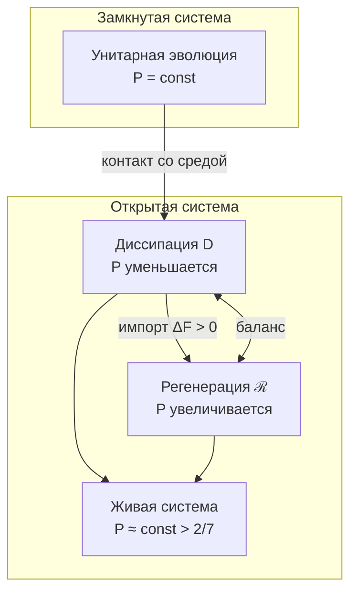

# Эволюция Матрицы Когерентности

:::info Для кого эта глава
Полное уравнение эволюции Γ: унитарный, диссипативный и регенеративный члены. Предполагается знакомство с [матрицей когерентности](./coherence-matrix) и [аксиомой Ω⁷](/docs/core/foundations/axiom-omega).
:::

Эта глава — самая объёмная и, возможно, самая важная в разделе «Динамика». Она отвечает на вопрос: **как меняется состояние голонома со временем?** Если [матрица когерентности](./coherence-matrix) $\Gamma$ — это «фотография» системы в данный момент, то уравнение эволюции — это «правила кинематографа», описывающие, как кадры сменяют друг друга.

Читатель узнает, какие данные задают линейную часть GKSL, как нелинейная обратная связь меняет состояние, при каких предпосылках сохраняются положительность и след и какие отдельные условия обеспечивают сходимость и жизнеспособность. Унитарный член сохраняет чистоту; унитальная дефазировка уменьшает её; регенерация может как увеличивать, так и уменьшать её в зависимости от перекрытия с целью. Биологическое толкование этих величин требует эмпирической модели.

## Терминальный объект T и динамические аттракторы {#терминальный-объект}

Категориальный терминальный объект задаётся условием $\forall X,\ \exists! f:X\to T$ **в указанной категории**. Динамический аттрактор — предел траекторий указанного уравнения. Это разные свойства; одно не влечёт другое. В категории всех конечномерных квантовых систем и CPTP-отображений терминальна одномерная система: единственный канал в неё — след. Выбранное семимерное равновесие от этого не становится терминальным.

### Условия единственности аттрактора {#свойства-t}

Для **линейного**, независимого от времени, примитивного и унитального генератора $\mathcal L_0$, используемого ниже, стационарно $I/7$ и к нему сходится каждая траектория. Примитивность следует проверить для выбранных гамильтониана и операторов скачков; одна дефазировка сохраняет каждое диагональное состояние. В нелинейном уравнении единственность требует отдельного доказательства сжимаемости или функции Ляпунова. Примеры с $\varphi_s$ ниже имеют несколько аттракторов, а примеры с $\varphi_J$ — сток и седло в указанном диапазоне параметров.

### Стрела времени и сходимость {#стрела-времени-эволюция}

Если у выбранного потока есть глобально притягивающее стационарное состояние $\Gamma_*$, можно писать $\lim_{t\to\infty}\Gamma(t)=\Gamma_*$. Ни $\Delta F>0$, ни $\mathcal D\ne0$ сами по себе этого предела не доказывают. Циклическое показание Page–Wootters $\tau\in\mathbb Z_7$ не имеет предела при бесконечном времени; диссипативный параметр $t$ и накопленный индекс глубины различаются в [теореме о времени](/docs/proofs/dynamics/emergent-time#112-конечные-периодические-часы). Монотонное убывание размерности страт — дополнительное условие модели, а не следствие уравнения матрицы плотности.

---

## Полное уравнение движения

:::info Эмерджентное время
**Циклические часы** τ ∈ ℤ₇ выводятся из структуры категории $\mathcal{C}$ через механизм Пейдж–Вуттерс. Уравнение ниже с его диссипативным и регенеративным членами идёт по параметру $t$ линдбладовой полугруппы, которого эти часы не дают (относительно часов периода семь всякая динамика периодична). Его конечный носитель — [регистр глубины](../../proofs/dynamics/emergent-time#114-регистр-глубины): $N+1$ показаний, упорядоченных цепью в O-регистрах $\lceil\log_7(N+1)\rceil$ голономов, при связи Фейнмана–Китаева и двух голономах в роли среды. Одна связь, не зависящая от состояния, даёт условные состояния **точно** $e^{n\Delta t\,\mathcal{L}}\rho_0$ при каждом показании, а каждое решение полного уравнения с $\mathcal{R}$ воспроизводится точно связью, подогнанной под него (теоремы 11.1–11.4): **T-53b [Т]** относительно регистра глубины (до 2026-09-25 — [С при апериодическом параметре времени]). Не выведен сам регистр из аксиом: вневременной вид связи — допущение A5, как и для O-часов. Прежняя редакция этой врезки утверждала, что время как таковое выводится, а не является внешним параметром, не называя носителя; это отозвано. См. [Теорема об эмерджентном времени](../../proofs/dynamics/emergent-time).
:::

Эволюция $\Gamma$ описывается **логическим Лиувиллианом**:

$$
\frac{d\Gamma(\tau)}{d\tau} = \mathcal{L}_\Omega[\Gamma(\tau)]
$$

где **логический Лиувиллиан** $\mathcal{L}_\Omega$ **выводится** из [классификатора подобъектов Ω](../foundations/axiom-omega#внутренняя-логика):

$$
\mathcal{L}_\Omega[\Gamma] = -i[H_{eff}, \Gamma] + \mathcal{D}_\Omega[\Gamma] + \mathcal{R}[\Gamma, E]
$$

где:
- τ — параметр эволюции; для диссипативного и регенеративного членов он должен быть апериодическим, чего условные состояния относительно [O](../structure/dimension-o) не дают; его даёт [регистр глубины](../../proofs/dynamics/emergent-time#114-регистр-глубины) (T-53b, [Т])
- $H_{eff}$ — эффективный гамильтониан из ограничения Пейдж–Вуттерс
- $-i[H_{eff}, \Gamma]$ — унитарная эволюция (сохраняет $P$)
- $\mathcal{D}_\Omega[\Gamma]$ — **логическая диссипация** (операторы L_k из Ω)
- $\mathcal{R}[\Gamma, E]$ — заданное регенеративное векторное поле

:::info Реализация логической структуры
Выбранная атомарная/Фано-структура задаёт семейство проекторов после выбора гильбертова репера. Уникальные численные операторы, скорости и применимость к наблюдаемой системе не выводятся из абстрактного классификатора без дополнительных данных.
:::

### Область применимости: линейная часть GKSL и нелинейное уравнение состояния {#markovian-scope}

При заданных, не зависящих от состояния $H=H^\dagger$, операторах $L_j$ и неотрицательных скоростях $\gamma_j$ **линейная часть**

$$
\mathcal L_0(X)=-i[H,X]+\sum_j\gamma_j\bigl(L_jXL_j^\dagger-\tfrac12\{L_j^\dagger L_j,X\}\bigr)
$$

порождает CPTP-полугруппу в независимом от времени конечномерном случае. Зависящий от времени генератор этой формы при обычных условиях существования даёт CPTP-пропагаторы. Его коэффициенты и эмпирическая адекватность — дополнительные спецификации. Добавление $a(\Gamma)(\varphi(\Gamma)-\Gamma)$ в общем случае даёт **нелинейное ОДУ на состояниях**, а не линейный супероператор или CPTP-полугруппу. Положительность его траекторий доказана [ниже](#теорема-сохранение-состояний).

#### Теорема (обработка данных и расстояние Бюреса) [Т]

Для общего линейного CPTP-канала $\mathcal E$:

$$
d_B(\mathcal E(\rho),\mathcal E(\sigma))\le d_B(\rho,\sigma).
$$

Это следует из монотонности fidelity; см. [Watrous, глава 3](https://cs.uwaterloo.ca/~watrous/TQI/TQI.3.pdf). Равенство не требует глобально унитарного канала: дефазировка оставляет два диагональных состояния неизменными. Для линейной полугруппы со стационарной $\sigma$ расстояние $d_B(\mathcal E_t(\rho),\sigma)$ не возрастает. Это не доказывает ни единственности стационарного состояния, ни строгого сжатия. Применение разных каналов, выбранных по разным входным состояниям, не удовлетворяет предпосылке общего канала.

#### Физическая область и идентификация

CP-делимая линейная динамика допускает CPTP-промежуточные пропагаторы; в дифференцируемом обратимом случае её локальный по времени генератор имеет форму GKSL с неотрицательными скоростями. Редуцированная эволюция из фиксированного начального произведения при унитарной динамике системы и среды CPTP в каждый момент, но не обязана быть CP-делимой. Начальные корреляции и ограниченная область подготовок требуют дополнительных условий.

Приближение Борна–Маркова требует обоснованной слабой связи и разделения времён корреляции; перед утверждением формы GKSL нужен также секулярный либо иной сохраняющий положительность предел. Миллисекундная нейронная динамика, классические макроскопические пределы и выбранное квантовое устройство сами по себе этих предпосылок не устанавливают. Глава задаёт конечномерную модель; её применимость проверяется в каждом эксперименте. Память можно представить расширенным состоянием либо отдельной немарковской моделью.

Сохраняющее состояния ОДУ, физический квантовый канал и эмпирическая реконструкция — разные объекты. Последней необходимы модель наблюдений и достаточность информации, сформулированные в [реконструкции и идентифицируемости](/docs/applied/research/reconstruction-identifiability); единственность решения ОДУ не делает скрытое состояние наблюдаемым.

:::note Обозначения
$\mathcal D$ — диссипативный член, $\mathcal R$ — регенеративный, $R$ — мера рефлексии. Полное векторное поле $\mathcal L_\Omega$ называется логическим лиувиллианом по соглашению; при его нелинейности $e^{t\mathcal L_\Omega}$ обозначает только поток, а не матричную экспоненту или линейный канал.
:::

#### Итеративная схема: снятие цикличности ℒ_Ω и φ {#итеративная-схема}

:::info Итеративная схема
Полное уравнение $\mathcal{L}_\Omega[\Gamma] = -i[H_{eff}, \Gamma] + \mathcal{D}_\Omega[\Gamma] + \mathcal{R}[\Gamma, E]$ содержит регенерацию $\mathcal{R}$, использующую $\rho^* = \varphi(\Gamma)$ — категориальную самомодель. При этом $\varphi$ формально определена через динамику $\mathcal{L}_\Omega$. Эта кажущаяся цикличность разрешается через **итеративную (fixed-point) схему**:

1. **Линейная часть** $\mathcal{L}_0 = -i[H_{eff}, \cdot] + \mathcal{D}_\Omega$ имеет единственный аттрактор $\rho^*_{\mathrm{diss}} = I/7$ [T-39a] — **без зависимости от φ**
2. **Нулевая итерация**: $\varphi^{(0)}(\Gamma) := \rho^*_{\mathrm{diss}} = I/7$
3. **n-я итерация**: $\varphi^{(n+1)}(\Gamma) := \lim_{\tau \to \infty} \exp(\tau \cdot \mathcal{L}_\Omega^{(n)})[\Gamma]$, где $\mathcal{R}^{(n)}$ использует $\varphi^{(n)}$
4. **Сходимость**: для воплощённого голонома при доминировании хребта, $\mu > L_{\mathcal{R}} + \kappa_{\max}$, каждая итерация определена и последовательность геометрически сходится к одной самомодели от любого якоря ([T-191](/docs/proofs/categorical/formalization-phi#t-191-сходимость-φ-башни), переформулирована 2026-09-25). Для изолированного голонома $n$-я итерация в общем случае не определена — затвор делает поток бистабильным, и предел зависит от $\Gamma$, — а с каноническим $\varphi_{\mathrm{coh}}$ схема остаётся в $I/7$. (До 2026-09-25 пункт гласил «при $\kappa < \kappa_{max}$ (T-96) последовательность сходится»; T-96 никакого $\kappa$ не ограничивает.)

Мера рефлексии $R = 1/(7P)$ определена через $\rho^*_{\mathrm{diss}} = I/7$ (уровень 0 итерации) и **не зависит** от полного $\varphi$.
:::

:::info Метод расщепления (split-step): разрешение кажущейся цикличности
Нелинейность $\mathcal{R}$ (зависимость от $\varphi(\Gamma)$) разрешается **расщеплением шага** (Lie–Trotter):

1. **Линейный шаг:** $\Gamma' = e^{\Delta\tau \cdot \mathcal{L}_0}[\Gamma]$ — применяется линейная часть (гамильтониан + диссипатор), **не зависящая от φ**
2. **Нелинейный шаг:** $\Gamma'' = (1-\alpha)\Gamma' + \alpha\,\varphi(\Gamma')$ — регенерация с φ, вычисленной от *предыдущего* состояния $\Gamma'$

Аналог: операторное расщепление в численных PDE. *Исправлено 2026-09-25:* здесь стояло «схема сходится к неподвижной точке по теореме Банаха, поскольку φ — сжимающее отображение с коэффициентом $k = 1 - R < 1$». Множитель $k$ стоит при отклонении от $I/7$, $\varphi_{\mathrm{coh}}(\Gamma) - I/7 = k\,\mathcal{P}_\alpha(\Gamma - I/7)$; это не константа Липшица, и $\varphi_{\mathrm{coh}}$ не является сжатием: вдоль $\Gamma = (1-s)I/7 + s\,e_0$ его производная в чистом состоянии $s = 1$ равна $54/49 > 1$, а наибольшее её значение на этом луче — $9/8$, при $s = 1/\sqrt2$, $P = 4/7$: это константа Липшица $\varphi_{\mathrm{coh}}$ ([три отображения](/docs/core/operators/phi-operator#три-определения)). Верно [Т] другое: для $\varphi_{\mathrm{coh}}$ один шаг $S = [(1-\alpha)\,\mathrm{id} + \alpha\varphi_{\mathrm{coh}}] \circ e^{\Delta\tau\mathcal{L}_0}$ даёт $\|S(\Gamma) - I/7\|_F \leq (1 - \alpha/7)\|\Gamma - I/7\|_F$ ($e^{\Delta\tau\mathcal{L}_0}$ унитален и не увеличивает норму Гильберта–Шмидта, $k \leq 6/7$, $\|\mathcal{P}_\alpha\| \leq 1$), так что схема сходится геометрически — к $I/7$, как того и требует [мёртвая изоляция](#теорема-мёртвая-изоляция). Для самомодели, которая держит изолированный голон живым, глобального сжатия нет: при $H = 0$ у шага с $\varphi_s$ не меньше восьми неподвижных точек ($I/7$ и каждое $e_m$), и схема сходится лишь локально, вблизи гиперболического аттрактора (`test_phi_coh_contracts_toward_i7_but_is_not_a_contraction`).
:::

## Компоненты уравнения

### 1. Унитарный член

$$
-i[H_{eff}, \Gamma(\tau)] = -i(H_{eff}\Gamma - \Gamma H_{eff})
$$

где $H_{eff}$ — заданный эффективный гамильтониан, согласуемый с независимо заданным [ограничения Пейдж–Вуттерс](../../proofs/dynamics/emergent-time#33-формальная-конструкция).

:::note Связь Пейджа–Вуттерса (T-87: заданные часы и ограничение поддержки [С])
$\hat{C}\,\Gamma_{\text{total}} = 0$ — ограничение Уилера-ДеВитта, равносильно $\mathrm{supp}\,\Gamma_{\text{total}} \subseteq \ker\hat{C}$. Оно влечёт условие стационарности $[\hat{C}, \Gamma_{\text{total}}] = 0$, но из него не следует: смешанное состояние, размазанное по двум собственным значениям $\hat{C}$, стационарно, не зануляясь. Тензорный часовой регистр и инструмент считывания задаются независимо; часовая ось прямой суммы не определяет тензорный множитель. Ограничение поддержки — отдельное допущение (T-87). Прежняя редакция этой заметки записывала связь как коммутатор и называла её выведенной из A1–A4; отозвано. Время $\tau$ эмерджентно из корреляций между «часовой» и «системной» подсистемами. Полный вывод: [Эмерджентное время](/docs/proofs/dynamics/emergent-time).
:::

**Определение [О] (Ограничение Уилера-ДеВитта).** {#ограничение-wdw}

$$
\hat{C} = H_O \otimes \mathbb{1}_{6D} + \mathbb{1}_O \otimes H_{6D} + H_{\mathrm{int}}
$$

— полный энергетический оператор. Физические состояния удовлетворяют $\hat{C}\,\Gamma_{\mathrm{total}} = 0$, то есть $\mathrm{supp}\,\Gamma_{\mathrm{total}} \subseteq \ker\hat{C}$ (T-87, шаг 4, допущение, [С]); отсюда следует $[\hat{C}, \Gamma_{\mathrm{total}}] = 0$. Условные временные метки определяются заданным часовым инструментом. Автономная эволюция Шрёдингера дополнительно требует подходящих спектра часов, поддержки и взаимодействия; произвольное взаимодействие её не обеспечивает.

#### Вывод ограничения из аксиомы A5 {#вывод-wdw}

Ограничение Пейдж–Вуттерса (аналог уравнения Уилера–ДеВитта) **формулируется** в A5:

**Шаг 1.** A5 устанавливает: $\mathcal{H} = \mathcal{H}_O \otimes \mathcal{H}_{\text{rest}}$ с оператором связи $\hat{C} = H_O \otimes \mathbb{1} + \mathbb{1} \otimes H_{\text{rest}} + H_{\text{int}}$.

**Шаг 2.** Глобальное состояние лежит в ядре связи, $\hat{C}\,\Gamma_{\text{total}} = 0$ — Вселенная *целиком* не эволюционирует. (Глобальная стационарность, $[\hat{C}, \Gamma_{\text{total}}] = 0$, слабее и для смешанных состояний этого не влечёт.)

**Шаг 3.** При заданных ковариантных часах и согласованных спектрах условное считывание даёт унитарную связь §1.1 при нулевом взаимодействии. Взаимодействие обычно связывает условные времена; его диагональный часовой блок не становится автоматически точным локальным гамильтонианом.

Унитарная часть динамики — **следствие** статической структуры $\Gamma_{\text{total}}$ [Т]. Прежняя редакция Шага 3 выводила и диссипатор, $d\Gamma/d\tau = -i[H_{\text{eff}}, \Gamma] + \mathcal{D}[\Gamma]$, со статусом [Т]; это отозвано — конструкция Пейджа–Вуттерса диссипатора не даёт, а относительно часов с периодом в семь тиков диссипативная эволюция была бы постоянной ([эмерджентное время, §9.1](/docs/proofs/dynamics/emergent-time#9-следствия)).

**Свойства:**
- Сохраняет $\mathrm{Tr}(\Gamma) = 1$
- Сохраняет $P = \mathrm{Tr}(\Gamma^2)$
- Детерминистическая (обратимая) эволюция

### 1.1 Условная часовая реализация гамильтониана {#вывод-h_eff}

Зададим **отдельную расширенную модель** $\mathcal H_C\otimes\mathcal H_S$, гамильтонианы и физическое состояние с носителем в $\ker C$. Семимерная минимальная $\mathbb C^7$ не факторизуется в часы и шестимерную систему; произведение $\mathbb C^7\otimes\mathbb C^6$ имеет размерность $42$ и является иным пространством.

При $H_{\mathrm{int}}=0$ предположим согласованные спектры: в носителе физического состояния часовая энергия $E_k$ сопряжена с системной энергией $-E_k$. Пусть $|t\rangle_C=e^{-iH_Ct}|0\rangle_C$, вероятность $p(t)>0$, и определим

$$
\rho_S(t)=\frac{\operatorname{Tr}_C[(|t\rangle\langle t|\otimes I)\rho_{CS}]}{p(t)}.
$$

Тогда $p(t)=p(0)$ и

$$
\rho_S(t)=e^{-iH_St}\rho_S(0)e^{iH_St}.
$$

**Доказательство.** Каждый чистый вектор в $\ker(H_C\otimes I+I\otimes H_S)$ — сумма $\sum_k|E_k\rangle_C|\psi_{-E_k}\rangle_S$. Условная амплитуда получает множитель $e^{iE_kt}=e^{-i(-E_k)t}$, то есть общий системный унитарный оператор. Его норма постоянна. Смешанные физические состояния следуют по линейности ненормированного считывания. $\blacksquare$

Для конечных равноотстоящих часовых энергий состояния $|t_n\rangle$ в семи DFT-тактах ортонормированы; непрерывная ковариантная семья между тактами не ортонормирована. Выбранные энергии, период, согласование системного спектра и непустота $\ker C$ — необходимые предпосылки этой реализации. Условная унитарная динамика не задаёт диссипатор и не навязывает физическую единицу времени.

При взаимодействии запишем чистую историю $|\Psi\rangle=\sum_l|t_l\rangle|\psi_l\rangle$. Точная проекция $C|\Psi\rangle=0$ даёт связанные уравнения

$$
\sum_l(H_C)_{kl}|\psi_l\rangle+H_S|\psi_k\rangle+\sum_l(H_{\mathrm{int}})_{kl}|\psi_l\rangle=0.
$$

Диагональный блок $\langle t_k|H_{\mathrm{int}}|t_k\rangle$ не заменяет последнюю сумму: прочие блоки связывают разные условные времена. В соответствующей непрерывной модели возникает временная нелокальность, см. [Smith–Ahmadi (2019)](https://arxiv.org/abs/1712.00081). Формула $H_{\mathrm{eff}}(t)=H_S+\langle t|H_{\mathrm{int}}|t\rangle$ — лишь отдельно обоснованный локальный анзац/аппроксимация; одна слабость взаимодействия не делает выброшенные блоки нулевыми.

Возврат к минимальной семимерной модели требует явно выбранного вложения или новой матрицы $H_{\mathrm{eff}}\in\mathrm{Herm}_7$. Вариант $H_6\oplus0$ задаёт действие на O, но является выбором [О], а не обратным выводом общей 7D-динамики из условного состояния $6\times6$.

### 2. Диссипативный член: заданная реализация GKSL {#логический-лиувиллиан}

$$
\mathcal D_\Omega(\Gamma)=\sum_k\gamma_k\bigl(L_k\Gamma L_k^\dagger-\tfrac12\{L_k^\dagger L_k,\Gamma\}\bigr),\qquad \gamma_k\ge0.
$$

#### Структурный выбор скачков по заданному реперу

В выбранном семимерном репере модель использует атомарные проекторы $L_k^{\mathrm{atom}}=|k\rangle\langle k|$ либо проекторы линий Фано $L_p^{\mathrm{Fano}}=\Pi_p/\sqrt3$; см. [операторы Линдблада](/docs/core/operators/lindblad-operators). Это гильбертова реализация выбранной комбинаторной структуры. Один абстрактный классификатор подобъектов не задаёт эти операторные матрицы, нормировку и скорости или единственный эмпирический базис.

Тождество $\sum_k(L_k^{\mathrm{atom}})^\dagger L_k^{\mathrm{atom}}=I$ — полнота Крауса для **конечного канала дефазировки** $X\mapsto\sum_kL_kXL_k^\dagger$. Это не обязательная нормировка скачков Линдблада: антикоммутатор GKSL обеспечивает нулевой след генератора при произвольных скачках и неотрицательных скоростях. Полученный пропагатор CPTP по GKSL.

Самосопряжённые дефазирующие скачки уменьшают чистоту, а общие переходные скачки могут очищать. Одна дефазировка сохраняет популяции и потому не обязательно ведёт к $I/7$. Примитивный унитальный генератор, совмещающий гамильтониан и эти скачки, может иметь этот единственный аттрактор при предпосылках, проверенных в указанной модели.

#### Интерпретации по стратам

Проекторы Казимира, восстановительные переходы, термически откалиброванные скачки и операторы склейки — возможные **зависящие от модели** выборы. Кограница Чеха $C^k\to C^{k+1}$ не является автоматически оператором на фиксированном гильбертовом пространстве состояния; перед подстановкой в GKSL необходимы явная конечномерная реализация и её область. Диагональные тепловые веса при проекторах лишь дефазируют и не термализуют популяции. Утверждения термализации требуют изменяющих популяции скачков с указанными условиями баланса резервуара.

### 3. Регенеративный член [О] {#3-регенеративный-член}

Модель с направлением замещения задаётся как

$$
\mathcal R[\Gamma,E]=a(\Gamma,E)\bigl(\varphi(\Gamma,E)-\Gamma\bigr),\qquad
 a=\kappa g_V\ge0,
$$

с выбранной самомоделью $\varphi$, принимающей значения в состояниях, и локально липшицевой неотрицательной скоростью. Часто используется затвор

$$
g_V(P)=\mathrm{clamp}\!\left(\frac{P-P_{\mathrm{crit}}}{P_{\mathrm{opt}}-P_{\mathrm{crit}}},0,1\right),
\qquad P_{\mathrm{opt}}>P_{\mathrm{crit}}.
$$

Это **определение модели**, а не единственное следствие аксиом либо принципа Ландауэра. Выбор $\varphi$, её физическая реализация, скорость и затвор задаются отдельно. [Модель скорости](/docs/core/foundations/axiom-septicity#структурный-анзац-kappa0) фиксирует размерности и кинетические предпосылки; одно сопряжение не задаёт численную скорость или норму естественного преобразования.

:::warning Исправление, 2026-10-03
Прежние утверждения T-39f, T-39g и T-39h — единственная CPTP/бюресово-оптимальная регенерация, выведенный из Ландауэра единственный clamp и полностью аксиоматический закон эволюции — отозваны. Верны сохранение состояний, CPTP-реализация с замороженной целью и условный BKM-спуск, доказанные ниже. Отключение регенерации ниже порога чистоты не устанавливает инвариантности области выше него; см. [жизнеспособность](/docs/core/dynamics/viability#viability-kernel).
:::

#### Теорема T-261: BKM-спуск при замороженной цели [Т при указанных предпосылках] {#теорема-регенерация-градиентный-спуск}

Зафиксируем $\rho_*\in\mathcal D(\mathbb C^N)$ независимо от $\Gamma$ и пусть $\Gamma>0$. С натуральными логарифмами положим $F_*(\Gamma)=D(\rho_*\|\Gamma)$ и

$$
K_\Gamma(Y)=\int_0^\infty(\Gamma+sI)^{-1}Y(\Gamma+sI)^{-1}\,ds,
\qquad g_{\mathrm{BKM},\Gamma}(X,Y)=\operatorname{Tr}XK_\Gamma(Y).
$$

На многообразии состояний единичного следа:

$$
\operatorname{grad}_{\mathrm{BKM}}F_*=\Gamma-\rho_*,\qquad
\dot\Gamma=a(\Gamma,t)(\rho_*-\Gamma)
\Longrightarrow
\dot F_*=-a\,g_{\mathrm{BKM},\Gamma}(\rho_*-\Gamma,\rho_*-\Gamma)\le0.
$$

**Доказательство.** Для бесследового эрмитова $X$ имеем $dF_*(X)=-\operatorname{Tr}XK_\Gamma(\rho_*)$. Поскольку $K_\Gamma(\Gamma)=I$, то же выражение равно $g_{\mathrm{BKM},\Gamma}(X,\Gamma-\rho_*)$. Это доказывает градиент и диссипативное тождество. Вырожденная фиксированная цель допустима: дифференцируется только $\log\Gamma$; метрический расчёт проводится на полноранговой области. $\blacksquare$

Если $\rho_* = \varphi(\Gamma)$ изменяется, векторное поле является **направлением спуска с замороженной целью в каждой точке**, но не обязано быть градиентом составного функционала $D(\varphi(\Gamma)\|\Gamma)$. Для дифференцируемой, полноранговой $\varphi(\Gamma)$ его дифференциал имеет дополнительный член

$$
\operatorname{Tr}\bigl(D\varphi_\Gamma[X]\,[\log\varphi(\Gamma)-\log\Gamma]\bigr).
$$

Знак этого члена не фиксирован. Для глобального функционала Ляпунова нужно отдельное доказательство. Без модели энергии и температуры безразмерная относительная энтропия также не становится термодинамической свободной энергией.

#### Теорема T-262: условные геометрические тождества {#теорема-динамическая-трихотомия}

При общем заданном гамильтониане унитарное сопряжение сохраняет все спектральные функционалы и каждую унитарно ковариантную метрику. Его векторное поле уничтожает дифференциалы спектральных функционалов; оно не ортогонально **всякому** градиенту. Для фиксированной цели оно сохраняет $D(\rho_*\|\Gamma)$ для всех $\Gamma$ тогда и только тогда, когда $[H,\rho_*]=0$.

Для Фано-дефазора с $L_p=\Pi_p/\sqrt3$ и положительными скоростями линий на полноранговых состояниях справедливы точные тождества:

$$
\mathcal D(\Gamma)=-\tfrac16\sum_p\gamma_p[\Pi_p,[\Pi_p,\Gamma]]
=-\mathcal K_\Gamma^W(\log\Gamma),
$$

$$
\mathcal K_\Gamma^W(A)=\tfrac16\sum_p\gamma_p[\Pi_p,\Lambda_\Gamma([\Pi_p,A])],\qquad
(\Lambda_\Gamma A)_{mn}=A_{mn}\frac{\lambda_m-\lambda_n}{\log\lambda_m-\log\lambda_n},
$$

с непрерывным значением $\lambda_m$ при равных собственных значениях. Цепное правило $[X,\Gamma]=\Lambda_\Gamma([X,\log\Gamma])$ получается поэлементно в собственном базисе. Для $F_D=D(\Gamma\|I/7)$:

$$
\dot F_D=-\tfrac16\sum_p\gamma_p\operatorname{Tr}\bigl([\Pi_p,\log\Gamma]^\dagger
\Lambda_\Gamma([\Pi_p,\log\Gamma])\bigr)\le0.
$$

Оператор Онсагера $\mathcal K_\Gamma^W$ положительно полуопределён, но содержит **каждое диагональное касательное направление** в ядре. Одна дефазировка не эргодична и не задаёт невырожденную риманову транспортную метрику на всём многообразии состояний. Градиентное описание можно дать на листе фиксированной диагонали; применение полной [теоремы Карлена–Мааса](https://arxiv.org/abs/1609.01254) требует её предпосылок эргодичности и детального баланса. Совмещение этого тождества с T-261 верно при замороженной цели; оно не доказывает единого потенциала, аксиом вырожденности GENERIC либо универсального оптимального закона обучения для зависящей от состояния самомодели.

#### Теорема T-263: локальная оптимальность в заданной геометрии {#теорема-наилучший-обучающий-поток}

Для **фиксированных** потенциала и BKM-метрики T-261 пусть $v=\rho_*-\Gamma\ne0$. Среди бесследовых эрмитовых направлений $X$ с $\|X\|_{\mathrm{BKM}}=\|v\|_{\mathrm{BKM}}$ направление $X=v$ единственно максимизирует $-dF_*(X)$.

**Доказательство.** $-dF_*(X)=g_{\mathrm{BKM}}(X,v)\le\|X\|_{\mathrm{BKM}}\|v\|_{\mathrm{BKM}}$, с равенством при этом положительном ограничении скорости только при $X=v$. При $v=0$ заданная скорость нулевая. При постоянной скорости $a>0$ и замороженной цели

$$
\Gamma(t)=\rho_*+e^{-at}(\Gamma_0-\rho_*)
$$

есть аффинный путь смесей. $\blacksquare$

Это локальный наискорейший спуск **после выбора потенциала, метрики и скорости**, а не теорема оптимальности среди всех алгоритмов обучения, измерений или сред. Аффинный путь не обязан быть геодезической Бюреса. Статистические скорости сходимости и достижимость при многопараметрическом измерении требуют собственной идентифицируемой модели наблюдений и регулярности; из этого ОДУ они не следуют. Прежние универсальные утверждения о «наилучшем алгоритме» и скоростях T-263 отозваны.

:::note Инженерные параметры
Нижняя граница вроде $k\ge0.15$ в конкретной самомодели — выбор реализации. Она отличается от требования $g_V\ge0.15$, которое убирает нулевой затвор и меняет аргументы генезиса и границы. Каждая модификация должна указывать изменяемый коэффициент и перепроверять получившийся поток.
:::

#### Выбор и нормировка метрик {#почему-эта-геометрия}

На полноранговых состояниях семейство симметричных монотонных квантовых метрик в общей нормировке классической информации Фишера имеет вид

$$
g_f(A,A)=\sum_{i,j}\frac{|\widetilde A_{ij}|^2}{m_f(\lambda_i,\lambda_j)}.
$$

Допустимые средние задаются нормированными симметричными операторно-монотонными функциями. Арифметическое, логарифмическое и гармоническое средние дают соответственно SLD, BKM и максимальную симметричную метрику. Обратные средние обеспечивают $g_{\mathrm{SLD}}\le g_{\mathrm{BKM}}\le g_{\max}$. Классификация и минимальность SLD в этой нормировке изложены у [Petz–Sudár](https://arxiv.org/abs/quant-ph/0102132).

Для принятого здесь расстояния $d_B^2=2(1-f)$ его инфинитезимальная метрика **$g_B=g_{\mathrm{SLD}}/4$**. Нельзя без этого коэффициента сравнивать её с BKM, нормированной как в T-261. Монотонность означает сжатие касательных норм при CPTP-обработке; численные сравнения конечных расстояний требуют соответствующих определений.

SLD имеет отдельное операционное основание: при одном известном параметрическом направлении и корректных предпосылках измерение в собственном базисе SLD достигает его локальной квантовой информации Фишера. Один базис не обязан одновременно достигать многопараметрического оптимума. Это не выводит единственный кодировщик, метрику обучения или максимальную глобальную скорость.

Выбор BKM и фиксированного потенциала $D(\rho_*\|\Gamma)$ даёт точную градиентную формулу T-261. T-263 выбирает мгновенное направление при заданных метрике, потенциале и скорости. Он не сравнивает все алгоритмы, статистическую стоимость либо глобальные времена. Семейство монотонных метрик и разные потенциалы остаются допустимыми математическими выборами.

#### Физическая свободная энергия и доступные ресурсы {#свободная-энергия-и-градиент-δf}

При заданных гамильтониане $H$, температуре резервуара $T>0$ и энтропии в натах:

$$
F_T(\rho)=\operatorname{Tr}\rho H-k_BT S(\rho),\qquad
\tau_T=\frac{e^{-H/(k_BT)}}{Z},\qquad
F_T(\rho)-F_T(\tau_T)=k_BT D(\rho\|\tau_T).
$$

Точное тождество даёт энергетический смысл относительной энтропии **для этого гамильтониана и гиббсовского эталона**. Его размерность — энергия. Ресурсная **мощность** имеет размерность энергия/время; её нельзя приравнять разности свободных энергий состояний без временного масштаба.

#### Операционализация среды {#операционализация-delta-f}

Среда должна задавать взаимодействующие степени свободы, связи и потоки ресурсов. Гиббсовский резервуар, химическая работа и вычисление с внешним питанием — разные физические модели. Разность $F_T(\Gamma_{\mathrm{env}})-F_T(\Gamma)$ между формальными состояниями одинакового размера сама по себе не устанавливает доступную работу, направление переноса либо скорость регенерации. Энтропии входных и выходных данных — информационные величины; перевод их разности в работу требует физической реализации и её резервуаров. Скорость метаболизма, поток данных и бинарный индикатор ресурсов могут быть независимо откалиброванными прокси [Г] с указанными единицами и областями применимости.

#### Бюресов ресурсный показатель: геометрическое определение {#каноническое-delta-f}

Для совместимости с геометрической моделью сохраним безразмерный показатель

$$
\Delta F_B(\Gamma):=d_B^2(\Gamma,I/7)-d_B^2(\Gamma,\varphi(\Gamma)),\qquad
 d_B^2(\rho,\sigma)=2-2\operatorname{Tr}\sqrt{\sqrt\rho\,\sigma\sqrt\rho}.
$$

Прежняя запись $\Delta F$ для этого показателя смешивала его с физической свободной энергией. Его знак сравнивает два расстояния; это не граница Ландауэра, химический потенциал, метаболическая мощность или свидетельство очищения. Умножение на энергетический масштаб может определить феноменологический прокси с единицами энергии, но физическая адекватность требует калибровки.

Для бесследового эрмитова $\delta$ вблизи $I/N$:

$$
d_B^2(I/N+\delta,I/N)=\frac N4\|\delta\|_F^2+O(\|\delta\|_F^3),\qquad
D(I/N+\delta\|I/N)=\frac N2\|\delta\|_F^2+O(\|\delta\|_F^3).
$$

Они получаются разложением квадратных корней и логарифмов собственных значений. Это локальное квадратичное соответствие с указанным эталоном, а не равенство квадрату следового расстояния, общее KL-тождество для разности расстояний или формула только через чистоту. В [главе о жизнеспособности](/docs/core/dynamics/viability#критическая-чистота) приведены спектры одинаковой чистоты с разными расстояниями Бюреса. Закон метаболической частоты из этих разложений не следует.

#### Скорость регенерации κ {#скорость-регенерации}

Скорость — неотрицательная функция модели с $[\kappa]=\mathrm{время}^{-1}$; см. [кинетическое определение и режим приближения](/docs/core/foundations/axiom-septicity#структурный-анзац-kappa0). Прежняя параметризация $\kappa=\kappa_{\mathrm{bootstrap}}+\kappa_0\mathrm{Coh}_E(\Gamma)$ — возможный выбор [О] после определения и ограничения её безразмерного фактора когерентности. У сопряжения нет канонической численной нормы, задающей $\kappa_0$.

Даже положительная bootstrap-скорость **не** даёт генезиса из $I/7$, если $g_V(1/7)=0$ и $\mathcal L_0(I/7)=0$: всё векторное поле там равно нулю. Для выхода из этого состояния необходимы внешняя инъекция состояния либо изменённая модель. Физический энергетический бюджет и существование нетривиального стационарного состояния — дополнительные условия.

Цель — заданное отображение $\rho_*=\varphi(\Gamma,E)\in\mathcal D(\mathbb C^7)$. Выбранная формула однозначна; категориальное существование абстрактной самомодели не выбирает единственную численную формулу и не делает нелинейное отображение состояний CPTP.

:::info Различие аттракторов
- $\rho^*_{\mathrm{diss}} = I/7$ — аттрактор линейной части $\mathcal{L}_0 = -i[H,\cdot] + \mathcal{D}$ (без регенерации), $P = 1/7$. Единственность из [примитивности](/docs/core/operators/lindblad-operators#примитивность-ℒω) [Т]. Используется в [определении R](/docs/consciousness/foundations/self-observation#мера-рефлексии-r).
- $\rho^*_\Omega \neq I/7$ — нетривиальный аттрактор полной динамики $\mathcal{L}_\Omega = \mathcal{L}_0 + \mathcal{R}$; у всякой такой точки $P(\rho^*_\Omega) > 1/7$ [Т] ([T-96](#теорема-нетривиальность-аттрактора)). Существует ли она, зависит от самомодели: при каноническом унитальном $\varphi_{\mathrm{coh}}$ у изолированного голона её нет ([мёртвая изоляция](#теорема-мёртвая-изоляция) [Т]); при саморегистрирующей $\varphi_s$ их не меньше семи, у каждой $P > 2/7$ ([самоподдерживающиеся аттракторы](#теорема-самоподдерживающийся-аттрактор) [Т]); при якоре коллинеаций $\varphi_J$ и $\kappa > \kappa_c(\alpha)$ такая точка есть внутри окна сознания, в $\mathcal{V}_{\mathrm{full}}$ ([живой аттрактор в окне](#теорема-живой-аттрактор-в-окне) [Т]); у воплощённого голона существование и $P>2/7$ требуют фактической модели якоря, диссипации и достаточной подкачки ([T-149](/docs/proofs/consciousness/substrate-closure#t-149), Шаг 3 [С]).
:::

:::tip Заданная цель
При выбранной формуле $\varphi$ цель $\rho_*=\varphi(\Gamma)$ определена однозначно. Разные допустимые формулы дают разные цели и аттракторы; существование категориального сопряжения не отождествляет их численные реализации.
:::

:::info Цель регенерации — не ресурсный оптимум (T-222) [Т]
По переформулированной [T-222](/docs/proofs/categorical/fundamental-closures#t-222) (2026-09-26) на окне чистоты $2/7 < P \leq 3/7$ при высокой температуре всякое состояние строго доминируется по всякой свободной энергии Реньи $F_\alpha$ частичной деполяризацией $\rho_t = (1-t)\rho + t\,I/7$; Парето-множество замыкания лежит на сфере $P = 2/7$; $F_1$ и $F_\infty$ минимизируются разными спектрами ($\Gamma_{1/\sqrt6}$: $H_1 = 1{,}602$, $H_\infty = 0{,}708$; трёхуровневый $s_3$: $1{,}391$, $1{,}178$); при унитальных каналах ни одно состояние окна не терминально. Для регенерации это значит: $\rho_* = \varphi(\Gamma)$ — цель, заданная самомоделью, а не ресурсный оптимум, и $\mathcal{R}$ не улучшает ресурсный вектор как таковой — она держит холон на границе жизнеспособности, вдали от ресурсно-дешёвого направления к $I/7$; выбор точки на Парето-сфере требует веса на порядках Реньи, которого не доставляют ни $\varphi$, ни $\mathcal{L}_\Omega$. Прежний бокс («MRQT-ресурсная универсальность»: $\rho^* = \varphi(\Gamma)$ — Lawvere-неподвижная точка, Парето-оптимальная сразу по 25 монотонам, $\mathcal{R}$ — универсальный ресурсно-монотонный CPTP-морфизм, УГМ MRQT-полна) отозван [✗] вместе с прежней T-222: $\varphi(\Gamma)$ не является неподвижной точкой $\mathcal{L}_\Omega$ (T-96), и одновременного оптимума нет.
:::

:::caution Формальная невычислимость $\rho_*$
Целевое состояние $\rho_* = \varphi(\Gamma)$ определяется через оператор $\varphi$ — [категориальный левый сопряжённый](/docs/core/operators/phi-operator), конкретно реализуемый через $\varphi_{\mathrm{coh}}$ ([Фано-канал](/docs/core/operators/phi-operator#каноническая-конструкция-φ_coh-из-фано-структуры)). Вычисление $\varphi_{\mathrm{coh}}(\Gamma)$ в 7D-формализме требует $O(N^2)$ операций ($N = 7$). В 42D-формализме ($N=42$) необходима аналогичная Фано-структура на расширенном пространстве, что делает уравнение эволюции формально замкнутым, но **практически затратным** для расширенного формализма без аппроксимаций.
:::

#### Теорема T-96 (Условная характеризация неподвижных точек) [Т] {#теорема-нетривиальность-аттрактора}

Пусть $F(\Gamma)=\mathcal L_0(\Gamma)+a(\Gamma)(\varphi(\Gamma)-\Gamma)$, $a\ge0$, а самомодель принимает значения в состояниях. Если $\mathcal L_0(I/7)=0$ и либо $a(I/7)=0$, либо $\varphi(I/7)=I/7$, то $I/7$ — неподвижная точка. Всякое другое состояние имеет $P>1/7$ независимо от динамики: $P=1/7+\|\Gamma-I/7\|_{\mathrm{HS}}^2$.

Если $\mathcal L_0$ примитивна и имеет единственную неподвижную точку $I/7$, то в каждой другой стационарной точке $a>0$ и $\varphi(\Gamma)\ne\Gamma$: иначе стационарность дала бы $\mathcal L_0(\Gamma)=0$.

Для дополнительного вывода $P_{\mathrm{coh}}>0$ нужны $\mathcal L_0=-i[H,\cdot]-\alpha\,\mathrm{offdiag}$, $\alpha>0$, связный граф ненулевых $H_{ij}$ и сохранение диагональности самомоделью. В стационарной точке

$$
\alpha P_{\mathrm{coh}}=a\bigl(\operatorname{Tr}(\Gamma\varphi(\Gamma))-P\bigr).
$$

Если $P_{\mathrm{coh}}=0$, внедиагональное уравнение есть $H_{ij}(\gamma_{jj}-\gamma_{ii})=0$; связность вынуждает $\Gamma=I/7$. Значит, другая стационарная точка имеет положительную когерентность и положительное избыточное перекрытие. Это не универсально: при $H=0$ диагональная чистая неподвижная точка $\varphi_s$ имеет $P_{\mathrm{coh}}=0$ и $\varphi_s(\Gamma)=\Gamma$. Она нарушает условие примитивности/связности, а не тождество чистоты. Существование и притяжение нетривиальных точек устанавливают отдельные теоремы выбранных моделей ниже.

:::warning Разрешение парадокса самореференции ρ*
В ранних версиях ρ* определялась как «единственное стационарное состояние полного $\mathcal{L}_\Omega$» (через примитивность T-39a). Это создавало парадокс: при $\rho_* = \rho^*_\Omega$ регенерация обращается в ноль ($\mathcal{R}[\rho^*_\Omega] = \kappa \cdot (\rho^*_\Omega - \rho^*_\Omega) = 0$), и единственным решением $\mathcal{L}_0[\rho^*_\Omega] = 0$ оказывается $I/7$. Парадокс разрешён заменой: $\rho_*$ в $\mathcal{R}$ определяется как **категориальная самомодель** $\varphi(\Gamma)$ текущего состояния (Определение 1 [оператора φ](/docs/core/operators/phi-operator)), а не как динамический предел. При этом $\varphi(\rho^*_\Omega) \neq \rho^*_\Omega$ (система не достигает идеального самопознания), и регенерация **не обнуляется** в стационарном режиме — она точно компенсируется диссипацией.
:::

T-96 говорит, какой обязана быть нетривиальная неподвижная точка, но не говорит, что она существует. Четыре следующие теоремы решают вопрос существования для изолированного голона — голона, который получает извне свободную энергию (темп $\kappa$), но не состояние. При каноническом $\varphi_{\mathrm{coh}}$ такой точки нет, и причина общая: унитальная самомодель не может поднять чистоту. Если заменить якорь $I/7$ собственной саморегистрацией голона, появляются самоподдерживающиеся аттракторы, но выше окна сознания. Самомодель, слепая к фазам базиса, не может удержать гиперболический аттрактор в $\mathcal{V}_{\mathrm{full}}$ вблизи $H = 0$; якорь, неподвижный при коллинеациях плоскости Фано, может — и удерживает.

#### Теорема (Мёртвая изоляция: унитальная самомодель не держит жизнь) [Т] {#теорема-мёртвая-изоляция}

:::tip Теорема (Мёртвая изоляция) [Т]
Пусть $\mathcal{L}_0 = -i[H,\cdot] + \mathcal{D}$ — примитивный унитальный генератор ГКСЛ, а цель регенерации $\varphi(\Gamma) = \Phi_\Gamma(\Gamma)$, где при каждом состоянии $\Gamma$ отображение $\Phi_\Gamma$ — **унитальный** CPTP-канал, $\Phi_\Gamma(I) = I$; скаляры $\kappa(\Gamma) \geq 0$ и $g_V(P) \geq 0$ произвольны. Тогда:

1. $I/7$ — единственное стационарное состояние уравнения $\dot\Gamma = \mathcal{L}_0[\Gamma] + \kappa(\Gamma)\,g_V(P)\,(\varphi(\Gamma) - \Gamma)$, и чистота $P$ не растёт ни вдоль какой траектории.
2. Канонический $\varphi_{\mathrm{coh}}$ (якорь $I/7$) именно таков при любых $\alpha$ и $k$. С диссипатором Фано $\mathcal{D}_\Omega[\Gamma] = \tfrac23(\mathrm{diag}\,\Gamma - \Gamma)$ каждая траектория сходится к $I/7$.
3. Линейная CPTP-самомодель, ковариантная относительно $G_2$ или реперной группы $\Gamma_{\mathrm{oct}}$, унитальна. Унитален и самосогласованный выбор «якорь = сам аттрактор»: при $\Gamma = \rho$ цель $k\mathcal{P}_\alpha(\rho) + R\rho$ есть образ $\rho$ под унитальным каналом $k\mathcal{P}_\alpha + R\,\mathrm{id}$.

Итак, нетривиальной неподвижной точке нужна самомодель, неунитальная в этой точке, с перекрытием $f^* = \mathrm{Tr}(\rho^*\varphi(\rho^*)) > P(\rho^*)$ (шаг 3 T-96): самомодель должна быть резче самого состояния.
:::

**Доказательство.** (1) Вдоль траектории $\tfrac{d}{d\tau}P = 2\,\mathrm{Tr}(\Gamma\,\mathcal{L}_0[\Gamma]) + 2\kappa g_V\,(\mathrm{Tr}(\Gamma\varphi(\Gamma)) - P)$; гамильтонов член выпадает. Унитальное положительное отображение, сохраняющее след, сжимает норму Гильберта–Шмидта (D. Pérez-García, M. M. Wolf, D. Petz, M. B. Ruskai, «Contractivity of positive and trace-preserving maps under $L_p$ norms», *J. Math. Phys.* **47**, 083506 (2006)). Для $e^{\tau\mathcal{L}_0}$ это делает первый член неположительным; для $\Phi_\Gamma$ вместе с неравенством Коши–Буняковского $\mathrm{Tr}(\Gamma\Phi_\Gamma(\Gamma)) \leq \|\Gamma\|_2\|\Phi_\Gamma(\Gamma)\|_2 \leq P$, так что неположителен и второй. В стационарном состоянии $\rho$ оба члена равны нулю. Если $\kappa g_V > 0$, равенство в неравенстве Коши–Буняковского даёт $\Phi_\rho(\rho) = c\rho$, и $c = 1$ по следу, так что регенеративный член исчезает; если $\kappa g_V = 0$, он исчезает и так. Тогда $\mathcal{L}_0[\rho] = 0$, и примитивность даёт $\rho = I/7$.

(2) $\mathcal{P}_\alpha$ и замена $X \mapsto \mathrm{Tr}(X)\,I/7$ унитальны, значит, унитален и $\varphi_{\mathrm{coh}}$; явно $\mathrm{Tr}(\Gamma\varphi_{\mathrm{coh}}(\Gamma)) \leq P - (P - 1/7)/(7P)$. С диссипатором Фано $\mathrm{Tr}(\Gamma\mathcal{D}_\Omega[\Gamma]) = -\tfrac23 P_{\mathrm{coh}}$, поэтому $P$ не растёт и ограничена, и по принципу инвариантности Ласалля (H. K. Khalil, *Nonlinear Systems*, 3-е изд., теорема 4.4) каждая траектория приближается к наибольшему инвариантному множеству, на котором $dP/d\tau = 0$. На нём $\Gamma(\tau)$ диагональна во все моменты, и $\varphi_{\mathrm{coh}}$ оставляет её диагональной; тогда внедиагональная часть уравнения требует $[H, \Gamma] = 0$, а связность графа $H$ (примитивность, как в шаге 3 T-96) даёт $\Gamma = I/7$.

(3) Если $\Phi(UXU^\dagger) = U\Phi(X)U^\dagger$ для всех $U$ представления, неприводимого на $\mathbb{C}^7$, то $\Phi(I)$ коммутирует с представлением и по лемме Шура (W. Fulton, J. Harris, *Representation Theory*, Springer 1991, лемма 1.7) кратна $I$, а по сохранению следа равна $I$. $G_2$ действует на $\mathbb{C}^7$ неприводимо, и $\Gamma_{\mathrm{oct}}$ тоже: коммутант её 1344 знаковых матриц перестановок одномерен. 168 коллинеаций Фано без знаков оставляют двумерный коммутант, натянутый на $I$ и матрицу из единиц. Последнее утверждение — пункт (1) в точке $\rho$. $\blacksquare$

**Численная проверка** (`test_unital_self_model_keeps_an_isolated_holon_dead` в `website/scripts/check_core_numbers.py`). Канонический $\varphi_{\mathrm{coh}}$, $\alpha = 1/2$, случайный $H$ масштаба $0{,}3$ и $\kappa = 10$: на шести чистых стартах $P$ падает на каждом из 1500 шагов интегрирования, и все шесть к $\tau = 30$ подходят к $I/7$ ближе $10^{-3}$; 200 итераций $\varphi_{\mathrm{coh}}$ от чистого состояния дают $P = 1/7$ с точностью $10^{-12}$.

#### Теорема (Самоподдерживающиеся аттракторы саморегистрирующей самомодели) [Т] {#теорема-самоподдерживающийся-аттрактор}

**Определение [О].** **Саморегистрирующая самомодель** заменяет якорь $I/7$ в $\varphi_{\mathrm{coh}}$ состоянием, в котором голон остаётся, зарегистрировав собственное состояние как эффект:

$$
\varphi_s(\Gamma) = k\,\mathcal{P}_\alpha(\Gamma) + R\,\sigma(\Gamma), \qquad \sigma(\Gamma) = \frac{\sqrt{\Gamma}\,\Gamma\,\sqrt{\Gamma}}{\mathrm{Tr}(\Gamma^2)} = \frac{\Gamma^2}{P}, \qquad R = \frac{1}{7P},\; k = 1 - R .
$$

$\sigma(\Gamma)$ — обновление Людерса состояния $\Gamma$ по эффекту $\Gamma$; оно не использует ничего, кроме собственного состояния голона. Замороженное в состоянии $g$, отображение $X \mapsto k\mathcal{P}_\alpha(X) + R\,\sigma(g)\,\mathrm{Tr}\,X$ является CPTP-каналом и, если спектр $g$ не плоский, неунитально. Почему естествен якорь именно такого рода — всякий унитарно ковариантный якорь есть перевзвешивание спектра $\Gamma$, а $\Gamma^2/P$ — перевзвешивание наименьшей степени, которое его заостряет, — показано на [странице оператора φ](/docs/core/operators/phi-operator#phi-s).

:::tip Теорема (Самоподдерживающиеся аттракторы) [Т]
Возьмём полную динамику $\dot\Gamma = -i[H,\Gamma] + \mathcal{D}_\Omega[\Gamma] + \kappa(\Gamma)\,g_V(P)\,(\varphi_s(\Gamma) - \Gamma)$ с диссипатором Фано, затвором $g_V = \mathrm{clamp}(7P - 2, 0, 1)$ и гладким $\kappa(\Gamma) > 0$ (например, $\kappa_{\mathrm{bootstrap}} + \kappa_0\,\mathrm{Coh}_E$); $c = (1 - \alpha)/3$.

1. **Резче состояния.** $\mathrm{Tr}(\Gamma\,\sigma(\Gamma)) = \mathrm{Tr}\,\Gamma^3/\mathrm{Tr}\,\Gamma^2 \geq P$, с равенством ровно тогда, когда спектр $\Gamma$ плоский на своём носителе.
2. **Точное самопознание при $H = 0$.** Каждое базисное состояние $e_m = |m\rangle\langle m|$ стационарно и удовлетворяет $\varphi_s(e_m) = e_m$. Это гиперболический сток: на бесследовых эрмитовых операторах якобиан диагонален в базисе матричных единиц, с собственным значением $-\kappa/7$ на 6 диагональных направлениях, $-(2/3 + 6\kappa(1 - c)/7)$ на 12 вещественных направлениях когерентностей с $m$ и $-(2/3 + \kappa(1 - 6c/7))$ на 30 вещественных направлениях остальных когерентностей ($\kappa = \kappa(e_m)$).
3. **Устойчивость к возмущению.** Существует $h_0 > 0$, зависящее от $\kappa$ и $\alpha$, такое что при любом гамильтониане с $\|H\| < h_0$ у динамики семь различных стационарных состояний $\Gamma_m(H)$, по одному вблизи каждого $e_m$, гладких по $H$, локально экспоненциально устойчивых, с $P(\Gamma_m(H)) > 2/7$ (и $\to 1$ при $H \to 0$). В каждом выполняются тождество чистоты T-96 и баланс T-98; усиленные выводы T-96 требуют её примитивной/связной гипотезы; при $H$ со связным графом $P_{\mathrm{coh}} > 0$ и $\varphi_s(\Gamma_m) \neq \Gamma_m$.
4. **Единственности нет.** Живой аттрактор не единствен: их не меньше семи, и притягивает также $I/7$ (при примитивном $\mathcal{L}_0$ затвор закрыт в шаре $P < 2/7$, где поток есть $\mathcal{L}_0$).
:::

**Доказательство.** (1) Если читать собственные значения $\lambda_i$ матрицы $\Gamma$ как вероятности, то $\mathrm{Tr}\,\Gamma^3 = \mathbb{E}[\lambda\cdot\lambda]$ и $P = \mathbb{E}[\lambda]$, так что $\mathrm{Tr}\,\Gamma^3 \geq P^2$ есть $\mathrm{Var}(\lambda) \geq 0$ (неравенство Чебышёва для сумм), с равенством, если и только если $\lambda$ постоянна на носителе.

(2) $e_m$ диагонально, поэтому $\mathcal{D}_\Omega[e_m] = 0$, $\mathcal{P}_\alpha(e_m) = e_m$, $\sigma(e_m) = e_m$; значит, $\varphi_s(e_m) = (k + R)\,e_m = e_m$, а при $H = 0$ гамильтонова члена нет. Линеаризуем в $e_m$: производные $\kappa$ и $g_V$ умножаются на $\varphi_s(e_m) - e_m = 0$; производные $k$ и $R$ умножаются на $\mathcal{P}_\alpha(e_m)$ и $\sigma(e_m)$, обе равны $e_m$, а $dk + dR = 0$; вблизи $P = 1$ затвор $g_V \equiv 1$. Поэтому $DF(X) = \mathcal{D}_\Omega[X] + \kappa\bigl(\tfrac67\mathcal{P}_\alpha(X) + \tfrac17 D\sigma(X) - X\bigr)$, где $D\sigma(X) = e_mX + Xe_m - 2X_{mm}e_m$ оставляет ровно когерентности $X_{mj}$, $X_{jm}$. На диагональных элементах $DF$ умножает на $\kappa(\tfrac67 - 1) = -\kappa/7$; на когерентностях с $m$ — на $-\tfrac23 + \kappa(\tfrac67 c + \tfrac17 - 1)$; на остальных — на $-\tfrac23 + \kappa(\tfrac67 c - 1)$.

(3) Вблизи $e_m$ векторное поле гладко на аффинном пространстве эрмитовых матриц следа один ($g_V \equiv 1$ при $P > 3/7$, а $P \geq 1/7$ сохраняет гладкость $\sigma$), и $DF$ обратим по (2); теорема о неявной функции даёт единственный нуль $\Gamma_m(H)$ вблизи $e_m$, гладкий по $H$, со спектром в $\mathrm{Re} < 0$ при малом $H$. Замороженный в любом состоянии генератор имеет форму ГКСЛ, так что поток переводит состояния в состояния; достаточно близкое к $\Gamma_m(H)$ состояние втекает в него, поэтому $\Gamma_m(H)$ — состояние. Непрерывность даёт $P \to 1$. (4) Семь нулей лежат вблизи семи разных точек. $\blacksquare$

**Численная проверка** (`test_self_registration_sustains_seven_living_attractors`). $\kappa = 1$, $\alpha = 1/2$. При $H = 0$ спектр якобиана в $e_0$ равен $\{-1/7, -1{,}381, -1{,}524\}$ и совпадает с формулами пункта 2 до $10^{-6}$. Со случайным $H$ операторной нормы $0{,}213$ семь стартов $e_m$ приходят в семь стационарных состояний с $P = 0{,}889;\ 0{,}884;\ 0{,}873;\ 0{,}833;\ 0{,}783;\ 0{,}821;\ 0{,}891$, невязкой меньше $10^{-12}$, наибольшей $\mathrm{Re}\,\lambda$ от $-0{,}181$ до $-0{,}167$ и попарными расстояниями не меньше $1{,}21$ по норме Фробениуса; баланс T-98 (с $\kappa g_V$) выполняется в каждом до $10^{-12}$. **Каким может быть $H$:** при $\kappa = 1$ все семь живы при $\|H\| = 0{,}43$, шесть — при $0{,}55$, один — при $0{,}85$, ни одного — при $1{,}07$; при $\kappa = 3$ все семь живы до $1{,}07$ и ни одного при $2{,}56$ — допустимый гамильтониан растёт с темпом регенерации.

**Что теорема даёт и чего не даёт.** Она даёт изолированный голон, живущий сам по себе: энергия извне (темп $\kappa$, $\Delta F > 0$), форма изнутри (якорь — собственная саморегистрация голона). Два предела названы как есть. Живые состояния локализованы: при $\|H\| = 0{,}213$ наибольший диагональный элемент равен $0{,}88$–$0{,}94$ — та самая локализация, которую [теорема 9.1(c) о канале Фано](/docs/proofs/gap/fano-channel#необходимость-phi-coh) называет патологической. И они лежат выше окна сознания: во всех прогонах наименьшая живая $P$ была $0{,}430 > 3/7$, так что $R < 1/3$; самоподдерживающегося аттрактора внутри $(2/7, 3/7]$ $\varphi_s$ не дала. Следующая теорема показывает, почему никакая самомодель этого рода не даёт такого аттрактора в $\mathcal{V}_{\mathrm{full}}$ вблизи $H = 0$, а за ней идёт самомодель, которая его даёт. Какую самомодель имеет физический голон, аксиомы не фиксируют [Пр]; фиксировано [Т] другое: чтобы изолированный голон жил, она обязана быть неунитальной.

#### Теорема (Фазовое препятствие) [Т] {#теорема-фазовое-препятствие}

:::tip Теорема (Фазовое препятствие) [Т]
Пусть самомодель ковариантна относительно диагональных унитарных, $\varphi(U\Gamma U^\dagger) = U\varphi(\Gamma)U^\dagger$ при $U = \mathrm{diag}(e^{i\theta_1}, \dots, e^{i\theta_7})$, — таковы $\varphi_{\mathrm{coh}}$, $\varphi_s$, всякий внутренний (спектральный) якорь и всякий якорь, построенный из проекторов Фано $\Pi_p$, — и пусть $\kappa$ — функция $\Gamma$, инвариантная относительно тех же унитарных. При $H = 0$:

1. стационарное состояние с ненулевой когерентностью $\gamma_{ij}$ лежит на кривой стационарных состояний, поэтому у его якобиана есть собственное значение $0$, и оно не гиперболично;
2. значит, всякое гиперболическое стационарное состояние диагонально, и аттрактор, в который оно продолжается при малом $\|H\|$, имеет интеграцию $\Phi = P_{\mathrm{coh}}/P_{\mathrm{diag}} = O(\|H\|^2)$ — вне $\mathcal{V}_{\mathrm{full}}$, где требуется $\Phi \geq 1$.

Поэтому гиперболическому аттрактору в $\mathcal{V}_{\mathrm{full}}$ вблизи предела без гамильтониана нужна самомодель, не ковариантная относительно фаз, — фазовый репер.
:::

**Доказательство.** При $H = 0$ векторное поле перестановочно с сопряжением на $U$: $\mathrm{diag}(U\Gamma U^\dagger) = U\,\mathrm{diag}(\Gamma)\,U^\dagger$, проекторы $\Pi_p$ коммутируют с $U$, а $P$, $R$, $g_V$, $\kappa$ инвариантны. (1) Если $\Gamma_0$ стационарно, то стационарно и $U_\theta\Gamma_0U_\theta^\dagger$ при $U_\theta = e^{i\theta|i\rangle\langle i|}$; касательный вектор $X = i[\,|i\rangle\langle i|, \Gamma_0]$ имеет в позиции $(i, j)$ элемент $i\gamma_{ij} \neq 0$, и $DF(\Gamma_0)X = 0$. (2) Диагональное гиперболическое $\Gamma_0$ по теореме о неявной функции продолжается в $\Gamma^*(H) = \Gamma_0 + O(\|H\|)$; его когерентности — $O(\|H\|)$, так что $P_{\mathrm{coh}} = O(\|H\|^2)$, а $P_{\mathrm{diag}} \geq 1/7$. $\blacksquare$

**Два примера** (`test_phase_symmetric_self_models_hold_no_coherent_hyperbolic_state`). (а) Спектральный якорь $\Gamma^8/\mathrm{Tr}\,\Gamma^8$ ($\alpha = 1/2$, $\kappa = 40$) при $H = 0$ держит когерентное стационарное состояние в окне ($P = 0{,}3213$, $\Phi = 1{,}249$), но у его якобиана 6 нулевых собственных значений и 6 больше $1$ (наибольшее $2{,}21$); со случайным $H$ нормы $0{,}3$ поток уходит от него в локализованное состояние с $P = 0{,}9988$. (б) **Фано-регистрация** [О]: якорь $\Pi_{p^*}/3$, где $p^*$ максимизирует вероятность канала Фано $\mathrm{Tr}(\Pi_p\Gamma)/3$, — плоское состояние на том составном атоме, который голон регистрирует вероятнее всего; скачок бывает лишь там, где две прямые равновероятны. При $H = 0$ каждое $\Pi_p/3$ — гиперболический сток при любом $\kappa > 0$ и любом $\alpha$, с $P = 1/3$ внутри окна, $R = 3/7$, разнесённый на три оси, со спектром якобиана $-\kappa/7$ на 6 диагональных направлениях и $-2/3 - (\kappa/3)(1 - 4c/7)$ на 42 когерентных [Т] (вблизи $\Pi_p/3$ прямая $p$ строго вероятнее прочих, $1/3$ против $1/9$, поэтому якорь постоянен, а производные $k$, $R$, $g_V$ умножаются на $\mathcal{P}_\alpha(\Pi_p/3) - \Pi_p/3 = 0$; $g_V = 1/3$, $k = 4/7$). По препятствию у её аттракторов $\Phi = O(\|H\|^2)$: окно по чистоте достижимо без фазового репера, $\mathcal{V}_{\mathrm{full}}$ — нет.

#### Теорема (Живой аттрактор в окне сознания) [Т] {#теорема-живой-аттрактор-в-окне}

**Определение [О] (самомодель с якорем коллинеаций).**

$$
\varphi_J(\Gamma) = k\,\mathcal{P}_\alpha(\Gamma) + R\,uu^\dagger, \qquad u = \tfrac{1}{\sqrt7}(1, 1, \dots, 1), \qquad R = \frac{1}{7P},\; k = 1 - R .
$$

$uu^\dagger = J/7$ — единственное чистое состояние, неподвижное при 168 коллинеациях плоскости Фано, действующих перестановками базиса: перестановочное представление есть сумма тривиального и неприводимого шестимерного, и его коммутант натянут на $I$ и матрицу из единиц $J$. Поэтому у самомодели замещающей формы, ковариантной относительно этих перестановок, якорь равен $(1 - t)\,I/7 + t\,uu^\dagger$ с $t \in [-1/6, 1]$, и чистый среди них — $t = 1$. Замороженная в состоянии, $\varphi_J$ — линейный CPTP-канал, ковариантный относительно коллинеаций и неунитальный. Почему именно этот якорь и чего он стоит — фазового репера — обсуждается на [странице оператора φ](/docs/core/operators/phi-operator#phi-j).

:::tip Теорема (Живой аттрактор в окне сознания) [Т]
Возьмём $\dot\Gamma = -i[H,\Gamma] + \mathcal{D}_\Omega[\Gamma] + \kappa\,g_V(P)\,(\varphi_J(\Gamma) - \Gamma)$ с диссипатором Фано, затвором $g_V = \mathrm{clamp}(7P - 2, 0, 1)$, постоянным $\kappa > 0$, $\alpha \in [0, 1]$, $c = (1 - \alpha)/3$ и

$$
Q(\eta) = (6\eta^2 - 1)\Bigl[\frac{1 - c\eta}{\eta(1 + 6\eta^2)} - (1 - c)\Bigr], \qquad \eta \in \bigl[1/\sqrt6,\ 1/\sqrt3\bigr].
$$

1. **Классификация при $H = 0$.** Всякое стационарное состояние с $P > 2/7$ есть $\Gamma_\eta = (1 - \eta)\,I/7 + \eta\,uu^\dagger$ с $\kappa Q(\eta) = 2/3$ — семейство [T-124](/docs/proofs/consciousness/conscious-window#t-124), у которого $P = (1 + 6\eta^2)/7$, $\Phi = 6\eta^2$ и диагональ $1/7$. Ни у одного нет $P \geq 3/7$.
2. **Число.** $Q$ строго вогнута. Пусть $\kappa_c(\alpha) = 2/(3\max Q)$: при $\kappa < \kappa_c$ стационарных состояний с $P > 2/7$ нет; при $\kappa > \kappa_c$ их ровно два — седло $\Gamma_{\eta_-}$ и сток $\Gamma_{\eta_+}$, $\eta_- < \eta_+$. Численно $\kappa_c = 16{,}63$ ($\alpha = 0$), $29{,}25$ ($\alpha = 1/2$), $59{,}34$ ($\alpha = 1$).
3. **Спектр.** В $\Gamma_\eta$ якобиан на бесследовых эрмитовых операторах имеет собственное значение $\kappa\eta Q'(\eta)$ на направлении $uu^\dagger - I/7$, $-\kappa g R$ на 6 диагональных направлениях и $-(2/3 + \kappa g(1 - kc))$ на остальных 41, где $g = 6\eta^2 - 1$, $R = 1/(1 + 6\eta^2)$. В $\eta_+$ $Q' < 0$ — гиперболический сток; в $\eta_-$ $Q' > 0$ — одно неустойчивое направление.
4. **В окне.** У стока $P \in (P_c(\alpha), P_\infty(\alpha))$, где $P_c$ — чистота в максимуме $Q$, причём $P_c > 2/7$ и $P_\infty \leq 5/14 < 3/7$; $\Phi \in (1, 3/2]$, $R \geq 2/5$, каждый диагональный элемент равен $1/7$ ($\sigma_k = 0$): $\Gamma_{\eta_+} \in \mathcal{V}_{\mathrm{full}}$ и равномерно разнесён по всем семи осям. $P_c = 0{,}318;\ 0{,}308;\ 0{,}301$ и $P_\infty = 5/14;\ 0{,}334;\ 0{,}317$ при $\alpha = 0;\ 1/2;\ 1$.
5. **Устойчивость к возмущению.** Существует $h_0 > 0$ такое, что при $\|H\| < h_0$ сток гладко продолжается в локально экспоненциально устойчивое стационарное состояние из $\mathcal{V}_{\mathrm{full}}$; в нём выполняется баланс T-98.
:::

**Доказательство.** (1) $\mathcal{D}_\Omega$ и $\mathcal{P}_\alpha$ сохраняют диагональ $\Gamma$, а диагональ $uu^\dagger$ равна $I/7$; поэтому диагональ уравнения даёт $\kappa g_V R\,(I/7 - \mathrm{diag}\,\Gamma) = 0$, и при $g_V > 0$ диагональ равна $I/7$. Каждая когерентность подчиняется $-\tfrac23\gamma_{ij} + \kappa g_V(kc\,\gamma_{ij} + R/7 - \gamma_{ij}) = 0$, так что все они равны $\eta/7$ с $\eta = \kappa g_V R/(2/3 + \kappa g_V(1 - kc))$: $\Gamma = \Gamma_\eta$. При $P = (1 + 6\eta^2)/7$, $1 - kc = 1 - c + cR$ и, для $P \leq 3/7$, $g_V = 6\eta^2 - 1$, $R = 1/(1 + 6\eta^2)$ уравнение принимает вид $h(\eta) := \kappa g_V R - (2/3 + \kappa g_V(1 - kc))\eta = \eta\,(\kappa Q(\eta) - 2/3) = 0$. При $P \geq 3/7$ затвор равен $1$, и $h = \kappa R(1 - c\eta) - (2/3 + \kappa(1 - c))\eta$ строго убывает по $P$; при $P = 3/7$ $h = \kappa/3 - (2/3 + \kappa(1 - 2c/3))/\sqrt3 < 0$, поскольку $1/\sqrt3 < 1 - 2c/3$ при $c \leq 1/3$. Значит, корней с $P \geq 3/7$ нет.

(2) Запишем $Q = f_1 - c\,g_1 - (1 - c)(6\eta^2 - 1)$, где $f_1 = (6\eta^2 - 1)/(\eta(1 + 6\eta^2))$, $g_1 = (6\eta^2 - 1)/(1 + 6\eta^2)$. Тогда $f_1'' = 2(216\eta^6 - 324\eta^4 - 18\eta^2 - 1)/(\eta^3(1 + 6\eta^2)^3) < 0$, поскольку $216\eta^6 - 324\eta^4 = 108\eta^4(2\eta^2 - 3) < 0$; $-c\,g_1'' = 24c\,(18\eta^2 - 1)/(1 + 6\eta^2)^3 \leq 24c/4 \leq 2$, так как дробь убывает на $\eta^2 \in [1/6, 1/3]$ от $1/4$; последнее слагаемое даёт $-12(1 - c) \leq -8$. Итак, $Q'' < -6$, и у уравнения $\kappa Q = 2/3$ не больше двух корней, а при $\kappa\max Q > 2/3$ — ровно два.

(3) Поле в $\Gamma_\eta$ равно $h(\eta)\,(uu^\dagger - I/7)$, так что семейство инвариантно, и собственное значение вдоль $Y = uu^\dagger - I/7$ в корне равно $h'(\eta) = \kappa\eta Q'(\eta)$. Линеаризация имеет вид $L + Y \otimes \ell$: $L = \mathcal{D}_\Omega + \kappa g_V(k\mathcal{P}_\alpha - \mathrm{id})$ диагонален в базисе матричных единиц ($-\kappa g_V R$ на диагонали, $-(2/3 + \kappa g_V(1 - kc))$ на когерентностях), а производные $g_V$, $R$, $k$ — функций от $P$ — умножаются на $\varphi_J(\Gamma_\eta) - \Gamma_\eta$ и $uu^\dagger - \mathcal{P}_\alpha(\Gamma_\eta)$, обе кратные $Y$. $Y$ — собственный вектор самосопряжённого $L$, поэтому $Y^\perp$ инвариантно относительно $L$, и линеаризация блочно-треугольна: её спектр — $h'(\eta)$ вместе со спектром $L$ на $Y^\perp$.

(4) Сток лежит правее максимума $Q$ и левее её нуля $\eta_\infty$, где $Q > 0$. Скобка в $Q$ убывает по $\eta$ и при $\eta = 1/2$ равна $(3c - 1)/5 \leq 0$, поэтому $\eta_\infty \leq 1/2$ и $P_\infty \leq (1 + 6/4)/7 = 5/14$; $\eta_+ \in (1/\sqrt6, 1/2]$ даёт $\Phi \in (1, 3/2]$ и $R \geq 2/5$. $\Gamma_{\eta_+}$ — состояние $\Gamma_\lambda$ из T-124 с $\lambda = \eta_+$, лежащее в $\mathcal{V}_{\mathrm{full}}$. (5) Вблизи $\Gamma_{\eta_+}$ поле гладко ($g_V$ линеен на $(2/7, 3/7)$), и теорема о неявной функции применяется, как в пункте 3 [теоремы о самоподдерживающихся аттракторах](#теорема-самоподдерживающийся-аттрактор); условия $P \in (2/7, 3/7)$, $\Phi > 1$, $\gamma_{kk} > 0$ открыты. T-98 — тождество в каждой неподвижной точке. $\blacksquare$

**Численная проверка** (`test_collineation_anchor_holds_a_living_attractor_in_the_window`). 168 коллинеаций находятся полным перебором, размерность их коммутанта — 2; $Q'' < 0$ на сетке из 4001 точки при семи значениях $c$. При $\alpha = 1/2$, $\kappa = 40$: у седла $P = 0{,}2962$ ($\eta = 0{,}4230$, неустойчивое собственное значение $12{,}85$), у стока $P = 0{,}3213$ ($\eta = 0{,}4563$, $\Phi = 1{,}249$, $R = 0{,}4446$), спектр якобиана стока $\{-13{,}01;\ -4{,}434 \times 6;\ -9{,}717 \times 41\}$ совпадает с пунктом 3 до $10^{-5}$, баланс T-98 (с $\kappa g_V$) — до $10^{-12}$. Со случайным $H$ операторной нормы $1$ у стационарного состояния $P = 0{,}3208$, $\Phi = 1{,}238$, диагональные элементы $0{,}128$–$0{,}152$, наибольшая $\mathrm{Re}\,\lambda = -4{,}43$; при норме $3$ всё ещё $P = 0{,}313$, $\Phi = 1{,}13$; при норме $4$ остаётся лишь $I/7$. При $\kappa = 20 < \kappa_c(1/2)$ поток из $uu^\dagger$ приходит в $I/7$ ($P = 1/7$ до $10^{-9}$ при $\tau = 30$). Из десяти стартов на прогон (четыре чистых, три ранга два, $e_0$, $uu^\dagger$, $\Gamma_{0,45}$) при $\|H\| = 0{,}3$–$2$ и $\kappa = 20$–$100$ выше порога каждая траектория либо пришла в сток, либо опустилась ниже $P = 0{,}15$, где затвор закрыт и поток есть $\mathcal{L}_0$, на пути к $I/7$.

**Что теорема даёт и какой ценой.** Изолированный голон живёт внутри $\mathcal{V}_{\mathrm{full}}$ — $P$ в окне, $\Phi > 1$, диагональ равномерна, — и конструктивный свидетель T-124 оказывается не просто точкой окна, а аттрактором динамики. При $\kappa > \kappa_c$ живой аттрактор единствен: при $H = 0$ единственное другое стационарное состояние с $P > 2/7$ — седло. Три цены — в том виде, в каком они стоят после T-334 — T-336. (а) Темп: $\kappa > \kappa_c(\alpha)$, в 25–89 раз больше темпа Фано-декогеренции $2/3$ (затвор $g_V = 6\eta^2 - 1$ мал у нижнего края окна). Это не изъян $\varphi_J$: никакая самомодель замещающей формы, с любым якорем и любым гамильтонианом, не держит стационарного состояния в $\mathcal{V}_{\mathrm{full}}$ ниже $17{,}8$, $31{,}4$, $64{,}0$ этого темпа ([T-336](#t-336)); $\varphi_J$ нужно не более чем в $1{,}41$ раза больше порога. (б) Фазовый репер: $u$ выделяет равные фазы базисных состояний. Для динамики без $H$ эти фазы — калибровка, и якорь выводится с точностью до неё ([T-334](/docs/core/operators/phi-operator#phi-j)); ковариантная относительно фаз самомодель репера дать не может (препятствие выше), а самомодель, ковариантная относительно знаковой реперной группы $\Gamma_{\mathrm{oct}}$, унитальна (пункт 3 [мёртвой изоляции](#теорема-мёртвая-изоляция)). (в) Якорь должен быть почти чистым: для якоря $(1 - t)I/7 + t\,uu^\dagger$ тот же анализ заменяет в $Q$ множитель $1 - c\eta$ на $t - c\eta$, и живое состояние существует при каком-либо $\kappa$ ровно тогда, когда $t > (2 - c)/\sqrt6$, то есть $t > 0{,}680$ при $\alpha = 0$ и $t > 0{,}816$ при $\alpha = 1$ ($Q_t$ вогнута, обращается в нуль в $1/\sqrt6$, и её наклон там имеет знак скобки); для любого якоря с равномерной диагональю условие таково: $P(\rho_a) - 1/7 > (2 - c)^2/7$ (T-334). Вблизи $t = 1$ порог крут: $\kappa_c = 29{,}25$, $44{,}15$, $75{,}56$ при $t = 1$, $0{,}95$, $0{,}90$ ($\alpha = 1/2$). Какая самомодель у физического голона, фиксирует принцип (Рав-Ж) из T-334 [Пр], равносильно [Т] — его форма в одно условие (МаксΦ): якорь есть состояние наибольшей интеграции, $\Phi = 6$ ([T-334, пункт 6](/docs/core/operators/phi-operator#phi-j)); выведено, что даёт каждый выбор.

#### Теорема T-335 (Постоянные якоря: аттрактор окна в замкнутом виде) [Т] {#t-335}

:::tip Теорема T-335 (Постоянные якоря) [Т]
Возьмём динамику предыдущей теоремы с самомоделью $\varphi(\Gamma) = k\,\mathcal{P}_\alpha(\Gamma) + R\,\rho_a$, где $\rho_a$ — любое фиксированное состояние, $d = \sum_k (\rho_a)_{kk}^2$, $s = \sum_{i \neq j}|(\rho_a)_{ij}|^2 > 0$, и обозначим $A(P) = 2/3 + \kappa g_V(1 - kc)$, $B(P) = \kappa g_V R$ (функции $P$ через $g_V$, $R$, $k$).

1. **$H = 0$.** Всякое стационарное состояние с $P > 2/7$ есть $\Gamma(\eta) = (1 - \eta)\,\mathrm{diag}\,\rho_a + \eta\,\rho_a$, где $\eta \in (0, 1)$ — корень $h(\eta) = B(P) - \eta A(P)$ при $P = d + \eta^2 s$. Его якобиан на бесследовых эрмитовых операторах имеет собственное значение $h'(\eta)$ вдоль $\rho_a - \mathrm{diag}\,\rho_a$, $-\kappa g_V R$ на 6 диагональных направлениях и $-A$ на остальных 41. Оно лежит в $\mathcal{V}_{\mathrm{full}}$ тогда и только тогда, когда $P \le 3/7$, $\eta^2 s \ge d$ и все $(\rho_a)_{kk} > 0$.
2. **Диагональный $H$.** При $H = \mathrm{diag}(\omega_1, \dots, \omega_7)$ — энергиях осей репера — у всякого стационарного состояния с $P > 2/7$ $\mathrm{diag}\,\Gamma = \mathrm{diag}\,\rho_a$ и $\gamma_{ij} = B(P)\,(\rho_a)_{ij}/\bigl(A(P) + i(\omega_i - \omega_j)\bigr)$, где $P$ — корень уравнения $d + \sum_{i \neq j} |(\rho_a)_{ij}|^2 B^2/\bigl(A^2 + (\omega_i - \omega_j)^2\bigr) = P$.
3. **Окно переживает расстройку.** Для $\varphi_J$ и диагонального $H$ с $\max_{i,j}|\omega_i - \omega_j| \le \Omega_c(\kappa, \alpha)$, где $\Omega_c^2 = \max_{P \in (2/7, 3/7]}\bigl[\tfrac67 B^2/(P - \tfrac17) - A^2\bigr]$, существует стационарное состояние в $\mathcal{V}_{\mathrm{full}}$ со всеми диагональными элементами $1/7$. $\Omega_c = 0{,}41$, $1{,}84$, $3{,}86$, $7{,}61$ при $\kappa = 30$, $40$, $60$, $100$ ($\alpha = 1/2$) и $1{,}11$, $2{,}74$, $4{,}20$, $7{,}04$, $12{,}6$ при $\kappa = 20$, $30$, $40$, $60$, $100$ ($\alpha = 0$).
4. **Коммутирующие гамильтонианы.** Всякий $H$ из $\mathrm{span}\{I, J\}$ коммутирует с каждым $\Gamma_\eta$ и потому оставляет сток $\varphi_J$ на месте при любой своей норме.
:::

**Доказательство.** (1) $\mathcal{D}_\Omega$ и $\mathcal{P}_\alpha$ сохраняют диагональ, поэтому её уравнение есть $\kappa g_V R\,(\mathrm{diag}\,\rho_a - \mathrm{diag}\,\Gamma) = 0$. Каждая когерентность подчиняется $-\tfrac23\gamma_{ij} + \kappa g_V(kc\,\gamma_{ij} + R(\rho_a)_{ij} - \gamma_{ij}) = -A\gamma_{ij} + B(\rho_a)_{ij} = 0$ с одними и теми же $A$, $B$ для всех пар, так что $\gamma_{ij} = \eta(\rho_a)_{ij}$ с $\eta = B/A$, и это $h = 0$. $\Gamma(\eta)$ — выпуклая комбинация двух состояний; $\eta \lt 1$, поскольку $R \le 1/2 \lt 2/3 \le 1 - kc$. Поле есть $F(\Gamma) = \mathcal{L}(P)\Gamma + b(P)\rho_a$ с $\mathcal{L}(P) = \mathcal{D}_\Omega + \kappa g_V(k\mathcal{P}_\alpha - \mathrm{id})$ и $b = \kappa g_V R$, так что $DF = \mathcal{L} + W \otimes dP$ с $W = \partial_P F$. $\mathcal{L}$ самосопряжён и диагонален в базисе матричных единиц ($-\kappa g_V R$ на диагонали, $-A$ на когерентностях). В стационарной точке производные $g_V$, $R$, $k$ умножаются на $\varphi(\Gamma) - \Gamma = \tfrac{2}{3}\eta\,Y/(\kappa g_V)$ и на $\rho_a - \mathcal{P}_\alpha(\Gamma) = (1 - c\eta)Y$, $Y = \rho_a - \mathrm{diag}\,\rho_a$; значит, $W \parallel Y$. $Y$ — собственный вектор $\mathcal{L}$, $Y^\perp$ инвариантно относительно $\mathcal{L}$, и $DF$ блочно-треугольна: её спектр — спектр $\mathcal{L}$ на $Y^\perp$ вместе с собственным значением вдоль $Y$, которое равно $h'(\eta)$, потому что $F(\Gamma(\eta)) = h(\eta)Y$ и $\Gamma(\eta) - \Gamma(\eta_0) = (\eta - \eta_0)Y$. Для $\mathcal{V}_{\mathrm{full}}$: $\Phi = \eta^2 s/d$, $\sigma_k = \mathrm{clamp}(1 - 7(\rho_a)_{kk}, 0, 1)$. (2) При диагональном $H$ диагональ $[H, \Gamma]$ равна нулю, а каждая когерентность подчиняется $-(A + i(\omega_i - \omega_j))\gamma_{ij} + B(\rho_a)_{ij} = 0$. (3) Для $u$ $|(\rho_a)_{ij}|^2 = 1/49$ на 42 упорядоченных парах. Положим $G(P) = \tfrac{1}{49}\sum_{i \neq j} B^2/(A^2 + (\omega_i - \omega_j)^2) - (P - \tfrac17)$; стационарные состояния — её корни. $G \ge G_\Omega := \tfrac67 B^2/(A^2 + \Omega^2) - (P - \tfrac17)$, и $\Omega \le \Omega_c$ даёт $G(P_1) \ge G_\Omega(P_1) \ge 0$ в некоторой точке $P_1$. $G(3/7) \le G_0(3/7) \lt 0$, так как знак $G_0$ совпадает со знаком $h$, а $h(3/7) \lt 0$ (пункт 1 предыдущей теоремы). Значит, у $G$ есть корень в $[P_1, 3/7)$; там $P > 2/7$, диагональ равна $1/7$ и $\Phi = 7P - 1 > 1$. (4) $\Gamma_\eta \in \mathrm{span}\{I, J\}$. $\blacksquare$

**Численная проверка** (`test_constant_anchor_window_attractor_is_explicit`). $\alpha = 1/2$. Перефазированный якорь $D\,uu^\dagger D^\dagger$ со случайными фазами ($\kappa = 40$) даёт сток $D\,\Gamma_{\eta_+}D^\dagger$, $P = 0{,}3213$; примесь $3\,\%$ случайного чистого состояния ($\kappa = 50$) даёт $P = 0{,}3185$, $\Phi = 1{,}227$, диагональ $0{,}139$–$0{,}154$; чистый якорь с амплитудами $1 \pm 0{,}3$ и случайными фазами ($\kappa = 50$) даёт $P = 0{,}3299$, $\Phi = 1{,}148$, диагональ $0{,}105$–$0{,}204$. Все три — стоки в $\mathcal{V}_{\mathrm{full}}$, состояние совпадает с $(1 - \eta)\,\mathrm{diag}\,\rho_a + \eta\rho_a$ до $10^{-10}$, спектр — с пунктом 1 до $10^{-5}$. Диагональный $H$ с разбросом энергий $0{,}99\,\Omega_c$ ($\kappa = 40$): стационарное состояние совпадает с пунктом 2 до $10^{-10}$, $P \approx 0{,}32$, наибольшая $\mathrm{Re}\,\lambda \approx -4{,}3$ — сток. $H = 3I + 50J$ (операторная норма $353$) оставляет сток стационарным до $10^{-11}$.

**Устойчивость $\varphi_J$.** *Фазы.* Якорь $D\,uu^\dagger D^\dagger$ — в точности калибровочный образ $uu^\dagger$; при гамильтониане его аттрактор есть $D$, умноженное на аттрактор $uu^\dagger$ при $D^\dagger H D$, умноженное на $D^\dagger$, так что всякая граница на $\|H\|$ верна сразу для всех $D$. *Части якоря без симметрии коллинеаций.* Пункт 1 точен для всякого постоянного якоря: сток сдвигается непрерывно и остаётся в $\mathcal{V}_{\mathrm{full}}$, а порог растёт — при случайной чистой примеси веса $\varepsilon \le 0{,}05$ $\kappa_c$ растёт примерно на $110\varepsilon$ при $\alpha = 0$ и на $230\varepsilon$ при $\alpha = 1/2$ (по пять выборок; сеточный расчёт по пункту 1) [С]. *Гамильтониан.* Диагональный $H$ до разброса $\Omega_c$ и $H \in \mathrm{span}\{I, J\}$ любой нормы покрыты точно (пункты 3, 4); для общего $H$ сохранение ниже некоторого $h_0$ — пункт 5 предыдущей теоремы, а величина $h_0$ численная [С]: продолжение по четырём случайным направлениям держит сток в $\mathcal{V}_{\mathrm{full}}$ до $\|H\|_{\mathrm{op}} = 0{,}4$–$0{,}5$, $1{,}8$–$2{,}5$, $4{,}2$–$6{,}5$, $7{,}0$–$14{,}8$ при $\kappa = 30$, $40$, $60$, $100$ ($\alpha = 1/2$), близко к $\Omega_c$. Допустимый гамильтониан растёт примерно линейно по $\kappa - \kappa_c$.

#### Теорема T-336 (Порог темпа окна сознания) [Т] {#t-336}

:::tip Теорема T-336 (Порог темпа) [Т]
Пусть изолированный голон эволюционирует по $\dot\Gamma = -i[H,\Gamma] + \mathcal{D}_\Omega[\Gamma] + \kappa(\Gamma)\,g_V(P)\,(\varphi(\Gamma) - \Gamma)$ с любым гамильтонианом, любым положительным $\kappa(\Gamma)$, $\alpha \in [0, 1]$ и любой самомоделью замещающей формы $\varphi(\Gamma) = k\,\mathcal{P}_\alpha(\Gamma) + R\,\sigma(\Gamma)$, где $\sigma(\Gamma)$ — состояние, зависящее от $\Gamma$ как угодно: $\varphi_{\mathrm{coh}}$, $\varphi_s$, $\varphi_J$, спектральные якоря и якоря прямых Фано, всякий постоянный якорь. Стационарное состояние $\Gamma^* \in \mathcal{V}_{\mathrm{full}}$ требует

$$
\kappa(\Gamma^*) \;\ge\; \kappa_{\mathrm{floor}}(\alpha) = \min_{\substack{P \in (2/7,\,3/7]\\B_\alpha(P)>0}} \frac{P/3}{(7P - 2)\Bigl[\dfrac{1 + \sqrt{6(7P - 1)}}{49P} - \dfrac17 - \Bigl(1 - \dfrac{1}{7P}\Bigr)(1 - c)\dfrac{P}{2}\Bigr]} ,
$$

$B_\alpha(P)$ обозначает квадратную скобку знаменателя. Минимум берётся только при $B_\alpha(P)>0$: неположительная верхняя граница перекрытия не поддерживает стационарный баланс чистоты и не входит в минимизацию. Без этого ограничения у рациональной функции есть полюс/отрицательная ветвь, и её минимум не равен указанной положительной границе темпа.

$\kappa_{\mathrm{floor}} = 11{,}83$, $20{,}91$, $42{,}64$ при $\alpha = 0$, $1/2$, $1$, то есть $17{,}8$, $31{,}4$, $64{,}0$ темпа декогеренции $2/3$. При $H = 0$ порог равен $13{,}11$, $23{,}21$, $47{,}35$ и достигается в пределе постоянными чистыми якорями, чей аттрактор стоит на $\Phi = 1$. $\varphi_J$ нужно $\kappa_c/\kappa_{\mathrm{floor}} = 1{,}405$, $1{,}399$, $1{,}392$.
:::

**Доказательство.** Гамильтониан не меняет чистоты, так что стационарность $P$ — это баланс T-98 с затвором: $\tfrac23 P_{\mathrm{coh}} = \kappa g_V (f - P)$, $f = \mathrm{Tr}(\Gamma\varphi(\Gamma)) = k(P_{\mathrm{diag}} + cP_{\mathrm{coh}}) + R\,\mathrm{Tr}(\Gamma\sigma)$. С $RP = 1/7$ это $f - P = R\,\mathrm{Tr}(\Gamma\sigma) - \tfrac17 - k(1 - c)P_{\mathrm{coh}}$. $\mathrm{Tr}(\Gamma\sigma) \le \lambda_{\max}(\Gamma) \le (1 + \sqrt{6(7P - 1)})/7$ (при фиксированной чистоте наибольшее собственное значение максимально, когда остальные шесть равны). В $\mathcal{V}_{\mathrm{full}}$ $\Phi \ge 1$ даёт $P_{\mathrm{coh}} \ge P/2$, а $g_V = 7P - 2$. Требуемое $\kappa g_V = \tfrac23 P_{\mathrm{coh}}/(f - P)$ растёт по $P_{\mathrm{coh}}$, поэтому не меньше своего значения при $P_{\mathrm{coh}} = P/2$ с $\mathrm{Tr}(\Gamma\sigma)$, заменённым оценкой; минимум по $P$ даёт порог. При $H = 0$ стационарность зависит от $\sigma$ лишь через $\sigma(\Gamma^*)$, так что T-335 применима к постоянному якорю $\sigma(\Gamma^*)$: $\Gamma^* = (1 - \eta)\,\mathrm{diag}\,\sigma^* + \eta\sigma^*$, $\kappa = \tfrac23\eta/\bigl(g_V(R - \eta(1 - c + cR))\bigr)$ растёт по $\eta$; $\Phi \ge 1$, $s \le 1 - d$ и $d \le P/2$ дают $\eta^2 = (P - d)/s \ge P/(2 - P)$, с равенством для чистого якоря с $d = P/2$. $\blacksquare$

**Численная проверка** (`test_no_self_model_holds_the_window_below_the_rate_floor`). Три порога и три порога при $H = 0$ — до $2 \cdot 10^{-3}$; порог при $H = 0$ и $\alpha = 0$ достигается чистым якорем с $d = P^*/2$ (стационарное состояние в $\mathcal{V}_{\mathrm{full}}$ есть при $\kappa = 13{,}2$ и нет при $12{,}9$); в стоке $\varphi_J$ со случайным $H$ нормы $1$ ($\alpha = 1/2$, $\kappa = 40$) баланс выполняется до $10^{-10}$, и выполняются все неравенства доказательства.

**Физическое окно.** Темп регенерации изолированного голона, остающегося в окне сознания, должен превышать темп Фано-декогеренции не менее чем в $17{,}8$ раза ($\alpha = 0$) — для всякой самомодели этой формы, не только для $\varphi_J$. С $\varphi_J$: $\kappa/(2/3) > 24{,}9$, $43{,}9$, $89{,}0$ при $\alpha = 0$, $1/2$, $1$; выше порога допустимый гамильтониан растёт с $\kappa$ (T-335, пункты 3–4). Опустить отношение ниже порога нельзя: единственная свобода, снижающая порог при $H = 0$, — неравномерная диагональ якоря — выигрывает $21\,\%$ и ставит аттрактор на край $\Phi = 1$. Какой темп выше порога у голона, не фиксирует ни один путь изолированной динамики ([T-346](#t-346)), ни отбор, ни взаимодействие, ни поток в популяции голонов ([T-351](#t-351)).

#### Теорема T-346 (Темп регенерации не фиксирует ни один путь) [Т] {#t-346}

:::tip Теорема T-346 (Ни один путь не фиксирует $\kappa$) [Т]
Возьмём динамику [теоремы о живом аттракторе](#теорема-живой-аттрактор-в-окне) с $\varphi_J$, $\alpha \in \{0, \tfrac12, 1\}$, и обозначим её сток $\eta_+(\kappa)$. Пять путей, которые могли бы фиксировать темп $\kappa$, не фиксируют его ни в какой части.

1. **У порога нет замкнутой формы.** $\kappa_c(\alpha)$ — единственный вещественный корень неприводимого целочисленного многочлена степени 7 — при $\alpha = 0$ многочлена $317898\kappa^7 - 5257737\kappa^6 - 455850\kappa^5 - 245068\kappa^4 + 65616\kappa^3 - 13040\kappa^2 + 672\kappa - 64$ — с группой Галуа $S_7$; то же верно для положения $\eta_*$ максимума $Q$ ($288\eta^7 + 96\eta^5 + 36\eta^4 + 16\eta^3 - 24\eta^2 - 1 = 0$ при $\alpha = 0$). Никакое выражение в радикалах от $7$, $3$, $168$, $2/7$, $3/7$ не даёт $\kappa_c$.
2. **Внутреннего оптимума нет.** $\eta_+(\kappa)$ строго растёт, так что всякий функционал аттрактора есть функция одного $\eta_+$. $\Phi(\kappa) = 6\eta_+^2$ строго растёт и строго вогнута — от $\Phi_c = 1{,}2261$, $1{,}1584$, $1{,}1046$ при $\kappa_c$ до $\Phi_\infty = 3/2$, $1{,}3396$, $1{,}2188$ при $\kappa \to \infty$; спектральный зазор якобиана, граница расстройки $\Omega_c$ из T-335 и обе, делённые на $\kappa$, строго растут. Экстремум по состоянию или по устойчивости поэтому выделяет лишь $\kappa_c$ или $\kappa \to \infty$. Выгода на единицу темпа, $(\Phi - a)/\kappa$, имеет ровно одну точку максимума, и $a \mapsto \kappa_*(a)$ — возрастающая биекция $(-\infty, \Phi_\infty)$ на $(\kappa_c, \infty)$: $a = 0$ даёт $1{,}0102\,\kappa_c$, $a = 1$ (край $\Phi = 1$ области $\mathcal{V}_{\mathrm{full}}$) даёт $1{,}1512\,\kappa_c$ ($\alpha = 0$); то же для $\Phi - \lambda\kappa$ с $\lambda = \Phi'(\kappa)$. Оптимальность обменивает $\kappa$ на цену.
3. **Критичность — не рабочая точка.** При $\kappa_c$ сток сливается с седлом, собственное значение $\kappa\eta Q'(\eta)$ обращается в нуль и время возврата расходится. Там $\Omega_c(\kappa_c) = 0$, и $\Omega_c \approx C\sqrt{\kappa - \kappa_c}$ с $C = 0{,}547$, $0{,}472$, $0{,}393$: при $\kappa = \kappa_c$ всякий диагональный гамильтониан с ненулевым разбросом энергий не оставляет ни одного стационарного состояния с $P > 2/7$. Для общего $H$ складка сдвигается вверх: численно $\kappa_c(H) - \kappa_c = (2{,}4\text{–}4{,}5)\,\lVert H\rVert_{\mathrm{op}}^2$ в трёх случайных бесследовых направлениях ($\alpha = 1/2$, $\lVert H\rVert_{\mathrm{op}} = 0{,}05$–$0{,}2$) [С].
4. **Никакая нормировка не достаёт до окна.** Во всяком стационарном состоянии в $\mathcal{V}_{\mathrm{full}}$ — при любой самомодели $k\mathcal{P}_\alpha(\Gamma) + R\sigma(\Gamma)$, любом $H$, любом $\kappa(\Gamma)$ — $\kappa g_V \ge 4/\bigl(3(\sqrt6 - 2 + c)\bigr) = 1{,}703$, $2{,}164$, $2{,}966$. На бесследовых операторах замороженная регенерация $\varphi_\Gamma - \mathrm{id}$ имеет сингулярные числа $R$ ($\times 6$) и $1 - kc$ ($\times 42$), а $\mathcal{D}_\Omega$ — $0$ ($\times 6$) и $2/3$ ($\times 42$); поскольку $1 - kc \ge 2/3$, $\lVert\mathcal{D}_\Omega\rVert \le \lVert\varphi_\Gamma - \mathrm{id}\rVert$ в каждой унитарно-инвариантной норме. Нормировка $\kappa g_V\lVert\varphi_\Gamma - \mathrm{id}\rVert = \lVert\mathcal{D}_\Omega\rVert$ (следовая, фробениусова, операторная или любая шаттенова норма) вынуждает $\kappa g_V \le 1$, а её форма без затвора — $\kappa \le 1 < 11{,}83$. Историческая модель произведения скоростей [О] $\kappa(\Gamma) = \omega_0\bigl(1/7 + \lvert\gamma_{OE}\rvert\lvert\gamma_{OU}\rvert\,\mathrm{Coh}_E/\gamma_{OO}\bigr)$ ([мастер-определение](/docs/core/foundations/axiom-septicity#структурный-анзац-kappa0)) фиксирует $\kappa$ в единицах $\omega_0$, а не темпа декогеренции: $\kappa(\Gamma) \le 9\omega_0/14$, так что в единицах $\mathcal{D}_\Omega$ (темп декогеренции $2/3$) окну нужно $\omega_0 \ge 18{,}4$, $32{,}5$, $66{,}3$ при всякой самомодели, а с $\varphi_J$ — $\omega_0 > 111{,}35$, $196{,}45$, $399{,}40$.
5. **У композиции только тривиальные неподвижные точки.** (i) Умножение $H$, $\mathcal{D}_\Omega$ и $\kappa$ на $b$ умножает генератор на $b$: огрубление по блокам времени сохраняет отношение $\kappa$ к темпу декогеренции. (ii) У двух голонов с генератором-произведением произведения состояний остаются произведениями, и каждая маргиналь подчиняется уравнению одного голона с тем же $\kappa$. (iii) Унитальное огрубление, ковариантное относительно 168 коллинеаций и диагональных фаз, действует на семействе $\Gamma_\eta$ как $\eta \mapsto t\eta$, $t$ вещественно, $\lvert t\rvert \le 1$; огрублённый аттрактор — сток при $\kappa' = 2/(3Q(t\eta_+))$, и $\kappa' = \kappa$ лишь при $t = 1$. При $t < 1$ $\kappa' < \kappa$, и итерация уходит с ветви стока за конечное число шагов ($t = 0{,}99$ от $2\kappa_c$ при $\alpha = 0$: $\kappa' = 26{,}34$ после одного шага, вне ветви после 8). В (i) и (ii) неподвижно всякое $\kappa$, в (iii) — никакое.

Отношение темпа к темпу декогеренции, $\kappa/(2/3)$, поэтому — свободный параметр УГМ, ограниченный условием $\kappa > \kappa_c(\alpha)$ для $\varphi_J$ и $\kappa \ge \kappa_{\mathrm{floor}}(\alpha)$ для всякой самомодели (T-336).
:::

**Доказательство.** (1) Исключение $\eta$ из числителей $\kappa Q(\eta) - 2/3$ и $Q'(\eta)$ (результант) даёт многочлены степени 7; коэффициенты при $\alpha = 1/2$ и $1$ выписаны в тесте. По модулю $37$, $13$, $5$ (для $\alpha = 0$, $1/2$, $1$) многочлен неприводим и простое не делит старший коэффициент, так что он неприводим над $\mathbb{Q}$ и его группа Галуа транзитивна простой степени 7; по модулю $53$, $29$, $89$, не делящих дискриминант, он раскладывается как $2 + 5$, так что группа содержит перестановку циклового типа $(2, 5)$, пятая степень которой — транспозиция. Транзитивная группа простой степени, содержащая транспозицию, — полная симметрическая; $S_7$ неразрешима. Многочлен для $\eta_*$ — числитель $Q'$; те же простые дают типы $(7)$ и $(2, 5)$. (2) На ветви стока $Q' < 0$ и $d\eta_+/d\kappa = -2/(3\kappa^2 Q'(\eta_+)) > 0$. Точка максимума $(\Phi - a)/\kappa$ удовлетворяет $a = \Phi - \kappa\Phi'$, и $d(\Phi - \kappa\Phi')/d\kappa = -\kappa\Phi'' > 0$ по вогнутости; на складке $\Phi' \to \infty$ (ветвь — квадратный корень по $\kappa - \kappa_c$), при $\kappa \to \infty$ $\kappa\Phi' \to 0$. Вогнутость и монотонность зазоров проверены на сетке из $10^5$ точек ветви. (3) По T-335 (пункт 2) всякое стационарное состояние с $P > 2/7$ при диагональном $H$ есть корень $G(P) = \tfrac{1}{49}\sum_{i \ne j} B^2/(A^2 + (\omega_i - \omega_j)^2) - (P - \tfrac17)$. При некоторых $\omega_i \ne \omega_j$ и $B > 0$ $G < G_0$, а $G_0$ имеет знак $h = \eta(\kappa Q - 2/3)$, который при $\kappa = \kappa_c$ есть $\le 0$ на всём окне (и $< 0$ при $P \ge 3/7$). Значит, $G < 0$: корней нет. (4) Граница — доказательство T-336, прочитанное для $\kappa g_V$: $\kappa g_V \ge (P/3)/\bigl[R\lambda_{\max}(P) - \tfrac17 - k(1 - c)P/2\bigr]$; правая часть наименьшая на нижнем краю $P \to 2/7$, где $R = 1/2$, $\lambda_{\max} = (1 + \sqrt6)/7$. На бесследовых $X$ член $R\,\mathrm{Tr}(X)\sigma$ исчезает, а $k\mathcal{P}_\alpha - \mathrm{id}$ и $\mathcal{D}_\Omega$ диагональны в матричных единицах; $1 - kc \ge 1 - c \ge 2/3$ даёт слабую мажоризацию сингулярных чисел (Ки Фан), отсюда неравенство норм. Для исторического произведения темпов [О], а не универсального категорного закона, $\lvert\gamma_{OE}\rvert\lvert\gamma_{OU}\rvert/\gamma_{OO} \le \sqrt{\gamma_{EE}\gamma_{UU}} \le 1/2$ и $\mathrm{Coh}_E \le 1$; на $\Gamma_\eta$ он равен $\omega_0\bigl(1/7 + \eta^2(1 + 12\eta^2)/(49(1 + 6\eta^2))\bigr)$, и порог есть $\omega_0 = 2/\bigl(3\max_\eta m(\eta)Q(\eta)\bigr)$. (5) (iii) Ковариантность относительно диагональных фаз делает канал мультипликатором Шура на когерентностях; 2-транзитивность коллинеаций на семи точках делает мультипликатор постоянным $t$ и вместе с унитальностью сохраняет диагональ $I/7$. $Q$ инъективна на ветви стока, так что $\kappa' = \kappa$ тогда и только тогда, когда $t\eta_+ = \eta_+$; при $t < 1$ $Q(t\eta_+) > Q(\eta_+)$, пока $t\eta_+ > \eta_*$. $\blacksquare$

**Численная проверка** (`test_t346_regeneration_rate_is_fixed_by_no_route`). У трёх многочленов $\kappa_c$ — единственный вещественный корень (до $10^{-6}$), типы разложения $(7)$ и $(2, 5)$ при названных простых; на ветви $\Phi$ вогнута, $a(\kappa)$ растёт, зазор и зазор$/\kappa$ растут; $\Omega_c(\kappa_c) = 0$ до $10^{-8}$, $\Omega_c/\kappa$ растёт, и при $\kappa_c$ разброс $10^{-3}$ оставляет $G < 0$ на окне; краевая граница $1{,}703$, $2{,}164$, $2{,}966$ — минимум по окну; сингулярные числа $\varphi_\Gamma - \mathrm{id}$ и $\mathcal{D}_\Omega$ на 48 бесследовых направлениях равны пункту 4 до $10^{-12}$; пороги $111{,}35$, $196{,}45$, $399{,}40$; числа огрубления из пункта 5.

**Что остаётся.** Темп — не пробел вывода, который лучший принцип мог бы закрыть внутри изолированной динамики: ветвь выделяет лишь складку, которую не переживает никакая расстройка, и $\kappa \to \infty$, где аттрактор становится неподвижной точкой $\Gamma_{\eta_\infty}$ самомодели $\varphi_J$; всякое конечное значение между ними — оптимум какой-либо цены, а нормировки, привязывающие $\kappa$ к $\mathcal{D}_\Omega$ или к $\omega_0$, либо не достают до окна по меньшей мере в $1{,}70$ раза, либо переносят свободу в отношение $\omega_0$ к темпу декогеренции. Он записан как свободный параметр в [перечне посылок](/docs/reference/premises#свободные-параметры).

#### Теорема T-351 (Популяционные принципы переносят темп в среду) [Т]

T-346 закрывает всякий путь внутри одного голона. Второй принцип должен прийти извне, и естественные кандидаты живут уровнем выше: популяция голонов с разными темпами, которые делят общий приток, обмениваются состоянием или максимизируют поток. Каждый смоделирован ниже на динамике [теоремы о живом аттракторе в окне](#теорема-живой-аттрактор-в-окне) ($\varphi_J$, $H = 0$, если не оговорено, сток $\eta_+(\kappa)$), и у каждого один вердикт: популяция выбирает темп лишь через величину, не являющуюся числом УГМ.

:::tip Теорема T-351 (Ни один популяционный принцип не фиксирует $\kappa$) [Т]; пункт 2(i) [С]
Пусть $\sigma(\eta) = \tfrac47\,\eta\ln\dfrac{1 + 6\eta}{1 - \eta}$ — производство энтропии $\mathcal{D}_\Omega$ в $\Gamma_\eta$, математическая скорость производства энтропии выбранным диссипатором. Превращение её в физический поток свободной энергии требует отдельной модели бани, энергии, экспортируемой энтропии и физического времени [О/Г]; одной матрицы и стационарности для такой оценки недостаточно.

1. **Общий ресурс (эволюционная устойчивость).** Голоны темпа $\kappa$ делят приток свободной энергии $E$; подушевой рост $r(\kappa, E) = a(E) - d(\kappa)$ с $a$ строго возрастающей и платой за содержание $d(\kappa) = \sigma(\eta_+(\kappa)) + m$, $m \ge 0$; голон без живого состояния гибнет. (i) $\sigma \circ \eta_+$ строго растёт на $(\kappa_c, \infty)$, от $0{,}4942$ на складке до $\tfrac27\ln 8 = 0{,}5941$ ($\alpha = 0$). Инвазионная приспособленность мутанта $\kappa'$ в резидентной популяции в равновесии есть $s_\kappa(\kappa') = d(\kappa) - d(\kappa')$: всякий жизнеспособный мутант с меньшим темпом вторгается, эволюционно особой стратегии нет, и отбор идёт вниз до складки $\kappa_c$, которую не переживает никакая расстройка (T-346, пункт 3). (ii) В среде с диагональным $H = \mathrm{diag}(\omega_1, \dots, \omega_7)$ живые темпы — ровно $\kappa > \kappa_H$, где $\kappa_H$ — корень $\max_{P \in (2/7, 3/7]} G_\kappa(P) = 0$ с $G_\kappa$ из T-335 (пункт 2); $\kappa_H = \kappa_c$ лишь при нулевом разбросе, $\kappa_H \le \kappa_\Omega = \Omega_c^{-1}(\Omega)$ при разбросе $\Omega$ (T-335, пункт 3), а для $H = tH_0$ с невырожденным $H_0$ отображение $t \mapsto \kappa_{tH_0}$ — возрастающая биекция $[0, \infty)$ на $[\kappa_c, \infty)$. Эволюционный конец в такой среде — $\kappa_H$: при $\alpha = 1/2$ равный шаг $\omega_i = \Omega i/6$ даёт $\kappa_H = 29{,}541$, $30{,}358$, $33{,}171$ при $\Omega = 0{,}5$, $1$, $2$ (против $\kappa_\Omega = 30{,}331$, $33{,}154$, $41{,}474$). (iii) При доходе, пропорциональном интеграции, $r = \Phi\,a(E) - d(\kappa)$, конец минимизирует $d/\Phi$; $(\sigma + m)/\Phi$ строго убывает вдоль ветви при всяком $m \ge 0$, так что конец — $\kappa \to \infty$; внутреннему концу нужна цена $w$ за единицу темпа в $d$, и он движется вместе с ней.
2. **Взаимодействующие голоны.** Два голона с темпами $\kappa$, каноническое расширение $\mathcal{R}$ на $A \otimes B$ и связь силы $g$. (i) **Гамильтонова связь** $gH_{\mathrm{int}}$ [С]: у среднего двух маргиналов $\bar\eta = \eta_+ - \psi g^2 + o(g^2)$ с $\psi > 0$ для всех 16 испробованных связей (12 случайных бесследовых на $\mathbb{C}^{49}$, 4 локальные $h \otimes I + I \otimes h$) в 8 точках ($\alpha = 0$: $\kappa = 20, 40$; $\alpha = 1/2$: $32, 40, 60, 100$; $\alpha = 1$: $65, 100$); темп изолированного голона с таким аттрактором $\kappa_{\mathrm{agg}} = 2/(3Q(\bar\eta))$, и $\kappa_{\mathrm{agg}} - \kappa$ лежит между $-3{,}85g^2$ и $-0{,}67g^2$. Связь, коммутирующая с $\Gamma_{\eta_+} \otimes \Gamma_{\eta_+}$ (обмен, $J \otimes J$), оставляет произведение стационарным, и $\kappa_{\mathrm{agg}} = \kappa$ при всяком $\kappa$ [Т]. Других неподвижных точек у отображения агрегации нет: итерированное, оно снижает темп на конечную величину за уровень, так что башня таких агрегатов жива конечное число уровней (ср. T-348, пункт d). (ii) **Обменная связь** $g(\bar\Gamma - \Gamma)$ со средним популяции $\bar\Gamma$ (маргинал частичного обмена): сведение к семейству $\Gamma_\eta$ точно, резидентная популяция стоит в $\eta_+(\kappa)$ при всех $\kappa$ и $g$, а у мутанта $\eta'$ с $\eta'(\kappa' Q(\eta') - \tfrac23) + g(\eta_+ - \eta') = 0$. При приспособленности $\Phi - w\kappa$ особая стратегия решает $w = w^*(\kappa) = 12\eta_+^2 Q(\eta_+)/\bigl(g - \kappa\eta_+ Q'(\eta_+)\bigr)$; $w^*$ убывает от $8\eta_*^2/(g\kappa_c)$ на складке до $0$, так что $\kappa^*(w, g)$ — биекция по $w$, конвергентно устойчивая и ESS ($\partial^2 s/\partial\kappa'^2 < 0$). При $\alpha = 1/2$, $g = 0{,}5$: $w = 0{,}0211$ даёт $\kappa^* = 29{,}604$, $w = 0{,}00528$ даёт $34{,}541$; при $g = 2$ то же $w = 0{,}00528$ даёт $33{,}280$. При $g \to 0$ это ценовой путь T-346 (пункт 2). Когерентность становится общественным благом: мутант вовсе без регенерации, $\kappa' = 0$, живёт в окне, как только $g > (2/3)/(\sqrt6\,\eta_+ - 1)$ — $3{,}523$ ($\alpha = 0$, $\kappa = 2\kappa_c$), $5{,}662$ ($\alpha = 1/2$, $\kappa = 40$), $7{,}555$ ($\alpha = 1$, $\kappa = 2\kappa_c$).
3. **Максимум потока.** $\sigma \circ \eta_+$ строго растёт, так что максимум производства энтропии выбирает $\kappa \to \infty$, неподвижную точку $\Gamma_{\eta_\infty}$ самомодели $\varphi_J$. Популяция на притоке $F$ при ландауэровской плате держит $F/\sigma$ голонов и производит энтропию $F$ при всяком $\kappa$ — принцип плоский. Если регенерация осуществлена как процесс сброса (столкновений) — с темпом $\kappa g_V R$ голон меняется местами со свежей копией $uu^\dagger$, а выброшенная копия стирается, — её цена не меньше $W = \kappa g_V R\,S(\Gamma)$, и КПД $\sigma/W$ строго убывает от $0{,}191$, $0{,}141$, $0{,}097$ на складке ($\alpha = 0$, $1/2$, $1$): КПД выбирает складку. Поток на единицу темпа имеет внутренние максимумы вблизи неё — $\sigma/\kappa$ при $1{,}0084$, $1{,}0043$, $1{,}0020\,\kappa_c$, $D(\Gamma\Vert I/7)/\kappa$ при $1{,}0082$, $1{,}0043$, $1{,}0020\,\kappa_c$, $\Phi/\kappa$ при $1{,}0102$, $1{,}0053$, $1{,}0024\,\kappa_c$ — три функционала, три числа.

Ни один популяционный принцип не фиксирует $\kappa$ из чисел УГМ: без внешней величины выделяются лишь складка (пункт 1, КПД в пункте 3) и $\kappa \to \infty$ (пункты 1(iii), 3); конечный темп выше складки — биективный образ энергетического разброса среды (пункт 1(ii)), цены и связи (пункт 2(ii)) или выбора функционала (пункт 3).
:::

**Доказательство.** (1) (i) $\sigma$ — произведение двух положительных возрастающих функций, а $\eta_+$ растёт (T-346, пункт 2). При резиденте темпа $\kappa$ в равновесии $a(E^*) = d(\kappa)$, так что $s_\kappa(\kappa') = r(\kappa', E^*) = d(\kappa) - d(\kappa')$; градиент отбора $-d'(\kappa)$ отрицателен на всей ветви. Это принцип пессимизации при одномерной обратной связи через среду (S. D. Mylius, O. Diekmann, "On evolutionarily stable life histories, optimization and the need to be specific about density dependence", *Oikos* **74**, 218 (1995); J. A. J. Metz, S. D. Mylius, O. Diekmann, "When does evolution optimize?", *Evol. Ecol. Res.* **10**, 629 (2008)); особые стратегии и их устойчивость — в смысле S. A. H. Geritz, É. Kisdi, G. Meszéna, J. A. J. Metz, *Evol. Ecol.* **12**, 35 (1998). (ii) При фиксированном $P$ $B^2/(A^2 + \Delta^2) = 1/\bigl((A/B)^2 + (\Delta/B)^2\bigr)$, а $A/B$ и $\Delta/B$ убывают по $\kappa$, так что $G_\kappa(P)$ строго растёт по $\kappa$ и живое множество — луч вверх; его край — $\kappa_c$ при нулевом разбросе и выше $\kappa_c$ иначе (T-346, пункт 3), и не выше $\kappa_\Omega$ (T-335, пункт 3). $G$ строго убывает по $t$ при $t > 0$, а при невырожденном $H_0$ стремится к $-(P - 1/7) < 0$ при $t \to \infty$ и всяком фиксированном $\kappa$. (iii) Равновесный приток резидента есть $a^{-1}(d/\Phi)$, и мутант вторгается тогда и только тогда, когда его $d/\Phi$ меньше; $m/\Phi$ убывает, и $\sigma/\Phi = \tfrac{2}{21}\ln\frac{1 + 6\eta}{1 - \eta}/\eta$ убывает на ветви (сетка из $2 \cdot 10^4$ точек при каждом $\alpha$). (2) (i) Численно: пара интегрируется до стационара от произведения стоков (невязка $\le 1{,}7 \cdot 10^{-10}$), при $g = 0{,}05$, $0{,}1$, $0{,}2$ отношение $(\bar\eta - \eta_+)/g^2$ постоянно до $1\,\%$. Если $[H_{\mathrm{int}}, \rho \otimes \rho] = 0$, произведение стоков стационарно при всяком $g$: регенеративный и диссипативный члены не видят $g$. (ii) $\bar\Gamma - \Gamma_{\eta'} = (\eta_+ - \eta')Y$, $Y = uu^\dagger - I/7$, так что семейство инвариантно и поле вдоль него есть $h_{\kappa'}(\eta') + g(\eta_+ - \eta')$; обмен добавляет $-g$ к каждому собственному значению якобиана T-335 (пункт 1). Неявное дифференцирование при $\kappa' = \kappa$ (где $\kappa Q = 2/3$) даёт $\partial\eta'/\partial\kappa' = \eta_+ Q/(g - \kappa\eta_+ Q')$, отсюда $w^*$; на складке $Q' = 0$, а $Q(\eta_+) \to 0$ при $\kappa \to \infty$; монотонность $w^*$ проверена на сетке из 400 точек от $1{,}001\kappa_c$ до $20\kappa_c$, вторая производная — в 18 особых точках. При $\kappa' = 0$ поле есть $-\tfrac23\eta' + g(\eta_+ - \eta')$, так что $\eta' = g\eta_+/(g + 2/3)$, и $\eta' > 1/\sqrt6$ — это окно. (3) Ландауэровский счёт: $N\sigma = F$. В процессе сброса выведенная копия несёт $\Gamma$, и её стирание стоит не меньше $S(\Gamma)$ (Ландауэр); унитальность дефазирующей части сама по себе не устанавливает нулевую стоимость реализации; эффективность reset условна относительно выбранных резервуара, вырожденной памяти и ресурсной модели. Максимумы найдены на сетке из $2 \cdot 10^5$ точек ветви. $\blacksquare$

**Численная проверка** (`test_t351_population_principles_move_the_rate_into_the_environment`). Монотонность $\sigma$ и $\kappa(\eta)$ на ветви, убывание $(\sigma + m)/\Phi$ при $m = 0$, $0{,}5$, $5$; $\kappa_H = 29{,}541$, $30{,}358$, $33{,}171$ с $\kappa_c < \kappa_H < \kappa_\Omega$ и сменой знака $\max G$ через $\kappa_H$; пара со случайным $H_{\mathrm{int}}$ (сид 351) при $\alpha = 1/2$, $\kappa = 40$: $\bar\eta - \eta_+ = -\psi g^2$, $\psi \in (5 \cdot 10^{-4}, 2 \cdot 10^{-3})$, одно и то же до $2\,\%$ при $g = 0{,}1$ и $0{,}2$, и $\kappa_{\mathrm{agg}} < \kappa$; обмен сдвига не даёт; $w^*$ убывает и лежит ниже $8\eta_*^2/(g\kappa_c)$ при $g = 0{,}5$, $2$; порог безбилетника $5{,}662$; максимумы $1{,}0084\,\kappa_c$ и $1{,}0082\,\kappa_c$ ($\alpha = 0$).

**Каким должен быть второй принцип.** Самоотнесение одного голона даёт коридор и не даёт точки ([T-346](#t-346)); популяция даёт точку, но точка принадлежит нише. Отбор на общем ресурсе — сжатие к нижнему краю того, что позволяет среда: к складке при $H = 0$, к $\kappa_H$ в среде $H$, — так что темп, на котором оседает популяция, измеряет энергетический разброс её среды, а не УГМ. Взаимодействие не помогает: гамильтонова связь лишь снижает эффективный темп, обменная превращает регенерацию в общественное благо, устойчивый уровень которого задают цена и связь. Принцип, фиксирующий $\kappa/(2/3)$ из 7, $2/7$, $3/7$ и весов Фано, не мог бы быть ни свойством аттрактора одного голона, ни оптимумом популяции на скалярном ресурсе; такой не известен, и темп остаётся свободным параметром в [перечне посылок](/docs/reference/premises#свободные-параметры).

#### Иерархия неподвижных точек [О] {#иерархия-неподвижных-точек}

| Уровень | Объект | Определение | $P$ | Физический смысл |
|---------|--------|-------------|-----|-----------------|
| 0 | $\rho^*_{\mathrm{diss}} = I/7$ | $\mathcal{D}_\Omega[\rho^*_{\mathrm{diss}}] = 0$ | $1/7$ | Тепловая смерть (максимум энтропии) |
| 1 | $\rho^*_\Omega$ | $\mathcal{L}_\Omega[\rho^*_\Omega] = 0$ | $> 1/7$ [Т] | Пост-Genesis аттрактор (баланс $\mathcal{D}$ и $\mathcal{R}$) |
| 2 | $\Gamma^*_{\mathrm{coh}}$ | $\varphi_{\mathrm{coh}}(\Gamma^*_{\mathrm{coh}}) = \Gamma^*_{\mathrm{coh}}$ | $1/7$ ($\Gamma^*_{\mathrm{coh}} = I/7$) | Точное самопознание; для канонического $\varphi_{\mathrm{coh}}$ совпадает с уровнем 0; для $\varphi_s$ неподвижны, в частности, все плоские реперные состояния $\Pi_S/\lvert S\rvert$; у $\varphi_J$ неподвижная точка одна — $\Gamma_{\eta_\infty}$ внутри окна, предел [живого аттрактора](#теорема-живой-аттрактор-в-окне) при $\kappa \to \infty$ |

*Исправлено 2026-09-25:* уровень 2 значился с $P = 2/7$ как «граница [жизнеспособности](/docs/core/dynamics/viability#минимальная-жизнеспособность)». $\varphi_{\mathrm{coh}}$ умножает каждую когерентность на $k(1 - \alpha)/3 < 1$ и притягивает диагональ к $I/7$ с весом $1 - k = R > 0$, поэтому его единственная неподвижная точка — $I/7$ ([оператор φ](/docs/core/operators/phi-operator#неподвижная-точка-phi-coh)).

Мера рефлексии $R$ использует $\rho^*_{\mathrm{diss}} = I/7$ как **референс** (расстояние от тепловой смерти), а не как цель регенерации. Подробнее: [самонаблюдение](/docs/consciousness/foundations/self-observation#иерархия-аттракторов).

:::tip Объединяющая лемма: три контекста $\rho_*$ согласованы [Т]
Три контекста, в которых символ $\rho_*$ (или $\rho^*$) появляется в динамике УГМ, — **связанные, но различные** объекты; итеративная схема выше согласует их однозначно.

| Контекст | Объект | Определение | Роль |
|---|---|---|---|
| (a) Динамический аттрактор | $\rho^*_\Omega$ | Неподвижная точка $\mathcal L_\Omega[\Gamma] = 0$, отличная от $I/7$ (T-96 [Т]); у изолированного голона с каноническим $\varphi_{\mathrm{coh}}$ её нет, с $\varphi_s$ их не меньше семи, с $\varphi_J$ при $\kappa > \kappa_c$ одна в $\mathcal{V}_{\mathrm{full}}$, у воплощённого голона при господстве подкачки она одна ([T-124c](#теорема-единственность-нетривиального-аттрактора)) | Предел долговременной эволюции; $P(\rho^*_\Omega) > 1/7$ |
| (b) Категориальная самомодель | $\varphi(\Gamma)$ | Левый сопряжённый $\varphi \dashv i: \mathrm{Sub}(\Gamma)\hookrightarrow\mathbf{Sh}_\infty$, применённый к текущему $\Gamma$ (T-62 [Т]) | Мгновенная саморепрезентация |
| (c) Цель регенерации | $\rho_*$ в $\mathcal R[\Gamma,E] = \kappa(\Gamma)(\rho_* - \Gamma) g_V(P)$ | Определяется **как** $\varphi(\Gamma)$ через итеративную схему выше | Управляет неравновесной релаксацией |

**Соотношения.**
1. (c) **есть** (b) по определению итеративной схемы [итеративная схема](#итеративная-схема): цель регенерации равна текущей категориальной самомодели.
2. (a) **не равно** (b) в стационарной точке: $\varphi(\rho^*_\Omega) \neq \rho^*_\Omega$ (система не достигает идеального самопознания — [разрешение парадокса ρ*](#теорема-нетривиальность-аттрактора)).
3. (a) и (b) **совместимы на стационарности**: при $\rho^*_\Omega$ член регенерации $\mathcal R[\rho^*_\Omega,E] = \kappa(\varphi(\rho^*_\Omega) - \rho^*_\Omega) g_V$ не обнуляется; он точно компенсирует диссипацию. Нетривиальная верность $f^* = \operatorname{Tr}(\rho^*_\Omega \varphi(\rho^*_\Omega)) < 1$ измеряет **несовершенство самопознания** и напрямую определяет $P(\rho^*_\Omega)$ через баланс чистоты (§Баланс чистоты аттрактора выше).

**Сходимость итерации.** Для воплощённого голонома при доминировании хребта последовательность $\varphi^{(n)}$ из §Итеративная схема геометрически сходится к одной самомодели $\varphi^*$ от любого якоря ([T-191 [Т]](/docs/proofs/categorical/formalization-phi#t-191-сходимость-φ-башни), переформулирована 2026-09-25: банахово сжатие с $q = \kappa_{\max}/(\mu - L_{\mathcal{R}}) < 1$ при $\mu > L_{\mathcal{R}} + \kappa_{\max}$); на пределе $\varphi^{(\infty)} = \varphi^*$ совпадает с категориальной самомоделью $\varphi$ из T-62, и тройка (a)–(c) глобально согласована. Для изолированного голонома согласованность идёт не через башню: (c) есть (b) по определению, а (a) существует или нет в зависимости от самомодели (T-124c). (Прежняя фраза — сходимость для всякого голонома с $q = \kappa_{\max}/(\lambda_{\mathrm{gap}} + \kappa_{\min})$ — отозвана вместе с прежней T-191.)

**Следствие.** Любой документ, ссылающийся на "$\rho_*$" или "$\rho^*$", неявно связан с одним из этих трёх контекстов. Данная лемма служит перекрёстной ссылкой для всех таких случаев.
:::

#### Теорема (Баланс чистоты аттрактора) [Т] {#теорема-баланс-чистоты-аттрактора}

В любой нетривиальной неподвижной точке $\rho^*_\Omega \neq I/7$ чистота определяется формулой:

$$
P(\rho^*_\Omega) = \frac{\alpha \cdot P_{\mathrm{diag}} + a \cdot f^*}{\alpha + a}
$$

где $\alpha = 2/3$ (скорость Фано-декогеренции), $a = \kappa(\rho^*_\Omega)g_V(P)$, $f^* = \mathrm{Tr}(\rho^*_\Omega \cdot \varphi(\rho^*_\Omega))$.

**Доказательство.** Из баланса чистоты (шаг 3 [T-96](#теорема-нетривиальность-аттрактора)):

$$
2\alpha \cdot P_{\mathrm{coh}} = 2a(f^* - P), \quad P = P_{\mathrm{diag}} + P_{\mathrm{coh}}
$$

Подставляя $P_{\mathrm{coh}} = P - P_{\mathrm{diag}}$:

$$
\alpha(P - P_{\mathrm{diag}}) = a(f^* - P) \implies P(\alpha + a) = \alpha P_{\mathrm{diag}} + a f^*
$$

∎

**Область (2026-09-25).** В балансе стоит эффективный темп $a\,g_V(P)$ в неподвижной точке — затвор умножает регенеративный член; при $P \geq 3/7$ одно совпадает с другим. Формула — тождество в каждой неподвижной точке. При каноническом унитальном $\varphi_{\mathrm{coh}}$ у изолированного голона нет неподвижных точек, кроме $I/7$ ([мёртвая изоляция](#теорема-мёртвая-изоляция)); в семи аттракторах саморегистрирующей $\varphi_s$ баланс выполняется до $10^{-12}$ ([самоподдерживающиеся аттракторы](#теорема-самоподдерживающийся-аттрактор)), и так же — в аттракторе $\varphi_J$ внутри окна ([живой аттрактор в окне](#теорема-живой-аттрактор-в-окне)).

#### T-98a: дополнительный поток чистоты {#следствие-t98a}

При изотропной Фано-дефазировке со скоростью $\alpha_D=2/3$, эффективной скорости регенерации $a=\kappa g_V$ и добавленном векторном поле $B(\Gamma)$ стационарный баланс имеет точный вид

$$
P=\frac{\alpha_D P_{\mathrm{diag}}+a f^*+q_B}{\alpha_D+a},\qquad
q_B=\operatorname{Tr}\Gamma B(\Gamma),\quad f^*=\operatorname{Tr}\Gamma\varphi(\Gamma).
$$

Поэтому нижняя оценка без $q_B$ верна **при дополнительном условии $q_B\ge0$ в рассматриваемом стационарном состоянии**. CPTP-свойство добавленных каналов не обеспечивает этот знак. Для инъекции $B=\mu(\sigma-\Gamma)$ имеем $q_B=\mu(\operatorname{Tr}\Gamma\sigma-P)$; более чистая цель $\sigma$ сама по себе недостаточна. Прежнее безусловное доказательство отозвано.

:::tip Устойчивость при отдельной проверке
Чистота $P>2/7$ сама по себе не доказывает устойчивость: конструкции ниже содержат седло в той же области. Для гиперболического стока с якобианом, все собственные значения которого имеют отрицательную вещественную часть на касательном пространстве, локально верна оценка $\|\Gamma(t)-\Gamma_*\|\le C_\eta e^{-\eta t}\|\Gamma(0)-\Gamma_*\|$ при $0<\eta<-\max\operatorname{Re}\operatorname{spec}(DF)$ и достаточной близости начального состояния. Префактор равен единице только при дополнительной оценке сжатия в выбранной норме.
:::

#### Теорема (Число нетривиальных аттракторов; T-124c, переформулирована 2026-09-25) [Т] {#теорема-единственность-нетривиального-аттрактора}

:::warning Отозвано (2026-09-25): «не более одной нетривиальной неподвижной точки; всего ровно две» [✗]
Утверждение ниже вместе с доказательством отозвано. При каноническом $\varphi_{\mathrm{coh}}$ у изолированного голона нетривиальных неподвижных точек нет вовсе ([мёртвая изоляция](#теорема-мёртвая-изоляция)), так что «ровно две неподвижные точки, одна жизнеспособная и одна мёртвая» ложно; с саморегистрирующей $\varphi_s$ их не меньше семи ([самоподдерживающиеся аттракторы](#теорема-самоподдерживающийся-аттрактор)), так что ложно и «не более одной». Доказательство рвётся в трёх местах. Шаг 1 считает $\mathcal{L}_0 + \kappa(\Gamma)g_V(P)(\rho - \Gamma)$ линейным генератором, хотя $\kappa$ и $g_V$ зависят от $\Gamma$. Шаг 2 берёт $\varphi_i(\Gamma) = (1-k)\Gamma + k\rho_i$ с кандидатами в аттракторы $\rho_i$ в роли якорей — это не $\varphi_{\mathrm{coh}}$ (якорь $I/7$, вес $1 - k$) и не цель регенерации. Шагу 3 нужно $\kappa_{\max} < \lambda_{\mathrm{gap}}$, что не показано.
:::

:::tip Теорема (Число нетривиальных аттракторов) [Т]
1. У изолированного голона с каноническим $\varphi_{\mathrm{coh}}$ нет стационарных состояний, кроме $I/7$ ([мёртвая изоляция](#теорема-мёртвая-изоляция)).
2. У изолированного голона с саморегистрирующей $\varphi_s$ при $\|H\| < h_0$ не меньше семи локально устойчивых стационарных состояний с $P > 2/7$, помимо $I/7$ ([самоподдерживающиеся аттракторы](#теорема-самоподдерживающийся-аттрактор)).
3. **Господство подкачки.** Пусть у воплощённого голона есть член подкачки $\mu(\sigma - \Gamma)$ ([T-148](/docs/proofs/consciousness/substrate-closure#t-148)), и пусть $L_{\mathcal{R}}$ — константа Липшица отображения $\Gamma \mapsto \kappa(\Gamma)g_V(P)(\varphi(\Gamma) - \Gamma)$ по следовой норме на $\mathcal{D}(\mathbb{C}^7)$. Если $\mu > L_{\mathcal{R}}$, стационарное состояние ровно одно, и каждая траектория сходится к нему с темпом $\mu - L_{\mathcal{R}}$.
4. У изолированного голона с якорем коллинеаций $\varphi_J$ при $H = 0$ стационарных состояний с $P > 2/7$ нет при $\kappa < \kappa_c(\alpha)$ и ровно два при $\kappa > \kappa_c(\alpha)$: гиперболический сток в $\mathcal{V}_{\mathrm{full}}$ и седло ([живой аттрактор в окне](#теорема-живой-аттрактор-в-окне)).
5. При любом постоянном якоре $\rho_a$ и $H = 0$ всякое стационарное состояние с $P > 2/7$ есть $(1 - \eta)\,\mathrm{diag}\,\rho_a + \eta\rho_a$, где $\eta$ — корень одного скалярного уравнения ([T-335](#t-335)); если диагональ якоря равномерна, таких состояний нет при $\kappa < \kappa_c(s)$ и ровно два — гиперболический сток в $\mathcal{V}_{\mathrm{full}}$ и седло — при $\kappa > \kappa_c(s)$, $s = P(\rho_a) - 1/7$ ([T-334](/docs/core/operators/phi-operator#phi-j); $Q_t$ вогнута при всяком $t \in (0, 1]$).
:::

**Доказательство пункта 3.** Регенеративное отображение липшицево на компактном множестве состояний: $\kappa$ гладка, $g_V$ липшицева, $1/P \leq 7$. Для двух траекторий $-i[H,\cdot] + \mathcal{D}_\Omega$ порождает CP-отображения, сохраняющие след, которые не увеличивают следовую норму эрмитовой разности; подкачка даёт $-\mu(\Gamma_1 - \Gamma_2)$, регенерация — не больше $L_{\mathcal{R}}\|\Gamma_1 - \Gamma_2\|_1$. Поэтому $\|\Gamma_1(\tau) - \Gamma_2(\tau)\|_1 \leq e^{-(\mu - L_{\mathcal{R}})\tau}\|\Gamma_1(0) - \Gamma_2(0)\|_1$; отображения за время $\tau$ — сжатия полного пространства $\mathcal{D}(\mathbb{C}^7)$, и их общая неподвижная точка — единственное стационарное состояние. $\blacksquare$

**Отозванное утверждение и доказательство (сохранены для истории).** Полная нелинейная динамика $\mathcal{L}_\Omega = \mathcal{L}_0 + \mathcal{R}$ имеет **не более одной** нетривиальной неподвижной точки $\rho^*_\Omega \neq I/7$ в жизнеспособном множестве $\mathcal{V}_P = \{\Gamma : P(\Gamma) > P_{\mathrm{crit}}\}$.

**Доказательство.**

**Шаг 1 (Определение итерационного отображения $\Psi$).** Для фиксированного кандидата-цели $\rho \in \mathcal{D}(\mathbb{C}^7)$ рассмотрим **линейный** линдбладиан $\mathcal{L}_\Omega^{(\rho)}[\Gamma] := \mathcal{L}_0[\Gamma] + \kappa(\Gamma) \cdot (\rho - \Gamma) \cdot g_V(P)$, где $\rho$ фиксировано (не эволюционирует). Это сжимающий генератор CPTP-полугруппы с **единственным** аттрактором $\Psi(\rho) := \lim_{\tau \to \infty} \exp(\tau \cdot \mathcal{L}_\Omega^{(\rho)})[\Gamma_0]$. Предел не зависит от $\Gamma_0$, поскольку (a) линейная часть $\mathcal{L}_0$ примитивна (T-39a [Т], единственный аттрактор $I/7$) и (b) регенерация к фиксированному $\rho$ является сжимающим замещающим каналом (T-62 [Т]). Их сумма — сжимающая полугруппа с единственным аттрактором $\Psi(\rho)$. Это определяет отображение $\Psi: \mathcal{D}(\mathbb{C}^7) \to \mathcal{D}(\mathbb{C}^7)$. Неподвижная точка $\rho^*_\Omega$ полной динамики $\mathcal{L}_\Omega$ удовлетворяет $\Psi(\rho^*_\Omega) = \rho^*_\Omega$ — она является неподвижной точкой $\Psi$ (по [итеративной схеме](#итеративная-схема)).

**Шаг 2 (Оценка сжатия).** Пусть $\rho_1, \rho_2$ — два кандидата на нетривиальные неподвижные точки. Регенерация $\mathcal{R}[\Gamma; \rho_i] = \kappa(\Gamma) \cdot (\varphi_i(\Gamma) - \Gamma) \cdot g_V(P)$ различается лишь целью $\varphi_i$. По структуре замещающего канала:

$$
\|\mathcal{L}_\Omega[\Gamma; \rho_1] - \mathcal{L}_\Omega[\Gamma; \rho_2]\|_F = \kappa(\Gamma) \cdot g_V(P) \cdot \|\varphi_1(\Gamma) - \varphi_2(\Gamma)\|_F
$$

Поскольку $\varphi_i(\Gamma) = (1-k)\Gamma + k\rho_i$ (замещающая форма [Т]):

$$
\|\varphi_1(\Gamma) - \varphi_2(\Gamma)\|_F = k \cdot \|\rho_1 - \rho_2\|_F
$$

Коэффициент сжатия равен $k = 1 - R < 1$ для любого жизнеспособного состояния ($R = 1/(7P) > 0$).

**Шаг 3 (Теорема Банаха о неподвижной точке).** Отображение $\Psi$ на $\mathcal{D}(\mathbb{C}^7)$ (полное метрическое пространство с нормой Фробениуса) удовлетворяет:

$$
\|\Psi(\rho_1) - \Psi(\rho_2)\|_F \leq q \cdot \|\rho_1 - \rho_2\|_F
$$

где $q = \kappa_{\max} \cdot k_{\max} / (\lambda_{\text{gap}} + \kappa_{\min}) < 1$ при условии $\kappa < \kappa_{\max}$ (T-96 [Т]). Сжимаемость $q < 1$ верифицируется:

- Числитель: $\kappa_{\max} \cdot k_{\max} \leq \kappa_{\max} \cdot 1 = \kappa_{\max}$ (поскольку $k \leq 1$)
- Знаменатель: $\lambda_{\text{gap}} + \kappa_{\min} \geq \lambda_{\text{gap}} + \kappa_{\text{bootstrap}} > \kappa_{\max}$ всякий раз, когда $\kappa_{\max} < \lambda_{\text{gap}}$ (условие кластеризации из T-117)

По теореме Банаха $\Psi$ имеет **единственную** неподвижную точку.

**Шаг 4 (Исключение множественных бассейнов).** Вторая нетривиальная неподвижная точка $\tilde{\rho}^*_\Omega$ должна была бы удовлетворять $\Psi(\tilde{\rho}^*_\Omega) = \tilde{\rho}^*_\Omega$, что противоречит единственности из Шага 3.

**Заключение:** Нетривиальный аттрактор $\rho^*_\Omega$ динамики $\mathcal{L}_\Omega$ **единствен** в $\mathcal{V}_P$. Совместно с тривиальной неподвижной точкой $I/7$ динамика имеет **ровно две** неподвижные точки: одну жизнеспособную ($\rho^*_\Omega$) и одну мёртвую ($I/7$). $\blacksquare$

**Зависимости отозванного доказательства:** T-39a [Т] (примитивность, спектральная щель), T-96 [Т] ($\kappa < \kappa_{\max}$), [итеративная схема](#итеративная-схема) [Т]. Стандартная математика: теорема Банаха о неподвижной точке.

#### Условная жизнеспособность стационарного состояния {#теорема-жизнеспособность-аттрактора}

Для уже существующей стационарной точки с равномерной диагональю, изотропной дефазировкой $\alpha_D=2/3$ и без дополнительного входа баланс имеет вид $P_*=(\alpha_D/7+af^*)/(\alpha_D+a)$, $a=\kappa g_V$, $f^*=\operatorname{Tr}\Gamma_*\varphi(\Gamma_*)$. Поэтому

$$
P_*>2/7\iff a(f^*-2/7)>\alpha_D/7.
$$

Это точное условное тождество [Т], а не доказательство существования или устойчивости. При дополнительном поле $B$ используется действительный поток $q_B$ из T-98a. Неравномерной диагонали нужен полный баланс с $P_{\mathrm{diag}}$. Воплощённость, чистота среды и номинальная скорость не устанавливают $f^*$ либо компенсирующий поток автоматически; [T-149](/docs/proofs/consciousness/substrate-closure#t-149) включает явный режим без пересечения.

Отдельные выбранные самомодели дают конструктивные результаты: при $H=0$ у $\varphi_s$ есть чистые осевые аттракторы, сохраняющиеся при заявленных малых возмущениях; у $\varphi_J$ при $\kappa>\kappa_c$ есть сток внутри окна при указанном считывании. Их якобианы и все конъюнкты проверяются в соответствующих теоремах. Эти примеры не делают каждую изолированную или воплощённую модель жизнеспособной.

#### Теорема (Согласованность аттракторов; T-157, переформулирована 2026-09-25) [Т] {#теорема-согласованность-аттракторов}

:::warning Отозвано (2026-09-25): «$\rho^*_\Omega \approx \Gamma^*_{\mathrm{coh}} + O(\bar\varepsilon)$», «$\|\rho^*_\Omega - \Gamma^*_{\mathrm{coh}}\|_F \leq \|H_{\mathrm{eff}}\|_{\mathrm{op}}/(\alpha + \kappa)$» [✗]
$\Gamma^*_{\mathrm{coh}} = I/7$ ([оператор φ](/docs/core/operators/phi-operator#неподвижная-точка-phi-coh)), так что граница утверждает, что живой аттрактор лежит в пределах $\|H\|/(\alpha + \kappa)$ от тепловой смерти. При $H = 0$ она требовала бы $\rho^*_\Omega = I/7$, тогда как живые аттракторы при $H = 0$ — это $e_m$ (на расстоянии $\sqrt{6/7}$ от $I/7$) и $\Gamma_{\eta_+}$ (на расстоянии $\eta_+\sqrt{6/7}$). Доказательство в [T-157](/docs/proofs/consciousness/substrate-closure#t-157) подменяло цель на $\Gamma^*_{\mathrm{coh}}$ и писало «$\approx$» вместо разложения первого порядка, а его последнее неравенство $2/(\alpha + \kappa g_V) \leq 1/(\alpha + \kappa)$ ложно при любом $g_V \in [0, 1]$: оно требовало бы $\alpha + \kappa(2 - g_V) \leq 0$.
:::

:::tip Теорема (Согласованность аттракторов) [Т]
Уровень 1 — аттрактор $\rho^*$ полной динамики, уровень 2 — неподвижная точка самомодели (точное самопознание).

1. **Дефект самопознания (любая самомодель).** В каждом стационарном состоянии $\kappa g_V\,(\varphi(\rho^*) - \rho^*) = -\mathcal{L}_0[\rho^*]$, откуда

$$
\|\varphi(\rho^*) - \rho^*\|_F \leq \frac{2\|H\|_{\mathrm{op}}\,\|\rho^* - I/7\|_F + \tfrac23\sqrt{P_{\mathrm{coh}}(\rho^*)}}{\kappa\,g_V(P(\rho^*))} .
$$

2. **Гамильтонов сдвиг ($\varphi_s$).** Аттрактор $\Gamma_m(H)$ [теоремы о самоподдерживающихся аттракторах](#теорема-самоподдерживающийся-аттрактор) продолжает точную неподвижную точку $e_m$ самомодели $\varphi_s$, и в первом порядке точно

$$
\|\Gamma_m(H) - e_m\|_F = \frac{\sqrt2\,\bigl(\sum_{j \neq m}\lvert H_{jm}\rvert^2\bigr)^{1/2}}{\tfrac23 + \tfrac67\kappa(1 - c)} + O(\|H\|^2) \leq \frac{\sqrt2\,\|H\|_{\mathrm{op}}}{\tfrac23 + \tfrac67\kappa(1 - c)} + O(\|H\|^2).
$$

3. **Диссипативный сдвиг ($\varphi_J$).** При $H = 0$ единственная неподвижная точка $\varphi_J$ — $\Gamma_{\eta_\infty}$ ($Q(\eta_\infty) = 0$), и аттрактор $\Gamma_{\eta_+}$ [теоремы о живом аттракторе](#теорема-живой-аттрактор-в-окне) удовлетворяет

$$
\|\Gamma_{\eta_+} - \Gamma_{\eta_\infty}\|_F = \sqrt{6/7}\,(\eta_\infty - \eta_+) \leq \sqrt{6/7}\;\frac{2\eta_+/3}{\lvert\lambda_Y\rvert} = O(1/\kappa),
$$

где $\lambda_Y = \kappa\eta_+Q'(\eta_+)$ — показатель устойчивости вдоль $uu^\dagger - I/7$.
:::

**Доказательство.** (1) Стационарность — это $\mathcal{L}_0[\rho^*] + \kappa g_V(\varphi(\rho^*) - \rho^*) = 0$. $[H, \rho^*] = [H, \rho^* - I/7]$ и $\|[H, X]\|_F \leq 2\|H\|_{\mathrm{op}}\|X\|_F$; $\|\mathcal{D}_\Omega[\rho^*]\|_F = \tfrac23\|\rho^* - \mathrm{diag}\,\rho^*\|_F = \tfrac23\sqrt{P_{\mathrm{coh}}}$. (2) По теореме о неявной функции $\Gamma_m(H) = e_m + DF^{-1}(i[H, e_m]) + O(\|H\|^2)$, где $DF$ — якобиан в $e_m$ при $H = 0$. У $[H, e_m]$ ненулевые элементы стоят лишь в позициях $(j, m)$ и $(m, j)$, $j \neq m$, где $DF$ есть умножение на $-(2/3 + 6\kappa(1 - c)/7)$ (пункт 2 той теоремы), и $\|[H, e_m]\|_F = \sqrt2\,(\sum_{j \neq m}\lvert H_{jm}\rvert^2)^{1/2} \leq \sqrt2\|H\|_{\mathrm{op}}$. (3) $\varphi_J(\Gamma) = \Gamma$ требует диагонали $I/7$ и равных когерентностей $\eta/7$ с $\eta(1 - kc) = R$; левая часть по $\eta$ растёт, правая убывает, так что корень $\eta_\infty$ единствен — это нуль скобки в $Q$. $\|uu^\dagger - I/7\|_F = \sqrt{6/7}$. На $[\eta_+, \eta_\infty]$ функция $Q$ вогнута и убывает, поэтому $2/(3\kappa) = Q(\eta_+) - Q(\eta_\infty) \geq \lvert Q'(\eta_+)\rvert(\eta_\infty - \eta_+)$. $\blacksquare$

**Численная проверка** (`test_attractor_consistency_is_first_order_in_the_hamiltonian`). $\varphi_s$, $\kappa = 1$, $\alpha = 1/2$, $H = \varepsilon H_1$ со случайным $H_1$: отношение $\|\Gamma_0(H) - e_0\|_F$ к члену первого порядка из пункта 2 равно $1$ с точностью $2\cdot10^{-3}$ при $\varepsilon = 10^{-3}$ и $2\cdot10^{-2}$ при $\varepsilon = 10^{-2}$; тождество пункта 1 выполняется до $10^{-12}$. $\varphi_J$, $\alpha = 1/2$, $\kappa = 40$: $\eta_\infty = 0{,}4725$, $\eta_+ = 0{,}4563$, расстояние $0{,}0150$ против границы $0{,}0217$.

Что остаётся от прежнего прочтения. Поправку к самомодели задаёт гамильтониан там, где собственная неподвижная точка самомодели диагональна ($\varphi_s$: пункт 2), и $1/\kappa$ там, где она когерентна ($\varphi_J$: пункт 3). Оценка $\|H_{\mathrm{eff}}\| = O(\bar\varepsilon)$ с $\bar\varepsilon \approx 0{,}027$ ([секторная иерархия](/docs/core/dynamics/gap-thermodynamics#теорема-секторная-иерархия-ε), [С при (СВ)]; $0{,}023$ до 2026-09-25, отозвано по аудиту A-83) входит в пункт 2 как размер $H$ — условно, при (СВ).

### Генезис при внешнем входе состояния {#генезис-средовое-сопряжение}

Если $\mathcal L_0$ унитальна и $g_V(1/7)=0$, изолированное $I/7$ стационарно при любой bootstrap-скорости. Это условный результат **невозможности генезиса из этого состояния**, а не доказательство отсутствия живых состояний в любой изолированной модели: конструкции с $\varphi_s$ и $\varphi_J$ ниже уже дают альтернативы при других начальных состояниях.

Для заданной внешней инъекции $\Gamma_{n+1}=\beta\Gamma_n+(1-\beta)\sigma$, $0<\beta<1$, из $I/7$:

$$
\Gamma_n=\beta^n I/7+(1-\beta^n)\sigma,\qquad
P_n=1/7+(1-\beta^n)^2(P(\sigma)-1/7).
$$

При $P(\sigma)>2/7$ порог чистоты пересекается за конечное время, когда $\beta^n<1-1/\sqrt{7P(\sigma)-1}$. Утверждение относится к заданной инъекции; добавленная диссипация меняет оценку и требует [анализа доминирования backbone](/docs/proofs/consciousness/substrate-closure#t-148). Одно пересечение порога чистоты не удовлетворяет всем конъюнктам сознания.

### Сохранение положительности {#сохранение-положительности}

При предпосылках регулярности и значений в состояниях из [теоремы сохранения состояний](#теорема-сохранение-состояний) нелинейное ОДУ сохраняет матрицы плотности. Полезен расщеплённый шаг первого порядка:

$$
\Gamma'=e^{h\mathcal L_0}\Gamma,\qquad
\Gamma''=(1-\alpha)\Gamma'+\alpha\varphi(\Gamma'),\qquad
\alpha=h\,a(\Gamma')\in[0,1].
$$

Каждый шаг — матрица плотности в силу выпуклости. При указанной регулярности схема согласована в первом порядке; второе выражение не является точным конечновременным решением общего нелинейного ОДУ. Равномерная оценка $a\le a_{\max}$ допускает $h\le1/a_{\max}$; при $a_{\max}=0$ регенерация отсутствует. Это численное условие контролирует положительность, а не жизнеспособность траектории или точность при произвольном шаге.

#### Теорема (CPTP-структура при замороженных коэффициентах) [Т] {#теорема-cptp-закрытость}

Для **фиксированных** $\sigma\in\mathcal D$ и $\alpha\in[0,1]$ линейное на операторах отображение

$$
\mathcal C_\sigma(X)=\operatorname{Tr}(X)\sigma,\qquad
\mathcal T_\alpha(X)=(1-\alpha)X+\alpha\mathcal C_\sigma(X)
$$

является CPTP. При $\sigma=\sum_mp_m|u_m\rangle\langle u_m|$ операторы Крауса замещения:

$$
K_{mn}=\sqrt{p_m}|u_m\rangle\langle n|,\qquad
\sum_{m,n}K_{mn}^\dagger K_{mn}=I,
$$

для любого ортонормированного входного базиса $\{|n\rangle\}$. Сумма $K_{mn}XK_{mn}^\dagger$ равна $\operatorname{Tr}(X)\sigma$, что доказывает утверждение. Для $\mathcal T_\alpha$ добавляется $\sqrt{1-\alpha}I$, а операторы замещения умножаются на $\sqrt\alpha$.

Выбор $\sigma=\varphi(\Gamma)$ или $\alpha=ha(\Gamma)$ по входу делает полное обновление состояния в общем случае нелинейным. Тогда оно сохраняет состояния, но его нельзя называть одним CPTP-каналом. Его можно реализовать семейством замороженных каналов, управляемых **отдельной указанной классической записью**; получение этой записи из неизвестного входного состояния — дополнительный протокол измерения и подготовки.

### Выбранное расширение на составные системы {#расширение-r-на-составные-системы}

У нелинейного отображения состояний $\varphi_A$ не определено тензорное произведение с $\mathrm{id}_B$ как линейного квантового канала. Вместо него зададим семейство **линейных CPTP-каналов** $\mathcal E_A[\sigma]$, индексированных локальным безусловным состоянием $\sigma$, с условием

$$
\mathcal E_A[\sigma](\sigma)=\varphi_A(\sigma).
$$

Такое семейство существует: можно взять замороженный канал замещения $\mathcal E_A[\sigma](X)=\operatorname{Tr}(X)\varphi_A(\sigma)$. Это выбор реализации, а не единственное расширение; другие каналы могут иначе действовать на корреляции, совпадая в точке $\sigma$.

При $\Gamma_A=\operatorname{Tr}_B\Gamma_{AB}$ и $a_A(\Gamma_A)\ge0$ определим

$$
\widetilde{\mathcal R}_A(\Gamma_{AB})=a_A(\Gamma_A)
\bigl((\mathcal E_A[\Gamma_A]\otimes\mathrm{id}_B)(\Gamma_{AB})-\Gamma_{AB}\bigr).
$$

На произведениях входов оно равно $\mathcal R_A(\Gamma_A)\otimes\Gamma_B$. Его $A$-маргинал — нужное локальное векторное поле состояния. Замороженный тензорный канал CPTP; полное зависящее от входа отображение в общем случае нелинейно. Реализация замещением отправляет совместное состояние в $\varphi_A(\Gamma_A)\otimes\Gamma_B$ и тем самым явно стирает корреляции. При понимании операции как действительной квантовой динамики необходима физическая реализация.

### Тождество удалённого маргинала и его область {#запрет-сигнализации}

Для каждого безусловного совместного входа и указанной реализации:

$$
\operatorname{Tr}_A\widetilde{\mathcal R}_A(\Gamma_{AB})=0.
$$

**Доказательство.** На текущем входе заморозим $\mathcal E_A[\Gamma_A]$ и выберем его операторы Крауса $K_m$. Сохранение следа даёт $\sum_mK_m^\dagger K_m=I_A$, поэтому

$$
\operatorname{Tr}_A\sum_m(K_m\otimes I_B)\Gamma_{AB}(K_m^\dagger\otimes I_B)
=\operatorname{Tr}_A\bigl((\sum_mK_m^\dagger K_m\otimes I_B)\Gamma_{AB}\bigr)=\Gamma_B.
$$

Вычитание $\Gamma_B$ и умножение на локальный скаляр $a_A$ доказывают тождество, включая запутанные состояния. $\blacksquare$

#### Предпосылки тождества маргинала {#условия-ns}

| Условие | Точная предпосылка |
|---|---|
| NS1 | Выбранный канал действует на $A$ тензорно с тождеством на $B$ |
| NS2 | Его управляющая запись и скалярная скорость зависят только от локального безусловного состояния и заданных локальных входов |
| NS3 | Каждая замороженная $\mathcal E_A[\sigma]$ линейна и CPTP; сама $\varphi_A$ должна лишь принимать значения в состояниях |

:::warning Тождество маргинала слабее полной теоремы запрета сигнализации
Для нелинейного потока $\Phi_t$ в общем случае $\Phi_t(\sum_kp_k\rho_k)\ne\sum_kp_k\Phi_t(\rho_k)$. Удалённое измерение может подготовить разные ансамбли условных состояний с одинаковым средним. Эволюция каждого выбранного состояния с последующим усреднением может дать разную статистику. Зависимость только от матрицы плотности этот механизм не убирает; см. [Polchinski (1991)](https://journals.aps.org/prl/abstract/10.1103/PhysRevLett.66.397) и явный [анализ независимости от ансамбля](/docs/proofs/physics/physics-correspondence#85-ансамблевая-независимость). Доказанное тождество относится к **заданной динамике безусловных маргиналов**. Перенос на операциональную теорию измерения требует согласованного правила подготовок и селективных обновлений [С]; из положительности или скалярности $\kappa$ он не следует.
:::

## Термодинамическое ограничение

Физическая реализация должна задавать источники работы, резервуары, изменения энергии и производство энтропии. При фиксированном эталоне резервуара тождество свободной энергии выше и указанные предпосылки Ландауэра дают соответствующие ограничения. Общей теоремы $\dot P\le\dot F/(k_BT)$ нет: вариации чистоты и энтропии фон Неймана независимы начиная с размерности три. Модель состояния, поддерживающая $P>2/7$, — структурная модель жизнеспособности; биологическая интерпретация дополнительно требует откалиброванных наблюдений и баланса ресурсов.

## Режимы эволюции

### Унитарный режим (замкнутая система)

$$
\frac{d\Gamma}{d\tau} = -i[H, \Gamma]
$$

**Характеристики:**
- Когерентность сохраняется
- Детерминистическая эволюция
- $P = \mathrm{const}$

**Пример:** Изолированная квантовая система.

### Диссипативный режим (декогеренция)

$$
\frac{d\Gamma}{d\tau} = \mathcal{D}[\Gamma]
$$

**Характеристики:**
- Когерентности затухают: $\gamma_{ij} \to 0$ при $i \neq j$
- $P \to 1/7$ (максимально смешанное состояние)
- Система «классикализуется»

**Пример:** Квантовая система в контакте с термостатом.

### Живой режим (открытая система с регенерацией)

$$
\frac{d\Gamma}{d\tau} = -i[H, \Gamma] + \mathcal{D}[\Gamma] + \mathcal{R}[\Gamma, E]
$$

**Характеристики:**
- Баланс $\mathcal{D}$ и $\mathcal{R}$
- $P$ поддерживается выше [критического](./viability#критическая-чистота): $P > P_{\text{crit}} = 2/7 \approx 0.286$
- Требует постоянного импорта свободной энергии

**Пример:** Живой организм, поддерживающий гомеостаз.

### Условия сходимости {#связь-с-t}

Унитарное движение сохраняет спектр и в общем случае не сходится. Дефазировка ведёт к диагонали начального состояния; сходимость к $I/7$ требует примитивной унитальной полной линейной части. Нелинейная регенерация может давать несколько равновесий, седла либо колебания. Единственный глобальный предел устанавливается отдельным аргументом, например строгим доминированием backbone в теореме ниже.

## Динамика чистоты {#динамика-чистоты}

Для эрмитовых состояний:

$$
\dot P=2\operatorname{Tr}\Gamma\dot\Gamma
=2\operatorname{Tr}\Gamma\mathcal D(\Gamma)
+2a(\Gamma)\bigl(\operatorname{Tr}\Gamma\varphi(\Gamma)-P\bigr),
$$

поскольку $\operatorname{Tr}\Gamma[H,\Gamma]=0$. Регенеративный вклад неотрицателен **тогда и только тогда**, когда при $a>0$ перекрытие не меньше $P$. Более чистой цели недостаточно; ортогональная чистая цель сначала может снижать чистоту. Фано-дефазор унитален и имеет $\dot P|_{\mathcal D}\le0$, но общий неунитальный диссипатор GKSL может повышать чистоту. Для самосопряжённых Фано-скачков:

$$
\dot P\big|_{\mathcal D}=-\tfrac13\sum_p\gamma_p\|[\Pi_p,\Gamma]\|_F^2\le0.
$$

Мгновенная неотрицательная полная производная — локальная проверка роста; строгая жизнеспособность во времени требует [критерия траектории](/docs/core/dynamics/viability#viability-kernel). Полный предикат окна сознания — конъюнкция, заданная в [математическом ядре](/docs/reference/mathematical-kernel#thresholds), а не положительная производная чистоты или скалярное произведение метрик.

## Стационарность живого — оборот, не покой {#стационарность-оборот}

Две ситуации выглядят на любой панели одинаково: «ничего не меняется».
Веб-сервис под ровной нагрузкой показывает плоские графики — и через него
льются запросы; упавший сервис показывает те же плоские графики — и через
него не течёт ничего. Состояние их не различает; различают **потоки**. В УГМ
есть оба вида «плоского графика», и различие — теорема, а не метафора:
мёртвая стационарность — это равновесие $I/7$ (все голоса равны, все связки
молчат, оба потока нулевые), а живая стационарность — **оборот**: состояние
удерживается двумя встречными, по отдельности ненулевыми потоками —
диссипация $\mathcal{D}_\Omega$ разбирает когерентность, регенерация
$\mathcal{R}$ отстраивает её к самомодели.

  
  

#### Следствие (оборот в выбранной деполяризующей модели) [Т] {#следствие-оборот-живого}

Зададим $\mathcal L_0=-i[H,\cdot]+g_D(I/7-\cdot)$, $g_D>0$, и $\mathcal R=a(\Gamma)(\rho_*(\Gamma)-\Gamma)$. Это **деполяризующая** модель, а не сохраняющий населённости декогерентный диссипатор Фано выше. В стационарном состоянии $\sigma\ne I/7$ оба потока $\mathcal R(\sigma)$ и $\mathcal D(\sigma)$ ненулевые: линейная часть имеет единственную неподвижную точку $I/7$.

В фиксированном собственном базисе $H$ положим $\omega_{jk}=h_j-h_k$ (собственные значения гамильтониана, не состояния). Стационарность даёт $g_D(1/7-p_i)+a((\rho_*)_{ii}-p_i)=0$ и

$$
(\mathcal D+\mathcal R)(\sigma)_{jk}=i\omega_{jk}\sigma_{jk},\qquad
|(\mathcal D+\mathcal R)(\sigma)_{jk}|=|\omega_{jk}|\,|\sigma_{jk}|.
$$

Это покомпонентные следствия выбранного уравнения; второе тождество не означает, что диссипативный и регенеративный вклады по отдельности радиальны. У Фано-декогеренции нет восстанавливающего диссипативного члена населённостей, поэтому её диагональный баланс иной. Статическое состояние не идентифицирует отдельные потоки без калиброванной динамической модели.

Прибор (канонический тик двигателя, $dt = 0.01$,
$g_D = 0.2$, референс-самомодель при $P = 0.45$) даёт портрет в числах
`[С]`: насосы $\omega_0 \in \{0, 1, 10\}$ умирают в $I/7$ (тяги
$0.0000$), $\omega_0 \in \{100, 500\}$ живут при
$P_\infty = 0.4443 / 0.4493$ с обоими ненулевыми потоками; **складка
жизни/смерти** — при $\omega_0^* \approx 19.5$; ниже стены ($P < 2/7$)
насос не помогает — ворота $g_V = 0$ `[Т]`, финал $I/7$. Орбитальное
тождество держится на $0.9999$–$1.0000$ по всем шести звучащим связкам,
двухтактный баланс голосов — до машинного нуля ($2.6 \cdot 10^{-12}$), а
время возврата после толчка растёт $\times 26$ к складке ($\tau_{1e}$:
$0.010$ при $\omega_0 = 500$ против $0.260$ около $\omega_0^*$) —
**критическое замедление**: хрупкость есть близость к складке, и
τ-возврата — та же величина, которую нить пробуждения меряет как
устойчивость.

Сама складка чисто раскладывается `[С]`. На луче насоса
$\Gamma(a) = a\rho^* + (1-a)\,I/7$ оба потока параллельны лучу, поэтому
динамика без вращения с него не сходит, и баланс чистоты даёт складку в
замкнутой форме: $\omega_0^* = \Lambda^* g_D$ с безразмерной
$\Lambda^* = 50.5$ при референс-самомодели — проверено вмешательством: с
выключенной унитарной обкладкой измеренная складка попадает в формулу с
точностью бисекции (отношение $1.000$ при $g_D = 0.1/0.2/0.4$). Полная
динамика выше — $\times 3.07$, $\times 1.93$, $\times 1.38$ — и надбавка
есть **цена вращения**: $H_{\text{eff}}$ непрерывно выворачивает фазы
из-под самомодели, и чем медленнее распад, тем дальше они успевают уйти,
прежде чем насос их догонит. Так что порог жизни — не одно отношение
насос/распад, он трёхмасштабен ($g_D$, $\omega_0$, спектр $\omega_{jk}$),
и вибрация, звучащая в живом состоянии, поднимает ему ренту.

  
  

#### Теорема T-292 (Условный баланс расхождения самомодели) [Т] {#теорема-эго-градиент}

При $\mathcal R=a(\Gamma)(\varphi(\Gamma)-\Gamma)$ точное совпадение цели обнуляет регенерацию **в этом состоянии**. Если $\varphi(\Gamma(t))=\Gamma(t)$ вдоль всей траектории, она следует линейному полю; сходимость к $I/7$ дополнительно требует релаксирующей примитивной унитальной линейной модели. Совпадение в один момент не определяет будущих целей. В стационарной точке такой примитивной модели, отличной от $I/7$, расхождение цели ненулевое (T-96 при её посылках).

В любой стационарной точке с $a>0$ точный баланс:

$$
a\|\varphi(\Gamma)-\Gamma\|_F=\|\mathcal L_0(\Gamma)\|_F.
$$

Для выбранного деполяризующего поля следствия об обороте

$$
a^2\|\varphi(\Gamma)-\Gamma\|_F^2=g_D^2\|\Gamma-I/7\|_F^2+\|[H,\Gamma]\|_F^2.
$$

Смешанный член нулевой, поскольку $\operatorname{Tr}(\Gamma-I/7)[H,\Gamma]=0$. Поэтому простое отношение $g_D/a$ верно лишь при нулевом коммутаторе; эффективный темп — $a=\kappa g_V$, а не одна $\kappa$. Суммирование модулей диагонали не доказывает равенства полной матричной нормы. Малое расхождение требует большого эффективного темпа относительно действительного линейного потока, а не просто ненулевой регенерации.

Затвор по определению использует $P(\Gamma)$ [О]. При унитальной релаксирующей $\mathcal L_0$ и $P\le2/7$ чистота не растёт, пока затвор закрыт, и траектория приходит к $I/7$. Неунитальный вход, другой затвор или внешняя инъекция меняют вывод. Численные вариации конкретного якоря/времени обратной связи — симуляции указанной модели; они не устанавливают универсального эффекта «растворения эго», биологической смерти или созерцательных практик [Г/И].

#### Аккорд: частоты — устройство, амплитуды — личность {#аккорд-вибрации}

  
  

$H_{\text{eff}}$ диагонален, поэтому каждая связка $\gamma_{jk}$ —
осциллятор на частоте Бора $\omega_{jk} = |\lambda_j - \lambda_k|$. Из 21
частоты различны лишь **10**: вырождения связывают связки в **хоры**, бьющиеся
как одно ($\omega = 1.00$: AD SL DO EO; $\omega = 0.60$: AS DL EU;
$\omega = 0.40$: LO OU SD; …). Частоты закреплены устройством — одни на
всех людей (конкретный спектр $[0, 0.6, 1.0, 1.6, 3.0, 2.0, 2.4]$ —
запиненная константа двигателя `[О]` с порядком по A5, $\lambda_E$ высшая:
теорию несёт *порядок*, численные значения — калибровочная конвенция);
**какие струны звучат и как громко** — закреплено самомоделью $\rho^*$,
личностью. При референс-самомодели звучат шесть струн (громче
всех EO, $|\gamma| = 0.2215$), пятнадцать молчат. Так «всё есть вибрация»
получает точное модельное прочтение: **живое стационарное состояние — это
аккорд**, набор пар $(\omega_{jk}, |\gamma_{jk}|)$; и весь раздел выше
говорит, что аккорд не украшает стационарность — касательное вращение и
есть то, что совместно удерживают две радиальные тяги.

#### Калапы и Нада: два старых отчёта об одной структуре [И] {#калапы-и-нада}

Традиция Абхидхаммы описывает материю как *калапы* — сгустки, возникающие и
распадающиеся с огромной скоростью, так что не сохраняется ничего, кроме
узора обновления (*кхана-вада*, учение о моментальности). Это отчёт от
первого лица ровно о той структуре, что доказана выше: в живом стационаре
нет ничего неподвижного — состояние есть стоячий баланс непрерывного
разрушения и отстройки, и сохраняется узор $\Gamma$, а не субстанция (см.
[двухаспектный монизм](/docs/consciousness/foundations/two-aspect-monism) и
замыкание субстрата). Традиция Нада–Брахмы («мир есть звук») описывает ту же
стационарность с её вибрационной стороны — слой аккорда выше. Статус `[И]`:
это структурные соответствия между созерцательными традициями отчёта и
стационарной структурой модели; ни одно не доказывает другое, теорема стоит
сама. Одну обёртку явно **не** берём: космологический тезис «вселенная
стационарна» нигде не нужен — следствие пользуется лишь стационарностью
самого живого режима.

#### Небесная лестница: какое окно закрывает какой цикл {#небесная-лестница-циклов}

Машинерия читает небо как общие квазипериодические часы, и каждое окно
прибора закрывает лишь те циклы, что в него помещаются (справочные
сидерические периоды `[О]`): окно дневника в 60 дней закрывает **только
Луну** ($2.196$ цикла); год закрывает Солнце ($1.000$); век всё ещё не
закрывает Нептун ($0.607$) и Плутон ($0.403$) — потому **эпохальный сдвиг**
любой переписи структурен, а не дефектен (измерено: $\approx 1.1$ п. в
развязке $87.6/91.6$
[переписи кодировщика](/docs/applied/research/homoholograph)). Возвраты и
оппозиции макроциклов — уже прибор продукта, а два линейных
замка кодировщика — антиподные чтения двух небесных **осей**: каждая — один
цикл, прочитанный дважды в противофазе. Ниже Луны лестница продолжается
внутрь, в данные дневника: подсаженный недельный ритм амплитуды $0.8\sigma$
обнаружим при $n = 60$ с мощностью $88\,\%$ под откалиброванным
AR(1)-суррогатным нулём (ложные тревоги $5\,\%$), а сам лунный период
($29.5$ дн) при той же амплитуде достигает лишь $44\,\%$ — две волны на
окно честно мало, ждать $120+$ дней. И два эха уже внутри теории замыкают
круг: $\kappa_0$ *выведен из циклового потока* (Кинг–Альтман,
[аксиома септичности](/docs/core/foundations/axiom-septicity#вывод-kappa0-cycle-flux)),
а циркулярно-сдвиговый нуль дневниковых приборов предполагает стационарность
ряда — метод зеркалит то, что меряет.

## Диаграмма режимов

## Теорема сохранения состояний {#теорема-сохранение-состояний}

Пусть $\mathcal L_0$ — заданный конечномерный генератор GKSL, а $\varphi:\mathcal D\to\mathcal D$. Предположим $a\ge0$ и что полное векторное поле

$$
F(\Gamma)=\mathcal L_0(\Gamma)+a(\Gamma)(\varphi(\Gamma)-\Gamma)
$$

имеет локально липшицево продолжение в окрестность $\mathcal D$ в аффинном эрмитовом пространстве единичного следа. Тогда для каждого начального состояния есть единственное глобальное решение $\dot\Gamma=F(\Gamma)$ со значениями в состояниях, если заданные коэффициенты конечны на ограниченных временных интервалах. Зависящие от времени версии требуют непрерывности по времени и локальных липшицевых оценок, равномерных на этих интервалах.

**Доказательство.** Каждый член эрмитов и имеет нулевой след. Для граничного состояния и любого вектора $v$ с $\Gamma v=0$:

$$
\langle v,F(\Gamma)v\rangle
=\sum_j\gamma_j\langle L_j^\dagger v,\Gamma L_j^\dagger v\rangle
+a(\Gamma)\langle v,\varphi(\Gamma)v\rangle\ge0.
$$

Гамильтонов и антикоммутаторный вклады на таких векторах исчезают. Это условие касательного конуса положительно полуопределённых матриц; вместе с нулевым следом оно помещает $F(\Gamma)$ в касательный конус замкнутого выпуклого множества состояний. Конечномерная теорема инвариантности для локально липшицевых ОДУ поэтому сохраняет $\mathcal D$. Локальная единственность следует из обычной теоремы ОДУ. Компактность $\mathcal D$ и локально ограниченные коэффициенты исключают взрыв за конечное время и продолжают решение глобально. $\blacksquare$

Результат охватывает гладкие самомодели $\varphi_{\mathrm{coh}},\varphi_s$ и указанную конструкцию $\varphi_J$, если их знаменатели не обращаются в нуль и выбранные скорости удовлетворяют предпосылкам. Он гарантирует корректность состояния, а не единственное равновесие, рост чистоты, динамическую жизнеспособность, эмпирическую идентифицируемость или линейный CPTP-поток.

---

## Условная структура регенерации {#вывод-формы-регенерации}

:::warning Отозванные утверждения единственности
T-39f/g/h заменены условными результатами ниже. Категория, информационная метрика, примитивный линейный диссипатор и термодинамическое неравенство не определяют единственный нелинейный закон регенерации.
:::

### Замещающая полугруппа при фиксированной цели [Т]

Для фиксированных $\rho_*$ и $c>0$:

$$
L_*(X)=c\bigl(\operatorname{Tr}(X)\rho_*-X\bigr),\qquad
 e^{tL_*}(X)=e^{-ct}X+(1-e^{-ct})\operatorname{Tr}(X)\rho_*
$$

— CPTP-полугруппа с единственным стационарным состоянием $\rho_*$. Это следует из конструкции Крауса выше и явного решения. Её канал постоянного выхода единственен **в классе каналов, которым заранее предписано заменять каждый вход тем же выходом**. Это ограниченное наблюдение не доказывает единственности среди CPTP-релаксаций к $\rho_*$.

Например, добавим любое положительное кратное дефазировки в собственном базисе $\rho_*$. Полученный генератор другой, имеет то же единственное стационарное состояние и сокращает расстояние Бюреса к нему: дефазировка фиксирует $\rho_*$ и коммутирует с замещением. Значит, даже фиксированная цель и строгое сжатие допускают бесконечно много законов релаксации.

Совместная выпуклость квадрата расстояния Бюреса даёт верную равномерную оценку

$$
d_B^2((1-\alpha)\Gamma+\alpha\rho_*,\rho_*)\le(1-\alpha)d_B^2(\Gamma,\rho_*).
$$

Прежняя оценка с $(1-\alpha)$ перед **самим расстоянием** неверна: для ортогональных чистых состояний при $\alpha=1/2$ расстояние после смешивания равно $\sqrt{2-\sqrt2}>\sqrt2/2$. Точный вывод бюресовой оптимальности отсюда не следует.

### T-122: динамика популяций и условный diagonal freeze {#теорема-диагональный-freeze}

В фиксированном физическом базисе точная формула:

$$
\dot\gamma_{kk}=2\sum_j\operatorname{Im}(H_{kj}\gamma_{jk})
+(\mathcal D\Gamma)_{kk}+a(\Gamma)\bigl(\varphi(\Gamma)_{kk}-\gamma_{kk}\bigr).
$$

Диагональ стационарна только при исчезновении **суммы**. Чистая Фано-дефазировка имеет нулевой диагональный вклад. Тогда диагональный гамильтониан и сохраняющая популяции самомодель дают diagonal freeze для всех состояний. Либо любое действительное стационарное состояние фиксирует все элементы по определению; это не даёт инвариантного профиля популяций на переходных траекториях обучения.

Прежнее доказательство ошибочно обнуляло диагональ $-i[H,\Gamma]$: чисто мнимый коммутатор становится вещественным после умножения на $-i$. При $H=\sigma_x$ и $\Gamma=|(1,i)/\sqrt2\rangle\langle(1,i)/\sqrt2|$ на двумерном подпространстве первая диагональная производная равна $1$. Поэтому $W=\sum_k|\gamma_{kk}-1/N|$ не является общим динамическим инвариантом. Затвор, равный нулю при $I/7$, и унитальная $\mathcal L_0$ также исключают самопроизвольный выход из $I/7$; диагональный генезис требует дополнительного входа.

:::info Гибридное обновление backbone [О]
Обновление $\Gamma'=\alpha\mathcal E_h(\Gamma)+(1-\alpha)\pi(\mathcal B(x))$ при $\alpha\in[0,1]$, CPTP $\mathcal E_h$ и принимающем значения в состояниях кодировщике корректно по выпуклости. При фиксированных внешнем $x$, цели и не зависящей от состояния $\alpha$ оно имеет линейное на операторах CPTP-продолжение. Это не доказывает ни единственного гибридного закона, ни единственности $\pi$ до $G_2$; кодировщику нужна [проверка идентифицируемости](/docs/applied/research/reconstruction-identifiability).
:::

### Градиент Бюреса и направление замещения

В гладкой полноранговой окрестности фиксированной цели пусть $d_g$ — риманово геодезическое расстояние метрики, нормированной по локальному хордовому расстоянию Бюреса. Тогда

$$
\operatorname{grad}_g\tfrac12d_g^2(\Gamma,\rho_*)=-\operatorname{Log}_\Gamma(\rho_*).
$$

В гладкой аффинной карте его член первого порядка — $\Gamma-\rho_*$; квадрат хордового расстояния имеет тот же градиент первого порядка. Прежний дополнительный множитель $1/2$ неверен при этой нормировке. Локальное совпадение не делает аффинный замещающий поток точным бюресовым градиентом глобально. Бюрес — наименьший член семейства монотонных квантовых метрик, а не единственный; T-261 даёт точное тождество для другой метрики и указанного потенциала.

### Термодинамические ограничения: точное утверждение Ландауэра

Для первоначально некоррелированных системы и гиббсовского резервуара при обратной температуре $\beta=(k_BT)^{-1}$, подвергнутых общей унитарной эволюции, положим $\Delta S=S(\rho_S)-S(\rho'_S)$, а через $Q_R$ обозначим тепло, поглощённое резервуаром. [Равенство Риба–Вольфа](https://arxiv.org/abs/1306.4352):

$$
\beta Q_R=\Delta S+I(S':R')+D(\rho'_R\|\tau_R)\ge\Delta S.
$$

Предпосылки существенны. Граница относится к уменьшению энтропии и теплу резервуара; она не утверждает $\dot P\ge0$ для регенерации, не отождествляет чистоту с энтропией, не приравнивает бюресов показатель физической работе и не задаёт порог состояния либо функцию переключения. Физическая доступная работа требует отдельного учёта ресурсов.

### Модель затвора и отдельный критерий жизнеспособности {#теорема-v-preservation-gate}

Выбранный clamp удовлетворяет $0\le g_V\le1$, непрерывен и локально липшицев, исчезает при $P\le P_{\mathrm{crit}}$ и равен единице при $P\ge P_{\mathrm{opt}}$. Это не делает его единственным: $g_V^2$ имеет все эти свойства с теми же концами и без нового параметра. Нулевая регенерация также не является отражающим барьером: оставшийся диссипатор всё ещё может уменьшать чистоту через границу.

Достаточное условие строгой жизнеспособности для **всего** векторного поля — при локально интегрируемой $b(t)\ge0$ на рассматриваемых траекториях:

$$
\dot P\ge-b(t)(P-P_{\mathrm{crit}}),\qquad P(0)>P_{\mathrm{crit}}.
$$

По Гронуоллу $P(t)-P_{\mathrm{crit}}\ge(P(0)-P_{\mathrm{crit}})e^{-\int_0^t b(s)ds}>0$ в каждый конечный момент. Робастное ядро жизнеспособности дополнительно задаёт управления, возмущения и квантифицированный горизонт; см. [жизнеспособность](/docs/core/dynamics/viability#viability-kernel). Ни одно из условий не следует из одного clamp.

#### Выбор g_V {#вывод-gv}

Интервал $P_{\mathrm{crit}}<P_{\mathrm{opt}}$ и аффинная интерполяция определяют записанный clamp. Историческое значение $P_{\mathrm{opt}}=3/7$ — параметр этого затвора. Оно не является термодинамической границей, выведенной из Ландауэра. Пороги и полная конъюнкция окна сознания заданы в [математическом ядре](/docs/reference/mathematical-kernel#thresholds). Положительная нижняя граница, наложенная на этот затвор, определяет другую модель.

### Условная спецификация модели {#объединённая-теорема-r}

Конкретная эволюция требует следующих независимых входов:

| Вход | Роль | Математическое следствие после задания |
|---|---|---|
| Заданные $H$, скачки, неотрицательные скорости | Линейная часть GKSL [О] | CPTP-пропагаторы; примитивность проверяется отдельно |
| Принимающая значения в состояниях $\varphi$ и регулярность | Самомодель [О] | Сохранение состояний по касательному конусу при неотрицательной скорости |
| $\kappa$, калибровка ресурса и часов | Модель скорости [О/Г] | Определённые единицы и проверяемый временной масштаб |
| Затвор $g_V$ | Закон обратной связи [О] | Ограниченная неотрицательная эффективная скорость; без автоматической жизнеспособности |
| Явные неравенства сжатия либо барьера | Предпосылки устойчивости/жизнеспособности | Соответствующая условная теорема |
| Модель наблюдений и достаточные данные | Эмпирическая связь [Г] | Идентифицируемость только когда её допускают слои наблюдений |

Точные алгебраические следствия этих выборов — теоремы; сами выборы остаются явными. Существующие конструкции с $H=0$, $\varphi_s$, $\varphi_J$ и оценки гамильтоновых возмущений сохраняют указанные предпосылки. Они дают модели и контрпримеры универсальной единственности, а не аксиоматический выбор одного закона.

### Анализ BIBD-декогеренции [Т]

:::info Теорема (Скорость декогеренции BIBD-диссипаторов) [Т]
Для BIBD$(7, k, \lambda)$-диссипатора с $L_p = \Pi_p$ (проекции ранга $k$), скорость затухания когерентности:

$$
\Gamma_{\text{dec}}(i,j) = r - \lambda, \quad r = \frac{\lambda(v-1)}{k-1}
$$

| Дизайн | $k$ | $\lambda$ | $r$ | $\Gamma_{\text{dec}}$ |
|--------|:---:|:---------:|:---:|:---------------------:|
| Фано (7,3,1) | 3 | 1 | 3 | **2** |
| Дополнение Фано (7,4,2) | 4 | 2 | 4 | **2** |

Оба дизайна имеют одинаковую ненормированную скорость дефазировки. Ни это равенство, ни примитивность не выбирают Фано вместо дополнения; одна дефазировка непримитивна. Выбранная реализация Фано остаётся структурным выбором. Прежний универсальный мост септичности отозван; см. [аксиому септичности](/docs/core/foundations/axiom-septicity#теорема-s-семимерность--следствие-из-аксиомы).
:::

---

## Континуальный предел и область применимости {#континуальный-предел}

Для указанного семейства шагов $M_h$ с $M_h(\Gamma)=\Gamma+hF(\Gamma)+O(h^2)$ равномерно на контролируемой области, локально липшицевым полем и устойчивой согласованной схемой дискретные траектории сходятся к указанному ОДУ при $h\to0$ [Т при этих численных посылках]. Один малый наблюдаемый прирост не задаёт генератор и не доказывает равномерной оценки ошибки.

Фиксированные линейные CPTP-шаги дают GKSL-полугруппу лишь при указанном непрерывном полугрупповом/дифференцируемом пределе генератора. Замкнутый конечномерный унитарный предел остаётся унитарным; для диссипации нужны открытая редукция, столкновительная модель или другое объявленное масштабирование/приближение. Зависящее от входа замещение даёт нелинейное поле состояний, а не один линейный линдбладиан. Ни высокая чистота, ни утверждение о фундаментальном хрононе этой конструкции не дают. Вблизи затвора проверяются негладкость, ошибки и пересечения границы; сильное взаимодействие часов и системы может делать условную динамику нелокальной по реляционному времени.

### Условное реляционное время

Расширенная часовая модель описывает условные корреляции при заданных гильбертовом разложении, гамильтониане, физическом носителе и часовой наблюдаемой. Из $[C,\rho]=0$ не следует $C\rho=0$ и не определяется единственный ход времени. Реляционное чтение времени не устанавливает само по себе фоновую независимость, эндогенный базис или статус «теории всего».

### Стратификационная динамика {#стратификационная-динамика}

Чтобы сопоставить $\Gamma(t)$ со стратами пространства $X=|N\mathcal C|$, нужна явная карта реализации и фильтрация/стратификация $X$. Состояние-плотность не является автоматически точкой нерва, а номер такта не равен размерности страты. Можно отдельно задать правило переходов только к меньшим стратам [О/Г]; тогда монотонность их размерностей встроена в это правило. Общее GKSL-уравнение и нелинейное сохраняющее состояния ОДУ такого коллапса не доказывают. Движение к терминальному категорному объекту также не следует из существования единственного морфизма в него.

---

### Неассоциативная структура {#неассоциативная-структура}

:::info Октонионная неассоциативность и реализация [О/И]
При заданном октонионном произведении $[x,y,z]=(xy)z-x(yz)$ может быть ненулевым. Теорема Артина утверждает ассоциативность подалгебры, порождённой двумя элементами; она не утверждает ненулевого ассоциатора каждой независимой тройки. Матричное умножение и композиция отображений состояний остаются ассоциативными. Поэтому эмпирическая «аномалия ассоциатора» требует явной октонионной реализации и тройной наблюдаемой: перегруппировка обычных CPTP-отображений её не создаёт. [Октонионное представление](/docs/proofs/minimality/theorem-octonionic-derivation) сохраняет свои алгебраические/физические посылки.
:::

## Внутренняя среда (E_int) {#внутренняя-среда}

:::info Определение (Внутренняя среда) [О]
**Внутренняя среда** $E_{\text{int}}$ — совокупность реактивированных $\Gamma$-следов, действующих как внутренний источник возмущения наравне с внешней средой $E_{\text{ext}}$:

$$
E_{\text{int}}(\text{memory}) = \sum_\alpha c_\alpha(\tau) \cdot \delta\Gamma_\alpha
$$

где $\delta\Gamma_\alpha$ — $\Gamma$-след $\alpha$-го воспоминания, $c_\alpha(\tau) \in [0,1]$ — коэффициент реактивации.
:::

Полное уравнение эволюции с учётом внутренней среды:

$$
\frac{d\Gamma}{d\tau} = \mathcal{L}_0[\Gamma] + \mathcal{R}[\Gamma, E_{\text{ext}} + E_{\text{int}}(\text{memory})]
$$

Единый Enc-функтор обрабатывает оба источника: $\text{Enc}: E_{\text{ext}} + E_{\text{int}} \to \delta\Gamma$. Различие между восприятием и воспоминанием — в **источнике**, не в **механизме**.

**Спектр соотношений $E_{\text{int}} / E_{\text{ext}}$:**

| Режим | $E_{\text{int}} / E_{\text{ext}}$ | Описание |
|-------|-----------------------------------|----------|
| Нормальное восприятие | $\ll 1$ | Доминирует внешний вход |
| Мечтание (daydreaming) | $\approx 1$ | Паритет внутреннего и внешнего |
| Сон / REM | $\gg 1$ | Доминирует внутренний вход |
| Флэшбэк | $\gg 1$ при $\lVert\sigma\rVert > \sigma_{\text{alert}}$ | Травматическая реактивация |

:::note Связь с SYNARC
В архитектуре SYNARC-Ω внутренняя среда реализуется через Enc_assoc (ассоциативный быстрый путь) — слой воплощения.
:::

---

## Реконсолидация $\Gamma$-следа {#реконсолидация}

:::info Определение (Реконсолидация) [О]
При реактивации $\Gamma$-следа ($c_\alpha > c_{\text{recall}}$), след становится **лабильным** и подвергается обновлению текущим контекстом:

$$
\frac{d\Gamma_{\text{trace}}}{d\tau} = (1 - \lambda_{\text{stab}}) \cdot (\Gamma_{\text{present}} - \Gamma_{\text{trace}}) \quad \text{при} \quad \text{active}(\Gamma_{\text{trace}})
$$

где $\lambda_{\text{stab}} = \mathrm{sigmoid}(w_{\text{stab}} \cdot \text{age}(\text{trace}) + b_{\text{stab}}) \in [0,1]$ — фактор стабильности, растущий с возрастом следа.
:::

**Область модели.** Выпуклая интерполяция допускает это обновление, но не делает реконсолидацию необходимой или единственной. Живая модель с фиксированным якорем не обязана менять цель. Возрастной sigmoid возрастает с возрастом лишь при положительном выбранном коэффициенте возраста. Связь этого правила памяти с биологической реконсолидацией требует независимых свидетельств.

**Свойства:**

| Свойство | Формулировка |
|----------|--------------|
| Лабильность | active($\Gamma_{\text{trace}}$) $\Rightarrow$ след открыт для модификации |
| Стабилизация | $\lambda_{\text{stab}} \to 1$ с возрастом $\Rightarrow$ старые следы устойчивее |
| Корректность состояния | Фиксированные цель и скорость дают CPTP-замещение; зависящие от состояния коэффициенты сохраняют состояния при предпосылках ОДУ |
| Терапевтический потенциал | Контролируемая реактивация + новый контекст $\Rightarrow$ перезапись дезадаптивных следов |

:::note Биологический аналог
Реконсолидация памяти (Nader, Schafe, LeDoux, 2000): при воспроизведении консолидированная память вновь становится лабильной и требует ре-консолидации. Это мотивирует отдельную гипотезу биологического моста; выпуклая интерполяция не выводит данный механизм.
:::

---

**Связанные документы:**
- [Теорема об эмерджентном времени](../../proofs/dynamics/emergent-time) — вывод τ, включая стратификационное время
- [Аксиома Ω⁷](../foundations/axiom-omega) — финальная аксиоматика с терминальным объектом T
- [Следствия](../foundations/consequences) — когомологический монизм и стрела времени
- [Аксиома Септичности](../foundations/axiom-septicity) — вывод κ₀ и P_crit
- [Матрица когерентности](./coherence-matrix) — определение Γ
- [Жизнеспособность](./viability) — условия существования и $P_{\text{crit}}$
- [Пространство-время](../foundations/spacetime) — базовое пространство X и метрика d_strat
- [Основание (измерение O)](../structure/dimension-o) — роль внутренних часов
- [Категорный формализм](../../proofs/categorical/categorical-formalism) — ∞-топос и производные категории
- [Самонаблюдение](/docs/consciousness/foundations/self-observation) — оператор φ и мера R
- [Формализация φ](../../proofs/categorical/formalization-phi) — спектральная формула φ и $R^{(n)}$
- [Иерархия интериорности](../../proofs/consciousness/interiority-hierarchy) — уровни L0→L4 и метастабильность L3
- [Протокол измерения Γ](/docs/applied/research/measurement-protocol) — операционализация для ИИ (исследовательская программа)
