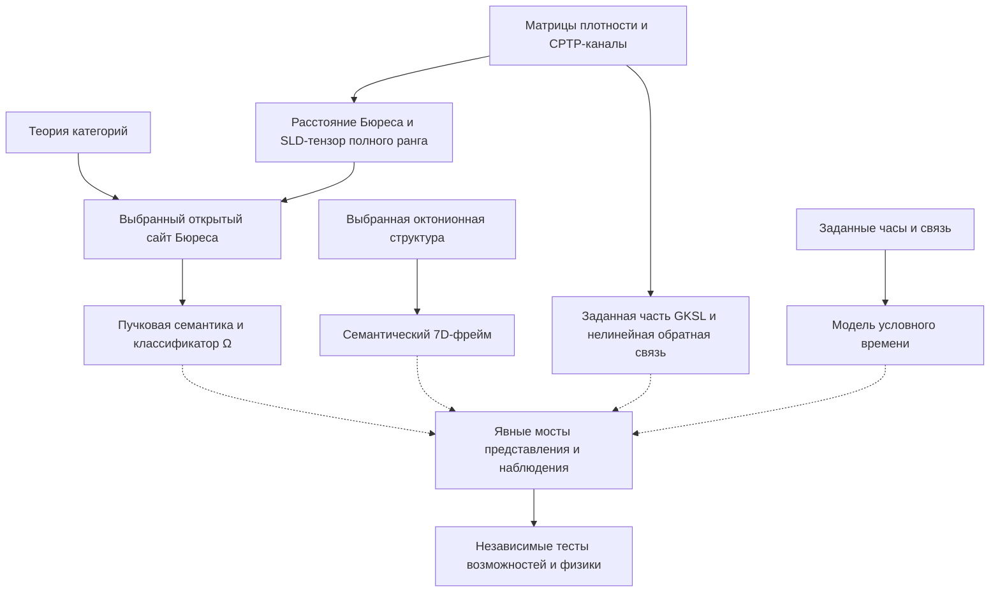
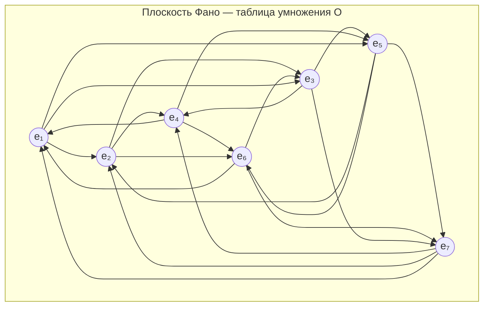

# Математические Основания УГМ

Глава вводит стандартные математические инструменты УГМ и различает их теоремы, дополнительные выборы модели и физические мосты. Существование классификатора, исключительной алгебры или монотонной метрики само по себе не выводит модель сознания, часы, гамильтониан или закон наблюдения.

**Правило чтения.** Стандартные результаты ниже действуют при заявленных предпосылках **[T]**. Выбранный открытый сайт Бюреса, семантический фрейм и численная архитектура — **[P/D]**; физические и феноменальные отождествления остаются **[H/I]**, пока не доказан явный мост. Канонический интерфейс задаёт [типизированное математическое ядро](/docs/reference/mathematical-kernel). Доказанный математический компонент не превращает любое его применение в теорему.

## Великая цепь идей: от Кэли до Лурье {#великая-цепь}

Исторические линии — алгебра (кватернионы и октонионы, нормированные алгебры с делением, группы Ли), геометрия и логика (категории, сайты, пучки и высшие топосы), динамика состояний (матрицы плотности, квантовые каналы и условные модели часов). Они задают разные типы структуры. Гурвиц классифицирует нормированные алгебры с делением; GKSL характеризует фиксированные линейные генераторы CPTP-полугрупп; Петц классифицирует семейство монотонных квантовых метрик. Ни одно утверждение не говорит, что математика оставляет только одну физическую теорию сознания.

Мнимое пространство октонионов семимерно после выбора этой алгебры. Часы требуют заданной подсистемы и наблюдаемых. Двойственность Гельфанда восстанавливает топологический спектр из заданной коммутативной алгебры, а не размерность пространства-времени без дополнительных данных. Эти различения определяют применения ниже.

## 1. Дерево зависимостей {#дерево}

Сплошные стрелки обозначают математические конструкции; пунктирные требуют дополнительных данных моста. Классификатор не задаёт семь проекторов или часы, а примитивный линейный канал не решает задачу нелинейной обратной связи.

## 2. Теория категорий: от Эйленберга к бесконечности-топосам {#теория-категорий}

Первый столп фундамента — **язык**, на котором написана теория. Этот язык — не обычная математическая нотация (множества, формулы, уравнения), а теория категорий — абстрактный формализм, описывающий **отношения** между объектами, а не сами объекты. Выбор языка — не стилистическое решение, а содержательное: категориальный язык естественно описывает квантовые состояния, их преобразования и самореферентные структуры, тогда как теоретико-множественный язык для этих целей непригоден.

### 2.1 Эйленберг и Мак-Лейн (1942–1945) {#эйленберг-маклейн}

**Кто.** Сэмюэл Эйленберг (1913–1998) — польско-американский математик, бежавший из Польши в 1939 году, незадолго до немецкого вторжения. Сондерс Мак-Лейн (1909–2005) — американский математик, учившийся в Гёттингене у Бернайса и Вейля.

**Что сделали.** Эйленберг и Мак-Лейн столкнулись с конкретной проблемой: в алгебраической топологии одни и те же конструкции (группы гомологий, когомологий, гомотопий) появлялись снова и снова в разных контекстах, и каждый раз приходилось доказывать одни и те же свойства заново. Им нужен был **единый язык**, в котором все эти конструкции — частные случаи одной общей схемы. Так родилась **теория категорий**: описание математических структур через **объекты** и **стрелки** (морфизмы) между ними.

Поначалу коллеги восприняли новый формализм скептически. Теорию категорий называли «абстрактной чепухой» (abstract nonsense) — и это прозвище прижилось, хотя со временем превратилось из насмешки в знак уважения.

**Аналогия.** Композиция соединяет маршрут $A\to B$ и маршрут $B\to C$ в один $A\to C$. Лемма Йонеды уточняет математическое утверждение: объект определяется с точностью до изоморфизма своим представимым функтором, включающим все морфизмы и их отношения естественности. Это не доказывает, что выбранное физическое считывание охватывает все физические или феноменальные свойства.

**Формально.** Категория $\mathcal{C}$ состоит из:
- Класса объектов $\mathrm{Ob}(\mathcal{C})$
- Для каждой пары объектов $A, B$ — множества морфизмов $\mathrm{Hom}(A, B)$
- Композиции $\circ: \mathrm{Hom}(B,C) \times \mathrm{Hom}(A,B) \to \mathrm{Hom}(A,C)$ (ассоциативной)
- Тождественных морфизмов $\mathrm{id}_A \in \mathrm{Hom}(A,A)$ для каждого объекта

**Типизированная категория процессов.** Объекты — матричные алгебры $M_N(\mathbb C)$, стрелки — линейные CPTP-отображения. В пунктированной версии объекты имеют вид $(N,\rho)$, а стрелки $K$ удовлетворяют $K(\rho)=\sigma$. Полная положительность дополнительно требует положительности при произвольных анциллах; обычная положительность состояний и сохранение следа её не влекут.

Тензорная единица $M_1(\mathbb C)$ терминальна, с единственным отбрасыванием $X\mapsto\operatorname{Tr}X$. Ни одно пунктированное состояние при $N>1$ не терминально: тождество и замена $X\mapsto\operatorname{Tr}(X)\rho$ — различные эндоморфизмы, фиксирующие $\rho$. При $I_N/N$ это контрпример также для унитальных стрелок. Мажоризация в предпорядке достижимости не доказывает единственность стрелок в категории каналов. Стационарное состояние и динамический аттрактор — третьи, отдельные понятия. Сектор фиксированной $N=7$ тензорно не замкнут; композиция живёт в $D_{49}$. Забывающий пунктированное состояние функтор переводит $(N,\rho)$ в базовую алгебру, а не в однозначно выведенную физическую систему.

### 2.2 Гротендик (1957–1972) {#гротендик}

**Кто.** Александр Гротендик (1928–2014) — один из величайших математиков XX века. Сын анархистов: его отец Александр Шапиро, выходец из Российской империи, погиб в Освенциме в 1942 году; мать Ханка Гротендик — немецкая журналистка. Детство Александра прошло в лагерях для интернированных в Виши. После войны — без гражданства, без денег, без связей — он пришёл в математику и за 15 лет перестроил её до основания.

Гротендик работал с нечеловеческой интенсивностью. За 12 лет (1957–1969) он опубликовал тысячи страниц, переписал основы алгебраической геометрии и создал школу, которая на десятилетия определила развитие математики. В 1966 году получил Филдсовскую медаль. В 1970-м покинул Институт высших научных исследований (IHES) в знак протеста против военного финансирования. В последующие годы написал «Recoltes et Semailles» (Урожаи и посевы, 1985–1987) — более 1000 страниц математической и человеческой рефлексии, в которых анализировал не только свои открытия, но и природу математического творчества, отношения с учениками, и собственное отчуждение от академического мира. Он также написал «Esquisse d'un Programme» (Набросок программы, 1984) — визионерский текст, в котором предложил «башню Тейхмюллера», десинов d'enfants и другие идеи, опередившие время на десятилетия. Последние два десятилетия жизни провёл затворником в деревне Лассер у подножия Пиренеев, отказываясь от контактов с математическим миром. Умер в 2014 году, оставив десятки тысяч страниц неопубликованных рукописей.

**Что сделал.** Гротендик пытался доказать **гипотезы Вейля** — серию утверждений об алгебраических многообразиях над конечными полями, связывающих топологию и арифметику. Для этого ему нужно было обобщить само понятие **пространства**. Обычная топология (открытые множества) оказалась слишком бедной для работы с алгебраическими объектами в характеристике $p$. Гротендик совершил радикальный шаг: вместо изучения **точек** пространства он стал изучать **категории покрытий** — какие «семейства наблюдателей» могут совместно описать объект. Так родились **сайты** (категории с топологией), **пучки** (согласованные локальные данные) и **топосы** (категории пучков). Монументальный труд SGA (Seminaire de Geometrie Algebrique, 1960–1967) — 12 томов семинаров, которые математическое сообщество осваивало десятилетиями.

Пучок организует объявленные локальные данные и их совместимость. Применение этого языка к квантовой модели требует задать сайт и отображение наблюдений; существование квантовых измерений не делает обычную топологию некорректной.

**Аналогия.** Совместимые наблюдения на пересекающихся областях склеиваются в единственное сечение, когда выполнено условие пучка. Формальное условие относится к объявленным данным; оно не доказывает единственное физическое состояние по неполному набору измерений и не вынуждает квантовую интерпретацию любого пучка.

**Формально.** Топология Гротендика задаёт покрывающие сита объектов, удовлетворяющие максимальности, устойчивости при обратном образе и локальности. На категории с обратными образами порождающую предтопологию можно задать покрывающими семействами; ниже приведены её стандартные аксиомы. На выбранном открытом сайте обратные образы — пересечения.

1. **Стабильность** (замкнутость относительно базисной замены): если $\{U_i \to U\}$ — покрытие и $V \to U$ — произвольный морфизм, то $\{U_i \times_U V \to V\}$ — тоже покрытие. Говоря проще: если у вас есть хороший набор фотографий комнаты, и вы переходите в соседнюю комнату (базисная замена), вы можете получить хороший набор фотографий и для неё.
2. **Транзитивность** (композиция покрытий): если $\{U_i \to U\}$ — покрытие и для каждого $i$ даны покрытия $\{V_{ij} \to U_i\}$, то $\{V_{ij} \to U\}$ — тоже покрытие. Если вы фотографируете стену, а затем каждый фрагмент фотографируете крупнее — крупные фотографии тоже покрывают всю стену.
3. **Тривиальность**: тождественный морфизм $\{U \xrightarrow{\mathrm{id}} U\}$ — покрытие. «Фотография в полный рост» — тривиально хорошее покрытие.

**Пучок** $\mathcal{F}$ на сайте $(\mathcal{C}, J)$ — это контравариантный функтор $\mathcal{F}: \mathcal{C}^{op} \to \mathbf{Set}$, удовлетворяющий **условию склейки**: если $\{U_i \to U\}$ — покрытие и данные $s_i \in \mathcal{F}(U_i)$ согласованы на пересечениях ($s_i|_{U_i \times_U U_j} = s_j|_{U_i \times_U U_j}$), то существует единственное $s \in \mathcal{F}(U)$ с $s|_{U_i} = s_i$. По-человечески: если локальные наблюдения согласованы, они однозначно определяют глобальное.

**Топос** — категория всех пучков: $\mathbf{Sh}(\mathcal{C}, J)$. Это «мир», в котором живут согласованные наблюдения. В этом мире есть своя логика (классификатор $\Omega$), своя арифметика (объект натуральных чисел) и свои «пространства» — всё выводится из структуры покрытий.

**Выбранный сайт УГМ [P/D].** Положим $\mathcal O_N=\operatorname{Open}(D_N,d_B)$ со стрелками-включениями и покрытиями $\bigcup_iU_i=U$. Обратный образ — пересечение, поэтому открытые покрытия удовлетворяют аксиомам Гротендика **[T]**. Получаем $\operatorname{Sh}_\infty(\mathcal O_N,J_{\mathrm{open}})$. CPTP-отображение непрерывно по Бюресу; обратные образы открытых связывают процессы с пучковой семантикой. Каналы по определению не являются включениями или покрытиями.

Прежнее доказательство покрытия образами шаров в категории каналов отозвано: сжимаемость не устанавливает обратные подъёмы, pullback или устойчивость сит. Выбор Бюреса задаёт топологию, но не доказывает инвариантность каждого метрически зависимого предсказания. Гладкие монотонные тензоры сравнимы на компактных подмножествах полного ранга с положительным нижним пределом собственных значений, а не автоматически глобально би-липшицевы через всю границу. Матричные математические ожидания непрерывны; проекционный инструмент не требует отказа от обычной топологии. См. [Аксиому Ω⁷](./axiom-omega) и [ядро](../../reference/mathematical-kernel#bures-site).

### 2.3 Лавёр и классификатор подобъектов (1964–1969) {#лавёр-классификатор}

Логика Лавёра–Тирни использует **классификатор подобъектов**: для каждого мономорфизма $S\hookrightarrow X$ характеристическое отображение $\chi_S:X\to\Omega$ классифицирует его pullback морфизма $\top:1\to\Omega$ **[T]**. В пучках на пространстве $\Omega(U)$ — совокупность открытых подмножеств $U$.

**Граница УГМ.** $\Omega$ не является семиэлементной алгеброй проекторов. Связное $D_7$ имеет только два открыто-замкнутых подмножества, а предикаты $\rho_{ii}>0$ перекрываются. Выбранный ортонормированный фрейм задаёт проекторы $P_i=|i\rangle\langle i|$ и семиисходный инструмент **[D]**. Модель GKSL может использовать эти проекторы с объявленными скоростями, но её операторы, гамильтониан и часы не выводятся из логического классификатора. Мост «логика вынуждает физическую диссипацию» отозван; см. [операторы из Ω](./axiom-omega#lk-из-omega).

### 2.4 Лавёр: самореферентность (1969) {#лавёр}

**Условная теорема Лавёра [T].** В декартово замкнутой категории, если задано слабо поточечно сюръективное отображение $A\to B^A$, любой эндоморфизм $B$ имеет глобальную неподвижную точку. Диагональная конструкция использует эту предпосылку представимости; наличие топоса само по себе её не задаёт. Результат не влечёт единственной численной самомодели, сжатия, физической неподвижной точки или феноменального самоосознания. См. [оригинальную статью Лавёра](https://www.its.caltech.edu/~matilde/LawvereDiagonalArgCartesianClosedCats.pdf).

Канонический логический рефлектор носителя — $\operatorname{im}_G:\mathcal E_{/G}\rightleftarrows\operatorname{Sub}_{\mathcal E}(G):i_G$, где $\operatorname{im}_G\dashv i_G$. Это конструкция образа в слое, а не канал на $D_7$. Численная $M:D_7\to D_7$ требует отдельного определения; зависимые от состояния коэффициенты в общем случае делают её нелинейной. Например, $M(\rho)=(1-R(\rho))\mathcal P_\alpha(\rho)+R(\rho)\rho_a$, $R=1/(7\operatorname{Tr}\rho^2)$, автоматически не аффинна и не CPTP. Нужно различать замороженные каналы и полное отображение обратной связи. См. [формализацию φ](/docs/proofs/categorical/formalization-phi).

### 2.5 Лурье (2006/2009) {#лурье}

**Кто.** Джейкоб Лурье (р. 1977) — американский математик, один из наиболее влиятельных математиков своего поколения. Вундеркинд: в 2000 году получил степень PhD в Массачусетском технологическом институте в возрасте 23 лет (научный руководитель — Майкл Хопкинс). В 2007 году стал профессором Гарварда, а в 2009-м — одним из самых молодых профессоров в его истории. Монография *Higher Topos Theory* (925 страниц) была в значительной части написана ещё в аспирантуре; первая версия появилась на arXiv в 2006 году (math/0608040), а книга вышла в Princeton University Press в 2009 году. В 2019 году Лурье покинул Гарвард и перешёл в Институт перспективных исследований (IAS) в Принстоне — тот самый институт, где работали Гёдель и Эйнштейн.

**Что сделал.** Лурье завершил программу, начатую Гротендиком, доведя её до логического предела. Топосы Гротендика работают с обычными категориями, где каждая пара объектов имеет множество морфизмов. Но в современной математике и физике **отношения между отношениями** играют фундаментальную роль: две стрелки могут быть «эквивалентны», но с точностью до гомотопии, которая сама определена с точностью до гомотопии более высокого порядка, и так далее. Лурье создал теорию **$\infty$-топосов** — обобщение топосов Гротендика, где вместо обычных категорий используются $(\infty,1)$-категории, а вместо множеств морфизмов — **пространства** морфизмов (с нетривиальной гомотопической структурой).

**Аналогия.** Обычная категория — это «город с дорогами». $\infty$-категория — это «город с дорогами, переулками между дорогами, проходами между переулками, и так далее до бесконечности». Каждый уровень хранит информацию о том, как связаны связи предыдущего уровня. Почему это важно? Потому что в квантовой теории два состояния могут быть «физически одинаковы» (калибровочно эквивалентны), но способов их отождествления может быть несколько, и выбор между этими способами — сам по себе физическая информация. Обычный топос теряет эту информацию, $\infty$-топос — сохраняет.

**Формально.** $\infty$-топос — это $(\infty,1)$-категория, эквивалентная левой точной локализации $\mathbf{PSh}_\infty(\mathcal{C})$ — категории предпучков $\infty$-группоидов на малой $(\infty,1)$-категории $\mathcal{C}$. В частности, $\mathbf{Sh}_\infty(\mathcal{C}, J)$ — $\infty$-категория пучков на сайте $(\mathcal{C}, J)$.

**Роль [P/H].** УГМ выбирает пучки пространств на открытом сайте Бюреса. Теоремы сравнения применяются только к представлениям, для которых установлена эквивалентность пучковых категорий; они не делают любой предложенный сайт каналов эквивалентным. Высшие пространства отображений допускают заданные согласованные отождествления, но не вынуждают ненулевую гомотопию, $H^7$, семимерную граничную сферу или физическую калибровочную теорию. Само $D_7$ выпукло и стягиваемо. Относительное или зависящее от коэффициентов утверждение о когомологии требует действительной пары, объекта коэффициентов и расчёта; оно не выводится из наличия $\infty$-топоса.

## 3. Алгебра: октонионы и исключительные структуры {#алгебра}

Октонионная алгебра задаёт семимерное мнимое представление после выбора этой алгебры. Семантические роли и физическое семимерное считывание требуют дополнительных предпосылок; алгебраическая классификация сама по себе не считает когнитивные функции.

### 3.1 Кэли и Грейвс (1843–1845) {#кэли}

Эта история начинается с одного из самых романтических эпизодов в математике.

16 октября 1843 года Уильям Роуэн Гамильтон гулял с женой вдоль Королевского канала в Дублине, направляясь на заседание Ирландской академии. Он уже 15 лет бился над проблемой: как обобщить комплексные числа на три измерения? Комплексные числа — это пары $(a, b)$ с умножением $(a,b)(c,d) = (ac-bd, ad+bc)$. Можно ли сделать то же для троек? Ответ — нет (как позже докажет Гурвиц). Но Гамильтон этого ещё не знал, и в тот октябрьский день его осенило: нужны не тройки, а **четвёрки**! Он вырезал на камне моста Брум знаменитую формулу: $i^2 = j^2 = k^2 = ijk = -1$. Так родились **кватернионы** — четырёхмерные числа, в которых умножение **некоммутативно**: $ij = k$, но $ji = -k$.

Друг Гамильтона Джон Грейвс, узнав о кватернионах, спросил: а что будет, если пойти ещё дальше? Уже в декабре 1843 года он сообщил Гамильтону об **октонионах** — восьмимерных числах, в которых теряется не только коммутативность, но и **ассоциативность**: $(ab)c \neq a(bc)$. Грейвс не опубликовал свой результат, и двумя годами позже его независимо переоткрыл и опубликовал Артур Кэли.

**Кто.** Артур Кэли (1821–1895) — британский математик, один из основателей теории матриц. Кэли — один из самых плодовитых математиков в истории: он опубликовал более 900 статей. Примечательно, что первые 14 лет после окончания Кембриджа Кэли работал адвокатом — математика была его хобби. Только в 1863 году, в возрасте 42 лет, он получил математическую кафедру. За эти 14 «адвокатских» лет он опубликовал более 300 математических статей — темп, которому могут позавидовать штатные профессора.

**Что сделал.** Впервые описал **октонионы** — 8-мерную алгебру над вещественными числами. Историческая справедливость требует отметить: октонионы были независимо открыты Джоном Грейвсом в 1843 году, за два года до Кэли, но Грейвс сообщил о них лишь в письме Гамильтону и не опубликовал результат. Кэли опубликовал первым в 1845.

**Аналогия.** Все знают вещественные числа (прямая). Комплексные числа — это «числа на плоскости» (два направления). Кватернионы Гамильтона — «числа в 4D» (ценой потери коммутативности: $ij \neq ji$). Октонионы — следующий шаг: «числа в 8D», которые теряют ещё и ассоциативность: $(ab)c \neq a(bc)$ в общем случае. Зато они — **последние** в этой цепочке: дальнейшее удвоение даёт алгебры без деления. Каждый шаг удвоения — как подъём на следующий этаж: вид всё шире, но пол всё менее устойчив. После октонионов пол проваливается — деление становится невозможным.

Почему октонионы оставались экзотикой более ста лет? Потому что физике хватало кватернионов (для описания спина) и комплексных чисел (для квантовой механики). Октонионы считались «математическим курьёзом без физических приложений». Впрочем, не все думали так: Джон Бэз в своей знаменитой обзорной статье «The Octonions» (2002) писал: «Октонионы — самая экзотическая числовая система, и они, по-видимому, связаны с теорией струн, суперсимметрией и исключительными группами». УГМ утверждает, что связь ещё глубже: октонионы — не экзотика, а **фундамент**.

### 3.2 Диксон и удвоение Кэли–Диксона (1919) {#диксон}

**Кто.** Леонард Юджин Диксон (1874–1954) — американский математик, один из лидеров американской алгебраической школы начала XX века. Автор трёхтомной «History of the Theory of Numbers» (1919–1923), систематизировавшей результаты теории чисел от древних греков до начала XX века.

**Что сделал.** Кэли и Грейвс построили октонионы «вручную». Диксон показал, что за этим стоит **общий механизм** — конструкция удвоения Кэли–Диксона. Идея проста и элегантна: из алгебры $\mathcal{A}$ размерности $n$ строится новая алгебра $\mathcal{A}'$ размерности $2n$. Элементы $\mathcal{A}'$ — пары $(a, b)$ с $a, b \in \mathcal{A}$, умножение определяется формулой:

$$
(a, b) \cdot (c, d) = (ac - \bar{d}b,\; da + b\bar{c})
$$

где $\bar{x}$ — сопряжение в $\mathcal{A}$. Эта единственная формула порождает всю цепочку:

$$
\mathbb{R} \xrightarrow{\text{CD}} \mathbb{C} \xrightarrow{\text{CD}} \mathbb{H} \xrightarrow{\text{CD}} \mathbb{O} \xrightarrow{\text{CD}} \mathbb{S}
$$

На **каждом** шаге удвоения теряется конкретное алгебраическое свойство — и эта потеря необратима:

| Шаг | Переход | Что теряется | Почему |
|---|---|---|---|
| 1 | $\mathbb{R} \to \mathbb{C}$ | **Упорядоченность** | $\mathbb{C}$ нельзя линейно упорядочить совместимо с операциями: нельзя сказать, что $3+i > 2-i$ |
| 2 | $\mathbb{C} \to \mathbb{H}$ | **Коммутативность** | $ij = k$, но $ji = -k$; порядок множителей имеет значение |
| 3 | $\mathbb{H} \to \mathbb{O}$ | **Ассоциативность** | $(e_1 e_2)e_3 \neq e_1(e_2 e_3)$ в общем случае; порядок скобок имеет значение |
| 4 | $\mathbb{O} \to \mathbb{S}$ | **Деление** | Появляются **делители нуля**: произведение ненулевых элементов может быть нулём |

Четвёртый шаг — катастрофический. **Седенионы** $\mathbb{S}$ (размерность 16) уже не являются алгеброй с делением. Конкретный пример делителя нуля в $\mathbb{S}$:

$$
(e_3 + e_{10})(e_6 - e_{15}) = 0
$$

где $e_3, e_{10}, e_6, e_{15}$ — базисные элементы седенионов, каждый из которых ненулевой. Это означает: в $\mathbb{S}$ нельзя «делить» — уравнение $ax = b$ может не иметь решения или иметь бесконечно много решений. Для физической теории, где обратимость операций — необходимое условие предсказательности, это неприемлемо. Октонионы — **последняя** алгебра, где деление возможно.

Закономерность потерь не случайна. Каждое удвоение добавляет новое «мнимое направление», но оплачивает это ослаблением структуры. Можно видеть это как фундаментальный баланс: **богатство** (число измерений) растёт, но **порядок** (алгебраические свойства) убывает. Октонионы — точка оптимального баланса: максимальная размерность при сохранении деления.

**Роль [P/C].** В нормированной цепочке Кэли–Диксона октонионный шаг — последняя нормированная алгебра с делением. Выбор максимальной нормированной алгебры с делением и её мнимого представления даёт размерность семь. Общая композиция, обратимость некоторых операций или нелинейность динамики не требуют этой алгебры; [структурный вывод](../../proofs/minimality/theorem-octonionic-derivation#кэли-диксон) сохраняет предпосылки.

### 3.3 Гурвиц (1898) {#гурвиц}

**Кто.** Адольф Гурвиц (1859–1919) — немецко-швейцарский математик, профессор Цюрихского политехникума (ETH Zurich). Учитель Гильберта, коллега Минковского. Гурвиц обладал необычной математической интуицией: он не просто доказывал теоремы, а чувствовал **границы возможного** — и умел превращать это чувство в строгое доказательство.

**Что сделал.** Представьте себе момент: конец XIX века, Гамильтон и Грейвс нашли кватернионы и октонионы, Диксон показал, как строить алгебры всё бо́льших размерностей. Математики всего мира ищут алгебру с делением в размерности 16, 32, 64... И тут Гурвиц доказывает: **искать бесполезно**. Нормированные алгебры с делением над $\mathbb{R}$ существуют **только** в размерностях 1, 2, 4 и 8. Не «мы пока не нашли в других размерностях» — а «их **не существует**». Точка. Никакая конструкция — удвоение Кэли–Диксона или любая другая — не способна создать нормированную алгебру с делением за пределами этого списка.

Для конечномерной унитальной вещественной алгебры с положительно определённой мультипликативной нормой классификация Гурвица даёт

$$
\mathcal A\cong\mathbb R,\mathbb C,\mathbb H\ \text{или}\ \mathbb O,
\qquad\dim_{\mathbb R}\mathcal A\in\{1,2,4,8\}.
$$

Почему это потрясающе? Потому что четыре числа — 1, 2, 4, 8 — это **всё**. Вся бесконечность натуральных чисел, и только четыре из них допускают алгебру с делением. Это не эмпирический факт (мы проверили и не нашли) — это **математическая необходимость** (мы доказали, что других нет). Такие результаты — редкость. Они говорят не о том, что мы знаем, а о том, что знает сама математика о своих границах.

**Аналогия.** Это как доказать, что правильных многогранников ровно пять (тетраэдр, куб, октаэдр, додекаэдр, икосаэдр) — никакой инженерии, чистая математика запрещает существование шестого. И как платоновы тела появляются в самых неожиданных местах (кристаллография, вирусология, теория графов), так и числа 1, 2, 4, 8 всплывают повсюду: размерности алгебр с делением, параллелизуемые сферы, гопфовы расслоения, суперсимметричные теории в определённых размерностях. Каждое появление — не совпадение, а проявление одной и той же алгебраической необходимости.

**Упражнение для любознательного читателя.** Попробуйте построить алгебру с делением в размерности 3. Определите умножение на трёх базисных элементах $\{1, e_1, e_2\}$ с нормой $|a + be_1 + ce_2|^2 = a^2 + b^2 + c^2$ и потребуйте $|xy| = |x||y|$. Вы обнаружите, что условие мультипликативности нормы приводит к **системе уравнений без решений**. Это — доказательство «на пальцах» того, почему 3 не входит в список Гурвица. Полное доказательство сложнее (использует тождества для квадратичных форм), но идея та же: мультипликативность нормы — очень сильное ограничение.

**Условный мост размерности.** Гурвиц классифицирует конечномерные унитальные вещественные нормированные алгебры композиции/деления. Для выбранного октонионного представления

$$
\mathbb O=\mathbb R1\oplus\operatorname{Im}\mathbb O,\qquad\dim_{\mathbb R}\operatorname{Im}\mathbb O=7.
$$

Его скалярная единица не является условием единичного следа комплексной матрицы плотности. Последнее уменьшает вещественную аффинную размерность эрмитовых матриц $N\times N$ с $N^2$ до $N^2-1$, а не превращает восьмимерную алгебру в $D_7$ размерности $48$. Семантическое отождествление требует явного моста представления **[P/H]**. См. [минимальность](../../proofs/minimality/theorem-minimality-7).

### 3.4 Адамс (1960) {#адамс}

Результат Адамса об инварианте Хопфа один ограничивает размерности, связанные с умножением на сферах. Параллелизуемые сферы — $S^0,S^1,S^3,S^7$ **[T]**. Параллелизуемость требует глобального репера касательных полей, а не одного поля без нулей: любое нечётномерное сферическое пространство имеет касательное поле без нулей. В частности, $S^6$ не параллелизуема.

**Граница УГМ.** Динамика матриц плотности определяется в аффинном пространстве эрмитовых матриц с единичным следом; она не требует параллелизации $S^6$. Поэтому теорема независимо не выводит физическую $N=7$, универсальную когнитивную глубину или глобальный матричный поток. Связь с выбранными алгебрами с делением математична; применение к представлению опыта требует дополнительных предпосылок.

### 3.5 Фано (1892) {#фано}

**Кто.** Джино Фано (1871–1952) — итальянский математик, представитель блестящей итальянской школы алгебраической геометрии. В 1938 году, после принятия фашистских расовых законов, был отстранён от преподавания в Туринском университете. Эмигрировал в Швейцарию, где продолжил работу. Его вклад в конечную геометрию — лишь малая часть обширного наследия, но именно эта часть оказалась удивительно релевантной для физики.

**Что сделал.** Плоскость Фано $\mathrm{PG}(2,2)$ имеет семь точек и семь линий: на каждой линии три точки, через каждую точку проходят три линии. Её конечная группа автоморфизмов транзитивно действует на точках и линиях. Эта симметрия инцидентности не доказывает симметричный гамильтониан, равные семантические роли или единственный физический фрейм; нужны заданные представления и связи.

**Аналогия.** Представьте 7 человек в комнате. Их нужно разбить на «комитеты» по 3 человека так, чтобы любые два человека оказались ровно в одном комитете вместе. Попробуйте! Вы обнаружите, что это возможно, и ровно одним способом — плоскость Фано. (Подсказка: начните с любой тройки, затем попробуйте добавить остальных, соблюдая правило «любая пара — ровно в одном комитете». Вы будете удивлены, насколько жёстко эти ограничения фиксируют всю структуру.)

**Формально.** Точки: $\{1, 2, 3, 4, 5, 6, 7\}$. Линии: $\{1,2,4\}$, $\{2,3,5\}$, $\{3,4,6\}$, $\{4,5,7\}$, $\{5,6,1\}$, $\{6,7,2\}$, $\{7,1,3\}$.

**Исторический мост.** Как *комбинаторный* объект (система троек Штейнера на 7 точках, STS(7) = BIBD(7,3,1)) эта структура старше Фано: она появляется у Киркмана в работе 1847 года о системах троек — потому запись реестра [T-41l] цитирует «Kirkman 1847» для BIBD$(7,3,1)$. Вклад Фано 1892 года — *проективно-геометрическое* прочтение (наименьшая проективная плоскость и её аксиоматика); два имени — одна структура в двух оптиках.

**Таблица умножения октонионов через Фано.** Плоскость Фано — не абстрактная конструкция, а конкретный **вычислительный инструмент**. Каждая из 7 точек соответствует мнимой единице $e_1, \ldots, e_7$ октонионов. Правило умножения: если $(e_i, e_j, e_k)$ — ориентированная линия Фано (тройка, упорядоченная по стрелке), то

$$
e_i \cdot e_j = e_k, \quad e_j \cdot e_i = -e_k
$$

Таким образом, вся таблица умножения октонионов (49 произведений базисных мнимых единиц) **полностью** кодируется диаграммой из 7 точек и 7 направленных линий.

Каждый замкнутый треугольник на диаграмме — одна линия Фано, задающая ассоциативный триплет. Например, линия $\{1, 2, 4\}$ означает: $e_1 e_2 = e_4$, $e_2 e_4 = e_1$, $e_4 e_1 = e_2$ (и с обратным знаком при обратном порядке). Всего 7 таких триплетов — 7 линий Фано.

#### Полная таблица умножения мнимых единиц октонионов {#таблица-умножения-октонионов}

Семь линий Фано определяют все 21 произведение $e_i \cdot e_j$ ($i < j$). Для каждой линии $(e_a, e_b, e_c)$ с ориентацией по стрелке: $e_a e_b = e_c$, $e_b e_a = -e_c$.

**7 линий Фано (ассоциативные триплеты):**

| Линия | Триплет | Произведения |
|-------|---------|-------------|
| $\ell_1$ | $(e_1, e_2, e_4)$ | $e_1 e_2 = e_4$, $e_2 e_4 = e_1$, $e_4 e_1 = e_2$ |
| $\ell_2$ | $(e_2, e_3, e_5)$ | $e_2 e_3 = e_5$, $e_3 e_5 = e_2$, $e_5 e_2 = e_3$ |
| $\ell_3$ | $(e_3, e_4, e_6)$ | $e_3 e_4 = e_6$, $e_4 e_6 = e_3$, $e_6 e_3 = e_4$ |
| $\ell_4$ | $(e_4, e_5, e_7)$ | $e_4 e_5 = e_7$, $e_5 e_7 = e_4$, $e_7 e_4 = e_5$ |
| $\ell_5$ | $(e_5, e_6, e_1)$ | $e_5 e_6 = e_1$, $e_6 e_1 = e_5$, $e_1 e_5 = e_6$ |
| $\ell_6$ | $(e_6, e_7, e_2)$ | $e_6 e_7 = e_2$, $e_7 e_2 = e_6$, $e_2 e_6 = e_7$ |
| $\ell_7$ | $(e_7, e_1, e_3)$ | $e_7 e_1 = e_3$, $e_1 e_3 = e_7$, $e_3 e_7 = e_1$ |

Для получения произведения в обратном порядке: $e_j e_i = -e_i e_j$ (антикоммутативность мнимых единиц). Также $e_i^2 = -1$ для всех $i$.

**Полная таблица $e_i \cdot e_j$ (антисимметричная часть):**

|  | $e_1$ | $e_2$ | $e_3$ | $e_4$ | $e_5$ | $e_6$ | $e_7$ |
|---|:---:|:---:|:---:|:---:|:---:|:---:|:---:|
| $e_1$ | $-1$ | $e_4$ | $e_7$ | $-e_2$ | $e_6$ | $-e_5$ | $-e_3$ |
| $e_2$ | $-e_4$ | $-1$ | $e_5$ | $e_1$ | $-e_3$ | $e_7$ | $-e_6$ |
| $e_3$ | $-e_7$ | $-e_5$ | $-1$ | $e_6$ | $e_2$ | $-e_4$ | $e_1$ |
| $e_4$ | $e_2$ | $-e_1$ | $-e_6$ | $-1$ | $e_7$ | $e_3$ | $-e_5$ |
| $e_5$ | $-e_6$ | $e_3$ | $-e_2$ | $-e_7$ | $-1$ | $e_1$ | $e_4$ |
| $e_6$ | $e_5$ | $-e_7$ | $e_4$ | $-e_3$ | $-e_1$ | $-1$ | $e_2$ |
| $e_7$ | $e_3$ | $e_6$ | $-e_1$ | $e_5$ | $-e_4$ | $-e_2$ | $-1$ |

**Проверка неассоциативности.** Октонионы — **не** ассоциативны. Конкретный пример:

$$
(e_1 e_2) e_3 = e_4 \cdot e_3 = -e_6
$$

$$
e_1 (e_2 e_3) = e_1 \cdot e_5 = e_6
$$

Результаты **различаются знаком**: $(e_1 e_2) e_3 = -e_1 (e_2 e_3)$. Но для элементов одного триплета (например, $e_1, e_2, e_4$ — линия $\ell_1$) ассоциативность выполняется: $(e_1 e_2) e_4 = e_4 \cdot e_4 = -1 = e_1 (e_2 e_4) = e_1 \cdot e_1 = -1$. Это и есть **альтернативность** (теорема Артина, [раздел 3.7](#артин)).

**Роль [T/P/H].** Ориентированная маркировка Фано кодирует выбранную таблицу умножения. Неориентированная инцидентность имеет 168 комбинаторных автоморфизмов; непрерывная $G_2$ сохраняет октонионное умножение, но не произвольный фиксированный набор семи осей как конечное множество перестановок. Эти действия связывает лишь подходящая подгруппа фрейма. Кодирование не запрещает общие внедиагональные элементы матрицы плотности. Физические правила отбора, константы связи и семантические метки требуют заданной инвариантной модели и моста наблюдения; спектр Юкавы или сохраняющийся заряд не следуют из одной инцидентности.

### 3.6 Киллинг и Картан (1888–1894) {#киллинг-картан}

**Кто.** Вильгельм Киллинг (1847–1923) — немецкий математик, всю жизнь проработавший школьным учителем и преподавателем в небольших учебных заведениях, вдали от математических центров. Несмотря на изоляцию, он в одиночку выполнил одну из величайших классификаций в истории математики. Его работа содержала пробелы, которые заполнил Эли Картан (1869–1951) — французский математик, впоследствии признанный одним из крупнейших геометров XX века. Ирония истории: Киллинг совершил открытие, Картан — корректное доказательство, но вместе они создали один из столпов современной математики.

**Что такое алгебра Ли?** Прежде чем говорить о классификации, нужно понять, что классифицируется. **Группа Ли** — это непрерывная группа симметрий: вращения в пространстве ($SO(3)$), унитарные преобразования ($U(n)$), преобразования Лоренца. **Алгебра Ли** — это «инфинитезимальная версия» группы: вместо конечных поворотов — бесконечно малые. Например, алгебра Ли группы вращений записывает бесконечно малые вращения.

Формально алгебра Ли — векторное пространство с билинейной антисимметричной скобкой, удовлетворяющей тождеству Якоби $[X,[Y,Z]]+[Y,[Z,X]]+[Z,[X,Y]]=0$. Для матричной алгебры Ли скобка равна $[X,Y]=XY-YX$. Абстрактная скобка Ли не обязана определяться заранее заданным ассоциативным произведением.

**Аналогия.** Алгебра Ли записывает бесконечно малые направления у единицы. Она определяет локальную структуру группы и в конечной размерности её односвязную интеграцию, но не любую глобальную фактор-группу. Экспоненциальное отображение задаёт локальные данные и не всегда глобально сюръективно.

**Что сделали.** Киллинг и Картан задали вопрос: какие конечномерные простые комплексные алгебры Ли существуют? «Простая» означает: неразложимая на более мелкие части (аналог простого числа для групп). Ответ оказался одним из самых красивых результатов в математике: помимо четырёх бесконечных серий ($A_n, B_n, C_n, D_n$), соответствующих «обычным» симметриям (унитарные, ортогональные, симплектические преобразования), существуют ровно **5 исключительных** простых алгебр Ли:

$$
G_2 \quad F_4 \quad E_6 \quad E_7 \quad E_8
$$

с размерностями 14, 52, 78, 133, 248 соответственно. Пять «аномалий» — не артефакт классификации: они отражают глубинные математические необходимости, связанные с октонионами. Классификация получается через **диаграммы Дынкина** — графы, кодирующие структуру корневой системы. Каждой простой алгебре Ли соответствует ровно одна диаграмма, и типов семейств конечное число, но ранги классических семейств не ограничены. Это как периодическая таблица для симметрий: все возможные «элементы» перечислены, и новых быть не может.

**Ключевой факт.** $G_2 = \mathrm{Aut}(\mathbb{O})$ — группа автоморфизмов октонионов. Это единственная из исключительных групп, которая появляется как группа симметрий алгебры с делением. Связь между исключительными группами и октонионами — одна из самых глубоких и наименее понятых в математике. Все пять исключительных групп ($G_2, F_4, E_6, E_7, E_8$) связаны с октонионами: $G_2$ — автоморфизмы $\mathbb{O}$, $F_4$ — автоморфизмы исключительной алгебры Йордана $\mathcal{H}_3(\mathbb{O})$, а $E_6$, $E_7$, $E_8$ возникают из конструкций Фрейденталя–Титса. Но для УГМ нужна именно $G_2$ — наименьшая и «ближайшая к октонионам».

**Математическая роль.** $G_2=\operatorname{Aut}(\mathbb O)$, $\dim G_2=14$ и ранг $2$ — алгебраические результаты. Исключительная жорданова алгебра $\mathcal H_3(\mathbb O)$ имеет ранг три и группу автоморфизмов $F_4$. Её алгебраический ранг не доказывает $\mathrm{SAD}_{\max}=3$ или предел предсказательной башни агента. Конечная оценка, совместимая башня, тензорная композиция и включение исключительных групп — разные структуры.

Ранговое препятствие исключает вложение $SU(3)\times SU(2)\times U(1)$ в $G_2$: ранг $4$ превышает ранг $2$. $SU(3)\subset G_2$ стабилизирует мнимую единицу, но полный мост Стандартной модели требует дополнительной геометрии и представлений. Архитектура исключительных групп — гипотеза дизайна, а не теорема масштабирования любой композиции через $G_2,F_4,E_6,E_7,E_8$.

Применение Нётер требует инвариантного вариационного действия, а не одной ковариантности диссипативного потока. Ни логический классификатор, ни общая самореференция не вынуждают удвоение Кэли–Диксона, ориентацию или единственное физическое представление. См. [единственность](../../proofs/categorical/uniqueness-theorem), [башню глубины](/docs/consciousness/hierarchy/depth-tower) и [гиперматематику](./hypermathematics) с явными предпосылками.

### 3.7 Артин (1927) {#артин}

Октонионы неассоциативны — $(ab)c \neq a(bc)$ в общем случае. Это создаёт серьёзную проблему: как определить физические операции (эволюцию, взаимодействия) в алгебре, где порядок скобок имеет значение? Ответ Артина: не нужно работать со всеми тремя элементами сразу — достаточно работать с парами.

**Кто.** Эмиль Артин (1898–1962) — австрийско-американский математик, один из крупнейших алгебраистов XX века. Родился в Вене, работал в Гамбурге. В 1937 году эмигрировал в США (его жена была частично еврейского происхождения), преподавал в Принстоне и Индиане, вернулся в Гамбург в 1958 году. Его стиль — элегантность и минимализм: каждая теорема содержит ровно столько, сколько нужно, ни слова лишнего.

**Что сделал.** Доказал **теорему Артина**: в **альтернативной** алгебре (удовлетворяющей двум приведённым ниже тождествам альтернативности) всякая подалгебра, порождённая двумя элементами, ассоциативна. Октонионы альтернативны — и это проверяется:

**Альтернативность** означает два тождества для любых $a, b$:
- Левая: $(aa)b = a(ab)$
- Правая: $(ab)b = a(bb)$

**Конкретная проверка.** Возьмём $a = e_1$, $b = e_2$:
- Левая: $(e_1 e_1)e_2 = (-1)e_2 = -e_2$. И $e_1(e_1 e_2) = e_1 \cdot e_4 = -e_2$. Совпадает! ✓
- Правая: $(e_1 e_2)e_2 = e_4 \cdot e_2 = -e_1$. И $e_1(e_2 e_2) = e_1 \cdot (-1) = -e_1$. Совпадает! ✓

Но **ассоциативность** в целом **не** выполняется (мы уже видели: $(e_1 e_2) e_3 \neq e_1(e_2 e_3)$).

Смысл теоремы Артина: хотя три произвольных октониона не обязаны подчиняться $(ab)c = a(bc)$, любая **пара** октонионов ведёт себя как обычные ассоциативные числа. Все выражения, в которых участвуют только **два** различных октониона (в любых комбинациях), вычисляются однозначно — порядок скобок не имеет значения. Проблемы начинаются только с тремя и более различными элементами.

**Аналогия.** Представьте танцевальную пару: любые два танцора могут танцевать слаженно (ассоциативно). Но стоит добавить третьего — и порядок, в котором они взаимодействуют, начинает иметь значение. Тройка может «запутаться», если расставить скобки неправильно. Артин доказал: пока мы работаем с парами, всё в порядке.

**Роль [T/C].** Теорема Артина контролирует произведения в альтернативной алгебре; выбранные кватернионные подалгебры Фано ассоциативны. Стандартное умножение комплексных матриц $7\times7$ и композиция CPTP ассоциативны независимо от этой теоремы. Корректность Линдбладовской динамики не опирается на альтернативность октонионов. Применение октонионного умножения в модели связи требует отдельно заданного представления; элементы когерентности по определению не являются октонионами.

## 4. Квантовая теория: от фон Неймана к Линдбладу {#квантовая-теория}

### 4.1 Фон Нейман (1932) {#фон-нейман}

**Кто.** Джон фон Нейман (1903–1957) — венгерско-американский математик и физик, которого часто называют «последним из великих математиков-универсалов». Его вклад в науку поражает широтой: математические основания квантовой механики (1932), теория игр (1944, совместно с Моргенштерном), архитектура компьютера (архитектура фон Неймана, 1945), теория самовоспроизводящихся автоматов, эргодическая теория, функциональный анализ (алгебры фон Неймана), а также участие в Манхэттенском проекте. Коллеги вспоминали его способность мгновенно переключаться между несвязанными областями и находить неожиданные связи.

**Что сделал.** В 1932 году, в возрасте 28 лет, опубликовал монографию *Mathematische Grundlagen der Quantenmechanik*, которая раз и навсегда поставила квантовую механику на строгий математический фундамент. Ключевое нововведение — **матрица плотности** $\rho$ для описания смешанных состояний (когда система находится в статистической смеси чистых состояний) и уравнение эволюции замкнутой системы:

$$
\frac{d\rho}{dt} = -\frac{i}{\hbar}[H, \rho]
$$

Матрица плотности описывает чистые и смешанные состояния. Внедиагональные когерентности зависят от объявленного базиса; смешанность не эквивалентна наличию когерентности, а смешанное состояние диагонально в собственном базисе. При фиксированном эрмитовом гамильтониане унитарное движение сохраняет спектр и чистоту **[T]**. Выбор $D_7$ и связь его элементов с семантическими или опытными ролями — дополнительные выборы УГМ **[P/H]**.

### 4.2 Линдблад (1976) {#линдблад}

**Кто.** Йоран Линдблад (1940–2008) — шведский математический физик, работавший в Королевском технологическом институте (KTH) в Стокгольме. Его работа 1976 года «On the generators of quantum dynamical semigroups» — одна из наиболее цитируемых в математической физике (более 10 000 цитирований), хотя сам Линдблад оставался сравнительно малоизвестной фигурой за пределами узкого круга специалистов. В отличие от фон Неймана, чьё имя знает каждый физик, Линдблад известен лишь через своё уравнение — но это уравнение используется в квантовой оптике, физике конденсированных сред, квантовых вычислениях и теории открытых систем.

**Область GKSL [T].** Фиксированный конечномерный линейный генератор непрерывной по норме CPTP-полугруппы имеет вид

$$
\mathcal L(\rho)=-i[H,\rho]+\sum_k\left(L_k\rho L_k^\dagger-\tfrac12\{L_k^\dagger L_k,\rho\}\right).
$$

Это характеризует класс генераторов, но не выбирает $H$, каналы или скорости. Производная коммутатора эрмитова, а не обязательно поэлементно вещественна. Семь выбранных проекторов задают одну модель дефазировки, а не следствие $\Omega$.

**Контрпример прежнему утверждению о смешивании.** При $L_k=\sqrt\gamma|k\rangle\langle k|$ все диагональные населённости постоянны, а внедиагональные элементы затухают со скоростью $\gamma$. Предел — начальная диагональ, а не обязательно $I_7/7$. Канал амплитудного затухания может повышать чистоту и приближаться к чистому состоянию. Рост энтропии и падение чистоты требуют соответствующих предпосылок унитальности; сходимость к $I_7/7$ дополнительно требует смешивания/примитивности.

Численный поток обратной связи

$$
\dot\rho=\mathcal L(\rho)+a(\rho)(M(\rho)-\rho),\qquad a\ge0,
$$

в общем случае нелинеен. При локально липшицевых сохраняющих состояния $M,a$ он остаётся корректным потоком области состояний при условиях ядра, но автоматически не является полугруппой GKSL. Физическая энергия и ресурсные потоки окружения требуют собственной модели, а биологический критерий жизни/смерти не следует из формы GKSL.

### 4.3 Горини, Коссаковски, Судершан (1976) {#гкс}

Замечательное совпадение: в том же 1976 году, независимо от Линдблада, итальянско-польско-индийская группа пришла к тому же результату другим путём.

**Кто.** Витторио Горини, Анджей Коссаковски, Джордж Судершан. Работа опубликована одновременно с Линдбладом (1976). Судершан (1931–2018) — выдающийся индийско-американский физик, известный также работами по квантовой оптике и тахионам.

Горини, Коссаковский и Сударшан независимо получили характеристику конечномерных квантовых динамических полугрупп. Предпосылки включают линейность, полную положительность и полугрупповой закон. Конечная размерность и связь с окружением сами по себе не влекут марковскую полугрупповую динамику: память, управление во времени и зависящая от состояния обратная связь требуют отдельного анализа. Представление генератора также имеет свободы; оно не является единственным физическим законом эволюции.

### 4.4 Пейдж и Вуттерс (1983) {#пейдж-вуттерс}

**Кто.** Дон Пейдж (р. 1948) — канадский физик, известный также как один из немногих учеников Стивена Хокинга, ставших самостоятельными крупными исследователями. Уильям Вуттерс (р. 1951) — американский физик, один из авторов теоремы о невозможности клонирования квантовых состояний (1982).

Пейдж и Вуттерс предложили условную динамику относительно **заданной подсистемы часов** и глобальной связи. Уравнение $\hat C|\Psi\rangle=0$ ограничивает состояние, а не утверждает, что оператор гамильтониана нулевой. См. [оригинальную статью](https://journals.aps.org/prd/abstract/10.1103/PhysRevD.27.2885).

При $\mathcal H_{\mathrm{ext}}=\mathcal H_C\otimes\mathcal H_{\mathrm{sys}}$, совместном состоянии и эффектах часов $E_\tau$ определяют

$$
\widetilde\rho_{\mathrm{sys}}(\tau)=\operatorname{Tr}_C\big[(\sqrt{E_\tau}\otimes I)\Gamma_{\mathrm{ext}}(\sqrt{E_\tau}\otimes I)\big],\qquad
\rho_{\mathrm{sys}}(\tau)=\frac{\widetilde\rho_{\mathrm{sys}}(\tau)}{\operatorname{Tr}\widetilde\rho_{\mathrm{sys}}(\tau)}
$$

при положительном знаменателе. Ковариантные идеальные часы и подходящая связь дают соответствующую условную эволюцию; тензорное разложение само по себе её не выбирает. Ось O в $\mathbb C^7$ — одномерное слагаемое, а не нетривиальный фактор часов. Выбранная 42D-модель вместо этого задаёт семимерный фактор часов и шестимерный фактор системы как дополнительные данные.

**Область T-53a.** Объявленное семиэлементное множество меток можно биективно перемаркировать как $\mathbb Z_7$ или выбранный семиточечный регистр **[T]**. Эквивалентность множеств меток не доказывает, что фаза, диссипация или стратификация порождают одинаковые часы, порядок, единицы или динамику. Позиционные регистры глубины и масштабные пределы также требуют заданного порядка, вложений и данных часов/связи; апериодическое время или физический закон энергии не выводятся из одних O-меток. Конечные показания часов, идеальная условная динамика и параметр диссипативного потока должны оставаться различными. См. [эмерджентное время](../../proofs/dynamics/emergent-time).

### 4.5 Ченцов и Петц {#ченцов-петц}

**Кто.** Николай Ченцов (1930–1992) — советский математик, один из основателей информационной геометрии, работавший в Математическом институте им. Стеклова. Его монография «Статистические решающие правила и оптимальные выводы» (1972) заложила основы геометрического подхода к статистике, хотя за пределами СССР эти идеи стали широко известны лишь после перевода на английский. Дейнеш Петц (1953–2018) — венгерский математик из Будапештского технического университета, специалист по квантовой теории информации.

Классическая единственность монотонной метрики и квантовая классификация метрик — разные теоремы. Квантовые метрики Петца образуют бесконечное семейство; Бюрес — выбранный минимальный SLD-член при фиксированной нормировке, а не единственная монотонная метрика или уникальное правило вывода MaxEnt. См. [Petz (1996)](https://www.sciencedirect.com/science/article/pii/0024379594002118).

При корневой точности $f(\rho,\sigma)=\operatorname{Tr}\sqrt{\sqrt\rho\sigma\sqrt\rho}$ и квадрате точности $F=f^2$

$$
d_B^2=2(1-f)=2(1-\sqrt F).
$$

Для полного ранга $\rho$ с собственными значениями $\lambda_i>0$ и эрмитового бесследового касательного $X$ тензор Бюреса равен

$$
g_B(X,X)=\frac12\sum_{i,j}\frac{|X_{ij}|^2}{\lambda_i+\lambda_j}
=\frac14\operatorname{Tr}(\rho L_X^2),\qquad
X=\tfrac12(\rho L_X+L_X\rho).
$$

Это **четверть информации Фишера SLD**, а не ненормированный тензор. Метрическое расстояние продолжается на граничные состояния; формулу полного ранга со знаменателями нельзя считать глобально гладким граничным тензором. CPTP-отображения сжимают $d_B$ **[T]**. Гладкие монотонные метрики сравнимы на компактных подмножествах полного ранга с константами, зависящими от нижнего предела спектра; это не универсальная граничная би-липшицевость или эквивалентность физических предсказаний.

**Исправленный численный пример.** Для $\rho=\operatorname{diag}(3/7,1/7,1/7,1/7,1/7,0,0)$ и $\sigma=I_7/7$

$$
P(\rho)=13/49,\quad f=(\sqrt3+4)/7\approx0.8188644,\quad d_B\approx0.6018897.
$$

Это числа пространства состояний, а не клиническая дистанция от «хаоса». Выбранный открытый сайт Бюреса использует обычные открытые покрытия; метрические тензоры и физические данные считывания добавляют дальнейшую структуру.

### 4.6 Берри (1984) {#берри}

Все предыдущие результаты этого раздела описывают **локальную** динамику: что происходит в каждый момент времени. Но есть эффекты, которые проявляются только при **циклической** эволюции — когда система возвращается в исходное состояние, но «помнит», что прошла цикл.

**Кто.** Майкл Берри (р. 1941) — британский физик, профессор Бристольского университета, рыцарь-бакалавр (с 1996). Берри известен своей способностью находить глубокую физику в повседневных явлениях: от радуги до кофейных пятен.

**Что сделал.** Открыл **геометрическую фазу** (1984): при адиабатическом циклическом изменении параметров гамильтониана квантовое состояние приобретает дополнительную фазу, определяемую геометрией (кривизной) пространства параметров, а не динамикой. Замечательно, что аналогичные эффекты были замечены раньше (Панчаратнам в оптике, 1956), но именно Берри понял **общность** явления.

$$
\gamma_n = i \oint \langle n(\mathbf{R}) | \nabla_{\mathbf{R}} | n(\mathbf{R}) \rangle \cdot d\mathbf{R}
$$

**Аналогия.** Представьте, что вы несёте стрелку компаса по замкнутому маршруту на поверхности сферы (параллельный перенос). Вернувшись в исходную точку, вы обнаруживаете, что стрелка повёрнута — хотя на каждом малом участке пути вы её не поворачивали. Этот «дефицит угла» — геометрическая фаза, определяемая кривизной сферы и площадью обойдённого маршрута.

**Роль [C/H].** Фаза Берри записывает геометрию заданного адиабатического циклического расслоения собственных состояний. Она автоматически не является квантованным топологическим инвариантом, энергетическим барьером или защитой от декогеренции. Защита требует заданного кодирования, спектральной щели, модели возмущений и оценки ошибки. Одна температура не фиксирует время жизни когерентности как $\hbar/(k_BT)$. Связь геометрической фазы с фазовой статистикой Gap или биологической памятью остаётся явной гипотезой-мостом; см. [Gap-динамику](../dynamics/gap-dynamics).

## 5. Некоммутативная геометрия: Конн {#некоммутативная-геометрия}

### 5.1 Гельфанд и Наймарк (1943) {#гельфанд-наймарк}

**Кто.** Израиль Гельфанд (1913–2009) — один из крупнейших математиков XX века, работавший в Москве. Его знаменитый семинар в МГУ (проводился с 1943 по 1989 год) был одним из главных интеллектуальных центров мировой математики. Марк Наймарк (1909–1978) — советский математик, специалист по функциональному анализу и теории представлений.

**Что сделали.** Доказали результат, который Конн впоследствии назвал «основной дуальностью алгебраической геометрии» — **теорему Гельфанда**: каждая коммутативная $C^*$-алгебра $\mathcal{A}$ изоморфна алгебре непрерывных функций $C_0(X)$ на некотором локально компактном хаусдорфовом пространстве $X$, и наоборот:

$$
\mathcal{A} \cong C_0(X) \quad \Leftrightarrow \quad X = \mathrm{Spec}(\mathcal{A})
$$

**Аналогия.** Коммутативная $C^*$-алгебра восстанавливает свой локально компактный хаусдорфов спектр и топологию. Расстояния и гладкая структура — дополнительные данные; они не следуют из одной топологической алгебры. Для метрической геометрии спектральная тройка добавляет представление и оператор Дирака.

**Роль [C/H].** Заданная коммутативная $C^*$-алгебра имеет локально компактный хаусдорфов спектр **[T]**. Например, $\mathbb C^3$ имеет трёхточечный спектр. Теорема восстанавливает топологию, а не метрику или четырёхмерное пространство-время из одной коммутативности. Макроскопические средние и флуктуации квантового центрального предела используют разное масштабирование; флуктуации не обязаны быть коммутативными. Интерпретация пространства-времени УГМ требует действительной предельной алгебры, вложений и геометрических данных. См. [эмерджентное многообразие](../../proofs/physics/emergent-manifold).

### 5.2 Конн (1990–1996) {#конн}

**Кто.** Ален Конн (р. 1947) — французский математик, лауреат Филдсовской премии (1982), профессор Коллеж де Франс и Института высших научных исследований (IHES) — того самого, который покинул Гротендик. Конн — один из немногих математиков, чья программа явно нацелена на объединение квантовой механики и гравитации. Его подход радикально отличается от струнной теории и петлевой квантовой гравитации: вместо квантования пространства-времени он предлагает **заменить** пространство-время алгеброй.

**Что сделал.** Конн задался вопросом: можно ли сохранить геометрию, отказавшись от пространства? Его ответ — **некоммутативная геометрия** — разрабатывался на протяжении двух десятилетий. Основные вехи:

- **1990**: совместная работа с Лоттом — первая реконструкция Стандартной модели из некоммутативной геометрии
- **1994**: монументальная монография *Noncommutative Geometry* (Academic Press, 661 стр.) — систематическое изложение всей программы
- **1996**: совместная работа с Шамседдином — **спектральное действие**, из которого следуют и гравитация, и Стандартная модель

Центральное понятие — **спектральная тройка** $(A, H, D)$. Каждый элемент тройки имеет ясный физический и геометрический смысл:

| Элемент | Математический смысл | Геометрический смысл | Физический смысл |
|---|---|---|---|
| $A$ | (некоммутативная) $*$-алгебра | «функции на пространстве» | алгебра наблюдаемых |
| $H$ | гильбертово пространство | «спиноры на пространстве» | пространство состояний |
| $D$ | самосопряжённый оператор | **оператор Дирака** | кодирует метрику + дифференциальную структуру |

Ключевое наблюдение: **оператор Дирака $D$ кодирует метрику**. В обычной римановой геометрии расстояние определяется инфимумом длин путей. В некоммутативной геометрии Конна расстояние определяется **дуально** — через алгебру:

$$
d(p, q) = \sup\{|f(p) - f(q)| : \|[D, f]\| \leq 1\}
$$

Эта формула говорит: расстояние между двумя точками — это максимальная разность значений «функции» $f$, при условии что «производная» $f$ (коммутатор $[D, f]$) ограничена единицей. Для коммутативного случая (обычное многообразие) формула воспроизводит геодезическое расстояние. Для некоммутативного — **обобщает** понятие расстояния на объекты, не имеющие точек в обычном смысле.

Ключевая формула — **спектральное действие** (Конн, Шамседдин, 1996):

$$
S = \mathrm{Tr}\left(f\!\left(\frac{D}{\Lambda}\right)\right) + \langle \psi, D\psi \rangle
$$

Разберём оба слагаемых:

**Первое слагаемое: $\mathrm{Tr}\left(f\!\left(\frac{D}{\Lambda}\right)\right)$ — бозонное действие.** Это след функции $f$ от оператора $D/\Lambda$. Оператор $D$ имеет дискретный спектр $\{\lambda_n\}$ (собственные значения), и след вычисляется как $\sum_n f(\lambda_n / \Lambda)$. Функция $f$ «обрезает» высокие энергии: при $|\lambda_n| \gg \Lambda$ вклад подавлен. При асимптотическом разложении этот след распадается на:

$$
\mathrm{Tr}(f(D/\Lambda))\sim\Lambda^4 A_0(f,D)+\Lambda^2 A_2(f,D)+A_4(f,D)+\ldots
$$

Здесь предполагаются заданная регулярная четырёхмерная спектральная геометрия и совместимая срезающая функция. Коэффициенты включают соответствующие моменты среза и тепловые инварианты; разложение не выводит размерность из произвольной матрицы плотности.

**Второе слагаемое: $\langle \psi, D\psi \rangle$ — фермионное действие.** Это действие Дирака для спиноров $\psi$: описывает материю (кварки, лептоны). Вместе два слагаемых дают **полный** лагранжиан: гравитация + калибровочные поля + материя + Хиггс.

Замечательный факт: при подходящем выборе алгебры $A$ (почти-коммутативная геометрия $M^4 \times F$, где $F$ — конечное внутреннее пространство), из этого **единственного** принципа выводятся лагранжиан Стандартной модели + гравитация Эйнштейна–Гильберта. Все калибровочные поля, механизм Хиггса, массы фермионов — всё следует из спектра $D$ и структуры $A$. Конн и Шамседдин не подбирали лагранжиан — они **вычислили** его из геометрических данных.

**Область УГМ [C/H].** Спектральная тройка и действие — инструменты, зависящие от заданных алгебры, представления, оператора Дирака, регулярности и размерности. Четырёхмерное тепловое разложение использует четырёхмерные геометрические данные; оно не выводит четыре измерения из произвольного состояния $7\times7$. Одна двойственность Гельфанда не фиксирует ни метрику, ни гладкость. Теоремы реконструкции требуют предпосылок, а почти-коммутативная конструкция Стандартной модели задаёт конечные внутренние данные, а не выводит их из $\Omega$.

Пределы регистров времени, пространственная интерпретация зарядов и произведение $\mathbb R\times\Sigma^3$ требуют независимых алгебраических и физических мостов. Указанная [программа эмерджентного многообразия](../../proofs/physics/emergent-manifold) содержит эти условия; обзор не утверждает их универсального следования из $D_7$ или закрытости всех структурных/физических вопросов.

## 6. Теория кодирования {#теория-кодирования}

### 6.1 Шеннон (1948) {#шеннон}

**Кто.** Клод Шеннон (1916–2001) — американский математик и инженер, «отец теории информации». Работал в Bell Telephone Laboratories. Его магистерская диссертация 1937 года, в которой он применил булеву алгебру к проектированию электрических схем, считается одной из самых важных магистерских работ в истории. Шеннон был известен не только глубиной мысли, но и эксцентричностью: он жонглировал, ездил по коридорам Bell Labs на одноколёсном велосипеде и строил бесполезные машины.

**Что сделал.** В 1948 году опубликовал статью «A Mathematical Theory of Communication» — одну из самых влиятельных научных работ XX века. Основал **теорию информации**: ввёл понятие энтропии как меры неопределённости, канала связи как математической абстракции, пропускной способности как фундаментального предела. Доказал две теоремы кодирования: одну для сжатия данных (кодирование источника), другую для передачи по шумному каналу (канальное кодирование). До Шеннона «информация» была размытым понятием; после него — точной измеримой величиной.

**Формально.** Энтропия Шеннона:

$$
H(X) = -\sum_i p_i \log p_i
$$

Пропускная способность канала $C = \max_{p(x)} I(X; Y)$, где $I(X;Y)$ — взаимная информация.

**Роль [C/H].** Границы кодирования или обучения требуют заданных алфавита/ансамбля, канала наблюдения, априорных вероятностей, критерия потерь и протокола выборки. Квантовый показатель Чернова — асимптотическая величина различения, а не универсальная граница числа наблюдений при конечной выборке, выведенная Шенноном для любой когнитивной задачи. Информационные меры и физическая энергия/опыт имеют разные типы; их связь требует дополнительных данных.

### 6.2 Хэмминг (1950) {#хэмминг}

**Кто.** Ричард Хэмминг (1915–1998) — американский математик, работавший в Bell Labs вместе с Шенноном. История создания его кода — пример того, как раздражение порождает математику. В конце 1940-х Bell Labs использовали релейные вычислительные машины. Когда в перфокарте возникала ошибка, машина останавливалась и ждала оператора. По выходным операторов не было, и расчёты Хэмминга, запущенные в пятницу, к понедельнику оказывались прерваны. «Если машина умеет обнаружить ошибку, — рассуждал Хэмминг, — почему бы ей не исправить её самостоятельно?» Так из чистого практического неудобства родилась теория помехоустойчивого кодирования.

**Что сделал.** Изобрёл **код Хэмминга** $H(7,4)$: линейный код, исправляющий одиночные ошибки. 4 информационных бита кодируются в 7-битное слово с помощью 3 контрольных битов. Это **совершенный код исправления одной ошибки**: каждый из $2^7 = 128$ возможных 7-битных векторов либо является кодовым словом, либо находится на расстоянии ровно 1 от единственного кодового слова.

**Аналогия.** Вы передаёте сообщение по шумному каналу. Вместо 4 символов вы отправляете 7, добавив 3 «проверочных». Если один символ исказился — вы его найдёте и исправите. Аналогия с сознанием: 4 «информационных» измерения ($A, S, D, L$) несут основное содержание, а 3 «структурных» ($E, O, U$) обеспечивают устойчивость. Но границы аналогии важны: в отличие от кода Хэмминга, «ошибки» в сознании — это не случайные битовые сбои, а диссипативная потеря когерентности, и «исправление» — не детерминированный алгоритм, а регенерация $\mathcal{R}$.

**Формально.** Матрица проверки:

$$
H = \begin{pmatrix} 1 & 0 & 1 & 0 & 1 & 0 & 1 \\ 0 & 1 & 1 & 0 & 0 & 1 & 1 \\ 0 & 0 & 0 & 1 & 1 & 1 & 1 \end{pmatrix}
$$

Столбцы $H$ — 7 ненулевых двоичных векторов длины 3 — это в точности 7 точек плоскости Фано.

**Результат кодирования [T].** Бинарный код Хэмминга $(7,4,3)$ совершенен для исправления одной ошибки: $16(1+7)=128$. В общем случае длины Хэмминга равны $2^r-1$, поэтому семь не является единственной нетривиальной совершенной длиной. Столбцы проверочной матрицы — точки Фано; носители кодовых слов веса три — линии после согласования меток координат. Для приведённой таблицы октонионов перестановка единиц в столбцы равна $(1,2,4,3,6,7,5)$; суммы линий тогда нулевые в $\mathbb F_2^3$.

Разделение семантических ролей на четыре информационные и три структурные — выбранная архитектура **[D/H]**, а не бинарный код по определению. Исправление бита требует кодировщика, канала и декодера этого кода; оно не доказывает исправление повреждённого когнитивного измерения, наличие трёх непрозрачных Gap-пар, жизнеспособность или универсальный потолок глубины.

### 6.3 Великий треугольник: Фано — Хэмминг — Октонионы {#великий-треугольник}

Точное конечное соответствие: семь проективных точек являются проверочными столбцами, а семь проективных линий — носителями кодовых слов веса три. Дополнительная ориентированная маркировка кодирует октонионное умножение. Это связанные математические структуры с разными данными, а не тождественные объекты.

Конечная группа автоморфизмов Фано и подходящая знаковая подгруппа фрейма $G_2$ связывают выбранные маркировки. Общие непрерывные преобразования $G_2$ вращают мнимый базис и не действуют как перестановки фиксированного бинарного кода. Перевод конечного соответствия в физические правила отбора или самокоррекцию требует объявленного представления, модели связи и считывания **[H]**; он не фиксирует универсально семь семантических ролей или когнитивную глубину.

## 7. Классические результаты {#классика}

### 7.1 Нётер (1918) {#нётер}

**Кто.** Эмми Нётер (1882–1935) — немецкий математик, одна из основоположниц абстрактной алгебры. Её путь в науку был борьбой с институциональными барьерами. В 1915 году Давид Гильберт пригласил Нётер в Гёттинген, но философский факультет отказал ей в праве читать лекции — потому что она была женщиной. Гильберт, возмущённый, заявил на заседании факультета: «Я не понимаю, чем пол кандидата может помешать её допуску в качестве приват-доцента. Ведь мы же в университете, а не в бане». Четыре года Нётер читала лекции, формально объявленные от имени Гильберта. Хабилитацию она получила лишь в 1919 году. В 1933-м, после прихода нацистов к власти, была уволена как еврейка и эмигрировала в США, где работала в Брин–Мор-колледже. Умерла в 1935 году в возрасте 53 лет от осложнений после операции. Эйнштейн в некрологе для New York Times назвал её «самым значительным творческим математическим гением с тех пор, как женщины получили доступ к высшему образованию».

**Что сделала.** Первая теорема Нётер связывает ток, сохраняющийся на решениях уравнений движения, с дифференцируемой однопараметрической вариационной симметрией заданного действия. Сохранение интегрального заряда также требует подходящих граничных условий. Это условное утверждение не относится к любой симметрии произвольной диссипативной физической системы.

**Аналогия.** Симметрии подходящего действия относительно сдвигов времени, пространственных сдвигов и вращений приводят к токам энергии, импульса и углового момента. Для применения этого рассуждения к $G_2$ нужны действительные действие $G_2$ на полях и вариационная модель, а не одна группа автоморфизмов.

**Формально.** Если действие $S[\phi]$ инвариантно относительно непрерывного преобразования $\phi \to \phi + \epsilon \delta\phi$, то существует ток $J^\mu$ с $\partial_\mu J^\mu = 0$ (сохранение) и заряд $Q = \int J^0 d^3x$ с $dQ/dt = 0$ (постоянный во времени).

**Условное применение.** Инвариантное глобальное вариационное действие может давать токи, связанные с генераторами Ли, при условиях на границу и независимость **[C]**. Одна ковариантность диссипативного потока не является сохранением Нётер, а $\dim G_2=14$ не доказывает четырнадцать независимых ненулевых физических зарядов или разбиение на семь Фано и семь других.

**Контрпример.** Деполяризующий поток $\dot\Gamma=\lambda(I_7/7-\Gamma)$ ковариантен относительно $G_2$, но $|\gamma_{AS}|^2+|\gamma_{SL}|^2+|\gamma_{AL}|^2$ затухает как $e^{-2\lambda\tau}$ при ненулевом начальном значении. Это не заявленный универсальный сохраняемый заряд Фано. Корректное утверждение Нётер должно использовать действительные действие и отображение моментов; см. [заряды Нётер](../../physics/gauge-symmetry/noether-charges).

### 7.2 Пикар–Линделёф {#пикар-линделёф}

**Кто.** Эмиль Пикар (1856–1941) — французский математик, постоянный секретарь Французской академии наук. Эрнст Линделёф (1870–1946) — финский математик, известный также работами по комплексному анализу.

**Что доказали.** **Теорема существования и единственности** для обыкновенных дифференциальных уравнений: если правая часть $\dot{x} = f(t, x)$ липшицева по $x$, то решение существует и единственно в некоторой окрестности начального условия. Эта теорема — один из краеугольных камней математического анализа, настолько фундаментальный, что без него невозможно говорить о «предсказательности» любой теории: если решение не единственно, теория ничего не предсказывает.

**Типизированное применение [T].** Локально липшицевы коэффициенты дают локальную единственность. Для численного потока ядра касательные условия положительности/следа делают компактное $D_N$ инвариантным вперёд, давая глобальное продолжение вперёд. Конечная размерность или ограниченная линейная часть сами по себе не доказывают это для произвольной нелинейной обратной связи или отрицательного времени. Единственность траекторий не является единственностью аттрактора, возможности, опыта или физической интерпретации.

### 7.3 Перрон–Фробениус {#перрон-фробениус}

**Кто.** Оскар Перрон (1880–1975) — немецкий математик, один из долгожителей математического сообщества (умер в 95 лет). Георг Фробениус (1849–1917) — немецкий математик, работавший в Берлинском университете, один из создателей теории представлений групп.

**Что доказали.** Примитивная неотрицательная матрица имеет положительное простое перроновское собственное значение, строго превосходящее по модулю остальные, и положительный собственный вектор, единственный после нормировки. Для интерпретации нормированных степеней как вероятностной эволюции дополнительно задают стохастическую нормировку.

**Аналогия.** Примитивная стохастическая матрица переходов на конечном графе забывает начальное распределение вероятностей и приближается к единственному стационарному распределению. Здесь нужны неприводимость и апериодичность. Квантовый генератор действует на матрицах и не является неотрицательной матрицей переходов семи точек этой аналогии.

**Условный аналог для каналов.** Примитивный конечномерный квантовый канал имеет единственное точное по носителю стационарное состояние и свойство смешивания; оно равно $I_N/N$ только при соответствующих предпосылках унитальности. Для генератора примитивность относится к порождённым положительным отображениям эволюции, а не к названию матрицы генератора неотрицательной.

Дефазировка диагональными проекторами имеет целый симплекс неподвижных диагональных состояний и не примитивна. Добавление заданного гамильтониана или смешивающих каналов может это изменить и требует доказательства. Даже примитивная унитальная линейная часть не доказывает сжатия или единственного равновесия зависимой от состояния нелинейной обратной связи. Рефлектор носителя и терминальный объект не дают отсутствующего аргумента об аттракторе.

## 8. Три линии сходятся: почему именно эти структуры {#три-линии}

Три линии задают совместимые инструменты после задания их данных и мостов. Теория категорий различает процессы и логические предикаты; алгебра задаёт выбранную структуру представления; геометрия и динамика состояний организуют численные модели. Совместное применение — исследовательский дизайн, а не теорема исключения любой альтернативной модели сознания.

## 9. Сводная таблица: 24 структуры и 5 аксиом {#сводная-таблица}

| Математический компонент | Стандартный результат [T] | Применение УГМ и оставшиеся входы |
|---|---|---|
| Категории и каналы | Композиция и тензорные произведения | Выбранная категория процессов и физическое считывание |
| Сайты и пучки | Открытые покрытия дают топологию Гротендика | Выбранный открытый сайт Бюреса [P] |
| Классификатор $\Omega$ | Классифицирует подобъекты | Нет автоматических проекторов или часов |
| Диагональная теорема Лавёра | Неподвижные точки при слабой поточечной сюръективности | Численная M отдельна; CPTP не вынуждено |
| Высшие топосы | Согласованные высшие данные отображений | Нет вынужденной нетривиальной гомотопии или глубины |
| Октонионы, Гурвиц, Адамс | Заявленные алгебраические/топологические классификации | Представление семи ролей сохраняет предпосылки |
| Фано и Хэмминг | Конечное соответствие инцидентности/кода | Заданы ориентация, кодировщик/шум/декодер |
| $G_2$ и исключительные группы | Факты автоморфизмов и представлений | Нет универсального потолка глубины или композиционной лестницы |
| Матрицы плотности и GKSL | Область состояний и фиксированные полугрупповые генераторы | Заданы гамильтониан, скорости, память и обратная связь |
| Пейдж–Вуттерс | Конструкция условных часов | Заданы тензорные часы, связь и считывание |
| Бюрес и Петц | Сжимаемое расстояние; семейство полного ранга | Бюрес=SLD/4; метрика — дополнительная структура |
| Фаза Берри | Адиабатическая циклическая геометрическая фаза | Защита требует кодирования/щели/шума |
| Гельфанд и Конн | Спектр и условная спектральная геометрия | Заданы предельная алгебра, размерность и данные Дирака |
| Шеннон и различение | Границы заданных статистических моделей | Ансамбль, канал, априорные вероятности и область конечной выборки |
| Нётер | Сохраняемые токи инвариантных вариационных систем | Действие и токи, а не одна диссипативная ковариантность |
| ОДУ/Перрон–Фробениус | Условная корректность и примитивное смешивание | Инвариантность области; нелинейное притяжение отдельно |

Прежний заголовок перечисляет исторический каталог. Теперь таблица различает математические результаты и выборы модели; она не помечает каждый мост УГМ как [T].

## 10. Два трека к N = 7 {#два-трека}

Два трека сравнивают условную нижнюю границу объявленного представления с алгебраической конструкцией. Они не доказывают независимо семь универсальных когнитивных функций.

### Трек A: феноменологический {#трек-a}

[Теорема минимальности](../../proofs/minimality/theorem-minimality-7) использует заявленную предпосылку совершенной диагностируемости/независимости. Семь функциональных названий сами по себе не являются семью линейно независимыми координатами; при отсутствии предпосылки роли могут перекрываться или кодироваться моделью меньшей размерности. Подсчёт не следует из сложения «системы», «модели», «опыта» и «основания», а шестимерное состояние может иметь чистоту выше $2/6$. Физическое представление и наблюдения задач должны устанавливать предпосылку **[H]**.

### Трек B: алгебраический {#трек-b}

Выбор унитальной вещественной нормированной алгебры с делением и требование неассоциативности выделяют $\mathbb O$ в списке Гурвица; выбор её мнимого представления даёт размерность семь **[C]**. Общая нелинейность и композиционность не влекут этих алгебраических предпосылок. Общий нелинейный поток на $D_N$ существует во многих размерностях. Скалярная единица октонионов и нормировка следа — разные конструкции.

### Мост между треками

Согласование выбранной функциональной модели и октонионного представления — результат совместимости с явными входами. Конечное соответствие Фано/кода по-прежнему требует согласования координат и ориентации; семантические и физические мосты не задаются числом семь. [Структурный вывод](../../proofs/minimality/theorem-octonionic-derivation#мост) указывает дополнительные предпосылки. Универсальное сведение (AP)+(PH)+(QG)+(V) к нормированной алгебре с делением здесь не утверждается.

## 11. Чего нет в основаниях: явные границы {#границы}

Выбранная математическая модель сама по себе не фиксирует нейробиологический субстрат, единственный гамильтониан, четырёхмерное пространство-время, калибровочное взаимодействие, часы или отображение реконструкции. Эти выборы и эмпирические мосты нужно объявлять в месте применения. Независимость от субстрата — цель моделирования; реализация статистики матрицы плотности не доказывает тождественного феноменального содержания.

Величина УГМ $\Phi=P/\sum_i\rho_{ii}^2-1$ — выбранное отношение когерентности в нативном фрейме, отличное от мер других теорий с тем же символом. Её порог — объявленный критерий с точными алгебраическими следствиями, а не универсальный результат о сознании из структуры топоса. Сравнения исследовательских подходов поэтому должны касаться согласованных операциональных определений и данных. Утверждение о выводе всей архитектуры и механизмов из наличия пяти именованных аксиом не сохраняется.

## 12. Что мы узнали {#итоги}

Стандартная математика задаёт пространства состояний, композицию каналов, открытые сайты, логическую рефлексию образа, условную метрическую геометрию и корректную эволюцию при явных предпосылках. УГМ дополнительно выбирает семантическое представление, численную обратную связь и интерпретацию задач. Логическую $\varphi$, численную $M$, считывание часов и ворота возможностей нужно типизировать раздельно. Полученная программа допускает математическую проверку без заявления универсальных феноменальных или физических выводов из её компонентов.

### Удивительная конвергенция

Исторические инструменты возникли из разных задач. Их совместимость мотивирует исследование, но не превращает эмпирическую интерпретацию в доказанную теорему и не исключает альтернативные представления.

## 13. Мост к аксиомам {#мост}

Именованные аксиомы организуют **структурированную модель**: пучковую семантику на выбранном сайте, геометрию Бюреса, выбранное семимерное представление, масштаб времени и заданные данные Пейджа–Вуттерса. Стандартные теоремы описывают следствия после фиксации входов. Классификатор не выбирает гамильтониан или каналы; минимальность метрики не выбирает вывод MaxEnt; тензорные метки не выбирают связь часов.

Реализация также должна задавать $H$, диссипативные скорости/каналы, численную $M$, коэффициенты обратной связи, окружение, закон наблюдения и зонды возможностей. Перечисленные математические результаты не сводят эту свободу к одному числу и одному секторному профилю. См. [Аксиому Ω⁷](./axiom-omega), [Аксиому септичности](./axiom-septicity) и [ядро](../../reference/mathematical-kernel).

### Последнее замечание: о природе математической необходимости

Теорема единственности или невозможности ограничивает объекты своих предпосылок. Она не выбирает эти предпосылки для физической системы. Теорию усиливает явная запись каждой предпосылки, представления и эмпирического моста вместо отождествления разных категорий или превращения условных классификаций в универсальную необходимость.

## 14. Навигация: куда дальше {#навигация}

Математические основания — фундамент. Следующие шаги — аксиоматика и конкретные выводы.

### Аксиомы (подробное изложение)

| Аксиома | Документ |
|---|---|
| **A1** (Структура: $\infty$-топос) | [Аксиома Omega-7](./axiom-omega) |
| **A2** (Метрика: Бюрес) | [Аксиома Omega-7: аксиоматика](./axiom-omega#аксиоматика) |
| **A3** (Размерность: $N=7$) | [Аксиома семеричности](./axiom-septicity) |
| **A4** (Масштаб: $\omega_0$) | [Аксиома Omega-7](./axiom-omega) |
| **A5** (Пейдж–Вуттерс) | [Эмерджентное время](../operators/emergent-time) |

### Ключевые доказательства

| Результат | Документ |
|---|---|
| Единственность $N=7$ (Треки A+B) | [Октонионный вывод](/docs/proofs/minimality/theorem-octonionic-derivation) |
| Минимальность 7/7 | [Теорема минимальности](/docs/proofs/minimality/theorem-minimality-7) |
| Категориальный формализм | [Категориальный формализм](/docs/proofs/categorical/categorical-formalism) |
| $G_2$-единственность | [Теорема единственности](/docs/proofs/categorical/uniqueness-theorem) |
| Вывод $M^4$ | [Эмерджентное многообразие](/docs/proofs/physics/emergent-manifold) |
| Оператор $\varphi$ | [Формализация phi](/docs/proofs/categorical/formalization-phi) |

### Физика

| Тема | Документ |
|---|---|
| $G_2$-структура и заряды | [G2-структура](/docs/physics/gauge-symmetry/g2-structure), [Заряды Нётер](/docs/physics/gauge-symmetry/noether-charges) |
| Правила отбора Фано | [Фано-канал](/docs/physics/gauge-symmetry/fano-selection-rules) |
| Пространство-время | [Пространство-время](./spacetime) |

### Сознание

| Тема | Документ |
|---|---|
| Мера рефлексии $R$ | [Самонаблюдение](/docs/consciousness/foundations/self-observation) |
| Иерархия интериорности | [Иерархия](/docs/consciousness/hierarchy/interiority-hierarchy) |
| Сравнение с IIT, GWT, Orch-OR | [Теории сознания](/docs/consciousness/comparative/consciousness-theories) |

### Когерентная кибернетика

| Тема | Документ |
|---|---|
| Введение | [Введение в КК](/docs/applied/coherence-cybernetics/introduction) |
| Фазовая диаграмма | [Фазовая диаграмма](/docs/applied/coherence-cybernetics/phase-diagram-cc) |
| Границы обучения | [Границы обучения](/docs/applied/coherence-cybernetics/learning-bounds) |

Следующий шаг: [Аксиома Omega-7](./axiom-omega) — подробное изложение аксиоматики.

---

**Связанные документы:**
- [Аксиома Ω⁷](/docs/core/foundations/axiom-omega) — ∞-топос, классификатор подобъектов, терминальный объект
- [Аксиома Септичности](/docs/core/foundations/axiom-septicity) — вывод κ₀, P_crit, категориальное сопряжение
