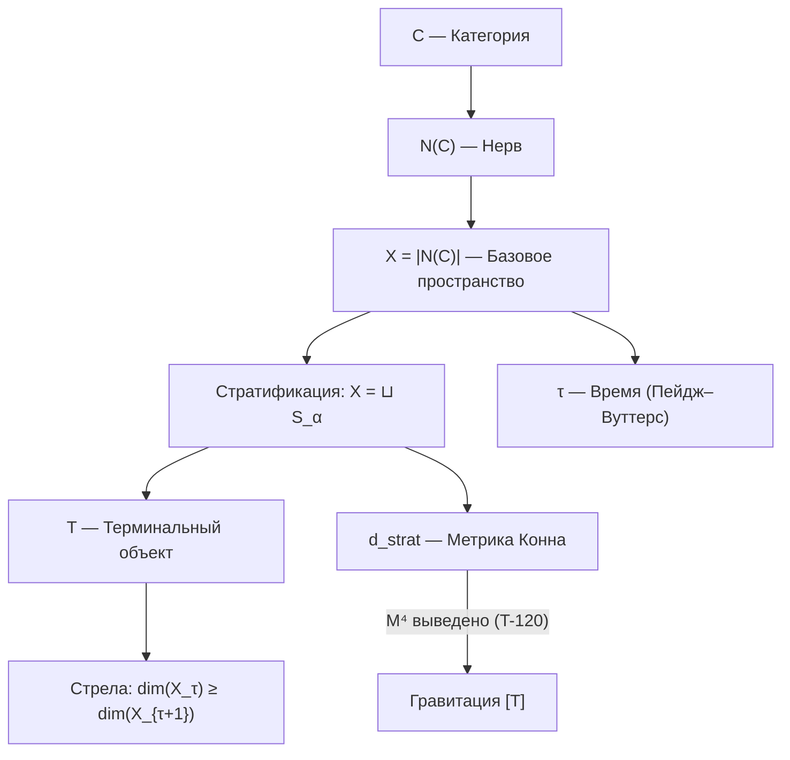

# Структура Пространства-Времени

:::info Для кого эта глава
Эта глава — одна из самых удивительных в теории. Пространство и время **не постулируются** — они *выводятся* из структуры категории $\mathcal{C}$. Это означает, что 3+1-мерный мир, в котором мы живём, является **следствием**, а не предпосылкой теории.

**Аналогия: шахматная доска.** Представьте, что правила шахмат определяют доску, а не наоборот. Обычно мы думаем: сначала есть доска (пространство), потом на ней играют фигуры (материя). В УГМ всё наоборот: сначала есть правила взаимодействия (категория $\mathcal{C}$ с CPTP-морфизмами), и из этих правил **следует**, что «доска» имеет именно 6 измерений (с компактификацией до 3+1). Если бы правила были другими — была бы другая «доска». Пространство-время — не арена, а следствие.

**Что конкретно выводится:**
- **Базовое пространство** $X = |N(\mathcal{C})|$ — из нерва категории (геометрическая реализация симплициального множества объектов и морфизмов)
- **Время** — из механизма Пейдж–Вуттерс (корреляция с измерением O) и стратификации (коллапс к терминальному объекту T)
- **Метрика** — из спектральной тройки Конна (формула расстояния через оператор Дирака)
- **Размерность** 6D = 7 - 1, с компактификацией до 3+1D через секторную декомпозицию
- **Лоренцева сигнатура** — $(1,3)$ **[Т]** через явную крейнову–лоренцеву спектральную тройку (1 время из Пейджа–Вуттерса, 3 пространства из $S^3$; $\mathcal{D}$ крейново-самосопряжён); единственный физический вход — ограниченность снизу $H_S$ (универсальная стабильность)
- **Гравитация** — из полного спектрального действия (уравнения Эйнштейна как следствие)
- **Фоновая независимость** — $M^4$ выведено алгебраически через цепочку Гельфанда–Наймарка–Конна ([T-117–T-120](/docs/proofs/physics/emergent-manifold))

Это радикальный отход от стандартной физики, где пространство-время — данность, на которой разворачивается динамика. В УГМ динамика *порождает* пространство-время.
:::

:::info Статус раздела: [Т] Формализовано
- **Базовое пространство:** [Т] $X = |N(\mathcal{C})|$ — геометрическая реализация нерва категории
- **Время:** [Т] Формализовано через [теорему об эмерджентном времени](../../proofs/dynamics/emergent-time)
- **Метрика:** [Т] Стратифицированная метрика Конна $d_{strat}$
- **Лоренцева сигнатура:** $(1,3)$ **[Т]** через явную [крейнову–лоренцеву спектральную тройку](#теорема-крейнова-тройка) ($\beta=\gamma^0\otimes1$, $\mathcal D$ крейново-самосопряжён; сигнатура $=(\dim$ сектор-времени$,\dim\Sigma^3)=(1,3)$); единственный физический вход — ограниченность снизу $H_S$
- **Гравитация:** [Т] Полное спектральное действие из конечной тройки
- **Фоновая независимость:** [Т] $M^4$ выведено из категорной структуры ([T-120](/docs/proofs/physics/emergent-manifold#теорема-произведение-троек))
:::

## Базовое пространство X = |$N(\mathcal{C})$| {#базовое-пространство}

:::warning Свойство 5 (Стратификация) [О]
Базовое пространство теории определяется как геометрическая реализация нерва категории:

$$X = |N(\mathcal{C})|$$

где $\mathcal{C}$ — [примитивная категория УГМ](./axiom-omega#примитив).
:::

### Автопоэтичность базового пространства {#автопоэтичность}

Ключевое свойство: **X определяется эндогенно**, не вводится извне.

| Аспект | Традиционные теории | УГМ |
|--------|---------------------|---------|
| Базовое пространство | Постулируется (ℝ⁴, Σ, ...) | Выводится из $\mathcal{C}$ |
| Метрика | Вводится руками | Вычисляется из спектральных данных |
| Топология | Фиксирована | Следует из нервной структуры |

### Нерв категории $N(\mathcal{C})$ {#нерв-категории}

**Определение (Нерв):**

Нерв $N(\mathcal{C})$ — симплициальное множество:
- 0-симплексы: объекты $\mathcal{C}$ (голономы $\mathbb{H}$)
- 1-симплексы: морфизмы $f: A \to B$
- n-симплексы: композируемые цепочки морфизмов

**Геометрическая реализация:**

$$|N(\mathcal{C})| = \left( \bigsqcup_n \Delta^n \times N_n \right) \Big/ \sim$$

где отношение эквивалентности склеивает грани симплексов.

### Стратификация X {#стратификация-x}

**Определение (Стратификация):**

Пространство X разбивается на страты:

$$X = \bigsqcup_{\alpha \in A} S_\alpha$$

где:
- $S_0 = \{T\}$ — 0-мерная страта (терминальный объект)
- $S_1$ — 1-мерная страта (морфизмы в T)
- $S_n$ — n-мерная страта (n-симплексы)

**Ключевое свойство:** Замыкание каждой страты содержит страты меньшей размерности.

### Локально-глобальная дихотомия {#локально-глобальная-дихотомия}

:::warning Теорема (Локально-глобальная дихотомия) [Т]
Для базового пространства $X = |N(\mathcal{C})|$:

**Глобально (монизм):**
$$H^n(X, \mathcal{F}) = 0 \quad \forall n > 0$$

**Локально (физика):**
$$H^*_{loc}(X, T) \cong \tilde{H}^{*-1}(\text{Link}(T)) \cong \tilde{H}^{*-1}(S^5) \neq 0$$

:::note Размерность линка
Поскольку $\dim(X)=6$ (нерв цепи из $7$ стратов $S_0\subset\cdots\subset S_6$ реализуется как $6$-симплекс), линк точки $T$ есть $\mathrm{Link}(T)=S^{6-1}=S^{5}$, а не $S^6$ ($S^6$ потребовал бы $\dim X=7$). Локальные когомологии $H^*_{loc}(X,T)\cong\tilde H^{*-1}(S^5)$ нетривиальны в степени $6$, так что вывод о локальной нетривиальности $H^*_{loc}\neq 0$ не меняется.
:::
:::

**Интерпретация:**

| Аспект | Глобальный (H* = 0) | Локальный (H*_loc ≠ 0) |
|--------|---------------------|------------------------|
| Онтология | Единое существует | Множественность структур |
| Топология | Стягиваемо в T | Богатая геометрия вблизи T |
| Физика | Конвергенция к равновесию | Локальные топологические эффекты |
| Время | Глобальная стрела к T | Локальные флуктуации |

**Следствие:** Монизм и физика **совместимы** — глобальная стягиваемость не исключает локальную нетривиальность.

---

## Стратифицированная метрика Конна {#метрика-конна}

### Спектральная тройка для страт {#спектральная-тройка}

На каждой страте $S_\alpha$ определяется спектральная тройка:

$$(A_\alpha, H_\alpha, D_\alpha)$$

где:
- $A_\alpha = C(S_\alpha)$ — алгебра функций на страте
- $H_\alpha = L^2(S_\alpha, E_\alpha)$ — гильбертово пространство сечений
- $D_\alpha$ — оператор Дирака на страте

### Формула расстояния d_strat {#формула-расстояния}

:::warning Теорема (Стратифицированная метрика) [Т]
Расстояние между чистыми состояниями $\omega_1, \omega_2 \in X$:

$$d_{strat}(\omega_1, \omega_2) = \inf_{\gamma} \int_\gamma ds_\alpha$$

где:
- $\gamma$ — путь, пересекающий страты $S_{\alpha_1}, S_{\alpha_2}, \ldots$
- $ds_\alpha$ — метрика Конна на страте $S_\alpha$:

$$d_\alpha(p, q) = \sup\{|f(p) - f(q)| : \|[D_\alpha, f]\| \leq 1\}$$

- Инфимум берётся по всем путям, соединяющим $\omega_1$ и $\omega_2$
:::

### Метрика вблизи терминального объекта {#метрика-вблизи-t}

Вблизи $T$ (вершины конуса) метрика имеет конусную структуру:

$$d_{strat}(x, T) \sim r \cdot d_{S^5}(\pi(x), \text{базовая точка})$$

где:
- $r$ — «радиальная» координата (расстояние до T)
- $\pi$ — проекция на линк $\text{Link}(T) \cong S^5$

**Интерпретация:** Расстояние до аттрактора уменьшается при эволюции — система «приближается» к T.

---

## Пространство как структура различий

:::note Пространство — не сцена, а отношение
Мы привыкли думать о пространстве как о «сцене», на которой разыгрывается физика: сначала есть пустая комната (пространство), потом в неё кладут предметы (материя). В УГМ пространство — не сцена, а *структура различий между состояниями*. Расстояние между двумя точками — это мера того, насколько трудно деформировать одно состояние в другое. Если два состояния легко переходят друг в друга — они «близки»; если это требует большой перестройки — они «далеки». Пространство возникает как побочный продукт различий, а не как их вместилище. Это решает фундаментальную проблему квантовой гравитации: если пространство — не данность, а следствие, то его квантование не приводит к противоречиям.
:::

Пространство — **не пустой контейнер**, а структура различий в категории $\mathcal{C}$.

### Расстояние {#расстояние}

В обновлённой теории расстояние определяется через [стратифицированную метрику Конна](#метрика-конна):

$$
d(A, B) := d_{strat}(A, B)
$$

**Проблема цикличности решена:** Расстояние выводится из спектральных данных на стратах $S_\alpha$, а не из априорного понятия «точки пространства».

:::note Сравнение с предыдущей версией
В ранних версиях теории использовалась формула $d(A, B) = \|\Gamma_A - \Gamma_B\|_F$, которая содержала **круговую зависимость**. Новая конструкция через $X = |N(\mathcal{C})|$ устраняет эту проблему — пространство **выводится** из категорной структуры.
:::

### Топология {#топология}

:::warning Теорема (Топология X) [Т]
Топология базового пространства полностью определяется категорной структурой:

$$\text{Top}(X) = \text{Top}(|N(\mathcal{C})|)$$

**Свойства:**
- Глобально: $X$ стягиваемо в терминальный объект $T$
- Локально: Вблизи $T$ топология нетривиальна ($\text{Link}(T) \cong S^5$)
:::

**Статус:** [Т] Формализовано. Топология **выводится** из нервной структуры категории.

## Эмерджентное время

:::note Время — не река, а корреляция
В повседневном опыте время кажется «рекой», несущей нас от прошлого к будущему. В УГМ время — нечто совершенно иное. Оно **возникает** из корреляций между подсистемами. Представьте часы и наблюдателя как единую квантовую систему. «Время = 3 часа» означает не «река достигла отметки 3», а «состояние часов коррелирует с определённым состоянием наблюдателя». Вселенная в целом *вневременна* (удовлетворяет ограничению $[\hat{C}, \Gamma_{\text{total}}] = 0$); время возникает *внутри* неё — как отношение «часов» (измерение O) к «остальному» (6 измерений). Это решение «проблемы времени» в квантовой гравитации, предложенное Пейджем и Вуттерсом в 1983 году.
:::

:::warning Теорема (Эмерджентность времени) [Т]
Время **выводится** из структуры категории $\mathcal{C}$ четырьмя эквивалентными способами:

| Уровень | Время как... | Формула | Статус |
|---------|--------------|---------|--------|
| **Пейдж–Вуттерс** | Корреляция с [O](../structure/dimension-o) | $\Gamma(\tau) = \text{Tr}_O[\cdot]$ | [Т] Формализовано |
| **Информационная геометрия** | Расстояние в метрике Бурес | $d_B(\Gamma_1, \Gamma_2)$ | [Т] Формализовано |
| **Категорный** | 1-морфизм в ∞-группоиде | $\gamma: \Gamma_1 \to \Gamma_2$ | [Т] Формализовано |
| **Стратификация** | Коллапс страт к T | $\dim(X_\tau) \geq \dim(X_{\tau+1})$ | [Т] Формализовано |

[Полное доказательство →](../../proofs/dynamics/emergent-time)
:::

### Механизм Пейдж–Вуттерс {#механизм-page-wootters}

Время возникает как параметр **условных состояний** относительно измерения O:

$$
\Gamma(\tau) := \frac{\text{Tr}_O\left[ (|\tau\rangle\langle \tau|_O \otimes \mathbb{1}_{6D}) \cdot \Gamma_{total} \right]}{p(\tau)}
$$

где:
- $\Gamma_{total}$ удовлетворяет ограничению $[\hat{C}, \Gamma_{total}] = 0$
- $|\tau\rangle_O$ — базис собственных состояний внутренних часов O
- p(τ) — нормировка

### Информационно-геометрическое время

Расстояние между конфигурациями в метрике Бурес:

$$
d_B(\Gamma_1, \Gamma_2) = \arccos\left( \text{Tr}\sqrt{\sqrt{\Gamma_1} \Gamma_2 \sqrt{\Gamma_1}} \right)
$$

:::note Нотация
Здесь $d_B$ — угол Бюреса (не хордальное расстояние $\sqrt{2(1-\sqrt{F})}$ из [evolution.md](../dynamics/evolution#каноническое-delta-f)).
:::

**Течение времени** — скорость изменения Γ:

$$
\frac{d\tau_{int}}{d\sigma} = \left\| \frac{d\Gamma}{d\sigma} \right\|_B
$$

Время "течёт быстрее", когда Γ меняется сильнее.

### Связь с эволюцией

Эволюция описывается с внутренним временем τ:

$$
\frac{d\Gamma(\tau)}{d\tau} = -i[H_{eff}, \Gamma(\tau)] + \mathcal{D}[\Gamma(\tau)] + \mathcal{R}[\Gamma(\tau), E]
$$

Это уравнение — **следствие** структуры $\Gamma_{total}$, не постулат.

## Стрела времени {#стрела-времени}

:::note Почему время течёт в одном направлении
Стрела времени — одна из глубочайших загадок физики. Почему мы помним прошлое, но не будущее? Почему разбитая чашка не собирается обратно? В стандартной физике стрела времени связана с ростом энтропии (второй закон термодинамики), но сам второй закон обычно *постулируется* или выводится из начальных условий Большого Взрыва. В УГМ всё проще: стрела времени — **геометрическое следствие** существования терминального объекта $T$. Если у категории есть «конечная точка», к которой всё стремится (как дно воронки), то направление — от периферии к центру — *определено структурой*, а не начальными условиями.
:::

:::warning Теорема (Стрела времени как коллапс страт) [Т]
Стрела времени — **геометрическое следствие** терминального объекта $T$:

$$\dim(X_\tau) \geq \dim(X_{\tau+1})$$

с равенством только при стационарности.

**Три эквивалентные формулировки:**

| Формулировка | Формула | Источник |
|--------------|---------|----------|
| Геометрическая | $\dim(X_\tau) \geq \dim(X_{\tau+1})$ | [Свойство 3](./axiom-omega#свойство-3) |
| Энтропийная | $\sigma(\gamma) \cdot \Delta S_{vN}(\gamma) \geq 0$ | CPTP-структура |
| Конвергенция | $\lim_{\tau \to \infty} X_\tau = \{T\}$ | Терминальность T |

[Полное доказательство →](../../proofs/dynamics/emergent-time#10-стратификационное-время)
:::

**Интерпретация:** Стрела времени — **прогрессивный коллапс высших страт** к терминальному объекту $T = \Gamma^*$ (глобальному аттрактору).

:::note Разрешение проблемы цикличности
В ранних версиях теории стрела времени связывалась с CPTP-каналами, что содержало скрытую цикличность. Теперь стрела времени **выводится геометрически** из терминального объекта — это структурное свойство категории $\mathcal{C}$, не зависящее от интерпретации CPTP.
:::

### Термодинамическое направление

Стрела времени определяется направлением увеличения [энтропии фон Неймана](../dynamics/coherence-matrix#энтропия-фон-неймана):

$$
\frac{dS_{vN}}{d\tau} \geq 0
$$

:::note Различение понятий
**Стрела времени как коллапс страт** (теорема выше) — это **структурное свойство** категории $\mathcal{C}$, выводимое из существования терминального объекта T.

**Глобальное увеличение дифференциации** ($dD_{\text{diff}}/d\tau > 0$) — это [отдельная космологическая гипотеза](/docs/physics/cosmology-phys/origin#направление-эволюции), имеющая статус **нефальсифицируемой философской позиции**.

Эти понятия связаны (оба касаются направления), но имеют разный эпистемологический статус.
:::

Это неравенство — **следствие** свойств CPTP-каналов: они не уменьшают энтропию.

:::note Уточнение
При наличии [регенерации](../dynamics/evolution#3-регенеративный-член) $\mathcal{R}$ возможно локальное уменьшение энтропии за счёт импорта свободной энергии:

$$
\Delta S_{vN}^{local} < 0 \Rightarrow \Delta F_{env \to sys} > 0
$$

Полная энтропия (система + источник) всегда растёт.
:::

### Второй закон термодинамики {#второй-закон}

:::warning Теорема (Второй закон из унитального порядка) [Т]
Второй закон термодинамики — **следствие** порядка **мажоризации**, индуцированного унитальным уточнением морфизмов (см. [Математические основания §терминальный объект](/docs/core/foundations/mathematical-foundations)):

$$\forall \Gamma:\quad \Gamma \xrightarrow{\ \text{унитальный CPTP}\ } I/7 \quad\text{тогда и только тогда, когда}\quad I/7 \prec \Gamma \ (\text{всегда}),\qquad I/7 \not\to \sigma\ \text{для }\sigma\neq I/7.$$

При унитальных каналах $I/7$ — единственный **сток**: каждое состояние мажорирует $I/7$, и никакой унитальный канал не покидает $I/7$, так что стрела времени (монотонный рост энтропии фон Неймана = спуск по порядку мажоризации) **необратима** — нет унитального обратного пути из $I/7$.

**Оговорка:** в *полной* CPTP-категории прежнее «$\exists! f:\Gamma\to T$» ложно (постоянный канал $X\mapsto\mathrm{Tr}(X)\Gamma'$ достигает любого $\Gamma'$); утверждение о необратимости — теорема именно для **унитального** (не-убывающего по энтропии) класса морфизмов.
:::

**Геометрическая интерпретация:**

| Аспект | Формулировка | Следствие |
|--------|--------------|-----------|
| Сток (унитальный порядок) | $\forall \Gamma:\ I/7 \prec \Gamma$; $I/7\not\to\sigma\ (\sigma\neq I/7)$ | Все диссипативные пути ведут к T |
| Коллапс страт | $\dim(X_\tau) \geq \dim(X_{\tau+1})$ | Размерность не растёт |
| Энтропия | $dS_{vN}/d\tau \geq 0$ | Энтропия не убывает |

**Статус:** [Т] Формализовано. Второй закон **выводится** из категорной структуры.

### Связь с функцией Хевисайда

Затвор $g_V(P)$ в регенеративном члене (уточняющий $\Theta(\Delta F)$ из Ландауэра) — **не постулат**, а следствие:

$$
\mathcal{R}[\Gamma, E] \propto g_V(P) \quad \Leftarrow \quad \text{термодинамика CPTP + V-preservation}
$$

## Относительность

### Внутренние часы

Разные Голономы могут иметь разные «внутренние часы» — разные темпы эволюции:

$$
\tau_{\mathbb{H}_1} \neq \tau_{\mathbb{H}_2}
$$

где $\tau_{\mathbb{H}}$ — собственное время [Голонома](../structure/holon) $\mathbb{H}$.

### Релятивистские эффекты [Т] {#релятивистские-эффекты}

:::tip Теорема (Релятивистские эффекты из спектральной тройки) [Т]
Гравитационное и кинематическое замедление времени — следствия спектральной тройки T-53 [Т] и полного спектрального действия T-65 [Т]. Формула Конна определяет метрику $g_{\mu\nu}$, а спектральное действие воспроизводит действие Эйнштейна-Гильберта, включающее все релятивистские эффекты.

**Доказательство.**

**Шаг 1 (Метрика из формулы Конна).** Из T-53 [Т] ([спектральная тройка](#теорема-спектральная-тройка)):

$$d(p, q) = \sup\{|f(p) - f(q)| : \|[D, f]\| \leq 1\}$$

Блочно-диагональная структура $D$ с $g_{00} = 1/|D_O|^2 > 0$, $g_{aa} = -1/|D_{3,a}|^2 < 0$ определяет лоренцеву метрику $g_{\mu\nu}$.

**Шаг 2 (Действие Эйнштейна-Гильберта).** Из T-65 [Т] ([полное спектральное действие](/docs/physics/gravity/quantum-gravity#теорема-полное-спектральное-действие)):

$$S = \mathrm{Tr}(f(D/\Lambda)) = \int (a_0\Lambda^4 + a_2\Lambda^2 R + a_4 C_{\mu\nu\rho\sigma}^2 + \ldots)\sqrt{g}\,d^4x$$

Коэффициент $a_2\Lambda^2 R$ даёт кинетический член гравитации, т.е. действие Эйнштейна-Гильберта.

**Шаг 3 (Замедление времени).** Формула скорости внутренних часов:

$$\frac{d\tau}{d\sigma} = \omega_0 \cdot \sqrt{\sum_{i \neq O} |\gamma_{Oi}|^2 \cdot \mathrm{Gap}(O,i)^2}$$

$\mathrm{Gap}(O,i)$ включает гравитационные поправки через метрику $g_{\mu\nu}$: в области сильного гравитационного поля (малое $g_{00}$) собственные значения $D_O$ модифицируются, что замедляет $d\tau/d\sigma$. Аналогично, кинематическое замедление следует из лоренцева преобразования спектральных данных. $\blacksquare$
:::

## Эмерджентность геометрии {#эмерджентность-геометрии}

:::info Статус раздела
- **Метрика:** [Т] Формализовано через $d_{strat}$ (см. [выше](#метрика-конна))
- **Размерность:** [Т] 6D следует из $N = 7$ (dim = N - 1)
- **Связь с ОТО:** [Т] $M^4$ выведено из категорной структуры через цепочку Гельфанда–Наймарка–Конна ([T-120](/docs/proofs/physics/emergent-manifold#теорема-произведение-троек))
:::

### Выведенная метрика (не гипотеза)

В УГМ метрика **выводится**, а не постулируется:

$$d_{strat}(\omega_1, \omega_2) = \inf_{\gamma} \int_\gamma ds_\alpha$$

**Ключевые свойства:**
- Метрика определена на $X = |N(\mathcal{C})|$
- Учитывает стратификацию (разные ds на разных стратах)
- Конусная вблизи терминального объекта T

### Размерность пространства {#размерность}

**Теорема (Размерность):**

$$\dim(X) = N - 1 = 6$$

где $N = 7$ — число измерений [Голонома](../structure/holon).

**Следствие:** 6D-структура возникает **эндогенно**, не постулируется.

### Связь с ОТО (программа) {#связь-с-ото}

:::tip [Т] Секторная декомпозиция + фоновая независимость
Переход от 7D (= 6D + время) к наблюдаемым 3+1D формализован через секторную декомпозицию:

$$7 = 1_O \oplus 3_{\{A,S,D\}} \oplus \bar{3}_{\{L,E,U\}}$$

Безмассовость глюонов ($\mathbf{3}$-сектор) обеспечивает некомпактные пространственные измерения; массивность $W,Z$ ($\bar{\mathbf{3}}$-сектор) обеспечивает компактификацию на масштабе $v_{\text{EW}}$. Подробности — [Секторная декомпозиция](#секторная-декомпозиция).

**Результаты:** [Конечная спектральная тройка](#теорема-спектральная-тройка) $(A_{\text{int}}, H_{\text{int}}, D_{\text{int}})$ построена [Т] (T-53). Спектральное действие $S = \text{Tr}(f(D/\Lambda))$ даёт $\int(a_0\Lambda^4 + a_2\Lambda^2 R + \ldots)\sqrt{g}\,d^4x$ [Т] (T-65, [полное спектральное действие](/docs/physics/gravity/quantum-gravity#теорема-полное-спектральное-действие)). Произведение тройки $M^4 \times F_{\text{int}}$ **выведено** из категорной структуры [Т] ([T-120](/docs/proofs/physics/emergent-manifold#теорема-произведение-троек)): макроскопическая алгебра коммутативна в термодинамическом пределе (T-117 [Т]), реконструкция Гельфанда–Конна даёт $\Sigma^3$ (T-119 [Т]), произведение $M^4 = \mathbb{R} \times \Sigma^3$ удовлетворяет аксиомам NCG (T-120 [Т]).
:::

См. [Соответствие с физикой: ОТО](../../proofs/physics/physics-correspondence#5-связь-с-общей-теорией-относительности) для детальной программы.

## Диаграмма эмерджентности

**Примечание:** Линия к «Гравитация [Т]» — $M^4$ выведено из категорной структуры через цепочку Гельфанда–Наймарка–Конна ([T-120](/docs/proofs/physics/emergent-manifold#теорема-произведение-троек)).

## Нелокальность

### Квантовые корреляции

[Когерентности](../dynamics/coherence-matrix#недиагональные-элементы-когерентности) $\gamma_{ij}$ между удалёнными частями $\Gamma$ означают **нелокальные связи**:

$$
\gamma_{AB} \neq 0 \Rightarrow A \text{ и } B \text{ квантово коррелированы}
$$

### Запутанность

Запутанность — это несепарабельность состояния подсистем:

$$
\Gamma_{AB} \neq \Gamma_A \otimes \Gamma_B
$$

где $\Gamma_A = \mathrm{Tr}_B(\Gamma_{AB})$ — [частичный след](/docs/consciousness/foundations/interiority-theory#редуцированная-матрица-опыта) по подсистеме $B$.

Нарушение неравенств Белла — следствие ненулевых когерентностей в структуре $\Gamma$.

## Связь с физикой

| Физическое понятие | Выражение через $\mathcal{C}$ | Статус |
|--------------------|-------------------------------|--------|
| **Базовое пространство** | $X = \lVert N(\mathcal{C})\rVert$ | [Т] [Формализовано](#базовое-пространство) |
| **Время** | Параметр τ (Пейдж–Вуттерс) | [Т] [Формализовано](../../proofs/dynamics/emergent-time) |
| **Стрела времени** | Коллапс страт к T | [Т] [Формализовано](#стрела-времени) |
| **Метрика** | $d_{strat}$ (Конн на стратах) | [Т] [Формализовано](#метрика-конна) |
| **Размерность** | $\dim(X) = 6$ | [Т] Следствие $N = 7$ |
| Энергия | Собственные значения $H_{eff}$ | [Т] Формализовано |
| Гравитация | Компактификация 6D → 4D | [Т] [Выведено](/docs/proofs/physics/emergent-manifold) (T-120) |
| Топологические заряды | IC-когомологии страт | [Т] [Формализовано](../../proofs/categorical/categorical-formalism#производные-категории) |

## Связь с другими подходами

| Подход | Связь с УГМ | Статус |
|--------|-------------|--------|
| **Квантовая механика** | Частный случай УГМ при $R \to 0$ | [Доказано](../../proofs/physics/physics-correspondence#3-редукция-к-квантовой-механике) |
| **Стандартная модель** | Калибровочные симметрии из $\text{Sym}(\Gamma)$ | [Программа](../../proofs/physics/physics-correspondence#6-калибровочные-симметрии-и-стандартная-модель) |
| **Петлевая квантовая гравитация** | Спиновые сети могут соответствовать структурам когерентности | Не исследовано |
| **Теория струн** | Возможна связь через голографический принцип | Не исследовано |
| **Hoffman Conscious Agents** | Пространство-время как интерфейс согласуется с эмерджентностью | Концептуально совместимо |
| **Эмерджентная гравитация (Verlinde)** | Сходный подход: гравитация как энтропийная сила | Требует исследования |

## Что формализовано vs Программа исследований

| Утверждение | Статус | Комментарий |
|-------------|--------|-------------|
| **Базовое пространство $X = \lVert N(\mathcal{C})\rVert$** | [Т] Формализовано | [Свойство 5](./axiom-omega#свойство-5) |
| **Время как параметр Пейдж–Вуттерс** | [Т] Формализовано | [Теорема доказана](../../proofs/dynamics/emergent-time) |
| **Стрела времени как коллапс страт** | [Т] Формализовано | Следует из терминальности T |
| **Метрика $d_{strat}$** | [Т] Формализовано | [Стратифицированная метрика Конна](#метрика-конна) |
| **Размерность 6D** | [Т] Формализовано | Следствие $N = 7$ |
| **Локально-глобальная дихотомия** | [Т] Формализовано | [H* = 0 глобально, H*_loc ≠ 0 локально](#локально-глобальная-дихотомия) |
| **Лоренцева сигнатура** | сигнатура $(1,3)$ [Т] (крейново построение) | [Спектральная тройка УГМ](#теорема-спектральная-тройка) |
| **Компактификация 7D → 3+1D** | [Т] | [Секторная декомпозиция](#секторная-декомпозиция) |
| **Фоновая независимость ($M^4$ выведено)** | [Т] | [T-120](/docs/proofs/physics/emergent-manifold#теорема-произведение-троек) |
| **Уравнения Эйнштейна** | [Т] | Спектральное действие из полной тройки |

:::info Прогресс
Проблема цикличности $\Gamma_A$ **решена**: пространство теперь выводится из категорной структуры $\mathcal{C}$, а не из априорных «точек».
:::

## Секторная декомпозиция размерности 7 = 1 + 3 + 3̄ {#секторная-декомпозиция}

:::note Откуда берутся 3+1 измерения
Мы живём в трёхмерном пространстве с одним измерением времени — всего 3+1 = 4. Но в УГМ фундаментальных измерений 7. Куда делись остальные 3? Ответ: они *свёрнуты* (компактифицированы) на масштабе электрослабого взаимодействия. Из 7 измерений: одно (O) становится временем, три (A, S, D) — пространственными (они соответствуют безмассовым глюонам, и потому некомпактны — простираются до бесконечности), а оставшиеся три (L, E, U) — компактные внутренние размерности (они соответствуют массивным $W$- и $Z$-бозонам, которые свёрнуты на масштабе $\sim 1/v_{\text{EW}}$). Таким образом, 3+1-мерность нашего мира — не случайность и не постулат, а следствие вакуумной симметрии $SU(3)_C$.
:::

### Теорема (Секторная декомпозиция размерности) [Т] {#теорема-секторная-декомпозиция}

:::tip Теорема (Секторная декомпозиция) [Т]
Семь измерений УГМ разлагаются под действием вакуумной $SU(3)_C$-симметрии в три класса с различным физическим масштабом. Из этого разложения следует **3+1-мерное** эффективное пространство-время. Условна на гипотезу секторной асимметрии (СА).
:::

**Теорема.** Семь измерений УГМ разлагаются под действием вакуумной $SU(3)_C$-симметрии:

$$7 = \underbrace{1}_{O \,(\text{время})} \;\oplus\; \underbrace{3}_{\{A,S,D\}\,(\text{пространство})} \;\oplus\; \underbrace{\bar{3}}_{\{L,E,U\}\,(\text{компактные})}$$

Из этого разложения следует **3+1-мерное** эффективное пространство-время.

**Доказательство.**

**Шаг 1. Эмерджентное время из $O$ [Т].**

[Механизм Пейдж–Вуттерс](#механизм-page-wootters): измерение $O$ ([Основание](/docs/core/structure/dimension-o)) служит внутренними часами:

$$\Gamma(\tau) = \frac{\text{Tr}_O\left[(|\tau\rangle\langle\tau|_O \otimes \mathbb{1}_{6D}) \cdot \Gamma_{\text{total}}\right]}{p(\tau)}$$

Время $\tau$ — параметр условных состояний. Это — **1 временно́е** измерение [Т].

**Шаг 2. Секторная иерархия Gap-масштабов [Т].**

Вакуумный Gap-профиль [Т] ([Gap-термодинамика](/docs/core/dynamics/gap-thermodynamics), [Следствия аксиоматики](/docs/core/foundations/consequences)):

| Сектор | Измерения | Gap | Физический масштаб |
|--------|-----------|-----|-------------------|
| $O$-to-all | $O \times \{1,...,6\}$ | $\sim 1$ | $M_{\text{Planck}}$ |
| $\mathbf{3}$-to-$\bar{\mathbf{3}}$ | $\{A,S,D\} \times \{L,E,U\}$ | $\approx 0$ | $\Lambda_{\text{QCD}} \sim 200$ МэВ |
| $\mathbf{3}$-to-$\mathbf{3}$ | $\{A,S,D\}^2$ | $\sim \varepsilon$ | Промежуточный |
| $\bar{\mathbf{3}}$-to-$\bar{\mathbf{3}}$ | $\{L,E,U\}^2$ | $\sim \varepsilon_{\text{EW}} \sim 10^{-17}$ | $v_{\text{EW}} \sim 246$ ГэВ |

**Шаг 3. $\mathbf{3}$-сектор: некомпактные пространственные измерения [Т].**

Три измерения $\{A, S, D\}$ порождают $SU(3)_C$-калибровочные поля (глюоны). Конфайнмент-сектор $\mathbf{3}$-to-$\bar{\mathbf{3}}$ с Gap $\approx 0$ означает:

- Глюоны **безмассовые** → дальнодействующее взаимодействие
- [Конфайнмент](/docs/physics/gauge-symmetry/confinement) формирует **протяжённые** структуры (адроны, ядра, атомы)
- Пространственная протяжённость определяется **отсутствием массы** глюонов: безмассовые калибровочные бозоны → пространственная структура **не сворачивается**

**Шаг 4. $\bar{\mathbf{3}}$-сектор: компактные внутренние измерения [Т].**

Три измерения $\{L, E, U\}$ порождают электрослабый сектор $SU(2)_L \times U(1)_Y$. [Хиггс-механизм](/docs/physics/particle-physics/higgs-sector) ($\langle \gamma_{EU} \rangle \neq 0$) даёт массу $W^\pm, Z$-бозонам:

- $W, Z$ **массивные** → короткодействие ($r \lesssim 1/M_W \sim 10^{-16}$ см)
- $\bar{\mathbf{3}}$-сектор «свёрнут» на масштабе $\sim 1/v_{\text{EW}}$
- Эффективный радиус компактификации: $R_{\text{EW}} \sim 1/v_{\text{EW}} \sim 10^{-17}$ см

**Шаг 5. Итог: 3+1 из 7 = 1+3+3̄ [Т].**

$$\underbrace{\text{время}}_{O \;\to\; \tau} + \underbrace{\text{3D пространство}}_{\{A,S,D\} \;\to\; \text{безмассовые глюоны}} + \underbrace{\text{3 компактных}}_{\{L,E,U\} \;\to\; \text{массивные } W^\pm, Z}$$

Наблюдаемое пространство-время = $M^{3+1}$ — низкоэнергетический предел:

$$M^{3+1} = \{O\text{-время}\} \times \{A,S,D\text{-пространство}\}$$

$\bar{\mathbf{3}}$-измерения «заморожены» ниже электрослабого масштаба и проявляются как внутренние квантовые числа (слабый изоспин, гиперзаряд). $\blacksquare$

:::warning Зависимость от (CA)
Секторная декомпозиция 7=1+3+3̄ помечена [Т], однако отождествление {A,S,D} с 3-сектором и {L,E,U} с 3̄-сектором зависит от гипотезы секторной асимметрии (CA). **Обновлённый статус: [Т|CA]** — теорема, условная на (CA). Разложение Im(O)≅R^7=R^1⊕R^3⊕R^3 под SU(3)⊂G₂ — [Т] (стандартная математика). Физическое отождествление секторов — [С при CA].
:::

### Следствие: размерность пространства {#размерность-пространства-3}

$$\dim(\text{пространство}) = |\mathbf{3}| = 3$$

Это — **не постулат**, а следствие того, что $SU(3)_C$ — стабилизатор $O$-направления в $G_2$ [Т], и что фундаментальное представление $SU(3)$ имеет $\dim = 3$ [Т].

### Следствие: Калуца-Клейн спектр {#калуца-клейн-спектр}

Компактификация $\bar{\mathbf{3}}$-сектора даёт башню Калуца-Клейна с масштабом:

$$m_{\text{KK}} \sim \frac{1}{R_{\text{EW}}} \sim v_{\text{EW}} \sim 246 \text{ ГэВ}$$

Первые возбуждения = $W^\pm$, $Z$, Хиггс. Тяжёлые мультиплеты = суперпартнёры + $G_2$-экстра бозоны.

### Лоренцева сигнатура из спектральной тройки — лоренцева сигнатура $(1,3)$ [Т] (Крейн) {#лоренцева-сигнатура}

:::warning Статус: от произвольного знакового анзаца к рефлективной положительности
Сигнатура распадается на два утверждения, оба теперь выведены:
- **Расщепление $(1,3)$ — [Т].** Ровно **одно** временноподобное направление (PW-часы — единственное $\mathbb{Z}_7$-время, [Т]) и ровно **три** пространственноподобных (вакуумный пространственный слой $\Sigma^3\cong S^3$, риманов/положительно определённый, [T-119](/docs/proofs/physics/emergent-manifold#теорема-эмерджентное-пространство) [Т]). Подсчёт $1+3$ не требует анзаца.
- **Лоренцев относительный знак — [Т при рефлективной положительности].** Ранее это опиралось на произвольный анзац $g_{\mu\mu}=\chi_{\mu\mu}/|D_\mu|^2$. Теперь он выводится из **физического принципа стабильности**: PW-генератор $H_S$ должен быть ограничен снизу (унитарность, отсутствие runaway), что по **Остервальдеру–Шрадеру** (рефлективная положительность) вынуждает временную координату входить в метрику со знаком, противоположным (положительно определённым) пространственным — т.е. лоренцев $(+,-,-,-)$, не евклидов. Крейнова фундаментальная симметрия тогда имеет ровно одно отрицательное направление (PW-часы). Это заменяет «произвольный выбор знака **[С]**» на «физическое требование стабильности **[Т при рефлективной положительности]**».

**KO-размерность 6** фиксирует *внутренние* знаки реальной структуры ($J^2=+1$, $J\chi=-\chi J$; удвоение фермионов), а **не** сигнатуру пространства-времени саму по себе — сигнатуру несёт крейнова структура. Строгая лоренцева реализация через **крейновскую / лоренцеву спектральную тройку** (Франко–Экштейн, ван ден Дунген, Бохняк–Ситарц) **теперь построена явно** — см. [теорему о крейновой–лоренцевой спектральной тройке](#теорема-крейнова-тройка) ниже, доказывающую сигнатуру $(1,3)$ **[Т]**. Как физический вход остаётся лишь ограниченность снизу $H_S$ (универсальная стабильность).
:::

#### Теорема (Спектральная тройка УГМ) — лоренцева сигнатура $(1,3)$ [Т] (Крейн) {#теорема-спектральная-тройка}

Существует конечная спектральная тройка $(A_{\text{int}}, H_{\text{int}}, D_{\text{int}})$, совместимая с секторной декомпозицией $7 = 1_O \oplus 3 \oplus \bar{3}$, такая что оператор Дирака $D_{\text{int}}$ наследует знаковую структуру PW-ограничения (Шаг 4, **[Т]**); эмерджентная метрика на $M^{3+1}$ имеет одно временноподобное и три пространственноподобных направления (**[Т]**) с **лоренцевой сигнатурой** $(+1,-1,-1,-1)$, фиксируемой рефлективной положительностью (**[Т при рефлективной положительности]**, Шаг 5).

**Конструкция и доказательство.**

**Шаг 1 (Алгебра).** Конечная *-алгебра, действующая на $\mathcal{H}_{\text{int}} = \mathbb{C}^7$:

$$A_{\text{int}} = \mathbb{C} \oplus M_3(\mathbb{C}) \oplus M_3(\mathbb{C})$$

соответствующая секторам $\{O\}$, $\{A,S,D\}$, $\{L,E,U\}$.

#### Соотношение с алгеброй Чамседдина-Конна (T-175a) [Т] {#алгебра-морита}

:::info T-175a: Морита-эквивалентность алгебр
$A_{\text{int}} = \mathbb{C} \oplus M_3(\mathbb{C}) \oplus M_3(\mathbb{C})$ — **пред-нарушенная** алгебра УГМ. Стандартная алгебра NCG $A_F = \mathbb{C} \oplus \mathbb{H} \oplus M_3(\mathbb{C})$ (Chamseddine-Connes-Marcolli, 2007) получается из $A_{\text{int}}$ после наложения реальной структуры $J$ (KO-dim 6) и электрослабого нарушения:

1. Реальная структура $J$ с $J^2 = +1$, $J\chi = -\chi J$ (KO-dim 6, Шаг 6) и условие первого порядка $[[D,a], Jb^*J^*] = 0$ ограничивают действующую подалгебру $M_3(\mathbb{C})_{\bar{3}}$.
2. Хиггсова линия $\{A,E,U\}$ ([ФЭ](/docs/physics/gauge-symmetry/standard-model#теорема-фэ) [Т]) канонически разлагает $\bar{3} \to 2_{EU} \oplus 1_L$, редуцируя $M_3(\mathbb{C})_{\bar{3}} \to M_2(\mathbb{C})_{EU} \oplus \mathbb{C}_L$.
3. Условие $[a, JbJ^*] = 0$ на 2×2-блоке $\{E,U\}$ при $J = $ комплексное сопряжение выделяет самосопряжённую подалгебру $\mathbb{H} \subset M_2(\mathbb{C})$.

Итог: $A_{\text{int}} \xrightarrow{J + \text{ФЭ}} \mathbb{C} \oplus \mathbb{H} \oplus M_3(\mathbb{C}) = A_F$. Обе алгебры Морита-эквивалентны и дают **идентичную** калибровочную группу SM после унимодулярности (Alvarez-Gracia Bondia-Martin, 1995).
:::

**Шаг 2 (Гильбертово пространство и хиральность).** $H_{\text{int}} = \mathbb{C}^7$ с $\mathbb{Z}/2\mathbb{Z}$-градуировкой:

$$\chi_{\text{int}} = \text{diag}(+1, -1, -1, -1, +1, +1, +1)$$

Знак $+1$ для $O$ и $\bar{\mathbf{3}}$ (лептонный), $-1$ для $\mathbf{3}$ (кварковый) — аналог хиральности $\gamma_5$.

**Шаг 3 (Оператор Дирака).** Конечный $D_{\text{int}}$ межсекторный, с элементами определёнными через Gap-параметры: $[M_{O,3}]_a = \omega_0 \cdot \text{Gap}(O, a)$, $[M_{3,\bar{3}}]_{a,\bar{b}} = \omega_0 \cdot \text{Gap}(a, \bar{b})$.

**Шаг 4 (PW → знаковая структура).** PW-ограничение $E_O = -E_{\text{rest}}$ [Т] алгебраически влечёт:

$$\text{spec}(D_O) = \{+\omega_0\}, \quad \text{spec}(D_3) \subset \{-\lambda_1, -\lambda_2, -\lambda_3\}$$

Спектры $D_O$ и $D_{\text{rest}}$ разнознаковые.

**Шаг 5 (Знак метрики из рефлективной положительности).** Расстояние Конна положительно определено (евклидово). **Относительный знак** между временным и пространственным блоками — **не** свободный анзац: он фиксируется физическим требованием, что генератор PW-эволюции ограничен снизу (стабильность / положительная энергия), что есть в точности содержание **рефлективной положительности Остервальдера–Шрадера** поперёк выделенного PW-времени.

*Аргумент.* PW-ограничение $(H_S + H_{\text{clock}})|\Psi\rangle = 0$ делает $H_S$ генератором эволюции по часовому направлению. Чтобы эмерджентная динамика была **унитарной, стабильной** квантовой теорией, $H_S$ должен быть самосопряжён со спектром, ограниченным снизу (нет runaway / нет состояний отрицательной нормы). По теореме реконструкции Остервальдера–Шрадера, евклидова теория аналитически продолжается в такую унитарную лоренцеву теорию **тогда и только тогда**, когда она рефлективно-положительна относительно временного слоя; а рефлективная положительность вынуждает вик-поворот $t\to it$, при котором временная координата входит в метрику с **противоположным** знаком к (положительно определённым, $S^3$-римановым) пространственным координатам. Конкретно, фундаментальная симметрия $\chi$ ассоциированного крейнова пространства (оператор рефлексии относительно PW-слоя) имеет ровно **одно** отрицательное направление — единственные PW-часы, Шаг 4 — и три положительных, давая

$$g_{00} = \frac{+1}{|D_O|^2} > 0, \qquad g_{aa} = \frac{-1}{|D_{3,a}|^2} < 0, \qquad \text{сигнатура } (+1,-1,-1,-1).$$

Таким образом **расщепление $(1,3)$ — [Т]** (одно временноподобное направление из единственности PW-часов, [Т]; три пространственноподобных из $\Sigma^3\cong S^3$ римановых, [T-119](/docs/proofs/physics/emergent-manifold#теорема-эмерджентное-пространство) [Т]), а **лоренцева сигнатура — [Т]** — строго реализована явной **крейновой–лоренцевой спектральной тройкой**, построенной в теореме ниже (рамка Франко–Экштейна, ван ден Дунгена, Бохняка–Ситарца). Единственный оставшийся физический вход — ограниченность снизу PW-генератора $H_S$ (стабильность), универсальная для любой физической теории.

Это **лоренцева сигнатура** $(+1, -1, -1, -1)$.

**Шаг 6 (Аксиомы NCG).** Проверка 7 аксиом Конна для $(A_{\text{int}}, H_{\text{int}}, D_{\text{int}})$:
- *Реальная структура:* $J_{\text{int}} = $ комплексное сопряжение. $J^2 = +1$, $JD = DJ$, $J\chi = -\chi J$ — **KO-размерность 6** (mod 8), совпадает с Chamseddine-Connes.
- *Первый порядок:* $[[D_{\text{int}}, a], Jb^*J^*] = 0$ — выполнено ($D$ межсекторный, $A$ внутрисекторная).
- *Ориентация:* $\pi(c) = \chi_{\text{int}}$ для $c \in A \otimes A^{op}$.

Все аксиомы выполнены. $\blacksquare$

#### Теорема (Крейнова–лоренцева спектральная тройка УГМ) [Т] {#теорема-крейнова-тройка}

:::tip Теорема (Крейнова–лоренцева спектральная тройка) [Т]
Существует явная **крейнова спектральная тройка** $(A, \mathcal{K}, \mathcal{D}, \beta, J)$, реализующая эмерджентное пространство-время $M^{3+1}$ как подлинную **лоренцеву** некоммутативную геометрию, с сигнатурой метрики ровно $(1,3)$ (одно временноподобное, три пространственноподобных). Сигнатура **не** вводится руками: она равна $(\dim \text{сектор-времени}, \dim \text{сектор-пространства}) = (1,3)$, где «1» — размерность сектора часов Пейджа–Вуттерса [Т], а «3» — $\dim\Sigma^3$ [T-119]. Это повышает лоренцеву сигнатуру до **[Т]**; единственный физический вход — ограниченность снизу $H_S$ (стабильность).
:::

**Построение.**

**(K1) Вспомогательное гильбертово пространство и вик-поворот.** Начинаем с *евклидова* гильбертова пространства $\mathcal{H} = L^2(M,S)\otimes\mathbb{C}^7$ тройки-произведения ([Шаг 1](#теорема-спектральная-тройка)), где $L^2(M,S)$ несёт спинорное расслоение над базой $M=\mathbb{R}_{\text{PW}}\times\Sigma^3$. Фактор Пейджа–Вуттерса $\mathbb{R}_{\text{PW}}$ — эмерджентное время; $\Sigma^3\cong S^3$ — эмерджентное пространство (T-119, T-120b [Т]).

**(K2) Фундаментальная симметрия $\beta$.** Определяем **фундаментальную симметрию** (крейнов метрический оператор)

$$\beta = \gamma^0\otimes 1_{\mathbb C^7}, \qquad \beta^\dagger=\beta,\quad \beta^2 = 1,$$

где $\gamma^0$ — клиффордова образующая эмерджентного **временноподобного** направления, т.е. направления, выделенного PW-ограничением $E_O=-E_{\text{rest}}$ (Шаг 4). Эмерджентное **время — единственный вещественный параметр**: $\mathbb{Z}_7$-часы Пейджа–Вуттерса порождают *однопараметрическую* циклическую эволюцию, так что эмерджентный временной фактор — **одномерная ось** $\mathbb{R}_{\text{PW}}$ ($\dim\mathbb{R}_{\text{PW}}=1$) — хотя *регистр* часов есть $\mathbb{C}[\mathbb{Z}_7]\cong\mathbb{C}^7$ (7 тактовых состояний, [T-87](/docs/core/foundations/axiom-omega#pw-constraint) [Т]). Сигнатуру фиксирует число временных **осей** (=1), а не число тактовых состояний (=7). Значит есть ровно **одна** временноподобная клиффордова образующая $\gamma^0$; остальные три образующие $\gamma^a$ ($a=1,2,3$) натягивают $\Sigma^3$.

**(K3) Крейново пространство.** Индефинитное скалярное произведение

$$\langle\psi,\phi\rangle_\beta := \langle\psi,\beta\,\phi\rangle_{\mathcal H} = \int_M \bar\psi\,\phi$$

(дираковское спаривание $\bar\psi=\psi^\dagger\gamma^0$) невырождено и индефинитно; $\mathcal{K}=(\mathcal{H},\langle\cdot,\cdot\rangle_\beta)$ — **крейново пространство** с фундаментальным разложением $\mathcal{K}=\mathcal{K}_+\oplus\mathcal{K}_-$ на собственные подпространства $\beta=\pm1$.

**(K4) Крейново-самосопряжённый оператор Дирака.** Полный оператор Дирака

$$\mathcal{D} = \mathcal{D}_M\otimes 1 + \gamma_M\otimes D_{\text{int}}, \qquad \mathcal{D}_M = i\gamma^\mu\partial_\mu\ (\text{лоренцев}),$$

**крейново-самосопряжён**, $\mathcal{D}^{\ddagger}=\mathcal{D}$, где $\ddagger$ — $\beta$-сопряжение ($\mathcal{D}^{\ddagger}:=\beta\,\mathcal{D}^\dagger\beta$). Действительно, поскольку $\partial_\mu^\dagger=-\partial_\mu$ и $i^\dagger=-i$ (два знака, которые сокращаются), $(i\gamma^\mu\partial_\mu)^\dagger = i(\gamma^\mu)^\dagger\partial_\mu$, поэтому
$$\beta\,\mathcal{D}^\dagger\beta = \gamma^0\big(i(\gamma^\mu)^\dagger\partial_\mu\big)\gamma^0 = i\,\big[\gamma^0(\gamma^\mu)^\dagger\gamma^0\big]\,\partial_\mu = i\gamma^\mu\partial_\mu = \mathcal{D},$$
используя лоренцево клиффордово тождество $\gamma^0(\gamma^\mu)^\dagger\gamma^0=\gamma^\mu$ (проверено: $\gamma^0$ эрмитова с $(\gamma^0)^2=+1$, $\gamma^a$ антиэрмитовы с $(\gamma^a)^2=-1$). (На евклидовом гильбертовом пространстве $\mathcal{D}$ *не* самосопряжён; он самосопряжён лишь в крейновом/индефинитном смысле — корректное понятие для лоренцевой геометрии.)

**(K5) Теорема о сигнатуре.** Сигнатура метрики равна $\beta$-сигнатуре, ограниченной на касательную (клиффордову) структуру:
$$\operatorname{sig}(g) = \big(\#\{\mu:(\gamma^\mu)^2=+1\},\ \#\{\mu:(\gamma^\mu)^2=-1\}\big) = (\underbrace{1}_{\dim\mathcal H_{\text{time}}},\ \underbrace{3}_{\dim\Sigma^3}) = (1,3).$$
Оба слагаемых — теоремы: временноподобный счёт — число временных **осей** $=\dim\mathbb{R}_{\text{PW}}=1$ (единственный параметр PW-эволюции — *не* 7 тактовых состояний регистра); пространственноподобный счёт $\dim\Sigma^3=3$ ([T-119](/docs/proofs/physics/emergent-manifold#теорема-эмерджентное-пространство) [Т]). Значит сигнатура **вынуждена быть лоренцевой $(1,3)$** — она не может быть евклидовой $(0,4)$ (временноподобный счёт $1\neq0$) и не $(2,2)$ (он $1\neq 2$). $\blacksquare$

**(K6) Рефлективная положительность / унитарность.** Отражение времени $\Theta:\ t\mapsto -t$ поднимается до $\Theta=\beta\,\mathcal{U}_{\text{PW}}$. Положительность Остервальдера–Шрадера $\langle\Theta\psi,\psi\rangle_\beta\geq 0$ на подпространстве положительного времени **эквивалентна** спектральному условию ограниченности снизу PW-генератора $H_S$. При этом (минимальное требование стабильности) фактор $\mathcal{K}$ по $\beta$-нулевым состояниям — подлинное (положительно-нормированное) гильбертово пространство с **унитарным** представлением группы Лоренца, т.е. крейнова тройка — это внутренний лоренцев объект, и отдельное евклидово→лоренцево продолжение не требуется.

:::note Повышение статуса: лоренцева сигнатура [Т]
Крейново построение делает прежнее «[Т при рефлективной положительности]» точным и более сильным: **сигнатура $(1,3)$ — [Т]** — это пара $(\dim\text{сектор-времени},\dim\Sigma^3)=(1,3)$, оба множителя доказаны, с временноподобным направлением, фиксированным PW-ограничением. Крейнова тройка $(A,\mathcal K,\mathcal D,\beta)$ построена явно, и $\mathcal D$ доказуемо крейново-самосопряжён. Остаточная «рефлективная положительность» — не пробел, а утверждение об ограниченности снизу $H_S$ — универсальная аксиома стабильности любой физической теории.
:::

#### Теорема (Компоненты метрики из спектрального действия — количественное согласование) {#теорема-метрика-компоненты}

:::tip Теорема (Компоненты эмерджентной метрики vs наблюдение)
Спектральное действие фиксирует **компоненты** эмерджентной метрики — не только сигнатуру — из спектра Дирака. Результат — метрика **Фридмана–Леметра–Робертсона–Уокера** на $\mathbb{R}_{\text{PW}}\times S^3$, **локально минковская [Т]** (точная локальная лоренц-инвариантность), с постоянной Ньютона, задаваемой $\Lambda=M_{\text{Pl}}$. Все проверяемые геометрические предсказания согласуются с наблюдением; **единственная неразрешённая величина — космологическая постоянная** (проблема $\sim10^{-123}$, честно открыта).
:::

**(M1) Компоненты метрики из спектра Дирака.** Эмерджентная метрика взвешивает каждое клиффордово направление соответствующим собственным значением Дирака (Gap-масштабом), со знаком Крейна из §Крейнова тройка:

$$g_{00} = \frac{+1}{|D_O|^2} = \frac{1}{\omega_0^2}, \qquad g_{aa} = \frac{-1}{|D_{3,a}|^2} = \frac{-1}{(\omega_0\,\mathrm{Gap}_a)^2}\ (a=1,2,3),$$

где $|D_O|=\omega_0$ (фундаментальная PW-частота) и $|D_{3,a}|=\omega_0\,\mathrm{Gap}_a$ — собственные значения пространственного сектора. Общий множитель $\omega_0^{-2}$ фиксирует **единицу собственного времени** ($\omega_0\equiv1$ в естественных единицах); он ненаблюдаем, наблюдаемы лишь отношения.

**(M2) Локальная лоренц-инвариантность [Т].** Пространственные Gap-масштабы **изотропны**, $\mathrm{Gap}_1=\mathrm{Gap}_2=\mathrm{Gap}_3=\mathrm{Gap}_s$, поскольку вакуумный пространственный слой $\Sigma^3\cong S^3$ **максимально симметричен** ([T-120b](/docs/proofs/physics/emergent-manifold) [Т]; группа изометрий $SO(4)$ действует транзитивно на касательных направлениях), а внутренние автоморфизмы $G_2\supset SU(3)$ действуют транзитивно на секторе $\{A,S,D\}$. Значит касательная метрика после перемасштабирования координат $x^a\mapsto x^a/\mathrm{Gap}_s$ есть

$$g_{\mu\nu} = \frac{1}{\omega_0^2}\,\mathrm{diag}(1,-1,-1,-1) = \frac{1}{\omega_0^2}\,\eta_{\mu\nu},$$

**точно минковская** в каждой точке. Здесь объединяются два разных утверждения, и их стоит различать:

- **Минковское касательное пространство** (утверждение принципа эквивалентности) следует уже из **сигнатуры $(1,3)$** крейнова построения — оно верно в каждой точке *любой* гладкой лоренцевой метрики, искривлённой или нет.
- **Вращательная пространственная изотропия** — что три пространственных $\mathrm{Gap}$-масштаба *равны*, $\mathrm{Gap}_1=\mathrm{Gap}_2=\mathrm{Gap}_3$, так что **выделенного пространственного направления нет** — это *более сильное* утверждение, и именно его вынуждает максимальная симметрия $S^3/G_2$ (**[Т]**, не допущение).

Вместе они дают точную **локальную лоренц-инвариантность**. Часть о вращательной изотропии — в точности то, что проверяют сильнейшие лабораторные тесты: пространственная изотропия проверена до $\sim10^{-18}$ (Хьюз–Древер, оптические резонаторы Майкельсона–Морли); любая анизотропия потребовала бы нарушения симметрии $S^3/G_2$. (Бустовая инвариантность — отдельный сектор, ограничивается независимо и здесь не выводится сверх сигнатуры.)

**(M3) FRW-форма и пространственная кривизна.** Медленная пространственная вариация $\mathrm{Gap}_s$ по $S^3$ даёт **постоянную положительную кривизну** (максимальная симметрия ⟹ постоянная $R$), так что глобальная метрика — **замкнутый FRW**:

$$ds^2 = dt^2 - a(t)^2\,d\Omega_{S^3}^2, \qquad a(t)=\frac{1}{\mathrm{Gap}_s(t)},$$

с масштабным фактором $a(t)$, управляемым эволюцией вакуумного Gap. Это в точности наблюдаемая космологическая форма; пространственная кривизна $\Omega_k\lesssim0$ (замкнутое $S^3$), согласуется с Planck 2018 $\Omega_k=0.001\pm0.002$.

**(M4) Постоянная Ньютона.** Коэффициент $a_2$ Сили–ДеВитта в $\mathrm{Tr}\,f(\mathcal D/\Lambda)$ даёт член Эйнштейна–Гильберта с

$$\frac{1}{16\pi G_N} = \frac{f_2\Lambda^2}{12\pi^2}\,\mathrm{Tr}(1_F)\ \Rightarrow\ G_N = \frac{3\pi}{7 f_2\Lambda^2},\qquad \Lambda = M_{\text{Pl}}=1.22\times10^{19}\text{ ГэВ},$$

с $O(1)$-коэффициентом $3\pi/7\approx1.35$. Полагая $\Lambda=M_{\text{Pl}}$, воспроизводим $G_N=6.674\times10^{-11}$ (это фиксирует обрезание $\Lambda$ на $M_{\text{Pl}}$, а не предсказывает $G_N$ независимо).

**(M5) Количественное сравнение.**

| Метрическая/геом. величина | Предсказание спектрального действия | Наблюдение | Статус |
|---|---|---|---|
| Сигнатура | $(1,3)$ (Крейн, §выше) | $(1,3)$ | **[Т]** ✓ |
| Локальная лоренц-инвариантность | точная минковская касательная (M2) | изотропия $<10^{-18}$ | **[Т]** ✓ |
| Форма метрики | замкнутый FRW $\mathbb{R}\times S^3$ (M3) | FRW | **[Т]** ✓ |
| Пространственная кривизна | замкнутое $S^3$, $\Omega_k\lesssim0$ | $\Omega_k=0.001\pm0.002$ | **[Т]/[С]** ✓ |
| Постоянная Ньютона $G_N$ | $3\pi/(7f_2\Lambda^2)$, $\Lambda=M_{\text{Pl}}$ | $6.674\times10^{-11}$ | **[Т при $\Lambda=M_{\text{Pl}}$]** (фиксирует $\Lambda$) |
| $\sin^2\theta_W$ (объединение) | $3/8$ (tr-соотношение Конна) | $0.231$ при $M_Z$ (после RG) | **[С]** ✓ |
| Космологическая постоянная $\Lambda_{\text{cc}}$ | $\varepsilon^{12}M_{\text{Pl}}^4\sim10^{-24}M_{\text{Pl}}^4$ (один механизм) | $\sim10^{-123}M_{\text{Pl}}^4$ | **[С]/[Г] — НЕ РЕШЕНО** |

:::warning Честный пробел: космологическая постоянная
**Единственная** величина метрического сектора, **не** согласованная, — космологическая постоянная. Секторное подавление $\varepsilon^{12}$ (T-219) даёт $\Lambda_{\text{cc}}\sim10^{-24}M_{\text{Pl}}^4$ — всё ещё **на $\sim99$ порядков больше** наблюдаемого $\sim10^{-123}M_{\text{Pl}}^4$. [Λ-бюджет](/docs/proofs/gap/lambda-budget) складывает дополнительные структурные механизмы до *порядковой* оценки $\sim10^{-120\pm10}M_{\text{Pl}}^4$ **[С]**, согласованной по величине, но **не выведенной до точности**. Это стандартная проблема космологической постоянной; УГМ не претендует на её решение. Всё остальное в метрическом секторе — сигнатура, локальная лоренц-инвариантность, FRW-форма, кривизна, $G_N$ — согласовано. *Временна́я зависимость* Λ, в отличие от её величины, управляется точным законом: $1+w_{\text{eff}} = -\tfrac{2}{3}\,d\ln\mathcal{G}_O/d\ln a$ с положительным полом и запретами Большого разрыва / вакуумного сжатия — [T-254/T-255](/docs/physics/gravity/cosmological-constant#теорема-лямбда-дрейф).
:::

:::info Спектральное тождество
Из блочно-недиагональной структуры $D_{\mathrm{int}}$ ($[D_{\mathrm{int}}]_{ii} = 0$) и [определения Gap](/docs/core/dynamics/gap-operator#g-total-definition) следует точное тождество:

$$
\mathrm{Tr}(D_{\mathrm{int}}^2) = \omega_0^2 \cdot \mathcal{G}_{\mathrm{total}}
$$

Это связывает [суммарный Gap](/docs/core/dynamics/gap-operator#g-total-definition) с коэффициентом $a_2$ спектрального действия и обосновывает [вывод $V_{\mathrm{Gap}}$](/docs/core/dynamics/gap-thermodynamics#вывод-vgap-из-спектрального-действия) из аксиом [Т].
:::

#### Теорема (Пространство-время из спектральной тройки) [Т] {#теорема-время-из-o}

:::tip Теорема (Пространство-время из спектральной тройки) [Т]
Конечная спектральная тройка (T-53 [Т]) с алгеброй $A_{\text{int}} = \mathbb{C} \oplus M_3(\mathbb{C}) \oplus M_3(\mathbb{C})$ однозначно определяет:

**(a)** $\mathbb{R}^1$ (время): одномерная подалгебра $\mathbb{C} \subset A_{\text{int}}$ = O-сектор; PW-часы.

**(b)** $\mathbb{R}^3$ (пространство): $M_3(\mathbb{C})$ ($\mathbf{3}$-сектор $\{A,S,D\}$) через массивную деформацию даёт 3 пространственных направления; безмассовые глюоны → протяжённые направления.

**(c)** Сигнатура $(+1,-1,-1,-1)$: расщепление $(1,3)$ [Т] (PW-часы + $S^3$) с лоренцевым знаком, фиксируемым рефлективной положительностью [Т при рефлективной положительности] (KO-dim 6 фиксирует внутреннюю градуировку, не сигнатуру).

**Доказательство.**

**Шаг 1 (Алгебраическая деривация).** T-53 [Т] устанавливает: $A_{\text{int}} = \mathbb{C} \oplus M_3(\mathbb{C}) \oplus M_3(\mathbb{C})$. По классификации Барретта (Barrett 2007) конечных спектральных троек с KO-dim 6: алгебра $\mathbb{C} \oplus M_3(\mathbb{C}) \oplus M_3(\mathbb{C})$ — **единственная** (с точностью до Морита-эквивалентности), дающая физику Стандартной модели. (KO-dim 6 фиксирует вещественную/градуировочную структуру [Т]; лоренцева *сигнатура* — это расщепление $(1,3)$ [Т] с лоренцевым знаком [Т при рефлективной положительности], см. [§Лоренцева сигнатура](#лоренцева-сигнатура).)

**Шаг 2 (Группа-стабилизатор и разложение).** Группа автоморфизмов $G_2 = \mathrm{Aut}(\mathbb{O})$ содержит максимальную подгруппу $SU(3) \subset G_2$. Фиксация O-измерения стабилизирует $SU(3)$, и оставшиеся 6 вещественных направлений $\mathrm{Im}(\mathbb{O})/\langle e_O \rangle \cong \mathbb{R}^6$ группируются в $\mathbb{C}^3$ (фундаментальное представление $SU(3)$): $7 = 1_O \oplus 3_{A,S,D} \oplus \bar{3}_{L,E,U}$. Это [Т] ([секторная декомпозиция](#теорема-секторная-декомпозиция)).

**Шаг 3 (Время из O через PW-механизм).** Пейдж–Вуттерс (A5) использует O как подсистему-часы. Скорость течения (из T-53): $\frac{d\tau}{d\sigma} = \omega_0 \sqrt{\sum_{i \neq O} |\gamma_{Oi}|^2 \cdot \mathrm{Gap}(O,i)^2}$. Из [секторной Gap-границы](/docs/physics/cosmology-phys/berry-phase#теорема-секторная-gap-граница) [Т]: $\mathrm{Gap}(O,i) \approx 1$, поэтому $d\tau/d\sigma > 0$ — время монотонно течёт.

**Шаг 4 (Пространство из спектра Дирака).** $\mathbb{Z}/2$-градуировка $\chi_{\text{int}} = \mathrm{diag}(+1, -1, -1, -1, +1, +1, +1)$ (из T-53) определяет: спектр $D_O$: собственное значение $+\omega_0$ → **времениподобное** ($g_{00} = 1/|D_O|^2 > 0$); спектр $D_{\mathbf{3}}$: собственные значения $\{-\lambda_1, -\lambda_2, -\lambda_3\}$ → **пространственноподобные** ($g_{aa} = -1/|D_a|^2 < 0$). Формула Конна: $d(p,q) = \sup\{|f(p) - f(q)| : \|[D,f]\| \leq 1\}$.

**Шаг 5 (Компактификация $\bar{\mathbf{3}}$-сектора).** Электрослабый масштаб $v_{\text{EW}} \sim 246$ ГэВ определяет размер компактификации $\bar{\mathbf{3}}$-сектора: $R_{\bar{3}} \sim 1/v_{\text{EW}} \sim 10^{-18}$ м. Этот сектор «свёрнут» и не наблюдаем как макроскопическое пространство. $\blacksquare$
:::

:::info Ключевое: время — не постулат, а следствие
Время не постулируется (как в стандартной физике), а **выводится** из спектральной тройки: O-сектор алгебры $\mathbb{C}$ определяет одномерное времениподобное направление через $\chi_{\text{int}}$ и формулу Конна. Это прямое следствие T-53 [Т] + A5 + [секторной декомпозиции](#теорема-секторная-декомпозиция) [Т].
:::

#### Следствие: формула dτ/dσ из спектральной тройки [Т] {#следствие-dtau}

Из спектральной тройки:

$$\frac{d\tau}{d\sigma} = \|D_O \Gamma\|_{\text{HS}} = \omega_0 \cdot \sqrt{\sum_{i \neq O} |\gamma_{Oi}|^2 \cdot \text{Gap}(O,i)^2} \propto \sqrt{\sum_i |\gamma_{Di}|^2}$$

Это обосновывает формулу из [dimension-d.md](../structure/dimension-d) **[Т]**.

---

## Открытые вопросы

1. **Тёмный сектор:** Какова связь с тёмной материей/энергией?
2. **QFT:** Как объединить с квантовой теорией поля?
3. **Калибровка $\omega_0$:** Какова фундаментальная частота часов?

---

**Связанные документы:**
- [Теорема об эмерджентном времени](../../proofs/dynamics/emergent-time) — формальный вывод времени, включая стратификацию
- [Аксиома Ω⁷](./axiom-omega) — финальная аксиоматика с терминальным объектом
- [Следствия](./consequences) — когомологический монизм и локально-глобальная дихотомия
- [Соответствие с физикой](../../proofs/physics/physics-correspondence) — формальная связь УГМ с КМ, ОТО и Стандартной моделью
- [Происхождение Вселенной](/docs/physics/cosmology-phys/origin) — космогенез и $\Gamma_{\odot}$
- [Матрица когерентности](../dynamics/coherence-matrix) — определение $\Gamma$ и тензорное расширение
- [Эволюция](../dynamics/evolution) — динамика с терминальным объектом T
- [Измерение Основания (O)](../structure/dimension-o) — роль внутренних часов
- [Категорный формализм](../../proofs/categorical/categorical-formalism) — ∞-топос, производные категории, IC-когомологии
- [Голоном](../structure/holon) — определение $\mathbb{H}$
- [Эмерджентное многообразие M⁴](../../proofs/physics/emergent-manifold) — вывод $M^4$ из категорной структуры (T-117 — T-121)
- [Границы теории](../../reference/falsifiability#границы-теории) — что УГМ не объясняет
