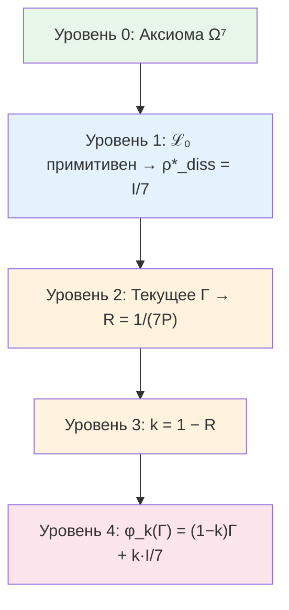

# Оператор Самомоделирования φ

Эта глава описывает, как система строит модель самой себя — один из центральных вопросов и науки о сознании, и философии, и кибернетики. Что значит «знать себя»? Как система, состоящая из частей, может охватить себя целиком — включая тот самый механизм, которым она себя охватывает?

Оператор $\varphi$ — математический ответ на этот вопрос. Он принимает текущее состояние Голонома (матрицу когерентности $\Gamma$) и возвращает *модель* этого состояния — приблизительное отражение, построенное самой системой. Когда отражение совпадает с оригиналом ($\varphi(\Gamma^*) = \Gamma^*$), система достигает **самосогласованности** — её самомодель точна.

:::info DRY: Мастер-определение φ
Это **каноническое определение** оператора самомоделирования $\varphi$ в разделе теории. Полная формализация, доказательства эквивалентности трёх определений и теорема о неподвижной точке — в [Формализации оператора φ](/docs/proofs/categorical/formalization-phi).
:::

---

## Историческая предтеча

Проблема самореференции — одна из самых глубоких в интеллектуальной истории.

**Дуглас Хофштадтер** в книге «Гёдель, Эшер, Бах» (1979) описал *странные петли* — структуры, которые, поднимаясь по уровням иерархии, неожиданно возвращаются к началу. Гёделев номер кодирует утверждения о числах *через* числа. Эшеровские руки рисуют друг друга. Бахов канон восходит по тональностям и возвращается к исходной. Хофштадтер предположил, что именно такие самореферентные петли лежат в основе сознания.

**Роберт Розен** (1991) в книге «Life Itself» формализовал идею *замыкания по эффективной причинности*: живая система — это система, которая является собственной моделью. Его (M,R)-системы предвосхитили автопоэтическую аксиому УГМ.

**Карл Фристон** (2006–) в рамках *Free Energy Principle* показал, что живые системы минимизируют свободную энергию, что эквивалентно построению предсказательной модели среды (и себя). Вариационное определение φ в УГМ — формальный аналог принципа Фристона, но выведенный из аксиом, а не постулированный.

---

## Интуитивное объяснение: зеркало для Голонома {#интуиция-зеркало}

Представьте, что Голоном — существо, живущее в комнате без внешних зеркал. Единственный способ «увидеть» себя — построить внутреннюю модель: представить, как ты выглядишь, основываясь на том, что чувствуешь.

Оператор $\varphi$ — это и есть «зеркало». Голоном смотрит в него ($\varphi(\Gamma)$) и видит приблизительное отражение себя. Но зеркало не идеальное:
- Оно может быть *мутным* — терять детали (базовая декогерирующая форма $\varphi_{\text{base}}$, которая стирает все связи между измерениями)
- Оно может быть *расфокусированным* — видеть не отдельные пиксели, а группы по 3 (Фано-форма $\varphi_{\text{coh}}$, которая сохраняет связи, но ослабляет их)

**Неподвижная точка** $\Gamma^*$ — это состояние, в котором отражение совпадает с оригиналом. Голоном, находясь в $\Gamma^*$, видит себя *точно таким, какой он есть*. Это — состояние полной самосогласованности.

---

## Бутстрап: как разрешается кажущаяся цикличность {#бутстрап}

На первый взгляд, определение φ кажется порочным кругом: φ определяет самомодель $\Gamma^*$, а $\Gamma^*$ входит в определение φ. Но это не порочный круг, а **бутстрап** — самосогласованная конструкция.

Аналогия: рекурсивная картинка. Представьте художника, рисующего картину, на которой изображён художник, рисующий картину, на которой... Кажется, что определение бесконечно рекурсивно. Но если найти *ту* картину, на которой изображённая картина совпадает с самой картиной — рекурсия замыкается. Это и есть неподвижная точка.

Математически цикличность разрешается строго:

:::warning Бутстрап-природа определения φ
Оператор φ определяет «самомодель» системы, т.е. φ(Γ) ≈ Γ — система моделирует саму себя. Это **циклическое** по видимости определение. Цикличность разрешается через **теорему о неподвижной точке**: оператор φ определяется **независимо** (как левый сопряжённый к включению подобъектов), а неподвижная точка Γ* с φ(Γ*) = Γ* у канонического $\varphi_{\mathrm{coh}}$ **существует и единственна** — это $I/7$, — поскольку $\|\varphi_{\mathrm{coh}}(\Gamma) - I/7\|_F \leq k\|\Gamma - I/7\|_F$ при $k \leq 6/7$. *Исправлено 2026-09-25:* здесь стояло «по теореме Банаха (φ — сжимающее отображение с параметром k < 1)»; $k$ умножает отклонение от $I/7$ и не является константой Липшица — вблизи чистых состояний $\varphi_{\mathrm{coh}}$ растягивает расстояния до $54/49$ раза ([эволюция, метод расщепления](/docs/core/dynamics/evolution#итеративная-схема)), а у самомодели, которая держит изолированный голон живым, неподвижных точек несколько. Подробное изложение разрешения цикличности — в [Формализации оператора φ: разрешение цикличности](/docs/proofs/categorical/formalization-phi#категориальное-определение-φ).
:::

---

## Определение

Оператор самомоделирования $\varphi: \mathcal{D}(\mathcal{H}) \to \mathcal{D}(\mathcal{H})$ определяется тремя эквивалентными способами:

| # | Определение | Формула |
|---|-------------|---------|
| 1 | **Категориальное** | $\varphi \dashv i: \text{Sub}(\Gamma) \hookrightarrow \mathbf{Sh}_\infty(\mathcal{C})$ |
| 2 | **Динамическое** | $\varphi(\Gamma) = \Pi_0[\Gamma]$ — проектор на нулевую моду кратности 1 линеаризованного полного генератора $\mathcal{L}_\Omega'\|_{\rho^*_\Omega}$ |
| 3 | **Идемпотентное** | $\varphi \circ \varphi = \varphi$, $\exists \Gamma^*: \varphi(\Gamma^*) = \Gamma^*$ |

:::note Соглашение для определения 2 (исправление самореференциального ρ*, T-96)
«$\lim_{\tau\to\infty}e^{\tau\mathcal{L}_\Omega}$» **не** следует читать как постоянное отображение в диссипативный аттрактор $I/7$: полный генератор $\mathcal{L}_\Omega=\mathcal{L}_0+\mathcal{R}$ нелинеен и не примитивен, с нетривиальной неподвижной точкой $\rho^*_\Omega\neq I/7$. Определение 2 — это зависящий от $\Gamma$ проектор на нулевую моду линеаризованного генератора; примитивна лишь **линейная часть** $\mathcal{L}_0$ (с единственным стационарным состоянием $I/7$) — свойство динамики, а не $\varphi$.
:::

### Три определения простым языком

Каждое из трёх определений отвечает на один и тот же вопрос — «как система строит модель себя?» — но с разных точек зрения.

**Определение 1 (Категориальное): «Лучшее приближение снизу».**
Представьте, что у вас есть сложный объект (Голоном) и коллекция более простых объектов (подобъекты классификатора). Категориальный φ — это способ найти *лучшее приближение* сложного объекта через простые. «Левый сопряжённый к включению» — математический способ сказать «оптимальная проекция на подмножество». Аналогия: вы описываете другу свою внешность по телефону. Из бесконечного множества деталей вы выбираете самые важные (рост, цвет волос, телосложение). Это и есть «лучшее приближение» — $\varphi$ от вашей полной внешности.

**Определение 2 (Динамическое): «Самомодель, которую выделяет динамика».**
Линеаризуйте полную (регенеративную) динамику вблизи её нетривиальной неподвижной точки $\rho^*_\Omega$ и спроецируйте на сохраняющуюся нулевую моду. В отличие от обычной воронки — где каждый мячик оказывается в *одной и той же* нижней точке (это было бы диссипативное $I/7$, дающее тривиальную постоянную $\varphi$) — регенеративный член $\mathcal{R}$ делает $\varphi(\Gamma)$ **зависящей от $\Gamma$**: разные входы дают разные самомодели. Неподвижная точка $\varphi$ — это $\rho^*_\Omega\neq I/7$.

**Определение 3 (Идемпотентное): «Двойное отражение не добавляет ничего нового».**
Если посмотреть в зеркало дважды — увидишь то же самое, что и в первый раз. $\varphi \circ \varphi = \varphi$ означает, что модель модели совпадает с моделью. Аналогия: сфотографируйте фотографию — вы получите (примерно) ту же фотографию.

:::tip Теорема: Эквивалентность определений φ
Три определения задают один и тот же оператор $\varphi$.
[Доказательство →](/docs/proofs/categorical/formalization-phi#эквивалентность-определений-phi) | Статус: **[Т]**
:::

## Базовая форма φ_base (декогерирующее самонаблюдение) {#phi-base}

Для [Голонома](/docs/core/structure/holon) с $\mathcal{H} = \mathbb{C}^7$ **базовая** (декогерирующая) форма:

$$
\varphi_{\text{base}}(\Gamma) = \sum_{k=1}^{7} \Pi_k \, \Gamma \, \Pi_k = \mathrm{diag}(\Gamma)
$$

где $\Pi_k = |e_k\rangle\langle e_k|$ — проекторы на [базисные измерения](/docs/core/structure/dimensions).

:::warning Φ_base недостаточна как каноническая форма
Эта форма **уничтожает** все когерентности ($\gamma_{ij} \to 0$ при $i \neq j$), что несовместимо с жизнеспособностью при равномерных весах. Каноническая форма для живых систем — обобщённый оператор $\varphi_{\text{coh}}$ с [Фано-структурой](#каноническая-конструкция-φ_coh-из-фано-структуры) (см. ниже). Каноническая форма в [Формализации оператора φ](/docs/proofs/categorical/formalization-phi#26-каноническая-форма-φ-для-угм) использует $\varphi_{\text{UHM}} = k \cdot \mathcal{P}_{\text{pred}} + (1-k) \cdot I/7$, что при $\mathcal{P}_{\text{pred}} = \mathcal{P}_{\text{base}}$ совпадает с $\varphi_{\text{base}}$ (с якорем $I/7$). Обобщение на $\mathcal{P}_{\text{pred}} = \mathcal{P}_\alpha$ (выпуклая комбинация $\mathcal{P}_{\text{base}}$ и $\mathcal{P}_{\text{Fano}}$) даёт $\varphi_{\text{coh}}$.
:::

## Свойства

1. **CPTP-канал:** $\varphi$ — полностью положительное, сохраняющее след отображение
2. **Идемпотентность (идеального φ):** $\varphi \circ \varphi = \varphi$ — для идемпотентного определения (Определение 3). Каноническая форма $\varphi_{\text{coh}}$ с параметром сжатия $k = 1 - R < 1$ [Т] не идемпотентна; она **стягивает к $I/7$**, $\|\varphi_{\text{coh}}(\Gamma) - I/7\|_F \leq k\|\Gamma - I/7\|_F$, но не является сжатием пространства состояний (константа Липшица $54/49$ в чистых состояниях; до 2026-09-25 — «сжимающее отображение»); идемпотентная проекция — предел $\lim_{n\to\infty} \varphi_{\text{coh}}^n$, постоянное отображение в $I/7$
3. **Монотонность чистоты:** $P(\varphi_{\text{base}}(\Gamma)) \leq P(\Gamma)$ для базовой формы (декогеренция уменьшает чистоту); $P(\varphi_{\text{coh}}(\Gamma))$ зависит от параметра $\alpha$ — при $\alpha < 1$ Фано-компонента частично сохраняет когерентности. Неподвижная точка канонической $\varphi_{\mathrm{coh}}$ — это $I/7$, $P = 1/7$ (прежнее значение $2/7$ отозвано, см. ниже)
4. **Неподвижная точка:** $\exists! \, \Gamma^*_{\mathrm{coh}}: \varphi_{\mathrm{coh}}(\Gamma^*_{\mathrm{coh}}) = \Gamma^*_{\mathrm{coh}}$, а именно $\Gamma^*_{\mathrm{coh}} = I/7$

:::tip Теорема: Неподвижная точка φ_coh (исправлено 2026-09-25) {#неподвижная-точка-phi-coh}
У канонической $\varphi_{\mathrm{coh}}$ (якорь $I/7$, $k = 1 - R < 1$) ровно одна неподвижная точка, $\Gamma^*_{\mathrm{coh}} = I/7$, $P = 1/7$.

*Доказательство.* В неподвижной точке $\gamma_{ij} = \tfrac{k(1-\alpha)}{3}\gamma_{ij}$ при $i \neq j$, а $k(1-\alpha)/3 < 1$, значит, $\gamma_{ij} = 0$; на диагонали $\gamma_{ii} = k\gamma_{ii} + (1-k)/7$, и $1 - k = R > 0$ даёт $\gamma_{ii} = 1/7$. $\blacksquare$ Это согласуется со Следствием 2.1 [формализации φ](/docs/proofs/categorical/formalization-phi#3-теорема-о-существовании-неподвижной-точки) (равномерный якорь, неподвижная точка $I/7$). Статус: **[Т]**. Прежнее утверждение «$P(\Gamma^*_{\mathrm{coh}}) = P_{\text{crit}} = 2/7$» отозвано [✗]: 200 итераций $\varphi_{\mathrm{coh}}$ от случайного чистого состояния приходят к $P = 1/7$ с точностью $10^{-12}$ (`test_unital_self_model_keeps_an_isolated_holon_dead`).
:::

:::warning Различие неподвижных точек
Для канонической $\varphi_{\mathrm{coh}}$ неподвижная точка самомодели и аттрактор диссипатора совпадают: обе равны $I/7$. *Исправлено 2026-09-25:* блок утверждал, что $\Gamma^*_{\mathrm{coh}}$ с $P = 2/7$ отличается от $\rho^*_{\mathrm{diss}} = I/7$. Они различаются у самомодели с неунитальным якорем — у саморегистрирующей $\varphi_s$ [ниже](#phi-s) неподвижно каждое базисное состояние. Каноническое определение [меры рефлексии R](/docs/consciousness/foundations/self-observation#мера-рефлексии-r) использует $\rho^*_{\mathrm{diss}} = I/7$: $R = 1/(7P)$. Подробнее: [стратификация определений](/docs/core/foundations/axiom-septicity#теорема-непротиворечивость-иерархии-определений).
:::

---

## Необходимость обобщённого φ для живых систем

:::warning Каноническая φ_base недостаточна
Каноническая $\varphi_{\text{base}}$ (декогерирующее самонаблюдение, проекция на диагональ) **уничтожает** все когерентности: $[\varphi_{\text{base}}(\Gamma)]_{ij} = 0$ при $i \neq j$. Это несовместимо с жизнеспособностью: при $\gamma_{ii} \approx 1/7$ получаем $P \approx 1/7 < P_{\text{crit}} = 2/7$. Для достижения $P > P_{\text{crit}}$ без когерентностей требуется патологическая локализация одного измерения.
:::

:::tip Теорема: Необходимость когерентно-сохраняющего φ
Живая самомодель **обязана** сохранять когерентности: $\exists\, (i,j): [\varphi(\Gamma)]_{ij} \neq 0$. Требуется обобщённая $\varphi_{\text{coh}}$.
[Доказательство →](/docs/proofs/gap/fano-channel#необходимость-phi-coh) | Статус: **[Т]**
:::

---

## Каноническая конструкция φ_coh из Фано-структуры

### Зачем нужен Фано-канал: расфокусированное зрение {#интуиция-фано}

Прежде чем перейти к формулам, поймём *зачем* нужна Фано-структура.

Представьте, что зеркало Голонома может работать в двух режимах:
- **Пиксельный режим** ($\varphi_{\text{base}}$): зеркало видит каждый «пиксель» (измерение) отдельно, но полностью теряет связи между пикселями. Как если бы вы разрезали фотографию на 7 квадратиков и перемешали их — вы знаете содержимое каждого квадратика, но не знаете, как они связаны.
- **Расфокусированный режим** ($\mathcal{P}_{\text{Fano}}$): зеркало видит не отдельные пиксели, а *группы по 3* (Фано-линии). Это как расфокусированное зрение — вы теряете мелкие детали, но сохраняете *связи* между измерениями. Каждая группа из трёх измерений наблюдается как целое.

Почему именно группы по 3? Потому что [плоскость Фано](/docs/physics/gauge-symmetry/fano-selection-rules) PG(2,2) — единственная структура на 7 точках, где каждая пара точек лежит ровно на одной линии из 3 точек. Это **максимально демократичное** наблюдение: ни одна пара измерений не привилегирована.

Ключевой результат: пиксельное зеркало *убивает* систему (при равномерных весах чистота падает ниже порога $P_{\text{crit}} = 2/7$). Расфокусированное зеркало *сохраняет жизнь*, потому что сохраняет связи (когерентности) между измерениями. Живое самонаблюдение **обязано** быть частично расфокусированным.

#### Математика смешивания каналов {#математика-смешивания}

Почему выпуклая комбинация $\mathcal{P}_\alpha = \alpha\,\mathcal{P}_{\text{base}} + (1-\alpha)\,\mathcal{P}_{\text{Fano}}$ работает:

1. **$\mathcal{P}_{\text{base}}$ в одиночку**: уничтожает все когерентности → при равномерных весах $P \approx 1/7 < P_{\text{crit}}$ → система гибнет
2. **$\mathcal{P}_{\text{Fano}}$ в одиночку**: когерентности масштабируются на $1/3$, фазы сохраняются → $P$ остаётся выше порога
3. **Выпуклая комбинация**: $\mathcal{P}_\alpha$ — CPTP-канал (выпуклая комбинация CPTP-каналов — CPTP)
4. **При $\alpha = 0$**: чистый Фано, максимальное сохранение когерентностей, но менее точная предиктивная модель
5. **При $\alpha = 1$**: чистый атомарный, идеальная предиктивная точность, но система погибает
6. **Ни один доказанный принцип не фиксирует $\alpha$.** Утверждалось, что вариационный принцип находит оптимум $\alpha^* \in (0,1)$, балансирующий точность и выживаемость; это утверждение отозвано (2026-09-25; см. раздел об α* ниже) — использованный функционал минимален при $\alpha = 0$

### Два типа атомов классификатора

:::note DRY: Мастер-определение
Полные определения атомарных и Фано-операторов Линдблада — в [Операторах Линдблада](/docs/core/operators/lindblad-operators#атомы-классификатора). Ниже приведены ключевые формулы, необходимые для конструкции φ_coh.
:::

[Классификатор Ω](/docs/core/foundations/axiom-omega) содержит не только **атомарные** подобъекты $S_k = |k\rangle\langle k|$, но и **составные**. [Плоскость Фано](/docs/physics/gauge-symmetry/fano-selection-rules) $PG(2,2)$ определяет 7 линейных подобъектов — проекции на 3-мерные подпространства:

$$
\Pi_p = \sum_{i \in \mathrm{line}_p} |i\rangle\langle i|, \quad p = 1, \ldots, 7
$$

:::tip Теорема: Полнота атомов Фано
Каждое измерение лежит на ровно 3 Фано-линиях. Следовательно: $\sum_{p=1}^{7} \Pi_p = 3I$.
[Доказательство →](/docs/proofs/gap/fano-channel#фано-канал) | Статус: **[Т]**
:::

### Фано-предиктивный канал $\mathcal{P}_{\text{Fano}}$

Для каждой Фано-линии $p = (i,j,k)$ определяется [оператор Линдблада](/docs/core/operators/lindblad-operators):

$$
L_p^{\text{Fano}} := \frac{1}{\sqrt{3}}\,\Pi_p = \frac{1}{\sqrt{3}}(|i\rangle\langle i| + |j\rangle\langle j| + |k\rangle\langle k|)
$$

Фано-предиктивный канал:

$$
\mathcal{P}_{\text{Fano}}(\Gamma) := \sum_{p=1}^{7} L_p^{\text{Fano}}\,\Gamma\,(L_p^{\text{Fano}})^\dagger = \frac{1}{3}\sum_{p=1}^{7} \Pi_p\,\Gamma\,\Pi_p
$$

:::info CPTP-верификация
$\sum (L_p^{\text{Fano}})^\dagger L_p^{\text{Fano}} = I$ — полное доказательство в [Операторах Линдблада](/docs/core/operators/lindblad-operators#фано-операторы).
:::

### Теорема: Фано-канал сохраняет когерентности

:::tip Теорема: Сохранение когерентностей Фано-каналом
Для произвольной матрицы когерентности $\Gamma$:

**(a)** Диагональные элементы сохраняются точно: $[\mathcal{P}_{\text{Fano}}(\Gamma)]_{ii} = \gamma_{ii}$

**(b)** Когерентности сохраняются с коэффициентом $1/3$: $[\mathcal{P}_{\text{Fano}}(\Gamma)]_{ij} = \frac{1}{3}\gamma_{ij}$ при $i \neq j$

**(c)** Фазы когерентностей сохраняются в точности: $\arg([\mathcal{P}_{\text{Fano}}(\Gamma)]_{ij}) = \arg(\gamma_{ij})$

Ключевое отличие от $\varphi_{\text{base}}$: Фано-канал **масштабирует** амплитуды когерентностей без фазового искажения, тогда как $\varphi_{\text{base}}$ уничтожает их полностью.
[Доказательство →](/docs/proofs/gap/fano-channel#теорема-фано-канал) | Статус: **[Т]**
:::

### Каноническая форма φ_coh

:::tip Теорема: Каноническая форма φ_coh
Каноническое когерентно-сохраняющее самомоделирование:

$$
\varphi_{\text{coh}}(\Gamma) = k \cdot \left[\alpha \cdot \mathcal{P}_{\text{base}}(\Gamma) + (1 - \alpha) \cdot \mathcal{P}_{\text{Fano}}(\Gamma)\right] + (1 - k) \cdot \Gamma_{\text{anchor}}
$$

где:
- $\mathcal{P}_{\text{base}}(\Gamma) = \sum_m P_m\,\Gamma\,P_m = \mathrm{diag}(\Gamma)$ — атомарный канал (из [формализации φ](/docs/proofs/categorical/formalization-phi))
- $\mathcal{P}_{\text{Fano}}(\Gamma) = \frac{1}{3}\sum_p \Pi_p\,\Gamma\,\Pi_p$ — Фано-канал
- $\alpha \in [0, 1]$ — **параметр глубины декогеренции** (баланс атомарного и Фано-наблюдения)
- $k = 1 - R$ — параметр сжатия, определяемый [мерой рефлексии](/docs/consciousness/foundations/self-observation#теорема-k-из-r) $R = 1 - \|\Gamma - \rho^*\|_F^2/\|\Gamma\|_F^2$ **[Т]**. Не является свободным параметром
- $\Gamma_{\text{anchor}} = \rho^*_{\mathrm{diss}} = I/7$ — **якорное состояние**, совпадающее с аттрактором диссипативной части $\mathcal{L}_0$. Этот выбор обусловлен примитивностью $\mathcal{L}_0$ [T-39a]: единственное стационарное состояние линейной динамики — максимально смешанное $I/7$. При полном сжатии ($k \to 1$, $R \to 0$) самомодель стремится к $I/7$ — состоянию полного отсутствия информации о себе.

$\mathcal{P}_\alpha = \alpha\,\mathcal{P}_{\text{base}} + (1-\alpha)\,\mathcal{P}_{\text{Fano}}$ — выпуклая комбинация CPTP-каналов, следовательно CPTP.
[Доказательство →](/docs/proofs/gap/fano-channel#phi-coh) | Статус: **[Т]**
:::

### Целевые когерентности φ_coh

:::tip Теорема: Целевые когерентности φ_coh
**(a)** Модуль целевой когерентности (при диагональном якоре): $|\gamma_{ij}^{\text{target}}| = \frac{k(1-\alpha)}{3} \cdot |\gamma_{ij}|$

**(b)** Целевая фаза **сохраняется**: $\theta_{ij}^{\text{target}} = \theta_{ij}$

**(c)** Целевой Gap **сохраняется**: $\mathrm{Gap}^{\text{target}}(i,j) = \mathrm{Gap}(i,j)$

Каноническая $\varphi_{\text{coh}}$ **не стремится изменить Gap** — она воспроизводит Gap с ослабленной амплитудой, масштабируя когерентности без фазового искажения.
[Доказательство →](/docs/proofs/gap/fano-channel#phi-coh) | Статус: **[Т]**
:::

---

## Явные коэффициенты $c_{mn}$

Общая форма когерентно-сохраняющего канала из определения $\varphi_{\text{coh}}$:

$$
\mathcal{P}_{\text{coh}}(\Gamma) = \sum_{m,n} c_{mn}\,|m\rangle\langle n|\,\Gamma\,|n\rangle\langle m|
$$

:::tip Теорема: Явные коэффициенты $c_{mn}$
Коэффициенты канонического $\varphi_{\text{coh}}$ при заданном Фано-весе $\alpha$:

$$
c_{mn} = \begin{cases} k & m = n \text{ (атомарный и Фано-канал оба сохраняют диагональ)} \\ (1-\alpha) k / 3 & m \neq n \end{cases}
$$

а якорь добавляет $(1-k)\,[\Gamma_{\text{anchor}}]_{mn}$. Каждая пара $(m,n)$ лежит ровно на одной Фано-линии, так что третий случай «$0$ для $(m,n)$ вне общей Фано-линии» пуст. *Исправлено 2026-09-25:* врезка печатала $c_{mm} = \alpha^* k$ и этот пустой третий случай; диагональный коэффициент равен $\alpha k + (1-\alpha)k = k$ (как в [$G_2$-структуре, теорема 10.5](/docs/physics/gauge-symmetry/g2-structure)), а $\alpha^*$ отозвано.

Коэффициенты определены через:
- [Фано-структуру](/docs/physics/gauge-symmetry/fano-selection-rules) $PG(2,2)$ (алгебраическая геометрия)
- Фано-вес $\alpha$ — свободный параметр; его вариационное значение $\alpha^* \approx 1 - 2/(7P)$ отозвано (см. ниже)
- Параметр сжатия $k$ (из [формализации φ](/docs/proofs/categorical/formalization-phi))

[Доказательство →](/docs/proofs/gap/fano-channel#phi-coh) | Статус: **[Т]**
:::

:::info Операторы Крауса (7 + 7 + 49; исправлено 2026-09-25)
Атомарные операторы (7): $K_m^{(\text{atom})} = \sqrt{\alpha k} \cdot |m\rangle\langle m|$. Фано-операторы (7): $K_p^{(\text{Fano})} = \sqrt{(1-\alpha) k / 3} \cdot \Pi_p$. Якорные операторы (49), где $\Gamma_{\text{anchor}} = \sum_i \lambda_i |\psi_i\rangle\langle\psi_i|$: $K_{ij}^{(\text{anch})} = \sqrt{(1-k)\lambda_i} \cdot |\psi_i\rangle\langle j|$. Проверка: $\sum_m (K_m^{(\text{atom})})^\dagger K_m^{(\text{atom})} = \alpha k \cdot I$; $\sum_p (K_p^{(\text{Fano})})^\dagger K_p^{(\text{Fano})} = \tfrac{(1-\alpha)k}{3} \cdot 3I$ (каждая точка лежит на трёх линиях); $\sum_{i,j} (K_{ij}^{(\text{anch})})^\dagger K_{ij}^{(\text{anch})} = (1-k) \cdot I$; в сумме $I$. Эти 63 оператора воспроизводят $\varphi_{\text{coh}}$ с точностью $3 \times 10^{-16}$ на 50 случайных состояниях. Прежний набор — $K_m^{(\text{atom})} = \sqrt{\alpha^* k/7}\,|m\rangle\langle m|$ и один якорь $K_0 = \sqrt{(1-k)/7}\,I$ — не сохранял след: $\sum_m |m\rangle\langle m| = I$, а не $7I$, и $K_0^\dagger K_0 = \tfrac{1-k}{7}\,I$; при $\alpha = 0{,}4$, $k = 0{,}8$ он отстоит от $I$ на $1{,}18$ по норме Фробениуса, а одно кратное $I$ не может реализовать замещение $\Gamma \mapsto (1-k)\,\Gamma_{\text{anchor}}$. Та же поправка, что в [$G_2$-структуре, теорема 10.5](/docs/physics/gauge-symmetry/g2-structure).
:::

---

## Вариационное определение α*

:::tip Теорема: Вариационное определение α* — отозвана 2026-09-25 [✗]
Оптимальный параметр $\alpha^*$ определяется [вариационным принципом](/docs/proofs/dynamics/fep-derivation):

$$
\alpha^* = \arg\min_{\alpha \in [0,1]} \mathcal{F}[\mathcal{P}_\alpha; \Gamma] = \arg\min_{\alpha} \left[S_{\text{spec}}(\mathcal{P}_\alpha(\Gamma)) + D_{KL}(\mathcal{P}_\alpha(\Gamma) \| \Gamma)\right]
$$

Приближённая формула для системы с чистотой $P > P_{\text{crit}}$:

$$
\alpha^* \approx 1 - \frac{P_{\text{crit}}}{P} = 1 - \frac{2}{7P}
$$

| Чистота $P$ | $\alpha^*$ | Интерпретация |
|-------------|-----------|---------------|
| $P = 1$ (чистое состояние) | $\approx 0.71$ | Существенное Фано-участие |
| $P = 0.5$ | $\approx 0.43$ | Баланс атомарного и Фано |
| $P \to P_{\text{crit}}$ | $\to 0$ | Почти полностью Фано (минимальное разрушение когерентностей) |

[Доказательство →](/docs/proofs/gap/fano-channel#alpha-star) | Статус: отозвана [✗]

**Почему отозвана.** $\mathcal{F}[\psi;\Gamma] = -\mathrm{Tr}(\psi(\Gamma)\log\Gamma)$ линеен по $\psi(\Gamma)$, а $\mathcal{P}_\alpha(\Gamma) = \Delta(\Gamma) + \tfrac{1-\alpha}{3}(\Gamma - \Delta(\Gamma))$, где $\Delta$ — диагональная часть, аффинен по $\alpha$. Поэтому $\mathcal{F}(\alpha) = \mathcal{F}(0) + \tfrac{\alpha}{3}\left[D_{KL}(\Gamma\|\Delta\Gamma) + D_{KL}(\Delta\Gamma\|\Gamma)\right]$ для $\Gamma$ полного ранга: минимум на $[0,1]$ достигается при $\alpha = 0$ (чистый Фано), как только у $\Gamma$ есть когерентности, и внутреннего оптимума $1 - 2/(7P)$ нет. Проверено на 400 случайных состояниях с $P$ от $0{,}19$ до $0{,}91$: минимум при $\alpha = 0$ во всех 400. Поэтому вес $\alpha$ канонической $\varphi_{\text{coh}}$ — свободный параметр; ни один принцип корпуса его не фиксирует.
:::

:::info Физический смысл баланса
При $\alpha = 1$ (чисто атомарный канал) — максимальная предсказательная точность, но полное уничтожение когерентностей. При $\alpha = 0$ (чисто Фано) — сохранение когерентностей с коэффициентом $1/3$, но менее точная предсказательная модель. Оптимум $\alpha^* \in (0,1)$ — баланс между предсказательной точностью и сохранением структуры. **[✗]** У функционала из врезки выше такого внутреннего оптимума нет; компромисс реален, но этим функционалом он не разрешается.
:::

#### Эскиз вывода формулы α* {#эскиз-вывода-alpha}

Функционал $\mathcal{F}[\alpha] = S_{\text{spec}}(\mathcal{P}_\alpha(\Gamma)) + D_{KL}(\mathcal{P}_\alpha(\Gamma) \| \Gamma)$.

Канал $\mathcal{P}_\alpha$ действует: диагональ сохраняется, когерентности $\gamma_{ij} \mapsto \frac{(1-\alpha)}{3}\gamma_{ij}$. Поэтому чистота самомодели: $P_\alpha \approx P_{\text{diag}} + \left(\frac{1-\alpha}{3}\right)^2 P_{\text{coh}}$.

Спектральная энтропия $S_{\text{spec}}$ растёт при уменьшении $\alpha$ (ослабление когерентностей → смешивание). Дивергенция Кульбака—Лейблера $D_{KL}$ растёт при увеличении $\alpha$ (больше отклонение от $\Gamma$). Условие стационарности $\partial\mathcal{F}/\partial\alpha = 0$ при типичных $\Gamma$ с чистотой $P$ даёт:

$$\alpha^* \approx 1 - \frac{P_{\text{crit}}}{P} = 1 - \frac{2}{7P}$$

Формула **приближённая** — точное решение требует числовой оптимизации для произвольных $\Gamma$.

**[✗] Отозванный эскиз (2026-09-25):** здесь $S_{\text{spec}} + D_{KL}$ — не сумма убывающего и растущего членов, а аффинная функция $\alpha$ с наклоном $\tfrac13[D_{KL}(\Gamma\|\Delta\Gamma) + D_{KL}(\Delta\Gamma\|\Gamma)] \geq 0$, поэтому уравнение $\partial\mathcal{F}/\partial\alpha = 0$ не имеет решения, если $\Gamma$ не диагональна.

### Числовой пример {#числовой-пример-phi}

Пусть $\Gamma$ имеет чистоту $P = 0.4$ (жизнеспособная система). Вычислим (шаг 1 использует отозванную формулу для $\alpha^*$, так что числа ниже иллюстрируют один выбор свободного веса $\alpha$, а не выведенное значение):

1. **Параметр $\alpha^*$:** $\alpha^* \approx 1 - 2/(7 \times 0.4) = 1 - 0.714 = 0.286$
2. **Мера рефлексии:** $R = 1/(7P) = 1/2.8 \approx 0.357$
3. **Параметр сжатия:** $k = 1 - R = 0.643$
4. **Целевая когерентность:** $|\gamma_{ij}^{\text{target}}| = \frac{k(1-\alpha^*)}{3}|\gamma_{ij}| = \frac{0.643 \times 0.714}{3}|\gamma_{ij}| \approx 0.153\,|\gamma_{ij}|$

Самомодель сохраняет ~15% амплитуды каждой когерентности — «расфокусированное», но не уничтоженное отражение. При итерациях чистота самомодели сходится к $1/7$, а не к $P_{\text{crit}} = 2/7$ (исправлено 2026-09-25; текст утверждал, что порог жизнеспособности служит аттрактором самомоделирования): каноническая $\varphi_{\mathrm{coh}}$ унитальна, и её единственная неподвижная точка — $I/7$.

---

## Почему изолированному голону нужна неунитальная самомодель: саморегистрирующая форма φ_s {#phi-s}

Каноническая $\varphi_{\mathrm{coh}}$ сохраняет когерентности, и это необходимо для жизни ([канал Фано, Теорема 9.1](/docs/proofs/gap/fano-channel#необходимость-phi-coh)), но не достаточно. Якорь $I/7$ делает её унитальной, а унитальная самомодель не может поднять чистоту: изолированный голон, регенерирующий к $\varphi_{\mathrm{coh}}(\Gamma)$, умирает при любом $\kappa$ ([мёртвая изоляция](/docs/core/dynamics/evolution#теорема-мёртвая-изоляция) [Т]).

:::tip Теорема (Симметричные линейные самомодели унитальны) [Т]
Линейная CPTP-самомодель, ковариантная относительно $G_2$ или реперной группы $\Gamma_{\mathrm{oct}}$, унитальна. Унитальна и $\varphi_{\mathrm{coh}}$ при любых $\alpha$ и $k$.
:::

*Доказательство.* $\Phi(I)$ коммутирует с неприводимым представлением, значит, кратна $I$ (лемма Шура) и равна $I$ по сохранению следа; $G_2$ и $\Gamma_{\mathrm{oct}}$ действуют на $\mathbb{C}^7$ неприводимо ([эволюция, мёртвая изоляция, пункт 3](/docs/core/dynamics/evolution#теорема-мёртвая-изоляция)). $\blacksquare$

Поэтому якорь, удерживающий голон живым, либо нарушает симметрию извне — средовой якорь воплощённого голона ([T-148](/docs/proofs/consciousness/substrate-closure#t-148)), — либо зависит от самого состояния, и тогда ковариантный закон может иметь несимметричные неподвижные точки.

:::tip Лемма (Внутренние якоря спектральны) [Т]
Пусть $\sigma$ переводит состояния в состояния и $\sigma(U\Gamma U^\dagger) = U\sigma(\Gamma)U^\dagger$ для любого унитарного $U$ — якорь не ссылается ни на что вне голона. Если собственные значения $\Gamma = \sum_i \lambda_i |i\rangle\langle i|$ различны, то $\sigma(\Gamma) = \sum_i s_i |i\rangle\langle i|$ диагональна в собственном базисе $\Gamma$ и $\mathrm{Tr}(\Gamma\sigma(\Gamma)) = \sum_i \lambda_i s_i$. Постоянный якорь $s_i = 1/7$ даёт перекрытие $1/7 < P$ при любом $\Gamma \neq I/7$; выбор $s_i = \lambda_i$ ($\sigma(\Gamma) = \Gamma$) делает цель регенерации в $\Gamma$ образом $\Gamma$ под унитальным $k\mathcal{P}_\alpha + R\,\mathrm{id}$; выбор $s_i = \lambda_i^2/\sum_j \lambda_j^2$ даёт $\mathrm{Tr}\,\Gamma^3/\mathrm{Tr}\,\Gamma^2 \geq P$, с равенством лишь при плоском спектре.
:::

*Доказательство.* Унитарные $U = \sum_i e^{i\theta_i}|i\rangle\langle i|$ оставляют $\Gamma$ на месте, поэтому $U\sigma(\Gamma)U^\dagger = \sigma(\Gamma)$ при всех фазах $\theta_i$, и $\sigma(\Gamma)$ диагональна в $\{|i\rangle\}$. Перекрытие тогда равно $\sum_i\lambda_i s_i$. При $s_i \propto \lambda_i^2$ неравенство $\sum_i\lambda_i^3 \geq (\sum_i\lambda_i^2)^2$ — неравенство Чебышёва для сумм с весами $\lambda_i$. $\blacksquare$

Веса $s \propto \lambda^q$ упорядочивают внутренние якоря: $q = 0$ — канонический $I/7$, $q = 1$ — само состояние, и оба мертвы по теореме о мёртвой изоляции; $q = 2$ — наименьшая степень, которая заостряет. При $q \to \infty$ якорь становится проектором на старший собственный вектор $\Gamma$ — минимизатором по CPTP-каналам перекрёстной энтропии $-\mathrm{Tr}(\psi(\Gamma)\log\Gamma)$ из [отозванного вариационного принципа](/docs/proofs/dynamics/fep-derivation), — и он разрывен там, где старшее собственное значение вырождено.

**Определение [О] (саморегистрирующая самомодель).**

$$
\varphi_s(\Gamma) = k\,\mathcal{P}_\alpha(\Gamma) + R\,\frac{\Gamma^2}{\mathrm{Tr}\,\Gamma^2}, \qquad R = \frac{1}{7P},\quad k = 1 - R .
$$

Якорь $\Gamma^2/\mathrm{Tr}\,\Gamma^2 = \sqrt{\Gamma}\,\Gamma\,\sqrt{\Gamma}/\mathrm{Tr}(\Gamma^2)$ — обновление Людерса состояния $\Gamma$ по эффекту $\Gamma$: состояние, в котором голон остаётся, зарегистрировав собственное состояние, — единственный эффект, доступный ему без внешнего ориентира. Он гладок на всех состояниях ($\mathrm{Tr}\,\Gamma^2 \geq 1/7$) и отличается от $\varphi_{\mathrm{coh}}$ только якорем. С ним у изолированного голона не меньше семи самоподдерживающихся аттракторов с $P > 2/7$ ([эволюция](/docs/core/dynamics/evolution#теорема-самоподдерживающийся-аттрактор) [Т]); при $H = 0$ это базисные состояния, где $\varphi_s(e_m) = e_m$ — точное самопознание. Что самомодель физического голона есть $\varphi_s$, а не $\varphi_{\mathrm{coh}}$, из аксиом не выведено [Пр]; что для жизни изолированного голона она обязана быть неунитальной — [Т].

## Что аксиомы фиксируют в якоре, и якорь коллинеаций φ_J {#phi-j}

Аттракторы $\varphi_s$ лежат выше окна сознания и локализованы. Причина не в выборе $q = 2$: самомодель, ковариантная относительно диагональных унитарных, — всякий внутренний якорь, всякий якорь из проекторов Фано — не держит гиперболического аттрактора в $\mathcal{V}_{\mathrm{full}}$ вблизи $H = 0$ ([фазовое препятствие](/docs/core/dynamics/evolution#теорема-фазовое-препятствие) [Т]). Окна по чистоте такая самомодель достичь может — Фано-регистрация из той же теоремы держит $P = 1/3$ при любом $\kappa$, — но не $\Phi \geq 1$.

:::tip Теорема (Симметричные якоря) [Т]
Пусть самомодель имеет замещающую форму $\varphi(\Gamma) = k\,\mathcal{P}_\alpha(\Gamma) + R\,\rho_a$ с якорем $\rho_a$, не зависящим от $\Gamma$.

1. Если $\varphi$ ковариантна относительно $G_2$, знаковой реперной группы $\Gamma_{\mathrm{oct}}$ или полной группы мономиальных унитарных, переставляющих прямые Фано (перестановки с произвольными фазами), то $\rho_a = I/7$ и $\varphi$ унитальна.
2. Если $\varphi$ ковариантна относительно 168 коллинеаций плоскости Фано, действующих перестановками базиса, то $\rho_a = (1 - t)\,I/7 + t\,uu^\dagger$ с $u = (1, \dots, 1)/\sqrt7$ и $t \in [-1/6, 1]$; унитальна она лишь при $t = 0$, чист якорь лишь при $t = 1$.
:::

*Доказательство.* $\mathcal{P}_\alpha$ ковариантен относительно каждой из этих групп (они переводят прямые Фано в прямые, а $\mathcal{P}_{\mathrm{base}}$ перестановочен с мономиальными унитарными), поэтому ковариантность $\varphi$ означает $M\rho_aM^\dagger = \rho_a$ для всех $M$ группы, то есть $\rho_a$ лежит в коммутанте. Для $G_2$ и $\Gamma_{\mathrm{oct}}$ коммутант есть $\mathbb{C}I$ ([мёртвая изоляция, пункт 3](/docs/core/dynamics/evolution#теорема-мёртвая-изоляция)); в мономиальной группе диагональные фазы делают $\rho_a$ диагональной, а дважды транзитивные перестановки — её диагональ постоянной. 168 коллинеаций действуют на точках дважды транзитивно, так что у перестановочного представления две орбиты на парах индексов — совпадающие и различные, — и его коммутант натянут на $I$ и $J$ ($J/7 = uu^\dagger$). Собственные значения $(1 - t)I/7 + t\,uu^\dagger$ равны $(1 + 6t)/7$ и $(1 - t)/7$, откуда $t \in [-1/6, 1]$. $\blacksquare$

**Что сопряжение оставляет открытым.** Сопряжение самомоделирования $\varphi \dashv i$ и терминальный объект делают $\varphi$ левым сопряжённым CPTP-каналом, но не фиксируют его якорь: любой якорь выше даёт CPTP-канал той же формы, как и любой внутренний якорь, в том числе обновление Людерса $\Gamma^2/\mathrm{Tr}\,\Gamma^2$ в $\varphi_s$. Ещё четыре пути с категорной стороны оставляют якорь открытым или убивают голон [Т]. Состояние, которое даёт терминальный объект, — двойственное единственному отбрасыванию, — это $I/7$, мёртвое. Теорема Ловера о неподвижной точке, как и теорема Брауэра, даёт неподвижную точку $\varphi$, но о якоре ничего не говорит. Рефлексивный якорь, равный неподвижной точке задаваемой им самомодели ($\rho_a = k\mathcal{P}_\alpha(\rho_a) + R\rho_a$), удовлетворяет $\mathcal{P}_\alpha(\rho_a) = \rho_a$ и потому диагонален: ковариантен относительно фаз и по препятствию лежит вне $\mathcal{V}_{\mathrm{full}}$ вблизи $H = 0$. И сохранение возможно большей части реперной группы — максимальной подгруппы $\Gamma_{\mathrm{oct}}$ — тоже фиксирует лишь диагональные якоря: $\Gamma_{\mathrm{oct}} = 2^3{\cdot}\mathrm{GL}(3,2)$ — нерасщепимое расширение (Гашюц: у её силовской 2-подгруппы порядка 64 нет дополнения к знаковой подгруппе $N$), $N$ — неприводимый $\mathrm{GL}(3,2)$-модуль, поэтому всякая максимальная подгруппа содержит $N$, а коммутант $N$ — диагональ.

Якорь фиксирует реперная группа, прочитанная на том уровне, где она совместима с жизнью.

:::tip Теорема T-334 (Якорь коллинеаций, выведенный с точностью до калибровки) [Т] {#t-334}
Пусть самомодель имеет замещающую форму $\varphi(\Gamma) = k\,\mathcal{P}_\alpha(\Gamma) + R\,\rho_a$ с якорем, не зависящим от $\Gamma$, а изолированный голон эволюционирует по динамике с затвором и диссипатором Фано ([эволюция](/docs/core/dynamics/evolution#теорема-живой-аттрактор-в-окне)); $c = (1 - \alpha)/3$.

1. **Реперная ковариантность и жизнь.** $\varphi$ ковариантна относительно $\Gamma_{\mathrm{oct}}$, или ковариантна $\mathcal{P}_\alpha \circ \varphi$ ($\alpha \lt 1$), лишь при $\rho_a = I/7$ — это смерть. Атомное прочтение $\mathcal{P}_{\mathrm{base}} \circ \varphi$ ковариантно относительно $\Gamma_{\mathrm{oct}}$ тогда и только тогда, когда $\mathrm{diag}\,\rho_a = I/7$; тогда и стационарная диагональ при $H = 0$ равна $I/7$, то есть $\sigma_k = 0$ на каждой оси.
2. **Жизнеспособность зависит от одного числа.** Если $\mathrm{diag}\,\rho_a = I/7$, гиперболический сток в $\mathcal{V}_{\mathrm{full}}$ при $H = 0$ существует ровно при $\kappa > \kappa_c(s)$, где $s = P(\rho_a) - 1/7$ — когерентная чистота якоря; $\kappa_c(s)$ совпадает с порогом семейства $(1-t)I/7 + t\,uu^\dagger$ при $t = \sqrt{7s/6}$, строго убывает по $s$ и конечен ровно при $s > (2 - c)^2/7$.
3. **Самый жизнеспособный = самый информативный.** Поэтому среди якорей, не выделяющих ни одной оси, тот, чей диапазон живых $\kappa$ содержит диапазон любого другого, — чистое состояние с равномерной диагональю: $\rho_a = D\,uu^\dagger D^\dagger$, $D$ — диагональная унитарная, $u = (1, \dots, 1)/\sqrt7$. Наибольшая жизнеспособность и наибольшая информация (чистота) выбирают один и тот же якорь.
4. **Калибровка.** Диагональные унитарные перестановочны с $\mathcal{D}_\Omega$ и $\mathcal{P}_\alpha$ и сохраняют $P$, $R$, $g_V$, так что сопряжение с $D$ переводит динамику с якорем $uu^\dagger$ и гамильтонианом $D^\dagger H D$ в динамику с якорем $D\,uu^\dagger D^\dagger$ и $H$. При $H = 0$ якоря $D\,uu^\dagger D^\dagger$ дают сопряжённые потоки; $\varphi_J$ единственна с точностью до этой калибровки динамики без $H$ (и веса $\alpha$).
5. **Симметрия.** $uu^\dagger$ неподвижен при всех $5040$ матрицах перестановок, и динамика без $H$ ковариантна относительно всех них (каждая пара осей лежит ровно на одной прямой Фано, поэтому $\mathcal{D}_\Omega$ и $\mathcal{P}_\alpha$ одинаково обходятся со всеми парами — [канал Фано, теорема 11.1](/docs/proofs/gap/fano-channel#s7-эквивариантность)). Из 168 коллинеаций, действующих перестановками, в $\Gamma_{\mathrm{oct}}$ лежит лишь 21 (группа $7{:}3$); вся $\Gamma_{\mathrm{oct}}$ разносит $uu^\dagger$ по 64 его знаковым перефазировкам $D\,uu^\dagger D$, $D = \mathrm{diag}(\pm1)$. Состояния, чья $\Gamma_{\mathrm{oct}}$-орбита не выходит из их калибровочной орбиты, — ровно $D\bigl((1-t)I/7 + t\,uu^\dagger\bigr)D^\dagger$, $t \in [-1/6, 1]$.
:::

*Доказательство.* (1) Ковариантность $\varphi$ помещает $\rho_a$ в коммутант $\mathbb{C}I$ (теорема выше). $\mathcal{P}_\alpha \circ \varphi = k\,\mathcal{P}_\alpha^2 + R\,\mathcal{P}_\alpha(\rho_a)$ ковариантна тогда и только тогда, когда $\mathcal{P}_\alpha(\rho_a)$ инвариантна относительно $\Gamma_{\mathrm{oct}}$, то есть $\mathcal{P}_\alpha(\rho_a) = I/7$; $\mathcal{P}_\alpha$ сохраняет диагональ и умножает когерентности на $c \neq 0$, поэтому $\rho_a = I/7$. $\mathcal{P}_{\mathrm{base}} \circ \varphi = k\,\mathcal{P}_{\mathrm{base}} + R\,\mathrm{diag}\,\rho_a$: знаки на диагональ не действуют, а перестановочная часть транзитивна на осях, так что ковариантность означает $\mathrm{diag}\,\rho_a = I/7$. Диагональ уравнения стационарности есть $\kappa g_V R\,(\mathrm{diag}\,\rho_a - \mathrm{diag}\,\Gamma) = 0$ ([T-335](/docs/core/dynamics/evolution#t-335)). (2) По T-335 стационарные состояния с $P > 2/7$ суть $(1 - \eta)I/7 + \eta\rho_a$ с $P = 1/7 + \eta^2 s$, и все когерентности подчиняются одному скалярному уравнению; при $\xi = \eta t$ это уравнение $\kappa Q_t(\xi) = 2/3$ семейства, $Q_t(\xi) = (6\xi^2 - 1)\bigl[(t - c\xi)/(\xi(1 + 6\xi^2)) - (1 - c)\bigr]$. $Q_t$ строго растёт по $t$ при каждом $\xi > 1/\sqrt6$, так что $\max Q_t$ растёт, а $\kappa_c = 2/(3\max Q_t)$ падает; порог $t > (2 - c)/\sqrt6$ — тот же, что в [теореме о живом аттракторе](/docs/core/dynamics/evolution#теорема-живой-аттрактор-в-окне), то есть $s > (2-c)^2/7$. Верхний край $P \le 3/7$ и $\Phi = 7P - 1 \ge 1$ выполняются как там. (3) $s \le 6/7$, равенство — лишь для чистого $\rho_a$; чистое $\psi\psi^\dagger$ с $|\psi_k|^2 = 1/7$ есть $D\,uu^\dagger D^\dagger$. (4) Прямая проверка. (5) $u$ неподвижен при всякой матрице перестановки. Остальное — конечная проверка (`test_frame_covariance_modulo_gauge_fixes_the_collineation_anchor`) и следующее рассуждение. Эрмитова матрица, у которой все внедиагональные модули ненулевые, задаётся с точностью до диагональной калибровки диагональю, модулями $|\rho_{ij}|$ и потоками треугольников $\arg(\rho_{ij}\rho_{jk}\rho_{ki})$, а знаки из $\Gamma_{\mathrm{oct}}$ их не меняют. $\mathrm{GL}(3,2)$ дважды транзитивна на точках, поэтому диагональ и модули постоянны; она транзитивна на прямых и на упорядоченных неколлинеарных тройках и содержит элементы, обращающие ориентацию треугольника каждого вида, поэтому каждый вид несёт один поток $f_L$ или $f_N$ из $\{0, \pi\}$. Четыре точки, содержащие прямую, ограничивают тетраэдр с одной коллинеарной и тремя неколлинеарными гранями, так что $f_L = f_N$ (перебор всех $2^{15}$ калибровочных классов знаковых раскрасок $K_7$ даёт ровно эти два набора). Поток $0$ — это $t > 0$, поток $\pi$ — $t \lt 0$; если обращается в нуль один модуль, то и все, $t = 0$. $\blacksquare$

**Оставшийся принцип.** Аксиомы, реперное решение и теоремы выше оставляют один принцип [Пр], более слабый, чем два, которые он заменяет:

- **(Рав-Ж)** самомодель не выделяет ни одной оси репера — её атомное прочтение ковариантно относительно $\Gamma_{\mathrm{oct}}$, — и среди таких самомоделей она самая жизнеспособная.

(Рав-Ж) даёт $\varphi_J$ с точностью до калибровки по T-334; прежний **(Кол)** (ковариантность относительно 168 коллинеаций) теперь следует [Т], причём с $S_7$ вместо 168, а прежний **(Чист)** (чистый якорь) равносилен [Т] наибольшей жизнеспособности, как только выполнена первая половина принципа — назовём её (Рав). Строгая форма реперной ковариантности — ковариантность самой $\varphi$ — исключена жизнью (пункт 1); поэтому атомное прочтение — сильнейшее, на котором реперное решение [D-0910](/docs/proofs/categorical/uniqueness-theorem#g2-ригидность) может выполняться для изолированного живого голона. При фиксированной калибровке

$$
\varphi_J(\Gamma) = k\,\mathcal{P}_\alpha(\Gamma) + R\,uu^\dagger ,
$$

единственная с точностью до веса Фано $\alpha$. С ней у изолированного голона при $H = 0$ и $\kappa > \kappa_c(\alpha)$ ровно один живой аттрактор; он сохраняется при малом $H$ и лежит в $\mathcal{V}_{\mathrm{full}}$: $P \in (2/7, 5/14)$, $\Phi \in (1, 3/2]$, диагональ равномерна ([живой аттрактор в окне](/docs/core/dynamics/evolution#теорема-живой-аттрактор-в-окне) [Т]); его возмущения и допустимый диапазон $\kappa$ даны в [T-335 и T-336](/docs/core/dynamics/evolution#t-335). Остаётся цена — фазовый репер: для голона без $H$ фазы $u$ — калибровка, но гамильтониан, не диагональный в репере, делает взаимную ориентацию $D$ и $H$ физической. Аттрактор существует при всяком $D$ с той же границей на $\|H\|$ (T-334, пункт 4), так что репер — свободное данное, а не условие жизни. Какова самомодель физического голона — $\varphi_{\mathrm{coh}}$, $\varphi_s$ или $\varphi_J$, — аксиомы не решают: $\varphi_J$ — самомодель, которую фиксирует (Рав-Ж) [Пр].

---

## Единая теорема самонаблюдения

:::tip Теорема: Фано-когерентное самомоделирование (единая теорема)
Каноническое когерентно-сохраняющее самомоделирование для УГМ определяется с точностью до Фано-веса $\alpha$ (вариационное значение из пункта (b) отозвано; параметр сжатия $k = 1 - R$ определён [мерой рефлексии](/docs/consciousness/foundations/self-observation#теорема-k-из-r) [Т]) через:

**(a)** **Алгебраическая структура:** [Фано-плоскость](/docs/physics/gauge-symmetry/fano-selection-rules) $PG(2,2)$ определяет составные атомы классификатора $\Omega$, порождающие Фано-[Линдблад-операторы](/docs/core/operators/lindblad-operators) $L_p^{\text{Fano}}$.

**(b)** ~~**Вариационный принцип:** Баланс атомарного и Фано-наблюдения $\alpha^*$ минимизирует функционал $\mathcal{F} = S_{\text{spec}} + D_{KL}$.~~ **Отозвано 2026-09-25 [✗]:** этот функционал минимален при $\alpha = 0$; вес $\alpha$ — свободный параметр.

**(c)** **Фазовые свойства:** Каноническая $\varphi_{\text{coh}}$ **сохраняет** фазы когерентностей. Целевой Gap совпадает с текущим Gap.

**(d)** **Симметрия (исправлено):** $G_2$ нарушена при любом $\alpha$ — и Фано-, и атомарной компонентой: $\Delta_{G_2}(\alpha) = \tfrac{2+\alpha}{3}\,\Delta_{\max} \geq \tfrac23\Delta_{\max}$ ([Теорема 5.1b](/docs/proofs/gap/fano-channel#g2-ковариантность)). Прежнее прочтение — «Фано-диссипатор G₂-ковариантен; атомарный — нет» при $\Delta_{G_2} = \alpha^* \cdot \Delta_{\max}$ — отозвано 2026-09-10.

**(e)** **Стационарный Gap:** при подстановке $\theta_{ij}^{\text{target}} = \theta_{ij}$:

$$
\mathrm{Gap}^{(\infty)}(i,j) = \left|\sin\left(\theta_{ij} - \arctan\frac{\Delta\omega_{ij}}{\Gamma_2 + \kappa}\right)\right|
$$

Стационарный Gap **сдвинут** относительно текущего на угол $\arctan(\Delta\omega/(\Gamma_2 + \kappa))$ за счёт унитарного вращения.

[Доказательства →](/docs/proofs/gap/fano-channel) | Статус: **[Т]** для (a), (c), (e) и исправленного (d); (b) отозвано [✗]
:::

---

## Три определения φ и их эквивалентность {#три-определения}

В документации φ встречается в трёх формах. Они подавались как цепочка, где каждая следующая — **следствие** предыдущей; вариационная форма (2) и обе связи через неё **отозваны** (2026-09-25): функционал формы (2) минимизируется проекцией на старший собственный вектор $\Gamma$, а это ни категориальный φ, ни замещающий канал. Формы (1) и (3) держатся на своих страницах.

### Три формы

| # | Название | Формула | Место определения |
|---|----------|---------|-------------------|
| 1 | **Категориальный φ** | $\varphi \dashv i: \mathrm{Sub}(\Gamma) \hookrightarrow \mathbf{Sh}_\infty(\mathcal{C})$ | [Аксиома Ω⁷](/docs/core/foundations/axiom-omega), [Вывод FEP](/docs/proofs/dynamics/fep-derivation#2-категориальные-основы) |
| 2 | **Вариационный φ** — отозван 2026-09-25 [✗] | $\varphi = \arg\min_{\psi \in \mathcal{CPTP}} \mathbb{E}_\Gamma[S_{\mathrm{spec}}(\psi(\Gamma)) + D_{KL}(\psi(\Gamma) \| \Gamma)]$ | [Теорема 3.1, Вывод FEP](/docs/proofs/dynamics/fep-derivation#32-центральная-теорема) |
| 3 | **Замещающий φ_k** | $\varphi_k(\Gamma) = (1-k)\Gamma + k\rho^*_{\mathrm{diss}},\ k = 1 - R$ | [Самонаблюдение](/docs/consciousness/foundations/self-observation#физическая-реализация-phi) |

### Связи (1) ↔ (2): Теорема 3.1

:::tip Теорема 3.1 (Вариационная характеризация) — отозвана 2026-09-25 [✗]
Категориально определённый $\varphi$ (как левый сопряжённый к включению $i: \mathrm{Sub}(\Gamma) \hookrightarrow \mathcal{E}$) **совпадает** с минимизатором вариационного функционала:

$$
\varphi = \arg\min_{\psi \in \mathcal{CPTP}} \mathbb{E}_{\Gamma \sim \mu}\left[S_{\mathrm{spec}}(\psi(\Gamma)) + D_{KL}(\psi(\Gamma) \| \Gamma)\right]
$$

Инвариантная мера $\mu$ единственна по примитивности линейной части $\mathcal{L}_0$ [T-39a].
[Полное доказательство →](/docs/proofs/dynamics/fep-derivation#32-центральная-теорема) | Статус: отозвана [✗] — функционал есть перекрёстная энтропия $-\mathrm{Tr}(\psi(\Gamma)\log\Gamma)$, её минимизирует проекция на старший собственный вектор $\Gamma$
:::

~~Таким образом: вариационный принцип — **не аксиома**, а **теорема** о категориально определённом φ.~~ Отозвано вместе с Теоремой 3.1: вариационного принципа для φ в корпусе нет.

### Связь (2) ↔ (3): замещающий канал как минимизатор

:::tip Теорема (Замещающий канал как CPTP-минимизатор) — отозвана 2026-09-25 [✗]
Минимизатор функционала $\mathcal{F}[\psi; \Gamma] = S_{\mathrm{spec}}(\psi(\Gamma)) + D_{KL}(\psi(\Gamma) \| \Gamma)$ в классе CPTP-каналов на $\mathcal{D}(\mathbb{C}^7)$ является замещающим каналом

$$
\varphi_k(\Gamma) = (1 - k)\,\Gamma + k\,\rho^*_{\mathrm{diss}}, \qquad k = 1 - R
$$

**Ключевые шаги доказательства.**
1. **Выпуклость:** $\mathcal{F}[\psi; \Gamma]$ строго выпуклый функционал на выпуклом компакте $\mathcal{CPTP}$ — минимизатор существует и единственен.
2. **Форма минимизатора:** Из условий стационарности (вариация по $\psi$ при CPTP-ограничении) минимизатор имеет форму выпуклой комбинации $\mathrm{Id}$ и постоянного канала $\mathcal{C}_{\rho^*}$, то есть $\psi^*(\Gamma) = (1-k)\Gamma + k\rho^*$.
3. **Значение $k$:** Из принципа Банаха (сжимающее отображение с константой $(1-k) < 1$) и условия согласованности с мерой рефлексии: $k = 1 - R = 1 - 1/(7P)$.

[Доказательство физической реализации →](/docs/consciousness/foundations/self-observation#физическая-реализация-phi) | [Параметр k из рефлексии →](/docs/consciousness/foundations/self-observation#теорема-k-из-r) | Статус: отозвана [✗]

**Почему отозвана.** Шаг 1 ложен: $\mathcal{F}[\psi;\Gamma] = -\mathrm{Tr}(\psi(\Gamma)\log\Gamma)$ линеен по $\psi$, а не строго выпукл, и его минимум $-\log\lambda_{\max}(\Gamma)$ достигает канал на старший собственный вектор $\Gamma$. Замещающий канал $\varphi_k$ остаётся корректным CPTP-каналом со своими свойствами ([самонаблюдение](/docs/consciousness/foundations/self-observation#физическая-реализация-phi)); минимизатором $\mathcal{F}$ он не является — на 300 случайных состояниях он лежал выше минимума во всех 300.
:::

### Единая цепочка: φ_cat → φ_var → φ_k

```
φ_cat (категориальный)
   — левый сопряжённый к i: Sub(Γ) ↪ Sh_∞(C)
   — определён аксиоматически через структуру ∞-топоса
         |
         | Теорема 3.1 — отозвана ✗
         ↓
φ_var (вариационный)
   — argmin [S_spec + D_KL] по всем CPTP-каналам
   — вариационный принцип как СЛЕДСТВИЕ, не аксиома
         |
         | выпуклость + принцип Банаха — отозвано ✗
         ↓
φ_k (замещающий)
   — φ_k(Γ) = (1−k)Γ + k·ρ*_diss,  k = 1−R
   — явная, вычислимая форма для D(ℂ⁷)
```

### Отсутствие цикличности

:::info Разрешение цикличности
Определение φ **не содержит порочного круга**. Порядок выводимости строго линеен:

1. **$\rho^*_{\mathrm{diss}} = I/7$** определяется из примитивности линейной части $\mathcal{L}_0$ [T-39a] — это свойство **динамики**, независящее от φ.
2. **$R(\Gamma) = 1/(7P(\Gamma))$** определяется только текущим состоянием $\Gamma$ и константой $\rho^*_{\mathrm{diss}} = I/7$ — не через $\varphi$.
3. **$k = 1 - R$** — функция состояния $\Gamma$, не свободный параметр.
4. **$\varphi_k(\Gamma)$** — полностью определён через $\Gamma$, $\rho^*_{\mathrm{diss}}$ и $k$ без самореференции.



Каждый уровень зависит **только от предыдущих** — замкнутый ориентированный ациклический граф (DAG).

Видимая «цикличность» (φ определяет $\rho^*$, а $\rho^*$ входит в φ) устраняется расщеплением: $\rho^*_{\mathrm{diss}} = I/7$ — **диссипативный** аттрактор линейной части $\mathcal{L}_0$, тогда как φ — **нелинейный** оператор регенерации. Они находятся на разных уровнях иерархии [О] (см. [иерархию аттракторов](/docs/consciousness/foundations/self-observation#иерархия-аттракторов)).
:::

---

## Связи

- **Определяется из:** [Аксиома Ω⁷](/docs/core/foundations/axiom-omega) → $\mathcal{L}_\Omega$ → $\varphi$
- **Фано-канал:** [Фано-правила отбора](/docs/physics/gauge-symmetry/fano-selection-rules) → $\Pi_p$ → $\mathcal{P}_{\text{Fano}}$
- **Используется в:** [Самонаблюдение](/docs/consciousness/foundations/self-observation), [Эволюция](/docs/core/dynamics/evolution), [Динамика Gap](/docs/core/dynamics/gap-dynamics)
- **Полная формализация:** [Формализация оператора φ](/docs/proofs/categorical/formalization-phi)
- **Доказательства Фано-теорем:** [Фано-канал и Gap-теоремы](/docs/proofs/gap/fano-channel)
- **Вариационная характеризация (отозвана 2026-09-25):** [Вывод FEP из УГМ](/docs/proofs/dynamics/fep-derivation)
- **G₂-структура:** [G₂ = Aut(O)](/docs/physics/gauge-symmetry/g2-structure) — Фано-диссипатор ковариантен лишь относительно реперной группы $\Gamma_{\!\text{oct}}$ ([Теорема 5.1b](/docs/proofs/gap/fano-channel#g2-ковариантность))
