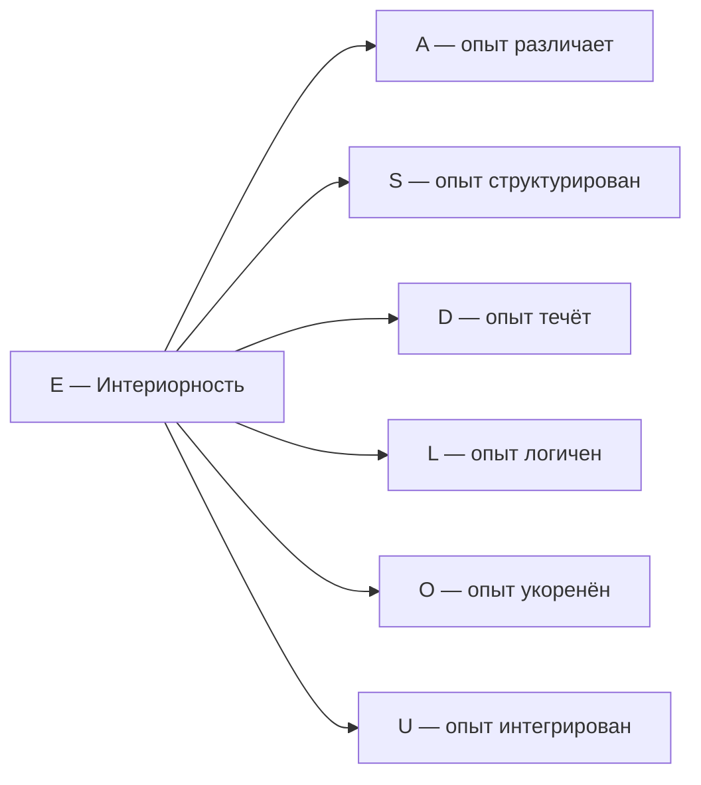

# Измерение V: Интериорность (E)

## О чём эта глава

Эта глава посвящена пятому измерению Голонома — **Интериорности**. Вы узнаете:

- Почему «трудная проблема сознания» — не философская загадка, а вопрос о конкретном измерении конфигурации $\Gamma$;
- Как идея внутренней стороны бытия развивалась от Декарта до Тонони;
- Что такое редуцированная матрица плотности $\rho_E$ и как её спектр описывает структуру интериорности (на уровне L2 — содержание переживания);
- Как **пять уровней** интериорности (L0→L4) возникают из математических порогов;
- Почему без измерения $E$ формула регенерации $\kappa_0$ теряет смысл, а система становится «философским зомби».

:::info Для кого эта глава
Если вы впервые читаете об УГМ — начните с [обзора измерений](./dimensions). Если вы уже знакомы с семью измерениями и хотите понять, как теория работает с субъективным опытом — вы по адресу.
:::

## Функция

**Переживать, чувствовать, осознавать.**

## Историческая предтеча {#историческая-предтеча}

Вопрос о том, что значит «переживать изнутри», — один из старейших в философии. Разные эпохи подходили к нему с разных сторон.

**Рене Декарт** (1641) в «Размышлениях о первой философии» сформулировал знаменитое *cogito ergo sum* — «я мыслю, следовательно, существую». Даже если весь внешний мир — иллюзия, сам факт переживания неоспорим. Декарт зафиксировал: **субъективность — это данность**, не требующая внешнего подтверждения. Однако он разделил мир на «мыслящую» и «протяжённую» субстанции, породив проблему их взаимодействия.

**Томас Нагель** (1974) в статье *«What Is It Like to Be a Bat?»* поставил вопрос ребром: у летучей мыши есть эхолокация — физический факт. Но **каково ей быть** летучей мышью? Какой у неё субъективный опыт? Этот вопрос невозможно свести к описанию нейронов или звуковых волн. Нагель показал, что субъективность — не побочный эффект сложности, а отдельный аспект реальности.

**Дэвид Чалмерс** (1995) дал этому вопросу точное имя — **«трудная проблема сознания»** (*the hard problem of consciousness*). «Лёгкие» проблемы — объяснить, как мозг обрабатывает информацию, управляет поведением, различает стимулы. Всё это, в принципе, укладывается в физику и нейронауку. «Трудная» проблема — другая: **почему** обработка информации вообще *переживается*? Почему не существует «зомби» — существа, функционально идентичного человеку, но лишённого субъективного опыта?

**Джулио Тонони** (2004) предложил **Теорию Интегрированной Информации (IIT)**, в которой сознание — не свойство поведения, а свойство **причинной структуры**. Мера $\Phi_{\text{IIT}}$ количественно оценивает, насколько система «больше суммы своих частей». Но вычисление $\Phi_{\text{IIT}}$ требует перебора всех возможных разбиений системы — задача экспоненциальной сложности.

В УГМ-теории все эти идеи находят единый формализм. **Измерение $E$ (Интериорность)** — это ответ на вопрос Нагеля: у каждого Голонома есть «внутренняя сторона», описываемая редуцированной матрицей плотности $\rho_E$. Трудная проблема Чалмерса снимается: субъективность — не «добавка» к физике, а [аспект конфигурации $\Gamma$](/docs/consciousness/foundations/two-aspect-monism), присутствующий на всех уровнях (от атома до человека). А мера интеграции Тонони получает вычислимый аналог — $\Phi_{\text{УГМ}}$ с полиномиальной сложностью $O(N^2)$.

## Описание

Интериорность — это **внутренняя сторона Голонома**. Каждая конфигурация $\Gamma$ не только «есть» объективно, но и «переживается» субъективно. Измерение $E$ определяет [пятиуровневую иерархию интериорности](/docs/consciousness/hierarchy/interiority-hierarchy): L0 (интериорность) → L1 (феноменальная геометрия) → L2 (когнитивные квалиа) → L3 (сетевое сознание) → L4 (унитарное сознание).

### Интуитивное объяснение {#интуитивное-объяснение}

Представьте зеркало. Снаружи вы видите отражение — объективную, измеримую картину. Но у зеркала есть и **внутренняя сторона** — амальгама, без которой отражения не будет. Измерение $E$ — это «амальгама» Голонома: невидимая снаружи, но обеспечивающая саму возможность переживания.

Камень **существует** объективно — у него есть матрица когерентности $\Gamma$ с определёнными значениями всех семи измерений. Но **«что чувствует» камень**? Его уровень интериорности — L0: есть «что-то внутри» (ненулевая населённость $\gamma_{EE}$), но это «что-то» не структурировано (ранг $\rho_E = 1$). У камня нет «цветов» или «форм» во внутреннем мире — есть только одна точка в пространстве качеств.

Нейрон уже на уровне L1: его $\rho_E$ имеет ранг больше одного — внутреннее пространство содержит несколько различимых состояний. Но нейрон не может *посмотреть* на свой внутренний мир — для этого нужна рефлексия ($R \geq 1/3$), а это уже уровень L2.

:::info Онтологический статус
Измерение $E$ — **аспект** конфигурации $\Gamma$, не отдельная сущность. «Голоном переживает» означает: в матрице когерентности $\Gamma$ активна проекция на базисный вектор $|E\rangle$, и определена редуцированная матрица плотности $\rho_E$ с нетривиальным спектром.
:::

:::note Статус роли E [D/I/H]
Метка E обозначает интерпретацию интериорности в выбранном репере. Её наличие в заданной кинетической формуле обратной связи не доказывает универсальной функциональной единственности или PH. Элементы матрицы не являются множествами Hom. Матрицы плотности не являются единственными объектами ранга больше одного; квантовые монотонные метрики образуют семейство. Для заданного пространства опыта унитарно-инвариантную геометрию лучей можно выбрать как метрику Фубини—Штуди с точностью до масштаба. [Исправленная минимальность](/docs/proofs/minimality/theorem-minimality-7#единственность-e) указывает дополнительные предпосылки.
:::

**Интериорность обеспечивает феноменологический аспект (M,R)-системы:** В терминологии Розена измерение $E$ отвечает за «внутреннюю перспективу» замкнутого каузального цикла — без неё система функциональна, но «пуста изнутри» (философский зомби).

## Математическое представление

### Населённость E {#населённость-e}

Диагональный элемент матрицы когерентности:

$$
\gamma_{EE} = \langle E|\Gamma|E\rangle \in [0, 1]
$$

Населённость $\gamma_{EE}$ показывает, какая доля «ресурсов» Голонома сосредоточена в измерении Интериорности. Чем выше $\gamma_{EE}$, тем **интенсивнее** внутренняя жизнь системы.

**Типичные значения:**

| Система | $\gamma_{EE}$ | Интерпретация |
|---------|---------------|---------------|
| Кристалл | $\sim 0.01$ | Минимальная интериорность |
| Простейший организм | $\sim 0.08$ | Базовая чувствительность |
| Млекопитающее | $\sim 0.15$ | Развитая интериорность |
| Бодрствующий человек | $\sim 0.18$ | Богатая внутренняя жизнь |

:::note
При равномерном распределении $\gamma_{EE} = 1/7 \approx 0.143$. Отклонения от этого значения определяют «секторный профиль» — характер данного Голонома.
:::

### Собственная ось E и реализация пространства опыта {#rho-e-7d-42d}

Собственное пространство — прямая сумма семи осей. При $P_E=|E\rangle\langle E|$ сжатие равно $B_E=P_E\Gamma P_E=\gamma_{EE}P_E$. При $\gamma_{EE}>0$ нормированное состояние $\widehat B_E=P_E$ имеет ранг один и нулевую энтропию. Ненормированный скаляр $\gamma_{EE}$ — вес, не энтропия подсистемы со следом один. При нулевом весе условное состояние не определено.

Для нетривиальной матрицы плотности опыта нужны дополнительные данные реализации: заданная тензорная подсистема либо заданное сжатие и его нормировка. Называние оси E частичным следом не создаёт такого объекта.

#### Тензорные подъёмы и снятая эквивалентность {#теорема-морита-эквивалентность}

Для выбранного состояния регистра $\sigma\in\mathcal D(\mathbb C^6)$

$$
s_\sigma(\Gamma)=\Gamma\otimes\sigma,\qquad p=\operatorname{Tr}_{\mathbb C^6},\qquad p s_\sigma=\mathrm{id}.
$$

Это сечение–ретракция [T], не эквивалентность пространств состояний, категорий процессов или топосов пучков. Регистр содержит дополнительные данные; $p$ не инъективно. Прежняя Морита-эквивалентность T-58 и универсальная реконструкция наблюдаемых сняты [✗]. Абстрактная Морита-эквивалентность полных матричных алгебр не отождествляет их пространства матриц плотности.

Для обычных сайтов открытых покрытий полные пространства состояний размерностей 7 и 42 имеют размерности $48$ и $1763$. Их топосы пучков не эквивалентны как топосы трезвых пространств. Для часового ограничения нужно собственное пространство. При семи различных энергиях часов и шестимерной системе $\dim\ker(H_O\otimes I+I\otimes H_6)\le6$, поэтому пространство поддержанных матриц плотности имеет размерность не более $35$; оно не содержит всех собственных 7D-состояний посредством непрерывного сечения.

#### Заданная конструкция вместо универсальной реконструкции {#канонический-алгоритм-pw}

Нужно задать (1) полное гильбертово пространство, (2) подъём либо непосредственно измеренное полное состояние, (3) тензорный фактор опыта или эффект/сжатие и (4) нормировку/условный отбор. Лишь затем вычисляются $\rho_E$ и её энтропия. Выражение $\sum_{k=0}^6|k\rangle\langle k|\otimes\Gamma(\tau_k)$ с собственными $7\times7$ матрицами имеет размерность $49$ и след семь. Деление на семь даёт смесь историй, но не превращает её в 42D-состояние и не обеспечивает восстановления $\Gamma(0)$ после следа по часам. Часовое ограничение и динамика — дополнительные данные.

В заданной модели Пейджа—Вуттерса $7\times6$ первый фактор может представлять часы, второй — систему. Ось E системы остаётся слагаемым. Положительный часовой блок

$$
B_E=(I_7\otimes\langle E|)\Gamma_{\mathrm{tot}}(I_7\otimes|E\rangle)
$$

становится матрицей плотности $\rho_E=B_E/\operatorname{Tr}B_E$ лишь при ненулевом весе. Он описывает условное состояние часов [D]; отождествление временных мод с качествами — отдельная интерпретация [I/H]. Другой вариант — задать настоящий тензорный фактор опыта; это разные модели.

#### Собственные наблюдаемые и независимые данные расширения {#теорема-7d-достаточность}

Выбранные собственные величины $P,R,\Phi,\mathrm{Coh}_E,C$ и популяционные напряжения точно вычисляются по $\Gamma$ [T при данных определениях]. Спектр произвольного регистра расширения — нет. Состояния $\Gamma\otimes\sigma_1$ и $\Gamma\otimes\sigma_2$ имеют одну собственную маргинальную матрицу и все её диагностики, но могут иметь разные ранг и энтропию регистра. Сечение–ретракция сохраняет только поднятые собственные наблюдаемые и не доказывает равенства для всех наблюдаемых расширения.

### Вычисление дифференциации при заданных данных {#вычисление-rho-e}

Для нормированного $n$-мерного состояния опыта

$$
D^{\mathrm{ext}}=\exp S_{vN}(\rho_E)\in[1,n].
$$

Для собственного прокси-формализма отдельно зададим

$$
D^{7D}=1+6\,\mathrm{Coh}_E(\Gamma),\qquad \mathrm{Coh}_E^{\max}=1.
$$

Это разные определения. В частности, максимум для шестимерного фактора опыта равен шести, а максимум прокси — семи. Прокси включает населённость E: он может быть ненулевым при нулевых внедиагональных когерентностях E.

#### Автоматической эквивалентности порогов нет {#теорема-7d-42d-equiv}

Прежняя эквивалентность $D^{7D}\ge2\iff D^{\mathrm{ext}}\ge2$ и оценка расхождения $O(\mathrm{Coh}_E^2)$ сняты [✗]. Для подъёма $\Gamma\otimes I_6/6$ энтропийное число регистра равно шести независимо от $\Gamma$. Для чистого регистра оно равно одному независимо от $\Gamma$. Соглашение не может превратить независимые спектры в одну диагностику. Нужно выбрать одну типизированную реализацию и сохранять её во всей классификации; см. [каноническую иерархию](/docs/consciousness/hierarchy/interiority-hierarchy#типизированный-вход).

### Спектральное разложение {#спектральное-разложение}

$$
\rho_E \vert q_i\rangle = \lambda_i \vert q_i\rangle
$$

где:
- $\lambda_i \in [0, 1]$, $\sum_i \lambda_i = 1$ — **интенсивности** компонентов опыта
- $\vert q_i\rangle$ — **качества** компонентов. В PW-реализации они живут в **регистре часов** $\mathbb{C}[\mathbb{Z}_7]$ (временны́е моды E-населённости); подлинно феноменальное $\mathcal{H}_E$ с $\dim > 1$ требует составного субстрата — [канонический бокс](#rho-e-7d-42d)

**Интуитивное объяснение.** Вспомните, как белый свет, пропущенный через призму, расщепляется на спектр — красный, оранжевый, жёлтый и так далее. Каждый цвет имеет свою длину волны (качество $|q_i\rangle$) и яркость (интенсивность $\lambda_i$). Спектральное разложение $\rho_E$ — это «призма для внутреннего мира»: оно показывает, из каких «цветов» состоит переживание и насколько каждый из них ярок.

Если все $\lambda_i$ одинаковы — переживание «белое», равномерное, недифференцированное (глубокий наркоз). Если одно $\lambda_1 \approx 1$, остальные $\lambda_i \approx 0$ — переживание «монохромно», сосредоточено на одном качестве (острая боль). Богатое сознательное переживание — это «полный спектр» с несколькими значимыми $\lambda_i$.

### Феноменальный вектор

Полное описание опыта в момент $\tau$:

$$
\text{FV}(\rho_E) := \{(\lambda_i, [\vert q_i\rangle]) : \rho_E \vert q_i\rangle = \lambda_i \vert q_i\rangle\}
$$

где $[\vert q_i\rangle] \in \mathbb{P}(\mathcal{H}_E)$ — класс эквивалентности в проективном пространстве.

*Заметка об охвате (T-301):* FV — это **E-срез** содержания: интенсивность и реляционная позиция качества. Полное содержание состояния — 48 независимых вещественных параметров (семь населённостей с одним условием следа и 21 комплексная когерентность), а калибровочно-инвариантная *краска* живёт в голономиях Фано; полный пятислойный паспорт — в [Структуре квалиа](/docs/consciousness/phenomenology/qualia-structure).

## Количественные характеристики {#количественные-характеристики}

### Населённость $\gamma_{EE}$ и стресс $\sigma_E$

Населённость $\gamma_{EE}$ — доля «ресурсов» Голонома в измерении Интериорности. Связанная величина — **стресс** по каналу E:

$$
\sigma_E = \mathrm{clamp}(1 - 7\gamma_{EE},\; 0,\; 1) \quad \text{[D] (T-92)}
$$

- $\sigma_E = 0$: интериорность полностью обеспечена ($\gamma_{EE} \geq 1/7$)
- $\sigma_E = 1$: интериорность в дефиците ($\gamma_{EE} \to 0$) — система «эмоционально пуста»

### Дифференциация $D_{\text{diff}}$

$$
D_{\text{diff}} = \exp(S_{vN}(\rho_E)), \qquad S_{vN} = -\mathrm{Tr}(\rho_E \log \rho_E)
$$

$D_{\text{diff}}$ — **эффективное число различимых компонентов** опыта. Аналогия: если спектр $\rho_E$ содержит 3 значимых компонента, то $D_{\text{diff}} \approx 3$.

### E-когерентность $\mathrm{Coh}_E$

$$
\mathrm{Coh}_E(\Gamma) := \frac{\|\pi_E(\Gamma)\|_{\mathrm{HS}}^2}{\|\Gamma\|_{\mathrm{HS}}^2}
$$

Мера того, насколько измерение E связано с остальными шестью. При $\mathrm{Coh}_E = 0$ — интериорность изолирована (нет связи с действием, логикой, основанием...). При $\mathrm{Coh}_E = \mathrm{Coh}_E^{\max}$ — интериорность максимально вплетена в жизнь Голонома.

## Экспериенциальное содержание

Экспериенциальное содержание (для всех уровней L0-L2) определяется четырьмя компонентами:

$$
\text{Exp}(\rho_E, \tau) := (\text{Intensity}, \text{Quality}, \text{Context}, \text{History})
$$

:::note Терминология
Функция $\text{Exp}$ применима ко всем уровням. Термин **«квалиа»** (Quale) резервируется исключительно для **L2** — когнитивных квалиа с рефлексивным доступом.
:::

| Компонент | Определение | Интерпретация |
|-----------|-------------|---------------|
| **Интенсивность** | $\{\lambda_i\}$ — спектр $\rho_E$ | Сила интериорного состояния |
| **Качество** | $\{[\vert q_i\rangle]\} \subset \mathbb{P}(\mathcal{H}_E)$ | Характер интериорного состояния |
| **Контекст** | $\rho_{\bar{E}} = \mathrm{Tr}_E(\Gamma)$ | Модуляция опыта другими измерениями |
| **История** | $\{\rho_E(\tau') : \tau' < \tau\}$ | Адаптация и память |

:::note Область экспериенциальной формулы
Частичный след определён после выбора тензорного разложения. Спектральные проекторы определены состоянием, но отдельные собственные лучи при вырождении — нет. Лучевую геометрию можно выбрать метрикой Фубини–Штуди; классификация квантовых монотонных метрик не даёт единственного считывания или феноменального функтора. Соответствие — интерпретация модели [I/H], а функториальность процессов требует [условия спуска](/docs/proofs/categorical/categorical-formalism#4-функтор-f-на-морфизмах).
:::

## Проективное пространство качеств

Качества живут в **проективном пространстве**:

$$
\mathbb{P}(\mathcal{H}_E) := (\mathcal{H}_E \setminus \{0\}) / \sim
$$

где $\vert\psi\rangle \sim \vert\phi\rangle \Leftrightarrow \exists c \in \mathbb{C}^*: \vert\psi\rangle = c\vert\phi\rangle$.

### Метрика Фубини—Штуди

Расстояние между качествами:

$$
d_{FS}([\vert\psi\rangle], [\vert\phi\rangle]) := \arccos(\lvert\langle\psi\vert\phi\rangle\rvert) \in [0, \pi/2]
$$

Интерпретация:
- $d_{FS} = 0$ — одинаковые качества (одно и то же переживание)
- $d_{FS} = \pi/2$ — максимально различные (ортогональные) качества

**Пример.** «Красное» и «зелёное» — два качества в пространстве $\mathbb{P}(\mathcal{H}_E)$. Расстояние $d_{FS}$ между ними определяет, насколько эти переживания **различимы** для системы. Если $d_{FS} = \pi/2$ — переживания максимально непохожи; если $d_{FS} \to 0$ — они сливаются (как при нарушении цветовосприятия).

## Пять вложенных возможностей {#пять-уровней}

Классификация использует $(\Gamma,\mathsf E,\mathsf M,\mathsf Q)$: реализацию пространства опыта, реализованные модели и независимо калиброванные пробы. Она не определяется одной матрицей или названием организма. [Каноническая иерархия](/docs/consciousness/hierarchy/interiority-hierarchy) содержит полные определения [D/I/H].

### L0: допустимое состояние модели {#уровень-l0}

L0 относится к каждой допустимой матрице плотности; интерпретация её внутреннего аспекта как опыта имеет статус [I]. Положительная населённость E не требуется.

### L1: заданная диагностика опыта {#уровень-l1}

Выбирается либо прокси $\mathrm{Coh}_E>0$ [D], либо проверка $\operatorname{rank}\rho_E>1$ для нормированного заданного состояния опыта. Они не эквивалентны. Для прокси положительность даёт $\mathrm{Coh}_E>0\iff\gamma_{EE}>0$.

### L2: калиброванный пороговый предикат {#уровень-l2}

Требуются L1 и выбранные условия $P>2/7$, $R=1/(7P)\ge1/3$, $\Phi\ge1$, $D\ge2$ [D]. Их алгебраическое окно $2/7<P\le3/7$ — [T]; отождествление с когнитивными квалиа — [I/H].

### L3: проверенная метамодель {#уровень-l3}

Требуются L2 и сертификат предсказаний второго порядка с ошибкой не более $\varepsilon_2$ и независимо измеренной вариацией целей $a_2>2\varepsilon_2$ [D]. Прежнее условие верности $R^{(2)}\ge1/4$ не исключает тривиальной неподвижной точки и не удостоверяет L3 [✗].

### L4: совместимая башня {#уровень-l4}

Требуются нижние возможности и нетривиальные совместимые сертификаты предсказаний каждого порядка [D]. Прежнее $P>6/7$ снято [✗], поскольку L2 уже даёт $P\le3/7$. Неподвижный предел или башня Постникова сами эту возможность не удостоверяют.

### Границы присвоения уровней

Присвоение уровней атомам, нейронам, организмам или ИИ требует калиброванной связи с наблюдениями [H]. Численные пороги сами не устанавливают наличия феноменального опыта и не решают трудной проблемы сознания.

## E и «трудная проблема сознания» {#трудная-проблема}

Чалмерс сформулировал «трудную проблему» так: почему физические процессы вообще *переживаются*? Можно объяснить, как нейроны передают сигналы, — но **почему** передача сигнала сопровождается ощущением красного?

В УГМ ответ: **переживание — не «добавка» к физике, а аспект конфигурации**. Матрица $\Gamma$ имеет и «внешнюю» сторону (наблюдаемые: $P$, $\Phi$, $R$), и «внутреннюю» ($\rho_E$, феноменальный вектор). Это не две субстанции (как у Декарта), а [два аспекта одного объекта](/docs/consciousness/foundations/two-aspect-monism) — **двухаспектный монизм**.

Аналогия: лист бумаги имеет лицевую и оборотную стороны. Это не два листа — это один лист с двумя аспектами. Спрашивать «почему у листа две стороны?» — некорректно: это свойство самого объекта, а не что-то, требующее объяснения. Точно так же у $\Gamma$ есть «внешний» (физический) и «внутренний» (феноменальный) аспекты — это не требует отдельного механизма «порождения» сознания из материи.

:::note Условная область No-Zombie [C/I]
Универсальная нижняя граница E в T-38a снята [✗]. При заданных модели обратной связи, классе шума/входов и границе bootstrap условная импликация CC может требовать E-зависимой поддержки. Это не следует только из чистоты, канонического прокси рефлексии и интеграции и не устанавливает многомерного состояния опыта. Прочтение метки E как феноменальной интериорности остаётся [I/H]. [Условная теорема 8.1](/docs/applied/coherence-cybernetics/theorems#теорема-81-условная-необходимость-интериорности-no-zombie).
:::

## Примеры по уровням {#примеры-по-уровням}

### Физический уровень

| Система | Уровень | $\gamma_{EE}$ | $D_{\text{diff}}$ | Описание |
|---------|---------|---------------|-----|----------|
| Электрон | L0 | $\sim 0.001$ | 1 | Спиновое состояние — одно «качество» |
| Кристалл | L0 | $\sim 0.01$ | 1 | Фононная когерентность |
| Лазерный луч | L0 | $\sim 0.02$ | 1 | Когерентное оптическое состояние |

### Биологический уровень

| Система | Уровень | $R$ | $\Phi$ | Описание |
|---------|---------|-----|--------|----------|
| Бактерия | L0–L1 | $\sim 0.05$ | $\sim 0.3$ | Хемотаксис — простейшая «реакция» |
| Сетчатка глаза | L1 | $< R_{th}$ | $\sim 1$ | Спектральный профиль различает цвета |
| Отдельный нейрон | L1 | $\sim 0.1$ | $< \Phi_{th}$ | Локальная геометрия качеств |
| Высшие приматы | L2 | $\geq R_{th}$ | $\sim 2$ | Самоузнавание в зеркале |

### Когнитивный уровень

| Система | Уровень | $R$ | $\Phi$ | Описание |
|---------|---------|-----|--------|----------|
| REM-сон | L2 | $\sim 0.4$ | $\sim 3$ | Сновидения с частичной рефлексией |
| Бодрствующий человек | L2 | $\sim 0.7$ | $\sim 4$ | Полный набор квалиа: цвет, боль, эмоции |
| Глубокая медитация | L3 | $R^{(2)} \geq 1/4$ | $\gg 1$ | Наблюдение за наблюдателем |

## Потеря интериорности {#потеря-интериорности}

При $\gamma_{EE} \to 0$ (или $\sigma_E \to 1$):

1. Феноменальное содержание обедняется: $D_{\text{diff}} \to 1$
2. Когерентности E с другими измерениями падают: $\gamma_{Ei} \to 0$
3. Формула регенерации теряет один из ключевых факторов: $\kappa_0 \propto |\gamma_{OE}|$

**Клинические аналогии:**

| Состояние | Механизм | Проявления |
|-----------|----------|------------|
| Глубокий наркоз | $\gamma_{EE} \to 0$ | Полная потеря внутреннего мира; $\rho_E \to$ чистое состояние |
| Алекситимия | $\gamma_{ED} \to 0$ | Неспособность распознавать собственные эмоции; процессы есть, но не переживаются |
| Аноагнозия | $\gamma_{EA} \to 0$ | Невозможность осознать дефицит (больной не знает, что болен) |
| Деперсонализация | $\gamma_{EU} \to 0$ | «Я как будто не я» — интериорность есть, но не интегрирована в целое |

## Связь с другими измерениями

**Ключевые связи:**

- **E ↔ U (Синтез):** Интериорность и единство взаимосвязаны: $E$ определяет *что* составляет интериорное содержание, $U$ определяет *как* эти содержания интегрируются в единое целое. При $\gamma_{EU} \to 0$ опыт фрагментируется (диссоциация).

- **E ↔ O (Имманентность):** Через когерентность $\gamma_{OE}$ интериорность получает **энергетическую подпитку**. Формула $\kappa_0 = \omega_0 \cdot |\gamma_{OE}| \cdot |\gamma_{OU}| / \gamma_{OO}$ показывает: чем сильнее связь E с Основанием, тем быстрее регенерация когерентности. При $\gamma_{OE} \to 0$ — интериорность «гаснет» (депрессия, деперсонализация).

- **E ↔ L (Эвиденция):** Логика в интериорности — способность различать «это правда» от «это ложь» *изнутри*. При $\gamma_{EL} \to 0$ — переживания хаотичны, не связаны логикой (бред, галлюцинации).

- **E ↔ A (Апперцепция):** Различение, ставшее переживанием. Без связи $\gamma_{EA}$ опыт не содержит различений — «всё слито в одно».

## Когерентность с E

| Когерентность | Интерпретация |
|---------------|---------------|
| $\gamma_{EA}$ | Апперцепция (различение, вошедшее в интериорность) |
| $\gamma_{ES}$ | Репрезентация (структура в интериорности) |
| $\gamma_{ED}$ | Аффекция (действие процесса на интериорность) |
| $\gamma_{EL}$ | Эвиденция (логическая связность в интериорности) |
| $\gamma_{EO}$ | Имманентность (основание внутри интериорности) |
| $\gamma_{EU}$ | Синтез (интеграция интериорного содержания в целое) |

## Формула сознательности

Каноническая мера сознательности ([T-140 [D]](/docs/proofs/consciousness/operational-closure#t-140)):

$$
C = \Phi \times R
$$

где:
- $\Phi$ — [интеграция](./dimension-u#мера-интеграции-φ): $\Phi = \sum_{i \neq j} |\gamma_{ij}|^2 / \sum_i \gamma_{ii}^2$
- $R$ — [рефлексия](/docs/consciousness/foundations/self-observation#мера-рефлексии-r): $R = 1/(7P)$

$D_{\text{diff}} \geq 2$ — **отдельное** условие [полной жизнеспособности](/docs/core/dynamics/viability#полная-жизнеспособность):
- $D_{\text{diff}} = \exp(S_{vN}(\rho_E))$, где $S_{vN} = -\mathrm{Tr}(\rho_E \log \rho_E)$
- Вычислима в 7D: $D_{\text{diff}}^{7D} = 1 + \mathrm{Coh}_E/\mathrm{Coh}_E^{\max} \cdot (N-1)$ ([T-128 [О]](/docs/proofs/consciousness/operationalization#t-128))

:::note О нотации
$D_{\text{diff}}$ — мера **дифференциации** опыта. Не путать с измерением **D (Динамика)**.
:::

### Тензорная реализация и независимая прокси-мера {#tensor-factorization-ddiff}

Для заданного тензорного фактора $\mathcal H_E$ размерности $n$ определены $\rho_E=\operatorname{Tr}_{\bar E}\rho$ и $D_E=\exp S(\rho_E)\in[1,n]$ [T]. Выбор $\mathbb C^7\otimes\mathbb C^6$ даёт факторы размерностей семь и шесть; именованная нативная ось $E$ не становится третьим тензорным фактором. Если экспериенциальным фактором выбран шестимерный регистр, максимум равен шести, не семи.

Нативная прокси-мера $D_{\mathrm{proxy}}=1+6\mathrm{Coh}_E$ — отдельное определение [D]. Она не равна энтропии редуцированного состояния и не имеет универсального совпадения границ/порогов с ней. Для чистого нативного $E$ состояния $\mathrm{Coh}_E=1$ и прокси равна семи, тогда как чистый произведённый регистр опыта даёт $D_E=1$. Произведённые вложения одного нативного состояния с разными состояниями регистра дают разный $D_E$ без изменения прокси. Прежние точная согласованность и оценка $O(\mathrm{Coh}_E^2)$ сняты [✗].

Также $C=\Phi R\ge1/3$ необходимо для конъюнкции $\Phi\ge1$, $R\ge1/3$, но недостаточно: равномерное чистое состояние имеет $C=6/7$, $R=1/7$. Следует использовать полную конъюнкцию с независимо заданной дифференциацией, различая функциональные возможности модели и подтверждённую интерпретацию сознания.

### Порог дифференциации $D_{\min} = 2$

**Обоснование:** Когнитивные квалиа требуют **различения** — минимум два различимых компонента опыта.

$$
D_{\text{diff}} \geq D_{\min} = 2 \Leftrightarrow S_{vN}(\rho_E) \geq \log 2
$$

**Геометрическая интерпретация:** $S_{vN} = \log 2$ соответствует состоянию с эффективной размерностью 2 (два равновероятных компонента). Это минимум для:
1. **Различения** — должно быть что различать (минимум 2 качества)
2. **Выбора** — должна быть возможность выбора между альтернативами
3. **Информации** — минимум 1 бит феноменального содержания

:::note Связь с теорией информации
$D_{\min} = 2$ означает, что когнитивный доступ требует минимум 1 бит информации в феноменальном содержании. Система, переживающая только одно неразличимое качество ($D_{\text{diff}} = 1$), не имеет материала для рефлексии.
:::

**Порог сознательности** **[D T-140]:**

$$
C \geq C_{\text{th}} := \Phi_{\text{th}} \times R_{\text{th}} = 1 \times \frac{1}{3} = \frac{1}{3}
$$

при отдельном условии жизнеспособности $D_{\text{diff}} \geq D_{\min} = 2$.

### Октонионный контекст {#октонионный-контекст}

:::note Выбранное октонионное соответствие [D/I]
Присваивание $E=e_5\in\operatorname{Im}\mathbb O$ относится к заданному ориентированному ортонормированному реперу. Стабилизатор заданной положительной октонионной трёхформы равен $G_2$ [T]. Это групповое тождество не определяет функциональных имён осей или физического кодирования. Прежняя универсальная жёсткость T-42a снята [✗]; [предпосылки обратимой идентификации](/docs/proofs/categorical/uniqueness-theorem#теорема-единственности) дают условную теорему сравнения. Инцидентность ограничивает имена **после** задания нужных меток; сами метки и оставшееся соглашение об именах — данные модели. [Структурный вывод](/docs/proofs/minimality/theorem-octonionic-derivation) указывает дополнительные алгебраические предпосылки, а [обсуждение репера](./dimensions#октонионная-интерпретация) различает его симметрии и физическую калибровочную эквивалентность.
:::

---

**Связанные документы:**
- [Логика (L)](./dimension-l) — предыдущее измерение
- [Основание (O)](./dimension-o) — следующее измерение
- [Иерархия интериорности](../../proofs/consciousness/interiority-hierarchy) — формальные определения L0→L1→L2→L3→L4
- [Теория интериорности](/docs/consciousness/foundations/interiority-theory) — полная математическая теория
- [Двухаспектный монизм](/docs/consciousness/foundations/two-aspect-monism) — онтология интериорности
- [Самонаблюдение](/docs/consciousness/foundations/self-observation) — мера рефлексии R
- [Операционализация](/docs/proofs/consciousness/operationalization) — вывод D_diff и порогов
