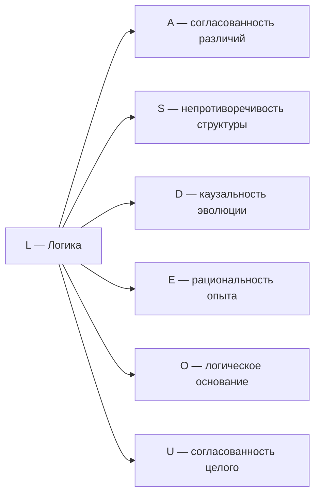

# Измерение IV: Логика (L)

:::info Для кого эта глава
Измерение L: согласование, коммутаторы, логическое замыкание. Предполагается знакомство с [семью измерениями](/docs/core/structure/dimensions) и основами категорной логики.
:::

## Зачем эта глава

Мы привыкли считать логику чем-то абстрактным — набором правил для «правильного мышления». В школе учат: если A, то B; если B, то C; значит, если A, то C. Но в Универсальной Голономической Модели (УГМ) логика — нечто гораздо более фундаментальное. Это **аспект самой реальности**, определяющий, какие конфигурации возможны, а какие — противоречивы и потому не могут существовать.

В этой главе вы узнаете:
- почему логика в УГМ — не инструмент человеческого мышления, а **фильтр реальности**, отсеивающий невозможное;
- как роль L, операторы Линдблада и лиувиллиан связываются через явно выбранную реализацию;
- какие три уровня логики существуют — от полной (HoTT) до классической (булевой);
- почему теорема Гёделя о неполноте — не проблема, а **ресурс** для эволюции;
- как логика связана с причинно-следственными связями и остальными измерениями Голонома;
- на каких Фано-линиях лежит L и почему её комбинаторный профиль уникален.

## Историческая предтеча

Логика как наука имеет одну из самых долгих историй.

**Аристотель** (384–322 до н.э.) создал **формальную логику** — систему силлогизмов, позволяющую делать достоверные выводы из посылок. «Все люди смертны; Сократ — человек; значит, Сократ смертен.» Это первая попытка формализовать **правила мышления**, отделив их от содержания. Аристотелева логика двузначна: каждое утверждение либо истинно, либо ложно. Третьего не дано.

**Джордж Буль** (1815–1864) перевёл логику на язык **алгебры**. Он показал, что «И», «ИЛИ», «НЕ» подчиняются тем же формальным законам, что и умножение и сложение. Булева алгебра — основа цифровых компьютеров: каждый транзистор реализует булеву операцию. Но булева логика по-прежнему двузначна.

**Лёйтзен Брауэр** (1881–1966) подверг сомнению закон исключённого третьего. Он основал **интуиционизм** — направление, утверждающее, что утверждение истинно только тогда, когда мы можем **сконструировать** его доказательство. «Утверждение P истинно или ложно» — это не аксиома, а то, что нужно доказать для каждого конкретного P. Существуют утверждения, которые ни истинны, ни ложны — они **неопределены**.

**Аренд Гейтинг** (1898–1980), ученик Брауэра, формализовал интуиционизм в виде **алгебры Гейтинга** — обобщения булевой алгебры, в которой закон исключённого третьего ($P \lor \neg P = \top$) не обязателен. Именно алгебра Гейтинга оказалась естественной логикой **топосов** — категорных обобщений пространств. В каждом топосе есть классификатор подобъектов $\Omega$, и его логическая структура — алгебра Гейтинга.

**Гомотопическая теория типов (HoTT)** — современное (2013+) развитие, объединяющее логику, теорию типов и гомотопическую теорию. В HoTT «доказательство» — это не просто «да/нет», а целое **пространство доказательств**, которое может иметь нетривиальную топологию. Это ∞-категорная логика, наиболее полная из известных. В УГМ именно HoTT является полной внутренней логикой ∞-топоса $\mathbf{Sh}_\infty(\mathcal{C})$.

:::note Путь углубления
Аристотель → Буль → Брауэр → Гейтинг → HoTT — это не просто «прогресс». Каждый шаг — осознание того, что логика **богаче**, чем казалось. Двузначная → многозначная → конструктивная → ∞-категорная. УГМ использует весь этот спектр: булева логика — для решающих измерений, алгебра Гейтинга — для стандартного топоса, HoTT — для полной ∞-структуры.
:::

:::info Почему история логики важна для понимания УГМ
Обратите внимание: каждый исторический шаг **расширял** пространство логически допустимого. Аристотель допускал только «да/нет». Брауэр добавил «неопределено». HoTT добавила бесконечную иерархию «способов быть истинным». УГМ утверждает, что реальность использует **все** эти уровни одновременно: элементарные частицы «живут» в булевой логике (спин вверх или вниз), пограничные состояния сознания — в гейтинговой (ни бодрствование, ни сон), а полная структура ∞-топоса — в HoTT. Чем глубже уровень реальности, тем богаче логика.
:::

:::warning Конвенции обозначений: три значения буквы L
В УГМ буква **L** используется для трёх связанных, но различных объектов:

| Обозначение | Шрифт | Значение |
|-------------|-------|----------|
| $L$ (прямой, без индекса) | Roman | **Измерение Логики** — компонента $\Gamma$, населённость $\gamma_{LL}$ |
| $L_k$ (с индексом) | Italic | **Операторы Линдблада** — диссипативные каналы |
| $\mathcal{L}_\Omega$ (каллиграфический) | Script | **Лиувиллиан** — полный генератор эволюции |

Логическая роль L, операторы Линдблада и лиувиллиан имеют разные математические типы. Общая нотация отражает предлагаемое соответствие модели [I], не тождество из классификатора подобъектов. [Типизированная реализация](../../proofs/categorical/categorical-formalism#l-унификация) заменяет прежнюю теорему L-унификации [✗].
:::

## Функция

**Связывать, согласовывать, проверять непротиворечивость.**

## Описание

Следующие функциональные описания — интерпретации модели [I/H]. Положительность Γ является математическим условием; одна населённость не определяет логической компетентности.

Логика — это измерение **самосогласованности**. Она определяет, какие конфигурации $\Gamma$ возможны, а какие противоречивы. Логика — фильтр реальности: состояния с $\gamma_{LL} \to 0$ не могут существовать устойчиво.

:::info Онтологический статус
Логика — **аспект** конфигурации $\Gamma$, не отдельная сущность. «Голоном логичен» означает: в матрице когерентности $\Gamma$ активна проекция на базисный вектор $|L\rangle$, и алгебра операторов удовлетворяет соотношениям коммутации.
:::

:::info Уточнение: L как аспект, а не фильтр
L-измерение **не является фильтром**, действующим на Γ извне. L — **аспект** самого Γ, отражающий степень внутренней согласованности:

- **Населённость $\gamma_{LL}$** — доля «ресурса» системы, направленная на поддержание логической когерентности
- **Высокое $\gamma_{LL} \gg 1/7$:** система строго применяет внутренние правила (догматичность, ригидность)
- **Низкое $\gamma_{LL} \ll 1/7$:** система слабо применяет правила (креативность, но потенциальная некогерентность)
- **$\gamma_{LL} = 1/7$:** равновесие — логическая функция получает «справедливую долю» ресурса

Напряжение L-измерения: $\sigma_L = \mathrm{clamp}(1 - 7\gamma_{LL}, 0, 1)$ — [формула T-92 [D]](/docs/core/structure/dimension-a#вывод-формулы-напряжения).
:::

## Логические и численные структуры {#категориальное-определение}

В каноническом топосе пучков открытых множеств состояний $\Omega(U)=\operatorname{Open}(U)$, ограничение — пересечение. Логический предикат — характеристический морфизм подобъекта; его значение истинности не является матрицей или вероятностью. $\Omega$ уже $0$-усечён в $\infty$-топосе. Внутренняя гомотопическая теория типов включает другие высшие типы; она не получается отождествлением когнитивных уровней с усечениями $\Omega$.

### Логика и выбранный конечный контекст {#три-уровня-логики}

Логика открытых множеств — логика Гейтинга. Выбранный ортонормированный репер семи осей даёт другой булев контекст диагональных проекторов $P_S=\sum_{i\in S}|i\rangle\langle i|$. Он изоморфен $2^7$ [T при выбранном репере]. Это не $\operatorname{Dec}(\Omega)$: глобальные разрешимые открытые множества связного пространства матриц плотности — лишь пустое и полное. Прежние $L=\Omega\cap\Gamma$ и $L_k=\sqrt{\chi_{S_k}}$ сняты [✗] как нетипизированные отождествления.

### Численные фильтры и динамические роли {#иерархия-lk}

Для **выбранных** эффектов $E_a\ge0$, $\sum_a E_a=I$ операторы Крауса $K_a=\sqrt{E_a}$ задают CPTP-неселективный канал. Для выбранных координатных проекторов линий Фано $K_p=\Pi_p/\sqrt3$ удовлетворяют $\sum_pK_p^\dagger K_p=I$: каждая точка лежит на трёх линиях. Этот корректный расчёт инцидентности не требует и не устанавливает снятого категориального вывода T-41b. Все проекторы коммутируют; произведения — пересечения, не более пятнадцати отображений непустых слов и тождества пустого слова.

Физические диссипаторы, скорости, часовые ограничения и интерпретация роли L требуют дополнительных данных. Внутреннюю временную модальность нужно задать и проверить отдельно; существование $\Omega$ не выводит часового сдвига или зависящей от состояния регенеративной скорости. Когнитивные метафоры булевой, гейтинговой и гомотопической структур — [I], не уровни из математического усечения.

## Математическое представление

### Алгебра операторов

Логические отношения между измерениями описываются **коммутатором**:

$$
[A, B] := AB - BA
$$

Коммутатор — это мера некоммутативности операторов:
- $[A, B] = 0$ — порядок операций не важен (совместимость)
- $[A, B] \neq 0$ — порядок важен (некоммутативность)

:::info Простой пример некоммутативности
Наденьте носки, потом ботинки — всё нормально. Наденьте ботинки, потом носки — проблема. Операции «надеть носки» (A) и «надеть ботинки» (B) некоммутативны: $AB \neq BA$. В квантовой механике некоммутативность координаты и импульса ($[x, p] = i\hbar$) порождает принцип неопределённости Гейзенберга.
:::

### Связь с базисным состоянием

Проекция на $|L\rangle$ определяет **степень логической связности** конфигурации:

$$
\gamma_{LL} = \langle L|\Gamma|L\rangle
$$

Физическая интерпретация: $\gamma_{LL}$ — мера того, насколько система согласована внутренне.

:::info Что означает большое и малое γ_LL
- **Высокое $\gamma_{LL}$ (близко к 1/7 или выше):** Система логически целостна. Все её части согласованы друг с другом, нет внутренних противоречий. Пример: хорошо работающая математическая теория, здоровый мозг в состоянии ясного мышления.
- **Низкое $\gamma_{LL}$ (близко к 0):** Система логически «рассыпается». Её части противоречат друг другу, нет согласованности. Пример: бредовое состояние, в котором человек одновременно верит в несовместимые вещи; сбойная компьютерная программа; противоречивая научная теория.
- **$\gamma_{LL} = 0$:** Логика полностью отсутствует. Такая система не может существовать устойчиво — без логического «каркаса» любая конфигурация немедленно распадается.
:::

### Логическая нагрузка и популяционная диагностика {#логическая-согласованность}

Каноническое напряжение — выбранная популяционная диагностика

$$
\sigma_L=\max(0,1-7\gamma_{LL})\in[0,1].
$$

Она не является квантовой взаимной информацией и не следует из $\Omega$. Матрица с $\gamma_{LL}=0$ может быть стационарной (например, при нулевой динамике); устойчивость нужно проверять для заданного векторного поля.

#### Информация верификации требует измерения {#определение-i-verify}

Зададим метку ансамбля $X$ и реализованный инструмент верификации с классическим исходом $Y$. Операционная информация $I_{\mathrm{verify}}:=I(X:Y)$ [D] вычисляется по их совместному распределению. Для заданной составной квантовой реализации взаимная информация равна $I(A:B)=S(\rho_A)+S(\rho_B)-S(\rho_{AB})$. Собственная ось L — одномерное слагаемое, не тензорная подсистема. Прежнее $S(\rho)-S(\rho\mid L)=I(\Gamma:L)$ без инструмента или тензорного фактора снято [✗].

#### Пропускная способность требует масштаба времени {#определение-theta-l}

Можно задать энтропийный бюджет $b_L:=\gamma_{LL}\log7$ [D]. Для пропускной способности дополнительно нужна единица времени: например, $\theta_L=b_L/t_L$ с калиброванным $t_L>0$. Ни этот масштаб, ни модель пропускной способности не следуют из классификатора. Тогда с $\theta_L$ можно сравнивать информационную *скорость* $\dot I_{\mathrm{verify}}$.

#### Нагрузка и напряжение — разные диагностики {#строгое-определение-sigma-l}

При положительном знаменателе определим операционную нагрузку $\ell_L:=\dot I_{\mathrm{verify}}/\theta_L$ [D]. Это отдельная величина, не $\sigma_L$. Прежняя формула через редуцированную энтропию и приближение $7(1-\gamma_{LL})/6$ сняты [✗]: частичного следа по остальным шести осям в собственном пространстве нет, а указанное разложение при малой населённости не даёт этого приближения. Популяционное напряжение, информация верификации и пропускная способность требуют собственных данных и не должны отождествляться без доказательства.

## Типы логических отношений

| Отношение | Условие | Интерпретация | Следствие |
|-----------|---------|---------------|-----------|
| Совместимость | $[A, B] = 0$ | Одновременная измеримость | Определённые совместные значения |
| Несовместимость | $[A, B] \neq 0$ | Принцип неопределённости | $\Delta A \cdot \Delta B \geq \frac{1}{2}\lvert\langle[A,B]\rangle\rvert$ |
| Следование | $P_A \leq P_B$ | $A$ имплицирует $B$ | $\langle A \rangle \leq \langle B \rangle$ |
| Противоречие | $P_A \cdot P_B = 0$ | Несовместимые подпространства | Взаимоисключение |

где $P_A$, $P_B$ — проекторы на соответствующие подпространства.

## Логические ограничения на $\Gamma$

Измерение $L$ обеспечивает выполнение фундаментальных ограничений на матрицу когерентности:

### Эрмитовость

$$
\Gamma^\dagger = \Gamma
$$

Математически: все собственные значения вещественны. Интерпретация: вероятности — вещественные числа.

### Положительность

$$
\langle\psi|\Gamma|\psi\rangle \geq 0 \quad \forall |\psi\rangle \in \mathcal{H}
$$

Математически: все собственные значения неотрицательны. Интерпретация: вероятности не могут быть отрицательными.

### Нормировка

$$
\mathrm{Tr}(\Gamma) = 1
$$

Математически: сумма собственных значений равна 1. Интерпретация: полная вероятность — единица.

### Неравенство Коши–Шварца

$$
|\gamma_{ij}|^2 \leq \gamma_{ii} \cdot \gamma_{jj}
$$

Ограничивает величину когерентностей относительно диагональных элементов.

:::info Зачем нужны эти ограничения
Четыре ограничения выше — не произвольные правила, а **необходимые условия** для того, чтобы $\Gamma$ имела смысл как матрица плотности (вероятностное описание системы). Нарушение любого из них приводит к физически бессмысленным результатам: отрицательным вероятностям, комплексным средним значениям или вероятностям, не равным единице в сумме. L-измерение «следит» за соблюдением этих условий.
:::

:::note Логические ограничения — как стены здания
Представьте здание. Стены — это логические ограничения. Они не «ограничивают» жизнь внутри здания — они **делают её возможной**. Без стен нет крыши, нет защиты от дождя, нет комнат. Так и L-ограничения: они не сужают пространство допустимых состояний — они **создают** это пространство, отсекая бессмысленные (отрицательные вероятности, нарушение нормировки) конфигурации.
:::

## Каузальность требует направленной модели процессов {#связь-с-каузальностью}

Замкнутость CPTP-отображений относительно композиции доказывает замкнутость допустимых квантовых операций. Она не определяет причинный частичный порядок. Если разрешены все CPTP-каналы, любое состояние достигает любого другого через сброс $X\mapsto\operatorname{Tr}(X)\rho$, поэтому достижимость не антисимметрична.

### Каузальность подробнее {#каузальность-подробнее}

Унитарные каналы имеют CPTP-обратные; каналы сброса могут уменьшать энтропию фон Неймана. Поэтому свойство CPTP само по себе не запрещает петель и не доказывает энтропийной стрелы. Для причинной модели нужно дополнительно задать события, их временной порядок, допустимые операции/интервенции и пространственно-временные ограничения или условия отсутствия сигнализации. Необратимость выбранной полугруппы — отдельный вопрос; убывание относительной энтропии к общему стационарному состоянию является теоремой лишь при указанных предпосылках.

### Каузальность и агентность {#каузальность-и-свобода}

Приписывание роли L намерений или агентности — интерпретация [I/H]. Классификатор и условия положительности не доказывают ни детерминизма, ни свободы воли. Они задают корректные типы логических предикатов и квантовых состояний; причинная/поведенческая связь требует отдельного обоснования.

## Примеры

| Уровень | Пример | Логическая функция | Подробности |
|---------|--------|-------------------|-------------|
| Физический | Принцип неопределённости | $[x, p] = i\hbar$ | Невозможно одновременно точно знать положение и импульс — это не техническое ограничение, а **логическое** свойство реальности |
| Физический | Законы сохранения | $[A, H] = 0 \Rightarrow dA/d\tau = 0$ | Если оператор $A$ коммутирует с гамильтонианом, соответствующая величина не меняется во времени |
| Физический | Запрет Паули | Антисимметрия фермионов | Два одинаковых фермиона не могут находиться в одном квантовом состоянии — логический запрет на уровне симметрии волновой функции |
| Биологический | Генетический код | Однозначность трансляции | Каждый кодон кодирует **ровно одну** аминокислоту — логическая однозначность обеспечивает воспроизводимость |
| Биологический | Метаболические циклы | Замкнутость биохимических путей | Цикл Кребса замкнут: каждый промежуточный продукт восстанавливается, обеспечивая **самосогласованность** метаболизма |
| Когнитивный | Правила вывода | Modus ponens, modus tollens | «Если дождь, то мокро; дождь; значит, мокро» — базовое логическое правило на уровне разума |
| Когнитивный | Рациональность | Транзитивность предпочтений | Если вы предпочитаете A перед B и B перед C, логика требует предпочтения A перед C. Нарушение — признак «сбоя» в L-измерении |
| Когнитивный | Когнитивный диссонанс | Перегрузка L-измерения | Одновременное удержание противоречивых убеждений — $\sigma_L \to 1$, логическая верификация на пределе |

### Развёрнутые примеры {#развёрнутые-примеры}

#### Принцип неопределённости как логическое свойство

Принцип неопределённости Гейзенберга ($\Delta x \cdot \Delta p \geq \hbar/2$) часто объясняют «возмущением при измерении»: чтобы узнать положение частицы, нужно «осветить» её фотоном, который изменяет импульс. Но это **неверная** интерпретация. В УГМ принцип неопределённости — **логическое** свойство: операторы координаты и импульса *некоммутативны* ($[x, p] = i\hbar$), и это означает, что одновременные точные значения обоих **логически невозможны**. Это не ограничение наших приборов — это ограничение *реальности*.

#### Когнитивный диссонанс как перегрузка σ_L

Когда человек одновременно придерживается двух несовместимых убеждений (например, «курить вредно» и «я курю, потому что мне нравится»), его L-измерение перегружается: $\sigma_L$ растёт, приближаясь к 1. Мозг испытывает дискомфорт — это субъективное переживание логической перегрузки. Разрешение диссонанса (изменение одного из убеждений) — это снижение $\sigma_L$ обратно в безопасную зону.

#### Генетический код как логический инвариант

Генетический код — один из самых чистых примеров L-функции в биологии. Каждый триплет нуклеотидов (кодон) кодирует **ровно одну** аминокислоту. Если бы один кодон мог кодировать *разные* аминокислоты в зависимости от контекста, белки синтезировались бы непредсказуемо — логическая согласованность была бы нарушена. Однозначность генетического кода — это булева логика ($L_k$ на страте II): каждый предикат «кодон X кодирует аминокислоту Y» строго истинен или ложен.

## Связь с другими измерениями

**Ключевая связь L ↔ D:** Логика и динамика взаимосвязаны:
- $D$ определяет *как* система эволюционирует
- $L$ определяет *какие* траектории допустимы

**L ↔ S (Логика ↔ Структура):** Логика обеспечивает **непротиворечивость** структуры. Когерентность $\gamma_{LS}$ — «законы структуры»: аксиомы, определяющие допустимые конфигурации. Если $\gamma_{LS} \to 0$, структура может быть внутренне противоречивой.

**L ↔ E (Логика ↔ Интериорность):** Когерентность $\gamma_{LE}$ отвечает за **рациональность опыта**. Высокое $|\gamma_{LE}|$ — логически связный субъективный опыт. Низкое — хаотичные, бессвязные переживания (как в бреду или ранних стадиях сновидения).

**L ↔ O (Логика ↔ Основание):** Когерентность $\gamma_{LO}$ — «фундаментальность логики». O-измерение поставляет «новую информацию», которая расширяет логическое пространство L. Это механизм преодоления гёделевой неполноты (см. ниже).

**L ↔ U (Логика ↔ Единство):** Когерентность $\gamma_{LU}$ — «глобальная согласованность». Высокое $|\gamma_{LU}|$ означает, что все части системы **логически совместимы** друг с другом. Это когомологическое условие $H^1 = 0$ на страте IV.

**L ↔ A (Логика ↔ Артикуляция):** Когерентность $\gamma_{LA}$ — «логичность различений». Каждое различие, проведённое A-измерением, должно быть **непротиворечивым** с остальными. L «проверяет» различия на согласованность.

## Когерентность с L

Элементы $\gamma_{Li}$ матрицы когерентности описывают связь логики с другими измерениями:

| Когерентность | Интерпретация |
|---------------|---------------|
| $\gamma_{LA}$ | Логичность различений (непротиворечивость категорий) |
| $\gamma_{LS}$ | Законы структуры (аксиомы системы) |
| $\gamma_{LD}$ | Каузальность (причинно-следственная связь) |
| $\gamma_{LE}$ | Рациональность опыта (логичность интериорных состояний) |
| $\gamma_{LO}$ | Фундаментальность логики (укоренённость в основании) |
| $\gamma_{LU}$ | Согласованность целого (глобальная непротиворечивость) |

## Неполнота и непротиворечивость

### Теоремы Гёделя: простое объяснение {#теоремы-гёделя}

Курт Гёдель в 1931 году доказал два результата, перевернувших представление о логике:

**Первая теорема о неполноте:** В любой достаточно богатой непротиворечивой формальной системе существуют истинные утверждения, которые **невозможно доказать** в рамках этой системы.

:::info Аналогия
Представьте карту города. Карта может быть очень подробной, но она **не может содержать саму себя** — ведь тогда на ней должна быть карта карты, а на ней — карта карты карты, и так далее. Формальная система — как карта: она описывает истины, но не может описать **все** истины о себе самой.
:::

**Вторая теорема о неполноте:** Непротиворечивая формальная система не может доказать **собственную** непротиворечивость.

Это кажется катастрофой: мы никогда не можем быть **логически** уверены, что наша логика не содержит противоречий!

:::info Ещё проще: зеркало и фотография
Первая теорема: Вы не можете сфотографировать **всё**, включая сам фотоаппарат *в момент съёмки*. Всегда останется то, что находится «за камерой». Формальная система «фотографирует» истины, но не может захватить саму себя целиком.

Вторая теорема: Вы не можете посмотреть в зеркало и убедиться, что зеркало не искажает. Для этого нужно **другое** зеркало, которое проверит первое. Но кто проверит второе? Формальная система не может проверить собственную непротиворечивость — для этого нужна *внешняя* точка зрения.
:::

### Применимость теорем Гёделя

Теоремы Гёделя применяются к **формальным системам**, оперирующим в измерении $L$. Но $\Gamma$ имеет 7 измерений, и $L \subsetneq \Gamma$.

:::warning О границах применимости
Теоремы Гёделя доказаны для формальных систем, удовлетворяющих определённым условиям (формальность, выразительность, непротиворечивость). Применение их к $\Gamma$ в целом — категориальная ошибка, поскольку $\Gamma$ не является формальной системой.
:::

### Два типа истины

| Тип | Определение | Область |
|-----|-------------|---------|
| **Логическая доказуемость** | $p \in \text{Prov}(L)$ — $p$ выводимо из аксиом | Измерение $L$ |
| **Когерентность-истина** | $\langle p \vert \Gamma \vert p \rangle > 0$ — $p$ согласовано с $\Gamma$ | Все 7 измерений |

Формально:

$$
\text{Prov}(L) \subsetneq \text{Coh}(\Gamma)
$$

где:
- $\text{Prov}(L)$ — множество утверждений, доказуемых в формальной системе, ассоциированной с $L$
- $\text{Coh}(\Gamma)$ — множество состояний, когерентных с полной матрицей $\Gamma$

:::info Что это значит на практике
Существуют утверждения, которые **невозможно доказать** чисто логически (через L), но которые **истинны** в полном смысле когерентности с $\Gamma$. Пример: «Я существую» невозможно доказать формально (это привело бы к бесконечному регрессу), но это когерентно с $\Gamma$ любого живого Голонома ($P > P_{\text{crit}}$ → система существует → утверждение когерентно).
:::

:::note Ещё примеры двух типов истины
- **«Красное отличается от синего»** — невозможно *доказать* логически, но когерентно с $\Gamma$ любого зрячего наблюдателя ($\gamma_{AE} > 0$, различия артикулированы и переживаются).
- **Аксиомы арифметики** — непротиворечивость арифметики Пеано *не доказуема* внутри самой арифметики (вторая теорема Гёделя), но *когерентна* с $\Gamma$ — арифметика работает, мосты не падают, компьютеры считают.
- **Этические интуиции** — «пытка невинных — зло» не выводимо из аксиом L, но когерентно с $\Gamma$ здорового сознательного Голонома (через E- и U-измерения).
:::

### Непротиворечивость через автопоэзис

Вторая теорема Гёделя запрещает *логическое* доказательство непротиворечивости. УГМ демонстрирует непротиворечивость **экзистенциально**:

Существование жизнеспособного Голонома $\mathbb{H}$ с $P(\Gamma) > P_{\text{crit}}$ демонстрирует, что конфигурация $\Gamma$ непротиворечива — противоречивые конфигурации не могут поддерживать когерентность выше критического порога.

:::tip Принцип
**Consistency is enacted, not proven** — непротиворечивость **исполняется** существованием функционирующей системы, а не доказывается логически.
:::

### Неполнота как ресурс

Гёделева неполнота в $L$ — не ограничение, а **механизм эволюции**:

1. Неразрешимые проблемы создают «сингулярности» в логическом пространстве
2. Система обращается к [Основанию (O)](./dimension-o) за новой информацией
3. Расширение аксиоматики восстанавливает когерентность на новом уровне

:::info Аналогия с научными революциями
Неполнота Гёделя в УГМ работает как механизм научных революций по Куну. Нормальная наука (работа в рамках L) накапливает «аномалии» — факты, которые невозможно объяснить в текущей парадигме. Когда аномалий становится слишком много ($\sigma_L \to 1$), происходит «революция»: система обращается к O за новой информацией, расширяет аксиоматику и переходит на новый уровень. Неполнота — **двигатель** эволюции, а не баг.
:::

### Неполнота в повседневном опыте {#неполнота-повседневность}

Гёделева неполнота может показаться далёкой от жизни, но на самом деле мы сталкиваемся с ней постоянно:

**Ребёнок и правила.** Ребёнок усваивает правила: «Нельзя бить», «Нужно делиться». Но рано или поздно он встречает ситуацию, которую *правила не покрывают*: «А если другой ребёнок бьёт моего друга, можно ли ударить в защиту?» Это гёделево предложение: в рамках текущей аксиоматики (правила поведения) вопрос *неразрешим*. Ребёнок обращается к «основанию» (родитель, учитель) за новой информацией, расширяет свою «аксиоматику» и переходит на более глубокий уровень морального рассуждения.

**Парадокс лжеца.** «Это предложение ложно.» Если оно истинно, то оно ложно. Если ложно, то истинно. На булевом уровне — неразрешимый парадокс. На гейтинговом уровне — просто *неопределённый* предикат. На уровне HoTT — элемент с нетривиальной гомотопической структурой: пространство «доказательств» этого утверждения имеет петлю.

См. [Теоремы Гёделя и полнота УГМ](../foundations/consequences#10-теоремы-гёделя-и-полнота-угм) для полного анализа.

## Логика и Фано-плоскость {#логика-и-фано}

Измерение L ($e_4$ в октонионном соответствии) принадлежит трём [Фано-линиям](/docs/core/structure/dimensions#октонионная-интерпретация):

| Фано-линия | Секторный тип | Физический смысл |
|------------|---------------|------------------|
| $\{A, S, L\}$ | **3**–**3**–$\bar{\mathbf{3}}$ | Структурная артикуляция, регулируемая логикой |
| $\{D, L, U\}$ | **3**–$\bar{\mathbf{3}}$–$\bar{\mathbf{3}}$ | Динамическая логика единства: каузальная интеграция |
| $\{L, E, O\}$ | $\bar{\mathbf{3}}$–$\bar{\mathbf{3}}$–$1_O$ | Логика интериорности, укоренённая в основании |

:::info Комбинаторный профиль L
Из семи измерений L — **единственный** элемент $\bar{\mathbf{3}}$-сектора, **не** лежащий на Хиггсовой линии $\{E, U, A\}$. Это придаёт L уникальную роль: в то время как E и U связаны с «интериорным» и «объединяющим» аспектами через Хиггсовый канал, L стоит «в стороне», обеспечивая **независимую** проверку согласованности. Это как судья, который не является участником игры.

[Теорема T-177](/docs/core/structure/dimensions#комбинаторная-единственность) объявляла семантическую роль L комбинаторно единственной; это отозвано [✗] (25.09.2026) вместе с T-48a — в новой формулировке (T-177) инцидентность фиксирует $L$ лишь вместе с двоичным выбором $E$ против $U$ ($L$ — третья точка линии через $O$ и $E$).
:::

### Что говорят Фано-линии о логике {#фано-линии-логика}

Каждая из трёх Фано-линий, содержащих L, раскрывает отдельный аспект логики:

**Линия $\{A, S, L\}$ — «фундамент логики».** Артикуляция ($A$) проводит различия, структура ($S$) фиксирует их, логика ($L$) проверяет непротиворечивость. Это «строительная» триада: различи → закрепи → проверь. Пример: формулировка научного закона. Наблюдение выделяет закономерность ($A$), формализация фиксирует её в уравнении ($S$), проверка показывает, не противоречит ли новый закон уже известным ($L$).

**Линия $\{D, L, U\}$ — «каузальная интеграция».** Та же линия, что содержит [Динамику (D)](./dimension-d). Логика ($L$) определяет допустимые траектории, динамика ($D$) реализует движение по ним, единство ($U$) обеспечивает целостность процесса. Это триада *действия*: допустимо → реализуемо → интегрировано. Пример: шахматная партия. Правила ($L$) определяют, какие ходы возможны, ход ($D$) совершает действие, стратегия ($U$) объединяет ходы в единый план.

**Линия $\{L, E, O\}$ — «корень логики».** Логика ($L$), интериорность ($E$) и основание ($O$) соединены напрямую. Это «глубинная» триада: логика укоренена в основании и переживается изнутри. Через $O$ логика получает доступ к новой информации, преодолевая гёделеву неполноту. Через $E$ логические операции переживаются как «понимание», «инсайт», «очевидность». Пример: момент озарения, когда «всё встаёт на место» — L-E-O корреляция максимальна.

Заметим, что L делит Фано-линию $\{D, L, U\}$ с [измерением D (Динамика)](./dimension-d) — это математическое выражение фундаментальной связи: **логика и динамика неразрывны**. Допустимые траектории (L) и реальные траектории (D) определяются одной и той же ассоциативной подалгеброй.

### Октонионный контекст {#октонионный-контекст}

:::note Выбранное октонионное соответствие [D/I]
Присваивание $L=e_4\in\operatorname{Im}\mathbb O$ относится к заданному ориентированному ортонормированному реперу. Стабилизатор заданной положительной октонионной трёхформы равен $G_2$ [T]. Это групповое тождество не определяет функциональных имён осей или физического кодирования. Прежняя универсальная жёсткость T-42a снята [✗]; [предпосылки обратимой идентификации](/docs/proofs/categorical/uniqueness-theorem#теорема-единственности) дают условную теорему сравнения. Инцидентность ограничивает имена **после** задания нужных меток; сами метки и оставшееся соглашение об именах — данные модели. [Структурный вывод](/docs/proofs/minimality/theorem-octonionic-derivation) указывает дополнительные алгебраические предпосылки, а [обсуждение репера](./dimensions#октонионная-интерпретация) различает его симметрии и физическую калибровочную эквивалентность.
:::

## Ключевые выводы главы {#ключевые-выводы}

Логические предикаты, допустимость состояний, численные фильтры и причинные модели имеют разные типы. Выбранный репер задаёт инцидентность Фано и имя L [D/I]; это не доказывает функциональной единственности или причинной стрелы. Каноническое популяционное напряжение нужно отличать от отдельно калиброванной нагрузки верификации.

---

**Связанные документы:**
- [Динамика (D)](./dimension-d) — предыдущее измерение
- [Интериорность (E)](./dimension-e) — следующее измерение
- [Теорема о минимальности](../../proofs/minimality/theorem-minimality-7#случай-n--3-удаление-логики-l) — доказательство необходимости L
- [Эмерджентное время](../../proofs/dynamics/emergent-time) — τ из структуры Γ
- [Внутренняя логика Ω](../foundations/axiom-omega#внутренняя-логика) — категориальный источник L
- [Уравнение эволюции](../dynamics/evolution) — использование L_k операторов
- [Категорный формализм](../../proofs/categorical/categorical-formalism) — ∞-топос и классификатор
- [Измерения Голонома](./dimensions) — обзор всех 7 измерений
- [Операторы Линдблада](../operators/lindblad-operators) — формализм L_k
