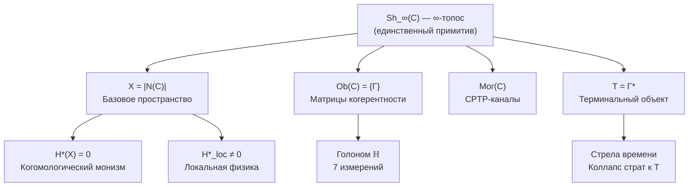

# Унитарный Голономный Монизм

## Формальная Теория Реальности и Сознания

**Унитарный Голономный Монизм (УГМ)** — формальная теория, описывающая структуру, динамику и феноменологию реальности через единый математический примитив — **∞-топос $\mathrm{Sh}_\infty(\mathcal{C})$**.

:::info Статус мета-теории
УГМ претендует на роль **мета-теории** (объединяющей физику, сознание и информацию в одном аксиоматическом каркасе). Ригидность примитива доказана [Т] (T-173): конструкция единственна с точностью до $G_2 \times \mathbb{R}_{>0}$ при данных аксиомах. **Универсальное свойство в категории физических теорий доказано [Т] (T-174)**: для любой физ. теории $(E, \mathcal{A}, D)$ с $A_{\text{int}} \subset \mathcal{A}$, CPTP-динамикой и $\leq 7$ наблюдаемых существует по существу единственное приёмное отображение в $\mathfrak{T}$; высшие $(\infty,1)$-когерентности (пятиугольник, закон перестановки, ассоциатор Мак-Лейна) проверены через полное вложение в $\mathbf{Topoi}_\infty$ ([T-211](./proofs/categorical/fundamental-closures#t-211) [С при T-119]: её шаг 1 пользуется реконструкцией Конна из T-119). **Все 4 foundational теоремы доказаны [Т]**: **T-170 [Т]** (восстановление M-теоретического предела на уровнях определённости M-теории): T-170' [Т] (пертурбативное соответствие) + T-170'' [Т] (непертурбативная корректность УГМ-интеграла). **T-171 [Т]** (LQG-вложение для ограниченных спиновых сетей $j_e \leq 3$) + **T-171' [Т]** (неограниченный спин через кластерную конструкцию). **T-172 [Т]** (вложение каузальных множеств) через Лемму C30. Статус «мета» — **доказанная теорема** для физических теорий указанного класса — теорий, чья алгебра наблюдаемых содержит $A_{\text{int}} = \mathbb{C} \oplus M_3(\mathbb{C}) \oplus M_3(\mathbb{C})$ вместе с выделенной подалгеброй наблюдаемых размерности $\leq 7$. Стандартная модель в NCG-форме ($\mathbb{C} \oplus \mathbb{H} \oplus M_3(\mathbb{C})$) **не** является объектом этого класса: её алгебра не содержит копии $A_{\text{int}}$. СМ достигается из $A_{\text{int}}$ *построением* ([T-176](./proofs/physics/bimodule-construction)), а не приёмным морфизмом. «Мета», следовательно, означает: примитив принимает всякую теорию класса, а СМ и гравитация из него выводятся, — а не то, что всякая известная теория в него вкладывается.
:::

Теория:
- **Выводит** пространство, время и метрику из категорной структуры
- Формализует связь между физикой и сознанием
- Определяет иерархию интериорности (L0→L4): от минимальной внутренней структуры до рефлексивного сознания
- Выводит минимальную структуру самоподдерживающейся системы (7 измерений)
- Устанавливает [границы объяснения](./reference/falsifiability) — что теория объясняет и что принимает как примитив

### Этимология названия

- **Унитарный** — от лат. *unus* (единый): реальность описывается единым ∞-топосом $\mathrm{Sh}_\infty(\mathcal{C})$; базовая унитарная эволюция сохраняет информацию
- **Голономный** — от греч. *holon* (целое) + *nomos* (закон): каждая часть (Голоном) содержит образ целого и подчиняется общим законам
- **Монизм** — от греч. *monos* (один): реальность едина — не существует независимых «слоёв» или «субстанций». В УГМ это следствие аксиомы о терминальном объекте ($H^*(X) = 0$ вытекает из Свойства 3), прочитанное онтологически через определение ПИР, — теорема относительно аксиом, а не самостоятельное открытие

## Структура теории

## Пять структурных свойств единственного примитива (Ω⁷)

:::info Единственный примитив
**∞-топос $\mathrm{Sh}_\infty(\mathcal{C})$** — единственный примитив теории УГМ. Понятие «пучка» в ∞-топосе определяется через [топологию Гротендика](./core/foundations/axiom-omega#топология-гротендика) на категории $\mathcal{C}$.
:::

| № | Свойство | Формулировка |
|---|----------|--------------|
| 1 | **[Конечномерность](./core/foundations/axiom-omega#свойство-1)** | $\text{Ob}(\mathcal{C}) \subset \mathcal{D}(\mathbb{C}^{42})$ |
| 2 | **[Ограничение](./core/foundations/axiom-omega#свойство-2)** | $\hat{C} \cdot \Gamma = 0$ (Пейдж–Вуттерс) |
| 3 | **[Терминальный объект](./core/foundations/axiom-omega#свойство-3)** | $\forall \Gamma, \exists! f: \Gamma \to T$ |
| 4 | **[Самомоделирование](./core/foundations/axiom-omega#свойство-4)** | $\varphi \dashv i: \text{Sub}(\Gamma) \hookrightarrow \mathbf{Sh}_\infty$ (сопряжение)* |
| 5 | **[Стратификация](./core/foundations/axiom-omega#свойство-5)** | $X = \bigsqcup_\alpha S_\alpha$, $S_0 = \{T\}$ |

*Вариационная характеризация $\varphi = \arg\min \mathbb{E}[S_{spec} + D_{KL}]$ подавалась как **теорема** о категориально определённом φ; она **отозвана** (2026-09-25): функционал равен перекрёстной энтропии $-\mathrm{Tr}(\psi(\Gamma)\log\Gamma)$ и минимизируется проекцией на старший собственный вектор $\Gamma$, а не φ ([вывод FEP](./proofs/dynamics/fep-derivation), врезка об отзыве).

:::note Связь с Аксиомой Септичности
[Аксиома Септичности](./core/foundations/axiom-septicity) (AP+PH+QG+V) является набором **следствий** из Ω⁷ — операциональных требований, которые должна удовлетворять любая жизнеспособная система.
:::

:::info Теорема о степенях свободы (следствие из Ω⁷)
Число структурно различных направлений развития конфигурации $\Gamma$ — $\mathrm{Freedom}(\Gamma) = \dim\ker(\mathcal{H}_\Gamma) + 1$ — является топологическим инвариантом. Системы с достаточной когерентностью обладают нетривиальным пространством выбора ($\mathrm{Freedom} > 1$).
:::

:::info Теорема S (обоснование Аксиомы 3) [Т]
N = 7 (Аксиома 3) — **минимальная** размерность для выполнения (AP)+(PH)+(QG). Все 7 измерений **необходимы и функционально единственны** [Т]: A, S, D, L, U — алгебраически; E, O — категориально (через формулу κ₀). [Доказательство →](./proofs/minimality/theorem-minimality-7)

**Второе обоснование** (не независимое от теоремы S: шаг T8 цепочки берёт $N = 7$ из неё; до 2026-09-25 значилось «второе, независимое»): теоремы P1+P2 [Т] (выводятся из (AP)+(PH)+(QG)+(V) по цепочке T15, шаг которой PG(2,2) → $\mathbb{O}$ берёт каноническую ориентацию семи линий Фано — лишь 16 из 128 ориентаций дают нормированную алгебру, и это единственный класс ориентаций, инвариантный относительно коллинеаций схемы, [T15-канон](./proofs/minimality/theorem-octonionic-derivation#каноническая-ориентация), строка реестра 41n; ранее 2026-09-25 — [С при (Альт)]) через теорему Гурвица дают $N = \dim(\mathrm{Im}(\mathbb{O})) = 7$. [Структурный вывод →](./proofs/minimality/theorem-octonionic-derivation)
:::

## Ключевые результаты

| Конструкция | Формула | Статус |
|-------------|---------|--------|
| **Базовое пространство** | $X = \|N(\mathcal{C})\|$ | [Т] Выводится |
| **Когомологический монизм** | $H^n(X) = 0$ для $n > 0$ (локально постоянные коэффициенты) | [Т] следствие Свойства 3 |
| **Локальная физика** | $H^*_{loc}(X, T) \neq 0$ | [Т] Теорема |
| **Время** | Регистр часов $\tau \in \mathbb{Z}_7$ (Пейдж–Вуттерс) | Регистр часов [Т]; связь Пейджа–Вуттерса (ограничение $\hat{C}\Gamma = 0$) [С] (T-87, шаг 4); динамика идёт относительно [регистра глубины](./proofs/dynamics/emergent-time#114-регистр-глубины) — [Т] (T-53b), а прямая времени $C_0(\mathbb{R})$ — его скейлинговый предел (T-118 [Т]); до 2026-09-25 значилось «[Т] Выводится» |
| **Стрела времени** | $\dim(X_n) \geq \dim(X_{n+1})$ вдоль стратальной глубины $n \in \mathbb{N}$, монотонно по параметру $t$ линдбладовой полугруппы — свободная энергия $F$ есть функционал Ляпунова полного потока; $S_{vN}$ монотонна лишь для унитальной части (канал сброса её понижает); циклический тик $\tau \in \mathbb{Z}_7$ стрелы не несёт; вдоль показаний регистра глубины чистота унитальной примитивной части строго падает (эмерджентное время, теоремы 11.1–11.2) | [Т] относительно регистра глубины (T-53b; до 2026-09-25 — «[Т] Теорема», затем в тот же день — [С при апериодическом параметре времени]) |
| **Метрика** | $d_{strat}$ (Конн на стратах) | [Т] Выводится |
| **Уравнение эволюции** | Все 3 члена ($H_{\text{eff}}$, $\mathcal{D}_\Omega$, $\mathcal{R}$) выведены из аксиом | [Т] Полностью |
| **Сознательное окно (Goldilocks zone)** | $P \in (2/7, 3/7]$: жизнеспособность $\wedge$ рефлексия ($R \geq 1/3$ при $P \leq 3/7$) | [Т] ([T-124](./proofs/consciousness/conscious-window#t-124)) |
| **Октонионная структура** | (AP)+(PH)+(QG) →[T1–T10]→ $\mathbb{O}$ → N=7, $G_2$, Фано, H(7,4) | [Т]: шаги 1–9 дают неориентированный дизайн PG(2,2) [Т]; шаг 10 берёт каноническую ориентацию — единственный класс, инвариантный относительно коллинеаций ([T15-канон](./proofs/minimality/theorem-octonionic-derivation#каноническая-ориентация), строка 41n; ранее 2026-09-25 — [С при (Альт)]); строгая необходимость $N = 7$ остаётся [С при (P1₆)] |

## 7 измерений Голонома

| Символ | Измерение | Функция | Математический оператор |
|--------|-----------|---------|------------------------|
| **A** | Артикуляция | Различение, границы | Проектор $P: P^2 = P$ |
| **S** | Структура | Удержание формы | Гамильтониан $H: H^\dagger = H$ |
| **D** | Динамика | Изменение | Унитарный оператор $U(\tau) = e^{-iH_{eff}\tau}$ |
| **L** | Логика | Согласование | Коммутатор $[A,B] = AB - BA$ |
| **E** | Интериорность | Переживание | Матрица плотности $\rho_E$ |
| **O** | Основание | Связь с вакуумом + **внутренние часы** | Пейдж–Вуттерс, $H_O$, $V_O$ |
| **U** | Единство | Интеграция | След $\mathrm{Tr}$ |

Пространство состояний:
$$
\mathcal{H}_{total} = \mathcal{H}_O \otimes \mathcal{H}_{6D} = \mathbb{C}^7 \otimes \mathbb{C}^6 = \mathbb{C}^{42}
$$

:::warning Два формализма: 7D и 42D
Теория использует **два связанных формализма**:

| Формализм | Размерность | Применение |
|-----------|-------------|------------|
| **Минимальный** | $\mathbb{C}^7$ | Концептуальный базис, теоремы минимальности |
| **Пейдж–Вуттерс** | $\mathbb{C}^{42} = \mathbb{C}^7 \otimes \mathbb{C}^6$ | Операциональные вычисления, эмерджентное время |

В минимальном формализме $\mathcal{H}_O$ — **одно из 7 измерений** (базисный вектор $|O\rangle$).
В расширенном формализме $\mathcal{H}_O \cong \mathbb{C}^7$ — **внутреннее пространство часов** с 7 состояниями времени τ ∈ ℤ₇.

Формализмы связаны **Морита-эквивалентностью** [Т]: $\mathrm{Sh}_\infty(\mathcal{C}|_7) \simeq \mathrm{Sh}_\infty(\mathcal{C}|_{42})$ (теорема сравнения Лури). Все 7D формулы точны, не приближения. См. [Матрица когерентности](/docs/core/dynamics/coherence-matrix#согласование-формализмов).
:::

## Центральные понятия

### Матрица Когерентности Γ (объект категории $\mathcal{C}$)

$$
\Gamma \in \text{Ob}(\mathcal{C}), \quad \Gamma^\dagger = \Gamma, \quad \Gamma \geq 0, \quad \mathrm{Tr}(\Gamma) = 1
$$

- **Диагональные элементы** $\gamma_{ii}$: вероятности нахождения в измерении $i$
- **Недиагональные элементы** $\gamma_{ij}$: когерентности (квантовые корреляции) между измерениями

### Чистота (Purity)

$$
P = \mathrm{Tr}(\Gamma^2) \in \left[\frac{1}{7}, 1\right]
$$

- $P = 1$: чистое состояние (максимальная когерентность)
- $P = 1/7$: полностью смешанное состояние (полная декогеренция)
- $P > P_{\text{crit}} = 2/7 \approx 0.286$: условие жизнеспособности ([теорема](./proofs/dynamics/theorem-purity-critical))
- $P \in (2/7,\, 3/7]$: **сознательное окно** (Goldilocks zone) — жизнеспособность $\wedge$ рефлексия $R \geq 1/3$; $P = 3/7$ — **верхняя** граница ([T-124](./proofs/consciousness/conscious-window#t-124))

### Терминальный объект T

$$
T = \Gamma^* : \varphi(T) = T, \quad \forall \Gamma \in \mathcal{C}, \exists! f: \Gamma \to T
$$

**Интерпретация:** T — глобальный аттрактор, к которому сходятся все траектории. Стрела времени — это **коллапс страт** к T.

### Уравнение эволюции

С [эмерджентным внутренним временем](./proofs/dynamics/emergent-time) τ:

$$
\frac{d\Gamma(\tau)}{d\tau} = \underbrace{-i[H_{eff}, \Gamma]}_{\text{унитарная}} + \underbrace{\mathcal{D}[\Gamma]}_{\text{диссипация}} + \underbrace{\mathcal{R}[\Gamma, E]}_{\text{регенерация}}
$$

где:
- τ — внутреннее время (параметр условных состояний относительно O)
- $H_{eff} = H_{6D} + \langle\tau|H_{int}|\tau\rangle_O$ — эффективный гамильтониан (из ограничения Пейдж–Вуттерс)
- $\mathcal{D}[\Gamma]$ — диссипатор Линдблада
- $\mathcal{R}[\Gamma, E] = \kappa(\Gamma) \cdot (\rho_* - \Gamma) \cdot g_V(P)$ — [регенеративный член](./core/dynamics/evolution#3-регенеративный-член) [Т] ([полный вывод](./core/dynamics/evolution#вывод-формы-регенерации) из аксиом)

## Иерархия интериорности

| Уровень | Название | Условие | n-усечение |
|---------|----------|---------|------------|
| **L0** | Интериорность | $\exists \rho_E$ | $\tau_{\leq 0}$ (множество) |
| **L1** | Феноменальная геометрия | $\mathrm{rank}(\rho_E) > 1$ | $\tau_{\leq 1}$ (группоид) |
| **L2** | Когнитивные квалиа | $R \geq 1/3$, $\Phi \geq 1$, $D_{\text{diff}} \geq 2$ | $\tau_{\leq 2}$ (бикатегория) |
| **L3** | Сетевое сознание | $R^{(2)} \geq 1/4$ (метастабильно) | $\tau_{\leq 3}$ (трикатегория) |
| **L4** | Унитарное сознание | $\lim_{n \to \infty} R^{(n)} > 0$, $P > 6/7$ | $\tau_{\leq \infty}$ (∞-группоид) |

**Пороговые значения ([пороги L2](./core/foundations/axiom-septicity#пороги-l2-строгий-вывод)):**
- **R** (рефлексия) — мера близости к диссипативному аттрактору: $R = 1/(7P)$, где $P = \mathrm{Tr}(\Gamma^2)$
- **Φ** (интеграция) — мера связности: $\Phi = \sum_{i \neq j} |\gamma_{ij}|^2 / \sum_i \gamma_{ii}^2$
- **$R^{(n)}$** (рефлексия n-го порядка) — мера метарефлексии: $R^{(n)} = \mathrm{Fid}(\varphi^{(n-1)}(\Gamma), \varphi^{(n)}(\Gamma))$

**Статусы пороговых значений:**
- $P_{\text{crit}} = 2/7$ **[Т]** — нижняя граница жизнеспособности (различимость по норме Фробениуса)
- $P_{\text{max}} = 3/7$ **[Т]** — **верхняя** граница сознательного окна: $R = 1/(7P) \geq 1/3$ выполнено тогда и только тогда, когда $P \leq 3/7$; зона Голдилокс $P \in (2/7, 3/7]$ непуста ([T-124](/docs/proofs/consciousness/conscious-window#t-124))
- $R_{\text{th}} = 1/3$ **[Т]** — $K = 3$ из [триадной декомпозиции](/docs/core/operators/lindblad-operators#триадная-декомпозиция) + байесовское доминирование
- $\Phi_{\text{th}} = 1$ **[Т]** — единственное самосогласованное значение при $P_{\text{crit}} = 2/7$ ([T-129](/docs/proofs/consciousness/operationalization#t-129))
- $D_{\min} = 2$ **[О]** — независимый порог L2, а не следствие $\Phi_{\text{th}} = 1$ ([T-151](/docs/proofs/consciousness/substrate-closure#t-151); до 2026-09-25 значилось «[Т] — безусловное следствие $\Phi_{\text{th}} = 1$»)

:::note Статус уровней
- **L0–L2**: стабильные состояния для биологических систем
- **L3**: метастабильное состояние (конечное время жизни $\tau_3$); порог $K = 4$ **[Т]** из квадратичной декомпозиции ([T-67](/docs/consciousness/hierarchy/interiority-hierarchy#теорема-l3-k4))
- **L4**: теоретический предел; категорная недостижимость **[Т]** ([T-86](/docs/consciousness/hierarchy/interiority-hierarchy#теорема-l4-категориальная): $L4=\mathrm{colim}_{n}\tau_{\leq n}(\mathbf{Exp}_\infty)$ недостижим за конечное число шагов, + неполнота Лоувера T-55) — аттрактор, не физическое состояние (коэффициент выживания когерентности $S^{(n)}\to 0$; фиделити $R^{(n)}_{\mathrm{fid}}\to 1$ — другая величина, см. [уточнение](/docs/proofs/consciousness/interiority-hierarchy#теорема-4-3))
- **SAD-метрика** [Т], SAD_MAX = 3 [Т] (T-142): обобщение L0–L4 на непрерывный случай через репрезентационную башню; SAD = max{k : R^(k) > 1/(k+2)}, спектральная формула [Т], стресс-зависимый режим [Т] — [Башня глубины](/docs/consciousness/hierarchy/depth-tower#sad)
:::

## Формальные результаты

| Теорема | Утверждение | Статус | Ссылка |
|---------|-------------|--------|--------|
| **Когомологический монизм** | $H^n(X) = 0$ для $n > 0$ (локально постоянные коэффициенты; следствие Свойства 3) | [Т] | [Следствия](./core/foundations/consequences#когомологический-монизм) |
| **Локальная нетривиальность** | $H^*_{loc}(X, T) \neq 0$ | [Т] | [Следствия](./core/foundations/consequences#локально-глобальная-дихотомия) |
| **Минимальность 7D** | $n < 7 \Rightarrow$ нарушение (AP), (PH) или (QG) | [Т] | [Доказательство](./proofs/minimality/theorem-minimality-7) |
| **Неподвижная точка φ** | $\exists! \Gamma^* : \varphi(\Gamma^*) = \Gamma^*$ при фиксированном якоре; для канонического $\varphi_{\mathrm{coh}}$ это $I/7$, $P = 1/7$ (не $2/7$, отозвано 2026-09-25) | [Т] | [Доказательство](./proofs/categorical/formalization-phi#3-теорема-о-существовании-неподвижной-точки) |
| **Аттракторы изолированного голонома** | При унитальной самомодели (канонический $\varphi_{\mathrm{coh}}$, всякая $G_2$- или $\Gamma_{\!\text{oct}}$-ковариантная линейная) единственное стационарное состояние — $I/7$, и $P$ не растёт — [мёртвая изоляция](./core/dynamics/evolution#теорема-мёртвая-изоляция); с саморегистрирующей $\varphi_s(\Gamma) = k\mathcal{P}_\alpha(\Gamma) + R\,\Gamma^2/\mathrm{Tr}\,\Gamma^2$ — семь аттракторов с $P > 2/7$ при $\lVert H\rVert < h_0$ — [самоподдерживающиеся аттракторы](./core/dynamics/evolution#теорема-самоподдерживающийся-аттрактор); при доминировании хребта у воплощённого голонома ровно один (T-124c, переформулирована). Прежние «не более одного нетривиального аттрактора» и «φ-башня сходится для всякого голонома» отозваны (T-124c, T-191 переформулированы) | [Т] | [Теорема](./core/dynamics/evolution#теорема-единственность-нетривиального-аттрактора) |
| **Эмерджентное время** | Три конструкции циклических часов $\tau \in \mathbb{Z}_7$ (Пейдж–Вуттерс, Бурес, ∞-группоид) эквивалентны [Т] (T-53a); динамика идёт по параметру линдбладовой полугруппы, конечный носитель которого — [регистр глубины](./proofs/dynamics/emergent-time#114-регистр-глубины): одна не зависящая от состояния связь Фейнмана–Китаева даёт условные состояния точно $e^{n\Delta t\,\mathcal{L}}\rho_0$ при каждом показании (T-53b), а алгебры показаний сходятся к $C_0(\mathbb{R})$ (T-118) | [Т]; динамика [Т] (до 2026-09-25 — [С при допущенном апериодическом времени]) | [Теорема](./proofs/dynamics/emergent-time) |
| **Стрела времени** | Коллапс страт вдоль глубины $n \in \mathbb{N}$: $\dim(X_n) \geq \dim(X_{n+1})$, монотонно по параметру полугруппы $t$ (функционал Ляпунова $F$; $S_{vN}$ — лишь для унитальной части), точно вдоль показаний регистра глубины; на кольце показаний стрела ломается ровно на одном шаге за период, и это оптимум | [Т] (до 2026-09-25 — [С при апериодическом параметре времени]) | [Теорема](./proofs/dynamics/emergent-time#10-стратификационное-время) |
| **Критическая чистота** | $P_{\text{crit}} = 2/N = 2/7$ | [Т] | [Теорема](./proofs/dynamics/theorem-purity-critical) |
| **Необходимость интериорности** | $\text{Viable}(\mathbb{H}) \land \mathcal{D}_\Omega \neq 0 \Rightarrow \mathrm{Coh}_E \geq \mathrm{Coh}_{\min} > 1/7$ | [Т] | [Теорема 8.1](./applied/coherence-cybernetics/theorems#теорема-81-условная-необходимость-интериорности-no-zombie) |
| **$G_2$-ригидность** | Голономное представление единственно с точностью до $G_2 = \mathrm{Aut}(\mathbb{O})$ кинематически и до конечной реперной группы $\Gamma_{\!\text{oct}}$ динамически; 34 кинематических $G_2$-инварианта, 48 физических параметров (реперное решение D-0910) | [Т] | [Теорема](./proofs/categorical/uniqueness-theorem#g2-ригидность) |
| **Электрослабый сектор** | $SU(2)_L \times U(1)_Y$ из пары $(E,U)$ формулы $\kappa_0$ и линии Хиггса $\{A,E,U\}$ (обе [Т]) — группа [С при (ФЭ)]; её единственность [Г]: теоремы единственности для $SU(2)\times U(1)$ нет, а октонионные пути, выводящие структуру Стандартной модели, кончаются лишним $U(1)$ (Фьюри и Хьюз, 2022: SM + $B-L$). До 2026-09-25 значилось «единственная конструкция rank 4 [Т]». Через систему Клиффорда на $\mathbb{C}\otimes\mathbb{O}$ вся группа $(SU(3)\times SU(2)\times U(1))/\mathbb{Z}_6$ — нормализатор цвета в $\mathrm{Spin}(9)$, а электрослабая алгебра — централизатор цвета ([T-326](./physics/gauge-symmetry/standard-model#sm-из-клиффорда)); в секторе дублетов лишней $U(1)$ нет, а $B-L$ возвращается лишь с правыми полями (T-329) | осевая конструкция [С при (ФЭ)], единственность там [Г]; через T-326 — [Т] как математика, [С при (Кл)] в УГМ | [Теорема](./physics/gauge-symmetry/standard-model#теорема-единственности-фэ) |
| **Хиральность дублетов** (T-327) | На $\mathcal{S} = \mathbb{C}\otimes\mathbb{O}$: $(\mathbf 3,\mathbf 2)_{1/6}\oplus(\mathbf 1,\mathbf 2)_{-1/2}$, несамосопряжённое при любой $G_{\mathrm{SM}}$-инвариантной комплексной структуре — тест Дистлера–Гарибальди пройден без выбора; правые синглеты не выведены | [Т] как математика; [С при (Кл)] | [Теорема](./physics/gauge-symmetry/standard-model#киральность-t327) |
| **Три поколения** | $N_{\text{gen}} = 3$: точный подсчёт $\|\mathrm{QR}(7)\| = (7-1)/2 = 3$ **[Т]**; физическое отождествление [И]. Семейства обязаны быть горизонтальными (T-328): на одной копии $\mathcal S$ с $G_{\mathrm{SM}}$ коммутируют лишь $U(1)_B\times U(1)_L$, тройственность — не семейная симметрия, а регистр часов даёт горизонтальную тройку (три вещественные гармоники $\mathbb Z_7$) [Т]; отождествление с поколениями — [С при (ПЧ)] — [поколения](./physics/particle-physics/fermion-generations#поколения-t328) | [Т]+[И]; отождествление T-328 [С при (ПЧ)] | [Теорема](./physics/particle-physics/fermion-generations#теорема-ровно-три-генерации) |
| **Фано-отбор Юкавы** | $y_k = g_W \cdot f_{k,E,U} \cdot \|\gamma_{\text{vac}}^{(EU)}\|$ через октонионные $f_{ijk}$; отбор по $f_{k,E,U}$ — [Т], а прочтение $\gamma^{(EU)}_{\text{vac}}$ как вакуумного значения Хиггса опирается на $H \sim \gamma_{EU}$ — гипотезу [Г] | [Т] для отбора | [Теорема](./physics/gauge-symmetry/fano-selection-rules#теорема-фано-отбор-fijk) |
| **Нестабильность Источника** | $\Gamma_\odot = I/7$ нестационарен: $F_0 \neq 0$, дрейф к $\rho^*$, самоусиление | [Т] | [Доказательство](./physics/cosmology-phys/origin#доказательство-нестабильности) |
| **Свобода воли** | $\mathrm{Freedom}(\Gamma) = \dim\ker(H_\Gamma) + 1$; монотонность под CPTP, $G_2$-инвариантность | [Т] | [Теорема](./core/foundations/consequences#freedom-конечномерное) |
| **$A_4$-бифуркация** | Swallowtail из 3 параметров $(\kappa, \alpha, \Delta F)$ + $\mathbb{Z}_2$-симметрия пурити | [Т] | [Теорема](./consciousness/hierarchy/interiority-hierarchy#теорема-a4-бифуркация) |
| **Gap-инъекция L-уровней** | $L(\Gamma_1) \neq L(\Gamma_2) \Rightarrow [\mathrm{Gap}(\Gamma_1)] \neq [\mathrm{Gap}(\Gamma_2)]$ | [Т] | [Теорема](./consciousness/hierarchy/interiority-hierarchy#теорема-gap-инъекция) |
| **Назначение поколений** | $k=1 \to$ 3-е [Т] (единственная ненулевая древесная юкава); $k=4 \to$ 2-е, $k=2 \to$ 1-е [С при (СА)], где (СА) — гипотеза (до 2026-09-25 значилось [Т]) | [Т]; порядок [С при (СА)] | [Теорема](./physics/particle-physics/fermion-generations#thm-gen-4-1) |
| **Суперпотенциал** | $W = \mu_W \sum f_{ijk}\Theta\Theta\Theta$ — единственный $G_2$-инвариантный (лемма Шура) | [Т] | [Теорема](./physics/particle-physics/susy#теорема-суперпотенциал) |
| **Масса правых нейтрино** | $M_R \sim 2.9 \times 10^{14}$ ГэВ из PW-часов + жизнеспособности | [Т] | [Теорема](./physics/particle-physics/neutrino-masses#теорема-mr-из-gap) |
| **3+1 из секторной декомпозиции** | Прежняя формулировка: $7 = 1_O \oplus 3_{A,S,D} \oplus \bar{3}_{L,E,U}$; $\dim(\text{простр.}) = 3$. Отозвано 2026-09-25: как вещественное разложение с метками осей оно ложно — $\mathrm{SU}(3)$ действует на шести осях вне $O$ неприводимо, и никакие три из них не натягивают инвариантного подпространства; комплексифицированное $\mathbb{C}^7 = \mathbb{C} \oplus \mathbf{3} \oplus \bar{\mathbf{3}}$ — это Гюнайдын и Гюрсей (1973), и оно даёт цвет, а не пространство | [✗] | [Отзыв](./core/foundations/spacetime#секторная-декомпозиция) |
| **3+1, коммутирующее с цветом** (48c) | $SU(3)_C$ оставляет в спин-факторе $\mathfrak h_2(\mathbb O) \cong \mathbb R^{1,9}$ ровно $\mathfrak h_2(\mathbb C_O)$: размерность 4, сигнатура $(1,3)$ (знак $\det$, рефлективная положительность не нужна); $SL(2,\mathbb C_O)$ действует на нём, коммутируя с цветом, так что Коулмен–Мандула соблюдён; ни одно вращение семи осей с цветом не коммутирует | [Т] как математика; [С при (Q)] как физическое пространство-время | [Теорема](./core/foundations/spacetime#теорема-48c) |
| **Секторная иерархия $\varepsilon$** | Однородный вакуум не стационарен [Т] (T-61, теорема 14.1). Исправлено 25.09.2026: вакуум $G_2$-инвариантного $V_{\text{Gap}}$ единствен с точностью до $G_2$ — при всяком $\kappa > 0$ вне линий перехода [Т]: $I/7$ (всегда при $\kappa \le \mu^2/48$) или одна цветово-инвариантная орбита $S^6$ (T-64); само $\kappa$ не фиксирует ни один выведенный источник (T-331(e)) — и не имеет секторной структуры, так что секторные значения — гипотеза (СВ) [Г]. $\bar\varepsilon$ — среднеквадратичное по 15 не-O парам, $\approx 0{,}027$ при (СВ) — порядок $10^{-2}$ [С при (СВ)] (строка реестра C35); прежнее $0{,}023$ получалось подстановкой $\varepsilon_O \approx 0{,}04$ вопреки табличному $\varepsilon_O \sim 1$, при котором среднее по 21 паре равно $0{,}53$ | [Т]; единственность [Т]; значение [С при (СВ)] | [Теорема](./core/dynamics/gap-thermodynamics#теорема-единственный-вакуум) |
| **Нет топологического $\Lambda$-члена** | $H^{n>0}(X) = 0$ запрещает вклад в $\Lambda$ вида $\int_X c$; вакуумная энергия **не** сокращается (величина степени 0) | [Т] узко; прочтение «глобальное обнуление» отозвано 10.09.2026 ([бюджет Λ §4.1](/docs/proofs/gap/lambda-budget#когомологическое-обнуление)) | [Теорема](./proofs/gap/lambda-budget#когомологическое-обнуление) |
| **Уравнения Эйнштейна из спектрального действия** | Полная тройка (T-53) → $S = \mathrm{Tr}(f(D_A/\Lambda))$ → EH, $G_N = 3\pi/(7f_2\Lambda^2)$: коэффициент теплового ядра $a_2$ видит внутреннее пространство лишь через $\mathrm{Tr}(1) = 7$. Часть «+ SM» импортирована из конечной тройки Конна (структуры KO-размерности 6 на $\mathbb{C}^7$ нет; T-178 как вывод отозвана) и наследует её историю: $m_H \approx 170$ ГэВ (Шамседдин–Конн–Марколли, 2007), исключено CDF и D0 в 2008 году; спасение 2012 года добавляет синглет $\sigma$ и подгоночный параметр | EH [Т] для формулы; значение требует соглашения об обрезании $f_2$ и масштаба $\Lambda$ [О]; часть SM импортирована | [Теорема](./physics/gravity/quantum-gravity#теорема-полное-спектральное-действие) |
| **УФ-конечность Gap-теории** | Компактность $(S^1)^{21}$ + $G_2$-Уорд ($21 \to 7$) + $\mathcal{N}=1$ SUSY (Зайберг) + подавление $\varepsilon^{12}$ (T-219, гипотеза [Г] с 2026-09-25) | field-space **[Т]**, полная попорядковая **[С]** (структурная, с [Г]-составляющей T-219) | [Теорема](./physics/gravity/quantum-gravity#теорема-уф-конечность) |
| **Лоренцева сигнатура** | $(1,3)$: одно временно́е направление от часов Пейджа–Вуттерса [Т] как счёт (сама прямая времени $\mathbb{R}$ — это T-118, [Т] через регистр глубины; ранее 2026-09-25 — [С при апериодических часах]); три пространственных — из $S^3$ (T-119, [Т] как математика с 2026-09-25, прочтение [И]); лоренцев знак при рефлективной положительности (ограниченный снизу PW-генератор / Остервальдер–Шрадер). До 2026-09-25 строка гласила «расщепление $(1,3)$ [Т]». Второй путь к той же сигнатуре, без рефлективной положительности: [теорема 48c](./core/foundations/spacetime#теорема-48c), [Т] как математика, [С при (Q)] как пространство-время | [С] (строка реестра T-53) | [Теорема](./core/foundations/spacetime#теорема-спектральная-тройка) |
| **7D↔42D: сечение–ретракция (T-58′)** | $\pi\circ\iota = \mathrm{id}$; 7D-формулы точны сами по себе. Морита-**эквивалентность** $\mathrm{Sh}_\infty(\mathcal{C}\|_7) \simeq \mathrm{Sh}_\infty(\mathcal{C}\|_{42})$ **отозвана** — не проходит по размерности | [Т] / [✗] | [Теорема](./core/structure/dimension-e) |
| **Спектральный зазор Фано-диссипатора** | $\lambda_{\text{deco}} = 5\gamma/(3N)$ (BIBD-симметрия); $\kappa_{\text{bootstrap}} = \omega_0/N \gg \lambda_{\text{gap}}/N$ | [Т] | [Теорема](./core/foundations/axiom-omega#теорема-kappa-bootstrap-bound) |
| **φ-оператор (замещающий канал)** | $\varphi_k(\Gamma) = (1-k)\Gamma + k\rho_*$ — CPTP, монотонность, неподвижная точка $\rho_*$ | [Т] | [Теорема](./consciousness/foundations/self-observation#теорема-физическая-реализация-phi) |
| **Глобальная минимизация $V_{\text{Gap}}$** (T-64) | Исправлена 2026-09-25: кубический член страницы не $G_2$-инвариантен; всякий $G_2$-инвариантный кубик PT-чётен, а ассоциаторный кубик $\mathcal A$ — тот, что идёт через ассоциатор (T-331). Для $V = \mu^2\mathcal G + \lambda_4\mathcal G^2 - \kappa\mathcal A$: вакуум $I/7$, единственный, при $0 < \kappa \le \mu^2/48$; спонтанный Gap при $\kappa > \min(7\mu^2/48, \kappa_1)$ [Т]; вакуум — одна орбита $S^6 = G_2/\mathrm{SU}(3)$ с ненарушенным цветом [Т] (неравенство вещественного усреднения (ВУ) доказано 25.09.2026; две орбиты сосуществуют лишь на линиях перехода). $G_2$-орбитная редукция $21D \to 5D$ и гессиан $18/6/12\mu^2$ отозваны; секторные значения — гипотеза (СВ) | [Т]; (СВ) [Г] | [Теорема](./core/dynamics/gap-thermodynamics#теорема-глобальная-минимизация) |
| **Запрет сигнализации полной динамики** (теорема 8.5) | Единственное состояние части, которое не меняет ничто сделанное с остальным, — её маргинал, так что регенерация действует на безусловные маргиналы, селективное прочтение (Людерс внутри динамики) — не динамика УГМ, и никакая операция у удалённого партнёра не меняет статистики голонома | [Т] (прочтение вынуждено; до 2026-09-25 — [С]) | [Теорема](./proofs/physics/physics-correspondence#88-прочтение-вынуждено) |
| **Вычислительная мощность** (теорема 8.6) | Усиление Абрамса–Ллойда идёт на маргиналах: в седле $\varphi_s$ идеальная регенеративная динамика решает выполнимость за время, линейное по $n$, так что «УГМ вычисляет не больше BQP» влекло бы NP $\subseteq$ BQP; с шумом — открыто | [Т] для идеальной динамики; с шумом [Г] | [Теорема](./proofs/physics/physics-correspondence#86-вычислительное-ограничение) |
| **Отождествление Хиггса** $H \sim \gamma_{EU}$ (теорема 1.0) | Вакуумное значение $\gamma_{EU}$ нарушает $SU(3)_C$; дублета нет ни на $\mathbb C^7$, ни среди операторов на $\mathbb C\otimes\mathbb O$, ни в векторе $\mathrm{Spin}(9)$; дублет Хиггса — бесцветная клиффордова плоскость $\mathrm{Spin}(10)$ (стандартная модель, теорема 2.6(f); отождествление [Г]) | [Г] (до 2026-09-25 — [Т]) | [Теорема](./physics/particle-physics/higgs-sector#теорема-отождествление-хиггса) |
| **Закрепление смысловых ролей** (T-177) | Группа коллинеаций плоскости Фано (168) действует регулярно на упорядоченных неколлинеарных тройках; $O$ и пара $\kappa_0$ $\{E,U\}$ закрепляют $O$, $A$, $D$ и оставляют один двоичный выбор $E\leftrightarrow U$ (вместе с $L\leftrightarrow S$) | [Т] (новая форма; единственность из секторов осей отозвана) | [Реестр](./reference/status-registry) |
| **КК-7: Эмерджентность** (теорема 9.3) | Слабо связанные воплощённые голономы: стационарное произведение существует тогда и только тогда, когда корреляционная часть $[H_{\mathrm{int}}, \rho_*^{(1)}\otimes\rho_*^{(2)}]$ равна нулю; иначе $I = \Theta(g^2) > 0$. Невырожденность (ND) выполнена вне замкнутого множества якорей меры нуль (теорема 9.4) | [Т] при почти любом якоре (ранее 2026-09-25 — [С при (ND)]) | [Теорема](./applied/coherence-cybernetics/theorems#теорема-93-эмерджентность) |
| **Нейтринная O-секторная Юкавская** | $m_D^{(k)} \propto \varepsilon_0 \sin(2\pi k/7)$; расхождение $m_2/m_3$: $\times 50 \to \times 1.8$ | [С] | [Теорема](./physics/particle-physics/neutrino-masses#теорема-нейтрино-o-сектор) |
| **PMNS из анархической $M_R$** | O-изотропия → плотная $M_R$ → углы $O(30°\text{–}60°)$ | [С] | [Теорема](./physics/particle-physics/neutrino-masses#теорема-pmns-анархия) |
| **Обоснование $K=4$ для L3** | Квадратичная декомпозиция $3+1=4$; байесовское доминирование $R^{(2)} \geq 1/4$ | [Т] | [Теорема](./consciousness/hierarchy/interiority-hierarchy#теорема-l3-k4) |
| **Недостижимость L4 для биосистем** | Категорно: $L4=\mathrm{colim}_n\tau_{\leq n}(\mathbf{Exp}_\infty)$ недостижим за конечное число шагов (T-86) + $S^{(n)}\sim 3^{-n}\to 0$; L4 = аттрактор | [Т] | [Теорема T-86](./consciousness/hierarchy/interiority-hierarchy#теорема-l4-категориальная) |
| **КК-5: Фрактальное замыкание** | Канонический агрегат композита — среднее маргиналей частей, единственное перестановочно-инвариантное агрегирование, возвращающее часть на несвязанных копиях, — жизнеспособен, если части — жизнеспособные воплощённые голономы, а связь слаба, $\lvert g\rvert\,s(H_{\mathrm{int}}) < \varepsilon_V$ с явным $\varepsilon_V$ (Теорема 9.5); при сильной связи он может быть $I/7$ (Теорема 9.6). Ранее 2026-09-25 — условно при (HOL), «композит сам есть голоном», что в полном смысле по-прежнему не выводится; ещё раньше — безусловный [Т] из отозванной эквивалентности Мориты T-58 | [Т при слабой связи] | [Теорема](./applied/coherence-cybernetics/theorems#теорема-91-фрактальное-замыкание) |
| **Топологическая защита Gap-вакуума** | $\pi_2(G_2/T^2) \cong \mathbb{Z}^2$ [Т]; значения барьера ($\geq 6\mu^2$) — собственные значения гессиана отозванной секторной параметризации T-64, так что защита вакуума — [С при (СВ)] | [Т]+[С при (СВ)] (до 2026-09-25 — [Т]) | [Теорема](./core/dynamics/composite-systems#теорема-тополог-защита) |
| **Каноническое определение $f_0$** | $f_0\Lambda^4 = \frac{1}{7}[V_{\text{Gap}}^{\min} + \frac{1}{2}\zeta'_{H_{\text{Gap}}}(0)]$; UV-конечность + единственный вакуум, ныне гипотеза (СВ) (T-70) | [С при (СВ)] (до 2026-09-25 — [Т]) | [Теорема](./physics/particle-physics/higgs-sector#теорема-f0-канонический) |
| **Структурная необходимость $\Lambda > 0$** | Автопоэзис + локальная когомология → $\rho_{\text{vac}} > 0$; неполнота Лоувера | [Т] | [Теорема](./core/foundations/consequences#теорема-лямбда-положительна) |
| **КК-6: Масштабная инвариантность** (T-72) | При (AGG) — агрегирование возвращает состояние части на несвязанных копиях, а связь слабая — $P$, $R$, $\Phi$ и Gap агрегата отстоят от инвариантов части на $O(\delta)$; Теорема 9.5 доказывает (AGG) для слабо связанных воплощённых голономов с $\delta = O(g)$ — в стационарном состоянии и вдоль траекторий из бассейна; сохранение при *любом* CPTP-агрегировании отозвано (деполяризующий канал даёт $I/7$), а при сильной связи перенос не проходит (Теорема 9.6) | [Т при слабой связи] | [Теорема](./applied/coherence-cybernetics/theorems#теорема-92-масштабная-инвариантность) |
| **Gap = кривизна расслоения Серра** | Спектральная тройка T-53 + NCG-кривизна → точное отождествление | [Т] | [Теорема](./core/dynamics/gap-operator#теорема-gap-серра) |
| **Внутренняя теория** (T-54) | $\mathrm{Th}_{\mathrm{UHM}} = \mathrm{Sub}_{\mathrm{closed}}(\Omega)$ — φ-инвариантные предикаты | [Т] | [Теорема](./core/foundations/consequences#внутренняя-теория) |
| **Неполнота Лоувера** (T-55) | $\mathrm{Th}_{\mathrm{UHM}} \subsetneq \Omega$ — из декартовой замкнутости + нетривиальности φ | [Т] | [Теорема](./core/foundations/consequences#неполнота-ловера) |
| **Структурная ToE** (T-56) | φ-замкнута, конечно аксиоматизируема, принципиально неполна, эволюционно открыта | [Т] | [Теорема](./core/foundations/consequences#структурная-toe) |
| **Полнота триадной декомпозиции** (T-57) | LGKS-теорема: единственное разложение $\mathcal{L} = \mathrm{Ham} + \mathrm{diss} + \mathrm{reg}$ | [Т] | [Теорема](./core/operators/lindblad-operators#полнота-триадной-декомпозиции) |
| **∞-группоид $\mathbf{Exp}_\infty$** (T-91) | $\mathrm{Sing}(\mathcal{E})$ — комплекс Кана (теорема Милнора); + T-76 → HoTT-логика, усечения Постникова | [Т] | [Теорема](./proofs/categorical/categorical-formalism#10-infty-группоид-и-infty-топос-для-эмерджентного-времени) |
| **Параметр сжатия $k = 1 - R$** (T-62) | $k$ не свободен: $k = 1 - R$, $R = 1 - \|\Gamma - \rho^*\|_F^2/\|\Gamma\|_F^2$; адаптивное самомоделирование | [Т] | [Теорема](./consciousness/foundations/self-observation#теорема-k-из-r) |
| **Алгоритм PW-реконструкции** (T-95) | 4-шаговая процедура $\Gamma \to \rho_E, D_{\text{diff}}, \sigma_L, C$; 7D-величины переживают круговой путь $\pi\circ\iota = \mathrm{id}$ (T-58′). Реестр: [Т] → [С] (2026-09-10); шаг «нулевой ошибки» отозван — он опирался на эквивалентность Мориты T-58, а в 7D $\rho_E = \gamma_{EE}$ — скаляр, который сравнивался с 42D-блоком часов | [С] | [Теорема](./core/structure/dimension-e#канонический-алгоритм-pw) |
| **Структурное $\theta_{\mathrm{QCD}} = 0$** (T-99) | 7-шаговый вывод: реальность $f_{ijk} \in \mathbb{R}$ (A1) + единственный вакуум (T-64) → $\theta_{\mathrm{QCD}} = 0$. Стратифицировано 25.09.2026: шаг 2 ($V_3$ — единственный $PT$-нечётный член) [Т] лишь для отозванного кубика — $G_2$-инвариантный потенциал PT-чётен (T-331); вывод пользуется единственным секторным вакуумом, гипотезой (СВ). Аксион — чисто DM | [Т]+[С при (СВ)] | [Теорема](./physics/gauge-symmetry/confinement#теорема-структурное-theta-qcd) |
| **Кодирование среды** (T-100) | CPTP-функтор Enc: ObsSpace → End(D(C⁷)), единственный до G₂. 3-канальная декомпозиция из T-57 | [Т] | [Теорема](./applied/coherence-cybernetics/sensorimotor#теорема-кодирование-среды) |
| **Оптимальное действие** (T-101) | $a^* = \arg\min \|\sigma_{\mathrm{sys}}\|_\infty$ — из T-92 (эквивалентность P и σ) | [Т] | [Теорема](./applied/coherence-cybernetics/sensorimotor#теорема-оптимальное-действие) |
| **Полнота 3-членного уравнения** (T-102) | $h^{\text{ext}} = h^{(H)} + h^{(D)} + h^{(R)}$, 4-й тип невозможен (из T-57 LGKS) | [Т] | [Теорема](./applied/coherence-cybernetics/sensorimotor#теорема-полнота-трёх-членов) |
| **Гедоническая валентность** (T-103) | $\mathcal{V}_{\text{hed}} = dP/d\tau\|_{\mathcal{R}}$: формула [Т], наблюдаемость при L2 [Т] (T-77), феноменальная интерпретация [И] | [Т]+[И] | [Теорема](./applied/coherence-cybernetics/sensorimotor#теорема-гедоническая-валентность) |
| **Радиус устойчивости** (T-104) | $r_{\text{stab}} \approx K\bigl(\sqrt{P-1/7}-\sqrt{1/7}\bigr)$, $K=\sqrt{35}\sqrt[4]{6}/10$ — Бюресово расстояние до $\{P=2/7\}$; прежняя $\sqrt{P-2/7}$ опровергнута; наиболее опасный канал — $h^{(D)}$ | [С] | [Теорема](./applied/coherence-cybernetics/stability#радиус-устойчивости) |
| **Энергетический баланс Ландауэра** (T-105) | $\Delta F_{\min} = k_B T_{\text{eff}} \cdot \ln 2 \cdot \dot{S}_{\text{diss}}$; три метаболических режима | [Т] | [Теорема](./applied/coherence-cybernetics/stability#энергетический-баланс) |
| **Информационная ёмкость Enc** (T-107) | $C_{\text{Enc}} \leq \log_2 7 \approx 2.81$ бит/наблюдение (граница Холево + T-102) | [Т] | [Теорема](./applied/coherence-cybernetics/sensorimotor#информационная-ёмкость) |
| **Композициональность Enc/Dec** (T-108) | $\text{Enc}_{12} = \Phi_{\text{agg}} \circ (\text{Enc}_1 \otimes \text{Enc}_2)$ — CPTP-канал для любой CPTP-агрегации (T-100 + замкнутость каналов относительно $\otimes$ и $\circ$); перенос диагностик между масштабами выполняется при слабой связи через каноническую агрегацию (T-72, Теорема 9.5); утверждение о единственности отозвано | [Т]; перенос [Т при слабой связи] | [Теорема](./applied/coherence-cybernetics/sensorimotor#композициональность-enc-dec) |
| **Информационная граница обучения** (T-109) | $n \geq \ln(1/(2\delta))/\xi_{\text{QCB}}$, $\xi_{\text{QCB}} \leq \ln 7$ (квантовая граница Чернова + T-107) | [Т] | [Теорема](./applied/coherence-cybernetics/learning-bounds#теорема-информационная-граница) |
| **Оптимальная граница обучения** (T-112) | $n_{\text{opt}} = \max(n_{\text{info}}, n_{\text{dyn}}, n_{\text{stab}})$ — три режима | [Т] | [Теорема](./applied/coherence-cybernetics/learning-bounds#теорема-оптимальная-граница) |
| **Минимальность N=7 для обучения** (T-113) | Обучение через регенерацию невозможно при $N < 7$; $N = 7$ Парето-оптимально | [Т] | [Теорема](./applied/coherence-cybernetics/learning-bounds#теорема-минимальность-n7) |
| **Фано-грамматика** (T-114) | Марковская цепь на PG(2,2) эргодическая, стационарное распределение $\pi_i = 1/7$ | [Т] | [Теорема](./core/operators/lindblad-operators#теорема-фано-грамматика) |
| **Различимость композиций** (T-115) | $\|\mathrm{Comp}(n)\| = 7^n$ для generic $\Gamma$ (алгебраическая различимость) | [Т] | [Теорема](./core/operators/lindblad-operators#теорема-различимость-композиций) |
| **PW Suzuki-Trotter** (T-116) | $\varepsilon(T) \leq C_p \cdot T \cdot (\delta\tau)^{2p+1}$, при $p=2$: $\varepsilon \leq 10^{-5}$ | [Т] | [Теорема](./core/foundations/axiom-omega#теорема-pw-suzuki-trotter) |
| **Ландауэровская калибровка** (C22) | $\Delta F^{(k)} \geq k_B T_\mathrm{eff} \ln(2) \cdot k$ — линейный рост | [С] | [Теорема](./consciousness/hierarchy/depth-tower#ландауэровская-калибровка) |

:::note Легенда статусов
- **[Т] СТРОГО** — математически доказано без дополнительных допущений
- **[С] УСЛОВНО** — доказано при явных интерпретационных допущениях
- **[П] ПРОГРАММА** — направление исследований
:::

## Что теория выводит

### Из ∞-топоса $\mathrm{Sh}_\infty(\mathcal{C})$:
1. **Базовое пространство** X = |$N(\mathcal{C})$| — геометрическая реализация нерва
2. **Монизм** — H*(X) = 0 как математическая теорема
3. **Локальную физику** — H*_loc(X, T) ≠ 0 вблизи терминального объекта
4. **Время** — циклические часы τ ∈ ℤ₇ через механизм Пейдж–Вуттерс (регистр часов [Т]; ограничение допущено, [С])
5. **Стрелу времени** — коллапс страт к терминальному T по параметру диссипативной полугруппы, который несёт регистр глубины ([Т], T-53b)
6. **Метрику** — d_strat (стратифицированная метрика Конна)
7. **Размерность** — dim(X) = 6 из N = 7
8. **Октонионную структуру** — P1+P2 → $\mathbb{O}$ → N=7, $G_2$-симметрия, плоскость Фано, код Хэмминга — с канонической ориентацией линий Фано ([T15-канон](./proofs/minimality/theorem-octonionic-derivation#каноническая-ориентация); [Трек B](./proofs/minimality/theorem-octonionic-derivation))

### Программа исследований:
- **Компактификация 6D → 4D** — связь с наблюдаемым пространством
- **Уравнения Эйнштейна** — **[Т]** (T-53): полное спектральное действие, см. [теорему](./physics/gravity/quantum-gravity#теорема-полное-спектральное-действие)
- Связь с Стандартной моделью — [формализованная программа](./proofs/physics/physics-correspondence)

### Принимает как примитив ([категориальный разрыв](/docs/consciousness/foundations/two-aspect-monism#теорема-нетривиальность)):
- Почему ∞-топос $\mathrm{Sh}_\infty(\mathcal{C})$ имеет «внутреннюю сторону»
- Почему именно эта математическая структура, а не другая

:::info Минимальность примитива
Примитив УГМ — **минимальный** среди всех возможных аксиоматических выборов: одна аксиома вместо двух-трёх ([обоснование](/docs/consciousness/foundations/two-aspect-monism#минимальность-аксиомы)). Из него **выводится**: форма содержания опыта ([единственный функтор](/docs/consciousness/foundations/two-aspect-monism#теорема-единственность-фв)), идентичность квалиа ([лемма Йонеды](/docs/consciousness/foundations/two-aspect-monism#реляционная-идентичность)), имманентность описания ([замкнутость через φ](/docs/consciousness/foundations/two-aspect-monism#самореферентная-замкнутость)).

Реляционная идентичность квалиа через лемму Йонеды предложена до УГМ: Цучия и Сайго сформулировали её для категории переживаний в препринте апреля 2020 года (doi:10.31219/osf.io/68nhy) и в *Neurosci. Conscious.* 2021, niab034; теоретико-категорный подход к сознанию восходит к работе Цучии, Тагучи и Сайго (*Neurosci. Res.* 107, 1–7, 2016), а градуированная версия (через обогащённые категории) — к работе Цучии, Филлипса и Сайго (*Conscious. Cogn.* 101, 103319, 2022). УГМ применяет лемму к собственной категории переживаний — лучам $\mathbb{P}(\mathcal{H}_E)$ с расстояниями Фубини–Штуди.
:::

## Навигация

| Раздел | Содержание |
|--------|------------|
| **[Аксиома Ω⁷](./core/foundations/axiom-omega)** | Пять структурных свойств с ∞-топосом $\mathrm{Sh}_\infty(\mathcal{C})$ как примитивом |
| **[Следствия](./core/foundations/consequences)** | Когомологический монизм, локально-глобальная дихотомия |
| **[Структура](./core/structure/holon)** | Голоном и 7 измерений |
| **[Динамика](./core/dynamics/evolution)** | Уравнения эволюции с терминальным объектом T |
| **[Пространство-время](./core/foundations/spacetime)** | Базовое пространство X, метрика d_strat |
| **[Сознание](/docs/consciousness/hierarchy/interiority-hierarchy)** | Иерархия L0→L1→L2→L3→L4 |
| **[Эмерджентное время](./proofs/dynamics/emergent-time)** | Пейдж–Вуттерс, стратификационное время |
| **[Категорный формализм](./proofs/categorical/categorical-formalism)** | ∞-топос, производные категории, IC-когомологии |
| **[Теорема единственности](./proofs/categorical/uniqueness-theorem)** | G₂-ригидность: 34 кинематических инварианта, 48 физических параметров (реперное решение D-0910) |
| **[Стандартная модель](./physics/gauge-symmetry/standard-model)** | Цветовая $SU(3)$ из G₂ [Т]; электрослабый сектор [С при (ФЭ)], единственность [Г]; 3 поколения (подсчёт [Т], отождествление [И]) |
| **[Физика](/docs/physics/overview)** | Калибровочная симметрия, частицы, гравитация, космология |
| **[Нейтринные массы](./physics/particle-physics/neutrino-masses)** | Seesaw из Gap, $M_R$ [Т], O-секторная Юкавская (формула [Т] / числа [С]), PMNS [С] |
| **[SUSY из $G_2$](./physics/particle-physics/susy)** | Суперпотенциал [Т] (Шур), суперпартнёрный спектр, гравитино |
| **[Термодинамика Gap](./core/dynamics/gap-thermodynamics)** | Потенциал $V_{\text{Gap}}$, глобальная минимизация [Т], секторная иерархия $\varepsilon$ |
| **[Квантовая гравитация](./physics/gravity/quantum-gravity)** | Спектральное действие [Т], UV-конечность (field-space **[Т]**, попорядково **[С]**), уравнения Эйнштейна [Т] |
| **[Космологическая постоянная](./physics/gravity/cosmological-constant)** | $\Lambda > 0$ [Т], спектральная формула [Т], честная вилка $10^{-53.5}$…$10^{-93.5}$ [С] ($\gtrsim 27$ порядков открыты) |
| **[Композитные системы](./core/dynamics/composite-systems)** | КК-5 (жизнеспособность канонического агрегата при слабой связи, [Т при слабой связи]), топологическая защита Gap [Т], эмерджентная геометрия |
| **[Иерархия интериорности](/docs/consciousness/hierarchy/interiority-hierarchy)** | L0–L4, $K=4$ для L3 [Т], категорная недостижимость L4 [Т] (T-86) |
| **[Башня глубины](/docs/consciousness/hierarchy/depth-tower)** | SAD-метрика [Т], динамика глубины (A₄-бифуркация, энергия, стресс, социальная), морфологическая агностичность [Г] |
| **[Глоссарий](./reference/glossary)** | Определения терминов |
| **[Нотация](./reference/notation)** | Математические обозначения |
