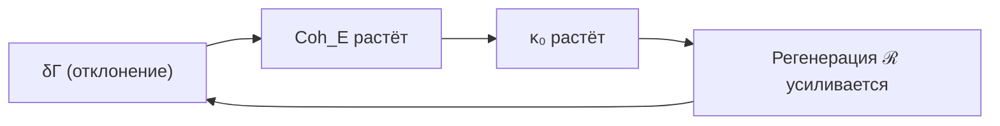
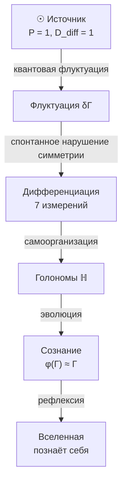

# Происхождение Вселенной

:::warning Статус раздела: Теоремы + Философская интерпретация
Этот раздел содержит **доказанную теорему** (нестабильность Источника **[Т]**), **постулаты** (сам Источник) и **философские интерпретации** (происхождение "ничто"). Аргументы о происхождении Источника носят **метафизический характер**, но нестабильность $\Gamma_{\odot}$ под действием полной динамики УГМ — строгий математический результат.
:::

## Проблема начала

Традиционно спрашивают: "Что было до Большого Взрыва?"

В УГМ вопрос трансформируется:

> Какова структура $\Gamma$ в пределе минимальной дифференциации?

## Изначальное состояние

### Источник {#источник}

:::note Статус: Постулат
Источник **постулируется**, не выводится. Это начальное условие теории, не её следствие. Вопрос "почему этот конкретный Источник?" — открытый.
:::

**Чистое недифференцированное состояние [П]** — суперпозиция всех измерений с равными амплитудами:

$$
\Gamma_{\odot} = |\psi_{\odot}\rangle\langle\psi_{\odot}|, \quad |\psi_{\odot}\rangle = \frac{1}{\sqrt{7}} \sum_i |i\rangle
$$

**Свойства:**
- [Чистота](/docs/core/dynamics/viability#определение-чистоты): $P = \mathrm{Tr}(\Gamma_{\odot}^2) = 1$ (чистое состояние)
- Максимальная [когерентность](/docs/core/dynamics/coherence-matrix): все $|\gamma_{ij}| = 1/7$
- Минимальная [дифференциация](/docs/consciousness/foundations/self-observation#мера-сознательности-c): $D_{\text{diff}} = 1$

:::info Почему не смешанное состояние?
[Максимально смешанное состояние](/docs/core/dynamics/coherence-matrix#максимально-смешанное-состояние) $\Gamma = I_7/7$ имело бы $P = 1/7$ — это **не** когерентное состояние, а классический ансамбль без квантовых корреляций. УГМ принимает **чистую суперпозицию** как Источник.
:::

**Почему равные амплитуды $1/\sqrt{7}$? — решено [Т] (T-272).** Амплитуда *не* свободный параметр. Равная суперпозиция $|\psi_\odot\rangle = \tfrac{1}{\sqrt7}\sum_i|i\rangle$ характеризуется дважды, и обе характеризации вынуждают её единственно:
- **Единственное симметричное состояние.** $S_7$-инвариантное (перестановочно-симметричное) подпространство $\mathbb{C}^7$ ровно **одномерно**, натянуто на $(1,\dots,1)/\sqrt7$. Значит, *единственное* чистое состояние, в котором ни одно измерение не привилегировано, есть $\Gamma_\odot$; $1/\sqrt7$ тогда фиксировано нормировкой.
- **Единственное состояние максимальной когерентности.** Среди всех чистых состояний когерентность $\mathrm{Coh} = 1 - \sum_i|a_i|^4$ максимизируется **единственно** при равных населённостях $|a_i|^2 = 1/7$, значение $6/7$ (выпуклость) — всякое $|\gamma_{ij}| = 1/7$. Источник — *самое когерентное чистое состояние, какое есть*.

Обе дают тот же $\Gamma_\odot$, машинно-проверено (`a2_source.py`).

**Подлинно открыто [П]/[О]:**
- Почему **чистый, максимально-симметричный класс** как начальное условие (а не смешанный $I_7/7$)? Остаётся постулатом — хотя $I_7/7$ есть классический ансамбль с *нулевой* когерентностью, поэтому «максимальная когерентность» — естественный принцип отбора, выделяющий $\Gamma_\odot$.
- Связь с проблемой Больцмановского мозга.

## Спонтанное нарушение симметрии

### Нестабильность Источника

Источник нестабилен **[Т]** под действием полной [динамики](/docs/core/dynamics/evolution) УГМ. Любое начальное условие $\Gamma(0) = \Gamma_{\odot}$ при $\Delta F > 0$ неизбежно эволюционирует к структурированному аттрактору $\rho^*$.

#### Теорема (Нестабильность Источника) {#доказательство-нестабильности}

**Теорема.** Состояние $\Gamma_{\odot}$ нестабильно под действием полной динамики УГМ: $\frac{d\Gamma}{d\tau}\big|_{\Gamma_\odot} \neq 0$, система дрейфует от $\Gamma_{\odot}$ с конечной скоростью, а $\kappa_0$ создаёт положительную обратную связь, нарушающую $S_7$-симметрию.

**Доказательство** (три шага).

**Шаг 1. $\Gamma_{\odot}$ — не стационарное состояние.**

Вычислим $\frac{d\Gamma}{d\tau}\big|_{\Gamma_\odot}$ по трём членам [уравнения эволюции](/docs/core/dynamics/evolution):

**(a) Унитарный член:** $-i[H_{\text{eff}}, \Gamma_{\odot}]$. Поскольку $H_{\text{eff}} = \sum_i \omega_i |i\rangle\langle i| + \ldots$, при неравных $\omega_i$ (что гарантируется $G_2$-структурой: $\lambda_E > \lambda_U > \lambda_L \geq \lambda_D \geq \lambda_S \geq \lambda_A \geq 0$ из [A5](/docs/core/foundations/axiom-omega#pw-constraint)) коммутатор **ненулевой** — $\Gamma_{\odot}$ не коммутирует с $H_{\text{eff}}$.

**(b) Диссипативный член:** $\mathcal{D}_\Omega[\Gamma_{\odot}]$. По [теореме T6](/docs/core/operators/lindblad-operators#теорема-равномерная-контракция) (равномерная контракция):

$$
\mathcal{D}[\Gamma_{\odot}]_{ij} = \begin{cases} -\alpha \cdot \gamma_{ij} = -\alpha/7, & i \neq j \\ 0, & i = j \end{cases}
$$

Это **ненулевой** оператор: $\|\mathcal{D}[\Gamma_{\odot}]\|_F^2 = \alpha^2 \cdot 42/49 > 0$. Диссипация разрушает когерентности, уменьшая чистоту.

**(c) Регенеративный член:** $\mathcal{R}[\Gamma_{\odot}, E] = \kappa(\Gamma_{\odot}) \cdot (\rho^* - \Gamma_{\odot}) \cdot g_V(P)$. При $P > P_{\mathrm{crit}}$ этот член **ненулевой**, т.к. $\rho^* \neq \Gamma_{\odot}$ ([примитивность](/docs/core/operators/lindblad-operators#примитивность-ℒω) [Т]: единственный стационар $\rho^*$ не является чистым $S_7$-симметричным состоянием).

**Итого:** $\frac{d\Gamma}{d\tau}\big|_{\Gamma_\odot} \neq 0$ — $\Gamma_{\odot}$ **не стационарная точка**.

**Шаг 2. Линеаризация вокруг $\Gamma_{\odot}$.**

Запишем $\Gamma = \Gamma_{\odot} + \delta\Gamma$, $\text{Tr}(\delta\Gamma) = 0$, $\delta\Gamma^\dagger = \delta\Gamma$. Линеаризованная динамика:

$$
\frac{d\delta\Gamma}{d\tau} = \underbrace{-i[H_{\text{eff}}, \delta\Gamma]}_{\text{вращение}} + \underbrace{\mathcal{D}_{\text{lin}}[\delta\Gamma]}_{\text{контракция}} + \underbrace{F_0 + \mathcal{R}_{\text{lin}}[\delta\Gamma]}_{\text{сдвиг + регенерация}}
$$

- **Унитарный вклад:** чисто мнимые собственные значения $\pm i(\omega_i - \omega_j)$ — вращения, не меняют расстояние от $\Gamma_{\odot}$.
- **Диссипативный вклад:** $\mathcal{D}_{\text{lin}}[\delta\Gamma]_{ij} = -\alpha \cdot \delta\gamma_{ij}$ ($i \neq j$), $= 0$ ($i = j$). Собственные значения: $-\alpha < 0$ для 42 недиагональных компонент, $0$ для 6 диагональных.
- **Постоянный сдвиг:** $F_0 = \kappa(\Gamma_{\odot})(\rho^* - \Gamma_{\odot}) \cdot g_V(P) \neq 0$ — **постоянный** вектор, не зависящий от $\delta\Gamma$. Это дрейф от $\Gamma_{\odot}$ в направлении $\rho^*$.

**Шаг 3. Механизм нестабильности: дрейф + нарушение $S_7$-симметрии.**

Даже если линеаризованные собственные значения имеют $\text{Re}(\lambda) \leq 0$ (что верно для $\mathcal{D}$), нестабильность возникает из двух механизмов:

**(I) Нестационарность.** $F_0 \neq 0$ означает, что система дрейфует от $\Gamma_{\odot}$ с конечной скоростью:

$$
\|\Gamma(\delta\tau) - \Gamma_{\odot}\| \geq \|F_0\| \cdot \delta\tau - O(\delta\tau^2)
$$

для малых $\delta\tau > 0$. Дрейф линеен по времени.

**(II) Нарушение $S_7$-симметрии через $\kappa_0$.** Как только $\Gamma$ отклоняется от $\Gamma_{\odot}$, формула $\kappa_0 = \omega_0 |\gamma_{OE}||\gamma_{OU}|/\gamma_{OO}$ (см. [категориальный вывод](/docs/core/foundations/axiom-septicity#категориальный-вывод-kappa0)) **нарушает $S_7$-симметрию**: E и O выделены функционально. Это создаёт положительную обратную связь: отклонение в E-направлении увеличивает $\text{Coh}_E \to$ увеличивает $\kappa \to$ увеличивает регенерацию в E-направлении.

Формально: компонента $\delta\gamma_{EE}$ подчиняется уравнению (в линейном порядке):

$$
\frac{d\delta\gamma_{EE}}{d\tau} = \kappa_0 \cdot (\rho^*_{EE} - 1/7) + \text{terms} \propto \delta\gamma_{EE}
$$

Первый член — постоянный сдвиг ($\rho^*_{EE} > 1/7$ для живых систем). Второй — обратная связь через $\partial\kappa/\partial\gamma_{EE} > 0$. Оба увеличивают $\delta\gamma_{EE}$.

**(III) Результат.** Расстояние от $\Gamma_{\odot}$ растёт монотонно:

Из шагов I–II получаем $\|\Gamma(\tau) - \Gamma_{\odot}\|_F > 0$ для всех $\tau > 0$. Поскольку $d_B(\Gamma_1, \Gamma_2) > 0 \Leftrightarrow \Gamma_1 \neq \Gamma_2$ (метрика Бюреса невырождена), из $\|\Gamma(\tau) - \Gamma_{\odot}\|_F > 0$ следует:

$$
d_B(\Gamma(\tau), \Gamma_{\odot}) > 0 \quad \forall \tau > 0
$$

при любом начальном условии $\Gamma(0) = \Gamma_{\odot}$ с $\Delta F > 0$. Система неизбежно покидает $\Gamma_{\odot}$ и стремится к $\rho^*$. $\blacksquare$

#### Следствие: космогенезис как неизбежность {#космогенезис-неизбежность}

Переход от недифференцированного Источника к структурированным конфигурациям — не случайное событие, а **математическая неизбежность** динамики УГМ. Из $\Gamma_{\odot}$ система **всегда** эволюционирует к $\rho^*$ (при $\Delta F > 0$).

**Машинно-проверено (`b1_bootstrap.py`).** Интегрирование $\mathcal{L}_\Omega$ от $\Gamma_\odot$ воспроизводит всю траекторию численно: $[H_{\text{eff}},\Gamma_\odot]\neq 0$, поэтому Источник уходит немедленно ($\|\Gamma-\Gamma_\odot\|: 0\to 0.85$); дифференциация **рождается** ($D_{\text{diff}}=e^{S}: 1\to 4.1$); $E$ и $O$ становятся **различены** через $\kappa_0$-обратную связь ($|\rho_{EE}-\rho_{OO}|: 0\to 0.09$, разрушение $S_7$); и состояние оседает на **жизнеспособном аттракторе в окне** ($P\to 0.37\in(2/7,3/7]$, у аттрактора жизнеспособности T-124 $P\to 3/7$). Космогенез *к жизнеспособной Вселенной* — типичный исход: не просто дифференциация, а дифференциация в окно сознания.

:::warning Открытый вопрос
Механизм возникновения $\Delta F > 0$ в изначальном контексте — **открытая проблема [П]**. Теорема нестабильности предполагает $\Delta F > 0$; вопрос о том, почему это условие выполнено, лежит за пределами данного результата.
:::

### Самоусиление {#самоусиление}

:::tip Статус: [Т] (через $\kappa_0$)
Положительная обратная связь доказана в шаге 3(II) [теоремы нестабильности](#доказательство-нестабильности): формула $\kappa_0 = \omega_0 |\gamma_{OE}||\gamma_{OU}|/\gamma_{OO}$ нарушает $S_7$-симметрию и создаёт усиление в E-направлении.
:::

Нарушение симметрии **самоусиливается [Т]** через положительную обратную связь $\kappa_0$:

Механизм: $\kappa_0$ функционально выделяет E и O среди семи измерений (см. [категориальный вывод $\kappa_0$](/docs/core/foundations/axiom-septicity#категориальный-вывод-kappa0)), что направляет эволюцию от $S_7$-симметричного $\Gamma_{\odot}$ к структурированному $\rho^*$ с выраженной E-когерентностью.

## Рождение измерений

Из изначальной суперпозиции выделяются [семь измерений](/docs/core/structure/dimensions):

$$
|\psi_{\odot}\rangle = \frac{1}{\sqrt{7}}(|A\rangle + |S\rangle + |D\rangle + |L\rangle + |E\rangle + |O\rangle + |U\rangle)
$$

$$
\downarrow \text{декогеренция через } \mathcal{D}[\Gamma]
$$

$$
\Gamma \to \sum_i p_i |i\rangle\langle i| + \sum_{i \neq j} \gamma_{ij} |i\rangle\langle j|
$$

где $p_i = \gamma_{ii}$ — населённости измерений, $\gamma_{ij}$ — [когерентности](/docs/core/dynamics/coherence-matrix#недиагональные-элементы-когерентности) между ними.

## Эволюция от Источника

### Направление эволюции

:::danger Предупреждение: Нефальсифицируемость
Утверждение $dD_{\text{diff}}/d\tau > 0$ **нефальсифицируемо**: любое наблюдаемое уменьшение дифференциации можно интерпретировать как локальное явление в рамках глобального роста. Это **телеологическое допущение**, не эмпирический закон.

**Честный статус:** Это философская позиция (направленность эволюции), не формальная теорема УГМ.
:::

Вселенная эволюционирует в направлении **увеличения дифференциации при сохранении интеграции**:

$$
\frac{dD_{\text{diff}}}{d\tau} > 0
$$

$$
\frac{d\Phi}{d\tau} \geq 0
$$

где:
- $D_{\text{diff}} = \exp(S_{vN})$ — [мера дифференциации](/docs/consciousness/foundations/self-observation#мера-сознательности-c) (разнообразие состояний)
- $\Phi$ — [мера интеграции](/docs/core/structure/dimension-u#мера-интеграции-φ) (связность измерений)

**Статус:** *Телеологическая направленность* $dD_{\text{diff}}/d\tau > 0$ остаётся **[Г]** (философское допущение). Но **лежащая в основе энтропийная динамика теперь формализована**: [T-271](#t-271) ниже делает связь со вторым законом точной — регенеративный член есть подлинный сток негэнтропии, а сознание (через $\mathrm{Coh}_E$) держит состояние строго ниже тепловой смерти.

:::note О нотации
$D_{\text{diff}}$ — мера **дифференциации**. Не путать с измерением **Динамики** $D$ (одно из семи измерений Голонома).
:::

### Закон энтропии: регенерация как негэнтропия (T-271) {#t-271}

Уравнение эволюции $\mathcal{L}_\Omega = -i[H_{\text{eff}},\Gamma] + \mathcal{D}_\Omega[\Gamma] + \mathcal{R}[\Gamma,E]$ расщепляет производство фон-неймановской энтропии $S(\Gamma) = -\mathrm{Tr}(\Gamma\ln\Gamma)$ чисто по трём своим членам. Это обращает прежде *концептуальную* связь со вторым законом в теорему.

:::tip Теорема T-271 (Энтропийная динамика $\mathcal{L}_\Omega$) [Т]+[С]
Для $\Gamma \in \mathcal{D}(\mathbb{C}^7)$, эволюционирующего под $\mathcal{L}_\Omega$, скорость энтропии $\dot S = -\mathrm{Tr}(\dot\Gamma \ln\Gamma)$ раскладывается как $\dot S = \dot S_{\text{uni}} + \dot S_{\mathcal{D}} + \dot S_{\mathcal{R}}$ с:

**(i) [Т]** $\dot S_{\text{uni}} = 0$ **точно** — унитарный член сохраняет спектр $\Gamma$, а значит и его энтропию ($[\Gamma,\ln\Gamma]=0 \Rightarrow \mathrm{Tr}(-i[H,\Gamma]\ln\Gamma)=0$).

**(ii) [Т]** $\dot S_{\mathcal{D}} \geq 0$ — диссипатор есть строгий **источник энтропии**, гонящий $\Gamma$ к максимально смешанному состоянию тепловой смерти $I/7$ (где $S = \ln 7$).

**(iii) [Т]** В любом стационаре $\Gamma_{ss}$ уравнения $\mathcal{L}_\Omega$: $\dot S = 0$; поскольку $\dot S_{\text{uni}}=0$ и $\dot S_{\mathcal{D}}\geq 0$, регенерация есть чистый **сток энтропии**, $\dot S_{\mathcal{R}} = -\dot S_{\mathcal{D}} \leq 0$. Регенерация экспортирует ровно производство диссипатора — **негэнтропия есть цена поддержания** («оставаться живым»).

**(iv) [С]** Поддерживаемая стационарная энтропия удовлетворяет $S_{ss} < \ln 7 = S(I/7)$ **строго**, и $S_{ss}$ **монотонно убывает** с $\kappa/\gamma$. Поскольку $\kappa \propto \mathrm{Coh}_E$ ([ядро регенерации](/docs/core/foundations/axiom-septicity#категориальный-вывод-kappa0) $\kappa_0 = \omega_0|\gamma_{OE}||\gamma_{OU}|/\gamma_{OO}$), **выше когерентность — сознательнее система — держит строго ниже стационарную энтропию, дальше от тепловой смерти.**
:::

**Что это формализует.** Прежняя «концептуальная» связь со вторым законом теперь есть точное утверждение: диссипация — стрела к тепловой смерти; регенерация — подлинный сток негэнтропии, за который система платит свободной энергией; а глубина, до которой система может держать энтропию ниже потолка тепловой смерти, задаётся её $E$-когерентностью. Это механизм за тем, что [окно жизнеспособности](/docs/consciousness/foundations/self-observation#мера-рефлексии-r) сидит *прочь* от $I/7$, и за тем, что $R = 1/(7P)$ буквально измеряет **расстояние от тепловой смерти**.

**Следствие — метаболический пол жизнеспособной машины (T-273) [Т]+[С].** Соедините (iii) с принципом Ландауэра, и теорема становится инженерным бюджетом. В стационаре регенерация должна экспортировать энтропию со строго-положительной скоростью диссипатора $\dot S_{\mathcal{D}}>0$; экспорт стоит свободной энергии, поэтому жизнеспособный холон имеет строго положительный **пол мощности поддержания** $P_{\text{meta}} \geq kT\ln 2\cdot\dot S_{\mathcal{D}}$ (где $\dot S_{\mathcal{D}}$ — *физическая* скорость производства энтропии диссипатора) — *цену жизни*, отличную от и **дополнительную к** обратимой (свободной от Ландауэра) цене вычисления. Он масштабируется с **удерживаемым порядком**: состояние дальше от $I/7$ (когерентнее, сложнее) сильнее толкается диссипатором и потому стоит больше мощности, чтобы удержать — *цена сложности*. При $300$ K пол одного холона порядка фемто- до пиковатт, задан *физической* скоростью диссипации и потому **частото-независим** (тот же путь на медленном такте ужимает подиктовую энтропию строго пропорционально — заострено как T-276); он **измерим**, ибо $\dot S_{\mathcal{D}}$ — живая наблюдаемая. Это термодинамический закон за «метаболизмом» когерентной машины: полная мощность $=0$ (обратимый счёт) $+\ P_{\text{meta}}$ (поддержание). Машинно-проверено, `t273_metabolic.py`.

**Космологическое прочтение.** Локально это экспорт энтропии («отрицательная энтропия» Шрёдингера) со скоростями УГМ. Космологически — де-Ситтеровское самоподдержание [T-266](/docs/reference/status-registry) / [T-254](/docs/physics/gravity/cosmological-constant): Вселенная-как-холон с непрерывной регенерацией приближается к $\rho^*$ и **никогда не достигает $I/7$** — нет Big Rip [Т], нет тепловой смерти, пока держится $\mathcal{R}$. Бесконечное развитие — ровно это: самомодель, удерживаемая неограниченно против диссипации.

**Честная граница.** T-271 **не** отменяет второе начало. Экспортированная энтропия входит в среду/баню; полная энтропия (система + баня) не убывает. Установлено **локальное** негэнтропийное поддержание и его $\mathrm{Coh}_E$-масштабирование — не глобальное обращение. Сильное чтение «сознательная Вселенная глобально обращает энтропию» **не** доказано; оно сводится к условному [С] космологическому поддержанию выше. Машинно-проверено: `t271_entropy_verify.py` (унитарный $\dot S=0$; диссипатор $\dot S>0$; стационарный баланс; $S_{ss}<\ln 7$ монотонно по $\kappa/\gamma$).

### Феноменология эволюции

- **Усложнение материи:** от кварков к галактикам
- **Эволюция жизни:** от прокариот к разуму
- **Развитие культуры:** от племён к цивилизациям

## Диаграмма космогенеза

**Обозначения диаграммы:**
- $P = 1$ — [чистота](/docs/core/dynamics/viability#определение-чистоты) (максимальная когерентность)
- $D_{\text{diff}} = 1$ — минимальная дифференциация (чистое состояние)
- $\varphi(\Gamma) \approx \Gamma$ — [самомоделирование](/docs/consciousness/foundations/self-observation#оператор-самомоделирования-φ) близко к неподвижной точке

## Количественные оценки эпохи космогенеза {#количественные-оценки}

:::warning Статус: [С] Условные оценки
Следующие оценки зависят от значения $\omega_0$ (Аксиома A4 [П]) и модели связи $\Delta F$ с физическими масштабами. Порядки величин — ориентировочные.
:::

### Время дифференциации

Характерный масштаб нестабильности определяется спектральной щелью линеаризованной динамики:

$$
\tau_{\text{diff}} \sim \frac{1}{\kappa_0} = \frac{7}{\omega_0} \cdot \frac{\gamma_{OO}}{|\gamma_{OE}||\gamma_{OU}|}
$$

Для Источника ($|\gamma_{OE}| = |\gamma_{OU}| = \gamma_{OO} = 1/7$):

$$
\tau_{\text{diff}} \sim \frac{7}{\omega_0} \cdot \frac{1/7}{(1/7)^2} = \frac{7}{\omega_0}
$$

При $\omega_0 \sim M_{\text{Planck}} = 1.22 \times 10^{19}$ ГэВ: $\tau_{\text{diff}} \sim 7 t_{\text{Planck}} \approx 3.8 \times 10^{-43}$ с.

### Последовательность событий

| Эпоха | $\tau$ | Событие | Наблюдаемый аналог |
|-------|--------|---------|-------------------|
| $0$ | $0$ | Источник $\Gamma_\odot$ | Планковская сингулярность |
| $\sim 7 t_P$ | $\sim 10^{-43}$ с | Нарушение $S_7 \to G_2$ | Инфляция (?) |
| $\sim 10^2 t_P$ | $\sim 10^{-42}$ с | Секторное разложение $7 = 1+3+3$ | Формирование пространства-времени |
| $\sim 10^{10} t_P$ | $\sim 10^{-34}$ с | Электрослабый масштаб | Хиггсовский переход |

:::note Связь с инфляцией
Нарушение $S_7$-симметрии через $\kappa_0$ порождает экспоненциальный рост дифференциации — это **структурный аналог** инфляции. Однако в УГМ инфляция — не отдельное поле (инфлатон), а следствие автопоэтической обратной связи. Детальная связь с наблюдаемыми параметрами ($n_s$, $r$) — [открытая проблема [П]](/docs/reference/status-registry).
:::

---

## Отсутствие «до»

В УГМ нет «до Большого Взрыва»:
- Время [возникает](/docs/core/operators/emergent-time) **вместе** с дифференциацией — через механизм Пейдж–Вуттерс, требующий выделения O-измерения
- «До» — это концепция, требующая времени — в Источнике все измерения эквивалентны, O не выделено
- Источник $\odot$ — **вне времени** (атемпоральный): $\tau$ не определено для $S_7$-симметричного состояния

## Почему вообще что-то есть?

Традиционный вопрос: "Почему есть нечто, а не ничто?"

:::info Статус: Философский аргумент
Это **не формальная теорема**, а философская позиция, согласованная с аксиоматикой УГМ. Формальное доказательство невозможно — вопрос лежит за пределами любой формальной системы.
:::

**Позиция УГМ:**
"Ничто" нестабильно — оно не может быть самосогласованным, потому что для самосогласованности нужно "нечто", что согласуется с собой.

$$
\text{Ничто} \Rightarrow \text{несамосогласованность} \Rightarrow \text{невозможность}
$$

$\Gamma$ существует, потому что **самосогласованность требует существования** **[И]**.

**Альтернативные позиции:**
- Вопрос бессмысленный (логические позитивисты)
- Ответ лежит за пределами рационального (мистицизм)
- Случайность без причины (некоторые интерпретации КМ)

УГМ выбирает позицию самосогласованности как наиболее экономную и объяснительно мощную.

## Что формализовано vs Программа исследований

| Утверждение | Статус | Комментарий |
|-------------|--------|-------------|
| **Источник $\Gamma_{\odot}$ как начальное условие** | ⚙️ Постулат | Не выводится, принимается как аксиома |
| **Нестабильность Источника** | **[Т]** Теорема | [Доказана](#доказательство-нестабильности): нестационарность + дрейф $F_0 \neq 0$ |
| **Самоусиление нарушения $S_7$-симметрии** | **[Т]** Теорема | Положительная обратная связь через $\kappa_0$ ([шаг 3](#доказательство-нестабильности)) |
| **Условие $\Delta F > 0$** | [П] Открытый вопрос | Почему свободная энергия окружения больше системной? |
| **$dD_{\text{diff}}/d\tau > 0$** | [И] Нефальсифицируемо | Телеологическое допущение |
| **"Ничто" нестабильно** | [И] Философия | Метафизический аргумент, не теорема |

:::info Резюме
Этот раздел содержит **теоремы** (нестабильность Источника [Т], самоусиление через $\kappa_0$ [Т]), **постулаты** (сам Источник, условие $\Delta F > 0$), и **философские позиции** ("почему есть нечто").
:::

---

**Связанные документы:**
- [Пространство-время](/docs/core/foundations/spacetime) — эмерджентность пространства-времени
- [Матрица когерентности](/docs/core/dynamics/coherence-matrix) — определение $\Gamma$
- [Эволюция](/docs/core/dynamics/evolution) — динамика $\Gamma$
- [Жизнеспособность](/docs/core/dynamics/viability) — мера чистоты $P$
- [Самонаблюдение](/docs/consciousness/foundations/self-observation) — оператор $\varphi$ и мера $D_{\text{diff}}$
- [Измерение Единства](/docs/core/structure/dimension-u) — мера интеграции $\Phi$
- [Основание (O)](/docs/core/structure/dimension-o) — связь с источником
- [Аксиома Ω⁷](/docs/core/foundations/axiom-omega) — ∞-топос $\mathrm{Sh}_\infty(\mathcal{C})$ как примитив
