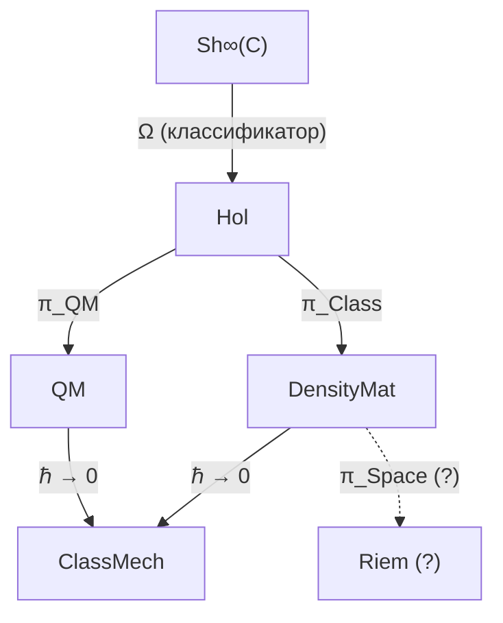

# Редукция УГМ к Квантовой Механике

:::info Статус раздела
В §1–§6 статус **[Т]** имеют Теорема 3.1 (уравнение эволюции сводится к уравнению фон Неймана, когда диссипатор и регенератор выключены, $\kappa_0 \to 0$, $\gamma_k \to 0$), Теорема 3.4 и Теорема 1.1. Теорема 3.2, эквивалентность категорий $\mathbf{Hol}_{R=0} \simeq \mathbf{QM}$, отозвана [✗] (§4.2); вместо неё верна Теорема 3.2′ [Т] — эквивалентность $\mathbf{Hol}^u$ с семимерной квантовой механикой выше чистоты $2/7$, с точно очерченной областью (§4.2). Классификация Теоремы 3.3 — прочтение [И]. §8 доказывает контекстуальность Кохена–Шпекера в $\mathbb{C}^7$ на наборе лучей, построенном из плоскости Фано (T-201′, [Т]). Прежняя редакция этой врезки давала статус [Т] всем результатам §1–§6; это отозвано. §7 сопоставляет их с реконструкциями квантовой теории; эти сопоставления — интерпретации [И].
:::

## Содержание

1. [Связь с L-унификацией](#1-связь-с-l-унификацией)
2. [Предельный функтор и уравнение Шрёдингера](#2-предельный-функтор)
3. [Категория квантовомеханических систем](#3-категория-qm)
4. [Функтор редукции и эквивалентность категорий](#4-функтор-редукции)
5. [Таксономия физических систем](#5-таксономия)
6. [Дискретность времени и Пейдж–Вуттерс](#6-дискретность-времени)
7. [Прецеденты: реконструкции квантовой теории](#7-прецеденты-реконструкции)
8. [Контекстуальность Кохена–Шпекера в пространстве голонома](#8-контекстуальность-кш)

---

## 1. Связь с L-унификацией {#1-связь-с-l-унификацией}

:::info Ключевой принцип
Редукция к стандартной КМ происходит когда **логическая структура Ω тривиализируется**: при $R_\varphi \to 0$ система теряет способность к самомоделированию, и диссипативная динамика $\mathcal{L}_\Omega$ редуцируется к чисто унитарной.
:::

В полной теории УГМ эволюция матрицы когерентности $\Gamma$ описывается **логическим Лиувиллианом** $\mathcal{L}_\Omega$, который **выводится** из субобъектного классификатора $\Omega$ ∞-топоса $\text{Sh}_\infty(\mathcal{C})$:

$$
\frac{d\Gamma(\tau)}{d\tau} = \mathcal{L}_\Omega[\Gamma(\tau)]
$$

где:

$$
\mathcal{L}_\Omega[\Gamma] = -i[H_{eff}, \Gamma] + \mathcal{D}_\Omega[\Gamma] + \mathcal{R}[\Gamma, E]
$$

Три компоненты имеют чёткое происхождение:
- $-i[H_{eff}, \Gamma]$ — **унитарная** эволюция, сохраняющая чистоту $P = \text{Tr}(\Gamma^2)$
- $\mathcal{D}_\Omega[\Gamma]$ — **логическая диссипация** из операторов Линдблада $L_k = \sqrt{\chi_{S_k}}$, выведенных из атомов классификатора $\Omega$
- $\mathcal{R}[\Gamma, E]$ — **регенерация**, сопряжённый функтор к диссипации

Квантовая механика возникает, когда два последних члена обращаются в нуль. Это происходит при тривиализации логической структуры $\Omega$: когда все характеристические морфизмы $\chi_{S_k}$ полностью определены, нет логической неопределённости, и система не способна к самомоделированию ($R_\varphi = 0$).

**Цепочка вывода:**

$$
\Omega \xrightarrow{\text{тривиализация}} \chi_{S_k} \text{ определены} \xrightarrow{} \mathcal{D}_\Omega \to 0, \; \mathcal{R} \to 0 \xrightarrow{} \frac{d\Gamma}{d\tau} = -i[H_{eff}, \Gamma]
$$

---

## 2. Предельный функтор и уравнение Шрёдингера {#2-предельный-функтор}

### 2.1 Центральная теорема

:::tip [Т] Теорема 3.1 (Редукция к уравнению Шрёдингера)
Пусть $\mathbb{H}$ — Голоном с $R_\varphi \to 0$. Тогда [уравнение эволюции](/docs/core/dynamics/evolution) с [эмерджентным внутренним временем](/docs/proofs/dynamics/emergent-time) $\tau$:

$$
\frac{d\Gamma(\tau)}{d\tau} = -i[H_{eff}, \Gamma(\tau)] + \mathcal{D}[\Gamma] + \mathcal{R}[\Gamma, E]
$$

редуцируется к уравнению фон Неймана:

$$
\frac{d\rho}{dt} = -i[H, \rho]
$$

для смешанных состояний, или к уравнению Шрёдингера:

$$
i\hbar\frac{d|\psi\rangle}{dt} = H|\psi\rangle
$$

для чистых состояний $\Gamma = |\psi\rangle\langle\psi|$.
:::

### 2.2 Полное доказательство

*Доказательство:*

**Шаг 1.** При $R_\varphi \to 0$ система не обладает значимым самомоделированием. Мера рефлексии $R$ определена через качество самомоделирования:

$$
R = R(\varphi, \Gamma) \to 0
$$

что означает: оператор самомоделирования $\varphi$ вырождается.

**Шаг 2.** Регенеративный член обращается в нуль:

$$
\mathcal{R}[\Gamma, E] \propto \kappa(\Gamma) \to 0 \quad \text{при} \quad \kappa_0 \to 0
$$

где $\kappa_0 = \|\mathrm{Nat}(\mathcal{D}_\Omega, \mathcal{R})\|$ — норма естественного преобразования из [категориального вывода](/docs/core/foundations/axiom-septicity#структурный-анзац-kappa0). Интуитивно: регенерация требует самомоделирования; без него ($R \to 0$) регенеративный член исчезает.

**Шаг 3.** Диссипативный член обращается в нуль для изолированных систем:

$$
\mathcal{D}[\Gamma] = \mathcal{L}_\Omega[\Gamma] + i[H_{eff}, \Gamma] \to 0
$$

Логическая структура $\Omega$ «замораживается»: все характеристические морфизмы $\chi_{S_k}$ тривиальны (проекторы на собственные подпространства), и $\gamma_k \to 0$ для всех $k$.

**Шаг 4.** Остаётся чисто унитарный член:

$$
\frac{d\Gamma(\tau)}{d\tau} = -i[H_{eff}, \Gamma]
$$

где $H_{eff}$ — [эффективный гамильтониан](/docs/core/dynamics/evolution#вывод-h_eff), возникающий из ограничения Пейдж–Вуттерс.

**Шаг 5.** Для чистого состояния $\Gamma = |\psi\rangle\langle\psi|$ дифференцируем:

$$
\frac{d|\psi\rangle\langle\psi|}{dt} = \frac{d|\psi\rangle}{dt}\langle\psi| + |\psi\rangle\frac{d\langle\psi|}{dt}
$$

**Шаг 6.** Подставляя в уравнение $\frac{d\Gamma}{dt} = -i[H, \Gamma]$:

$$
\frac{d|\psi\rangle}{dt}\langle\psi| + |\psi\rangle\frac{d\langle\psi|}{dt} = -i\left(H|\psi\rangle\langle\psi| - |\psi\rangle\langle\psi|H\right)
$$

Проецируя на $|\psi\rangle$ слева и справа, получаем:

$$
i\hbar\frac{d|\psi\rangle}{dt} = H|\psi\rangle
$$

$\blacksquare$

### 2.3 Интерпретация через L-унификацию

Унитарная квантовая механика — предел, когда логическая структура $\Omega$ полностью определена и не допускает неопределённости. Все характеристические морфизмы $\chi_{S_k}$ тривиальны, что означает:

| Аспект | Полная УГМ ($R > 0$) | КМ-предел ($R = 0$) |
|--------|----------------------|----------------------|
| Логическая структура $\Omega$ | Нетривиальная, рефлексивная | Тривиальная, «замороженная» |
| Характеристические морфизмы $\chi_{S_k}$ | Нетривиальные проекции | Тривиальные (собственные проекторы) |
| Диссипация $\mathcal{D}_\Omega$ | Ненулевая (логическая неопределённость) | Нулевая |
| Регенерация $\mathcal{R}$ | Возможна (самомоделирование) | Отсутствует |
| Динамика | Диссипативная + регенеративная | Чисто унитарная |

---

## 3. Категория квантовомеханических систем {#3-категория-qm}

### 3.1 Определение категории QM

**Определение 3.1 (Категория QM).**

Объекты — тройки (гильбертово пространство, гамильтониан, начальное состояние):

$$
\mathrm{Ob}(\mathbf{QM}) = \{(\mathcal{H}, H, \rho_0) : \mathcal{H} \text{ — гильбертово пространство, } H = H^\dagger, \rho_0 \text{ — начальное состояние}\}
$$

Морфизмы — унитарные преобразования, переводящие одно состояние в другое:

$$
\mathrm{Mor}_{\mathbf{QM}}((H_1, \rho_1), (H_2, \rho_2)) = \{U : U^\dagger U = I, \; U\rho_1 U^\dagger = \rho_2\}
$$

### 3.2 Связь с категорией Голономов

Категория $\mathbf{Hol}$ (Голономов) определена через:
- **Объекты:** Голономы $\mathbb{H}$ с 7-мерной матрицей когерентности $\Gamma^{(7)}$
- **Морфизмы:** CPTP-каналы, сохраняющие структуру

Функтор забывания $\mathcal{U}: \mathbf{Hol} \to \mathbf{DensityMat}$ определяется:

$$
\mathcal{U}(\mathbb{H}) := \Gamma_{\mathbb{H}}^{(7)}, \quad \mathcal{U}(f: \mathbb{H}_1 \to \mathbb{H}_2) := \Phi_f
$$

где $\Phi_f$ — CPTP-канал, индуцированный морфизмом $f$.

:::tip [Т] Теорема 1.1 (Функториальность забывания)
$\mathcal{U}$ — функтор, сохраняющий тождества и композицию.

*Доказательство:* Прямое следствие из определения морфизмов в $\mathbf{Hol}$ как CPTP-каналов, сохраняющих структуру. $\blacksquare$
:::

---

## 4. Функтор редукции и эквивалентность категорий {#4-функтор-редукции}

### 4.1 Определение функтора редукции

**Определение 3.2 (Функтор редукции).**

$$
\pi_{\text{QM}}: \mathbf{Hol}_{R \to 0} \to \mathbf{QM}
$$

$$
\pi_{\text{QM}}(\mathbb{H}) := (\mathcal{H}_{\mathbb{H}}, H_{\mathbb{H}}, \Gamma_{\mathbb{H}})
$$

Функтор $\pi_{\text{QM}}$ сопоставляет каждому Голоному с $R \to 0$ квантовомеханическую систему: его гильбертово пространство, эффективный гамильтониан и матрицу плотности.

### 4.2 Теорема об эквивалентности

:::warning Отозвано: Теорема 3.2 (Эквивалентность категорий $\mathbf{Hol}_{R=0} \simeq \mathbf{QM}$) [✗]
Прежняя редакция утверждала как [Т], что ограничение $\pi_{\text{QM}}|_{\mathbf{Hol}_{R=0}}$ — эквивалентность категорий $\mathbf{Hol}_{R=0} \simeq \mathbf{QM}$. Это ложно, и каждый шаг доказательства не проходит.

- **Существенная сюръективность не выполняется.** Эквивалентность должна достигать каждого объекта $\mathbf{QM}$ с точностью до изоморфизма, а изоморфизмы $\mathbf{QM}$ — унитарные операторы, сохраняющие размерность и чистоту. В $\mathbf{QM}$ есть системы любой размерности — кубит, $\mathcal{H} = \mathbb{C}^2$, — и состояния любой чистоты — $I/7$ с $P = 1/7$. Объекты $\mathbf{Hol}$ — семимерные матрицы когерентности с $P > 2/7$ ([Определение 12.1 (V)](/docs/proofs/categorical/categorical-formalism#категория-голономов-hol)), поэтому ни кубит, ни $(\mathbb{C}^7, H, I/7)$ не изоморфны никакому $\pi_{\text{QM}}(\mathbb{H})$. При мастер-определении [меры рефлексии](/docs/consciousness/foundations/self-observation#мера-рефлексии-r) $R = 1/(7P) \geq 1/7$ ни у одного голонома вообще нет $R = 0$, так что $\mathbf{Hol}_{R=0}$ пуста.
- **«При $R = 0$ CPTP-каналы вырождаются в унитарные» не обосновано.** Морфизмы $\mathbf{Hol}$ — CPTP-каналы, сохраняющие жизнеспособность и коммутирующие с самомоделированием; ничто в этом определении не делает их унитарными. Канал замены $X \mapsto \mathrm{Tr}(X)\,\rho^*$ на неподвижную точку $\rho^*$ самомоделирования удовлетворяет обоим условиям и не унитарен; без правила, переводящего его в унитарный оператор, $\pi_{\text{QM}}$ даже не определён на морфизмах.
- **Полная верность не доказана.** Доказательство утверждает биекцию множеств морфизмов, не построив функтор на морфизмах.
:::

**Что верно вместо этого.** Прежняя заметка здесь (25.09.2026) называла следующее «отождествлением по определению [О]» и формулировала его как изоморфизм с полной подкатегорией семимерных систем чистоты выше $2/7$. Это не изоморфизм — голоному нужно ещё $\rho_E \neq 0$, а унитарное сопряжение этого не сохраняет, — но это эквивалентность, и она — теорема.

Пусть $\mathbf{Hol}^{u}$ — категория, объекты которой — пары $(\Gamma, H)$, где $\Gamma$ — объект $\mathbf{Hol}$ ([определение 12.1](/docs/proofs/categorical/categorical-formalism#категория-голономов-hol)), а $H$ — гамильтониан, и морфизмы $(\Gamma_1, H_1) \to (\Gamma_2, H_2)$ — все унитарные $U$ с $U\Gamma_1U^\dagger = \Gamma_2$, как в определении 3.1. Для одного семимерного состояния условия определения 12.1 таковы: (V) $P = \mathrm{Tr}\,\Gamma^2 > 2/7$; (PH) $\rho_E \neq 0$, что в 7D-формализме означает $\gamma_{EE} > 0$; (AP) выполнено для всякого состояния (канал замены $X \mapsto \mathrm{Tr}(X)\,\Gamma$ оставляет $\Gamma$ на месте); (QG) — условие на генератор, его несёт $H$. Пусть $\mathbf{QM}_7^{>2/7}$ — полная подкатегория $\mathbf{QM}$ на объектах $(\mathbb{C}^7, H, \rho)$ с $\mathrm{Tr}\,\rho^2 > 2/7$.

:::tip Теорема 3.2′ (Голономы — это семимерная квантовая механика выше чистоты 2/7) [Т]
1. Включение $\iota : \mathbf{Hol}^{u} \to \mathbf{QM}_7^{>2/7}$, $(\Gamma, H) \mapsto (\mathbb{C}^7, H, \Gamma)$, — эквивалентность категорий. Изоморфизмом оно не является: у $(\mathbb{C}^7, H, |O\rangle\langle O|)$ чистота $P = 1$ и $\gamma_{EE} = 0$, так что это не голоном, но в $\mathbf{QM}$ он изоморфен голоному.
2. Её классы изоморфизма — спектры $\lambda_1 \geq \dots \geq \lambda_7 \geq 0$ с $\sum\lambda_i = 1$ и $\sum\lambda_i^2 > 2/7$; группа автоморфизмов объекта — централизатор $\Gamma$ в $U(7)$, $\prod_i U(m_i)$ по кратностям $m_i$ собственных значений.
3. Эквивалентности $\mathbf{Hol}^{u} \simeq \mathbf{QM}$ нет, и её нет после ограничения $\mathbf{QM}$ на любой класс, содержащий кубит или состояние $I/7$: размерность и чистота — инварианты изоморфизма в $\mathbf{QM}$.
4. Всякая квантовая система размерности $d \leq 3$ голономна: изометрия $V : \mathbb{C}^d \to \mathbb{C}^7$ даёт точный функтор $\mathbf{QM}_d \to \mathbf{QM}_7^{>2/7} \simeq \mathbf{Hol}^u$, $(\mathbb{C}^d, H, \rho) \mapsto (\mathbb{C}^7, VHV^\dagger, V\rho V^\dagger)$, $U \mapsto VUV^\dagger + (1 - VV^\dagger)$, поскольку всякое состояние на $\mathbb{C}^d$ имеет $\mathrm{Tr}\,\rho^2 \geq 1/d \geq 1/3 > 2/7$. Граница $d \leq 3$ точна: при $d \geq 4$ состояние $I/d$ имеет чистоту $1/d \leq 1/4 < 2/7$, а изометрическое вложение чистоту сохраняет, так что $I/d$ не есть образ никакого голонома. Функтор не полон (унитарные операторы на дополнении к $V\mathbb{C}^d$ — лишние морфизмы).
:::

**Доказательство.** (1) Обе категории — полные подкатегории $\mathbf{QM}$, поэтому $\iota$ вполне строг. Существенная сюръективность: для $(\mathbb{C}^7, H, \rho)$ с $\mathrm{Tr}\,\rho^2 > 2/7$ выберем индекс $j$ с $\rho_{jj} > 0$ (он есть, так как $\mathrm{Tr}\,\rho = 1$) и унитарную перестановку $\Pi$, меняющую местами $|j\rangle$ и $|E\rangle$. Тогда $\Pi$ — изоморфизм $(\mathbb{C}^7, H, \rho) \to (\mathbb{C}^7, \Pi H\Pi^\dagger, \Pi\rho\Pi^\dagger)$ в $\mathbf{QM}$, у образа $\gamma_{EE} = \rho_{jj} > 0$ и та же чистота, так что он лежит в образе $\iota$. (2) Унитарные орбиты матриц плотности классифицируются спектрами, а чистота есть $\sum\lambda_i^2$; стабилизатор эрмитовой матрицы при сопряжении — произведение унитарных групп её собственных подпространств. (3) Унитарный оператор сохраняет размерность и спектр. (4) $\mathrm{Tr}\,\rho^2 \geq 1/d$ — неравенство Коши–Буняковского для собственных значений; у $V\rho V^\dagger$ собственные значения $\rho$, дополненные нулями, а значит, та же чистота; $U \mapsto VUV^\dagger + (1 - VV^\dagger)$ сохраняет произведения и единицу и инъективно. Численный свидетель: `test_hol_u_is_equivalent_to_seven_dimensional_qm_above_two_sevenths`. $\blacksquare$

Теорема — верная форма отозванной Теоремы 3.2, и сильнее её определения не позволяют: семимерная квантовая механика выше порога жизнеспособности *и есть*, с точностью до эквивалентности, категория голономов с унитарными морфизмами, и вся квантовая механика кубитов и кутритов лежит внутри неё; начиная с четырёх уровней максимально смешанные состояния — нет. Динамическое содержание редукции по-прежнему — Теорема 3.1.

### 4.3 Физический смысл эквивалентности

:::info Что редукция означает и чего не означает
Теорема 3.1 показывает, что при выключенных диссипаторе и регенераторе уравнение УГМ есть уравнение фон Неймана на $\mathcal{D}(\mathbb{C}^7)$. Она не показывает, что стандартная квантовая механика содержится в УГМ: квантовые системы иных размерностей и семимерные состояния с $P \leq 2/7$ не являются голономами. Прежняя редакция этой врезки читала отозванную Теорему 3.2 так: «стандартная квантовая механика **в точности** содержится в УГМ как частный случай при нулевой рефлексии; все результаты КМ автоматически справедливы в УГМ при $R = 0$»; это прочтение отозвано вместе с ней.

Новые эффекты УГМ (регенерация, самомоделирование, сознание) — это те члены, которые Теорема 3.1 выключает.
:::

### 4.4 Коммутативная диаграмма

Полная иерархия категорий, связывающая УГМ с физикой:

Ключевая роль $\Omega$:
- $\infty$-топос $\text{Sh}_\infty(\mathcal{C})$ содержит классификатор $\Omega$
- Из $\Omega$ выводятся операторы Линдблада: $L_k = \sqrt{\chi_{S_k}}$
- Вся физическая динамика определяется логической структурой $\Omega$

---

## 5. Таксономия физических систем {#5-таксономия}

### 5.1 Классификация по $R$ и структуре $\Omega$

:::tip [И] Теорема 3.3 (Классификация по $R$ и структуре $\Omega$)

| Параметр $R$ | Структура $\Omega$ | Динамика | Физическая система |
|-------------|-------------|----------|-------------------|
| $R = 0$ | Тривиальная (все $\chi_S$ определены) | $\frac{d\Gamma}{dt} = -i[H, \Gamma]$ | Унитарная КМ (кварки, лептоны, бозоны) |
| $R \ll 1/3$ | Частично определена | $\frac{d\Gamma}{dt} = -i[H, \Gamma] + \mathcal{L}_\Omega[\Gamma]$ | Открытая КМ (атомы в среде) |
| $R \geq 1/3$ | Рефлексивная ($\Omega$ моделирует себя) | Полное уравнение с $\mathcal{R}[\Gamma, E]$ | Живые системы (клетки, организмы) |

Статус [И]: при мастер-определении $R = 1/(7P) \in [1/7, 1]$ строка $R = 0$ не описывает ни одного состояния $\mathcal{D}(\mathbb{C}^7)$; таблица читает $R$ как качество самомоделирования и есть схема классификации, а не теорема. (Прежний заголовок давал ей [Т]; отозвано.)
:::

### 5.2 Детальная интерпретация

**При $R = 0$ (Унитарная КМ):**
Логическая структура $\Omega$ полностью тривиальна. Все характеристические морфизмы определены однозначно, нет логической неопределённости. Система не способна к самомоделированию. Динамика чисто унитарна — это стандартная квантовая механика элементарных частиц.

**При $R \ll 1/3$ (Открытая КМ):**
Логическая структура частично определена. Существуют нетривиальные характеристические морфизмы, но система недостаточно сложна для полноценного самомоделирования. Динамика включает диссипацию (уравнение Линдблада), но без регенерации. Это стандартная теория открытых квантовых систем.

**При $R \geq 1/3$ (Живые системы):**
Логическая структура $\Omega$ рефлексивна — система способна моделировать собственную логическую структуру. Активны все три члена уравнения: унитарный, диссипативный и регенеративный. Это область, уникальная для УГМ.

:::warning Физическое следствие
Различие между системами с $R = 0$ и $R > 0$ (в обиходе — «мёртвая» и «живая» материя) — в структуре логического классификатора $\Omega$: системы с ненулевой регенерацией способны моделировать собственную логическую структуру. Порог $R_{crit} = 1/3$ — это не произвольный параметр, а следствие структуры $\Omega$.
:::

### 5.3 Переходы между режимами

Классификация непрерывна: при увеличении $R$ от 0 система плавно переходит от унитарной КМ через открытую КМ к полной динамике УГМ:

$$
\underbrace{R = 0}_{\text{КМ}} \xrightarrow{\text{рост сложности}} \underbrace{0 < R < 1/3}_{\text{Открытая КМ}} \xrightarrow{R = 1/3} \underbrace{R \geq 1/3}_{\text{УГМ (живые системы)}}
$$

---

## 6. Дискретность времени и Пейдж–Вуттерс {#6-дискретность-времени}

### 6.1 Связь с L-унификацией

:::info Ключевой механизм
В [Аксиоме Ω⁷](/docs/core/foundations/axiom-omega) время **выводится** из [механизма Пейдж–Вуттерс](/docs/proofs/dynamics/emergent-time) через **темпоральную модальность ▷** на классификаторе $\Omega$.

$$
\tau_n = \triangleright^n(\text{now}), \quad n \in \mathbb{Z}_7
$$

Дискретность времени — следствие конечной структуры $\Omega$.
:::

### 6.2 Теорема о дискретности

:::tip [Т] Теорема 3.4 (Дискретность внутреннего времени)
Для конечномерной системы с $\dim(\mathcal{H}_O) = N$ внутреннее время принимает значения из циклической группы:

$$
\tau \in \mathbb{Z}_N = \{0, 1, 2, \ldots, N-1\}
$$

Для УГМ с $N = 7$: $\tau \in \mathbb{Z}_7$.
:::

*Доказательство:* Следует из конечномерности [алгебры часов](/docs/core/structure/dimension-o#алгебра-часов) $\mathcal{A}_O \cong M_7(\mathbb{C})$.

Алгебра часов $\mathcal{A}_O = C^*(H_O, V_O)$, где:
- $H_O = \omega_0 \sum_{k=0}^{6} k |k\rangle\langle k|_O$ — гамильтониан часов
- $V_O = \sum_{k=0}^{5} |k+1\rangle\langle k| + |0\rangle\langle 6|$ — оператор циклического сдвига

Собственные значения $H_O$ образуют конечный спектр $\{0, \omega_0, 2\omega_0, \ldots, 6\omega_0\}$, что задаёт $N = 7$ дискретных моментов времени. $\blacksquare$

### 6.3 Физические следствия

| Следствие | Формула | Статус |
|-----------|---------|--------|
| Квант времени (хронон) | $\delta\tau = 2\pi/(7\omega_0)$ | [Т] Следствие |
| Континуальный предел | $N \to \infty \Rightarrow \tau \in \mathbb{R}$ | [Т] Доказано |
| Дискретный $\infty$-группоид | $\mathbf{Exp}^{disc}_\infty$ для $N < \infty$ | [Т] [Формализовано](/docs/proofs/categorical/categorical-formalism#exp-disc-infty) |

### 6.4 Связь с 42D формализмом

Полное пространство состояний Пейдж–Вуттерс:

$$
\mathcal{H}_{total} = \mathcal{H}_O \otimes \mathcal{H}_{6D}, \quad \dim = 7 \times 6 = 42
$$

где $\mathcal{H}_{6D} = \text{span}\{|A\rangle, |S\rangle, |D\rangle, |L\rangle, |E\rangle, |U\rangle\}$ — 6 оставшихся измерений Голонома.

Минимальный 7D формализм получается через диагональное вложение — см. [Матрица когерентности](/docs/core/dynamics/coherence-matrix#два-уровня-формализации).

### 6.5 Предел $N \to \infty$

:::info Алгебраический, не топологический предел
При $N \to \infty$ дискретное время $\tau \in \mathbb{Z}_N$ переходит в непрерывное **алгебраически**:

$$
\lim_{N \to \infty} \mathbb{C}[\mathbb{Z}_N] \cong C(S^1)
$$

как $C^*$-алгебр. Топологически $\hat{\mathbb{Z}} = \varprojlim_N \mathbb{Z}_N$ — вполне несвязное пространство, тогда как $U(1) \cong S^1$ — связное. Переход **алгебраический** (групповые алгебры), не топологический (группы).
:::

Масштабированный предел:

$$
t := \lim_{N \to \infty} \tau_n \cdot \delta\tau(N) = \lim_{N \to \infty} \tau_n \cdot \frac{2\pi}{N \cdot \omega_0}
$$

| $N$ | $\delta\tau$ | Интерпретация |
|-----|--------------|---------------|
| 7 | $\approx 0.9/\omega_0$ | УГМ-хронон (минимальный квант субъективного времени) |
| 100 | $\approx 0.063/\omega_0$ | Мезоскопический предел |
| $\infty$ | 0 | Классический предел (непрерывное время) |

---

## 7. Прецеденты: реконструкции квантовой теории {#7-прецеденты-реконструкции}

Эта страница получает квантовую механику из УГМ, выключая два члена уравнения эволюции, которое уже записано в формализме гильбертова пространства: объекты базовой категории — матрицы плотности на $\mathbb{C}^{42}$ ([Свойство 1](/docs/core/foundations/axiom-omega#свойство-1)), процессы — CPTP-каналы, вероятности — следы. С 2001 года отдельное направление исследований делает то, чего УГМ не делает: оно **выводит** этот формализм — комплексные гильбертовы пространства, матрицы плотности, унитарную динамику, правило следа для вероятностей — из требований к тому, как системы можно приготовить, преобразовать и измерить. Эти выводы и есть прецедент, относящийся к любому утверждению, будто УГМ «выводит» квантовую механику, и они касаются УГМ двояко; оба пункта изложены в §7.2.

Работают они внутри **обобщённых вероятностных теорий** (GPT): состояние — это просто список вероятностей исходов фиксированного набора измерений, а теория задаётся тем, какие состояния, преобразования и измерения она допускает. Классическая теория вероятностей и квантовая теория — две такие теории; **реконструкция** — теорема, которая выделяет квантовую теорию среди всех остальных несколькими физическими требованиями.

### 7.1 Реконструкции {#71-реконструкции}

- **Харди (2001).** L. Hardy, «Quantum theory from five reasonable axioms», arXiv:quant-ph/0101012. Систему характеризуют два целых числа: $K$ — сколько вероятностей нужно, чтобы задать состояние, и $N$ — наибольшее число состояний, различимых за одно измерение. Из пяти аксиом — вероятности как пределы относительных частот; *простота* ($K$ — наименьшая функция от $N$, совместимая с остальными аксиомами); *подпространства* (система, ограниченная $M$ из своих $N$ различимых состояний, ведёт себя как система с $N = M$); *составные системы* ($N_{AB} = N_A N_B$, $K_{AB} = K_A K_B$); *непрерывность* (любые два чистых состояния связаны непрерывным обратимым преобразованием) — Харди выводит $K = N^r$ с натуральным $r$, а затем $r = 2$, то есть комплексную квантовую теорию. Если убрать одно слово «непрерывным», остаётся классическая теория вероятностей с $K = N$.
- **Дакич и Брукнер (2011).** B. Dakić, Č. Brukner, «Quantum theory and beyond: is entanglement special?», in *Deep Beauty: Understanding the Quantum World through Mathematical Innovation*, ed. H. Halvorson, Cambridge University Press 2011, pp. 365–392, doi:10.1017/CBO9780511976971.011, arXiv:0911.0695. Три аксиомы — все системы, несущие не более одного бита, эквивалентны; состояние составной системы определяется измерениями над её частями; любые два чистых состояния связаны обратимым преобразованием — восстанавливают классическую теорию вероятностей и квантовую теорию, а непрерывность преобразования отделяет квантовую. Побочный результат: никакая другая вероятностная теория не может обладать запутанностью, не нарушив одной из аксиом.
- **Масанес и Мюллер (2011).** Ll. Masanes, M. P. Müller, «A derivation of quantum theory from physical requirements», *New J. Phys.* **13**, 063001 (2011), arXiv:1004.1483. Пяти требованиям — *конечности* (у системы с двумя различимыми состояниями конечномерное пространство состояний), *локальной томографии* (состояние составной системы определяется статистикой измерений над частями), *эквивалентности подпространств*, *симметрии* (любое чистое состояние обратимо переводится в любое другое), *допустимости всех измерений* — удовлетворяют ровно две теории, классическая теория вероятностей и квантовая теория; требование непрерывности обратимых преобразований оставляет одну квантовую. Трёхмерность шара Блоха кубита получает теоретико-групповое объяснение.
- **Кирибелла, Д’Ариано и Перинотти (2011).** G. Chiribella, G. M. D'Ariano, P. Perinotti, «Informational derivation of quantum theory», *Phys. Rev. A* **84**, 012311 (2011), arXiv:1011.6451. Пять информационных принципов — причинность, совершенная различимость, идеальное сжатие, локальная различимость, чистое обусловливание — задают класс теорий; ещё один постулат, **очищение** (всякое смешанное состояние — маргинал чистого состояния большей системы, единственного с точностью до обратимого преобразования добавленной системы), выделяет конечномерную квантовую теорию, выведенную без предположения о гильбертовом пространстве.
- **Семимерный случай с $G_2$ (2013–2021).** В этих реконструкциях элементарная система — аналог бита — имеет пространством состояний евклидов шар, а требование, чтобы любое чистое состояние переводилось в любое другое обратимым преобразованием, делает её группу симметрий транзитивной на граничной сфере. Для нечётной размерности шара $d \neq 7$ эта группа обязана быть $SO(d)$; при $d = 7$ ею может быть и исключительная группа $G_2$, транзитивная на $S^6$. Это единственное место, где октонионная структура, которой пользуется УГМ, появляется в литературе о реконструкциях, — и там она рассмотрена и отставлена. Б. Дакич и Ч. Брукнер (B. Dakić, Č. Brukner, «The classical limit of a physical theory and the dimensionality of space», in *Quantum Theory: Informational Foundations and Foils*, eds. G. Chiribella, R. W. Spekkens, Springer 2016, arXiv:1307.3984, §VI.C) показали, что единственный $G_2$-инвариантный тензор — октонионные структурные константы $\psi_{ijk}$, отличные от нуля ровно на семи тройках Фано, — сцепляет систему с классическим полем через генераторы вне $\mathfrak{g}_2$, так что динамика выходит из $G_2$ и должна была бы быть $SO(7)$, а этот случай они уже исключили. Масанес, Мюллер, Перес-Гарсия и Аугусяк (Ll. Masanes, M. P. Müller, D. Pérez-García, R. Augusiak, «Entanglement and the three-dimensionality of the Bloch ball», *J. Math. Phys.* **55**, 122203 (2014), arXiv:1111.4060, §IV.I) доказали, что две такие системы с локальной группой $G_2$ не допускают взаимодействующей динамики, а значит, и запутанности. Обзор М. Мюллера называет шар $d = 7$ с $G_2$ «любопытным особым случаем», исключённым для двух систем, и оставляет открытым, существует ли постквантовая теория, связанная с $G_2$, для трёх и более (лекции, указанные в абзаце «Статус» ниже, §4.2).
- **Хён (2017).** P. A. Höhn, «Toolbox for reconstructing quantum theory from rules on information acquisition», *Quantum* **1**, 38 (2017), arXiv:1412.8323; случай многих кубитов завершён в P. A. Höhn, C. S. M. Wever, «Quantum theory from questions», *Phys. Rev. A* **95**, 012102 (2017), arXiv:1511.01130. Наблюдатель опрашивает систему вопросами «да/нет»; четыре правила — предел доступной информации, существование дополнительной информации, сохранение полной информации между опросами и непрерывная эволюция знаний наблюдателя — дают шар Блоха кубита (и диск ребита, который исключает дополнительное правило) с унитарной эволюцией во времени.

**Статус.** Это общепринятые теоремы в рамках GPT; обсуждается другое — какие требования физически убедительны. Дакич и Брукнер, например, отмечают, что большинство прежних попыток либо не выводят теорию однозначно, либо опираются на абстрактные допущения, которым самим нужна физическая мотивировка (2011, аннотация), а Масанес и Мюллер заменили аксиому простоты Харди своим пятым требованием (2011, §I). Лекции М. Мюллера излагают эти рамки и реконструкцию из томографической локальности, непрерывной обратимости и аксиомы подпространств (M. P. Müller, «Probabilistic theories and reconstructions of quantum theory», *SciPost Phys. Lect. Notes* **28** (2021), arXiv:2011.01286).

### 7.2 Что реконструкции значат для УГМ {#72-что-реконструкции-значат-для-угм}

Четыре пункта ниже — интерпретирующие сопоставления [И]; каждый называет утверждение корпуса, на которое опирается.

1. **УГМ постулирует то, что реконструкции выводят.** Корпус говорит это сам. Его эпистемический аудит называет квантовый постулат (QG) — «что состояния реальности образуют квантовое пространство состояний (операторы плотности на гильбертовом пространстве)» — одним из двух входов, которые УГМ не выводит, и добавляет, что программы реконструкции могли бы переместить (QG) к более слабым операциональным аксиомам, но не устранить первый постулат ([эпистемическая вертикаль, §8](/docs/reference/epistemic-vertical#края)); T-190 выводит аксиомы A1–A5 *из* (AP)+(PH)+(QG)+(V) вместе с MaxEnt, и (QG) стоит среди посылок. Ничто на этой странице не выводит комплексные числа, правило следа или тензорное произведение: теорема 3.1 убирает $\mathcal{D}$ и $\mathcal{R}$ из уравнения, которое уже содержит $-i[H_{\mathrm{eff}}, \Gamma]$, а отозванная теорема 3.2 сравнивала две категории, обе построенные из гильбертовых пространств. «Редукция» в заголовке поэтому означает, что стандартная квантовая механика — режим УГМ, а не то, что УГМ её порождает. Реконструкции — не соперники этой страницы, а шаг, который должен был бы ей предшествовать, и этого шага в корпусе нет.
2. **Режим $R > 0$ лежит вне любой реконструированной теории.** Каждая реконструкция исходит из операционального смысла смеси: если приготовление — смесь двух приготовлений по броску монеты, то неважно, забыт ли исход броска до или после преобразования, поэтому всякое преобразование действует на состояния аффинно, $T(q\rho_1 + (1-q)\rho_2) = qT(\rho_1) + (1-q)T(\rho_2)$ (Харди 2001, формулы (41)–(46); Масанес и Мюллер 2011, §II C). Регенеративный член УГМ не аффинен по $\Gamma$ — он взвешен множителями $\kappa(\Gamma)$ и $g_V(P(\Gamma))$ ([эволюция, §3](/docs/core/dynamics/evolution#3-регенеративный-член)), — так что полная динамика УГМ нарушает то самое требование, с которого реконструкции начинаются. Что здесь поставлено на карту, показывает теорема-запрет: К. Симон, В. Бужек и Н. Жизен показали, что если состояния описываются в гильбертовом пространстве, вероятности исходов подчиняются правилу следа, а сверхсветовая передача сигналов невозможна, то динамика обязана быть линейной и вполне положительной на матрицах плотности (C. Simon, V. Bužek, N. Gisin, «The no-signaling condition and quantum dynamics», *Phys. Rev. Lett.* **87**, 170405 (2001), arXiv:quant-ph/0102125). Корпус отвечает на вопрос о нелинейности утверждением, что его эволюция зависит только от $\Gamma$ ([ансамблевая независимость](/docs/proofs/physics/physics-correspondence#85-ансамблевая-независимость)); это утверждение на теорему не отвечает, потому что отображение может зависеть только от $\Gamma$ и при этом не быть аффинным. Это столкновение в корпусе пока не разрешено.
3. **Где УГМ идёт дальше.** Нигде в области самих реконструкций: ни одна теорема корпуса не усиливает теорему реконструкции. Специфическое содержание УГМ — размерность семь, фановская форма диссипатора — надстраивается над (QG) и касается того, о какой квантовой системе идёт речь, а не того, почему теория квантовая.
4. **Семёрка и $G_2$ в УГМ — не отвергнутый шар $d = 7$.** Случай, отставленный в §7.1, — семимерное *пространство состояний* элементарной системы, шар Блоха с границей $S^6$. Пространство состояний голонома — $\mathcal{D}(\mathbb{C}^7)$, квантовая семиуровневая система с чистыми состояниями $\mathbb{CP}^6$ и 48 вещественными параметрами, на которой $G_2 \subset SO(7) \subset U(7)$ действует как симметрия внутри обычной квантовой теории. Поэтому эти результаты УГМ не опровергают. Они показывают другое: когда сочетание «семь, $G_2$, тройки Фано» пробовали сделать основанием вероятностной теории, оно не сработало, — ещё один довод в пользу того, что его использование в УГМ должно оставаться надстройкой над квантовым постулатом (QG), как и говорит пункт 1.

---

## 8. Контекстуальность Кохена–Шпекера в пространстве голонома {#8-контекстуальность-кш}

Проекторы линий Фано $\Pi_\ell = \sum_{i \in \ell}|i\rangle\langle i|$ коммутируют, и распределение $p_i = \gamma_{ii}$ воспроизводит каждый их контекст, так что контекстуальности они не дают; прежняя T-201 утверждала обратное и отозвана ([реестр](/docs/reference/status-registry), `test_fano_line_projectors_commute_hence_noncontextual`). Контекстуальности нужны некоммутирующие проекторы. Плоскость Фано поставляет их канонический набор.

**Лучи.** В $\mathbb{R}^7 \subset \mathbb{C}^7$ возьмём семь базисных векторов $|i\rangle$ и для каждого из семи дополнений $q = \{a, b, c, d\}$ линии Фано (слов веса четыре кода Хэмминга $H(7,4)$ шага T8) восемь лучей $\tfrac12(|a\rangle \pm |b\rangle \pm |c\rangle \pm |d\rangle)$. Это 63 луча; с обоими знаками — 126 единичных векторов, замкнутых относительно отражений $v \mapsto v - 2\langle u, v\rangle u$, — система корней $E_7$. Как октонионы это чисто мнимые единицы целых октонионов Кокстера. Ориентация линий Фано не участвует: участвуют лишь сами линии, через свои дополнения.

:::tip Теорема T-201′ (Контекстуальность Кохена–Шпекера лучей Фано–Хэмминга) [Т]
63 луча образуют 135 ортонормированных базисов $\mathbb{C}^7$, каждый луч лежит в 15 из них, и всякое множество попарно ортогональных лучей дополняется до одного из этих базисов. Не существует приписывания $v : \{\text{лучи}\} \to \{0, 1\}$ с ровно одним лучом значения 1 в каждом базисе. Поэтому для всякого состояния $\Gamma \in \mathcal{D}(\mathbb{C}^7)$ проекторы ранга один на эти лучи не допускают неконтекстуального приписывания значений: пространство состояний УГМ несёт не зависящую от состояния контекстуальность Кохена–Шпекера, с проекторами из разных базисов, которые не коммутируют (1008 из 1953 пар лучей не ортогональны и не совпадают).
:::

**Доказательство.** Подсчёты — конечный перебор максимальных ортогональных подмножеств (все они из семи элементов). Нераскрашиваемость — конечная задача допустимости 0/1 — 63 переменные, 135 равенств $\sum_{r \in b} v_r = 1$, — и она недопустима; это проверено точным решателем целочисленного программирования (`test_e7_rays_from_the_hamming_quadrangles_are_kochen_specker`) и независимо подтверждено перебором с распространением ограничений. Уже подсемейство из 36 базисов из 135, критическое по базисам, не раскрашивается. Конфигурация $63_{15}$–$135_7$ лучей $E_7$ и её свойство Кохена–Шпекера принадлежат A. Ruuge, «Exceptional and non-crystallographic root systems and the Kochen–Specker theorem», *J. Phys. A: Math. Theor.* **40**, 2849–2859 (2007), arXiv:0906.2696; здесь добавлено её построение из плоскости Фано и кода Хэмминга цепочки УГМ. $\blacksquare$

**Что это утверждает и чего не утверждает.** Множества Кохена–Шпекера существуют во всякой размерности $d \geq 3$, так что контекстуальность $\mathbb{C}^7$ ожидаема; содержание T-201′ в том, что каноническая структура, которую производит цепочка УГМ (плоскость Фано шага T12 и её код Хэмминга шага T8), даёт множество Кохена–Шпекера без дополнительных выборов. Она не утверждает, что канал Фано или проекторы линий контекстуальны, и не возрождает отозванное следствие о том, что SYNARC различает классические и квантовые исходы.

---

## Сводная таблица результатов

| Теорема | Формулировка | Статус |
|---------|--------------|--------|
| **Т.3.1** | Редукция к уравнению Шрёдингера при $R \to 0$ | [Т] Доказано |
| **Т.3.2** | ~~Эквивалентность категорий $\mathbf{Hol}_{R=0} \simeq \mathbf{QM}$~~ | [✗] Отозвано (§4.2) |
| **Т.3.2′** | $\mathbf{Hol}^u \simeq \mathbf{QM}_7^{>2/7}$; вся $\mathbf{QM}_d$ при $d \leq 3$ вкладывается точно; граница $d = 4$ точна | [Т] Доказано (§4.2) |
| **T-201′** | Контекстуальность Кохена–Шпекера 63 лучей Фано–Хэмминга ($E_7$) в $\mathbb{C}^7$ | [Т] Доказано (§8) |
| **Т.3.3** | Классификация систем по $R$ и $\Omega$ | [И] Схема классификации (строка $R = 0$ пуста при $R = 1/(7P)$) |
| **Т.3.4** | Дискретность внутреннего времени $\tau \in \mathbb{Z}_N$ | [Т] Доказано |
| **Т.1.1** | Функториальность забывания $\mathcal{U}: \mathbf{Hol} \to \mathbf{DensityMat}$ | [Т] Доказано |

---

**Связанные документы:**
- [Соответствие с физикой](/docs/proofs/physics/physics-correspondence) — полный контекст теорем 3.1-3.4
- [Квантовое измерение](/docs/physics/quantum-mechanics/measurement) — теория измерения из $\Omega$
- [Эволюция Γ](/docs/core/dynamics/evolution) — уравнение движения, вывод $H_{eff}$
- [Эмерджентное время](/docs/proofs/dynamics/emergent-time) — механизм Пейдж–Вуттерс, модальность ▷
- [Аксиома Ω⁷](/docs/core/foundations/axiom-omega) — L-унификация: $\Omega \to \chi_S \to L_k \to \mathcal{L}_\Omega \to \varphi$
- [Матрица когерентности](/docs/core/dynamics/coherence-matrix) — определение $\Gamma$, связь формализмов
- [Измерение O](/docs/core/structure/dimension-o) — алгебра часов $H_O$, $V_O$, $\mathcal{A}_O$
- [Критическая чистота](/docs/proofs/dynamics/theorem-purity-critical) — связь $P_{crit} = 2/7$ с временем
- [Категорный формализм](/docs/proofs/categorical/categorical-formalism) — функтор $F$, $\mathbf{Exp}^{disc}_\infty$
- [Физика — обзор](/docs/physics/overview) — полная карта результатов
