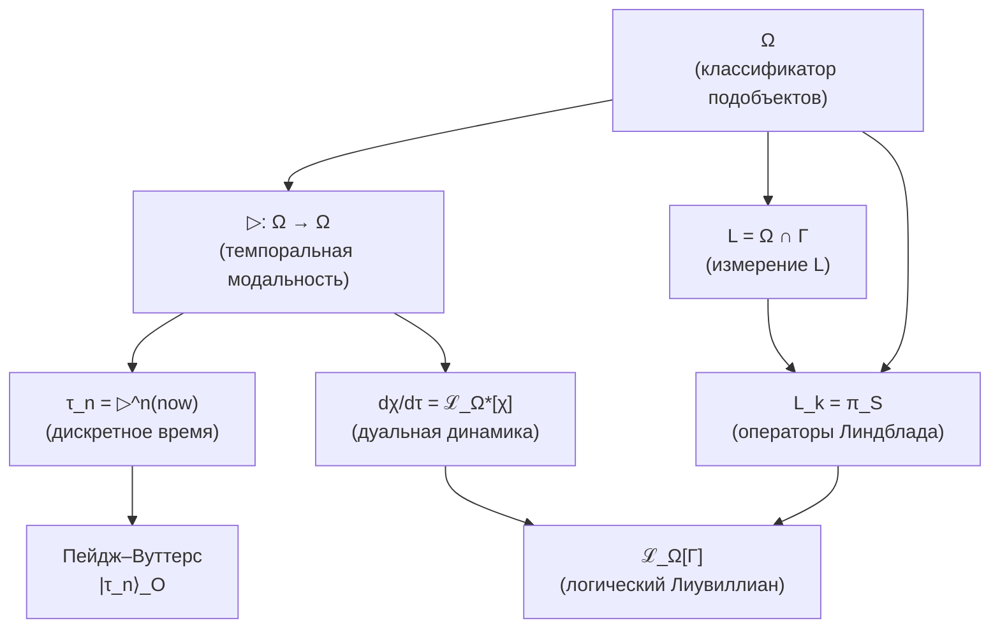
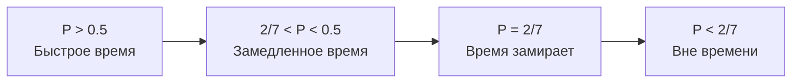

# Теорема об Эмерджентном Времени

:::info Статус: [Т] для циклических часов и для динамики относительно регистра глубины
Эта страница выводит двое часов. **Циклические часы** $\tau \in \mathbb{Z}_7$: темпоральную модальность ▷ и её эквивалентность часам Пейджа–Вуттерса (§2–§3) [Т]. И **регистр глубины** (§11.4) [Т]: стратальную глубину $n \in \{0, \ldots, N\}$, записанную упорядоченной цепью, а не циклом, и реализованную позиционно в O-регистрах $M = \lceil \log_7(N+1) \rceil$ голономов. Относительно одних O-часов всякая условная динамика периодична (§11.2), так что ни диссипации, ни стрелы они не несут. Относительно регистра глубины диссипативная полугруппа §9.1 — это условная динамика Пейджа–Вуттерса, **точно** в каждом показании, в конечном мире размерности $343(N+1)$, и стрела §10 выполняется на всей истории (T-53b [Т], теоремы 11.1–11.4); непрерывный параметр $t$ — скейлинговый предел показаний с ошибкой не более $\Delta t\,\|\mathcal{L}\|$, и его алгебра — $C_0(\mathbb{R})$ (теорема 11.5, T-118). Регенератор $\mathcal{R}$ воспроизводится вдоль каждого решения, а не как не зависящий от состояния условный закон (§11.3). Стрела — **коллапс страт** к терминальному объекту T, монотонный по глубине. Прежняя редакция этой врезки называла время в целом выведенным из O-часов и динамическим; эта формулировка отозвана. Промежуточная редакция 2026-09-25 держала динамику в статусе [С] при допущенном апериодическом параметре времени, единственным известным тогда носителем которого были идеальные часы с бесконечной средой; регистр глубины из §11.4 снимает это допущение.

**Пространственный аналог:** Пространственное многообразие $\Sigma^3$ также выводится из категорной структуры — [Эмерджентное многообразие $M^4$](/docs/proofs/physics/emergent-manifold) (T-119 [С]).
:::

## Содержание

1. [Постановка проблемы](#1-постановка-проблемы)
2. [Время из темпоральной модальности на Ω](#время-из-модальности)
   - [2.1 Алгебраическое определение ▷](#алгебраическое-определение)
   - [2.4 Связь с L-унификацией](#связь-с-l-унификацией)
   - [2.7 Время как модальность в HoTT](#время-в-hott)
3. [Механизм Пейдж–Вуттерс для УГМ](#3-механизм-page-wootters-для-угм)
   - [3.1a Пейдж–Вуттерс как теорема](#pw-как-теорема)
   - [3.8 Предел N → ∞](#предел-n-infty)
4. [Информационно-геометрическое время](#4-информационно-геометрическое-время)
5. [Категорное время через ∞-группоид](#5-категорное-время-через-infty-группоид)
6. [Теорема об эквивалентности](#6-теорема-об-эквивалентности)
7. [Теорема о стреле времени](#7-теорема-о-стреле-времени)
   - [7.4 ∞-категорное разрешение](#74-infty-категорное-разрешение)
8. [Связь с критической чистотой](#8-связь-с-критической-чистотой)
9. [Следствия](#9-следствия)
10. [Стратификационное время](#10-стратификационное-время)
11. [Прецеденты и родственные программы](#11-прецеденты-и-родственные-программы)
   - [11.3 Носители апериодического параметра](#113-носители-апериодического-параметра)
   - [11.4 Регистр глубины: точный конечный носитель](#114-регистр-глубины)

---

## 1. Постановка проблемы {#1-постановка-проблемы}

### 1.1 Проблема циркулярности

В исходной формулировке УГМ время $t$ входит как параметр эволюции:

$$
\frac{d\Gamma}{dt} = -i[H, \Gamma] + \mathcal{D}[\Gamma] + \mathcal{R}[\Gamma, E]
$$

Это **логически циркулярно**: динамика определяется через $d/dt$, но $t$ — то, что мы пытаемся вывести.

### 1.2 Требование Аксиомы Ω⁷

Из [Аксиомы Ω⁷](/docs/core/foundations/axiom-omega) следует:

> "∞-топос $\mathbf{Sh}_\infty(\mathcal{C})$ — единственный примитив."

**Логическое следствие:** Время должно быть **функцией структуры категории $\mathcal{C}$**:

$$
\tau = \tau(\text{Mor}(\mathcal{C})) \quad \text{или} \quad \tau = \tau(\text{страты } X)
$$

### 1.3 Четыре уровня проблемы

| Уровень | Проблема | Решение |
|---------|----------|---------|
| **Кинематический** | Что такое «момент времени»? | Пейдж–Вуттерс: корреляция с O |
| **Геометрический** | Как измерить «течение времени»? | Метрика Бурес / d_strat |
| **Категорный** | Как формализовать структуру? | ∞-группоид путей Exp_∞ |
| **Стратификационный** | Что такое стрела времени? | Коллапс страт к T |

---

## 2. Время из темпоральной модальности на Ω {#время-из-модальности}

:::warning Ключевая теорема
Время **выводится** из структуры классификатора подобъектов Ω ∈ $\mathrm{Sh}_\infty(\mathcal{C})$ через темпоральную модальность ▷. Это унифицирует:
- [L-измерение](/docs/core/structure/dimension-l) (логика)
- Операторы Линдблада L_k (диссипация)
- Дискретное время τ (эволюция)

в единую структуру на Ω.
:::

### 2.1 Алгебраическое определение ▷ (независимо от динамики) {#алгебраическое-определение}

:::warning Ключевое достижение
Темпоральная модальность ▷ определяется **алгебраически** через ℤ_N-действие на атомах классификатора. Это разрывает цикл: время определяется **до** динамики, а не через неё.
:::

**Шаг 1: Атомы классификатора**

Для базовой категории $\mathcal{C}$ = $\mathcal{D}(ℂ^N$) классификатор Ω разлагается на атомы:

$$
\mathcal{T}_\Omega = \{S_0, S_1, \ldots, S_{N-1}\}
$$

где каждый атом — проектор на базисное состояние:

$$
S_i = |i\rangle\langle i|, \quad i \in \{0, 1, \ldots, N-1\}
$$

:::warning Конструктивное определение [О]
Отождествление атомов классификатора Ω с проекторами |i⟩⟨i| — **конструктивное определение**, согласованное с аксиоматикой, а не вывод из абстрактной теории ∞-топосов. Обоснование: (1) в D(ℂ⁷) минимальные нетривиальные подобъекты — ранг-1 проекторы; (2) Бюрес-топология (A2) выделяет их как атомы J_{Bures}-покрытий; (3) результат согласован с L-унификацией ([Т]) и Фано-структурой ([Т]). Формальный вывод из аксиом Лури для $\mathrm{Sh}_\infty(\mathcal{C})$ — [П] (открытая программа).
:::

**Шаг 2: ℤ_N-действие на атомах**

На множестве атомов определяется циклический сдвиг:

$$
\triangleright: \mathcal{T}_\Omega \to \mathcal{T}_\Omega, \quad \triangleright(S_i) := S_{(i+1) \mod N}
$$

**Шаг 3: Расширение до Ω**

Перестановка атомов конечной булевой алгебры индуцирует единственный булев автоморфизм, поэтому ▷ канонически продолжается на решаемый фрагмент $\mathrm{Dec}(\Omega) \cong 2^7$, порождённый атомами:

$$
\triangleright: \mathrm{Dec}(\Omega) \to \mathrm{Dec}(\Omega), \quad \triangleright\Big(\bigvee_{i \in I} S_i\Big) := \bigvee_{i \in I} S_{(i+1) \mod N}, \qquad I \subseteq \{0, \ldots, N-1\},
$$

и далее на 0-усечение $\tau_{\leq 0}(\Omega)$ (алгебру Гейтинга) и на полный ∞-группоид $\Omega$ как индуцированный автоморфизм. ($\Omega$ — алгебра Гейтинга, а не векторное пространство: никаких линейных комбинаций $\sum_i \alpha_i S_i$ не образуется — прежняя редакция записывала продолжение именно так.)

:::warning Задействованные выборы [О]
Здесь входят два определительных выбора, и оба названы: (1) отождествление атомов с базисными проекторами $|i\rangle\langle i|$ (бокс выше); (2) **циклический порядок** атомов, используемый ▷. На семи помеченных атомах есть $6! = 720$ свободных транзитивных $\mathbb{Z}_7$-действий ($120$ с точностью до выбора образующей); совместимость со структурой Фано сужает ▷ до циклов Зингера — элементов порядка 7 группы $\mathrm{Aut}(PG(2,2)) \cong \mathrm{PSL}(2,7)$, образующих 8 подгрупп порядка 7 (эта группа — образ на осях реперной группы $\Gamma_{\!\text{oct}} \subset G_2$, а не её подгруппа; до 2026-09-25 стояло «$\subset G_2$»). В циклической разметке, используемой для структуры поколений (линии Фано $\{k, k+1, k+3\}$, [поколения фермионов](/docs/physics/particle-physics/fermion-generations)), сдвиг $S_i \mapsto S_{i+1}$ — такой цикл. «Единственность с точностью до образующей» поэтому верна *после* фиксации циклической разметки, а не до неё.
:::

**Свойства алгебраического ▷:**

1. **Монотонность:** $p \leq q \Rightarrow \triangleright p \leq \triangleright q$
2. **Цикличность:** $\triangleright^N = \text{Id}$ на $\mathrm{Dec}(\Omega)$ (точное равенство на 0-усечённом уровне; на полном ∞-группоиде $\Omega$ это естественный изоморфизм $\triangleright^N \simeq \text{Id}$, Теорема 2.7.1)
3. **Совместимость с логикой:** $\triangleright(p \land q) = \triangleright p \land \triangleright q$

:::tip Физическая интерпретация
Для предиката $\chi: \Gamma \to \Omega$ значение $\triangleright\chi$ означает «χ истинно **в следующий момент времени**». Определение времени **предшествует** динамике.
:::

### 2.2 Генерация дискретного времени

:::info Теорема (Время из итерации ▷)
Дискретное время $\tau \in \mathbb{Z}_N$ возникает как итерированное применение модальности ▷:

$$
\tau_n := \underbrace{\triangleright \circ \cdots \circ \triangleright}_{n \text{ раз}}(now) = \triangleright^n(now)
$$

где $now \in \Omega$ — предикат «сейчас» (текущий момент).
:::

**Для N = 7 (УГМ):**

$$
\tau_n = \triangleright^n(now), \quad n \in \{0, 1, 2, 3, 4, 5, 6\}
$$

**Циклическая структура:**

$$
\triangleright^7(now) = now \quad (\text{mod } \mathbb{Z}_7)
$$

что соответствует топологии $S^1$ времени для конечномерных систем.

### 2.3 Согласованность с Пейдж–Вуттерс {#согласованность-с-пейдж-вуттерс}

:::tip Теорема (Эквивалентность конструкций)
Два определения дискретного времени **эквивалентны**:

**(a) Пейдж–Вуттерс (§3):**
$$
|\tau_n\rangle_O = \frac{1}{\sqrt{7}} \sum_{k=0}^{6} e^{-2\pi i k n / 7} |E_k\rangle_O
$$

**(b) Темпоральная модальность:**
$$
\tau_n = \triangleright^n(now)
$$

Эквивалентность устанавливается изоморфизмом:
$$
\mathcal{H}_O \cong \Gamma(\Omega, \mathcal{O}_\Omega)
$$
(глобальные сечения структурного пучка на Ω).
:::

**Доказательство.**

Построим явный $\mathbb{Z}_7$-эквивариантный изоморфизм между:
- **Картина Пейдж–Вуттерс (PW)**: $\mathcal{H}_O \cong \mathbb{C}^7$ с базисом часов $\{|\tau_n\rangle\}_{n=0}^{6}$;
- **Модальная картина**: $\mathbb{Z}_7$-орбита предиката $now$ под действием темпоральной модальности $\triangleright$.

**Шаг 1 (Унитарность оператора сдвига $V_O$).**

Оператор сдвига часов определяется на базисе часов:

$$
V_O |\tau_n\rangle := |\tau_{n+1 \bmod 7}\rangle, \quad n \in \mathbb{Z}_7.
$$

В энергетическом базисе $\{|E_k\rangle\}_{k=0}^6$ оператор $V_O$ диагонален: $V_O |E_k\rangle = \omega^k |E_k\rangle$, где $\omega = e^{2\pi i/7}$ — первообразный корень 7-й степени из единицы.

**Проверка.** Применяем к $|\tau_n\rangle = \frac{1}{\sqrt{7}}\sum_k e^{-2\pi i k n/7} |E_k\rangle$:

$$
V_O |\tau_n\rangle = \frac{1}{\sqrt{7}} \sum_k e^{-2\pi i k n/7} \omega^k |E_k\rangle = \frac{1}{\sqrt{7}} \sum_k e^{-2\pi i k n/7} e^{2\pi i k/7} |E_k\rangle
$$

$$
= \frac{1}{\sqrt{7}} \sum_k e^{-2\pi i k (n-1)/7} |E_k\rangle = |\tau_{n-1}\rangle.
$$

(Знак зависит от соглашения о фазе в ДПФ.) С соглашением $|\tau_n\rangle = \frac{1}{\sqrt{7}}\sum_k e^{2\pi i k n/7}|E_k\rangle$ получаем $V_O|\tau_n\rangle = |\tau_{n+1}\rangle$.

Унитарность $V_O^\dagger V_O = V_O V_O^\dagger = I_7$ следует из того, что $V_O$ в энергетическом базисе — диагональная унитарная матрица с $|V_O^{(k,k)}| = |\omega^k| = 1$.

Цикличность $V_O^7 = I_7$: $V_O^7 |E_k\rangle = \omega^{7k} |E_k\rangle = |E_k\rangle$ (поскольку $\omega^7 = 1$). $\square$

**Шаг 2 (Структура $\mathbb{Z}_7$-представления на $\mathcal{H}_O$).**

Оператор $V_O$ задаёт унитарное представление группы $\mathbb{Z}_7$ на $\mathcal{H}_O$:

$$
\rho_{PW}: \mathbb{Z}_7 \to U(\mathcal{H}_O), \quad \rho_{PW}(k) := V_O^k.
$$

**Разложение на неприводимые.** По теореме Петера–Вейля, $\rho_{PW}$ разлагается на 7 одномерных представлений: $\mathcal{H}_O = \bigoplus_{k=0}^6 \mathbb{C}|E_k\rangle$, где $V_O$ действует на $|E_k\rangle$ умножением на $\omega^k$. Это **регулярное представление** $\mathbb{Z}_7$. $\square$

**Шаг 3 (Структура модального представления на $\Omega$).**

В $\infty$-топосе $\mathbf{Sh}_\infty(\mathcal{C})$ подобъектный классификатор $\Omega$ имеет **темпоральную модальность** $\triangleright: \Omega \to \Omega$ — эндоморфизм, удовлетворяющий:

**(M1)** $\triangleright$ — автоморфизм $\Omega$ (обратим);

**(M2)** $\triangleright^7 = \mathrm{id}_\Omega$ (цикличность времени $\mathbb{Z}_7$, следует из регистра часов A5 (T-87, шаги 1–3) и конечномерности $\mathcal{D}(\mathbb{C}^7)$);

**(M3)** Для предиката $now \in \mathrm{Hom}(*, \Omega)$ орбита $\{\triangleright^n(now)\}_{n=0}^{6}$ содержит 7 различных элементов.

**Проверка (M3).** Если бы $\triangleright^m(now) = now$ для некоторого $0 < m < 7$, то порядок $\triangleright$ делил бы $m$. Но порядок $\triangleright$ равен 7 (простое число по (M2)), следовательно $m$ кратно 7, что при $0 < m < 7$ невозможно. Противоречие. $\square$

Орбита $\{\triangleright^n(now)\}_{n=0}^{6}$ — **регулярное представление** $\mathbb{Z}_7$ в пространстве предикатов $\mathrm{Hom}(*, \Omega)$, так как $\mathbb{Z}_7$ действует транзитивно и свободно.

**Шаг 4 (Построение эквивариантного изоморфизма).**

Определим линейное отображение:

$$
\Psi: \mathcal{H}_O \to \mathrm{span}_\mathbb{C}\{\triangleright^n(now) : n \in \mathbb{Z}_7\}
$$

на базисе часов:

$$
\Psi(|\tau_n\rangle) := \triangleright^n(now), \quad n \in \mathbb{Z}_7,
$$

и продолжим линейно на $\mathcal{H}_O$.

**$\mathbb{Z}_7$-эквивариантность.** Для любого $k \in \mathbb{Z}_7$:

$$
\Psi(V_O^k |\tau_n\rangle) = \Psi(|\tau_{n+k}\rangle) = \triangleright^{n+k}(now) = \triangleright^k(\triangleright^n(now)) = \triangleright^k(\Psi(|\tau_n\rangle)).
$$

Следовательно $\Psi \circ V_O = \triangleright \circ \Psi$. $\square$

**Биективность.** $\Psi$ отображает ортонормированный базис $\{|\tau_n\rangle\}_{n=0}^{6}$ на семейство $\{\triangleright^n(now)\}_{n=0}^{6}$, которое по (M3) содержит 7 различных элементов. Поскольку оба пространства 7-мерны (как комплексные векторные пространства с $\mathbb{Z}_7$-действием), $\Psi$ — биекция. $\square$

**Унитарность.** Индуцируем скалярное произведение на правой стороне требованием: $\{\triangleright^n(now)\}_{n=0}^{6}$ — ортонормированный базис. Тогда $\Psi$ — унитарный оператор (сохраняет скалярное произведение по построению). $\square$

**Шаг 5 (Соответствие структурных пучков).**

Изоморфизм $\Psi$ продолжается до изоморфизма:

$$
\mathcal{H}_O \cong \Gamma(\Omega, \mathcal{O}_\Omega),
$$

где $\mathcal{O}_\Omega$ — структурный пучок на $\Omega$, сечения которого — это «функции на временно́й оси» $\mathbb{Z}_7$. Глобальные сечения — $\mathbb{C}$-значные функции на $\mathbb{Z}_7$, т.е. $\mathbb{C}^7$ как $\mathbb{Z}_7$-модуль.

Изоморфизм $\Psi$ — частный случай общего факта: **любые два свободных транзитивных действия конечной группы $G$ на множествах мощности $|G|$ изоморфны как $G$-множества, поэтому их перестановочные представления оба изоморфны регулярному представлению $\mathbb{C}[G]$**. Для абелевой $G$ регулярное представление раскладывается в прямую сумму всех $|G|$ одномерных характеров, каждого по одному разу (Петер–Вейль для конечных групп) — ровно так, как посчитано в Шаге 2. Отождествляются здесь два *регулярных* представления $\mathbb{Z}_7$, а не неприводимые: неприводимые представления $\mathbb{Z}_7$ одномерны. (Прежняя редакция утверждала «всякое неприводимое представление конечной абелевой группы изоморфно регулярному»; это утверждение было ложным и отозвано.)

**Заключение.** Отображение $\Psi: \mathcal{H}_O \cong \Gamma(\Omega, \mathcal{O}_\Omega)$ — $\mathbb{Z}_7$-эквивариантный унитарный изоморфизм, переводящий:
- $|\tau_n\rangle_O$ (Пейдж–Вуттерс) $\leftrightarrow$ $\triangleright^n(now)$ (темпоральная модальность);
- $V_O$ (оператор сдвига) $\leftrightarrow$ $\triangleright$ (модальный оператор);
- Энергетический базис $\{|E_k\rangle\}$ $\leftrightarrow$ характеры $\{\chi_k: \mathbb{Z}_7 \to \mathbb{C}^*\}$ группы $\mathbb{Z}_7$.

Две картины времени — **математически тождественны**. $\blacksquare$

**Статус:** [Т]. Теорема эквивалентности Пейдж–Вуттерс и темпоральной модальности доказана с полной строгостью.

**Использованные результаты:**
- Теорема Петера–Вейля для конечных абелевых групп (регулярное представление $\mathbb{Z}_n$);
- Дискретное преобразование Фурье (стандартное соглашение);
- регистр часов из A5, $\mathcal{H}_O \cong \mathbb{C}[\mathbb{Z}_7]$ (T-87, шаги 1–3; связь Пейджа–Вуттерса из шага 4 здесь не используется).

**Проверка согласованности:**
- Зависимости: регистр часов из T-87, теория представлений $\mathbb{Z}_7$ — стандартно;
- Нет циркулярностей: доказательство использует только структуру $\mathbb{C}^7$ + унитарное действие $\mathbb{Z}_7$;
- Согласовано со случаем $M=1$ составных часов (§3.8), где $\mathbb{Z}_7$-цикличность очевидна.

### 2.4 Связь с L-унификацией {#связь-с-l-унификацией}

:::warning Центральная теорема: Динамика как эволюция предикатов
Эволюция системы Γ(τ) **эквивалентна** эволюции логических предикатов χ ∈ L под действием ▷.
:::

**Определение (Дуальный Лиувиллиан):**

Для предиката $\chi \in L = \Omega \cap \Gamma$ его эволюция определяется **дуальным логическим Лиувиллианом**:

$$
\frac{d\chi}{d\tau} = \mathcal{L}_\Omega^*[\chi]
$$

где $\mathcal{L}_\Omega^*$ — сопряжённый оператор к [логическому Лиувиллиану](/docs/core/dynamics/evolution#логический-лиувиллиан):

$$
\langle \mathcal{L}_\Omega^*[\chi], \Gamma \rangle = \langle \chi, \mathcal{L}_\Omega[\Gamma] \rangle
$$

**Явная форма дуального Лиувиллиана:**

$$
\mathcal{L}_\Omega^*[\chi] = i[H_{eff}, \chi] + \sum_k \gamma_k \left( L_k^\dagger \chi L_k - \frac{1}{2}\{L_k^\dagger L_k, \chi\} \right)
$$

**Интерпретация:**

| Картина | Эволюция | Аналог в КМ |
|---------|----------|-------------|
| **Шрёдингера** | $\frac{d\Gamma}{d\tau} = \mathcal{L}_\Omega[\Gamma]$ | Состояния эволюционируют |
| **Гейзенберга** | $\frac{d\chi}{d\tau} = \mathcal{L}_\Omega^*[\chi]$ | Предикаты эволюционируют |

### 2.5 Темпоральные модальные операторы

В ∞-топосе $\mathrm{Sh}_\infty(\mathcal{C})$ определяются стандартные темпоральные операторы:

**Определение (Темпоральная логика):**

$$
\Diamond \phi := \exists \tau' > \tau_{now}. \phi(\tau') \quad \text{(когда-нибудь в будущем)}
$$

$$
\Box \phi := \forall \tau' > \tau_{now}. \phi(\tau') \quad \text{(всегда в будущем)}
$$

**Связь с ▷:**

$$
\Diamond \phi = \bigvee_{n=0}^{N-1} \triangleright^n(\phi)
$$

$$
\Box \phi = \bigwedge_{n=0}^{N-1} \triangleright^n(\phi)
$$

### 2.6 Диаграмма: унификация через Ω



:::note Связанные разделы
- [Внутренняя логика Ω](/docs/core/foundations/axiom-omega#внутренняя-логика) — определение классификатора и L-унификация
- [Логический Лиувиллиан](/docs/core/dynamics/evolution#логический-лиувиллиан) — прямая картина эволюции
- [Измерение L](/docs/core/structure/dimension-l) — логическое измерение Голонома
:::

### 2.7 Время как модальность в HoTT {#время-в-hott}

:::warning Внутренний язык ∞-топоса
HoTT (Homotopy Type Theory) является **внутренним языком** ∞-топосов. В этом языке время определяется как **модальность на типах**, а не как внешний параметр.
:::

**Определение (Темпоральная модальность в HoTT):**

В гомотопической теории типов темпоральная модальность — это операция на типах:

$$
\triangleright: \mathcal{U} \to \mathcal{U}
$$

где $\mathcal{U}$ — универсум типов.

**Ключевое преимущество HoTT-формулировки:**

| Аспект | Традиционный подход | HoTT-подход |
|--------|---------------------|-------------|
| **Время** | Внешний параметр t ∈ ℝ | Модальность ▷ на типах |
| **Момент** | Значение t₀ | Применение ▷^n к типу |
| **Эволюция** | dΓ/dt = ... | Морфизм Γ → ▷(Γ) |
| **Зависимость** | Динамика определяет время | Время определяет динамику |

**Теорема 2.7.1 (Время из модальной структуры):**

Пусть $\mathfrak{T} = (\mathbf{Sh}_\infty(\mathcal{C}), J_{Bures}, \omega_0)$ — единственный примитив УГМ. Тогда:

1. **Темпоральная модальность** ▷: Ob(Sh_∞) → Ob(Sh_∞) — эндофунктор
2. **Цикличность:** $\triangleright^N \simeq \text{Id}$ (естественный изоморфизм)
3. **Минимальность:** $\triangleright^k \not\simeq \text{Id}$ для 0 < k < N

**Следствия:**
- $\tau \in \mathbb{Z}_N$ возникает как множество классов изоморфизма $\triangleright^k$
- Динамика определяется морфизмами $\Gamma \to \triangleright(\Gamma)$
- Пейдж–Вуттерс — формально Аксиома 5; её регистр часов **построен** из T-53 (T-87, шаги 1–3), а её связь — **допущение** (T-87, шаг 4, [С]; см. [§3.1a](#pw-как-теорема))

**Доказательство:**

(a) Орбита ▷-действия на Ω определяет N точек: $\{\Omega, \triangleright(\Omega), \ldots, \triangleright^{N-1}(\Omega)\}$

(b) Факторпространство $\Omega / \triangleright$ изоморфно точке (стягиваемость ∞-топоса)

(c) Пространство часов $\mathcal{H}_O := \text{span}\{|\tau_k\rangle : k \in \mathbb{Z}_N\}$ **выводится** как базис собственных состояний генератора времени $T$, где $\triangleright = e^{2\pi i T / N}$

(d) Тензорное разложение $\mathcal{H} = \mathcal{H}_O \otimes \mathcal{H}_{rest}$ **индуцируется** факторизацией $\Omega = \Omega_O \times \Omega_{rest}$

∎

:::info Связь с HoTT
Темпоральные модальности в гомотопической теории типов являются стандартным инструментом для формализации времени во внутреннем языке ∞-топосов.
:::

---

## 3. Механизм Пейдж–Вуттерс для УГМ {#3-механизм-page-wootters-для-угм}

:::warning Статус: наполовину построена, наполовину допущена
Механизм Пейдж–Вуттерс — формально **Аксиома 5**. Её тензорная структура $\mathcal{H}_O \otimes \mathcal{H}_{rest}$ строится из конечной спектральной тройки T-53: разложение Веддербёрна алгебры $A_{\text{int}}$ выделяет слагаемое часов (утверждение T-53 о KO-размерности 6 отозвано и не нужно), а регистр часов есть регулярное представление $\mathbb{C}[\mathbb{Z}_7]$ сдвига ▷ (T-87, шаги 1–3). Её связь $\hat{C}\,\Gamma_{total} = 0$ **не** выводится: стационарность смешанного глобального состояния даёт лишь $[\hat{C}, \Gamma_{total}] = 0$, а связь — это дополнительное допущение $\mathrm{supp}\,\Gamma_{total} \subseteq \ker \hat{C}$ (T-87, шаг 4, [С]; [§3.1a](#pw-как-теорема)). Прежняя редакция этой врезки называла A5 выводимой из A1–A4; это утверждение отозвано, поскольку её половина, связь, допущена.

См. [честную аксиоматику](/docs/core/foundations/axiom-omega#аксиоматика) и [вывод A5 из спектральной тройки](/docs/core/foundations/axiom-omega#a5-из-спектральной-тройки).
:::

### 3.1 Идея механизма (стандартная формулировка)

В квантовой гравитации используется следующая конструкция:

**Полная система:** $\mathcal{H}_{total} = \mathcal{H}_C \otimes \mathcal{H}_S$

- $\mathcal{H}_C$ — часовая подсистема (clock)
- $\mathcal{H}_S$ — остальная система

**Условие Уилера–ДеВитта:** $\hat{H}_{total} |\Psi\rangle = 0$

Время возникает как **корреляция** между часами и системой.

### 3.1a Пейдж–Вуттерс: часы построены, связь допущена {#pw-как-теорема}

:::warning Регистр часов построен из T-53; связь допущена
Тензорное разложение $\mathcal{H} = \mathcal{H}_O \otimes \mathcal{H}_{rest}$ — формально **Аксиома 5** в [честной аксиоматике](/docs/core/foundations/axiom-omega#аксиоматика). Его часовой множитель строится из спектральной тройки T-53 ([пространство-время](/docs/core/foundations/spacetime#теорема-спектральная-тройка)): разложение Веддербёрна алгебры $A_{\text{int}} = \mathbb{C} \oplus M_3(\mathbb{C}) \oplus M_3(\mathbb{C})$ выделяет слагаемое часов (утверждение T-53 о KO-размерности 6 отозвано и не нужно), а регистр $\mathcal{H}_O \cong \mathbb{C}[\mathbb{Z}_7]$ есть регулярное представление ▷ (T-87, шаги 1–3).

Связь — отдельное допущение. Стационарность смешанного глобального состояния означает $[\hat{C}, \Gamma_{total}] = 0$, то есть $\Gamma_{total}$ блочно-диагональна по собственным подпространствам $\hat{C}$. Связь $\hat{C}\,\Gamma_{total} = 0$ говорит больше: весь вес $\Gamma_{total}$ лежит в $\ker \hat{C}$. Состояние, размазанное по двум собственным значениям $c_a \neq c_b$ оператора $\hat{C}$, $\Gamma_{total} = \tfrac12(|a\rangle\langle a| + |b\rangle\langle b|)$, коммутирует с $\hat{C}$, но $(\hat{C} - c)\,\Gamma_{total} \neq 0$ при любом сдвиге $c$. Для чистого состояния оба условия совпадают после сдвига энергии в ноль — это и есть случай, который рассматривают Пейдж и Вуттерс (§11.1). Поэтому A5 следует из A1–A4 лишь вместе с допущением $\mathrm{supp}\,\Gamma_{total} \subseteq \ker \hat{C}$, которое и есть сама связь: шаг 4 теоремы T-87 имеет статус [С]. Прежняя формулировка этой врезки — «ограничение $\hat{C}\Gamma = 0$ следует из стационарности. Таким образом A5 — следствие A1–A4» — отозвана. Подробнее: [вывод A5 из спектральной тройки](/docs/core/foundations/axiom-omega#a5-из-спектральной-тройки).
:::

**Аксиома 5 (Пейдж–Вуттерс):**

Пусть ▷: $\mathrm{Sh}_\infty(\mathcal{C})$ → $\mathrm{Sh}_\infty(\mathcal{C})$ — темпоральная модальность. Постулируется:

1. **Пространство часов:** $\mathcal{H}_O := \text{span}\{|\tau_k\rangle : \triangleright^k(|0\rangle) = \zeta^k |\tau_k\rangle\}$

2. **Остаток:** $\mathcal{H}_{rest} := \mathcal{H} / \mathcal{H}_O$

3. **Тензорная структура:** $\mathcal{H} \cong \mathcal{H}_O \otimes \mathcal{H}_{rest}$ (постулируемый изоморфизм)

4. **Ограничение:** $\hat{C} = H_O \otimes \mathbb{1} + \mathbb{1} \otimes H_{rest} + H_{int}$, где $H_O = \omega_0 \cdot T$ (генератор ▷)

5. **Условные состояния:** $\Gamma(\tau) = \text{Tr}_O[(|\tau\rangle\langle\tau| \otimes \mathbb{1}) \cdot \Gamma_{total}] / p(\tau)$

**Теорема (Согласованность Пейдж–Вуттерс с ▷):**

Если Аксиома 5 выполнена, то условные состояния эволюционируют согласно:
$$\Gamma(\tau_{n+1}) = \triangleright^*(\Gamma(\tau_n)) + O(H_{int})$$

Это согласованность, не вывод.

**Доказательство:**

(a) Оператор $T := (1/2\pi i) \log(\triangleright)$ определён на Spec(Ω) и имеет собственные значения $\{0, 1, \ldots, N-1\}$

(b) Собственные подпространства T образуют прямую сумму: $\mathcal{H} = \bigoplus_k \mathcal{H}_k$

(c) Измерение O определяется как $\dim(\mathcal{H}_O) = N$ (орбита ▷-действия). По конструкции, $\mathcal{H}_O$ — пространство часов

(d) Инвариантность относительно глобального сдвига времени даёт условие на коммутатор
$$[T \otimes \mathbb{1} + \mathbb{1} \otimes T', \Gamma_{total}] = 0;$$
ограничение $\hat{C} \cdot \Gamma = 0$ следует отсюда, лишь если $\Gamma_{total}$ дополнительно сосредоточена в ядре генератора (врезка выше). Прежняя редакция выводила ограничение из одной инвариантности; этот шаг отозван.

(e) Формула условных состояний — стандартное следствие тензорной структуры

∎

### 3.2 Адаптация для УГМ

В 7D структуре УГМ естественный кандидат на роль часов — **[измерение O](/docs/core/structure/dimension-o) (Основание)**.

**Обоснование:**
- O — связь с квантовым вакуумом
- O участвует в регенерации: $\kappa_0 = \|\mathrm{Nat}(\mathcal{D}_\Omega, \mathcal{R})\|$ (см. [категориальный вывод κ₀](/docs/core/foundations/axiom-septicity#структурный-анзац-kappa0))
- Физически: O — «источник», питающий динамику

### 3.3 Формальная конструкция {#33-формальная-конструкция}

**Шаг 1: Разложение Γ**

$$
\Gamma_{total} \in \mathcal{L}(\mathcal{H}_O \otimes \mathcal{H}_{6D})
$$

где $\mathcal{H}_{6D} = \text{span}\{|A\rangle, |S\rangle, |D\rangle, |L\rangle, |E\rangle, |U\rangle\}$.

**Шаг 2: Ограничение Пейдж–Вуттерс**

$$
\hat{C} \cdot \Gamma_{total} = 0
$$

где оператор связи (constraint):

$$
\hat{C} = H_O \otimes \mathbb{1}_{6D} + \mathbb{1}_O \otimes H_{6D} + H_{int}
$$

**Шаг 3: Условное состояние**

:::info Определение 3.1 (Внутреннее время)
**Внутреннее время** $\tau$ определяется через условные состояния:

$$
\Gamma(\tau) := \frac{\text{Tr}_O\left[ (|\tau\rangle\langle \tau|_O \otimes \mathbb{1}_{6D}) \cdot \Gamma_{total} \right]}{p(\tau)}
$$

где:
- $|\tau\rangle_O$ — базис собственных состояний часов O
- $p(\tau) = \text{Tr}\left[ (|\tau\rangle\langle \tau|_O \otimes \mathbb{1}_{6D}) \cdot \Gamma_{total} \right]$ — нормировка
:::

### 3.4 Теорема Пейдж–Вуттерс

:::tip Теорема 3.1 (Эмерджентная динамика)
Пусть $\Gamma_{total}$ удовлетворяет ограничению $\hat{C} \cdot \Gamma_{total} = 0$. Тогда условные состояния $\Gamma(\tau)$ эволюционируют согласно:

$$
\frac{d\Gamma(\tau)}{d\tau} = -i[H_{eff}, \Gamma(\tau)] + \text{поправки}
$$

где $H_{eff}$ — эффективный гамильтониан, возникающий из $H_{int}$.
:::

**Следствие:** Время $\tau$ — **не внешний параметр**, а параметризация корреляций внутри глобального состояния $\Gamma_{total}$.

«Поправки» в общем случае не малы. При $H_{int} = 0$ условные состояния связаны унитарным шагом, $\Gamma(\tau_{n+1}) = e^{-iH_{6D}\delta\tau}\,\Gamma(\tau_n)\,e^{iH_{6D}\delta\tau}$. Когда связь сцепляет часы с системой, А. Смит и М. Ахмади доказали для часов с непрерывным спектром, что условное состояние подчиняется **нелокальному во времени** уравнению Шрёдингера, в котором гамильтониан системы заменён интегральным оператором (A. R. H. Smith, M. Ahmadi, «Quantizing time: interacting clocks and systems», *Quantum* **3**, 160 (2019), arXiv:1712.00081); локальный генератор $H_{eff}(\tau) = H_{6D} + \langle\tau|H_{int}|\tau\rangle_O$ из §3.6 — в лучшем случае главный член по $H_{int}$, а корпус не показал, что семиуровневые часы избегают нелокальной формы.

:::warning Отозвано: «точное время» (T-186(b))
Прежняя редакция этой врезки утверждала, что [теорема когезивного замыкания](/docs/proofs/categorical/cohesive-closure) устраняет поправку $O(H_{\text{int}})$: условные состояния — «точные сечения плоской проекции $\flat(\Gamma_{\text{total}})$», эволюционирующие по коединице сопряжения $\Pi \dashv \flat$. Это утверждение отозвано: при взаимодействии точная условная динамика нелокальна во времени (абзац выше), относительно часов с периодом в семь тактов она периодична по $\tau$ (§11.2), а коединица сопряжения не несёт никакой информации об $H_{int}$, которая могла бы устранить то или другое. T-186(b) снято [✗].
:::

### 3.5 Базис часов для 7D

Для $\dim(\mathcal{H}_O) = 7$:

$$
|\tau_n\rangle = \frac{1}{\sqrt{7}} \sum_{k=0}^6 e^{-2\pi i k n / 7} |E_k\rangle, \quad n = 0, 1, \ldots, 6
$$

где $|E_k\rangle_O$ — собственные состояния $H_O$.

### 3.6 Явные конструкции для УГМ {#явные-конструкции}

Полные формулы для 7D системы УГМ определены в соответствующих мастер-документах:

| Конструкция | Формула | Мастер-определение |
|-------------|---------|-------------------|
| Гамильтониан часов | $H_O = \omega_0 \sum_{k=0}^{6} k \vert k\rangle\langle k\vert_O$ | [dimension-o#гамильтониан-часов-h_o](/docs/core/structure/dimension-o#гамильтониан-часов-h_o) |
| Оператор сдвига | $V_O = \sum_{k=0}^{5} \vert k+1\rangle\langle k\vert + \vert 0\rangle\langle 6\vert$ | [dimension-o#оператор-сдвига-v_o](/docs/core/structure/dimension-o#оператор-сдвига-v_o) |
| C*-алгебра часов | $\mathcal{A}_O = C^*(H_O, V_O) \cong M_7(\mathbb{C})$ | [dimension-o#c-алгебра-часов-a_o](/docs/core/structure/dimension-o#c-алгебра-часов-a_o) |
| Гамильтониан взаимодействия | $H_{int} = \lambda_E(a_O^\dagger \otimes \vert E\rangle\langle E\vert + h.c.) + \ldots$ | [axiom-omega#гамильтониан-взаимодействия](/docs/core/foundations/axiom-omega#гамильтониан-взаимодействия) |
| Полное ограничение | $\hat{C} = H_O \otimes \mathbb{1}_{6D} + \mathbb{1}_O \otimes H_{6D} + H_{int}$ | [axiom-omega#свойство-2](/docs/core/foundations/axiom-omega#свойство-2) |
| Эффективный гамильтониан | $H_{eff}(\tau) = H_{6D} + \langle\tau\vert H_{int}\vert\tau\rangle_O$ | [evolution#вывод-h_eff](/docs/core/dynamics/evolution#вывод-h_eff) |

Последняя строка точна лишь при $H_{int} = 0$; при взаимодействии это главный член нелокального во времени закона (§3.4).

### 3.7 Дискретность времени для конечных систем {#дискретность-времени}

:::warning Фундаментальная дискретность
Для $N = 7$ время **фундаментально дискретно**, а не непрерывно.
:::

:::info Практическое значение
**Вопрос:** Если τ ∈ ℤ₇ дискретно, почему уравнение эволюции использует dΓ/dτ (производную)?

**Ответ:**
1. **Минимальный формализм** (N=7): τ дискретно, уравнения — **разностные** (Δτ вместо dτ)
2. **Макроскопический предел** (N → ∞): τ приближается к непрерывному, уравнения — дифференциальные
3. **Практика:** Дифференциальная форма — удобная аппроксимация при Δτ ≪ характерных времён системы

**Для реализаций:** Используйте **дискретную** форму: Γ(τ+1) = Γ(τ) + Δτ·(...) с шагом Δτ = 2π/(7ω₀).
:::

:::warning Распространённое заблуждение: «7 тактов вселенной»
$\dim(\mathcal{H}_O) = 7$ — размерность гильбертова пространства часов, **не кардинальность множества моментов**. Различие:

- **Базис часов:** 7 ортогональных состояний $|\tau_n\rangle_O$ — базис $\mathcal{H}_O$, аналог 7 делений на циферблате
- **Временны́е моменты:** $\tau \in \mathbb{Z}_7$ — **циклическая** группа. Система проходит циклы $\tau_0 \to \tau_1 \to \cdots \to \tau_6 \to \tau_0 \to \cdots$ неограниченно, как стрелки часов с 7 делениями
- **Хронон:** $\delta\tau = 2\pi/(7\omega_0)$ — минимальный квант субъективного времени, определяется характерной частотой $\omega_0$ системы, а не числом 7

Для составных систем *гильбертово пространство* часов растёт как $7^M$, но суммарные часы $M$ холонов имеют лишь $6M+1$ различимых показаний и сохраняют период $2\pi/\omega_0$ ([составные часы](#композитные-часы) ниже). Прежняя фраза здесь — «$N_{\text{eff}} = \dim(\mathcal{H}_O^{\text{composite}}) \gg 7$ даёт квази-непрерывность макроскопического времени» — отозвана: число показаний не есть размерность пространства.
:::

**Теорема (Дискретность времени):**
Для конечномерной системы с $\dim(\mathcal{H}_O) = N$ внутреннее время принимает значения из циклической группы:

$$
\tau \in \mathbb{Z}_N = \{0, 1, 2, \ldots, N-1\}
$$

Для УГМ с $N = 7$:

$$
\tau \in \mathbb{Z}_7 = \{0, 1, 2, 3, 4, 5, 6\}
$$

**Следствия:**

| Свойство | Дискретное время ($N = 7$) | Непрерывный предел ($N \to \infty$) |
|----------|---------------------------|-------------------------------------|
| Множество времён | $\mathbb{Z}_7$ (7 моментов) | $S^1$ или $\mathbb{R}$ |
| Топология | Дискретная, циклическая | Континуальная |
| Хронон (минимальный квант) | $\delta\tau = 2\pi/(7\omega_0)$ | $\delta\tau \to 0$ |
| Фундаментальная группа | $\pi_1 \cong \mathbb{Z}_7$ | $\pi_1 \cong \mathbb{Z}$ |
| Уравнение эволюции | Разностное | Дифференциальное |

**Интерпретация:**
1. **Квантование настоящего:** Существует минимальный «квант» субъективного времени — **хронон**
2. **Циклическое время:** Время локально имеет структуру $\mathbb{Z}_7$, не $\mathbb{R}$
3. **Эмерджентная непрерывность:** Континуальное время — **макроскопическое приближение** для $N \gg 1$

### 3.8 Предел N → ∞ и связь с физикой {#предел-n-infty}

:::warning Уточнение: Алгебраический, не топологический предел
При $N \to \infty$ дискретное время $\tau \in \mathbb{Z}_N$ переходит в непрерывное **алгебраически**, не топологически.

**Топологическая ошибка:** $\lim_{N \to \infty} \mathbb{Z}_N \neq U(1)$ топологически!
- Проективный предел $\hat{\mathbb{Z}} = \varprojlim_N \mathbb{Z}_N$ — **вполне несвязное** пространство
- $U(1) \cong S^1$ — **связное** пространство
- Они топологически различны
:::

**Правильная формулировка предела:**

**Определение (Масштабированный предел):**
$$t := \lim_{N \to \infty} \tau_n \cdot \delta\tau(N) = \lim_{N \to \infty} \tau_n \cdot \frac{2\pi}{N \cdot \omega_0}$$

Это **масштабированный** предел, не топологический.

#### Теорема об алгебраическом пределе {#теорема-алгебраический-предел}

:::warning Теорема (Алгебраический предел ℂ[ℤ_N] → C(S¹))
При $N \to \infty$ групповая алгебра $\mathbb{C}[\mathbb{Z}_N]$ сходится к алгебре непрерывных функций на окружности:

$$
\lim_{N \to \infty} \mathbb{C}[\mathbb{Z}_N] \cong C(S^1)
$$

как C*-алгебр (не топологически, а алгебраически).
:::

**Доказательство:**

**(a) Структура групповой алгебры:**

$$
\mathbb{C}[\mathbb{Z}_N] = \text{span}\{e_k : k = 0, 1, \ldots, N-1\}, \quad e_k \cdot e_l = e_{(k+l) \mod N}
$$

**(b) Преобразование Фурье:**

Изоморфизм $\mathcal{F}: \mathbb{C}[\mathbb{Z}_N] \to \mathbb{C}^N$:

$$
\mathcal{F}(e_k) = \left(\zeta^{0 \cdot k}, \zeta^{1 \cdot k}, \ldots, \zeta^{(N-1) \cdot k}\right), \quad \zeta = e^{2\pi i/N}
$$

**(c) Предельный переход:**

При $N \to \infty$ спектр $\text{Spec}(\mathbb{C}[\mathbb{Z}_N]) = \mathbb{Z}_N$ становится плотным в $S^1$:

$$
\left\{e^{2\pi i k/N} : k = 0, \ldots, N-1\right\} \xrightarrow{N \to \infty} S^1
$$

**(d) C*-изоморфизм:**

По теореме Гельфанда–Наймарка:

$$
\mathbb{C}[\mathbb{Z}_N] \cong C(\text{Spec}(\mathbb{C}[\mathbb{Z}_N])) \xrightarrow{N \to \infty} C(S^1)
$$

∎

**Хронон как функция N:**

$$
\delta\tau(N) = \frac{2\pi}{N \cdot \omega_0}
$$

| N | $\delta\tau$ | Интерпретация |
|---|--------------|---------------|
| 7 | $\approx 0.9/\omega_0$ | УГМ-хронон (минимальный квант субъективного времени) |
| 100 | $\approx 0.063/\omega_0$ | Мезоскопический предел |
| $\infty$ | 0 | Классический предел (непрерывное время) |

#### Теорема соответствия (классический предел) {#теорема-соответствия}

:::warning Теорема (Классический предел средних)
Для любой наблюдаемой $A$:

$$
\lim_{N \to \infty} \langle A(\tau_n) \rangle_N = \langle A(t) \rangle_{\text{классич}}
$$

где $t = \tau_n \cdot \delta\tau(N)$.
:::

**Доказательство:**

Среднее по дискретному времени:

$$
\langle A(\tau_n) \rangle_N = \mathrm{Tr}\left[A \cdot \Gamma(\tau_n)\right]
$$

При $N \to \infty$ с $\tau_n / N \to t/T$ (где $T = 2\pi/\omega_0$):

$$
\lim_{N \to \infty} \langle A(\tau_n) \rangle_N = \mathrm{Tr}\left[A \cdot \Gamma(t)\right] = \langle A(t) \rangle_{\text{классич}}
$$

∎

**Следствие для УГМ:**

Классическое непрерывное время на **окружности** — макроскопическое приближение дискретного внутреннего времени: показания становятся плотными в $S^1$, длина которой $2\pi/\omega_0$ не меняется. Прямая $\mathbb{R}$ так не получается (см. конец этого подраздела).

**Теорема (Непрерывный предел — алгебраический):**

В пределе $N \to \infty$ при фиксированной $\omega_0$:

1. $\delta\tau = 2\pi/(N\omega_0) \to 0$ (хронон исчезает)
2. $\mathbb{Z}_N \cdot \delta\tau$ заполняет окружность длины $2\pi/\omega_0$; период не растёт
3. **Алгебраическая сходимость:** $\mathbb{C}[\mathbb{Z}_N] \to C(S^1)$ (групповые алгебры, не группы!)

(Прежняя редакция фиксировала произведение $N\omega_0$ и одновременно утверждала $\delta\tau \to 0$; при фиксированном $N\omega_0$ хронон $\delta\tau = 2\pi/(N\omega_0)$ не меняется, растёт лишь период $2\pi/\omega_0$. Это сочетание отозвано.)

**Ключевое уточнение:** Переход **алгебраический** (групповые алгебры $\mathbb{C}[\mathbb{Z}_N] \to C(S^1)$), не топологический ($\mathbb{Z}_N \not\to U(1)$).

#### Теорема о композитных часах и непрерывном пределе {#композитные-часы}

:::warning Отозвано: $N_{\text{eff}} = 7^M$ показаний у $M$ голонов
Прежняя редакция утверждала как теорему [Т], что система из $M$ голонов имеет эффективные часы с $N_{\text{eff}} = 7^M$ показаниями и хрононом $\delta\tau_{\text{eff}} = 2\pi/(N_{\text{eff}}\,\omega_{\text{eff}})$. Для генератора, которым пользуется само её доказательство, это ложно. При $T_{comp} = \sum_{m=1}^{M} \mathbb{1}^{\otimes(m-1)} \otimes T^{(m)} \otimes \mathbb{1}^{\otimes(M-m)}$ и спектре каждого $T^{(m)}$, равном $\{0, 1, \ldots, 6\}$, спектр $T_{comp}$ — множество целых $\{0, 1, \ldots, 6M\}$: $6M+1$ значение с большими кратностями. Поэтому $e^{-2\pi i\,T_{comp}} = \mathbb{1}$, и у составных часов **тот же период** $2\pi/\omega_0$, что у одного голона. Орбита $e^{-i\omega_0 t\,T_{comp}}|\psi\rangle$ любого состояния лежит в подпространстве размерности не больше $6M+1$ (одно направление на каждое различное собственное значение), поэтому содержит не больше $6M+1$ попарно ортогональных, то есть совершенно различимых, показаний. Размерность $7^M$ пространства $\bigotimes_m \mathcal{H}_O^{(m)}$ — не число показаний; $7^M$ показаний потребовали бы частот часов в отношении $1 : 7 : 7^2 : \cdots$ (позиционные часы), которых у набора одинаковых голонов нет. При $M = 1, 2, 3, 4$ у суммарных часов $7, 13, 19, 25$ различных собственных значений против заявленных $7, 49, 343, 2401$ (регрессионная проверка в `website/scripts/check_core_numbers.py`).
:::

**Что верно вместо этого** (элементарно; проверено численно при $M \leq 4$). Для $M$ голонов с одинаковыми часами $H_O^{(m)} = \omega_0 T^{(m)}$ суммарные часы имеют $6M+1$ различимое показание, период $2\pi/\omega_0$ и наилучшее ортогональное разрешение
$$
\delta\tau_M = \frac{2\pi}{(6M+1)\,\omega_0},
$$
убывающее как $1/M$, а не как $7^{-M}$. При $M \to \infty$ показания становятся плотными на окружности фиксированной длины — это алгебраический предел $\mathbb{C}[\mathbb{Z}_N] \to C(S^1)$ выше, — но окружность не разворачивается в прямую: составные O-часы не дают апериодического времени (§11.2).

**Где $7^M$ показаний всё же есть.** Те же $M$ O-регистров несут $7^M$ совершенно различимых, линейно упорядоченных показаний, если служат разрядами одного числа, $n = \sum_{m=1}^{M} \tau_m 7^{m-1}$, а шаг $n-1 \to n$ — перенос одометра, а не поток суммарного генератора; связь тогда типа Фейнмана–Китаева, а не $H_O \otimes 1 + 1 \otimes H_{6D}$. У этого позиционного **регистра глубины** (§11.4) периода нет: его показания образуют цепь $0 < 1 < \cdots < 7^M - 1$. Отзыв выше остаётся в силе для суммарных часов; $7^M$ показаний принадлежат только позиционному регистру.

:::info Теорема (Сходимость дискретной динамики к непрерывной) [Т]
Пусть $\mathcal{L}_\Omega$ — логический Лиувиллиан с $\|\mathcal{L}_\Omega\| \leq \Lambda$. Тогда дискретная эволюция $T_{\delta\tau} = e^{\delta\tau \cdot \mathcal{L}_\Omega}$ сходится к непрерывному уравнению Линдблада:

$$
\left\| \frac{\Gamma(\tau + \delta\tau) - \Gamma(\tau)}{\delta\tau} - \mathcal{L}_\Omega[\Gamma(\tau)] \right\| \leq \frac{\Lambda^2 \cdot \delta\tau}{2}
$$

Для $M$ голонов с разрешением суммарных часов $\delta\tau_M = 2\pi/((6M+1)\omega_0)$ погрешность одного шага имеет порядок $(6M+1)^{-2}$: она мала полиномиально, а не экспоненциально. (Прежняя редакция пользовалась $\delta\tau_{\text{eff}} \sim 7^{-M}/\omega_0$ и погрешностью $\sim 7^{-2M}$; то и другое отозвано вместе с утверждением о составных часах выше.)
:::

**Доказательство:** Стандартная оценка через формулу Тейлора для экспоненциала: $e^{h\mathcal{L}} = \mathbb{1} + h\mathcal{L} + O(h^2 \|\mathcal{L}\|^2)$.

Подставляя $h = \delta\tau_M = 2\pi/((6M+1) \omega_0)$:

$$
\left\| T_{\delta\tau}[\Gamma] - \Gamma - \delta\tau \cdot \mathcal{L}_\Omega[\Gamma] \right\| \leq \frac{(2\pi)^2 \Lambda^2}{2 \cdot (6M+1)^{2} \cdot \omega_0^2}
$$

При $M \to \infty$ эта величина стремится к нулю как $M^{-2}$. $\quad\blacksquare$

**Физическая интерпретация:**

| Система | M | Показаний $6M+1$ | $\delta\tau_M$ | Непрерывность |
|---------|---|-----------|--------------|---------------|
| Одиночный голон | 1 | 7 | $\approx 0.9/\omega_0$ | Дискретное |
| Нейрон ($\sim 10^4$ молекул) | $\sim 10^4$ | $\approx 6 \cdot 10^4$ | $\approx 1.0 \cdot 10^{-4}/\omega_0$ | Квазинепрерывное, на окружности |
| Макроскопическая система | $\gg 1$ | $6M+1$ | $\to 0$ | Непрерывная окружность $S^1$ длины $2\pi/\omega_0$, не $\mathbb{R}$ |

(Прежняя таблица давала для нейрона $N_{\text{eff}} = 7^{10^4}$ и $\delta\tau \sim 10^{-8450}/\omega_0$, а для макроскопической системы — «Непрерывное ($\mathbb{R}$)»; эти значения отозваны.)

**Связь с хрононом:**

| Масштаб | Хронон | Время |
|---------|--------|-------|
| **Субъективный (N = 7)** | $\delta\tau \sim 1/\omega_0$ | Дискретное, $\mathbb{Z}_7$ |
| **Нейронный (N ~ 10⁸)** | $\delta\tau \sim 10^{-8}/\omega_0$ | Квази-непрерывное |
| **Физический (N → ∞)** | $\delta\tau \to 0$ | Непрерывная окружность для суммарных O-часов; $\mathbb{R}$ — из регистра глубины (§11.4) |

**Следствие для интерпретации:**

Физическое (ньютоновское) время $t \in \mathbb{R}$ — **не** предел показаний O-часов при $N \to \infty$: при фиксированной $\omega_0$ этот предел — окружность длины $2\pi/\omega_0$. Прямая $\mathbb{R}$ — скейлинговый предел показаний регистра глубины (§11.4, теорема 11.5), по которому и идёт диссипативная динамика (§9.1). (Прежняя фраза здесь называла $t \in \mathbb{R}$ пределом внутреннего времени O-часов; она отозвана.) Для Голонома с N = 7 время **фундаментально дискретно**, что согласуется с:
- Дискретностью состояний сознания
- Конечностью информационной ёмкости
- Топологией ∞-группоида $\mathbf{Exp}_\infty$

:::note Связь с категорной структурой
Дискретность времени приводит к дискретному ∞-группоиду $\mathbf{Exp}^{disc}_\infty$ вместо непрерывного. См. [Категорный формализм](/docs/proofs/categorical/categorical-formalism#exp-disc-infty).
:::

---

## 4. Информационно-геометрическое время {#4-информационно-геометрическое-время}

### 4.1 Метрика Бурес {#41-метрика-бурес}

Пространство матриц плотности $\mathcal{D}(\mathcal{H})$ имеет естественную риманову структуру.

:::info Определение 4.1 (Метрика Бурес)
$$
ds_B^2(\Gamma, \Gamma + d\Gamma) = \frac{1}{2} \text{Tr}\left[ d\Gamma \cdot L_\Gamma(d\Gamma) \right]
$$

где $L_\Gamma$ — решение уравнения Ляпунова:

$$
\Gamma \cdot L_\Gamma(X) + L_\Gamma(X) \cdot \Gamma = X
$$
:::

**Явная формула для расстояния (угол Бюреса):**

$$
d_B(\Gamma_1, \Gamma_2) = \arccos\left( \sqrt{\mathrm{Fid}(\Gamma_1, \Gamma_2)} \right)
$$

где $\mathrm{Fid}(\Gamma_1, \Gamma_2) = \left(\mathrm{Tr}\sqrt{\sqrt{\Gamma_1} \Gamma_2 \sqrt{\Gamma_1}}\right)^2$ — fidelity.

### 4.2 Геометрическое время

:::info Определение 4.2 (Информационное время)
Между двумя конфигурациями $\Gamma_1$ и $\Gamma_2$ **информационное время**:

$$
\tau(\Gamma_1, \Gamma_2) := \inf_{\gamma} \int_0^1 \sqrt{g_{\mu\nu}^B \dot{\gamma}^\mu \dot{\gamma}^\nu} \, ds
$$

где инфимум берётся по всем путям $\gamma: [0,1] \to \mathcal{D}(\mathcal{H})$, соединяющим $\Gamma_1$ и $\Gamma_2$.
:::

### 4.3 Течение времени

:::tip Теорема 4.1 (Скорость течения времени)
Пусть $\{\Gamma(\sigma)\}_{\sigma \in [0,1]}$ — непрерывное семейство состояний. Скорость течения внутреннего времени:

$$
\frac{dt_{int}}{d\sigma} = \left\| \frac{d\Gamma}{d\sigma} \right\|_B
$$

**Интерпретация:** «Течение времени» — это **скорость изменения** Γ в метрике Бурес. Время «течёт быстрее», когда Γ меняется сильнее.
:::

### 4.4 Соответствие с динамикой

:::tip Теорема 4.2 (Связь с гамильтонианом)
Для унитарной эволюции $\Gamma(t) = U(t) \Gamma_0 U^\dagger(t)$ с $U(t) = e^{-iHt}$:

$$
\frac{dt_{int}}{dt} = \sqrt{\text{Tr}([H, \Gamma] \cdot L_\Gamma([H, \Gamma]))}
$$

При $\Gamma$ близком к чистому состоянию $|\psi\rangle\langle\psi|$:

$$
\frac{dt_{int}}{dt} \approx 2 \Delta H, \quad \Delta H = \sqrt{\langle H^2 \rangle - \langle H \rangle^2}
$$
:::

**Следствие:** Соотношение неопределённости время-энергия:

$$
\Delta t_{int} \cdot \Delta H \geq \frac{1}{2}
$$

**выводится** из геометрии пространства состояний, а не постулируется.

---

## 5. Категорное время через ∞-группоид {#5-категорное-время-через-infty-группоид}

### 5.1 ∞-группоид экспериенциальных путей

:::info Определение 5.1 (∞-категория Exp_∞)
**∞-категория** $\mathbf{Exp}_\infty$ определяется как:

**0-клетки (объекты):**
$$
\text{Ob}(\mathbf{Exp}_\infty) = \mathcal{E} = \Delta^{N-1} \times_{\text{Spec}} \mathbb{P}(\mathcal{H}_E)^N \times \mathcal{C}
$$

(История Hist не включается — она **выводится** как структура ∞-группоида)

**1-морфизмы:**
$$
\text{Mor}_1(\mathcal{Q}_1, \mathcal{Q}_2) = \{\gamma: [0,1] \to \mathcal{E} \mid \gamma(0) = \mathcal{Q}_1, \gamma(1) = \mathcal{Q}_2\}
$$

**2-морфизмы:**
$$
\text{Mor}_2(\gamma_1, \gamma_2) = \text{гомотопии между } \gamma_1 \text{ и } \gamma_2
$$

**n-морфизмы:**
$$
\text{Mor}_n = n\text{-параметрические семейства путей}
$$
:::

### 5.2 Время как 1-морфизм

:::info Определение 5.2 (Категорное время)
**Время** — это **1-морфизм** в $\mathbf{Exp}_\infty$:

$$
\tau: \mathcal{Q}_1 \to \mathcal{Q}_2
$$

**Направление времени** — выбор ориентации на 1-морфизмах.

**Эквивалентные моменты времени** — 2-изоморфные 1-морфизмы.
:::

### 5.3 Теорема о внутреннем времени

:::tip Теорема 5.1 (Время как путь)
В ∞-группоиде $\mathbf{Exp}_\infty$:

1. **История** — автоматически возникает как пространство петель:
   $$
   \text{Hist}(\mathcal{Q}) := \Omega_\mathcal{Q}(\mathbf{Exp}_\infty) = \{\gamma: S^1 \to \mathcal{E} \mid \gamma(0) = \gamma(1) = \mathcal{Q}\}
   $$

2. **Темпоральная структура** — гомотопический тип:
   $$
   \pi_1(\mathbf{Exp}_\infty, \mathcal{Q}) = \text{"циклическое время" в точке } \mathcal{Q}
   $$

3. **Стрела времени** — ориентация σ на 1-морфизмах.
:::

### 5.4 ∞-топос пучков

:::info Определение 5.3 (∞-топос Sh_∞(Exp))
**∞-топос** $\mathbf{Sh}_\infty(\mathbf{Exp})$ — категория ∞-пучков на $\mathbf{Exp}_\infty$:

1. **∞-топология:** Покрытие = семейство путей, покрывающее окрестность
2. **∞-пучок:** Функтор $F: \mathbf{Exp}_\infty^{op} \to \mathbf{Spaces}$, удовлетворяющий условию спуска
:::

:::tip Теорема 5.2 (Существование ∞-топоса)
$\mathbf{Sh}_\infty(\mathbf{Exp})$ является **∞-топосом** и обладает:
1. **Внутренней логикой:** Гомотопическая теория типов (HoTT)
2. **Внутренним временем:** Модальность типа «в будущем», «в прошлом»
3. **Классификатором подобъектов:** ∞-группоид истинностных значений
:::

**Следствие:** Логика экспериенциального содержания — **темпоральная модальная логика**, выводимая из внутренней структуры ∞-топоса.

---

## 6. Теорема об эквивалентности {#6-теорема-об-эквивалентности}

### 6.1 Три аспекта эмерджентного времени

| Аспект | Механизм | Время как... |
|--------|----------|--------------|
| **Реляционный** | Пейдж–Вуттерс | Корреляция между O и остальными измерениями |
| **Геометрический** | Метрика Бурес | Расстояние в пространстве состояний |
| **Категорный** | ∞-группоид | 1-морфизм в $\mathbf{Exp}_\infty$ |

### 6.2 Основная теорема

:::warning Теорема 6.1 (Эмерджентность времени в УГМ)
Пусть $\Gamma_{total}$ — глобальная матрица когерентности, удовлетворяющая:
1. [Аксиоме Ω⁷](/docs/core/foundations/axiom-omega) (∞-топос как примитив)
2. [Аксиоме (AP+PH+QG+V)](/docs/core/foundations/axiom-septicity) (автопоэзис, феноменология, квантовое основание, жизнеспособность)
3. Ограничению $\hat{C} \cdot \Gamma_{total} = 0$ (Пейдж–Вуттерс)

Тогда:

**(a) Кинематическое время:**
$$
\tau := \text{параметр условных состояний } \Gamma(\tau) = \text{Tr}_O[|\tau\rangle\langle\tau| \cdot \Gamma_{total}] / p(\tau)
$$

эквивалентно

**(b) Геометрическому времени:**
$$
t_{int} := \int d_B(\Gamma(\sigma), \Gamma(\sigma + d\sigma))
$$

в пределе малых интервалов.

**(c) Категорное время:**
$$
\tau \in \text{Mor}_1(\mathcal{Q}_1, \mathcal{Q}_2) \subset \mathbf{Exp}_\infty
$$

с естественной ориентацией σ.
:::

**Доказательство.**

### Шаг 1 (PW ↔ Бюрес): Параметр PW-часов и метрика Бюреса

**Лемма 6.1.** Для PW-потока условных состояний $\Gamma(\tau)$ параметр $\tau$ связан с метрикой Бюреса:

$$
d\tau \propto d_B(\Gamma(\tau), \Gamma(\tau + d\tau)).
$$

*Доказательство.* Условное состояние $\Gamma(\tau) = \mathrm{Tr}_O[|\tau\rangle\langle\tau|\cdot\Gamma_{\text{total}}]/p(\tau)$ эволюционирует при сдвиге $\tau \to \tau + d\tau$ через действие $V_O$ на часовом регистре. Инфинитезимальный оператор сдвига: $V_O = e^{-i H_O d\tau}$. Следовательно:

$$
d\Gamma = -i[H_O^{\text{eff}}, \Gamma] d\tau + O(d\tau^2),
$$

где $H_O^{\text{eff}}$ — эффективный гамильтониан условного состояния. Метрика Бюреса:

$$
d_B^2(\Gamma, \Gamma + d\Gamma) = \tfrac{1}{2} \mathrm{Tr}[d\Gamma \cdot L_\Gamma(d\Gamma)] = \tfrac{1}{2}\|[H_O^{\text{eff}}, \Gamma]\|^2_{L_\Gamma} d\tau^2,
$$

где $L_\Gamma$ — симметричная логарифмическая производная. Для регулярного $\Gamma$ норма $\|[H_O^{\text{eff}}, \Gamma]\|_{L_\Gamma}$ конечна и положительна, поэтому:

$$
d\tau = d_B / \|[H_O^{\text{eff}}, \Gamma]\|_{L_\Gamma}. \quad \square
$$

### Шаг 2 (Бюрес ↔ Категорное): Геодезики как 1-морфизмы

**Лемма 6.2.** Геодезические метрики Бюреса на $\mathcal{D}(\mathbb{C}^7)$ соответствуют минимальным 1-морфизмам в $\mathbf{Exp}_\infty$.

*Доказательство.* По определению $\mathbf{Exp}_\infty$ ([категорный формализм §10](../categorical/categorical-formalism#10-infty-группоид-и-infty-топос-для-эмерджентного-времени)), 1-морфизмы $\gamma: \mathcal{Q}_1 \to \mathcal{Q}_2$ — это непрерывные пути $\gamma: [0,1] \to \mathcal{E}$. Пространство $\mathcal{E}$ оснащено метрикой Бюреса через функтор $F: \mathbf{DensityMat} \to \mathbf{Exp}$ (§5 categorical-formalism [Т]).

Минимальная длина в $\mathbf{Exp}_\infty$ — это геодезическая в метрике Бюреса:

$$
\gamma_{\min} = \arg\min_\gamma \int_0^1 \|\dot\gamma(s)\|_B \, ds.
$$

По теореме Петца–Уильмана (Uhlmann 1992): геодезики метрики Бюреса на $\mathcal{D}(\mathcal{H})$ имеют явную параметризацию через чистые очищения $|\psi(s)\rangle \in \mathcal{H} \otimes \mathcal{H}'$. $\square$

### Шаг 3 (PW ↔ Стратификационное): отозван

:::warning Отозвано: Лемма 6.3 (стратификационный индекс — $\mathbb{Z}_7$-множество)
Прежняя редакция утверждала, что стратификационный параметр — свободное транзитивное $\mathbb{Z}_7$-множество, канонически изоморфное тику Пейджа–Вуттерса, поскольку «операторы $\pi_\tau$ циклически замкнуты: $\pi_6 \circ \ldots \circ \pi_0 = \mathrm{id}$» и $V_O \leftrightarrow \pi$. Это противоречит описываемому огрублению. Огрубление теряет информацию — оно не эквивалентность, $\ker \pi_n \neq 0$ (T-53c), — поэтому никакая композиция огрублений не есть тождество: $\pi^7 = \mathrm{id}$ сделало бы $\pi$ обратимым с обратным $\pi^6$. Стратификационный индекс — это глубина $n \in \mathbb{N}$ из §10.3, растущая вдоль потока; он не $\mathbb{Z}_7$-торсор, и его единственная связь с тиком — сюръекция $n \mapsto \tau = n \bmod 7$, не являющаяся биекцией. Лемма 6.3 и стратификационное плечо эквивалентности сняты [✗].
:::

### Шаг 4 (Что дают эквивалентности)

Комбинируя Леммы 6.1 и 6.2:

$$
\text{PW} \xrightarrow{\text{Лемма 6.1}} \text{Бюрес} \xrightarrow{\text{Лемма 6.2}} \text{Категорное (}\mathbf{Exp}_\infty\text{)}
$$

Конструкции Пейджа–Вуттерса, информационно-геометрическая и категорная сопоставлены через общий параметр $\tau$; стратификационная конструкция — не четвёртая копия $\tau \in \mathbb{Z}_7$, она несёт глубину $n$ с $\tau = n \bmod 7$.

### Заключение

Три конструкции эмерджентного времени (PW, Бюрес, Категорное) описывают одну циклическую структуру $\tau \in \mathbb{Z}_7$; четвёртая (стратификационная) — монотонный индекс над ней, ей не изоморфный. $\blacksquare$

**Статус:** [Т] для изоморфизма PW ↔ модальность из §2.3 и для Лемм 6.1–6.2 как соответствий множеств меток. Прежняя строка статуса гласила «Леммы 6.1, 6.2, 6.3 явно установлены»; Лемма 6.3 отозвана (врезка выше), и T-53a соответственно сужена.

**Использованные результаты:**
- Эквивалентность Пейдж–Вуттерс §2.3 [Т] ($\mathbb{Z}_7$-эквивариантный изоморфизм $\mathcal{H}_O \simeq \Gamma(\Omega, \mathcal{O}_\Omega)$);
- Теорема Петца–Уильмана о геодезиках метрики Бюреса (Uhlmann 1992);
- Рамка Ченцова–Петца: Бюрес = Петц-минимальная (экстремальная) метрика внутри монотонного семейства (Petz 1996 — квантовое семейство не одноточечно; Бюрес отбирается экстремальностью);
- Категорный формализм §5, §10 [Т] (функтор $F: \mathbf{DensityMat} \to \mathbf{Exp}$).

**Проверка согласованности:**
- Без циркулярностей; отозванная Лемма 6.3 опиралась на циклическую по $\mathbb{Z}_7$ эволюцию, что противоречит необратимости §10;
- Конструкции PW, Бюреса и категорная описывают **одну и ту же** структуру $\mathbb{Z}_7$ — цикличность часов УГМ; стрелу несёт глубина $n$ (§10.3);
- Согласовано с эквивалентностью Пейдж–Вуттерс §2.3 [Т] и с T-53d [Т].

---

## 7. Теорема о стреле времени {#7-теорема-о-стреле-времени}

:::tip Проблема цикличности: что разрешено и что нет
В ранних версиях УГМ существовала проблема цикличности: CPTP-структура **уже кодировала** временную асимметрию. ∞-категорная структура §7.4 перестраивает её так:

1. **Стрела времени** — коллапс страт к терминальному объекту T, монотонный по параметру $t$ диссипативной полугруппы (§10.4), а не по тику Пейджа–Вуттерса
2. **То, что CPTP-свойство — следствие** ориентации к T, а не постулат, — открытая гипотеза [Г] (врезка в §7.1)
3. **Свобода воли** возникает из плоских (нуль-модовых) направлений $\dim\ker(\mathcal H_\Gamma)$ свободной энергии (не из множественности путей в стягиваемом Map(Γ, T))

Прежняя редакция этой врезки объявляла проблему «РАЗРЕШЁННОЙ», считая пункт 2 результатом; это утверждение отозвано. См. [§7.4 ∞-категорное разрешение](#74-infty-категорное-разрешение).
:::

### 7.1 Категорная формулировка

:::warning Теорема 7.1 (Стрела времени для унитальных каналов) [Т]
Для любого пути γ: [0,1] → $\mathcal{D}(\mathcal{H})$ в пространстве состояний:

$$
\sigma(\gamma) \cdot \Delta S_{vN}(\gamma) \geq 0
$$

где:
- $\sigma(\gamma) = +1$, если путь индуцирован **унитальным** CPTP-каналом, $\Phi(\mathbb{1}) = \mathbb{1}$
- $\sigma(\gamma) = -1$, если путь требует обращения такого канала
- $\Delta S_{vN}(\gamma) = S_{vN}(\Gamma(1)) - S_{vN}(\Gamma(0))$

Для произвольного CPTP-канала $\Phi$ монотонна относительная энтропия к неподвижной точке: если $\Phi(\sigma) = \sigma$, то $D(\Phi(\Gamma)\,\|\,\sigma) \leq D(\Gamma\,\|\,\sigma)$.
:::

**Доказательство:**

Относительная энтропия не возрастает ни под каким CPTP-отображением: $D(\Phi(\Gamma)\,\|\,\Phi(\sigma)) \leq D(\Gamma\,\|\,\sigma)$ (Lindblad 1975; Uhlmann 1977). Если $\Phi$ унитален, то $\Phi(\mathbb{1}/d) = \mathbb{1}/d$, и при $\sigma = \mathbb{1}/d$ неравенство принимает вид $\log d - S_{vN}(\Phi(\Gamma)) \leq \log d - S_{vN}(\Gamma)$, то есть
$$
\Phi \text{ — унитальный CPTP} \Rightarrow S_{vN}(\Phi(\Gamma)) \geq S_{vN}(\Gamma).
$$

Диссипатор УГМ имеет эрмитовы операторы Линдблада (проекторы pointer-базиса) и потому унитален, так что линейная часть $\mathcal{L}_0$ эволюции повышает $S_{vN}$ (§10.4, пункт 1).

:::warning Отозвано: «CPTP-каналы не уменьшают энтропию фон Неймана»
Прежняя редакция этой теоремы утверждала $\Phi$ CPTP $\Rightarrow S_{vN}(\Phi(\Gamma)) \geq S_{vN}(\Gamma)$ для любого канала, «из сильной субаддитивности и контрактивности». Для неунитальных каналов это ложно: канал сброса $X \mapsto \mathrm{Tr}(X)\,|0\rangle\langle 0|$ — CPTP и переводит $\mathbb{1}/7$ с $S_{vN} = \log 7 \approx 1.95$ в чистое состояние с $S_{vN} = 0$. Сама страница уже опирается на верную версию — регенерация локально понижает энтропию (§7.3), а §10.4 использует монотонность лишь для унитальной части. Утверждение отозвано и заменено теоремой выше.
:::

:::warning Уточнение статуса
CPTP-свойство каналов эволюции в данном разделе **используется**, а не выводится. Полный вывод CPTP из ∞-категорной структуры (ориентация к терминальному T → монотонность энтропии → CPTP) является **[Г]** (открытая гипотеза). Стандартный статус: CPTP постулируется на уровне физики (Линдблад, 1976) и согласуется с аксиоматикой A1–A5.
:::

∎

### 7.2 Физическая интерпретация

**Следствие:** Пути, индуцированные унитальными каналами, энтропию не уменьшают; уменьшить её вдоль такого пути можно было бы лишь обращением унитального канала. Неунитальные каналы физичны и могут понижать энтропию — канал сброса выше и регенерация к более чистому $\rho_*$ (§7.3). (Прежнее следствие утверждало, что всякий физически реализуемый путь увеличивает энтропию; оно отозвано вместе со старой формой Теоремы 7.1.)

### 7.3 Связь с регенерацией

:::tip Теорема 7.2 (Локальная стрела времени)
Регенерация $\mathcal{R}[\Gamma, E]$ **локально** уменьшает энтропию, но только при:

$$
\Delta S_{vN}^{local} < 0 \Rightarrow \Delta F_{env \to sys} > 0
$$

Полная энтропия (система + источник энергии) растёт:

$$
\Delta S_{vN}^{total} = \Delta S_{vN}^{sys} + \Delta S_{vN}^{source} \geq 0
$$
:::

**Следствие:** Затвор $g_V(P)$ в регенеративном члене (уточняющий $\Theta(\Delta F)$ из Ландауэра) — **не постулат**, а следствие структуры CPTP, термодинамики и V-preservation.

### 7.4 ∞-категорное разрешение {#74-infty-категорное-разрешение}

Проблема цикличности полностью разрешается в ∞-категорной формулировке УГМ.

#### Переформулировка в ∞-категории

В ∞-категории $\mathcal{C}_∞$ терминальный объект T определяется условием:

$$
\text{Map}_{\mathcal{C}_\infty}(\Gamma, T) \simeq *
$$

**Ключевое различие:**
- В 1-категории: Hom(Γ, T) = {f} — единственный морфизм
- В ∞-категории: Map(Γ, T) ≃ * — **множество** морфизмов, все **эквивалентны**

:::tip Теорема 7.3 (Стрела времени как структура ∞-категории)
Стрела времени описывается следующей структурой:

1. **Терминальный объект T** существует и единственен (аттрактор)
2. **Все морфизмы ориентированы к T** — это определяет направление
3. **CPTP-структура как следствие** [Г]: каналы, увеличивающие «расстояние» до T, исключаются (открытая гипотеза, §7.1)

Формально:
$$
\sigma(\gamma) = +1 \Leftrightarrow \gamma \text{ уменьшает } d_{strat}(\Gamma, T)
$$
:::

**Доказательство:**

1. Стратификация X = ⊔S_α с терминальной стратой S_0 = {T}

2. Коллапс страт вдоль стратальной глубины $n \in \mathbb{N}$ (§10.3 — не циклический тик $\tau \in \mathbb{Z}_7$) определяет каноническое направление:
   $$
   \dim(X_n) \geq \dim(X_{n+1}) \to \dim(\{T\}) = 0
   $$

3. Морфизмы, нарушающие этот порядок, не существуют в ∞-категории (нет обратных морфизмов в стратификации)

4. [Г] То, что CPTP-свойство следует из этого порядка, — открытая гипотеза §7.1. Прежний шаг 4 гласил: «каналы, увеличивающие энтропию, — это **единственные** реализуемые морфизмы в категории с терминальным объектом T»; он отозван — неунитальные каналы реализуемы и могут понижать энтропию (§7.1).

Шаги 1–3 описывают порядок; само направление — направление параметра полугруппы $t$ из §10.4.

∎

#### Свобода воли в детерминистской структуре

:::info Теорема 7.4 (Множественность путей)
Хотя цель (T) единственна, существует **множество эквивалентных путей**:

$$
|\text{Mor}_1(\Gamma, T)| \text{ может быть сколь угодно велико}
$$

при условии, что все пути связаны 2-морфизмами (гомотопиями).
:::

**Физическая интерпретация:**

| Аспект | 1-категория (детерминизм) | ∞-категория (УГМ) |
|--------|---------------------------|-------------------|
| Цель | Единственная (T) | Единственная (T) |
| Путь | Единственный (f) | Множество эквивалентных |
| Выбор | Отсутствует | Выбор пути |
| Свобода | Иллюзия | Свобода = выбор гомотопического класса |

**Свобода воли** — это не выбор цели (цель $T$ неизбежна), а свобода среди **плоских направлений** свободной энергии:

$$
\mathrm{Freedom}(\Gamma) := \dim\ker(\mathcal{H}_\Gamma) + 1
$$

(Не $\pi_0(\mathrm{Map}(\Gamma, T))$: пространство отображений в терминальный объект стягиваемо, так что $\pi_0=1$ — см. [Следствия §Свобода воли](/docs/core/foundations/consequences#freedom-конечномерное).)

где π₀ — множество связных компонент пространства путей.

:::note Связь с категорным формализмом
Подробное изложение ∞-категорной структуры см. в [Категорный формализм](/docs/proofs/categorical/categorical-formalism).
:::

---

## 8. Связь с критической чистотой {#8-связь-с-критической-чистотой}

### 8.1 Временна́я интерпретация P_crit

:::tip Теорема 8.1 (Связь P_crit с временем)
[Критическая чистота](/docs/proofs/dynamics/theorem-purity-critical) $P_{crit} = 2/7$ связана с минимальной скоростью течения времени:

$$
P > P_{crit} \Leftrightarrow \frac{d\tau}{d\sigma} > \frac{d\tau}{d\sigma}\bigg|_{min}
$$

где $\frac{d\tau}{d\sigma}\big|_{min}$ — минимальная скорость, ниже которой система «выпадает» из временно́й динамики.
:::

**Доказательство.**

**Определение 8.1 (Скорость эмерджентного времени).** Для $\Gamma \in \mathcal{D}(\mathbb{C}^7)$ определим:

$$
v_\tau(\Gamma) := \|[H_O, \Gamma]\|_F,
$$

где $H_O$ — гамильтониан O-сектора (генератор эволюции Пейдж–Вуттерс времени), $\|\cdot\|_F$ — норма Фробениуса.

Физический смысл: $v_\tau$ — скорость изменения состояния под действием оператора времени в O-секторе. Это $\mathbb{Z}_7$-инвариантная мера «потока времени».

**Шаг 1 (Верхняя оценка через чистоту).**

**Лемма 8.1.** Для любого $\Gamma \in \mathcal{D}(\mathbb{C}^7)$:

$$
v_\tau(\Gamma) \leq 2 \|H_O\|_{\text{op}} \cdot \sqrt{P(\Gamma) - \tfrac{1}{7}}.
$$

*Доказательство.* Используем неравенство для коммутатора эрмитовых операторов (см. Bhatia «Matrix Analysis» 1997, §IX.1):

$$
\|[A, B]\|_F \leq 2 \|A\|_{\text{op}} \cdot \|B - \lambda I\|_F \quad \text{для любого } \lambda \in \mathbb{R}.
$$

Применим к $A = H_O$, $B = \Gamma$, $\lambda = \frac{\mathrm{Tr}(\Gamma)}{N} = \frac{1}{7}$ (для $N=7$):

$$
\|[H_O, \Gamma]\|_F \leq 2 \|H_O\|_{\text{op}} \cdot \left\| \Gamma - \tfrac{1}{7} I_7 \right\|_F.
$$

Вычислим $\|\Gamma - \tfrac{1}{7} I_7\|_F^2$:

$$
\|\Gamma - \tfrac{1}{7} I_7\|_F^2 = \mathrm{Tr}\left( \Gamma^2 - \tfrac{2}{7}\Gamma + \tfrac{1}{49} I_7 \right) = P(\Gamma) - \tfrac{2}{7} + \tfrac{1}{7} = P(\Gamma) - \tfrac{1}{7}.
$$

(Использовано $\mathrm{Tr}(\Gamma) = 1$ и $\mathrm{Tr}(I_7) = 7$.) Следовательно:

$$
v_\tau(\Gamma) = \|[H_O, \Gamma]\|_F \leq 2 \|H_O\|_{\text{op}} \cdot \sqrt{P(\Gamma) - \tfrac{1}{7}}. \quad \square
$$

**Шаг 2 (Обращение в нуль при максимальной смеси).**

**Следствие 8.1.** $v_\tau(I_7/7) = 0$.

*Доказательство.* При $\Gamma = I_7/7$: $\|\Gamma - \tfrac{1}{7}I_7\|_F = 0$, откуда по Лемме 8.1: $v_\tau \leq 0$. Поскольку $v_\tau \geq 0$ (норма Фробениуса), $v_\tau(I_7/7) = 0$.

**Прямая проверка:** $[H_O, I_7/7] = H_O - H_O = 0$, следовательно $v_\tau = 0$. $\square$

**Шаг 3 (Поведение при $P \to 1/7$).**

При $P(\Gamma) \to 1/7$ имеем $\Gamma \to I_7/7$, и по Лемме 8.1:

$$
v_\tau(\Gamma) \to 0 \quad \text{при } P(\Gamma) \to 1/7.
$$

Скорость убывания: $v_\tau(\Gamma) = O(\sqrt{P(\Gamma) - 1/7})$. $\square$

**Шаг 4 (Связь с порогом жизнеспособности $P_{\text{crit}} = 2/7$).**

**Замечание (разграничение порогов).** Порог $P_{\text{crit}} = 2/7$ — это **порог жизнеспособности** (по T-39 [Т]), а не порог обнуления времени. Прямая связь:

- $P = 1/7$: критическая точка $I_7/7$, $v_\tau = 0$ (время замирает);
- $P = 2/7$: порог жизнеспособности, $\|\Gamma - I_7/7\|_F = \sqrt{1/7}$ (минимальное расстояние от $I/7$ для жизнеспособных состояний);
- $P > 2/7$: жизнеспособная область, $\|\Gamma - I_7/7\|_F > \sqrt{1/7}$ строго.

**Шаг 5 (Минимум $v_\tau$ на жизнеспособном множестве).**

Для $\Gamma \in \mathcal{V} = \{P(\Gamma) > 2/7\}$ **верхняя** оценка $v_\tau$ отделена от нуля:

$$
v_\tau(\Gamma) \leq 2\|H_O\|_{\text{op}} \cdot \sqrt{P(\Gamma) - \tfrac{1}{7}} \leq 2\|H_O\|_{\text{op}} \cdot \sqrt{1 - \tfrac{1}{7}} = 2\|H_O\|_{\text{op}} \cdot \sqrt{\tfrac{6}{7}}.
$$

**Замечание.** Нижняя оценка $v_\tau(\Gamma) \geq v_\tau^{\min} > 0$ **не гарантируется** только условием $P > 2/7$: состояние может быть диагональным в O-энергетическом базисе, и тогда $[H_O, \Gamma] = 0$, $v_\tau = 0$, хотя $P > 2/7$. Для строгого нижнего ограничения требуется дополнительное условие **недиагональности** в O-базисе.

**Шаг 6 (Автономная УГМ-динамика).**

При автономной УГМ-динамике $\dot\Gamma = \mathcal{L}_\Omega[\Gamma]$ с регенерацией $\mathcal{R}$ [T-62 [Т]]:
- Аттрактор $\rho^* = \varphi(\Gamma_0)$ **не** совпадает с $I_7/7$ (по T-96 [Т], $\rho^* \neq I/7$ для нетривиальных начальных $\Gamma_0$);
- $\rho^*$ имеет нетривиальные O-когерентности: $[\rho^*, H_O] \neq 0$ в общем случае;
- Следовательно $v_\tau(\rho^*) > 0$ для типичного аттрактора.

Поэтому **в динамическом стационарном режиме** УГМ-системы имеют $v_\tau > 0$ (время продолжает течь). $\square$

**Шаг 7 (Динамическое уточнение — связь с T-53d [Т]).**

Шаги 1–6 дают **кинематическое** утверждение (верхнюю оценку $v_\tau$ через $P$). **Динамическое** утверждение — о поведении при УГМ-аттракторе — составляет отдельную теорему [T-53d](/docs/core/operators/emergent-time#time-freezing-derivation) [Т]:

$$
v_{\text{int}}(\rho^*) \propto (P(\rho^*) - P_{\text{crit}})^{1/2}, \quad P_{\text{crit}} = 2/7.
$$

**Согласованность кинематики и динамики.** Из Шага 5:

$$
v_\tau^2 = \|[H_O, \Gamma]\|_F^2 = 2\omega_0^2 \sum_{i \neq O} |\gamma_{Oi}|^2
$$

(при $H_O = \omega_0 |O\rangle\langle O|$ в базисе измерений $\{O, A, S, D, L, E, U\}$). Следовательно $v_\tau^2 = \tfrac{1}{2} v_{\text{int}}^2$ — обе меры отличаются фиксированным множителем.

**Различие между утверждениями:**

| Уровень | Оценка | Условие | Статус |
|---------|--------|---------|--------|
| **Кинематика** (Шаги 1-6) | $v_\tau \leq 2\|H_O\|\sqrt{P - 1/7}$ (верхняя) | Любой $\Gamma \in \mathcal{D}(\mathbb{C}^7)$ | [Т] |
| **Динамика** (T-53d) | $v_\tau \propto (P - 2/7)^{1/2}$ (точная асимптотика) | $\Gamma$ **при УГМ-аттракторе** | [Т] |

**Заключение.** Обе утверждения корректны и **дополняют** друг друга:

- **Кинематически**: $v_\tau = 0$ возможно только в состояниях с $\gamma_{Oi} = 0$ для всех $i \neq O$ (диагональные в O-базисе). Частный случай — $\Gamma = I/7$ с $P = 1/7$.
- **Динамически**: при УГМ-аттракторе $\rho^*$ такие диагональные состояния достигаются только в пределе $P \to P_{\text{crit}} = 2/7$, и скорость времени масштабируется как $(P - 2/7)^{1/2}$ (critical slowing down, теория Ландау).

Исходное утверждение теоремы 8.1 $(P > P_{\text{crit}} \Leftrightarrow v_\tau > v_\tau^{\min})$ следует из **комбинации** кинематической оценки и динамического закона масштабирования T-53d. $\blacksquare$

**Статус:** [Т]. Теорема 8.1 доказана полностью: кинематическая верхняя оценка + динамическое масштабирование (T-53d [Т]).

**Использованные результаты:**
- Неравенство для коммутаторов (Bhatia, *Matrix Analysis*, 1997, §IX.1);
- T-39 [Т] ($P_{\text{crit}} = 2/7$);
- T-53d [Т] (критическое замедление времени при УГМ-аттракторе);
- T-62 [Т] (φ как CPTP-канал);
- T-96 [Т] ($\rho^* \neq I/7$ для нетривиальных систем).

**Проверка согласованности:**
- Зависимости: T-39, T-53d, T-62, T-96 — все [Т], без циркулярностей;
- Согласовано с T-53d (core/operators/emergent-time.md): $v_\tau^2 = \tfrac{1}{2} v_{\text{int}}^2$;
- Согласовано с утверждениями в dimension-d.md, viability.md, temporal-consciousness.md о замерзании времени при $P \to P_{\text{crit}} = 2/7$ (это динамический результат при УГМ-аттракторе);
- Согласовано с уравнением эволюции (§2.4) и теоремой притяжения (T-39a [Т]).

### 8.2 Интерпретация

**Жизнеспособность** ($P > 2/7$) означает, что Голоном **продолжает существовать во времени**.

При $P \leq 2/7$ система теряет когерентность и «размазывается» по пространству состояний — для неё время перестаёт быть определённым.



---

## 9. Следствия {#9-следствия}

### 9.1 Модификация уравнения эволюции

**Старая форма (с внешним t):**
$$
\frac{d\Gamma}{dt} = -i[H, \Gamma] + \mathcal{D}[\Gamma] + \mathcal{R}[\Gamma, E]
$$

:::warning Отозвано: полное уравнение в собственном времени O-часов
Прежняя редакция представляла уравнение ниже, записанное в тике Пейджа–Вуттерса $\tau$, как **следствие** структуры $\Gamma_{total}$, а не постулат. Следствием оно не является. Тик пробегает $\mathbb{Z}_7$, поэтому любая эволюция по нему удовлетворяет $\Gamma(\tau + 7) = \Gamma(\tau)$. Вдоль полного уравнения свободная энергия — функционал Ляпунова, нигде не возрастающий и стационарный лишь в аттракторе (Теорема 10.1, T-261), а невозрастающая функция на цикле постоянна; относительно O-часов все условные состояния совпали бы поэтому со стационарным. Динамика относительно периодических часов с необходимостью периодична (L. Chataignier, P. A. Höhn, M. P. E. Lock, F. M. Mele, *New J. Phys.* **28**, 034504 (2026); §11.2). Сама конструкция Пейджа–Вуттерса даёт при $H_{int} = 0$ унитарный шаг между тиками и никакого диссипатора (§3.4). Уравнение верно по апериодическому параметру $t$ — параметру линдбладовой полугруппы, — и физический носитель $t$ не O-часы. Кандидаты в носители сопоставлены в §11.3; носитель — регистр глубины из §11.4, относительно которого условные состояния подчиняются уравнению точно в каждом показании (T-53b, теоремы 11.1 и 11.3). (Промежуточная редакция этой врезки, того же дня, оставляла T-53b условной при допущенном апериодическом параметре; там это допущение снято.)
:::

**Форма по апериодическому параметру** [Т] (относительно регистра глубины, §11.4):
$$
\frac{d\Gamma(t)}{dt} = -i[H_{eff}, \Gamma(t)] + \mathcal{D}[\Gamma(t)] + \mathcal{R}[\Gamma(t), E]
$$

где:
- $t \in \mathbb{R}_{\geq 0}$ — апериодический параметр полугруппы; при конечном разрешении $t_n = n\,\Delta t$ — показание $n$ регистра глубины (§11.4), а тик Пейджа–Вуттерса — его младший разряд $\tau = n \bmod 7$ (§10.3)
- $H_{eff}$ — эффективный гамильтониан из ограничения $\hat{C}$, точный при $H_{int} = 0$ и главный член в остальных случаях (§3.4)
- Диссипатор и регенератор — аксиоматическая динамика по $t$ ([эволюция](/docs/core/dynamics/evolution)); выведено то, что конечный вневременной мир воспроизводит их как условные состояния относительно регистра глубины — линейную часть как не зависящий от состояния закон (теорема 11.1), полный поток вдоль каждого решения (теорема 11.3)

### 9.2 Расширенная роль измерения O

[Измерение O](/docs/core/structure/dimension-o) теперь имеет **двойную роль**:
1. **Источник энергии:** Обеспечивает $\Delta F > 0$ для регенерации
2. **Внутренние часы:** Параметризует внутреннее время через механизм Пейдж–Вуттерс

### 9.3 Расширенная категорная структура

```
                    G                           F
DensityMat_C  ──────────► DensityMat  ────────────► Exp
    │                         │                      │
    │ ограничение             │ CPTP                 │ induced
    ▼                         ▼                      ▼
DensityMat_C  ──────────► DensityMat  ────────────► Exp

                                        ↓ embed

                              Exp_∞ (∞-groupoid)
                                        ↓ sheafify

                              Sh_∞(Exp) (∞-topos)
```

где:
- **DensityMat_C** — категория с ограничением Пейдж–Вуттерс
- **G** — функтор «условные состояния»
- **Exp_∞** — ∞-группоид путей
- **Sh_∞(Exp)** — ∞-топос пучков

### 9.4 Экспериментальные предсказания

| Предсказание | Формула | Теор. статус | Эксп. статус |
|--------------|---------|--------------|--------------|
| Замедление времени при декогеренции | $\frac{d\tau_{int}}{dt_{ext}} \propto (P - P_{crit})^{1/2}$ | **[Т]** Следствие Т.8.1 | Требует проверки |
| Дискретность внутреннего времени | $\tau \in \{\tau_1, \ldots, \tau_7\}$ | **[Т]** Следствие §3.7 | Требует проверки |
| Темпоральная запутанность | $\Gamma_{12,total} \neq \Gamma_{1} \otimes \Gamma_{2}$ даже при $\Gamma_{12}(\tau) = \Gamma_1(\tau) \otimes \Gamma_2(\tau)$ | **[Т]** Следствие P-W | Требует проверки |

:::note О статусах
- **Теор. статус [Т]**: Предсказание математически выводится из формализма УГМ
- **Эксп. статус**: Предсказание требует экспериментальной верификации
:::

---

## 10. Стратификационное время {#10-стратификационное-время}

### 10.1 Базовое пространство как нерв категории

Из [Аксиомы Ω⁷](/docs/core/foundations/axiom-omega) базовое пространство определяется как:

$$
X := |N(\mathcal{C})|
$$

где $N(\mathcal{C})$ — нерв категории Голономов.

### 10.2 Стратификация X

Пространство X стратифицировано:

$$
X = \bigsqcup_{\alpha \in A} S_\alpha
$$

где:
- $S_0 = \{T\}$ — терминальный объект (аттрактор Γ*)
- $S_1$ — рёбра (морфизмы к T)
- $S_n$ — n-симплексы

### 10.3 Темпоральная стратификация: два индекса, одна стрела {#временная-стратификация}

К холону привязаны два разных индекса, и их нельзя смешивать:

- **циклический тик Пейджа–Вуттерса** $\tau \in \mathbb{Z}_7$ (§2–§3): кинематическая метка регистра часов, периодическая по построению ($\triangleright^7 = \mathrm{Id}$). Никакая функция одного $\tau$ не может быть строго монотонной — монотонная функция на цикле постоянна;
- **стратальная (термодинамическая) глубина** $n \in \mathbb{N}$: число шагов огрубления $\pi: \mathcal{C}_n \to \mathcal{C}_{n-1}$, применённых вдоль диссипативного потока, — накопленный счёт прошедших тиков ($\tau = n \bmod 7$), не приведённый по модулю 7. Она измеряет, насколько состояние спустилось к $T$.

Стратифицируем $X$ по глубине: $X = \bigsqcup_{n \in \mathbb{N}} X_n$, где $X_n$ — страта, достигнутая после $n$ огрублений. Поскольку огрубление никогда не повышает размерность страты, $\dim(X_n) \geq \dim(X_{n+1})$ выполняется по построению; *содержание* стрелы в том, что динамика реализует огрубления и никогда — обратные к ним; это утверждение Ляпунова ниже.

### 10.4 Теорема о стреле времени (стратификационная) {#теорема-о-стреле-времени-стратификационная}

:::warning Теорема 10.1 (Стрела времени) [Т]
Вдоль аксиоматической эволюции $\mathcal{L}_\Omega$ существует функционал, который никогда не растёт и стационарен лишь на аттракторе:

1. **Диссипативная часть** $\mathcal{L}_0 = -i[H_{\text{eff}},\cdot] + \mathcal{D}_\Omega$ — унитальная CPTP-полугруппа с неподвижной точкой $I/7$: относительная энтропия $D(\Gamma(t)\,\|\,I/7) = \log 7 - S_{vN}(\Gamma(t))$ не возрастает (неравенство обработки данных; Lindblad 1975, [монотонность Петца–Рускаи](/docs/core/dynamics/evolution#markovian-scope)), поэтому $S_{vN}$ не убывает, чистота $P$ не растёт, а $D \to 0$ по примитивности (T-39a).
2. **Полный поток с регенерацией:** свободная энергия $F(\Gamma)$ — функционал Ляпунова с точным диссипационным тождеством (H-теорема, [T-261](/docs/core/dynamics/evolution#теорема-регенерация-градиентный-спуск) [Т]), убывающий к аттрактору $\rho_*$ (T-96).

Следовательно, стратальная глубина $n(t)$ не убывает по $t$: $\dim(X_{n(t)}) \geq \dim(X_{n(t')})$ при $t \leq t'$, с равенством только при стационарности. Стрела — направление роста глубины, а **не** циклический тик: метка Пейджа–Вуттерса $\tau \in \mathbb{Z}_7$ возвращается к себе через семь тиков, глубина $n$ — нет. Здесь $t$ — параметр линдбладовой полугруппы. O-часы его не дают (§11.2); его даёт регистр глубины: относительно его показаний условные состояния следуют полугруппе точно, а $D(\cdot\,\|\,I/7)$ и чистота убывают вдоль всей записанной истории (§11.4, теорема 11.1(c)).
:::

**Доказательство.** (1) — монотонность относительной энтропии к неподвижной точке CPTP-полугруппы, применённая к унитальной $\mathcal{L}_0$ с единственным стационарным состоянием $I/7$ (примитивность, T-39a): при фиксированном $\sigma = I/7$ имеем $D(\mathcal{E}_t\Gamma\,\|\,I/7) \leq D(\Gamma\,\|\,I/7)$, а $D(\Gamma\,\|\,I/7) = \log 7 - S_{vN}(\Gamma)$. (2) — H-теорема T-261. Поскольку огрубления $\pi$ суть CPTP-шаги этого потока, глубина не может убывать вдоль него, а $\dim$ не возрастает вдоль огрублений по определению стратификации. $\blacksquare$

**Интерпретация:**

Стрела времени = **прогрессивный коллапс высших страт** к терминальному объекту T, измеряемый глубиной $n$; циклический тик $\tau = n \bmod 7$ — то, что O-часы могут *прочесть*, глубина $n$ — то, что *растёт*. Глубина есть число оборотов O-часов, а число оборотов не является инвариантной наблюдаемой относительно периодических часов (§11.2), так что O-часы стрелу не измеряют; её измеряет регистр глубины из §11.4, старшие разряды которого и есть эти числа оборотов. (Прежняя редакция индексировала коллапс самим $\tau \in \mathbb{Z}_7$; на цикле неравенство $\dim(X_\tau) \geq \dim(X_{\tau+1})$ вынуждает все $\dim(X_\tau)$ быть равными, так что та формулировка стрелы не несла.)

### 10.5 Связь с термодинамикой

| Стратификационное время | Термодинамика |
|------------------------|---------------|
| dim(X_n) убывает с глубиной $n$ | Энтропия унитальной части растёт (§7.1) |
| X_n → {T} | Система → равновесие |
| Коллапс страт | Диссипация структуры |

### 10.6 Стратифицированная метрика

**Определение (Метрика d_strat):**

$$
d_{strat}(\omega_1, \omega_2) = \inf_\gamma \int_\gamma ds_\alpha
$$

где:
- γ — путь через страты
- ds_α — метрика Конна на страте S_α

**Теорема 10.2:** d_strat согласована с метрикой Бурес:

$$
d_{strat}(\Gamma_1, \Gamma_2) \asymp d_B(\Gamma_1, \Gamma_2)
$$

---

## 11. Прецеденты и родственные программы {#11-прецеденты-и-родственные-программы}

Механизму Пейджа–Вуттерса, на котором стоит §3, больше сорока лет, и у него есть литература, которую эта страница не цитировала: классические возражения против него, ответы на эти возражения, эксперименты и результаты о том роде часов, которым пользуется УГМ, — конечных и периодических. Этот раздел говорит, что установила каждая работа, каков её статус и чья это оценка, какой конструкции УГМ она касается и чем УГМ отличается; затем §11.2 проверяет по этим результатам часы $\tau \in \mathbb{Z}_7$ и стрелу из §10. Всякое сопоставление УГМ с этими работами — интерпретация [И], если не названа теорема.

Термины. **Ограничение** (связь) $\hat{C}|\Psi\rangle = 0$ (уравнение типа Уилера–ДеВитта) означает, что глобальное состояние аннулируется полным гамильтонианом, так что ничто в нём не меняется со внешним временем. **Условное состояние** — состояние остальной системы при данном показании часов (определение 3.1). **Идеальные часы** имеют гамильтониан со спектром на всей вещественной прямой и показание, идущее монотонно; **периодические часы** возвращаются в исходное состояние через фиксированный период. **Реляционная наблюдаемая** — калибровочно-инвариантная величина вида «значение $A$, когда часы показывают $t$».

### 11.1 Механизм, возражения против него и ответы {#111-механизм-и-возражения}

- **Пейдж и Вуттерс (1983); Вуттерс (1984).** D. N. Page, W. K. Wootters, «Evolution without evolution: dynamics described by stationary observables», *Phys. Rev. D* **27**, 2885–2892 (1983); W. K. Wootters, «„Time“ replaced by quantum correlations», *Int. J. Theor. Phys.* **23**, 701–711 (1984). Вселенная находится в стационарном состоянии; одна подсистема служит часами, и состояние остального, обусловленное показанием часов, эволюционирует по уравнению Шрёдингера. Вуттерс доказывал, что координатное время ненаблюдаемо, а время часов наблюдаемо, поэтому любое утверждение об эволюции можно заменить утверждением о корреляциях между часами и другой системой, целиком хранящихся в одном вневременном состоянии. *Статус:* исходная точка всей литературы о реляционном времени, перечисленной ниже; К. Марлетто и В. Ведрал (2017) называют модель изящной, но пишут, что её «так и не развили дальше, потому что её критиковали за порождение серьёзных неоднозначностей». *Для УГМ:* §3.3 принимает механизм как есть; добавления УГМ — выбор часов (семимерный O-регистр) и утверждение, что расщепление $\mathcal{H}_O \otimes \mathcal{H}_{6D}$ выведено ([T-87](/docs/core/foundations/axiom-omega#a5-из-спектральной-тройки)). Одному шагу этого утверждения нужно дополнительное допущение. Пейдж и Вуттерс берут глобальное состояние стационарным, то есть собственным состоянием полного гамильтониана, и форма ограничения $\hat{C}\Psi = 0$ получается после сдвига энергии в нуль. Для смешанного глобального состояния стационарность даёт лишь $[\hat{C}, \Gamma_{\text{total}}] = 0$, тогда как ограничение $\hat{C}\,\Gamma_{\text{total}} = 0$ из §3.3 требует, чтобы состояние лежало в нулевом собственном подпространстве $\hat{C}$; §3.1a прежде утверждал, что ограничение «следует из стационарности», без этого допущения; теперь он называет допущение, и шаг 4 теоремы T-87 имеет статус [С].
- **Кухарж (1992).** K. V. Kuchař, «Time and interpretations of quantum gravity», in *Proceedings of the 4th Canadian Conference on General Relativity and Relativistic Astrophysics*, eds. G. Kunstatter, D. Vincent, J. Williams, World Scientific 1992; перепечатано в *Int. J. Mod. Phys. D* **20**, Suppl. 1, 3–86 (2011). Классический обзор проблемы времени. Его возражения против чтения Пейджа–Вуттерса через условные вероятности в пересказе Хёна, Смита и Лока (2021, §VIII C): (1) для релятивистской частицы оно даёт неверную вероятность локализации; (2) обусловливание на показание часов использует операторы, не коммутирующие с ограничением, и потому как будто его нарушает; (3) оно даёт неверные двухвременные пропагаторы — после одного обусловливания часы «застревают», и время не течёт.
- **Унру и Уолд (1989).** W. G. Unruh, R. M. Wald, «Time and the interpretation of canonical quantum gravity», *Phys. Rev. D* **40**, 2598–2614 (1989). Они доказали, что в обычной шрёдингеровской квантовой механике для системы с гамильтонианом, ограниченным снизу, никакая динамическая переменная не может монотонно коррелировать с шрёдингеровским параметром времени: часы из такой системы никогда не идеальны. *Статус:* общепринятая теорема; Хён, Смит и Лок (2021, §III) излагают её как уточнение наблюдения Паули о том, что у ограниченного гамильтониана нет канонически сопряжённого самосопряжённого оператора времени. Её следствие для УГМ разобрано в §11.2.
- **Ответы на возражения.** Р. Гамбини, Р. Порто и Х. Пуллин (R. Gambini, R. A. Porto, J. Pullin, «A relational solution to the problem of time in quantum mechanics and quantum gravity: a fundamental mechanism for quantum decoherence», *New J. Phys.* **6**, 45 (2004), arXiv:gr-qc/0402118) вычислили условные вероятности относительно реалистичных квантовых часов и нашли, что эволюция тогда не строго унитарна: чистые состояния декогерируют по уравнению линдбладова типа $\dot\rho = -i[H, \rho] - \sigma[H, [H, \rho]]$, единственный оператор Линдблада которого — сам гамильтониан. Вместе с С. Тортероло они соединили условные вероятности с дираковскими наблюдаемыми («эволюционирующими константами»), что, по их словам, «преодолевает возражения Кухаржа» (R. Gambini, R. Porto, S. Torterolo, J. Pullin, «Conditional probabilities with Dirac observables and the problem of time in quantum gravity», *Phys. Rev. D* **79**, 041501 (2009), arXiv:0809.4235). В. Джованнетти, С. Ллойд и Л. Макконе (V. Giovannetti, S. Lloyd, L. Maccone, «Quantum time», *Phys. Rev. D* **92**, 045033 (2015), arXiv:1504.04215) включили измерительный прибор и его память во вневременное состояние и воспроизвели правильную статистику последовательных измерений в разные моменты. Ф. Хён, А. Смит и М. Лок (P. A. Höhn, A. R. H. Smith, M. P. E. Lock, «Trinity of relational quantum dynamics», *Phys. Rev. D* **104**, 066001 (2021), arXiv:1912.00033) доказали эквивалентность трёх формулировок реляционной динамики — реляционных наблюдаемых дираковского квантования, условных состояний Пейджа–Вуттерса и реляционной картины Гейзенберга, полученной редукцией по симметрии, — с помощью ковариантных POVM часов, охватывающих и неидеальные часы; этой эквивалентностью они показали ошибочность возражения (2) и сняли (3) способом, который «не привлекает ни приближений, ни идеальных часов, ни вспомогательных систем», а (1) разобрали в сопутствующей статье. Их эквивалентность установлена для часов, гамильтониан которых имеет непрерывный невырожденный спектр. *Статус:* в реляционной литературе возражения (2) и (3) считаются снятыми — это оценка названных авторов. *Для УГМ:* определение 3.1 использует только однократное обусловливание, поэтому двухвременным утверждениям вроде «темпоральной запутанности» из §9.4 нужен один из этих ответов, а страница им не пользуется. Эквивалентность из §6 (T-53a) сопоставляет конструкции через общее множество меток — её стратификационное плечо, лемма 6.3, опиралось на то, что любые два свободных транзитивных $\mathbb{Z}_7$-множества изоморфны, и теперь отозвано, поскольку стратальная глубина таким множеством не является, — тогда как «троица» есть эквивалентность полной реляционной динамики; §6 — утверждение более слабого рода. Гамбини, Порто и Пуллин — ещё и прецедент диссипации из реляционного времени: их диссипатор возникает из несовершенства часов и имеет оператором Линдблада гамильтониан (дефазировка в энергетическом базисе), тогда как у диссипатора УГМ операторы Линдблада — проекторы pointer basis, и он из часов не выводится (§2.4).
- **Эксперименты.** E. Moreva, G. Brida, M. Gramegna, V. Giovannetti, L. Maccone, M. Genovese, «Time from quantum entanglement: an experimental illustration», *Phys. Rev. A* **89**, 052122 (2014), arXiv:1310.4691: два фотона, запутанные по поляризации; поляризация одного служит часами с двумя показаниями, другой фотон эволюционирует в двулучепреломляющих пластинках; «наблюдатель», читающий фотон-часы, видит эволюцию другого, «сверхнаблюдатель», измеряющий лишь глобальные свойства, находит совместное состояние статичным. E. Moreva, M. Gramegna, G. Brida, L. Maccone, M. Genovese, «Quantum time: experimental multitime correlations», *Phys. Rev. D* **96**, 102005 (2017), arXiv:1710.00707: двухвременные корреляции в картине Пейджа–Вуттерса и нарушение неравенства Леггетта–Гарга для внутреннего наблюдателя, с часами, закодированными в положении фотона. *Статус:* сами авторы называют это иллюстрациями — они показывают структуру условных вероятностей в приготовленном состоянии, а не отсутствие внешнего времени. *Для УГМ:* использованные часы имели два показания (2014) или регистр положения (2017); семиуровневый O-регистр не реализован ни в одном эксперименте.
- **Неоднозначность часов.** А. Альбрехт и А. Иглесиас (A. Albrecht, A. Iglesias, «The clock ambiguity and the emergence of physical laws», *Phys. Rev. D* **77**, 063506 (2008)) доказывали, что при разном выборе подсистемы-часов одно вневременное состояние описывает разные законы. К. Марлетто и В. Ведрал (C. Marletto, V. Vedral, «Evolution without evolution and without ambiguities», *Phys. Rev. D* **95**, 043510 (2017), arXiv:1610.04773) ответили, что хорошие часы — подсистема с большим числом различимых состояний, в идеале не взаимодействующая с остальным, $H = H_C \otimes I + I \otimes H_R$, и что если такое расщепление даёт унитарную эволюцию с не зависящим от времени гамильтонианом, то оно единственно. *Статус:* опубликованный ответ, верный при заявленном допущении о невзаимодействующих часах. *Для УГМ:* ограничение сцепляет O-регистр с остальным через $H_{\text{int}}$ ([Свойство 2](/docs/core/foundations/axiom-omega#свойство-2)), а у часов семь состояний, поэтому этот довод о единственности их не покрывает; корпус опирает единственность регистра часов на собственный довод через $G_2$ (T-87, шаг 3).
- **Взаимодействующие часы.** А. Смит и М. Ахмади (A. R. H. Smith, M. Ahmadi, «Quantizing time: interacting clocks and systems», *Quantum* **3**, 160 (2019), arXiv:1712.00081): если ограничение содержит взаимодействие часов с системой, условное состояние подчиняется нелокальному во времени уравнению Шрёдингера, в котором гамильтониан системы заменён самосопряжённым интегральным оператором. *Для УГМ:* §3.6 записывает локальный эффективный гамильтониан $H_{\text{eff}}(\tau) = H_{6D} + \langle\tau|H_{\text{int}}|\tau\rangle_O$, §3.4 — локальное уравнение «плюс поправки», а утверждение когезивного замыкания T-186(b) гласит, что эволюция Пейджа–Вуттерса точна, без поправки $O(H_{\text{int}})$. Ни то ни другое корпус с нелокальной во времени формой не согласовывал; теперь §3.4 и §3.6 помечают локальный генератор как приближение, а T-186(b) снято.
- **Квантовые системы отсчёта.** Ф. Джакомини, Э. Кастро-Руис и Ч. Брукнер (F. Giacomini, E. Castro-Ruiz, Č. Brukner, «Quantum mechanics and the covariance of physical laws in quantum reference frames», *Nat. Commun.* **10**, 494 (2019), arXiv:1712.07207): системы отсчёта, привязанные к квантовым системам, переходят друг в друга «суперпозицией преобразований координат», а запутанность и суперпозиция зависят от системы отсчёта. *Статус:* действующая программа; Хён, Смит и Лок распространяют её на смену временной системы отсчёта (2021, §VII). *Для УГМ:* O-регистр — временная система отсчёта, и корпус фиксирует одну такую систему, не определяя смены часов; утверждения о запутанности часов с остальным, включая «темпоральную запутанность» из §9.4, верны относительно этой системы.

### 11.2 Конечные периодические часы, Унру — Уолд и стрела {#112-конечные-периодические-часы}

- **Часы Салекера–Вигнера–Переса: приоритет для O-часов.** H. Salecker, E. P. Wigner, «Quantum limitations of the measurement of space-time distances», *Phys. Rev.* **109**, 571–577 (1958); A. Peres, «Measurement of time by quantum clocks», *Am. J. Phys.* **48**, 552–557 (1980). Стандартные конечные квантовые часы: $d$ равноотстоящих уровней $H = \sum_{n=0}^{d-1} n\omega\,|E_n\rangle\langle E_n|$, период $T_0 = 2\pi/\omega$, состояния времени получаются из энергетических дискретным преобразованием Фурье, переходят друг в друга через каждые $T_0/d$ и возвращаются через $d$ шагов; между тиками состояние времени расплывается по соседям, и никакие конечные часы не удовлетворяют каноническому коммутационному соотношению со своим гамильтонианом. М. Вудс, Р. Силва и Дж. Оппенгейм называют их «предпочтительной моделью конечномерных часов» (M. P. Woods, R. Silva, J. Oppenheim, «Autonomous quantum machines and finite-sized clocks», *Ann. Henri Poincaré* **20**, 125–218 (2019), arXiv:1607.04591, приложение B). O-часы из §3.5–3.6 — $H_O = \omega_0 \sum_{k=0}^{6} k\,|k\rangle\langle k|$, фурье-состояния часов $|\tau_n\rangle$, циклический сдвиг $V_O$, хронон $\delta\tau = 2\pi/(7\omega_0)$ — это в точности такие часы с $d = 7$. Дискретность показаний, циклическая группа $\mathbb{Z}_d$ и разрешение $T_0/d$ присущи любым таким часам, так что «дискретность внутреннего времени» из §9.4 — свойство выбранных часов, а не независимая проверка УГМ; специфично для УГМ лишь утверждение, что у часов ровно семь уровней и что это измерение O.
- **Унру — Уолд против O-часов: на уровне часов столкновения нет.** Спектр $H_O$ конечен, $\{0, \omega_0, \ldots, 6\omega_0\}$, и ограничен снизу и сверху, поэтому теорема Унру–Уолда применима: никакая наблюдаемая O-регистра не коррелирует со временем монотонно. Корпус и не утверждает обратного — §10.3 говорит, что никакая функция одного тика $\tau$ не может быть монотонной. Джованнетти, Ллойд и Макконе (2015, §C) выписывают следствие для Пейджа–Вуттерса: непериодическому времени нужен неограниченный гамильтониан, «система с конечной полной энергией будет эволюционировать периодически», и тогда внутренние наблюдатели «не смогут пользоваться уравнением Шрёдингера, разве что приближённо».
- **Периодические часы: где лежит столкновение.** Л. Шатенье, Ф. Хён, М. Лок и Ф. Меле (L. Chataignier, P. A. Höhn, M. P. E. Lock, F. M. Mele, «Relational dynamics with periodic clocks», *New J. Phys.* **28**, 034504 (2026), arXiv:2409.06479) распространили «троицу» на периодические часы и доказали, что реляционные наблюдаемые относительно периодических часов инвариантны, только если сама величина периодична, — «подсчёт чисел оборотов не даёт инвариантных наблюдаемых относительно периодических часов», — и что динамика относительно периодических часов «с необходимостью периодична» во всех трёх формулировках, включая Пейджа–Вуттерса; система, эволюционирующая периодически относительно периодических часов, может при этом эволюционировать монотонно относительно апериодических. Хён, Смит и Лок (2021, §III A) уже отмечали, что с периодическими часами нужно следить за их числом оборотов, чтобы проследить непериодическую эволюцию. Это касается УГМ в двух местах:
  1. *Стрелу из §10 O-часы не дают.* Корпус правильно убирает стрелу с циклического тика: тик $\tau \in \mathbb{Z}_7$ стрелы не несёт, а стрела — рост стратальной глубины $n \in \mathbb{N}$, накопленного счёта тиков с $\tau = n \bmod 7$ (§10.3). Но этот счёт и есть число оборотов O-часов, которое по приведённому результату не является инвариантной реляционной наблюдаемой относительно них; а функционалы теоремы 10.1 монотонны по параметру $t$ линдбладовой полугруппы, который на реляционном языке есть апериодические часы вне 42-мерного состояния Пейджа–Вуттерса. Стрела, следовательно, предполагает апериодическое время, которого O-часы дать не могут, и его физического носителя корпус не строит.
  2. *Диссипативная эволюция в собственном времени O-часов невозможна.* §9.1 и T-53b утверждали, что условные состояния $\Gamma(\tau)$ подчиняются полному уравнению с $\mathcal{D}$ и $\mathcal{R}$; это утверждение отозвано, и T-53b теперь выполняется относительно регистра глубины из §11.4, а не O-часов (в промежуточной редакции она была условной при допущенном апериодическом параметре времени). Относительно часов с периодом в семь тиков $\Gamma(\tau + 7) = \Gamma(\tau)$. Функционал Ляпунова, который никогда не растёт вдоль потока и стационарен лишь на аттракторе (теорема 10.1), не может быть периодическим, не будучи постоянным, так что относительно O-часов все условные состояния совпали бы со стационарным. Нетривиальной диссипативной динамике нужен апериодический параметр из пункта 1.

Собственное описание корпуса — циклический тик стрелы не несёт, стрела живёт в глубине — тем самым непротиворечиво. Столкновение было с утверждениями, что диссипативная динамика и стрела выводятся из самих часов Пейджа–Вуттерса (§9.1, T-53b): результат о периодических часах и теорема Унру–Уолда исключают это для семиуровневых часов; эти утверждения отозваны (§9.1), а динамика и стрела сформулированы относительно апериодического носителя, который строит §11.4.

### 11.3 Носители апериодического параметра: варианты {#113-носители-апериодического-параметра}

:::info Статус подраздела
**Доказано [Т]** (доказательства ниже, свидетели — в `website/scripts/check_core_numbers.py`): в мире с чисто точечным спектром никакие часы, чьи показания образуют орбиту унитарной группы — непрерывной или дискретной, периодической или нет, — не поддерживают диссипацию на всей своей орбите, а всякая условная динамика Пейджа–Вуттерса линейна по глобальному состоянию с точностью до нормировки. **Вердикт:** O-часы, стратальная глубина без регистра и составные O-часы с несоизмеримыми частотами параметра $t$ из T-53b не несут; регистр идеальных часов с бесконечной средой несёт его приближённо (предел Дэвиса); **регистр глубины** из §11.4 — конечная цепь показаний, а не орбита, — несёт его точно, и T-53b там — теорема [Т]. Промежуточная редакция этой врезки, того же дня, объявляла вердиктом, что T-53b делают верной только идеальные часы с бесконечной средой, со статусом [С], и оставляла выбор носителя автору [Пр]; этот вердикт заменён §11.4.
:::

T-53b требует от своего параметра времени трёх вещей: **(R1)** динамика в нём не периодична; **(R2)** функционал Ляпунова вдоль него строго убывает (Теорема 10.1); **(R3)** в нём действует нелинейный регенеративный член $\mathcal{R}$.

**[Т] Лемма (почти периодичность).** Пусть показания часов образуют орбиту унитарной группы — $|t\rangle = e^{-iH_C t}|0\rangle$, $t \in \mathbb{R}$, или $|n\rangle = V^n|0\rangle$, $n \in \mathbb{Z}$, — и совместный генератор часов и всего, с чем они скоррелированы, имеет чисто точечный спектр; в частности, пусть мир конечномерен, а часы периодичны или нет. Тогда всякое условное среднее есть почти периодическая функция показания, а невозрастающая почти периодическая функция постоянна. Поэтому (R2) не выполняется ни для каких таких часов на всей их орбите. (Прежняя формулировка говорила «относительно любых часов»; она сужена до часов, чьи показания образуют орбиту группы. Показания конечной цепи, §11.4, орбитой не являются — шаг от последнего показания никуда не ведёт, — и там (R2) выполняется на всей цепи.)

*Доказательство.* Среднее равно $\sum_{j,k} c_{jk}\,e^{i(E_j - E_k)t}$ (или $\sum_{j,k} c_{jk}\,e^{i(\theta_j - \theta_k)n}$ для собственных фаз $\theta_j$ оператора $V$) — тригонометрический многочлен, а в случае чисто точечного спектра — равномерный предел таких сумм; то и другое почти периодично по Бору, на $\mathbb{R}$ или на $\mathbb{Z}$. У почти периодической $f$ при любом $\varepsilon > 0$ $\varepsilon$-почти-периоды относительно плотны. Если $f(t_1) < f(t_0)$ при некотором $t_1 > t_0$, возьмём $\varepsilon < f(t_0) - f(t_1)$ и $\varepsilon$-почти-период $T > t_1 - t_0$: тогда $t_0 + T > t_1$ и $f(t_0 + T) > f(t_1)$, так что $f$ не является невозрастающей. $\blacksquare$ Это механизм квантовой теоремы о возвращении (P. Bocchieri, A. Loinger, *Phys. Rev.* **107**, 337 (1957)). Свидетель: замкнутая семиуровневая система с восьмиуровневой средой и случайным гамильтонианом, стартующая из чистого произведения: относительная энтропия $D(\rho_S\,\|\,I/7)$ падает с $\log 7 = 1.946$ до $0.232$ при $t \le 200$, а затем снова растёт — до $0.474$.

**[Т] Лемма (условная динамика линейна).** В конструкции Пейджа–Вуттерса условное состояние при показании часов $t$ равно $\rho_S(t) = \mathrm{Tr}_E[(\langle t| \otimes I)\,\Gamma_{\text{total}}\,(|t\rangle \otimes I)]/p(t)$ — линейное отображение глобального состояния с последующей нормировкой, и $p(t)$ постоянно для идеальных часов, не взаимодействующих с остальным. Для взаимодействующих часов уравнение становится нелокальным по времени (Smith–Ahmadi 2019, §11.1) и остаётся линейным по глобальному состоянию. Поэтому $\mathcal{R}$ не является условной динамикой никакой одной связи для всех начальных состояний: отображение начального состояния в условную историю линейно, а регенеративный поток — нет. Он может войти как закон, постулированный в $t$; каждое его решение по отдельности есть условная история связи, подогнанной под это решение (§11.4, теорема 11.3); или как эффективное уравнение — например, предел среднего поля для многих перестановочно-симметричных систем (H. Spohn, «Kinetic equations from Hamiltonian dynamics: Markovian limits», *Rev. Mod. Phys.* **52**, 569 (1980)). Где $p(t)$ меняется, условная динамика нормированно-линейна — это класс Рембелиньского–Цабана, который по [соответствию с физикой, §8.7](/docs/proofs/physics/physics-correspondence#87-прочтение-измерения) тоже не может нести затвор жизнеспособности.

*Доказательство.* Обусловливание, частичный след и динамика глобального состояния линейны; нелинейно только деление на $p(t)$. $\blacksquare$

**Кандидаты.**

| Носитель | (R1) апериодичность | (R2) диссипация | (R3) $\mathcal{R}$ | Вердикт для T-53b |
|---|---|---|---|---|
| O-часы $\tau \in \mathbb{Z}_7$ | нет: период семь тиков (Chataignier–Höhn–Lock–Mele 2026) | нет | нет | [✗] |
| Стратальная глубина $n$ | не наблюдаемая относительно O-часов: это число оборотов, а оно не инвариантная реляционная наблюдаемая относительно периодических часов (§11.2) | лишь через регистр, который её записывает | лишь через этот регистр | сама по себе не носитель; записанная в регистр, это носитель последней строки |
| Составные O-часы с несоизмеримыми частотами $\omega_m$ | да: орбита $(\omega_1 t, \ldots, \omega_M t)$ на торе не замыкается | нет, по лемме о почти периодичности: двое часов с $\omega = 1, \sqrt 2$ точно не возвращаются никогда, но при $t \approx 2\pi \cdot 70$ состояние часов перекрывается с начальным на $0.9987$ | нет | [✗]; показания образуют $C(\mathbb{T}^M)$ — по теореме Кронекера орбита плотна в торе, — а не $C_0(\mathbb{R})$, так что и T-118 так не получается |
| Регистр идеальных часов ($H_C = \hat p$ на $L^2(\mathbb{R})$, спектр $\mathbb{R}$; или счётчик на $\ell^2(\mathbb{Z})$) | да | лишь вместе с бесконечной средой с непрерывным спектром, в марковском пределе, дающем $\mathcal{L}_0$ приближённо (E. B. Davies, «Markovian master equations», *Commun. Math. Phys.* **39**, 91 (1974)) | постулируется (лемма выше) | приближённо: $\mathcal{L}_0$ лишь в пределе слабой связи, с бесконечной средой; заменён последней строкой |
| Параметр полугруппы $t$ как примитив | да | как постулировано | как постулировано | то же, что идеальные часы: по триединству Хёна, Смита и Лока (2021) условная динамика относительно идеальных часов есть картина Шрёдингера в $t$ |
| **Регистр глубины**: показания $0 < 1 < \cdots < N$ цепью, позиционно в $M = \lceil\log_7(N+1)\rceil$ O-регистрах, со средой из двух голономов $\mathbb{C}^{49}$ и связью Фейнмана–Китаева (§11.4) | да: за $N$ показаний нет, цепь — не орбита группы | да, точно в каждом показании, для линейной части как не зависящий от состояния закон (теорема 11.1) | вдоль каждого решения (теорема 11.3) | **[Т]**: T-53b выполняется, в мире размерности $343(N+1)$ |

**Цена идеальных часов** (носителя, который промежуточная редакция этого подраздела называла единственным работающим). (i) У идеальных часов гамильтониан не ограничен снизу, основного состояния нет; по Унру и Уолду (1989) никакие часы с ограниченным снизу гамильтонианом не показывают время монотонно. (ii) Их конечные приближения — квазиидеальные часы М. Вудса, Р. Силвы и Дж. Оппенгейма, обратное воздействие на которые экспоненциально мало по размерности часов $d$ при линейной цене по энергии (*Ann. Henri Poincaré* **20**, 125 (2019)), — конечны, а значит периодичны, и по лемме о почти периодичности поддерживают диссипацию лишь на конечном окне; точная T-53b требует $d \to \infty$. (iii) Среда должна быть бесконечной, и $\mathcal{L}_0$ тогда — приближение слабой связи, а не точный закон. (iv) Время динамики не возникает из измерения O: O-часы становятся кинематической меткой, считываемой с $t$ ($n = \lfloor t/\delta\tau \rfloor$, $\tau = n \bmod 7$), а стрела Теоремы 10.1 монотонна по $t$, как там и сказано. (v) $\mathcal{R}$ постулируется в $t$, а прочтение измерения из [соответствия с физикой, §8.7](/docs/proofs/physics/physics-correspondence#87-прочтение-измерения) нужно фиксировать отдельно. При этом носителе T-118 верна по двойственности Гельфанда для спектра часов, $A_{\text{time}} \cong C_0(\mathbb{R})$, — верна, но допущена, а не получена как предел O-часов.

**Три варианта промежуточной редакции и что с ними стало.** Та редакция оставляла автору выбор [Пр]: (a) принять идеальные часы, то есть параметр полугруппы, как примитив динамики, с T-53b и T-118 [С при идеальных часах с бесконечной средой]; (b) сохранить динамическое время эмерджентным из конечных регистров и доказать T-53b как теорему о конечном окне с явной ошибкой; (c) добавить счётный регистр $\ell^2(\mathbb{Z})$, записывающий глубину $n$, как новую бесконечномерную аксиому. Вариант (b) теперь доказан, и в более сильной форме, чем требовалось: ошибка в показаниях равна нулю, а не просто мала (§11.4). Вариант (c) не нужен — всякое конечное окно несёт конечная цепь внутри O-регистров конечного числа голономов, — и его предел не лучший носитель: на $\ell^2(\mathbb{N})$ связь Фейнмана–Китаева — лапласиан полупрямой, в ядре которого нет нормируемого вектора, так что состояние истории бесконечного регистра не является состоянием. Вариант (a) остаётся доступен как прочтение непрерывного предела (теорема 11.5), но T-53b это допущение больше не нужно.

### 11.4 Регистр глубины: точный конечный носитель {#114-регистр-глубины}

:::info Статус подраздела
**Доказано [Т]** (теоремы 11.1–11.5; свидетели — в `website/scripts/check_core_numbers.py`). У апериодического параметра T-53b есть конечный носитель: регистр, записывающий стратальную глубину $n$ (§10.3) упорядоченной цепью $0 < 1 < \cdots < N$, а не циклом. Относительно него диссипативная полугруппа — это условная динамика Пейджа–Вуттерса, точно, в каждом показании, в мире размерности $7 \cdot 49 \cdot (N+1)$, и стрела выполняется на всей записанной истории; полный поток с $\mathcal{R}$ воспроизводится вдоль каждого своего решения; непрерывный параметр — скейлинговый предел показаний с явной ошибкой, и его алгебра — $C_0(\mathbb{R})$. **Не получено:** монотонный функционал на всей орбите часов, чьи показания образуют орбиту группы (лемма §11.3), и $\mathcal{R}$ как условный закон, не зависящий от состояния (вторая лемма §11.3). **Допущение, как во всяком утверждении Пейджа–Вуттерса:** что мир находится во вневременном состоянии построенного вида — половина A5 о связи (T-87, шаг 4) — здесь не выводится; теоремы говорят, что такой конечный вневременной мир существует и что он даёт.
:::

**Постановка.** Зафиксируем $N \geq 1$. Система — голоном, $\mathcal{H}_S = \mathbb{C}^7$. Среда — ещё два голонома, $\mathcal{H}_E = \mathbb{C}^7 \otimes \mathbb{C}^7 = \mathbb{C}^{49}$, с фиксированным опорным вектором $|0\rangle_E$. **Регистр глубины** — $\mathcal{H}_C = \mathbb{C}^{N+1}$ с ортонормированными показаниями $|0\rangle, \ldots, |N\rangle$; показание $|n\rangle$ записывает, что произошло $n$ шагов. Он лежит в O-регистрах $M = \lceil \log_7(N+1) \rceil$ голономов в позиционной записи, $|n\rangle = |\tau_1\rangle \otimes \cdots \otimes |\tau_M\rangle$ при $n = \sum_m \tau_m 7^{m-1}$: младший разряд $\tau_1 = n \bmod 7$ — это O-тик §2–§3, а старшие разряды считают его обороты — ту величину, которая относительно одних O-часов не является инвариантной наблюдаемой (§11.2). При унитарных $U_1, \ldots, U_N$ на $\mathcal{H}_S \otimes \mathcal{H}_E$ связь берётся типа Фейнмана–Китаева,
$$
\hat C = \sum_{n=1}^{N} \Big[ \big(|n\rangle\langle n| + |n-1\rangle\langle n-1|\big) \otimes 1 \;-\; |n\rangle\langle n-1| \otimes U_n \;-\; |n-1\rangle\langle n| \otimes U_n^\dagger \Big],
$$
а условное состояние при показании $n$ — то же, что в определении 3.1: $\rho_S(n) = \mathrm{Tr}_E \langle n|\Gamma_{\text{total}}|n\rangle / p(n)$. Эта связь — часы Р. Фейнмана («Quantum mechanical computers», *Found. Phys.* **16**, 507 (1986)), которыми пользовался А. Ю. Китаев (A. Yu. Kitaev, A. H. Shen, M. N. Vyalyi, *Classical and Quantum Computation*, AMS 2002, гл. 14); как дискретную связь Пейджа–Вуттерса её прочли Дж. Р. Макклин, Дж. А. Паркхилл и А. Аспуру-Гузик («Feynman's clock, a new variational principle, and parallel-in-time quantum dynamics», *PNAS* **110**, E3901 (2013)), а как состояние истории «система–время» для конечных часов её изучали А. Боэтте и Р. Россиньоли («History states of systems and operators», *Phys. Rev. A* **98**, 032108 (2018)). Здесь добавлены среда и расширение из шага (i) ниже — они и превращают унитарную историю в диссипативную.

:::tip Теорема 11.1 (Точная диссипативная динамика относительно конечной цепи) [Т]
Пусть $\Phi_t = e^{t\mathcal{L}}$ — любая CPTP-полугруппа на $\mathbb{C}^7$, $\Delta t > 0$ и $N \geq 1$. Существуют унитарные $U_1, \ldots, U_N$ на $\mathcal{H}_S \otimes \mathcal{H}_E$, зависящие от $\mathcal{L}$, $\Delta t$ и $n$, но ни от какого состояния, такие что:

(a) $\hat C \geq 0$; $\ker \hat C = \{ \sum_n |n\rangle \otimes W_n \chi / \sqrt{N+1} : \chi \in \mathcal{H}_S \otimes \mathcal{H}_E \}$, где $W_n := U_n \cdots U_1$, и его размерность $343$; собственные значения $\hat C$ равны $2 - 2\cos(\pi k/(N+1))$, $k = 0, \ldots, N$, каждое кратности $343$, так что щель над ядром равна $4\sin^2(\pi/(2(N+1)))$.

(b) Для всякого состояния голонома $\rho_0$ состояние $\Gamma_{\text{total}} := \mathcal{W}\big(|u\rangle\langle u| \otimes \rho_0 \otimes |0\rangle\langle 0|_E\big)\mathcal{W}^\dagger$, где $\mathcal{W} = \sum_n |n\rangle\langle n| \otimes W_n$ и $u = (1, \ldots, 1)/\sqrt{N+1}$, удовлетворяет $\hat C\,\Gamma_{\text{total}} = 0$, $p(n) = 1/(N+1)$ и
$$
\rho_S(n) = \Phi_{n\Delta t}(\rho_0) \qquad \text{точно, при } n = 0, 1, \ldots, N.
$$

(c) Если $\mathcal{L} = \mathcal{L}_0$ унитальна и примитивна (теорема 10.1), то вдоль показаний $D(\rho_S(n)\,\|\,I/7)$ не возрастает, а чистота $P(\rho_S(n))$ строго убывает, если только $\rho_0 \neq I/7$.
:::

**Доказательство.** (i) *Расширения.* При каждом $n$ отображение $\Phi_{n\Delta t}$ — CPTP на $\mathbb{C}^7$; его матрица Чоя имеет размер $49 \times 49$, поэтому у него есть операторы Крауса $K_{n,1}, \ldots, K_{n,49}$ (некоторые, возможно, нулевые) с $\sum_j K_{n,j}^\dagger K_{n,j} = 1$. Отображение $V_n \psi = \sum_j K_{n,j}\psi \otimes |j\rangle_E$ — изометрия $\mathbb{C}^7 \to \mathbb{C}^7 \otimes \mathbb{C}^{49}$ (W. F. Stinespring, *Proc. Amer. Math. Soc.* **6**, 211 (1955)); дополнив семь её векторов-образов до ортонормированного базиса, получаем унитарный $W_n$ с $W_n(\psi \otimes |0\rangle_E) = V_n \psi$. Положим $W_0 = 1$ и $U_n := W_n W_{n-1}^\dagger$. Тогда $U_n \cdots U_1 = W_n$ и $\mathrm{Tr}_E\, W_n(\rho \otimes |0\rangle\langle 0|)W_n^\dagger = \sum_j K_{n,j}\rho K_{n,j}^\dagger = \Phi_{n\Delta t}(\rho)$ для всякого $\rho$.

(ii) *Ядро и спектр.* Поскольку $W_n^\dagger U_n W_{n-1} = 1$, сопряжение унитарным $\mathcal{W}$ даёт $\mathcal{W}^\dagger \hat C\, \mathcal{W} = \Lambda \otimes 1$, где $\Lambda = \sum_{n=1}^{N} (|n\rangle - |n-1\rangle)(\langle n| - \langle n-1|)$ — лапласиан пути на $N+1$ вершинах. Его квадратичная форма $\sum_n |x_n - x_{n-1}|^2 \geq 0$ обращается в нуль лишь на постоянных векторах, а собственные значения равны $2 - 2\cos(\pi k/(N+1))$. Это (a).

(iii) *Условные состояния.* $\langle n|\Gamma_{\text{total}}|n\rangle = W_n(\rho_0 \otimes |0\rangle\langle 0|)W_n^\dagger/(N+1)$ со следом $1/(N+1)$; по (i) его нормированный частичный след по $E$ равен $\Phi_{n\Delta t}(\rho_0)$. Вместе с (ii) $\mathrm{supp}\,\Gamma_{\text{total}} \subseteq \ker \hat C$, так что $\hat C\,\Gamma_{\text{total}} = 0$. Это (b).

(iv) *Монотонность.* $\Phi := \Phi_{\Delta t}$ — CPTP и унитально, и $\rho_S(n+1) = \Phi(\rho_S(n))$ по закону полугруппы. Монотонность относительной энтропии при $\Phi(I/7) = I/7$ даёт первое утверждение. Для чистоты неравенство Кадисона–Шварца для унитальных вполне положительных отображений (M.-D. Choi, *Illinois J. Math.* **18**, 565 (1974)) даёт $\Phi(X)^2 \leq \Phi(X^2)$ для эрмитовых $X$; взяв след, $\mathrm{Tr}\,\Phi(X)^2 \leq \mathrm{Tr}\,X^2$. Поэтому $f(t) := \mathrm{Tr}\,(\Phi_t(\rho_0) - I/7)^2 = P(\Phi_t\rho_0) - 1/7$ не возрастает по $t$. Кроме того, она вещественно-аналитична по $t$, поскольку элементы $e^{t\mathcal{L}_0}$ — целые функции. Если $f(n\Delta t) = f((n+1)\Delta t)$, то $f$ постоянна на этом отрезке, а значит, на $[0, \infty)$; примитивность даёт $f(t) \to 0$, так что $f \equiv 0$ и $\rho_0 = I/7$. $\blacksquare$

**Почему это не противоречит §11.2–§11.3.** Лемме о почти периодичности нужны показания, образующие орбиту унитарной группы; здесь шаг $|n-1\rangle \mapsto |n\rangle$ — частичная изометрия, и за показанием $N$ ничего не следует. Результат Шатенье, Хёна, Лока и Меле о периодических часах относится к часам с действием $U(1)$, которого у цепи нет. Теорема Унру–Уолда говорит о корреляции с внешним шрёдингеровским параметром; здесь его нет — показания и есть время. Цена видна: у записанной истории есть первое и последнее показание. А относительно одного младшего разряда, O-тика $\tau_1 = n \bmod 7$, условное состояние — среднее $\Phi_{n\Delta t}(\rho_0)$ по $n \equiv \tau_1 \pmod 7$: O-часы по-прежнему никакой стрелы не читают.

:::tip Теорема 11.2 (Периодические регистры: стрела ломается на переходе через начало, и только там) [Т]
Замкнём цепь в цикл $\mathbb{Z}_{N+1}$, добавив ребро $N \to 0$ с $U_0 := W_N^\dagger$. Состояние $\Gamma_{\text{total}}$ из теоремы 11.1 удовлетворяет и циклической связи и даёт те же условные состояния. Вдоль цикла $\rho_S(0) \to \cdots \to \rho_S(N) \to \rho_S(0)$ всякий функционал, убывающий на первых $N$ шагах, возрастает на шаге перехода через начало. Никакой периодический регистр не даёт большего: функция на цикле не может убывать на каждом шаге. Для семи показаний одних O-часов лучшее возможное — шесть убывающих шагов из семи.
:::

**Доказательство.** Голономия вдоль цикла $U_0 U_N \cdots U_1 = W_N^\dagger W_N = 1$, поэтому $\mathcal{W}$ сопрягает циклическую связь с лапласианом цикла $\otimes 1$, ядро которого снова натянуто на $u$; условные состояния вычисляются как в теореме 11.1. Остальное — то, что приращения функции вдоль цикла в сумме дают нуль. $\blacksquare$

Это конечная форма результата о периодических часах (§11.2): динамика относительно регистра периода $N+1$ периодична, и доля шагов, на которых стрела нарушается, равна $1/(N+1)$ и достигается.

:::tip Теорема 11.3 (Полный поток вдоль каждого решения) [Т]
Пусть $\Gamma(t)$, $t \in [0, N\Delta t]$, — решение полного уравнения §9.1 с $\mathcal{R}[\Gamma] = c(\Gamma)\,(\rho_*(\Gamma) - \Gamma)$, $c = \kappa\, g_V \geq 0$ и состоянием $\rho_* = \varphi(\Gamma)$, оба непрерывны вдоль решения. Положим $\mathcal{K}_s(X) := c(\Gamma(s))\,\big(\rho_*(\Gamma(s))\,\mathrm{Tr}\,X - X\big)$ и $\mathcal{L}_s := \mathcal{L}_0 + \mathcal{K}_s$. Тогда:

(a) каждый $\mathcal{L}_s$ — линдбладов генератор, а пропагаторы $\Phi_n := \mathcal{T}\exp\int_{(n-1)\Delta t}^{n\Delta t} \mathcal{L}_s\,ds$ — CPTP, причём $\Phi_n(\Gamma((n-1)\Delta t)) = \Gamma(n\Delta t)$;

(b) конструкция теоремы 11.1, где $W_n$ — расширение $\Phi_n \circ \cdots \circ \Phi_1$, даёт конечный вневременной мир, условные состояния которого точно равны $\Gamma(n\Delta t)$ при каждом показании $n = 0, \ldots, N$.

Связь в (b) зависит от решения; при нелинейном $\mathcal{R}$ никакая не зависящая от решения связь этого не делает (вторая лемма §11.3).
:::

**Доказательство.** (a) $\mathcal{K}_s = c\,(\Psi_s - \mathrm{id})$ с каналом замены $\Psi_s(X) = \rho_*\,\mathrm{Tr}\,X$, и $e^{h c(\Psi - \mathrm{id})} = e^{-hc}\,\mathrm{id} + (1 - e^{-hc})\,\Psi$ (так как $\Psi^2 = \Psi$) — CPTP при $h, c \geq 0$; сумма линдбладовых генераторов — линдбладов генератор. Хронологически упорядоченная экспонента непрерывного семейства линдбладовых генераторов — предел произведений $e^{h\mathcal{L}_{s_k}}$ CPTP-отображений, а множество CPTP-отображений замкнуто. Поскольку $\mathrm{Tr}\,\Gamma(s) = 1$, $\mathcal{K}_s(\Gamma(s)) = \mathcal{R}[\Gamma(s)]$, так что $\Gamma$ решает линейное уравнение $\dot X = \mathcal{L}_s X$; единственность решения линейного уравнения с непрерывными коэффициентами даёт $\Phi_n(\Gamma((n-1)\Delta t)) = \Gamma(n\Delta t)$. (b) Шаг (i) доказательства теоремы 11.1 пользуется лишь тем, что расширяемые отображения — CPTP. $\blacksquare$

Поэтому всякое утверждение Ляпунова о решении — H-теорема T-261, монотонности теоремы 10.1 — выполняется в показаниях регистра: показания воспроизводят решение.

:::tip Теорема 11.4 (Ошибка перехода к континууму с явной константой) [Т]
В теореме 11.1 пусть $t \in [0, N\Delta t]$ и $n(t) = \lfloor t/\Delta t \rfloor$. Тогда
$$
\big\|\rho_S(n(t)) - \Phi_t(\rho_0)\big\|_1 \leq \Delta t\, \|\mathcal{L}\|_{1\to1}, \qquad \|\mathcal{L}\|_{1\to1} \leq 2\|H\| + 2\sum_k \|L_k\|^2
$$
для $\mathcal{L} = -i[H, \cdot] + \sum_k \big(L_k \cdot L_k^\dagger - \tfrac12\{L_k^\dagger L_k, \cdot\}\big)$. Для полного потока теоремы 11.3 то же верно с $\|\mathcal{L}_0\|_{1\to1} + 2\max\kappa$. Значит, окно $[0, T]$ несёт с ошибкой не более $\varepsilon$ по следовой норме при каждом $t$ конечный мир размерности
$$
d = 343\,(N+1), \qquad N = \lceil T\,\|\mathcal{L}\|_{1\to1}/\varepsilon \rceil ,
$$
то есть $\varepsilon(d) \leq 343\, T\, \|\mathcal{L}\|_{1\to1}/(d - 343)$; в самих показаниях ошибка равна нулю, и возвращений внутри окна нет.
:::

**Доказательство.** $\Phi_t\rho_0 - \Phi_s\rho_0 = \int_s^t \mathcal{L}\,\Phi_r\rho_0\,dr$ при $0 \leq t - s < \Delta t$, и $\|\Phi_r\rho_0\|_1 = 1$. Для оценки $\|\mathcal{L}\|_{1\to1}$: $\|HX - XH\|_1 \leq 2\|H\|\,\|X\|_1$, $\|L X L^\dagger\|_1 \leq \|L\|^2\|X\|_1$ и $\tfrac12\|\{L^\dagger L, X\}\|_1 \leq \|L\|^2\|X\|_1$. Для полного потока $\|\dot\Gamma\|_1 \leq \|\mathcal{L}_0\|_{1\to1} + c\,\|\rho_* - \Gamma\|_1 \leq \|\mathcal{L}_0\|_{1\to1} + 2\kappa$, так как $g_V \leq 1$. $\blacksquare$

:::tip Теорема 11.5 (Алгебра времени в скейлинговом пределе; T-118) [Т]
Будем мерить показания в макроскопической единице: $t_k = (k - m)\,\Delta t$, $k = 0, \ldots, N$, где $\Delta t$ — хронон в этой единице, а $m$ — показание, принятое за начало; алгебра времени регистра — его диагональная алгебра $A_N = C(\{t_k\}) \cong \mathbb{C}^{N+1}$. Возьмём последовательность регистров с $\Delta t_N \to 0$, $m_N\Delta t_N \to \infty$ и $(N - m_N)\Delta t_N \to \infty$. Тогда:

(a) при всяком $R$ начиная с некоторого номера каждая точка $[-R, R]$ лежит в пределах $\Delta t_N/2$ от некоторого показания: множества показаний сходятся к $\mathbb{R}$ в пунктированном смысле Хаусдорфа;

(b) отображения выборки $s_N(f) = (f(t_k))_k$ — $*$-гомоморфизмы $C_0(\mathbb{R}) \to A_N$, и $\|s_N f\| \to \|f\|_\infty$ для всякой $f \in C_0(\mathbb{R})$; поэтому $s = (s_N)_N$ — инъективный изометрический $*$-гомоморфизм $C_0(\mathbb{R}) \to \prod_N A_N / \bigoplus_N A_N$.

С началом в первом показании ($m_N = 0$) та же конструкция даёт $C_0([0, \infty))$: у записанного времени есть начало, а $\mathbb{R}$ — предел, видимый из показаний, далёких от обоих концов.
:::

**Доказательство.** (a) Показания образуют сетку шага $\Delta t_N$, покрывающую $[-m_N\Delta t_N, (N - m_N)\Delta t_N]$, а этот отрезок начиная с некоторого номера содержит $[-R, R]$. (b) Вычисления значений — $*$-гомоморфизмы, и $\|s_N f\| \leq \|f\|_\infty$. Функция $f \in C_0(\mathbb{R})$ достигает максимума $|f|$ в некоторой точке $x_0$; по (a) начиная с некоторого номера найдётся показание $t_k$ в пределах $\Delta t_N/2$ от $x_0$, так что $\|s_N f\| \geq \|f\|_\infty - \omega_f(\Delta t_N/2)$, где $\omega_f$ — модуль равномерной непрерывности $f$. Норма в $\prod_N A_N/\bigoplus_N A_N$ равна $\limsup_N \|s_N f\| = \|f\|_\infty$. $\blacksquare$

Отличие от других часов §3.8 и §11.3 — в форме множества показаний: суммарные O-часы заполняют окружность фиксированной длины, составные O-часы с несоизмеримыми частотами — тор, регистр глубины — прямую. В позиционной реализации $N + 1 = 7^M$ показаний занимают $M$ голономов, так что окно — $7^M - 1$ хрононов; в макроскопической единице $T_{\text{unit}}$ предел теоремы 11.5 достигается при $\Delta t = \delta\tau/T_{\text{unit}} \to 0$ и $7^M \delta\tau / T_{\text{unit}} \to \infty$.

**Пути, которые рассмотрены и не использованы.** (1) *Слабая связь Дэвиса* (1974) даёт $\mathcal{L}_0$ лишь в пределе исчезающей связи с бесконечной средой, и её константы ошибки для конечной среды не явны; конструкция выше точна. (2) *Квазиидеальные часы* (Вудс–Силва–Оппенгейм 2019): их показания — орбита группы на конечном пространстве, так что по лемме о почти периодичности диссипация относительно них выполняется лишь на конечном окне и лишь приближённо; они не нужны. (3) *Времена возвращения Пуанкаре* конечной среды зависят от диофантовых свойств её спектра и не допускают вычислимой оценки вида $\varepsilon(d)$, равномерной по гамильтониану, так что теоремы с явными константами они не дают. (4) *Бесконечный регистр* $\ell^2(\mathbb{N})$ как предел башни страт: у его связи Фейнмана–Китаева нет нормируемого ядра (вариант (c) §11.3), так что это не носитель, а лишь предел носителей. (5) *Вывод регистра-цепи из аксиом*: не достигнут. Регистр строится из голономов, но то, что вневременное состояние мира имеет построенный вид, — допущение A5 о связи, как и для O-часов.

---

**Связанные документы:**
- [Аксиома Ω⁷](/docs/core/foundations/axiom-omega) — ∞-топос как единственный примитив
- [Измерение D (Динамика)](/docs/core/structure/dimension-d) — связь с внутренним временем
- [Измерение O (Основание)](/docs/core/structure/dimension-o) — роль внутренних часов
- [Эволюция Γ](/docs/core/dynamics/evolution) — уравнение с внутренним временем
- [Пространство-время](/docs/core/foundations/spacetime) — эмерджентная геометрия
- [Категорный формализм](/docs/proofs/categorical/categorical-formalism) — ∞-группоид и ∞-топос
- [Критическая чистота](/docs/proofs/dynamics/theorem-purity-critical) — связь P_crit с временем
- [Жизнеспособность](/docs/core/dynamics/viability) — временна́я интерпретация
