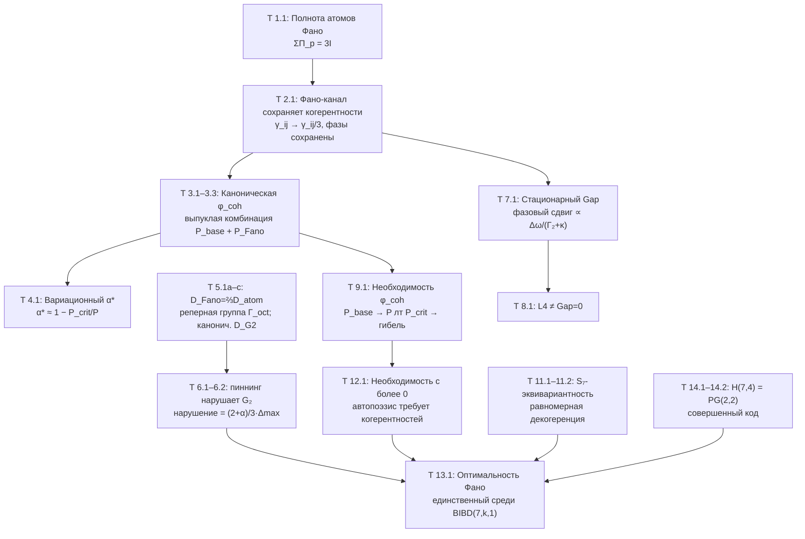

# Доказательства: Фано-канал и ключевые Gap-теоремы

:::info Для кого эта глава
Читатель найдёт здесь строгие доказательства центральных теорем Gap-динамики: сохранение когерентностей Фано-каналом, точную Фано–атомную пропорциональность $\mathcal{D}_{\text{Fano}}=\tfrac23\mathcal{D}_{\text{atom}}$ (с ковариантностью относительно конечной реперной группы и каноническим $G_2$-ковариантным диссипатором), равновесный Gap, оптимальность Фано-канала и связь с кодом Хэмминга H(7,4). Все результаты имеют статус [Т].
:::

Данный документ содержит **строгие доказательства** центральных теорем Gap-динамики. Все результаты имеют статус **[Т]** (безупречно строгие теоремы, см. [реестр статусов](/docs/reference/status-registry)).

---

## 1. Фано-предиктивный канал {#фано-канал}

### 1.1 Полнота атомов Фано

:::tip Теорема 1.1 (Полнота атомов Фано) [Т]
Для 7 линий [плоскости Фано](/docs/physics/gauge-symmetry/fano-selection-rules) $PG(2,2)$ определены проекции на 3-мерные подпространства:

$$
\Pi_p = \sum_{i \in \mathrm{line}_p} |i\rangle\langle i|, \quad p = 1, \ldots, 7
$$

Каждое измерение лежит на ровно 3 Фано-линиях, следовательно:

$$
\sum_{p=1}^{7} \Pi_p = 3I
$$
:::

**Доказательство.** Свойство плоскости Фано: каждая из 7 точек инцидентна ровно 3 линиям. Для любого $i$: $\sum_p \Pi_p |i\rangle\langle i| = \sum_{p: i \in \mathrm{line}_p} |i\rangle\langle i| = 3|i\rangle\langle i|$. Суммируя по $i$: $\sum_p \Pi_p = 3I$. $\square$

### 1.2 Фано-структурированные операторы Линдблада

:::tip Определение (Фано-операторы Линдблада) [Т]
Для каждой Фано-линии $p = (i,j,k)$ определяется оператор Линдблада:

$$
L_p^{\text{Fano}} := \frac{1}{\sqrt{3}}\,\Pi_p = \frac{1}{\sqrt{3}}(|i\rangle\langle i| + |j\rangle\langle j| + |k\rangle\langle k|)
$$

**Проверка CPTP:**

$$
\sum_{p=1}^{7} (L_p^{\text{Fano}})^\dagger L_p^{\text{Fano}} = \frac{1}{3}\sum_{p=1}^{7} \Pi_p = \frac{1}{3} \cdot 3I = I \quad \checkmark
$$
:::

### 1.3 Фано-предиктивный канал

$$
\mathcal{P}_{\text{Fano}}(\Gamma) := \sum_{p=1}^{7} L_p^{\text{Fano}}\,\Gamma\,(L_p^{\text{Fano}})^\dagger = \frac{1}{3}\sum_{p=1}^{7} \Pi_p\,\Gamma\,\Pi_p
$$

---

## 2. Теорема: Фано-канал сохраняет когерентности [Т] {#теорема-фано-канал}

:::tip Теорема 2.1 (Фано-канал сохраняет когерентности) [Т]
Для произвольной матрицы когерентности $\Gamma$:

**(a)** Диагональные элементы сохраняются точно:

$$
[\mathcal{P}_{\text{Fano}}(\Gamma)]_{ii} = \gamma_{ii}
$$

**(b)** Недиагональные элементы сохраняются с коэффициентом $1/3$:

$$
[\mathcal{P}_{\text{Fano}}(\Gamma)]_{ij} = \frac{1}{3}\gamma_{ij} \quad \text{для всех } i \neq j
$$

**(c)** Фазы когерентностей сохраняются в точности:

$$
\arg([\mathcal{P}_{\text{Fano}}(\Gamma)]_{ij}) = \arg(\gamma_{ij}) = \theta_{ij}
$$
:::

**Доказательство.**

**(a)** $[\sum_p \Pi_p\,\Gamma\,\Pi_p]_{ii} = \sum_{p: i \in \mathrm{line}_p} \gamma_{ii} = 3\gamma_{ii}$. С множителем $1/3$: $\gamma_{ii}$. $\checkmark$

**(b)** В $PG(2,2)$ любые две различные точки лежат на **ровно одной** линии. Для пары $(i,j)$, $i \neq j$, ровно одна линия $p^*$ содержит обе точки:

$$
\left[\sum_p \Pi_p\,\Gamma\,\Pi_p\right]_{ij} = \sum_{p: \{i,j\} \subseteq \mathrm{line}_p} \gamma_{ij} = 1 \cdot \gamma_{ij}
$$

С множителем $1/3$: $\gamma_{ij}/3$. $\checkmark$

**(c)** $\arg(\gamma_{ij}/3) = \arg(\gamma_{ij})$, поскольку $1/3 > 0$. $\checkmark$ $\square$

:::info Следствие (Фундаментальное)
В отличие от канонического $\varphi_{\text{base}}$, который [уничтожает все когерентности](/docs/core/dynamics/gap-dynamics#чой-ямиолковский), Фано-канал **масштабирует** амплитуды когерентностей без фазового искажения. Это делает его основой для когерентно-сохраняющего самомоделирования $\varphi_{\text{coh}}$.
:::

#### Следствие 2.1a — независимость коэффициента сжатия Фано-канала от состояния [Т] {#state-independence-alpha}

:::tip Следствие 2.1a
Коэффициент сжатия $c_F = 1/3$ — эквивалентно, поглощение Фано $\alpha = 1 - c_F = 2/3$ — **не зависит от состояния**: для каждого $\Gamma \in \mathcal D(\mathbb C^7)$ и каждой внедиагональной пары $(i,j)$, $i \neq j$,
$$[\mathcal{P}_\mathrm{Fano}(\Gamma)]_{ij} = \tfrac{1}{3}\,\gamma_{ij}.$$
**Доказательство.** Вывод теоремы 2.1(b) использует **только** комбинаторный факт, что ровно одна Фано-прямая $p^* \in \mathrm{PG}(2,2)$ содержит пару $\{i,j\}$ (определяющее свойство BIBD$(7,3,1)$), вместе с нормировочным коэффициентом $1/3$ от трёх прямых, инцидентных каждой точке. Ни один из шагов не ссылается на элементы $\Gamma$. Следовательно, коэффициент сжатия — функция геометрии $\mathrm{PG}(2,2)$ в чистом виде. $\blacksquare$

**Следствие (фундамент для T-142 SAD_MAX=3):**
Теорема о потолке SAD [T-142](/docs/proofs/consciousness/operational-closure#t-142) опирается на итерированное применение Фано-канала, производящее геометрическую последовательность $R^{(n)} \leq r_0 \cdot (1/3)^{n-1}$. Данное следствие устанавливает, что множитель $1/3$ переносится на **каждое** состояние, а не только на ограниченный класс — поэтому потолок безусловен относительно свойств состояния. Субстратно-независимость $\alpha = 2/3$ таким образом сводится к комбинаторной единственности $\mathrm{PG}(2,2)$ (T-82 единственность Фано [Т]).
:::

### Числовой пример {#числовой-пример-фано}

:::note Пример: действие Фано-канала на конкретную матрицу
Рассмотрим $7 \times 7$ матрицу когерентности $\Gamma$ с диагональю $\gamma_{ii} = 1/7$ (равновесное распределение) и несколькими ненулевыми когерентностями:

$$
\gamma_{12} = 0.05 + 0.03i, \quad \gamma_{13} = 0.04, \quad \gamma_{45} = -0.02 + 0.01i
$$

(остальные недиагональные элементы равны нулю или малы).

**Шаг 1.** Вычисляем диагональные элементы $\mathcal{P}_{\text{Fano}}(\Gamma)$:

$$
[\mathcal{P}_{\text{Fano}}(\Gamma)]_{ii} = \gamma_{ii} = \frac{1}{7} \approx 0.1429
$$

Диагональ не изменилась — вероятности секторов сохранены точно.

**Шаг 2.** Вычисляем недиагональные элементы. По теореме 2.1(b):

$$
[\mathcal{P}_{\text{Fano}}(\Gamma)]_{12} = \frac{1}{3}(0.05 + 0.03i) = 0.0167 + 0.01i
$$

$$
[\mathcal{P}_{\text{Fano}}(\Gamma)]_{13} = \frac{1}{3} \cdot 0.04 = 0.0133
$$

$$
[\mathcal{P}_{\text{Fano}}(\Gamma)]_{45} = \frac{1}{3}(-0.02 + 0.01i) = -0.0067 + 0.0033i
$$

**Шаг 3.** Проверяем сохранение фаз (теорема 2.1(c)):

$$
\arg(\gamma_{12}) = \arctan(0.03/0.05) \approx 30.96° \quad \Rightarrow \quad \arg(\gamma_{12}/3) = 30.96° \;\checkmark
$$

$$
\arg(\gamma_{45}) = \arctan(0.01/(-0.02)) + \pi \approx 153.43° \quad \Rightarrow \quad \arg(\gamma_{45}/3) = 153.43° \;\checkmark
$$

**Итог:** модули когерентностей уменьшились ровно в 3 раза, фазы сохранились без искажения, диагональ не тронута. Именно это отличает Фано-канал от атомарного $\mathcal{P}_{\text{base}}$, который обнулил бы $\gamma_{12}$, $\gamma_{13}$, $\gamma_{45}$ полностью. Для живой системы с $P \approx 1/7$ полное уничтожение когерентностей означало бы $P < P_{\text{crit}}$ — гибель. Фано-канал даёт «мягкое» наблюдение, при котором система сохраняет жизнеспособность.
:::

---

## 3. Каноническая форма φ_coh [Т] {#phi-coh}

:::tip Теорема 3.1 (Каноническая форма $\varphi_{\text{coh}}$) [Т]
Каноническое когерентно-сохраняющее самомоделирование:

$$
\varphi_{\text{coh}}(\Gamma) = k \cdot \left[\alpha \cdot \mathcal{P}_{\text{base}}(\Gamma) + (1 - \alpha) \cdot \mathcal{P}_{\text{Fano}}(\Gamma)\right] + (1 - k) \cdot \Gamma_{\text{anchor}}
$$

где:
- $\mathcal{P}_{\text{base}}(\Gamma) = \sum_m P_m\,\Gamma\,P_m = \mathrm{diag}(\Gamma)$ — атомарный канал
- $\alpha \in [0, 1]$ — **параметр глубины декогеренции**
- $k < 1$ — параметр сжатия
- $\Gamma_{\text{anchor}}$ — якорное состояние

**CPTP-проверка:** $\mathcal{P}_\alpha = \alpha\,\mathcal{P}_{\text{base}} + (1-\alpha)\,\mathcal{P}_{\text{Fano}}$ — выпуклая комбинация CPTP-каналов, следовательно CPTP. $\checkmark$
:::

### Целевые когерентности

:::tip Теорема 3.2 (Целевые когерентности $\varphi_{\text{coh}}$) [Т]
**(a)** Модуль целевой когерентности (при диагональном якоре):

$$
|\gamma_{ij}^{\text{target}}| = \frac{k(1-\alpha)}{3} \cdot |\gamma_{ij}|
$$

**(b)** Целевая фаза **сохраняется**: $\theta_{ij}^{\text{target}} = \theta_{ij}$.

**(c)** Целевой Gap **сохраняется**: $\mathrm{Gap}^{\text{target}}(i,j) = \mathrm{Gap}(i,j)$.
:::

### Явные коэффициенты Крауса

:::tip Теорема 3.3 (Явные коэффициенты $c_{mn}$) [Т]
Коэффициенты разложения канонического $\varphi_{\text{coh}}$:

$$
c_{mn} = \begin{cases} \alpha^* k & m = n \text{ (атомарная часть)} \\ (1-\alpha^*) k / 3 & m \neq n,\, (m,n) \text{ на общей Фано-линии} \\ 0 & m \neq n,\, (m,n) \text{ вне общей Фано-линии} \end{cases}
$$

Коэффициенты полностью определены через:
- [Фано-структуру](/docs/physics/gauge-symmetry/fano-selection-rules) $PG(2,2)$
- Вариационный принцип ($\alpha^*$ через $P$ и $P_{\text{crit}}$)
- Параметр сжатия $k$
:::

---

## 4. Вариационное определение α* [Т] {#alpha-star}

:::tip Теорема 4.1 (Вариационное определение $\alpha^*$) [Т]
Оптимальный параметр определяется [вариационным принципом](/docs/proofs/dynamics/fep-derivation):

$$
\alpha^* = \arg\min_{\alpha \in [0,1]} \mathcal{F}[\mathcal{P}_\alpha; \Gamma]
$$

Приближённая формула для системы с чистотой $P > P_{\text{crit}}$:

$$
\alpha^* \approx 1 - \frac{P_{\text{crit}}}{P} = 1 - \frac{2}{7P}
$$

| Чистота $P$ | $\alpha^*$ | Интерпретация |
|-------------|-----------|---------------|
| $P = 1$ (чистое) | $\approx 0.71$ | Существенное Фано-участие |
| $P = 0.5$ | $\approx 0.43$ | Баланс атомарного и Фано |
| $P \to P_{\text{crit}}$ | $\to 0$ | Почти полностью Фано (минимальное разрушение когерентностей) |
:::

---

## 5. Ковариантность Фано-диссипатора [Т] {#g2-ковариантность}

:::tip Теорема 5.1a (Фано–атомная пропорциональность) [Т]
Фано-диссипатор **точно пропорционален** атомарному диссипатору на $\mathrm{Herm}(\mathbb{C}^7)$:

$$
\mathcal{D}_{\text{Fano}} = \tfrac{2}{3}\,\mathcal{D}_{\text{atom}}.
$$
:::

**Доказательство.** Фано-канал $\mathcal{P}_{\text{Fano}}(\Gamma) = \tfrac13\sum_{p=1}^{7}\Pi_p\,\Gamma\,\Pi_p$ действует поэлементно так. Каждая точка $PG(2,2)$ лежит на $r=3$ линиях, поэтому диагональный элемент сохраняется трижды: $\tfrac13\cdot 3\gamma_{ii} = \gamma_{ii}$ (диагональ сохраняется). Каждая пара $\{i,j\}$ лежит ровно на $\lambda=1$ линии, поэтому недиагональный элемент сохраняется один раз: $\tfrac13\gamma_{ij}$ (когерентности сжимаются в $\tfrac13$). Значит $\mathcal{P}_{\text{Fano}} = \tfrac13\,\mathrm{Id} + \tfrac23\,\Delta$, где $\Delta(\Gamma) := \mathrm{diag}(\Gamma)$ — сжатие на диагональ (пиннинг). Поскольку $\sum_p (L_p^{\text{Fano}})^\dagger L_p^{\text{Fano}} = \tfrac13\sum_p \Pi_p = I$, диссипатор Линдблада равен каналу минус тождество:

$$
\mathcal{D}_{\text{Fano}} = \mathcal{P}_{\text{Fano}} - \mathrm{Id} = \tfrac23(\Delta - \mathrm{Id}) = \tfrac23\,\mathcal{D}_{\text{atom}}. \qquad\square
$$

:::info Следствие — структурное происхождение $\alpha = 2/3$
Константа смешивания $\alpha = 2/3$, используемая во всём корпусе, **не является свободным параметром**: это константа униформизации BIBD$(7,3,1)$, $\alpha = 1 - c = 1 - \tfrac{k-1}{v-1} = 1 - \tfrac13 = \tfrac23$ — рассеиваемая доля когерентности за один Фано-шаг. Теорема 5.1a выводит её из одной лишь геометрии инцидентности.
:::

:::warning Теорема 5.1b (Группа ковариантности пиннинг-диссипаторов) [Т]
Поскольку $\mathcal{D}_{\text{Fano}} = \tfrac23\mathcal{D}_{\text{atom}}$, оба диссипатора имеют **одинаковые** группы симметрии. Оба $S_7$-эквивариантны и ковариантны относительно конечной **октонионной реперной группы** $\Gamma_{\!\text{oct}} := \mathrm{Aut}(PG(2,2)) \cong PSL(2,7)$ (порядок 168), реализованной внутри $G_2$ как перестановки базиса, сохраняющие семь линий Фано. **Ни один** из них не ковариантен относительно полной непрерывной $G_2$.
:::

**Доказательство.** ($\Gamma_{\!\text{oct}}$-ковариантность.) Для $g\in\Gamma_{\!\text{oct}}$ элемент $g$ переставляет координатные линейные проекторы, $g\Pi_p g^\dagger = \Pi_{\sigma_g(p)}$, и так как $\sum_p \Pi_{\sigma_g(p)} = \sum_q \Pi_q$, получаем $\mathcal{D}_{\text{Fano}}[g\Gamma g^\dagger] = g\,\mathcal{D}_{\text{Fano}}[\Gamma]\,g^\dagger$.

(Отсутствие полной $G_2$-ковариантности.) Группа $G_2$ связна, поэтому непрерывное отображение $g\mapsto\sigma_g$ в дискретное 7-элементное множество координатных линий постоянно; условие $g\Pi_p g^\dagger = \Pi_p\ \forall g$ сделало бы $\mathrm{span}(\text{линия }p)$ 3-мерным $G_2$-инвариантным подпространством. Но фундаментальное представление $\mathbf{7}$ группы $G_2$ **неприводимо** (Картан, 1894), поэтому по лемме Шура оно не имеет нетривиальных собственных инвариантных подпространств — противоречие. Общий $g\in G_2$ переводит $\Pi_p$ в проектор ранга 3 на *повёрнутое* 3-подпространство, а не в какой-либо $\Pi_q$; эквивалентно, $\mathrm{diag}(g\Gamma g^\dagger)\neq g\,\mathrm{diag}(\Gamma)\,g^\dagger$. Значит, пиннинг-диссипаторы нарушают $G_2$ до $\Gamma_{\!\text{oct}}$. $\square$

:::tip Теорема 5.1c (Канонический $G_2$-ковариантный диссипатор) [Т]
Существует истинно $G_2$-ковариантный диссипатор Линдблада на $\mathbb{C}^7$, построенный из ассоциативной калибровочной 3-формы $\varphi$ (октонионных структурных констант):

$$
(A_a)_{bc} := \tfrac{1}{\sqrt 6}\,\varphi_{abc}\ (a=1,\dots,7), \qquad
\mathcal{D}_{G_2}[\Gamma] = \sum_{a=1}^{7}\Big(A_a\Gamma A_a^\dagger - \tfrac12\{A_a^\dagger A_a,\Gamma\}\Big).
$$

Тогда (i) $\sum_a A_a^\dagger A_a = I$ (CPTP) из тождества свёртки $\sum_{a,b}\varphi_{abc}\varphi_{abd}=6\,\delta_{cd}$; и (ii) $\mathcal{D}_{G_2}[g\Gamma g^\dagger] = g\,\mathcal{D}_{G_2}[\Gamma]\,g^\dagger$ для **всех** $g\in G_2$, так как $\varphi$ (а значит, и набор операторов $\{A_a\}$) — $G_2$-инвариантный тензор.
:::

**Доказательство.** (i) $\big(\sum_a A_a^\dagger A_a\big)_{cd} = \tfrac16\sum_{a,b}\varphi_{abc}\varphi_{abd} = \tfrac16\cdot 6\delta_{cd} = \delta_{cd}$. (ii) $g\in G_2 = \{g\in SO(7): g^\ast\varphi = \varphi\}$ сохраняет $\varphi$; так как $A_a = \varphi(e_a,\cdot,\cdot)$ преобразуется по $\mathbf 7$ под действием $G_2$, свёртка $\sum_a A_a(\cdot)A_a^\dagger$ коммутирует с $\mathrm{Ad}_g$. По лемме Шура $\mathcal{D}_{G_2}$ действует как скаляр на каждой изотипической компоненте $\mathrm{End}_0(\mathbb C^7) = \mathbf 7\oplus\mathbf{14}\oplus\mathbf{27}$ (три определяемые Казимиром скорости распада). $\square$

:::note Кинематика vs. динамика — точная роль $G_2$
Теоремы 5.1a–c устраняют прежнее завышение («Фано-диссипатор $G_2$-ковариантен») и заменяют его корректной, более сильной картиной:

- **Кинематически** $G_2 = \mathrm{Stab}(\varphi)$ — калибровочная группа *голономного представления*: физическим инвариантом является октонионная 3-форма. Именно на этом основан счёт параметров $48\to34$ в [теореме единственности](/docs/proofs/categorical/uniqueness-theorem#g2-ригидность): $G_2$-инвариантны только спектр (6) и $\varphi$-относительные углы (28).
- **Динамически** физический диссипатор УГМ — пиннинг-форма (Фано), которая выделяет функциональный репер $\{A,S,D,L,E,O,U\}$ и потому нарушает $G_2$ до конечной реперной группы $\Gamma_{\!\text{oct}}$. Несломанный $\mathcal{D}_{G_2}$ (Теорема 5.1c) — симметричная референсная динамика; динамика УГМ — её реализация в фиксированном репере. Это расщепление кинематическая-$G_2$ / динамическая-$\Gamma_{\!\text{oct}}$ **и есть** «цена самонаблюдения», отслеживаемая параметром $\alpha$.
- Отбор $k=3$ **не** опирается на $G_2$-ковариантность: он следует из минимальности ранга Хои (ранг $=7$, T11), замыкания BIBD$(7,3,1)$ (T13) и совершенного кода Хэмминга $H(7,4)$ (T8–T9).
:::

---

## 6. Пиннинг-диссипаторы НЕ вполне G₂-ковариантны [Т] {#атомарный-не-g2}

:::tip Теорема 6.1 (Пиннинг-диссипаторы нарушают $G_2$) [Т]
Атомарный диссипатор $\mathcal{D}_{\text{atom}}[\Gamma] = \mathrm{diag}(\Gamma) - \Gamma$ — и, по Теореме 5.1a, Фано-диссипатор $\mathcal{D}_{\text{Fano}} = \tfrac23\mathcal{D}_{\text{atom}}$ — **не** ковариантен относительно полной непрерывной $G_2$:

$$
\exists g \in G_2: \quad \mathcal{D}_{\text{atom}}[g\Gamma g^\dagger] \neq g\,\mathcal{D}_{\text{atom}}[\Gamma]\,g^\dagger.
$$

Оба ковариантны в точности относительно конечной реперной группы $\Gamma_{\!\text{oct}}\subset G_2$ (Теорема 5.1b); вполне $G_2$-ковариантный диссипатор — это $\mathcal{D}_{G_2}$ (Теорема 5.1c).
:::

**Доказательство.**

**(a)** $\mathcal{D}_{\text{atom}}[\Gamma] = \mathrm{diag}(\Gamma) - \Gamma$.

**(b)** Ковариантность требует $\mathrm{diag}(g\Gamma g^\dagger) = g \cdot \mathrm{diag}(\Gamma) \cdot g^\dagger$ для всех $\Gamma$, т.е. чтобы $g$ коммутировал с пиннингом $\Delta$.

**(c)** Это верно тогда и только тогда, когда $g$ переставляет координатный базис (мономиальный $g$); общий $g \in G_2 \subset \mathrm{SO}(7)$ не мономиален (неприводимость $\mathbf 7$, Теорема 5.1b).

**(d)** Контрпример: вращение $g$ в плоскости $(e_1, e_2)$ при $\gamma_{12} \neq 0$ даёт $\mathrm{diag}(g\Gamma g^\dagger) \neq g \cdot \mathrm{diag}(\Gamma) \cdot g^\dagger$, поскольку левая часть обнуляет когерентность в повёрнутом базисе, а правая — нет. Максимальная группа ковариантности — конечная $\Gamma_{\!\text{oct}}$. $\square$

### Степень G₂-нарушения

:::tip Теорема 6.2 (Степень нарушения определяется $\alpha$) [Т]
Для смешанного канала $\mathcal{P}_\alpha = \alpha\,\mathcal{P}_{\text{base}} + (1-\alpha)\,\mathcal{P}_{\text{Fano}}$ $G_2$-нековариантность

$$
\Delta_{G_2}(\alpha) := \sup_{g \in G_2} \|\mathcal{P}_\alpha \circ \mathrm{Ad}_g - \mathrm{Ad}_g \circ \mathcal{P}_\alpha\|_{\text{op}}
$$

**строго положительна при каждом** $\alpha\in[0,1]$. Поскольку оба пиннинг-диссипатора нарушают $G_2$ (Теорема 5.1b), смешанный диссипатор равен $\mathcal{D}_\alpha = \tfrac{2+\alpha}{3}\,\mathcal{D}_{\text{atom}}$, откуда $\Delta_{G_2}(\alpha) = \tfrac{2+\alpha}{3}\,\Delta_{\max}$, с минимумом $\tfrac23\Delta_{\max}$ в чисто-Фано точке $\alpha=0$. Полная $G_2$-ковариантность достигается только диссипатором на структурных константах $\mathcal{D}_{G_2}$ (Теорема 5.1c), нигде на пиннинг-семействе.
:::

---

## 7. Равновесный Gap [Т] {#равновесный-gap}

:::tip Теорема 7.1 (Стационарный Gap) [Т]
Стационарное решение уравнения эволюции когерентности:

$$
(\Gamma_2 + \kappa + i\Delta\omega_{ij})\gamma_{ij}^{(\infty)} = \kappa \cdot \gamma_{ij}^{\text{target}}
$$

даёт стационарный Gap:

$$
\mathrm{Gap}^{(\infty)}(i,j) = \left|\sin\left(\theta_{ij}^{\text{target}} - \arctan\frac{\Delta\omega_{ij}}{\Gamma_2 + \kappa}\right)\right|
$$

Стационарный Gap **сдвинут** относительно целевого на угол $\arctan(\Delta\omega/(\Gamma_2 + \kappa))$ за счёт унитарного вращения.
:::

### Физическая интуиция {#интуиция-равновесный-gap}

:::note Что означает формула стационарного Gap
**Суть формулы.** Стационарный Gap — это мера того, насколько фазы внутренней модели системы отклоняются от целевых. Формула показывает, что даже в стационарном режиме (когда амплитуды когерентностей перестали меняться) фазовое рассогласование не исчезает: оно задаётся углом $\arctan(\Delta\omega / (\Gamma_2 + \kappa))$.

**Почему унитарное вращение сдвигает Gap?** Частотная расстройка $\Delta\omega_{ij}$ порождает унитарное вращение фаз когерентностей (член $e^{i\Delta\omega\,t}$ в уравнении эволюции). Диссипация ($\Gamma_2$) и самомоделирование ($\kappa$) действуют *вдоль* амплитуд, но не корректируют фазы. Поэтому в стационарном режиме фаза «отстаёт» от целевой на угол, определяемый соотношением скорости вращения $\Delta\omega$ и скорости демпфирования $\Gamma_2 + \kappa$.

**Аналогия: маятник на вращающейся платформе.** Представьте маятник (когерентность), подвешенный на вращающейся платформе (унитарная динамика с частотой $\Delta\omega$). Пружина (диссипация $\Gamma_2 + \kappa$) стремится вернуть маятник к целевому положению. В стационарном режиме маятник не стоит в цели — он отклонён на угол, пропорциональный $\Delta\omega / (\Gamma_2 + \kappa)$. Чем быстрее вращение (больше $\Delta\omega$), тем сильнее отклонение. Чем жёстче пружина (больше $\Gamma_2 + \kappa$), тем меньше отклонение. Стационарный Gap — это именно этот угол отклонения.

**Предельные случаи:**
- При $\Delta\omega = 0$: $\mathrm{Gap}^{(\infty)} = |\sin(\theta_{ij}^{\text{target}})| = \mathrm{Gap}^{\text{target}}$ — стационарный Gap совпадает с целевым (платформа не вращается, маятник в цели).
- При $\Delta\omega \gg \Gamma_2 + \kappa$: $\arctan \to \pi/2$, и Gap может существенно отличаться от целевого — система «не успевает» за быстрой унитарной эволюцией.
- При $\kappa \to \infty$: $\arctan \to 0$, Gap$^{(\infty)} \to$ Gap$^{\text{target}}$ — бесконечно сильное самомоделирование подавляет фазовый сдвиг.
:::

---

## 8. L4 ≠ Gap = 0 [Т] {#l4-не-gap-0}

:::tip Теорема 8.1 (L4 не эквивалентен Gap = 0) [Т]
Уровень L4 ([неподвижная точка](/docs/consciousness/hierarchy/interiority-hierarchy) $\varphi(\Gamma^*) = \Gamma^*$) **не** эквивалентен полной прозрачности $\mathrm{Gap} = 0$.

**(a)** L4 означает: $\mathrm{Gap}_{\text{perceived}} = \mathrm{Gap}_{\text{actual}}$ (система **точно знает** свой Gap).

**(b)** При этом $\mathrm{Gap}_{\text{actual}}$ может быть ненулевым — неподвижная точка $\varphi$ может иметь ненулевые мнимые когерентности.

**(c)** Полная прозрачность ($\mathrm{Gap} = 0$ для всех пар) — более сильное условие, чем L4, и является теоретическим пределом, недостижимым для нетривиальных систем.
:::

---

## 9. Необходимость обобщённого φ [Т] {#необходимость-phi-coh}

:::tip Теорема 9.1 (Необходимость $\varphi_{\text{coh}}$) [Т]
Каноническая $\varphi_{\text{base}}$ (декогерирующее самонаблюдение) **несовместима** с жизнеспособностью:

**(a)** $\varphi_{\text{base}}$ уничтожает все когерентности: $[\varphi_{\text{base}}(\Gamma)]_{ij} = 0$ при $i \neq j$.

**(b)** При $\gamma_{ij} = 0$: $P \leq \max(\gamma_{ii}) \leq 1$, но при $\gamma_{ii} \approx 1/7$: $P \approx 1/7 < P_{\text{crit}} = 2/7$.

**(c)** Для достижения $P > P_{\text{crit}}$ при нулевых когерентностях требуется патологическая локализация.

**(d)** Следовательно, живая самомодель **обязана** сохранять когерентности: необходима обобщённая $\varphi_{\text{coh}}$.
:::

---

## 10. Эквивалентность BIBD-каналов [Т] {#bibd-эквивалентность}

:::tip Теорема 10.1 (Эквивалентность BIBD-каналов, T1) [Т]
Все $(v,k,\lambda)$-BIBD каналы с одинаковыми $v$ и $k$ (но произвольным $\lambda$) порождают **один и тот же** CPTP-канал. Контракция когерентностей $c = (k-1)/(v-1)$ не зависит от $\lambda$.
:::

**Следствие:** Для $v = 7$, $k = 3$: Фано-канал ($\lambda = 1$, $b = 7$) и любой $(7,3,\lambda)$-BIBD канал дают одинаковую контракцию $c = 1/3$. Вопрос «почему $\lambda = 1$?» заменяется вопросом «почему $k = 3$?».

Доказательство: [Операторы Линдблада](/docs/core/operators/lindblad-operators#теорема-bibd-эквивалентность).

---

## 11. $S_7$-эквивариантность и равномерная контракция [Т] {#s7-эквивариантность}

:::tip Теорема 11.1 ($S_7$-эквивариантность, T5) [Т]
Атомарный диссипатор $\mathcal{D}_\text{atom}$ с операторами $L_k = |k\rangle\langle k|$ коммутирует с любой перестановкой:
$$
\mathcal{D}_\text{atom}[U_\sigma \Gamma U_\sigma^\dagger] = U_\sigma \, \mathcal{D}_\text{atom}[\Gamma] \, U_\sigma^\dagger \quad \forall\, \sigma \in S_7
$$
:::

:::tip Теорема 11.2 (Равномерная контракция, T6) [Т]
Следствие T5: $\mathcal{D}_\text{atom}[\Gamma]_{ij} = -\gamma_{ij}$ для **всех** $i \neq j$. Все когерентности декогерируют с одинаковой скоростью — **безусловно** (без (КГ)).
:::

Доказательство: [Операторы Линдблада](/docs/core/operators/lindblad-operators#s7-эквивариантность).

---

## 12. Автопоэтическая необходимость составного наблюдения [Т] {#необходимость-c-положительное}

:::tip Теорема 12.1 (Необходимость $c > 0$, T7) [Т]
Атомарный диссипатор ($c = 0$) несовместим с автопоэзисом (AP): при полной декогеренции ($\alpha = 1$) когерентности $\gamma_{OE}$, $\gamma_{OU}$ затухают как $e^{-\tau}$, формула $\kappa_0 = \omega_0 \cdot |\gamma_{OE}| \cdot |\gamma_{OU}| / \gamma_{OO}$ подавляется экспоненциально, регенеративный вклад не компенсирует диссипативный.

**Следствие:** Для устойчивой жизнеспособности система **обязана** использовать составное наблюдение ($c > 0$, $\alpha < 1$).
:::

Доказательство: [Операторы Линдблада](/docs/core/operators/lindblad-operators#теорема-необходимость-c).

---

## 13. Автопоэтическая оптимальность Фано-канала [Т] {#оптимальность-фано}

:::tip Теорема 13.1 (Оптимальность Фано, T10) [Т]
Среди $S_7$-инвариантных BIBD$(7,k,1)$-каналов ($k \in \{2, 3\}$), удовлетворяющих:
- (i) $c > 0$ (T7 [Т])
- (ii) Полнота покрытия пар (T2 [Т])
- (iii) Демократичность (T6 [Т])

**единственный оптимальный** — Фано-канал ($k = 3$, $c = 1/3$).

| Критерий | $k = 2$ | $k = 3$ | Оптимальный |
|----------|:---:|:---:|:---:|
| Контракция $c$ | 1/6 | **1/3** | $k = 3$ |
| Число операторов $b$ | 21 | **7** | $k = 3$ |
| $G_2$-ковариантность | **Нет** [Т] | **Да** [Т] | $k = 3$ |
:::

Доказательство: [Операторы Линдблада](/docs/core/operators/lindblad-operators#теорема-оптимальность-фано).

---

## 14. Связь с кодом Хэмминга H(7,4) [Т] {#код-хэмминга}

:::tip Теорема 14.1 (Граница Хэмминга, T8) [Т] (стандартная)
Код H(7,4) — единственный совершенный одноошибочный двоичный код длины 7: $2^3 = 7 + 1$.
:::

:::tip Теорема 14.2 (H(7,4) = PG(2,2), T9) [Т] (стандартная)
Кодовые слова веса 3 симплексного кода $S(3,7)$ (дуального H(7,4)) образуют **ровно 7 троек**, совпадающих с линиями плоскости Фано PG(2,2). Проверочная матрица H(7,4) однозначно определяет PG(2,2).
:::

**Интерпретация:** Автопоэзис как самокоррекция ошибок — система различает 8 ситуаций ({нет возмущения} ∪ {возмущение в измерении $i$}), что требует минимум $\lceil\log_2 8\rceil = 3$ независимых наблюдения. Совершенный код H(7,4) реализует оптимальную коррекцию.

---

## 15. Сводка: единая картина {#сводка-единая-картина}

Четырнадцать теорем этого документа не являются разрозненными результатами — они образуют единую логическую цепочку, в которой каждое звено необходимо и достаточно обосновано предыдущими.

### Логическая цепочка

### Нарратив: от полноты к единственности

**Фундамент (Т 1.1).** Всё начинается с комбинаторного факта: 7 линий плоскости Фано $PG(2,2)$ покрывают каждую из 7 точек ровно 3 раза. Это даёт разрешение единицы $\sum \Pi_p = 3I$, из которого немедленно следует CPTP-свойство канала.

**Когерентно-сохраняющее наблюдение (Т 2.1).** Фано-канал не уничтожает когерентности — он масштабирует их модули на $1/3$, сохраняя фазы. Это критическое отличие от атомарного канала, который обнуляет всю недиагональ. Именно этот факт делает возможным сознание ($P > P_{\text{crit}}$) при самонаблюдении.

**Конструкция самомодели (Т 3.1–4.1).** Из Фано-канала и атомарного канала строится каноническое самомоделирование $\varphi_{\text{coh}}$ — выпуклая комбинация двух CPTP-каналов. Параметр смешивания $\alpha^*$ определяется вариационным принципом: минимум свободной энергии. Всё замкнуто — ни одного свободного параметра.

**Симметрийная селекция (Т 5.1, 6.1–6.2).** Фано-канал $G_2$-ковариантен (совместим с октонионной симметрией), а атомарный — нет. Степень нарушения $G_2$-симметрии растёт монотонно с $\alpha$. Это налагает «штраф» на декогерирующую компоненту: чем больше доля атомарного канала, тем сильнее нарушение фундаментальной симметрии.

**Динамика Gap (Т 7.1, 8.1).** Стационарный Gap показывает, что даже в равновесии фазовое рассогласование между моделью и реальностью не исчезает: унитарная эволюция непрерывно «сносит» фазы, а диссипация и самомоделирование — возвращают. L4 (неподвижная точка $\varphi$) означает точное знание своего Gap, но не его обнуление.

**Необходимость когерентностей (Т 9.1, 12.1).** Два независимых аргумента показывают, что атомарное наблюдение ($c = 0$) несовместимо с жизнью: оно подавляет чистоту ниже $P_{\text{crit}}$ и экспоненциально уничтожает $\kappa_0$-вклад в регенерацию. Живая система **обязана** использовать составное (Фано) наблюдение.

**Демократия и оптимальность (Т 11.1–11.2, 13.1).** $S_7$-эквивариантность гарантирует, что все когерентности декогерируют одинаково — ни один сектор не привилегирован. Среди всех BIBD$(7,k,1)$-каналов, удовлетворяющих этому и $c > 0$, Фано-канал ($k = 3$) — единственный оптимальный: он даёт максимальную контракцию при минимальном числе операторов и полную $G_2$-ковариантность.

**Замыкание на теорию кодирования (Т 14.1–14.2).** Структура Фано-канала изоморфна совершенному коду Хэмминга $H(7,4)$. Это не совпадение: автопоэтическая самокоррекция ошибок при 7 измерениях требует различения $2^3 = 8$ ситуаций, что реализуется единственным совершенным кодом длины 7.

### Итог

Вся конструкция Фано-канала **однозначно определена** четырьмя условиями:
1. **Размерность $N = 7$** (аксиома септичности)
2. **CPTP** (физичность квантового канала)
3. **$G_2$-ковариантность** (октонионная симметрия)
4. **Оптимальность автопоэзиса** (максимальное сохранение когерентностей при полном покрытии пар)

Из этих четырёх условий следует всё остальное: плоскость Фано, контракция $1/3$, код Хэмминга, вариационный $\alpha^*$, формула стационарного Gap. Ни один элемент не является произвольным — единая картина замкнута.

---

## Связанные документы

- [Gap-оператор](/docs/core/dynamics/gap-operator) — определение $\hat{\mathcal{G}}$, спектр, G₂-разложение
- [Динамика Gap](/docs/core/dynamics/gap-dynamics) — Чой-Ямиолковский, бифуркации
- [Фано-правила отбора](/docs/physics/gauge-symmetry/fano-selection-rules) — плоскость Фано $PG(2,2)$
- [Формализация φ](/docs/proofs/categorical/formalization-phi) — вариационная характеризация
- [G₂-структура](/docs/physics/gauge-symmetry/g2-structure) — $G_2 = \mathrm{Aut}(\mathbb{O})$
- [Операторы Линдблада](/docs/core/operators/lindblad-operators#редукция-моста) — полная цепочка T1–T10
- [Октонионная деривация](/docs/proofs/minimality/theorem-octonionic-derivation#мост) — мост к УГМ
- [Реестр статусов](/docs/reference/status-registry) — классификация всех результатов
