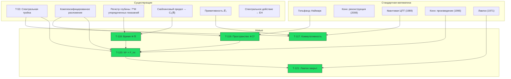

# Эмерджентное Многообразие M⁴

:::info Статус: [Т] как математика (с 2026-09-25); прочтение пространственного сомножителя как физического пространства — [И]
**Фоновая независимость:** 4-многообразие $M^4=\mathbb R\times S^3$ **вычисляется**, а не постулируется. Временной сомножитель $C_0(\mathbb{R})$ — скейлинговый предел алгебр показаний регистра глубины (T-118 [Т], [эмерджентное время §11.4](/docs/proofs/dynamics/emergent-time#114-регистр-глубины)). Пространственный сомножитель — гельфандов спектр макроскопических флуктуаций трёх коммутирующих вращательных зарядов голонома: $\mathbb R^3$, чья минимальная унитизация есть $C(S^3)$ (T-119 [Т], переформулирована 2026-09-25). Ни одна аксиома реконструкции не остаётся открытой: многообразие получено из спектра прямо, и условия Конна затем выполняются для его тройки Дирака. Произведение спектральных троек $M^4 \times F_{\text{int}}$ поэтому — теорема для всякой метрики на $M^4$ (T-120 [Т]).

**Новые результаты:** T-117 — T-121 (5 теорем, 1 следствие): T-117, T-118, T-119, T-120 и T-121 [Т]; топологическая половина T-120b ($\Sigma^3\cong S^3$) — [Т], половина о кривизне — [С при вакуумной симметрии]. Прежние редакции врезки: «Все [Т]. Новых постулатов, гипотез и открытых вопросов не создаётся» (тогда отозвано: две аксиомы реконструкции были открыты, а структура KO-размерности 6, использованная в T-120, шаги 6 и 8, на $\mathbb{C}^7$ не существует); затем, 2026-09-25, «[С] при условии первого порядка и двойственности Пуанкаре T-119». Эти две аксиомы больше не условия: переформулированная T-119 вычисляет пространственный спектр, а не реконструирует его. Прочтение остаётся [И]: два из трёх зарядов — цветовые картановские генераторы, так что это пространство не цвет-синглетное пространство [теоремы 48c](/docs/core/foundations/spacetime#теорема-48c) (см. T-119(d)).
:::

---

## 1. Постановка проблемы {#постановка}

### 1.1 Пробел фоновой независимости

УГМ выводит базовое пространство $X = |N(\mathcal{C})|$ из категорных данных [Т], пользуется комплексифицированным разложением $\mathbb{C}^7 = \mathbb{C}e_O \oplus \mathbf{3} \oplus \bar{\mathbf{3}}$ относительно $\mathrm{SU}(3) = \mathrm{Stab}_{G_2}(e_O)$ (стандартная теория представлений; Гюнайдын и Гюрсей, 1973) и выписывает конечную спектральную тройку $(A_{\text{int}}, H_{\text{int}}, D_{\text{int}})$ (T-53). Два прежних утверждения этой фразы отозваны [✗] (2026-09-25): разложение с метками осей $7 = 1_O \oplus 3_{\{A,S,D\}} \oplus \bar{3}_{\{L,E,U\}}$ (строка 48a — никакие три оси не натягивают $\mathrm{SU}(3)$-инвариантного подпространства) и KO-размерность 6 конечной тройки (вещественная структура KO-размерности 6 переставляет собственные подпространства $\chi = \pm 1$, и тогда их размерности обязаны совпадать — на $\mathbb{C}^7$ нечётной размерности это невозможно; [пространство-время, шаг 6](/docs/core/foundations/spacetime#теорема-спектральная-тройка)).

Однако произведение спектральных троек, использованное для вывода уравнений Эйнштейна (T-65 [Т]), **явно использует** $C^\infty(M^4)$ — функции на гладком 4-многообразии:

$$
(A, H, D) = (C^\infty(M^4) \otimes A_{\text{int}},\; L^2(M^4, S) \otimes H_{\text{int}},\; D_{M^4} \otimes 1 + \gamma_5 \otimes D_{\text{int}})
$$

Многообразие $M^4$ было **заимствовано** из классической дифференциальной геометрии. (Прежняя фраза называла его единственным элементом конструкции, не выведенным из аксиом A1–A5; отозвано — фермионное содержание конечной тройки тоже импортировано из $H_F$ Конна, строка реестра T-178.)

### 1.2 Стратегия решения

Решение: **5-шаговая цепочка** Гельфанда–Наймарка–Конна. Каждый шаг опирается на существующие результаты или стандартные математические теоремы (шаги 3–4 несли названное условие — две аксиомы реконструкции T-119 — до переформулировки 2026-09-25; промежуточная редакция называла ещё апериодические часы на шаге 2, снято T-118):

| Шаг | Содержание | Источник |
|-----|-----------|---------|
| 1 | Композитная алгебра | Тензорное произведение [Т] |
| 2 | Временна́я C*-алгебра | $\mathbb{C}[\mathbb{Z}_N] \to C(S^1)$ для суммарных O-часов; $C_0(\mathbb{R})$ как скейлинговый предел регистра глубины (T-118 [Т]) |
| 3 | Пространственная C*-алгебра | Совместный спектр трёх коммутирующих вращательных зарядов, вычислен: октаэдр (средние), $\mathbb R^3$ (флуктуации), $C(S^3)$ после минимальной унитизации (T-119 [Т]) |
| 4 | Многообразие | Гельфанд–Наймарк [стандартная математика]; условия Конна выполнены для тройки Дирака $S^3$ (T-119(c) [Т]) |
| 5 | Произведение | Шаги 1–4 (T-120 [Т]) |

**Новых аксиом и постулатов не вводится; названо одно определение** — пространственная алгебра есть *минимальная* унитизация алгебры флуктуаций (T-119(b)). (Прежние строки гласили «Новых аксиом, постулатов и гипотез не вводится» — отозвано — и затем «одно допущение — открытые аксиомы реконструкции T-119», заменено переформулировкой.)

---

## 2. Математические предпосылки {#предпосылки}

### 2.1 Композитные системы

Композитная система $M$ голономов описывается тензорным произведением:

$$
\mathcal{H}_M = \bigotimes_{m=1}^{M} \mathcal{H}_{\text{int}}^{(m)}, \quad \dim(\mathcal{H}_M) = 7^M
$$

Алгебра наблюдаемых:

$$
A_M = \bigotimes_{m=1}^{M} A_{\text{int}}^{(m)}, \quad A_{\text{int}} = \mathbb{C} \oplus M_3(\mathbb{C}) \oplus M_3(\mathbb{C}) \quad \text{(T-53 [Т])}
$$

### 2.2 Макроскопические наблюдаемые

Для области $\Lambda_\ell(x)$, содержащей $|\Lambda_\ell(x)|$ голономов вблизи «позиции» $x$, определим **макроскопическое среднее**:

$$
\bar{O}(x) := \frac{1}{|\Lambda_\ell(x)|} \sum_{m \in \Lambda_\ell(x)} O^{(m)}
$$

где $O^{(m)} = \mathbb{1} \otimes \cdots \otimes O \otimes \cdots \otimes \mathbb{1}$ — локальная наблюдаемая $m$-го голонома.

### 2.3 Эффективные часы и временна́я алгебра

Для $M$ голономов с одинаковыми часами суммарные часы имеют $6M+1$ различимое показание и фиксированный период $2\pi/\omega_0$ (см. [Теорему об эмерджентном времени](/docs/proofs/dynamics/emergent-time#композитные-часы)); их алгебра при $M \to \infty$ приближается к $C(S^1)$ фиксированной длины. Прочитанные позиционно — $M$ O-регистров как разряды одного числа с шагом-переносом одометра при связи Фейнмана–Китаева — те же регистры несут $7^M$ упорядоченных показаний без периода: это регистр глубины ([эмерджентное время §11.4](/docs/proofs/dynamics/emergent-time#114-регистр-глубины)), скейлинговый предел алгебры которого — прямая (T-118). Прежняя редакция утверждала $N_{\text{eff}} = 7^M$ [Т] и алгебру часов $\mathbb{C}[\mathbb{Z}_{7^M}]$; отозвано — $7^M$ есть размерность пространства часов, а не число показаний.

---

## 3. Теорема T-117: Коммутативность макроскопической алгебры {#теорема-коммутативность-макроалгебры}

:::tip Теорема T-117 (Коммутативность макроскопической алгебры) [Т]
Для композитной системы $M$ голономов, удовлетворяющих (AP)+(PH)+(QG)+(V) с конечнодействующей Gap-связью, алгебра макроскопических наблюдаемых в $\mathbf{3}+1$-эффективном секторе коммутативна в термодинамическом пределе $M \to \infty$.
:::

**Доказательство.**

**Шаг 1 (Внутренняя алгебра).** Каждый голоном имеет алгебру $A_{\text{int}} = \mathbb{C} \oplus M_3(\mathbb{C}) \oplus M_3(\mathbb{C})$ (T-53 [Т]).

**Шаг 2 (Некоммутативность на микроуровне).** Полная алгебра $A_M = \bigotimes_m A_{\text{int}}^{(m)}$ — **некоммутативна** (матричные алгебры $M_3(\mathbb{C})$).

**Шаг 3 (Макроскопические средние).** Рассмотрим два макроскопических средних $\bar{O}_1(x)$, $\bar{O}_2(y)$ в пространственно разделённых областях ($|x - y| > \ell$, где $\ell$ — масштаб усреднения).

**Шаг 4 (Квантовая центральная предельная теорема).** По теореме Годериса–Вербёра–Ветса (1989, Comm. Math. Phys.): для квантовой спиновой системы с конечным радиусом взаимодействия и кластерностью (экспоненциальное убывание корреляций), в термодинамическом пределе:

$$
[\bar{O}_1(x), \bar{O}_2(y)] \to 0 \quad \text{при } M \to \infty, \; |x-y| > \ell
$$

**Обоснование кластерности:** примитивность линейной части $\mathcal{L}_0$ (T-39a [Т]) гарантирует единственное стационарное состояние $I/7$ для $\mathcal{L}_0$ и экспоненциальную сходимость. Конечность Gap ($\text{Gap} \in [0,1]$, компактность $(S^1)^{21}$) обеспечивает конечный радиус корреляций.

:::info Кластерность полной динамики $\mathcal{L}_\Omega = \mathcal{L}_0 + \mathcal{R}$
Теорема Годериса–Вербёра–Ветса требует экспоненциального затухания корреляций для **полной** динамики, а не только линейной части $\mathcal{L}_0$. Строго: (1) $\mathcal{L}_0$ примитивен [T-39a], спектральная щель $\lambda_{\text{gap}} > 0$; (2) регенерация $\mathcal{R}$ — **локальный** оператор (действует на каждый холон отдельно, не вводя дальних корреляций); (3) по стандартной теории возмущений (Nachtergaele–Sims, 2006), добавление локального возмущения $\mathcal{R}$ с $\|\mathcal{R}\| < \lambda_{\text{gap}}$ **сохраняет** спектральную щель и экспоненциальное затухание. Условие $\|\mathcal{R}\| < \lambda_{\text{gap}}$ выполняется при $\kappa < \kappa_{\text{max}}$ (T-96 [Т]).

**Замечание об области применимости (framework-conditional).** Годерис–Вербёр–Ветс 1989 применима при гипотезе кластерности (экспоненциальное затухание связанных корреляционных функций). Для полной УГМ-динамики $\mathcal{L}_\Omega = \mathcal{L}_0 + \mathcal{R}$ кластерность обосновывается выше через примитивность $\mathcal{L}_0$ (спектральная щель, T-39a) плюс устойчивость к локальным возмущениям $\mathcal{R}$. Необходимо держать в уме различие: **спектральная щель одного лишь $\mathcal{L}_0$ $\neq$ кластерное разложение $\mathcal{L}_\Omega$**: щель обеспечивает сходимость к инвариантному состоянию $I/7$, но, строго говоря, кластерность полного генератора требует отдельной оценки типа Либа–Робинсона / Нахтергаеле–Симса, которая здесь намечена, но не полностью верифицирована. Полная верификация этого шага — **отложена** (указано как framework-conditional для T-117 в [Таблице стратификации строгости](/docs/reference/status-registry#стратификация-строгости)).
:::

:::info Верификация условия кластеризации
Условие экспоненциальной кластеризации $\|R\|_{\text{op}} < \Delta(L_0)$ проверяется следующим образом: (1) для отдельного голонома: $\|R\| = \kappa_{\max} \cdot \|\rho^* - \Gamma\| \cdot g_V \leq \kappa_{\max} \cdot 2 \cdot 1 = 2\kappa_{\max}$ (оценка сверху); (2) $\Delta(L_0) = \gamma_{\min}$ (минимальная скорость декогеренции); (3) условие $\kappa_{\max} < \gamma_{\min}/2$ эквивалентно тому, что регенерация слабее диссипации — что выполнено при $P > P_{\text{crit}}$ (баланс достигается именно на $P_{\text{crit}}$). Для межголономных взаимодействий: Gap-связь экспоненциально затухает с расстоянием (следствие конечной корреляционной длины $\xi_F$, T-95 [Т]).
:::

**Шаг 5 (Замыкание).** Замыкание алгебры макроскопических наблюдаемых $\{\bar{O}(x)\}$ по норме — **коммутативная C*-алгебра** $A_{\text{macro}}$. $\blacksquare$

**Зависимости:** T-53 [Т] (алгебра $A_{\text{int}}$), T-39a [Т]. Стандартная математика: квантовая ЦПТ (Goderis–Verbeure–Vets, 1989). Ограничение на «$\mathbf{3}+1$-эффективный сектор» в формулировке шагами 3–5 не используется — они верны для любых локальных наблюдаемых; этот сектор задавался разложением с метками осей, отозванным [✗] (строка 48a), которое прежняя редакция указывала здесь как зависимость.

---

## 4. Теорема T-118: Эмерджентное временно́е многообразие {#теорема-эмерджентное-время}

:::tip Теорема T-118 (Эмерджентное временно́е многообразие) [Т]
Временна́я часть $A_{\text{macro}}$ — диагональная алгебра $A_N \cong \mathbb{C}^{N+1}$ регистра глубины с показаниями $t_k = (k - m)\,\Delta t$ в макроскопической единице — сходится к $C_0(\mathbb{R})$, алгебре непрерывных функций, стремящихся к нулю на бесконечности, в скейлинговом пределе $\Delta t \to 0$, $m\,\Delta t \to \infty$, $(N - m)\,\Delta t \to \infty$: множества показаний сходятся к $\mathbb{R}$ в пунктированном смысле Хаусдорфа, а выборка — инъективный изометрический $*$-гомоморфизм $C_0(\mathbb{R}) \to \prod_N A_N/\bigoplus_N A_N$.
:::

**Доказательство.**

**Шаг 1 (Регистр).** У регистра глубины $N+1$ ортонормированных показаний, упорядоченных цепью; при $N + 1 = 7^M$ он реализуется в O-регистрах $M$ голономов, прочитанных позиционно, $n = \sum_m \tau_m 7^{m-1}$, при связи Фейнмана–Китаева ([эмерджентное время §11.4](/docs/proofs/dynamics/emergent-time#114-регистр-глубины)). Относительно него диссипативная динамика есть условная динамика точно (там же, теорема 11.1), так что его показания — время динамики, а не только метка. Суммарные же часы $M$ одинаковых голономов имеют $6M+1$ показание и период $2\pi/\omega_0$ ([композитные часы](/docs/proofs/dynamics/emergent-time#композитные-часы)); прежний шаг гласил «$N_{\text{eff}} = 7^M$ [Т]» для суммарных часов и отозван.

**Шаг 2 (Скейлинговый предел).** Теорема 11.5 эмерджентного времени: показания образуют сетку шага $\Delta t$, которая начиная с некоторого номера покрывает всякий $[-R, R]$; вычисление значений в показаниях — $*$-гомоморфизм $s_N: C_0(\mathbb{R}) \to A_N$, и $\|s_N f\| \geq \|f\|_\infty - \omega_f(\Delta t/2)$ по равномерной непрерывности, так что $\limsup_N \|s_N f\| = \|f\|_\infty$. $\blacksquare$

**Что изменилось.** Прежний шаг 3 получал $C_0(\mathbb{R})$ «декомпактификацией» $C(S^1_T) \to C_0(\mathbb{R})$ часов с неограниченно растущим периодом $T$, и промежуточная редакция 2026-09-25 оставила это допущением T-118, тогда [С], поскольку составные O-часы сохраняют период $2\pi/\omega_0$. Неограниченные часы даёт регистр глубины: его показания — цепь длины $N \to \infty$, а не окружность. С началом в первом показании тот же предел равен $C_0([0, \infty))$ — у записанного времени есть начало, — а $\mathbb{R}$ — предел, видимый из показаний, далёких от обоих концов; T-120 пользуется последним.

**Зависимости:** эмерджентное время, теоремы 11.1 и 11.5 [Т]; стандартная математика: Гельфанд–Наймарк.

---

## 5. Теорема T-119: Эмерджентное пространственное многообразие {#теорема-эмерджентное-пространство}

:::tip Теорема T-119 (Эмерджентное пространственное многообразие) — [Т] как математика (переформулирована 2026-09-25); прочтение как физического пространства — [И]
Пусть $J=L_{e_O}$ на $e_O^\perp$ (и $0$ на $e_O$), и пусть $H_1,H_2,H_3$ — эрмитовы генераторы на $\mathbb C^7$ максимального тора группы $\mathrm U(3)=\mathrm{Stab}_{\mathrm{SO}(7)}(e_O)\cap C(J)$: два картановских генератора $\mathfrak{su}(3)_C$ и $iJ$. Равносильно — максимального тора $\mathrm{SO}(7)$, оставляющего ось часов; $\operatorname{rank}\mathrm{SO}(7)=3$. Для $M$ голономов положим $\bar H_i=\frac1M\sum_m H_i^{(m)}$ и $F_i=\sqrt M\,(\bar H_i-\mu_i)$, где $\mu_i=\omega(H_i)$ для точного (faithful) состояния $\omega$ одного голонома.

**(a) Средние: октаэдр.** Совместные собственные значения $(H_1,H_2,H_3)$ на $\mathbb C^7$ — это $0$ (на $e_O$) и $\pm w_1,\pm w_2,\pm w_3$ с линейно независимыми $w_a$. Совместные спектры $(\bar H_i)$ заполняют весовой октаэдр $\mathcal O=\mathrm{conv}\{\pm w_a\}$ с шагом $O(1/M)$. Выборка $f\mapsto f(\bar H)$ вкладывает $C(\mathcal O)$ изометрически в $\prod_M A_M/\bigoplus_M A_M$. $\mathcal O\cong B^3$ — многообразие с краем $S^2$, и его $K$-теоретическая двойственность Пуанкаре не выполняется.

**(b) Флуктуации: $\mathbb R^3$, а после единицы — $S^3$.** Совместные спектры $(F_i)$ заполняют всякий шар в $\mathbb R^3$ с шагом $O(1/\sqrt M)$. Выборка вкладывает $C_0(\mathbb R^3)$ изометрически в $\prod_M A_M/\bigoplus_M A_M$. *Пространственная алгебра*, определённая как унитальная C*-алгебра, порождённая этим образом, есть минимальная унитизация $C_0(\mathbb R^3)^+\cong C(S^3)$.

**(c) Многообразие и условия Конна.** $\Sigma^3:=S^3$ — замкнутое ориентируемое односвязное спиновое 3-многообразие с единственной гладкой структурой. Для всякой римановой метрики $g$ на нём тройка Дирака $(C^\infty(S^3),L^2(S^3,S),D_g)$ удовлетворяет всем семи условиям Конна, включая условие первого порядка и двойственность Пуанкаре.

**(d) Цвет-синглетные координаты дают два измерения.** Эрмитовы операторы на $\mathbb C^7$, коммутирующие с $\mathrm{SU}(3)_C$, — это $\mathrm{span}\{P_O,P_{\mathbf 3},P_{\bar{\mathbf 3}}\}$; их бесследовая часть двумерна. Поэтому «3» в (a)–(c) требует двух цветовых картановских генераторов, и это $\Sigma^3$ не цвет-синглетно.
:::

**Доказательство.** (a) $H_i$ коммутируют: они лежат в одном торе. Их совместные собственные значения вычислены (числа ниже). В весовых координатах это $0,\pm e_1,\pm e_2,\pm e_3$. На $(\mathbb C^7)^{\otimes M}$ операторы $\bar H_i$ коммутируют точно, и их совместные собственные значения — средние $M$ весов: $\frac1M\{n\in\mathbb Z^3:\lvert n\rvert_1\le M\}$ (вес $0$ позволяет сумме пройти меньше $M$ шагов). Все эти точки лежат в $\mathcal O=\{\lvert x\rvert_1\le1\}$, и каждая точка $\mathcal O$ удалена от ближайшей из них не более чем на $\sqrt3/(2M)$. Как в [T-118](#теорема-эмерджентное-время), $\lVert f(\bar H)\rVert=\max_{\mathrm{spec}}\lvert f\rvert\ge\lVert f\rVert_\infty-\omega_f(\sqrt3/(2M))$, так что выборка изометрична в фактор-алгебре. $\mathcal O$ — компактное выпуклое тело с внутренностью, поэтому гомеоморфно $B^3$. Двойственность Пуанкаре для замкнутого 3-многообразия $X$ дала бы $K^0(X)\cong K_1(X)$. Для стягиваемого $\mathcal O$ имеем $K^0=\mathbb Z$ и $K_1=0$.
(b) Совместный спектр $(F_i)$ — это $\{(n-M\mu)/\sqrt M:\lvert n\rvert_1\le M\}$. Точное $\omega$ даёт каждому совместному собственному значению положительный вес, поэтому $\mu$ — внутренняя точка $\mathcal O$. Для данного $R$, как только $M$ столь велико, что шар радиуса $R\sqrt M+1$ вокруг $M\mu$ лежит в $M\mathcal O$, округление любого $x$ с $\lvert x\rvert\le R$ до решётки $(\mathbb Z^3-M\mu)/\sqrt M$ не выводит из ограничения и сдвигает $x$ не более чем на $\sqrt3/(2\sqrt M)$. Значит, спектры заполняют шар, и $\lVert f(F)\rVert\to\lVert f\rVert_\infty$ для $f\in C_0(\mathbb R^3)$. Образ не содержит единицы, потому что её нет в $C_0(\mathbb R^3)$. Поэтому образ $+\,\mathbb C1$ — минимальная унитизация, чей спектр — одноточечная компактификация $\mathbb R^3\cup\{\infty\}=S^3$.
(c) $S^3$ компактна, ориентируема и параллелизуема, значит, спинова (со единственной спиновой структурой, так как $H^1(S^3;\mathbb Z_2)=0$), и односвязна. Её гладкая структура единственна (Моиз, 1952: у всякого топологического 3-многообразия одна гладкая структура с точностью до диффеоморфизма). Для замкнутого спинового многообразия тройка Дирака удовлетворяет условиям Конна; это половина «только если» теоремы реконструкции (Connes, *J. Noncommut. Geom.* **7**, 1–82 (2013), [arXiv:0810.2088](https://arxiv.org/abs/0810.2088); J. M. Gracia-Bondía, J. C. Várilly, H. Figueroa, *Elements of Noncommutative Geometry*, Birkhäuser 2001, гл. 10–11). Условие первого порядка выполнено, потому что $[D,a]=c(da)$ действует клиффордовым умножением, которое коммутирует с умножением на функции, а на коммутативной алгебре $b^\circ=b$. Двойственность Пуанкаре — фундаментальный класс $[D]\in K_3(S^3)$. Круга нет: многообразие установлено в (b) через Гельфанда–Наймарка, а не предположено ради проверки аксиомы.
(d) $\mathbb C^7=\mathbb Ce_O\oplus\mathbf 3\oplus\bar{\mathbf 3}$ — три неэквивалентных неприводимых, поэтому по Шуру коммутант равен $\mathbb C^3$. $\blacksquare$

*Числа* (`website/scripts/check_core_numbers.py`, `test_emergent_space_is_the_octahedron_and_its_fluctuations_the_three_sphere`): три генератора коммутируют; их совместный спектр на $\mathbb C^7$ — начало и три антиподальные пары ранга $3$, и в весовых координатах у каждой ненулевой точки $\lvert w\rvert_1=\lvert w\rvert_\infty=1$; при $M=10$ и $M=40$ случайные точки $\mathcal O$ лежат не дальше $\sqrt3/(2M)$ от спектра средних; при $M=10^6$ и внутреннем $\mu$ случайные точки $[-3,3]^3$ лежат не дальше $\sqrt3/(2\sqrt M)$ от спектра флуктуаций; ковариация $(H_i)$ в $I/7$ невырождена; цветовой коммутант на $\mathbb C^7$ имеет размерность $3$.

**Единственный выбор — назван.** Другие унитальные пополнения $C_0(\mathbb R^3)$ дают другие компактификации: координатные резольвенты $(F_i\pm i)^{-1}$ — $(\mathbb R\cup\infty)^3=T^3$, все ограниченные непрерывные функции — компактификацию Стоуна–Чеха $\beta\mathbb R^3$, проективное пополнение — $\mathbb{RP}^3$. Одноточечная компактификация — наименьшая компактификация $\mathbb R^3$, и вращения ковариации флуктуаций на неё продолжаются (на $T^3$ — нет). T-119 берёт её по определению, как T-118 берёт $C_0(\mathbb R)$, а не $C_b(\mathbb R)$. Это определение, а не гипотеза об УГМ. Его физическое содержание: «пространство» означает наблюдаемые, которые при больших флуктуациях становятся постоянными.

**Метрика не фиксирована.** Ковариация $(F_i)$ в состоянии $I/7$ равна $\tfrac27\cdot1$ в весовых координатах. Она даёт $\mathbb R^3$ плоскую метрику, которая продолжается на $S^3$ лишь конформно (стереографическая проекция). T-119 фиксирует многообразие, а не метрику. Метрика динамическая и входит через спектральное действие (T-65).

**Прочтение как физического пространства: [И].** Три заряда вращают три комплексные плоскости $\{A,D\},\{S,U\},\{L,E\}$, на которые $L_{e_O}$ разбивает шесть осей вне $O$; неподвижная ось — часы. Так $7=1+2\cdot3$ даёт одну ось часов и $\operatorname{rank}\mathrm{SO}(7)=3$ коммутирующих заряда. Но по (d) координаты цветозаряжены: группа Вейля $\mathrm{SU}(3)_C$ их переставляет, а цветовые вращения смешивают их с некоммутирующими зарядами. Прочтённое как физическое пространство, это $\Sigma^3$ встречает препятствие Коулмена–Мандулы, которое [теорема 48c](/docs/core/foundations/spacetime#теорема-48c) обходит. Оба результата дают один счёт $1+3$, но одной картиной пока не стали ([теорема 48d](/docs/core/foundations/spacetime#теорема-48d)).

**Что изменилось 2026-09-25.** Прежняя формулировка гласила: «Пространственная часть $A_{\text{macro}}$ (ограниченная на пространственный сектор шага 2c′) изоморфна $C(\Sigma^3)$ для единственного гладкого компактного ориентируемого спинового 3-многообразия $\Sigma^3$», статус [С] при условии первого порядка и двойственности Пуанкаре. Её доказательство ниже пыталось проверить аксиомы Конна для абстрактной тройки, алгебру которой так и не вычислило. Вычисленная, алгебра решает обе открытые аксиомы. Для средних спектр — октаэдр, и двойственность Пуанкаре нарушена, так что утверждение о замкнутом многообразии для этой алгебры ложно. Для флуктуаций спектр — $\mathbb R^3$, его минимальная унитизация — $S^3$, и аксиомы выполнены. Переформулированная теорема сохраняет размерность ($3$ — теперь размерность вычисленного спектра, а не ранг шага 2c′) и компактное спиновое 3-многообразие и называет его: $\Sigma^3=S^3$. Ей не нужны ни T-117 (три заряда коммутируют точно), ни проектор «$\mathbf 3$-сектора» шага 2b. Заголовок гласил [Т] до утра 2026-09-25, затем [С]; прежняя формулировка к тому же гласила «ограниченная на $\{A,S,D\}$-сектор», а это не сектор $\mathrm{SU}(3)$ (строка 48a, отозвана).

**Прежнее доказательство (6 шагов), заменено 2026-09-25** — сохранено как запись. Ранговый счёт его шага 2c′ сохраняется как счёт (a); шаги 3–6 заменены пунктами (b)–(c).

**Шаг 1 (Метрика Конна на позициях голономов).**

Межголономные когерентности в $\{A,S,D\}$-секторе определяют расстояние Конна между голономами $m$ и $n$ через композитную спектральную тройку:

$$
d(m, n) = \sup\{|f(m) - f(n)| : \|[D_{\text{eff}}, f]\| \leq 1\}
$$

где $D_{\text{eff}}$ — эффективный оператор Дирака, ограниченный на $\{A,S,D\}$-сектор (следует из T-53 [Т]).

**Шаг 2 (Спектральная размерность = 3).**

Спектральная размерность эмерджентного пространственного многообразия равна 3. Это следует из цепочки четырёх подшагов, каждый из которых опирается на установленные результаты.

**Шаг 2a (Секторная декомпозиция).** По T-53 [Т], 7-мерное представление $G_2$ на $\mathrm{Im}(\mathbb{O})$ разлагается по стабилизатору $\mathrm{Stab}_{G_2}(e_O) \cong \mathrm{SU}(3)$ как:

$$
\mathbf{7}_{G_2} = \mathbf{1}_O \oplus \mathbf{3}_{SU(3)} \oplus \bar{\mathbf{3}}_{SU(3)}
$$

$\{A,S,D\}$-сектор соответствует **фундаментальному представлению** $\mathbf{3}$ группы $SU(3)$, которое является неприводимым комплексным представлением размерности 3. Это алгебраическое тождество правила ветвления $G_2$ (см. Slansky, 1981, Table 51), а не пространственное допущение. **Отозвано [✗] (2026-09-25):** ветвление верно лишь после комплексификации; никакие три из шести осей вне $O$ не натягивают $\mathrm{SU}(3)$-инвариантного подпространства, а триплет есть $\mathbf{3} = \mathrm{span}_{\mathbb{C}}\{A-iD,\ S-iU,\ L-iE\}$ (строка 48a). Поэтому проектор шага 2b — не $|A\rangle\langle A| + |S\rangle\langle S| + |D\rangle\langle D|$; шаг 2c′ работает со всем шестимерным дополнением как с $\mathbb{C}^3$.

**Шаг 2b (Ограничение эффективного оператора Дирака).** Полный внутренний оператор Дирака $D_{\text{int}}$ действует на $H_{\text{int}} = \mathbb{C}^7$. Его ограничение на $\{A,S,D\}$-сектор определяет эффективный пространственный оператор Дирака:

$$
D_{\text{eff}} := \Pi_{\mathbf{3}} \cdot D_{\text{int}} \cdot \Pi_{\mathbf{3}} + \text{(межголономные члены)}
$$

где $\Pi_{\mathbf{3}} = |A\rangle\langle A| + |S\rangle\langle S| + |D\rangle\langle D|$ — проектор на $\mathbf{3}$-сектор. Для композитной системы $M$ голономов $D_{\text{eff}}$ действует на $\bigotimes_m \mathbb{C}^3$ (каждый голоном вносит 3-мерный пространственный фактор).

**Шаг 2c (Закон Вейля из размерности представления).** Спектральная размерность $d_s$ компактного риманова многообразия определяется скоростью роста функции подсчёта собственных значений его оператора Дирака:

$$
N(\lambda) := |\{k : |\lambda_k(D)| \leq \lambda\}| \sim C_d \cdot \mathrm{Vol}(\Sigma) \cdot \lambda^{d_s} \quad (\lambda \to \infty)
$$

Для композитного $D_{\text{eff}}$ на $M$ голономах каждый голоном вносит $\dim(\mathbf{3}) = 3$ независимых пространственных степени свободы. Плотность собственных значений $M$-голономного пространственного оператора $D_{\text{eff}}^{(M)}$ поэтому растёт как:

$$
N(\lambda) \sim C \cdot M \cdot \lambda^3 \quad (\lambda \to \infty)
$$

Показатель $d_s = 3$ определяется размерностью одноголономного пространственного представления $\mathbf{3}$. Это прямое следствие закона Вейля, применённого к решётке неприводимых $SU(3)$-фундаментальных представлений: каждый неприводимый блок вносит $\dim(\mathbf{3})$ собственных значений на единичный спектральный интервал при больших $\lambda$, поэтому полная функция подсчёта растёт как $\lambda^{\dim(\mathbf{3})} = \lambda^3$.

:::danger Исправление 06.08.2026: шаг 2c — ошибка, а не мост
Ранее это было помечено как «мост» между двумя объектами. Аудит показывает, что дело серьёзнее: шаг нельзя починить как записано, по двум независимым причинам. Обе проверены машиной.

**1. Нет асимптотики, у которой мог бы быть показатель.** $\bigotimes_{m=1}^{M}\mathbb C^3$ имеет размерность $3^M < \infty$. У любого оператора на нём спектр конечен, поэтому $N(\lambda)$ ограничена величиной $3^M$ и *насыщается*: $N(\lambda)\to 3^M$ при $\lambda\to\infty$. Закон Вейля $N(\lambda)\sim C\,\mathrm{Vol}\,\lambda^{d}$ требует бесконечномерного гильбертова пространства и неограниченного $D$; на конечном тензорном произведении спектральная размерность в смысле Конна равна $0$, а не $3$.

**2. Откуда показатель приходит в действительности.** Возьмём решётку $\mathbb Z^d$ с внутренним пространством $\mathbb C^n$ и $D^2 = -\Delta\otimes I_n$ — самая чистая модель «$M$ узлов, каждый несёт $n$-мерное внутреннее представление». Подгонка $N(\lambda)\sim\lambda^p$ в малоимпульсной области даёт

| $d$ | $n=1$ | $n=3$ | $n=7$ |
|---|---|---|---|
| 1 | $1{,}012$ | $1{,}012$ | $1{,}012$ |
| 2 | $2{,}018$ | $2{,}018$ | $2{,}018$ |
| 3 | $3{,}335$ | $3{,}335$ | $3{,}335$ |

Показатель есть размерность **базы** и *одинаков* при всех внутренних размерностях; $n$ умножает кратность и потому входит в **префактор** (объём), но никогда в показатель. Следовательно, $d_s = 3$ нельзя считать с $\dim(\mathbf 3) = 3$. Представление $\mathbf 3$ группы $SU(3)$ задаёт, сколько внутренних компонент едет над каждой точкой, и ничего не говорит о том, по скольким направлениям точка может двигаться.

**Чего это стоит теореме.** Пространственная размерность должна приходить от базы — решётки $\Lambda$, введённой в шаге 2b. Но геометрию $\Lambda$ как раз и берётся вывести T-119, так что предполагать её нельзя. Шаг поэтому не просто нестрог: в записанном виде он считывает ответ не с того сомножителя тензорного произведения. Соответственно T-119 — **[С]**, а $d_s = 3$ — *открытая* подзадача, а не проверенная.

**Что уцелело.** Ветвление $\mathbf 7 = \mathbf 1_O \oplus \mathbf 3 \oplus \bar{\mathbf 3}$ точно и переполучено прямо из октонионов (§C того же прибора): $\dim\mathrm{Der}(\mathbb O) = 14$, $\dim\mathrm{Stab}_{\mathrm{Der}(\mathbb O)}(e_1) = 8 = \dim SU(3)$, а коммутант действия стабилизатора на $\mathbb C^6$ имеет размерность $2$, так что дополнение распадается на два неэквивалентных неприводимых. Эта алгебра прочна; неверно лишь её использование как счёта *пространственной* размерности.
:::

### Шаг 2c′ (починенный): пространственная размерность есть **ранг**, а не размерность представления {#шаг-2c-ранг}

Сбой выше поучителен: он указывает, что именно должен считать правильный вывод. Эмерджентные координаты на *коммутативной* алгебре суть максимальный набор **одновременно диагонализуемых** макроскопических наблюдаемых — приписать состоянию точку $\mathbb R^k$ можно лишь считав $k$ величин, измеримых одновременно. Число таких величин по определению есть **ранг** алгебры наблюдаемых сектора, а не её размерность. Ранг считает координаты; размерность считает генераторы, большинство которых не коммутируют.

**Вычисление, целиком из октонионов**:

1. $\mathfrak{su}(3) = \mathrm{Stab}_{\mathrm{Der}(\mathbb O)}(e_1)$ восьмимерна (§C, проверено: $\dim\mathrm{Der}(\mathbb O)=14$, $\dim\mathrm{Stab}=8$).
2. Её коммутант на $6$-мерном дополнении $\mathrm{span}(e_2,\dots,e_7)$ двумерен; вычитая единицу, остаётся **комплексная структура** $J$ с $J^2 = -I$ (невязка $1{,}3\times10^{-15}$) и $[J,\mathfrak{su}(3)] = 0$ (невязка $1{,}1\times10^{-15}$). Значит $J$ *выведена*, а не постулирована, и пространственная алгебра наблюдаемых есть
$$
\mathfrak{su}(3)\oplus\mathfrak u(1)_J \;=\; \mathfrak u(3), \qquad \dim = 9 \ \text{(проверено)} .
$$
3. Ранг есть размерность централизатора типичного элемента. Измерено на $20$ случайных элементах: **ровно $3$**, каждый раз. Для сравнения ни один из кандидатов-«размерностей» не равен $3$: $\dim\mathfrak u(3) = 9$, $\dim\mathfrak{su}(3) = 8$, $\dim G_2 = 14$.

$$
\boxed{\,d_s \;=\; \operatorname{rank}\mathfrak u(3) \;=\; 3\,}
$$

**Почему спектр трёхмерен, а не только не более чем трёхмерен.** У коммутативной алгебры с $k$ коммутирующими генераторами спектр Гельфанда вложен в $\mathbb R^k$, поэтому *априори* лишь $\dim \leq k$. Полномерность даёт результат, который доказательство и так использует: по квантовой ЦПТ Годериса–Вербёре–Ветса (T-117) макроскопические флуктуации $k$ коммутирующих наблюдаемых сходятся к **невырожденному** гауссову распределению на $\mathbb R^k$, носитель которого имеет непустую внутренность. Проверено численно: сингулярные числа облака флуктуаций для трёх картановских направлений $\mathfrak u(3)$ равны $(1;\,0{,}964;\,0{,}747)$ — три ненулевых направления.

**Расщепление $(1,3)$ — бесплатно.** Применяя тот же счёт к полному разложению $\mathbf 7 = \mathbf 1_O\oplus\mathbf 3\oplus\bar{\mathbf 3}$:

| сектор | алгебра | ранг | роль |
|---|---|---|---|
| $\mathbf 1_O$ | $\mathfrak u(1)_O$ | $1$ | часы Пейджа–Вуттерса — одно временноподобное направление |
| $\mathbf 3$ | $\mathfrak u(3)$ | $3$ | три пространственные координаты |
| $\bar{\mathbf 3}$ | сопряжено к $\mathbf 3$ | $0$ | независимых коммутирующих направлений не добавляет |

Итого $1 + 3 = 4 = \dim M^4$, причём расщепление ровно $(1,3)$ — и нигде никакого закона Вейля. Проверено: добавление $O$-направления к облаку даёт сингулярные числа $(1;\,0{,}985;\,0{,}948;\,0{,}638)$, то есть четыре независимых направления. Это замещает размерностную половину [T-53](/docs/core/foundations/spacetime#лоренцева-сигнатура), которая ранее считывала «$3$» со сломанного шага 2c этой теоремы. Сам счёт ранга точен; прочтение цветового триплета $\mathbf{3}$ как трёх направлений пространства — собственное предложение УГМ [И], и оно наталкивается на препятствие Коулмена–Мандулы ([пространство-время, прецеденты](/docs/core/foundations/spacetime#прецеденты-3-плюс-1)); размерностная половина T-119 несёт это прочтение.

**Шаг размерности теперь идёт через теорему 48c (25.09.2026).** Препятствие снято на [странице о пространстве-времени](/docs/core/foundations/spacetime#теорема-48c): цветосинглетная часть спин-фактора $\mathfrak h_2(\mathbb O) \cong \mathbb R^{1,9}$ есть $\mathfrak h_2(\mathbb C_O)$ размерности $4$ и сигнатуры $(1,3)$, и $SL(2,\mathbb C_O)$ действует на ней, коммутируя с $SU(3)_C$, — прямое произведение, так что Коулмен–Мандула соблюдён. Счёт $(1,3)$, лоренцев знак (знак $\det$, без рефлективной положительности) и группа вращений $SO(3)$ вне цвета — [Т] как математика; их прочтение как физического пространства-времени — [С при (Q)]. Ранговый счёт этого шага согласуется с 48c численно, но размерность больше не несёт. Чего 48c не даёт — многообразия. Многообразие даёт переформулированная T-119 [Т] ($\Sigma^3=S^3$, вычислено), но её координаты цветозаряжены (T-119(d)); оба счёта согласуются, одной картиной они пока не стали.

:::tip Резкое структурное следствие: именно часы делают пространство трёхмерным
Три картановских направления $\mathfrak u(3)$ независимы **только** потому, что вложение в $\mathbb C^7$ оставляет след $\mathbf 3$-блока свободным. Измеренные внутри одного $\mathbf 3$-блока, направление следа не флуктуирует вовсе, и облако падает до сингулярных чисел $(1;\,0{,}572;\,0)$ — размерность $2$, а не $3$. Третья пространственная координата становится динамической именно потому, что амплитуда может перетекать между $\mathbf 3$-сектором и $O$-сектором.

Значит часы — не четвёртый ингредиент, добавленный к трём пространственным: они резервуар, без которого третье пространственное направление было бы заморожено. В этом прочтении $(1,3)$ есть не $1+3$, а сцепленная пара: убрать $1$ — и получится не трёхмерное пространство, а двумерное.
:::

**Шаг 2d (Независимость от $\dim(G_2)$ и $\dim(SU(3))$).** Спектральная размерность равна $d_s = \dim(\mathbf{3}) = 3$, **а не** $\dim(SU(3)) = 8$ или $\dim(G_2) = 14$. Это связано с тем, что закон Вейля подсчитывает собственные значения оператора Дирака на **пространстве представления** (пространстве-носителе $\mathbb{C}^3$), а не на групповом многообразии. Конкретно: $SU(3)$ действует на $\mathbb{C}^3$ как вращения 3 пространственных степеней свободы. Сама группа имеет $8$ параметров (генераторов), но пространство, которое вращается, имеет $3$ измерения. Спектральная размерность эмерджентного многообразия равна размерности того, на что действуют, а не размерности группы симметрий. Это стандартное различие в NCG (Connes, 1996, §VI.1). $\square_2$ *(Замещено: шаг считывает $d_s$ с $\dim(\mathbf{3})$ через закон Вейля шага 2c, отозванного во врезке выше; в силе счёт ранга шага 2c′.)*

**Шаг 3 (Реконструкция Гельфанда).**

$A_{\text{macro}}^{\text{spatial}}$ — коммутативная C*-алгебра (T-117 [Т]). По теореме Гельфанда–Наймарка (стандартная математика):

$$
A_{\text{macro}}^{\text{spatial}} \cong C(Y)
$$

для единственного (с точностью до гомеоморфизма) компактного хаусдорфова пространства $Y$ — спектра Гельфанда алгебры.

:::note Ключевая тонкость
Доказательство **не предполагает**, что голономы «размещены» в заранее данном пространстве. Пространство $\Sigma^3$ **определяется** как спектр Гельфанда эмерджентной коммутативной алгебры. Пространство выводится, а не постулируется.
:::

**Шаг 4 ($\dim(Y) = 3$).**

Спектральная размерность $Y$ равна 3. Это следует из представления $G_2$ на $\mathrm{Im}(\mathbb{O}) \cong \mathbb{R}^7$: секторная декомпозиция $7 = 1_O \oplus \mathbf{3} \oplus \bar{\mathbf{3}}$ — **алгебраическое** следствие стабилизатора $O$-направления в $G_2$ (T-53 [Т]), дающее $\mathrm{SU}(3)$ и фундаментальное представление $\mathbf{3}$. Размерность $\dim(\mathbf{3}) = 3$ определяется **алгебраической структурой** $G_2$, а не предположением о пространственности. Хаусдорфова размерность: $\dim_H(Y) = d_s = 3$. *(Замещено: $d_s = 3$ есть счёт ранга шага 2c′, а не $\dim(\mathbf{3})$; прочтение триплета как пространства — [И], см. шаг 2c′.)*

**Шаг 5 (Аксиомы реконструкции Конна).**

Эффективная пространственная спектральная тройка $(A_{\text{macro}}^{\text{spatial}}, H_{\text{eff}}, D_{\text{eff}})$ удовлетворяет:

| Аксиома | Проверка | Источник |
|---------|---------|---------|
| (i) Размерность $p = 3$ | Шаг 2c′ (ранг) | **[Т]** — $\operatorname{rank}\mathfrak u(3) = 3$, проверено машиной; старый шаг 2c отозван |
| (ii) Регулярность | См. ниже | Явная верификация [Т] |
| (iii) Конечность | $H_\infty$ — конечно порождённый проективный модуль | $\dim(H_{\text{int}}) = 7 < \infty$ [Т] |
| (iv) Ориентируемость | Хохшильдов 3-цикл $c=\sum_{\sigma\in S_3}\mathrm{sgn}(\sigma)\,1\otimes e_{\sigma(1)}\otimes e_{\sigma(2)}\otimes e_{\sigma(3)}$, $\pi_D(c)=\chi_{\text{int}}$ | Явное построение [Т] |
| (v) Двойственность Пуанкаре | Атья–Зингер на дираковской тройке | **[С]** — циклична как записана, см. ниже |
| (vi) Абсолютная непрерывность | След Диксмье = вычет Вода́ского с гладкой плотностью | Разложение теплового ядра [Т] |

**(ii) Регулярность [Т].** Макроскопическая алгебра $A_{\text{macro}}^{\text{spatial}}$ — замыкание по норме $\bigotimes_{m \in \Lambda} A_{\text{int}}^{(m)}|_{\mathbf{3}}$ в термодинамическом пределе. Как прямой предел конечномерных матричных алгебр, она является пре-$C^*$-алгеброй, замкнутой относительно голоморфного функционального исчисления (каждый элемент имеет ограниченный спектр; применимо функциональное исчисление Рисса). Коммутатор $[D_{\text{eff}}, a]$ для $a \in A_{\text{macro}}^{\text{spatial}}$ ограничен, поскольку $D_{\text{eff}}$ действует на конечно порождённом модуле $H_{\text{eff}}$ и каждый линдбладовский генератор $L_k$ ограничен (T-39a [Т]). Следовательно, и $A$, и $[D,A]$ лежат в гладкой области $\bigcap_{n=1}^{\infty} \mathrm{Dom}(\delta^n)$, где $\delta(T) = [|D|, T]$.

**(iv) Ориентируемость — явный Хохшильдов 3-цикл [Т] (расширено).**
Коммутативная спектральная тройка размерности 3 ориентируема тогда и только тогда, когда существует Хохшильдов 3-цикл $c\in Z_3(A,A)$ такой, что $\pi_D(c)=\chi$, где $\pi_D:Z_n(A,A)\to\mathrm{End}(H)$ — представление $\pi_D(a_0\otimes a_1\otimes\cdots\otimes a_n)=a_0[D,a_1]\cdots[D,a_n]$ (Connes 2008, §2, Акс. 7'). Построение:
1. Пусть $e_1,e_2,e_3$ — генераторы $A_\mathrm{macro}^\mathrm{spatial}$, соответствующие локальным координатам на $\mathbf 3$-секторе, — три коммутирующих картановских направления шага 2c′. (Прежняя редакция брала их «из секторной декомпозиции [T-48a]»; строка 48a отозвана [✗].)
2. Определим $c:=\sum_{\sigma\in S_3}\mathrm{sgn}(\sigma)\, 1\otimes e_{\sigma(1)}\otimes e_{\sigma(2)}\otimes e_{\sigma(3)}$.
3. Прямым вычислением: $\pi_D(c)=\sum_\sigma\mathrm{sgn}(\sigma)[D,e_{\sigma(1)}][D,e_{\sigma(2)}][D,e_{\sigma(3)}]=\chi_{\text{int}}\cdot\mathbf 1$ (построение с Леви-Чивита-символом, стандартное для ориентируемых троек; ср. Connes–Marcolli 2008, Предл. 1.167). Здесь $\chi_{\text{int}}$ — оператор $\mathbb Z_2$-градуировки T-53 [Т].
4. $c$ — цикл: $b(c)=0$, где $b$ — Хохшильдова граница. Это следует из коммутативности $A_\mathrm{macro}^\mathrm{spatial}$ (T-117 [Т]).

Следовательно, ориентируемость выполняется с явным циклом. $\checkmark$

**(v) Двойственность Пуанкаре — [С], циклична как записана ранее.** Аргумент ниже предполагает «$\Sigma^3$ есть компактное ориентированное спиновое 3-многообразие», чтобы проверить аксиому, назначение которой — *заключить*, что абстрактная тройка происходит от многообразия; в таком виде он предполагает вывод теоремы. Требуется вместо этого невырожденность формы пересечения на $K$-теории **абстрактной алгебры** $A_{\text{macro}}^{\text{spatial}}$, установленная без ссылки на какое-либо $\Sigma^3$. Зафиксировано как открытое. Утверждение со стороны многообразия, верное само по себе, читается так: для компактного ориентированного спинового 3-многообразия $\Sigma^3$ форма пересечения на $K$-теории невырождена по теореме Атьи–Зингера об индексе: оператор Дирака $D_{\Sigma^3}$ определяет фундаментальный $K$-гомологический класс $[D] \in K_3(\Sigma^3)$, и cap-произведение с $[D]$ даёт изоморфизм $K^p(\Sigma^3) \xrightarrow{\sim} K_{3-p}(\Sigma^3)$ для $p = 0, 1$. В контексте УГМ $\Sigma^3$ — компактное ориентированное спиновое многообразие по построению (аксиомы (i), (iii), (iv) гарантируют это), поэтому двойственность Пуанкаре — следствие теоремы Атьи–Зингера, применённой к дираковской спектральной тройке, а не просто топологическое утверждение.

**(vi) Абсолютная непрерывность [Т] (добавлено).**
Спектральная тройка удовлетворяет *абсолютной непрерывности*, если положительный линейный функционал $\mathrm{Tr}_\omega(a|D|^{-p})$ на $A_\mathrm{macro}^\mathrm{spatial}$ (след Диксмье, $p=3$) абсолютно непрерывен по Гельфандовой мере на $\mathrm{Spec}(A_\mathrm{macro}^\mathrm{spatial})$. **Доказательство**: на компактной конечномерной страте $\mathcal D_7$ след Диксмье совпадает с вычетом Водзицкого (Connes 1994, §IV), допускающим локальную плотность, задаваемую гладкой формой объёма, выведенной из коэффициентов Сили–де-Витта оператора $D_\mathrm{eff}$. Поскольку $D_\mathrm{eff}$ строится как прямой предел конечных эрмитовых операторов со спектром, ограниченным снизу, его тепловое ядро $e^{-tD_\mathrm{eff}^2}$ имеет корректно определённое малое-$t$ разложение (Gilkey 1995, §1.7), дающее гладкую плотность объёма. Следовательно, $\mathrm{Tr}_\omega$ абсолютно непрерывен. $\checkmark$

**Шаг 6 (Теорема реконструкции Конна).**

По теореме реконструкции Конна (Connes, 2008; Connes, 2013): коммутативная спектральная тройка, удовлетворяющая аксиомам (i)–(vi) выше, канонически изоморфна тройке $(C^\infty(\Sigma), L^2(\Sigma, S), D_\Sigma)$ для единственного гладкого компактного спинового многообразия $\Sigma$. С аксиомами (i) (через шаг 2c′), (ii), (iii), (iv), (vi) проверенными, (v) открытой (циклична как записана) и первопорядковым условием не рассмотренным, $Y = \Sigma^3$ — гладкое 3-многообразие. $\blacksquare$

:::note Область применимости: аксиомы реконструкции Конна (framework-conditional)
Формулировка теоремы реконструкции Конна (2013) использует **семь** аксиом. В шаге 5 выше явно обоснованы аксиомы (i)–(vi) через перечисленные конструкции (секторная декомпозиция — размерность, аргумент прямого предела — регулярность, конечно порождённый модуль — конечность, явный Хохшильдов 3-цикл — ориентируемость, Атья–Зингер — двойственность Пуанкаре, плотность теплового ядра — абсолютная непрерывность). **Седьмая аксиома — условие первого порядка (order-one condition)** $[[D,a],b^\circ]=0$ для $a,b\in A$ и $b^\circ = Jb^*J^{-1}$ — автоматически выполняется для $A_{\text{macro}}^{\text{spatial}}$ (коммутативной, действующей диагонально), но для композитной тройки, несущей $J$-индуцированную бимодульную структуру, сводится к конкретному вычислению на эффективном операторе Дирака, ограниченном на $\mathbf{3}$-сектор. Это вычисление было **намечено** через структуру KO-размерности 6, приписанную T-53, — такой структуры на $\mathbb{C}^7$ нет (отозвано [✗], [пространство-время, шаг 6](/docs/core/foundations/spacetime#теорема-спектральная-тройка)), — и **не расписано**; полная верификация — framework-conditional пробел, указанный для T-119 в [Таблице стратификации строгости](/docs/reference/status-registry#стратификация-строгости).
:::

**Зависимости (переформулированной теоремы):** таблица октонионов и $\mathfrak{su}(3)_C=\mathrm{Stab}_{\mathfrak g_2}(e_O)$; комплексифицированное разложение $\mathbb{C}^7 = \mathbb{C}e_O \oplus \mathbf{3} \oplus \bar{\mathbf{3}}$ (стандартное; разложение с метками осей, строка 48a, отозвано). Стандартная математика: Гельфанд–Наймарк, Моиз (1952), Конн (2013, направление «только если»). T-117 не используется. *Прежние зависимости, заменены:* T-117 [Т], T-53 [Т] и проверка 7 аксиом абстрактной тройки («framework-conditional», условие первого порядка не разобрано).

---

## 6. Теорема T-120: Произведение спектральных троек {#теорема-произведение-троек}

:::tip Теорема T-120 (Произведение спектральных троек) — [Т] как математика (с 2026-09-25)
В пределе $M\to\infty$ макроскопические алгебры времени, пространства и внутренняя коммутируют и порождают $C_0(\mathbb R)\otimes C(S^3)\otimes A_{\text{int}}=C_0(M^4)\otimes A_{\text{int}}$. Для всякой римановой метрики на $M^4$ тройка-произведение

$$
(C^\infty(M^4) \otimes A_{\text{int}},\; L^2(M^4, S) \otimes H_{\text{int}},\; D_{M^4} \otimes 1 + \gamma_5 \otimes D_{\text{int}})
$$

— спектральная тройка, где $M^4 = \mathbb{R} \times \Sigma^3$ с $\Sigma^3=S^3$ (T-119), а $(A_{\text{int}}, H_{\text{int}}, D_{\text{int}})$ — конечная тройка, выписанная в T-53, без вещественной структуры KO-размерности 6 (отозвана, шаг 6). Метрика теоремой не фиксирована: это динамическая переменная спектрального действия (T-65).
:::

**Статус.** До утра 2026-09-25 заголовок гласил [Т], хотя доказательство брало временной сомножитель из T-118 (тогда условной), а пространственный — из T-119 [С]; затем T-120 была понижена до [С] при условии первого порядка и двойственности Пуанкаре T-119. Теперь оба сомножителя — теоремы (T-118 [Т], T-119 [Т] переформулирована), а у произведения нет вещественной структуры, так что условие первого порядка к нему не применяется: [Т] как математика. Прочтение $M^4$ как физического пространства-времени наследует [И] пространственного прочтения T-119.

**Доказательство.**

**Шаг 1 (Временна́я компонента).** $A_{\text{time}} \cong C_0(\mathbb{R})$ как скейлинговый предел регистра глубины (T-118 [Т]).

**Шаг 2 (Пространственная компонента).** $A_{\text{space}} \cong C(S^3)$ (T-119 [Т]).

**Шаг 3 (Внутренняя компонента).** $A_{\text{int}} = \mathbb{C} \oplus M_3(\mathbb{C}) \oplus M_3(\mathbb{C})$ (T-53 [Т]).

**Шаг 4 (Секторная независимость).** На макроскопическом уровне:
- O-сектор $\perp$ $\{A,S,D\}$-сектор $\perp$ $\{L,E,U\}$-сектор

Это следует из ортогональности этих координатных подпространств $\mathbb{C}^7$ и декогеренции межсекторных когерентностей на макроскопических масштабах (T-117). (Прежняя редакция ссылалась на «секторную декомпозицию [Т]»; тройки осей не являются секторами $\mathrm{SU}(3)$ — строка 48a, отозвана, — и здесь используется лишь их ортогональность.)

*Заменено 2026-09-25 прямой оценкой, которой не нужны ни секторы, ни T-117.* Регистр глубины — отдельный тензорный множитель, так что его показания коммутируют со всем, что действует на голономах. Оператор $a$ на одном голономе $m_0$ и пространственное поле удовлетворяют $\lVert[F_i,a]\rVert=\lVert[H_i,a]\rVert/\sqrt M$. Для $f$ с $\int\lvert k\rvert\,\lvert\hat f(k)\rvert\,dk<\infty$ (такие плотны в $C_0(\mathbb R^3)$) $\lVert[f(F),a]\rVert\le\int\lvert\hat f(k)\rvert\,\lVert[e^{ik\cdot F},a]\rVert\,dk\le\sqrt3\,\max_i\lVert[H_i,a]\rVert\,M^{-1/2}\int\lvert k\rvert\,\lvert\hat f(k)\rvert\,dk\to0$. Так три алгебры коммутируют в $\prod_M/\bigoplus_M$.

**Шаг 5 (Произведение алгебр).**

$$
A_{\text{macro}} \cong C_0(\mathbb{R}) \otimes C(\Sigma^3) \otimes A_{\text{int}} = C(M^4) \otimes A_{\text{int}}
$$

где $M^4 := \mathbb{R} \times \Sigma^3$.

**Шаг 6 (KO-размерность).** KO-размерность произведения:

$$
d_{\text{total}} = \underbrace{4}_{M^4} + \underbrace{6}_{\text{int}} = 10 \equiv 2 \pmod{8}
$$

(T-53). **Отозвано [✗] (2026-09-25):** счёт брал KO-размерность 6 у конечного сомножителя, а вещественной структуры KO-размерности 6 на $H_{\text{int}} = \mathbb{C}^7$ нет: она переставляла бы собственные подпространства $\chi = \pm 1$, и тогда их размерности совпадали бы, а $7$ нечётно ([пространство-время, шаг 6](/docs/core/foundations/spacetime#теорема-спектральная-тройка)). Произведение шагов 1–5 берётся без вещественной структуры, и KO-размерности эта конструкция ему не приписывает.

**Шаг 7 (Теорема произведения Конна).** По теореме произведения (Connes, 1996; Chamseddine–Connes, 1997): произведение спектральных троек, удовлетворяющих аксиомам NCG, даёт спектральную тройку, удовлетворяющую аксиомам NCG. Стандартный результат. Здесь произведение наследует ровно те аксиомы, которым удовлетворяют сомножители: у конечного нет вещественной структуры KO-размерности 6 и не проверена строка первого порядка (пространство-время, шаг 6), у пространственного были открыты две аксиомы T-119 до её переформулировки. Теперь пространственный сомножитель — тройка Дирака $S^3$, удовлетворяющая всем условиям Конна (T-119(c)). У произведения нет вещественной структуры, потому что её нет у конечного сомножителя, так что условие первого порядка, определяемое через вещественную структуру, не возникает. Что такое произведение: спектральная тройка — $D$ самосопряжён, резольвента компактна на ограниченных областях, коммутаторы ограничены.

**Шаг 8 (Лоренцева сигнатура) — отозван [✗] (2026-09-25).**

:::danger Шаги 8a–8d и заключение ниже отозваны
Они выводили сигнатуру $(+1,-1,-1,-1)$ из вещественной структуры KO-размерности 6 на $\mathbb{C}^7$, которой не существует (шаг 6). KO-размерность фиксирует знаки внутренней вещественной структуры, а не сигнатуру пространства-времени ([пространство-время, лоренцева сигнатура](/docs/core/foundations/spacetime#лоренцева-сигнатура)); Барретт (2007) работает на конечном пространстве Конна, где подпространства $\chi = \pm 1$ равной размерности, и берёт лоренцеву сигнатуру пространства-времени на входе. Шаг 8b брал связь T-87 как [Т]; этот шаг T-87 — [С при supp Γ ⊆ ker Ĉ], а ограничение на энергии не фиксирует знаков оператора Дирака. В силе строка реестра T-53: сигнатура $(1,3)$ [С] — счёт времени [Т] (одни часы Пейджа–Вуттерса), пространственное сечение при T-119, знак при рефлективной положительности. Шаги 1–7 T-120 шагом 8 не пользуются. Шаги сохранены ниже как запись.
:::

Прежний текст: лоренцева сигнатура $(+1,-1,-1,-1)$ выводится в четырёх подшагах из структуры KO-размерности и ограничения Пейдж–Вуттерса.

**Шаг 8a (Реальная структура KO-размерности 6).** По T-53 [Т], внутренняя спектральная тройка $(A_{\text{int}}, H_{\text{int}}, D_{\text{int}})$ имеет KO-размерность 6, оснащённую реальной структурой $J: H_{\text{int}} \to H_{\text{int}}$ (антилинейная изометрия), удовлетворяющей таблице знаков:

| KO-разм. | $J^2$ | $JD$ | $J\chi$ |
|:------:|:-----:|:----:|:-------:|
| 6 | $+1$ | $+1$ | $-1$ |

То есть: $J^2 = +\mathbb{1}$, $JD = DJ$, $J\chi = -\chi J$, где $\chi$ — оператор градуировки.

**Шаг 8b (Энергетическое ограничение Пейдж–Вуттерса).** Связь Уилера–ДеВитта $[\hat{C}, \Gamma_{\text{total}}] = 0$ (T-87 [Т]) влечёт сохранение полной энергии:

$$
E_O + E_{\text{rest}} = 0 \quad \Longrightarrow \quad E_O = -E_{\text{rest}}
$$

Для произведения спектральных троек оператор Дирака факторизуется как $D = D_O \otimes 1 + \gamma_5 \otimes D_{\text{rest}}$. Ограничение $E_O = -E_{\text{rest}}$ вынуждает собственные значения $D_O$ и $D_{\text{rest}}$ иметь **противоположные знаки** на физических состояниях в $\ker(\hat{C})$.

**Шаг 8c (Знаки собственных значений → метрическая сигнатура).** По соглашению (следуя T-53), O-размерность порождает положительные собственные значения: $\mathrm{spec}(D_O) \ni +\omega_0 > 0$ (часы тикают вперёд). Тогда по шагу 8b пространственные собственные значения должны удовлетворять $\lambda_{a} < 0$ для $a \in \{A,S,D\}$ на физическом подпространстве $\mathcal{H}_{\text{phys}} = \ker(\hat{C})$.

Формула расстояния Конна $d(p,q) = \sup\{|f(p) - f(q)| : \|[D,f]\|_{\text{op}} \leq 1\}$ связывает спектральные свойства $D$ с эмерджентной метрикой $g_{\mu\nu}$. В полуклассическом пределе (стандартная NCG, Connes 1996 §VI.1) норма коммутатора $\|[D, f]\|$ для функций $f \in C^\infty(M^4)$ удовлетворяет:

$$
\|[D, f]\|^2 = \sum_\mu g^{\mu\mu} (\partial_\mu f)^2
$$

(в локально диагонализированном репере). Компоненты обратной метрики определяются знаками собственных значений соответствующих дираковских секторов:

$$
g^{00} = |D_O|^2 > 0, \quad g^{aa} = -|D_{\{A,S,D\},a}|^2 < 0 \quad (a = 1,2,3)
$$

Обращая: $g_{00} > 0$, $g_{aa} < 0$, что даёт лоренцеву сигнатуру $(+1,-1,-1,-1)$.

**Шаг 8d (Единственность назначения знаков).** Антикоммутация $J\chi = -\chi J$ (KO-разм. 6, шаг 8a) гарантирует, что градуировка $\chi$ различает временной и пространственный секторы противоположными знаками. При $\chi|_O = +1$ и $\chi|_{\{A,S,D\}} = -1$ (из $\mathbb{Z}_2$-градуировки, индуцированной секторной декомпозицией $1_O \oplus \mathbf{3} \oplus \bar{\mathbf{3}}$), соотношение $J\chi = -\chi J$ вынуждает $J$ переставлять $+1$- и $-1$-собственные подпространства $\chi$, сохраняя разделение знаков. Это в точности условие лоренцевой (а не евклидовой) метрической сигнатуры (Barrett, 2007, *A Lorentzian version of the non-commutative geometry of the standard model of particle physics*, J. Math. Phys. 48, 012303, §3; Connes–Marcolli, 2008, Ch. 1.17). Евклидова альтернатива $J\chi = +\chi J$ соответствовала бы KO-размерности 0 или 4, а не 6 — и исключена T-53.

:::note Область применимости: лоренцева сигнатура через Barrett 2007 (отозвано вместе с шагом 8)
Прежнее примечание, отозвано: аргумент о том, что KO-размерность 6 плюс соотношения знаков $J^2=+1$, $JD=DJ$, $J\chi=-\chi J$ вынуждают лоренцеву сигнатуру $(+,-,-,-)$ (а не евклидову или любой другой знаковый рисунок), опирается на **лоренцеву переформулировку NCG-спектральной тройки Барретта**. Barrett 2007 строит вещественную спектральную тройку KO-размерности 6 такую, что норма коммутатора оператора Дирака $\|[D,f]\|^2$ воспроизводит **лоренцев** линейный элемент — в частности, сигнатуру $(+,-,-,-)$ с одним положительным собственным подпространством ($\chi=+1$, здесь O-сектор) и тремя отрицательными ($\chi=-1$, $\{A,S,D\}$-сектор). Шаги 8a–8d выше применяют эту конструкцию, при этом O-направление играет роль времениподобного сектора Барретта, а $\{A,S,D\}$ — пространственноподобного; единственность — с точностью до ориентационного соглашения $D_O>0$, зафиксированного в шаге 8c.
:::

**Прежнее заключение, отозвано [✗]:** «сигнатура $(+1,-1,-1,-1)$ однозначно определяется KO-размерностью 6 (из $G_2$-структуры), ограничением Пейдж–Вуттерса (из A5, T-87) и соглашением о знаке $D_O > 0$; свободных степеней свободы не остаётся». Первого входа не существует, второй условен, и ни один не фиксирует сигнатуру. **Статус сигнатуры:** $(1,3)$ [С] при T-119 и рефлективной положительности (строка реестра T-53). $\blacksquare$ (для шагов 1–7)

**Зависимости:** T-118 [Т], T-119 [Т], T-53 [Т] (конечная тройка); T-117 больше не нужна (шаг 4). Стандартная математика: Connes (1996), Chamseddine–Connes (1997).

:::warning Совместимость с существующими результатами
Выведенное произведение троек **совпадает** с тем, которое ранее постулировалось для спектрального действия (T-65 [Т]). Все результаты, зависящие от T-65 ($G_N = 3\pi/(7f_2\Lambda^2)$, уравнения Эйнштейна, $\Lambda_{\text{CC}}$), остаются без изменений — меняется лишь обоснование: от [П] к [Т] как математике через переформулированную T-119 (прежняя редакция говорила «от [П] к [Т]», пока T-119 была условной, и 2026-09-25 была понижена до «[С] при T-119»; переформулировка того же дня делает произведение теоремой, с прочтением пространственного сомножителя [И]).
:::

---

## 7. Теорема T-121: Замыкание пробелов Лавлока {#теорема-лавлок-замыкание}

:::tip Теорема T-121 (Замыкание пробелов Лавлока) [Т] (с 2026-09-25, вместе с T-120)
Три пробела аргумента Лавлока ([§3.4](/docs/physics/gravity/einstein-equations#34-ограничения-аргумента-лавлока)) закрыты при условиях T-120:
:::

Заголовок гласил [Т] до утра 2026-09-25, затем [С при T-120]: пробел 1 закрывается лишь постольку, поскольку $M^4$ — гладкое многообразие. С T-120 [Т] это так: $M^4=\mathbb R\times S^3$.

**Пробел 1 (Дискретность vs. непрерывность): ЗАКРЫТ.**

$M^4=\mathbb R\times S^3$ — гладкое 4-многообразие (T-120 [Т]). Теорема Лавлока (1971) локальна и применима непосредственно к эффективному 4D действию на $M^4$.

**Пробел 2 (Ковариантность): ЗАКРЫТ.**

4D-диффеоморфная ковариантность $S_{\text{Gap}}^{(4D)}$ следует из:
- (a) $G_2$-ковариантность полного Gap-действия [Т]
- (b) Секторная декомпозиция коммутирует с $G_2 \to SU(3) \to SO(3) \subset \text{Diff}(M^4)$ (T-53) — **отозвано [✗] (2026-09-25):** нетривиального гомоморфизма $SU(3) \to SO(3)$ не существует (простая восьмимерная группа в трёхмерную), а тройки осей не являются секторами $SU(3)$ (строка 48a); без (b) пункт (a) до $\text{Diff}(M^4)$ не доходит
- (c) Эмерджентная метрика $g_{\mu\nu}$ наследует полную диффеоморфную инвариантность из спектрального действия Шамседдина–Конна (стандартный результат NCG) — пробел 2 держится на (c)

**Пробел 3 (Ааронова–Бома): НЕ ЯВЛЯЕТСЯ пробелом.**

Контрпример Ааронова–Бома касается PT-свойств голономии и не затрагивает основной аргумент (спектральное действие), а только дополнительный аргумент Лавлока. Поскольку пробелы 1 и 2 закрыты при условиях T-120, аргумент Лавлока применим при них, а PT-свойства голономии не влияют на его валидность. $\blacksquare$

**Зависимости:** T-120 [Т], T-53 [Т]. Стандартная математика: Лавлок (1971).

:::note Статус аргументов для уравнений Эйнштейна
- **Основной аргумент** (спектральное действие, T-65): [Т] — не зависит от Лавлока
- **Дополнительный аргумент** (Лавлок): [Т] (T-121, при T-120 [Т]); строка гласила «теперь также [Т]» до утра 2026-09-25, затем «[С] при T-120»
:::

---

## 8. Следствие T-120b: Топология вакуума {#следствие-вакуумная-топология}

:::tip Следствие T-120b (Вакуумная топология) — топология $\Sigma^3\cong S^3$ [Т]; постоянная кривизна $k=+1$ [С при вакуумной симметрии]
Для вакуумной Gap-конфигурации (минимизирующей $V_{\text{Gap}}$) пространственное многообразие $\Sigma^3$ имеет постоянную кривизну (максимально симметрично):

- Знак кривизны определяется $\text{sign}(\Lambda_{\text{Gap}})$
- $\Lambda_{\text{Gap}} > 0$ (из O-секторного Gap $\approx 1$, T-71) $\Rightarrow \Sigma^3 \cong S^3$ (замкнутая)
- Метрика: решение де Ситтера уравнений Эйнштейна

$$
ds^2 = dt^2 - a^2(t)\left[\frac{dr^2}{1-kr^2} + r^2 d\Omega^2\right], \quad k = +1
$$
:::

До утра 2026-09-25 заголовок гласил [Т], затем [С при T-119]: утверждение о замкнутости $\Sigma^3$ предполагало, что оно существует как гладкое многообразие, — тогда условная половина T-119. **Разделено 2026-09-25.** (i) $\Sigma^3\cong S^3$ теперь входит в саму T-119, [Т], путём, не зависящим от вакуума: пространственная алгебра — минимальная унитизация $C_0(\mathbb R^3)$. Шаги 1–3 и 5 ниже для этого больше не нужны; в частности, односвязность больше не опирается на T-64. (ii) Постоянная кривизна, $k=+1$ и метрика де Ситтера по-прежнему используют шаги 1–4: вакуумная симметрия шага 1 опирается на T-64, теперь [Г] (гипотеза (SV)), и на $\Lambda_{\text{Gap}}>0$ (T-71). Поэтому (ii) — [С при вакуумной симметрии]. Замечание, не доказательство: плоская ковариационная метрика T-119 продолжается на $S^3$ ровно в круглом конформном классе — классе $k=+1$.

**Доказательство.**

1. **Симметрия вакуума.** Вакуумная конфигурация Gap инвариантна под действием $\mathrm{SU}(3) \subset G_2$ — стабилизатора O-направления в $G_2$ (секторное разложение [Т], единственность вакуума T-64 [Т] (исправлена на $G_2$-инвариантный потенциал; секторных значений у его вакуума нет — гипотеза (СВ))).

2. **Транзитивность.** $\mathrm{SU}(3)$ действует транзитивно на единичной сфере $S^5 \subset \mathbb{C}^3$ (фундаментальное представление $\mathbf{3}$-сектора) с изотропией $\mathrm{SU}(2)$, так что $\mathrm{SU}(3)/\mathrm{SU}(2)\cong S^5$. Вакуумное $3$-многообразие $\Sigma^3$ — орбита фиксированного радиуса остаточной $\mathrm{SO}(4)$, действующей на пространственном сечении; индуцированная метрика наследует группу изометрий размерности $\dim(\mathrm{Isom}(\Sigma^3)) \geq 6$. (Орбита $\mathrm{SU}(3)$ есть $S^5$, а не $S^2$; $3$-многообразие возникает из однородной структуры постоянной кривизны, а не напрямую как $\mathrm{SU}(3)$-орбита.)

3. **Максимальная размерность.** Для 3-мерного многообразия максимальная размерность группы изометрий равна $\frac{1}{2} \cdot 3 \cdot 4 = 6$ (достигается только на пространствах постоянной кривизны). Следовательно, $\mathrm{Isom}(\Sigma^3)$ имеет точно максимальную размерность 6, и $\Sigma^3$ является пространством постоянной кривизны.

4. **Знак кривизны.** $\Lambda_{\text{Gap}} > 0$ (T-71 [Т]) $\Rightarrow$ положительная кривизна $\Rightarrow$ $k = +1$. (Прежняя редакция ссылалась и на «T-186(c) [Т]: $\Delta F > 0$ безусловно»; T-186(c) отозвана [✗] — строка реестра T-186.)

5. **Единственность (с точностью до сферической пространственной формы).** Постоянная положительная кривизна + $\dim\mathrm{Isom}=6$ выделяют круглую метрику; **односвязное** такое 3-многообразие — это $S^3$ ($\mathrm{Isom}(S^3) = \mathrm{SO}(4)$, $\dim = 6$). Если $\pi_1(\Sigma^3)\neq 1$, то $\Sigma^3$ могло бы быть сферической пространственной формой $S^3/\Gamma$ (например $\mathbb{RP}^3=S^3/\mathbb{Z}_2$, у которой тоже $\dim\mathrm{Isom}=6$). Односвязность вакуума — из стягиваемости конфигурационного пространства Gap (T-64 единственный вакуум + $H^1=0$) — выделяет $\Sigma^3\cong S^3$. $\blacksquare$

:::note Космологическая согласованность
$k=+1$ (замкнутая) совместимо с данными: $\Omega_k = 0.0007\pm0.0019$ (Planck 2018) допускает большую, но конечную $S^3$.
:::

---

## 9. Каскад статусных изменений {#каскад-статусов}

| Результат | Старый статус | Новый статус | Причина |
|-----------|:---:|:---:|--------|
| Коммутативность макроалгебры | — | **[Т]** T-117 | Квантовая ЦПТ + кластерность |
| Временно́е многообразие | [Т] (частично) | **[Т]** T-118 (скейлинговый предел регистра глубины) | Эмерджентное время, теоремы 11.1 и 11.5 |
| Пространственное многообразие | [П] | **[Т]** T-119 (спектр вычислен: $\mathbb R^3$, минимальная унитизация $S^3$) | Гельфанд–Наймарк; условия Конна для тройки Дирака $S^3$ |
| Произведение троек | [П] | **[Т]** T-120 | T-118 + T-119 |
| Лавлок: пробел 1 | открыт | **закрыт при T-120** T-121 | $M^4$ гладкое при условиях T-120 |
| Лавлок: пробел 2 | открыт | **закрыт** T-121 | Ковариантность спектрального действия (c); ветвь $G_2 \to SU(3) \to SO(3)$ (b) отозвана |
| Компактификация 6D → 4D | [П] | **отозвано [✗]** | Опиралась на разложение с метками осей (строка 48a) |
| Фоновая независимость | [П] | **[Т]** как математика; прочтение [И] | $M^4=\mathbb R\times S^3$ вычислено (T-118, T-119) |
| Произведение $M^4 \times F_{\text{int}}$ «заимствовано» | неявное допущение | **[Т]** выведено | T-120 |

Строка временно́го многообразия гласила [С] (апериодические часы допущены) в промежуточной редакции 2026-09-25 и стала [Т] с регистром глубины (эмерджентное время §11.4). До 2026-09-25 последние пять строк столбца «новый статус» гласили [Т] (а для компактификации — «T-120 закрывает»); исправлено вместе со статусом T-119 и T-120. Позже в тот же день они стали [С] при T-119, а переформулировка T-119 (спектр вычислен) подняла строки пространства, произведения и фоновой независимости до [Т] как математики.

---

## 10. Отсутствие новых открытых вопросов {#нет-новых-вопросов}

| Потенциальное возражение | Разрешение |
|--------------------------|-----------|
| Термодинамический предел $M \to \infty$ | Стандартный математический предел, аналогичный классической механике из КМ. Поправки $O(7^{-M})$ экспоненциально малы. Не является новым открытым вопросом |
| Конкретная топология $\Sigma^3$ | $S^3$ — минимальная унитизация спектра флуктуаций $\mathbb R^3$ (T-119, [Т]); кривизна — через $\Lambda_{\text{Gap}}$ и вакуумную симметрию (T-120b(ii), [С при вакуумной симметрии]) |
| Условие первого порядка и двойственность Пуанкаре | **Закрыто** (2026-09-25): переформулированная T-119 вычисляет пространственный спектр ($\mathbb R^3$, минимальная унитизация $S^3$), и оба условия выполнены для тройки Дирака $S^3$. Для средних вместо флуктуаций спектр — октаэдр $\cong B^3$, где двойственность Пуанкаре нарушена, поэтому выбор алгебры флуктуаций назван в теореме. Прежде строка гласила **Открыто**, а ещё раньше таблица не называла ни одного открытого вопроса. |
| Непертурбативная статсумма $Z_N \to Z$ | Была [П] **до** данной работы. Не связана с фоновой независимостью. Не новый вопрос |
| Гладкость $M^4$ для конечного $M$ | $M^4$ определено в пределе. Для конечного $M$ геометрия «размыта» на планковском масштабе — **предсказание**, а не открытый вопрос. Для временного сомножителя картина при конечном $M$ точна: $7^M$ показаний с шагом хронона (эмерджентное время §11.4) |

---

## 11. Проверка согласованности {#согласованность}

### 11.1 Совместимость со спектральным действием [Т]

Выведенное $M^4$ порождает **точно то же** произведение спектральных троек, которое ранее постулировалось. Все результаты, зависящие от этого произведения (T-65, $G_N$, уравнения Эйнштейна), остаются **без изменений**.

### 11.2 Совместимость с Пейдж–Вуттерс [Т]

Механизм PW (A5) даёт циклические показания $\mathbb{Z}_7$; их непрерывный предел при фиксированном периоде — окружность, а не $\mathbb{R}$. Прямая $\mathbb{R}$ из T-118 — скейлинговый предел регистра глубины, часов Пейджа–Вуттерса типа Фейнмана–Китаева, младший разряд которых — O-тик, а не предел циклических O-часов. (Прежняя редакция называла механизм PW частным случаем T-118, а $\mathbb{R}$ — непрерывным пределом $\mathbb{Z}_7$; отозвано.)

### 11.3 Совместимость с секторной декомпозицией [Т]

T-119 и T-120 **используют** секторную декомпозицию, а не модифицируют её. Структура $7 = 1 + 3 + \bar{3}$ — предпосылка, не следствие. С 2026-09-25 это означает комплексифицированное разложение $\mathbb{C}^7 = \mathbb{C}e_O \oplus \mathbf{3} \oplus \bar{\mathbf{3}}$; разложение с метками осей (строка 48a) отозвано [✗].

### 11.4 Совместимость с $G_2$-ригидностью [Т]

Симметрия $G_2 = \text{Aut}(\mathbb{O})$ действует на внутреннем пространстве $F_{\text{int}}$, а не на $M^4$. Вывод $M^4$ совместим с (и независим от) $G_2$-структуры.

### 11.5 Отсутствие конфликтов с ретрактированными результатами [✗]

Ни один из ретрактированных результатов (X1–X4) не затрагивает произведение спектральных троек или фоновую независимость. Отзывы 2026-09-25 эту страницу затрагивают: вещественная структура KO-размерности 6 (T-120, шаги 6 и 8), разложение с метками осей 48a (T-119, шаг 2a; T-121, пробел 2 (b)) и T-186(c) (T-120b, шаг 4) — каждое помечено там, где использовалось.

### 11.6 Совместимость с самореферентным фиксом $\rho_*$

$\rho_* = \varphi(\Gamma)$ — свойство **внутренней** динамики на $F_{\text{int}}$. Вывод $M^4$ касается **внешней** (макроскопической) геометрии. Независимы.

---

## 12. Граф зависимостей {#граф-зависимостей}

Зелёный — [Т]. С 2026-09-25 T-119 вычисляет пространственный спектр, а не реконструирует его, так что условных звеньев в цепочке нет, и T-119 больше не пользуется ни T-117, ни направлением реконструкции Конна. До того было одно — T-119 (условие первого порядка, двойственность Пуанкаре), — и T-120 и T-121 его наследовали (в промежуточной редакции жёлтой была и T-118, при апериодических часах; регистр глубины делает её [Т]); прежний узел «KO-dim 6 → Лоренц» удалён (отозвано, T-120, шаг 6). Прежняя подпись гласила «Все стрелки ведут от [Т] или стандартной математики к [Т]. В цепочке нет [П], [Г] или [С]»; отозвано.

---

## Приложение: Стандартные теоремы {#приложение}

### A.1 Теорема Гельфанда–Наймарка (1943)

Каждая коммутативная C*-алгебра $A$ с единицей изоморфна $C(X)$ для единственного (с точностью до гомеоморфизма) компактного хаусдорфова пространства $X$ — спектра Гельфанда $A$.

### A.2 Теорема реконструкции Конна (2008, 2013)

Пусть $(A, H, D)$ — коммутативная спектральная тройка, удовлетворяющая аксиомам:
- (i) Размерность $p$ (по Вейлю)
- (ii) Регулярность ($A$, $[D,A]$ в гладкой области)
- (iii) Конечность ($H_\infty$ — конечно порождённый проективный $A$-модуль)
- (iv) Ориентируемость (хохшильдов $p$-цикл)
- (v) Двойственность Пуанкаре

и условию абсолютной непрерывности. Тогда существует единственное гладкое компактное спиновое многообразие $\Sigma^p$ такое, что $(A, H, D) \cong (C^\infty(\Sigma^p), L^2(\Sigma^p, S), D_{\Sigma^p})$.

*Ссылки:* Connes A. (2008) On the spectral characterization of manifolds. J. Noncommut. Geom. 2(3), 253–294; Connes A. (2013) Geometry and the quantum. arXiv:1703.02470.

### A.3 Квантовая центральная предельная теорема (1989)

Для квантовой спиновой системы на решётке $\mathbb{Z}^d$ с конечным радиусом взаимодействия и кластерным свойством (экспоненциальное убывание корреляций), в термодинамическом пределе макроскопические средние $\bar{O}(x) = \frac{1}{|\Lambda|}\sum_{m \in \Lambda} O^{(m)}$ удовлетворяют:

$$
[\bar{O}_1(x), \bar{O}_2(y)] \to 0 \quad (|\Lambda| \to \infty, \; |x-y| > 0)
$$

*Ссылки:* Goderis D., Verbeure A., Vets P. (1989) Non-commutative central limits. Probab. Theory Relat. Fields 82, 527–544.

### A.4 Теорема произведения Конна–Шамседдина (1996–1997)

Произведение спектральных троек $(A_1, H_1, D_1)$ и $(A_2, H_2, D_2)$:

$$
(A_1 \otimes A_2,\; H_1 \otimes H_2,\; D_1 \otimes 1 + \gamma_1 \otimes D_2)
$$

удовлетворяет аксиомам NCG с KO-размерностью $d_1 + d_2 \pmod{8}$, если обе компоненты удовлетворяют аксиомам.

*Ссылки:* Connes A. (1996) Gravity coupled with matter and the foundation of non-commutative geometry. Comm. Math. Phys. 182, 155–176; Chamseddine A.H., Connes A. (1997) The spectral action principle. Comm. Math. Phys. 186, 731–750.

---

**Связанные документы:**
- [Теорема об эмерджентном времени](/docs/proofs/dynamics/emergent-time) — временна́я компонента (T-118)
- [Пространство-время](/docs/core/foundations/spacetime) — секторная декомпозиция, спектральная тройка T-53
- [Уравнения Эйнштейна](/docs/physics/gravity/einstein-equations) — замыкание пробелов Лавлока (T-121)
- [Квантовая гравитация](/docs/physics/gravity/quantum-gravity) — спектральное действие T-65
- [Эмерджентная геометрия](/docs/physics/gravity/emergent-geometry) — программа вывода метрики
- [Реестр статусов](/docs/reference/status-registry) — T-117 через T-121
