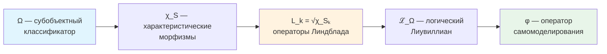

# Соответствие УГМ с Фундаментальной Физикой

## Статус раздела

:::info Статус раздела
Основные результаты формализованы и доказаны **[Т]**: L-унификация, сведение уравнения эволюции к уравнению фон Неймана (Теорема 3.1), эмерджентная геометрия ($M^4$), уравнения Эйнштейна, калибровочная группа СМ. Запрет сигнализации доказан как тождество маргинала Теоремы 8.1; для полной нелинейной динамики он верен в неселективном прочтении из §8.5, которое вынуждено аксиомами, так что он — [Т] (Теорема 8.5, §8.8; до 25.09.2026 врезка давала [С]), а §8.7 доказывает, что никакая модификация $\mathcal{R}$, сохраняющая порог жизнеспособности, второго пути не даёт. Эквивалентность категорий из §3.3 и вычислительное ограничение из §8.6 отозваны; вместо ограничения идеальная динамика решает выполнимость за линейное время (Теорема 8.6 [Т]). Прежняя редакция этой врезки числила «редукцию к КМ» и «запрет сигнализации» среди результатов [Т] без этих оговорок; это отозвано. Открытые направления: конкретные параметры СМ, непертурбативная статсумма.
:::

## Содержание

1. [Категорная структура связей](#1-категорная-структура-связей)
2. [L-унификация: логическое происхождение физики](#2-l-унификация)
3. [Редукция к квантовой механике](#3-редукция-к-квантовой-механике)
4. [Эмерджентная геометрия](#4-эмерджентная-геометрия)
5. [Связь с общей теорией относительности](#5-связь-с-общей-теорией-относительности)
6. [Калибровочные симметрии и Стандартная модель](#6-калибровочные-симметрии-и-стандартная-модель)
7. [Соответствие 7 измерений физическим структурам](#7-соответствие-7-измерений-физическим-структурам)

---

## 1. Категорная структура связей

:::info L-унификация как основа
Вся категорная структура связей УГМ с физикой основана на **L-унификации** — выводе операторов Линдблада из субобъектного классификатора Ω. Это обеспечивает **единую логическую основу** для всех физических теорий.
:::

### 1.1 Иерархия физических категорий

**Определение 1.1 (Иерархия категорий).**
УГМ порождает следующую коммутативную диаграмму категорий:

```
      Sh_∞(C)
         │
         │ Ω (классификатор)
         ▼
                    π_QM
      Hol ─────────────────────▶ QM
       │                         │
       │ π_Class                 │ ℏ→0
       ▼                         ▼
    DensityMat ────────────────▶ ClassMech
                    ℏ→0
       │
       │ π_Space [Т] (T-119, T-120)
       ▼
    Riem (M⁴ = ℝ × Σ³)
```

**Ключевая роль Ω:**
- ∞-топос $\text{Sh}_\infty(\mathcal{C})$ содержит классификатор Ω
- Из Ω выводятся операторы Линдблада: $L_k = \sqrt{\chi_{S_k}}$
- Вся физическая динамика определяется логической структурой Ω

где:
- $\mathbf{Hol}$ — категория [Голономов](/docs/core/structure/holon)
- $\mathbf{QM}$ — категория квантовомеханических систем
- $\mathbf{DensityMat}$ — категория [матриц плотности](/docs/core/dynamics/coherence-matrix)
- $\mathbf{ClassMech}$ — категория классических механических систем
- $\mathbf{Riem}$ — категория римановых многообразий ($M^4$ собрано в T-120 [Т] как математика (переформулированная T-119, 2026-09-25))

### 1.2 Функтор забывания

**Определение 1.2 (Функтор забывания).**

$$
\mathcal{U}: \mathbf{Hol} \to \mathbf{DensityMat}
$$

определяется на объектах:

$$
\mathcal{U}(\mathbb{H}) := \Gamma_{\mathbb{H}}^{(7)}
$$

и на морфизмах:

$$
\mathcal{U}(f: \mathbb{H}_1 \to \mathbb{H}_2) := \Phi_f
$$

где $\Phi_f$ — CPTP-канал, индуцированный морфизмом $f$.

**[Т] Теорема 1.1 (Функториальность забывания).**
$\mathcal{U}$ — функтор, сохраняющий тождества и композицию.

*Доказательство:* Прямое следствие из определения морфизмов в $\mathbf{Hol}$ как CPTP-каналов, сохраняющих структуру. ∎

---

## 2. L-унификация: логическое происхождение физики {#2-l-унификация}

:::info Центральный результат
**L-унификация** — ключевое достижение УГМ, показывающее, что операторы Линдблада $L_k$ (определяющие диссипативную динамику) **выводятся** из субобъектного классификатора Ω, а не постулируются.

Это означает: **физическая динамика имеет логическое происхождение**.
:::

### 2.1 Иерархия зависимостей

**[Т] Теорема 2.0 (Цепочка вывода).**
Фундаментальные физические объекты выводятся в следующем порядке:



**Определения:**

1. **Ω** — классификатор подобъектов ∞-топоса $\text{Sh}_\infty(\mathcal{C})$
2. **χ_S: Γ → Ω** — характеристический морфизм для подобъекта $S \hookrightarrow \Gamma$
3. **L_k = √χ_{S_k}** — операторы Линдблада, где $\{S_k\}$ — атомы классификатора
4. **ℒ_Ω** — логический Лиувиллиан, построенный из $\{L_k\}$
5. **φ** — оператор самомоделирования из динамики ℒ_Ω

### 2.2 Логический Лиувиллиан

**[Т] Теорема 2.0.1 (Логический Лиувиллиан).**
Диссипативная динамика определяется через логическую структуру Ω:

$$
\mathcal{L}_\Omega[\Gamma] = -i[H_{eff}, \Gamma] + \sum_k \gamma_k \left( L_k \Gamma L_k^\dagger - \frac{1}{2}\{L_k^\dagger L_k, \Gamma\} \right)
$$

где $L_k = \sqrt{\chi_{S_k}}$, $\{S_k\}$ — атомы Ω.

*Доказательство:* См. [Аксиома Ω⁷](/docs/core/foundations/axiom-omega#внутренняя-логика). ∎

### 2.3 Физическая интерпретация

**[Т] Теорема 2.0.2 (Диссипация как логическая неопределённость).**
Диссипативный член $\mathcal{D}[\Gamma]$ отражает **логическую неопределённость** состояния относительно структуры различений Ω:

$$
\mathcal{D}[\Gamma] = \sum_k \gamma_k \cdot \text{(взаимодействие Γ с атомом } S_k \text{ классификатора Ω)}
$$

*Физическое следствие:* Декогеренция — не внешний шум, а **внутренняя логическая динамика** системы.

### 2.4 Конструктивные алгоритмы

L-унификация даёт **вычислимые** формулы:

```verum
/// χ_S: Γ → Ω for the subobject S.
public pure fn characteristic_morphism<const N: Int>(
    gamma: &StaticMatrix<Complex, N, N>,
    s:     &Subspace<N>,
) -> StaticMatrix<Complex, N, N>
{
    let p_s = projector_onto_subspace(s);
    p_s.matmul(&gamma).matmul(&p_s)
}

/// L_k = √χ_{S_k} for atoms of Ω. For basis projectors √P = P, so L_k = χ_k.
public pure fn lindblad_from_omega<const N: Int>(_gamma: &StaticMatrix<Complex, N, N>)
    -> [StaticMatrix<Complex, N, N>; N]
{
    (0..N).map(|k| {
        let mut chi_k = StaticMatrix<Complex, N, N>.zeros();
        chi_k[k, k] = Complex.one();        // atom = basis projector
        chi_k
    }).to_array()
}
```

**См.:** [Конструктивные алгоритмы](/docs/reference/computational#конструктивные-алгоритмы-из-l-унификации)

### 2.5 Связь с физическими теориями

| Физическая теория | Как объясняет L-унификация | Статус |
|-------------------|---------------------------|--------|
| Квантовая декогеренция | Диссипация = логическая неопределённость относительно Ω | [Т] |
| Второй закон термодинамики | $dS/dt \geq 0$ для унитальной части $\mathcal{L}_0$ (эрмитовы операторы Линдблада); с регенерацией функционал Ляпунова — свободная энергия (T-261) | [Т] |
| Измерение в КМ | Редукция = проекция на атом χ_{S_k} | [Т] |
| Стрела времени | Монотонна по параметру $t$ диссипативной полугруппы; ▷-часы её не дают, её даёт регистр глубины, вдоль показаний которого чистота унитальной примитивной части строго падает (T-53b, теоремы 11.1–11.2 эмерджентного времени) | [Т] по $t$ и как эмерджентная (до 2026-09-25 — «[С] как эмерджентная») |

---

## 3. Редукция к квантовой механике

:::info Связь с L-унификацией
Редукция к стандартной КМ происходит когда **логическая структура Ω тривиализируется**: при $R_\varphi \to 0$ система теряет способность к самомоделированию, и диссипативная динамика ℒ_Ω редуцируется к чисто унитарной.
:::

### 3.1 Предельный функтор

**[Т] Теорема 3.1 (Редукция к уравнению Шрёдингера).**
Пусть $\mathbb{H}$ — Голоном с $R_\varphi \to 0$. Тогда [уравнение эволюции](/docs/core/dynamics/evolution) с [эмерджентным внутренним временем](/docs/proofs/dynamics/emergent-time) τ:

$$
\frac{d\Gamma(\tau)}{d\tau} = -i[H_{eff}, \Gamma(\tau)] + \mathcal{D}[\Gamma] + \mathcal{R}[\Gamma, E]
$$

редуцируется к уравнению фон Неймана:

$$
\frac{d\rho}{dt} = -i[H, \rho]
$$

для смешанных состояний, или к уравнению Шрёдингера:

$$
i\hbar\frac{d|\psi\rangle}{dt} = H|\psi\rangle
$$

для чистых состояний $\Gamma = |\psi\rangle\langle\psi|$.

*Доказательство:*

1. При $R_\varphi \to 0$ система не обладает значимым самомоделированием
2. Регенеративный член $\mathcal{R}[\Gamma, E] \propto \kappa(\Gamma) \to 0$ при $\kappa_0 \to 0$, где $\kappa_0 = \|\mathrm{Nat}(\mathcal{D}_\Omega, \mathcal{R})\|$ — [категориальный вывод](/docs/core/foundations/axiom-septicity#структурный-анзац-kappa0)
3. Диссипативный член $\mathcal{D}[\Gamma] = \mathcal{L}_\Omega[\Gamma] + i[H_{eff}, \Gamma] \to 0$ для изолированных систем (логическая структура Ω «замораживается»)
4. Остаётся унитарный член: $\frac{d\Gamma(\tau)}{d\tau} = -i[H_{eff}, \Gamma]$, где $H_{eff}$ — [эффективный гамильтониан](/docs/core/dynamics/evolution#вывод-h_eff)
5. Для $\Gamma = |\psi\rangle\langle\psi|$: $\frac{d|\psi\rangle\langle\psi|}{dt} = |d\psi\rangle\langle\psi| + |\psi\rangle\langle d\psi|$
6. Подставляя в уравнение: $i\hbar\frac{d|\psi\rangle}{dt} = H|\psi\rangle$ ∎

**Интерпретация через L-унификацию:** Унитарная КМ — предел, когда логическая структура Ω полностью определена и не допускает неопределённости (все $\chi_{S_k}$ тривиальны).

### 3.2 Категория квантовомеханических систем

**Определение 3.1 (Категория QM).**

$$
\mathrm{Ob}(\mathbf{QM}) = \{(\mathcal{H}, H, \rho_0) : \mathcal{H} \text{ — гильбертово, } H = H^\dagger, \rho_0 \text{ — нач. сост.}\}
$$

$$
\mathrm{Mor}_{\mathbf{QM}}((H_1, \rho_1), (H_2, \rho_2)) = \{U : U^\dagger U = I, U\rho_1 U^\dagger = \rho_2\}
$$

### 3.3 Функтор редукции

**Определение 3.2 (Функтор редукции).**

$$
\pi_{\text{QM}}: \mathbf{Hol}_{R \to 0} \to \mathbf{QM}
$$

$$
\pi_{\text{QM}}(\mathbb{H}) := (\mathcal{H}_{\mathbb{H}}, H_{\mathbb{H}}, \Gamma_{\mathbb{H}})
$$

:::warning Отозвано: Теорема 3.2 (Эквивалентность категорий $\mathbf{Hol}_{R=0} \simeq \mathbf{QM}$) [✗]
Прежняя редакция утверждала как [Т], что $\pi_{\text{QM}}|_{\mathbf{Hol}_{R=0}}$ — эквивалентность категорий. Это не так. Существенная сюръективность нарушена: в $\mathbf{QM}$ есть кубит и состояние $I/7$ с $P = 1/7$, а объекты $\mathbf{Hol}$ семимерны с $P > 2/7$, и унитарные изоморфизмы сохраняют размерность и чистоту (при $R = 1/(7P) \geq 1/7$ категория $\mathbf{Hol}_{R=0}$ и вовсе пуста). «При $R = 0$ морфизмы унитарны» не обосновано: канал замены на неподвижную точку самомоделирования — неунитарный морфизм $\mathbf{Hol}$. Полная верность заявлена без функтора на морфизмах. Верно лишь отождествление по определению унитарной части $\mathbf{Hol}$ с полной подкатегорией $\mathbf{QM}$ на семимерных системах с $P > 2/7$ [О]. Подробнее: [редукция к КМ, §4.2](/docs/physics/quantum-mechanics/qm-reduction#4-функтор-редукции).
:::

### 3.4 Таксономия физических систем через L-унификацию

**[И] Теорема 3.3 (Классификация по $R$ и структуре Ω).** (Статус [И]: при мастер-определении $R = 1/(7P) \in [1/7, 1]$ строка $R = 0$ не описывает ни одного состояния; таблица — схема классификации. Прежняя метка [Т] отозвана.)

| Параметр $R$ | Структура Ω | Динамика | Физическая система |
|-------------|-------------|----------|-------------------|
| $R = 0$ | Тривиальная (все χ_S определены) | $\frac{d\Gamma}{dt} = -i[H, \Gamma]$ | Унитарная КМ (кварки, лептоны, бозоны) |
| $R \ll 1/3$ | Частично определена | $\frac{d\Gamma}{dt} = -i[H, \Gamma] + \mathcal{L}_\Omega[\Gamma]$ | Открытая КМ (атомы в среде) |
| $R \geq 1/3$ | Рефлексивная (Ω моделирует себя) | Полное уравнение с $\mathcal{R}[\Gamma, E]$ | Живые системы (клетки, организмы) |

**Физическое следствие:** Различие между «мёртвой» и «живой» материей — в структуре логического классификатора Ω: живые системы способны моделировать собственную логическую структуру.

### 3.6 Дискретность времени и Пейдж–Вуттерс

:::info Связь с L-унификацией
В [Аксиоме Ω⁷](/docs/core/foundations/axiom-omega) время **выводится** из [механизма Пейдж–Вуттерс](/docs/proofs/dynamics/emergent-time) через **темпоральную модальность ▷** на классификаторе Ω.

$$
\tau_n = \rhd^n(\text{now}), \quad n \in \mathbb{Z}_7
$$

Дискретность времени — следствие конечной структуры Ω.
:::

**[Т] Теорема 3.4 (Дискретность внутреннего времени).**
Для конечномерной системы с $\dim(\mathcal{H}_O) = N$ внутреннее время принимает значения из циклической группы:

$$
\tau \in \mathbb{Z}_N = \{0, 1, 2, \ldots, N-1\}
$$

Для УГМ с $N = 7$: $\tau \in \mathbb{Z}_7$.

*Доказательство:* Следует из конечномерности [алгебры часов](/docs/core/structure/dimension-o#алгебра-часов) $\mathcal{A}_O \cong M_7(\mathbb{C})$. ∎

**Физические следствия:**

| Следствие | Формула | Статус |
|-----------|---------|--------|
| Квант времени (хронон) | $\delta\tau = 2\pi/(7\omega_0)$ | [Т] Следствие |
| Континуальный предел | $N \to \infty \Rightarrow \tau \in \mathbb{R}$ | [Т] Доказано |
| Дискретный ∞-группоид | $\mathbf{Exp}^{disc}_\infty$ для $N < \infty$ | [Т] [Формализовано](/docs/proofs/categorical/categorical-formalism#exp-disc-infty) |

**Связь с 42D формализмом:**

Полное пространство состояний Пейдж–Вуттерс:
$$
\mathcal{H}_{total} = \mathcal{H}_O \otimes \mathcal{H}_{6D}, \quad \dim = 7 \times 6 = 42
$$

Минимальный 7D формализм получается через диагональное вложение — см. [Матрица когерентности](/docs/core/dynamics/coherence-matrix#два-уровня-формализации).

---

## 4. Эмерджентная геометрия

:::info Связь с L-унификацией
Геометрия пространства эмерджирует из **структуры различений**, определяемой классификатором Ω. Метрика отражает «логическое расстояние» между конфигурациями Γ.
:::

### 4.1 Пространство как структура различий

**[Т] Теорема (Пространственная метрика, T-119).**
В термодинамическом пределе $M \to \infty$ макроскопическая алгебра наблюдаемых в $\{A,S,D\}$-секторе коммутативна (T-117 [Т]). По дуальности Гельфанда–Наймарка она изоморфна $C(\Sigma^3)$ для единственного гладкого компактного 3-многообразия $\Sigma^3$.

Метрика на $\Sigma^3$ индуцируется расстоянием Конна из спектральной тройки. См. [Эмерджентное многообразие $M^4$](/docs/proofs/physics/emergent-manifold#теорема-эмерджентное-пространство).

### 4.2 Предметрика на пространстве состояний

**[Т] Теорема 4.1 (Метрика Фробениуса).**
Пространство $\mathcal{D}(\mathcal{H})$ матриц плотности с метрикой

$$
d_F(\rho_1, \rho_2) := \|\rho_1 - \rho_2\|_F = \sqrt{\mathrm{Tr}((\rho_1 - \rho_2)^2)}
$$

является полным метрическим пространством.

*Доказательство:* Норма Фробениуса — норма Гильберта–Шмидта, индуцирующая полную метрику на $\mathcal{L}(\mathcal{H})$. Ограничение на $\mathcal{D}(\mathcal{H})$ (замкнутое подмножество) сохраняет полноту. ∎

### 4.3 Информационная геометрия

**[Т] Квантовая метрика Фишера (стандартный результат).**
Естественная риманова метрика на $\mathcal{D}(\mathcal{H})$ — квантовая метрика Фишера:

$$
g_{ij}^{(F)}(\rho) = \frac{1}{2}\mathrm{Tr}\left(\rho\{L_i, L_j\}\right)
$$

где $L_i$ — логарифмические производные: $\partial_i \rho = \frac{1}{2}\{\rho, L_i\}$. Единственная монотонная метрика Чентсова на пространстве квантовых состояний (Petz, 1996).

### 4.4 Эмерджентная размерность

**[С] Теорема (Размерность 3+1, T-119 + T-120).**

Размерность макроскопического пространства выведена при названных условиях (до 2026-09-25 заголовок гласил [Т]):
- $\dim(\Sigma^3) = 3$ — из счёта ранга T-119, шаг 2c′ (T-119 [Т]); тройка осей $\{A,S,D\}$ не является $SU(3)$-сектором (строка 48a, отозвана), а прочтение цветового триплета как пространства — [И]
- Лоренцева сигнатура $(+,-,-,-)$ — [С] (строка реестра T-53): одно временно́е направление [Т] (часы PW), три пространственных при T-119 ($S^3$), знак при рефлективной положительности (ограниченный снизу PW-генератор / Остервальдер–Шрадер; крейнов маршрут). KO-размерность сигнатуры не фиксирует, а утверждение о KO-размерности 6 для $\mathbb{C}^7$ отозвано
- Произведение $M^4 = \mathbb{R} \times \Sigma^3$ — T-120 [Т] как математика (переформулированная T-119, 2026-09-25) (прежняя строка выводила его «из секторной декомпозиции $7 = 1_O \oplus 3 \oplus \bar{3}$ (T-120 [Т])»; разложение с метками осей отозвано, строка 48a)

См. [Эмерджентное многообразие](/docs/proofs/physics/emergent-manifold)

---

## 5. Связь с общей теорией относительности

:::tip Статус: уравнения Эйнштейна [Т] на произведении троек; вывод $M^4$ [С]
Уравнения Эйнштейна получены из спектрального действия (T-65 [Т]), космологическая постоянная вычислена (T-65 [Т]); многообразие $M^4$, на котором они живут, собирается из категорной структуры (T-120 [Т] как математика с переформулировки T-119 2026-09-25; до неё — лишь при одном условии, открытых аксиомах реконструкции T-119); апериодические часы, второе условие до 2026-09-25, дал регистр глубины (T-118 [Т]). Прежняя редакция гласила «полностью формализовано [Т] … многообразие $M^4$ выведено (T-120 [Т])»; отозвано вместе со статусом T-120.
:::

### 5.1 Эмерджентное многообразие

**[Т] Теорема (Произведение спектральных троек, T-120)** — как математика с переформулировки T-119 2026-09-25, которая вычисляет пространственный спектр $S^3$; прочтение $M^4$ как физического пространства-времени — [И]. Заголовок гласил [Т] до утра 2026-09-25, затем [С] при открытых аксиомах реконструкции T-119 (апериодические часы, T-118, названные здесь тогда, — регистр глубины, [Т]).
В термодинамическом пределе эффективная спектральная тройка факторизуется:

$$
(C^\infty(M^4) \otimes A_{\text{int}},\; L^2(M^4,S) \otimes H_{\text{int}},\; D_{M^4} \otimes 1 + \gamma_5 \otimes D_{\text{int}})
$$

где $M^4 = \mathbb{R} \times \Sigma^3$ собрано из категорной структуры при этих условиях, не постулировано. См. [Эмерджентное многообразие](/docs/proofs/physics/emergent-manifold#теорема-произведение-троек).

### 5.2 Уравнения Эйнштейна

**[Т] Теорема (Спектральное действие, T-65).**
Спектральное действие Шамседдина–Конна для произведения $M^4 \times F_{\text{int}}$ воспроизводит:

$$
R_{\mu\nu} - \frac{1}{2}g_{\mu\nu}R + \Lambda g_{\mu\nu} = \frac{8\pi G}{c^4} T_{\mu\nu}
$$

с $G_N = 3\pi/(7 f_2 \Lambda^2)$. Подробности: [Уравнения Эйнштейна](/docs/physics/gravity/einstein-equations).

### 5.3 Космологическая постоянная

**[Т]** Космологическая постоянная вычисляется из Gap O-сектора: $\Lambda_{\text{Gap}} > 0$ (T-71 [Т]), что определяет вакуумную топологию $\Sigma^3 \cong S^3$ (T-120b: топология $S^3$ — [Т] из T-119, кривизна — [С при вакуумной симметрии]). Подробности: [Космологическая постоянная](/docs/physics/gravity/cosmological-constant).

---

## 6. Калибровочные симметрии и Стандартная модель

:::info Статус раздела
$SU(3)_C$ — стабилизатор $O$-направления в $G_2 = \mathrm{Aut}(\mathbb{O})$ [Т]; электрослабый множитель $SU(2)_L \times U(1)_Y$ даёт Фано-электрослабая конструкция [С при (ФЭ)], а его единственность — [Г]. Прежняя фраза — вся группа $SU(3) \times SU(2) \times U(1)$ «выведена из $G_2$ через секторную декомпозицию и спектральную тройку [Т]» — отозвана [✗]: $\mathrm{rank}\,G_2 = 2 < 4$ (строка реестра T-275), а разложение с метками осей отозвано (строка 48a). Конкретные параметры (массы, углы смешивания) — частично выведены, частично остаются [П].
:::

### 6.1 Симметрии матрицы когерентности

**[Т] Теорема 6.1 (Унитарная группа симметрий).**
Группа симметрий $\Gamma$:

$$
\text{Sym}(\Gamma) := \{U \in U(7) : U\Gamma U^\dagger = \Gamma\}
$$

изоморфна стабилизатору $\Gamma$ в $U(7)$.

*Доказательство:* Прямое следствие из определения. ∎

### 6.2 Калибровочная группа из $G_2$

**Калибровочная группа: $SU(3)_C$ [Т]; $SU(2)_L \times U(1)_Y$ [С при (ФЭ)]; прежняя теорема отозвана [✗] (2026-09-25).** (ФЭ) принадлежит рамке осей; в клиффордовой рамке её заменяет (Кл₀), при которой вся группа — нормализатор цвета в $\mathrm{Spin}(9)$, [С при (Кл)] ([T-326](/docs/physics/gauge-symmetry/standard-model#sm-из-клиффорда), [Посылки УГМ](/docs/reference/premises#гипотезы-отождествления)).

Прежняя формулировка, «[Т] Теорема (Калибровочная группа, T-53 + секторная декомпозиция)»: из $G_2 = \mathrm{Aut}(\mathbb{O})$ и секторной декомпозиции $7 = 1_O \oplus 3 \oplus \bar{3}$

$$
G_2 \supset SU(3) \xrightarrow{\text{Gap-иерархия}} SU(3)_C \times SU(2)_L \times U(1)_Y
$$

Отозвано: нарушение симметрии ведёт от группы к подгруппе, а у $SU(3)$ (ранг 2) нет подгруппы $SU(3) \times SU(2) \times U(1)$ (ранг 4); нет её и у $G_2$, поскольку $\mathrm{rank}\,G_2 = 2 < 4$ (И. Тодоров, М. Дюбуа-Виолетт, *Int. J. Mod. Phys. A* **33**, 1850118 (2018), ф. (4.2); строка реестра T-275). В силе: $SU(3)_C = \mathrm{Stab}_{G_2}(e_O) \subset G_2$ [Т]; $SU(2)_L \times U(1)_Y$ — из Фано-электрослабой конструкции на системном множителе Пейджа–Вуттерса [С при (ФЭ)], действующей на другом тензорном множителе, так что ранги складываются: $2 + 2 = 4$; единственность этой группы — [Г].

Подробности: [$G_2$-структура](/docs/physics/gauge-symmetry/g2-structure), [Стандартная модель](/docs/physics/gauge-symmetry/standard-model).

### 6.3 Частицы как конфигурации Γ

Элементарные частицы — вырожденные ($R \to 0$) конфигурации $\Gamma$. Три поколения фермионов выводятся из тройственной структуры Фано [Т]. Подробности: [Три поколения фермионов](/docs/physics/particle-physics/fermion-generations).

---

## 7. Соответствие 7 измерений физическим структурам

:::info Связь с L-унификацией
Каждое из 7 измерений имеет **двойную роль**: физическую (оператор) и логическую (аспект классификатора Ω).
:::

### 7.1 Полная таблица соответствий

**[Т] Теорема 7.1 (Физические операторы измерений).**

| Измерение | Оператор | Физическая роль | Статус |
|-----------|----------|-----------------|--------|
| **A** (Артикуляция) | Проектор $P: P^2 = P, P^\dagger = P$ | Квантовые измерения, выделение подпространств | Формализовано |
| **S** (Структура) | Гамильтониан $H: H^\dagger = H$ | Спектр энергий, стационарные состояния | Формализовано |
| **D** (Динамика) | $U(\tau) = e^{-iH_{eff}\tau}$, операторы Линдблада $L_k$ | Унитарная эволюция во [внутреннем времени](/docs/proofs/dynamics/emergent-time), $H_{eff}$ — [эффективный гамильтониан](/docs/core/dynamics/evolution#вывод-h_eff) | Формализовано |
| **L** (Логика) | Коммутатор $[A, B]$, антикоммутатор $\{A, B\}$ | Алгебры Ли, неопределённость Гейзенберга | Формализовано |
| **E** (Интериорность) | $\rho_E = \mathrm{Tr}_{-E}(\Gamma)$ | Редуцированная матрица плотности | Формализовано |
| **O** (Основание) | $\vert 0\rangle\langle 0\vert$, $E_0 = \frac{1}{2}\hbar\omega$ | Вакуум, нулевые колебания | Формализовано |
| **U** (Единство) | $\mathrm{Tr}(\cdot)$, $P = \mathrm{Tr}(\Gamma^2)$ | Нормировка, мера чистоты | Формализовано |

### 7.2 Алгебраическая структура

**[Т] Теорема 7.2 (Алгебра измерений).**
Операторы измерений образуют алгебру:

$$
\mathcal{A}_{\text{dim}} := \text{span}\{P_A, H_S, U_D, [,]_L, \rho_E, |0\rangle\langle 0|_O, \mathrm{Tr}_U\}
$$

с коммутационными соотношениями, определяемыми квантовомеханической алгеброй операторов.

### 7.3 Связь с группами симметрий

**[Т] Теорема (Группа симметрий, T-53).**
Полная группа автоморфизмов $G_2 = \mathrm{Aut}(\mathbb{O})$ действует на 7 измерениях. Стабилизатор $O$-направления — $SU(3)$, определяющий калибровочную структуру. Каждое измерение имеет двойную роль: физическую (оператор) и логическую (аспект классификатора Ω).

---

## 8. Запрет сигнализации {#запрет-сигнализации}

:::info Что доказано и что нет
**Доказано [Т]:** регенеративный член голонома $A$ не меняет безусловного редуцированного состояния удалённой системы $B$, $\mathrm{Tr}_A[\tilde{\mathcal{R}}_A[\Gamma_{AB}]] = 0$ (Теорема 8.1), как не меняют его и локальные унитарные операции над $A$ (Следствие 8.1). **Не доказано и ложно при правиле измерения, принятом в корпусе:** что полная нелинейная динамика запрещает сигнализацию. Если $A$ выполняет проективное измерение с обновлением Людерса из [измерения, Теорема 2.1, шаг 4](/docs/physics/quantum-mechanics/measurement#2-измерение-из-omega), состояние $B$ становится одним из условных состояний $\rho_B^{(k)}$ с вероятностями $p_k$, и зависящий от состояния регенеративный член $B$ действует на каждое из них; при нелинейном члене получающийся ансамбль зависит от того, что выбрал $A$ (§8.5). Запрет сигнализации для полной динамики верен в неселективном прочтении NS2, и это прочтение — не выбор: его вынуждают аксиомы (Теорема 8.5, §8.8), так что запрет сигнализации полной динамики — **[Т]**, ценой, названной в §8.5 («телефон Эверетта»). *Обновлено 2026-09-25:* врезка утверждала, что запрет верен «лишь в неселективном прочтении … [С]». Прежняя редакция этой врезки утверждала, что запрет сигнализации — следствие CPTP-структуры $\varphi$ и что нелинейность его «не нарушает»; это отозвано.
:::

### 8.1 Постановка проблемы

Введение нелинейности в квантовую механику обычно нарушает принцип запрета сигнализации (Gisin, 1990; Polchinski, 1991). Уравнение эволюции УГМ содержит нелинейный регенеративный член $\mathcal{R}[\Gamma, E]$, где нелинейность возникает из $\kappa(\Gamma)$ и $\varphi(\Gamma)$.

**Принципиальное отличие УГМ** от нелинейной КМ Вайнберга:

| Свойство | Нелинейная КМ (Weinberg) | УГМ |
|----------|--------------------------|-----|
| Определена на | Волновых функциях $\vert\psi\rangle$ | Матрицах плотности $\Gamma$ |
| Расширение на $A \otimes B$ | Не каноническое | $\varphi_A \otimes \mathrm{id}_B$ (CPTP) |
| Ансамблевая зависимость | Да (разные разложения → разная эволюция) | Отображение зависит только от $\Gamma$, а удалённое измерение не меняет маргинал $B$ — аргумент динамики $B$ (§8.8); эволюция по ветвям (§8.5) есть селективное прочтение, которое не является динамикой УГМ |
| Область применения | Все квантовые системы | Только автономные L2+ системы |

### 8.2 Каноническое расширение регенерации на составные системы

**[Т] Определение 8.1 (Каноническое расширение).**

Для составной системы $A \otimes B$, где $A$ — [автономный голоном](/docs/core/foundations/axiom-septicity#определение-автономная-подсистема):

$$
\tilde{\mathcal{R}}_A[\Gamma_{AB}] := \kappa_A(\Gamma_A) \cdot \left((\varphi_A \otimes \mathrm{id}_B)(\Gamma_{AB}) - \Gamma_{AB}\right) \cdot g_V(P_A)
$$

где $\Gamma_A = \mathrm{Tr}_B(\Gamma_{AB})$.

### 8.3 Центральная теорема

**[Т] Теорема 8.1 (Регенерация $A$ не меняет маргинала $B$).**

Для двух пространственно разделённых автономных голономов $A$ и $B$ с совместным состоянием $\Gamma_{AB}$:

$$
\mathrm{Tr}_A[\tilde{\mathcal{R}}_A[\Gamma_{AB}]] = 0
$$

*Доказательство:*

$$
\mathrm{Tr}_A[\tilde{\mathcal{R}}_A[\Gamma_{AB}]] = \kappa_A \cdot g_V(P_A) \cdot \left(\mathrm{Tr}_A[(\varphi_A \otimes \mathrm{id}_B)(\Gamma_{AB})] - \mathrm{Tr}_A[\Gamma_{AB}]\right)
$$

Для CPTP-канала $\varphi_A$ с представлением Крауса $\varphi_A(\cdot) = \sum_m K_m (\cdot) K_m^\dagger$:

$$
\mathrm{Tr}_A[(\varphi_A \otimes \mathrm{id}_B)(\Gamma_{AB})] = \mathrm{Tr}_A\left[\sum_m (K_m \otimes I_B)\Gamma_{AB}(K_m^\dagger \otimes I_B)\right]
$$

$$
= \mathrm{Tr}_A\left[(\sum_m K_m^\dagger K_m \otimes I_B)\Gamma_{AB}\right] = \mathrm{Tr}_A[(I_A \otimes I_B)\Gamma_{AB}] = \Gamma_B
$$

Следовательно: $\mathrm{Tr}_A[\tilde{\mathcal{R}}_A[\Gamma_{AB}]] = \kappa_A \cdot g_V(P_A) \cdot (\Gamma_B - \Gamma_B) = 0$. ∎

Тождество касается безусловного маргинала $\Gamma_B = \mathrm{Tr}_A\Gamma_{AB}$. Прежнее название этой теоремы, «Запрет сигнализации в УГМ», утверждало больше, чем она доказывает; что делает измерение над $A$ — см. §8.5.

**[Т] Следствие 8.1 (Инвариантность относительно локальных операций).**

Для любой локальной унитарной операции $U_A$ Алисы, вклад $\tilde{\mathcal{R}}_A$ в состояние Боба остаётся нулевым:

$$
\mathrm{Tr}_A[\tilde{\mathcal{R}}_A[(U_A \otimes I_B)\Gamma_{AB}(U_A^\dagger \otimes I_B)]] = 0
$$

независимо от изменений $\kappa_A$ и $\Delta F_A$.

**[Т] Теорема 8.2 (Полная эволюция подсистемы B).**

Редуцированное состояние $\Gamma_B(\tau) = \mathrm{Tr}_A[\Gamma_{AB}(\tau)]$ подчиняется:

$$
\frac{d\Gamma_B}{d\tau} = \mathrm{Tr}_A[\mathcal{L}_{lin}[\Gamma_{AB}]] + \mathcal{R}_B[\Gamma_B]
$$

где $\mathcal{R}_B[\Gamma_B] = \kappa_B(\Gamma_B) \cdot (\varphi_B(\Gamma_B) - \Gamma_B) \cdot g_V(P_B)$ — зависит **только от локального состояния** $\Gamma_B$.

### 8.4 Условия запрета сигнализации (NS1–NS3)

Доказательство опирается на три структурных условия:

| Условие | Формулировка | Следует из |
|---------|--------------|------------|
| **NS1** (Локальность φ) | $\tilde{\varphi}_A = \varphi_A \otimes \mathrm{id}_B$ | [Автономность (A1)](/docs/core/foundations/axiom-septicity#определение-автономная-подсистема), категориальная структура |
| **NS2** (Локальность κ) | $\kappa_A(\Gamma_{AB}) = \kappa_A(\mathrm{Tr}_B(\Gamma_{AB}))$ | [Определение κ₀](/docs/core/foundations/axiom-septicity#структурный-анзац-kappa0) через локальные когерентности |
| **NS3** (CPTP φ) | $\varphi$ — CPTP-канал | [Определение φ](/docs/consciousness/foundations/self-observation#оператор-самомоделирования-φ) |

NS2 делает $\kappa_A$ функцией *безусловного* маргинала. Обновляется ли этот маргинал при измерении удалённого партнёра — это и решает выбор между двумя прочтениями из §8.5.

### 8.5 Ансамблевая независимость {#85-ансамблевая-независимость}

**[О] Теорема 8.3 (Отображение эволюции — функция от $\Gamma$).**

Эволюция УГМ определена на матрице плотности $\Gamma$, а не на ансамблевом разложении.

*Доказательство:* Все компоненты уравнения ($H_{eff}$, $\mathcal{D}_\Omega$, $\kappa$, $\varphi$, $g_V(P)$) — функции от $\Gamma$, а не от конкретного разложения $\Gamma = \sum_i p_i |\psi_i\rangle\langle\psi_i|$. ∎ (Это верно по определению членов, отсюда [О].)

:::warning Отозвано: «два приготовления одного Γ эволюционируют идентично» и «устраняет проблему Жизена»
Прежняя редакция выводила из Теоремы 8.3, что два разных приготовления одного $\Gamma$ эволюционируют идентично, а заключение этой страницы называло это «устранением проблемы Жизена». Оба утверждения отозваны. Приготовление, являющееся собственной смесью, — бросок монеты или измерение удалённого партнёра с обновлением Людерса — даёт в каждом прогоне одно из состояний $\rho_k$, и регенеративный член действует на это состояние; ансамбль тогда эволюционирует как $\sum_k p_k\,\Phi_t(\rho_k)$, а не как $\Phi_t(\sum_k p_k \rho_k)$, и при нелинейном $\Phi_t$ это разные вещи. Таков сценарий Н. Жизена (N. Gisin, «Weinberg's non-linear quantum mechanics and supraluminal communications», *Phys. Lett. A* **143**, 1 (1990)): $A$ измеряет половину запутанной пары в базисе по своему выбору, условный ансамбль в $B$ зависит от этого выбора, а нелинейная локальная эволюция в $B$ превращает разницу в разную статистику. Отображение, зависящее только от $\Gamma$, может оставаться нелинейным, а К. Симон, В. Бужек и Н. Жизен доказали, что при гильбертовых состояниях, правиле следа и запрете сигнализации динамика обязана быть линейной и вполне положительной (*Phys. Rev. Lett.* **87**, 170405 (2001)).

*Пример* (регрессионная проверка в `website/scripts/check_core_numbers.py`). $A$ — кутрит, $B$ — голоном, совместное состояние $\tfrac{1}{\sqrt 3}(|0\rangle|e_0\rangle + |1\rangle|e_1\rangle + |2\rangle|e_2\rangle)$. Если $A$ не измеряет, состояние $B$ равно $\rho_B = \tfrac13(|e_0\rangle\langle e_0| + |e_1\rangle\langle e_1| + |e_2\rangle\langle e_2|)$ с $P = 1/3$, и затвор жизнеспособности $g_V(P) = \mathrm{clamp}(7P - 2, 0, 1)$ равен $1/3$. Если $A$ измеряет в базисе $\{|0\rangle, |1\rangle, |2\rangle\}$, состояния $B$ — чистые $|e_k\rangle\langle e_k|$ с $g_V = 1$. При фиксированном $\kappa$ начальный дрейф усреднённого состояния $B$ равен $\tfrac{\kappa}{3}(\rho_* - \rho_B)$ в первом случае и $\kappa(\rho_* - \rho_B)$ во втором: статистика $B$ зависит от того, измерял ли $A$. При $\kappa$, зависящем от $\mathrm{Coh}_E$, уже два базиса измерения $A$, оба оставляющие ветви $B$ чистыми, дают разные дрейфы.
:::

**Что восстановило бы запрет сигнализации.** (a) *Неселективное прочтение* [С]: нелинейные члены действуют на безусловные маргиналы и никогда — на удалённо обусловленные подансамбли; NS2 сохраняется и после удалённого измерения. Тогда сигнал не проходит, но эволюция внутри одной ветви зависит от ветвей, которые не осуществились; Дж. Полчински, построивший эту конструкцию для нелинейной квантовой механики Вайнберга, назвал цену — канал между ветвями волновой функции, «телефон Эверетта» (J. Polchinski, «Weinberg's nonlinear quantum mechanics and the Einstein–Podolsky–Rosen paradox», *Phys. Rev. Lett.* **66**, 397 (1991)), — а само прочтение отказывается от обновления Людерса для удалённых партнёров, которым пользуется корпус. (b) *Выпуклая квазилинейность*: Я. Рембелиньский и П. Цабан утверждали, что детерминированные нелинейные эволюции, переводящие смесь в смесь образов, $f(\lambda\rho_1 + (1-\lambda)\rho_2) = p\,f(\rho_1) + (1-p)\,f(\rho_2)$ при некотором $p \in [0,1]$, не допускают сигнализации и «не могут быть исключены стандартным аргументом» (J. Rembieliński, P. Caban, «Nonlinear evolution and signaling», *Phys. Rev. Research* **2**, 012027 (2020)), и построили нелинейное расширение линдбладовского генератора такого рода («Nonlinear extension of the quantum dynamical semigroup», *Quantum* **5**, 420 (2021), arXiv:2003.09170); другой путь дал Э. Кент (A. Kent, «Nonlinearity without superluminality», *Phys. Rev. A* **72**, 012108 (2005)). Регенеративный поток УГМ не выпукло-квазилинеен: на 30 случайных парах чистых состояний, с каноническими $\kappa(\Gamma)$, $g_V$ и дефазирующей линейной частью, образ смеси отстоит от отрезка между образами компонент на 4–26 % длины этого отрезка (численная проверка). Путь (b) поэтому недоступен члену в его нынешней записи. Можно ли переписать $\mathcal{R}$ так, чтобы он пошёл путём (b), решено в §8.7: нельзя, пока сохраняется порог $P = 2/7$, а сам запрет сигнализации у Рембелиньского–Цабана держится на весах ветвей, меняющихся со временем $B$. Аксиомы идут путём (a): в §8.8 доказано, что аргумент динамики голонома — его безусловный маргинал и что эволюция по ветвям из этого раздела не является динамикой УГМ, так что запрет сигнализации полной динамики — **[Т]** (Теорема 8.5). *Обновлено 2026-09-25:* абзац давал «[С] при неселективном прочтении (a)» и оставлял прочтение открытым. От отозванного «два приготовления одного $\Gamma$ эволюционируют идентично» остаётся верная форма: приготовления, оставляющие $B$ с одним и тем же маргиналом, оставляют ему и одинаковый будущий маргинал (Теорема 8.5 (ii)).

### 8.6 Вычислительное ограничение {#86-вычислительное-ограничение}

:::warning Отозвано: Теорема 8.4 (Отсутствие вычислительного ускорения) [Т]
Прежняя редакция утверждала как теорему, что нелинейный регенеративный член не даёт вычислительного ускорения сверх BQP, по четырём основаниям: (1) $\mathcal{R}$ активен лишь для L2+ систем, у кубитов $R \approx 0$; (2) каждый шаг регенерации требует $\Delta F > 0$; (3) $\varphi$ не увеличивает квантовую информацию; (4) декогеренция подавляет экспоненциально малые различия. Ни одно из четырёх не ограничивает того, что может вычислить нелинейная эволюция, а само утверждение сталкивается с результатом Д. Абрамса и С. Ллойда: типичная детерминированная нелинейная квантовая эволюция решает NP-полные и #P-задачи за полиномиальное время, усиливая экспоненциально малые различия между состояниями (D. S. Abrams, S. Lloyd, «Nonlinear quantum mechanics implies polynomial-time solution for NP-complete and #P problems», *Phys. Rev. Lett.* **81**, 3992 (1998), arXiv:quant-ph/9801041). (1) ограничивает, какие системы активны, а не что может активная система; голономы — семиуровневые системы, а $R = 1/(7P)$ нигде не обращается в ноль. (2) — энергетическая цена, а не граница сложности. (3) ограничивает канал $\varphi$, тогда как нелинейность сидит в скалярных весах $\kappa(\Gamma)\,g_V(P(\Gamma))$. (4) формулирует вопрос, а не отвечает на него: усиливает ли нелинейный член малые различия быстрее, чем декогеренция их стирает. Затвор $g_V$ делает регенеративный поток бистабильным — при $\kappa$ выше порога существования притягивают и мёртвое состояние $I/7$ (T-148), и аттрактор $\rho_*$ (T-96), а траектории, стартовавшие по разные стороны границы их бассейнов, заканчивают на конечном расстоянии друг от друга, как бы близко они ни начинали, — это и есть усиление того рода, которым пользуются Абрамс и Ллойд. Теорема отозвана.
:::

**[Т] Теорема 8.6 (Усиление Абрамса–Ллойда работает на маргиналах).** Пусть голоном регенерирует к саморегистрирующей $\varphi_s$ ([оператор φ](/docs/core/operators/phi-operator#phi-s)) с гамильтонианом, диагональным в репере, постоянным темпом $\kappa > 0$ и диссипатором Фано. Тогда:

1. $F = \mathrm{diag}(\tfrac12, \tfrac12, 0, \ldots, 0)$ стационарно, и на инвариантной прямой $p = (\tfrac12 + \varepsilon, \tfrac12 - \varepsilon, 0, \ldots, 0)$ поток в точности равен
$$
\dot\varepsilon = \frac{2\kappa}{7}\,\frac{\varepsilon\,(1 - 4\varepsilon^2)}{(1 + 4\varepsilon^2)^2},
$$
так что $F$ — седло с неустойчивым темпом $\mu = 2\kappa/7$, и $\varepsilon$ растёт от $\varepsilon_0$ до $0{,}4$ за время $\tfrac{7}{2\kappa}\bigl(\ln(1/\varepsilon_0) + O(1)\bigr)$.
2. Для булевой функции $f$ от $n$ битов с долей $s$ выполняющих входов схема из $\mathrm{poly}(n)$ стандартных вентилей — адамаровы вентили на входном регистре и монетном кубите, обратимая схема для $f$ и управляемый обмен $|e_1\rangle, |e_2\rangle$ в голономе — оставляет маргинал голонома равным $\mathrm{diag}(\tfrac12 + \tfrac s2, \tfrac12 - \tfrac s2, 0, \ldots)$. По Теореме 8.5 регенерация голонома действует на этот маргинал. При $s = 0$ голоном остаётся в $F$; при $s \geq 2^{-n}$ он достигает $p_1 \geq 0{,}9$ за время $\tfrac{7}{2\kappa}(n\ln 2 + O(1))$. Одно измерение голонома в репере различает два случая с ограниченной ошибкой.

Итак, идеальная регенеративная динамика решает задачу выполнимости за время, линейное по $n$, и граница «УГМ вычисляет не больше BQP» для неё влекла бы NP $\subseteq$ BQP.

*Доказательство.* (1) Для диагонального $\Gamma$ гамильтониан, диссипатор и $\mathcal{P}_\alpha$ ничего не дают, а $\Gamma^2/P$ оставляет нулевые элементы нулевыми, так что прямая инвариантна и $\dot p_1 = \kappa\,g_V(P)\,R\,(p_1^2/P - p_1)$. При $p_1 = \tfrac12 + \varepsilon$: $P = \tfrac12 + 2\varepsilon^2 > 3/7$, поэтому $g_V = 1$; $R = 2/(7(1 + 4\varepsilon^2))$; $p_1^2/P - p_1 = \varepsilon(1 - 4\varepsilon^2)/(1 + 4\varepsilon^2)$. Интегрирование $d\varepsilon/\dot\varepsilon$ даёт время. (2) Монета на одной ветви ставит голоном в $|e_1\rangle$; на другой он в $|e_2\rangle$, если только $f(x) \neq 1$, иначе переводится в $|e_1\rangle$; усреднение по равномерному входу и монете даёт маргинал. При $p_1 = 0{,}9$ против $\tfrac12$ одно измерение в репере ошибается с вероятностью не больше $0{,}5$ в одном случае и $0{,}1$ в другом; повторение делает ошибку малой. $\blacksquare$

Свидетель (`test_abrams_lloyd_amplification_runs_on_marginals`): $\kappa = 1$, $H = \mathrm{diag}(0; 0{,}3; \ldots; 1{,}8)$; у якобиана в $F$ ровно одно положительное собственное значение, $2/7$ с точностью $10^{-6}$; при $n = 10, 20, 30, 40$ время до $p_1 \geq 0{,}9$ равно $29{,}55;\ 53{,}80;\ 78{,}05;\ 102{,}30$ — шаги по $24{,}25$ против $10\ln 2 \cdot 7/2 = 24{,}26$; старт с $s = 0$ к $t = 102{,}3$ не сдвинулся ($10^{-12}$). То же построение работает в любом стационарном состоянии с вещественным положительным собственным значением, собственное направление которого достижимо приготовлением, — например, в пороговой точке бистабильного потока с затвором из §8.7 между $\lambda = 0{,}6$ и $0{,}8$; там приготовление должно попасть в точку с точностью $2^{-n}$, что вращения, синтезированные с такой точностью (Соловей–Китаев), позволяют за $\mathrm{poly}(n)$ вентилей.

**Открытый вопрос [Г], суженный.** Теорема говорит об идеальной динамике: точные темпы, точно диагональный в репере $H$, никакого шума в потоке. Возмущение потока величины $\eta$ сдвигает седло на $O(\eta)$, и усиление различает тогда лишь входы с $s \gg \eta$. Вычисляет ли УГМ с шумом фиксированной величины больше BQP — открыто. *Обновлено 2026-09-25:* открытый вопрос звучал как «даёт ли регенеративный член … ускорение сверх BQP»; для идеальной динамики даёт всякий раз, когда регенерация удерживает голоном живым, — при каноническом унитальном $\varphi_{\mathrm{coh}}$ изолированный голоном мёртв и уходит в $I/7$ ([мёртвая изоляция](/docs/core/dynamics/evolution#теорема-мёртвая-изоляция)), и построение неприменимо.

### 8.7 Прочтение измерения: три варианта {#87-прочтение-измерения}

:::info Статус подраздела
*Обновлено 2026-09-25:* выбор, описанный в этом подразделе, делают аксиомы, а не автор — в §8.8 доказано, что регенеративный член действует на безусловный маргинал (вариант A), так что запрет сигнализации полной динамики — [Т]. Вариант C остаётся непротиворечивой ограниченной моделью, но для запрета сигнализации он не нужен. Остальное в подразделе остаётся разбором альтернатив. **Программа исследований [Пр] (снята §8.8):** корпус должен выбрать, как измерение у удалённого партнёра входит в регенеративный член. **Доказано [Т]** (полные доказательства ниже, численные свидетели — в `website/scripts/check_core_numbers.py`): селективный запрет сигнализации вынуждает локальную динамику быть аффинной; ни аффинный, ни нормированно-линейный (Рембелиньского–Цабана) поток не может сохранить затвор жизнеспособности и его бистабильность. Значит, ни одна модификация $\mathcal{R}$, сохраняющая пороговое поведение при $P = 2/7$, не свободна от сигнализации в селективном прочтении: вариант B ниже закрыт, и выбор идёт между A и C.
:::

**Постановка.** $A$ и $B$ делят состояние $\Gamma_{AB}$; $B$ эволюционирует потоком $\Phi_t$ на $\mathcal{D}(\mathcal{H}_B)$, возможно нелинейным. $A$ проводит измерение с исходами $k$. В **селективном прочтении** каждый прогон оставляет $B$ в условном состоянии $\rho_k$, доля $p_k$ прогонов с исходом $k$ закреплена записями $A$, и статистика $B$ в момент $t$ — это статистика $\sum_k p_k\,\Phi_t(\rho_k)$. В **неселективном прочтении** $\Phi_t$ действует на безусловный маргинал $\rho_B = \sum_k p_k \rho_k$, а обусловливание по $k$ применяется лишь к совместному состоянию при считывании.

**Управление ансамблем.** При очищении $\rho_B$ с достаточно большим партнёром любое конечное разложение $\rho_B = \sum_k p_k \rho_k$ получается некоторым измерением у $A$ (E. Schrödinger, *Proc. Cambridge Philos. Soc.* **32**, 446 (1936); L. P. Hughston, R. Jozsa, W. K. Wootters, «A complete classification of quantum ensembles having a given density matrix», *Phys. Lett. A* **183**, 14 (1993)). Проверено на 20 случайных измерениях случайного семимерного $\rho_B$: ветви усредняются обратно в $\rho_B$ с точностью $10^{-15}$.

**[Т] Предложение (селективный запрет сигнализации вынуждает аффинность).** Статистика $B$ не зависит от действий $A$ — при любом $\Gamma_{AB}$ и любом измерении $A$, в селективном прочтении — тогда и только тогда, когда каждое $\Phi_t$ аффинно: $\Phi_t(\sum_k p_k\rho_k) = \sum_k p_k\,\Phi_t(\rho_k)$. Для потока, порождённого векторным полем $X$, это выполняется при всех $t$ тогда и только тогда, когда $X$ аффинно.

*Доказательство.* Если $A$ ничего не делает, $B$ приходит в $\Phi_t(\rho_B)$; если $A$ измеряет — в $\sum_k p_k \Phi_t(\rho_k)$. По управлению ансамблем осуществляется любое разложение, так что запрет сигнализации — это указанное тождество для всех разложений, то есть аффинность; обратное очевидно. У аффинного потока аффинный генератор (дифференцирование при $t = 0$), а аффинное векторное поле порождает аффинный поток (линейное неоднородное ОДУ). $\blacksquare$ Это рассуждение Жизена (1990); Симон, Бужек и Жизен (2001) добавляют полную положительность. Свидетель: для члена с постоянным темпом $\bar c\,(\bar\varphi(\Gamma) - \Gamma)$ при фиксированном $\bar\varphi = \varphi_{\mathrm{coh}}$ ($k = 0.8$, $\alpha = 0.4$) селективный и безусловный дрейфы совпадают с точностью $8 \cdot 10^{-16}$ на 20 управляемых разложениях; для члена с затвором $g_V(P)(\rho_* - \Gamma)$ на $\rho_B$ с $P = 0.277 < 2/7$ они расходятся на $0.66$ по норме Фробениуса — безусловный затвор закрыт, чистые ветви его открывают.

**[Т] Предложение (затвор не бывает ни аффинным, ни квазилинейным).** Пусть $X$ — векторное поле на $\mathcal{D}(\mathbb{C}^7)$, порождающее поток $\Phi_t$.

1. Если $X$ аффинно и обращается в нуль на непустом открытом подмножестве $\mathcal{D}(\mathbb{C}^7)$ — например, на $\{P < 2/7\}$, а это шар Фробениуса $\|\Gamma - I/7\|_F^2 < 1/7$ вокруг $I/7$, поскольку $P = \|\Gamma - I/7\|_F^2 + 1/7$, — то $X \equiv 0$.
2. Если каждое $\Phi_t$ аффинно и $\sigma \neq \tau$ — неподвижные точки, то неподвижна каждая точка отрезка $[\sigma, \tau]$; ни одна из них не изолированный аттрактор.
3. Пусть $\Phi_t(\rho) = e^{tL}\rho / \mathrm{Tr}(e^{tL}\rho)$ с положительным $e^{tL}$ — класс Я. Рембелиньского и П. Цабана, генератор $\dot\rho = L\rho - \rho\,\mathrm{Tr}(L\rho)$. Если этот генератор обращается в нуль на непустом открытом множестве состояний, он равен нулю всюду; а из двух неподвижных состояний вдоль соединяющего их отрезка притягивает не более одного.

*Доказательство.* (1) Состояния со следом один имеют непустую внутренность в вещественной аффинной гиперплоскости эрмитовых матриц со следом один; аффинное отображение, обращающееся в нуль на открытом подмножестве, обращается в нуль на всей гиперплоскости. (2) $\Phi_t((1-s)\sigma + s\tau) = (1-s)\sigma + s\tau$ по аффинности. (3) Генератор обращается в нуль в $\rho$ ровно тогда, когда $L\rho = \mu\rho$ с $\mu = \mathrm{Tr}(L\rho)$. Если это верно на шаре состояний, то для двух линейно независимых состояний шара их смеси, лежащие в шаре, — тоже собственные векторы, что требует равных собственных значений; шар порождает пространство операторов, поэтому $L = \mu\,\mathrm{id}$ и генератор равен нулю. Для неподвижных состояний $L\sigma = \mu\sigma$, $L\tau = \mu'\tau$ точка $(1-s)\sigma + s\tau$ переходит в точку с
$$
s(t) = \frac{s\,e^{\mu' t}}{(1-s)\,e^{\mu t} + s\,e^{\mu' t}},
$$
так что при $\mu' > \mu$ вдоль отрезка отталкивает $\sigma$, при $\mu' < \mu$ — $\tau$, а при $\mu' = \mu$ неподвижен весь отрезок. $\blacksquare$

Свидетели: закон отрезка выполняется с точностью $8 \cdot 10^{-16}$ для случайного нормированно-линейного генератора на $\mathbb{C}^7$, поток которого уводит все семь базисных состояний в одно — с наибольшим собственным значением. Канонический поток с затвором $\gamma(I/7 - \Gamma) + \kappa\, g_V(P)(\rho_* - \Gamma)$ при $\gamma = 0.3$, $\kappa = 10$ бистабилен: на отрезке $(1-\lambda)I/7 + \lambda\rho_*$ старты с $\lambda \le 0.6$ ($P \le 0.252$) приходят в $I/7$, старты с $\lambda \ge 0.8$ ($P \ge 0.336$) — в живое состояние с $P = 0.4275$. Тот же поток без затвора имеет один аттрактор (три старта сходятся в пределах $10^{-15}$ друг от друга).

**Чего избегают эволюции Рембелиньского–Цабана и чего нет.** В их рассуждении веса ветвей меняются со временем $B$: $\lambda \mapsto \bar\lambda(t) = \lambda\,\mathrm{Tr}\,\phi_t(\rho_a)/\mathrm{Tr}\,\phi_t(\rho)$ (J. Rembieliński, P. Caban, *Phys. Rev. Research* **2**, 012027 (2020), формулы (20), (24); *Quantum* **5**, 420 (2021), формулы (13), (17)). Их кубитный пример — локальный фильтр $\rho \mapsto A\rho A^\dagger/\mathrm{Tr}(A\rho A^\dagger)$ с $A = e^{gt\,\sigma\cdot e/2}$ (совпадение с их формулой (14) проверено до $3 \cdot 10^{-17}$), а $\bar\lambda(t)$ — частота ветви $a$ среди прогонов, в которых фильтр сработал. Если частоты, записанные $A$, держать равными $\tfrac12$, компонента вектора Блоха $B$ вдоль $e$ при $gt = 1$ равна $0.668$ при $e\cdot\zeta = \tfrac12$ против $0.762$ при $e\cdot\zeta = 0$ — сигнал Жизена возвращается. Поэтому их запрет сигнализации верен либо для объявленного фильтра с постселекцией — это линейная квантовая механика с постселекцией, — либо в прочтении, где эволюционировавшие веса не совпадают с частотами $A$, а это разновидность варианта A. Независимым путём для детерминированного закона, действующего в каждом прогоне, он не является. Построение А. Кента (A. Kent, «Nonlinearity without superluminality», *Phys. Rev. A* **72**, 012108 (2005)) так же меняет не закон, а то, на какое состояние запутанной подсистемы он действует, — нестандартное определение этого состояния; для УГМ это разновидность варианта A.

**Вариант A — неселективное прочтение** [Т]: вынуждено аксиомами (§8.8; до 2026-09-25 стояла метка [С]). $\mathcal{R}$ остаётся в нынешней записи: $\kappa$ и $g_V$ вычисляются на безусловном маргинале и после удалённого измерения (NS2 без обновления). *Что доказано:* никакая удалённая операция не меняет маргинал $B$ (Теоремы 8.1, 8.2 [Т], при этом прочтении и без члена взаимодействия $A$ с $B$). *Цена:* (i) обновление Людерса из [измерения, Теорема 2.1, шаг 4](/docs/physics/quantum-mechanics/measurement#2-измерение-из-omega) нельзя применять к системе, запутанной с голономом, прежде чем подействовала регенерация голонома; отбор становится считыванием конечного совместного состояния, $\mathrm{Tr}[(\Pi_k \otimes Q)\,\Gamma_{AB}(t)]/p_k$, а это не то же, что $\mathrm{Tr}[Q\,\Phi_t(\rho_k)]$; (ii) темп регенерации ветви зависит от ветвей, которые не осуществились, — «телефон Эверетта» Дж. Полчински (*Phys. Rev. Lett.* **66**, 397 (1991)); в кутритном примере §8.5 каждая чистая ветвь регенерирует с $g_V = 1/3$, а не $1$; (iii) голоном, наблюдавший исход, регенерирует так, будто не наблюдал, — записанный исход не становится фактом для его собственной динамики; точнее, если запись хранится в собственных степенях свободы голонома, регенерация действует на всё состояние вместе с записью, а не по ветвям. *Сохраняется:* затвор, пороги и результаты об аттракторе (T-96, T-98, T-125, T-127, T-148, T-149), а в Следствии T-221.2 Loc становится [Т] (само следствие остаётся [С] лишь через OW, при T-120).

**Вариант B — модифицированный $\mathcal{R}$ без сигнализации в селективном прочтении** [✗], пока сохраняется порог. По двум предложениям модификация свободна от сигнализации в селективном прочтении, лишь если она аффинна, а аффинный или нормированно-линейный член не может закрываться ниже $P = 2/7$ и не может удержать притягивающими сразу мёртвое состояние $I/7$ и живой аттрактор. Сделать $\kappa$ и $g_V$ аффинными по $\Gamma$ не помогает: аффинный скаляр, умноженный на линейное поле $\varphi(\Gamma) - \Gamma$, квадратичен. От B остаётся член с не зависящими от состояния темпами, то есть вариант C.

**Вариант C — только линейная динамика.** Запрет сигнализации в обоих прочтениях [Т]. $\mathcal{R}_{\mathrm{lin}}(\Gamma) = \bar c\,(\bar\varphi(\Gamma) - \Gamma)$ с постоянным $\bar c \ge 0$ и фиксированным CPTP-каналом $\bar\varphi$ (фиксированные $k$ и $\alpha$ в $\varphi_{\mathrm{coh}}$ или замена $\Gamma \mapsto \bar\rho$ на фиксированную цель); $\bar c(\bar\varphi - \mathrm{id})$ — генератор GKSL, а локальный генератор GKSL не сигналит ни в одном прочтении. *Сохраняется:* направление $\rho_* - \Gamma$ и его оптимальность (T-261 с $\kappa_{\mathrm{eff}} = \bar c$), неподвижная точка регенеративного члена, обновление Людерса из Теоремы 2.1 без ограничений; опасение Абрамса–Ллойда из §8.6 снимается, поскольку линейная CPTP-динамика сжимает следовое расстояние между состояниями. *Теряется:* затвор как динамический переключатель и бистабильность (Предложение, пп. 1–3); жизнеспособность $P > 2/7$ становится условием на параметры единственного аттрактора — формулой баланса (T-98) при фиксированном $\kappa$, — а не бассейном; зависимость самомодели от $\Gamma$ через $k = 1 - R(\Gamma)$; и, поскольку $\varphi_{\mathrm{coh}}$ и $\mathcal{L}_0$ оба унитальны, у изолированного голонома $I/7$ стационарно, так что по п. 2 живое стационарное состояние не могло бы быть изолированным аттрактором: изолированному живому аттрактору нужен неунитальный вход (фиксированная цель $\bar\rho \neq I/7$ или средовой остов T-148), и утверждение «мёртвый голоном остаётся мёртвым, а живой с теми же параметрами — живым» больше недоступно.

| Результат | Вариант A (неселективный) | Вариант C (линейный) |
|---|---|---|
| Запрет сигнализации полной динамики | [Т]; прочтение вынуждено (Теорема 8.5) | [Т] |
| Обновление Людерса у партнёра, запутанного с голономом (измерение, Теор. 2.1, шаг 4) | только как конечное считывание | без ограничений |
| Затвор $g_V$, бистабильность, «мёртвый остаётся мёртвым» | сохраняются | теряются |
| Результаты об аттракторе T-96, T-98, T-125, T-127 | сохраняются | T-98 как условие на параметры; устойчивость единственного аттрактора |
| Генезис T-148, T-149 | сохраняется | лишь через неунитальную среду |
| T-261 (направление, градиент BKM) | сохраняется | сохраняется с постоянным $\kappa_{\mathrm{eff}}$ |
| Следствие T-221.2 (Loc) | Loc [Т] (теорема 8.5); следствие [Т] — OW есть единственный топос, а не эмерджентность $M^4$, так что через T-120 оно больше не проходит (до 2026-09-25 следствие стояло [С] через OW (T-120); сама T-120 с тех пор [Т] как математика) | Loc [Т] |
| §8.6, ускорение сверх BQP | идеальная динамика: выполнимость за линейное время [Т] (Теорема 8.6); с шумом открыто [Г] | отсутствует (линейная CPTP) |

Открытым [Пр] остаётся один вопрос: при A — релятивистская формулировка «безусловного» — относительно какой гиперповерхности берётся маргинал, — на которую наводит построение Кента, но которую УГМ пришлось бы формулировать на пространстве-времени, выводимом у неё (T-120 [Т] как математика; прочтение как физического пространства-времени — [И]). (До 2026-09-25 вторым открытым вопросом был выбор между A и C; §8.8 на него отвечает.)

### 8.8 Прочтение вынуждено {#88-прочтение-вынуждено}

**Постановка.** В УГМ у каждой системы есть состояние — матрица плотности, и каждый закон — отображение совместных состояний. Поток голонома входит в совместную эволюцию через каноническое расширение (Определение 8.1), скаляры которого $\kappa$, $g_V$, $k$ читаются на собственном состоянии голонома. Измерение — не добавочный постулат: это канал декогеренции атомов классификатора, $L_k = \sqrt{\chi_{S_k}}$ ([измерение, §2.3](/docs/physics/quantum-mechanics/measurement#2-измерение-из-omega)), в пределе быстрой декогеренции равный $\Gamma \mapsto \sum_k P_k\Gamma P_k$, а с записью — $\omega \mapsto \sum_k (P_k \otimes |k\rangle\langle k|)\,(\omega \otimes |0\rangle\langle 0|)\,(P_k \otimes |k\rangle\langle k|)$ после записывающего унитарного преобразования, то есть канал.

**[Т] Теорема 8.5 (Прочтение измерения вынуждено; запрет сигнализации полной динамики).**

1. **Состояние $B$ — только маргинал.** Пусть $S$ сопоставляет каждому совместному состоянию $\omega$ системы $B \otimes E$ состояние $S(\omega)$ системы $B$ так, что $S(\rho \otimes \tau) = \rho$ и $S((\mathrm{id}_B \otimes \Lambda)(\omega)) = S(\omega)$ для любого канала $\Lambda$ на $E$ — ничто, сделанное с остальным, не меняет того, что есть $B$. Тогда $S(\omega) = \mathrm{Tr}_E\,\omega$.
2. **Запрет сигнализации.** Пусть $B$ — голоном, генератор которого действует через каноническое расширение, и нет члена взаимодействия $B$ с $A$. Для любой последовательности каналов, применённых к $A$, — унитарных преобразований, измерений с записями у $A$, отбрасывания — маргинал $\Gamma_B(t)$ та же функция $t$, что и когда $A$ ничего не делает; таковы же и статистики любых измерений над $B$.
3. **Селективное прочтение не является динамикой УГМ.** Условное состояние $\rho_{B|k}$ не функция совместного состояния: после измерения у $A$ совместное состояние $\sum_k p_k\,\rho_{AB|k} \otimes |k\rangle\langle k|$ одно и то же, какой бы исход ни выпал. Регенеративному члену, применённому к $\rho_{B|k}$, нужен, кроме состояния, выбранный исход — стохастическая редукция, которой нет среди аксиом. Формула Людерса из [измерения, Теорема 2.1, шаг 4](/docs/physics/quantum-mechanics/measurement#2-измерение-из-omega) — условное считывание $\mathrm{Tr}[(P_k \otimes Q)\,\omega]/p_k$ совместного состояния, а не замена $\Gamma_B$ внутри динамики.

*Доказательство.* (1) С $\Lambda$ — каналом замены $X \mapsto \mathrm{Tr}(X)\,\tau$: $S(\omega) = S((\mathrm{id} \otimes \Lambda)\omega) = S(\mathrm{Tr}_E\,\omega \otimes \tau) = \mathrm{Tr}_E\,\omega$. Категорно: состояние части — совместное состояние, за которым следует отбрасывание остального, единственное отображение в терминальный объект; $\mathrm{discard} \circ \Lambda = \mathrm{discard}$ для любого канала, потому что отображение в терминальный объект единственно. Б. Кёке показал, что эта терминальность совпадает с запретом сигнализации в любой теории процессов с явной причинной структурой (B. Coecke, «Terminality implies non-signalling», QPL 2014, arXiv:1405.3681).
(2) По Теореме 8.2 и сохранению следа генератором $A$ имеем $\dot\Gamma_B = \mathcal{L}_B[\Gamma_B]$ — автономное уравнение с локально липшицевой правой частью ($\kappa$ гладка, $g_V$ липшицева, $1/P \leq 7$). Канал $\Lambda$ на $A$ в момент $t_0$ не меняет $\Gamma_B(t_0)$, поскольку $\mathrm{Tr}_A(\Lambda \otimes \mathrm{id})\omega = \mathrm{Tr}_A\,\omega$; по единственности решений $\Gamma_B(t)$ не меняется и при $t \geq t_0$. Измерения с записью — каналы на $A \otimes \text{запись}$. (3) Как сказано: совместное состояние не определяет $k$. $\blacksquare$

**Следствия.** Неселективное прочтение §8.7 (вариант A) — содержание аксиом, и запрет сигнализации в УГМ — [Т]. Его цены, перечисленные при варианте A, становятся выведенными фактами: обусловливание по Людерсу — считывание, темп ветви зависит от ветвей, которые не осуществились, — «телефон Эверетта» Дж. Полчински (*Phys. Rev. Lett.* **66**, 397 (1991)), — и это же позволяет усилению Теоремы 8.6 работать на маргинале. Релятивистский вопрос §8.7 — относительно какой гиперповерхности берётся маргинал — остаётся открытым [Пр].

Свидетель (`test_a_distant_holon_marginal_ignores_every_local_operation`): $B$ — голоном с $\varphi_s$ и $\kappa = 3$, $A$ — кубит, пара запутана, $P(\rho_B) = 1/2$ (затвор открыт). Четыре действия у $A$ — никакого, измерение $Z$, измерение $X$, поворот — дают маргиналы $B$ при $t = 5$, совпадающие до $5 \cdot 10^{-16}$ и равные потоку одного голонома из маргинала до $4 \cdot 10^{-16}$; если эволюционировать два условных состояния измерения $Z$ по отдельности и усреднить — селективное прочтение, — получится состояние на расстоянии $0{,}016$.

---

## 9. Сводная таблица соответствий

| Физическая теория | Связь с УГМ | Статус | Ссылка |
|------------------|-------------|--------|--------|
| **L-унификация** | Диссипация из логической структуры Ω: $L_k = \sqrt{\chi_{S_k}}$ | [Т] Доказано | §2 |
| **Квантовая механика** | Уравнение сводится к уравнению фон Неймана при исчезающих $\mathcal{D}$ и $\mathcal{R}$ (Теорема 3.1); эквивалентность категорий $\mathbf{Hol}_{R=0} \simeq \mathbf{QM}$ отозвана (§3.3) | [Т] (Теорема 3.1) | §3 |
| **Уравнение Шрёдингера** | $\frac{d\Gamma(\tau)}{d\tau} = -i[H_{eff},\Gamma]$ | [Т] Доказано | Теорема 3.1 |
| **Уравнение Линдблада** | $\mathcal{L}_\Omega[\Gamma]$ — логический Лиувиллиан из Ω | [Т] Формализовано | [evolution.md](/docs/core/dynamics/evolution) |
| **Термодинамика** | $dS_{vN}/dt \geq 0$ для унитальной части $\mathcal{L}_0$; с регенерацией функционал Ляпунова — свободная энергия (T-261). (Прежняя запись гласила «$dS_{vN}/dt \geq 0$ из структуры ℒ_Ω»; для неунитальных каналов это ложно и отозвано.) | [Т] Доказано | [эмерджентное время, §7.1](/docs/proofs/dynamics/emergent-time#7-теорема-о-стреле-времени) |
| **Декогеренция** | Логическая неопределённость относительно Ω | [Т] Формализовано | §2.3 |
| **Тождество маргинала** | $\mathrm{Tr}_A[\tilde{\mathcal{R}}_A[\Gamma_{AB}]] = 0$ | [Т] Доказано | §8, Теорема 8.1 |
| **Запрет сигнализации полной динамики** | Верен в неселективном прочтении, которое вынуждают аксиомы: аргумент динамики голонома — его маргинал, а селективная (обусловленная по Людерсу) регенерация не является динамикой УГМ (Теорема 8.5; до 2026-09-25 — [С]) | [Т] | §8.8 |
| **Ансамблевая независимость** | Отображение эволюции — функция от $\Gamma$; физическое прочтение «один $\Gamma$ — одна эволюция» отозвано | [О] | §8.5 |
| **Вычислительное ограничение** | «≤ BQP» отозвано; идеальная динамика с живой регенерацией решает выполнимость за линейное время (Теорема 8.6); с шумом открыто | [Т] / [Г] | §8.6 |
| **Пространство** | $\Sigma^3$ из Гельфанда–Конна, $M^4 = \mathbb{R} \times \Sigma^3$ | [Т] как математика (T-119 переформулирована 2026-09-25: спектр вычислен; прежде [С] при условии первого порядка и двойственности Пуанкаре) | [T-119, T-120](/docs/proofs/physics/emergent-manifold) |
| **Время** | Циклические часы τ ∈ ℤ₇ через модальность ▷ на Ω [Т]; апериодический параметр динамики допущен [С] (T-53b) | [Т] / [С] | [emergent-time.md](/docs/proofs/dynamics/emergent-time) |
| **Дискретность времени** | $\tau \in \mathbb{Z}_7$ из структуры Ω | [Т] Следствие | §3.6 |
| **ОТО / Эйнштейн** | Спектральное действие → $G_{\mu\nu} + \Lambda g_{\mu\nu} = 8\pi G T_{\mu\nu}$ | [Т] Доказано | [T-65](/docs/physics/gravity/einstein-equations) |
| **Стандартная модель** | $SU(3)_C = \mathrm{Stab}_{G_2}(e_O)$; $SU(2)_L \times U(1)_Y$ из (ФЭ); прежнее «$G_2 \supset SU(3) \to SU(3)_C \times SU(2)_L \times U(1)_Y$» отозвано (ранг) | [Т] / [С при (ФЭ)]; единственность [Г] | [SM](/docs/physics/gauge-symmetry/standard-model) |

---

## Заключение

### Ключевое достижение: L-унификация

**L-унификация** показывает, что физическая динамика имеет **логическое происхождение**:

$$
\Omega \xrightarrow{\chi_S} L_k = \sqrt{\chi_{S_k}} \xrightarrow{} \mathcal{L}_\Omega \xrightarrow{} \text{уравнение Линдблада}
$$

Это означает: **физика — следствие структуры логических различений**.

### Что формализовано [Т]

1. **L-унификация:** Операторы Линдблада $L_k = \sqrt{\chi_{S_k}}$ выводятся из классификатора Ω
2. **Логический Лиувиллиан:** $\mathcal{L}_\Omega[\Gamma]$ определяет диссипацию через логическую структуру
3. **Редукция к КМ:** при выключенных диссипаторе и регенераторе уравнение УГМ есть уравнение фон Неймана (Теорема 3.1); утверждение, что УГМ содержит квантовую механику как эквивалентность категорий, отозвано (§3.3)
4. **Термодинамика:** энтропия растёт под унитальной частью ℒ_Ω; у полного потока функционал Ляпунова — свободная энергия
5. **Метрика на состояниях:** Норма Фробениуса определяет полную метрику
6. **Дискретность времени:** $\tau \in \mathbb{Z}_7$ из темпоральной модальности ▷ на Ω
7. **Тождество маргинала:** $\mathrm{Tr}_A[\tilde{\mathcal{R}}_A[\Gamma_{AB}]] = 0$ — регенерация $A$ не меняет безусловного маргинала $B$; запрет сигнализации для полной динамики имеет статус [С] (§8.5)
8. **Ансамблевая независимость:** отображение эволюции определено на $\Gamma$ [О]; прежнее утверждение, что это устраняет проблему Жизена, отозвано (§8.5)
9. **Вычислительное ограничение:** отозвано; даёт ли $\mathcal{R}$ ускорение сверх BQP — открытый вопрос [Г] (§8.6)
10. **Эмерджентная геометрия:** $M^4 = \mathbb{R} \times \Sigma^3$ собрано из категорной структуры (T-117—T-120) — [Т] как математика с переформулировки T-119 (2026-09-25); до неё [С] при её открытых аксиомах реконструкции
11. **Уравнения Эйнштейна:** Спектральное действие воспроизводит $G_{\mu\nu} + \Lambda g_{\mu\nu} = 8\pi G T_{\mu\nu}$ (T-65)
12. **Калибровочная группа:** $SU(3)_C$ из $G_2 = \mathrm{Aut}(\mathbb{O})$ [Т]; $SU(2)_L \times U(1)_Y$ из (ФЭ) [С при (ФЭ)]. Прежний пункт — вся группа из $G_2$ (T-53) — отозван (ранг $G_2 = 2 < 4$)

### Открытые направления

1. **Параметры Стандартной модели:** Конкретные значения масс и углов смешивания из вакуумной конфигурации $\Gamma_{\text{vac}}$
2. **Непертурбативная статсумма:** Предельный переход $Z_N \to Z$ при $N \to \infty$ [П]
3. **Квантовая гравитация:** Предел сильного поля и квантовые поправки к спектральному действию

:::info Открытая проблема: конкретные параметры Стандартной модели
УГМ выводит **структуру** Стандартной модели: калибровочную группу $SU(3)_C \times SU(2)_L \times U(1)_Y$ из $G_2$ [Т], три поколения фермионов из плоскости Фано [Т], уравнения Эйнштейна из спектрального действия [Т]. Однако **конкретные параметры** вычислены лишь частично:

| Параметр | Статус в УГМ | Ссылка |
|----------|-------------|--------|
| Число поколений (3) | **[Т] Выведено** | [Три поколения](/docs/physics/particle-physics/fermion-generations) |
| Иерархия масс Юкавы | **[Т] Выведена** | [Иерархия Юкавы](/docs/physics/particle-physics/yukawa-hierarchy) |
| Масса электрона $m_e$ | Не выводится | Требует $\Gamma_{\text{vac}}$ |
| Константа тонкой структуры $\alpha$ | Не выводится | Требует непертурбативного анализа |
| Точные углы CKM/PMNS | Частично | [Матрица CKM](/docs/physics/particle-physics/ckm-matrix) |

Это ограничение **не уникально** для УГМ: теория струн, петлевая квантовая гравитация и IIT также не выводят все параметры SM из первых принципов.
:::

## $G_2$-многообразия и M-теория {#g2-многообразия}

::::info Компактификация 11 → 4 + 7 [И]
В [структурном выводе N=7](../minimality/theorem-octonionic-derivation) возникает группа $G_2 = \text{Aut}(\mathbb{O})$. В M-теории $G_2$-многообразия играют центральную роль:

**Компактификация M-теории [И]:**
11-мерная М-теория допускает компактификацию $M^{11} = M^4 \times X^7$, где $X^7$ — компактное $G_2$-многообразие (голономия = $G_2$). Это даёт:
- 4 некомпактных измерения → наблюдаемое пространство-время
- 7 компактных измерений с $G_2$-голономией → внутренние степени свободы
- $\mathcal{N} = 1$ суперсимметрия в 4D (единственная исключительная голономия, сохраняющая ровно 1/8 суперзарядов)

**Совпадение чисел [И]:**
- УГМ: 7 измерений Голонома, $G_2$-симметрия
- M-теория: 7 внутренних измерений, $G_2$-голономия
- Размерности совпадают: $11 - 4 = 7 = \dim(\text{Im}(\mathbb{O}))$

**Разложение 42 [И]:**
$\dim(\mathcal{H}_{total}) = 42 = 7 \times 6$ в УГМ. В M-теории: $42 = \binom{9}{2} + 6$ возникает в ряде контекстов.

:::tip Мост [Т] — замкнут с канонической ориентацией (T15, T15-канон)
Это **содержательная аналогия**, опирающаяся на теоремы T1–T15, которые замыкают мост с канонической ориентацией линий Фано ([T15-канон](/docs/proofs/minimality/theorem-octonionic-derivation#каноническая-ориентация); строка реестра 41n). Формальная связь между 7D-структурой УГМ и $G_2$-компактификацией M-теории — [открытая проблема](../minimality/theorem-octonionic-derivation#открытые-проблемы). Мост [Т] (T15; до 2026-09-25 значилось «Мост [Т] (замкнут, T15)» и «полностью замкнут» без шага ориентации, затем в тот же день — [С при (Альт)], до T15-канона).
:::

**Потенциальные следствия [И]:**
- Если связь физическая, $G_2$-многообразие определяет калибровочную группу и спектр масс в 4D
- Сингулярности $G_2$-многообразия → непертурбативные эффекты (конденсаты)
- Джойс-метрика на $X^7$ → внутренняя метрика пространства измерений

[Подробнее: структурный вывод →](../minimality/theorem-octonionic-derivation)
::::

---

**Связанные документы:**
- [Аксиома Ω⁷](/docs/core/foundations/axiom-omega) — L-унификация: Ω → χ_S → L_k → ℒ_Ω → φ
- [Матрица когерентности](/docs/core/dynamics/coherence-matrix) — определение $\Gamma$, связь формализмов
- [Эволюция](/docs/core/dynamics/evolution) — уравнение $d\Gamma(\tau)/d\tau$ с выводом $H_{eff}$
- [Эмерджентное время](/docs/proofs/dynamics/emergent-time) — механизм Пейдж–Вуттерс, темпоральная модальность ▷
- [Эмерджентное многообразие $M^4$](/docs/proofs/physics/emergent-manifold) — вывод $M^4$ из категорной структуры (T-117—T-121)
- [Измерение O](/docs/core/structure/dimension-o) — алгебра часов $H_O$, $V_O$, $\mathcal{A}_O$
- [Измерение L](/docs/core/structure/dimension-l) — логическое измерение, L = Ω ∩ Γ
- [Конструктивные алгоритмы](/docs/reference/computational#конструктивные-алгоритмы-из-l-унификации) — вычисление χ_S, L_k, ℒ_Ω
- [Пространство-время](/docs/core/foundations/spacetime) — эмерджентность
- [Категорный формализм](/docs/proofs/categorical/categorical-formalism) — функтор F, $\mathbf{Exp}^{disc}_\infty$
- [Теорема минимальности](/docs/proofs/minimality/theorem-minimality-7) — доказательство 7D
- [Кибернетика Когерентности](/docs/applied/coherence-cybernetics/axiomatics) — L-унификация в КК
- [Границы теории](/docs/reference/falsifiability#границы-теории) — открытые вопросы
